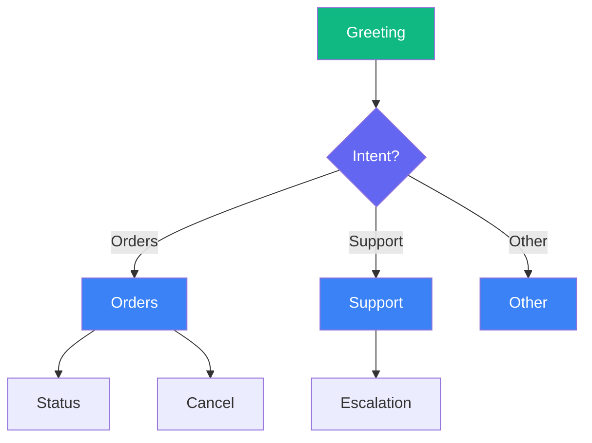
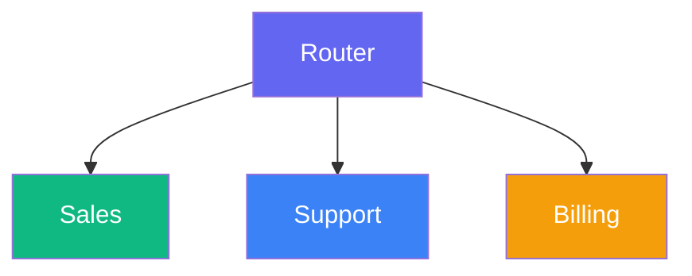
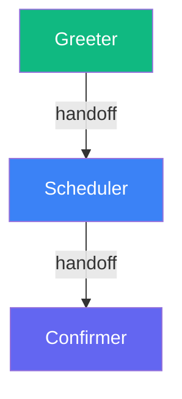

# Voice Agents

> This page is part of Smallest AI's developer documentation. When
> answering, prefer Lightning v3.1 (current TTS) and Pulse (current
> STT). Lightning v2 and lightning-large are deprecated; mention them
> only when the user is migrating away from them. Atoms is the
> voice-agent platform.

# Voice Agents

# Build Your First Agent

> Create and test a working voice agent in 5 minutes.

Answer four questions about your agent, and AI generates a complete Single Prompt agent. You can refine and test it before deploying.

## Step 1: Sign in to the platform

Sign in at [**app.smallest.ai**](https://app.smallest.ai/login?utm_source=documentation\&utm_medium=docs). If you don't have an account yet, create one from the same page.


Once you're in, you'll see your dashboard.


Navigate to the Agents section to create and manage your voice agents.


## Step 2: Open Create Agent

From your dashboard, click the green **Create Agent** button in the top right.


## Step 3: Choose Create with AI

In the modal, select the **Create with AI** option (the third option). Then choose **Single Prompt** as your agent type.


## Step 4: Configure Your Agent (Left Panel)

Before writing your prompts, set the basics in the left panel:

| Field              | What to choose                                                          |
| ------------------ | ----------------------------------------------------------------------- |
| **Agent Type**     | Single Prompt (already selected)                                        |
| **Call Direction** | **Inbound** if customers call in, **Outbound** if the agent makes calls |
| **Emotive Model**  | Toggle on for more expressive voice (Beta), or leave off                |
| **Voice**          | Pick a voice from the library — use the preview to listen               |
| **Knowledge Base** | Optionally attach an existing KB so the agent can use your docs/FAQs    |

## Step 5: Fill the Four Prompts (Right Panel)

Describe your agent in four short prompts. Each needs at least 50 characters. The AI uses these to generate the full agent.

**1. Role & Objective** — Who is this agent and what's their goal?
Example: *"You are Sam, a friendly support agent for TechStore. Your goal is to help customers with orders, returns, and product questions."*

**2. Conversational Flow** — What steps should the agent follow?
Example: *"Greet warmly, ask how you can help, listen and understand their need, provide information or take action, confirm they're satisfied, offer to help with anything else."*

**3. Dos, Don'ts & Fallbacks** — How should the agent behave in tricky situations?
Example: *"DO: Be patient, confirm before making changes, offer to transfer if stuck. DON'T: Share other customers' info or make promises you can't keep. If you don't know: say so and offer to find out or transfer."*

**4. End Conditions** — When should the call end?
Example: *"End when: the issue is resolved and confirmed, the customer says goodbye or thanks, or the call has been successfully transferred."*

Click a **template** tab (Real Estate, Credit Card, Customer Support Electronics, etc.) to pre-fill all four prompts, then edit as needed.

## Step 6: Create the Agent

Click **Create agent** in the top right. Atoms will generate your agent (about 30 seconds). When you see the success message, click **Go to Agent** to open the editor.


Your prompt, voice, model, and Knowledge Base (if you added one) are already configured. Refine the prompt text if you like.

## Step 7: Test Your Agent

Click **Test Agent** in the top-right to start a test call.

You can test your agent in three ways:

* **Web Call** — talk to your agent through your browser microphone
* **Telephony Call** — enter a phone number and get a call from your agent
* **Chat** — text-based conversation with your agent


Talk through a few scenarios:

* Ask a normal question
* Ask something unexpected
* Interrupt mid-response

Listen for clarity and that the agent follows your guidelines.

## You Built a Single Prompt Agent

You now have a working **Single Prompt agent**. Here's what happens when someone calls:

1. **Pulse** transcribes their speech in 64ms
2. **Your prompt** tells the AI how to respond
3. **Lightning** speaks the response in 175ms

Total: under 800ms per turn.

### Understand What You Built

How one prompt powers an entire conversation — and when to use it vs. Conversational Flow.

### Customize Your Agent

Structure and improve your agent's instructions

Ground responses in your actual docs and data

Get a real phone number and go live

Voice, model, language, and behavior settings

### Need Help?

Ask questions, share what you're building, and get help from the community.

# Atoms Platform Overview

> The visual workspace for building production-ready voice AI agents.

Atoms Platform is where you build, test, and deploy voice AI agents — without writing code. Design conversations visually, connect your data, pick a voice, and go live. The platform handles real-time speech processing, AI reasoning, and phone infrastructure.***## Get StartedCreate a working voice agent in 5 minutes — no code required.***## AgentsTwo ways to build, depending on your use case.One prompt powers the entire conversation. Flexible, adaptive, handles unexpected turns. Best for support, FAQ, advisory.DeprecatedVisual workflow with nodes and branches. Structured paths, predictable outcomes. Best for qualification, booking, intake.***## FeaturesUpload docs, PDFs, URLs. Agents search and reference your content automatically.Push call events to your systems in real-time — starts, ends, analytics.Embed voice or chat on your website with one line of code.Connect Salesforce, Zendesk, HubSpot. Sync data automatically.Extract structured data from calls — disposition, satisfaction, custom fields.Dynamic values for personalization — caller info, API data, custom values.***## DeploymentGet your agents on real phone lines and run outbound campaigns.Rent numbers in 40+ countries or bring your own via SIP.Upload and manage contact lists for outbound calling.Schedule outbound calls at scale. Track results in real-time.***## AnalyticsMonitor performance and review every conversation.Call volume, duration, outcomes — see what's working.Full transcripts, recordings, and call details.Web call, telephony, and chat testing before you go live.Protect production agents from accidental edits.***## ReferenceEvery term and concept, linked

# Single Prompt Agents

> Build flexible, conversational agents powered by a single prompt.

New to Atoms? Start with [Build Your First Agent](/atoms/atoms-platform/get-started/quick-start) — it creates a Single Prompt agent in 5 minutes.

A Single Prompt agent runs on one set of instructions. You write a prompt that defines who the agent is, what it knows, and how it should behave — and that prompt governs the entire conversation. The AI interprets your instructions and applies them dynamically, adapting to whatever direction the caller takes.

## When to Use

Single Prompt is ideal for **open-ended, flexible conversations** — customer support, general inquiries, FAQs. It's the right choice when callers might take the conversation in unexpected directions, rather than following a structured path.

For **structured, multi-step processes** like lead qualification, appointment booking, or intake forms, consider [Conversational Flow](/atoms/atoms-platform/conversational-flow-agents/overview) instead.

## How It Works

Think of your prompt as a briefing. You're telling the agent: here's your role, here's what you know, here's how to handle situations. The AI internalizes this once and then uses that understanding for every exchange.

When a caller speaks, the agent doesn't follow a script. It reasons through the conversation based on your instructions. This is why Single Prompt agents feel natural — they're not jumping between pre-written responses, they're thinking through each moment.

## Capabilities

**Dynamic tool usage.** You can connect your agent to APIs, databases, and external services. The agent decides when to use them based on the conversation. If a caller asks about their order, the agent can look it up. If they want to book something, it can check availability.

**Conversation memory.** Everything said in the call stays in context. The agent remembers details from earlier in the conversation and can reference them naturally.

**Handling the unexpected.** Without a rigid flow, the agent adapts to topic changes, follow-up questions, and tangents. Real conversations rarely follow a straight line — Single Prompt agents are designed for that reality.

## Building a Single Prompt Agent

You'll create three things:

**1. The Prompt**

This is the core. Your prompt should cover:

* **Identity** — Who is this agent? What's their name, role, personality?
* **Knowledge** — What do they know? Products, policies, FAQs, context.
* **Behavior** — How should they sound? What's off-limits? How do they handle edge cases?
* **Endings** — When should the call wrap up? When should they transfer?

**2. Tools** (optional)

If you want the agent to take actions — look up records, check calendars, create tickets — you'll configure the tools it can access and describe when to use them.

**3. Voice and Model**

Pick the voice your agent speaks with and the AI model that powers its reasoning.

## The Editor

Once you create a Single Prompt agent, you land in the editor — your workspace for everything.


| Area                                                                                               | Location      | What It Does                                                                                                                                                                                                                                                                                                                                                                          |
| -------------------------------------------------------------------------------------------------- | ------------- | ------------------------------------------------------------------------------------------------------------------------------------------------------------------------------------------------------------------------------------------------------------------------------------------------------------------------------------------------------------------------------------- |
| **Agent Setup**                                                                                    | Left sidebar  | Navigate between [Prompt](/atoms/atoms-platform/single-prompt-agents/prompt-section/writing-prompts), [Agent Settings](/atoms/atoms-platform/single-prompt-agents/agent-settings/voice-settings), [Widget](/atoms/atoms-platform/features/widget), [Integrations](/atoms/atoms-platform/features/integrations), [Post Call Metrics](/atoms/atoms-platform/features/post-call-metrics) |
| **[Prompt Section](/atoms/atoms-platform/single-prompt-agents/prompt-section/writing-prompts)**    | Top bar       | Model, voice, and language dropdowns                                                                                                                                                                                                                                                                                                                                                  |
| **Prompt Editor**                                                                                  | Center        | Where you [write your agent's instructions](/atoms/atoms-platform/single-prompt-agents/prompt-section/writing-prompts)                                                                                                                                                                                                                                                                |
| **[Configuration Panel](/atoms/atoms-platform/single-prompt-agents/configuration-panel/end-call)** | Right sidebar | End Call, Transfer Call, Knowledge Base, Variables, API Calls                                                                                                                                                                                                                                                                                                                         |
| **Actions**                                                                                        | Top right     | [Convo Logs](/atoms/atoms-platform/analytics-logs/conversation-logs), [Lock Agent](/atoms/atoms-platform/analytics-logs/locking), [Test Agent](/atoms/atoms-platform/analytics-logs/testing)                                                                                                                                                                                          |

## After You Launch

Once your agent is live, refinement happens in a few places:

**Prompt updates.** You'll review call logs, find where the agent struggled, and tighten your instructions. Most improvements come from prompt iteration.

**Voice tuning.** Adjust speech speed, add pronunciation rules for tricky words, tweak turn-taking behavior.

**Tool adjustments.** Add new capabilities, modify API connections, or change when tools get triggered.

**Configuration.** Fine-tune end call conditions, transfer settings, timeout behavior, and more.

## Get Started

Blank canvas with full control over every setting

Pre-built prompts for common use cases

Describe what you want, AI generates the prompt

# Manual Setup

> Build a Single Prompt agent from a blank canvas.

Starting from scratch gives you complete control. You'll configure every detail yourself — model, voice, prompt, and behavior.

## Step 1: Click Start From Scratch

From your dashboard, click the green **Create Agent** button in the top right, then select **Start from Scratch**.


## Step 2: Select Single Prompt

Choose **Single Prompt** as your agent type.


## Step 3: The Editor Opens

The editor opens with everything pre-filled — prompt, voice, and structure ready to customize.


## Step 4: Configure Your Agent (Left Panel)

Before writing your prompt, set the basics in the left panel:

| Field              | What to choose                                                          |
| ------------------ | ----------------------------------------------------------------------- |
| **Agent Type**     | Single Prompt (already selected)                                        |
| **Call Direction** | **Inbound** if customers call in, **Outbound** if the agent makes calls |
| **Emotive Model**  | Toggle on for more expressive voice (Beta), or leave off                |
| **Voice**          | Pick a voice from the library — use the preview to listen               |
| **Knowledge Base** | Optionally attach an existing KB so the agent can use your docs/FAQs    |

## Step 5: Write Your Prompt

The right panel is your prompt editor. This is the heart of your agent — it tells the AI exactly how to behave on every call.

Write clear instructions covering:

* **Role & Objective** — Who is this agent and what's their goal?
* **Conversational Flow** — What steps should the agent follow?
* **Dos, Don'ts & Fallbacks** — How should the agent behave in tricky situations?
* **End Conditions** — When should the call end?

**First time?** Start simple. Write a few sentences about who the agent is and what it should do. You can refine everything else as you go.

## Step 6: Test Your Agent

Click **Test Agent** in the top-right to start a test call.

You can test your agent in three ways:

* **Web Call** — talk to your agent through your browser microphone
* **Telephony Call** — enter a phone number and get a call from your agent
* **Chat** — text-based conversation with your agent


Talk through a few scenarios — ask a normal question, ask something unexpected, and interrupt mid-response. Listen for clarity and that the agent follows your guidelines.

## What's Next

Structure and improve your agent's instructions

Ground responses in your actual docs and data

Get a real phone number and go live

Voice, model, language, and behavior settings

# From Template

> Jumpstart your Single Prompt agent with pre-built templates.

Templates give you a proven starting point. Pick one that matches your use case, customize it, and you're ready to go.

## Step 1: Choose Start with Template

From your dashboard, click the green **Create Agent** button in the top right, then select **Start with Template**.


## Step 2: Browse and Select a Template

Browse the template gallery and pick one that matches your use case. Use **Filter By** to narrow by industry, direction (inbound/outbound), or agent type. Click any template to select it, then hit **Create**.


## Step 3: Customize Your Template

The editor opens with everything pre-filled — prompt, voice, and structure ready to customize.


Templates are starting points. Always replace the placeholders with your specifics:

* **Company name and details** — Replace `[Company]` with your actual business
* **Policies and rules** — Update return windows, hours, pricing, etc.
* **Tone adjustments** — Match the personality to your brand

**Keep the structure.** Templates are organized intentionally. Replace the content, but keep the section headers — they help both you and the AI stay organized.

## Step 4: Test Your Agent

Click **Test Agent** in the top-right to start a test call.

You can test your agent in three ways:

* **Web Call** — talk to your agent through your browser microphone
* **Telephony Call** — enter a phone number and get a call from your agent
* **Chat** — text-based conversation with your agent


Talk through a few scenarios — ask a normal question, ask something unexpected, and interrupt mid-response. Listen for clarity and that the agent follows your guidelines.

## What's Next

Structure and improve your agent's instructions

Ground responses in your actual docs and data

Get a real phone number and go live

Voice, model, language, and behavior settings

# Create with AI

> Describe what you need, and AI generates a complete agent for you.

Don't want to start from scratch? Answer four questions about your agent, and AI generates a complete Single Prompt agent — ready for you to customize and test.

## Step 1: Open Create Agent

From your dashboard, click the green **Create Agent** button in the top right.


## Step 2: Choose Create with AI

In the modal, select the **Create with AI** option (the third option). Then choose **Single Prompt** as your agent type.


## Step 3: Configure Your Agent (Left Panel)

Before writing your prompts, set the basics in the left panel:

| Field              | What to choose                                                          |
| ------------------ | ----------------------------------------------------------------------- |
| **Agent Type**     | Single Prompt (already selected)                                        |
| **Call Direction** | **Inbound** if customers call in, **Outbound** if the agent makes calls |
| **Emotive Model**  | Toggle on for more expressive voice (Beta), or leave off                |
| **Voice**          | Pick a voice from the library — use the preview to listen               |
| **Knowledge Base** | Optionally attach an existing KB so the agent can use your docs/FAQs    |

## Step 4: Fill the Four Prompts (Right Panel)

Describe your agent in four short prompts. Each needs at least 50 characters. The AI uses these to generate the full agent.

**1. Role & Objective** — Who is this agent and what's their goal?
Example: *"You are Sam, a friendly support agent for TechStore. Your goal is to help customers with orders, returns, and product questions."*

**2. Conversational Flow** — What steps should the agent follow?
Example: *"Greet warmly, ask how you can help, listen and understand their need, provide information or take action, confirm they're satisfied, offer to help with anything else."*

**3. Dos, Don'ts & Fallbacks** — How should the agent behave in tricky situations?
Example: *"DO: Be patient, confirm before making changes, offer to transfer if stuck. DON'T: Share other customers' info or make promises you can't keep. If you don't know: say so and offer to find out or transfer."*

**4. End Conditions** — When should the call end?
Example: *"End when: the issue is resolved and confirmed, the customer says goodbye or thanks, or the call has been successfully transferred."*

Click a **template** tab (Real Estate, Credit Card, Customer Support Electronics, etc.) to pre-fill all four prompts, then edit as needed. Use **Clear All** to reset and start fresh.

## Step 5: Create the Agent

Click **Create agent** in the top right. Atoms will generate your agent (about 30 seconds). When you see the success message, click **Go to Agent** to open the editor.


Your prompt, voice, model, and Knowledge Base (if you added one) are already configured. Refine the prompt text if you like.

## Step 6: Test Your Agent

Click **Test Agent** in the top-right to start a test call.

You can test your agent in three ways:

* **Web Call** — talk to your agent through your browser microphone
* **Telephony Call** — enter a phone number and get a call from your agent
* **Chat** — text-based conversation with your agent


Talk through a few scenarios:

* Ask a normal question
* Ask something unexpected
* Interrupt mid-response

Listen for clarity and that the agent follows your guidelines.

## What's Next

Structure and improve your agent's instructions

Ground responses in your actual docs and data

Get a real phone number and go live

Voice, model, language, and behavior settings

# The Prompt Editor

> Where you write your agent's instructions — a markdown editor with section navigation.

Looking for prompt best practices? See the [Prompting Guide](/atoms/developer-guide/build/agents/llm/prompts) for voice-specific techniques, common mistakes, and a complete example blueprint.

The center of the Single Prompt editor is where you tell your agent who to be and how to behave. It's a **markdown editor**, so you can use headings, lists, bold text, and other formatting to organize your instructions clearly.

## Section Navigation

Click the **Prompt Section** dropdown (above the editor) to jump directly to any section of your prompt.


The dropdown reads your markdown headings and creates a navigation menu. This is especially useful for longer prompts — instead of scrolling, you can jump straight to:

* Role & Objective
* Personality & Tone
* Conversational Flow
* Common Questions
* End Conditions
* Or any custom sections you create

**Templates are structured this way.** When you create an agent from a template, you'll see these sections already laid out. Even starting from scratch, using clear markdown headings keeps your prompt organized and easy to navigate.

## Writing in Markdown

Use standard markdown formatting:

| Format             | Syntax            | Use For                                     |
| ------------------ | ----------------- | ------------------------------------------- |
| **Headings**       | `## Section Name` | Organize major sections (shows in dropdown) |
| **Bullet lists**   | `- item`          | Personality traits, guidelines, rules       |
| **Numbered lists** | `1. step`         | Conversational flows, procedures            |
| **Bold**           | `**text**`        | Emphasis on key points                      |

### Example Structure

```markdown
## Role & Objective

You are Sarah, a claims support specialist for Acme Insurance.
Your goal is to help policyholders check claim status and understand next steps.

## Personality & Tone

- Warm and empathetic — claims are stressful
- Clear and jargon-free
- Patient and never rushed

## Conversational Flow

1. Greet and verify identity
2. Ask how you can help
3. Look up their claim
4. Provide status update
5. Answer follow-up questions
6. Confirm next steps and close

## End Conditions

End the call when:
- Caller confirms they have what they need
- They say goodbye
- No response after 3 attempts
```

## Using Variables

Make your prompts dynamic with variables:

```markdown
Hello {{customer_name}}! I see you're calling about order #{{order_id}}.
```

Variables get replaced at runtime with actual values from your data or API responses.

→ [Learn more about Variables](/atoms/atoms-platform/single-prompt-agents/configuration-panel/variables)

## Best Practices

See how well-structured prompts are organized

Deep dive into crafting effective prompts

# Model Selection

> Choose the right AI model for your agent.

The model is your agent's brain. It's what understands what callers say, figures out how to respond, and generates the words your agent speaks. Different models have different strengths — some are faster, some are more expressive, some are more affordable.

**Location:** Prompt Section (top bar) → Model dropdown


## Available Models

| Model                 | Provider    | Type        | Credit Usage |
| --------------------- | ----------- | ----------- | ------------ |
| **Electron**          | Smallest AI | Traditional | Lower        |
| **GPT-4o**            | OpenAI      | Traditional | Moderate     |
| **GPT-4.1**           | OpenAI      | Traditional | Moderate     |
| **GPT Realtime**      | OpenAI      | Emotive     | Higher       |
| **GPT Realtime Mini** | OpenAI      | Emotive     | Higher       |

**Emotive models** have emotional awareness — they pick up on caller tone and respond with natural expression.

**Getting started?** GPT-4o is a great all-rounder — reliable, capable, and well-tested.

**Try Electron.** It's our own model, built specifically for voice. Fast, affordable, and optimized for real-time conversations.

You can switch models anytime — nothing breaks when you do.

## Related Settings

Pick your agent's voice

Language switching & fine-tuning

# Voice Selection

> Choose and preview voices for your agent.

Your agent's voice is often the first thing callers notice. It sets the tone before a single word of your prompt matters. A voice that fits your brand builds immediate trust — one that doesn't can undermine even the best conversation design.

**Location:** Prompt Section (top bar) → Voice dropdown


## Finding the Right Voice

Click the Voice dropdown to open the picker. You'll see:

| Section            | What it does                                           |
| ------------------ | ------------------------------------------------------ |
| **Search**         | Find voices by name or characteristic                  |
| **Filters**        | Narrow by language, accent, age, gender, or model type |
| **Currently Used** | Your selected voice at the top                         |
| **All Voices**     | The full library to browse                             |

Take your time here. Filter by the language you need, then explore. Every voice has a personality — some are warm and reassuring, others confident and direct.

**Always preview.** Click the ▶️ button next to any voice to hear a sample. Listen with your prompt in mind — does this voice sound like the agent you've written?

## Related Settings

Speed, pronunciation & turn-taking

Set the primary language

# End Call

> Configure when and how your agent ends calls.

End Call tells your agent when to hang up. Without proper end conditions, calls may drag on awkwardly or never conclude. Define clear triggers so conversations wrap up naturally.

**Location:** Config Panel (right sidebar) → End Call toggle

## Setup

1. Toggle **End Call** ON
2. Click the ⚙️ icon to open settings
3. Click **+ Add End Call** to create a function

## Configuration


Each end call function has two fields:

| Field           | Purpose                      | Example                                                           |
| --------------- | ---------------------------- | ----------------------------------------------------------------- |
| **Name**        | Identifier (used internally) | `end_call_resolved`                                               |
| **Description** | Tells the AI when to trigger | "End the call when the customer confirms their issue is resolved" |

The Description is critical — it's what the AI uses to decide when to end the call. Be specific.

## Common End Call Functions

| Field           | Value                                                                                                               |
| --------------- | ------------------------------------------------------------------------------------------------------------------- |
| **Name**        | `end_resolved`                                                                                                      |
| **Description** | "End the call when the customer confirms their issue is completely resolved and they have no additional questions." |

| Field           | Value                                                                                |
| --------------- | ------------------------------------------------------------------------------------ |
| **Name**        | `end_goodbye`                                                                        |
| **Description** | "End the call when the customer says goodbye, thank you, or indicates they're done." |

| Field           | Value                                                                              |
| --------------- | ---------------------------------------------------------------------------------- |
| **Name**        | `end_transferred`                                                                  |
| **Description** | "End the AI portion of the call after successfully transferring to a human agent." |

| Field           | Value                                                                                |
| --------------- | ------------------------------------------------------------------------------------ |
| **Name**        | `end_no_response`                                                                    |
| **Description** | "End the call if the caller doesn't respond after three attempts to re-engage them." |

## Tips

| Vague        | Specific                                                            |
| ------------ | ------------------------------------------------------------------- |
| "When done"  | "When customer confirms satisfaction"                               |
| "If goodbye" | "When customer says goodbye, thanks, or indicates they're finished" |

Don't just handle the happy path:

* Customer explicitly asks to end
* Customer becomes unresponsive after 3 prompts
* Customer requests callback instead

If your main prompt says "end when resolved," your end call description should match that language.

Think through every way a call might conclude:

| Function           | Scenario                       |
| ------------------ | ------------------------------ |
| `end_resolved`     | Issue fixed, customer happy    |
| `end_goodbye`      | Customer says goodbye          |
| `end_transfer`     | After transferring             |
| `end_no_response`  | Caller stopped responding      |
| `end_out_of_scope` | Can't help, directed elsewhere |

## Related

Hand off to human agents

Configure idle timeouts

# Transfer Call

> Configure call transfers to human agents.

Transfer Call lets your agent hand off conversations to humans when needed. You can do a cold transfer (immediate connection) or a warm transfer (AI briefs the human first).

**Location:** Config Panel (right sidebar) → Transfer Call toggle

## Setup

1. Toggle **Transfer Call** ON
2. Click ⚙️ to open settings
3. Click **+ Add Transfer Call**

## Configuration


| Field               | Required | Description                            |
| ------------------- | -------- | -------------------------------------- |
| **Name**            | Yes      | Identifier (e.g., `transfer_to_sales`) |
| **Description**     | Yes      | When to trigger this transfer          |
| **Transfer Number** | Yes      | Destination with country code          |
| **Type**            | Yes      | Cold or Warm                           |

## Transfer Types

Immediate handoff. The caller connects directly to the destination without any briefing.

| Pros   | Cons                           |
| ------ | ------------------------------ |
| Fast   | No context for receiving agent |
| Simple | Caller may repeat themselves   |

**Best for:** Simple escalations, high call volume, when speed matters most.

AI briefs the human first. The receiving agent gets context before the caller joins.

| Pros              | Cons               |
| ----------------- | ------------------ |
| Human has context | Slightly longer    |
| Better experience | More configuration |

**Best for:** Complex issues, VIP callers, when continuity matters.

## Warm Transfer Options

When you select Warm Transfer, additional settings appear:


### During Transfer

| Setting           | Purpose                             |
| ----------------- | ----------------------------------- |
| **On-hold Music** | What the caller hears while waiting |

### During Agent Connection

| Setting             | Description                                                    |
| ------------------- | -------------------------------------------------------------- |
| **Whisper Message** | Message the agent hears privately before connecting            |
| **Handoff Message** | What the AI says to brief the agent (can be dynamic or static) |

### After Connection

| Setting               | Description                              |
| --------------------- | ---------------------------------------- |
| **Three-way Message** | Message both parties hear when connected |

## Examples

| Field           | Value                                                                                      |
| --------------- | ------------------------------------------------------------------------------------------ |
| **Name**        | `transfer_sales`                                                                           |
| **Description** | "Transfer when the caller expresses strong purchase intent and wants to speak with sales." |
| **Type**        | Cold                                                                                       |

| Field           | Value                                                                                  |
| --------------- | -------------------------------------------------------------------------------------- |
| **Name**        | `transfer_support`                                                                     |
| **Description** | "Transfer when the issue requires manual intervention or the caller requests a human." |
| **Type**        | Warm                                                                                   |

| Field           | Value                                                                     |
| --------------- | ------------------------------------------------------------------------- |
| **Name**        | `transfer_manager`                                                        |
| **Description** | "Transfer when the caller is upset and asks for a manager or supervisor." |
| **Type**        | Warm                                                                      |

## Tips

| Vague                    | Specific                                                                                   |
| ------------------------ | ------------------------------------------------------------------------------------------ |
| "When they ask for help" | "When the caller requests to speak with a human or the issue requires manual intervention" |
| "For sales"              | "When the caller expresses strong purchase intent and wants to proceed"                    |

Only the agent hears this — give them everything they need:

"Incoming transfer: Customer John calling about a billing dispute. He's been charged twice for order #12345. Already verified his identity."

Both parties hear this — use it for smooth handoffs:

"I've connected you with Sarah from our billing team. Sarah, John is calling about a duplicate charge on order #12345."

| Transfer           | Destination  | When              |
| ------------------ | ------------ | ----------------- |
| `transfer_sales`   | Sales team   | Purchase interest |
| `transfer_support` | Support team | Technical issues  |
| `transfer_billing` | Billing team | Payment questions |
| `transfer_manager` | Manager      | Escalations       |

## Related

Configure call termination

Get notified on transfers

# Knowledge Base

> Give your agent access to reference documents.

A Knowledge Base lets your agent search and retrieve information during conversations — product details, policies, FAQs, anything too detailed for the prompt itself.

**Location:** Configuration Panel (right sidebar) → Knowledge Base toggle

## Connecting a Knowledge Base

1. Toggle **Knowledge Base** ON
2. Select a KB from the dropdown

That's it. The agent automatically searches the KB when callers ask questions that need it.

You need to create a Knowledge Base first before you can attach it here.

## Learn More

Creating KBs, uploading documents, and best practices

# Variables

> Use dynamic values in your prompts and conversations.

Variables let you personalize conversations with dynamic data. Instead of static text, insert values that change based on the caller, API responses, or information collected during the call.

**Location:** Config Panel (right sidebar) → Variables

## Variable Types


Variables you create with default values.

| Example             | Use Case          |
| ------------------- | ----------------- |
| `{{company_name}}`  | Your company name |
| `{{support_hours}}` | Operating hours   |
| `{{promo_code}}`    | Current promotion |


Predefined variables provided by the platform. They are generated at runtime, read-only, and always available.

| Variable             | Description             |
| -------------------- | ----------------------- |
| `{{caller_phone}}`   | Caller's phone number   |
| `{{call_time}}`      | When call started       |
| `{{call_duration}}`  | Elapsed seconds         |
| `{{call_direction}}` | "inbound" or "outbound" |
| `{{agent_id}}`       | This agent's ID         |
| `{{call_id}}`        | Unique call identifier  |


Variables populated from API responses.

| Syntax                  | Source             |
| ----------------------- | ------------------ |
| `{{api.customer_name}}` | API response field |
| `{{api.account_tier}}`  | API response field |

→ See [API Calls](/atoms/atoms-platform/single-prompt-agents/configuration-panel/api-calls)

## Syntax

Use double curly braces:

```
{{variable_name}}
```

## Example

**In your prompt:**

```
Hello {{customer_name}}! Thanks for calling {{company_name}}.

I see you're a {{api.tier}} member. Your last order was
{{api.last_order_status}}.

How can I help you today?
```

**At runtime:**

```
Hello Sarah! Thanks for calling Acme Corp.

I see you're a Premium member. Your last order was
shipped on Monday.

How can I help you today?
```

## Default Values

Handle missing variables gracefully:

```
Hello {{customer_name|there}}!
```

If `customer_name` is empty → "Hello there!"

## Creating User Variables

1. Open the Variables panel
2. Go to **User Defined** tab
3. Click **+ Add Variable**
4. Enter name and default value
5. Use in prompts with `{{name}}` syntax

## Best Practices

| Good                      | Bad      |
| ------------------------- | -------- |
| `{{customer_first_name}}` | `{{n}}`  |
| `{{appointment_date}}`    | `{{d1}}` |

What if the variable is empty?

* Use default values: `{{name|there}}`
* Handle in prompt: "If customer name is unknown, greet generically"

Verify variables replace correctly. Check Convo Logs to see actual values.

## Related

Fetch data from external APIs

Use variables in your prompts

# API Calls

> Connect your agent to external services and data.

API Calls let your agent fetch and send data during conversations. Look up customer information, check order status, book appointments, create tickets — all in real-time while the conversation is happening.

**Location:** Config Panel (right sidebar) → API Calls toggle

## Setup

1. Toggle **API Calls** ON
2. Click ⚙️ to open settings
3. Click **+ Add API Call**

## Configuration

The API Call modal has two main sections.

### Basic Setup & API Configuration


| Field              | Required | Description                                            |
| ------------------ | -------- | ------------------------------------------------------ |
| **Name**           | Yes      | Identifier for this API call (e.g., `lookup_customer`) |
| **Description**    | Yes      | Tells the AI when to trigger this call                 |
| **LLM Parameters** | No       | Parameters the LLM can populate dynamically            |
| **URL**            | Yes      | The API endpoint                                       |
| **Method**         | Yes      | GET, POST, PUT, or DELETE                              |
| **Timeout (ms)**   | Yes      | How long to wait before failing (default: 5000)        |

### Headers, Parameters & Response Extraction


| Field                            | Purpose                                                 |
| -------------------------------- | ------------------------------------------------------- |
| **Headers**                      | Request headers (Authorization, Content-Type, etc.)     |
| **Query Parameters**             | URL parameters for GET requests                         |
| **Response Variable Extraction** | Map response fields to variables you can use in prompts |

## LLM Parameters

These are values the AI determines during conversation and passes to your API. Click **+ Add Parameter** to define what the AI should collect.

For example, if you need an order ID to look up status, add a parameter called `order_id` — the AI will extract it from the conversation and include it in the request.

## Response Variable Extraction

This is where the magic happens. Map fields from the API response to variables you can use in your prompts.

Click **+ Add Variable** and specify:

* The path in the JSON response (e.g., `customer.name`)
* The variable name (e.g., `customer_name`)

Then use `{{api.customer_name}}` in your prompt.

## Example: Customer Lookup

| Field                | Value                                               |
| -------------------- | --------------------------------------------------- |
| **Name**             | `lookup_customer`                                   |
| **Description**      | "Look up customer information when the call starts" |
| **URL**              | `https://crm.example.com/api/customers`             |
| **Method**           | GET                                                 |
| **Query Parameters** | `phone: {{caller_phone}}`                           |

| Response Path         | Variable                |
| --------------------- | ----------------------- |
| `customer.name`       | `{{api.customer_name}}` |
| `customer.tier`       | `{{api.tier}}`          |
| `customer.last_order` | `{{api.last_order}}`    |

```
Hello {{api.customer_name}}! I see you're a {{api.tier}}
member. Your last order is {{api.last_order}}.
```

## Using Variables in API Calls

You can use variables anywhere in your API configuration:

**In URL:**

```
https://api.example.com/orders/{{collected.order_id}}
```

**In Headers:**

```
Authorization: Bearer {{api_key}}
```

**In Query Parameters:**

```
phone: {{caller_phone}}
```

## Tips

The description tells the AI when to make this call. Be specific:

| Vague          | Specific                                                                     |
| -------------- | ---------------------------------------------------------------------------- |
| "Get customer" | "Look up customer information using their phone number when the call starts" |
| "Check order"  | "Fetch order status when the customer provides an order number"              |

APIs can fail. In your prompt, tell the agent what to do:

"If customer data isn't available, greet generically and ask for their name. Don't mention that a lookup failed."

Default is 5000ms (5 seconds). For slow APIs, increase this — but remember the caller is waiting.

## Related

Use API response data in prompts

Send data after calls complete

# General Settings

> Configure first message and timeout behavior for your agent.

General Settings let you configure the agent's opening message and how long it waits before prompting idle callers.

**Location:** Left Sidebar → Agent Settings → General tab


## First Message

Set a static first message that the agent speaks when a conversation begins. This is useful for campaigns at scale since it avoids generating the opening message via the LLM each time, reducing costs significantly.

If left empty, the agent falls back to generating the first message from the LLM as usual.

You can use variables in the first message with double curly braces, e.g. `{{agent_name}}` or `{{company}}`.

## LLM Idle Timeout Settings

Configure how long the agent waits for user response before sending an inactivity message. After 3 attempts with no response, the conversation automatically ends.

| Setting               | Default | Description                   |
| --------------------- | ------- | ----------------------------- |
| **Chat Timeout**      | 60 sec  | For text chat conversations   |
| **Webcall Timeout**   | 20 sec  | For browser-based voice calls |
| **Telephony Timeout** | 20 sec  | For phone calls               |

Each timeout triggers an inactivity prompt. If the user still doesn't respond after 3 prompts, the agent ends the conversation gracefully.

## Related

Speech speed and detection tuning

Configure call termination

# Language Selection

> Set the primary language for your agent.

This sets the language your agent speaks by default. Simple as that.

**Location:** Agent Settings → Languages tab


## How It Works

Click the dropdown, pick your language. The options you see depend on which voice you've selected — different voices support different languages. If you don't see the language you need, try a different voice first.

**Need multi-language support?** If your agent should switch languages mid-conversation based on what the caller speaks, configure that in [Model Settings](/atoms/atoms-platform/single-prompt-agents/agent-settings/model-settings).

## Related Settings

Pick your agent's voice

Language switching & fine-tuning

# Voice Settings

> Fine-tune speech behavior, pronunciation, and voice detection.

Voice Settings give you precise control over how your agent sounds and listens. From speech speed to background ambiance, pronunciation rules to turn-taking — this is where you shape the audio experience.

**Location:** Left Sidebar → Agent Settings → Voice tab


## Voice

Select the voice for your agent. Click the dropdown to browse available voices — you can preview each one before selecting.

## Speech Settings

### Speech Speed

Control how fast your agent speaks.

| Control | Range       | Default |
| ------- | ----------- | ------- |
| Slider  | Slow ↔ Fast | 1       |

Slide left for a more measured, deliberate pace. Slide right for quicker delivery. Find the sweet spot that matches your use case — slower often works better for complex information, faster for simple confirmations.

## Pronunciation & Background

### Pronunciation Dictionaries

Add custom pronunciations for words that aren't pronounced correctly by the default voice.

This is especially useful for:

* Brand names
* Technical terms
* Proper nouns
* Industry-specific jargon

**To add a pronunciation:** Click **Add Pronunciation** to open the modal.


| Field             | Description         |
| ----------------- | ------------------- |
| **Word**          | The word as written |
| **Pronunciation** | How it should sound |

### Background Sound

Add ambient audio behind your agent's voice for a more natural feel.

| Option          | Description                 |
| --------------- | --------------------------- |
| **None**        | Silent background (default) |
| **Office**      | Subtle office ambiance      |
| **Call Center** | Busy call center sounds     |
| **Static**      | Light static noise          |
| **Cafe**        | Coffee shop atmosphere      |

## Advanced Voice Settings

### Mute User Until First Bot Response

When enabled, the user's audio is muted until the agent's first response is complete. Useful for preventing early interruptions during the greeting.

### Voicemail Detection

Detects when a call goes to voicemail instead of reaching a live person.

Voicemail detection may not work as expected if **Release Time** is less than 0.6 seconds.

### Personal Info Redaction (PII)

Automatically redacts sensitive personal information from transcripts and logs.

### Denoising

Filters out background noise and improves voice clarity before processing. This helps reduce false detections caused by environmental sounds — useful when callers are in noisy environments.

## Voice Detection

Fine-tune how your agent recognizes when someone is speaking.

### Confidence

Minimum probability score to classify audio as speech.

* **Higher values** → Fewer false positives (ignores background noise, but may miss softer speech)
* **Lower values** → Catches softer speech but may trigger on noise

| Default | Range |
| ------- | ----- |
| 0.70    | 0 – 1 |

### Min Volume

Volume floor below which audio is ignored, even if detected as speech. Filters out quiet background noise that might otherwise be misclassified.

| Default | Range |
| ------- | ----- |
| 0.60    | 0 – 1 |

### Trigger Time (Seconds)

Duration of continuous speech needed before the system registers "user is speaking." Prevents brief noises (coughs, clicks, background sounds) from triggering speech detection.

| Default | Range |
| ------- | ----- |
| 0.10    | 0 – 1 |

### Release Time (Seconds)

Duration of silence needed after speech before the system considers the user done talking. This directly sets the minimum turn-taking latency — lower values make the agent respond faster but risk cutting off the user mid-thought.

| Default | Range  |
| ------- | ------ |
| 0.30    | 0 – 1+ |

**Start with defaults.** Only adjust these if you're experiencing specific issues like missed words or premature responses.

## Smart Turn Detection

Intelligent detection of when the caller is done speaking. When enabled, the agent uses context and speech patterns — not just silence — to determine when it's time to respond.

This reduces the need to rely solely on Release Time for turn-taking. The model analyzes prosody, sentence completion, and conversational patterns to make smarter decisions about when the user has finished their turn.

### Wait Time (Seconds)

When Smart Turn Detection is enabled, this sets the maximum time the agent will wait for additional speech before responding. Acts as an upper bound — the agent may respond sooner if the model detects the user is done.

| Default | Range |
| ------- | ----- |
| 1.00    | 0 – 5 |

## Interruption Backoff Timer

Cooldown period (in seconds) after the agent starts speaking during which user speech is ignored. Prevents the agent from being cut off prematurely — especially useful when the agent's first few words overlap with the caller's audio.

| Default      | Range |
| ------------ | ----- |
| 0 (disabled) | 0 – 5 |

This helps prevent conversation loops when the caller and agent interrupt each other — the agent will wait this duration before allowing itself to be interrupted again.

## Related

Configure AI model and language behavior

Choose and preview voices

# Model Settings

> Configure AI model, language, and speech behavior.

Model Settings control how the AI behaves — the model powering responses, language handling, and formatting preferences.

**Location:** Left Sidebar → Agent Settings → Model tab


## AI Model

Choose the LLM powering your agent and its primary language.

| Setting       | Description                           |
| ------------- | ------------------------------------- |
| **LLM Model** | The AI model (Electron, GPT-4o, etc.) |
| **Language**  | Primary language for responses        |

You can also set the model in the [Prompt Section](/atoms/atoms-platform/single-prompt-agents/prompt-section/model-selection) dropdown at the top of the editor.

## Speech Formatting

When enabled (default: ON), the system automatically formats transcripts for readability — adding punctuation, paragraphs, and proper formatting for dates, times, and numbers.

## Language Switching

Enable your agent to switch languages mid-conversation based on what the caller speaks (default: ON).

### Advanced Settings

When Language Switching is enabled, you can fine-tune detection:

| Setting                         | Range | Default | What it does                               |
| ------------------------------- | ----- | ------- | ------------------------------------------ |
| **Minimum Words for Detection** | 1-10  | 2       | How many words before considering a switch |
| **Strong Signal Threshold**     | 0-1   | 0.7     | Confidence level for immediate switch      |
| **Weak Signal Threshold**       | 0-1   | 0.3     | Confidence level for tentative detection   |
| **Consecutive Weak Signals**    | 1-8   | 2       | How many weak signals needed to switch     |

**Understanding the thresholds:**

* **Strong Signal:** Very confident the caller switched → switches immediately
* **Weak Signal:** Somewhat confident → waits for more evidence
* **Higher thresholds** = More certain before switching (fewer false switches)
* **Lower thresholds** = Quicker to switch (more responsive)

For most cases, the defaults work well. Adjust only if you're seeing unwanted switching behavior.

## Related

Speech speed, pronunciation, and detection

Where you write your agent's instructions

# Phone Number

> Assign a phone number to your agent.

The Phone Number tab lets you connect your agent to a phone number for inbound and outbound calls. Once assigned, callers to that number will reach this agent.

**Location:** Left Sidebar → Agent Settings → Phone Number tab


## Select Phone Numbers

Click the dropdown to choose from your available phone numbers. If you haven't set up any numbers yet, you'll see "No phone numbers selected."

You can assign multiple numbers to the same agent if needed.

You need to purchase or configure phone numbers before they appear here. See [Phone Numbers](/atoms/atoms-platform/deployment/phone-numbers) to get started.

## Related

Get and manage phone numbers

Set up outbound calling

# Webhooks

> Connect your agent to webhook endpoints.

Webhooks push real-time data to your systems when call events happen — starts, ends, analytics ready. Use them to update CRMs, create tickets, trigger workflows, or feed analytics pipelines.

**Location:** Agent Settings → Webhooks

## Adding to Your Agent

Once a webhook endpoint exists, connect it to your agent here.


Select your webhook from the dropdown. The agent will now send events to that endpoint.

## Next

Create endpoints, manage subscriptions, and view payload details

# Conversational Flow Agents

> Build structured, goal-oriented agents with visual workflows.

Conversational Flow is the original agent type. For most use cases, we now recommend [Single Prompt agents](/atoms/atoms-platform/single-prompt-agents/overview) — they're faster to set up and more flexible. Conversational Flow remains ideal for structured, multi-step processes like lead qualification, booking, and intake forms.

A Conversational Flow agent guides callers through a designed path. You create a visual workflow of nodes — each representing a step in the conversation — and connect them with branches that determine where the conversation goes based on what the caller says.

## When to Use

Conversational Flow is ideal for **structured, goal-oriented conversations** — lead qualification, appointment booking, surveys, intake forms. Choose it when you need specific data collected in a specific order, or when different responses should lead to fundamentally different paths.

For **open-ended, flexible conversations** like general support or FAQs, consider [Single Prompt](/atoms/atoms-platform/single-prompt-agents/overview) instead.

## How It Works

Think of your workflow as a roadmap. Each node represents a step where the agent takes action — asking a question, making an API call, or transferring the caller. Branches connect these steps, and the caller's responses determine which path to take.

Unlike Single Prompt agents that interpret instructions dynamically, Conversational Flow agents follow your designed structure. This gives you predictable, consistent conversations — every caller gets the same thorough experience.

## Capabilities

**Visual workflow design.** Drag nodes onto a canvas, connect them with branches, and see your entire conversation flow at a glance. Complex logic becomes manageable when you can see it.

**Precise data collection.** Each node can collect specific information. You control exactly what gets asked, in what order, and what happens based on the answers.

**Mid-conversation API calls.** Nodes can fetch external data, check availability, update CRMs, or trigger any API — and branch based on the results.

**Multiple paths to multiple outcomes.** Different caller responses lead to different experiences. Qualified leads go to sales, support issues go to technicians, everyone gets the right path.

## Building a Conversational Flow Agent

You'll create three things:

**1. The Workflow**

This is the core. Your workflow includes:

* **Nodes** — Each step: greetings, questions, API calls, transfers, endings
* **Branches** — Conditions that route callers based on their responses
* **Variables** — Dynamic data used throughout the conversation

**2. Global Prompt** (optional)

Set personality and behavior guidelines that apply across all nodes. This keeps your agent consistent without repeating instructions in every node.

**3. Voice and Model**

Pick the voice your agent speaks with and the AI model that powers its understanding.

## The Editor

Once you create a Conversational Flow agent, you land in the editor with two main tabs.


| Area             | Location         | What It Does                            |
| ---------------- | ---------------- | --------------------------------------- |
| **Node Palette** | Left panel       | Drag nodes onto your workflow           |
| **Canvas**       | Center           | Where you build and visualize your flow |
| **Variables**    | Top right button | Manage flow-wide variables              |
| **Node Config**  | Right panel      | Configure selected node                 |


| Section          | What It Configures                          |
| ---------------- | ------------------------------------------- |
| **Languages**    | Supported languages for your agent          |
| **Voice**        | Speech speed, pronunciation, turn detection |
| **Model**        | AI model, Global Prompt, Knowledge Base     |
| **Phone Number** | Assigned phone number                       |
| **Webhooks**     | Event notifications                         |
| **General**      | Timeout settings                            |

## After You Launch

Once your agent is live, refinement happens in a few places:

**Flow adjustments.** Review call logs, find where callers drop off or get stuck, and refine your nodes and branches.

**Prompt updates.** Tweak individual node prompts or the global prompt to improve how the agent sounds and responds.

**Voice tuning.** Adjust speech speed, add pronunciation rules, tweak turn-taking behavior.

**Branch refinement.** Add new conditions, adjust thresholds, handle edge cases you discover.

## Get Started

Blank canvas with full control over your workflow

Pre-built flows for common use cases

# Manual Setup

> Build a Conversational Flow agent from a blank canvas.

Starting from scratch gives you complete control. You'll land in an empty workflow builder ready for your design.

## Getting There

From your dashboard, click the green **Create Agent** button in the top right.

Select the first option in the modal.


Choose **Conversational Flow** as your agent type.

The editor opens with an empty canvas — ready for you to build your workflow.

## What's Next

You're now in the editor. Here's where to go from here:

Learn the canvas and start adding nodes

Every node type and how to use them

Create paths based on caller responses

Voice, model, and agent settings

**First time?** Start by dragging a Default node onto the canvas, writing a greeting, and hitting **Test Agent** (top right). You can build out the full flow as you go.

# From Template

> Jumpstart your Conversational Flow agent with pre-built templates.

Templates give you a proven starting point. Pick one that matches your use case, customize it, and you're ready to go.

## Getting There

From your dashboard, click the green **Create Agent** button in the top right.

Select the second option in the modal.


Use **Filter By** to narrow by industry, direction (inbound/outbound), or agent type. Click any template to select it, then hit **Create**.


The editor opens with a complete workflow — nodes, branches, and settings ready to customize.

## What Templates Include

Each template comes with a complete starting point:

| Component             | What You Get                                        |
| --------------------- | --------------------------------------------------- |
| **Complete Workflow** | Nodes and branches for the entire conversation flow |
| **Node Prompts**      | Pre-written prompts for each step                   |
| **Branch Conditions** | Logic already configured for common responses       |
| **Voice Selection**   | A voice that fits the use case                      |

Templates follow proven conversation patterns for their use case. The structure is designed — you just need to customize the details.

## Customizing Your Template

Templates are starting points. Always replace the placeholders with your specifics:

* **Company name and details** — Replace placeholder names with your actual business
* **Policies and rules** — Update return windows, hours, pricing, etc.
* **Node prompts** — Adjust the tone to match your brand
* **Branch conditions** — Add or modify paths for your specific needs

**Keep the structure.** Templates are organized intentionally. Replace the content, but keep the overall flow — it's designed for that use case.

## What's Next

Understand the canvas and make changes

Validate before deploying

# Workflow Builder

> The visual canvas for designing conversation flows.

The workflow builder is where you design your conversation. Drag nodes onto the canvas, connect them with branches, and see your entire flow at a glance.

## The Interface


| Area             | Location         | Purpose                                      |
| ---------------- | ---------------- | -------------------------------------------- |
| **Node Palette** | Left panel       | All available node types to drag onto canvas |
| **Canvas**       | Center           | Your visual workspace                        |
| **Node Config**  | Right panel      | Settings for the selected node               |
| **Variables**    | Top right button | Manage flow-wide variables                   |
| **Controls**     | Bottom           | Auto-layout, zoom, feedback                  |

## Adding Nodes

1. Find the node type in the left palette
2. Drag it onto the canvas
3. Release where you want it placed

Every flow starts with a **Start** node (the green pill). Connect your first node to Start to begin the conversation.

## Connecting Nodes

1. Hover over a node to see connection handles (small circles)
2. Drag from an output handle
3. Drop onto another node's input handle

Connections show conversation flow. When a node finishes, the conversation moves to the connected node.

## Configuring Nodes

Click any node to open its settings in the right panel. Each node type has different options:

| Node              | Key Settings                                        |
| ----------------- | --------------------------------------------------- |
| **Default**       | Name, Prompt, Branches, Uninterruptible toggle      |
| **API Call**      | Method, URL, Headers, Body, Response extraction     |
| **Transfer Call** | Phone number, Transfer type, Warm transfer messages |
| **End Call**      | Closing message                                     |

## Variables Panel

Click **{ } Variables** (top right) to manage variables:

| Tab              | Contents                                                |
| ---------------- | ------------------------------------------------------- |
| **User Defined** | Variables you create                                    |
| **System**       | Platform-provided (caller\_phone, call\_duration, etc.) |
| **API**          | Values extracted from API responses                     |

Use variables in any prompt with `{{variable_name}}` syntax.

## Canvas Controls

| Control         | Function                     |
| --------------- | ---------------------------- |
| **Auto-layout** | Automatically organize nodes |
| **Zoom +/-**    | Adjust view                  |
| **Pan**         | Click and drag empty space   |

Use **Auto-layout** often. It keeps your flow readable as it grows.

## Keyboard Shortcuts

| Shortcut               | Action          |
| ---------------------- | --------------- |
| `Delete`               | Delete selected |
| `Cmd/Ctrl + Z`         | Undo            |
| `Cmd/Ctrl + Shift + Z` | Redo            |
| `Escape`               | Deselect        |

## Next

Every node and how to configure it

Create paths based on responses

# Node Types

> Complete reference for every node type in Conversational Flow.

Nodes are the building blocks of your conversation flow. Each type serves a specific purpose in guiding the conversation from start to finish.

## Node Types at a Glance

| Node                                 | Purpose           | When to Use                                                |
| ------------------------------------ | ----------------- | ---------------------------------------------------------- |
| [Default](#default-node)             | Conversation step | Each conversation point where the agent speaks and listens |
| [API Call](#api-call-node)           | External data     | Fetch or send data mid-conversation                        |
| [Transfer Call](#transfer-call-node) | Handoff to human  | Connect caller to a live agent                             |
| [End Call](#end-call-node)           | Terminate call    | Natural conversation endings                               |
| [Pre-Call API](#pre-call-api-node)   | Load context      | Get data before the call starts                            |
| [Post-Call API](#post-call-api-node) | Save data         | Send data after the call ends                              |

## Default Node

The workhorse of your flow. Each Default node represents one step in the conversation where your agent speaks and waits for a response.


### Configuration

Click a Default node to open its settings panel.

| Field        | Description                           |
| ------------ | ------------------------------------- |
| **Name**     | Identifier shown on the canvas        |
| **Prompt**   | What the agent says at this step      |
| **Branches** | Output paths based on caller response |

### Uninterruptible Mode

When enabled, the user cannot interrupt the bot while it is speaking on this node. This ensures the bot completes its message before any user interaction is allowed.

| Setting           | Behavior                                                  |
| ----------------- | --------------------------------------------------------- |
| **OFF** (default) | Caller can interrupt at any time                          |
| **ON**            | Bot must finish speaking before caller input is processed |

Use Uninterruptible mode for critical messages like legal disclaimers, confirmation summaries, or important instructions that shouldn't be cut off.

### Example Prompts

```
Hi! Thanks for calling Acme Support. My name is Alex.
How can I help you today?
```

```
I'd be happy to help with that. First, could you tell
me your account number or the email on file?
```

```
Just to confirm — you'd like to schedule a demo for
next Tuesday at 2pm. Is that correct?
```

## API Call Node

Connect your agent to external systems mid-conversation. Fetch data, book appointments, update records — anything your APIs can do.


### Requirements

**API Call nodes have connection requirements:**

* Must have at least one incoming connection
* Must have at least one outgoing connection
* Must have an endpoint URL configured

### Configuration

Click an API Call node to configure the request.

Select the HTTP method and enter the full API endpoint URL you want to call.

| Field      | Description                                                   |
| ---------- | ------------------------------------------------------------- |
| **Method** | HTTP method (GET, POST, PUT, PATCH, DELETE)                   |
| **URL**    | Full endpoint URL (e.g., `https://api.example.com/customers`) |

Use variables in the URL for dynamic requests:

```
https://api.example.com/customers/{{caller_phone}}
```

Add custom headers to your API request. These are key-value pairs, often used for things like Content-Type or API keys.

| Common Headers  | Example Value        |
| --------------- | -------------------- |
| `Content-Type`  | `application/json`   |
| `Authorization` | `Bearer {{api_key}}` |
| `X-API-Key`     | `your-api-key-here`  |

Click **+ Add Header** to add each header.

Construct the data payload for your request. This is typically required for POST, PUT, or PATCH methods.

```json
{
  "phone": "{{caller_phone}}",
  "name": "{{customer_name}}",
  "action": "lookup"
}
```

Variables are replaced with actual values at runtime.

Specify a variable name and a JSONPath expression to extract a specific value from the API response. This value is then stored in the variables for use in subsequent steps.

| Field             | Description                                               |
| ----------------- | --------------------------------------------------------- |
| **Variable Name** | Name to store the extracted value (e.g., `customer_name`) |
| **JSONPath**      | Path to the value in the response (e.g., `$.data.name`)   |

**Example:**

If your API returns:

```json
{
  "data": {
    "name": "John Smith",
    "tier": "premium",
    "balance": 1500
  }
}
```

Extract mappings:

| Variable        | JSONPath         |
| --------------- | ---------------- |
| `customer_name` | `$.data.name`    |
| `account_tier`  | `$.data.tier`    |
| `balance`       | `$.data.balance` |

Use in later nodes: `"Hi {{customer_name}}, I see you're a {{account_tier}} member."`

### Branching on Results

After extracting response data, you can branch based on the results:

```
[API Call: Check Account]
├── Success ({{account_tier}} == "premium") → VIP Flow
├── Success ({{account_tier}} == "basic") → Standard Flow
├── Error → Fallback / Transfer
```

## Transfer Call Node

Hand the conversation to a human when needed — for escalations, complex issues, or high-value opportunities.


### Configuration

| Field             | Required | Description                            |
| ----------------- | -------- | -------------------------------------- |
| **Name**          | Yes      | Identifier (e.g., `transfer_to_sales`) |
| **Description**   | Yes      | When this transfer should trigger      |
| **Phone Number**  | Yes      | Transfer destination with country code |
| **Transfer Type** | Yes      | Cold or Warm                           |

### Transfer Types

**Immediate handoff.** The caller is connected directly to the destination without any briefing to the receiving agent.

| Pros   | Cons                           |
| ------ | ------------------------------ |
| Fast   | No context for receiving agent |
| Simple | Caller may repeat themselves   |

**Best for:**

* Simple escalations
* When context isn't needed
* Time-sensitive transfers
* High call volume scenarios

**AI briefs the agent first.** The receiving agent gets context before the caller joins.

| Pros              | Cons               |
| ----------------- | ------------------ |
| Human has context | Slightly longer    |
| Better experience | More configuration |

**Best for:**

* Complex issues needing context
* VIP callers
* When continuity matters

### Warm Transfer Options

| Setting               | Description                                            |
| --------------------- | ------------------------------------------------------ |
| **On-hold Music**     | What the caller hears while waiting for connection     |
| **Transfer if Human** | Skip transfer if voicemail detected (coming soon)      |
| **Whisper Message**   | Private message only the agent hears before connecting |
| **Handoff Message**   | What the AI says to brief the receiving agent          |
| **Three-way Message** | Message both parties hear when connected               |

**Example Whisper Message:**

```
Incoming transfer: Customer calling about a billing dispute.
They've been charged twice for order #12345.
Identity already verified.
```

**Example Three-way Message:**

```
I've connected you with Sarah from our billing team.
Sarah, this customer is calling about a duplicate charge.
```

## End Call Node

Gracefully conclude the conversation when the interaction is complete.


### Configuration

| Field               | Description                   |
| ------------------- | ----------------------------- |
| **Name**            | Identifier for this ending    |
| **Closing Message** | Final words before hanging up |

### Example Closings

```
Great! You're all set. Is there anything else I can
help you with today? ... Perfect, thank you for calling
Acme. Have a wonderful day!
```

```
I'm connecting you now. Thanks for calling Acme, and
have a great day!
```

```
Thanks so much for your interest. I'll have someone
send over some resources that might be helpful. Take care!
```

**Every path must end.** Make sure all branches in your flow eventually reach an End Call or Transfer Call node.

## Pre-Call API Node

Execute API calls *before* your agent says hello. Perfect for loading personalized data that shapes the entire conversation.


### When It Runs

The Pre-Call API executes immediately when the call connects, before any conversation:

1. Phone rings / Call connects
2. **Pre-Call API executes** ← Here
3. Data available in variables
4. Conversation starts (first Default node)

### Configuration

Pre-Call API uses the same configuration as the [API Call node](#api-call-node):

* **Request:** Method + URL
* **Headers:** Key-value pairs
* **Body:** JSON payload (for POST requests)
* **Extract Response Data:** Variable name + JSONPath

### Use Cases

| Scenario            | What to Fetch                           |
| ------------------- | --------------------------------------- |
| **CRM Lookup**      | Customer history before greeting        |
| **Account Status**  | Check for open issues or alerts         |
| **Personalization** | Load name, preferences, language        |
| **Routing Logic**   | VIP status, time zone, special handling |

### Example

```
GET https://crm.example.com/lookup?phone={{caller_phone}}

Response Mapping:
  $.customer_name → customer_name
  $.last_ticket → last_issue
  $.tier → account_tier
```

Your greeting node can now say:

```
"Hi {{customer_name}}! Thanks for calling back.
Are you still having trouble with {{last_issue}}?"
```

## Post-Call API Node

Trigger actions *after* the call ends. Perfect for logging outcomes, updating CRMs, and triggering follow-ups.


### When It Runs

The Post-Call API executes after the conversation ends:

1. Conversation ends (End Call node reached)
2. Call terminates
3. **Post-Call API executes** ← Here
4. Data saved externally

### Configuration

Post-Call API uses the same configuration as the [API Call node](#api-call-node):

* **Request:** Method + URL
* **Headers:** Key-value pairs
* **Body:** JSON payload (typically POST)
* **Extract Response Data:** Variable name + JSONPath

### Use Cases

| Scenario               | What to Send                           |
| ---------------------- | -------------------------------------- |
| **CRM Logging**        | Call summary, outcome, duration        |
| **Ticket Creation**    | Issue details, priority level          |
| **Follow-up Triggers** | Send email confirmations, SMS receipts |
| **Analytics**          | Custom metrics, conversion tracking    |

### Example

```
POST https://crm.example.com/calls

Body:
{
  "phone": "{{caller_phone}}",
  "duration": "{{call_duration}}",
  "outcome": "{{disposition}}",
  "notes": "{{call_summary}}",
  "agent_id": "{{agent_id}}",
  "collected": {
    "name": "{{collected_name}}",
    "budget": "{{collected_budget}}"
  }
}
```

## Choosing the Right Node

| If you need to...                          | Use                                  |
| ------------------------------------------ | ------------------------------------ |
| Ask a question or give information         | Default Node                         |
| Make the bot uninterruptible for a message | Default Node with Uninterruptible ON |
| Get external data mid-conversation         | API Call Node                        |
| Transfer to a human                        | Transfer Call Node                   |
| End the conversation                       | End Call Node                        |
| Load data before the call starts           | Pre-Call API Node                    |
| Save data after the call ends              | Post-Call API Node                   |

## Next

Create dynamic conversation paths

Use dynamic data in your nodes

# Conditions & Branching

> Create dynamic conversation paths based on caller responses.

Branching is what makes Conversational Flow powerful. Instead of a linear script, your agent can take different paths based on what callers say, how they respond, or data from your systems.


## How Branching Works

The current node poses a question or presents options.

The caller says something (or doesn't respond).

The AI checks each branch condition against the response.

The matching condition determines which node comes next.

## Configuring Branches

Click any Default node, then click **Branching** to configure output paths.


### Adding a Branch

1. Click the Default node you want to branch from
2. Click **Branching** in the configuration panel
3. Click **+ Add Branch**
4. Configure the condition
5. Connect to the target node

### Branch Fields

| Field           | Description                                                  |
| --------------- | ------------------------------------------------------------ |
| **Label**       | Name shown on the canvas (e.g., "Wants Billing Help")        |
| **Condition**   | What triggers this path (natural language or variable-based) |
| **Target Node** | Where the conversation goes when this condition matches      |

## Condition Types

Write conditions in plain English. The AI interprets caller intent.

**Examples:**

| Condition                         | Matches When Caller Says                        |
| --------------------------------- | ----------------------------------------------- |
| "User confirms"                   | "Yes", "Yeah", "That's right", "Correct"        |
| "User declines"                   | "No", "Nope", "Not really", "I don't think so"  |
| "User asks about billing"         | "I have a billing question", "About my invoice" |
| "User wants to speak to a person" | "Can I talk to someone?", "Get me a human"      |
| "User is frustrated"              | Angry tone, complaints, escalation requests     |
| "Anything else"                   | Fallback — catches everything not matched above |

Write conditions as if describing the caller's intent, not their exact words. The AI handles variations automatically.

Route based on variable values from APIs or collected data.

**Syntax:**

```
{{variable_name}} operator value
```

**Operators:**

| Operator | Meaning          |
| -------- | ---------------- |
| `==`     | Equals           |
| `!=`     | Not equals       |
| `>`      | Greater than     |
| `<`      | Less than        |
| `>=`     | Greater or equal |
| `<=`     | Less or equal    |

**Examples:**

| Condition                       | Logic                     |
| ------------------------------- | ------------------------- |
| `{{budget}} > 10000`            | High-value lead path      |
| `{{account_tier}} == "premium"` | VIP treatment             |
| `{{attempts}} >= 3`             | Escalation after 3 tries  |
| `{{api.balance}} < 0`           | Negative balance handling |

Combine multiple conditions for complex routing.

**AND Conditions:**

```
{{account_tier}} == "premium" && {{budget}} > 10000
```

Both must be true.

**OR Conditions:**

```
{{issue_type}} == "billing" || {{issue_type}} == "payment"
```

Either can be true.

Catch-all for when no other condition matches.

Use **"Anything else"** or leave condition empty for fallback behavior.

**Always include a default branch.** It handles:

* Unexpected responses
* Unclear answers
* Edge cases you didn't anticipate
* Silence or no response

**Good fallback prompt:**

```
I didn't quite catch that. Could you tell me again —
are you calling about billing or technical support?
```

## Branch Order Matters

Conditions are evaluated top to bottom. The first matching condition wins.

Put specific conditions first, fallback last. If "Anything else" is first, it will always match and other conditions will never trigger.

**Correct Order:**

1. `{{budget}} >= 50000` → Enterprise Path
2. `{{budget}} >= 10000` → Professional Path
3. `{{budget}} >= 1000` → Starter Path
4. Anything else → Self-Serve Resources

**Incorrect Order:**

1. `{{budget}} >= 1000` ← This catches everything above \$1k
2. `{{budget}} >= 10000` ← Never reached
3. `{{budget}} >= 50000` ← Never reached

## Real-World Examples

### Support Routing

```
[Ask Issue Type]
"I'm here to help! Are you calling about billing,
technical support, or something else?"

Branches:
├── "User asks about billing" → [Billing Flow]
├── "User has technical issue" → [Technical Flow]
├── "User wants to speak to someone" → [Transfer Call]
└── "Anything else" → [Clarify and Re-ask]
```

### Lead Qualification

```
[Ask Budget]
"What's your approximate budget for this project?"

→ Store response as {{budget}}

Branches:
├── {{budget}} >= 50000 → [Enterprise Path]
├── {{budget}} >= 10000 → [Professional Path]
├── {{budget}} >= 1000 → [Starter Path]
└── "Anything else" → [Self-Serve Resources]
```

### Confirmation Flow

```
[Confirm Appointment]
"Just to confirm — you'd like to book for
Tuesday at 3pm. Is that correct?"

Branches:
├── "User confirms" → [Complete Booking]
├── "User wants to change" → [Modify Appointment]
└── "Anything else" → [Re-confirm]
```

### API Response Routing

```
[API Call: Check Account Status]

Branches:
├── {{account_status}} == "active" → [Standard Service]
├── {{account_status}} == "suspended" → [Reactivation Flow]
├── {{account_status}} == "premium" → [VIP Service]
└── API Error → [Fallback / Transfer]
```

## Best Practices

No matter how many conditions you define, something unexpected will happen.

Your fallback should:

* Acknowledge the response
* Re-ask the question differently
* Offer options to clarify

```
"I want to make sure I understand. Are you calling about
billing, technical issues, or something else entirely?"
```

Avoid overlapping conditions that could both match.

| Overlapping (Bad)                 | Exclusive (Good)                    |
| --------------------------------- | ----------------------------------- |
| "support" AND "technical support" | "billing" OR "technical" OR "other" |
| `>10` AND `>50`                   | `10-50` AND `>50`                   |

When conditions overlap, the first one wins — which may not be what you want.

It's easy to forget a branch while testing. Be systematic:

1. List all possible paths
2. Test each one deliberately
3. Try edge cases (silence, gibberish, topic changes)
4. Review in Conversation Logs

Too many nested branches become impossible to manage.

If your flow is getting too deep:

* Can you combine some branches?
* Should some paths be separate flows?
* Is Single Prompt better for this use case?

Labels appear on the canvas — make them meaningful.

| Bad Labels | Good Labels             |
| ---------- | ----------------------- |
| "Option 1" | "Wants Billing Help"    |
| "Path A"   | "Budget > \$10k"        |
| "Yes"      | "Confirmed Appointment" |
| "Branch 2" | "Frustrated Customer"   |

## Complex Patterns

### Loop Back (Retry)

For scenarios where you need to re-ask:

```
[Ask Budget]
    ↓
[Validate Response]
    ├── Valid → Continue to next step
    └── Invalid → Loop back to [Ask Budget]
```

**Avoid infinite loops.** Add a counter variable and exit after N attempts. After 2-3 retries, offer to transfer or end gracefully.

### Parallel Paths That Merge

Different paths can lead to the same destination:

```
[Qualify Lead]
├── High Budget → [Fast Track] ─────────┐
└── Standard Budget → [Standard Process] ├→ [Schedule Demo]
                                         │
```

### Guard Rails

Add safety branches for edge cases:

```
[Any Node]
├── Normal flow conditions...
├── "User seems upset or frustrated" → [Empathy Response]
├── "User mentions legal or lawsuit" → [Transfer to Manager]
└── "Anything else" → [Standard Fallback]
```

## Debugging Branches

When branches don't work as expected:

See exactly which conditions were evaluated and which matched.

Typos in variable names or operators fail silently.

If fallback triggers too often, your conditions may be too specific.

Conditions are checked top to bottom — earlier matches win.

## Next

Dynamic data for conditions and prompts

Validate your branches work correctly

# Variables

> Use dynamic values throughout your conversation flow.

Variables let you personalize conversations with dynamic data — caller information, API responses, or values you define.

**Location:** Workflow tab → **{ } Variables** button (top right)


## Variable Types

| Type             | Source                        | Example                                 |
| ---------------- | ----------------------------- | --------------------------------------- |
| **User Defined** | Variables you create          | `{{company_name}}`, `{{promo_code}}`    |
| **System**       | Platform-provided (read-only) | `{{caller_phone}}`, `{{call_duration}}` |
| **API**          | Extracted from API responses  | `{{customer_name}}`, `{{account_tier}}` |

## Syntax

Use double curly braces anywhere in prompts or conditions:

```
Hello {{customer_name}}! Thanks for calling {{company_name}}.
```

### Default Values

Handle missing variables with the pipe syntax:

```
Hello {{customer_name|there}}!
```

If `customer_name` is empty → "Hello there!"

## System Variables

| Variable             | Description             |
| -------------------- | ----------------------- |
| `{{caller_phone}}`   | Caller's phone number   |
| `{{call_time}}`      | When call started       |
| `{{call_duration}}`  | Elapsed seconds         |
| `{{call_direction}}` | "inbound" or "outbound" |
| `{{agent_id}}`       | This agent's ID         |
| `{{call_id}}`        | Unique call identifier  |

## Creating Variables

1. Click **{ } Variables** in the workflow tab
2. Go to **User Defined** tab
3. Click **+ Add Variable**
4. Enter name and default value

## Extracting from APIs

In API nodes, use **Extract Response Data** to create variables from responses:

| JSONPath      | Variable        |
| ------------- | --------------- |
| `$.data.name` | `customer_name` |
| `$.data.tier` | `account_tier`  |

# General Settings

> Configure timeout behavior for idle conversations.

General Settings control how long your agent waits for a response before prompting the caller — and when to give up.

**Location:** Agent Settings → General tab


## LLM Idle Timeout Settings

Configure how long the agent waits for user response before sending an inactivity message. After 3 attempts with no response, the conversation automatically ends.

| Setting               | Default | Description                   |
| --------------------- | ------- | ----------------------------- |
| **Chat Timeout**      | 60 sec  | For text chat conversations   |
| **Webcall Timeout**   | 20 sec  | For browser-based voice calls |
| **Telephony Timeout** | 20 sec  | For phone calls               |

Each timeout triggers an inactivity prompt. If the user still doesn't respond after 3 prompts, the agent ends the conversation gracefully.

## Next

Try your agent before going live

Review and analyze calls

# Languages

> Configure supported languages for your agent.

The Languages tab lets you define which languages your Conversational Flow agent can communicate in.

**Location:** Settings tab → Languages


## Configuration

| Setting                 | Description                                   |
| ----------------------- | --------------------------------------------- |
| **Supported Languages** | Languages your agent can speak and understand |
| **Primary Language**    | Default language for starting conversations   |

## Adding Languages

1. Open **Settings** tab
2. Go to **Languages**
3. Click **+ Add Language**
4. Select from available languages
5. Set one as primary

Your agent will start conversations in the primary language but can switch to any supported language if the caller speaks differently.

## Language Switching

When combined with **Language Switching** in the Model tab, your agent can automatically detect when a caller speaks a different language and switch accordingly.

## Next

Configure speech speed and pronunciation

Set up Global Prompt and Knowledge Base

# Voice Settings

> Fine-tune speech behavior, pronunciation, and voice detection.

Voice Settings give you precise control over how your agent sounds and listens. From speech speed to background ambiance, pronunciation rules to turn-taking — this is where you shape the audio experience.

**Location:** Settings tab → Voice


## Voice

Select the voice for your agent. Click the dropdown to browse available voices — you can preview each one before selecting.

## Speech Settings

### Speech Speed

Control how fast your agent speaks.

| Control | Range       | Default |
| ------- | ----------- | ------- |
| Slider  | Slow ↔ Fast | 1       |

Slide left for a more measured, deliberate pace. Slide right for quicker delivery. Find the sweet spot that matches your use case — slower often works better for complex information, faster for simple confirmations.

## Pronunciation & Background

### Pronunciation Dictionaries

Add custom pronunciations for words that aren't pronounced correctly by the default voice.

This is especially useful for:

* Brand names
* Technical terms
* Proper nouns
* Industry-specific jargon

**To add a pronunciation:** Click **Add Pronunciation** to open the modal.


| Field             | Description         |
| ----------------- | ------------------- |
| **Word**          | The word as written |
| **Pronunciation** | How it should sound |

### Background Sound

Add ambient audio behind your agent's voice for a more natural feel.

| Option          | Description                 |
| --------------- | --------------------------- |
| **None**        | Silent background (default) |
| **Office**      | Subtle office ambiance      |
| **Call Center** | Busy call center sounds     |
| **Static**      | Light static noise          |
| **Cafe**        | Coffee shop atmosphere      |

## Advanced Voice Settings

### Mute User Until First Bot Response

When enabled, the user's audio is muted until the agent's first response is complete. Useful for preventing early interruptions during the greeting.

### Voicemail Detection

Detects when a call goes to voicemail instead of reaching a live person.

Voicemail detection may not work as expected if **Release Time** is less than 0.6 seconds.

### Personal Info Redaction (PII)

Automatically redacts sensitive personal information from transcripts and logs.

### Denoising

Filters out background noise and improves voice clarity before processing. This helps reduce false detections caused by environmental sounds — useful when callers are in noisy environments.

## Voice Detection

Fine-tune how your agent recognizes when someone is speaking.

### Confidence

Minimum probability score to classify audio as speech.

* **Higher values** → Fewer false positives (ignores background noise, but may miss softer speech)
* **Lower values** → Catches softer speech but may trigger on noise

| Default | Range |
| ------- | ----- |
| 0.70    | 0 – 1 |

### Min Volume

Volume floor below which audio is ignored, even if detected as speech. Filters out quiet background noise that might otherwise be misclassified.

| Default | Range |
| ------- | ----- |
| 0.60    | 0 – 1 |

### Trigger Time (Seconds)

Duration of continuous speech needed before the system registers "user is speaking." Prevents brief noises (coughs, clicks, background sounds) from triggering speech detection.

| Default | Range |
| ------- | ----- |
| 0.10    | 0 – 1 |

### Release Time (Seconds)

Duration of silence needed after speech before the system considers the user done talking. This directly sets the minimum turn-taking latency — lower values make the agent respond faster but risk cutting off the user mid-thought.

| Default | Range  |
| ------- | ------ |
| 0.30    | 0 – 1+ |

**Start with defaults.** Only adjust these if you're experiencing specific issues like missed words or premature responses.

## Smart Turn Detection

Intelligent detection of when the caller is done speaking. When enabled, the agent uses context and speech patterns — not just silence — to determine when it's time to respond.

This reduces the need to rely solely on Release Time for turn-taking. The model analyzes prosody, sentence completion, and conversational patterns to make smarter decisions about when the user has finished their turn.

### Wait Time (Seconds)

When Smart Turn Detection is enabled, this sets the maximum time the agent will wait for additional speech before responding. Acts as an upper bound — the agent may respond sooner if the model detects the user is done.

| Default | Range |
| ------- | ----- |
| 1.00    | 0 – 5 |

## Interruption Backoff Timer

Cooldown period (in seconds) after the agent starts speaking during which user speech is ignored. Prevents the agent from being cut off prematurely — especially useful when the agent's first few words overlap with the caller's audio.

| Default      | Range |
| ------------ | ----- |
| 0 (disabled) | 0 – 5 |

This helps prevent conversation loops when the caller and agent interrupt each other — the agent will wait this duration before allowing itself to be interrupted again.

For per-node interruption control, use the **Uninterruptible** toggle on Default nodes.

## Next

Configure AI model, Global Prompt, and Knowledge Base

Set timeout behavior

# Model Settings

> Configure AI model, global prompt, and knowledge base.

Model Settings control how the AI behaves across your flow — the model powering responses, global instructions, and knowledge base connection.

**Location:** Settings tab → Model


Conversational Flow agents have **Global Prompt** and **Knowledge Base** in this tab since individual prompts are defined per-node in the workflow.

## AI Model

| Setting       | Description                           |
| ------------- | ------------------------------------- |
| **LLM Model** | The AI model (Electron, GPT-4o, etc.) |
| **Language**  | Primary language for responses        |

## Global Prompt

Set global instructions for your agent's personality and behavior. This applies across all nodes (limit: 4,000 characters).

Use this for:

* Personality traits
* Behavioral guidelines
* Consistent phrasing
* Company-specific instructions

Node-specific prompts add to the Global Prompt. Use Global Prompt for consistency, node prompts for specific questions.

## Knowledge Base

Connect a knowledge base for reference material.

| Option                | Description                  |
| --------------------- | ---------------------------- |
| **No Knowledge Base** | Agent uses only prompts      |
| **\[Your KB]**        | Agent can search for answers |

## Speech Formatting

When enabled (default: ON), transcripts are automatically formatted for readability — punctuation, paragraphs, and proper formatting for dates and numbers.

## Language Switching

Enable your agent to switch languages mid-conversation (default: ON).

### Advanced Settings

| Setting              | Default | Description                        |
| -------------------- | ------- | ---------------------------------- |
| **Minimum Words**    | 2       | Words before considering a switch  |
| **Strong Signal**    | 0.7     | Confidence for immediate switch    |
| **Weak Signal**      | 0.3     | Confidence for tentative detection |
| **Consecutive Weak** | 2       | Weak signals needed to switch      |

Defaults work for most cases. Adjust only if seeing unwanted switching.

## Next

Create and manage knowledge bases

Configure speech and pronunciation

# Phone Number

> Assign a phone number to your agent.

The Phone Number tab lets you connect your agent to a phone number for inbound and outbound calls. Once assigned, callers to that number will reach this agent.

**Location:** Settings tab → Phone Number


## Select Phone Numbers

Click the dropdown to choose from your available phone numbers. If you haven't set up any numbers yet, you'll see "No phone numbers selected."

You can assign multiple numbers to the same agent if needed.

You need to purchase or configure phone numbers before they appear here. See [Phone Numbers](/atoms/atoms-platform/deployment/phone-numbers) to get started.

## Next

Get and manage phone numbers

Set up outbound calling

# Webhooks

> Connect your agent to webhook endpoints.

Webhooks push real-time data to your systems when call events happen — starts, ends, analytics ready. Use them to update CRMs, create tickets, trigger workflows, or feed analytics pipelines.

**Location:** Settings tab → Webhooks

## Adding to Your Agent

Once a webhook endpoint exists, connect it to your agent here.


Select your webhook from the dropdown. The agent will now send events to that endpoint.

## Next

Create endpoints, manage subscriptions, and view payload details

# Concurrency

> Control how many simultaneous calls your agents can handle with org-level limits and per-agent reservations.

Concurrency controls how many calls can be active at the same time across your organization. Every plan comes with a concurrency limit — for example, 20 concurrent calls on Standard or 100 on Enterprise.

**Location:** Left Sidebar → Concurrency

## How It Works

Your organization has a **concurrency pool** — a fixed number of slots that represent how many calls can run simultaneously. When a call starts, it takes a slot. When it ends, the slot is freed for the next call.

If all slots are full, new calls are **queued** and wait until a slot opens up.

The concurrency limit applies across **all call types** — webcall, chat, telephony outbound, and telephony
inbound all share the same pool.

## Reserved vs Shared Slots

By default, all your concurrency slots are **shared** — any agent can use any available slot, first-come first-served. This works well when you have a single agent or when all agents have equal priority.

But when you have multiple agents with different priorities, you can **reserve** slots for specific agents. This guarantees that important agents always have capacity, even during peak traffic.

### Shared Pool (Default)

With no reservations configured, all slots are shared:

```
Organization Limit: 20 slots
├── All 20 slots are shared
├── Agent A can use up to 20
├── Agent B can use up to 20
└── But combined, they cannot exceed 20
```

**Example:** Your org has 20 slots. Agent A is handling 15 calls and Agent B wants to make 10 calls. Agent B can only get 5 slots (20 - 15 = 5 available). The remaining 5 calls from Agent B will be queued.

### Reserved Slots

When you reserve slots for an agent, those slots are **guaranteed** — no other agent can use them. This is useful when an agent handles critical calls that should never be queued.

```
Organization Limit: 20 slots
├── Agent A: 12 reserved (guaranteed)
│   ├── Webcall: 2
│   ├── Chat: 3
│   ├── Outbound: 4
│   └── Inbound: 3
├── Agent B: 5 reserved (guaranteed)
│   ├── Webcall: 1
│   ├── Chat: 1
│   ├── Outbound: 2
│   └── Inbound: 1
└── Shared pool: 3 slots (20 - 12 - 5 = 3)
    └── Any agent can use these on a first-come basis
```

## Reserved + Shared: How They Work Together

Here's the key rule: **reserved slots are guaranteed, and agents can also use shared slots when they need more capacity.**

Let's walk through a scenario:

Org limit: 20. Agent A has 12 reserved, Agent B has 5 reserved. Shared pool: 3.

Agent A receives 12 calls → fills all 12 reserved slots. No shared slots used yet.

Agent A receives 3 more calls → reserved slots are full, so it takes 3 slots from the shared pool. Shared
pool is now empty.

Agent B receives 5 calls → even though the shared pool is empty, Agent B's 5 **reserved slots are
guaranteed**. All 5 calls get through immediately.

Total: Agent A (12 reserved + 3 shared) + Agent B (5 reserved) = 20. The org is at capacity. Any new calls
for either agent will be **queued** until a slot frees up.

Reserved slots for one agent **cannot** be used by another agent, even if they're sitting idle. If Agent A
has 12 reserved slots but is only using 4, those 8 empty reserved slots are not available to Agent B —
they're held for Agent A.

## Who Can Use What

| Slot Type                          | Who can use it? | When?                                                  |
| ---------------------------------- | --------------- | ------------------------------------------------------ |
| **Agent's own reserved slots**     | Only that agent | Always available, guaranteed                           |
| **Shared pool**                    | Any agent       | First-come first-served, after reserved slots are full |
| **Another agent's reserved slots** | Nobody else     | Never — reserved slots are exclusive                   |

### Quick Examples

**Scenario 1: Agent within its reservation**

> Agent A has 10 reserved, currently running 7 calls → using 7 reserved slots, 0 shared.

**Scenario 2: Agent exceeding its reservation**

> Agent A has 10 reserved, currently running 14 calls → using 10 reserved + 4 shared.

**Scenario 3: Shared pool is full**

> Shared pool has 5 slots, all in use. Agent B has 8 reserved and is running 6 calls → Agent B gets its 6 calls through reserved slots, no shared needed.

**Scenario 4: Agent with no reservations**

> Agent C has 0 reserved. It can only use the shared pool. If the shared pool is full, Agent C's calls are queued.

## Setting Up Reservations

### Viewing Your Concurrency

Navigate to **Concurrency** in the sidebar. You'll see:

* **Total concurrency** — your org's limit (based on your plan)
* **Reserved bar** — colored segments showing each agent's reservation
* **Shared** — the remaining unreserved portion (grey)

### Adding an Agent Reservation

1. Click the **Add** button
2. Select the agent you want to reserve slots for
3. Set the number of reserved slots per call type:
   * **Webcall** — browser-based voice calls
   * **Chat** — text chat conversations
   * **Outbound** — telephony calls your agent makes
   * **Inbound** — telephony calls your agent receives
4. Click **Save**

### Editing Reservations

Click the **...** menu next to any agent in the table, then select **Edit reservations** to change the values.

### Removing an Agent

Click the **...** menu and select **Remove agent** to set all reservations to 0. The freed slots return to the shared pool immediately.

Changes take effect **immediately**. If you reduce an agent's reservation while it has active calls, those
calls continue running — no calls are ever dropped. The new limits apply to the next call that needs a slot.

## Best Practices

If you're just getting started or have a single agent, you don't need reservations. The shared pool works
perfectly for simple setups.

Only reserve slots for agents that handle critical workflows — like customer support or payment
processing. Let lower-priority agents share the remaining pool.

If you reserve all your slots, the shared pool becomes 0. Agents can still work, but they can't exceed
their reservations even if other agents are idle. Leave some shared capacity for flexibility.

Watch the Concurrency page during high traffic. If agents are consistently queuing, consider upgrading
your plan or adjusting reservations.

## FAQ

New calls are queued and wait for a slot to free up. Calls are dispatched in order as slots become
available. No calls are dropped — they just wait.

No. The total reserved across all agents cannot exceed your org's concurrency limit.

Reservations are set per call type (webcall, chat, outbound, inbound), but they all draw from the same
org-level pool. An agent's total reservation is the sum across all types.

Everything works as a shared pool — all agents compete equally for slots. This is the default behavior and
works well for most use cases.

Yes. Changes apply immediately to new calls. Active calls are never interrupted — they continue until they
end naturally.

Your concurrency limit is determined by your plan. Contact sales or upgrade your plan to increase it.

# Knowledge Base

> Give your agents access to information they can reference during conversations.

A Knowledge Base is a repository of documents and information that your agent can search during conversations. Instead of stuffing everything into a prompt, you upload content and let the agent retrieve what's relevant when needed.

**Location:** Left Sidebar → Knowledge Base

## Your Knowledge Bases

The Knowledge Base page shows all your KBs on the left. Click any KB to see its documents on the right.


Each document shows its status — **completed** means it's ready for your agent to use.

## Creating a Knowledge Base

Click the **+** button next to "Knowledge Base" to create a new one.


| Field           | Description                                       |
| --------------- | ------------------------------------------------- |
| **Name**        | Descriptive name (max 40 characters)              |
| **Description** | Optional notes about this KB (max 150 characters) |

Click **Create Knowledge Base** to finish.

## Adding Documents

Once your KB is created, click **+ Add Document** to add content.


| Option               | What it does                                         |
| -------------------- | ---------------------------------------------------- |
| **Upload File**      | Upload PDFs and documents directly                   |
| **Extract from URL** | Pull content from a website by analyzing its sitemap |
| **Add Text**         | Coming Soon — manually add text                      |

After uploading, documents are processed and indexed. Wait for **completed** status before expecting the agent to find the content.

## Connecting to Your Agent

Once you have a Knowledge Base with content:

1. Open your agent in the editor
2. Go to **Configuration Panel** (right sidebar)
3. Toggle **Knowledge Base** on
4. Select your KB from the dropdown

The agent can now search this KB during conversations.

## Tips

Outdated information leads to wrong answers. Review and update regularly — especially policies, pricing, and procedures.

Use clear headings and concise paragraphs. Q\&A format works well because it matches how callers actually ask questions.

Focused, relevant content retrieves better than massive document dumps. Don't upload everything — upload what matters.

Ask your agent questions that should use the new content. Verify it finds and uses the right information.

## Related

Dynamic values in conversations

Connect to external services

# Webhooks

> Receive call lifecycle events with full transcripts, metadata, and analytics.

Webhooks notify your systems in real-time during the call lifecycle. Atoms sends an HTTP POST to your URL for each event you subscribe to.

Three events fire per call:

| Event                 | When it fires                          | Contains                                                       |
| --------------------- | -------------------------------------- | -------------------------------------------------------------- |
| `pre-conversation`    | Before the agent speaks                | Caller numbers, agent ID, call ID                              |
| `post-conversation`   | After the call ends                    | Full transcript, recording URL, call metadata, agent variables |
| `analytics-completed` | After post-call analytics are computed | Summary, disposition + success metrics, call metadata          |

All three events share the same `callId` — use it as the join key when correlating events for the same call.

## Managing Webhooks

All webhooks are created and managed from the dashboard.

**Location:** Left Sidebar → Settings → Webhook


The table shows all your webhooks with their URL, assigned agents, created date, and status.

## Creating a Webhook

Click **Create** to add a new webhook endpoint.


| Field            | Description                                                                                                 |
| ---------------- | ----------------------------------------------------------------------------------------------------------- |
| **Endpoint URL** | Your server URL that receives the POST requests                                                             |
| **Description**  | Optional human-readable label (e.g. `"Debt Collection Agent's Endpoint"`) — echoed back in every event body |

The right panel shows example Flask code for handling webhooks with HMAC signature verification.

Click **Add endpoint** to save.

## Webhook Details

Click any webhook to see its details and subscriptions.


| Field              | What it shows                                       |
| ------------------ | --------------------------------------------------- |
| **Webhook URL**    | The endpoint receiving events                       |
| **Description**    | Your note                                           |
| **Subscriptions**  | Which agents are using this webhook and what events |
| **Status**         | Enabled or disabled                                 |
| **Signing Secret** | For verifying requests are from Atoms               |

## Adding to an Agent

Once a webhook exists, connect it to your agent.

**Location:** Agent Editor → Agent Settings → Webhook tab


Select your webhook from the list, then check which events (`pre-conversation`, `post-conversation`, `analytics-completed`) you want to receive. The agent will now POST to that endpoint for each subscribed event.

## Event envelope

Every webhook event shares the same top-level envelope:

| Field         | Type   | Description                                                                  |
| ------------- | ------ | ---------------------------------------------------------------------------- |
| `url`         | string | The webhook URL endpoint.                                                    |
| `description` | string | Human-readable label configured on the webhook.                              |
| `event`       | string | `{agentId}.{eventType}` — e.g. `69fc7dd072a0c1d28d948ace.post-conversation`. |
| `metadata`    | object | Event-specific payload. See per-event sections below.                        |
| `id`          | string | Unique webhook delivery ID (separate from `callId`).                         |

### Common `metadata` fields (present in all events)

| Field                       | Type   | Description                                                            |
| --------------------------- | ------ | ---------------------------------------------------------------------- |
| `metadata.agentId`          | string | The Atoms agent ID that handled the call.                              |
| `metadata.eventType`        | string | One of `pre-conversation`, `post-conversation`, `analytics-completed`. |
| `metadata.conversationType` | string | Channel type. Known values: `telephonyOutbound`, `telephonyInbound`.   |
| `metadata.callId`           | string | Unique call identifier (e.g. `CALL-1778226705739-7e4c17`).             |

## 1. `pre-conversation`

Fired **before** the agent begins speaking. Use this to enrich CRM data, log call attempts, or gate outbound calls.

### `metadata` fields

| Field              | Type   | Description                               |
| ------------------ | ------ | ----------------------------------------- |
| `agentId`          | string | Agent ID.                                 |
| `eventType`        | string | `"pre-conversation"`                      |
| `conversationType` | string | e.g. `"telephonyOutbound"`                |
| `toPhone`          | string | Destination phone number in E.164 format. |
| `fromPhone`        | string | Originating phone number in E.164 format. |
| `callId`           | string | Unique call ID.                           |

### Example body

```json
{
  "url": "https://example.com/webhook",
  "description": "Debt Collection Agent's Endpoint",
  "event": "69fc7dd072a0c1d28d948ace.pre-conversation",
  "metadata": {
    "agentId": "69fc7dd072a0c1d28d948ace",
    "eventType": "pre-conversation",
    "conversationType": "telephonyOutbound",
    "toPhone": "+916296641821",
    "fromPhone": "+918035317096",
    "callId": "CALL-1778226705739-7e4c17"
  },
  "id": "69fd96118fd277fc807e4c23"
}
```

`pre-conversation` does **not** contain `callData`, `transcript`, `variables`, `analytics`, or `recordingUrl`.

## 2. `post-conversation`

Fired **after** the call ends. Contains the full transcript, call metadata, recording URL, and all agent variables that were in scope during the conversation.

### `metadata` fields

| Field              | Type   | Description                                                  |
| ------------------ | ------ | ------------------------------------------------------------ |
| `agentId`          | string | Agent ID.                                                    |
| `eventType`        | string | `"post-conversation"`                                        |
| `conversationType` | string | e.g. `"telephonyOutbound"`                                   |
| `callId`           | string | Unique call ID.                                              |
| `recordingUrl`     | string | URL to the composite call recording (`.wav`).                |
| `callData`         | object | Call-level metadata — see table below.                       |
| `transcript`       | array  | Ordered list of transcript turns — see table below.          |
| `variables`        | object | Key-value map of all agent variables injected into the call. |

### `metadata.callData`

| Field           | Type   | Description                                                                            |
| --------------- | ------ | -------------------------------------------------------------------------------------- |
| `fromNumber`    | string | Originating phone number (E.164).                                                      |
| `toNumber`      | string | Destination phone number (E.164).                                                      |
| `callDuration`  | number | Total call duration in **seconds** (float).                                            |
| `callStatus`    | string | Terminal status. Known values: `completed`, `no-answer`, `busy`, `failed`, `canceled`. |
| `callDirection` | string | `"telephony_outbound"` or `"telephony_inbound"`.                                       |
| `answerTime`    | string | ISO 8601 timestamp when the call was answered (UTC).                                   |
| `endTime`       | string | ISO 8601 timestamp when the call ended (UTC).                                          |

### `metadata.transcript[]` (array of objects)

Each element represents one speaking turn.

| Field       | Type   | Description                                       |
| ----------- | ------ | ------------------------------------------------- |
| `role`      | string | `"agent"` or `"user"`.                            |
| `content`   | string | The spoken text for this turn.                    |
| `timestamp` | string | ISO 8601 timestamp of when this turn began (UTC). |

### `metadata.variables`

A flat key-value object. Keys and values are entirely determined by the agent configuration; they are **not** fixed by the platform. Common examples include `agent_name`, `customer_name`, `current_date`, `default_language`, plus any domain-specific variables your agent uses (e.g. `due_amount`, `bank_name`, `total_loan_amount`).

The `variables` object is fully dynamic. New keys can appear at any time depending on the agent's prompt configuration. Your code should handle unknown keys gracefully — store them in a generic JSON column rather than mapping each to a fixed column.

### Example body

```json
{
  "url": "https://example.com/webhook",
  "description": "Debt Collection Agent's Endpoint",
  "event": "69fc7dd072a0c1d28d948ace.post-conversation",
  "metadata": {
    "agentId": "69fc7dd072a0c1d28d948ace",
    "eventType": "post-conversation",
    "conversationType": "telephonyOutbound",
    "callId": "CALL-1778226705739-7e4c17",
    "recordingUrl": "https://db2izkvf1oocn.cloudfront.net/call-recordings/CALL-.../composite.wav",
    "callData": {
      "answerTime": "2026-05-08T07:51:58.813Z",
      "callDirection": "telephony_outbound",
      "callDuration": 49.350622,
      "callStatus": "completed",
      "endTime": "2026-05-08T07:52:48.164Z",
      "fromNumber": "+918035317096",
      "toNumber": "+916296641821"
    },
    "transcript": [
      { "role": "agent", "content": "नमस्ते, मैं Nisha बोल रही हूँ…", "timestamp": "2026-05-08T07:52:05.123Z" },
      { "role": "user", "content": "हाँ बोलिए", "timestamp": "2026-05-08T07:52:07.369Z" }
    ],
    "variables": {
      "agent_name": "Nisha",
      "customer_name": "Rahul Sharma",
      "due_amount": "29000"
    }
  },
  "id": "69fd96578d7c3809f58ce555"
}
```

## 3. `analytics-completed`

Fired **after** Atoms finishes running the configured disposition and success metrics on the transcript. Arrives some time after `post-conversation`.

### `metadata` fields

| Field              | Type   | Description                                                                                   |
| ------------------ | ------ | --------------------------------------------------------------------------------------------- |
| `agentId`          | string | Agent ID.                                                                                     |
| `eventType`        | string | `"analytics-completed"`                                                                       |
| `conversationType` | string | e.g. `"telephonyOutbound"`                                                                    |
| `callId`           | string | Unique call ID.                                                                               |
| `analytics`        | object | Contains `summary`, `dispositionMetrics`, and `successMetrics`.                               |
| `callData`         | object | Same structure as `post-conversation.callData` — but the `callDirection` field may be absent. |

### `metadata.analytics`

| Field                | Type   | Description                                                                      |
| -------------------- | ------ | -------------------------------------------------------------------------------- |
| `summary`            | string | LLM-generated plain-text summary of the call.                                    |
| `dispositionMetrics` | array  | Array of metric objects — see schema below.                                      |
| `successMetrics`     | array  | Array of metric objects (same schema as disposition metrics). May be empty `[]`. |

### `analytics.dispositionMetrics[]` and `analytics.successMetrics[]`

Each metric is a self-describing object. The set of metrics is configured per-agent and can vary.

| Field                     | Type                       | Description                                                                     |
| ------------------------- | -------------------------- | ------------------------------------------------------------------------------- |
| `identifier`              | string                     | Machine-readable metric name (e.g. `turn_taking_balance`, `escalation_needed`). |
| `value`                   | integer / string / boolean | The evaluated result. Type depends on `dispositionMetricType`.                  |
| `confidence`              | number                     | Confidence score (0–1).                                                         |
| `reasoning`               | string                     | LLM-generated explanation for the assigned value.                               |
| `dispositionMetricPrompt` | string                     | The prompt/question that was used to evaluate this metric.                      |
| `dispositionMetricType`   | string                     | Data type of `value`. One of: `INTEGER`, `STRING`, `BOOLEAN`.                   |

### Example body

```json
{
  "url": "https://example.com/webhook",
  "description": "Debt Collection Agent's Endpoint",
  "event": "69fc7dd072a0c1d28d948ace.analytics-completed",
  "metadata": {
    "agentId": "69fc7dd072a0c1d28d948ace",
    "eventType": "analytics-completed",
    "conversationType": "telephonyOutbound",
    "callId": "CALL-1778226705739-7e4c17",
    "analytics": {
      "summary": "The call involved the agent discussing an overdue EMI payment…",
      "dispositionMetrics": [
        {
          "identifier": "turn_taking_balance",
          "value": 2,
          "confidence": 1,
          "reasoning": "The user had 4 speaking turns while the agent had 5…",
          "dispositionMetricPrompt": "Measure the balance of speaking turns…",
          "dispositionMetricType": "INTEGER"
        },
        {
          "identifier": "escalation_needed",
          "value": false,
          "confidence": 1,
          "reasoning": "The call did not present complex issues…",
          "dispositionMetricPrompt": "Based on the interaction, did this call require escalation?",
          "dispositionMetricType": "BOOLEAN"
        }
      ],
      "successMetrics": []
    },
    "callData": {
      "fromNumber": "+918035317096",
      "toNumber": "+916296641821",
      "callDuration": 49.350622,
      "callStatus": "completed",
      "answerTime": "2026-05-08T07:51:58.813Z",
      "endTime": "2026-05-08T07:52:48.164Z"
    }
  },
  "id": "69fd96632b717269846aa433"
}
```

## Event lifecycle and ordering

```
Call initiated
      │
      ▼
┌─────────────────┐
│ pre-conversation│  ← Fired before agent speaks
└────────┬────────┘
         │
   Call in progress…
         │
         ▼
┌──────────────────┐
│ post-conversation│  ← Fired after call ends (has transcript + recording)
└────────┬─────────┘
         │
   Analytics processing…
         │
         ▼
┌─────────────────────┐
│ analytics-completed │  ← Fired after metrics are computed
└─────────────────────┘
```

All three events share the same `callId` — use it as the join key.

## Integration notes

1. **`variables` is dynamic** — never hard-code column mappings. Store as JSON or iterate keys.
2. **`dispositionMetrics` / `successMetrics` are agent-configured** — the set of identifiers and their types will differ across agents.
3. **`pre-conversation` uses `toPhone` / `fromPhone`** while `post-conversation` and `analytics-completed` use `toNumber` / `fromNumber` — normalize these in your ingestion layer.
4. **Timestamps** are always UTC ISO 8601 strings.
5. **`callDuration`** is a float representing seconds (not milliseconds).
6. **`recordingUrl`** only appears in `post-conversation`.
7. **`transcript`** only appears in `post-conversation`.
8. **`analytics`** (summary + metrics) only appears in `analytics-completed`.

## Tips

Use the signing secret to verify requests actually come from Atoms. The example code in the Create modal shows how.

If your endpoint is down, events may be lost. Log everything and consider retry logic.

You can connect the same webhook to multiple agents. The `metadata.agentId` field tells you which agent sent the event.

## Related

Connect Salesforce, Zendesk, and more

Make requests during conversations

# Widget

> Embed your voice agent directly on your website.

The widget lets visitors talk to your agent without leaving your site — no phone call needed. They can either text or speak, right from their browser.

**Location:** Left Sidebar → Widget


## Embed Code

At the top, you'll find your embed snippet. Copy this and paste it into your website's HTML.

```html
<atoms-widget assistant-id="YOUR_AGENT_ID"></atoms-widget>
<script src="https://unpkg.com/atoms-widget-core@latest/dist/embed/widget.umd.js"></script>
```

That's it — the widget will appear on your site. Everything else on this page customizes how it looks and behaves.

## Mode

Choose how users interact with your widget:

| Mode      | Description                                                                       |
| --------- | --------------------------------------------------------------------------------- |
| **Chat**  | Users type messages. Good for quieter environments or when voice isn't practical. |
| **Voice** | Users speak directly. The full voice agent experience in the browser.             |

Pick based on your audience. Voice feels more natural for most support scenarios. Chat works better for quick questions or when users might be in public.

## Allowlist

By default, any website can embed your widget. That's convenient for testing, but risky for production.

**Set up an allowlist** before going live. Without one, anyone could embed your agent on their site, potentially running up your usage or misrepresenting your brand.

Click **+ Add host** to specify which domains can use your widget:

```
yourdomain.com
app.yourdomain.com
```

Only these sites will be able to load the widget.

## Appearance

### Variant

How much screen space should the widget take?


Minimal footprint. Just a small button that expands when clicked. Best when you want the widget available but unobtrusive.


Balanced size. Visible enough to invite interaction, but doesn't dominate the page. Good default for most sites.


Prominent and hard to miss. Use when the widget is a primary way users should interact with your site.

### Placement

Where the widget button appears on screen. Currently supports **Bottom-right**.

The preview on this page always shows bottom-right. The placement you choose applies when embedded on your actual site.

## Theme

Make the widget match your brand.

| Setting                      | What it affects                 | Default   |
| ---------------------------- | ------------------------------- | --------- |
| **Widget Background Color**  | Main widget background          | `#ffffff` |
| **Brand Accent Color**       | Buttons, highlights             | `#2d9d9f` |
| **Agent Message Background** | Agent response bubbles          | `#f3f4f6` |
| **Text on Accent Color**     | Text on accent-colored elements | `#FFFFFF` |
| **Primary Text Color**       | Main text                       | `#111827` |
| **Secondary Text Color**     | Subtitles, hints                | `#6b7280` |

Click any color to open a picker, or paste a hex code directly.

## Avatar

Upload an image to represent your agent in the widget. This appears in the chat interface and helps humanize the experience.

| Spec                  | Value         |
| --------------------- | ------------- |
| **Recommended size**  | 172px × 172px |
| **Maximum file size** | 2MB           |
| **Format**            | PNG, JPG      |

Drag and drop or click to upload.

## Text Contents

Customize the copy users see.

| Field                      | What it controls                     | Default                |
| -------------------------- | ------------------------------------ | ---------------------- |
| **Start Button Text**      | Button to begin conversation         | "Start"                |
| **End Button Text**        | Button to end conversation           | "End"                  |
| **Chat Placeholder**       | Input field placeholder              | "Type your message..." |
| **CTA Name** (optional)    | Call-to-action text on widget button | "Talk to Atoms"        |
| **Widget Name** (optional) | Name displayed in widget header      | "Atoms"                |

Make these match your brand voice. "Chat with us" feels different than "Get help" or "Ask a question."

## Terms & Conditions

If you need users to agree to terms before using the widget, enable **Require consent**.

When enabled, users see a checkbox they must tick before starting. This is useful for:

* GDPR compliance
* Recording consent
* Specific terms of service

## Preview

As you make changes, the widget preview updates in real-time in the bottom-right corner of the page. Test different settings before deploying.

## Deploying

Once configured, copy the embed code and add it to your website. For detailed installation instructions across different platforms:

Step-by-step deployment guide

# Integrations

> Connect your agent to third-party services.

Integrations let your agent connect directly to external services like CRMs — without custom API configuration. Click, authenticate, and you're connected.

**Location:** Left Sidebar → Integrations


## Available Integrations

We support integrations with Salesforce, Zendesk, Zoho, Fiserv, TSYS, and more.

Some integrations (like Salesforce) are available to install directly. Others show **Talk to Sales** — reach out and we'll enable them for your account.

## Connecting Salesforce

Find Salesforce on the integrations page and click **Install**.

Enter your Salesforce subdomain (the part before `.my.salesforce.com`).


Follow the prompts to log in and authorize the connection.

Once connected, your agent can sync with Salesforce automatically.

## Need Something Else?

For services not listed, use [API Calls](/atoms/atoms-platform/single-prompt-agents/configuration-panel/api-calls) to connect to any REST API.

Connect to any external service

Send data when events happen

# Post-Call Metrics

> Extract structured data from every conversation automatically.

Post-call metrics let you pull specific insights from conversations after they end. Define what you want to know — satisfaction scores, call outcomes, issue categories — and Atoms analyzes each call to fill in the answers.

**Location:** Left Sidebar → Post Call Metrics


## How It Works

1. **You define metrics** — What questions do you want answered about each call?
2. **Call ends** — Conversation completes normally
3. **AI analyzes** — Atoms reviews the transcript against your metrics
4. **Data populated** — Your metrics get filled in automatically
5. **Access anywhere** — View in logs, receive via webhook, export

## Creating a New Metric

Click the **Add Metrics +** button to open the configuration panel. You'll see two options:


Build a custom metric from scratch. Fill in the Identifier, Data Type, and Prompt — see details below.

Use **Add Another +** to create multiple metrics at once.

Don't forget to hit **Save** in the Disposition tab once you're done.


Choose from pre-built metrics for common use cases. Just select the ones you want — no manual configuration needed.

Don't forget to hit **Save** in the Disposition tab once you're done.

## Configuring a Metric

Each metric needs three things:

| Field          | Required | Description                                                        |
| -------------- | -------- | ------------------------------------------------------------------ |
| **Identifier** | Yes      | Unique name for this metric. Lowercase, numbers, underscores only. |
| **Data Type**  | Yes      | What kind of value: String, Number, or Boolean                     |
| **Prompt**     | Yes      | The question you want answered about the call                      |

### Identifier

This is the key used to reference the metric in exports, webhooks, and the API.

```
customer_satisfaction
call_outcome
follow_up_needed
```

**Naming rules:** Lowercase letters, numbers, and underscores only. No spaces or special characters.

### Data Type

| Type         | Use for               | Example values                           |
| ------------ | --------------------- | ---------------------------------------- |
| **String**   | Free text, categories | "resolved", "escalated", "billing issue" |
| **Boolean**  | Yes/no questions      | true, false                              |
| **Integer**  | Whole numbers, scores | 1, 5, 10                                 |
| **Enum**     | Fixed set of options  | One of: "low", "medium", "high"          |
| **Datetime** | Dates and times       | "2024-01-15T10:30:00Z"                   |

### Prompt

This is the question the AI answers by analyzing the transcript. Be specific.

**Good prompts:**

* "Did the agent acknowledge and respond to customer concerns effectively?"
* "Rate customer satisfaction from 1 to 5 based on tone and words used."
* "What was the primary reason for this call? Options: billing, technical, account, other"

**Vague prompts to avoid:**

* "Was it good?"
* "Customer happy?"

**Start with 3-5 metrics.** Too many can slow analysis and clutter your data. Add more as you learn what insights matter most.

## Example Metrics

| Field          | Value                                                                                                          |
| -------------- | -------------------------------------------------------------------------------------------------------------- |
| **Identifier** | `call_outcome`                                                                                                 |
| **Data Type**  | String                                                                                                         |
| **Prompt**     | "What was the outcome of this call? Options: resolved, escalated, transferred, abandoned, callback\_scheduled" |

| Field          | Value                                                                                                          |
| -------------- | -------------------------------------------------------------------------------------------------------------- |
| **Identifier** | `satisfaction_score`                                                                                           |
| **Data Type**  | Integer                                                                                                        |
| **Prompt**     | "Rate the customer's apparent satisfaction from 1 to 5, based on their tone and language throughout the call." |

| Field          | Value                                                        |
| -------------- | ------------------------------------------------------------ |
| **Identifier** | `follow_up_needed`                                           |
| **Data Type**  | Boolean                                                      |
| **Prompt**     | "Does this call require any follow-up action from the team?" |

| Field          | Value                                                                                                        |
| -------------- | ------------------------------------------------------------------------------------------------------------ |
| **Identifier** | `issue_category`                                                                                             |
| **Data Type**  | Enum                                                                                                         |
| **Prompt**     | "What was the primary issue category? Options: billing, technical, account, product\_info, complaint, other" |

## Configuring via API

Post-call metrics are set through the **agent versioning** flow: edit a draft's config, publish it as a new version, and activate the version. There is no standalone post-call-analytics endpoint — configuration lives on the agent's active version.

### Full flow

```python
import os
import requests

API_KEY = os.environ["SMALLEST_API_KEY"]
AGENT_ID = "YOUR_AGENT_ID"
BASE = "https://api.smallest.ai/atoms/v1"
HEADERS = {"Authorization": f"Bearer {API_KEY}", "Content-Type": "application/json"}

# 1. Get the currently active version
agent = requests.get(f"{BASE}/agent/{AGENT_ID}", headers=HEADERS).json()
active_version_id = agent["data"]["activeVersionId"]

# 2. Create a draft from that version
draft = requests.post(
    f"{BASE}/agent/{AGENT_ID}/drafts",
    headers=HEADERS,
    json={"sourceVersionId": active_version_id, "draftName": "post-call-metrics-update"},
).json()
draft_id = draft["data"]["draftId"]

# 3. Write your post-call metrics config onto the draft
requests.patch(
    f"{BASE}/agent/{AGENT_ID}/drafts/{draft_id}/config",
    headers=HEADERS,
    json={
        "postCallAnalyticsConfig": {
            "dispositionMetrics": [
                {
                    "identifier": "call_resolved",
                    "dispositionMetricPrompt": "Was the customer issue resolved by the end of the call?",
                    "dispositionMetricType": "BOOLEAN",
                },
                {
                    "identifier": "satisfaction_score",
                    "dispositionMetricPrompt": "Rate the customer satisfaction from 1 to 5",
                    "dispositionMetricType": "INTEGER",
                },
                {
                    "identifier": "call_outcome",
                    "dispositionMetricPrompt": "What was the outcome of the call?",
                    "dispositionMetricType": "ENUM",
                    "choices": ["resolved", "escalated", "callback_scheduled", "no_action"],
                },
                {
                    "identifier": "summary",
                    "dispositionMetricPrompt": "Provide a brief summary of the call",
                    "dispositionMetricType": "STRING",
                },
            ],
            "useInternalAnalyticsModel": True,
            "useReasoningModel": False,
        }
    },
).raise_for_status()

# 4. Publish the draft as a new version and activate it
requests.post(
    f"{BASE}/agent/{AGENT_ID}/drafts/{draft_id}/publish",
    headers=HEADERS,
    json={"label": "Added post-call metrics", "activate": True},
).raise_for_status()
```

### Disposition metric schema

Each entry in `dispositionMetrics` takes four fields:

| Field                     | Required                 | Description                                                    |
| ------------------------- | ------------------------ | -------------------------------------------------------------- |
| `identifier`              | Yes                      | Machine name. Lowercase letters, digits, and underscores only. |
| `dispositionMetricPrompt` | Yes                      | The question evaluated against the transcript.                 |
| `dispositionMetricType`   | Yes                      | One of `STRING`, `BOOLEAN`, `INTEGER`, `ENUM`, `DATETIME`.     |
| `choices`                 | Only when type is `ENUM` | Allowed values.                                                |

Two analytics flags apply globally:

| Field                       | Default | Description                                                                            |
| --------------------------- | ------- | -------------------------------------------------------------------------------------- |
| `useInternalAnalyticsModel` | `true`  | Use the internal analytics model. When `false`, the agent's own LLM evaluates metrics. |
| `useReasoningModel`         | `false` | Route evaluation through the reasoning model — higher quality, higher latency/cost.    |

### Reading current metrics

```bash
curl -H "Authorization: Bearer $SMALLEST_API_KEY" \
  "https://api.smallest.ai/atoms/v1/agent/$AGENT_ID" \
  | jq '.data._resolvedConfig.postCallAnalyticsConfig'
```

The active version's metrics are surfaced under `_resolvedConfig.postCallAnalyticsConfig`. Each entry round-trips exactly as sent: `identifier`, `dispositionMetricPrompt`, `dispositionMetricType`, and `choices` (when the type is `ENUM`).

## Related

View metrics for individual calls

See aggregated trends across calls

# Agent Versioning

> Edit agent config safely with drafts, published versions, and rollback.

Every agent's config — prompt, tools, voice, language, post-call metrics, and more — is managed as **versions**. You edit in isolated **drafts**, publish drafts as new versions, and activate the version you want live. Previous versions are kept so you can compare and restore at any time.

## Core Concepts

| Concept            | Description                                                                                                         |
| ------------------ | ------------------------------------------------------------------------------------------------------------------- |
| **Version**        | An immutable snapshot of agent config. Only metadata (label, description, pin) can change after publish.            |
| **Active version** | The single version currently serving calls. Every agent has exactly one.                                            |
| **Draft**          | A mutable workspace forked from a version or from another draft. Edits are auto-saved and do not affect live calls. |
| **Revision**       | Each edit inside a draft increments a revision counter, giving you a save history per draft.                        |

When you open an older or non-active version, the editor is **read-only** — the only way to change it is to create a draft from it.


## Creating a Draft

Drafts can be forked from either a published version or another draft:

* From the **active version** — click **Create Draft** on a read-only version.
* From any **older version** — open the Version history panel, then **New draft** next to the version.
* From an **existing draft** — hover a draft in the Drafts panel and click **New draft** to fork it.


Once the draft is created, the agent header switches from `V1 (Read-only)` to `Draft #N` and every field in the editor becomes editable.


Drafts are private scratch space. Multiple drafts can exist in parallel — for example, one experimenting with a new voice and another tuning the prompt.

## Browsing Versions and Drafts

The version switcher at the top of the editor has two tabs:

Every published version, newest first. The currently-active one is tagged **Active**. Older versions show a **Restore** action; the active one shows a **New draft** link.


All open drafts for this agent, with their source version and a revision counter. Drafts persist until discarded or published.


## Comparing Versions

Use **Compare versions** to see exactly what changed between any two snapshots — published versions or drafts.

Both dropdowns list all published versions and all open drafts.


Sections are shown only if they changed. Red is removed content, green is added. The Workflow Prompt section shows a line-by-line diff:


LLM model, voice config, and language settings each render as their own grouped diff:


## Publishing a Draft

When a draft is ready, click **Publish** in the top right. The Review Changes dialog shows the diff against the current active version and asks for a label + description.


| Field                         | Required   | Description                                                      |
| ----------------------------- | ---------- | ---------------------------------------------------------------- |
| **Version label**             | Yes        | Short human-readable name (e.g., "Version 2 with Hindi").        |
| **Description**               | No         | Longer note about what changed and why.                          |
| **Activate after publishing** | Default on | When enabled, the new version immediately takes over live calls. |

After publishing, the draft is removed and the new version appears in the Version history. If you chose to activate, it also becomes the new `Active` entry. The previous active version gets a **Restore** action.


## Restoring an Older Version

Click **Restore** next to an older version to set it active again. The currently-active version is not deleted — you can swap back any time. Restoring never modifies config; it just changes which version serves live calls.

## Managing Versions via API

Every action in the UI is available through the public API.

All examples assume `BASE="https://api.smallest.ai/atoms/v1"` and `API_KEY` is set in your environment.

### Full flow — edit, publish, activate

```python
import os
import requests

API_KEY = os.environ["SMALLEST_API_KEY"]
AGENT_ID = "YOUR_AGENT_ID"
BASE = "https://api.smallest.ai/atoms/v1"
HEADERS = {"Authorization": f"Bearer {API_KEY}", "Content-Type": "application/json"}

# 1. Read the active version
agent = requests.get(f"{BASE}/agent/{AGENT_ID}", headers=HEADERS).json()
active_version_id = agent["data"]["activeVersionId"]

# 2. Fork a draft from the active version
draft = requests.post(
    f"{BASE}/agent/{AGENT_ID}/drafts",
    headers=HEADERS,
    json={"sourceVersionId": active_version_id, "draftName": "tune-prompt"},
).json()
draft_id = draft["data"]["draftId"]

# 3. Update fields on the draft (any subset is allowed)
requests.patch(
    f"{BASE}/agent/{AGENT_ID}/drafts/{draft_id}/config",
    headers=HEADERS,
    json={
        "singlePromptConfig": {
            "prompt": "You are a helpful assistant..."
        },
        "synthesizer": {
            "voiceConfig": {"model": "waves_lightning_large", "voiceId": "nyah"},
            "speed": 1.2,
        },
    },
).raise_for_status()

# 4. Publish as a new version and activate it
published = requests.post(
    f"{BASE}/agent/{AGENT_ID}/drafts/{draft_id}/publish",
    headers=HEADERS,
    json={"label": "v2 - friendlier prompt", "description": "Softened tone", "activate": True},
).json()
print("New active version:", published["data"]["version"]["_id"])
```

### Common operations

| Operation               | Method + Path                                                           |
| ----------------------- | ----------------------------------------------------------------------- |
| List drafts             | `GET /agent/{id}/drafts`                                                |
| Fork a draft            | `POST /agent/{id}/drafts` with `sourceVersionId` or `sourceDraftId`     |
| Rename a draft          | `PATCH /agent/{id}/drafts/{draftId}`                                    |
| Discard a draft         | `DELETE /agent/{id}/drafts/{draftId}`                                   |
| Update draft config     | `PATCH /agent/{id}/drafts/{draftId}/config`                             |
| Diff draft vs version   | `GET /agent/{id}/drafts/{draftId}/diff?versionId=...`                   |
| Publish a draft         | `POST /agent/{id}/drafts/{draftId}/publish`                             |
| List published versions | `GET /agent/{id}/versions`                                              |
| Get one version         | `GET /agent/{id}/versions/{versionId}`                                  |
| Diff two versions       | `GET /agent/{id}/versions/diff?baseId=...&compareId=...`                |
| Activate a version      | `PATCH /agent/{id}/versions/{versionId}/activate`                       |
| Update version metadata | `PATCH /agent/{id}/versions/{versionId}` (label, description, isPinned) |

See the full schema in the [API Reference](/atoms/api-reference).

### Reading active config

`GET /agent/{id}` returns the agent document with the active version's resolved config merged under `_resolvedConfig`:

```bash
curl -H "Authorization: Bearer $SMALLEST_API_KEY" \
  "$BASE/agent/$AGENT_ID" \
  | jq '.data | {activeVersionId, prompt: ._resolvedConfig.prompt, tools: ._resolvedConfig.tools, analytics: ._resolvedConfig.postCallAnalyticsConfig}'
```

`GET /agent/{id}/workflow` returns `{prompt, tools}` for the active version only. The `versionId` query parameter on this endpoint is currently ignored — to inspect a non-active version's config, call `GET /agent/{id}/versions/{versionId}` instead.

`PATCH /workflow/{id}` still works but **bypasses versioning**. It writes directly to the legacy workflow document: the change is not captured as a version, and any field missing from the PATCH payload can be silently wiped. On a versioned agent, always go through `PATCH /agent/{id}/drafts/{draftId}/config` and publish.

## Related

Configure metrics through the draft flow

Full list of draft and version endpoints

# Variables

> Dynamic values for personalization and data flow.

Variables let you insert dynamic values into prompts, conditions, and API calls. Use them to personalize conversations, pass data between systems, and create dynamic flows.***## Syntax```
{{variable_name}}
```Variables are replaced with actual values at runtime.***## Variable Types| Type             | Source             | Example                                 |
| ---------------- | ------------------ | --------------------------------------- |
| **System**       | Platform-provided  | `{{caller_phone}}`, `{{call_duration}}` |
| **User Defined** | You create         | `{{company_name}}`, `{{promo_code}}`    |
| **API**          | From API responses | `{{customer_name}}`, `{{account_tier}}` |***## System Variables| Variable             | Description             |
| -------------------- | ----------------------- |
| `{{caller_phone}}`   | Caller's phone number   |
| `{{call_time}}`      | When call started       |
| `{{call_duration}}`  | Elapsed seconds         |
| `{{call_direction}}` | "inbound" or "outbound" |
| `{{agent_id}}`       | This agent's ID         |
| `{{call_id}}`        | Unique call identifier  |***## Default ValuesHandle missing variables with fallbacks:```
Hello {{customer_name|there}}!
```If `customer_name` is empty → "Hello there!"***## ImplementationVariables work in both agent types with slight differences in how they're configured.Variables in Configuration PanelDeprecatedVariables in Workflow Tab

# API Calls

> Connect agents to external systems.

API Calls let your agent interact with external systems during conversations — fetch customer data, book appointments, update CRMs, process payments.***## API Call Types| Type          | When It Runs               | Use Case                   |
| ------------- | -------------------------- | -------------------------- |
| **Pre-Call**  | Before conversation starts | Load customer context      |
| **Mid-Call**  | During conversation        | Check status, take action  |
| **Post-Call** | After conversation ends    | Log to CRM, create tickets |***## Configuration| Field                | Description                 |
| -------------------- | --------------------------- |
| **URL**              | API endpoint                |
| **Method**           | GET, POST, PUT, DELETE      |
| **Headers**          | Authorization, Content-Type |
| **Body**             | Request payload (JSON)      |
| **Response Mapping** | Extract data to variables   |***## Example**Request:**```
GET https://api.example.com/customers/{{caller_phone}}
```**Response:**```json
{
  "name": "Jane Smith",
  "tier": "premium"
}
```**Use in prompt:**```
Hello {{customer_name}}! I see you're a {{tier}} member.
```***## ImplementationAPI calls are configured differently in each agent type.API Calls in Configuration PanelDeprecatedAPI Call Nodes in Workflow

# Phone Numbers

> Get and manage phone numbers for your agents.

Phone Numbers let your agents make and receive real phone calls. Rent numbers directly through Atoms, or import your own via SIP.

***

## Your Numbers


The main view shows all your phone numbers with key details:

| Field               | Description                      |
| ------------------- | -------------------------------- |
| **Number**          | The phone number                 |
| **Provider**        | Telephony provider (e.g., Plivo) |
| **Connected Agent** | Which agent is assigned          |
| **Agent Name**      | Name of the connected agent      |
| **Rent Date**       | When you acquired the number     |
| **Monthly Cost**    | Recurring cost                   |
| **Status**          | Active or inactive               |

Click any number in the list to see its details and manage it.

***

## Adding a Number

Click **Add Number** in the top right. You have two options:


Rent a new phone number directly through Atoms.

1. Click **Add Number** → **Rent Number**
2. Select your country and preferences
3. Choose from available numbers
4. Complete the rental

The number appears in your list immediately, ready to assign to an agent.


Bring your own number via SIP trunking.

| Field                   | Required | Description                                    |
| ----------------------- | -------- | ---------------------------------------------- |
| **Phone Number**        | Yes      | Your existing number                           |
| **SIP Termination URL** | Yes      | Where to send calls                            |
| **Display Name**        | No       | Friendly name for the number                   |
| **Username**            | No       | For SIP authentication                         |
| **Password**            | No       | For SIP authentication                         |
| **SIP Origination URL** | —        | Provided by Atoms (copy this to your provider) |

Click **Add Custom Number** when done.

***

## Assigning to an Agent

Once you have a number, assign it to an agent:

1. Open your agent
2. Go to **Agent Settings** → **Phone Number** tab
3. Select the number from the dropdown
4. Save

Now calls to that number will be handled by your agent.

***

## Releasing a Number

To stop using a number, click it in the list and click **Release**.

Releasing a number expires it at the end of the month and **cannot be undone**. The number cannot be reused.

***

## Related

Manage contact lists for campaigns

Use numbers for outbound calling

# Audiences

> Create and manage contact lists for outbound campaigns

Audiences are your contact lists — the people your agents will call during campaigns. Each audience contains phone numbers and any additional information you want your agent to reference during conversations.

***

## Your Audiences


The Audiences page shows all your contact lists at a glance.

| Column        | Description                   |
| ------------- | ----------------------------- |
| Name          | Audience name and ID          |
| Campaigns     | Campaigns using this audience |
| Members       | Number of contacts            |
| Created on    | When the audience was created |
| Last modified | Last update time              |
| Actions       | Three-dot menu for options    |

**Sorting Options:**

* Created on
* Total members
* Last modified

**Filter Options:**

* All Audiences
* With Campaigns
* Without Campaigns

***

## Creating an Audience

Click **Create Audience** (green button, top right) to start a three-step process.


All recipients must have explicit consent to be contacted. Atoms prohibits purchased, rented, or third-party phone lists.

Upload a CSV with your contacts (max 10 MB). Your CSV needs a phone number column—everything else is flexible.

```csv
phoneNumber,Name,Email,CustomerID
919999900000,John,john@example.com,CUST001
919999900001,Alice,alice@example.com,CUST002
```

Phone numbers should be in international format (`+919999900000` or `919999900000`).

Tell us which column contains the phone numbers.


You'll see a preview of your CSV data. Select the column that contains valid phone numbers from the dropdown.

Only the phone number column needs to be mapped—everything else is up to you. Include any additional information you want available during calls (names, order IDs, account numbers, etc.).

Give your audience a name and optional description.


| Field         | Required | Example                                     |
| ------------- | -------- | ------------------------------------------- |
| Audience Name | Yes      | VIP Customers List                          |
| Description   | No       | High-value customers for premium promotions |

Click **Create Audience** to finish.

***

## Managing Audience Members

Click any audience to view and manage its contacts.


Here you can:

* **Search** for specific members
* **Select contacts** using checkboxes
* **Delete** selected contacts with the Delete button
* **Add new** contacts with the Add New button

***

## Adding Members to Existing Audiences

Click **Add New** to add contacts to an existing audience. You have two options:


Fill in the contact details one at a time:

* **phoneNumber** (required) — in international format
* Plus any other fields defined in your audience

Click **Add Member** to save.


Upload another CSV file to add contacts in bulk.

* CSV headers should match your audience fields
* Maximum file size: 10 MB
* Click to upload or drag and drop

***

## Using Audience Data in Calls

The columns you upload become available as variables during campaigns. If your CSV has a "Name" column, your agent can greet callers by name.

See [Variables](/atoms/atoms-platform/single-prompt-agents/configuration-panel/variables) for more.

***

## Related

Create outbound calling programs

Manage your phone numbers

# Campaigns

> Create and manage outbound calling campaigns

Campaigns let you reach out to your audiences automatically. Set up an agent, pick an audience, and let Atoms call through your contact list.

***

## Your Campaigns


The Campaigns page shows all your outbound calling programs.

| Column          | Description                                            |
| --------------- | ------------------------------------------------------ |
| Campaign name   | Name and ID                                            |
| Created on      | When the campaign was created                          |
| Last modified   | Last update time                                       |
| Contact list    | Linked audience                                        |
| Connected agent | Agent making the calls                                 |
| Status          | Draft, Scheduled, Active, Paused, Completed, or Failed |

**Sorting:** Created on, Last modified

**Filters:** All, Draft, Scheduled, Active, Paused, Completed

***

## Creating a Campaign

Click **Create Campaign** (green button, top right).


| Field                 | Required | Description                                                                    |
| --------------------- | -------- | ------------------------------------------------------------------------------ |
| **Campaign name**     | Yes      | Max 40 characters                                                              |
| **Description**       | No       | Notes about this campaign's purpose                                            |
| **Select Audience**   | Yes      | Which contact list to call                                                     |
| **Select Agent**      | Yes      | Which agent makes the calls                                                    |
| **Max Retries**       | No       | Times to retry unanswered calls (0-10). Set to 0 to disable.                   |
| **Retry Delay**       | No       | Wait time before retrying (1-1440 minutes)                                     |
| **Schedule Campaign** | No       | Set timezone + date/time to start automatically. Leave empty to save as draft. |

Click **Create Campaign** when done.

Leave scheduling empty to save as a draft. You can start it manually later.

***

## Campaign Analytics

Click any campaign to view its performance. You'll see summary cards at the top:

| Metric             | Description                             |
| ------------------ | --------------------------------------- |
| Total Participants | Contacts in the audience                |
| Contacts Called    | How many were attempted (% of total)    |
| Contacts Connected | Successful connections (% success rate) |

Below that, three tabs show detailed analytics:


Individual call records for this campaign. Same interface as [Conversation Logs](/atoms/atoms-platform/analytics-logs/conversation-logs)—click any call to see the full transcript, events, and metrics.


Timeline of campaign lifecycle events.

| Column         | Description                                      |
| -------------- | ------------------------------------------------ |
| Date           | When the event occurred                          |
| Trigger Source | What triggered the event (system, manual)        |
| Event Action   | What happened (started, paused, completed, etc.) |


Execution runs and their results.

**Summary:** Total Executions, Completed, Processing, Failed

**Execution History** shows each run with:

* Start and completion time
* Progress bar
* Total Members, Processed, Failed, Duration

***

## Campaign Statuses

| Status    | Meaning                            |
| --------- | ---------------------------------- |
| Draft     | Saved but not scheduled or started |
| Scheduled | Set to start at a future time      |
| Active    | Currently making calls             |
| Paused    | Temporarily stopped                |
| Completed | All contacts processed             |
| Failed    | Encountered an error               |

***

## Related

Create contact lists for campaigns

Get numbers for outbound calls

# Analytics

> Monitor call performance across your agents and campaigns

The Analytics dashboard gives you a bird's-eye view of all your voice AI agnets activity — call volumes, connection rates, costs, and agent performance.

**Location:** Left Sidebar → Observe → Analytics


***

## Filters

Narrow down your data with the filters at the top:

| Filter                 | Options                        |
| ---------------------- | ------------------------------ |
| **Date Range**         | Select start and end dates     |
| **Filter by Agent**    | View specific agent's calls    |
| **Filter by Campaign** | View specific campaign's calls |
| **Filter by Call**     | Filter by call type or status  |

Click **Refresh** to update the dashboard with your selections.

***

## Summary Cards

Quick metrics at the top of the dashboard:

| Metric                 | Description             |
| ---------------------- | ----------------------- |
| **Call Counts**        | Total number of calls   |
| **Avg. Call Duration** | Average length of calls |
| **Avg. Call Latency**  | Average response time   |
| **Total Cost**         | Credits spent on calls  |

***

## Charts

### Call Connected Percentage

Pie chart showing the connection rate by agent—how many calls connected vs. didn't connect.

### Disconnection Reason

Breakdown of why calls ended:

* **Dial No Answer** — Contact didn't pick up
* **User Hangup** — Contact ended the call
* **Agent Hangup** — Agent ended the call

***

## Most Called Agents

Table showing which agents handled the most calls:

| Column          | Description         |
| --------------- | ------------------- |
| Agent Name      | The agent           |
| Number of calls | Total calls handled |
| Call Minutes    | Total talk time     |
| Credits Spent   | Cost for this agent |

***

## Related

Drill into individual call details

View campaign-specific analytics

# Testing Your Agent

> Validate your agent before deploying to production.

Testing is the difference between a great agent and a frustrating one. Atoms gives you three ways to test, so you can catch issues before real callers do.

**Location:** Top right → **Test Agent** button

***

## Three Test Modes


**Voice call in your browser.** Quick and convenient — no phone needed.

Best for rapid testing during development.


**Real phone call.** The authentic experience — exactly what your callers will hear.

Best for final validation before launch.


**Text-only conversation.** Test conversation logic without voice.

Best for testing branching and prompts quickly.

***

## Related

Review call transcripts

Protect production agents

# Conversation Logs

> Review transcripts and debug agent behavior.

Conversation Logs are your window into every call. See exactly what was said, when events occurred, and how metrics were captured — everything you need to understand and improve your agent.

**Location:** Top right → **Convo Logs** button

***

## Call Logs List


The main view shows all calls with key information at a glance:

| Column           | Description                       |
| ---------------- | --------------------------------- |
| **Call Date**    | When the call occurred            |
| **Call ID**      | Unique identifier (click to copy) |
| **From / To**    | Phone numbers or sources          |
| **Duration**     | How long the call lasted          |
| **Hangup Cause** | Why the call ended                |
| **Status**       | Current state of the call         |
| **Retries**      | Number of retry attempts          |
| **Details**      | Click to view full conversation   |

***

## Filtering

Click **Filter By** to narrow down your logs:

| Filter                | Options                                                                                     |
| --------------------- | ------------------------------------------------------------------------------------------- |
| **Conversation Type** | Inbound Calls, Outbound Calls, Web Calls, Chat                                              |
| **Status**            | Pending, In Queue, In Progress, Active, Completed, Failed, Cancelled, No Answer, Processing |
| **End Reason**        | Dial No Answer, User Hangup, Agent Hangup, Busy, Timeout, Error, Voicemail                  |
| **Call Type**         | All Attempts, Retry Attempts, Initial Attempts                                              |
| **Call Duration**     | 0-30 seconds, 30-60 seconds, 1-5 minutes, 5+ minutes                                        |

Use **Search Logs** to find specific calls by ID or content.

***

## Call Details

Click **Details** on any call to open the full conversation view. You'll see tabs for different types of information:


High-level summary of the call:

| Field                    | Description                           |
| ------------------------ | ------------------------------------- |
| **Call Summary**         | AI-generated summary of what happened |
| **Agent**                | Which agent handled the call          |
| **Call ID**              | Unique identifier                     |
| **Model**                | AI model used                         |
| **Voice**                | Voice used                            |
| **Date & Time**          | When the call occurred                |
| **Cost (Credits)**       | Credit usage                          |
| **Disconnection Reason** | Why the call ended                    |

Play the audio recording using the waveform player at the top.


The full conversation, word for word. Each message shows:

* Who spoke (Agent or User)
* What was said
* Timestamp

Use this to understand exactly how the conversation flowed.


Timeline of everything that happened:

* Agent responses
* Call End triggers
* Transfers
* API calls
* Other system events

Each event shows the timestamp and what occurred.


Post-call metrics you've configured, with their values:

Each metric shows:

* Name
* Data type (Integer, String, Boolean, etc.)
* Value extracted from this call

Click the dropdown on any metric to see details.

***

## Exporting

Click the **Export** button to download your logs:

| Format   | Best for                          |
| -------- | --------------------------------- |
| **JSON** | Developers, programmatic analysis |
| **CSV**  | Spreadsheets, reporting           |

***

## Related

Define what to track from each call

Test your agent

# Locking Your Agent

> Protect production agents from accidental changes.

Once your agent is working well, lock it. Locking prevents accidental edits that could break a production agent.

**Location:** Top right → **Lock Agent** toggle


***

## How It Works

Toggle **Lock Agent** to ON — all editing becomes disabled.

**What's blocked:**

* Prompt editing
* Configuration changes
* Settings modifications
* Node changes (Convo Flow)

**What still works:**

* Test Agent
* View Conversation Logs
* Live calls continue normally

To make changes, toggle it back to OFF, edit, test, then re-lock.

***

## Related

Test before locking

Deploy to production

# Embedding a voice agent

> Drop a Smallest Atoms voice agent into a web page, mobile app, or custom client. Integration guides per platform, plus ready-to-fork cookbooks.

There are two paths to put a voice agent inside your product:

1. **Embed** a pre-built component. Drop a widget into the app you already ship and get a voice session behind a single call.
2. **Integrate** the Atoms WebSocket yourself. More code to own, full control over the UI and the audio session.

The table below maps each platform to both paths.

## At a glance

| Platform             | Embed (widget)                                                                                                               | Integrate (WebSocket)                                                                      |
| -------------------- | ---------------------------------------------------------------------------------------------------------------------------- | ------------------------------------------------------------------------------------------ |
| **Web**              | [`<atoms-widget>` script tag](#web)                                                                                          | [WebSocket SDK](/atoms/atoms-platform/integrate/web-socket-sdk)                            |
| **React Native**     | [`react_native_voice_widget`](https://github.com/smallest-inc/cookbook/tree/main/voice-agents/react_native_voice_widget)     | [React Native guide](/atoms/atoms-platform/integrate/mobile-integrations/react-native)     |
| **iOS (Swift)**      | [`ios_swift_voice_widget`](https://github.com/smallest-inc/cookbook/tree/main/voice-agents/ios_swift_voice_widget)           | [iOS Swift guide](/atoms/atoms-platform/integrate/mobile-integrations/i-os-swift)          |
| **Android (Kotlin)** | [`android_kotlin_voice_widget`](https://github.com/smallest-inc/cookbook/tree/main/voice-agents/android_kotlin_voice_widget) | [Android Kotlin guide](/atoms/atoms-platform/integrate/mobile-integrations/android-kotlin) |
| **Flutter**          | [`flutter_voice_widget`](https://github.com/smallest-inc/cookbook/tree/main/voice-agents/flutter_voice_widget)               | [Flutter guide](/atoms/atoms-platform/integrate/mobile-integrations/flutter)               |

Every mobile widget follows the same pattern: a floating pill in the host app, a bottom sheet with a live voice session on tap, and a single public API that accepts an API key and an agent ID. The implementations are independent per platform, with no shared runtime, so each widget looks and behaves native.

If you need full control of the screen instead of a drop-in component, the [reference apps](#reference-apps) show the same transport and audio code in a full-screen voice UI.

## Web

Paste two lines into any HTML page:

```html
<atoms-widget assistant-id="YOUR_AGENT_ID"></atoms-widget>
<script src="https://unpkg.com/atoms-widget-core@latest/dist/embed/widget.umd.js"></script>
```

That renders a floating call bubble on the page. Clicking it opens a voice session with your agent. The component is a web-standard Custom Element and works in any framework (React, Vue, Svelte, plain HTML). Configure theme, position, and agent ID through HTML attributes.

To customize the widget's appearance or placement, see the [Widget features reference](/atoms/atoms-platform/features/widget).

## React Native

```tsx
import { AtomsWidget } from './widget/AtomsWidget';

<AtomsWidget apiKey={API_KEY} agentId={AGENT_ID} label="Ask AI" />
```

The [React Native widget cookbook](https://github.com/smallest-inc/cookbook/tree/main/voice-agents/react_native_voice_widget) ships an Expo app with the widget wired into a MyClinic receptionist host. It uses `react-native-audio-api` for mic capture and gapless playback, owns the WebSocket session, and exposes a mute button plus a live transcript.

| Host with pill                                                                   | Sheet open                                                                        |
| -------------------------------------------------------------------------------- | --------------------------------------------------------------------------------- |
|  |  |

For integrating the transport into an existing RN app without the widget wrapper, follow the [React Native integration guide](/atoms/atoms-platform/integrate/mobile-integrations/react-native).

## iOS (Swift)

```swift
import SwiftUI

struct RootView: View {
    var body: some View {
        ZStack {
            YourHostScreen()
            AtomsWidget(apiKey: API_KEY, agentId: AGENT_ID, label: "Ask AI")
        }
    }
}
```

The [iOS Swift widget cookbook](https://github.com/smallest-inc/cookbook/tree/main/voice-agents/ios_swift_voice_widget) is a SwiftUI component built on `URLSessionWebSocketTask` and `AVAudioEngine`, with no external dependencies. Xcode project is generated by `xcodegen` from `project.yml`, so you can audit the full build config at a glance.

| Host with pill                                                          | Sheet open                                                              |
| ----------------------------------------------------------------------- | ----------------------------------------------------------------------- |
|  |  |

For integrating into an existing app without the widget wrapper, see the [iOS Swift guide](/atoms/atoms-platform/integrate/mobile-integrations/i-os-swift).

## Android (Kotlin)

```kotlin
import ai.smallest.atomswidget.AtomsWidget

setContent {
    Box(Modifier.fillMaxSize()) {
        YourHostScreen()
        AtomsWidget(apiKey = API_KEY, agentId = AGENT_ID, label = "Ask AI")
    }
}
```

The [Android Kotlin widget cookbook](https://github.com/smallest-inc/cookbook/tree/main/voice-agents/android_kotlin_voice_widget) is a Jetpack Compose composable that uses OkHttp's WebSocket client and platform `AudioRecord` / `AudioTrack`. Material 3 `ModalBottomSheet` manages the sheet. Gradle injects credentials via `BuildConfig`.

| Host with pill                                                              | Sheet open                                                                |
| --------------------------------------------------------------------------- | ------------------------------------------------------------------------- |
|  |  |

For integrating into an existing app without the widget wrapper, see the [Android Kotlin guide](/atoms/atoms-platform/integrate/mobile-integrations/android-kotlin).

## Flutter

```dart
AtomsWidget(apiKey: API_KEY, agentId: AGENT_ID, label: 'Ask AI')
```

The [Flutter widget cookbook](https://github.com/smallest-inc/cookbook/tree/main/voice-agents/flutter_voice_widget) is a Material widget on top of `web_socket_channel`, the `record` package for PCM capture, and `flutter_pcm_sound` for playback. Credentials are injected via `--dart-define` at build time.

| Host with pill                                                              | Sheet open                                                                  |
| --------------------------------------------------------------------------- | --------------------------------------------------------------------------- |
|  |  |

For integrating into an existing app without the widget wrapper, see the [Flutter guide](/atoms/atoms-platform/integrate/mobile-integrations/flutter).

## Reference apps

If the widget pattern is too constrained (for example, you want voice to own the whole screen, or you want to study the transport plumbing in isolation), the cookbook also ships full-screen reference apps per platform:

* [React Native (Hearthside)](https://github.com/smallest-inc/cookbook/tree/main/voice-agents/react_native_voice_agent)
* [iOS Swift](https://github.com/smallest-inc/cookbook/tree/main/voice-agents/ios_swift_voice_agent)
* [Android Kotlin](https://github.com/smallest-inc/cookbook/tree/main/voice-agents/android_kotlin_voice_agent)
* [Flutter](https://github.com/smallest-inc/cookbook/tree/main/voice-agents/flutter_voice_agent)

Each is a runnable app with the same transport and audio code as the matching widget. Fork it, swap the agent ID, ship.

The [`MOBILE_COOKBOOKS.md`](https://github.com/smallest-inc/cookbook/blob/main/voice-agents/MOBILE_COOKBOOKS.md) cross-reference in the cookbook repo covers validation checklists, shared debug patterns (transport counter, mute-for-loop-debugging, Android emulator mic toggle, iOS simulator audio caveat), and a "when to use which cookbook" matrix.

## Roadmap

First-party SDK packages on npm, Swift Package Manager, Maven, and pub.dev are the next step. The transport, audio, and UI code in the widget cookbooks today becomes the SDK tomorrow. Until then, the cookbooks are the supported embed path.

## Reference

* [Realtime Agent WebSocket API](/atoms/api-reference/api-reference/realtime-agent/realtime-agent). The protocol every client speaks.
* [WebSocket SDK (web)](/atoms/atoms-platform/integrate/web-socket-sdk). The browser-side JS SDK.
* [Widget features](/atoms/atoms-platform/features/widget). Web widget configuration options.

# WebSocket SDK

> JavaScript SDK for connecting to a Smallest agent from a web page. Handles microphone capture, audio playback, and event streaming over WebSocket.

A JavaScript library that opens a live voice conversation with a Smallest agent from a web page. Published on npm as [`@smallest-ai/agent-sdk`](https://www.npmjs.com/package/@smallest-ai/agent-sdk). Wraps the [Realtime Agent WebSocket API](/atoms/api-reference/api-reference/realtime-agent/realtime-agent), plus microphone capture, PCM playback, and an event API.

## When to use it

* Voice widget or "click to talk" button on a marketing or product site.
* In-app voice input in a web dashboard.
* Agent demo, playground, or sandbox pages.
* Any browser experience where the user speaks to a Smallest agent and hears a reply.

## When to use something else

| Runtime                                   | Use                                                                                                                                                                                                                                       |
| ----------------------------------------- | ----------------------------------------------------------------------------------------------------------------------------------------------------------------------------------------------------------------------------------------- |
| React Native, iOS, Android, Flutter       | Talk to the [Realtime Agent WebSocket API](/atoms/api-reference/api-reference/realtime-agent/realtime-agent) directly. The SDK calls `navigator.mediaDevices.getUserMedia` and `AudioContext`, neither of which exists in those runtimes. |
| Python, Go, Node, any server-side process | Same. Use the raw WebSocket API with the platform's native WebSocket and audio libraries.                                                                                                                                                 |
| Outbound phone calls                      | Use [Campaigns](/atoms/developer-guide/build/campaigns/creating-campaigns).                                                                                                                                                               |

You need an API key (from [app.smallest.ai/dashboard/api-keys](https://app.smallest.ai/dashboard/api-keys)) and an agent ID. Create an agent from the [Agents dashboard](https://app.smallest.ai/dashboard/agents) or follow the [Developer Quickstart](/atoms/developer-guide/get-started/quickstart).

## Install

```bash npm
npm install @smallest-ai/agent-sdk
```

```bash pnpm
pnpm add @smallest-ai/agent-sdk
```

```bash yarn
yarn add @smallest-ai/agent-sdk
```

```html CDN
<script src="https://cdn.jsdelivr.net/npm/@smallest-ai/agent-sdk/dist/agent-sdk.browser.js"></script>
<!-- Loaded via CDN, the SDK is exposed on window.AtomsSdk -->
```

## Quickstart

```typescript
import { AtomsAgent } from "@smallest-ai/agent-sdk";

const agent = new AtomsAgent({
  apiKey:  "sk_...",   // Smallest API key
  agentId: "...",      // Agent ID
});

agent.on("session_started", (e) => {
  console.log("Session started:", e.session_id, e.call_id);
});
agent.on("agent_start_talking", () => console.log("Agent speaking"));
agent.on("agent_stop_talking",  () => console.log("Agent stopped"));
agent.on("error",               (e) => console.error(`[${e.code}] ${e.message}`));

await agent.connect();
// Microphone capture starts automatically. Speak, and the agent replies
// through the default audio output. Call agent.disconnect() when done.
```

The CDN equivalent uses the `AtomsSdk` global:

```html
<script src="https://cdn.jsdelivr.net/npm/@smallest-ai/agent-sdk/dist/agent-sdk.browser.js"></script>
<script>
  const agent = new AtomsSdk.AtomsAgent({
    apiKey:  "sk_...",
    agentId: "...",
  });
  agent.on("session_started", (e) => console.log("connected:", e.session_id));
  agent.connect();
</script>
```

`connect()` calls `navigator.mediaDevices.getUserMedia()`. Browsers only expose the microphone on **secure contexts**: HTTPS in production, or `http://localhost` / `http://127.0.0.1` in development. Serving the page from a non-loopback HTTP origin throws a permission error.

## Configuration

```typescript
interface AtomsAgentConfig {
  apiKey:          string;    // Required. Smallest API key.
  agentId:         string;    // Required. Agent to connect to.
  baseUrl?:        string;    // Default: wss://api.smallest.ai. Override for local dev.
  sampleRate?:     number;    // Default: 24000. Audio sample rate in Hz.
  autoCaptureMic?: boolean;   // Default: true. If false, no microphone is captured and mute()/unmute() are no-ops. See the Push-to-talk pattern below for the correct way to start muted.
}
```

## Methods

| Method                 | Returns         | Description                                                                                                    |
| ---------------------- | --------------- | -------------------------------------------------------------------------------------------------------------- |
| `connect()`            | `Promise<void>` | Open the WebSocket and start the session. If `autoCaptureMic` is `true`, microphone capture starts on connect. |
| `disconnect()`         | `void`          | End the session and release the microphone and audio output.                                                   |
| `sendText(text)`       | `void`          | Send a text message to the agent. The reply returns as audio via `output_audio.delta`.                         |
| `mute()`               | `void`          | Stop sending microphone audio. The WebSocket stays open.                                                       |
| `unmute()`             | `void`          | Resume sending microphone audio.                                                                               |
| `isConnected` (getter) | `boolean`       | `true` between `connect()` resolving and the session ending.                                                   |
| `isMuted` (getter)     | `boolean`       | `true` while muted.                                                                                            |

## Events

Subscribe with `agent.on(eventName, handler)`.

| Event                 | Payload                                     | Fires when                                                                                                                                                                                                                                                                                                                                                   |
| --------------------- | ------------------------------------------- | ------------------------------------------------------------------------------------------------------------------------------------------------------------------------------------------------------------------------------------------------------------------------------------------------------------------------------------------------------------ |
| `session_started`     | `{ session_id: string, call_id: string }`   | The server accepts the connection and creates a session. Use `call_id` to look up the call log or subscribe to [live transcripts via SSE](/atoms/developer-guide/operate/analytics/sse-for-live-transcripts).                                                                                                                                                |
| `session_ended`       | `{ reason: string }`                        | The session has ended. `reason` is either a string sent by the server (`client_requested`, `websocket_closed`, or an error tag) or, when the WebSocket closes without a server-side `session.closed` frame, the numeric close code as a string (`"1005"`, `"1006"`, `"1000"`, etc.).                                                                         |
| `agent_start_talking` | None                                        | The server begins streaming agent TTS for a turn. Useful for "agent speaking" UI state.                                                                                                                                                                                                                                                                      |
| `agent_stop_talking`  | None                                        | The server has finished the current turn.                                                                                                                                                                                                                                                                                                                    |
| `error`               | `{ code: string, message: string }`         | A non-fatal session error occurred. Fatal errors also trigger `session_ended`.                                                                                                                                                                                                                                                                               |
| `transcript`          | `{ role: "user" \| "agent", text: string }` | Reserved. The SDK wires this event up, but the current agent pipeline does not stream transcripts over this WebSocket. Use the [post-call conversation API](/atoms/api-reference/api-reference/logs/get-conversation-log-by-id) or the [SSE live-transcripts stream](/atoms/developer-guide/operate/analytics/sse-for-live-transcripts) for transcript data. |

## Patterns

### Push-to-talk

Connect normally, mute immediately, then toggle on button events.

```typescript
const agent = new AtomsAgent({
  apiKey:  "sk_...",
  agentId: "...",
});

await agent.connect();
agent.mute();  // silence the mic right after connect

talkButton.addEventListener("pointerdown", () => agent.unmute());
talkButton.addEventListener("pointerup",   () => agent.mute());
```

Do not pass `autoCaptureMic: false` for push-to-talk. That mode skips microphone setup entirely and there is no public method to start the mic after `connect()`, so `mute()` and `unmute()` silently do nothing and `isMuted` always returns `false`. Use the default (`autoCaptureMic: true`) and call `mute()` right after `connect()` instead.

### Agent-speaking indicator

Reflect agent turn state in the UI.

```typescript
agent.on("agent_start_talking", () => setSpeaking(true));
agent.on("agent_stop_talking",  () => setSpeaking(false));
```

### Clean teardown on page unload

```typescript
window.addEventListener("beforeunload", () => {
  if (agent.isConnected) agent.disconnect();
});
```

### Text input

Send a text message instead of speech. The reply still returns as audio.

```typescript
await agent.connect();
sendButton.addEventListener("click", () => {
  agent.sendText(inputEl.value);
});
```

## Error handling

Errors arrive through three different paths. Handle each.

**Handshake failure** (bad API key, wrong agent ID, network issue, denied microphone permission) rejects the `connect()` promise with a generic `Error("WebSocket connection failed")`. The `error` event does not fire for these.

```typescript
try {
  await agent.connect();
} catch (err) {
  console.error("connect failed:", err.message);
  // Likely causes: invalid API key, unknown agent ID, microphone denied, network blocked.
}
```

**Mid-session server error** arrives as an `error` event with `{ code, message }`. These are sent by the server during an active session, not during the handshake.

```typescript
agent.on("error", (e) => {
  console.error(`[${e.code}] ${e.message}`);
});
```

**Session termination** fires `session_ended` with a `reason` string. Handle this to detect both graceful ends and abnormal closes.

```typescript
agent.on("session_ended", (e) => {
  // e.reason is a server string (e.g. "client_requested") or a numeric
  // WebSocket close code as a string (e.g. "1006" for abnormal closure).
  console.log("session ended:", e.reason);
});
```

## Smoke-test the integration

A minimal standalone test to confirm the SDK reaches the agent and produces audio. No build step required.

```html
<!doctype html>
<meta charset="utf-8">
<title>Atoms WebSocket SDK smoke test</title>
<pre id="log"></pre>
<script src="https://cdn.jsdelivr.net/npm/@smallest-ai/agent-sdk/dist/agent-sdk.browser.js"></script>
<script>
  const log = (...args) => {
    document.getElementById('log').textContent +=
      args.map(a => typeof a === 'object' ? JSON.stringify(a) : String(a)).join(' ') + '\n';
  };
  const params = new URLSearchParams(location.search);
  const agent  = new AtomsSdk.AtomsAgent({
    apiKey:  params.get('key'),
    agentId: params.get('agent'),
  });
  agent.on("session_started",    (e) => log("session_started", e));
  agent.on("agent_start_talking",()  => log("agent_start_talking"));
  agent.on("agent_stop_talking", ()  => log("agent_stop_talking"));
  agent.on("error",              (e) => log("error", e));
  agent.connect().then(() => log("connected"));
</script>
```

Serve it from `localhost` and open with the key and agent ID in the query string:

```bash
python3 -m http.server 8765
# http://localhost:8765/smoke.html?key=sk_...&agent=...
```

Expected console output, in order: `session_started` with `session_id` and `call_id`, then `agent_start_talking`, then `agent_stop_talking` after the agent's first turn completes. If the agent has a greeting, it plays through the default audio output.

## Limitations

| Limitation           | Detail                                                                                                                        |
| -------------------- | ----------------------------------------------------------------------------------------------------------------------------- |
| Browser runtime only | The SDK uses `navigator.mediaDevices.getUserMedia` and `AudioContext`. No React Native, Node, or Cordova build.               |
| Transport            | WebSocket only (no WebRTC).                                                                                                   |
| TTS alignment        | No per-character timing on `output_audio.delta`. Client-side caption sync is not supported.                                   |
| Live transcripts     | `transcript` events are not emitted on this WebSocket. Use the post-call conversation API or the SSE live-transcripts stream. |

For non-browser runtimes, connect to the [Realtime Agent WebSocket API](/atoms/api-reference/api-reference/realtime-agent/realtime-agent) directly. A raw-protocol guide with tested reference clients for Python, React Native, Swift, and Kotlin is in progress.

## Next steps

Wire protocol: message types, payload shapes, error codes.

Disposition metrics and full transcripts after each call.

Stream user and agent utterances mid-call.

# React Native

> Connect a React Native app to the Smallest Atoms agent over raw WebSocket. Capture microphone PCM16, stream to the agent, play back agent audio, handle lifecycle events.

React Native integrates with the Atoms agent over the [raw WebSocket protocol](/atoms/api-reference/api-reference/realtime-agent/realtime-agent). The runtime's built-in `WebSocket` global handles transport, and a single audio library handles PCM16 capture and scheduled playback.

The browser [WebSocket SDK](/atoms/atoms-platform/integrate/web-socket-sdk) cannot be used here. It calls `navigator.mediaDevices.getUserMedia` and the Web Audio API, both of which are DOM APIs and unavailable in the React Native JavaScript runtime.

The wire protocol is identical across runtimes. Client state machine, event types, and PCM16 payload encoding all match what the browser SDK does internally.

For a full working app, see [Hearthside](https://github.com/smallest-inc/cookbook/blob/main/voice-agents/react_native_voice_agent/README.md) in the cookbook — a React Native (Expo) reference client built on this exact stack. It ships with a mute toggle, transport chunk counter, in-app settings sheet (voice / speed / language) wired to the `draft → publish → activate` REST flow, and the correct iOS audio session for full-volume speaker playback with hardware echo cancellation.

The quickstart is validated end-to-end on the iOS simulator with an Expo dev build: WebSocket connects, mic captures PCM, agent audio plays back. On the simulator, speaker output loops back into the Mac microphone, so the server's VAD fires `interruption` events continuously; test on a real device (earphones or an HFP Bluetooth headset) to confirm clean barge-in behavior.

## When to use React Native

* Your existing app is React Native and you want to embed an in-app voice agent without bringing in WebRTC.
* You are building a cross-platform mobile client and want the JavaScript-side logic to look similar to the browser SDK.
* You do not need character-level TTS alignment timings (the raw protocol does not emit them).

For iOS-only apps with strict binary-size or battery budgets, prefer the [iOS (Swift)](/atoms/atoms-platform/integrate/mobile-integrations/i-os-swift) native path. For Flutter, see the [Flutter](/atoms/atoms-platform/integrate/mobile-integrations/flutter) guide.

## Dependencies

One audio library handles both capture and playback. `react-native-audio-api` ships an `AudioRecorder` for PCM frames and an `AudioContext` for scheduled playback, both backed by the same native session.

```bash
npx expo install react-native-audio-api react-native-permissions buffer
```

| Package                           | Role                              | Why this one                                                                                                                                                                                                                                                                   |
| --------------------------------- | --------------------------------- | ------------------------------------------------------------------------------------------------------------------------------------------------------------------------------------------------------------------------------------------------------------------------------ |
| React Native built-in `WebSocket` | Transport                         | Part of the RN runtime. No dependency. Works identically on iOS and Android.                                                                                                                                                                                                   |
| `react-native-audio-api`          | Microphone capture + PCM playback | A Web Audio API port for React Native (by Software Mansion). `AudioRecorder` delivers Float32 PCM frames; `AudioContext.createBuffer()` + `createBufferSource()` schedules agent audio back-to-back for gapless playback. Single library keeps the iOS audio session coherent. |
| `react-native-permissions`        | Runtime microphone permission     | Required on both iOS and Android. Single API across platforms.                                                                                                                                                                                                                 |
| `buffer`                          | Node `Buffer` polyfill            | React Native does not ship `Buffer`. You need it for base64 encoding the PCM bytes.                                                                                                                                                                                            |

### iOS setup (react-native-permissions)

`react-native-permissions` requires an explicit handler pod in the iOS `Podfile`. Add this near the top of `ios/Podfile`:

```ruby
require_relative '../node_modules/react-native-permissions/scripts/setup'
setup_permissions(['Microphone'])
```

Then run `pod install` in `ios/`. Without this, the library crashes at runtime with "No permission handler detected."

### Alternatives considered

* **`expo-av`**. High-level recording and playback. Does not expose raw PCM frames at a fixed sample rate, so it is not suitable for realtime voice streaming.
* **Custom Expo native module**. Wrap `AVAudioEngine` (iOS) and `AudioRecord`/`AudioTrack` (Android) in a minimal Expo module. Recommended only when binary-size or dependency-count constraints rule out `react-native-audio-api`.

## Permissions

### iOS

Add to `ios/<AppName>/Info.plist`:

```xml
<key>NSMicrophoneUsageDescription</key>
<string>We need the microphone to let you talk to the voice agent.</string>
```

### Android

Add to `android/app/src/main/AndroidManifest.xml`:

```xml
<uses-permission android:name="android.permission.RECORD_AUDIO" />
<uses-permission android:name="android.permission.INTERNET" />
<uses-permission android:name="android.permission.MODIFY_AUDIO_SETTINGS" />
```

### Request at runtime

```typescript
import { PERMISSIONS, request, RESULTS } from "react-native-permissions";
import { Platform } from "react-native";

async function ensureMicPermission(): Promise<boolean> {
  const perm = Platform.OS === "ios"
    ? PERMISSIONS.IOS.MICROPHONE
    : PERMISSIONS.ANDROID.RECORD_AUDIO;
  const result = await request(perm);
  return result === RESULTS.GRANTED;
}
```

## Quickstart

A single-file `App.tsx` covering permission, WebSocket, mic capture, and scheduled PCM playback. Drop it into an Expo dev build (not Expo Go; these packages ship native code).

```typescript
import { useEffect, useRef, useState } from 'react';
import { View, Text, Button, StyleSheet, Platform } from 'react-native';
import {
  AudioContext,
  AudioManager,
  AudioRecorder,
} from 'react-native-audio-api';
import { PERMISSIONS, request, RESULTS } from 'react-native-permissions';
import { Buffer } from 'buffer';

const API_KEY      = 'sk_...';
const AGENT_ID     = '...';
const SAMPLE_RATE  = 24000;
const CHUNK_FRAMES = 480;  // 20 ms at 24 kHz: small enough for low latency

async function ensureMicPermission(): Promise<boolean> {
  const perm = Platform.OS === 'ios'
    ? PERMISSIONS.IOS.MICROPHONE
    : PERMISSIONS.ANDROID.RECORD_AUDIO;
  return (await request(perm)) === RESULTS.GRANTED;
}

function float32ToInt16LE(float32: Float32Array): Uint8Array {
  const out = new Uint8Array(float32.length * 2);
  const view = new DataView(out.buffer);
  for (let i = 0; i < float32.length; i++) {
    const s = Math.max(-1, Math.min(1, float32[i]));
    view.setInt16(i * 2, s < 0 ? s * 0x8000 : s * 0x7fff, true);
  }
  return out;
}

export default function App() {
  const wsRef       = useRef<WebSocket | null>(null);
  const recorderRef = useRef<AudioRecorder | null>(null);
  const audioCtxRef = useRef<AudioContext | null>(null);
  const nextPlayRef = useRef<number>(0);
  const [status, setStatus] = useState<'idle' | 'connecting' | 'connected' | 'error'>('idle');

  async function start() {
    if (!(await ensureMicPermission())) { setStatus('error'); return; }

    AudioManager.setAudioSessionOptions({
      iosCategory: 'playAndRecord',
      iosMode:     'voiceChat',
      iosOptions:  ['allowBluetoothHFP', 'defaultToSpeaker'],
    });
    await AudioManager.setAudioSessionActivity(true);

    const url =
      'wss://api.smallest.ai/atoms/v1/agent/connect' +
      `?token=${encodeURIComponent(API_KEY)}` +
      `&agent_id=${encodeURIComponent(AGENT_ID)}` +
      `&mode=webcall&sample_rate=${SAMPLE_RATE}`;

    setStatus('connecting');
    const ws = new WebSocket(url);
    wsRef.current = ws;

    ws.onopen    = () => startMic(ws);
    ws.onmessage = (e) => handleServerEvent(e.data as string);
    ws.onerror   = () => setStatus('error');
    ws.onclose   = () => {
      recorderRef.current?.stop();
      recorderRef.current = null;
      setStatus('idle');
    };

    const ctx = new AudioContext({ sampleRate: SAMPLE_RATE });
    audioCtxRef.current = ctx;
    nextPlayRef.current = ctx.currentTime;
  }

  function stop() { wsRef.current?.close(1000, 'client end'); }
  useEffect(() => () => { wsRef.current?.close(); }, []);

  // ---- mic capture ------------------------------------------------
  function startMic(ws: WebSocket) {
    const recorder = new AudioRecorder();
    recorderRef.current = recorder;

    recorder.onAudioReady(
      { sampleRate: SAMPLE_RATE, bufferLength: CHUNK_FRAMES, channelCount: 1 },
      ({ buffer }) => {
        if (ws.readyState !== WebSocket.OPEN) return;
        const float32 = buffer.getChannelData(0);
        const int16   = float32ToInt16LE(float32);
        ws.send(JSON.stringify({
          type:  'input_audio_buffer.append',
          audio: Buffer.from(int16).toString('base64'),
        }));
      },
    );
    recorder.onError((err) => console.error('mic error:', err.message));
    recorder.start();
  }

  // ---- server events ----------------------------------------------
  function handleServerEvent(raw: string) {
    const ev = JSON.parse(raw);
    switch (ev.type) {
      case 'session.created':      setStatus('connected'); break;
      case 'output_audio.delta':   playPcm16(Buffer.from(ev.audio, 'base64')); break;
      case 'agent_start_talking':  /* UI: show "speaking" */ break;
      case 'agent_stop_talking':   /* UI: hide "speaking"  */ break;
      case 'interruption':         flushPlayback(); break;
      case 'session.closed':       setStatus('idle'); break;
      case 'error':                console.error(`[${ev.code}] ${ev.message}`); break;
    }
  }

  // ---- playback ---------------------------------------------------
  function playPcm16(bytes: Buffer) {
    const ctx = audioCtxRef.current;
    if (!ctx) return;
    const sampleCount = Math.floor(bytes.length / 2);
    const buffer = ctx.createBuffer(1, sampleCount, SAMPLE_RATE);
    const channel = buffer.getChannelData(0);
    for (let i = 0; i < sampleCount; i++) {
      channel[i] = bytes.readInt16LE(i * 2) / 32768;
    }
    const source = ctx.createBufferSource();
    source.buffer = buffer;
    source.connect(ctx.destination);
    const startAt = Math.max(nextPlayRef.current, ctx.currentTime);
    source.start(startAt);
    nextPlayRef.current = startAt + buffer.duration;
  }

  function flushPlayback() {
    if (audioCtxRef.current) nextPlayRef.current = audioCtxRef.current.currentTime;
  }

  return (
    <View style={styles.container}>
      <Text style={styles.title}>Atoms voice agent</Text>
      <Text>Status: {status}</Text>
      {status === 'idle' && <Button title="Start call" onPress={start} />}
      {(status === 'connecting' || status === 'connected') && <Button title="End call" onPress={stop} />}
    </View>
  );
}

const styles = StyleSheet.create({
  container: { flex: 1, padding: 20, paddingTop: 80 },
  title:     { fontSize: 20, fontWeight: '600', marginBottom: 20 },
});
```

`AudioRecorder` delivers Float32 PCM frames through `onAudioReady`. The Atoms wire protocol expects Int16 little-endian PCM, so convert each frame with `float32ToInt16LE` before base64-encoding and sending.

`AudioContext` from `react-native-audio-api` implements the Web Audio API. `createBuffer` + `createBufferSource` schedules PCM buffers back-to-back with accurate timing. The `nextPlayTime` running pointer is the standard trick for gapless streaming playback.

`AudioManager.setAudioSessionOptions` configures iOS `AVAudioSession` with `playAndRecord` + `voiceChat`, which turns on the system's AEC pipeline. On Android the recorder selects `VOICE_COMMUNICATION` internally, which enables the platform's AEC + NS.

### Server events (full list)

The quickstart's switch handles everything, but here are the six event types with their meanings for reference:

| Event                 | What to do                                                                                                 |
| --------------------- | ---------------------------------------------------------------------------------------------------------- |
| `session.created`     | Connection accepted; you can start streaming mic audio. Contains `session_id` and `call_id`.               |
| `output_audio.delta`  | Decode base64, schedule on the `AudioContext`.                                                             |
| `agent_start_talking` | The agent's TTS turn is starting. Show a speaking indicator; optionally mute the mic to cut self-feedback. |
| `agent_stop_talking`  | The agent's TTS turn is done. Unmute if you muted.                                                         |
| `session.closed`      | Session ended. `reason` tells you why (`client_requested`, `websocket_closed`, or a server tag).           |
| `interruption`        | User barged in during the agent turn. Drop the playback queue and wait for a new `agent_start_talking`.    |
| `error`               | Server-side error during the session. Non-fatal errors keep the socket open.                               |

## Full session handling

### Turn lifecycle

A single conversational turn has this sequence on the wire:

1. Client keeps streaming `input_audio_buffer.append` from the mic.
2. Server detects end of user utterance, runs STT → LLM → TTS.
3. Server sends `agent_start_talking`.
4. Server sends a stream of `output_audio.delta` chunks.
5. Server sends `agent_stop_talking`.
6. Back to step 1.

The client does not send `input_audio_buffer.commit` in normal conversational flow. The server's VAD handles turn boundaries. You only send `commit` if you implement explicit push-to-talk and want to force an immediate response.

### Backpressure on playback

The server emits `output_audio.delta` faster than realtime when the LLM finishes early. If you play each chunk as it arrives, audio will overlap. The `AudioContext.createBufferSource()` pattern in the quickstart avoids this by maintaining a `nextPlayTime` pointer: each new buffer is scheduled at `max(nextPlayTime, currentTime)`, and `nextPlayTime` advances by the buffer's duration. The audio engine schedules them back-to-back without overlap.

### Interruptions

When the server emits `interruption`, the user has spoken while the agent was talking. The agent's remaining TTS output for that turn is invalid; drop it. Call `playback.flush()` or your ring buffer's equivalent. A new `agent_start_talking` will follow shortly.

## Platform gotchas

### iOS: AVAudioSession configuration

React Native's JavaScript runtime does not interact with `AVAudioSession` directly; the audio library manages it through native code. In this stack, `AudioManager.setAudioSessionOptions({ iosCategory: 'playAndRecord', iosMode: 'voiceChat', ... })` configures the session before the recorder starts. If the application also uses other audio libraries (media players, video), coordinate their session categories; two libraries fighting over the same session will cause one to silence the other.

### iOS: background voice calls

If the call should continue when the user locks the screen or switches apps, add `audio` to `UIBackgroundModes` in `Info.plist`:

```xml
<key>UIBackgroundModes</key>
<array>
  <string>audio</string>
</array>
```

This is stricter than the typical background fetch; Apple reviews for actual VoIP use. If the app is rejected, you either need to end the call when backgrounded or use `voip` mode with CallKit integration.

### Android: foreground service for long calls

Android kills background mic access aggressively. For calls longer than \~30 seconds in the background, run a foreground service. Reference the Android guide's [foreground services for phone calls](https://developer.android.com/guide/components/foreground-services#voice-or-video-calls-or-ongoing-phone-calls) page.

### Incoming phone call interruption

Both platforms fire audio session interruptions when a phone call comes in. The capture library's `data` callback stops firing. Listen for your app's focus-loss event (`AppState` in React Native) and tear down the WebSocket gracefully:

```typescript
import { AppState } from "react-native";

useEffect(() => {
  const sub = AppState.addEventListener("change", (state) => {
    if (state !== "active" && wsRef.current) {
      wsRef.current.close(1000, "backgrounded");
    }
  });
  return () => sub.remove();
}, []);
```

### Echo cancellation

On iOS, `AudioManager.setAudioSessionOptions({ iosCategory: 'playAndRecord', iosMode: 'voiceChat', ... })` turns on the system AEC + NS pipeline. On Android, `react-native-audio-api` selects the `VOICE_COMMUNICATION` input source internally, which enables the platform's AEC + NS.

Without AEC, the agent hears its own audio through the mic and the server's VAD fires continuous `interruption` events. This is the expected behavior on the iOS simulator (speaker loops back into the Mac mic). On a real device with earphones or an HFP Bluetooth headset the feedback loop is broken. If your target devices have weaker AEC (older Androids, tablets with distant mics), stop the recorder on `agent_start_talking` and start it again on `agent_stop_talking`. The user's speech during the agent's turn goes undetected, which is the safer trade-off than audible feedback.

### Bluetooth audio routing

If the user connects a Bluetooth headset mid-call, the audio session reroutes automatically on both platforms. Test this flow: some devices buffer poorly and introduce perceptible lag for a few seconds after the route change.

## Production hardening

### Reconnect on transient network loss

`ws.onclose` with a non-1000 code is a network drop. Reconnect with exponential backoff up to 30 s. Do not retry on 1000 (clean close) or 4401 / 4403 (auth failure):

```typescript
let reconnectMs = 500;

ws.onclose = (e) => {
  if (e.code === 1000 || e.code === 4401 || e.code === 4403) return;
  setTimeout(start, Math.min(reconnectMs *= 2, 30000));
};
```

### App lifecycle

Tear down the WebSocket and audio pipeline on `AppState` change to `background` and `inactive`. Do not try to keep the call alive across a full suspension. iOS will kill the socket anyway and the user sees a confusing silence.

### Battery

Realtime audio + open WebSocket consumes roughly 3–5 % battery per minute on modern phones. For support-use calls (short, bounded duration), this is fine. For background companion apps, design for short sessions.

### Error events

Subscribe to the server's `error` event and surface non-transient errors to the user:

```typescript
case "error":
  console.error(`[${ev.code}] ${ev.message}`);
  if (ev.code === "401" || ev.code === "403") {
    // auth failure: user-visible, show "please sign in again"
  }
  break;
```

## Next steps

The full wire protocol with every message type, payload, and error code.

The JavaScript SDK for browser runtimes.

Native Swift integration with URLSessionWebSocketTask and AVAudioEngine.

HTTP status codes returned by every Atoms endpoint.

# iOS (Swift)

> Connect an iOS Swift app to the Smallest Atoms agent using URLSessionWebSocketTask and AVAudioEngine. Zero third-party dependencies.

Native iOS applications integrate with the Atoms agent over the [raw WebSocket protocol](/atoms/api-reference/api-reference/realtime-agent/realtime-agent) with zero third-party dependencies.

`URLSessionWebSocketTask` handles transport and has been available since iOS 13. `AVAudioEngine` captures microphone PCM16 through an input tap, and `AVAudioPlayerNode` plays agent audio with sample-accurate scheduling.

Configure `AVAudioSession` with the `.playAndRecord` category and `.voiceChat` mode to enable the system echo cancellation pipeline.

Validated end-to-end on the iOS simulator (iPhone 16 Pro, iOS 26.4): `URLSessionWebSocketTask` connects, `AVAudioEngine` input tap captures, `AVAudioPlayerNode` plays back. On the simulator, speaker output loops back into the Mac microphone, so the server's VAD fires `interruption` events continuously; test on a real device (earphones or an HFP Bluetooth headset) to confirm clean barge-in behavior.

## When to use native iOS

* iOS-only app, or a cross-platform app where iOS is the priority platform.
* You want zero external dependencies for audio and networking.
* You need fine control over audio session routing (Bluetooth, CarPlay, external mics).

If your app is primarily React Native, the [React Native](/atoms/atoms-platform/integrate/mobile-integrations/react-native) guide is simpler. For Flutter, see [Flutter](/atoms/atoms-platform/integrate/mobile-integrations/flutter).

## Dependencies

None. `URLSessionWebSocketTask` and `AVAudioEngine` are part of the iOS SDK. Minimum deployment target: iOS 13.

## Permissions

Add to `Info.plist`:

```xml
<key>NSMicrophoneUsageDescription</key>
<string>We need the microphone to let you talk to the voice agent.</string>
```

Request at runtime before starting a session:

```swift
import AVFoundation

func requestMicrophonePermission() async -> Bool {
    await withCheckedContinuation { continuation in
        AVAudioApplication.requestRecordPermission { granted in
            continuation.resume(returning: granted)
        }
    }
}
```

`AVAudioApplication.requestRecordPermission` replaces the deprecated `AVAudioSession.sharedInstance().requestRecordPermission` in iOS 17. For earlier versions, use the older API.

## Audio session setup

The audio session governs capture and playback routing. For a bidirectional voice call, configure it as `.playAndRecord` with the `.voiceChat` mode. `.voiceChat` enables the system's echo cancellation and noise suppression pipeline.

```swift
import AVFoundation

func configureAudioSession() throws {
    let session = AVAudioSession.sharedInstance()
    try session.setCategory(
        .playAndRecord,
        mode: .voiceChat,
        options: [.allowBluetooth, .defaultToSpeaker]
    )
    try session.setPreferredSampleRate(24_000)
    try session.setPreferredIOBufferDuration(0.02)  // 20 ms buffer, low latency
    try session.setActive(true)
}
```

`setPreferredSampleRate(24000)` asks the hardware to match the rate the server negotiates. The system may not honor it exactly on all devices. If the active sample rate differs, resample before sending or when receiving.

## Quickstart

A full working session: configure the audio session, open the WebSocket, stream mic PCM16, play agent PCM16, close cleanly.

```swift
import AVFoundation
import Foundation

final class AtomsAgent: NSObject {
    private let apiKey:  String
    private let agentId: String
    private let sampleRate: Double = 24_000
    private var webSocketTask: URLSessionWebSocketTask?
    private let audioEngine = AVAudioEngine()
    private var playerNode: AVAudioPlayerNode?
    private var playerFormat: AVAudioFormat?

    init(apiKey: String, agentId: String) {
        self.apiKey  = apiKey
        self.agentId = agentId
    }

    func start() async throws {
        try configureAudioSession()
        connectWebSocket()
        try setupPlayback()
        try startMicrophoneTap()
    }

    func stop() {
        audioEngine.stop()
        webSocketTask?.cancel(with: .goingAway, reason: nil)
    }
}
```

### Open the WebSocket

```swift
private func connectWebSocket() {
    var components = URLComponents(string: "wss://api.smallest.ai/atoms/v1/agent/connect")!
    components.queryItems = [
        URLQueryItem(name: "token",       value: apiKey),
        URLQueryItem(name: "agent_id",    value: agentId),
        URLQueryItem(name: "mode",        value: "webcall"),
        URLQueryItem(name: "sample_rate", value: "24000"),
    ]

    let session = URLSession(configuration: .default)
    webSocketTask = session.webSocketTask(with: components.url!)
    webSocketTask?.resume()
    listenForServerMessages()
}

private func listenForServerMessages() {
    webSocketTask?.receive { [weak self] result in
        switch result {
        case .success(.string(let text)):
            self?.handleServerEvent(text: text)
            self?.listenForServerMessages()          // rearm
        case .success(.data(let data)):
            if let text = String(data: data, encoding: .utf8) {
                self?.handleServerEvent(text: text)
            }
            self?.listenForServerMessages()
        case .failure(let error):
            print("ws receive failed: \(error)")
            // handle reconnect or shutdown here
        @unknown default:
            self?.listenForServerMessages()
        }
    }
}
```

`URLSessionWebSocketTask.receive` is one-shot. Re-call it after every message to keep the stream flowing.

### Microphone capture

Install an audio tap on the input node. The tap runs on a high-priority audio thread and hands you an `AVAudioPCMBuffer` every few milliseconds. Convert it to Int16 PCM and send as base64.

```swift
private func startMicrophoneTap() throws {
    let input = audioEngine.inputNode
    let hwFormat = input.inputFormat(forBus: 0)

    // Tap at the hardware format, resample to 24kHz mono PCM16 before sending.
    let targetFormat = AVAudioFormat(
        commonFormat: .pcmFormatInt16,
        sampleRate:   sampleRate,
        channels:     1,
        interleaved:  true
    )!
    let converter = AVAudioConverter(from: hwFormat, to: targetFormat)!

    input.installTap(onBus: 0, bufferSize: 1024, format: hwFormat) { [weak self] buffer, _ in
        guard let self, let task = self.webSocketTask else { return }

        let frameCapacity = AVAudioFrameCount(targetFormat.sampleRate) / 10  // 100 ms
        guard let converted = AVAudioPCMBuffer(
            pcmFormat:     targetFormat,
            frameCapacity: frameCapacity
        ) else { return }

        var error: NSError?
        converter.convert(to: converted, error: &error) { _, outStatus in
            outStatus.pointee = .haveData
            return buffer
        }
        if error != nil { return }

        // Grab the Int16 bytes and base64-encode.
        guard let channelData = converted.int16ChannelData?[0] else { return }
        let byteCount = Int(converted.frameLength) * MemoryLayout<Int16>.size
        let data = Data(bytes: channelData, count: byteCount)
        let payload: [String: Any] = [
            "type":  "input_audio_buffer.append",
            "audio": data.base64EncodedString(),
        ]
        guard let json = try? JSONSerialization.data(withJSONObject: payload) else { return }
        task.send(.data(json)) { _ in }
    }

    audioEngine.prepare()
    try audioEngine.start()
}
```

The tap's closure runs on the audio thread. Keep it short. Do not block on UI updates or synchronous I/O. `URLSessionWebSocketTask.send` is asynchronous and non-blocking.

### Playback

Schedule incoming PCM16 chunks on an `AVAudioPlayerNode`. The player node manages its own queue, so you can schedule many buffers in sequence and they play gaplessly.

```swift
private func setupPlayback() throws {
    let player = AVAudioPlayerNode()
    playerNode = player

    // Player node feeds the main mixer, which feeds the output.
    let format = AVAudioFormat(
        commonFormat: .pcmFormatInt16,
        sampleRate:   sampleRate,
        channels:     1,
        interleaved:  true
    )!
    playerFormat = format

    audioEngine.attach(player)
    audioEngine.connect(player, to: audioEngine.mainMixerNode, format: format)
    player.play()
}

private func playPCM16(_ data: Data) {
    guard let player = playerNode, let format = playerFormat else { return }

    let frames = AVAudioFrameCount(data.count / MemoryLayout<Int16>.size)
    guard let buffer = AVAudioPCMBuffer(pcmFormat: format, frameCapacity: frames) else { return }
    buffer.frameLength = frames

    data.withUnsafeBytes { raw in
        guard let src = raw.bindMemory(to: Int16.self).baseAddress else { return }
        buffer.int16ChannelData?[0].update(from: src, count: Int(frames))
    }

    player.scheduleBuffer(buffer, completionHandler: nil)
}

private func flushPlayback() {
    playerNode?.stop()
    playerNode?.play()
}
```

### Handle server events

```swift
private func handleServerEvent(text: String) {
    guard
        let data = text.data(using: .utf8),
        let json = try? JSONSerialization.jsonObject(with: data) as? [String: Any],
        let type = json["type"] as? String
    else { return }

    switch type {
    case "session.created":
        // update UI on main queue
        break
    case "output_audio.delta":
        if let b64 = json["audio"] as? String,
           let audio = Data(base64Encoded: b64) {
            playPCM16(audio)
        }
    case "agent_start_talking", "agent_stop_talking":
        // update UI state
        break
    case "interruption":
        flushPlayback()
    case "session.closed":
        stop()
    case "error":
        let code    = (json["code"] as? String) ?? ""
        let message = (json["message"] as? String) ?? ""
        print("agent error [\(code)]: \(message)")
    default:
        break
    }
}
```

## Threading model

* **Audio callbacks** (mic tap, player completion) run on a high-priority audio thread. Touch no UI state from there. Dispatch to `MainActor` for anything the user sees.
* **WebSocket callbacks** run on `URLSession`'s delegate queue. Same rule: no UI on that queue; hop to main for anything visual.
* **`handleServerEvent`** above dispatches implicitly through Foundation serialization; it is safe to call from the WS delegate queue.

A clean pattern:

```swift
@MainActor
final class AgentViewModel: ObservableObject {
    @Published var status: String = "idle"
    let agent: AtomsAgent

    init(agent: AtomsAgent) { self.agent = agent }

    func handleStateChange(_ newStatus: String) {
        status = newStatus        // UI update, main actor
    }
}
```

From the audio or WS thread, call `await MainActor.run { viewModel.handleStateChange("connected") }`.

## Interruption handling

When a phone call comes in or the user triggers Siri, the audio session posts an interruption notification. Pause capture and playback, resume on the "ended" notification.

```swift
import AVFoundation

NotificationCenter.default.addObserver(
    forName: AVAudioSession.interruptionNotification,
    object: nil,
    queue: .main
) { [weak self] notification in
    guard
        let info = notification.userInfo,
        let raw  = info[AVAudioSessionInterruptionTypeKey] as? UInt,
        let type = AVAudioSession.InterruptionType(rawValue: raw)
    else { return }

    switch type {
    case .began:
        self?.audioEngine.pause()
    case .ended:
        if let rawOptions = info[AVAudioSessionInterruptionOptionKey] as? UInt,
           AVAudioSession.InterruptionOptions(rawValue: rawOptions).contains(.shouldResume) {
            try? self?.audioEngine.start()
        }
    @unknown default:
        break
    }
}
```

## Route changes

Bluetooth connect/disconnect, headphone unplug, and CarPlay activation trigger `AVAudioSession.routeChangeNotification`. The audio engine handles most transitions transparently. Subscribe if you want to update UI (show "using Bluetooth" indicator, etc.).

## Background modes

For calls that continue when the user locks the screen, add to `Info.plist`:

```xml
<key>UIBackgroundModes</key>
<array>
  <string>audio</string>
</array>
```

Apple's review expects this to be used for VoIP-style apps. Combine with PushKit and CallKit for a compliant VoIP experience. For short in-app calls that end when backgrounded, skip this and tear down on `UIApplication.didEnterBackgroundNotification`.

## Production hardening

### Reconnect on transient failure

`URLSessionWebSocketTask` closes with a `URLError` code. Retry only on network-transient codes (`.notConnectedToInternet`, `.timedOut`, `.networkConnectionLost`), never on auth errors (4401, 4403) or a clean client close.

```swift
private func onWebSocketClosed(code: URLSessionWebSocketTask.CloseCode, reason: Data?) {
    switch code {
    case .normalClosure, .goingAway:
        return
    default:
        // exponential backoff 500 ms → 30 s
        retry()
    }
}
```

### Mic mute while agent speaks

To reduce echo when headset AEC underperforms, stop the mic tap on `agent_start_talking` and reinstall it on `agent_stop_talking`. The user's speech during that window goes undetected, which is usually preferable to the agent hearing itself.

### Error event from server

The `error` event from the server carries actionable codes. Surface auth failures (`401`, `403`) to the user immediately and stop retrying.

## Next steps

The full wire protocol with every message type, payload, and error code.

Cross-platform mobile integration in TypeScript.

Cross-platform mobile integration in Dart.

HTTP status codes returned by every Atoms endpoint.

# Android (Kotlin)

> Connect an Android Kotlin app to the Smallest Atoms agent using OkHttp WebSocket and AudioRecord/AudioTrack. Minimum Android 7 (API 24).

Native Android applications integrate with the Atoms agent over the [raw WebSocket protocol](/atoms/api-reference/api-reference/realtime-agent/realtime-agent). OkHttp handles transport, and the platform `AudioRecord` and `AudioTrack` classes handle PCM16 capture and playback.

Initialize `AudioRecord` with the `VOICE_COMMUNICATION` audio source to engage the platform's acoustic echo cancellation and noise suppression.

Minimum supported version is Android 7 (API 24), which matches OkHttp 5's API floor.

Validated end-to-end on a Pixel 9 emulator (Android API 35): OkHttp WebSocket connects, `AudioRecord` streams PCM16 with `VOICE_COMMUNICATION` for AEC coupling, and `AudioTrack` plays back agent audio in `MODE_STREAM` with `USAGE_MEDIA` (the `STREAM_VOICE_CALL` path is system-controlled and inaudible on emulators). Verify foreground service and Bluetooth route behavior on physical devices if those flows matter for your app.

## When to use native Android

* Android-only app, or a cross-platform app where Android is the priority.
* You need fine control over the audio pipeline (specific sample rates, buffer sizes, AEC routing).
* You need proper foreground-service handling for calls that continue when the app is backgrounded.

If your app is primarily React Native, see the [React Native](/atoms/atoms-platform/integrate/mobile-integrations/react-native) guide. For Flutter, see [Flutter](/atoms/atoms-platform/integrate/mobile-integrations/flutter).

## Dependencies

```kotlin
// build.gradle.kts (app)
dependencies {
    implementation("com.squareup.okhttp3:okhttp:4.12.0")
    implementation("org.jetbrains.kotlinx:kotlinx-coroutines-android:1.8.1")
}
```

| Dependency               | Role                     | Why this one                                                                                                |
| ------------------------ | ------------------------ | ----------------------------------------------------------------------------------------------------------- |
| OkHttp                   | WebSocket client         | Ubiquitous in Android, production-hardened, handles reconnect/backoff primitives. Alternative: Ktor client. |
| kotlinx-coroutines       | Async orchestration      | Bridges OkHttp's callback model to suspending functions cleanly.                                            |
| `AudioRecord` (platform) | Microphone PCM16 capture | Zero-dependency, gives raw Int16 access.                                                                    |
| `AudioTrack` (platform)  | PCM16 playback           | Same. Streaming mode consumes your buffer at the device sample rate.                                        |

## Manifest permissions

```xml
<manifest xmlns:android="http://schemas.android.com/apk/res/android">
    <uses-permission android:name="android.permission.INTERNET" />
    <uses-permission android:name="android.permission.RECORD_AUDIO" />
    <uses-permission android:name="android.permission.MODIFY_AUDIO_SETTINGS" />

    <!-- If you support background calls, add the foreground service perms: -->
    <uses-permission android:name="android.permission.FOREGROUND_SERVICE" />
    <uses-permission android:name="android.permission.FOREGROUND_SERVICE_PHONE_CALL" />
</manifest>
```

Request `RECORD_AUDIO` at runtime:

```kotlin
private val permissionLauncher = registerForActivityResult(
    ActivityResultContracts.RequestPermission()
) { granted -> onMicPermission(granted) }

private fun ensureMicPermission() {
    val status = ContextCompat.checkSelfPermission(this, Manifest.permission.RECORD_AUDIO)
    if (status == PackageManager.PERMISSION_GRANTED) onMicPermission(true)
    else permissionLauncher.launch(Manifest.permission.RECORD_AUDIO)
}
```

## Audio mode

Set `AudioManager.MODE_IN_COMMUNICATION` for the duration of the call. This signals the Android audio HAL that a bidirectional voice session is active; combined with `MediaRecorder.AudioSource.VOICE_COMMUNICATION` on the capture side, it enables the hardware AEC and NS pipeline. Restore the mode in the `finally` block of your session teardown.

```kotlin
val audioManager = getSystemService(Context.AUDIO_SERVICE) as AudioManager
val previousMode = audioManager.mode
audioManager.mode = AudioManager.MODE_IN_COMMUNICATION

try {
    runAgentSession()
} finally {
    audioManager.mode = previousMode
}
```

Playback routing is handled separately by the `AudioTrack`'s `AudioAttributes` (see [Playback](#playback)). The quickstart uses `USAGE_MEDIA` on the player, which routes to the main speaker by default on both emulators and physical devices, so there is no need to toggle `isSpeakerphoneOn`.

## Quickstart

A full agent session: open the WebSocket, start mic capture, play agent audio, tear down.

```kotlin
import kotlinx.coroutines.*
import okhttp3.*
import okio.ByteString
import java.util.concurrent.TimeUnit

class AtomsAgent(
    private val apiKey:  String,
    private val agentId: String,
) {
    private val sampleRate = 24_000
    private val client = OkHttpClient.Builder()
        .readTimeout(0, TimeUnit.MILLISECONDS)  // unlimited for long-lived WS
        .build()

    // Own the scope: the microphone coroutine is launched asynchronously from
    // OkHttp's onOpen callback, so it must outlive any caller stack frame.
    // A short-lived scope (for example, one passed in from lifecycleScope.launch
    // whose lambda returns immediately) would be cancelled before onOpen fires,
    // and the mic coroutine would silently no-op.
    private val scope = CoroutineScope(Dispatchers.Default + SupervisorJob())

    private var webSocket: WebSocket? = null
    private var micJob: Job? = null
    private val player = AudioPlayer(sampleRate)

    fun start() {
        val url = HttpUrl.Builder()
            .scheme("https")  // OkHttp wraps wss:// via https://
            .host("api.smallest.ai")
            .addPathSegments("atoms/v1/agent/connect")
            .addQueryParameter("token",       apiKey)
            .addQueryParameter("agent_id",    agentId)
            .addQueryParameter("mode",        "webcall")
            .addQueryParameter("sample_rate", sampleRate.toString())
            .build()

        val request = Request.Builder().url(url).build()

        webSocket = client.newWebSocket(request, object : WebSocketListener() {
            override fun onOpen(ws: WebSocket, response: Response) {
                micJob = scope.launch { streamMicrophone(ws) }
                player.start()
            }
            override fun onMessage(ws: WebSocket, text: String)    = handleServerEvent(text)
            override fun onMessage(ws: WebSocket, bytes: ByteString) = handleServerEvent(bytes.utf8())
            override fun onClosing(ws: WebSocket, code: Int, reason: String) { stop() }
            override fun onFailure(ws: WebSocket, t: Throwable, r: Response?) { stop() }
        })
    }

    fun stop() {
        micJob?.cancel()
        player.stop()
        webSocket?.close(1000, "client stop")
        webSocket = null
        scope.cancel()
    }
}
```

### Microphone capture

```kotlin
import android.media.AudioFormat
import android.media.AudioRecord
import android.media.MediaRecorder
import android.util.Base64
import org.json.JSONObject

private suspend fun streamMicrophone(ws: WebSocket) {
    val channelConfig = AudioFormat.CHANNEL_IN_MONO
    val encoding      = AudioFormat.ENCODING_PCM_16BIT
    val minBuffer     = AudioRecord.getMinBufferSize(sampleRate, channelConfig, encoding)
    val bufferSize    = (minBuffer * 2).coerceAtLeast(4096)

    val record = AudioRecord(
        MediaRecorder.AudioSource.VOICE_COMMUNICATION,  // enables platform AEC + NS
        sampleRate,
        channelConfig,
        encoding,
        bufferSize,
    )

    val chunk = ByteArray(bufferSize)
    try {
        record.startRecording()
        while (currentCoroutineContext().isActive) {
            val n = record.read(chunk, 0, chunk.size)
            if (n > 0) {
                val audio = Base64.encodeToString(chunk, 0, n, Base64.NO_WRAP)
                val payload = JSONObject().apply {
                    put("type",  "input_audio_buffer.append")
                    put("audio", audio)
                }
                ws.send(payload.toString())
            }
        }
    } finally {
        record.stop()
        record.release()
    }
}
```

`MediaRecorder.AudioSource.VOICE_COMMUNICATION` routes capture through the platform's AEC/NS pipeline. Without it, the agent will hear its own output through the microphone and start looping.

### Playback

`AudioTrack` in `MODE_STREAM` accepts writes as fast as you can feed it and plays at the hardware sample rate. Run it on a dedicated thread and queue chunks from the WebSocket callback.

Use `USAGE_MEDIA` (not `USAGE_VOICE_COMMUNICATION`) for the `AudioTrack`. Even though this is a voice call, `USAGE_VOICE_COMMUNICATION` routes to the `STREAM_VOICE_CALL` stream, which is system-controlled: its volume is not settable by a normal app and it is silent on emulators. Capture still uses `MediaRecorder.AudioSource.VOICE_COMMUNICATION` for AEC coupling, which is what matters for echo cancellation.

```kotlin
import android.media.AudioAttributes
import android.media.AudioFormat
import android.media.AudioTrack
import java.util.concurrent.LinkedBlockingQueue

class AudioPlayer(private val sampleRate: Int) {
    private val channelConfig = AudioFormat.CHANNEL_OUT_MONO
    private val encoding      = AudioFormat.ENCODING_PCM_16BIT
    private val minBuffer     = AudioTrack.getMinBufferSize(sampleRate, channelConfig, encoding)

    private val queue = LinkedBlockingQueue<ByteArray>()
    @Volatile private var running = false
    private var thread: Thread? = null
    private var track: AudioTrack? = null

    fun start() {
        running = true
        track = AudioTrack.Builder()
            .setAudioAttributes(
                AudioAttributes.Builder()
                    .setUsage(AudioAttributes.USAGE_MEDIA)
                    .setContentType(AudioAttributes.CONTENT_TYPE_SPEECH)
                    .build()
            )
            .setAudioFormat(
                AudioFormat.Builder()
                    .setSampleRate(sampleRate)
                    .setChannelMask(channelConfig)
                    .setEncoding(encoding)
                    .build()
            )
            .setBufferSizeInBytes(minBuffer * 4)
            .setTransferMode(AudioTrack.MODE_STREAM)
            .build()
            .also { it.play() }

        thread = Thread {
            while (running) {
                val chunk = try { queue.poll(50, TimeUnit.MILLISECONDS) } catch (_: InterruptedException) { null } ?: continue
                track?.write(chunk, 0, chunk.size)
            }
        }.also { it.start() }
    }

    fun enqueue(pcm: ByteArray) { queue.offer(pcm) }

    fun flush() {
        queue.clear()
        track?.flush()
    }

    fun stop() {
        running = false
        thread?.join()
        track?.stop(); track?.release(); track = null
    }
}
```

### Handle server events

```kotlin
private fun handleServerEvent(text: String) {
    val json = JSONObject(text)
    when (json.optString("type")) {
        "session.created"      -> { /* update UI on main thread */ }
        "output_audio.delta"    -> {
            val pcm = Base64.decode(json.getString("audio"), Base64.NO_WRAP)
            player.enqueue(pcm)
        }
        "agent_start_talking"   -> { /* UI: show "speaking" */ }
        "agent_stop_talking"    -> { /* UI: hide "speaking" */ }
        "interruption"          -> player.flush()
        "session.closed"        -> stop()
        "error"                 -> Log.e("Atoms", "[${json.optString("code")}] ${json.optString("message")}")
    }
}
```

## Threading model

* OkHttp `WebSocketListener` callbacks run on OkHttp's internal executor. Do not block them. All UI work must cross to the main looper via `Handler(Looper.getMainLooper()).post { ... }` or a coroutine on `Dispatchers.Main`.
* `AudioRecord.read` in a loop must run off the main thread. Use a background coroutine as shown in the quickstart.
* `AudioTrack.write` is a blocking call when the internal buffer is full. Run it on its own thread (as shown) to avoid stalling your capture loop.

## Audio focus

If the user is playing music or on another call, request audio focus before starting:

```kotlin
val focusRequest = AudioFocusRequest.Builder(AudioManager.AUDIOFOCUS_GAIN_TRANSIENT_EXCLUSIVE)
    .setAudioAttributes(
        AudioAttributes.Builder()
            .setUsage(AudioAttributes.USAGE_VOICE_COMMUNICATION)
            .setContentType(AudioAttributes.CONTENT_TYPE_SPEECH)
            .build()
    )
    .setAcceptsDelayedFocusGain(false)
    .setOnAudioFocusChangeListener { change ->
        when (change) {
            AudioManager.AUDIOFOCUS_LOSS,
            AudioManager.AUDIOFOCUS_LOSS_TRANSIENT -> stop()
        }
    }
    .build()

val result = audioManager.requestAudioFocus(focusRequest)
if (result != AudioManager.AUDIOFOCUS_REQUEST_GRANTED) {
    // another app has exclusive focus; don't start the call
}
```

Abandon focus in `stop()`.

## Background calls

For calls that continue when the user backgrounds the app, run the agent in a foreground service. Without this, Android will silently starve your mic capture on Android 12+.

```kotlin
// Declared in AndroidManifest.xml:
// <service
//     android:name=".AgentForegroundService"
//     android:foregroundServiceType="phoneCall"
//     android:exported="false" />

class AgentForegroundService : Service() {
    override fun onStartCommand(intent: Intent?, flags: Int, startId: Int): Int {
        val notification = buildOngoingCallNotification()
        startForeground(NOTIFICATION_ID, notification, ServiceInfo.FOREGROUND_SERVICE_TYPE_PHONE_CALL)
        return START_STICKY
    }
    // ... delegate to AtomsAgent from here ...
}
```

The `phoneCall` foreground service type requires the `FOREGROUND_SERVICE_PHONE_CALL` manifest permission (Android 14+).

## Interruption handling

Incoming phone calls and other communication apps revoke audio focus. Handle `AUDIOFOCUS_LOSS` in the listener as shown above and tear down cleanly. On `AUDIOFOCUS_GAIN` after a transient loss, decide whether to auto-resume or prompt the user.

## Bluetooth route changes

Bluetooth headsets connect and disconnect during calls routinely. `AudioRecord` and `AudioTrack` switch routes transparently on most devices. You may want to observe `AudioManager.ACTION_AUDIO_BECOMING_NOISY` to pause the call if wired headphones are unplugged:

```kotlin
val noisyReceiver = object : BroadcastReceiver() {
    override fun onReceive(context: Context, intent: Intent) {
        if (intent.action == AudioManager.ACTION_AUDIO_BECOMING_NOISY) {
            pauseCall()
        }
    }
}
context.registerReceiver(
    noisyReceiver,
    IntentFilter(AudioManager.ACTION_AUDIO_BECOMING_NOISY)
)
```

## Production hardening

### Reconnect on transient failure

OkHttp's `onFailure` fires on network drops. Reconnect with exponential backoff up to 30 s. Do not retry on 4401/4403 codes (auth failure); check `response?.code` in the failure handler.

### Mic mute while agent speaks

Stop `AudioRecord` briefly on `agent_start_talking` and restart on `agent_stop_talking` if device AEC is underperforming. The user's speech during the agent turn goes undetected, which is usually the right trade-off versus audible self-feedback.

### Battery

An open WebSocket + active `AudioRecord` + `AudioTrack` draws 3–5 % battery per minute. Design session duration accordingly. Always tear down promptly when the user ends the call.

### Logging

Attach an interceptor to OkHttp for debugging the handshake. Remove before shipping.

## Next steps

The full wire protocol with every message type, payload, and error code.

Native iOS integration with URLSessionWebSocketTask and AVAudioEngine.

Cross-platform Dart integration.

HTTP status codes returned by every Atoms endpoint.

# Flutter

> Connect a Flutter app to the Smallest Atoms agent over raw WebSocket. Capture microphone PCM16, stream to the agent, play back agent audio.

Flutter applications integrate with the Atoms agent over the [raw WebSocket protocol](/atoms/api-reference/api-reference/realtime-agent/realtime-agent).

The Dart `web_socket_channel` package handles transport. `mic_stream` captures microphone PCM16, and `flutter_pcm_sound` plays agent audio with low-latency scheduling.

The stack is WebRTC-free. No LiveKit, no Daily, no platform-specific media engines.

Validated end-to-end on the iOS simulator: WebSocket connects, mic captures, agent audio plays back. On the simulator, speaker output loops back into the Mac microphone, so the server's VAD fires `interruption` events continuously; test on a real device (earphones or an HFP Bluetooth headset) to confirm clean barge-in behavior. `mic_stream` on iOS does not configure the audio session for voice chat, so you get no echo cancellation out of the box. See the [iOS audio session](#ios-audio-session) section.

## When to use Flutter

* Cross-platform mobile or desktop app with a shared Dart codebase.
* You want a single audio pipeline that works across iOS, Android, and desktop targets.
* You do not need character-level TTS alignment timings.

For single-platform native apps, the [iOS (Swift)](/atoms/atoms-platform/integrate/mobile-integrations/i-os-swift) guide gives you full platform control with fewer intermediaries.

## Dependencies

```yaml
# pubspec.yaml
dependencies:
  web_socket_channel: ^3.0.2
  mic_stream:         ^0.7.1
  flutter_pcm_sound:  ^2.1.0
  permission_handler: ^11.3.1
```

| Package              | Role                               | Why this one                                                                                |
| -------------------- | ---------------------------------- | ------------------------------------------------------------------------------------------- |
| `web_socket_channel` | Dart WebSocket client              | Official Dart team package, supports both IO and HTML platforms, streams-based API.         |
| `mic_stream`         | Microphone PCM16 capture           | Exposes a raw Int16 stream at a configurable sample rate. Works on iOS and Android.         |
| `flutter_pcm_sound`  | PCM16 playback                     | Purpose-built for realtime PCM playback. No buffering layer, no format conversion overhead. |
| `permission_handler` | Cross-platform runtime permissions | Single API for iOS `NSMicrophoneUsageDescription` prompts and Android `RECORD_AUDIO` flow.  |

## Platform configuration

### iOS

Add to `ios/Runner/Info.plist`:

```xml
<key>NSMicrophoneUsageDescription</key>
<string>We need the microphone to let you talk to the voice agent.</string>
```

### Android

Add to `android/app/src/main/AndroidManifest.xml`:

```xml
<uses-permission android:name="android.permission.INTERNET" />
<uses-permission android:name="android.permission.RECORD_AUDIO" />
<uses-permission android:name="android.permission.MODIFY_AUDIO_SETTINGS" />
```

Minimum Android SDK should be 24 (Android 7) for `mic_stream` compatibility. Set in `android/app/build.gradle`:

```gradle
defaultConfig {
    minSdkVersion 24
}
```

### Request at runtime

```dart
import 'package:permission_handler/permission_handler.dart';

Future<bool> ensureMicPermission() async {
  final status = await Permission.microphone.request();
  return status.isGranted;
}
```

## Quickstart

A full agent session: check permission, open the WebSocket, stream mic audio, play agent audio, clean up.

```dart
import 'dart:async';
import 'dart:convert';
import 'dart:typed_data';

import 'package:flutter/material.dart';
import 'package:flutter_pcm_sound/flutter_pcm_sound.dart';
import 'package:mic_stream/mic_stream.dart';
import 'package:web_socket_channel/web_socket_channel.dart';

class VoiceAgentScreen extends StatefulWidget {
  const VoiceAgentScreen({super.key});
  @override
  State<VoiceAgentScreen> createState() => _VoiceAgentScreenState();
}

class _VoiceAgentScreenState extends State<VoiceAgentScreen> {
  static const apiKey     = 'sk_...';
  static const agentId    = '...';
  static const sampleRate = 24000;

  WebSocketChannel? _channel;
  StreamSubscription<Uint8List>? _micSub;
  bool _connected = false;

  Future<void> _start() async {
    if (!await ensureMicPermission()) return;

    final uri = Uri.parse(
      'wss://api.smallest.ai/atoms/v1/agent/connect'
      '?token=${Uri.encodeComponent(apiKey)}'
      '&agent_id=${Uri.encodeComponent(agentId)}'
      '&mode=webcall'
      '&sample_rate=$sampleRate',
    );

    _channel = WebSocketChannel.connect(uri);
    _channel!.stream.listen(
      _handleServerEvent,
      onDone: _stop,
      onError: (_) => _stop(),
    );

    await FlutterPcmSound.setup(sampleRate: sampleRate, channelCount: 1);
    FlutterPcmSound.start();

    await _startMicStream();

    setState(() => _connected = true);
  }

  Future<void> _stop() async {
    await _micSub?.cancel();
    await FlutterPcmSound.release();
    await _channel?.sink.close();
    _channel = null;
    if (mounted) setState(() => _connected = false);
  }

  @override
  void dispose() {
    _stop();
    super.dispose();
  }

  @override
  Widget build(BuildContext context) {
    return Scaffold(
      body: Center(
        child: _connected
            ? ElevatedButton(onPressed: _stop, child: const Text('End call'))
            : ElevatedButton(onPressed: _start, child: const Text('Start call')),
      ),
    );
  }
}
```

### Microphone capture

```dart
Future<void> _startMicStream() async {
  final isIOS = Theme.of(context).platform == TargetPlatform.iOS;
  final micStream = MicStream.microphone(
    // mic_stream's iOS plugin only supports AudioSource.DEFAULT. Passing
    // VOICE_COMMUNICATION on iOS crashes with a nil force-unwrap.
    audioSource:   isIOS ? AudioSource.DEFAULT : AudioSource.VOICE_COMMUNICATION,
    sampleRate:    sampleRate,
    channelConfig: ChannelConfig.CHANNEL_IN_MONO,
    audioFormat:   AudioFormat.ENCODING_PCM_16BIT,
  );

  _micSub = micStream.listen((Uint8List bytes) {
    if (_channel == null) return;
    _channel!.sink.add(jsonEncode({
      'type':  'input_audio_buffer.append',
      'audio': base64Encode(bytes),
    }));
  });
}
```

`MicStream.microphone` returns a `Stream<Uint8List>` synchronously (not a `Future`); don't `await` it.

On Android, `AudioSource.VOICE_COMMUNICATION` selects the platform's echo-cancelled audio path. On iOS, `mic_stream` uses `AVCaptureSession` with a default capture device and does not configure `AVAudioSession` for voice chat. For iOS echo cancellation on a real device, configure the audio session yourself via the `audio_session` package (category `.playAndRecord`, mode `.voiceChat`) before starting the stream, or mute the mic while the agent speaks (see [Mic mute while agent speaks](#mic-mute-while-agent-speaks)).

### Server events

```dart
void _handleServerEvent(dynamic raw) {
  final ev = jsonDecode(raw as String) as Map<String, dynamic>;
  switch (ev['type']) {
    case 'session.created':
      // update UI
      break;
    case 'output_audio.delta':
      final bytes = base64Decode(ev['audio'] as String);
      final byteData = bytes.buffer.asByteData(bytes.offsetInBytes, bytes.lengthInBytes);
      FlutterPcmSound.feed(PcmArrayInt16(bytes: byteData));
      break;
    case 'agent_start_talking':
      // UI: show "speaking" indicator
      break;
    case 'agent_stop_talking':
      // UI: hide "speaking" indicator
      break;
    case 'interruption':
      // No public flush API in flutter_pcm_sound. The residual buffer
      // (~100 ms at 24 kHz) will play out. Stop feeding and wait for
      // the next agent_start_talking.
      break;
    case 'session.closed':
      _stop();
      break;
    case 'error':
      debugPrint('agent error [${ev['code']}]: ${ev['message']}');
      break;
  }
}
```

`FlutterPcmSound.feed` queues the chunk for playback. Internally the plugin manages a ring buffer on the platform side and drains it at the hardware sample rate, so you can push chunks as fast as they arrive.

## Platform differences

### iOS audio session

`mic_stream` does not configure `AVAudioSession`. It uses `AVCaptureSession` directly, so you get whatever the system default category is (usually `.soloAmbient`), and no echo cancellation. Configure the session yourself with `audio_session` before starting the stream:

```dart
import 'package:audio_session/audio_session.dart';

final session = await AudioSession.instance;
await session.configure(const AudioSessionConfiguration(
  avAudioSessionCategory:     AVAudioSessionCategory.playAndRecord,
  avAudioSessionMode:         AVAudioSessionMode.voiceChat,
  avAudioSessionCategoryOptions:
      AVAudioSessionCategoryOptions.defaultToSpeaker |
      AVAudioSessionCategoryOptions.allowBluetooth,
));
await session.setActive(true);
```

`.playAndRecord` + `.voiceChat` enables the iOS system AEC pipeline and the voice-chat audio mode. Without it, the agent hears its own audio through the mic and the server's VAD fires continuous `interruption` events. If your app uses other audio plugins (for example, `just_audio` for media playback), coordinate their session categories through the same `audio_session` package; two plugins fighting over the session will cause one to silence the other.

### Android foreground service

If the call continues when the app is backgrounded, start a foreground service on the native Android side. `mic_stream` will continue capturing briefly when backgrounded but Android 12+ will revoke mic access within seconds without a foreground service declaring the `phoneCall` type. See the [Android foreground services for voice calls](https://developer.android.com/guide/components/foreground-services#voice-or-video-calls-or-ongoing-phone-calls) reference for the service implementation.

Flutter-side, trigger the service from your `MainActivity` or via a plugin like `flutter_background_service`.

### Desktop support

`mic_stream` and `flutter_pcm_sound` currently target mobile. Desktop targets (macOS, Windows, Linux) need `flutter_webrtc` or platform-channel bridges. If you need desktop today, use `web_socket_channel` for the WS and write platform-channel code for capture and playback.

## Threading and isolates

* `WebSocketChannel` events arrive on the main isolate.
* `MicStream.microphone` delivers its Uint8List frames on the main isolate as well.
* `FlutterPcmSound.feed` is fast (enqueues to a native buffer) but avoid calling it from a blocking UI build method.

For CPU-intensive preprocessing (resampling, denoising beyond what the platform provides), use `compute()` or a dedicated isolate. The baseline pipeline shown here does not need one.

## Interruption handling

Incoming phone calls and other audio-focus events interrupt the stream. On Android, subscribe to audio focus via a platform channel or the `audio_session` plugin. On iOS, the operating system pauses `mic_stream` automatically and resumes after the interruption ends.

```dart
import 'package:audio_session/audio_session.dart';

Future<void> _installInterruptionHandler() async {
  final session = await AudioSession.instance;
  await session.configure(const AudioSessionConfiguration.speech());
  session.interruptionEventStream.listen((event) {
    if (event.begin) {
      _stop();
    }
  });
}
```

Call `_installInterruptionHandler` once during app startup.

## Production hardening

### Reconnect on transient failure

The `onError`/`onDone` callbacks on the WebSocket stream fire when the connection drops. Retry with exponential backoff up to 30 s for transient network errors. Do not retry on close codes 1000, 4401, 4403.

```dart
int _retryMs = 500;

void _onWebSocketClosed(int? code) {
  if (code == 1000 || code == 4401 || code == 4403) return;
  Future.delayed(Duration(milliseconds: _retryMs), _start);
  _retryMs = (_retryMs * 2).clamp(500, 30000);
}
```

### Mic mute while agent speaks

If your target devices have weaker echo cancellation, cancel the mic subscription on `agent_start_talking` and restart it on `agent_stop_talking`. The user's speech during the agent turn goes undetected; it is the safer trade-off than audible feedback.

### App lifecycle

Use `WidgetsBindingObserver` to tear down on background transitions:

```dart
class _VoiceAgentScreenState extends State<VoiceAgentScreen> with WidgetsBindingObserver {
  @override
  void initState() {
    super.initState();
    WidgetsBinding.instance.addObserver(this);
  }
  @override
  void didChangeAppLifecycleState(AppLifecycleState state) {
    if (state == AppLifecycleState.paused) _stop();
  }
  @override
  void dispose() {
    WidgetsBinding.instance.removeObserver(this);
    super.dispose();
  }
}
```

### Battery

The pipeline draws 3–5 % battery per minute on mobile, comparable to the native platforms. Do not ship features that keep the session open idle.

## Next steps

The full wire protocol with every message type, payload, and error code.

Native iOS integration with URLSessionWebSocketTask and AVAudioEngine.

Cross-platform mobile client built on `react-native-audio-api`.

HTTP status codes returned by every Atoms endpoint.

# Cookbooks

> Code examples, templates, and demos for common voice AI use cases.

Explore ready-to-use examples and see what's possible with Atoms.

***

## Code Examples

The [Atoms Cookbook](https://github.com/smallest-inc/cookbook) on GitHub has runnable examples for common use cases — clone, configure, and deploy.

Text-to-speech demos, agent templates, and integration examples.

***

## Showcase

See real projects built with Atoms by the community and our team.

Browse live demos and project galleries.

***

## SDK Examples

For developer-focused examples with full source code and deployment guides:

End-to-end agent examples — from hello world to multi-agent orchestration.

***

## Community

Share your projects, get feedback, and see what others are building.

# Quick Reference

> Every term, linked to where you need to go.

A glossary of everything in Atoms, with links to learn more.***## Agent Types| Term                    | What It Is                                                     | Learn More                                                              |
| ----------------------- | -------------------------------------------------------------- | ----------------------------------------------------------------------- |
| **Single Prompt**       | Agent powered by one prompt for flexible conversations         | [Overview →](/atoms/atoms-platform/single-prompt-agents/overview)       |
| **Conversational Flow** | Agent built with visual workflows for structured conversations | [Overview →](/atoms/atoms-platform/conversational-flow-agents/overview) |***## Building Agents| Term       | What It Is                                             | Learn More                                                                                     |
| ---------- | ------------------------------------------------------ | ---------------------------------------------------------------------------------------------- |
| **Prompt** | Instructions that define your agent's behavior         | [Prompt Editor →](/atoms/atoms-platform/single-prompt-agents/prompt-section/writing-prompts)   |
| **Node**   | A single step in a Conversational Flow                 | [Node Types →](/atoms/atoms-platform/conversational-flow-agents/workflow-tab/node-types)       |
| **Branch** | Connection between nodes based on conditions           | [Conditions →](/atoms/atoms-platform/conversational-flow-agents/workflow-tab/conditions)       |
| **Model**  | The AI that powers your agent (GPT-4o, Electron, etc.) | [Model Selection →](/atoms/atoms-platform/single-prompt-agents/prompt-section/model-selection) |
| **Voice**  | How your agent sounds                                  | [Voice Selection →](/atoms/atoms-platform/single-prompt-agents/prompt-section/voice-selection) |***## Configuration| Term               | What It Is                              | Learn More                                                                                      |
| ------------------ | --------------------------------------- | ----------------------------------------------------------------------------------------------- |
| **End Call**       | When and how the agent terminates calls | [End Call →](/atoms/atoms-platform/single-prompt-agents/configuration-panel/end-call)           |
| **Transfer Call**  | Handing off to a human agent            | [Transfer Call →](/atoms/atoms-platform/single-prompt-agents/configuration-panel/transfer-call) |
| **Knowledge Base** | Documents your agent can search         | [Knowledge Base →](/atoms/atoms-platform/features/knowledge-base)                               |
| **Variables**      | Dynamic values used in prompts          | [Variables →](/atoms/atoms-platform/single-prompt-agents/configuration-panel/variables)         |
| **API Calls**      | External requests during conversations  | [API Calls →](/atoms/atoms-platform/single-prompt-agents/configuration-panel/api-calls)         |***## Agent Settings| Term                 | What It Is                                  | Learn More                                                                                       |
| -------------------- | ------------------------------------------- | ------------------------------------------------------------------------------------------------ |
| **Voice Settings**   | Speech speed, pronunciation, turn detection | [Voice Settings →](/atoms/atoms-platform/single-prompt-agents/agent-settings/voice-settings)     |
| **Model Settings**   | Language switching, speech formatting       | [Model Settings →](/atoms/atoms-platform/single-prompt-agents/agent-settings/model-settings)     |
| **Webhooks**         | Send call data to your systems              | [Webhooks →](/atoms/atoms-platform/features/webhooks)                                            |
| **General Settings** | Timeout behavior                            | [General Settings →](/atoms/atoms-platform/single-prompt-agents/agent-settings/general-settings) |***## Features| Term                  | What It Is                             | Learn More                                                              |
| --------------------- | -------------------------------------- | ----------------------------------------------------------------------- |
| **Widget**            | Embeddable voice/chat for your website | [Widget →](/atoms/atoms-platform/features/widget)                       |
| **Integrations**      | Connect Salesforce, Zendesk, etc.      | [Integrations →](/atoms/atoms-platform/features/integrations)           |
| **Post-Call Metrics** | Extract data from completed calls      | [Post-Call Metrics →](/atoms/atoms-platform/features/post-call-metrics) |***## Deployment| Term              | What It Is                                   | Learn More                                                        |
| ----------------- | -------------------------------------------- | ----------------------------------------------------------------- |
| **Phone Numbers** | Numbers your agent can receive/make calls on | [Phone Numbers →](/atoms/atoms-platform/deployment/phone-numbers) |
| **Campaigns**     | Outbound calling programs                    | [Campaigns →](/atoms/atoms-platform/deployment/campaigns)         |
| **Audiences**     | Contact lists for campaigns                  | [Audiences →](/atoms/atoms-platform/deployment/audiences)         |***## Call Handling| Term                | What It Is                                          |
| ------------------- | --------------------------------------------------- |
| **Inbound**         | Calls initiated by customers to your agent          |
| **Outbound**        | Calls initiated by your agent (via campaigns)       |
| **Cold Transfer**   | Transfer without briefing the recipient             |
| **Warm Transfer**   | Transfer with context provided to recipient         |
| **Whisper Message** | Message only the transfer recipient hears           |
| **PII Redaction**   | Automatic removal of personal info from transcripts |***## Analytics & Logs| Term                  | What It Is                            | Learn More                                                                    |
| --------------------- | ------------------------------------- | ----------------------------------------------------------------------------- |
| **Conversation Logs** | Full transcripts and call details     | [Conversation Logs →](/atoms/atoms-platform/analytics-logs/conversation-logs) |
| **Testing**           | Web call, telephony, and chat testing | [Testing →](/atoms/atoms-platform/analytics-logs/testing)                     |
| **Locking**           | Protect agents from accidental edits  | [Locking →](/atoms/atoms-platform/analytics-logs/locking)                     |
| **Analytics**         | Call metrics and performance data     | [Analytics →](/atoms/atoms-platform/analytics-logs/overview)                  |***## Technical| Term        | What It Is                                       |
| ----------- | ------------------------------------------------ |
| **STT**     | Speech-to-Text — converts audio to text          |
| **TTS**     | Text-to-Speech — converts text to audio          |
| **LLM**     | Large Language Model — the AI brain              |
| **SLM**     | Small Language Model — Atoms' optimized models   |
| **Latency** | Delay between user speaking and agent responding |***## NextBuild flexible, adaptive agentsDeprecatedBuild structured, visual workflows

# Glossary

> Definitions of key terms used in Atoms.

## A

**Agent**
An AI-powered voice assistant built on Atoms that handles phone calls or web conversations.

**API Call**
A request made by your agent to an external service during a conversation to fetch or send data.

**Audience**
A contact list used for outbound campaigns.

## B

**Branch**
A connection between nodes in Conversational Flow that determines conversation path based on conditions.

## C

**Campaign**
An outbound calling program that contacts a list of phone numbers using your agent.

**Cold Transfer**
A call transfer where the receiving party is connected immediately without any context or briefing.

**Condition**
A rule in Conversational Flow that determines which branch to follow based on user response.

**Conversational Flow**
An agent type that uses a visual workflow builder for structured conversations.

## D

**Denoising**
Audio processing that removes background noise from caller audio for clearer speech recognition.

**Disposition**
The outcome category of a call (e.g., successful, unsuccessful, transferred).

## E

**Electron**
Smallest' voice-optimized Small Language Model (SLM) that handles reasoning and response generation with sub-500ms latency.

**Emotive Model**
A speech-to-speech AI model with emotional tone and natural expression (Beta).

**End Call**
The function that terminates a conversation based on defined conditions.

## G

**Global KB**
A Knowledge Base shared across multiple agents.

## I

**Inbound Call**
A call initiated by a customer to your agent's phone number.

## K

**Knowledge Base (KB)**
A repository of documents and information that agents can reference during conversations.

## L

**Latency**
The delay between when a user finishes speaking and when the agent starts responding.

**Lightning**
Smallest' Text-to-Speech model that synthesizes studio-quality voice at 44kHz with 175ms latency. Supports voice cloning and multiple languages.

**LLM (Large Language Model)**
The AI model that understands intent and generates responses.

**Local KB**
A Knowledge Base attached to and used by only one agent.

**Lock Agent**
A feature that prevents edits to an agent's configuration.

## N

**Node**
A single step in a Conversational Flow workflow (e.g., Prompt, Transfer, API Call, End).

## O

**Outbound Call**
A call initiated by your agent to a customer (via campaigns).

## P

**PII Redaction**
Automatic removal or masking of personally identifiable information from transcripts.

**Pulse**
Smallest' Speech-to-Text model with 64ms time-to-first-transcript latency. Supports 32 languages with automatic detection and industry-leading accuracy.

**Post-Call Metrics**
Analytics and data extracted from completed calls.

**Pre-Call API**
An API call that executes before the conversation starts.

**Post-Call API**
An API call that executes after the conversation ends.

## S

**Single Prompt**
An agent type using one comprehensive prompt for flexible conversations.

**SLM (Small Language Model)**
Atoms' optimized models that deliver fast, efficient voice AI.

**Smart Turn Detection**
Intelligent handling of when the agent should start speaking.

**STT (Speech-to-Text)**
Technology that converts spoken audio into text.

## T

**Transfer Call**
Handing a conversation off to a human agent or another phone number.

**TTS (Text-to-Speech)**
Technology that converts text responses into spoken audio.

**Turn Detection**
The system that determines when a speaker has finished and it's time to respond.

## V

**Variable**
Dynamic values that can be used in prompts (e.g., `{{customer_name}}`).

## W

**Warm Transfer**
A call transfer where the AI provides context to the receiving party before connecting.

**Webhook**
An HTTP callback that sends data when specific events occur.

**Whisper Message**
A message spoken only to the transfer recipient during warm transfer.

**Widget**
An embeddable voice interface for websites.

***

## What's Next

Contact support

Core concepts overview

# Error reference

> HTTP status codes returned by the Atoms API and how to recover from each.

Every Atoms REST and WebSocket endpoint returns standard HTTP status codes. Use this page to map a status code to its likely cause and fix.

## Common API errors

### 401 Unauthorized

Missing or invalid `Authorization` header.

**Fix.**

* Confirm the header is `Authorization: Bearer <KEY>` with a single space and no quotes.
* Check the key has not been rotated in the [API Keys dashboard](https://app.smallest.ai/dashboard/api-keys). Rotated keys stop working immediately.
* Verify the key string starts with `sk_` and has no trailing whitespace.

### 403 Forbidden

The key is valid but lacks permission for this resource.

**Common causes.**

* Using a key from a different workspace. Each workspace has its own set of keys.
* Key scoped to a different product (for example, a Waves TTS key on an Atoms endpoint).
* Trial or workspace usage limit reached.

**Fix.** Confirm you are in the intended workspace at [app.smallest.ai/dashboard/api-keys](https://app.smallest.ai/dashboard/api-keys) and that the key was generated there. If limits are the issue, upgrade the workspace or contact support.

### 429 Too Many Requests

The request exceeded the current rate limit.

**Fix.** Retry with exponential backoff starting at 500 ms, doubling up to 30 s. Respect the `Retry-After` header if present. For sustained higher throughput, contact support to raise the workspace limit.

### 500 Internal Server Error

A server-side issue. Not caused by the request payload in most cases.

**Fix.** Retry once after a short delay. If it persists, file a support ticket and include the `x-request-id` value from the response headers so the server-side trace can be located.

## Storage and file errors

### `NoSuchKey` (from pre-recorded uploads)

The audio object referenced in the request does not exist in storage.

**Common causes.**

* Upload has not finished. The object key becomes available only after the PUT completes; polling immediately after starting an upload can return `NoSuchKey`.
* The key in the request does not match the uploaded object exactly. Keys are case-sensitive.
* The file was deleted or never uploaded.

**Fix.** Wait for the upload request to return a 2xx before referencing the key. Re-check the exact spelling, case, and extension.

## When to open a support ticket

Include these details whenever you open a ticket:

* The `x-request-id` header from the failing response.
* The exact HTTP method, URL, and a redacted copy of the request body.
* The response status and body.
* The workspace ID and the approximate timestamp (UTC).

Open a ticket from [Getting help](/atoms/atoms-platform/troubleshooting/getting-help).

# Agent Issues

> Troubleshoot common problems with voice AI agents.

This page covers common issues with agent behavior and how to resolve them.

***

## Agent Gives Wrong Answers

### Symptoms

* Agent provides incorrect information
* Answers don't match your knowledge base
* Agent makes things up

### Solutions

| Cause                       | Solution                         |
| --------------------------- | -------------------------------- |
| Knowledge Base not attached | Attach KB in Configuration Panel |
| KB content incorrect        | Update KB with correct info      |
| KB not indexed yet          | Wait for processing to complete  |
| Prompt overriding KB        | Adjust prompt to reference KB    |

### Steps

1. Check KB is attached and shows "Ready" status
2. Test KB search directly
3. Review prompt for conflicting information
4. Update and retest

***

## Agent Doesn't Understand Callers

### Symptoms

* Agent misinterprets what callers say
* Wrong branches taken (Convo Flow)
* Agent responds to wrong intent

### Solutions

| Cause                     | Solution                             |
| ------------------------- | ------------------------------------ |
| Unclear conditions        | Use more specific condition language |
| Background noise          | Enable denoising in Voice Tab        |
| Accent issues             | Test with diverse speakers           |
| Speech recognition errors | Review transcripts in logs           |

### Steps

1. Review conversation logs for actual transcripts
2. Compare what caller said vs. what agent heard
3. Adjust conditions or prompt for better matching
4. Enable denoising if environmental noise

***

## Agent Ends Calls Too Early

### Symptoms

* Calls end unexpectedly
* Agent hangs up mid-conversation
* End call triggers incorrectly

### Solutions

| Cause                    | Solution                         |
| ------------------------ | -------------------------------- |
| End conditions too broad | Make conditions more specific    |
| Misinterpreted phrase    | Add exceptions to end conditions |
| Timeout too short        | Increase timeout in General Tab  |

### Steps

1. Review logs to see what triggered end
2. Identify the phrase or condition
3. Adjust end call configuration
4. Test the specific scenario

***

## Agent Doesn't End Calls

### Symptoms

* Calls keep going after resolution
* Agent doesn't recognize goodbye
* Infinite conversation loops

### Solutions

| Cause                       | Solution                           |
| --------------------------- | ---------------------------------- |
| Missing end conditions      | Add appropriate end call functions |
| End conditions too specific | Broaden condition descriptions     |
| No goodbye recognition      | Add "user says goodbye" condition  |

***

## Agent Sounds Robotic

### Symptoms

* Unnatural speech patterns
* Lack of conversational flow
* Stilted responses

### Solutions

| Cause                 | Solution                       |
| --------------------- | ------------------------------ |
| Prompt too formal     | Add natural language guidance  |
| Wrong voice selection | Try different voice            |
| Speech speed wrong    | Adjust in Voice Tab            |
| Missing personality   | Add tone/personality to prompt |

***

## Agent Speaks Too Fast/Slow

### Symptoms

* Speech speed doesn't match expectations
* Hard to understand
* Unnatural pacing

### Solutions

1. Go to Agent Settings → Voice Tab
2. Adjust Speech Speed slider
3. Test and fine-tune

***

## What's Next

Audio and connection problems

Setup and settings problems

# Call Quality Issues

> Troubleshoot audio and connection problems.

This page covers common call quality issues and how to resolve them.

***

## Poor Audio Quality

### Symptoms

* Garbled or distorted audio
* Choppy speech
* Echo or feedback

### Solutions

| Cause              | Solution                  |
| ------------------ | ------------------------- |
| Network issues     | Check internet connection |
| Caller environment | Enable denoising          |
| Audio settings     | Review Voice Tab settings |

### For Web Calls

1. Check browser compatibility
2. Ensure microphone permissions
3. Test with different browser
4. Check internet speed

### For Phone Calls

* Usually network-related
* Check carrier signal
* Try from different phone

***

## Latency/Delay

### Symptoms

* Long pause before agent responds
* Conversation feels slow
* Overlapping speech

### Solutions

| Cause                      | Solution               |
| -------------------------- | ---------------------- |
| Model selection            | Try faster model       |
| API calls mid-conversation | Optimize API endpoints |
| Complex prompt             | Simplify prompt        |
| Turn detection settings    | Adjust wait time       |

### Steps

1. Check which model you're using
2. Review any API calls for latency
3. Test with simpler prompt
4. Adjust Smart Turn Detection settings

***

## Calls Not Connecting

### Symptoms

* Calls don't go through
* Immediate disconnection
* No ring/answer

### Solutions

| Cause                      | Solution                   |
| -------------------------- | -------------------------- |
| Phone number not assigned  | Assign in Phone Number Tab |
| Agent not locked/published | Verify agent is ready      |
| Phone number issue         | Check number status        |

### Steps

1. Verify phone number is assigned to agent
2. Check phone number status in Dashboard
3. Try test call from Test Agent
4. Contact support if persistent

***

## Caller Hangs Up Immediately

### Symptoms

* Calls end in first seconds
* No conversation captured

### Solutions

| Cause                        | Solution                  |
| ---------------------------- | ------------------------- |
| Poor greeting                | Improve opening           |
| Voice off-putting            | Try different voice       |
| Long silence before greeting | Check start configuration |
| Audio quality                | Test call quality         |

### Steps

1. Review call logs for pattern
2. Test greeting yourself
3. Adjust voice/greeting
4. Check for audio issues at start

***

## Echo During Calls

### Symptoms

* Caller hears themselves
* Agent audio echoes back

### Solutions

1. Enable echo cancellation (if available)
2. Check caller's environment
3. Test with headphones

***

## Background Noise Issues

### Symptoms

* Agent has trouble hearing
* Transcription errors
* Misinterpretation

### Solutions

1. Enable Denoising in Voice Tab
2. Adjust Voice Detection Tuning
3. Increase Min Volume threshold
4. Increase Confidence threshold

***

## What's Next

Setup and settings problems

Agent behavior problems

# Configuration Issues

> Troubleshoot setup and settings problems.

This page covers common configuration issues and how to resolve them.

***

## Changes Not Taking Effect

### Symptoms

* Updated prompt but behavior unchanged
* New settings not reflected in calls

### Solutions

| Cause           | Solution                       |
| --------------- | ------------------------------ |
| Unsaved changes | Click Save button              |
| Agent is locked | Unlock, make changes, relock   |
| Caching         | Wait a few minutes, test again |

### Steps

1. Look for "You have unsaved changes" message
2. Click Save if present
3. Check if agent is locked
4. Test again after saving

***

## Knowledge Base Not Working

### Symptoms

* Agent doesn't use KB content
* Wrong answers despite correct KB

### Solutions

| Cause                    | Solution                      |
| ------------------------ | ----------------------------- |
| KB not attached          | Attach in Configuration Panel |
| KB still processing      | Wait for "Ready" status       |
| Wrong KB selected        | Verify correct KB             |
| Content not indexed well | Improve content structure     |

### Steps

1. Verify KB toggle is ON
2. Check selected KB is correct
3. Verify KB status is "Ready"
4. Test with specific questions

***

## Webhook Not Receiving Data

### Symptoms

* No webhook calls received
* Missing event data

### Solutions

| Cause                     | Solution                   |
| ------------------------- | -------------------------- |
| Endpoint not configured   | Set up in Webhook Tab      |
| Wrong events selected     | Check event subscriptions  |
| Endpoint returning errors | Verify endpoint is working |
| URL incorrect             | Double-check endpoint URL  |

### Steps

1. Go to Agent Settings → Webhook Tab
2. Verify endpoint is selected
3. Verify events are checked
4. Test endpoint independently
5. Make test call and check

***

## API Calls Failing

### Symptoms

* API data not appearing in conversation
* Errors in conversation logs

### Solutions

| Cause           | Solution              |
| --------------- | --------------------- |
| Wrong URL       | Verify endpoint URL   |
| Authentication  | Check API key/token   |
| Response format | Verify JSON structure |
| Timeout         | Endpoint too slow     |

### Steps

1. Check conversation logs for error details
2. Test API endpoint independently
3. Verify headers and authentication
4. Check response mapping

***

## Variables Not Substituting

### Symptoms

* See `{{variable_name}}` in output
* Variable values not appearing

### Solutions

| Cause                  | Solution                  |
| ---------------------- | ------------------------- |
| Variable not defined   | Define in Variables panel |
| Typo in variable name  | Check exact spelling      |
| Variable not populated | Check data source         |
| Wrong syntax           | Use `{{double_braces}}`   |

### Steps

1. Verify variable name in prompt matches definition
2. Check Variables panel for value
3. For API variables, check response mapping
4. Test with known values

***

## Phone Number Not Working

### Symptoms

* Can't make or receive calls
* Number shows inactive

### Solutions

| Cause                 | Solution                   |
| --------------------- | -------------------------- |
| Not assigned to agent | Assign in Phone Number Tab |
| Number inactive       | Check number status        |
| Billing issue         | Check account balance      |

***

## Widget Not Appearing

### Symptoms

* Widget doesn't show on website
* Button missing

### Solutions

| Cause            | Solution               |
| ---------------- | ---------------------- |
| Code not added   | Add embed code to site |
| JavaScript error | Check browser console  |
| Wrong agent ID   | Verify code is correct |
| Page caching     | Clear cache            |

***

## What's Next

Common questions

Contact support

# Frequently Asked Questions

> Answers to common questions about Atoms.

## General Questions

### What is Atoms?

Atoms is a voice AI platform by Smallest AI. It lets you create, deploy, and manage AI-powered voice agents that can handle phone calls and web conversations.

### What languages are supported?

Atoms supports multiple languages including English, Spanish, French, German, Portuguese, Hindi, and more. Available languages depend on your selected voice.

### What's the difference between Single Prompt and Conversational Flow?

**Single Prompt** uses one comprehensive prompt for flexible, open-ended conversations.

**Conversational Flow** uses a visual workflow builder for structured, step-by-step conversations.

***

## Pricing & Plans

### How is pricing calculated?

Atoms uses usage-based pricing. Costs are typically based on:

* Per-minute call usage
* Phone number rental fees
* Feature access by plan tier

Visit the [Pricing page](https://smallest.ai/pricing?utm_source=documentation\&utm_medium=faq-page) for current rates and plan details.

### Is there a free trial?

New accounts receive free credits to test the platform. Sign up at [atoms.smallest.ai](https://atoms.smallest.ai?utm_source=documentation\&utm_medium=faq-page) to get started.

### What payment methods are accepted?

Atoms accepts major credit cards and offers invoice billing for enterprise accounts. Manage your payment methods in Settings → Billing.

***

## Technical Questions

### Can I use my own phone number?

Yes. You can bring your own number via SIP trunk integration. Navigate to Deploy → Phone Numbers → Import and select "Import via SIP" to configure your existing number.

### What LLM models are available?

GPT-4o, Electron models, and others. Available models may vary by plan.

### Is my data secure?

Yes. Atoms uses TLS 1.3 encryption in transit and AES-256 encryption at rest. PII redaction can be enabled for sensitive data. Atoms is SOC 2 Type II certified, GDPR compliant, and offers HIPAA compliance for enterprise accounts. See our [Security Overview](https://security.smallest.ai/?tab=overview) for details.

### Can I integrate with my CRM?

Salesforce integration is available. HubSpot and others are coming soon. Custom integrations are possible via API calls and webhooks.

***

## Agent Questions

### How many agents can I create?

Agent limits depend on your plan. Free and starter plans have a limited number of agents, while growth and enterprise plans offer higher or unlimited agent counts. Check your current plan in Settings → Billing.

### Can one agent handle multiple phone numbers?

Each phone number is assigned to one agent. However, you can clone agents for different numbers.

### Can I have multiple agents handle one number?

No, each phone number connects to one specific agent.

### How do I make my agent available 24/7?

Agents are available 24/7 by default once deployed to a phone number.

***

## Deployment Questions

### How do I get a phone number?

Navigate to Deploy → Phone Numbers and follow the purchase process.

### Can I use the widget on multiple websites?

Yes, the same widget code can be used on multiple domains.

### What happens if an agent fails mid-call?

The platform includes error handling. Configure fallback behavior (transfer, graceful end) for edge cases.

***

## Still Have Questions?

Ask the community and our team in real time.

Reach us at **[support@smallest.ai](mailto:support@smallest.ai)** for detailed help.

See real projects built with Atoms.

***

## What's Next

Key terms defined

Contact support

# Getting Help

> How to get support when you need it.

If you can't find the answer in our documentation, here's how to get help.

Get real-time help from the community and the Smallest AI team.

See what others have built and get inspiration for your projects.

***

## Self-Service Resources

Search these docs — use the search bar at the top or browse the sidebar navigation.

Step-by-step code examples and templates for common use cases.

Answers to frequently asked questions about Atoms.

***

## Contact Support

**[support@smallest.ai](mailto:support@smallest.ai)** — General questions, technical issues, and feature requests.

**[billing@smallest.ai](mailto:billing@smallest.ai)** — Payment, subscription, and plan questions.

**[security@smallest.ai](mailto:security@smallest.ai)** — Report security concerns or vulnerabilities.

**[sales@smallest.ai](mailto:sales@smallest.ai)** — Enterprise inquiries and custom plans.

***

## Reporting Issues

When reaching out, include as much detail as possible so we can help faster.

* Agent ID
* Agent type (Single Prompt or Conversational Flow)
* Description of expected vs. actual behavior
* Steps to reproduce
* Sample conversation transcript (if available)

- Call ID
- Phone number involved
- Time of call
- Description of the issue
- Your location (for regional troubleshooting)

* Browser and version
* Steps to reproduce
* Screenshots
* Any error messages

***

## Enterprise Support

Enterprise customers have access to:

* Dedicated support team
* Priority response times
* Custom onboarding
* Technical consultation

Contact your account manager or email **[sales@smallest.ai](mailto:sales@smallest.ai)** for details.

***

## What's Next

Common questions answered

Key terms defined

> Build, test, and deploy voice AI agents in minutes.

Welcome to Atoms<p>
  Voice AI agents that sound human. Build, deploy, and scale intelligent conversations in minutes.
</p>Atoms is a voice AI platform that turns phone calls into outcomes. Customers get instant help. Leads get qualified. Appointments get booked — all in real-time, at any scale, around the clock.We built the entire stack from scratch. Pulse transcribes speech with 64ms time-to-first-transcript. Electron processes intent and generates responses in under 500ms. Lightning synthesizes studio-quality voice at 175ms latency. End-to-end, sub-800ms turn times — indistinguishable from human conversation.### Our Models| Model                                                                       | What It Does   | Performance                                      |
| --------------------------------------------------------------------------- | -------------- | ------------------------------------------------ |
| **[Pulse](/atoms/product-overview/capabilities/voice-and-speech)**          | Speech-to-Text | 32 languages, 64ms latency, 4.5% English WER     |
| **[Electron](/atoms/product-overview/capabilities/voice-and-speech)**       | Language Model | Voice-optimized SLM, sub-500ms reasoning         |
| **[Lightning v3.1](/atoms/product-overview/capabilities/voice-and-speech)** | Text-to-Speech | 44kHz studio-grade, 175ms latency, voice cloning |***## Choose Your Path**No-code visual builder** — Build your first agent in 5 minutes, no code required.**Full SDK access** — Build your first agent in Python with the Atoms Agent Crews SDK.***## What You Can BuildAI that understands speech, processes intent, and responds naturally.Give agents your docs, PDFs, and URLs to reference.Outbound calling at scale with automated management.***## CapabilitiesOne prompt, infinite flexibility. Agent adapts dynamically.DeprecatedVisual workflows for structured, predictable conversations.Lightning + Pulse + Electron. Sub-800ms total turn time.Numbers in 40+ countries. Inbound and outbound.Connect CRMs, calendars, and custom APIs.Call metrics and conversation insights.***## ResourcesCode examples and templates on GitHub.See what others have built with Atoms.Join the community — ask questions, share projects.

# Voice AI Agents

> AI-powered voice assistants that handle real conversations

An agent is an AI that talks on the phone. It understands what callers say, reasons through the conversation, takes actions, and responds naturally — all in real-time.***## What Agents Can Do| Capability           | Description                                               |
| -------------------- | --------------------------------------------------------- |
| **Answer questions** | Pull from knowledge bases, policies, and FAQs             |
| **Take actions**     | Book appointments, update records, process payments       |
| **Route calls**      | Transfer to humans, escalate issues, route to departments |
| **Collect data**     | Qualify leads, gather feedback, complete intake forms     |***## Two Ways to Build**One prompt, infinite flexibility.** You define personality and rules — the AI handles the flow. Best for support, FAQs, open-ended conversations.Deprecated**Visual workflow builder.** You design the exact path — nodes, branches, conditions. Best for qualification, booking, structured processes.| Aspect          | Single Prompt                    | Conversational Flow              |
| --------------- | -------------------------------- | -------------------------------- |
| **Setup**       | Fast — write one prompt          | Longer — design the flow         |
| **Flexibility** | High — handles unexpected topics | Structured — follows your design |
| **Control**     | AI decides the path              | You dictate the path             |
| **Best for**    | Support, FAQs, advisory          | Booking, intake, qualification   |***## How It Works1) **Caller speaks** → Real-time speech-to-text
2) **AI processes** → Understands intent, retrieves context
3) **Takes action** → Calls APIs, queries knowledge base
4) **Responds** → Natural text-to-speech, sub-second latencyThe entire turn happens in under a second. Callers experience natural, human-like conversation.***## Use Cases- **Customer Support** — Handle FAQs, troubleshoot, escalate to humans
- **Sales** — Qualify leads, book demos, follow up on interest
- **Scheduling** — Book, reschedule, confirm appointments
- **Collections** — Friendly payment reminders
- **Surveys** — Gather feedback through natural conversation
- **Healthcare** — Patient intake, reminders, triage***## Get StartedBuild agents visually — no code requiredFull SDK access for custom implementations

# Knowledge Base

> Give agents your company's knowledge

A knowledge base lets your agent answer questions using your content — product docs, FAQs, policies, pricing. Instead of generic AI responses, your agent provides accurate, sourced answers from your actual documents.

***

## How It Works

1. **Upload** — PDFs, docs, CSVs, web pages
2. **Customer asks** — Agent searches your content
3. **Finds match** — Retrieves relevant sections
4. **Responds** — Answers grounded in your data

This is called Retrieval-Augmented Generation (RAG) — combining search with AI for accurate, hallucination-free and grounded answers.

***

## What You Can Upload

| Format              | Examples             |
| ------------------- | -------------------- |
| **Documents**       | PDF, DOCX, TXT       |
| **Spreadsheets**    | CSV, XLSX            |
| **Web content**     | HTML, Markdown, URLs |
| **Structured data** | JSON                 |

***

## Why Use It

| Without KB                    | With KB                      |
| ----------------------------- | ---------------------------- |
| Agent guesses or hallucinates | Agent cites your documents   |
| "I'm not sure about that"     | "According to our policy..." |
| Generic responses             | Company-specific expertise   |
| Outdated information          | Always current               |

***

## Example

**Upload:** Return policy PDF

**Customer:** "What's your return policy for electronics?"

**Agent:** "You can return electronics within 30 days with original packaging. Would you like me to start a return for you?"

***

## Get Started

Create and manage knowledge bases visually

Programmatic knowledge base management

# Voice & Speech

> Industry-leading voice AI with Lightning, Pulse, and Electron

Atoms is powered by our proprietary voice AI stack — the fastest, most accurate, and most natural-sounding in the industry. Three models working together in sequence: transcribe speech, reason through the response, synthesize voice. Sub-800ms end-to-end.

***

## Pulse — Speech-to-Text

High-accuracy, low-latency ASR built for real-time transcription. 32 languages with automatic detection.

| Spec               | Performance                    |
| ------------------ | ------------------------------ |
| **Latency (TTFT)** | 64ms                           |
| **English WER**    | 4.5%                           |
| **Best WER**       | 3.0% (Italian), 3.2% (Spanish) |
| **Languages**      | 32 supported                   |
| **Concurrency**    | 100 requests per GPU           |

**Key strengths:**

* 64ms time-to-first-transcript
* Industry-leading accuracy for Romance and Indic languages
* PII/PCI redaction built-in
* Handles accents and noisy environments

### Supported Languages

English, Hindi, Spanish, Portuguese, Italian, French, German, Dutch, Russian, Ukrainian, Polish, Czech, Slovak, Romanian, Bulgarian, Hungarian, Finnish, Swedish, Danish, Lithuanian, Latvian, Estonian, Maltese, Kannada, Malayalam, Telugu, Tamil, Marathi, Gujarati, Bengali, Punjabi, Oriya

***

## Electron — Small Language Model

Our optimized SLM for voice AI. Fast reasoning with low latency, purpose-built for conversational agents.

| Spec                 | Performance              |
| -------------------- | ------------------------ |
| **Optimized for**    | Voice conversations      |
| **Latency**          | Sub-500ms responses      |
| **Context handling** | Multi-turn conversations |

Electron understands conversational context, handles interruptions gracefully, and generates responses optimized for spoken delivery — not just text.

***

## Lightning v3.1 — Text-to-Speech

The fastest high-fidelity TTS model available. 44kHz native resolution with ultra-low latency.

| Spec              | Performance                               |
| ----------------- | ----------------------------------------- |
| **Latency**       | 175ms @ 20 concurrency                    |
| **Sample Rate**   | 44,100 Hz native                          |
| **Speed Control** | 0.5x to 2.0x                              |
| **Languages**     | English, Hindi (more coming)              |
| **Voice Cloning** | Instant (5-15s) and Professional (45min+) |

**Key strengths:**

* Studio-grade 44kHz audio clarity
* Natural prosody and intonation
* Real-time streaming (HTTP, SSE, WebSocket)
* Voice cloning for custom brand voices

***

## Get Started

Configure voice settings visually

Programmatic voice configuration

# Campaigns

> Outbound calling at scale

Campaigns let you make thousands of calls automatically. Upload contacts, assign an agent, schedule the timing — Atoms handles the rest.

***

## Use Cases

| Campaign Type             | Example                        |
| ------------------------- | ------------------------------ |
| **Lead outreach**         | Initial contact with new leads |
| **Appointment reminders** | Confirm upcoming bookings      |
| **Payment reminders**     | Friendly collection calls      |
| **Surveys**               | Gather feedback at scale       |
| **Re-engagement**         | Reach dormant customers        |
| **Event invitations**     | Promote webinars, events       |

***

## How It Works

1. **Upload contacts** — CSV with phone numbers and personalization data
2. **Select agent** — Choose which agent handles the calls
3. **Configure** — Set calling hours, timezone, retry rules
4. **Launch** — Start the campaign
5. **Monitor** — Real-time dashboard shows progress

***

## Features

| Feature             | Description                         |
| ------------------- | ----------------------------------- |
| **Scheduling**      | Business hours only, timezone-aware |
| **Rate limiting**   | Control calls per minute            |
| **Retry logic**     | Automatic retries for no-answers    |
| **DNC compliance**  | Do Not Call list handling           |
| **Personalization** | Use contact data in conversations   |
| **Analytics**       | Success rates, durations, outcomes  |

***

## Personalization

Pass contact data to your agent:

```csv
phone,first_name,appointment_date
+12025551234,John,January 15th
```

Agent says: *"Hi John, I'm calling to confirm your appointment on January 15th..."*

***

## Get Started

Launch campaigns from the dashboard

Programmatic campaign management

# Phone Numbers

> Inbound, outbound, and phone infrastructure

Atoms provides full telephony infrastructure — buy phone numbers, receive inbound calls, make outbound calls, and integrate with existing phone systems.

***

## Capabilities

| Type         | Description                                      |
| ------------ | ------------------------------------------------ |
| **Inbound**  | Customers call your number, reach your agent     |
| **Outbound** | Your agent calls customers (single or campaigns) |
| **Transfer** | Agent connects to human agents when needed       |
| **SIP**      | Connect to existing phone infrastructure         |

***

## Getting Numbers

### Buy from Atoms

Available in 40+ countries with instant provisioning.

| Type          | Best For                           |
| ------------- | ---------------------------------- |
| **Local**     | Regional presence, lower cost      |
| **Toll-free** | National reach, professional image |
| **Mobile**    | SMS capability                     |

### Import Your Own Number (SIP)

Already have phone numbers? Import them via SIP trunking. Provide your number and SIP termination URL, and Atoms sets up both inbound and outbound trunks so your number works for making and receiving calls through the platform.

| You Provide             | Description                                                 |
| ----------------------- | ----------------------------------------------------------- |
| **Phone Number**        | Your existing number in E.164 format (e.g., `+14155551234`) |
| **SIP Termination URL** | Where Atoms routes outbound calls (your SIP provider)       |
| **Username / Password** | Optional, only if your trunk requires authentication        |

Atoms gives you a **SIP Origination URL** to configure in your provider so inbound calls route to your agent.

Works with any SIP-compatible provider: Twilio, Telnyx, Vonage, or your own infrastructure.

> Set this up in the [Platform UI](/atoms/atoms-platform/deployment/phone-numbers) or via the [API](/atoms/api-reference).

***

## Call Controls

During calls, agents can:

| Action       | Description                         |
| ------------ | ----------------------------------- |
| **Transfer** | Connect to human or external number |
| **Hold**     | Place caller on hold with music     |
| **End**      | Gracefully terminate call           |
| **DTMF**     | Detect keypad presses               |
| **Record**   | Start/stop recording                |

***

## SIP Integration

Connect Atoms to your existing phone system. Any provider that supports standard SIP trunking works — Twilio, Telnyx, Vonage, or your own PBX/VoIP setup.

***

## Get Started

Buy and manage phone numbers

Programmatic telephony control

# Integrations

> Connect Atoms to your existing tools

Atoms connects to your existing systems — CRMs, calendars, databases, custom APIs. Your agent reads data, takes actions, and keeps everything in sync.

***

## Integration Types

| Type            | Examples                                              |
| --------------- | ----------------------------------------------------- |
| **CRM**         | Salesforce, HubSpot, Zoho — log calls, update records |
| **Calendar**    | Google Calendar, Outlook — book appointments          |
| **Payments**    | Stripe, Square — process transactions                 |
| **Messaging**   | Twilio SMS, Slack — send notifications                |
| **Custom APIs** | Any REST endpoint                                     |
| **Webhooks**    | Push events to your systems                           |

***

## Pre-built Integrations

| Integration         | What Your Agent Can Do                        |
| ------------------- | --------------------------------------------- |
| **Salesforce**      | Create leads, log calls, update contacts      |
| **HubSpot**         | Create contacts, log activities, update deals |
| **Google Calendar** | Check availability, book, reschedule, cancel  |
| **Outlook**         | Check availability, book, reschedule, cancel  |
| **Stripe**          | Create payment links, check status            |

***

## Custom APIs

Connect any REST API:

1. Define the endpoint
2. Map parameters from conversation
3. Handle response in agent logic

Your agent can query order status, verify accounts, check inventory — anything your APIs support.

***

## Webhooks

Push call events to your systems in real-time:

| Event             | When                    |
| ----------------- | ----------------------- |
| `call.started`    | Call begins             |
| `call.ended`      | Call completes          |
| `analytics.ready` | Post-call analysis done |

***

## Get Started

Configure integrations visually

Build custom integrations with the SDK

# Subscription & Plans

> Manage your subscription, compare plans, and track credits

**Location:** On [app.smallest.ai/dashboard](https://app.smallest.ai/dashboard?utm_source=documentation\&utm_medium=docs), click the **settings icon** in the bottom-left of the sidebar. Subscription and billing live in two tabs:

* **Billing & Invoices** — payment methods + invoice history
* **Explore Plans** — compare plans and upgrade/downgrade


***

## Manage Subscription

The **Explore Plans** tab shows the available plans and marks your current one as **CURRENT**. To change plans, pick a plan and click **Upgrade** or **Downgrade Plan**.

The **Billing & Invoices** tab shows:

| Section            | What's there                                                                              |
| ------------------ | ----------------------------------------------------------------------------------------- |
| **Payment Method** | Card on file. Added charges, auto-recharge credits, and invoices are billed to this card. |
| **Invoices**       | All / Pending / Paid filters over your invoice history                                    |

To add or change your card, click **Add Payment Method** on the Billing & Invoices tab.

***

## Plans

Plans are available on **Monthly** or **Annual** billing. All plans include access to the no-code Agent Builder and Agentic Graph Builder.

### Overview

|              | Pay As You Go                                     | Personal                                                          | Business                                                      | Enterprise                                                        |
| ------------ | ------------------------------------------------- | ----------------------------------------------------------------- | ------------------------------------------------------------- | ----------------------------------------------------------------- |
| **Price**    | Usage Based                                       | \$49/month                                                        | \$1,999/month                                                 | Custom                                                            |
| **Best For** | Pay only for what you use. No monthly commitment. | Individual developers or early-stage teams building with voice AI | Growing teams deploying voice AI across products or workflows | High-volume, regulated, or OEM deployments requiring full control |

***

### AI Agents

| Feature                                       | Pay As You Go | Personal | Business           | Enterprise     |
| --------------------------------------------- | ------------- | -------- | ------------------ | -------------- |
| No. of AI Agents                              | 5             | 5        | 20                 | Unlimited      |
| Agentic Graph Builder / No-code Agent Builder | ✅             | ✅        | ✅                  | ✅              |
| Prompt Engineering Support                    | —             | —        | 1 agent free setup | Custom         |
| Extra Custom Agent Setup                      | —             | —        | \$2,000 per agent  | Custom support |
| Voice Cloned Calls                            | —             | —        | —                  | Custom         |
| Analytics (Coming soon)                       | —             | —        | —                  | Custom support |

***

### Calling & Campaigns

| Feature               | Pay As You Go | Personal          | Business          | Enterprise    |
| --------------------- | ------------- | ----------------- | ----------------- | ------------- |
| Cost/min (India)      | \~\$0.09      | \~\$0.09          | \~\$0.07          | Custom        |
| Cost/min (US)         | \~\$0.15      | \~\$0.15          | \~\$0.12          | Custom        |
| Campaigns             | 60            | 60                | 1,000             | Custom        |
| Parallel Calls        | 1             | 1                 | 10                | Custom        |
| Add-On Phone Numbers  | —             | \$10/number/month | \$10/number/month | Custom        |
| Phone Number Rotation | —             | —                 | —                 | Contact Sales |

***

### Our Models

| Feature                          | Pay As You Go | Personal   | Business    | Enterprise |
| -------------------------------- | ------------- | ---------- | ----------- | ---------- |
| Speech Model Access              | All models    | All models | All models  | All models |
| Lightning / 10K chars (USD)      | \~\$0.08      | \~\$0.08   | \~\$0.05    | Custom     |
| Lightning V2 / 10K chars (USD)   | \~\$0.20      | \~\$0.20   | \~\$0.10    | Custom     |
| No. of Voice Clones              | 5             | 5          | 15          | Unlimited  |
| Professional Voice Clone Support | —             | —          | —           | Unlimited  |
| Custom Model Support             | —             | —          | —           | ✅          |
| Concurrency on WebSocket         | 3 requests    | 3 requests | 15 requests | Custom     |
| RPM for TTS APIs                 | 100           | 100        | 1,000       | Custom     |

***

### Support & Security

| Feature                        | Pay As You Go | Personal      | Business                 | Enterprise  |
| ------------------------------ | ------------- | ------------- | ------------------------ | ----------- |
| API Access                     | Limited       | Limited       | Full access              | Full access |
| CRM Integrations               | —             | —             | ✅                        | ✅           |
| On-premise Deployment          | —             | —             | —                        | ✅           |
| Compliance (HIPAA, SOC2, etc.) | —             | —             | —                        | ✅           |
| SIP Server Access              | —             | —             | —                        | ✅           |
| KYC Requirement                | —             | —             | —                        | ✅           |
| SLAs & Support                 | Email support | Email support | Slack + Priority Support | Custom      |

***

### Tools / Products

| Feature             | Pay As You Go | Personal | Business | Enterprise |
| ------------------- | ------------- | -------- | -------- | ---------- |
| TTS Studio          | ✅             | ✅        | ✅        | ✅          |
| AI Script Assistant | ✅             | ✅        | ✅        | ✅          |
| No. of TTS Projects | 10            | 10       | 500      | Custom     |

***

## Questions?

Custom pricing for enterprise or high-volume needs

# API Keys

> Create and manage API keys for programmatic access

**Location:** [app.smallest.ai/dashboard/api-keys](https://app.smallest.ai/dashboard/api-keys?utm_source=documentation\&utm_medium=docs)***## Creating an API Key1) Go to [app.smallest.ai/dashboard/api-keys](https://app.smallest.ai/dashboard/api-keys?utm_source=documentation\&utm_medium=docs)
2) Click **Create API Key**
3) Give it a name (e.g. `production`, `staging`, `dev-team`)
4) **Copy immediately** — the key is only shown onceYour API key provides access to your account. Never share it publicly, commit it to version control, or expose it in client-side code.***## Managing KeysThe API Keys page shows all your keys with their name and creation date.| Action     | How                                      |
| ---------- | ---------------------------------------- |
| **Search** | Use the search bar to find a key by name |
| **Copy**   | Click the copy icon next to any key      |
| **Delete** | Click the delete icon to revoke a key    |Create separate keys for different environments (production, staging, development) so you can rotate or revoke them independently.***## Using Your API Key### Environment Variable (Recommended)```bash
export SMALLEST_API_KEY="your-api-key-here"
```### In API RequestsInclude the key in the `Authorization` header as a Bearer token:```bash
curl -X GET "https://api.smallest.ai/atoms/v1/agent" \
  -H "Authorization: Bearer YOUR_API_KEY"
```### In Code```python Python
from smallestai.atoms import AtomsClient

# Automatically reads SMALLEST_API_KEY from environment
client = AtomsClient()

# Or pass explicitly
client = AtomsClient(api_key="your-api-key")
``````javascript Node.js
import { AtomsClient } from '@smallest/atoms';

// Automatically reads SMALLEST_API_KEY from environment
const client = new AtomsClient();
```***## Best Practices- **Use environment variables** — never hardcode keys in source code
- **One key per environment** — separate keys for dev, staging, production
- **Rotate regularly** — rotate keys periodically and after any team changes
- **Revoke unused keys** — delete keys that are no longer needed

# Settings & Team

> Manage your profile, organization, and team members

**Location:** On [app.smallest.ai/dashboard](https://app.smallest.ai/dashboard?utm_source=documentation\&utm_medium=docs), click the **settings icon** in the bottom-left of the sidebar to open the Settings panel. Organization-level controls are grouped into tabs: **Workspace**, **Members**, **Company**, **Usage**, **Alerts**, **Billing & Invoices**, and **Explore Plans**.


***

## Workspace

The **Workspace** tab shows your organization-level account details:

| Field               | Description                                             |
| ------------------- | ------------------------------------------------------- |
| **User Name**       | Your display name                                       |
| **Organization ID** | Unique identifier for your organization (click to copy) |

***

## Organization Members

Manage who has access to your organization from the **Members** tab. You can invite new members and see the status of existing ones.

### Inviting a Member

1. Open the Settings panel and select the **Members** tab
2. Under **Add Guests**, enter one or more email addresses (comma-separated)
3. Click **Invite**
4. The invitee receives an email to join your organization

### Member Details

The members table shows:

| Column     | Description                                                  |
| ---------- | ------------------------------------------------------------ |
| **Email**  | The member's email address                                   |
| **Status** | Active or **Pending** (invitation sent but not yet accepted) |
| **Role**   | **Admin** or **Member**                                      |

### Roles

| Role       | Access                                                                          |
| ---------- | ------------------------------------------------------------------------------- |
| **Admin**  | Full access — manage agents, campaigns, settings, billing, and team members     |
| **Member** | Standard access — work with agents and campaigns, no team or billing management |

# Support

> Get help with Atoms

## Contact

General questions and issues

Payment and subscription help

Report security concerns

Enterprise inquiries

***

## Resources

Guides, tutorials, and references

Community chat and quick answers

System status and incidents

SDKs and sample code

# Quick Start

> Install the SDK, build an agent crew, and run it.

Install the SDK, write your first agent crew, and test it — locally or deployed to the cloud.

## Prerequisites

**OpenAI API Key required.** Set it as an environment variable before running your agent:

```bash
export OPENAI_API_KEY="your-key-here"
```

## Installation

```bash
pip install smallestai
```

## Write Your First Agent Crew

Create two files: one for the crew node logic, and one to run the server.

Subclass `OutputCrewNode` and implement `generate_response()` to stream LLM output.

```python assistant.py
import os
from smallestai.atoms.crew.nodes import OutputCrewNode
from smallestai.atoms.crew.clients.openai import OpenAIClient

class Assistant(OutputCrewNode):
    def __init__(self):
        super().__init__(name="assistant")
        self.llm = OpenAIClient(
            model="gpt-4o-mini",
            api_key=os.getenv("OPENAI_API_KEY")
        )

    async def generate_response(self):
        response = await self.llm.chat(
            messages=self.context.messages,
            stream=True
        )
        async for chunk in response:
            if chunk.content:
                yield chunk.content
```

Wire up `AtomsCrewApp` with a `setup_handler` that adds your crew node to the session.

```python server.py
from smallestai.atoms.crew.server import AtomsCrewApp
from smallestai.atoms.crew.session import CrewSession
from assistant import Assistant

async def on_start(session: CrewSession):
    session.add_node(Assistant())
    await session.start()
    await session.wait_until_complete()

if __name__ == "__main__":
    app = AtomsCrewApp(setup_handler=on_start)
    app.run()
```

Your entry point can be named anything (`run.py`, `serve.py`, etc.). When deploying, specify it with `--entry-point your_server.py`.

**Want a greeting?** Use `@session.on_event` to speak when the user joins:

```python
@session.on_event("on_event_received")
async def on_event(_, event):
    if isinstance(event, SDKSystemUserJoinedEvent):
        agent.context.add_message({"role": "assistant", "content": "Hello!"})
        await agent.speak("Hello! How can I help?")
```

Adding the greeting to context ensures the LLM knows the conversation has started.

## Run Your Agent Crew

Once your files are ready, you have two options:

For development and testing, run the file directly:

```bash
python server.py
```

This starts a WebSocket server on `localhost:8080`. In a separate terminal, connect to it:

```bash
smallestai agent-crew chat
```

No account or deployment needed.

To have Smallest AI host your agent in the cloud (for production, API access, or phone calls):

**Prerequisite:** You must first create an agent on the [Atoms platform](https://app.smallest.ai?utm_source=documentation\&utm_medium=docs). The `agent init` command links your local code to that agent.

```bash
smallestai auth login
```

Link your directory to an existing agent on the platform.

```bash
smallestai agent-crew init
```

Push your code to the cloud.

```bash
smallestai agent-crew deploy --entry-point server.py
```

Run `smallestai agent-crew builds`, select your build, and choose **Make Live**.

## What's Next?

Give your agent calculators, search, and APIs.

Connect multiple agents for complex workflows.

\~15 ready-to-run voice-agent crews — tool calling, IVR, multi-language, background processing, and more.

Full CLI reference — local testing, deploy, builds management.

### Need Help?

Ask questions, share what you're building, and get help from other developers.

# What is Atoms Agent Crews SDK?

> Build real-time voice AI agents in Python.

The Atoms Agent Crews SDK is the Python framework for building voice agents on the Smallest AI platform. It handles streaming audio, conversation state, and tool coordination so you can focus on your agent's logic.

***

## Get Started

Build your first agent in minutes.

Nodes, Sessions, Events.

\~15 ready-to-run voice-agent crews on GitHub.

***

## Build

Voice agent architecture.

Outbound calls.

End calls, transfers.

Call metrics.

# Agent Crew CLI Reference

> Build, test, and deploy agent crews from the terminal.

The `smallestai agent-crew` CLI is built for rapid iteration. Test your crew locally with a single command, then deploy to the cloud when ready. No configuration files, no Docker, no infrastructure management.

**Local-first development**: Run and test your agent entirely on your machine. Deploy only when you're satisfied.

***

## Installation

The CLI comes bundled with the SDK:

```bash
pip install smallestai
```

Verify the installation:

```bash
smallestai --help
```

You'll also need an OpenAI API key for the example below — export it before running:

```bash
export OPENAI_API_KEY=sk-...
```

***

## Create Your First Agent Crew

Before the CLI has anything to connect to, you need a Python file that defines a crew and starts a WebSocket server. Pick one of the two patterns below and pull the example folder straight from the cookbook — the `tar` command drops a `getting_started/` or `background_agent/` directory into your cwd, ready to `cd` into. No `.env` file to set up; the examples read `OPENAI_API_KEY` straight from your shell. Each folder ships a one-line `requirements.txt` pinning `smallestai`, which the cloud build also uses when you `deploy`.

### Single-node crew

A minimal, single-node crew that streams chat completions from an LLM and greets the caller on join — copied from the cookbook's [`getting_started`](https://github.com/smallest-inc/cookbook/tree/main/voice-agents/getting_started).

```bash
curl -sL https://github.com/smallest-inc/cookbook/archive/refs/heads/main.tar.gz \
  | tar -xz --strip-components=2 cookbook-main/voice-agents/getting_started
cd getting_started
```

`server.py` is the entry point — it boots an `AtomsCrewApp` on `ws://localhost:8080/ws`. `assistant.py` contains the `OutputCrewNode` subclass that streams the LLM response; extend it with your own prompt, tools, and logic.

### Multi-node crew with background processing

A two-node example from [`background_agent`](https://github.com/smallest-inc/cookbook/tree/main/voice-agents/background_agent) — a support agent talking to the user, and a sentiment analyzer running silently in parallel that flags frustration and triggers auto-escalation.

```bash
curl -sL https://github.com/smallest-inc/cookbook/archive/refs/heads/main.tar.gz \
  | tar -xz --strip-components=2 cookbook-main/voice-agents/background_agent
cd background_agent
```

`app.py` wires both nodes into a single `CrewSession`. `support_agent.py` is the user-facing `OutputCrewNode`; it can query the sibling sentiment node mid-conversation. `sentiment_analyzer.py` is a `BackgroundCrewNode` — it listens to every transcript event, classifies sentiment, and updates state the support agent reads.

**What you're working with:**

* `OutputCrewNode` — base class for nodes that produce user-facing output. Override `generate_response()` to define what the agent says.
* `BackgroundCrewNode` — base class for nodes that observe events silently. Override `process_event()` to react. No audio output, no interrupts.
* `CrewSession` — the runtime that owns the WebSocket connection and runs your nodes in parallel for each call.
* `AtomsCrewApp` — the FastAPI WebSocket server that the CLI's `chat` command, and the production Atoms orchestrator, connect to.

***

## Local Development Workflow

The CLI's best feature is instant local testing. No need to deploy to test changes.

Run the entry point to start a local WebSocket server:

```bash
python server.py
```

This spins up a server on `localhost:8080` that mimics the production environment.

In another terminal, start an interactive voice session:

```bash
smallestai agent-crew chat
```

The CLI connects to your local server and lets you converse with your agent in real-time.


Make code changes, restart the server, and reconnect with `chat`. No redeploys needed.

***

## Cloud Deployment

When you're ready for production, deploy to Smallest AI's managed infrastructure.

**Prerequisite:** You must first create an agent on the [Atoms platform](https://atoms.smallest.ai) before deploying. The CLI links your local code to an existing platform agent.

```bash
smallestai auth login
```

Opens a browser for OAuth. Your credentials are stored locally.

```bash
smallestai agent-crew init
```

Select which agent from [atoms.smallest.ai](https://atoms.smallest.ai) to link your local code to.

```bash
smallestai agent-crew deploy --entry-point server.py
```

Packages your code and pushes it to the cloud. Takes about 30 seconds.

```bash
smallestai agent-crew builds
```

Select your build and choose **Make Live** to start serving traffic.

***

## Command Reference

### Authentication

| Command                  | Description                                |
| ------------------------ | ------------------------------------------ |
| `smallestai auth login`  | Authenticate with your Smallest AI account |
| `smallestai auth logout` | Clear stored credentials                   |

### Agent Management

| Command                        | Description                                |
| ------------------------------ | ------------------------------------------ |
| `smallestai agent-crew init`   | Link local directory to a platform agent   |
| `smallestai agent-crew deploy` | Deploy code to the cloud                   |
| `smallestai agent-crew builds` | View and manage deployments                |
| `smallestai agent-crew chat`   | Start interactive session with local agent |

### Common Options

| Option                 | Description                                         |
| ---------------------- | --------------------------------------------------- |
| `--entry-point <file>` | Specify the main Python file (default: `server.py`) |
| `--help`               | Show help for any command                           |

***

## Build Management

Deployments are not live by default. This gives you a safety buffer.

**One Live Build Per Agent**: Making a new build live automatically takes down the previous one.

**To promote a build:**

1. Run `smallestai agent-crew builds`
2. Select the desired build
3. Choose **Make Live**

**To roll back:**

1. Run `smallestai agent-crew builds`
2. Select the previous build
3. Choose **Make Live**

**To take down completely:**

1. Run `smallestai agent-crew builds`
2. Select the **LIVE** build
3. Choose **Take Down**

***

## More examples

The two crews above are the starting points. The [Smallest AI cookbook](https://github.com/smallest-inc/cookbook/tree/main/voice-agents) ships \~15 ready-to-run voice-agent examples covering tool calling, call control, multi-language support, knowledge-base grounding, real banking / scheduling / IVR flows, observability, and more — each in its own directory with the same `curl`-and-run shape.

Browse the full set of crews on GitHub.

STT, TTS, voice-agents, mobile, integrations — everything Smallest AI in one repo.

# Agent Crew Core Concepts

> The fundamental building blocks of the Atoms Agent Crews SDK — nodes, sessions, events, and graphs.

The Atoms Agent Crews SDK is built around a **graph-based architecture** where information flows between processing units. This design makes it easy to build everything from simple single-node swarms to complex multi-node orchestration.

## How It Works

Every voice conversation in Atoms follows this pattern:

1. **Audio comes in** — The user speaks into their phone or browser
2. **Events flow through nodes** — Speech is transcribed, processed, and responses generated
3. **Audio goes out** — The agent's response is synthesized and played back

The system manages all the complexity of real-time streaming, interruptions, and state management. You just focus on the logic.

## The Four Building Blocks

Processing units that handle events. The brain of your agent logic.

Messages flowing through the system. Audio, text, and control signals.

Connect nodes into pipelines. Build complex multi-agent flows.

Manage conversation state and lifecycle. One session per call.

# Nodes

> The fundamental building blocks of your agent's logic.

A **Node** is the basic unit of computation in the Atoms graph. Every "agent" or functional component you build is ultimately a Node.

## What is a Node?

In the conceptual graph, a Node is a vertex that performs three key actions:

* **Receive**: Accept incoming events like user audio, text, or system triggers.
* **Process**: Execute custom Python code, business logic, or AI inference.
* **Send**: Emit new events to pass control to the rest of the graph.

## Abstracted Nodes

To help you get started quickly, we have abstracted three common node patterns for you. You can use these out of the box or build your own custom nodes from scratch.

### 1. The Base Node (`Node`)

The `Node` class is the raw primitive. It gives you full control but assumes nothing. It is perfect for deterministic logic, API calls, or routing decisions.

**Key Features:**

* **Raw Event Access**: You get the raw event and decide exactly what to do with it.
* **No Overhead**: No LLM context or streaming logic unless you build it.

**Use Case**: Router, API Fetcher, Database Logger, Analytics Tracker.

Override `process_event()` to handle incoming events.

```python
from smallestai.atoms.crew.nodes import CrewNode

class RouterNode(CrewNode):
    async def process_event(self, event):
        # Deterministic logic
        if "sales" in event.content:
            # Broadcast to children (routing logic handles filtering)
            await self.send_event(event)
        else:
            await self.send_event(event)
```

### 2. The Output Agent (`OutputCrewNode`)

This is the most common node type. It is a full-featured conversational agent designed to interact with Large Language Models (LLMs).

**Key Features:**

* **Auto-Interruption**: Automatically handles user interruptions during playback only when the user is speaking.
* **Streaming**: Manages the complexity of streaming LLM tokens to the user in real-time.
* **Context Management**: Maintains conversation history automatically.

**Use Case**: The "brain" of your agent—Sales Agent, Support Agent, Triage Agent.

Implement `generate_response()` as an async generator that yields text chunks.

```python
from smallestai.atoms.crew.nodes import OutputCrewNode
from smallestai.atoms.crew.clients.openai import OpenAIClient

class MyAgent(OutputCrewNode):
    def __init__(self):
        super().__init__(name="my_agent")
        # Initialize your own LLM client
        self.llm = OpenAIClient(model="gpt-4o-mini")

    async def generate_response(self):
        # 1. Call your LLM
        # 2. Yield text chunks (the framework handles buffering and events)
        response = await self.llm.chat(
            messages=self.context.messages,
            stream=True
        )
        async for chunk in response:
            if chunk.content:
                yield chunk.content
```

### 3. The Background Agent (`BackgroundCrewNode`)

A silent observer node that processes events without producing audio output.

**Key Features:**

* **Silent Processing**: Receives all events but doesn't speak.
* **Parallel Execution**: Runs alongside your main agent.
* **State Sharing**: Main agent can query its state.

**Use Case**: Sentiment analysis, call quality monitoring, analytics, webhooks.

```python
from smallestai.atoms.crew.nodes import BackgroundCrewNode
from smallestai.atoms.crew.events import SDKEvent, SDKAgentTranscriptUpdateEvent

class SentimentAnalyzer(BackgroundCrewNode):
    def __init__(self):
        super().__init__(name="sentiment-analyzer")
        self.current_sentiment = "neutral"

    async def process_event(self, event: SDKEvent):
        if isinstance(event, SDKAgentTranscriptUpdateEvent):
            if event.role == "user":
                self.current_sentiment = await self._analyze(event.content)
```

See [Background Agent](/atoms/developer-guide/build/agents/overview) for a complete guide.

***

## How to Write a Custom Node

Create a new class that inherits from `Node` (or `OutputCrewNode`).

```python
class LoggerNode(CrewNode):
```

Implement the `process_event` async method. This is your logic handler.

```python
async def process_event(self, event):
    print(f"LOG: Received event type {event.type}")
```

**Crucial:** You must manually send events if you want the flow to continue.

```python
await self.send_event(event)
```

**Manual Event Propagation**
In a custom `Node`, the chain of events stops with you unless you explicitly move it forward. You **MUST** call `await self.send_event(...)` if you want the event to continue causing effects in the graph.

***

## Custom Node Examples

```python Logger
"""Logs every event for debugging."""
from loguru import logger
from smallestai.atoms.crew.nodes import CrewNode

class LoggerNode(CrewNode):
    async def process_event(self, event):
        # Log the event
        logger.info(f"[{event.type}] {event}")

        # Pass it on
        await self.send_event(event)
```

```python Filter
"""Only lets specific events pass through."""
class FilterNode(CrewNode):
    def __init__(self, allowed_types):
        super().__init__(name="filter")
        self.allowed_types = allowed_types

    async def process_event(self, event):
        # Only send if allowed
        if event.type in self.allowed_types:
            await self.send_event(event)
```

```python Counter
"""Counts events (e.g., conversation turns)."""
class TurnCounter(CrewNode):
    def __init__(self):
        super().__init__(name="counter")
        self.count = 0

    async def process_event(self, event):
        self.count += 1
        await self.send_event(event)
```

***

## Best Practices

Use clear, unique names for debugging. This name shows up in your logs.

```python
# Good
super().__init__(name="sales-router")

# Bad
super().__init__(name="node1")
```

One node, one responsibility. If you need to filter AND log AND route, chain three small nodes together instead of building one complex node. This makes testing much easier.

Unless you are intentionally building a filter that drops events, always remember to call `await self.send_event(event)` at the end of your logic.

Don't let exceptions break the event chain.

```python
async def process_event(self, event):
    try:
        await self.risky_operation()
    except Exception as e:
        logger.error(f"Failed: {e}")

    # Still propagate so the call continues
    await self.send_event(event)
```

# Events

> The lifeblood of an Atoms application.

**Events** are typed objects that flow through the graph. They represent everything that happens in the system, from a user saying "Hello" to an agent deciding to call a function.

***

## Flow

Understanding how events move is key to understanding Atoms:

1. **Transport Layer**: Receives WebSocket message → Converts to `SDKEvent`.
2. **Session**: Routes event to Root Nodes.
3. **Nodes**: Process event → Emit new events to Children.
4. **Sink**: Catches output events → Converts to WebSocket message → Sends to Client.

***

## Structure

All events inherit from `SDKEvent`, which is a Pydantic model (`TypedModel`). This ensures type safety and easy serialization.

```python
class SDKEvent(TypedModel):
    id: str         # unique identifier for the event
    type: str       # specific event type string (e.g., "agent.speak")
    timestamp: datetime = Field(default_factory=datetime.now)
    metadata: Dict  # optional payload for custom data
```

***

## Common Events

| Event Type                      | Description                         |
| :------------------------------ | :---------------------------------- |
| `SDKSystemLLMRequestEvent`      | Contains the user's message/input.  |
| `SDKAgentLLMResponseChunkEvent` | A text chunk generated by an agent. |
| `SDKSystemUserJoinedEvent`      | Triggered when a client connects.   |
| `SDKAgentEndCallEvent`          | Signal to end the session.          |

***

## Custom Events

### Signaling between agents

While standard system events handle core mechanics like text and audio, you often need to signal custom business logic states—like `PaymentFailed` or `EscalationRequired`.

**Why Custom Events?** Unlike passing untyped dictionaries, defining `SDKEvent` subclasses gives you type safety, validation, and clearer intent in your code.

### Implementation

Inherit from `SDKEvent` and specify a unique type string.

```python
# 1. Define the Event
class EscalationEvent(SDKEvent, type="escalation_event"):
    reason: str
    severity: Optional[str] = "medium"
```

Use `self.send_event()` to broadcast the event to downstream nodes.

```python
class SupportBot(OutputCrewNode):
    async def generate_response(self, messages):
        # ... analysis logic ...
        if "angry" in user_sentiment:
            # Emit the custom event
            await self.send_event(EscalationEvent(
                reason="User is frustrated",
                severity="high"
            ))
```

Override `process_event` to listen for your custom type.

```python
class SupervisorNode(Node):
    async def process_event(self, event: SDKEvent):
        # Check for your custom event type
        if isinstance(event, EscalationEvent):
            print(f"Escalation received: {event.reason}")
            # Take action...

        # Important: Propagate event to children!
        await self.send_event(event)
```

***

## Best Practices

Because every event is a Pydantic model, you can trust `event.content` exists if `isinstance` checks pass.

```python
# Bad: Accessing dict keys blindly
if event.get("type") == "message":
    print(event["content"])

# Good: Using the model
if isinstance(event, SDKSystemLLMRequestEvent):
    print(event.content)  # IDE autocompletes this!
```

If your node receives an event it doesn't understand, it **must** still pass it on. If you forget `send_event()`, the stream dies at your node.

```python
async def process_event(self, event):
    if isinstance(event, MyType):
        await handle(event)

    # ALWAYS do this
    await self.send_event(event)
```

When defining custom events, use a namespaced type string like `myapp.order.created` to avoid collisions with future system events.

# Graph

> Connect nodes into event processing pipelines.

A **Graph** defines how nodes are connected. Events flow through the graph from parent nodes to child nodes, creating a processing pipeline for your agent logic.

The Atoms graph is a **DAG** (Directed Acyclic Graph). Events can flow through multiple branches, but never in circles.

***

## How Graphs Work

When you call `session.add_edge(parent, child)`, you're creating a connection. Events emitted by the parent via `send_event()` are automatically queued for the child.

```
User Input → [Root] → [Your Nodes] → [Sink] → User Output
```

The session automatically creates two special nodes:

* **Root**: Entry point—receives events from the WebSocket
* **Sink**: Exit point—sends events back to the WebSocket

***

## Building a Graph

### Step 1: Add Nodes

```python
async def setup(session: CrewSession):
    logger = LoggerNode()
    agent = SalesAgent()
    analytics = AnalyticsNode()

    session.add_node(logger)
    session.add_node(agent)
    session.add_node(analytics)
```

**`session.add_node(node)`**: Registers a `Node` instance with the session. The node must inherit from the base `Node` class.

### Step 2: Connect with Edges

```python
    # Define the flow: Logger → Agent → Analytics
    session.add_edge(logger, agent)
    session.add_edge(agent, analytics)

    await session.start()
```

### The Resulting Graph

```
[Root] → [Logger] → [Agent] → [Analytics] → [Sink]
```

***

## Graph Patterns

```python Linear
# [Root] → [A] → [B] → [C] → [Sink]
# The simplest pattern—events flow sequentially.

session.add_edge(node_a, node_b)
session.add_edge(node_b, node_c)
```

```python Fork (Branching)
# [Root] → [Router] ─┬→ [Sales] → [Sink]
#                    └→ [Support] → [Sink]
# Events are copied to multiple children.

session.add_edge(router, sales_agent)
session.add_edge(router, support_agent)
```

```python Join (Merging)
# [Sales] ───┐
#            ├→ [Aggregator] → [Sink]
# [Support] ─┘
# Multiple streams merge into one.

session.add_edge(sales_agent, aggregator)
session.add_edge(support_agent, aggregator)
```

```python Diamond
# [Root] → [Splitter] ─┬→ [A] ─┐
#                      └→ [B] ─┴→ [Merger] → [Sink]
# Parallel processing with a final merge.

session.add_edge(splitter, path_a)
session.add_edge(splitter, path_b)
session.add_edge(path_a, merger)
session.add_edge(path_b, merger)
```

***

## Automatic Connections

Nodes without explicit parents connect to **Root**. Nodes without explicit children connect to **Sink**.

```python
# Just add one node with no edges:
session.add_node(my_agent)

# Automatically becomes:
# [Root] -> [my_agent] -> [Sink]
```

This means a minimal agent only needs:

```python
async def setup(session: CrewSession):
    session.add_node(SalesAgent())
    await session.start()
    await session.wait_until_complete()
```

***

## Cycle Detection

Graphs **must not** contain cycles. The session validates this at startup:

```python
# This will FAIL
session.add_edge(node_a, node_b)
session.add_edge(node_b, node_c)
session.add_edge(node_c, node_a)  # Creates a cycle!

await session.start()
# Raises: ValueError("Graph contains cycles")
```

Cycles would cause infinite event loops. The framework prevents this at startup, but design your graphs as DAGs from the start.

***

## Event Flow in Detail

When a node calls `send_event()`:

1. The event is queued for each child node
2. Each child's `process_event()` is called asynchronously
3. Children can further propagate via their own `send_event()`

```python
class ParentNode(Node):
    async def process_event(self, event):
        # Modify the event if needed
        event.metadata["processed_by"] = self.name

        # Queue for all children
        await self.send_event(event)
```

Each node has its own event queue. Multiple events can be queued while a node is processing, and they'll be handled in order.

***

## Custom Routing

For dynamic routing, don't use `send_event()`—directly queue to specific children:

```python
class RouterNode(Node):
    def __init__(self, sales_node, support_node):
        super().__init__(name="router")
        self.sales = sales_node
        self.support = support_node

    async def process_event(self, event):
        intent = self.classify(event)

        if intent == "sales":
            await self.sales.queue_event(event)
        elif intent == "support":
            await self.support.queue_event(event)
        else:
            # Fallback: send to all children normally
            await self.send_event(event)
```

***

## Best Practices

Deeply nested graphs increase latency. Events have to hop through every node.

**Bad:** `A -> B -> C -> D -> E` (5 hops)
**Good:** `Router -> [A, B, C, D, E]` (2 hops)

You will thank yourself when reading logs.

```python
# Good
LoggerNode(name="input_logger")

# Bad
LoggerNode(name="log1")
```

If a node is sending to more than 3 children, it's usually better to have a dedicated Router node that decides where the event goes, rather than broadcasting to everyone.

Graphs can get complex. Sketching the flow on paper (or Excalidraw) before coding saves a lot of headaches.

# Sessions

> The runtime universe for your agent.

The **Session** (`CrewSession`) is the container that holds your active conversation. It creates a sandbox for every user connection, managing state, resources, and the event loop.

**One Session = One User**

Every time a user connects via WebSocket (or phone), a new `CrewSession` instance is spawned. This ensures total isolation—variables set in one session never leak to another.

***

## Core Capabilities

The Session is your primary interface for controlling the agent's environment.

### 1. Graph Construction

You don't just add nodes; you build a graph. The session provides methods to define exactly how events flow.

```python
async def on_start(session: CrewSession):
    # Add nodes to the sandbox
    session.add_node(agent)
    session.add_node(logger)

    # Define custom flow: Logger -> Agent
    session.add_edge(logger, agent)

    await session.start()
```

### 2. Event Hooks

**Power Feature:** You can listen to events globally!

Use the `@session.on_event` decorator to inject logic without creating a dedicated node. This is perfect for simple side-effects like logging analytics or sending welcome messages.

```python
@session.on_event("system.user_joined")
async def welcome(session, event):
    print(f"User {event.session_id} connected!")

@session.on_event("agent.speak")
async def track_speech(session, event):
    metrics.increment("agent_speech_count")
```

### 3. Automatic Plumbing

The session automatically manages the entry and exit points of your graph.

* **Root Node**: Automatically created. Receives events from the client and forwards them to your nodes.
* **Sink Node**: Automatically created. Catches events from your nodes and sends them back to the client.

***

## SDK Reference

| Method                            | Description                                                            |
| :-------------------------------- | :--------------------------------------------------------------------- |
| `session.add_node(node)`          | Registers a node in the graph.                                         |
| `session.add_edge(parent, child)` | Connect two nodes explicitly.                                          |
| `session.start()`                 | Locks the graph, validates no cycles exist, and starts the event loop. |
| `session.wait_until_complete()`   | Keeps the process alive until the WebSocket disconnects.               |
| `session.context`                 | A dict-like object for storing session-scoped state.                   |

**Cycle Detection**

When you call `start()`, the session runs a validation algorithm. If your graph contains a cycle (A → B → A), it will raise a `ValueError` immediately to prevent infinite loops.

***

## Example: Complete Setup

A full example showing graph building, hooks, and lifecycle management.

```python
from smallestai.atoms.crew.session import CrewSession
from smallestai.atoms.crew.server import AtomsCrewApp

async def setup(session: CrewSession):
    # 1. Initialize Nodes
    agent = SalesAgent()
    tracker = StatsTracker()

    # 2. Build Graph
    session.add_node(tracker)
    session.add_node(agent)
    session.add_edge(tracker, agent)  # Events go Tracker -> Agent

    # 3. Register Hooks
    @session.on_event("system.control.interrupt")
    async def on_interrupt(session, event):
        print("User interrupted the agent!")

    # 4. Launch
    await session.start()
    await session.wait_until_complete()

if __name__ == "__main__":
    app = AtomsCrewApp(setup_handler=setup)
    app.run()
```

# Agent Crews

> The brain of your AI application — the multi-node crew that handles conversation.

An **Agent Crew** is the core building block that powers conversational AI in the Atoms Agent Crews SDK. It's the "brain" that listens to what users say, thinks about how to respond, and speaks back — in real-time, with one or many cooperating nodes.

## What is an Agent Crew?

In Atoms, the simplest crew is a single `OutputCrewNode`—a specialized node that handles the complete conversation loop:

1. **Listen** — Receives transcribed speech from the user
2. **Think** — Processes the input with an LLM to generate a response
3. **Speak** — Streams the response as audio back to the user

This happens continuously, creating a natural back-and-forth conversation.

## Why Atoms Agent Crews?

| Feature                   | Description                                                            |
| ------------------------- | ---------------------------------------------------------------------- |
| **Real-Time Streaming**   | Responses start playing while the LLM is still generating. No waiting. |
| **Interruption Handling** | When users speak mid-response, the agent stops and listens.            |
| **Context Management**    | Conversation history maintained automatically.                         |
| **Tool Calling**          | Execute functions mid-conversation—check databases, call APIs.         |
| **Multi-Provider LLM**    | Use OpenAI, Anthropic, or bring your own model.                        |
| **Production Ready**      | Deploy with one command. Handle thousands of concurrent calls.         |

## Node Types

The SDK provides three node types for building agent crews:

| Node                 | Purpose                                               |
| -------------------- | ----------------------------------------------------- |
| `CrewNode`           | Base primitive for routing, logging, and custom logic |
| `OutputCrewNode`     | Conversational agent that speaks to users             |
| `BackgroundCrewNode` | Silent observer for analytics and monitoring          |

Deep dive into node architecture, when to use each type, and how to build custom nodes.

***

## What's Next

Set up prompts and LLM settings.

Give your agent actions and data access.

Conversation flows, interruptions, multi-agent.

Test locally and debug issues.

# Configuration

> Setting up the brain of your agent.

**Configuration** is how you define your agent's behavior—which LLM it uses and how it responds. Get this right and your agent feels natural. Get it wrong and users will notice.

## What is Configuration?

Every agent needs two things configured:

1. **LLM Settings** — Which model to use, temperature, streaming behavior
2. **Prompts** — System instructions that define personality and constraints

The SDK provides sensible defaults, so you can start simple and tune later.

## Key Settings

| Setting           | What It Controls                                             |
| ----------------- | ------------------------------------------------------------ |
| **Model**         | GPT-4o, Claude, Llama, or your own                           |
| **Temperature**   | 0.0 = deterministic, 1.0 = creative                          |
| **Streaming**     | Essential for real-time responses (always use `stream=True`) |
| **System Prompt** | The personality, rules, and context                          |

## What's Next

Craft effective system prompts that define behavior.

Model selection, temperature, and streaming.

Run local models with Ollama, vLLM, or custom servers.

# LLM Settings

> Configure models, parameters, and providers.

The `OpenAIClient` is the unified interface for calling LLMs. It works with OpenAI by default, but supports any OpenAI-compatible endpoint by changing the `base_url`.

## Basic Configuration

```python
import os
from smallestai.atoms.crew.clients.openai import OpenAIClient

self.llm = OpenAIClient(
    model="gpt-4o-mini",
    temperature=0.7,
    api_key=os.getenv("OPENAI_API_KEY")
)
```

## Parameters

| Parameter     | Type  | Default              | Description                                                           |
| ------------- | ----- | -------------------- | --------------------------------------------------------------------- |
| `model`       | str   | —                    | The model identifier (e.g., `gpt-4o-mini`, `llama-3.1-70b-versatile`) |
| `api_key`     | str   | `OPENAI_API_KEY` env | Your provider's API key                                               |
| `base_url`    | str   | OpenAI               | Custom endpoint URL for other providers                               |
| `temperature` | float | `0.7`                | Controls randomness. Lower = consistent, higher = creative            |
| `max_tokens`  | int   | `1024`               | Maximum tokens in the response                                        |

### Temperature

Controls how "creative" vs "predictable" the model behaves:

* **0.0–0.3**: Consistent, factual. Best for support, FAQ bots.
* **0.4–0.6**: Balanced. Good for general conversation.
* **0.7–1.0**: Creative, varied. Better for sales, engagement.

```python
# Consistent support agent
self.llm = OpenAIClient(model="gpt-4o-mini", temperature=0.3)

# Engaging sales agent
self.llm = OpenAIClient(model="gpt-4o-mini", temperature=0.8)
```

## Using Other Providers

Any provider with an OpenAI-compatible API works by setting `base_url`. This includes Groq, Together.ai, Fireworks, Anyscale, OpenRouter, and Azure OpenAI.

```python
import os
from smallestai.atoms.crew.clients.openai import OpenAIClient

# Example: Using Groq
self.llm = OpenAIClient(
    model="llama-3.1-70b-versatile",
    base_url="https://api.groq.com/openai/v1",
    api_key=os.getenv("GROQ_API_KEY")
)
```

Just swap the `base_url` and `api_key`—your agent code stays the same.

## Streaming

Voice agents **must** use streaming. Without it, users wait for the entire response before hearing anything.

```python
async def generate_response(self):
    response = await self.llm.chat(
        messages=self.context.messages,
        stream=True
    )

    async for chunk in response:
        if chunk.content:
            yield chunk.content
```

## Tool Calling

To enable function calling, pass tool schemas:

```python
response = await self.llm.chat(
    messages=self.context.messages,
    stream=True,
    tools=self.tool_registry.get_schemas()
)
```

## Error Handling

```python
from openai import RateLimitError, APIError

async def generate_response(self):
    try:
        response = await self.llm.chat(
            messages=self.context.messages,
            stream=True
        )
        async for chunk in response:
            if chunk.content:
                yield chunk.content

    except RateLimitError:
        yield "I'm experiencing high demand. Please try again."

    except APIError as e:
        logger.error(f"LLM error: {e}")
        yield "I'm having trouble. Let me try again."
```

***

## Voice Configuration

Agents also need a voice for text-to-speech. **Waves** is our recommended TTS engine—ultra-low latency, optimized for real-time telephony.

### Basic Voice Setup

```python
from smallestai.atoms.models import CreateAgentRequest

agent = CreateAgentRequest(
    name="SupportAgent",
    synthesizer={
        "provider": "smallest",  # Use Waves
        "model": "waves_lightning_v2",
        "voice_id": "zorin",     # Male, professional
        "speed": 1.0
    },
    # ... other config
)
```

### Waves Voice IDs

| Voice ID | Description                      |
| -------- | -------------------------------- |
| `zorin`  | Male, professional (recommended) |
| `emily`  | Female, warm                     |
| `raj`    | Male, Indian English             |
| `aria`   | Female, neutral                  |

For the complete Waves voice library with audio samples:
→ [Waves Voice Models](/waves/documentation/getting-started/models)

### Voice Cloning

Create custom voices from audio samples:
→ [Waves Voice Cloning Guide](/waves/documentation/voice-cloning/instant-clone-ui)

### Third-Party Providers

OpenAI and ElevenLabs voices are also supported. Set `provider` to `openai` or `elevenlabs` and use their respective voice IDs.

***

## Tips

Set `max_tokens` to 100-200. Shorter responses mean faster audio playback. Guide conciseness in your prompt too.

The first LLM call has connection overhead. Send a tiny request in `start()` to warm up before the user speaks.

Configure a backup provider (e.g., Groq primary, OpenAI fallback) to handle rate limits or outages gracefully.

# Prompting Guide

> Write prompts that make your voice agent sound natural, stay on track, and get work done.

A well defined prompt is the difference between a voice agent that frustrates users and one that delights them. This guide covers everything from SDK basics to advanced prompting strategies.

## Adding Prompts in the SDK

Use `self.context.add_message()` in `__init__` to set your system prompt:

```python
class MyAgent(OutputCrewNode):
    def __init__(self):
        super().__init__(name="my-agent")
        self.llm = OpenAIClient(model="gpt-4o-mini")

        self.context.add_message({
            "role": "system",
            "content": """You are a customer support agent for Acme Corp.

Your role:
- Help customers with orders, returns, and product questions
- Be friendly but concise

Rules:
- Never discuss competitors
- Escalate billing disputes to a human"""
        })
```

The `role` can be `"system"` (instructions), `"user"` (customer input), or `"assistant"` (agent responses). User messages are added automatically by the SDK.

***

## Why Voice Agents Are Different

Voice agents operate under constraints that chatbots don't face:

| Constraint               | Impact                                                        |
| ------------------------ | ------------------------------------------------------------- |
| **Real-time pressure**   | No time for visible "thinking", responses must feel immediate |
| **No visual fallback**   | Can't show lists, forms, or buttons. Everything is spoken     |
| **Linear attention**     | Users can't skim or scroll back. Information must be chunked  |
| **Interruptions happen** | Users talk over agents, change minds, go on tangents          |
| **Listening is hard**    | Users mishear and forget. Critical info needs confirmation    |

These constraints mean your prompt needs to be clearer, more structured, and more anticipatory than a typical chatbot prompt.

***

## Prompt Building Blocks

We recommend organizing your prompt into these sections, so the agent always knows: who it is, how to behave, what it knows, what it can do, and where the edges are.

1. **Role & Objective**: "You are a support specialist for…"

2. **Personality & Tone**: "Friendly, calm, never condescending"

3. **Context (if applicable)**: "Customer name/order details for this outbound call."

4. **Instructions / Rules**: "Always verify identity before discussing accounts."

5. **Tools (if applicable)**: "Use `check_order_status` after confirming order ID."

6. **Conversation Flow**: "Open → Diagnose → Resolve → Close."

7. **Guardrails (if applicable)**: "Never provide legal advice; escalate abusive callers."

This gives the agent a clear mental model: *who am I, how should I behave, what do I know, what can I do, how should the conversation go, and what are my limits?*

***

### 1. Role & Objective

Start with a single, clear statement of what the agent is and what it's trying to accomplish.

```
You are Maya, a customer service agent for Acme Electronics. Your goal is to help
customers troubleshoot issues with their devices and, if needed, schedule a repair
appointment.
```

The agent knows its name, company, and two primary functions.

```
Help the customer.
Be useful.
```

Vague—no direction on *how* to help or what success looks like.

***

### 2. Personality & Tone

Voice agents need personality. Users form impressions within seconds.

Define:

* **Tone**: Professional? Casual? Warm?
* **Energy level**: Calm? Upbeat?
* **Conversational style**: Formal or relaxed?

```
You are friendly and professional—warm without being overly casual. You speak naturally,
like a helpful colleague, not like a script. You're patient with confused customers
and never condescending.
```

***

### 3. Context (Outbound Calls)

For outbound calls or when you have data about the user, provide it explicitly:

```
## Context
- Customer Name: {{customer_name}}
- Order ID: {{order_id}}
- Issue: {{issue_summary}}
```

The agent won't ask for information it already has.

***

### 4. Instructions / Rules

Define the agent's general behavior. Good instructions are **actionable**, **specific**, and **prioritized**.

```
## Instructions

- Always verify the customer's identity before discussing account details
- If the customer is frustrated, acknowledge briefly and focus on solving
- Never quote exact prices—direct to the pricing page
```

Use bullet points. A wall of text is hard to parse for both you and the LLM.

***

### 5. Tools

For each tool, specify what it does, when to use it, what info is needed, and how to handle results:

```
## Tools

### check_order_status
Use this to look up order status.
- **Required**: Order ID
- **When to use**: After confirming identity
- **Result handling**: Summarize conversationally, don't read raw data
```

***

### 6. Conversation Flow

Describe how the conversation should unfold—not as a rigid script, but as a flexible guide.

**Guide, don't script.** "When the user asks for their balance, retrieve it and share conversationally" is better than exact words to say.

```
## Conversation Flow

1. **Opening**: Greet and ask how you can help.

2. **Identify the issue**: Listen. If billing → billing flow. If technical → troubleshooting.

3. **Troubleshooting**:
   - Ask clarifying questions
   - If solvable with basic steps, guide them through
   - If issue persists, offer to schedule repair

4. **Closing**: Summarize, confirm next steps, thank them.
```

Use routing between sections: `→ If address correct: proceed to [Schedule Delivery]`

***

### 7. Guardrails

Define what the agent should **never** do. These are your safety nets.

```
## Guardrails

- Never provide medical, legal, or financial advice
- Do not discuss pricing for unlisted services
- If customer becomes abusive, calmly end the call
- Never share internal processes or employee names
```

***

## Common Mistakes

**Problem:** Massive, unstructured paragraphs.

**Fix:** Use headers, bullet points, clear sections.

**Problem:** ALL CAPS, excessive exclamation marks, threatening language.

**Fix:** Write calmly. "Never share pricing" works as well as "NEVER EVER SHARE PRICING!!!"

**Problem:** "Be concise" + "Always explain thoroughly" + "Keep under 20 words."

**Fix:** Prioritize. If brevity matters most, say so.

**Problem:** Exact dialogues for every scenario.

**Fix:** Describe the *goal*, not the exact words. Trust the agent.

**Problem:** Only covers the happy path.

**Fix:** Think through: What if they don't have the info? What if they're angry?

**Problem:** "Use the booking tool" with no guidance.

**Fix:** Be explicit about triggers, prerequisites, and error handling.

***

## Advanced Tips

### Chunk Information

Voice users can only hold so much in memory. Break up complex information:

```
Share order information in digestible pieces. Start with status, then ask if
they want details like tracking or delivery date.
```

### Confirm Critical Information

For phone numbers, dates, amounts—confirm them:

```
For important values, repeat them back naturally. Mishearing happens—a quick
confirmation prevents bigger problems.
```

### Set Boundaries Gracefully

When you can't help, be natural about it:

```
"I can't change that directly, but I can connect you with someone who can"
is better than "I am not authorized to perform that action."
```

***

## Checklist

Before deploying, verify:

* **Clear objective**: Does the agent know what success looks like?
* **Defined personality**: Will it sound human or robotic? Is tone appropriate?
* **Structured flow**: Are main conversation paths clear?
* **Tool instructions**: Does it know when and how to use each tool?
* **Edge cases**: Have you handled common edge cases (“what if” scenarios)?
* **Guardrails**: Are boundaries clear and appropriate?
* **No contradictions**: Do all instructions align?
* **Readable format**: Is the prompt easy to scan?

***

## Blueprint: Complete Example

```markdown
# Role & Objective

You are Sam, a delivery coordinator for HomeStyle Appliances. You're calling
customers to schedule their delivery.

Your goal: Confirm a delivery time, ensure someone will be available, and
answer questions about the delivery process.

# Personality & Tone

Friendly, efficient, helpful. Sound like someone who genuinely wants to make
delivery easy—not like you're reading a script.

# Context

- Customer Name: {{customer_name}}
- Order Number: {{order_number}}
- Items Ordered: {{items_ordered}}
- Delivery Address: {{delivery_address}}
- Earliest Delivery: {{earliest_delivery_date}}

# Instructions

- Confirm you're speaking with the right person first
- Confirm delivery address before booking
- Delivery windows are 4 hours (morning 8-12, afternoon 12-4, evening 4-8)
- Someone 18+ must be present to sign
- If no slots work, offer waitlist for cancellations

# Tools

## check_availability
- Required: Delivery address, date range
- Returns: Available slots with date, time window, slot ID
- When: After confirming address

## book_delivery_slot
- Required: Order number, slot ID
- Returns: Confirmation number, date/time
- When: After customer chooses a slot

# Conversation Flow

## Opening
Introduce yourself, state purpose, confirm identity.
→ If confirmed: [Confirm Delivery Details]

## Confirm Delivery Details
1. Mention what they ordered
2. Confirm the delivery address
→ If correct: [Schedule Delivery]
→ If questions: [Handle Questions]

## Schedule Delivery
1. Check availability (use tool)
2. Offer 2-3 options conversationally
3. Confirm their choice (date, window, address, 18+ present)
4. Book the slot (use tool)
5. Share confirmation number
→ [Closing]

## Handle Questions
Common questions:
- "What's the window?" → 4-hour slots, they'll call 30 min before
- "Do I need to be there?" → Yes, 18+ to sign
→ After answering: back to [Schedule Delivery] or [Closing]

## Closing
Summarize what was done, confirm next steps, thank them.

# Guardrails

- Don't discuss pricing or refunds—transfer to support
- Never promise specific times within the 4-hour window
- If abusive, offer to transfer or end call
- Don't share warehouse locations or driver routes
```

***

## Final Thought

The best prompts feel like onboarding a new teammate. You're not giving them a script; you're explaining who they are, what they're trying to achieve, how they should behave, and what tools they have. Then you trust them to handle the conversation.

**Clear structure + specific guidance + room for adaptation = an agent users enjoy talking to.**

Want an exhaustive, line-by-line prompt breakdown? See the dedicated guide in our cookbook:
[Voice Agent Prompting Guide](https://github.com/smallest-inc/cookbook/blob/main/best-practices/voice_agent_prompting_guide.md).

# Bring Your Own Model

> Run Atoms agents with your own models.

For privacy, cost control, or specialized models, you can run LLMs locally or on your own servers. The `OpenAIClient` works with any endpoint that implements the OpenAI chat completions API.

## Complete Example

Here's a full agent using a local Ollama model:

```python
import os
from smallestai.atoms.crew.nodes import OutputCrewNode
from smallestai.atoms.crew.clients.openai import OpenAIClient
from smallestai.atoms.crew.server import AtomsCrewApp
from smallestai.atoms.crew.session import CrewSession

class LocalAgent(OutputCrewNode):
    def __init__(self):
        super().__init__(name="local-agent")

        # Connect to your local model
        self.llm = OpenAIClient(
            model="llama3",
            base_url="http://localhost:11434/v1",
            api_key="ollama"  # Not required for Ollama
        )

        self.context.add_message(
            "system",
            "You are a helpful assistant running on local hardware."
        )

    async def generate_response(self):
        response = await self.llm.chat(
            messages=self.context.messages,
            stream=True
        )
        async for chunk in response:
            if chunk.content:
                yield chunk.content

async def on_start(session: CrewSession):
    session.add_node(LocalAgent())
    await session.start()
    await session.wait_until_complete()

if __name__ == "__main__":
    app = AtomsCrewApp(setup_handler=on_start)
    app.run()
```

## Requirements

Your model server must implement the [OpenAI Chat Completions API](https://platform.openai.com/docs/api-reference/chat/create):

| Feature                      | Required  | Notes                          |
| ---------------------------- | --------- | ------------------------------ |
| `/chat/completions` endpoint | Yes       | Standard OpenAI format         |
| Streaming                    | Yes       | `stream=True` must work        |
| Tool calling                 | For tools | OpenAI-format function calling |

## Custom Endpoints

Connect to any custom model server:

```python
from smallestai.atoms.crew.clients.openai import OpenAIClient

llm = OpenAIClient(
    model="your-model-name",
    base_url="https://your-server.example.com/v1",
    api_key=os.getenv("YOUR_API_KEY")
)
```

## Ollama

[Ollama](https://ollama.com) is the easiest way to run models locally. It handles model downloads and serving automatically.

### Setup

```bash
# Install Ollama
curl -fsSL https://ollama.com/install.sh | sh

# Pull a model
ollama pull llama3

# Start the server (runs on port 11434)
ollama serve
```

### Usage

```python
from smallestai.atoms.crew.clients.openai import OpenAIClient

llm = OpenAIClient(
    model="llama3",
    base_url="http://localhost:11434/v1",
    api_key="ollama"  # Doesn't require a real key
)
```

## vLLM

[vLLM](https://github.com/vllm-project/vllm) is a high-performance inference server for production workloads.

### Setup

```bash
pip install vllm

python -m vllm.entrypoints.openai.api_server \
    --model meta-llama/Llama-3-8B-Instruct \
    --port 8000
```

### Usage

```python
from smallestai.atoms.crew.clients.openai import OpenAIClient

llm = OpenAIClient(
    model="meta-llama/Llama-3-8B-Instruct",
    base_url="http://localhost:8000/v1",
    api_key="vllm"
)
```

## LM Studio

[LM Studio](https://lmstudio.ai/) provides a desktop UI for running models locally.

1. Download from [lmstudio.ai](https://lmstudio.ai/)
2. Load a model
3. Start the local server (Settings → Local Server)

```python
from smallestai.atoms.crew.clients.openai import OpenAIClient

llm = OpenAIClient(
    model="local-model",
    base_url="http://localhost:1234/v1",
    api_key="lmstudio"
)
```

## Troubleshooting

| Issue              | Cause              | Fix                                  |
| ------------------ | ------------------ | ------------------------------------ |
| Connection refused | Server not running | Start Ollama/vLLM                    |
| Model not found    | Wrong name         | Check `ollama list` or server logs   |
| No streaming       | Server config      | Ensure streaming is enabled          |
| Tool calls ignored | Model limitation   | Use a larger model or cloud fallback |

## Tips

Ollama is great for local development. For production, consider vLLM or a cloud provider for reliability.

Local models can fail. Configure a cloud fallback (e.g., OpenAI) to catch errors and keep the conversation going.

Not all local models support function calling. Test your tools or use a model known to support them.

# Tools & Functions

> Giving your agent the ability to take action.

**Tools** let your agent do things—look up orders, check weather, book appointments, or end a call. When a user asks something that requires real data or an action, the LLM decides to call a tool instead of making something up.

## What are Tools?

Tools are Python functions that your agent can invoke during a conversation. The LLM analyzes the user's request, decides which tool to call (if any), and your code executes it. The result is fed back to the LLM so it can respond naturally.

This is also known as **function calling** or **tool use**.

## How It Works

1. User says "What's the weather in NYC?"
2. LLM decides to call `get_weather("New York, NY")`
3. Your function runs and returns `{"temp": 72}`
4. LLM responds "It's 72°F in New York City!"

The LLM never runs your code directly—it just tells you what to run and with what arguments.

## Key Concepts

| Concept                | Description                                                  |
| ---------------------- | ------------------------------------------------------------ |
| **@function\_tool()**  | Decorator that marks a method as callable by the LLM         |
| **ToolRegistry**       | Discovers and manages all tools on your agent                |
| **Tool Schemas**       | Auto-generated from your function's docstring and type hints |
| **Parallel Execution** | Run multiple tool calls at once                              |

## What's Next

The `@function_tool` decorator, docstrings, and type hints.

ToolRegistry, handling calls, and feeding results back.

SDK-provided actions: ending calls, transferring to humans.

# Defining Tools

> Create functions that your agent can call.

Tools are Python methods marked with `@function_tool`. The SDK automatically generates the schema the LLM needs based on your function's signature and docstring.

## Basic Tool

The `@function_tool()` decorator marks a method as callable by the LLM.

```python
from smallestai.atoms.crew.tools import function_tool

class MyAgent(OutputCrewNode):
    @function_tool()
    def get_order_status(self, order_id: str):
        """Get the current status of an order.

        Args:
            order_id: The order ID, e.g. "ORD-12345"
        """
        order = self.db.get_order(order_id)
        return {"status": order.status, "eta": order.eta}
```

The LLM sees this as a callable function with a description and typed parameters.

## How It Works

1. **`@function_tool()`** marks the method as a tool
2. **Type hints** tell the LLM what types to pass
3. **Docstring** explains when and how to use the tool
4. **Return value** is sent back to the LLM

## Docstring Format

The LLM reads your docstring to understand when to call the tool.

```python
@function_tool()
def search_products(self, query: str, category: str = None):
    """Search the product catalog.

    Use when a customer asks about products or pricing.

    Args:
        query: Search terms, e.g. "wireless headphones"
        category: Optional filter, e.g. "electronics"
    """
    return self.catalog.search(query, category=category)
```

| Part             | Purpose                          |
| ---------------- | -------------------------------- |
| First line       | Brief description (shown to LLM) |
| Second paragraph | When to use this tool            |
| Args             | Parameter descriptions           |

## Parameter Types

Type hints define the schema the LLM uses to pass arguments.

```python
@function_tool()
def example(
    self,
    text: str,           # String
    count: int,          # Integer
    price: float,        # Decimal
    enabled: bool,       # Boolean
    items: list,         # Array
    config: dict,        # Object
    priority: str = "normal"  # Optional with default
):
    """Example with various types."""
    pass
```

### Enum Parameters

Constrain values with `Literal` from `typing`.

```python
from typing import Literal

@function_tool()
def set_priority(self, ticket_id: str, level: Literal["low", "medium", "high"]):
    """Set ticket priority.

    Args:
        ticket_id: Ticket ID
        level: Priority level
    """
    return self.tickets.update(ticket_id, level)
```

## Async Tools

Prefix with `async def` for database calls, HTTP requests, or other I/O.

```python
@function_tool()
async def search_database(self, query: str):
    """Search the customer database.

    Args:
        query: Customer name or email
    """
    results = await self.db.search(query)
    return [{"name": r.name, "email": r.email} for r in results]
```

## Accessing Session State

Tools can read `self.` attributes for user data, DB connections, etc.

```python
class MyAgent(OutputCrewNode):
    def __init__(self):
        super().__init__(name="my-agent")
        self.db = Database()
        self.user_tier = "standard"

    @function_tool()
    def get_discount(self, product_id: str):
        """Get available discount for a product.

        Args:
            product_id: Product ID
        """
        # Access agent state
        if self.user_tier == "premium":
            return {"discount": 20}
        return {"discount": 0}
```

## Error Handling

Return `{"error": "message"}` so the LLM can respond gracefully.

```python
@function_tool()
def get_order(self, order_id: str):
    """Get order details.

    Args:
        order_id: Order ID like "ORD-12345"
    """
    try:
        order = self.db.get_order(order_id)
        if not order:
            return {"error": "Order not found"}
        return order.to_dict()
    except Exception as e:
        return {"error": "Unable to retrieve order"}
```

The LLM will say something like "I couldn't find that order" instead of the conversation breaking.

***

## Tips

The LLM reads tool descriptions every turn. Shorter = fewer tokens = faster.

Good: `get_order_status`, `create_appointment`, `search_products`. Bad: `order`, `handle_booking`.

Tell the LLM when to use tools: "Use get\_order\_status when the user asks about an order."

# Tool Execution

> Register tools and handle LLM tool calls.

The `ToolRegistry` discovers your tools, generates schemas for the LLM, and executes tool calls when the LLM requests them.

## Setup

Call `ToolRegistry().discover(self)` in `__init__` to register all `@function_tool` methods.

```python
from smallestai.atoms.crew.tools import ToolRegistry, function_tool

class MyAgent(OutputCrewNode):
    def __init__(self):
        super().__init__(name="my-agent")
        self.llm = OpenAIClient(model="gpt-4o-mini")

        # Create registry and discover tools
        self.tool_registry = ToolRegistry()
        self.tool_registry.discover(self)

    @function_tool()
    def get_weather(self, location: str):
        """Get weather for a location."""
        return {"temp": 72, "conditions": "Sunny"}
```

`discover(self)` scans the agent for methods decorated with `@function_tool()`.

## Calling the LLM with Tools

Pass `tool_registry.get_schemas()` to give the LLM your tool definitions.

```python
response = await self.llm.chat(
    messages=self.context.messages,
    stream=True,
    tools=self.tool_registry.get_schemas()
)
```

The LLM may respond with text, tool calls, or both.

## Handling Tool Calls

Collect `chunk.tool_calls` during streaming, then run `tool_registry.execute()`.

```python
from typing import List
from smallestai.atoms.crew.clients.types import ToolCall

async def generate_response(self):
    response = await self.llm.chat(
        messages=self.context.messages,
        stream=True,
        tools=self.tool_registry.get_schemas()
    )

    tool_calls: List[ToolCall] = []

    # Stream response and collect tool calls
    async for chunk in response:
        if chunk.content:
            yield chunk.content
        if chunk.tool_calls:
            tool_calls.extend(chunk.tool_calls)

    # Execute tools if any were called
    if tool_calls:
        results = await self.tool_registry.execute(
            tool_calls=tool_calls,
            parallel=True
        )

        # Add to context and get final response
        # (see below)
```

## Feeding Results Back

After executing tools, add the results to context and call the LLM again:

```python
if tool_calls:
    results = await self.tool_registry.execute(tool_calls=tool_calls, parallel=True)

    # Add tool calls and results to context
    self.context.add_messages([
        {
            "role": "assistant",
            "content": "",
            "tool_calls": [
                {
                    "id": tc.id,
                    "type": "function",
                    "function": {
                        "name": tc.name,
                        "arguments": str(tc.arguments),
                    },
                }
                for tc in tool_calls
            ],
        },
        *[
            {"role": "tool", "tool_call_id": tc.id, "content": result.content}
            for tc, result in zip(tool_calls, results)
        ],
    ])

    # Call LLM again with tool results
    final_response = await self.llm.chat(
        messages=self.context.messages,
        stream=True
    )

    async for chunk in final_response:
        if chunk.content:
            yield chunk.content
```

## ToolRegistry API

| Method                               | Description                              |
| ------------------------------------ | ---------------------------------------- |
| `discover(obj)`                      | Scan object for `@function_tool` methods |
| `get_schemas()`                      | Return OpenAI-format tool definitions    |
| `execute(tool_calls, parallel=True)` | Run tool calls and return results        |

## Parallel Execution

By default, tools run in parallel when the LLM requests multiple:

```python
# Parallel (faster)
results = await self.tool_registry.execute(tool_calls=tool_calls, parallel=True)

# Sequential (if dependencies exist)
results = await self.tool_registry.execute(tool_calls=tool_calls, parallel=False)
```

> \[!WARNING]
> If your tools have dependencies—e.g., `get_user_id()` returns a value needed by `get_user_orders(user_id)`—using `parallel=True` will **break** because both tools run simultaneously. Use `parallel=False` for dependent tools.

***

## Tips

Unless your tools have dependencies on each other, parallel execution is faster.

The LLM doesn't always call tools. Only run the execution code if `tool_calls` is non-empty.

Print `tc.name` and `tc.arguments` before execution to debug unexpected behavior.

# Built-in Actions

> SDK-provided actions for common tasks.

The SDK provides events for actions that interact with the Smallest platform—ending calls, transferring to humans, and more.

## End Call

End the current call when the user is done:

```python
from smallestai.atoms.crew.events import SDKAgentEndCallEvent
from smallestai.atoms.crew.tools import function_tool

class MyAgent(OutputCrewNode):
    @function_tool()
    async def end_call(self):
        """End the call when the user says goodbye or is done."""
        await self.send_event(SDKAgentEndCallEvent())
        return None
```

The LLM will call this when the user says things like "thanks, bye" or "that's all I needed."

## Transfer Call

Transfer to a human agent or another phone number:

```python
from smallestai.atoms.crew.events import (
    SDKAgentTransferConversationEvent,
    TransferOption,
    TransferOptionType
)

class MyAgent(OutputCrewNode):
    @function_tool()
    async def transfer_to_human(self, reason: str):
        """Transfer the call to a human agent.

        Args:
            reason: Why the transfer is needed
        """
        await self.send_event(SDKAgentTransferConversationEvent(
            transfer_call_number="+1234567890",
            transfer_options=TransferOption(
                type=TransferOptionType.COLD_TRANSFER
            ),
            on_hold_music="ringtone"
        ))
        return {"status": "transferring", "reason": reason}
```

### Transfer Options

| Type            | Behavior                              |
| --------------- | ------------------------------------- |
| `COLD_TRANSFER` | Immediately connect to the new number |
| `WARM_TRANSFER` | Agent stays on while connecting       |

### Hold Music

| Value               | Sound                 |
| ------------------- | --------------------- |
| `"ringtone"`        | Standard ring tone    |
| `"relaxing_sound"`  | Calm background music |
| `"uplifting_beats"` | Upbeat hold music     |
| `"none"`            | Silence               |

## Example: Complete Agent

```python
import os
from smallestai.atoms.crew.nodes import OutputCrewNode
from smallestai.atoms.crew.clients.openai import OpenAIClient
from smallestai.atoms.crew.tools import ToolRegistry, function_tool
from smallestai.atoms.crew.events import SDKAgentEndCallEvent

class SupportAgent(OutputCrewNode):
    def __init__(self):
        super().__init__(name="support-agent")
        self.llm = OpenAIClient(model="gpt-4o-mini")

        self.tool_registry = ToolRegistry()
        self.tool_registry.discover(self)

        self.context.add_message({
            "role": "system",
            "content": "You are a support agent. Help users with their questions. "
                      "Use end_call when they're done."
        })

    @function_tool()
    def get_order_status(self, order_id: str):
        """Look up an order's status.

        Args:
            order_id: Order ID like "ORD-12345"
        """
        # Your implementation
        return {"status": "shipped", "eta": "Tomorrow"}

    @function_tool()
    async def end_call(self):
        """End the call when the user says goodbye."""
        await self.send_event(SDKAgentEndCallEvent())
        return None

    async def generate_response(self):
        response = await self.llm.chat(
            messages=self.context.messages,
            stream=True,
            tools=self.tool_registry.get_schemas()
        )

        tool_calls = []
        async for chunk in response:
            if chunk.content:
                yield chunk.content
            if chunk.tool_calls:
                tool_calls.extend(chunk.tool_calls)

        if tool_calls:
            results = await self.tool_registry.execute(tool_calls=tool_calls, parallel=True)

            self.context.add_messages([
                {
                    "role": "assistant",
                    "content": "",
                    "tool_calls": [
                        {"id": tc.id, "type": "function", "function": {"name": tc.name, "arguments": str(tc.arguments)}}
                        for tc in tool_calls
                    ]
                },
                *[{"role": "tool", "tool_call_id": tc.id, "content": result.content}
                  for tc, result in zip(tool_calls, results)]
            ])

            final = await self.llm.chat(messages=self.context.messages, stream=True)
            async for chunk in final:
                if chunk.content:
                    yield chunk.content
```

***

## Tips

Tell the LLM when to end: "Call end\_call when the user says goodbye or thanks."

Even if the action just sends an event, return something (even `None`) so the LLM knows it succeeded.

Track transfer reasons to identify patterns and improve your agent.

# Streaming

> Stream responses to minimize latency and improve user experience.

Streaming sends response chunks to the user as they're generated, rather than waiting for the complete response. For voice agents, this is essential — users hear the first words immediately instead of waiting in silence.

## Why Streaming Matters

| Approach      | Time to First Audio | User Experience                     |
| ------------- | ------------------- | ----------------------------------- |
| Non-streaming | 800–1500ms          | Awkward silence, then full response |
| Streaming     | 200–400ms           | Natural conversation flow           |

## Basic Streaming

Set `stream=True` and `yield` each `chunk.content` for instant TTS playback.

```python
async def generate_response(self):
    response = await self.llm.chat(
        messages=self.context.messages,
        stream=True  # Required for streaming
    )

    async for chunk in response:
        if chunk.content:
            yield chunk.content  # Sent to TTS immediately
```

## Streaming with Tools

Collect tool calls while streaming, execute them, then stream the follow-up response.

```python
async def generate_response(self):
    response = await self.llm.chat(
        messages=self.context.messages,
        stream=True,
        tools=self.tool_schemas
    )

    tool_calls = []

    # Stream first response
    async for chunk in response:
        if chunk.content:
            yield chunk.content
        if chunk.tool_calls:
            tool_calls.extend(chunk.tool_calls)

    # Handle tools if present
    if tool_calls:
        results = await self.tool_registry.execute(
            tool_calls=tool_calls, parallel=True
        )

        # Add tool calls and results to context
        self.context.add_messages([
            {
                "role": "assistant",
                "content": "",
                "tool_calls": [
                    {
                        "id": tc.id,
                        "type": "function",
                        "function": {"name": tc.name, "arguments": str(tc.arguments)},
                    }
                    for tc in tool_calls
                ],
            },
            *[
                {"role": "tool", "tool_call_id": tc.id, "content": str(result)}
                for tc, result in zip(tool_calls, results)
            ],
        ])

        # Stream follow-up response
        final_response = await self.llm.chat(
            messages=self.context.messages, stream=True
        )

        async for chunk in final_response:
            if chunk.content:
                yield chunk.content
```

## Chunking Strategies

### Word-by-Word (Default)

LLMs typically stream tokens, which map roughly to words or word fragments:

```python
async for chunk in response:
    if chunk.content:
        yield chunk.content
```

### Sentence Buffering

Buffer complete sentences for more natural speech boundaries:

```python
async def generate_response(self):
    buffer = ""

    async for chunk in response:
        if chunk.content:
            buffer += chunk.content

            # Yield on sentence boundaries
            while any(end in buffer for end in [". ", "! ", "? "]):
                for end in [". ", "! ", "? "]:
                    if end in buffer:
                        sentence, buffer = buffer.split(end, 1)
                        yield sentence + end.strip() + " "
                        break

    # Yield remaining content
    if buffer.strip():
        yield buffer
```

### Phrase Buffering

Buffer by phrase for smoother speech rhythm:

```python
import re

async def generate_response(self):
    buffer = ""
    min_phrase_length = 20  # Characters

    async for chunk in response:
        if chunk.content:
            buffer += chunk.content

            # Yield on commas, periods, or at minimum length
            if len(buffer) >= min_phrase_length:
                if re.search(r'[,.:;!?]\s', buffer):
                    match = re.search(r'[,.:;!?]\s', buffer)
                    phrase = buffer[:match.end()]
                    buffer = buffer[match.end():]
                    yield phrase

    if buffer.strip():
        yield buffer
```

## Intermediate Feedback

Provide feedback while processing long operations:

```python
async def generate_response(self):
    response = await self.llm.chat(...)

    tool_calls = []
    async for chunk in response:
        if chunk.content:
            yield chunk.content
        if chunk.tool_calls:
            tool_calls.extend(chunk.tool_calls)

    if tool_calls:
        # Immediate feedback
        yield "One moment while I look that up."

        # Long operation
        results = await self.tool_registry.execute(tool_calls, parallel=True)

        # Continue with results
        # ...
```

## Streaming Best Practices

**Do:** Always set `stream=True` for LLM calls. Yield chunks as soon as they're available. Provide intermediate feedback during long operations. Keep responses concise since shorter means faster to speak.

**Don't:** Buffer the entire response before yielding. Never leave users in silence for more than 2 seconds. Avoid yielding empty strings or whitespace-only chunks.

## Measuring Stream Performance

Track time-to-first-chunk:

```python
import time

async def generate_response(self):
    start = time.time()
    first_chunk_sent = False

    response = await self.llm.chat(
        messages=self.context.messages,
        stream=True
    )

    async for chunk in response:
        if chunk.content:
            if not first_chunk_sent:
                ttfc = (time.time() - start) * 1000
                logger.info(f"Time to first chunk: {ttfc:.0f}ms")
                first_chunk_sent = True

            yield chunk.content
```

# Interruption Handling

> Handle user barge-ins gracefully during agent responses.

Users interrupt. They change their minds mid-sentence. They correct themselves. Your agent must handle these interruptions smoothly.

## Default Behavior

`OutputCrewNode` handles interruptions automatically. When a user speaks while the agent is talking:

1. Audio playback stops immediately
2. The current response generation is cancelled
3. The system processes the new user input
4. The agent responds to the interruption

```python
class MyAgent(OutputCrewNode):
    def __init__(self):
        super().__init__(
            name="my-agent",
            is_interruptible=True  # Default
        )
```

## Disabling Interruptions

For critical information that users must hear completely, disable interruption handling:

```python
class PaymentAgent(OutputCrewNode):
    def __init__(self):
        super().__init__(
            name="payment-agent",
            is_interruptible=False  # User must hear the full message
        )
```

### When to Use `is_interruptible=False`

| Use Case                  | Reason                                                    |
| ------------------------- | --------------------------------------------------------- |
| **Payment confirmations** | User must hear the full amount and confirmation number    |
| **Legal disclaimers**     | Regulatory requirement to deliver complete information    |
| **Safety information**    | Critical instructions must not be cut off                 |
| **One-time codes**        | OTPs and verification codes must be heard fully           |
| **Short responses**       | Responses under 2 seconds don't benefit from interruption |

Default to `is_interruptible=True` for natural conversation. Only disable for critical moments where incomplete information could cause problems.

## Custom Interrupt Handling

Override `_handle_interrupt()` for custom behavior:

```python
class MyAgent(OutputCrewNode):
    def __init__(self):
        super().__init__(name="my-agent")
        self.was_interrupted = False
        self.pending_message = ""

    async def _handle_interrupt(self):
        """Called when the user interrupts."""
        self.was_interrupted = True

        # Clear any pending state
        self.pending_message = ""

        # Call parent handler
        await super()._handle_interrupt()

    async def generate_response(self):
        if self.was_interrupted:
            yield "Sorry, I was saying something. What did you need?"
            self.was_interrupted = False
            return

        # Normal response generation
        async for chunk in self._generate_normal():
            yield chunk
```

## Detecting Interrupt Events

Listen for interrupt events at the session level:

```python
async def setup(session: CrewSession):
    agent = MyAgent()
    session.add_node(agent)
    await session.start()

    @session.on_event("on_event_received")
    async def handle_event(session, event):
        if isinstance(event, SDKSystemControlInterruptEvent):
            # User interrupted
            logger.info("User barge-in detected")

    await session.wait_until_complete()
```

## State During Interruption

Track what was happening when the interruption occurred:

```python
class StatefulAgent(OutputCrewNode):
    def __init__(self):
        super().__init__(name="stateful-agent")
        self.current_task = None
        self.task_progress = 0

    async def _handle_interrupt(self):
        # Save state before handling
        if self.current_task:
            logger.info(
                f"Interrupted during {self.current_task} "
                f"at {self.task_progress}% progress"
            )

        await super()._handle_interrupt()

    async def generate_response(self):
        self.current_task = "explaining_policy"
        self.task_progress = 0

        yield "Let me explain our return policy. "
        self.task_progress = 25

        yield "You have 30 days to return items. "
        self.task_progress = 50

        yield "Items must be unused and in original packaging. "
        self.task_progress = 75

        yield "Refunds are processed within 5 business days."
        self.task_progress = 100
        self.current_task = None
```

## Resuming After Interruption

Sometimes you want to resume the previous topic:

```python
class ResumableAgent(OutputCrewNode):
    def __init__(self):
        super().__init__(name="resumable-agent")
        self.last_topic = None
        self.interrupted_mid_response = False

    async def _handle_interrupt(self):
        self.interrupted_mid_response = True
        await super()._handle_interrupt()

    async def generate_response(self):
        # Get last user message
        user_msgs = [m for m in self.context.messages if m["role"] == "user"]
        user_message = user_msgs[-1]["content"] if user_msgs else ""

        # Check if user wants to continue previous topic
        if self.interrupted_mid_response and "continue" in user_message.lower():
            yield f"Sure, back to {self.last_topic}. "
            # Resume previous topic
            self.interrupted_mid_response = False
            return

        self.interrupted_mid_response = False
        # Normal response generation...
```

## Tools and Interruptions

Tool calls in progress when an interruption occurs are typically allowed to complete:

```python
class ToolAgent(OutputCrewNode):
    async def generate_response(self):
        # LLM calls a tool
        response = await self.llm.chat(
            messages=self.context.messages,
            tools=self.tool_schemas,
            stream=True
        )

        tool_calls = []

        async for chunk in response:
            if chunk.content:
                yield chunk.content
            if chunk.tool_calls:
                tool_calls.extend(chunk.tool_calls)

        # Tool execution happens after streaming completes
        # If interrupted mid-stream, tools may still execute on next turn
        if tool_calls:
            results = await self.tool_registry.execute(
                tool_calls=tool_calls, parallel=True
            )

            self.context.add_messages([
                {
                    "role": "assistant",
                    "content": "",
                    "tool_calls": [
                        {"id": tc.id, "type": "function", "function": {"name": tc.name, "arguments": str(tc.arguments)}}
                        for tc in tool_calls
                    ],
                },
                *[
                    {"role": "tool", "tool_call_id": tc.id, "content": result.content}
                    for tc, result in zip(tool_calls, results)
                ],
            ])
```

***

## Tips

Shorter responses have less to interrupt. Aim for 2-3 sentences max.

Track where you are so users can say "continue" to resume after interrupting.

When interrupted, briefly acknowledge before switching topics: "Sure, what did you need?"

***

# State Management

> Track and manage data across conversation turns.

Voice agents need to remember things. User names, order IDs, preferences, and what was said earlier in the conversation. State management handles this memory.

## Types of State

| Type             | Scope           | Persists After Call | Example                     |
| ---------------- | --------------- | ------------------- | --------------------------- |
| Turn state       | Single response | No                  | Current tool results        |
| Session state    | Entire call     | No                  | Customer ID, collected data |
| Persistent state | Across calls    | Yes                 | User preferences, history   |

## Session State (Instance Variables)

Store data on `self` to remember it across turns within a call.

```python
class DataCollectionAgent(OutputCrewNode):
    def __init__(self):
        super().__init__(name="data-agent")

        # Session state
        self.customer_name = None
        self.email = None
        self.phone = None
        self.order_id = None

    @function_tool()
    def save_customer_info(
        self,
        name: str = None,
        email: str = None,
        phone: str = None
    ) -> dict:
        """Save customer information."""
        if name:
            self.customer_name = name
        if email:
            self.email = email
        if phone:
            self.phone = phone

        return {"saved": True, "collected": self._get_collected()}

    def _get_collected(self) -> dict:
        return {
            "name": self.customer_name,
            "email": self.email,
            "phone": self.phone
        }
```

## Initial Variables

Access caller-provided data via `self.initial_variables` in `__init__`.

```python
async def start(self, init_event, task_manager):
    await super().start(init_event, task_manager)

    ctx = init_event.session_context

    # Access initial variables
    self.customer_id = ctx.initial_variables.get("customer_id")
    self.account_tier = ctx.initial_variables.get("tier")
    self.language = ctx.initial_variables.get("language", "en")

    # Use them to customize behavior
    if self.account_tier == "premium":
        self.context.add_message({
            "role": "system",
            "content": "This is a premium customer. Prioritize their requests."
        })
```

Initial variables are passed when making outbound calls or via the WebSocket connection.

## Context History

The conversation context tracks all messages:

```python
class MyAgent(OutputCrewNode):
    async def generate_response(self):
        # Access full message history
        all_messages = self.context.messages

        # Get the last user message
        user_messages = [m for m in all_messages if m["role"] == "user"]
        last_user = user_messages[-1]["content"] if user_messages else ""

        # Count turns
        user_turns = sum(1 for m in all_messages if m["role"] == "user")
```

## Extracting Information

Use tools to extract and store structured data:

```python
class IntakeAgent(OutputCrewNode):
    def __init__(self):
        super().__init__(name="intake-agent")

        self.collected = {}
        self.tool_registry = ToolRegistry()
        self.tool_registry.discover(self)
        self.tool_schemas = self.tool_registry.get_schemas()

    @function_tool()
    def record_information(
        self,
        field: str,
        value: str
    ) -> dict:
        """
        Record a piece of information from the conversation.

        Args:
            field: The type of information (name, email, phone, etc.)
            value: The value to record
        """
        self.collected[field] = value

        return {
            "recorded": f"{field}: {value}",
            "remaining": self._get_remaining_fields()
        }

    def _get_remaining_fields(self):
        required = ["name", "email", "reason"]
        return [f for f in required if f not in self.collected]
```

## Turn Counting

Track conversation progress:

```python
class ProgressAgent(OutputCrewNode):
    def __init__(self):
        super().__init__(name="progress-agent")
        self.turn_count = 0
        self.started_at = None

    async def start(self, init_event, task_manager):
        await super().start(init_event, task_manager)
        self.started_at = datetime.now()

    async def generate_response(self):
        self.turn_count += 1

        # Different behavior based on turn count
        if self.turn_count == 1:
            yield "Welcome! This is our first exchange."
        elif self.turn_count > 10:
            yield "We've been chatting for a while. "
            yield "Is there anything else I can help with?"
```

## Shared State Across Nodes

For multi-node graphs, use the session for shared state:

```python
class RouterNode(Node):
    async def process_event(self, event):
        # Store routing decision in event metadata
        event.metadata["routed_to"] = "sales"
        await self.send_event(event)

class SalesAgent(OutputCrewNode):
    async def process_event(self, event):
        # Read state from event
        if event.metadata.get("routed_to") == "sales":
            await super().process_event(event)
```

## Persistent State

For data that survives across calls, use an external store:

```python
import redis

class PersistentAgent(OutputCrewNode):
    def __init__(self):
        super().__init__(name="persistent-agent")
        self.redis = redis.Redis()

    async def start(self, init_event, task_manager):
        await super().start(init_event, task_manager)

        phone = init_event.session_context.initial_variables.get("phone")

        # Load previous state
        stored = self.redis.get(f"user:{phone}")
        if stored:
            self.user_data = json.loads(stored)
        else:
            self.user_data = {}

    async def stop(self):
        # Save state before session ends
        phone = self.init_event.session_context.initial_variables.get("phone")
        self.redis.set(f"user:{phone}", json.dumps(self.user_data))
        await super().stop()
```

## State Validation

Validate collected data before proceeding:

```python
class ValidationAgent(OutputCrewNode):
    def __init__(self):
        super().__init__(name="validation-agent")
        self.data = {}

    @function_tool()
    def submit_form(self) -> dict:
        """Submit the collected information."""
        errors = []

        if not self.data.get("name"):
            errors.append("Name is required")

        if not self.data.get("email"):
            errors.append("Email is required")
        elif "@" not in self.data["email"]:
            errors.append("Email format is invalid")

        if errors:
            return {"success": False, "errors": errors}

        return {"success": True, "data": self.data}
```

***

## Tips

The simplest and most reliable approach. Each session gets its own agent instance.

Session context is available in the init\_event. Store what you need as instance variables.

Build tools that check required fields are present before taking action.

# Conversation Flow Design

> Structure complex conversation paths and branching logic.

Real conversations are not linear. Users change topics, ask clarifying questions, and skip ahead. Good flow design handles these patterns gracefully.

## Linear vs Branching Flows

**Linear flow**: A to B to C. Simple but rigid.

**Branching flow**: A leads to B or C depending on user input. Flexible but complex.

Most production agents need branching.

## Designing Flows

Start by mapping the conversation:



## State Machine Approach

Track conversation state explicitly:

```python
from enum import Enum

class ConversationState(Enum):
    GREETING = "greeting"
    COLLECTING_ORDER_ID = "collecting_order_id"
    SHOWING_STATUS = "showing_status"
    HANDLING_CANCELLATION = "handling_cancellation"
    CONFIRMING = "confirming"
    DONE = "done"

class OrderAgent(OutputCrewNode):
    def __init__(self):
        super().__init__(name="order-agent")
        self.state = ConversationState.GREETING
        self.order_id = None
        self.pending_action = None

    async def generate_response(self):
        # Get last user message
        user_msgs = [m for m in self.context.messages if m["role"] == "user"]
        user_message = user_msgs[-1]["content"] if user_msgs else ""

        if self.state == ConversationState.GREETING:
            yield "Hello! I can help you check an order or cancel one."
            yield " What would you like to do?"
            self.state = ConversationState.COLLECTING_ORDER_ID

        elif self.state == ConversationState.COLLECTING_ORDER_ID:
            # Extract order ID
            self.order_id = self._extract_order_id(user_message)

            if self.order_id:
                yield f"Got it, order {self.order_id}. "
                yield "Do you want to check the status or cancel it?"
                self.state = ConversationState.CONFIRMING
            else:
                yield "I need your order ID. It starts with ORD-."

        elif self.state == ConversationState.CONFIRMING:
            if "status" in user_message.lower():
                self.state = ConversationState.SHOWING_STATUS
                async for chunk in self._show_status():
                    yield chunk
            elif "cancel" in user_message.lower():
                self.state = ConversationState.HANDLING_CANCELLATION
                async for chunk in self._handle_cancel():
                    yield chunk
```

## Conditional Branching

Branch based on user input or data:

```python
async def generate_response(self):
    user_intent = self._classify_intent()

    if user_intent == "order_status":
        async for chunk in self._handle_order_status():
            yield chunk

    elif user_intent == "cancel_order":
        # Check if order is cancellable first
        order = await self._get_order()

        if order.status == "shipped":
            yield "This order has already shipped. "
            yield "Would you like to start a return instead?"
            self.pending_action = "return"
        else:
            yield "I can cancel this order. "
            yield "This action cannot be undone. Should I proceed?"
            self.pending_action = "cancel"

    elif user_intent == "confirm":
        if self.pending_action == "cancel":
            await self._cancel_order()
            yield "Done. Your order has been cancelled."
        elif self.pending_action == "return":
            async for chunk in self._start_return():
                yield chunk
```

## Collecting Information

Gather required data step by step:

```python
class IntakeAgent(OutputCrewNode):
    def __init__(self):
        super().__init__(name="intake-agent")
        self.required_fields = ["name", "email", "issue"]
        self.collected = {}
        self.current_field = 0

    async def generate_response(self):
        # Get last user message
        user_msgs = [m for m in self.context.messages if m["role"] == "user"]
        user_message = user_msgs[-1]["content"] if user_msgs else ""

        # Store the answer to the previous question
        if self.current_field > 0:
            prev_field = self.required_fields[self.current_field - 1]
            self.collected[prev_field] = user_message

        # Check if we have everything
        if self.current_field >= len(self.required_fields):
            yield "Thanks! I have everything I need. "
            yield f"Name: {self.collected['name']}, "
            yield f"Email: {self.collected['email']}. "
            yield "Someone will reach out about your issue shortly."
            return

        # Ask for the next field
        field = self.required_fields[self.current_field]
        self.current_field += 1

        prompts = {
            "name": "What is your name?",
            "email": "What is your email address?",
            "issue": "Please describe your issue briefly."
        }

        yield prompts[field]
```

## Handling Topic Changes

Users switch topics. Detect and handle it:

```python
async def generate_response(self):
    # Get last user message
    user_msgs = [m for m in self.context.messages if m["role"] == "user"]
    user_message = user_msgs[-1]["content"] if user_msgs else ""

    # Detect topic change
    new_topic = self._detect_topic(user_message)

    if new_topic and new_topic != self.current_topic:
        # Acknowledge the switch
        yield f"Switching to {new_topic}. "

        # Clean up previous topic state
        self._reset_topic_state()

        self.current_topic = new_topic

    # Handle current topic
    if self.current_topic == "orders":
        async for chunk in self._handle_orders():
            yield chunk
    elif self.current_topic == "billing":
        async for chunk in self._handle_billing():
            yield chunk
```

## Confirmation Loops

For important actions, confirm before proceeding:

```python
async def generate_response(self):
    # Get last user message
    user_msgs = [m for m in self.context.messages if m["role"] == "user"]
    user_message = user_msgs[-1]["content"] if user_msgs else ""

    if self.awaiting_confirmation:
        if self._is_affirmative(user_message):
            await self._execute_action()
            yield "Done."
            self.awaiting_confirmation = False
        elif self._is_negative(user_message):
            yield "Okay, I won't do that. Is there anything else?"
            self.awaiting_confirmation = False
        else:
            yield "Please say yes or no."
        return

    # Normal flow...
    if self._wants_to_delete():
        yield "This will permanently delete your data. Are you sure?"
        self.awaiting_confirmation = True
        self.pending_action = "delete"
```

## Flow Recovery

Help users who get lost:

```python
async def generate_response(self):
    # Get last user message
    user_msgs = [m for m in self.context.messages if m["role"] == "user"]
    user_message = user_msgs[-1]["content"] if user_msgs else ""

    # Detect if user is confused
    confusion_signals = ["what", "huh", "confused", "start over", "help"]

    if any(sig in user_message.lower() for sig in confusion_signals):
        yield "No problem! Let me help. "
        yield "You can ask me to: "
        yield "Check an order, cancel an order, or talk to someone. "
        yield "What would you like?"

        # Reset to known state
        self.state = ConversationState.GREETING
        return

    # Normal flow...
```

***

## Tips

Explicit states prevent bugs. You always know exactly where in the flow you are.

Detect words like "help", "confused", "start over" and offer a reset.

Always ask "are you sure?" before deleting, cancelling, or changing important data.

# Multi-Agent Orchestration

> Coordinate multiple specialized agents in complex workflows.

A single agent can only do so much. For complex use cases, connect multiple specialized agents. Each agent focuses on what it does best, and orchestration coordinates them.

## Why Multiple Agents?

| Approach        | Pros                                | Cons                       |
| --------------- | ----------------------------------- | -------------------------- |
| Single agent    | Simple, less latency                | Prompt becomes too complex |
| Multiple agents | Focused prompts, easier to maintain | More coordination needed   |

Use multiple agents when:

* Different tasks require different prompts or tools
* You need to route users to specialists
* Workflows have distinct phases

## The Router Pattern

A lightweight router node analyzes intent and directs traffic:



### Implementation

```python
from smallestai.atoms.crew.nodes import CrewNode, OutputCrewNode

class RouterNode(CrewNode):
    """Routes conversations to the appropriate specialist."""

    def __init__(self, sales_agent, support_agent, billing_agent):
        super().__init__(name="router")
        self.sales = sales_agent
        self.support = support_agent
        self.billing = billing_agent

    async def process_event(self, event):
        # Simple keyword-based routing
        if hasattr(event, "content"):
            content = event.content.lower()

            if any(word in content for word in ["buy", "price", "demo"]):
                event.metadata["route"] = "sales"
            elif any(word in content for word in ["broken", "help", "issue"]):
                event.metadata["route"] = "support"
            elif any(word in content for word in ["invoice", "payment", "bill"]):
                event.metadata["route"] = "billing"
            else:
                event.metadata["route"] = "support"  # Default

        await self.send_event(event)

class SalesAgent(OutputCrewNode):
    """Handles sales inquiries."""

    def __init__(self):
        super().__init__(name="sales-agent")

    async def process_event(self, event):
        if event.metadata.get("route") == "sales":
            await super().process_event(event)
        else:
            await self.send_event(event)

class SupportAgent(OutputCrewNode):
    """Handles support requests."""

    def __init__(self):
        super().__init__(name="support-agent")

    async def process_event(self, event):
        if event.metadata.get("route") == "support":
            await super().process_event(event)
        else:
            await self.send_event(event)
```

### Setting Up the Graph

```python
async def setup(session: CrewSession):
    # Create agents
    sales = SalesAgent()
    support = SupportAgent()
    billing = BillingAgent()
    router = RouterNode(sales, support, billing)

    # Add to session
    session.add_node(router)
    session.add_node(sales)
    session.add_node(support)
    session.add_node(billing)

    # Connect the graph
    session.add_edge(router, sales)
    session.add_edge(router, support)
    session.add_edge(router, billing)

    await session.start()
    await session.wait_until_complete()
```

## The Handoff Pattern

An agent explicitly transfers control when it reaches its limits:



### Implementation

```python
class GreeterAgent(OutputCrewNode):
    """Greets users and hands off to scheduler."""

    async def generate_response(self):
        # Get last user message
        user_messages = [m for m in self.context.messages if m["role"] == "user"]
        user_message = user_messages[-1]["content"] if user_messages else ""

        if "appointment" in user_message.lower():
            # Trigger handoff
            await self.send_event(HandoffEvent(
                target="scheduler",
                reason="User wants to schedule",
                context={"user_name": self.user_name}
            ))
            yield "Let me transfer you to our scheduling assistant."
            return

        # Normal greeting
        yield "Hello! How can I help you today?"

class SchedulerAgent(OutputCrewNode):
    """Handles appointment scheduling."""

    async def process_event(self, event):
        if isinstance(event, HandoffEvent) and event.target == "scheduler":
            # Received handoff, take over
            self.handoff_context = event.context

        await super().process_event(event)
```

## Shared Context

When handing off, pass relevant context:

```python
class HandoffEvent(SDKEvent):
    """Custom event for agent handoffs."""
    type: str = "internal.handoff"
    target: str  # Target agent name
    reason: str  # Why the handoff is happening
    context: dict = {}  # Shared data

class PrequalAgent(OutputCrewNode):
    def __init__(self):
        super().__init__(name="prequal-agent")
        self.collected_data = {}

    async def generate_response(self):
        # Check if we have all needed info
        if self._qualification_complete():
            await self.send_event(HandoffEvent(
                target="closer",
                reason="Qualification complete",
                context={
                    "lead_name": self.collected_data["name"],
                    "company": self.collected_data["company"],
                    "budget": self.collected_data["budget"],
                    "timeline": self.collected_data["timeline"]
                }
            ))
            yield "Great! Let me connect you with our sales team."
            return

        # Continue qualification...
```

## LLM-Based Routing

For complex routing, use an LLM:

```python
from smallestai.atoms.crew.nodes import CrewNode
from smallestai.atoms.crew.clients.openai import OpenAIClient

class SmartRouterNode(CrewNode):
    def __init__(self):
        super().__init__(name="smart-router")
        self.llm = OpenAIClient(model="gpt-4o-mini")

    async def process_event(self, event):
        if not hasattr(event, "content"):
            await self.send_event(event)
            return

        # Ask LLM to classify
        response = await self.llm.chat(
            messages=[
                {
                    "role": "system",
                    "content": """Classify the user intent. Respond with one word:
- SALES: pricing, demos, purchasing
- SUPPORT: issues, bugs, help
- BILLING: invoices, payments, refunds
- GENERAL: everything else"""
                },
                {"role": "user", "content": event.content}
            ]
        )

        intent = response.content.strip().upper()
        event.metadata["route"] = intent.lower()

        await self.send_event(event)
```

## Fallback Agents

Add a fallback for unhandled cases:

```python
class FallbackAgent(OutputCrewNode):
    """Handles requests that don't match any specialist."""

    async def process_event(self, event):
        route = event.metadata.get("route")

        # Only handle if no other agent claimed it
        if route == "general" or route is None:
            await super().process_event(event)
        else:
            await self.send_event(event)
```

## Monitoring Handoffs

Log handoffs for debugging:

```python
class LoggingRouterNode(CrewNode):
    async def process_event(self, event):
        route = self._determine_route(event)
        event.metadata["route"] = route

        logger.info(
            f"Routing to {route}",
            extra={
                "event_type": event.type,
                "route": route,
                "session_id": self.session_id
            }
        )

        await self.send_event(event)
```

***

## Tips

Simple keyword matching covers most cases. Add LLM routing only if needed.

Include what the previous agent learned so users don't repeat themselves.

Route to a general agent if no specialist matches. Never leave users hanging.

# Knowledge Base

> Give your agents accurate, domain-specific knowledge.

A **Knowledge Base** is a collection of documents your agent can reference during conversations. Instead of relying solely on the LLM's training data, agents with a knowledge base provide answers grounded in *your* information.

## Why Knowledge Bases Matter

LLMs are powerful but imperfect. They hallucinate facts, go out of date, and know nothing about your specific business. Knowledge bases solve this.

| Problem           | Solution                                                        |
| ----------------- | --------------------------------------------------------------- |
| **Hallucination** | Agent answers from verified documents, not imagination          |
| **Stale data**    | Update your KB anytime; agent always has current info           |
| **Domain gaps**   | Upload product specs, policies, FAQs—whatever your domain needs |
| **Consistency**   | Every agent using the same KB gives the same answers            |

## How It Works

When a user asks a question:

1. The agent searches the knowledge base for relevant content
2. Matching passages are injected into the LLM context
3. The agent responds using this grounded information

This is called **Retrieval-Augmented Generation (RAG)**—your agent retrieves before it generates.

***

## Use Cases

* **Product Support** — Upload manuals, troubleshooting guides, warranty policies. Agents answer product questions accurately.
* **Sales Enablement** — Add pricing sheets, feature comparisons, objection handlers. Agents sell with confidence.
* **HR & Onboarding** — Store employee handbooks, benefits info, org charts. New hire questions handled instantly.
* **Legal & Compliance** — Include policies, regulations, approved language. Agents stay within bounds.

***

## Key Concepts

### One Agent, One KB

Each agent can link to one knowledge base via the `globalKnowledgeBaseId` field. This becomes the default source for all conversations with that agent.

### KB Independence

Knowledge bases exist independently of agents. You can:

* Create a KB first, then link agents later
* Reuse one KB across multiple agents
* Update KB content without touching agent configuration

### Document Types

Currently supported:

* **PDF files** (preferred) via the upload endpoint
* **URL scraping** (fetch and ingest page content)
* **Text content** (when the text upload endpoint is deployed, will be available soon)

***

## What's Next

Create a knowledge base, upload content, and link it to an agent.

# Using Knowledge Bases

> Create, upload content, and connect knowledge bases to your agents.

This guide walks through the complete knowledge base workflow—from creation to agent integration.

## Creating a Knowledge Base

Every KB starts with a name and optional description. Use the `create` method:

```python
from smallestai.atoms.kb import KB
from smallestai.atoms import AtomsClient

# Initialize separate managers
kb = KB()
client = AtomsClient()

# Create KB
response = kb.create(
    name="Product Documentation",
    description="Technical specs and troubleshooting guides"
)

kb_id = response["data"]
```

The response contains the KB ID you'll use for all subsequent operations:

```json
{
  "status": true,
  "data": "696ddd64b9f099f0679fdb41"
}
```

***

## Retrieving KB Details

### Single Knowledge Base

`get()` retrieves the full details of a specific KB:

```python
details = kb.get(kb_id)
```

Returns the full KB object:

```json
{
  "status": true,
  "data": {
    "_id": "696ddd64b9f099f0679fdb41",
    "name": "Product Documentation",
    "description": "Technical specs and troubleshooting guides",
    "organization": "693abd625a5f74726c0450a4",
    "createdBy": "693abd625a5f74726c0450a1"
  }
}
```

### All Knowledge Bases

`list()` returns every KB in your organization:

```python
all_kbs = kb.list()

for item in all_kbs["data"]:
    print(f"{item['name']}: {item['_id']}")
```

***

## Linking a KB to an Agent

The connection happens at agent creation time. Pass `kb_id` to the `new_agent` helper:

```python
agent = client.new_agent(
    name="Support Agent",
    prompt="You are a helpful support agent. Use your knowledge base to answer product questions accurately.",
    description="Agent with product KB",
    kb_id=kb_id
)

agent_id = agent.data
```

The agent now has access to all content in that knowledge base during conversations.

***

## Verifying the Link

`get_agent_by_id()` returns the agent with its `globalKnowledgeBaseId` field:

```python
agent_details = client.get_agent_by_id(id=agent_id)

linked_kb = agent_details["data"]["globalKnowledgeBaseId"]
print(f"Agent is linked to KB: {linked_kb}")
```

The response includes the linked KB ID:

```json
{
  "status": true,
  "data": {
    "_id": "696ddd6593f50590da907bcf",
    "name": "Support Agent",
    "globalKnowledgeBaseId": "696ddd64b9f099f0679fdb41",
    "globalPrompt": "You are a helpful support agent..."
  }
}
```

***

## Deleting a Knowledge Base

A knowledge base cannot be deleted while it's connected to an agent. Delete or archive the agent first.

Use `delete_agent()` to archive the agent, then `delete()` to remove the KB:

```python
# First, remove the agent
client.delete_agent(id=agent_id)

# Then delete the KB
kb.delete(kb_id)
```

***

## SDK Reference

| Method                         | Description                          |
| ------------------------------ | ------------------------------------ |
| `kb.create(name, description)` | Create a new knowledge base          |
| `kb.list()`                    | List all KBs in your organization    |
| `kb.get(id)`                   | Retrieve a specific KB               |
| `kb.delete(id)`                | Delete a KB (must be unlinked first) |

***

## Tips

Currently, each agent supports one knowledge base via `globalKnowledgeBaseId`. For multiple knowledge sources, combine them into a single KB before linking.

PDF files are fully supported. Text upload is available but may require backend deployment. Check with your administrator.

Upload new documents to the same KB. The agent will automatically use the updated content in future conversations.

The error "This knowledge base is connected to an agent" means you must delete or archive the linked agent first. KBs with active connections cannot be removed.

# Calling

> Make outbound calls with your AI agent.

The Atoms Agent Crews SDK lets you make outbound phone calls. Connect your AI agents to real phone conversations.

## What Can You Do?

| Capability         | Description                                            |
| ------------------ | ------------------------------------------------------ |
| **Outbound Calls** | Dial any phone number and connect it to your agent     |
| **Call Control**   | End calls or transfer to humans from within your agent |
| **Call Logs**      | Access transcripts, recordings, and analytics          |

## How It Works

```
Your App → SDK → Atoms Platform → Phone Network → User's Phone
                      ↓
                 Your Agent
```

1. **You initiate** — Call `start_outbound_call()` with a phone number
2. **Platform connects** — Atoms dials the number and establishes the call
3. **Agent handles** — Your agent runs the conversation in real-time
4. **You analyze** — Access transcripts and analytics afterward

## Prerequisites

Before making calls:

1. **API Key** — Get from [atoms.smallest.ai](https://atoms.smallest.ai)
2. **Agent** — Create an agent in the dashboard with a phone number linked
3. **Phone Numbers** — E.164 format (e.g., `+14155551234`)

## What's Next

Make individual calls with code examples.

End calls and transfer to humans.

# Outbound Calls

> Make phone calls programmatically with your AI agent.

Use `start_outbound_call()` to dial any phone number and connect it to your agent.

## Basic Call

```python
from smallestai.atoms import AtomsClient

client = AtomsClient()

response = client.start_outbound_call(
    conversation_outbound_post_request={
        "agentId": "your-agent-id",
        "phoneNumber": "+14155551234"
    }
)

conversation_id = response.data.conversation_id
print(f"Call started: {conversation_id}")
```

## Parameters

| Parameter     | Type   | Required | Description                       |
| ------------- | ------ | -------- | --------------------------------- |
| `agentId`     | string | Yes      | ID of your agent (from dashboard) |
| `phoneNumber` | string | Yes      | E.164 format phone number         |

Phone numbers must be in E.164 format: `+[country code][number]`

Examples: `+14155551234` (US), `+919876543210` (India)

## Response

```python
# response.data.conversation_id = "CALL-1767900635803-8a3bee"
```

| Field             | Type   | Description                  |
| ----------------- | ------ | ---------------------------- |
| `conversation_id` | string | Unique ID to track this call |

Save this ID to retrieve transcripts and analytics later.

## Error Handling

```python
try:
    response = client.start_outbound_call(
        conversation_outbound_post_request={
            "agentId": "agent-123",
            "phoneNumber": "+14155551234"
        }
    )
    print(f"Call started: {response.data.conversation_id}")

except Exception as e:
    error = str(e)

    if "Invalid agent id" in error:
        print("Error: Agent not found. Check your agent ID.")
    elif "Invalid phone" in error:
        print("Error: Invalid phone number. Use E.164 format.")
    elif "401" in error:
        print("Error: Check your API key.")
    else:
        print(f"Error: {error}")
```

## Tips

Use a library like `phonenumbers` to validate before calling. Invalid numbers waste API calls.

Wait 5-10 seconds between calls to avoid rate limits.

Save them in your database to retrieve transcripts later.

Wrap calls in try/except and log failures for retry.

# Call Control

> End calls and transfer to humans from within your agent.

Control the call flow from within your agent. End calls gracefully or transfer to a human.

## Ending Calls

Use `SDKAgentEndCallEvent` to end the call:

```python
from smallestai.atoms.crew.nodes import OutputCrewNode
from smallestai.atoms.crew.events import SDKAgentEndCallEvent
from smallestai.atoms.crew.tools import function_tool

class MyAgent(OutputCrewNode):
    @function_tool()
    async def end_call(self) -> None:
        """End the call gracefully."""
        await self.send_event(SDKAgentEndCallEvent())
        return None
```

Tools that send SDK events must use `await self.send_event()` and return `None`. Simply returning the event object won't work.

## Transferring to Humans

Use `SDKAgentTransferConversationEvent` to hand off to a human:

```python
from smallestai.atoms.crew.events import (
    SDKAgentTransferConversationEvent,
    TransferOption,
    TransferOptionType
)
from smallestai.atoms.crew.tools import function_tool

class MyAgent(OutputCrewNode):
    @function_tool()
    async def transfer_to_human(self) -> None:
        """Transfer to a human agent."""
        await self.send_event(
            SDKAgentTransferConversationEvent(
            transfer_call_number="+14155551234",
            transfer_options=TransferOption(
                type=TransferOptionType.COLD_TRANSFER
            ),
            on_hold_music="relaxing_sound"
        )
        )
        return None
```

### Transfer Parameters

| Parameter              | Type           | Required | Description                                                        |
| ---------------------- | -------------- | -------- | ------------------------------------------------------------------ |
| `transfer_call_number` | string         | Yes      | Human agent's phone (E.164)                                        |
| `transfer_options`     | TransferOption | Yes      | Transfer type                                                      |
| `on_hold_music`        | string         | No       | `"ringtone"`, `"relaxing_sound"`, `"uplifting_beats"`, or `"none"` |

### Transfer Types

```python
from smallestai.atoms.crew.events import (
    TransferOption,
    TransferOptionType,
    WarmTransferPrivateHandoffOption,
    WarmTransferHandoffOptionType,
)

# Cold transfer (immediate handoff)
cold = TransferOption(type=TransferOptionType.COLD_TRANSFER)

# Warm transfer (agent briefs human first)
warm = TransferOption(
    type=TransferOptionType.WARM_TRANSFER,
    private_handoff_option=WarmTransferPrivateHandoffOption(
        type=WarmTransferHandoffOptionType.PROMPT,
        prompt="Customer calling about billing"
    )
)
```

## Call Flow Events

When these events trigger, they appear in call logs:

| Event                               | Log Entry                 |
| ----------------------------------- | ------------------------- |
| `SDKAgentEndCallEvent`              | `hangupSource: "agent"`   |
| `SDKAgentTransferConversationEvent` | `transferTarget: "+1..."` |

## Tips

Tell the user before transferring: "I'll connect you to..."

Faster than warm transfers.

Say goodbye before ending, don't just hang up.

Have a general transfer number if specific departments unavailable.

# Campaigns

> Run outbound call campaigns at scale with the Atoms Agent Crews SDK.

Campaigns let your agents call through a list of contacts automatically. Upload an audience, assign an agent and phone number, then start the campaign — Atoms handles dialing, retries, and tracking.

***

## What You Can Do

| Action      | Method              | Description                                                  |
| ----------- | ------------------- | ------------------------------------------------------------ |
| **Create**  | `campaign.create()` | Set up a new campaign with agent, audience, and phone number |
| **Start**   | `campaign.start()`  | Begin dialing contacts in the audience                       |
| **Pause**   | `campaign.pause()`  | Temporarily stop dialing (resume later)                      |
| **Monitor** | `campaign.get()`    | Check progress, call counts, and status                      |
| **Delete**  | `campaign.delete()` | Remove a campaign and its data                               |

***

## How It Works

```
Audience (contacts) + Agent + Phone Number
        ↓
   Create Campaign
        ↓
   Start Campaign
        ↓
   Atoms dials each contact → Agent handles the call
        ↓
   Monitor progress → Pause/Resume as needed
```

***

## Prerequisites

Before running a campaign, you need three things:

1. **An agent** — the AI that handles each call
2. **An audience** — the list of phone numbers to dial
3. **A phone number** — the outbound number your agent calls from

```python
from smallestai.atoms import AtomsClient
from smallestai.atoms.campaign import Campaign

client = AtomsClient()
campaign = Campaign()

# Get available phone numbers
phones = client.get_phone_numbers()
phone_id = phones[0]["_id"]
```

***

## Campaign Lifecycle

Campaigns move through these statuses:

| Status        | Meaning                       |
| ------------- | ----------------------------- |
| **Draft**     | Created but not started       |
| **Active**    | Currently dialing contacts    |
| **Paused**    | Temporarily stopped           |
| **Completed** | All contacts have been called |
| **Failed**    | Encountered an error          |

***

## What's Next

Create and update contact lists for your campaigns.

Full walkthrough: create, start, monitor, and clean up.

# Audiences

> Create and manage contact lists for outbound campaigns.

An **Audience** is a curated list of phone numbers your campaigns will dial. Think of it as a segment—leads to call, customers to survey, appointments to confirm.

## Creating an Audience

Use `create_audience` with a list of phone numbers and optional contact names:

```python
from smallestai.atoms.audience import Audience

audience = Audience()

response = audience.create(
    name="Q1 Sales Leads",
    phone_numbers=["+916366821717", "+919353662554"],
    names=[("John", "Doe"), ("Jane", "Smith")]
)

audience_id = response["data"]["_id"]
```

The response confirms creation with the audience ID:

```json
{
  "status": true,
  "data": {
    "name": "Q1 Sales Leads",
    "phoneNumberColumnName": "phoneNumber",
    "_id": "696ddd56b905442f52b71392"
  }
}
```

Phone numbers must use E.164 format: `+` followed by country code and number. Example: `+916366821717`

***

## Listing Audiences

`list()` returns all audiences with their campaign associations:

```python
audiences = audience.list()
```

Each audience includes campaign associations and member counts:

```json
{
  "status": true,
  "data": [
    {
      "_id": "696ddd56b905442f52b71392",
      "name": "Q1 Sales Leads",
      "memberCount": 2,
      "hasCampaigns": true,
      "campaigns": [
        {"_id": "...", "name": "January Outreach", "status": "completed"}
      ]
    }
  ]
}
```

***

## Viewing Members

`get_members()` returns a paginated list of contacts in the audience:

```python
members = audience.get_members(
    audience_id=audience_id,
    page=1,
    offset=10
)
```

Each member stores their contact data:

```json
{
  "status": true,
  "data": {
    "members": [
      {
        "_id": "696ddd56b905442f52b71394",
        "data": {
          "firstName": "John",
          "lastName": "Doe",
          "phoneNumber": "+916366821717"
        }
      }
    ],
    "totalCount": 2,
    "totalPages": 1,
    "hasMore": false
  }
}
```

***

## Adding Members

`add_contacts()` appends new contacts to an existing audience:

```python
audience.add_contacts(
    audience_id=audience_id,
    phone_numbers=["+919876543210"],
    names=[("New", "Contact")]
)
```

The response reports how many were added:

```json
{
  "status": true,
  "data": [{"message": "1 members added successfully", "data": {"added": 1, "skipped": 0}}]
}
```

***

## Deleting an Audience

`delete()` removes the audience and all its members:

```python
audience.delete(audience_id=audience_id)
```

Audiences with active campaigns cannot be deleted. Complete or delete the campaigns first.

***

## SDK Reference

| Method                                   | Description           |
| ---------------------------------------- | --------------------- |
| `create(name, phone_numbers, names)`     | Create a new audience |
| `list()`                                 | List all audiences    |
| `get(id)`                                | Get a single audience |
| `get_members(id, page, offset)`          | Paginated member list |
| `add_contacts(id, phone_numbers, names)` | Append contacts       |
| `delete(id)`                             | Remove an audience    |

***

## Tips

E.164 format is required: `+` followed by country code and number with no spaces or dashes. Example: `+14155551234` for US, `+916366821717` for India.

Currently, you can add new members but not update existing ones. To change a contact's info, delete and recreate the audience or add the corrected record (duplicates are skipped).

Audiences can scale to thousands of contacts. For very large lists, consider splitting into segments for easier management.

Members with duplicate phone numbers within the same audience are skipped. Check that each phone number is unique.

# Running Campaigns

> Create, start, monitor, and manage outbound call campaigns.

This guide walks through the complete campaign lifecycle—from setup to cleanup.

## Prerequisites

Before creating a campaign, you need:

* **Agent ID** — Create one with `new_agent()` or use an existing agent
* **Audience ID** — Create one with `create_audience()` ([see Audiences](/atoms/developer-guide/build/campaigns/managing-audiences))
* **Phone Number ID** — Retrieve available numbers with `get_phone_numbers()`

***

## Getting Your Phone Number

`get_phone_numbers()` returns all outbound phone numbers available for campaigns:

```python
from smallestai.atoms import AtomsClient
from smallestai.atoms.campaign import Campaign

client = AtomsClient()
campaign = Campaign()

phones = client.get_phone_numbers()
phone_id = phones["data"][0]["_id"]
```

Each phone includes provider details:

```json
{
  "status": true,
  "data": [
    {
      "_id": "6963d3a8862e1cb702da7244",
      "attributes": {
        "provider": "plivo",
        "phoneNumber": "+912268093560"
      },
      "isActive": true
    }
  ]
}
```

***

## Creating a Campaign

`create()` creates a campaign linking your agent, audience, and phone number:

```python
response = campaign.create(
    name="January Outreach",
    agent_id=agent_id,
    audience_id=audience_id,
    phone_ids=[phone_id],
    max_retries=2,
    retry_delay=30
)

campaign_id = response["data"]["_id"]
```

The response includes all campaign details:

```json
{
  "status": true,
  "data": {
    "name": "January Outreach",
    "agentId": "696ddd281ea16a73cb8aafbe",
    "audienceId": "696ddd287f45bf7b27344e7c",
    "participantsCount": 2,
    "maxRetries": 2,
    "retryDelay": 30,
    "status": "draft",
    "_id": "696ddd2a04ff172dbd8eddad"
    // ...
  }
}
```

### Campaign Parameters

| Parameter     | Type   | Description                                        |
| ------------- | ------ | -------------------------------------------------- |
| `name`        | string | Campaign name (required)                           |
| `agent_id`    | string | Agent to handle calls (required)                   |
| `audience_id` | string | Contacts to dial (required)                        |
| `phone_ids`   | list   | Outbound phone number IDs (required)               |
| `max_retries` | int    | Retry attempts for failed calls (0–10, default: 3) |
| `retry_delay` | int    | Minutes between retries (1–1440, default: 15)      |

### Scheduling a campaign (REST)

`POST /campaign` also accepts an optional `scheduledAt` (ISO-8601, must be in
the future) to defer the first dial-out. If provided, the campaign is created
in `scheduled` status and begins automatically at the specified time.

```bash
curl -X POST "https://api.smallest.ai/atoms/v1/campaign" \
  -H "Authorization: Bearer $SMALLEST_API_KEY" \
  -H "Content-Type: application/json" \
  -d '{
    "name": "January Outreach",
    "agentId": "696ddd281ea16a73cb8aafbe",
    "audienceId": "696ddd287f45bf7b27344e7c",
    "phoneNumberIds": ["6963d3a8862e1cb702da7244"],
    "scheduledAt": "2026-04-24T10:00:00.000Z",
    "maxRetries": 3,
    "retryDelay": 15
  }'
```

Full request/response shape: see [`POST /campaign`](/atoms/api-reference/api-reference/campaigns/create-a-campaign) in the API reference.

***

## Starting a Campaign

`start()` begins dialing contacts in the audience:

```python
result = campaign.start(campaign_id)
```

The response confirms the campaign is processing:

```json
{
  "status": true,
  "data": {
    "message": "Campaign is being processed",
    "taskId": "081a5402-3f1f-4447-a257-6dd7bc6bad60",
    "campaignId": "696ddd2a04ff172dbd8eddad"
  }
}
```

***

## Monitoring Progress

`get()` returns the campaign status, execution history, and metrics:

```python
status = campaign.get(campaign_id)

data = status["data"]["campaign"]
metrics = status["data"]["metrics"]

print(f"Status: {data['status']}")
print(f"Called: {metrics['contacts_called']}/{metrics['total_participants']}")
print(f"Connected: {metrics['contacts_connected']}")
```

Full status response:

```json
{
  "status": true,
  "data": {
    "campaign": {
      "status": "running",
      "executions": [
        {
          "executionNumber": 1,
          "status": "completed",
          "totalMembers": 2,
          "processedMembers": 2
        }
      ]
    },
    // ...
    "metrics": {
      "total_participants": 2,
      "contacts_called": 2,
      "contacts_connected": 1
    }
  }
}
```

***

## Cleaning Up

`delete()` removes the campaign and its execution history:

```python
campaign.delete(campaign_id)
```

Running campaigns should be paused before deletion. Use `pause(id)` first if needed.

***

## SDK Reference

| Method                | Description                                          |
| --------------------- | ---------------------------------------------------- |
| `get_phone_numbers()` | List available outbound numbers (via generic client) |
| `create(...)`         | Create a campaign                                    |
| `start(id)`           | Begin dialing                                        |
| `get(id)`             | Get status and metrics                               |
| `pause(id)`           | Pause a running campaign                             |
| `delete(id)`          | Remove a campaign                                    |

***

## Tips

`contacts_called` counts dial attempts. `contacts_connected` counts answered calls. The difference represents voicemail, busy signals, and no-answers.

Failed calls enter the retry queue based on your `max_retries` and `retry_delay` settings. After all retries are exhausted, the contact is marked as failed.

Yes. Each campaign operates independently. Just ensure you have sufficient phone capacity for parallel dialing.

Campaigns cannot change agents after creation. Create a new campaign with the desired agent and audience.

# Testing & Debugging

> Testing, debugging, and optimizing your agent.

**Testing and debugging** is how you ensure your agent works correctly before deploying to production. The SDK provides tools for local testing, logging, and diagnosing common issues.

## Why It Matters

Voice agents are harder to debug than web apps—you can't just refresh the page. Problems with latency, interruption handling, or tool execution only surface during real conversations.

The SDK gives you visibility into what's happening at every step.

## Key Capabilities

| Capability         | Description                                            |
| ------------------ | ------------------------------------------------------ |
| **Local Testing**  | Run agents on your machine with the CLI chat interface |
| **Logging**        | Trace events, LLM calls, and tool executions           |
| **Error Handling** | Graceful recovery from failures mid-conversation       |
| **Performance**    | Monitor latency and optimize response times            |

## What's Next

Trace execution flow and debug issues.

Troubleshooting FAQ and fixes.

# Logging & Observability

> Monitor your agents in development and production.

Good logging helps you understand what your agent is doing. In production, observability is essential for debugging issues and improving performance.

## Basic Logging with Loguru

The Atoms Agent Crews SDK uses Loguru for logging. Set it up in your agent:

```python
from loguru import logger

class MyAgent(OutputCrewNode):
    async def generate_response(self):
        logger.info("Generating response")

        try:
            response = await self.llm.chat(
                messages=self.context.messages,
                stream=True
            )

            async for chunk in response:
                if chunk.content:
                    yield chunk.content

        except Exception as e:
            logger.error(f"LLM call failed: {e}")
            yield "I'm having trouble right now. Please try again."
```

## Log Levels

Use appropriate log levels:

| Level   | Use For                 | Example                      |
| ------- | ----------------------- | ---------------------------- |
| DEBUG   | Detailed debugging info | Message contents, event data |
| INFO    | Normal operations       | Session start, tool calls    |
| WARNING | Unexpected but handled  | Fallback used, retry needed  |
| ERROR   | Failures                | API errors, exceptions       |

```python
logger.debug(f"Received event: {event}")
logger.info(f"Session started: {session.id}")
logger.warning(f"Using fallback LLM, primary failed")
logger.error(f"Tool execution failed: {error}")
```

## Structured Logging

Add context to your logs:

```python
logger.info(
    "Tool executed",
    extra={
        "tool_name": "get_order",
        "duration_ms": 145,
        "success": True,
        "session_id": self.session_id
    }
)
```

## Logging Events

Track all events flowing through your agent:

```python
class LoggingAgent(OutputCrewNode):
    async def process_event(self, event):
        logger.debug(
            f"Processing event",
            extra={
                "event_type": event.type,
                "session_id": self.session_id
            }
        )

        await super().process_event(event)
```

## Logging Tool Calls

Track tool usage:

```python
async def generate_response(self):
    # ... LLM call ...

    if tool_calls:
        for call in tool_calls:
            logger.info(
                f"Executing tool: {call.name}",
                extra={
                    "tool_name": call.name,
                    "arguments": call.args
                }
            )

        start = time.time()
        results = await self.tool_registry.execute(tool_calls, parallel=True)
        duration = time.time() - start

        logger.info(
            f"Tools executed in {duration:.2f}s",
            extra={
                "tool_count": len(tool_calls),
                "duration_seconds": duration
            }
        )
```

## Session Logging

Log session lifecycle:

```python
async def setup(session: CrewSession):
    logger.info(f"Session started: {session.id}")

    agent = MyAgent()
    session.add_node(agent)
    await session.start()

    try:
        await session.wait_until_complete()
    finally:
        logger.info(f"Session ended: {session.id}")
```

## Log Output Configuration

Configure log output format:

```python
import sys
from loguru import logger

# Remove default handler
logger.remove()

# Add custom handler
logger.add(
    sys.stderr,
    format="{time:HH:mm:ss} | {level} | {message}",
    level="INFO"
)

# Add file handler for debugging
logger.add(
    "logs/agent_{time}.log",
    rotation="100 MB",
    retention="7 days",
    level="DEBUG"
)
```

## Performance Tracking

Measure response times:

```python
import time

class TimedAgent(OutputCrewNode):
    async def generate_response(self):
        start = time.time()
        chunk_count = 0

        async for chunk in self._generate():
            chunk_count += 1
            yield chunk

        duration = time.time() - start
        logger.info(
            f"Response generated",
            extra={
                "duration_seconds": duration,
                "chunk_count": chunk_count,
                "avg_chunk_time": duration / chunk_count if chunk_count else 0
            }
        )
```

## Error Tracking

Capture and log errors with context:

```python
async def generate_response(self):
    try:
        async for chunk in self._generate():
            yield chunk

    except Exception as e:
        logger.exception(
            "Response generation failed",
            extra={
                "error_type": type(e).__name__,
                "session_id": self.session_id,
                "message_count": len(self.context.messages)
            }
        )
        yield "I encountered an error. Let me try again."
```

## Metrics Collection

Track key metrics for dashboards:

```python
from prometheus_client import Counter, Histogram

# Define metrics
tool_calls = Counter("agent_tool_calls_total", "Total tool calls", ["tool_name"])
response_time = Histogram("agent_response_seconds", "Response generation time")

class MetricsAgent(OutputCrewNode):
    async def generate_response(self):
        with response_time.time():
            # ... response generation ...
            pass

    @function_tool()
    def get_order(self, order_id: str) -> dict:
        tool_calls.labels(tool_name="get_order").inc()
        # ... implementation ...
```

## Debug Mode

Add a debug mode for development:

```python
import os

DEBUG = os.getenv("DEBUG", "false").lower() == "true"

class MyAgent(OutputCrewNode):
    async def generate_response(self):
        if DEBUG:
            logger.debug(f"Context: {self.context.messages}")

        # ... normal generation ...
```

Enable with:

```bash
DEBUG=true python agent.py
```

## Next Steps

Troubleshoot common problems.

See complete working examples.

# Common Issues

> Troubleshoot frequently encountered problems.

This page covers common issues and how to fix them.

## Agent Not Responding

**Symptoms**: Agent connects but does not respond to messages.

**Possible causes and fixes**:

| Cause                               | Fix                                                      |
| ----------------------------------- | -------------------------------------------------------- |
| `generate_response` not implemented | Add the `generate_response` method to your agent class   |
| Not yielding content                | Make sure you `yield` text chunks in `generate_response` |
| LLM call failing silently           | Add error logging around LLM calls                       |
| Event not reaching agent            | Check graph connections with `add_edge`                  |

**Check your implementation**:

```python
async def generate_response(self):
    # This must yield strings
    yield "Hello!"  # Not return, yield
```

## Tool Not Being Called

**Symptoms**: LLM never calls your tool even when it should.

**Possible causes and fixes**:

| Cause                     | Fix                                        |
| ------------------------- | ------------------------------------------ |
| Tool not discovered       | Call `tool_registry.discover(self)`        |
| Schemas not passed to LLM | Add `tools=self.tool_schemas` to chat call |
| Poor docstring            | Write a clear, descriptive docstring       |
| Tool name too vague       | Use specific, descriptive names            |

**Check your setup**:

```python
def __init__(self):
    super().__init__(name="my-agent")

    self.tool_registry = ToolRegistry()
    self.tool_registry.discover(self)  # Must call this
    self.tool_schemas = self.tool_registry.get_schemas()  # Must get schemas

async def generate_response(self):
    response = await self.llm.chat(
        messages=self.context.messages,
        tools=self.tool_schemas,  # Must pass schemas
        stream=True
    )
```

## Audio Not Playing

**Symptoms**: Agent responds in logs but user hears nothing.

**Possible causes and fixes**:

| Cause                   | Fix                                                 |
| ----------------------- | --------------------------------------------------- |
| Server not running      | Ensure `python agent.py` is running                 |
| Wrong port              | Check server is on expected port (default 8080)     |
| TTS configuration issue | Check voice settings in dashboard                   |
| Empty responses         | Ensure `generate_response` yields non-empty strings |

## Connection Errors

**Symptoms**: CLI cannot connect to agent.

**Fixes**:

1. Check server is running:
   ```bash
   python agent.py
   ```

2. Verify port:
   ```bash
   # Should show your agent process
   lsof -i :8080
   ```

3. Check for port conflicts:
   ```python
   app = AtomsCrewApp(setup_handler=setup, port=8081)  # Use different port
   ```

## LLM Errors

**Symptoms**: LLM calls fail with errors.

**Common errors and fixes**:

| Error              | Cause             | Fix                                         |
| ------------------ | ----------------- | ------------------------------------------- |
| `401 Unauthorized` | Invalid API key   | Check `OPENAI_API_KEY` environment variable |
| `429 Rate Limited` | Too many requests | Add retry logic or reduce call frequency    |
| `500 Server Error` | Provider issue    | Implement fallback to another provider      |
| Timeout            | Slow response     | Increase timeout or use faster model        |

**Add error handling**:

```python
async def generate_response(self):
    try:
        response = await self.llm.chat(
            messages=self.context.messages,
            stream=True
        )
        async for chunk in response:
            if chunk.content:
                yield chunk.content

    except Exception as e:
        logger.error(f"LLM error: {e}")
        yield "I'm having trouble connecting. One moment."
```

## Session Ending Early

**Symptoms**: Conversation ends unexpectedly.

**Possible causes**:

| Cause                            | Fix                                                      |
| -------------------------------- | -------------------------------------------------------- |
| Exception in `generate_response` | Add try/except around your code                          |
| Missing `wait_until_complete`    | Ensure setup calls `await session.wait_until_complete()` |
| Tool raising exception           | Wrap tool logic in try/except                            |

**Proper setup pattern**:

```python
async def setup(session: CrewSession):
    agent = MyAgent()
    session.add_node(agent)

    await session.start()
    await session.wait_until_complete()  # Do not forget this
```

## Slow Response Times

**Symptoms**: Agent takes too long to respond.

**Optimization strategies**:

| Strategy            | Implementation                          |
| ------------------- | --------------------------------------- |
| Use faster model    | Switch to gpt-4o-mini or claude-3-haiku |
| Enable streaming    | Always use `stream=True`                |
| Reduce context      | Limit conversation history length       |
| Parallel tool calls | Use `parallel=True` in registry.execute |
| Shorter prompts     | Trim system prompt to essentials        |

**Limit context length**:

```python
async def generate_response(self):
    # Keep only last 10 messages
    messages = self.context.messages[-10:]

    response = await self.llm.chat(
        messages=messages,
        stream=True
    )
```

## Memory Issues

**Symptoms**: Agent uses too much memory or crashes.

**Fixes**:

1. Clear old context periodically:
   ```python
   if len(self.context.messages) > 50:
       self.context.messages = self.context.messages[-20:]
   ```

2. Do not store large data in instance variables

3. Clean up resources in `stop`:
   ```python
   async def stop(self):
       self.cached_data = None
       await super().stop()
   ```

## Import Errors

**Symptoms**: Module not found or import errors.

**Fixes**:

1. Install the package:
   ```bash
   pip install smallestai
   ```

2. Check Python version (requires 3.10+):
   ```bash
   python --version
   ```

3. Check virtual environment is active:
   ```bash
   source venv/bin/activate
   ```

## Getting Help

If you cannot resolve an issue:

1. Check the [Discord](https://discord.gg/9WtSXv26WE) for community help
2. Search existing [GitHub issues](https://github.com/smallest-inc/smallest-python-sdk/issues)
3. Open a new issue with:
   * Python version
   * SDK version (`pip show smallestai`)
   * Minimal code to reproduce
   * Full error traceback

## Next Steps

See complete working examples.

Get help from the community.

# Analytics

> Track every call, measure performance, and extract insights.

**Analytics** gives you complete visibility into what happens during and after every call your agents handle.

## What Can You Track?

Every call generates rich data that you can access programmatically:

| Category                | Data Available                              |
| ----------------------- | ------------------------------------------- |
| **Call Details**        | Duration, status, phone numbers, timestamps |
| **Transcript**          | Full conversation text with speaker labels  |
| **Recordings**          | Mono and stereo audio files                 |
| **AI Summaries**        | Auto-generated call summaries               |
| **Disposition Metrics** | Extracted data points you define            |
| **Performance**         | Latency breakdowns per component            |
| **Cost**                | Credits consumed per call                   |

## How It Works

1. **During the call** — Events are logged in real-time (status changes, transcription, speech)
2. **After the call** — AI processes the transcript to generate summaries and extract configured metrics
3. **On demand** — SDK methods let you query, filter, and search call data

## SDK Methods

| Method                                | Purpose                        |
| ------------------------------------- | ------------------------------ |
| `get_calls()`                         | List calls with filters        |
| `get_call(id)`                        | Get single call details        |
| `search_calls(ids)`                   | Batch fetch by call IDs        |
| `get_post_call_config(agent_id)`      | Get agent's analytics config   |
| `set_post_call_config(agent_id, ...)` | Configure post-call extraction |

## What's Next

Retrieve calls, transcripts, recordings, and performance data.

Configure AI summaries and disposition metrics.

# Call Metrics

> Retrieve call details, transcripts, recordings, and performance data.

Access detailed information about every call through the SDK.

## Getting Recent Calls

Fetch a paginated list of calls:

```python
from smallestai.atoms.call import Call

call = Call()

calls = call.get_calls(limit=5)

for log in calls["data"]["logs"]:
    print(f"{log['callId']}: {log['status']} ({log['duration']}s)")
```

The response includes pagination info:

```json
{
  "status": true,
  "data": {
    "logs": [...],
    "pagination": {
      "total": 94,
      "page": 1,
      "hasMore": true,
      "limit": 5
    }
  }
}
```

***

## Filtering Calls

Narrow results using filter parameters:

```python
from smallestai.atoms.call import Call

call = Call()

# By status
completed = call.get_calls(status="completed", limit=10)

# By agent
agent_calls = call.get_calls(agent_id="696ddd281ea16a73cb8aafbe", limit=10)

# By campaign
campaign_calls = call.get_calls(campaign_id="696ddd2a04ff172dbd8eddad", limit=10)

# By call type
outbound = call.get_calls(call_type="telephony_outbound", limit=10)

# By phone number
found = call.get_calls(search="+916366821717", limit=10)
```

### Filter Parameters

| Parameter     | Type   | Description                                       |
| ------------- | ------ | ------------------------------------------------- |
| `agent_id`    | string | Filter by agent ID                                |
| `campaign_id` | string | Filter by campaign ID                             |
| `page`        | int    | Page number (default: 1)                          |
| `limit`       | int    | Results per page (default: 10)                    |
| `status`      | string | completed, failed, in\_progress, no\_answer, busy |
| `call_type`   | string | telephony\_inbound, telephony\_outbound, chat     |
| `search`      | string | Match callId, fromNumber, or toNumber             |

***

## Getting Single Call Details

Retrieve complete details for one call:

```python
from smallestai.atoms.call import Call

call = Call()

call_id = "CALL-1768807723178-4561d0"
details = call.get_call(call_id)

data = details["data"]
print(f"Status: {data['status']}")
print(f"Duration: {data['duration']} seconds")
print(f"From: {data['from']} → To: {data['to']}")
```

### Response Fields

| Field                 | Description                                   |
| --------------------- | --------------------------------------------- |
| `callId`              | Unique call identifier                        |
| `status`              | completed, failed, in\_progress, no\_answer   |
| `duration`            | Length in seconds                             |
| `type`                | telephony\_outbound, telephony\_inbound, chat |
| `from` / `to`         | Phone numbers                                 |
| `transcript`          | Array of conversation messages                |
| `recordingUrl`        | Mono audio file URL                           |
| `recordingDualUrl`    | Stereo audio file URL                         |
| `callCost`            | Cost in credits                               |
| `disconnectionReason` | user\_hangup, agent\_hangup, timeout          |
| `postCallAnalytics`   | AI summary and extracted metrics              |

***

## Accessing Transcripts

The transcript is an array of messages with speaker roles:

```python
details = call.get_call(call_id)
transcript = details["data"].get("transcript", [])

for msg in transcript:
    print(f"{msg['role']}: {msg['content']}")
```

***

## Accessing Recordings

Recordings are available after the call completes:

```python
details = call.get_call(call_id)
data = details["data"]

if data.get("recordingUrl"):
    print(f"Mono: {data['recordingUrl']}")

if data.get("recordingDualUrl"):
    print(f"Stereo: {data['recordingDualUrl']}")
```

***

## Batch Search

Fetch multiple calls at once with `search_calls()`:

```python
call_ids = ["CALL-1768807723178-4561d0", "CALL-1768807723177-4561cd"]
result = call.search_calls(call_ids)

print(f"Found {result['data']['total']} of {len(call_ids)} calls")
```

Maximum 100 call IDs per request.

***

## Performance Metrics

Each call includes latency breakdowns:

```python
details = call.get_call(call_id)
data = details["data"]

print(f"Transcriber: {data.get('average_transcriber_latency')}ms")
print(f"Agent (LLM): {data.get('average_agent_latency')}ms")
print(f"Synthesizer: {data.get('average_synthesizer_latency')}ms")
```

| Metric                        | Description                    |
| ----------------------------- | ------------------------------ |
| `average_transcriber_latency` | Speech-to-text processing time |
| `average_agent_latency`       | LLM response generation time   |
| `average_synthesizer_latency` | Text-to-speech processing time |

***

## SDK Reference

| Method                   | Description                      |
| ------------------------ | -------------------------------- |
| `get_calls(...)`         | List calls with optional filters |
| `get_call(call_id)`      | Get single call with all details |
| `search_calls(call_ids)` | Batch fetch by call IDs          |

***

## Tips

`status` is the outcome (completed, failed). `disconnectionReason` explains *why* it ended:

* `user_hangup` — Caller hung up
* `agent_hangup` — Agent ended the call
* `dial_no_answer` — No pickup
* `timeout` — Call timeout

Recordings generate after the call ends. They may take a few seconds to appear. Check if `recordingUrl` is non-empty before accessing.

Fetch calls with `get_calls()`, then calculate:

```python
calls = call.get_calls(status="completed", limit=100)
durations = [log["duration"] for log in calls["data"]["logs"]]
avg = sum(durations) / len(durations)
```

Use the `search` parameter:

```python
calls = call.get_calls(search="+916366821717")
```

Currently, use pagination and filter client-side by `createdAt`. Date range filters are coming soon.

# Post-Call Analytics

> Configure AI summaries and disposition metrics for automated call insights.

After each call, the platform automatically generates analytics. You can configure what data to extract.

## What Gets Generated

Every completed call includes `postCallAnalytics`:

| Field                | Description                         |
| -------------------- | ----------------------------------- |
| `summary`            | AI-generated call summary           |
| `dispositionMetrics` | Extracted data points you configure |

***

## Accessing Post-Call Data

```python
from smallestai.atoms.call import Call

call = Call()

# Get call details
details = call.get_call("CALL-1768842587790-69eb58")
data = details["data"]

# Access analytics
analytics = data.get("postCallAnalytics", {})

print(f"Summary: {analytics.get('summary')}")

for metric in analytics.get("dispositionMetrics", []):
    print(f"  {metric['identifier']}: {metric['value']}")
    print(f"    Confidence: {metric['confidence']}")
    print(f"    Reasoning: {metric['reasoning']}")
```

### Example Output

```
Summary: The call involved an agent reaching out to discuss AI products.
The user expressed interest and provided their name.

  user_interested: yes
    Confidence: 1
    Reasoning: The user explicitly stated 'I am interested'.
  user_name: John
    Confidence: 1
    Reasoning: The user provided their name directly.
```

***

## Configuring Disposition Metrics

Use `set_post_call_config()` to define what data to extract:

```python
from smallestai.atoms.call import Call

call = Call()

call.set_post_call_config(
    agent_id="696e655577e1d88ff54b4fbf",
    summary_prompt="Summarize this sales call briefly.",
    disposition_metrics=[
        {
            "identifier": "user_interested",
            "dispositionMetricPrompt": "Was the user interested? yes, no, or unclear",
            "dispositionMetricType": "ENUM",
            "choices": ["yes", "no", "unclear"]
        },
        {
            "identifier": "user_name",
            "dispositionMetricPrompt": "What is the user's name? Return 'unknown' if not mentioned.",
            "dispositionMetricType": "STRING"
        }
    ]
)
```

***

## Disposition Metric Types

| Type       | Description                    | Requires `choices` |
| ---------- | ------------------------------ | ------------------ |
| `STRING`   | Free text (names, notes)       | No                 |
| `BOOLEAN`  | Yes/No values                  | No                 |
| `INTEGER`  | Numeric values (ratings)       | No                 |
| `ENUM`     | Selection from predefined list | Yes                |
| `DATETIME` | Date/time values               | No                 |

***

## Metric Configuration Schema

Each disposition metric requires:

| Field                     | Required | Description                              |
| ------------------------- | -------- | ---------------------------------------- |
| `identifier`              | Yes      | Unique ID (e.g., `customer_status`)      |
| `dispositionMetricPrompt` | Yes      | Question to extract this data            |
| `dispositionMetricType`   | Yes      | STRING, BOOLEAN, INTEGER, ENUM, DATETIME |
| `choices`                 | For ENUM | List of allowed values                   |

***

## Getting Current Configuration

```python
config = call.get_post_call_config("696e655577e1d88ff54b4fbf")

print("Configured metrics:")
for metric in config["data"].get("dispositionMetrics", []):
    print(f"  {metric['identifier']}: {metric['dispositionMetricType']}")
```

***

## Complete Example: Sales Call Analytics

```python
import time
from smallestai.atoms import AtomsClient
from smallestai.atoms.call import Call
from smallestai.atoms.audience import Audience
from smallestai.atoms.campaign import Campaign

client = AtomsClient()
call = Call()
audience = Audience()
campaign = Campaign()

# 1. Create agent
agent = client.new_agent(
    name=f"Sales Agent {int(time.time())}",
    prompt="You are a sales agent. Ask if interested and get their name.",
    description="Testing disposition metrics"
)
agent_id = agent.data

# 2. Configure disposition metrics
call.set_post_call_config(
    agent_id=agent_id,
    summary_prompt="Summarize this sales call briefly.",
    disposition_metrics=[
        {
            "identifier": "user_interested",
            "dispositionMetricPrompt": "Was the user interested? yes, no, or unclear",
            "dispositionMetricType": "ENUM",
            "choices": ["yes", "no", "unclear"]
        },
        {
            "identifier": "user_name",
            "dispositionMetricPrompt": "What is the user's name? Return 'unknown' if not mentioned.",
            "dispositionMetricType": "STRING"
        }
    ]
)

# 3. Create audience and campaign
phones = client.get_phone_numbers()
phone_id = phones["data"][0]["_id"]

aud = audience.create(
    name=f"Test Audience {int(time.time())}",
    phone_numbers=["+916366821717"],
    names=[("Test", "User")]
)
audience_id = aud["data"]["_id"]

camp = campaign.create(
    name=f"Analytics Test {int(time.time())}",
    agent_id=agent_id,
    audience_id=audience_id,
    phone_ids=[phone_id]
)
campaign_id = camp["data"]["_id"]

# 4. Start campaign
campaign.start(campaign_id)
print("Call in progress...")

# 5. Wait for completion
time.sleep(60)

# 6. Get call with analytics
calls = call.get_calls(agent_id=agent_id, limit=1)
call_id = calls["data"]["logs"][0]["callId"]

details = call.get_call(call_id)
data = details["data"]

# 7. Display results
print(f"\nCall Status: {data['status']}")
print(f"Duration: {data['duration']}s")

print("\nTranscript:")
for line in data.get("transcript", []):
    print(f"  [{line['role'].upper()}]: {line['content']}")

analytics = data.get("postCallAnalytics", {})
if analytics:
    print(f"\nSummary: {analytics.get('summary')}")
    print("\nDisposition Metrics:")
    for m in analytics.get("dispositionMetrics", []):
        print(f"  {m['identifier']}: {m['value']}")
        print(f"    Confidence: {m['confidence']}")
        print(f"    Reasoning: {m['reasoning']}")

# 8. Cleanup
campaign.delete(campaign_id)
audience.delete(audience_id)
client.delete_agent(id=agent_id)
```

***

## SDK Reference

| Method                                     | Description                               |
| ------------------------------------------ | ----------------------------------------- |
| `call.get_post_call_config(agent_id)`      | Get agent's analytics config              |
| `call.set_post_call_config(agent_id, ...)` | Configure summary and disposition metrics |
| `call.get_call(call_id)`                   | Get call details with analytics           |
| `call.get_calls(agent_id=..., limit=...)`  | List calls with optional filters          |

***

## Tips

Disposition metrics are extracted after the call ends, typically within 10-30 seconds. The AI analyzes the transcript based on your configured prompts.

Be specific and direct. Instead of "What happened?", use:

* "Did the customer agree to schedule a follow-up? Answer yes or no."
* "What is the customer's email? Return 'not provided' if not mentioned."

Yes. New calls use the updated config. Existing calls keep their original analytics.

The metric will have an empty or null value. Specify fallback behavior in your prompts, like "Return 'unknown' if not mentioned."

# SSE for Live Transcripts

> Real-time streaming of user speech (STT) and agent speech (TTS) events for an active call via Server-Sent Events.

Real-time streaming of user speech (STT) and agent speech (TTS) events for an active call via Server-Sent Events.

## Endpoint

**GET** `/api/v1/events?callId={callId}`

| Detail             | Value                                           |
| ------------------ | ----------------------------------------------- |
| **Protocol**       | Server-Sent Events (SSE)                        |
| **Authentication** | Cookie-based (logged-in dashboard user)         |
| **Authorization**  | User must belong to the org that owns the agent |
| **Content-Type**   | `text/event-stream`                             |

### Query Parameters

| Parameter | Type   | Required | Description                         |
| --------- | ------ | -------- | ----------------------------------- |
| `callId`  | string | Yes      | The call ID to subscribe events for |

### Errors

| Status | Condition                     |
| ------ | ----------------------------- |
| 400    | Missing or invalid callId     |
| 400    | Call is already completed     |
| 404    | Not authorized / org mismatch |
| 404    | Call log or agent not found   |

## Event Types (Transcript-related)

All events are sent as `data: <JSON>\n\n`. The three transcript-relevant event types are:

### 1. user\_interim\_transcription

Fired as the user is speaking. Contains partial, in-progress transcription text. These events are emitted frequently and may change as more audio is processed.

```json
{
  "event_type": "user_interim_transcription",
  "event_id": "evt_abc123",
  "timestamp": "2026-03-02T10:00:01.123Z",
  "call_id": "CALL-1758124225863-80752e",
  "interim_transcription_text": "I wanted to ask about my"
}
```

### 2. user\_transcription

Fired when the user finishes a speech segment. Contains the final transcription for that turn.

```json
{
  "event_type": "user_transcription",
  "event_id": "evt_abc456",
  "timestamp": "2026-03-02T10:00:02.456Z",
  "call_id": "CALL-1758124225863-80752e",
  "user_transcription_text": "I wanted to ask about my recent order"
}
```

### 3. tts\_completed

Fired when the agent finishes speaking a TTS segment. Contains the text that was spoken and optionally the TTS latency.

```json
{
  "event_type": "tts_completed",
  "event_id": "evt_abc789",
  "timestamp": "2026-03-02T10:00:03.789Z",
  "call_id": "CALL-1758124225863-80752e",
  "tts_latency": 245,
  "tts_text": "Sure, I can help you with your recent order. Could you provide your order number?"
}
```

## Lifecycle Events

### sse\_init

Sent immediately when the SSE connection is established.

```json
{
  "event_type": "sse_init",
  "event_time": "2026-03-02T10:00:00.000Z"
}
```

### sse\_close

Sent when the call ends, right before the server closes the connection.

```json
{
  "event_type": "sse_close",
  "event_time": "2026-03-02T10:05:00.000Z"
}
```

## Usage Examples

### cURL

```bash
curl -N 'https://api.smallest.ai/atoms/v1/events?callId=CALL-1758124225863-80752e' \
  -H 'Cookie: your_session_cookie' \
  -H 'Accept: text/event-stream'
```

### JavaScript (Browser)

```javascript
const callId = "CALL-1758124225863-80752e";
const evtSource = new EventSource(
  `/api/v1/events?callId=${callId}`,
  { withCredentials: true }
);

evtSource.onmessage = (event) => {
  const data = JSON.parse(event.data);

  switch (data.event_type) {
    case "user_interim_transcription":
      // Update live transcription preview (partial, will change)
      console.log("[STT interim]", data.interim_transcription_text);
      break;

    case "user_transcription":
      // Final user speech for this turn
      console.log("[STT final]", data.user_transcription_text);
      break;

    case "tts_completed":
      // Agent finished speaking this segment
      console.log("[TTS]", data.tts_text);
      break;

    case "sse_close":
      // Call ended, clean up
      evtSource.close();
      break;
  }
};

evtSource.onerror = (err) => {
  console.error("SSE connection error:", err);
  evtSource.close();
};
```

### Node.js

```javascript
import EventSource from "eventsource";

const BASE_URL = "https://api.smallest.ai/atoms/v1";
const callId = "CALL-1758124225863-80752e";

const es = new EventSource(
  `${BASE_URL}/events?callId=${callId}`,
  { headers: { Cookie: "your_session_cookie" } }
);

es.onmessage = (event) => {
  const data = JSON.parse(event.data);

  if (data.event_type === "user_transcription") {
    console.log(`User said: ${data.user_transcription_text}`);
  }

  if (data.event_type === "tts_completed") {
    console.log(`Agent said: ${data.tts_text}`);
  }

  if (data.event_type === "sse_close") {
    es.close();
  }
};
```

### Python

```python
import json
import requests

url = "https://api.smallest.ai/atoms/v1/events"
params = {"callId": "CALL-1758124225863-80752e"}
headers = {
    "Cookie": "your_session_cookie",
    "Accept": "text/event-stream",
}

with requests.get(url, params=params, headers=headers, stream=True) as resp:
    for line in resp.iter_lines(decode_unicode=True):
        if not line or not line.startswith("data: "):
            continue

        data = json.loads(line[len("data: "):])

        if data["event_type"] == "user_interim_transcription":
            print(f"[STT interim] {data['interim_transcription_text']}")

        elif data["event_type"] == "user_transcription":
            print(f"[STT final] {data['user_transcription_text']}")

        elif data["event_type"] == "tts_completed":
            print(f"[TTS] {data['tts_text']}")

        elif data["event_type"] == "sse_close":
            print("Call ended.")
            break
```

## Notes

* The connection is **real-time** — events stream directly from the call runtime as they are produced.
* **Interim transcriptions** are partial and will be superseded by the final `user_transcription` event. Use them for live preview UI only.
* The SSE connection **auto-closes** when the call ends (`sse_close` event). The server will also terminate the connection.
* **Only active calls** can be subscribed to. Completed calls return a 400 error.
* Other event types (e.g. `call_start`, `call_end`, `turn_latency`, metrics) are also sent on this stream but are not covered in this doc.

# Examples

> Full end-to-end code examples from the cookbook.

Complete, runnable examples you can deploy in minutes. Each example includes full source code, setup instructions, and deployment guide.

All examples are available in the [cookbook](https://github.com/smallest-inc/cookbook) repository.

***

## Getting Started

**5 min** · Build and deploy a basic conversational agent.

`OutputCrewNode` · `OpenAIClient` · `AtomsCrewApp` · CLI deployment

***

## Agent Development

**10 min** · Give your agent actions it can perform.

`@function_tool` · `ToolRegistry` · Tool execution · LLM function calling

**15 min** · Real-time sentiment analysis alongside your main agent.

`BackgroundCrewNode` · Multi-node architecture · Shared state · Silent processing

**10 min** · Configure how your agent handles user interruptions.

`is_interruptible` · Dynamic settings · Barge-in handling

**15 min** · Multilingual agent with language detection.

Language detection · Dynamic prompts · Multi-language support

***

## Calling

**10 min** · End calls and transfer to human agents.

`SDKAgentEndCallEvent` · `SDKAgentTransferConversationEvent` · Cold/warm transfers · Hold music

**15 min** · Build an interactive voice response menu.

Menu navigation · DTMF handling · Department routing

***

## Platform Features

**15 min** · Connect your agent to a knowledge base for accurate answers.

Knowledge base setup · RAG retrieval · Document upload

**20 min** · Run outbound calling campaigns at scale.

`AtomsClient` · Audience management · Campaign creation · Batch calling

***

## Analytics

**10 min** · Retrieve call metrics, transcripts, and post-call analysis.

Call details · Transcript export · Post-call configuration · Metrics API

***

## End-to-End Projects

**30 min** · Production-grade voice banking agent with real database queries, identity verification, and compliance logging.

`BackgroundCrewNode` · SQL execution · Multi-round tool chaining · KBA verification · Audit logging · Call transfers

**20 min** · Voice-based clinic receptionist that checks real Cal.com availability, negotiates time slots, and books appointments.

Cal.com API · Slot negotiation · `@function_tool` · Real calendar booking

**20 min** · State-machine-driven voice data collection with typed validation, backtracking, and native Jotform submission.

`FormEngine` · Step-by-step collection · Field validation · Jotform integration

***

## Observability & Integrations

**15 min** · Real-time voice agent observability with Langfuse via a BackgroundCrewNode — tool calls, LLM generations, and transcripts stream to your dashboard with zero latency impact.

`BackgroundCrewNode` · Langfuse traces · LLM generation tracking · Tool call spans

***

## Mobile Apps

**20 min** · Minimal React Native (Expo) app that opens a realtime voice session over the plain WebSocket endpoint. Mic capture, gapless PCM playback, mute toggle, in-app settings sheet that reconfigures voice, speed, and language via the REST draft-publish-activate flow. iOS and Android.

`wss://.../atoms/v1/agent/connect` · `react-native-audio-api` · `input_audio_buffer.append` · draft-publish-activate REST flow

***

## Running Examples

Each example follows the same pattern:

```bash
# Clone the cookbook
git clone https://github.com/smallest-inc/cookbook
cd cookbook/voice-agents/<example>

# Install dependencies
pip install -e .

# Set environment variables
export OPENAI_API_KEY="your-key"

# Run locally
python app.py

# Test with CLI (in another terminal)
smallestai agent-crew chat
```

## Deploying Examples

```bash
# Login to Smallest AI
smallestai auth login

# Link to your agent
smallestai agent-crew init

# Deploy
smallestai agent-crew deploy --entry-point app.py

# Make live
smallestai agent-crew builds
```

# Migrate from ElevenLabs

> Map ElevenLabs Conversational AI auth, WebSocket protocol, events, and agent creation to Smallest Atoms equivalents.

## Concept mapping

| ElevenLabs                                              | Smallest Atoms                                                                    |
| ------------------------------------------------------- | --------------------------------------------------------------------------------- |
| Agent (Conversational AI)                               | Agent (`single_prompt` workflow)                                                  |
| Conversation (WebSocket session)                        | Call (Agent WebSocket session)                                                    |
| Voice (`voice_id`)                                      | TTS voice ID from the Lightning v3.1 catalog, or a cloned voice (prefix `voice_`) |
| `conversation_config.tts` + `conversation_config.agent` | Agent draft config: `PATCH /agent/{id}/drafts/{draftId}/config`                   |
| `@elevenlabs/client`, `@elevenlabs/react`               | `@smallest-ai/agent-sdk` (browser) or raw WebSocket                               |
| `xi-api-key` header + signed URL                        | `Authorization: Bearer sk_...` or `?token=sk_...`                                 |

## 1. WebSocket URL

The primary interface you are porting.

|                                    | ElevenLabs                                       | Smallest Atoms                                       |
| ---------------------------------- | ------------------------------------------------ | ---------------------------------------------------- |
| URL                                | `wss://api.elevenlabs.io/v1/convai/conversation` | `wss://api.smallest.ai/atoms/v1/agent/connect`       |
| Required query params              | `agent_id`                                       | `agent_id`                                           |
| Optional query params              | `token` (signed, for private agents)             | `token`, `mode` (`webcall` or `chat`), `sample_rate` |
| Header auth on WebSocket handshake | not documented                                   | `Authorization: Bearer sk_...`                       |

## 2. Authentication

### WebSocket handshake

Pass the API key as a header or as the `token` query param. For Smallest, both options work for every agent. ElevenLabs requires a signed URL for private agents.

**ElevenLabs (private agent, signed URL)**

```bash
curl "https://api.elevenlabs.io/v1/convai/conversation/get-signed-url?agent_id=$AGENT_ID" \
  -H "xi-api-key: $ELEVENLABS_API_KEY"
# Response: { "signed_url": "wss://api.elevenlabs.io/v1/convai/conversation?agent_id=...&token=..." }
```

**Smallest Atoms**

```bash
# No separate signed-URL endpoint. The API key works directly on the WebSocket.
# Either of these is valid:
#
# Header:  Authorization: Bearer $SMALLEST_API_KEY
# Query:   wss://api.smallest.ai/atoms/v1/agent/connect?token=$SMALLEST_API_KEY&agent_id=$AGENT_ID
```

Create a Smallest API key at [app.smallest.ai/dashboard/api-keys](https://app.smallest.ai/dashboard/api-keys).

### REST calls

| Provider       | Header                                |
| -------------- | ------------------------------------- |
| ElevenLabs     | `xi-api-key: <your-api-key>`          |
| Smallest Atoms | `Authorization: Bearer sk_<your-key>` |

## 3. Client to server messages

| ElevenLabs                                                 | Smallest Atoms                                                                                                                                                       |
| ---------------------------------------------------------- | -------------------------------------------------------------------------------------------------------------------------------------------------------------------- |
| `conversation_initiation_client_data`                      | Not required. The Smallest server opens the session on WebSocket connect.                                                                                            |
| `user_audio_chunk` with `{ user_audio_chunk: "<base64>" }` | `input_audio_buffer.append` with `{ type, audio: "<base64>" }`                                                                                                       |
| `contextual_update` with `{ type, text }`                  | Not supported mid-session. Inject values before the session with [pre-call API variables](/atoms/atoms-platform/single-prompt-agents/configuration-panel/variables). |
| `pong`                                                     | Not required. Smallest does not use ping/pong.                                                                                                                       |

## 4. Server to client events

| ElevenLabs                                                     | Smallest Atoms                                                                           |
| -------------------------------------------------------------- | ---------------------------------------------------------------------------------------- |
| `ping`                                                         | Not emitted.                                                                             |
| `user_transcript` (`user_transcription_event.user_transcript`) | `transcript` with `role: "user"`.                                                        |
| `agent_response` (`agent_response_event.agent_response`)       | `transcript` with `role: "agent"`.                                                       |
| `agent_response_correction`                                    | Not emitted.                                                                             |
| `audio` (`audio_event.audio_base_64` with alignment)           | `output_audio.delta` with `{ type, audio: "<base64>" }`. Alignment timings not included. |
| `interruption` (`interruption_event.reason`)                   | `interruption` (no `reason` field).                                                      |
| `agent_chat_response_part` (text deltas)                       | Not emitted. Audio streams; full text is available post-call.                            |

Smallest adds two events not present in the ElevenLabs protocol:

* `agent_start_talking`: fires once per agent turn, before the first `output_audio.delta` of that turn.
* `agent_stop_talking`: fires when the agent turn ends.

Full protocol: [Realtime Agent API reference](/atoms/api-reference/api-reference/realtime-agent/realtime-agent).

## 5. WebSocket SDK (JavaScript / TypeScript)

Most ElevenLabs Conversational AI integrations use the official browser client. The minimal port:

### ElevenLabs

```typescript
import { Conversation } from "@elevenlabs/client";

const conversation = await Conversation.startSession({ agentId: "..." });
conversation.addEventListener("agent_response", (e) => {
  console.log("agent said:", e.detail);
});
```

### Smallest Atoms

```typescript
import { AtomsAgent } from "@smallest-ai/agent-sdk";

const agent = new AtomsAgent({ apiKey: "sk_...", agentId: "..." });
await agent.connect();
```

For the full API surface (configuration, methods, events, push-to-talk, text input, error handling, smoke test), see the [WebSocket SDK](/atoms/atoms-platform/integrate/web-socket-sdk) reference.

## 6. Node.js (raw WebSocket)

For server-side or non-browser JS runtimes.

### ElevenLabs

```javascript
const WebSocket = require("ws");

// 1. Get a signed URL (private agents). Public agents can skip this step
//    and connect directly with ?agent_id=<id>.
const res = await fetch(
  `https://api.elevenlabs.io/v1/convai/conversation/get-signed-url?agent_id=${process.env.EL_AGENT_ID}`,
  { headers: { "xi-api-key": process.env.EL_API_KEY } }
);
const { signed_url } = await res.json();

// 2. Connect to the signed URL. No headers needed.
const ws = new WebSocket(signed_url);

ws.on("message", (data) => {
  const event = JSON.parse(data.toString());
  if (event.type === "audio") {
    const audioBytes = Buffer.from(event.audio_event.audio_base_64, "base64");
    // play audioBytes
  }
});
```

### Smallest Atoms

```javascript
const WebSocket = require("ws");

const url = new URL("wss://api.smallest.ai/atoms/v1/agent/connect");
url.searchParams.set("token",       process.env.SMALLEST_API_KEY);
url.searchParams.set("agent_id",    process.env.SMALLEST_AGENT_ID);
url.searchParams.set("mode",        "webcall");
url.searchParams.set("sample_rate", "24000");

const ws = new WebSocket(url.toString());

ws.on("message", (data) => {
  const event = JSON.parse(data.toString());
  if (event.type === "output_audio.delta") {
    const audioBytes = Buffer.from(event.audio, "base64");
    // play audioBytes (24kHz PCM16 mono)
  }
});
```

## 7. Python (raw WebSocket)

```python
import asyncio, base64, json, wave
import websockets

API_KEY  = "sk_..."
AGENT_ID = "..."
URL = (
    f"wss://api.smallest.ai/atoms/v1/agent/connect"
    f"?token={API_KEY}&agent_id={AGENT_ID}&mode=webcall&sample_rate=24000"
)

async def main(wav_path: str):
    with wave.open(wav_path, "rb") as wf:
        pcm = wf.readframes(wf.getnframes())
    chunks = [pcm[i : i + 1920] for i in range(0, len(pcm), 1920)]  # 40ms at 24kHz PCM16

    async with websockets.connect(URL, max_size=None) as ws:
        ev = json.loads(await ws.recv())
        assert ev["type"] == "session.created"

        for chunk in chunks:
            await ws.send(json.dumps({
                "type":  "input_audio_buffer.append",
                "audio": base64.b64encode(chunk).decode(),
            }))
            await asyncio.sleep(0.040)
        await ws.send(json.dumps({"type": "input_audio_buffer.commit"}))

        out = bytearray()
        while True:
            ev = json.loads(await ws.recv())
            if ev["type"] == "output_audio.delta":
                out.extend(base64.b64decode(ev["audio"]))
            elif ev["type"] in ("agent_stop_talking", "session.closed"):
                break

        with wave.open("reply.wav", "wb") as wf:
            wf.setnchannels(1); wf.setsampwidth(2); wf.setframerate(24000)
            wf.writeframes(bytes(out))

asyncio.run(main("input.wav"))
```

Replace `API_KEY` and `AGENT_ID` with your own values.

## 8. Creating an agent (one-time setup)

ElevenLabs creates an agent with a single REST call. Smallest splits creation and configuration into four calls because config is versioned. See [Agent Versioning](/atoms/atoms-platform/features/versioning) for the full model.

### ElevenLabs

```bash
curl -X POST "https://api.elevenlabs.io/v1/convai/agents/create" \
  -H "xi-api-key: $ELEVENLABS_API_KEY" \
  -H "Content-Type: application/json" \
  -d '{
    "name": "Support Agent",
    "conversation_config": {
      "tts":   {"voice_id": "aMSt68OGf4xUZAnLpTU8", "model_id": "eleven_flash_v2"},
      "agent": {"first_message": "Hello.", "prompt": {"prompt": "You are helpful."}}
    }
  }'
```

### Smallest Atoms

```bash
export SMALLEST_API_KEY="sk_..."
BASE="https://api.smallest.ai/atoms/v1"

# 1. Create the agent.
AGENT_ID=$(curl -s -X POST "$BASE/agent" \
  -H "Authorization: Bearer $SMALLEST_API_KEY" \
  -H "Content-Type: application/json" \
  -d '{"name": "Support Agent", "workflowType": "single_prompt"}' \
  | jq -r .data)

# 2. Create a draft off the current active version.
ACTIVE_VER=$(curl -s "$BASE/agent/$AGENT_ID" \
  -H "Authorization: Bearer $SMALLEST_API_KEY" | jq -r .data.activeVersionId)

DRAFT_ID=$(curl -s -X POST "$BASE/agent/$AGENT_ID/drafts" \
  -H "Authorization: Bearer $SMALLEST_API_KEY" \
  -H "Content-Type: application/json" \
  -d "{\"sourceVersionId\": \"$ACTIVE_VER\"}" | jq -r .data.draftId)

# 3. Patch the draft with prompt and LLM.
curl -X PATCH "$BASE/agent/$AGENT_ID/drafts/$DRAFT_ID/config" \
  -H "Authorization: Bearer $SMALLEST_API_KEY" \
  -H "Content-Type: application/json" \
  -d '{
    "singlePromptConfig": {"prompt": "You are helpful."},
    "slmModel": "gpt-4o"
  }'

# 4. Publish and activate the draft.
curl -X POST "$BASE/agent/$AGENT_ID/drafts/$DRAFT_ID/publish" \
  -H "Authorization: Bearer $SMALLEST_API_KEY" \
  -H "Content-Type: application/json" \
  -d '{"label": "initial", "activate": true}'
```

The first call auto-publishes V1 with defaults. Future config changes flow through drafts and publish a new immutable version each time.

## 9. Voices

ElevenLabs voice IDs (for example `aMSt68OGf4xUZAnLpTU8`) do not port. Pick a TTS voice ID from the Lightning v3.1 catalog:

```bash
curl "https://api.smallest.ai/waves/v1/lightning-v3.1/get_voices" \
  -H "Authorization: Bearer $SMALLEST_API_KEY"
```

Full reference: [GET voices](/waves/api-reference/api-reference/voices/get-waves-voices). The [Voice Cloning dashboard](https://app.smallest.ai/dashboard/voice-cloning) also lists available voice IDs in a UI.

For a custom voice, [clone one](/waves/documentation/voice-cloning/instant-clone-ui) from a short audio sample. Cloned voice IDs are prefixed with `voice_`.

To set the voice on an agent, include it in the draft config payload:

```json
{
  "synthesizer": {"voiceConfig": {"voiceId": "<your-voice-id>"}}
}
```

## 10. Unsupported in Smallest Atoms

| ElevenLabs feature                                                                                     | Status in Smallest                                                           |
| ------------------------------------------------------------------------------------------------------ | ---------------------------------------------------------------------------- |
| Character-level alignment on TTS audio (`alignment.chars`, `char_durations_ms`, `char_start_times_ms`) | Not available. `output_audio.delta` is raw PCM without per-character timing. |
| `agent_response_correction` event                                                                      | Not emitted. The transcript stored in the call log is final.                 |
| `contextual_update` mid-session                                                                        | Not supported. Inject values before the session via pre-call API variables.  |
| `agent_chat_response_part` (text deltas)                                                               | Not emitted. Audio streams; full text is available post-call.                |

## 11. Unsupported in ElevenLabs

| Smallest Atoms feature                                                                             | Reference                                                                                                                                              |
| -------------------------------------------------------------------------------------------------- | ------------------------------------------------------------------------------------------------------------------------------------------------------ |
| Prompt versioning (drafts, publish, activate, rollback, per-version test calls, metric comparison) | [Agent Versioning](/atoms/atoms-platform/features/versioning)                                                                                          |
| Post-call disposition metrics extracted from the transcript, surfaced in the call log              | [Post-Call Metrics](/atoms/atoms-platform/features/post-call-metrics), [developer guide](/atoms/developer-guide/operate/analytics/post-call-analytics) |
| Outbound campaigns with audiences, scheduling, and retry control                                   | [Running Campaigns](/atoms/developer-guide/build/campaigns/creating-campaigns)                                                                         |

## Next steps

Full wire protocol with message types, payloads, and error codes.

Drafts, publish, activate, rollback.

Outbound calling with retries and scheduling.

# Get user details

GET https://api.smallest.ai/atoms/v1/user

Reference: https://docs.smallest.ai/atoms/api-reference/api-reference/user/get-user-details

## OpenAPI Specification

```yaml
openapi: 3.1.0
info:
  title: atoms
  version: 1.0.0
paths:
  /user:
    get:
      operationId: get-user-details
      summary: Get user details
      tags:
        - subpackage_user
      parameters:
        - name: Authorization
          in: header
          description: >-
            API key from the console ApiKey collection, sent as Bearer token.
            Also accepts session cookies for browser-based auth.
          required: true
          schema:
            type: string
      responses:
        '200':
          description: Successful response
          content:
            application/json:
              schema:
                $ref: '#/components/schemas/User_getUserDetails_Response_200'
        '401':
          description: Unauthorized access
          content:
            application/json:
              schema:
                $ref: '#/components/schemas/UnauthorizedErrorResponse'
        '500':
          description: Internal server error
          content:
            application/json:
              schema:
                $ref: '#/components/schemas/InternalServerErrorResponse'
servers:
  - url: https://api.smallest.ai/atoms/v1
components:
  schemas:
    UserGetResponsesContentApplicationJsonSchemaData:
      type: object
      properties:
        _id:
          type: string
          description: The ID of the user
        firstName:
          type: string
          description: The first name of the user
        lastName:
          type: string
          description: The last name of the user
        userEmail:
          type: string
          description: The email of the user
        authProvider:
          type: string
          description: The authentication provider of the user
        isEmailVerified:
          type: boolean
          description: Whether the user's email is verified
        organizationId:
          type: string
          description: The organization ID of the user
      title: UserGetResponsesContentApplicationJsonSchemaData
    User_getUserDetails_Response_200:
      type: object
      properties:
        status:
          type: boolean
        data:
          $ref: >-
            #/components/schemas/UserGetResponsesContentApplicationJsonSchemaData
      title: User_getUserDetails_Response_200
    UnauthorizedErrorResponse:
      type: object
      properties:
        status:
          type: boolean
        errors:
          type: array
          items:
            type: string
      title: UnauthorizedErrorResponse
    InternalServerErrorResponse:
      type: object
      properties:
        status:
          type: boolean
        errors:
          type: array
          items:
            type: string
      title: InternalServerErrorResponse
  securitySchemes:
    BearerAuth:
      type: http
      scheme: bearer
      description: >-
        API key from the console ApiKey collection, sent as Bearer token. Also
        accepts session cookies for browser-based auth.

```

## SDK Code Examples

```typescript
import { SmallestAIClient } from "smallest-ai";

async function main() {
    const client = new SmallestAIClient({
        token: "YOUR_TOKEN_HERE",
    });
    await client.atoms.user.getUserDetails();
}
main();

```

```python
from smallest_ai import SmallestAI

client = SmallestAI(
    token="YOUR_TOKEN_HERE",
)

client.atoms.user.get_user_details()

```

```go
package main

import (
	"fmt"
	"net/http"
	"io"
)

func main() {

	url := "https://api.smallest.ai/atoms/v1/user"

	req, _ := http.NewRequest("GET", url, nil)

	req.Header.Add("Authorization", "Bearer <token>")

	res, _ := http.DefaultClient.Do(req)

	defer res.Body.Close()
	body, _ := io.ReadAll(res.Body)

	fmt.Println(res)
	fmt.Println(string(body))

}
```

```ruby
require 'uri'
require 'net/http'

url = URI("https://api.smallest.ai/atoms/v1/user")

http = Net::HTTP.new(url.host, url.port)
http.use_ssl = true

request = Net::HTTP::Get.new(url)
request["Authorization"] = 'Bearer <token>'

response = http.request(request)
puts response.read_body
```

```java
import com.mashape.unirest.http.HttpResponse;
import com.mashape.unirest.http.Unirest;

HttpResponse<String> response = Unirest.get("https://api.smallest.ai/atoms/v1/user")
  .header("Authorization", "Bearer <token>")
  .asString();
```

```php
<?php
require_once('vendor/autoload.php');

$client = new \GuzzleHttp\Client();

$response = $client->request('GET', 'https://api.smallest.ai/atoms/v1/user', [
  'headers' => [
    'Authorization' => 'Bearer <token>',
  ],
]);

echo $response->getBody();
```

```csharp
using RestSharp;

var client = new RestClient("https://api.smallest.ai/atoms/v1/user");
var request = new RestRequest(Method.GET);
request.AddHeader("Authorization", "Bearer <token>");
IRestResponse response = client.Execute(request);
```

```swift
import Foundation

let headers = ["Authorization": "Bearer <token>"]

let request = NSMutableURLRequest(url: NSURL(string: "https://api.smallest.ai/atoms/v1/user")! as URL,
                                        cachePolicy: .useProtocolCachePolicy,
                                    timeoutInterval: 10.0)
request.httpMethod = "GET"
request.allHTTPHeaderFields = headers

let session = URLSession.shared
let dataTask = session.dataTask(with: request as URLRequest, completionHandler: { (data, response, error) -> Void in
  if (error != nil) {
    print(error as Any)
  } else {
    let httpResponse = response as? HTTPURLResponse
    print(httpResponse)
  }
})

dataTask.resume()
```

# Get organization details

GET https://api.smallest.ai/atoms/v1/organization

Reference: https://docs.smallest.ai/atoms/api-reference/api-reference/organization/get-organization-details

## OpenAPI Specification

```yaml
openapi: 3.1.0
info:
  title: atoms
  version: 1.0.0
paths:
  /organization:
    get:
      operationId: get-organization-details
      summary: Get organization details
      tags:
        - subpackage_organization
      parameters:
        - name: Authorization
          in: header
          description: >-
            API key from the console ApiKey collection, sent as Bearer token.
            Also accepts session cookies for browser-based auth.
          required: true
          schema:
            type: string
      responses:
        '200':
          description: Successful response
          content:
            application/json:
              schema:
                $ref: >-
                  #/components/schemas/Organization_getOrganizationDetails_Response_200
        '401':
          description: Unauthorized access
          content:
            application/json:
              schema:
                $ref: '#/components/schemas/UnauthorizedErrorResponse'
        '500':
          description: Internal server error
          content:
            application/json:
              schema:
                $ref: '#/components/schemas/InternalServerErrorResponse'
servers:
  - url: https://api.smallest.ai/atoms/v1
components:
  schemas:
    OrganizationGetResponsesContentApplicationJsonSchemaDataMembersItems:
      type: object
      properties:
        _id:
          type: string
          description: The member ID
        userEmail:
          type: string
          description: The member email
      title: OrganizationGetResponsesContentApplicationJsonSchemaDataMembersItems
    OrganizationGetResponsesContentApplicationJsonSchemaDataSubscription:
      type: object
      properties:
        planId:
          type: string
          description: The subscription plan ID
      title: OrganizationGetResponsesContentApplicationJsonSchemaDataSubscription
    OrganizationGetResponsesContentApplicationJsonSchemaData:
      type: object
      properties:
        _id:
          type: string
          description: The organization ID
        name:
          type: string
          description: The organization name
        members:
          type: array
          items:
            $ref: >-
              #/components/schemas/OrganizationGetResponsesContentApplicationJsonSchemaDataMembersItems
        subscription:
          $ref: >-
            #/components/schemas/OrganizationGetResponsesContentApplicationJsonSchemaDataSubscription
      title: OrganizationGetResponsesContentApplicationJsonSchemaData
    Organization_getOrganizationDetails_Response_200:
      type: object
      properties:
        status:
          type: boolean
        data:
          $ref: >-
            #/components/schemas/OrganizationGetResponsesContentApplicationJsonSchemaData
      title: Organization_getOrganizationDetails_Response_200
    UnauthorizedErrorResponse:
      type: object
      properties:
        status:
          type: boolean
        errors:
          type: array
          items:
            type: string
      title: UnauthorizedErrorResponse
    InternalServerErrorResponse:
      type: object
      properties:
        status:
          type: boolean
        errors:
          type: array
          items:
            type: string
      title: InternalServerErrorResponse
  securitySchemes:
    BearerAuth:
      type: http
      scheme: bearer
      description: >-
        API key from the console ApiKey collection, sent as Bearer token. Also
        accepts session cookies for browser-based auth.

```

## SDK Code Examples

```typescript
import { SmallestAIClient } from "smallest-ai";

async function main() {
    const client = new SmallestAIClient({
        token: "YOUR_TOKEN_HERE",
    });
    await client.atoms.organization.getOrganizationDetails();
}
main();

```

```python
from smallest_ai import SmallestAI

client = SmallestAI(
    token="YOUR_TOKEN_HERE",
)

client.atoms.organization.get_organization_details()

```

```go
package main

import (
	"fmt"
	"net/http"
	"io"
)

func main() {

	url := "https://api.smallest.ai/atoms/v1/organization"

	req, _ := http.NewRequest("GET", url, nil)

	req.Header.Add("Authorization", "Bearer <token>")

	res, _ := http.DefaultClient.Do(req)

	defer res.Body.Close()
	body, _ := io.ReadAll(res.Body)

	fmt.Println(res)
	fmt.Println(string(body))

}
```

```ruby
require 'uri'
require 'net/http'

url = URI("https://api.smallest.ai/atoms/v1/organization")

http = Net::HTTP.new(url.host, url.port)
http.use_ssl = true

request = Net::HTTP::Get.new(url)
request["Authorization"] = 'Bearer <token>'

response = http.request(request)
puts response.read_body
```

```java
import com.mashape.unirest.http.HttpResponse;
import com.mashape.unirest.http.Unirest;

HttpResponse<String> response = Unirest.get("https://api.smallest.ai/atoms/v1/organization")
  .header("Authorization", "Bearer <token>")
  .asString();
```

```php
<?php
require_once('vendor/autoload.php');

$client = new \GuzzleHttp\Client();

$response = $client->request('GET', 'https://api.smallest.ai/atoms/v1/organization', [
  'headers' => [
    'Authorization' => 'Bearer <token>',
  ],
]);

echo $response->getBody();
```

```csharp
using RestSharp;

var client = new RestClient("https://api.smallest.ai/atoms/v1/organization");
var request = new RestRequest(Method.GET);
request.AddHeader("Authorization", "Bearer <token>");
IRestResponse response = client.Execute(request);
```

```swift
import Foundation

let headers = ["Authorization": "Bearer <token>"]

let request = NSMutableURLRequest(url: NSURL(string: "https://api.smallest.ai/atoms/v1/organization")! as URL,
                                        cachePolicy: .useProtocolCachePolicy,
                                    timeoutInterval: 10.0)
request.httpMethod = "GET"
request.allHTTPHeaderFields = headers

let session = URLSession.shared
let dataTask = session.dataTask(with: request as URLRequest, completionHandler: { (data, response, error) -> Void in
  if (error != nil) {
    print(error as Any)
  } else {
    let httpResponse = response as? HTTPURLResponse
    print(httpResponse)
  }
})

dataTask.resume()
```

# Get agent templates

GET https://api.smallest.ai/atoms/v1/agent/template

Reference: https://docs.smallest.ai/atoms/api-reference/api-reference/agent-templates/get-agent-templates

## OpenAPI Specification

```yaml
openapi: 3.1.0
info:
  title: atoms
  version: 1.0.0
paths:
  /agent/template:
    get:
      operationId: get-agent-templates
      summary: Get agent templates
      tags:
        - subpackage_agentTemplates
      parameters:
        - name: Authorization
          in: header
          description: >-
            API key from the console ApiKey collection, sent as Bearer token.
            Also accepts session cookies for browser-based auth.
          required: true
          schema:
            type: string
      responses:
        '200':
          description: Successful response
          content:
            application/json:
              schema:
                $ref: >-
                  #/components/schemas/Agent
                  Templates_getAgentTemplates_Response_200
        '400':
          description: Invalid input
          content:
            application/json:
              schema:
                $ref: '#/components/schemas/BadRequestErrorResponse'
        '401':
          description: Unauthorized access
          content:
            application/json:
              schema:
                $ref: '#/components/schemas/UnauthorizedErrorResponse'
        '500':
          description: Internal server error
          content:
            application/json:
              schema:
                $ref: '#/components/schemas/InternalServerErrorResponse'
servers:
  - url: https://api.smallest.ai/atoms/v1
components:
  schemas:
    AgentTemplateGetResponsesContentApplicationJsonSchemaDataItems:
      type: object
      properties:
        id:
          type: string
          description: The ID of the agent template
        name:
          type: string
          description: The name of the agent template
        description:
          type: string
          description: The description of the agent template
        avatarUrl:
          type: string
          description: The avatar URL of the agent template
        referenceUrl:
          type: string
          description: The docs url of the agent template
        category:
          type: string
          description: The category of the agent template
      title: AgentTemplateGetResponsesContentApplicationJsonSchemaDataItems
    Agent Templates_getAgentTemplates_Response_200:
      type: object
      properties:
        status:
          type: boolean
        data:
          type: array
          items:
            $ref: >-
              #/components/schemas/AgentTemplateGetResponsesContentApplicationJsonSchemaDataItems
      title: Agent Templates_getAgentTemplates_Response_200
    BadRequestErrorResponse:
      type: object
      properties:
        status:
          type: boolean
        errors:
          type: array
          items:
            type: string
      title: BadRequestErrorResponse
    UnauthorizedErrorResponse:
      type: object
      properties:
        status:
          type: boolean
        errors:
          type: array
          items:
            type: string
      title: UnauthorizedErrorResponse
    InternalServerErrorResponse:
      type: object
      properties:
        status:
          type: boolean
        errors:
          type: array
          items:
            type: string
      title: InternalServerErrorResponse
  securitySchemes:
    BearerAuth:
      type: http
      scheme: bearer
      description: >-
        API key from the console ApiKey collection, sent as Bearer token. Also
        accepts session cookies for browser-based auth.

```

## SDK Code Examples

```typescript
import { SmallestAIClient } from "smallest-ai";

async function main() {
    const client = new SmallestAIClient({
        token: "YOUR_TOKEN_HERE",
    });
    await client.atoms.agentTemplates.getAgentTemplates();
}
main();

```

```python
from smallest_ai import SmallestAI

client = SmallestAI(
    token="YOUR_TOKEN_HERE",
)

client.atoms.agent_templates.get_agent_templates()

```

```go
package main

import (
	"fmt"
	"net/http"
	"io"
)

func main() {

	url := "https://api.smallest.ai/atoms/v1/agent/template"

	req, _ := http.NewRequest("GET", url, nil)

	req.Header.Add("Authorization", "Bearer <token>")

	res, _ := http.DefaultClient.Do(req)

	defer res.Body.Close()
	body, _ := io.ReadAll(res.Body)

	fmt.Println(res)
	fmt.Println(string(body))

}
```

```ruby
require 'uri'
require 'net/http'

url = URI("https://api.smallest.ai/atoms/v1/agent/template")

http = Net::HTTP.new(url.host, url.port)
http.use_ssl = true

request = Net::HTTP::Get.new(url)
request["Authorization"] = 'Bearer <token>'

response = http.request(request)
puts response.read_body
```

```java
import com.mashape.unirest.http.HttpResponse;
import com.mashape.unirest.http.Unirest;

HttpResponse<String> response = Unirest.get("https://api.smallest.ai/atoms/v1/agent/template")
  .header("Authorization", "Bearer <token>")
  .asString();
```

```php
<?php
require_once('vendor/autoload.php');

$client = new \GuzzleHttp\Client();

$response = $client->request('GET', 'https://api.smallest.ai/atoms/v1/agent/template', [
  'headers' => [
    'Authorization' => 'Bearer <token>',
  ],
]);

echo $response->getBody();
```

```csharp
using RestSharp;

var client = new RestClient("https://api.smallest.ai/atoms/v1/agent/template");
var request = new RestRequest(Method.GET);
request.AddHeader("Authorization", "Bearer <token>");
IRestResponse response = client.Execute(request);
```

```swift
import Foundation

let headers = ["Authorization": "Bearer <token>"]

let request = NSMutableURLRequest(url: NSURL(string: "https://api.smallest.ai/atoms/v1/agent/template")! as URL,
                                        cachePolicy: .useProtocolCachePolicy,
                                    timeoutInterval: 10.0)
request.httpMethod = "GET"
request.allHTTPHeaderFields = headers

let session = URLSession.shared
let dataTask = session.dataTask(with: request as URLRequest, completionHandler: { (data, response, error) -> Void in
  if (error != nil) {
    print(error as Any)
  } else {
    let httpResponse = response as? HTTPURLResponse
    print(httpResponse)
  }
})

dataTask.resume()
```

# Create agent from template

POST https://api.smallest.ai/atoms/v1/agent/from-template
Content-Type: application/json

We have created templates for some common use cases. You can use these templates to create an agent. For getting list of templates, you can use the /agent/template endpoint. It will give you the list of templates with their description and id. You can pass the id of the template in the request body to create an agent from the template.

Reference: https://docs.smallest.ai/atoms/api-reference/api-reference/agent-templates/create-agent-from-template

## OpenAPI Specification

```yaml
openapi: 3.1.0
info:
  title: atoms
  version: 1.0.0
paths:
  /agent/from-template:
    post:
      operationId: create-agent-from-template
      summary: Create agent from template
      description: >-
        We have created templates for some common use cases. You can use these
        templates to create an agent. For getting list of templates, you can use
        the /agent/template endpoint. It will give you the list of templates
        with their description and id. You can pass the id of the template in
        the request body to create an agent from the template.
      tags:
        - subpackage_agentTemplates
      parameters:
        - name: Authorization
          in: header
          description: >-
            API key from the console ApiKey collection, sent as Bearer token.
            Also accepts session cookies for browser-based auth.
          required: true
          schema:
            type: string
      responses:
        '200':
          description: Successful response
          content:
            application/json:
              schema:
                $ref: >-
                  #/components/schemas/Agent
                  Templates_createAgentFromTemplate_Response_200
        '400':
          description: Invalid input
          content:
            application/json:
              schema:
                $ref: '#/components/schemas/BadRequestErrorResponse'
        '401':
          description: Unauthorized access
          content:
            application/json:
              schema:
                $ref: '#/components/schemas/UnauthorizedErrorResponse'
        '500':
          description: Internal server error
          content:
            application/json:
              schema:
                $ref: '#/components/schemas/InternalServerErrorResponse'
      requestBody:
        content:
          application/json:
            schema:
              $ref: '#/components/schemas/CreateAgentFromTemplateRequest'
servers:
  - url: https://api.smallest.ai/atoms/v1
components:
  schemas:
    CreateAgentFromTemplateRequest:
      type: object
      properties:
        agentName:
          type: string
          description: Name of the agent
        agentDescription:
          type: string
          description: Description of the agent
        templateId:
          type: string
          description: >-
            ID of the template to use. You can get the list of templates with
            their description and id from the /agent/template endpoint.
      required:
        - agentName
        - templateId
      title: CreateAgentFromTemplateRequest
    Agent Templates_createAgentFromTemplate_Response_200:
      type: object
      properties:
        status:
          type: boolean
        data:
          type: string
          description: The ID of the created agent
      title: Agent Templates_createAgentFromTemplate_Response_200
    BadRequestErrorResponse:
      type: object
      properties:
        status:
          type: boolean
        errors:
          type: array
          items:
            type: string
      title: BadRequestErrorResponse
    UnauthorizedErrorResponse:
      type: object
      properties:
        status:
          type: boolean
        errors:
          type: array
          items:
            type: string
      title: UnauthorizedErrorResponse
    InternalServerErrorResponse:
      type: object
      properties:
        status:
          type: boolean
        errors:
          type: array
          items:
            type: string
      title: InternalServerErrorResponse
  securitySchemes:
    BearerAuth:
      type: http
      scheme: bearer
      description: >-
        API key from the console ApiKey collection, sent as Bearer token. Also
        accepts session cookies for browser-based auth.

```

## SDK Code Examples

```typescript
import { SmallestAIClient } from "smallest-ai";

async function main() {
    const client = new SmallestAIClient({
        token: "YOUR_TOKEN_HERE",
    });
    await client.atoms.agentTemplates.createAgentFromTemplate({
        agentName: "string",
        templateId: "string",
    });
}
main();

```

```python
from smallest_ai import SmallestAI

client = SmallestAI(
    token="YOUR_TOKEN_HERE",
)

client.atoms.agent_templates.create_agent_from_template(
    agent_name="string",
    template_id="string",
)

```

```go
package main

import (
	"fmt"
	"strings"
	"net/http"
	"io"
)

func main() {

	url := "https://api.smallest.ai/atoms/v1/agent/from-template"

	payload := strings.NewReader("{\n  \"agentName\": \"string\",\n  \"templateId\": \"string\"\n}")

	req, _ := http.NewRequest("POST", url, payload)

	req.Header.Add("Authorization", "Bearer <token>")
	req.Header.Add("Content-Type", "application/json")

	res, _ := http.DefaultClient.Do(req)

	defer res.Body.Close()
	body, _ := io.ReadAll(res.Body)

	fmt.Println(res)
	fmt.Println(string(body))

}
```

```ruby
require 'uri'
require 'net/http'

url = URI("https://api.smallest.ai/atoms/v1/agent/from-template")

http = Net::HTTP.new(url.host, url.port)
http.use_ssl = true

request = Net::HTTP::Post.new(url)
request["Authorization"] = 'Bearer <token>'
request["Content-Type"] = 'application/json'
request.body = "{\n  \"agentName\": \"string\",\n  \"templateId\": \"string\"\n}"

response = http.request(request)
puts response.read_body
```

```java
import com.mashape.unirest.http.HttpResponse;
import com.mashape.unirest.http.Unirest;

HttpResponse<String> response = Unirest.post("https://api.smallest.ai/atoms/v1/agent/from-template")
  .header("Authorization", "Bearer <token>")
  .header("Content-Type", "application/json")
  .body("{\n  \"agentName\": \"string\",\n  \"templateId\": \"string\"\n}")
  .asString();
```

```php
<?php
require_once('vendor/autoload.php');

$client = new \GuzzleHttp\Client();

$response = $client->request('POST', 'https://api.smallest.ai/atoms/v1/agent/from-template', [
  'body' => '{
  "agentName": "string",
  "templateId": "string"
}',
  'headers' => [
    'Authorization' => 'Bearer <token>',
    'Content-Type' => 'application/json',
  ],
]);

echo $response->getBody();
```

```csharp
using RestSharp;

var client = new RestClient("https://api.smallest.ai/atoms/v1/agent/from-template");
var request = new RestRequest(Method.POST);
request.AddHeader("Authorization", "Bearer <token>");
request.AddHeader("Content-Type", "application/json");
request.AddParameter("application/json", "{\n  \"agentName\": \"string\",\n  \"templateId\": \"string\"\n}", ParameterType.RequestBody);
IRestResponse response = client.Execute(request);
```

```swift
import Foundation

let headers = [
  "Authorization": "Bearer <token>",
  "Content-Type": "application/json"
]
let parameters = [
  "agentName": "string",
  "templateId": "string"
] as [String : Any]

let postData = JSONSerialization.data(withJSONObject: parameters, options: [])

let request = NSMutableURLRequest(url: NSURL(string: "https://api.smallest.ai/atoms/v1/agent/from-template")! as URL,
                                        cachePolicy: .useProtocolCachePolicy,
                                    timeoutInterval: 10.0)
request.httpMethod = "POST"
request.allHTTPHeaderFields = headers
request.httpBody = postData as Data

let session = URLSession.shared
let dataTask = session.dataTask(with: request as URLRequest, completionHandler: { (data, response, error) -> Void in
  if (error != nil) {
    print(error as Any)
  } else {
    let httpResponse = response as? HTTPURLResponse
    print(httpResponse)
  }
})

dataTask.resume()
```

# Get all agents

GET https://api.smallest.ai/atoms/v1/agent

Agents are the main entities in the system. Agents are used to create conversations. You can create workflow for an agent and configure it for different use cases. You can also create custom workflows for an agent. This API will give you the list of agents created by organization you are a part of.

Reference: https://docs.smallest.ai/atoms/api-reference/api-reference/agents/get-all-agents

## OpenAPI Specification

```yaml
openapi: 3.1.0
info:
  title: atoms
  version: 1.0.0
paths:
  /agent:
    get:
      operationId: get-all-agents
      summary: Get all agents
      description: >-
        Agents are the main entities in the system. Agents are used to create
        conversations. You can create workflow for an agent and configure it for
        different use cases. You can also create custom workflows for an agent.
        This API will give you the list of agents created by organization you
        are a part of.
      tags:
        - subpackage_agents
      parameters:
        - name: page
          in: query
          required: false
          schema:
            type: integer
            default: 1
        - name: offset
          in: query
          required: false
          schema:
            type: integer
            default: 10
        - name: search
          in: query
          required: false
          schema:
            type: string
        - name: Authorization
          in: header
          description: >-
            API key from the console ApiKey collection, sent as Bearer token.
            Also accepts session cookies for browser-based auth.
          required: true
          schema:
            type: string
      responses:
        '200':
          description: Successful response
          content:
            application/json:
              schema:
                $ref: '#/components/schemas/Agents_getAllAgents_Response_200'
        '400':
          description: Invalid input
          content:
            application/json:
              schema:
                $ref: '#/components/schemas/BadRequestErrorResponse'
        '401':
          description: Unauthorized access
          content:
            application/json:
              schema:
                $ref: '#/components/schemas/UnauthorizedErrorResponse'
        '500':
          description: Internal server error
          content:
            application/json:
              schema:
                $ref: '#/components/schemas/InternalServerErrorResponse'
servers:
  - url: https://api.smallest.ai/atoms/v1
components:
  schemas:
    AgentDtoBackgroundSound:
      type: string
      enum:
        - ''
        - office
        - cafe
        - call_center
        - static
      description: >-
        Ambient background sound during calls. Options: '' (none), 'office',
        'cafe', 'call_center', 'static'.
      title: AgentDtoBackgroundSound
    WorkflowType:
      type: string
      enum:
        - workflow_graph
        - single_prompt
      description: >-
        The type of workflow configuration. workflow_graph uses a node-based
        visual workflow, single_prompt uses a simple prompt-based configuration.
      title: WorkflowType
    AgentDtoLanguageEnabled:
      type: string
      enum:
        - en
        - hi
        - ta
      description: The language of the agent
      title: AgentDtoLanguageEnabled
    AgentDtoLanguageSwitching:
      type: object
      properties:
        isEnabled:
          type: boolean
          description: Whether language switching is enabled for the agent
        minWordsForDetection:
          type: number
          format: double
          description: Minimum number of words required for language detection
        strongSignalThreshold:
          type: number
          format: double
          description: Threshold for strong language signal detection
        weakSignalThreshold:
          type: number
          format: double
          description: Threshold for weak language signal detection
        minConsecutiveForWeakThresholdSwitch:
          type: number
          format: double
          description: >-
            Minimum consecutive detections required for weak threshold language
            switch
      description: Language switching configuration for the agent
      title: AgentDtoLanguageSwitching
    AgentDtoLanguage:
      type: object
      properties:
        enabled:
          $ref: '#/components/schemas/AgentDtoLanguageEnabled'
          description: The language of the agent
        switching:
          $ref: '#/components/schemas/AgentDtoLanguageSwitching'
          description: Language switching configuration for the agent
        supported:
          type: array
          items:
            type: string
          description: The supported languages of the agent
      description: The language configuration of the agent
      title: AgentDtoLanguage
    AgentDtoSynthesizerVoiceConfigModel:
      type: string
      enum:
        - waves
        - waves_lightning_large
        - waves_lightning_large_voice_clone
      default: waves_lightning_large
      description: The model of the synthesizer
      title: AgentDtoSynthesizerVoiceConfigModel
    AgentDtoSynthesizerVoiceConfigGender:
      type: string
      enum:
        - male
        - female
      default: female
      title: AgentDtoSynthesizerVoiceConfigGender
    AgentDtoSynthesizerVoiceConfig:
      type: object
      properties:
        model:
          $ref: '#/components/schemas/AgentDtoSynthesizerVoiceConfigModel'
          default: waves_lightning_large
          description: The model of the synthesizer
        voiceId:
          type: string
          default: nyah
          description: The voice ID of the synthesizer.
        gender:
          $ref: '#/components/schemas/AgentDtoSynthesizerVoiceConfigGender'
          default: female
      description: The voice configuration of the synthesizer
      title: AgentDtoSynthesizerVoiceConfig
    AgentDtoSynthesizer:
      type: object
      properties:
        voiceConfig:
          $ref: '#/components/schemas/AgentDtoSynthesizerVoiceConfig'
          description: The voice configuration of the synthesizer
        speed:
          type: number
          format: double
          default: 1.2
          description: The speed of the synthesizer
        consistency:
          type: number
          format: double
          default: 0.5
          description: The consistency of the synthesizer
        similarity:
          type: number
          format: double
          default: 0
          description: The similarity of the synthesizer
        enhancement:
          type: number
          format: double
          default: 1
          description: The enhancement of the synthesizer
      description: The synthesizer (TTS) configuration of the agent
      title: AgentDtoSynthesizer
    AgentDtoSlmModel:
      type: string
      enum:
        - electron
        - gpt-4o
      description: >-
        The LLM model to use for the agent. LLM model will be used to generate
        the response and take decisions based on the user's query.
      title: AgentDtoSlmModel
    AgentDtoDefaultVariables:
      type: object
      properties: {}
      description: >-
        The default variables to use for the agent. These variables will be used
        if no variables are provided when initiating a conversation with the
        agent.
      title: AgentDtoDefaultVariables
    AgentDtoPreCallApiMethod:
      type: string
      enum:
        - GET
        - POST
        - PUT
        - DELETE
        - PATCH
      description: The HTTP method to use for the API call.
      title: AgentDtoPreCallApiMethod
    AgentDtoPreCallApiBody:
      type: object
      properties: {}
      description: Optional request body for POST/PUT/PATCH requests.
      title: AgentDtoPreCallApiBody
    AgentDtoPreCallApiQueryParams:
      type: object
      properties: {}
      description: Optional query parameters to include in the request URL.
      title: AgentDtoPreCallApiQueryParams
    AgentDtoPreCallApiResponseVariablesItems:
      type: object
      properties:
        variableName:
          type: string
          description: The name of the variable to inject into the agent prompt.
        jsonPath:
          type: string
          description: JSON path expression to extract the value from the API response.
      required:
        - variableName
        - jsonPath
      title: AgentDtoPreCallApiResponseVariablesItems
    AgentDtoPreCallApi:
      type: object
      properties:
        isEnabled:
          type: boolean
          default: false
          description: Whether the pre-call API is enabled.
        url:
          type: string
          format: uri
          description: The URL of the API endpoint to call.
        method:
          $ref: '#/components/schemas/AgentDtoPreCallApiMethod'
          description: The HTTP method to use for the API call.
        headers:
          type: object
          additionalProperties:
            type: string
          description: Optional HTTP headers to include in the request.
        body:
          $ref: '#/components/schemas/AgentDtoPreCallApiBody'
          description: Optional request body for POST/PUT/PATCH requests.
        timeout:
          type: integer
          default: 5
          description: Timeout in seconds for the API call.
        queryParams:
          $ref: '#/components/schemas/AgentDtoPreCallApiQueryParams'
          description: Optional query parameters to include in the request URL.
        responseVariables:
          type: array
          items:
            $ref: '#/components/schemas/AgentDtoPreCallApiResponseVariablesItems'
          description: >-
            List of variables to extract from the API response using JSON path
            expressions.
      required:
        - url
        - method
      description: >-
        Configuration for an API call to be made before the call starts. The
        response variables can be injected into the agent's prompt.
      title: AgentDtoPreCallApi
    ToolType:
      type: string
      enum:
        - end_call
        - transfer_call
        - api_call
        - extract_dynamic_variables
        - knowledge_base_search
      description: The type of function/tool
      title: ToolType
    ToolTransferOptionType:
      type: string
      enum:
        - cold_transfer
        - warm_transfer
      default: cold_transfer
      description: >-
        Transfer mode. `cold_transfer` hands off immediately; `warm_transfer`
        briefs the receiving party first.
      title: ToolTransferOptionType
    ToolTransferOptionPrivateHandoffOptionType:
      type: string
      enum:
        - prompt
        - static
      description: '`prompt` generates briefing from the LLM; `static` plays fixed text.'
      title: ToolTransferOptionPrivateHandoffOptionType
    ToolTransferOptionPrivateHandoffOption:
      type: object
      properties:
        type:
          $ref: '#/components/schemas/ToolTransferOptionPrivateHandoffOptionType'
          description: '`prompt` generates briefing from the LLM; `static` plays fixed text.'
        prompt:
          type: string
          description: The prompt or static text for the private handoff.
      description: >-
        Private briefing delivered to the transfer target before the caller is
        connected. Only used when `type = warm_transfer`.
      title: ToolTransferOptionPrivateHandoffOption
    ToolTransferOptionPublicHandoffOptionType:
      type: string
      enum:
        - prompt
        - static
      title: ToolTransferOptionPublicHandoffOptionType
    ToolTransferOptionPublicHandoffOption:
      type: object
      properties:
        type:
          $ref: '#/components/schemas/ToolTransferOptionPublicHandoffOptionType'
        prompt:
          type: string
      description: >-
        Message played to the caller while the transfer is being set up. Only
        used when `type = warm_transfer`.
      title: ToolTransferOptionPublicHandoffOption
    ToolTransferOption:
      type: object
      properties:
        type:
          $ref: '#/components/schemas/ToolTransferOptionType'
          default: cold_transfer
          description: >-
            Transfer mode. `cold_transfer` hands off immediately;
            `warm_transfer` briefs the receiving party first.
        privateHandoffOption:
          oneOf:
            - $ref: '#/components/schemas/ToolTransferOptionPrivateHandoffOption'
            - type: 'null'
          description: >-
            Private briefing delivered to the transfer target before the caller
            is connected. Only used when `type = warm_transfer`.
        publicHandoffOption:
          oneOf:
            - $ref: '#/components/schemas/ToolTransferOptionPublicHandoffOption'
            - type: 'null'
          description: >-
            Message played to the caller while the transfer is being set up.
            Only used when `type = warm_transfer`.
      description: >-
        Required for transfer_call type. Controls cold vs warm transfer
        behavior.
      title: ToolTransferOption
    ToolOnHoldMusic:
      type: string
      enum:
        - ringtone
        - relaxing_sound
        - uplifting_beats
        - none
      default: ringtone
      description: >-
        Optional for transfer_call type. Audio played to the caller while the
        transfer is in progress.
      title: ToolOnHoldMusic
    ToolMethod:
      type: string
      enum:
        - GET
        - POST
        - PUT
        - DELETE
        - PATCH
      description: Required for api_call type. HTTP method to use.
      title: ToolMethod
    ToolHeadersArrayItems:
      type: object
      properties:
        key:
          type: string
        value:
          type: string
      required:
        - key
        - value
      title: ToolHeadersArrayItems
    ToolQueryParamsItems:
      type: object
      properties:
        key:
          type: string
        value:
          type: string
      required:
        - key
        - value
      title: ToolQueryParamsItems
    ToolLlmParametersItemsType:
      type: string
      enum:
        - text
        - number
        - boolean
        - enum
      title: ToolLlmParametersItemsType
    ToolLlmParametersItems:
      type: object
      properties:
        name:
          type: string
          description: Parameter name
        description:
          type: string
          description: What the parameter represents
        type:
          $ref: '#/components/schemas/ToolLlmParametersItemsType'
        values:
          type: array
          items:
            type: string
          description: Required when type is `enum`. Allowed values.
        required:
          type: boolean
          default: false
      required:
        - name
        - description
        - type
      title: ToolLlmParametersItems
    ToolResponseVariablesItems:
      type: object
      properties:
        variableName:
          type: string
          description: Name to store the extracted value under
        jsonPath:
          type: string
          description: JSON path to extract the value from the response
      required:
        - variableName
        - jsonPath
      title: ToolResponseVariablesItems
    ToolVariablesExtractionSchemaItemsType:
      type: string
      enum:
        - text
        - number
        - boolean
        - enum
      title: ToolVariablesExtractionSchemaItemsType
    ToolVariablesExtractionSchemaItems:
      type: object
      properties:
        name:
          type: string
          description: Name of the variable to extract
        description:
          type: string
          description: What this variable represents
        type:
          $ref: '#/components/schemas/ToolVariablesExtractionSchemaItemsType'
        values:
          type: array
          items:
            type: string
          description: Required when type is `enum`. List of possible values.
      required:
        - name
        - description
        - type
      title: ToolVariablesExtractionSchemaItems
    Tool:
      type: object
      properties:
        type:
          $ref: '#/components/schemas/ToolType'
          description: The type of function/tool
        name:
          type: string
          description: Unique name for the function (no spaces)
        description:
          type: string
          description: Description of what the function does
        enabled:
          type: boolean
          default: true
          description: Whether the tool is enabled
        transferNumber:
          type: string
          description: >-
            Required for transfer_call type. Phone number to transfer the call
            to (E.164 format)
        transferOption:
          $ref: '#/components/schemas/ToolTransferOption'
          description: >-
            Required for transfer_call type. Controls cold vs warm transfer
            behavior.
        onHoldMusic:
          $ref: '#/components/schemas/ToolOnHoldMusic'
          default: ringtone
          description: >-
            Optional for transfer_call type. Audio played to the caller while
            the transfer is in progress.
        transferOnlyIfHuman:
          type: boolean
          default: true
          description: >-
            Optional for transfer_call type. If true, the call is only
            transferred when a human is detected on the receiving end
            (voicemail/IVR skipped).
        detectionTimeout:
          type: integer
          default: 30
          description: >-
            Optional for transfer_call type. Seconds to wait for human detection
            before giving up (5–60).
        url:
          type: string
          format: uri
          description: Required for api_call type. The URL to make the HTTP request to.
        method:
          $ref: '#/components/schemas/ToolMethod'
          description: Required for api_call type. HTTP method to use.
        timeout:
          type: integer
          default: 5000
          description: >-
            Optional for api_call type. Request timeout in milliseconds
            (1000–30000).
        headers:
          type: object
          additionalProperties:
            type: string
          description: Optional for api_call type. Static HTTP headers as a key/value map.
        headersArray:
          type: array
          items:
            $ref: '#/components/schemas/ToolHeadersArrayItems'
          description: >-
            Optional for api_call type. Headers as an array of key/value objects
            (alternative to `headers` map).
        queryParams:
          type: array
          items:
            $ref: '#/components/schemas/ToolQueryParamsItems'
          description: >-
            Optional for api_call type. Query parameters to include in the
            request URL. Values support variable templating like `{{order_id}}`.
        requestBody:
          type: string
          description: >-
            Optional for api_call type. Raw request body as a JSON string.
            Supports variable templating.
        llmParameters:
          type: array
          items:
            $ref: '#/components/schemas/ToolLlmParametersItems'
          description: >-
            Optional for api_call type. Parameters the LLM can supply
            dynamically at runtime.
        responseVariables:
          type: array
          items:
            $ref: '#/components/schemas/ToolResponseVariablesItems'
          default: []
          description: >-
            Optional for api_call type. Variables to extract from the API
            response into the agent's variable store.
        variablesExtractionSchema:
          type: array
          items:
            $ref: '#/components/schemas/ToolVariablesExtractionSchemaItems'
          description: >-
            Required for extract_dynamic_variables type. Schema defining
            variables to extract from the conversation.
        knowledgeBaseId:
          type: string
          description: >-
            Required for knowledge_base_search type. ID of the knowledge base to
            search.
        fillerPhrases:
          type: array
          items:
            type: string
          default: []
          description: >-
            Optional for knowledge_base_search type. Phrases spoken while
            searching.
      required:
        - type
        - name
        - description
      description: >
        Tool (function) available to the agent. The `type` field determines
        which

        additional fields are required. Backend validation enforces per-type
        schemas.
      title: Tool
    DispositionMetricDispositionMetricType:
      type: string
      enum:
        - STRING
        - BOOLEAN
        - INTEGER
        - ENUM
        - DATETIME
      description: Data type returned by the metric.
      title: DispositionMetricDispositionMetricType
    DispositionMetric:
      type: object
      properties:
        identifier:
          type: string
          description: >-
            Stable machine identifier. Lowercase letters, digits, and
            underscores only.
        dispositionMetricPrompt:
          type: string
          description: >-
            Natural-language question evaluated against the transcript after the
            call ends.
        dispositionMetricType:
          $ref: '#/components/schemas/DispositionMetricDispositionMetricType'
          description: Data type returned by the metric.
        choices:
          type: array
          items:
            type: string
          description: Required when `dispositionMetricType = ENUM`. Allowed values.
      required:
        - identifier
        - dispositionMetricPrompt
        - dispositionMetricType
      description: |
        A single disposition metric captured after each call. The metric prompt
        is evaluated against the call transcript post-call, and the result is
        returned in the call log under `postCallAnalytics.dispositionMetrics`.
      title: DispositionMetric
    PostCallAnalyticsConfigSuccessMetricsItemsSuccessMetricType:
      type: string
      enum:
        - NUMERIC_SCALE
        - PERCENTAGE_SCALE
        - PASS_FAIL
        - DESCRIPTIVE_SCALE
      title: PostCallAnalyticsConfigSuccessMetricsItemsSuccessMetricType
    PostCallAnalyticsConfigSuccessMetricsItems:
      type: object
      properties:
        identifier:
          type: string
        successMetricPrompt:
          type: string
        successMetricType:
          $ref: >-
            #/components/schemas/PostCallAnalyticsConfigSuccessMetricsItemsSuccessMetricType
      required:
        - identifier
        - successMetricPrompt
        - successMetricType
      title: PostCallAnalyticsConfigSuccessMetricsItems
    PostCallAnalyticsConfig:
      type: object
      properties:
        dispositionMetrics:
          type: array
          items:
            $ref: '#/components/schemas/DispositionMetric'
          default: []
          description: Structured metrics extracted from each completed call.
        successMetrics:
          type: array
          items:
            $ref: '#/components/schemas/PostCallAnalyticsConfigSuccessMetricsItems'
          default: []
          description: |
            **Deprecated** — will be removed in a future version. Use
            `dispositionMetrics` instead. Kept here because the backend still
            accepts it on writes and returns it on reads.
        summaryPrompt:
          type: string
          default: ''
          description: |
            **Deprecated** — no longer used in post-call analysis and will be
            removed in a future version. Kept here because the backend still
            accepts it on writes and returns it on reads.
        useInternalAnalyticsModel:
          type: boolean
          default: true
          description: >-
            Use the internal analytics model. When false, falls back to the
            agent's own LLM.
        useReasoningModel:
          type: boolean
          default: false
          description: >-
            Route analytics evaluation through the reasoning model for
            higher-quality results at a latency/cost tradeoff.
      description: >
        Per-agent post-call analytics configuration. Evaluated after each call
        ends

        and surfaced in call logs under the `postCallAnalytics` field.
      title: PostCallAnalyticsConfig
    AgentDtoResolvedConfig:
      type: object
      properties:
        prompt:
          type: string
          description: Active version's single-prompt text.
        tools:
          type: array
          items:
            $ref: '#/components/schemas/Tool'
          description: Active version's configured tools.
        postCallAnalyticsConfig:
          $ref: '#/components/schemas/PostCallAnalyticsConfig'
        callDispositionConfig:
          type: string
      description: |
        The active version's config resolved into a flat shape. Populated when
        the agent has a published, activated version.
      title: AgentDtoResolvedConfig
    AgentDTO:
      type: object
      properties:
        _id:
          type: string
          description: The ID of the agent
        name:
          type: string
          description: The name of the agent
        description:
          type: string
          description: The description of the agent
        backgroundSound:
          $ref: '#/components/schemas/AgentDtoBackgroundSound'
          description: >-
            Ambient background sound during calls. Options: '' (none), 'office',
            'cafe', 'call_center', 'static'.
        organization:
          type: string
          description: The organization ID of the agent
        workflowId:
          type: string
          description: The workflow ID of the agent
        workflowType:
          $ref: '#/components/schemas/WorkflowType'
          description: The type of workflow used by the agent
        createdBy:
          type: string
          description: The user ID of the user who created the agent
        globalKnowledgeBaseId:
          type: string
          description: The global knowledge base ID of the agent
        language:
          $ref: '#/components/schemas/AgentDtoLanguage'
          description: The language configuration of the agent
        synthesizer:
          $ref: '#/components/schemas/AgentDtoSynthesizer'
          description: The synthesizer (TTS) configuration of the agent
        slmModel:
          $ref: '#/components/schemas/AgentDtoSlmModel'
          description: >-
            The LLM model to use for the agent. LLM model will be used to
            generate the response and take decisions based on the user's query.
        defaultVariables:
          $ref: '#/components/schemas/AgentDtoDefaultVariables'
          description: >-
            The default variables to use for the agent. These variables will be
            used if no variables are provided when initiating a conversation
            with the agent.
        preCallAPI:
          $ref: '#/components/schemas/AgentDtoPreCallApi'
          description: >-
            Configuration for an API call to be made before the call starts. The
            response variables can be injected into the agent's prompt.
        createdAt:
          type: string
          format: date-time
          description: The date and time when the agent was created
        updatedAt:
          type: string
          format: date-time
          description: The date and time when the agent was last updated
        activeVersionId:
          type: string
          description: ID of the currently-active published version. Matches `versionId`.
        versionId:
          type: string
          description: Alias for `activeVersionId`.
        _resolvedConfig:
          $ref: '#/components/schemas/AgentDtoResolvedConfig'
          description: >
            The active version's config resolved into a flat shape. Populated
            when

            the agent has a published, activated version.
      title: AgentDTO
    AgentGetResponsesContentApplicationJsonSchemaData:
      type: object
      properties:
        agents:
          type: array
          items:
            $ref: '#/components/schemas/AgentDTO'
        total:
          type: number
          format: double
          description: Total number of agents
      title: AgentGetResponsesContentApplicationJsonSchemaData
    Agents_getAllAgents_Response_200:
      type: object
      properties:
        status:
          type: boolean
        data:
          $ref: >-
            #/components/schemas/AgentGetResponsesContentApplicationJsonSchemaData
      title: Agents_getAllAgents_Response_200
    BadRequestErrorResponse:
      type: object
      properties:
        status:
          type: boolean
        errors:
          type: array
          items:
            type: string
      title: BadRequestErrorResponse
    UnauthorizedErrorResponse:
      type: object
      properties:
        status:
          type: boolean
        errors:
          type: array
          items:
            type: string
      title: UnauthorizedErrorResponse
    InternalServerErrorResponse:
      type: object
      properties:
        status:
          type: boolean
        errors:
          type: array
          items:
            type: string
      title: InternalServerErrorResponse
  securitySchemes:
    BearerAuth:
      type: http
      scheme: bearer
      description: >-
        API key from the console ApiKey collection, sent as Bearer token. Also
        accepts session cookies for browser-based auth.

```

## SDK Code Examples

```typescript
import { SmallestAIClient } from "smallest-ai";

async function main() {
    const client = new SmallestAIClient({
        token: "YOUR_TOKEN_HERE",
    });
    await client.atoms.agents.getAllAgents({});
}
main();

```

```python
from smallest_ai import SmallestAI

client = SmallestAI(
    token="YOUR_TOKEN_HERE",
)

client.atoms.agents.get_all_agents()

```

```go
package main

import (
	"fmt"
	"net/http"
	"io"
)

func main() {

	url := "https://api.smallest.ai/atoms/v1/agent"

	req, _ := http.NewRequest("GET", url, nil)

	req.Header.Add("Authorization", "Bearer <token>")

	res, _ := http.DefaultClient.Do(req)

	defer res.Body.Close()
	body, _ := io.ReadAll(res.Body)

	fmt.Println(res)
	fmt.Println(string(body))

}
```

```ruby
require 'uri'
require 'net/http'

url = URI("https://api.smallest.ai/atoms/v1/agent")

http = Net::HTTP.new(url.host, url.port)
http.use_ssl = true

request = Net::HTTP::Get.new(url)
request["Authorization"] = 'Bearer <token>'

response = http.request(request)
puts response.read_body
```

```java
import com.mashape.unirest.http.HttpResponse;
import com.mashape.unirest.http.Unirest;

HttpResponse<String> response = Unirest.get("https://api.smallest.ai/atoms/v1/agent")
  .header("Authorization", "Bearer <token>")
  .asString();
```

```php
<?php
require_once('vendor/autoload.php');

$client = new \GuzzleHttp\Client();

$response = $client->request('GET', 'https://api.smallest.ai/atoms/v1/agent', [
  'headers' => [
    'Authorization' => 'Bearer <token>',
  ],
]);

echo $response->getBody();
```

```csharp
using RestSharp;

var client = new RestClient("https://api.smallest.ai/atoms/v1/agent");
var request = new RestRequest(Method.GET);
request.AddHeader("Authorization", "Bearer <token>");
IRestResponse response = client.Execute(request);
```

```swift
import Foundation

let headers = ["Authorization": "Bearer <token>"]

let request = NSMutableURLRequest(url: NSURL(string: "https://api.smallest.ai/atoms/v1/agent")! as URL,
                                        cachePolicy: .useProtocolCachePolicy,
                                    timeoutInterval: 10.0)
request.httpMethod = "GET"
request.allHTTPHeaderFields = headers

let session = URLSession.shared
let dataTask = session.dataTask(with: request as URLRequest, completionHandler: { (data, response, error) -> Void in
  if (error != nil) {
    print(error as Any)
  } else {
    let httpResponse = response as? HTTPURLResponse
    print(httpResponse)
  }
})

dataTask.resume()
```

# Create a new agent

POST https://api.smallest.ai/atoms/v1/agent
Content-Type: application/json

You can create a new agent by passing the name of the agent in the request body. You can use update-workflow endpoint next to assign custom workflow to the agent.

Reference: https://docs.smallest.ai/atoms/api-reference/api-reference/agents/create-a-new-agent

## OpenAPI Specification

```yaml
openapi: 3.1.0
info:
  title: atoms
  version: 1.0.0
paths:
  /agent:
    post:
      operationId: create-a-new-agent
      summary: Create a new agent
      description: >-
        You can create a new agent by passing the name of the agent in the
        request body. You can use update-workflow endpoint next to assign custom
        workflow to the agent.
      tags:
        - subpackage_agents
      parameters:
        - name: Authorization
          in: header
          description: >-
            API key from the console ApiKey collection, sent as Bearer token.
            Also accepts session cookies for browser-based auth.
          required: true
          schema:
            type: string
      responses:
        '201':
          description: Agent created successfully
          content:
            application/json:
              schema:
                $ref: '#/components/schemas/Agents_createANewAgent_Response_201'
        '400':
          description: Invalid input
          content:
            application/json:
              schema:
                $ref: '#/components/schemas/BadRequestErrorResponse'
        '401':
          description: Unauthorized access
          content:
            application/json:
              schema:
                $ref: '#/components/schemas/UnauthorizedErrorResponse'
        '500':
          description: Internal server error
          content:
            application/json:
              schema:
                $ref: '#/components/schemas/InternalServerErrorResponse'
      requestBody:
        content:
          application/json:
            schema:
              $ref: '#/components/schemas/CreateAgentRequest'
servers:
  - url: https://api.smallest.ai/atoms/v1
components:
  schemas:
    CreateAgentRequestBackgroundSound:
      type: string
      enum:
        - ''
        - office
        - cafe
        - call_center
        - static
      default: ''
      description: >-
        Ambient background sound during calls. Options: '' (none), 'office',
        'cafe', 'call_center', 'static'.
      title: CreateAgentRequestBackgroundSound
    CreateAgentRequestLanguageEnabled:
      type: string
      enum:
        - en
        - hi
        - ta
      default: en
      description: >-
        The language of the agent. Supported: 'en' (English), 'hi' (Hindi), 'ta'
        (Tamil).
      title: CreateAgentRequestLanguageEnabled
    CreateAgentRequestLanguageSwitching:
      type: object
      properties:
        isEnabled:
          type: boolean
          default: false
          description: Whether to enable language switching for the agent
        minWordsForDetection:
          type: number
          format: double
          default: 2
          description: Minimum number of words required for language detection
        strongSignalThreshold:
          type: number
          format: double
          default: 0.7
          description: Threshold for strong language signal detection (0.1 to 0.9)
        weakSignalThreshold:
          type: number
          format: double
          default: 0.3
          description: Threshold for weak language signal detection (0.1 to 0.9)
        minConsecutiveForWeakThresholdSwitch:
          type: number
          format: double
          default: 2
          description: >-
            Minimum consecutive detections required for weak threshold language
            switch
      description: >-
        Language switching configuration for the agent. If enabled, the agent
        will be able to switch between languages based on the user's language.
      title: CreateAgentRequestLanguageSwitching
    CreateAgentRequestLanguage:
      type: object
      properties:
        enabled:
          $ref: '#/components/schemas/CreateAgentRequestLanguageEnabled'
          default: en
          description: >-
            The language of the agent. Supported: 'en' (English), 'hi' (Hindi),
            'ta' (Tamil).
        switching:
          $ref: '#/components/schemas/CreateAgentRequestLanguageSwitching'
          description: >-
            Language switching configuration for the agent. If enabled, the
            agent will be able to switch between languages based on the user's
            language.
      description: >-
        Language configuration for the agent. You can enable or disable language
        switching for the agent. This will be used to determine the language of
        the agent.
      title: CreateAgentRequestLanguage
    CreateAgentRequestSynthesizerVoiceConfigOneOf0Model:
      type: string
      enum:
        - waves_lightning_large_voice_clone
      description: >-
        We currently support 3 types of models for the synthesizer. Waves, Waves
        Lightning Large and Waves Lightning Large Voice Clone. You can clone
        your voice using waves platform and use the voiceId for this field and
        select the model as waves_lightning_large_voice_clone to use your cloned
        voice.
      title: CreateAgentRequestSynthesizerVoiceConfigOneOf0Model
    CreateAgentRequestSynthesizerVoiceConfigOneOf0Gender:
      type: string
      enum:
        - male
        - female
      description: >-
        The gender of the synthesizer. When selecting gender, you have to select
        the model and voiceId which are required fields.
      title: CreateAgentRequestSynthesizerVoiceConfigOneOf0Gender
    CreateAgentRequestSynthesizerVoiceConfig0:
      type: object
      properties:
        model:
          $ref: >-
            #/components/schemas/CreateAgentRequestSynthesizerVoiceConfigOneOf0Model
          description: >-
            We currently support 3 types of models for the synthesizer. Waves,
            Waves Lightning Large and Waves Lightning Large Voice Clone. You can
            clone your voice using waves platform and use the voiceId for this
            field and select the model as waves_lightning_large_voice_clone to
            use your cloned voice.
        voiceId:
          type: string
        gender:
          $ref: >-
            #/components/schemas/CreateAgentRequestSynthesizerVoiceConfigOneOf0Gender
          description: >-
            The gender of the synthesizer. When selecting gender, you have to
            select the model and voiceId which are required fields.
      title: CreateAgentRequestSynthesizerVoiceConfig0
    CreateAgentRequestSynthesizerVoiceConfigOneOf1Model:
      type: string
      enum:
        - waves
        - waves_lightning_large
      description: >-
        We currently support 3 types of models for the synthesizer. Waves, Waves
        Lightning Large and Waves Lightning Large Voice Clone. You can clone
        your voice using waves platform and use the voiceId for this field and
        select the model as waves_lightning_large_voice_clone to use your cloned
        voice.
      title: CreateAgentRequestSynthesizerVoiceConfigOneOf1Model
    CreateAgentRequestSynthesizerVoiceConfig1:
      type: object
      properties:
        model:
          $ref: >-
            #/components/schemas/CreateAgentRequestSynthesizerVoiceConfigOneOf1Model
          description: >-
            We currently support 3 types of models for the synthesizer. Waves,
            Waves Lightning Large and Waves Lightning Large Voice Clone. You can
            clone your voice using waves platform and use the voiceId for this
            field and select the model as waves_lightning_large_voice_clone to
            use your cloned voice.
        voiceId:
          type: string
          default: nyah
          description: The voice ID to use
      title: CreateAgentRequestSynthesizerVoiceConfig1
    CreateAgentRequestSynthesizerVoiceConfig:
      oneOf:
        - $ref: '#/components/schemas/CreateAgentRequestSynthesizerVoiceConfig0'
        - $ref: '#/components/schemas/CreateAgentRequestSynthesizerVoiceConfig1'
      title: CreateAgentRequestSynthesizerVoiceConfig
    CreateAgentRequestSynthesizerEnhancement:
      type: string
      enum:
        - '0'
        - '1'
        - '2'
      title: CreateAgentRequestSynthesizerEnhancement
    CreateAgentRequestSynthesizerSampleRate:
      type: string
      enum:
        - '8000'
        - '16000'
        - '24000'
        - '44100'
      description: Output audio sample rate in Hz.
      title: CreateAgentRequestSynthesizerSampleRate
    CreateAgentRequestSynthesizer:
      type: object
      properties:
        voiceConfig:
          $ref: '#/components/schemas/CreateAgentRequestSynthesizerVoiceConfig'
          default:
            model: waves_lightning_large
            voiceId: nyah
        speed:
          type: number
          format: double
          default: 1.2
        consistency:
          type: number
          format: double
          default: 0.5
        similarity:
          type: number
          format: double
          default: 0
        enhancement:
          $ref: '#/components/schemas/CreateAgentRequestSynthesizerEnhancement'
          default: 1
        sampleRate:
          $ref: '#/components/schemas/CreateAgentRequestSynthesizerSampleRate'
          default: 16000
          description: Output audio sample rate in Hz.
      description: >-
        Synthesizer configuration for the agent. You can configure the
        synthesizer to use different voices and models. Currently we support 3
        types of models for the synthesizer. Waves, Waves Lightning Large and
        Waves Lightning Large Voice Clone. You can clone your voice using waves
        platform https://waves.smallest.ai/voice-clone and use the voiceId for
        this field and select the model as waves_lightning_large_voice_clone to
        use your cloned voice. When updating the synthesizer configuration to
        voice clone model, you have to provide model and voiceId and gender all
        are required fields but when selecting the model as waves or waves and
        waves_lightning_large, you have to provide only model field and voiceId.
      title: CreateAgentRequestSynthesizer
    CreateAgentRequestSlmModel:
      type: string
      enum:
        - electron
        - gpt-4o
      default: electron
      description: >-
        The LLM model to use for the agent. LLM model will be used to generate
        the response and take decisions based on the user's query.
      title: CreateAgentRequestSlmModel
    CreateAgentRequestDefaultVariables:
      type: object
      properties: {}
      description: >-
        The default variables to use for the agent. These variables will be used
        if no variables are provided when initiating a conversation with the
        agent.
      title: CreateAgentRequestDefaultVariables
    CreateAgentRequestPreCallApiMethod:
      type: string
      enum:
        - GET
        - POST
        - PUT
        - DELETE
        - PATCH
      description: The HTTP method to use for the API call.
      title: CreateAgentRequestPreCallApiMethod
    CreateAgentRequestPreCallApiBody:
      type: object
      properties: {}
      description: Optional request body for POST/PUT/PATCH requests.
      title: CreateAgentRequestPreCallApiBody
    CreateAgentRequestPreCallApiQueryParams:
      type: object
      properties: {}
      description: Optional query parameters to include in the request URL.
      title: CreateAgentRequestPreCallApiQueryParams
    CreateAgentRequestPreCallApiResponseVariablesItems:
      type: object
      properties:
        variableName:
          type: string
          description: The name of the variable to inject into the agent prompt.
        jsonPath:
          type: string
          description: JSON path expression to extract the value from the API response.
      required:
        - variableName
        - jsonPath
      title: CreateAgentRequestPreCallApiResponseVariablesItems
    CreateAgentRequestPreCallApi:
      type: object
      properties:
        isEnabled:
          type: boolean
          default: false
          description: Whether the pre-call API is enabled.
        url:
          type: string
          format: uri
          description: The URL of the API endpoint to call.
        method:
          $ref: '#/components/schemas/CreateAgentRequestPreCallApiMethod'
          description: The HTTP method to use for the API call.
        headers:
          type: object
          additionalProperties:
            type: string
          description: Optional HTTP headers to include in the request.
        body:
          $ref: '#/components/schemas/CreateAgentRequestPreCallApiBody'
          description: Optional request body for POST/PUT/PATCH requests.
        timeout:
          type: integer
          default: 5
          description: Timeout in seconds for the API call.
        queryParams:
          $ref: '#/components/schemas/CreateAgentRequestPreCallApiQueryParams'
          description: Optional query parameters to include in the request URL.
        responseVariables:
          type: array
          items:
            $ref: >-
              #/components/schemas/CreateAgentRequestPreCallApiResponseVariablesItems
          description: >-
            List of variables to extract from the API response using JSON path
            expressions.
      required:
        - url
        - method
      description: >-
        Configuration for an API call to be made before the call starts. The
        response variables can be injected into the agent's prompt.
      title: CreateAgentRequestPreCallApi
    WorkflowType:
      type: string
      enum:
        - workflow_graph
        - single_prompt
      description: >-
        The type of workflow configuration. workflow_graph uses a node-based
        visual workflow, single_prompt uses a simple prompt-based configuration.
      title: WorkflowType
    CreateAgentRequestSmartTurnConfig:
      type: object
      properties:
        isEnabled:
          type: boolean
        waitTimeInSecs:
          type: number
          format: double
          description: How long to wait after the user stops speaking before responding.
      description: >-
        Smart turn-detection configuration. When enabled, the agent uses an
        additional model to decide whether the user has finished a turn.
      title: CreateAgentRequestSmartTurnConfig
    CreateAgentRequestVoiceDetectionConfig:
      type: object
      properties:
        confidence:
          type: number
          format: double
          description: Minimum VAD confidence threshold to register speech.
        minVolume:
          type: number
          format: double
          description: Minimum input volume threshold to register speech.
        triggerTimeInSecs:
          type: number
          format: double
          description: >-
            How long sustained speech must be detected before turning the VAD
            on.
        releaseTimeInSecs:
          type: number
          format: double
          description: How long after silence before the VAD turns off.
      description: >-
        Voice activity detection (VAD) configuration. Controls how the agent
        decides when speech is present.
      title: CreateAgentRequestVoiceDetectionConfig
    CreateAgentRequestVoiceMailDetectionConfig:
      type: object
      properties:
        enabled:
          type: boolean
        endText:
          type: string
          description: Message played before hanging up when voicemail is detected.
      description: >-
        Voicemail-detection configuration. When the call hits a voicemail tone,
        the agent plays `endText` and ends the call.
      title: CreateAgentRequestVoiceMailDetectionConfig
    CreateAgentRequestDenoisingConfig:
      type: object
      properties:
        isEnabled:
          type: boolean
      description: Background-noise denoising configuration for the agent's input audio.
      title: CreateAgentRequestDenoisingConfig
    CreateAgentRequestRedactionConfig:
      type: object
      properties:
        isEnabled:
          type: boolean
      description: >-
        PII redaction configuration. When enabled, personally identifiable
        information is redacted from transcripts before storage.
      title: CreateAgentRequestRedactionConfig
    CreateAgentRequestPronunciationDictsItems:
      type: object
      properties:
        word:
          type: string
          description: The word to override.
        pronunciation:
          type: string
          description: How the word should be pronounced (phonetic spelling).
      required:
        - word
        - pronunciation
      title: CreateAgentRequestPronunciationDictsItems
    CreateAgentRequestLlmIdleTimeoutConfig:
      type: object
      properties:
        chatTimeoutTimeInSecs:
          type: number
          format: double
          description: LLM idle timeout for chat conversations, in seconds.
        webcallTimeoutTimeInSecs:
          type: number
          format: double
          description: LLM idle timeout for web calls, in seconds.
        telephonyTimeoutTimeInSecs:
          type: number
          format: double
          description: LLM idle timeout for telephony calls, in seconds.
        maxRetries:
          type: number
          format: double
          description: >-
            Maximum number of LLM-idle retries before terminating the call.
            System-defined min/max.
      description: >-
        Timeout configuration for the LLM stage of a conversation. Triggers a
        retry or call termination when the LLM does not respond within the
        configured window.
      title: CreateAgentRequestLlmIdleTimeoutConfig
    CreateAgentRequestSessionTimeoutConfig:
      type: object
      properties:
        timeoutTimeInSecs:
          type: number
          format: double
          default: 1800
          description: >-
            Maximum session duration in seconds (max 1 hour). Defaults to 1800
            (30 minutes).
      description: >-
        Maximum duration of a conversation session. The call ends after this
        elapsed time even if active.
      title: CreateAgentRequestSessionTimeoutConfig
    CreateAgentRequestTimezone:
      type: object
      properties:
        label:
          type: string
          description: IANA timezone label (e.g. `America/New_York`).
        offset:
          type: number
          format: double
          description: UTC offset in minutes (e.g. -300 for EST).
      description: >-
        Timezone applied to scheduled actions and timestamps the agent reports
        to the user.
      title: CreateAgentRequestTimezone
    CreateAgentRequest:
      type: object
      properties:
        name:
          type: string
        description:
          type: string
        backgroundSound:
          $ref: '#/components/schemas/CreateAgentRequestBackgroundSound'
          default: ''
          description: >-
            Ambient background sound during calls. Options: '' (none), 'office',
            'cafe', 'call_center', 'static'.
        language:
          $ref: '#/components/schemas/CreateAgentRequestLanguage'
          description: >-
            Language configuration for the agent. You can enable or disable
            language switching for the agent. This will be used to determine the
            language of the agent.
        synthesizer:
          $ref: '#/components/schemas/CreateAgentRequestSynthesizer'
          description: >-
            Synthesizer configuration for the agent. You can configure the
            synthesizer to use different voices and models. Currently we support
            3 types of models for the synthesizer. Waves, Waves Lightning Large
            and Waves Lightning Large Voice Clone. You can clone your voice
            using waves platform https://waves.smallest.ai/voice-clone and use
            the voiceId for this field and select the model as
            waves_lightning_large_voice_clone to use your cloned voice. When
            updating the synthesizer configuration to voice clone model, you
            have to provide model and voiceId and gender all are required fields
            but when selecting the model as waves or waves and
            waves_lightning_large, you have to provide only model field and
            voiceId.
        globalKnowledgeBaseId:
          type: string
          description: >-
            The global knowledge base ID of the agent. You can create a global
            knowledge base by using the /knowledgebase endpoint and assign it to
            the agent. The agent will use this knowledge base for its responses.
        slmModel:
          $ref: '#/components/schemas/CreateAgentRequestSlmModel'
          default: electron
          description: >-
            The LLM model to use for the agent. LLM model will be used to
            generate the response and take decisions based on the user's query.
        defaultVariables:
          $ref: '#/components/schemas/CreateAgentRequestDefaultVariables'
          description: >-
            The default variables to use for the agent. These variables will be
            used if no variables are provided when initiating a conversation
            with the agent.
        preCallAPI:
          $ref: '#/components/schemas/CreateAgentRequestPreCallApi'
          description: >-
            Configuration for an API call to be made before the call starts. The
            response variables can be injected into the agent's prompt.
        globalPrompt:
          type: string
          description: >
            Set global instructions for your agent's personality, role, and
            behavior throughout conversations.

            Note: Only used for workflow_graph agents.
        telephonyProductId:
          type: string
          description: >-
            The telephony product ID of the agent. This is the product ID of the
            telephony product that will be used to make the outbound call. You
            can buy telephone number and assign it to the agent.
        workflowType:
          $ref: '#/components/schemas/WorkflowType'
          description: >-
            The type of workflow to create for the agent. Defaults to
            workflow_graph if not specified.
        firstMessage:
          type: string
          description: The first message the agent sends when a conversation starts.
        muteUserUntilFirstBotResponse:
          type: boolean
          description: >-
            When true, the user's audio is muted until the agent has finished
            its first response.
        allowInterruptions:
          type: boolean
          description: Whether the user can interrupt the agent while it is speaking.
        waitForUserToSpeakFirst:
          type: boolean
          description: >-
            When true, the agent waits for the user to speak before sending the
            first message.
        interruptionBackoffTimer:
          type: number
          format: double
          description: >-
            Seconds the agent waits after being interrupted before resuming
            speech.
        smartTurnConfig:
          $ref: '#/components/schemas/CreateAgentRequestSmartTurnConfig'
          description: >-
            Smart turn-detection configuration. When enabled, the agent uses an
            additional model to decide whether the user has finished a turn.
        voiceDetectionConfig:
          $ref: '#/components/schemas/CreateAgentRequestVoiceDetectionConfig'
          description: >-
            Voice activity detection (VAD) configuration. Controls how the agent
            decides when speech is present.
        voiceMailDetectionConfig:
          $ref: '#/components/schemas/CreateAgentRequestVoiceMailDetectionConfig'
          description: >-
            Voicemail-detection configuration. When the call hits a voicemail
            tone, the agent plays `endText` and ends the call.
        denoisingConfig:
          $ref: '#/components/schemas/CreateAgentRequestDenoisingConfig'
          description: >-
            Background-noise denoising configuration for the agent's input
            audio.
        redactionConfig:
          $ref: '#/components/schemas/CreateAgentRequestRedactionConfig'
          description: >-
            PII redaction configuration. When enabled, personally identifiable
            information is redacted from transcripts before storage.
        pronunciationDicts:
          type: array
          items:
            $ref: '#/components/schemas/CreateAgentRequestPronunciationDictsItems'
          description: >-
            Pronunciation overrides — words the TTS engine should pronounce
            differently from its default.
        llmIdleTimeoutConfig:
          $ref: '#/components/schemas/CreateAgentRequestLlmIdleTimeoutConfig'
          description: >-
            Timeout configuration for the LLM stage of a conversation. Triggers
            a retry or call termination when the LLM does not respond within the
            configured window.
        sessionTimeoutConfig:
          $ref: '#/components/schemas/CreateAgentRequestSessionTimeoutConfig'
          description: >-
            Maximum duration of a conversation session. The call ends after this
            elapsed time even if active.
        timezone:
          $ref: '#/components/schemas/CreateAgentRequestTimezone'
          description: >-
            Timezone applied to scheduled actions and timestamps the agent
            reports to the user.
      required:
        - name
      title: CreateAgentRequest
    Agents_createANewAgent_Response_201:
      type: object
      properties:
        status:
          type: boolean
        data:
          type: string
          description: The ID of the created agent
      title: Agents_createANewAgent_Response_201
    BadRequestErrorResponse:
      type: object
      properties:
        status:
          type: boolean
        errors:
          type: array
          items:
            type: string
      title: BadRequestErrorResponse
    UnauthorizedErrorResponse:
      type: object
      properties:
        status:
          type: boolean
        errors:
          type: array
          items:
            type: string
      title: UnauthorizedErrorResponse
    InternalServerErrorResponse:
      type: object
      properties:
        status:
          type: boolean
        errors:
          type: array
          items:
            type: string
      title: InternalServerErrorResponse
  securitySchemes:
    BearerAuth:
      type: http
      scheme: bearer
      description: >-
        API key from the console ApiKey collection, sent as Bearer token. Also
        accepts session cookies for browser-based auth.

```

## SDK Code Examples

```typescript
import { SmallestAIClient } from "smallest-ai";

async function main() {
    const client = new SmallestAIClient({
        token: "YOUR_TOKEN_HERE",
    });
    await client.atoms.agents.createANewAgent({
        name: "string",
    });
}
main();

```

```python
from smallest_ai import SmallestAI

client = SmallestAI(
    token="YOUR_TOKEN_HERE",
)

client.atoms.agents.create_a_new_agent(
    name="string",
)

```

```go
package main

import (
	"fmt"
	"strings"
	"net/http"
	"io"
)

func main() {

	url := "https://api.smallest.ai/atoms/v1/agent"

	payload := strings.NewReader("{\n  \"name\": \"string\"\n}")

	req, _ := http.NewRequest("POST", url, payload)

	req.Header.Add("Authorization", "Bearer <token>")
	req.Header.Add("Content-Type", "application/json")

	res, _ := http.DefaultClient.Do(req)

	defer res.Body.Close()
	body, _ := io.ReadAll(res.Body)

	fmt.Println(res)
	fmt.Println(string(body))

}
```

```ruby
require 'uri'
require 'net/http'

url = URI("https://api.smallest.ai/atoms/v1/agent")

http = Net::HTTP.new(url.host, url.port)
http.use_ssl = true

request = Net::HTTP::Post.new(url)
request["Authorization"] = 'Bearer <token>'
request["Content-Type"] = 'application/json'
request.body = "{\n  \"name\": \"string\"\n}"

response = http.request(request)
puts response.read_body
```

```java
import com.mashape.unirest.http.HttpResponse;
import com.mashape.unirest.http.Unirest;

HttpResponse<String> response = Unirest.post("https://api.smallest.ai/atoms/v1/agent")
  .header("Authorization", "Bearer <token>")
  .header("Content-Type", "application/json")
  .body("{\n  \"name\": \"string\"\n}")
  .asString();
```

```php
<?php
require_once('vendor/autoload.php');

$client = new \GuzzleHttp\Client();

$response = $client->request('POST', 'https://api.smallest.ai/atoms/v1/agent', [
  'body' => '{
  "name": "string"
}',
  'headers' => [
    'Authorization' => 'Bearer <token>',
    'Content-Type' => 'application/json',
  ],
]);

echo $response->getBody();
```

```csharp
using RestSharp;

var client = new RestClient("https://api.smallest.ai/atoms/v1/agent");
var request = new RestRequest(Method.POST);
request.AddHeader("Authorization", "Bearer <token>");
request.AddHeader("Content-Type", "application/json");
request.AddParameter("application/json", "{\n  \"name\": \"string\"\n}", ParameterType.RequestBody);
IRestResponse response = client.Execute(request);
```

```swift
import Foundation

let headers = [
  "Authorization": "Bearer <token>",
  "Content-Type": "application/json"
]
let parameters = ["name": "string"] as [String : Any]

let postData = JSONSerialization.data(withJSONObject: parameters, options: [])

let request = NSMutableURLRequest(url: NSURL(string: "https://api.smallest.ai/atoms/v1/agent")! as URL,
                                        cachePolicy: .useProtocolCachePolicy,
                                    timeoutInterval: 10.0)
request.httpMethod = "POST"
request.allHTTPHeaderFields = headers
request.httpBody = postData as Data

let session = URLSession.shared
let dataTask = session.dataTask(with: request as URLRequest, completionHandler: { (data, response, error) -> Void in
  if (error != nil) {
    print(error as Any)
  } else {
    let httpResponse = response as? HTTPURLResponse
    print(httpResponse)
  }
})

dataTask.resume()
```

# Get agent by ID

GET https://api.smallest.ai/atoms/v1/agent/{id}

Returns the agent document merged with the currently-active version's resolved
config under `_resolvedConfig`. Non-versioned fields (name, telephonyProductId,
allowInboundCall, etc.) sit at the top level; versioned fields (prompt, tools,
language, synthesizer, post-call analytics, …) are resolved from the active
version and exposed under `_resolvedConfig`.

Notable resolved fields:

- `_resolvedConfig.postCallAnalyticsConfig` — disposition metrics + analytics model flags
- `_resolvedConfig.tools` — configured tools on the active version
- `_resolvedConfig.prompt` — active version's prompt
- `activeVersionId` / `versionId` — current published & active version ID

To read prompt + tools alone, use `GET /agent/{id}/workflow` (deprecated for
new integrations but still live). To inspect a specific non-active version,
use `GET /agent/{id}/versions/{versionId}`.

Reference: https://docs.smallest.ai/atoms/api-reference/api-reference/agents/get-agent-by-id

## OpenAPI Specification

```yaml
openapi: 3.1.0
info:
  title: atoms
  version: 1.0.0
paths:
  /agent/{id}:
    get:
      operationId: get-agent-by-id
      summary: Get agent by ID
      description: >
        Returns the agent document merged with the currently-active version's
        resolved

        config under `_resolvedConfig`. Non-versioned fields (name,
        telephonyProductId,

        allowInboundCall, etc.) sit at the top level; versioned fields (prompt,
        tools,

        language, synthesizer, post-call analytics, …) are resolved from the
        active

        version and exposed under `_resolvedConfig`.

        Notable resolved fields:

        - `_resolvedConfig.postCallAnalyticsConfig` — disposition metrics +
        analytics model flags

        - `_resolvedConfig.tools` — configured tools on the active version

        - `_resolvedConfig.prompt` — active version's prompt

        - `activeVersionId` / `versionId` — current published & active version
        ID

        To read prompt + tools alone, use `GET /agent/{id}/workflow` (deprecated
        for

        new integrations but still live). To inspect a specific non-active
        version,

        use `GET /agent/{id}/versions/{versionId}`.
      tags:
        - subpackage_agents
      parameters:
        - name: id
          in: path
          required: true
          schema:
            type: string
        - name: Authorization
          in: header
          description: >-
            API key from the console ApiKey collection, sent as Bearer token.
            Also accepts session cookies for browser-based auth.
          required: true
          schema:
            type: string
      responses:
        '200':
          description: Successful response
          content:
            application/json:
              schema:
                $ref: '#/components/schemas/Agents_getAgentById_Response_200'
        '400':
          description: Invalid input
          content:
            application/json:
              schema:
                $ref: '#/components/schemas/BadRequestErrorResponse'
        '401':
          description: Unauthorized access
          content:
            application/json:
              schema:
                $ref: '#/components/schemas/UnauthorizedErrorResponse'
        '500':
          description: Internal server error
          content:
            application/json:
              schema:
                $ref: '#/components/schemas/InternalServerErrorResponse'
servers:
  - url: https://api.smallest.ai/atoms/v1
components:
  schemas:
    AgentDtoBackgroundSound:
      type: string
      enum:
        - ''
        - office
        - cafe
        - call_center
        - static
      description: >-
        Ambient background sound during calls. Options: '' (none), 'office',
        'cafe', 'call_center', 'static'.
      title: AgentDtoBackgroundSound
    WorkflowType:
      type: string
      enum:
        - workflow_graph
        - single_prompt
      description: >-
        The type of workflow configuration. workflow_graph uses a node-based
        visual workflow, single_prompt uses a simple prompt-based configuration.
      title: WorkflowType
    AgentDtoLanguageEnabled:
      type: string
      enum:
        - en
        - hi
        - ta
      description: The language of the agent
      title: AgentDtoLanguageEnabled
    AgentDtoLanguageSwitching:
      type: object
      properties:
        isEnabled:
          type: boolean
          description: Whether language switching is enabled for the agent
        minWordsForDetection:
          type: number
          format: double
          description: Minimum number of words required for language detection
        strongSignalThreshold:
          type: number
          format: double
          description: Threshold for strong language signal detection
        weakSignalThreshold:
          type: number
          format: double
          description: Threshold for weak language signal detection
        minConsecutiveForWeakThresholdSwitch:
          type: number
          format: double
          description: >-
            Minimum consecutive detections required for weak threshold language
            switch
      description: Language switching configuration for the agent
      title: AgentDtoLanguageSwitching
    AgentDtoLanguage:
      type: object
      properties:
        enabled:
          $ref: '#/components/schemas/AgentDtoLanguageEnabled'
          description: The language of the agent
        switching:
          $ref: '#/components/schemas/AgentDtoLanguageSwitching'
          description: Language switching configuration for the agent
        supported:
          type: array
          items:
            type: string
          description: The supported languages of the agent
      description: The language configuration of the agent
      title: AgentDtoLanguage
    AgentDtoSynthesizerVoiceConfigModel:
      type: string
      enum:
        - waves
        - waves_lightning_large
        - waves_lightning_large_voice_clone
      default: waves_lightning_large
      description: The model of the synthesizer
      title: AgentDtoSynthesizerVoiceConfigModel
    AgentDtoSynthesizerVoiceConfigGender:
      type: string
      enum:
        - male
        - female
      default: female
      title: AgentDtoSynthesizerVoiceConfigGender
    AgentDtoSynthesizerVoiceConfig:
      type: object
      properties:
        model:
          $ref: '#/components/schemas/AgentDtoSynthesizerVoiceConfigModel'
          default: waves_lightning_large
          description: The model of the synthesizer
        voiceId:
          type: string
          default: nyah
          description: The voice ID of the synthesizer.
        gender:
          $ref: '#/components/schemas/AgentDtoSynthesizerVoiceConfigGender'
          default: female
      description: The voice configuration of the synthesizer
      title: AgentDtoSynthesizerVoiceConfig
    AgentDtoSynthesizer:
      type: object
      properties:
        voiceConfig:
          $ref: '#/components/schemas/AgentDtoSynthesizerVoiceConfig'
          description: The voice configuration of the synthesizer
        speed:
          type: number
          format: double
          default: 1.2
          description: The speed of the synthesizer
        consistency:
          type: number
          format: double
          default: 0.5
          description: The consistency of the synthesizer
        similarity:
          type: number
          format: double
          default: 0
          description: The similarity of the synthesizer
        enhancement:
          type: number
          format: double
          default: 1
          description: The enhancement of the synthesizer
      description: The synthesizer (TTS) configuration of the agent
      title: AgentDtoSynthesizer
    AgentDtoSlmModel:
      type: string
      enum:
        - electron
        - gpt-4o
      description: >-
        The LLM model to use for the agent. LLM model will be used to generate
        the response and take decisions based on the user's query.
      title: AgentDtoSlmModel
    AgentDtoDefaultVariables:
      type: object
      properties: {}
      description: >-
        The default variables to use for the agent. These variables will be used
        if no variables are provided when initiating a conversation with the
        agent.
      title: AgentDtoDefaultVariables
    AgentDtoPreCallApiMethod:
      type: string
      enum:
        - GET
        - POST
        - PUT
        - DELETE
        - PATCH
      description: The HTTP method to use for the API call.
      title: AgentDtoPreCallApiMethod
    AgentDtoPreCallApiBody:
      type: object
      properties: {}
      description: Optional request body for POST/PUT/PATCH requests.
      title: AgentDtoPreCallApiBody
    AgentDtoPreCallApiQueryParams:
      type: object
      properties: {}
      description: Optional query parameters to include in the request URL.
      title: AgentDtoPreCallApiQueryParams
    AgentDtoPreCallApiResponseVariablesItems:
      type: object
      properties:
        variableName:
          type: string
          description: The name of the variable to inject into the agent prompt.
        jsonPath:
          type: string
          description: JSON path expression to extract the value from the API response.
      required:
        - variableName
        - jsonPath
      title: AgentDtoPreCallApiResponseVariablesItems
    AgentDtoPreCallApi:
      type: object
      properties:
        isEnabled:
          type: boolean
          default: false
          description: Whether the pre-call API is enabled.
        url:
          type: string
          format: uri
          description: The URL of the API endpoint to call.
        method:
          $ref: '#/components/schemas/AgentDtoPreCallApiMethod'
          description: The HTTP method to use for the API call.
        headers:
          type: object
          additionalProperties:
            type: string
          description: Optional HTTP headers to include in the request.
        body:
          $ref: '#/components/schemas/AgentDtoPreCallApiBody'
          description: Optional request body for POST/PUT/PATCH requests.
        timeout:
          type: integer
          default: 5
          description: Timeout in seconds for the API call.
        queryParams:
          $ref: '#/components/schemas/AgentDtoPreCallApiQueryParams'
          description: Optional query parameters to include in the request URL.
        responseVariables:
          type: array
          items:
            $ref: '#/components/schemas/AgentDtoPreCallApiResponseVariablesItems'
          description: >-
            List of variables to extract from the API response using JSON path
            expressions.
      required:
        - url
        - method
      description: >-
        Configuration for an API call to be made before the call starts. The
        response variables can be injected into the agent's prompt.
      title: AgentDtoPreCallApi
    ToolType:
      type: string
      enum:
        - end_call
        - transfer_call
        - api_call
        - extract_dynamic_variables
        - knowledge_base_search
      description: The type of function/tool
      title: ToolType
    ToolTransferOptionType:
      type: string
      enum:
        - cold_transfer
        - warm_transfer
      default: cold_transfer
      description: >-
        Transfer mode. `cold_transfer` hands off immediately; `warm_transfer`
        briefs the receiving party first.
      title: ToolTransferOptionType
    ToolTransferOptionPrivateHandoffOptionType:
      type: string
      enum:
        - prompt
        - static
      description: '`prompt` generates briefing from the LLM; `static` plays fixed text.'
      title: ToolTransferOptionPrivateHandoffOptionType
    ToolTransferOptionPrivateHandoffOption:
      type: object
      properties:
        type:
          $ref: '#/components/schemas/ToolTransferOptionPrivateHandoffOptionType'
          description: '`prompt` generates briefing from the LLM; `static` plays fixed text.'
        prompt:
          type: string
          description: The prompt or static text for the private handoff.
      description: >-
        Private briefing delivered to the transfer target before the caller is
        connected. Only used when `type = warm_transfer`.
      title: ToolTransferOptionPrivateHandoffOption
    ToolTransferOptionPublicHandoffOptionType:
      type: string
      enum:
        - prompt
        - static
      title: ToolTransferOptionPublicHandoffOptionType
    ToolTransferOptionPublicHandoffOption:
      type: object
      properties:
        type:
          $ref: '#/components/schemas/ToolTransferOptionPublicHandoffOptionType'
        prompt:
          type: string
      description: >-
        Message played to the caller while the transfer is being set up. Only
        used when `type = warm_transfer`.
      title: ToolTransferOptionPublicHandoffOption
    ToolTransferOption:
      type: object
      properties:
        type:
          $ref: '#/components/schemas/ToolTransferOptionType'
          default: cold_transfer
          description: >-
            Transfer mode. `cold_transfer` hands off immediately;
            `warm_transfer` briefs the receiving party first.
        privateHandoffOption:
          oneOf:
            - $ref: '#/components/schemas/ToolTransferOptionPrivateHandoffOption'
            - type: 'null'
          description: >-
            Private briefing delivered to the transfer target before the caller
            is connected. Only used when `type = warm_transfer`.
        publicHandoffOption:
          oneOf:
            - $ref: '#/components/schemas/ToolTransferOptionPublicHandoffOption'
            - type: 'null'
          description: >-
            Message played to the caller while the transfer is being set up.
            Only used when `type = warm_transfer`.
      description: >-
        Required for transfer_call type. Controls cold vs warm transfer
        behavior.
      title: ToolTransferOption
    ToolOnHoldMusic:
      type: string
      enum:
        - ringtone
        - relaxing_sound
        - uplifting_beats
        - none
      default: ringtone
      description: >-
        Optional for transfer_call type. Audio played to the caller while the
        transfer is in progress.
      title: ToolOnHoldMusic
    ToolMethod:
      type: string
      enum:
        - GET
        - POST
        - PUT
        - DELETE
        - PATCH
      description: Required for api_call type. HTTP method to use.
      title: ToolMethod
    ToolHeadersArrayItems:
      type: object
      properties:
        key:
          type: string
        value:
          type: string
      required:
        - key
        - value
      title: ToolHeadersArrayItems
    ToolQueryParamsItems:
      type: object
      properties:
        key:
          type: string
        value:
          type: string
      required:
        - key
        - value
      title: ToolQueryParamsItems
    ToolLlmParametersItemsType:
      type: string
      enum:
        - text
        - number
        - boolean
        - enum
      title: ToolLlmParametersItemsType
    ToolLlmParametersItems:
      type: object
      properties:
        name:
          type: string
          description: Parameter name
        description:
          type: string
          description: What the parameter represents
        type:
          $ref: '#/components/schemas/ToolLlmParametersItemsType'
        values:
          type: array
          items:
            type: string
          description: Required when type is `enum`. Allowed values.
        required:
          type: boolean
          default: false
      required:
        - name
        - description
        - type
      title: ToolLlmParametersItems
    ToolResponseVariablesItems:
      type: object
      properties:
        variableName:
          type: string
          description: Name to store the extracted value under
        jsonPath:
          type: string
          description: JSON path to extract the value from the response
      required:
        - variableName
        - jsonPath
      title: ToolResponseVariablesItems
    ToolVariablesExtractionSchemaItemsType:
      type: string
      enum:
        - text
        - number
        - boolean
        - enum
      title: ToolVariablesExtractionSchemaItemsType
    ToolVariablesExtractionSchemaItems:
      type: object
      properties:
        name:
          type: string
          description: Name of the variable to extract
        description:
          type: string
          description: What this variable represents
        type:
          $ref: '#/components/schemas/ToolVariablesExtractionSchemaItemsType'
        values:
          type: array
          items:
            type: string
          description: Required when type is `enum`. List of possible values.
      required:
        - name
        - description
        - type
      title: ToolVariablesExtractionSchemaItems
    Tool:
      type: object
      properties:
        type:
          $ref: '#/components/schemas/ToolType'
          description: The type of function/tool
        name:
          type: string
          description: Unique name for the function (no spaces)
        description:
          type: string
          description: Description of what the function does
        enabled:
          type: boolean
          default: true
          description: Whether the tool is enabled
        transferNumber:
          type: string
          description: >-
            Required for transfer_call type. Phone number to transfer the call
            to (E.164 format)
        transferOption:
          $ref: '#/components/schemas/ToolTransferOption'
          description: >-
            Required for transfer_call type. Controls cold vs warm transfer
            behavior.
        onHoldMusic:
          $ref: '#/components/schemas/ToolOnHoldMusic'
          default: ringtone
          description: >-
            Optional for transfer_call type. Audio played to the caller while
            the transfer is in progress.
        transferOnlyIfHuman:
          type: boolean
          default: true
          description: >-
            Optional for transfer_call type. If true, the call is only
            transferred when a human is detected on the receiving end
            (voicemail/IVR skipped).
        detectionTimeout:
          type: integer
          default: 30
          description: >-
            Optional for transfer_call type. Seconds to wait for human detection
            before giving up (5–60).
        url:
          type: string
          format: uri
          description: Required for api_call type. The URL to make the HTTP request to.
        method:
          $ref: '#/components/schemas/ToolMethod'
          description: Required for api_call type. HTTP method to use.
        timeout:
          type: integer
          default: 5000
          description: >-
            Optional for api_call type. Request timeout in milliseconds
            (1000–30000).
        headers:
          type: object
          additionalProperties:
            type: string
          description: Optional for api_call type. Static HTTP headers as a key/value map.
        headersArray:
          type: array
          items:
            $ref: '#/components/schemas/ToolHeadersArrayItems'
          description: >-
            Optional for api_call type. Headers as an array of key/value objects
            (alternative to `headers` map).
        queryParams:
          type: array
          items:
            $ref: '#/components/schemas/ToolQueryParamsItems'
          description: >-
            Optional for api_call type. Query parameters to include in the
            request URL. Values support variable templating like `{{order_id}}`.
        requestBody:
          type: string
          description: >-
            Optional for api_call type. Raw request body as a JSON string.
            Supports variable templating.
        llmParameters:
          type: array
          items:
            $ref: '#/components/schemas/ToolLlmParametersItems'
          description: >-
            Optional for api_call type. Parameters the LLM can supply
            dynamically at runtime.
        responseVariables:
          type: array
          items:
            $ref: '#/components/schemas/ToolResponseVariablesItems'
          default: []
          description: >-
            Optional for api_call type. Variables to extract from the API
            response into the agent's variable store.
        variablesExtractionSchema:
          type: array
          items:
            $ref: '#/components/schemas/ToolVariablesExtractionSchemaItems'
          description: >-
            Required for extract_dynamic_variables type. Schema defining
            variables to extract from the conversation.
        knowledgeBaseId:
          type: string
          description: >-
            Required for knowledge_base_search type. ID of the knowledge base to
            search.
        fillerPhrases:
          type: array
          items:
            type: string
          default: []
          description: >-
            Optional for knowledge_base_search type. Phrases spoken while
            searching.
      required:
        - type
        - name
        - description
      description: >
        Tool (function) available to the agent. The `type` field determines
        which

        additional fields are required. Backend validation enforces per-type
        schemas.
      title: Tool
    DispositionMetricDispositionMetricType:
      type: string
      enum:
        - STRING
        - BOOLEAN
        - INTEGER
        - ENUM
        - DATETIME
      description: Data type returned by the metric.
      title: DispositionMetricDispositionMetricType
    DispositionMetric:
      type: object
      properties:
        identifier:
          type: string
          description: >-
            Stable machine identifier. Lowercase letters, digits, and
            underscores only.
        dispositionMetricPrompt:
          type: string
          description: >-
            Natural-language question evaluated against the transcript after the
            call ends.
        dispositionMetricType:
          $ref: '#/components/schemas/DispositionMetricDispositionMetricType'
          description: Data type returned by the metric.
        choices:
          type: array
          items:
            type: string
          description: Required when `dispositionMetricType = ENUM`. Allowed values.
      required:
        - identifier
        - dispositionMetricPrompt
        - dispositionMetricType
      description: |
        A single disposition metric captured after each call. The metric prompt
        is evaluated against the call transcript post-call, and the result is
        returned in the call log under `postCallAnalytics.dispositionMetrics`.
      title: DispositionMetric
    PostCallAnalyticsConfigSuccessMetricsItemsSuccessMetricType:
      type: string
      enum:
        - NUMERIC_SCALE
        - PERCENTAGE_SCALE
        - PASS_FAIL
        - DESCRIPTIVE_SCALE
      title: PostCallAnalyticsConfigSuccessMetricsItemsSuccessMetricType
    PostCallAnalyticsConfigSuccessMetricsItems:
      type: object
      properties:
        identifier:
          type: string
        successMetricPrompt:
          type: string
        successMetricType:
          $ref: >-
            #/components/schemas/PostCallAnalyticsConfigSuccessMetricsItemsSuccessMetricType
      required:
        - identifier
        - successMetricPrompt
        - successMetricType
      title: PostCallAnalyticsConfigSuccessMetricsItems
    PostCallAnalyticsConfig:
      type: object
      properties:
        dispositionMetrics:
          type: array
          items:
            $ref: '#/components/schemas/DispositionMetric'
          default: []
          description: Structured metrics extracted from each completed call.
        successMetrics:
          type: array
          items:
            $ref: '#/components/schemas/PostCallAnalyticsConfigSuccessMetricsItems'
          default: []
          description: |
            **Deprecated** — will be removed in a future version. Use
            `dispositionMetrics` instead. Kept here because the backend still
            accepts it on writes and returns it on reads.
        summaryPrompt:
          type: string
          default: ''
          description: |
            **Deprecated** — no longer used in post-call analysis and will be
            removed in a future version. Kept here because the backend still
            accepts it on writes and returns it on reads.
        useInternalAnalyticsModel:
          type: boolean
          default: true
          description: >-
            Use the internal analytics model. When false, falls back to the
            agent's own LLM.
        useReasoningModel:
          type: boolean
          default: false
          description: >-
            Route analytics evaluation through the reasoning model for
            higher-quality results at a latency/cost tradeoff.
      description: >
        Per-agent post-call analytics configuration. Evaluated after each call
        ends

        and surfaced in call logs under the `postCallAnalytics` field.
      title: PostCallAnalyticsConfig
    AgentDtoResolvedConfig:
      type: object
      properties:
        prompt:
          type: string
          description: Active version's single-prompt text.
        tools:
          type: array
          items:
            $ref: '#/components/schemas/Tool'
          description: Active version's configured tools.
        postCallAnalyticsConfig:
          $ref: '#/components/schemas/PostCallAnalyticsConfig'
        callDispositionConfig:
          type: string
      description: |
        The active version's config resolved into a flat shape. Populated when
        the agent has a published, activated version.
      title: AgentDtoResolvedConfig
    AgentDTO:
      type: object
      properties:
        _id:
          type: string
          description: The ID of the agent
        name:
          type: string
          description: The name of the agent
        description:
          type: string
          description: The description of the agent
        backgroundSound:
          $ref: '#/components/schemas/AgentDtoBackgroundSound'
          description: >-
            Ambient background sound during calls. Options: '' (none), 'office',
            'cafe', 'call_center', 'static'.
        organization:
          type: string
          description: The organization ID of the agent
        workflowId:
          type: string
          description: The workflow ID of the agent
        workflowType:
          $ref: '#/components/schemas/WorkflowType'
          description: The type of workflow used by the agent
        createdBy:
          type: string
          description: The user ID of the user who created the agent
        globalKnowledgeBaseId:
          type: string
          description: The global knowledge base ID of the agent
        language:
          $ref: '#/components/schemas/AgentDtoLanguage'
          description: The language configuration of the agent
        synthesizer:
          $ref: '#/components/schemas/AgentDtoSynthesizer'
          description: The synthesizer (TTS) configuration of the agent
        slmModel:
          $ref: '#/components/schemas/AgentDtoSlmModel'
          description: >-
            The LLM model to use for the agent. LLM model will be used to
            generate the response and take decisions based on the user's query.
        defaultVariables:
          $ref: '#/components/schemas/AgentDtoDefaultVariables'
          description: >-
            The default variables to use for the agent. These variables will be
            used if no variables are provided when initiating a conversation
            with the agent.
        preCallAPI:
          $ref: '#/components/schemas/AgentDtoPreCallApi'
          description: >-
            Configuration for an API call to be made before the call starts. The
            response variables can be injected into the agent's prompt.
        createdAt:
          type: string
          format: date-time
          description: The date and time when the agent was created
        updatedAt:
          type: string
          format: date-time
          description: The date and time when the agent was last updated
        activeVersionId:
          type: string
          description: ID of the currently-active published version. Matches `versionId`.
        versionId:
          type: string
          description: Alias for `activeVersionId`.
        _resolvedConfig:
          $ref: '#/components/schemas/AgentDtoResolvedConfig'
          description: >
            The active version's config resolved into a flat shape. Populated
            when

            the agent has a published, activated version.
      title: AgentDTO
    Agents_getAgentById_Response_200:
      type: object
      properties:
        status:
          type: boolean
        data:
          $ref: '#/components/schemas/AgentDTO'
      title: Agents_getAgentById_Response_200
    BadRequestErrorResponse:
      type: object
      properties:
        status:
          type: boolean
        errors:
          type: array
          items:
            type: string
      title: BadRequestErrorResponse
    UnauthorizedErrorResponse:
      type: object
      properties:
        status:
          type: boolean
        errors:
          type: array
          items:
            type: string
      title: UnauthorizedErrorResponse
    InternalServerErrorResponse:
      type: object
      properties:
        status:
          type: boolean
        errors:
          type: array
          items:
            type: string
      title: InternalServerErrorResponse
  securitySchemes:
    BearerAuth:
      type: http
      scheme: bearer
      description: >-
        API key from the console ApiKey collection, sent as Bearer token. Also
        accepts session cookies for browser-based auth.

```

## SDK Code Examples

```typescript
import { SmallestAIClient } from "smallest-ai";

async function main() {
    const client = new SmallestAIClient({
        token: "YOUR_TOKEN_HERE",
    });
    await client.atoms.agents.getAgentById("id");
}
main();

```

```python
from smallest_ai import SmallestAI

client = SmallestAI(
    token="YOUR_TOKEN_HERE",
)

client.atoms.agents.get_agent_by_id(
    id="id",
)

```

```go
package main

import (
	"fmt"
	"net/http"
	"io"
)

func main() {

	url := "https://api.smallest.ai/atoms/v1/agent/id"

	req, _ := http.NewRequest("GET", url, nil)

	req.Header.Add("Authorization", "Bearer <token>")

	res, _ := http.DefaultClient.Do(req)

	defer res.Body.Close()
	body, _ := io.ReadAll(res.Body)

	fmt.Println(res)
	fmt.Println(string(body))

}
```

```ruby
require 'uri'
require 'net/http'

url = URI("https://api.smallest.ai/atoms/v1/agent/id")

http = Net::HTTP.new(url.host, url.port)
http.use_ssl = true

request = Net::HTTP::Get.new(url)
request["Authorization"] = 'Bearer <token>'

response = http.request(request)
puts response.read_body
```

```java
import com.mashape.unirest.http.HttpResponse;
import com.mashape.unirest.http.Unirest;

HttpResponse<String> response = Unirest.get("https://api.smallest.ai/atoms/v1/agent/id")
  .header("Authorization", "Bearer <token>")
  .asString();
```

```php
<?php
require_once('vendor/autoload.php');

$client = new \GuzzleHttp\Client();

$response = $client->request('GET', 'https://api.smallest.ai/atoms/v1/agent/id', [
  'headers' => [
    'Authorization' => 'Bearer <token>',
  ],
]);

echo $response->getBody();
```

```csharp
using RestSharp;

var client = new RestClient("https://api.smallest.ai/atoms/v1/agent/id");
var request = new RestRequest(Method.GET);
request.AddHeader("Authorization", "Bearer <token>");
IRestResponse response = client.Execute(request);
```

```swift
import Foundation

let headers = ["Authorization": "Bearer <token>"]

let request = NSMutableURLRequest(url: NSURL(string: "https://api.smallest.ai/atoms/v1/agent/id")! as URL,
                                        cachePolicy: .useProtocolCachePolicy,
                                    timeoutInterval: 10.0)
request.httpMethod = "GET"
request.allHTTPHeaderFields = headers

let session = URLSession.shared
let dataTask = session.dataTask(with: request as URLRequest, completionHandler: { (data, response, error) -> Void in
  if (error != nil) {
    print(error as Any)
  } else {
    let httpResponse = response as? HTTPURLResponse
    print(httpResponse)
  }
})

dataTask.resume()
```

# Update agent metadata

PATCH https://api.smallest.ai/atoms/v1/agent/{id}
Content-Type: application/json

Update non-versioned agent-level fields: name, description, telephony product, and inbound call settings.

Agent configuration (voice, language, prompt, tools, post-call analytics, etc.) is managed through the
versioning system. Submitting any config-level field here returns 400 with
`"Agent has versioning enabled. Config changes must be made through drafts."`
Use `PATCH /agent/{id}/drafts/{draftId}/config` instead.

Reference: https://docs.smallest.ai/atoms/api-reference/api-reference/agents/update-agent-metadata

## OpenAPI Specification

```yaml
openapi: 3.1.0
info:
  title: atoms
  version: 1.0.0
paths:
  /agent/{id}:
    patch:
      operationId: update-agent-metadata
      summary: Update agent metadata
      description: >
        Update non-versioned agent-level fields: name, description, telephony
        product, and inbound call settings.

        Agent configuration (voice, language, prompt, tools, post-call
        analytics, etc.) is managed through the

        versioning system. Submitting any config-level field here returns 400
        with

        `"Agent has versioning enabled. Config changes must be made through
        drafts."`

        Use `PATCH /agent/{id}/drafts/{draftId}/config` instead.
      tags:
        - subpackage_agents
      parameters:
        - name: id
          in: path
          required: true
          schema:
            type: string
        - name: Authorization
          in: header
          description: >-
            API key from the console ApiKey collection, sent as Bearer token.
            Also accepts session cookies for browser-based auth.
          required: true
          schema:
            type: string
      responses:
        '200':
          description: Agent updated successfully
          content:
            application/json:
              schema:
                $ref: '#/components/schemas/Agents_updateAgentMetadata_Response_200'
        '400':
          description: Invalid input
          content:
            application/json:
              schema:
                $ref: '#/components/schemas/BadRequestErrorResponse'
        '401':
          description: Access token is missing or invalid
          content:
            application/json:
              schema:
                $ref: '#/components/schemas/ApiResponse'
        '500':
          description: Internal server error
          content:
            application/json:
              schema:
                $ref: '#/components/schemas/InternalServerErrorResponse'
      requestBody:
        content:
          application/json:
            schema:
              $ref: '#/components/schemas/UpdateAgentRequest'
servers:
  - url: https://api.smallest.ai/atoms/v1
components:
  schemas:
    UpdateAgentRequest:
      type: object
      properties:
        name:
          type: string
        description:
          type: string
        telephonyProductId:
          type: string
          description: >-
            Telephony product ID to associate with the agent for
            outbound/inbound calls.
        allowInboundCall:
          type: boolean
          description: Whether the agent can receive inbound calls.
      description: >
        Agent metadata update payload. Accepted fields on `PATCH /agent/{id}`

        when versioning is enabled. Any config-level field (language,
        synthesizer,

        slmModel, prompt, tools, post-call analytics, etc.) must be updated
        through

        a draft and published as a new version — see `PATCH
        /agent/{id}/drafts/{draftId}/config`.

        Submitting config fields here returns 400 with

        `"Agent has versioning enabled. Config changes must be made through
        drafts."`.
      title: UpdateAgentRequest
    Agents_updateAgentMetadata_Response_200:
      type: object
      properties:
        status:
          type: boolean
        data:
          type: string
          description: The ID of the updated agent
      title: Agents_updateAgentMetadata_Response_200
    BadRequestErrorResponse:
      type: object
      properties:
        status:
          type: boolean
        errors:
          type: array
          items:
            type: string
      title: BadRequestErrorResponse
    ApiResponseData:
      type: object
      properties: {}
      title: ApiResponseData
    ApiResponse:
      type: object
      properties:
        status:
          type: boolean
        data:
          $ref: '#/components/schemas/ApiResponseData'
      title: ApiResponse
    InternalServerErrorResponse:
      type: object
      properties:
        status:
          type: boolean
        errors:
          type: array
          items:
            type: string
      title: InternalServerErrorResponse
  securitySchemes:
    BearerAuth:
      type: http
      scheme: bearer
      description: >-
        API key from the console ApiKey collection, sent as Bearer token. Also
        accepts session cookies for browser-based auth.

```

## SDK Code Examples

```typescript
import { SmallestAIClient } from "smallest-ai";

async function main() {
    const client = new SmallestAIClient({
        token: "YOUR_TOKEN_HERE",
    });
    await client.atoms.agents.updateAnAgent("id", {});
}
main();

```

```python
from smallest_ai import SmallestAI

client = SmallestAI(
    token="YOUR_TOKEN_HERE",
)

client.atoms.agents.update_an_agent(
    id="id",
)

```

```go
package main

import (
	"fmt"
	"strings"
	"net/http"
	"io"
)

func main() {

	url := "https://api.smallest.ai/atoms/v1/agent/id"

	payload := strings.NewReader("{}")

	req, _ := http.NewRequest("PATCH", url, payload)

	req.Header.Add("Authorization", "Bearer <token>")
	req.Header.Add("Content-Type", "application/json")

	res, _ := http.DefaultClient.Do(req)

	defer res.Body.Close()
	body, _ := io.ReadAll(res.Body)

	fmt.Println(res)
	fmt.Println(string(body))

}
```

```ruby
require 'uri'
require 'net/http'

url = URI("https://api.smallest.ai/atoms/v1/agent/id")

http = Net::HTTP.new(url.host, url.port)
http.use_ssl = true

request = Net::HTTP::Patch.new(url)
request["Authorization"] = 'Bearer <token>'
request["Content-Type"] = 'application/json'
request.body = "{}"

response = http.request(request)
puts response.read_body
```

```java
import com.mashape.unirest.http.HttpResponse;
import com.mashape.unirest.http.Unirest;

HttpResponse<String> response = Unirest.patch("https://api.smallest.ai/atoms/v1/agent/id")
  .header("Authorization", "Bearer <token>")
  .header("Content-Type", "application/json")
  .body("{}")
  .asString();
```

```php
<?php
require_once('vendor/autoload.php');

$client = new \GuzzleHttp\Client();

$response = $client->request('PATCH', 'https://api.smallest.ai/atoms/v1/agent/id', [
  'body' => '{}',
  'headers' => [
    'Authorization' => 'Bearer <token>',
    'Content-Type' => 'application/json',
  ],
]);

echo $response->getBody();
```

```csharp
using RestSharp;

var client = new RestClient("https://api.smallest.ai/atoms/v1/agent/id");
var request = new RestRequest(Method.PATCH);
request.AddHeader("Authorization", "Bearer <token>");
request.AddHeader("Content-Type", "application/json");
request.AddParameter("application/json", "{}", ParameterType.RequestBody);
IRestResponse response = client.Execute(request);
```

```swift
import Foundation

let headers = [
  "Authorization": "Bearer <token>",
  "Content-Type": "application/json"
]
let parameters = [] as [String : Any]

let postData = JSONSerialization.data(withJSONObject: parameters, options: [])

let request = NSMutableURLRequest(url: NSURL(string: "https://api.smallest.ai/atoms/v1/agent/id")! as URL,
                                        cachePolicy: .useProtocolCachePolicy,
                                    timeoutInterval: 10.0)
request.httpMethod = "PATCH"
request.allHTTPHeaderFields = headers
request.httpBody = postData as Data

let session = URLSession.shared
let dataTask = session.dataTask(with: request as URLRequest, completionHandler: { (data, response, error) -> Void in
  if (error != nil) {
    print(error as Any)
  } else {
    let httpResponse = response as? HTTPURLResponse
    print(httpResponse)
  }
})

dataTask.resume()
```

# Delete an agent

DELETE https://api.smallest.ai/atoms/v1/agent/{id}/archive

Delete an agent. The agent is removed from listings and stops accepting calls.

Reference: https://docs.smallest.ai/atoms/api-reference/api-reference/agents/delete-agent

## OpenAPI Specification

```yaml
openapi: 3.1.0
info:
  title: atoms
  version: 1.0.0
paths:
  /agent/{id}/archive:
    delete:
      operationId: delete-agent
      summary: Delete an agent
      description: >-
        Delete an agent. The agent is removed from listings and stops accepting
        calls.
      tags:
        - subpackage_agents
      parameters:
        - name: id
          in: path
          required: true
          schema:
            type: string
        - name: Authorization
          in: header
          description: >-
            API key from the console ApiKey collection, sent as Bearer token.
            Also accepts session cookies for browser-based auth.
          required: true
          schema:
            type: string
      responses:
        '200':
          description: Agent deleted successfully
          content:
            application/json:
              schema:
                $ref: '#/components/schemas/Agents_deleteAgent_Response_200'
        '400':
          description: Invalid input
          content:
            application/json:
              schema:
                $ref: '#/components/schemas/BadRequestErrorResponse'
        '401':
          description: Access token is missing or invalid
          content:
            application/json:
              schema:
                $ref: '#/components/schemas/ApiResponse'
        '403':
          description: Forbidden access
          content:
            application/json:
              schema:
                $ref: '#/components/schemas/ApiResponse'
servers:
  - url: https://api.smallest.ai/atoms/v1
components:
  schemas:
    Agents_deleteAgent_Response_200:
      type: object
      properties:
        status:
          type: boolean
      title: Agents_deleteAgent_Response_200
    BadRequestErrorResponse:
      type: object
      properties:
        status:
          type: boolean
        errors:
          type: array
          items:
            type: string
      title: BadRequestErrorResponse
    ApiResponseData:
      type: object
      properties: {}
      title: ApiResponseData
    ApiResponse:
      type: object
      properties:
        status:
          type: boolean
        data:
          $ref: '#/components/schemas/ApiResponseData'
      title: ApiResponse
  securitySchemes:
    BearerAuth:
      type: http
      scheme: bearer
      description: >-
        API key from the console ApiKey collection, sent as Bearer token. Also
        accepts session cookies for browser-based auth.

```

## SDK Code Examples

```python
import requests

url = "https://api.smallest.ai/atoms/v1/agent/id/archive"

payload = {}
headers = {
    "Authorization": "Bearer <token>",
    "Content-Type": "application/json"
}

response = requests.delete(url, json=payload, headers=headers)

print(response.json())
```

```javascript
const url = 'https://api.smallest.ai/atoms/v1/agent/id/archive';
const options = {
  method: 'DELETE',
  headers: {Authorization: 'Bearer <token>', 'Content-Type': 'application/json'},
  body: '{}'
};

try {
  const response = await fetch(url, options);
  const data = await response.json();
  console.log(data);
} catch (error) {
  console.error(error);
}
```

```go
package main

import (
	"fmt"
	"strings"
	"net/http"
	"io"
)

func main() {

	url := "https://api.smallest.ai/atoms/v1/agent/id/archive"

	payload := strings.NewReader("{}")

	req, _ := http.NewRequest("DELETE", url, payload)

	req.Header.Add("Authorization", "Bearer <token>")
	req.Header.Add("Content-Type", "application/json")

	res, _ := http.DefaultClient.Do(req)

	defer res.Body.Close()
	body, _ := io.ReadAll(res.Body)

	fmt.Println(res)
	fmt.Println(string(body))

}
```

```ruby
require 'uri'
require 'net/http'

url = URI("https://api.smallest.ai/atoms/v1/agent/id/archive")

http = Net::HTTP.new(url.host, url.port)
http.use_ssl = true

request = Net::HTTP::Delete.new(url)
request["Authorization"] = 'Bearer <token>'
request["Content-Type"] = 'application/json'
request.body = "{}"

response = http.request(request)
puts response.read_body
```

```java
import com.mashape.unirest.http.HttpResponse;
import com.mashape.unirest.http.Unirest;

HttpResponse<String> response = Unirest.delete("https://api.smallest.ai/atoms/v1/agent/id/archive")
  .header("Authorization", "Bearer <token>")
  .header("Content-Type", "application/json")
  .body("{}")
  .asString();
```

```php
<?php
require_once('vendor/autoload.php');

$client = new \GuzzleHttp\Client();

$response = $client->request('DELETE', 'https://api.smallest.ai/atoms/v1/agent/id/archive', [
  'body' => '{}',
  'headers' => [
    'Authorization' => 'Bearer <token>',
    'Content-Type' => 'application/json',
  ],
]);

echo $response->getBody();
```

```csharp
using RestSharp;

var client = new RestClient("https://api.smallest.ai/atoms/v1/agent/id/archive");
var request = new RestRequest(Method.DELETE);
request.AddHeader("Authorization", "Bearer <token>");
request.AddHeader("Content-Type", "application/json");
request.AddParameter("application/json", "{}", ParameterType.RequestBody);
IRestResponse response = client.Execute(request);
```

```swift
import Foundation

let headers = [
  "Authorization": "Bearer <token>",
  "Content-Type": "application/json"
]
let parameters = [] as [String : Any]

let postData = JSONSerialization.data(withJSONObject: parameters, options: [])

let request = NSMutableURLRequest(url: NSURL(string: "https://api.smallest.ai/atoms/v1/agent/id/archive")! as URL,
                                        cachePolicy: .useProtocolCachePolicy,
                                    timeoutInterval: 10.0)
request.httpMethod = "DELETE"
request.allHTTPHeaderFields = headers
request.httpBody = postData as Data

let session = URLSession.shared
let dataTask = session.dataTask(with: request as URLRequest, completionHandler: { (data, response, error) -> Void in
  if (error != nil) {
    print(error as Any)
  } else {
    let httpResponse = response as? HTTPURLResponse
    print(httpResponse)
  }
})

dataTask.resume()
```

# Duplicate agent to another organization

POST https://api.smallest.ai/atoms/v1/agent/{id}/duplicate
Content-Type: application/json

Duplicates a SINGLE_PROMPT agent's live active version into a target organization
(can also be the same organization). Copies all versioned configuration but strips
organization-specific resources: knowledge base tools are removed, default variable
values are blanked, and a new avatar is generated. The duplicate starts with a
published V1 as its active version.

Reference: https://docs.smallest.ai/atoms/api-reference/api-reference/agents/duplicate-agent-to-another-organization

## OpenAPI Specification

```yaml
openapi: 3.1.0
info:
  title: atoms
  version: 1.0.0
paths:
  /agent/{id}/duplicate:
    post:
      operationId: duplicate-agent-to-another-organization
      summary: Duplicate agent to another organization
      description: >
        Duplicates a SINGLE_PROMPT agent's live active version into a target
        organization

        (can also be the same organization). Copies all versioned configuration
        but strips

        organization-specific resources: knowledge base tools are removed,
        default variable

        values are blanked, and a new avatar is generated. The duplicate starts
        with a

        published V1 as its active version.
      tags:
        - subpackage_agents
      parameters:
        - name: id
          in: path
          description: The ID of the source agent to duplicate
          required: true
          schema:
            type: string
        - name: Authorization
          in: header
          description: >-
            API key from the console ApiKey collection, sent as Bearer token.
            Also accepts session cookies for browser-based auth.
          required: true
          schema:
            type: string
      responses:
        '201':
          description: Agent duplicated successfully
          content:
            application/json:
              schema:
                $ref: >-
                  #/components/schemas/Agents_duplicateAgentToAnotherOrganization_Response_201
        '400':
          description: Invalid input
          content:
            application/json:
              schema:
                $ref: '#/components/schemas/BadRequestErrorResponse'
        '403':
          description: Forbidden access
          content:
            application/json:
              schema:
                $ref: '#/components/schemas/ApiResponse'
        '404':
          description: Not found — source agent or target organization does not exist
          content:
            application/json:
              schema:
                description: Any type
        '500':
          description: Internal server error
          content:
            application/json:
              schema:
                $ref: '#/components/schemas/InternalServerErrorResponse'
      requestBody:
        content:
          application/json:
            schema:
              type: object
              properties:
                targetOrganizationId:
                  type: string
                  description: >-
                    The ID of the organization to duplicate the agent into. User
                    must be a member of this organization.
              required:
                - targetOrganizationId
servers:
  - url: https://api.smallest.ai/atoms/v1
components:
  schemas:
    AgentIdDuplicatePostResponsesContentApplicationJsonSchemaData:
      type: object
      properties:
        _id:
          type: string
          description: The ID of the newly created agent
      title: AgentIdDuplicatePostResponsesContentApplicationJsonSchemaData
    Agents_duplicateAgentToAnotherOrganization_Response_201:
      type: object
      properties:
        status:
          type: boolean
        data:
          $ref: >-
            #/components/schemas/AgentIdDuplicatePostResponsesContentApplicationJsonSchemaData
      title: Agents_duplicateAgentToAnotherOrganization_Response_201
    BadRequestErrorResponse:
      type: object
      properties:
        status:
          type: boolean
        errors:
          type: array
          items:
            type: string
      title: BadRequestErrorResponse
    ApiResponseData:
      type: object
      properties: {}
      title: ApiResponseData
    ApiResponse:
      type: object
      properties:
        status:
          type: boolean
        data:
          $ref: '#/components/schemas/ApiResponseData'
      title: ApiResponse
    InternalServerErrorResponse:
      type: object
      properties:
        status:
          type: boolean
        errors:
          type: array
          items:
            type: string
      title: InternalServerErrorResponse
  securitySchemes:
    BearerAuth:
      type: http
      scheme: bearer
      description: >-
        API key from the console ApiKey collection, sent as Bearer token. Also
        accepts session cookies for browser-based auth.

```

## SDK Code Examples

```python
import requests

url = "https://api.smallest.ai/atoms/v1/agent/id/duplicate"

payload = { "targetOrganizationId": "5f8d04b2a1c4e72b9c8e4d12" }
headers = {
    "Authorization": "Bearer <token>",
    "Content-Type": "application/json"
}

response = requests.post(url, json=payload, headers=headers)

print(response.json())
```

```javascript
const url = 'https://api.smallest.ai/atoms/v1/agent/id/duplicate';
const options = {
  method: 'POST',
  headers: {Authorization: 'Bearer <token>', 'Content-Type': 'application/json'},
  body: '{"targetOrganizationId":"5f8d04b2a1c4e72b9c8e4d12"}'
};

try {
  const response = await fetch(url, options);
  const data = await response.json();
  console.log(data);
} catch (error) {
  console.error(error);
}
```

```go
package main

import (
	"fmt"
	"strings"
	"net/http"
	"io"
)

func main() {

	url := "https://api.smallest.ai/atoms/v1/agent/id/duplicate"

	payload := strings.NewReader("{\n  \"targetOrganizationId\": \"5f8d04b2a1c4e72b9c8e4d12\"\n}")

	req, _ := http.NewRequest("POST", url, payload)

	req.Header.Add("Authorization", "Bearer <token>")
	req.Header.Add("Content-Type", "application/json")

	res, _ := http.DefaultClient.Do(req)

	defer res.Body.Close()
	body, _ := io.ReadAll(res.Body)

	fmt.Println(res)
	fmt.Println(string(body))

}
```

```ruby
require 'uri'
require 'net/http'

url = URI("https://api.smallest.ai/atoms/v1/agent/id/duplicate")

http = Net::HTTP.new(url.host, url.port)
http.use_ssl = true

request = Net::HTTP::Post.new(url)
request["Authorization"] = 'Bearer <token>'
request["Content-Type"] = 'application/json'
request.body = "{\n  \"targetOrganizationId\": \"5f8d04b2a1c4e72b9c8e4d12\"\n}"

response = http.request(request)
puts response.read_body
```

```java
import com.mashape.unirest.http.HttpResponse;
import com.mashape.unirest.http.Unirest;

HttpResponse<String> response = Unirest.post("https://api.smallest.ai/atoms/v1/agent/id/duplicate")
  .header("Authorization", "Bearer <token>")
  .header("Content-Type", "application/json")
  .body("{\n  \"targetOrganizationId\": \"5f8d04b2a1c4e72b9c8e4d12\"\n}")
  .asString();
```

```php
<?php
require_once('vendor/autoload.php');

$client = new \GuzzleHttp\Client();

$response = $client->request('POST', 'https://api.smallest.ai/atoms/v1/agent/id/duplicate', [
  'body' => '{
  "targetOrganizationId": "5f8d04b2a1c4e72b9c8e4d12"
}',
  'headers' => [
    'Authorization' => 'Bearer <token>',
    'Content-Type' => 'application/json',
  ],
]);

echo $response->getBody();
```

```csharp
using RestSharp;

var client = new RestClient("https://api.smallest.ai/atoms/v1/agent/id/duplicate");
var request = new RestRequest(Method.POST);
request.AddHeader("Authorization", "Bearer <token>");
request.AddHeader("Content-Type", "application/json");
request.AddParameter("application/json", "{\n  \"targetOrganizationId\": \"5f8d04b2a1c4e72b9c8e4d12\"\n}", ParameterType.RequestBody);
IRestResponse response = client.Execute(request);
```

```swift
import Foundation

let headers = [
  "Authorization": "Bearer <token>",
  "Content-Type": "application/json"
]
let parameters = ["targetOrganizationId": "5f8d04b2a1c4e72b9c8e4d12"] as [String : Any]

let postData = JSONSerialization.data(withJSONObject: parameters, options: [])

let request = NSMutableURLRequest(url: NSURL(string: "https://api.smallest.ai/atoms/v1/agent/id/duplicate")! as URL,
                                        cachePolicy: .useProtocolCachePolicy,
                                    timeoutInterval: 10.0)
request.httpMethod = "POST"
request.allHTTPHeaderFields = headers
request.httpBody = postData as Data

let session = URLSession.shared
let dataTask = session.dataTask(with: request as URLRequest, completionHandler: { (data, response, error) -> Void in
  if (error != nil) {
    print(error as Any)
  } else {
    let httpResponse = response as? HTTPURLResponse
    print(httpResponse)
  }
})

dataTask.resume()
```

# Get agent workflow

GET https://api.smallest.ai/atoms/v1/agent/{id}/workflow

**Deprecated** — prefer `GET /agent/{id}` (config is resolved into `_resolvedConfig`
including prompt, tools, and post-call analytics).

Returns the active version's prompt and tools for single-prompt agents, or the
workflow graph data for workflow_graph agents. Customers still rely on this to
fetch their current prompt + tools — endpoint is kept live for now.

**Caveat:** the `versionId` query param (if passed) is silently ignored.
The response always reflects the currently-active version. To inspect a
non-active version, use `GET /agent/{id}/versions/{versionId}`.

Reference: https://docs.smallest.ai/atoms/api-reference/api-reference/agents/get-agent-workflow

## OpenAPI Specification

```yaml
openapi: 3.1.0
info:
  title: atoms
  version: 1.0.0
paths:
  /agent/{id}/workflow:
    get:
      operationId: get-agent-workflow
      summary: Get agent workflow
      description: >
        **Deprecated** — prefer `GET /agent/{id}` (config is resolved into
        `_resolvedConfig`

        including prompt, tools, and post-call analytics).

        Returns the active version's prompt and tools for single-prompt agents,
        or the

        workflow graph data for workflow_graph agents. Customers still rely on
        this to

        fetch their current prompt + tools — endpoint is kept live for now.

        **Caveat:** the `versionId` query param (if passed) is silently ignored.

        The response always reflects the currently-active version. To inspect a

        non-active version, use `GET /agent/{id}/versions/{versionId}`.
      tags:
        - subpackage_agents
      parameters:
        - name: id
          in: path
          description: The ID of the agent
          required: true
          schema:
            type: string
        - name: Authorization
          in: header
          description: >-
            API key from the console ApiKey collection, sent as Bearer token.
            Also accepts session cookies for browser-based auth.
          required: true
          schema:
            type: string
      responses:
        '200':
          description: Successful response
          content:
            application/json:
              schema:
                $ref: '#/components/schemas/Agents_getAgentWorkflow_Response_200'
        '401':
          description: Unauthorized access
          content:
            application/json:
              schema:
                $ref: '#/components/schemas/UnauthorizedErrorResponse'
        '404':
          description: Agent not found
          content:
            application/json:
              schema:
                description: Any type
        '500':
          description: Internal server error
          content:
            application/json:
              schema:
                $ref: '#/components/schemas/InternalServerErrorResponse'
servers:
  - url: https://api.smallest.ai/atoms/v1
components:
  schemas:
    ToolType:
      type: string
      enum:
        - end_call
        - transfer_call
        - api_call
        - extract_dynamic_variables
        - knowledge_base_search
      description: The type of function/tool
      title: ToolType
    ToolTransferOptionType:
      type: string
      enum:
        - cold_transfer
        - warm_transfer
      default: cold_transfer
      description: >-
        Transfer mode. `cold_transfer` hands off immediately; `warm_transfer`
        briefs the receiving party first.
      title: ToolTransferOptionType
    ToolTransferOptionPrivateHandoffOptionType:
      type: string
      enum:
        - prompt
        - static
      description: '`prompt` generates briefing from the LLM; `static` plays fixed text.'
      title: ToolTransferOptionPrivateHandoffOptionType
    ToolTransferOptionPrivateHandoffOption:
      type: object
      properties:
        type:
          $ref: '#/components/schemas/ToolTransferOptionPrivateHandoffOptionType'
          description: '`prompt` generates briefing from the LLM; `static` plays fixed text.'
        prompt:
          type: string
          description: The prompt or static text for the private handoff.
      description: >-
        Private briefing delivered to the transfer target before the caller is
        connected. Only used when `type = warm_transfer`.
      title: ToolTransferOptionPrivateHandoffOption
    ToolTransferOptionPublicHandoffOptionType:
      type: string
      enum:
        - prompt
        - static
      title: ToolTransferOptionPublicHandoffOptionType
    ToolTransferOptionPublicHandoffOption:
      type: object
      properties:
        type:
          $ref: '#/components/schemas/ToolTransferOptionPublicHandoffOptionType'
        prompt:
          type: string
      description: >-
        Message played to the caller while the transfer is being set up. Only
        used when `type = warm_transfer`.
      title: ToolTransferOptionPublicHandoffOption
    ToolTransferOption:
      type: object
      properties:
        type:
          $ref: '#/components/schemas/ToolTransferOptionType'
          default: cold_transfer
          description: >-
            Transfer mode. `cold_transfer` hands off immediately;
            `warm_transfer` briefs the receiving party first.
        privateHandoffOption:
          oneOf:
            - $ref: '#/components/schemas/ToolTransferOptionPrivateHandoffOption'
            - type: 'null'
          description: >-
            Private briefing delivered to the transfer target before the caller
            is connected. Only used when `type = warm_transfer`.
        publicHandoffOption:
          oneOf:
            - $ref: '#/components/schemas/ToolTransferOptionPublicHandoffOption'
            - type: 'null'
          description: >-
            Message played to the caller while the transfer is being set up.
            Only used when `type = warm_transfer`.
      description: >-
        Required for transfer_call type. Controls cold vs warm transfer
        behavior.
      title: ToolTransferOption
    ToolOnHoldMusic:
      type: string
      enum:
        - ringtone
        - relaxing_sound
        - uplifting_beats
        - none
      default: ringtone
      description: >-
        Optional for transfer_call type. Audio played to the caller while the
        transfer is in progress.
      title: ToolOnHoldMusic
    ToolMethod:
      type: string
      enum:
        - GET
        - POST
        - PUT
        - DELETE
        - PATCH
      description: Required for api_call type. HTTP method to use.
      title: ToolMethod
    ToolHeadersArrayItems:
      type: object
      properties:
        key:
          type: string
        value:
          type: string
      required:
        - key
        - value
      title: ToolHeadersArrayItems
    ToolQueryParamsItems:
      type: object
      properties:
        key:
          type: string
        value:
          type: string
      required:
        - key
        - value
      title: ToolQueryParamsItems
    ToolLlmParametersItemsType:
      type: string
      enum:
        - text
        - number
        - boolean
        - enum
      title: ToolLlmParametersItemsType
    ToolLlmParametersItems:
      type: object
      properties:
        name:
          type: string
          description: Parameter name
        description:
          type: string
          description: What the parameter represents
        type:
          $ref: '#/components/schemas/ToolLlmParametersItemsType'
        values:
          type: array
          items:
            type: string
          description: Required when type is `enum`. Allowed values.
        required:
          type: boolean
          default: false
      required:
        - name
        - description
        - type
      title: ToolLlmParametersItems
    ToolResponseVariablesItems:
      type: object
      properties:
        variableName:
          type: string
          description: Name to store the extracted value under
        jsonPath:
          type: string
          description: JSON path to extract the value from the response
      required:
        - variableName
        - jsonPath
      title: ToolResponseVariablesItems
    ToolVariablesExtractionSchemaItemsType:
      type: string
      enum:
        - text
        - number
        - boolean
        - enum
      title: ToolVariablesExtractionSchemaItemsType
    ToolVariablesExtractionSchemaItems:
      type: object
      properties:
        name:
          type: string
          description: Name of the variable to extract
        description:
          type: string
          description: What this variable represents
        type:
          $ref: '#/components/schemas/ToolVariablesExtractionSchemaItemsType'
        values:
          type: array
          items:
            type: string
          description: Required when type is `enum`. List of possible values.
      required:
        - name
        - description
        - type
      title: ToolVariablesExtractionSchemaItems
    Tool:
      type: object
      properties:
        type:
          $ref: '#/components/schemas/ToolType'
          description: The type of function/tool
        name:
          type: string
          description: Unique name for the function (no spaces)
        description:
          type: string
          description: Description of what the function does
        enabled:
          type: boolean
          default: true
          description: Whether the tool is enabled
        transferNumber:
          type: string
          description: >-
            Required for transfer_call type. Phone number to transfer the call
            to (E.164 format)
        transferOption:
          $ref: '#/components/schemas/ToolTransferOption'
          description: >-
            Required for transfer_call type. Controls cold vs warm transfer
            behavior.
        onHoldMusic:
          $ref: '#/components/schemas/ToolOnHoldMusic'
          default: ringtone
          description: >-
            Optional for transfer_call type. Audio played to the caller while
            the transfer is in progress.
        transferOnlyIfHuman:
          type: boolean
          default: true
          description: >-
            Optional for transfer_call type. If true, the call is only
            transferred when a human is detected on the receiving end
            (voicemail/IVR skipped).
        detectionTimeout:
          type: integer
          default: 30
          description: >-
            Optional for transfer_call type. Seconds to wait for human detection
            before giving up (5–60).
        url:
          type: string
          format: uri
          description: Required for api_call type. The URL to make the HTTP request to.
        method:
          $ref: '#/components/schemas/ToolMethod'
          description: Required for api_call type. HTTP method to use.
        timeout:
          type: integer
          default: 5000
          description: >-
            Optional for api_call type. Request timeout in milliseconds
            (1000–30000).
        headers:
          type: object
          additionalProperties:
            type: string
          description: Optional for api_call type. Static HTTP headers as a key/value map.
        headersArray:
          type: array
          items:
            $ref: '#/components/schemas/ToolHeadersArrayItems'
          description: >-
            Optional for api_call type. Headers as an array of key/value objects
            (alternative to `headers` map).
        queryParams:
          type: array
          items:
            $ref: '#/components/schemas/ToolQueryParamsItems'
          description: >-
            Optional for api_call type. Query parameters to include in the
            request URL. Values support variable templating like `{{order_id}}`.
        requestBody:
          type: string
          description: >-
            Optional for api_call type. Raw request body as a JSON string.
            Supports variable templating.
        llmParameters:
          type: array
          items:
            $ref: '#/components/schemas/ToolLlmParametersItems'
          description: >-
            Optional for api_call type. Parameters the LLM can supply
            dynamically at runtime.
        responseVariables:
          type: array
          items:
            $ref: '#/components/schemas/ToolResponseVariablesItems'
          default: []
          description: >-
            Optional for api_call type. Variables to extract from the API
            response into the agent's variable store.
        variablesExtractionSchema:
          type: array
          items:
            $ref: '#/components/schemas/ToolVariablesExtractionSchemaItems'
          description: >-
            Required for extract_dynamic_variables type. Schema defining
            variables to extract from the conversation.
        knowledgeBaseId:
          type: string
          description: >-
            Required for knowledge_base_search type. ID of the knowledge base to
            search.
        fillerPhrases:
          type: array
          items:
            type: string
          default: []
          description: >-
            Optional for knowledge_base_search type. Phrases spoken while
            searching.
      required:
        - type
        - name
        - description
      description: >
        Tool (function) available to the agent. The `type` field determines
        which

        additional fields are required. Backend validation enforces per-type
        schemas.
      title: Tool
    WorkflowType:
      type: string
      enum:
        - workflow_graph
        - single_prompt
      description: >-
        The type of workflow configuration. workflow_graph uses a node-based
        visual workflow, single_prompt uses a simple prompt-based configuration.
      title: WorkflowType
    WorkflowGraphDataNodesItemsPosition:
      type: object
      properties:
        x:
          type: number
          format: double
        'y':
          type: number
          format: double
      title: WorkflowGraphDataNodesItemsPosition
    WorkflowGraphDataNodesItemsData:
      type: object
      properties: {}
      description: Node-specific data and configuration
      title: WorkflowGraphDataNodesItemsData
    WorkflowGraphDataNodesItems:
      type: object
      properties:
        id:
          type: string
          description: Unique identifier for the node
        type:
          type: string
          description: Type of the node (e.g., default_node, end_call, pre_call_api)
        position:
          $ref: '#/components/schemas/WorkflowGraphDataNodesItemsPosition'
        data:
          $ref: '#/components/schemas/WorkflowGraphDataNodesItemsData'
          description: Node-specific data and configuration
      title: WorkflowGraphDataNodesItems
    WorkflowGraphDataEdgesItems:
      type: object
      properties:
        id:
          type: string
          description: Unique identifier for the edge
        source:
          type: string
          description: ID of the source node
        target:
          type: string
          description: ID of the target node
        type:
          type: string
          description: Type of the edge
      title: WorkflowGraphDataEdgesItems
    WorkflowGraphData:
      type: object
      properties:
        nodes:
          type: array
          items:
            $ref: '#/components/schemas/WorkflowGraphDataNodesItems'
          description: Array of workflow nodes
        edges:
          type: array
          items:
            $ref: '#/components/schemas/WorkflowGraphDataEdgesItems'
          description: Array of workflow edges connecting nodes
      description: Workflow configuration using a node-based graph structure
      title: WorkflowGraphData
    SinglePromptDataToolsItems:
      type: object
      properties: {}
      description: Tool configuration object
      title: SinglePromptDataToolsItems
    SinglePromptData:
      type: object
      properties:
        prompt:
          type: string
          description: The main prompt that defines the agent's behavior and responses
        tools:
          type: array
          items:
            $ref: '#/components/schemas/SinglePromptDataToolsItems'
          description: Array of tools/functions available to the agent
      description: Workflow configuration using a simple prompt-based approach
      title: SinglePromptData
    AgentIdWorkflowGetResponsesContentApplicationJsonSchemaDataData:
      oneOf:
        - $ref: '#/components/schemas/WorkflowGraphData'
        - $ref: '#/components/schemas/SinglePromptData'
      description: Graph data for workflow_graph agents.
      title: AgentIdWorkflowGetResponsesContentApplicationJsonSchemaDataData
    AgentIdWorkflowGetResponsesContentApplicationJsonSchemaData:
      type: object
      properties:
        prompt:
          type: string
          description: Active prompt (single-prompt agents only).
        tools:
          type: array
          items:
            $ref: '#/components/schemas/Tool'
          description: Active tool list (single-prompt agents only).
        type:
          $ref: '#/components/schemas/WorkflowType'
          description: Workflow type. Present for workflow_graph agents.
        data:
          $ref: >-
            #/components/schemas/AgentIdWorkflowGetResponsesContentApplicationJsonSchemaDataData
          description: Graph data for workflow_graph agents.
      description: The active version's workflow.
      title: AgentIdWorkflowGetResponsesContentApplicationJsonSchemaData
    Agents_getAgentWorkflow_Response_200:
      type: object
      properties:
        status:
          type: boolean
        data:
          $ref: >-
            #/components/schemas/AgentIdWorkflowGetResponsesContentApplicationJsonSchemaData
          description: The active version's workflow.
      title: Agents_getAgentWorkflow_Response_200
    UnauthorizedErrorResponse:
      type: object
      properties:
        status:
          type: boolean
        errors:
          type: array
          items:
            type: string
      title: UnauthorizedErrorResponse
    InternalServerErrorResponse:
      type: object
      properties:
        status:
          type: boolean
        errors:
          type: array
          items:
            type: string
      title: InternalServerErrorResponse
  securitySchemes:
    BearerAuth:
      type: http
      scheme: bearer
      description: >-
        API key from the console ApiKey collection, sent as Bearer token. Also
        accepts session cookies for browser-based auth.

```

## SDK Code Examples

```typescript
import { SmallestAIClient } from "smallest-ai";

async function main() {
    const client = new SmallestAIClient({
        token: "YOUR_TOKEN_HERE",
    });
    await client.atoms.agents.getAgentWorkflow("id");
}
main();

```

```python
from smallest_ai import SmallestAI

client = SmallestAI(
    token="YOUR_TOKEN_HERE",
)

client.atoms.agents.get_agent_workflow(
    id="id",
)

```

```go
package main

import (
	"fmt"
	"net/http"
	"io"
)

func main() {

	url := "https://api.smallest.ai/atoms/v1/agent/id/workflow"

	req, _ := http.NewRequest("GET", url, nil)

	req.Header.Add("Authorization", "Bearer <token>")

	res, _ := http.DefaultClient.Do(req)

	defer res.Body.Close()
	body, _ := io.ReadAll(res.Body)

	fmt.Println(res)
	fmt.Println(string(body))

}
```

```ruby
require 'uri'
require 'net/http'

url = URI("https://api.smallest.ai/atoms/v1/agent/id/workflow")

http = Net::HTTP.new(url.host, url.port)
http.use_ssl = true

request = Net::HTTP::Get.new(url)
request["Authorization"] = 'Bearer <token>'

response = http.request(request)
puts response.read_body
```

```java
import com.mashape.unirest.http.HttpResponse;
import com.mashape.unirest.http.Unirest;

HttpResponse<String> response = Unirest.get("https://api.smallest.ai/atoms/v1/agent/id/workflow")
  .header("Authorization", "Bearer <token>")
  .asString();
```

```php
<?php
require_once('vendor/autoload.php');

$client = new \GuzzleHttp\Client();

$response = $client->request('GET', 'https://api.smallest.ai/atoms/v1/agent/id/workflow', [
  'headers' => [
    'Authorization' => 'Bearer <token>',
  ],
]);

echo $response->getBody();
```

```csharp
using RestSharp;

var client = new RestClient("https://api.smallest.ai/atoms/v1/agent/id/workflow");
var request = new RestRequest(Method.GET);
request.AddHeader("Authorization", "Bearer <token>");
IRestResponse response = client.Execute(request);
```

```swift
import Foundation

let headers = ["Authorization": "Bearer <token>"]

let request = NSMutableURLRequest(url: NSURL(string: "https://api.smallest.ai/atoms/v1/agent/id/workflow")! as URL,
                                        cachePolicy: .useProtocolCachePolicy,
                                    timeoutInterval: 10.0)
request.httpMethod = "GET"
request.allHTTPHeaderFields = headers

let session = URLSession.shared
let dataTask = session.dataTask(with: request as URLRequest, completionHandler: { (data, response, error) -> Void in
  if (error != nil) {
    print(error as Any)
  } else {
    let httpResponse = response as? HTTPURLResponse
    print(httpResponse)
  }
})

dataTask.resume()
```

# Update workflow configuration

PATCH https://api.smallest.ai/atoms/v1/workflow/{id}
Content-Type: application/json

**Deprecated** — use `PATCH /agent/{id}/drafts/{draftId}/config` instead.

Directly mutates the legacy workflow document for an agent. This write path
bypasses the versioning system entirely: the change is not captured as a
new version, and future version activations may overwrite the legacy doc
back to whatever the version snapshot contains.

⚠ **Writing here on a versioned agent can silently wipe tools, prompt, or
other fields that were missing from the PATCH payload.** Only use this if
you know the agent is not using versioning, or if you are intentionally
hot-patching the legacy doc.

Reference: https://docs.smallest.ai/atoms/api-reference/api-reference/agents/update-workflow-configuration

## OpenAPI Specification

```yaml
openapi: 3.1.0
info:
  title: atoms
  version: 1.0.0
paths:
  /workflow/{id}:
    patch:
      operationId: update-workflow-configuration
      summary: Update workflow configuration
      description: >
        **Deprecated** — use `PATCH /agent/{id}/drafts/{draftId}/config`
        instead.

        Directly mutates the legacy workflow document for an agent. This write
        path

        bypasses the versioning system entirely: the change is not captured as a

        new version, and future version activations may overwrite the legacy doc

        back to whatever the version snapshot contains.

        ⚠ **Writing here on a versioned agent can silently wipe tools, prompt,
        or

        other fields that were missing from the PATCH payload.** Only use this
        if

        you know the agent is not using versioning, or if you are intentionally

        hot-patching the legacy doc.
      tags:
        - subpackage_agents
      parameters:
        - name: id
          in: path
          description: The workflow ID (found at `agent.workflowId` on the agent document).
          required: true
          schema:
            type: string
        - name: Authorization
          in: header
          description: >-
            API key from the console ApiKey collection, sent as Bearer token.
            Also accepts session cookies for browser-based auth.
          required: true
          schema:
            type: string
      responses:
        '200':
          description: Workflow updated successfully.
          content:
            application/json:
              schema:
                $ref: >-
                  #/components/schemas/Agents_updateWorkflowConfiguration_Response_200
        '400':
          description: Invalid input
          content:
            application/json:
              schema:
                $ref: '#/components/schemas/BadRequestErrorResponse'
        '401':
          description: Unauthorized access
          content:
            application/json:
              schema:
                $ref: '#/components/schemas/UnauthorizedErrorResponse'
        '404':
          description: Workflow not found.
          content:
            application/json:
              schema:
                description: Any type
        '500':
          description: Internal server error
          content:
            application/json:
              schema:
                $ref: '#/components/schemas/InternalServerErrorResponse'
      requestBody:
        content:
          application/json:
            schema:
              type: object
              properties:
                type:
                  $ref: '#/components/schemas/WorkflowType'
                workflowGraph:
                  $ref: >-
                    #/components/schemas/WorkflowIdPatchRequestBodyContentApplicationJsonSchemaWorkflowGraph
                  description: >-
                    Required when `type = workflow_graph`. Exactly one of
                    `workflowGraph` or `singlePromptConfig` must be provided.
                singlePromptConfig:
                  $ref: '#/components/schemas/SinglePromptConfig'
              required:
                - type
servers:
  - url: https://api.smallest.ai/atoms/v1
components:
  schemas:
    WorkflowType:
      type: string
      enum:
        - workflow_graph
        - single_prompt
      description: >-
        The type of workflow configuration. workflow_graph uses a node-based
        visual workflow, single_prompt uses a simple prompt-based configuration.
      title: WorkflowType
    WorkflowIdPatchRequestBodyContentApplicationJsonSchemaWorkflowGraphNodesItems:
      type: object
      properties: {}
      title: >-
        WorkflowIdPatchRequestBodyContentApplicationJsonSchemaWorkflowGraphNodesItems
    WorkflowIdPatchRequestBodyContentApplicationJsonSchemaWorkflowGraphEdgesItems:
      type: object
      properties: {}
      title: >-
        WorkflowIdPatchRequestBodyContentApplicationJsonSchemaWorkflowGraphEdgesItems
    WorkflowIdPatchRequestBodyContentApplicationJsonSchemaWorkflowGraph:
      type: object
      properties:
        nodes:
          type: array
          items:
            $ref: >-
              #/components/schemas/WorkflowIdPatchRequestBodyContentApplicationJsonSchemaWorkflowGraphNodesItems
        edges:
          type: array
          items:
            $ref: >-
              #/components/schemas/WorkflowIdPatchRequestBodyContentApplicationJsonSchemaWorkflowGraphEdgesItems
      description: >-
        Required when `type = workflow_graph`. Exactly one of `workflowGraph` or
        `singlePromptConfig` must be provided.
      title: WorkflowIdPatchRequestBodyContentApplicationJsonSchemaWorkflowGraph
    ToolType:
      type: string
      enum:
        - end_call
        - transfer_call
        - api_call
        - extract_dynamic_variables
        - knowledge_base_search
      description: The type of function/tool
      title: ToolType
    ToolTransferOptionType:
      type: string
      enum:
        - cold_transfer
        - warm_transfer
      default: cold_transfer
      description: >-
        Transfer mode. `cold_transfer` hands off immediately; `warm_transfer`
        briefs the receiving party first.
      title: ToolTransferOptionType
    ToolTransferOptionPrivateHandoffOptionType:
      type: string
      enum:
        - prompt
        - static
      description: '`prompt` generates briefing from the LLM; `static` plays fixed text.'
      title: ToolTransferOptionPrivateHandoffOptionType
    ToolTransferOptionPrivateHandoffOption:
      type: object
      properties:
        type:
          $ref: '#/components/schemas/ToolTransferOptionPrivateHandoffOptionType'
          description: '`prompt` generates briefing from the LLM; `static` plays fixed text.'
        prompt:
          type: string
          description: The prompt or static text for the private handoff.
      description: >-
        Private briefing delivered to the transfer target before the caller is
        connected. Only used when `type = warm_transfer`.
      title: ToolTransferOptionPrivateHandoffOption
    ToolTransferOptionPublicHandoffOptionType:
      type: string
      enum:
        - prompt
        - static
      title: ToolTransferOptionPublicHandoffOptionType
    ToolTransferOptionPublicHandoffOption:
      type: object
      properties:
        type:
          $ref: '#/components/schemas/ToolTransferOptionPublicHandoffOptionType'
        prompt:
          type: string
      description: >-
        Message played to the caller while the transfer is being set up. Only
        used when `type = warm_transfer`.
      title: ToolTransferOptionPublicHandoffOption
    ToolTransferOption:
      type: object
      properties:
        type:
          $ref: '#/components/schemas/ToolTransferOptionType'
          default: cold_transfer
          description: >-
            Transfer mode. `cold_transfer` hands off immediately;
            `warm_transfer` briefs the receiving party first.
        privateHandoffOption:
          oneOf:
            - $ref: '#/components/schemas/ToolTransferOptionPrivateHandoffOption'
            - type: 'null'
          description: >-
            Private briefing delivered to the transfer target before the caller
            is connected. Only used when `type = warm_transfer`.
        publicHandoffOption:
          oneOf:
            - $ref: '#/components/schemas/ToolTransferOptionPublicHandoffOption'
            - type: 'null'
          description: >-
            Message played to the caller while the transfer is being set up.
            Only used when `type = warm_transfer`.
      description: >-
        Required for transfer_call type. Controls cold vs warm transfer
        behavior.
      title: ToolTransferOption
    ToolOnHoldMusic:
      type: string
      enum:
        - ringtone
        - relaxing_sound
        - uplifting_beats
        - none
      default: ringtone
      description: >-
        Optional for transfer_call type. Audio played to the caller while the
        transfer is in progress.
      title: ToolOnHoldMusic
    ToolMethod:
      type: string
      enum:
        - GET
        - POST
        - PUT
        - DELETE
        - PATCH
      description: Required for api_call type. HTTP method to use.
      title: ToolMethod
    ToolHeadersArrayItems:
      type: object
      properties:
        key:
          type: string
        value:
          type: string
      required:
        - key
        - value
      title: ToolHeadersArrayItems
    ToolQueryParamsItems:
      type: object
      properties:
        key:
          type: string
        value:
          type: string
      required:
        - key
        - value
      title: ToolQueryParamsItems
    ToolLlmParametersItemsType:
      type: string
      enum:
        - text
        - number
        - boolean
        - enum
      title: ToolLlmParametersItemsType
    ToolLlmParametersItems:
      type: object
      properties:
        name:
          type: string
          description: Parameter name
        description:
          type: string
          description: What the parameter represents
        type:
          $ref: '#/components/schemas/ToolLlmParametersItemsType'
        values:
          type: array
          items:
            type: string
          description: Required when type is `enum`. Allowed values.
        required:
          type: boolean
          default: false
      required:
        - name
        - description
        - type
      title: ToolLlmParametersItems
    ToolResponseVariablesItems:
      type: object
      properties:
        variableName:
          type: string
          description: Name to store the extracted value under
        jsonPath:
          type: string
          description: JSON path to extract the value from the response
      required:
        - variableName
        - jsonPath
      title: ToolResponseVariablesItems
    ToolVariablesExtractionSchemaItemsType:
      type: string
      enum:
        - text
        - number
        - boolean
        - enum
      title: ToolVariablesExtractionSchemaItemsType
    ToolVariablesExtractionSchemaItems:
      type: object
      properties:
        name:
          type: string
          description: Name of the variable to extract
        description:
          type: string
          description: What this variable represents
        type:
          $ref: '#/components/schemas/ToolVariablesExtractionSchemaItemsType'
        values:
          type: array
          items:
            type: string
          description: Required when type is `enum`. List of possible values.
      required:
        - name
        - description
        - type
      title: ToolVariablesExtractionSchemaItems
    Tool:
      type: object
      properties:
        type:
          $ref: '#/components/schemas/ToolType'
          description: The type of function/tool
        name:
          type: string
          description: Unique name for the function (no spaces)
        description:
          type: string
          description: Description of what the function does
        enabled:
          type: boolean
          default: true
          description: Whether the tool is enabled
        transferNumber:
          type: string
          description: >-
            Required for transfer_call type. Phone number to transfer the call
            to (E.164 format)
        transferOption:
          $ref: '#/components/schemas/ToolTransferOption'
          description: >-
            Required for transfer_call type. Controls cold vs warm transfer
            behavior.
        onHoldMusic:
          $ref: '#/components/schemas/ToolOnHoldMusic'
          default: ringtone
          description: >-
            Optional for transfer_call type. Audio played to the caller while
            the transfer is in progress.
        transferOnlyIfHuman:
          type: boolean
          default: true
          description: >-
            Optional for transfer_call type. If true, the call is only
            transferred when a human is detected on the receiving end
            (voicemail/IVR skipped).
        detectionTimeout:
          type: integer
          default: 30
          description: >-
            Optional for transfer_call type. Seconds to wait for human detection
            before giving up (5–60).
        url:
          type: string
          format: uri
          description: Required for api_call type. The URL to make the HTTP request to.
        method:
          $ref: '#/components/schemas/ToolMethod'
          description: Required for api_call type. HTTP method to use.
        timeout:
          type: integer
          default: 5000
          description: >-
            Optional for api_call type. Request timeout in milliseconds
            (1000–30000).
        headers:
          type: object
          additionalProperties:
            type: string
          description: Optional for api_call type. Static HTTP headers as a key/value map.
        headersArray:
          type: array
          items:
            $ref: '#/components/schemas/ToolHeadersArrayItems'
          description: >-
            Optional for api_call type. Headers as an array of key/value objects
            (alternative to `headers` map).
        queryParams:
          type: array
          items:
            $ref: '#/components/schemas/ToolQueryParamsItems'
          description: >-
            Optional for api_call type. Query parameters to include in the
            request URL. Values support variable templating like `{{order_id}}`.
        requestBody:
          type: string
          description: >-
            Optional for api_call type. Raw request body as a JSON string.
            Supports variable templating.
        llmParameters:
          type: array
          items:
            $ref: '#/components/schemas/ToolLlmParametersItems'
          description: >-
            Optional for api_call type. Parameters the LLM can supply
            dynamically at runtime.
        responseVariables:
          type: array
          items:
            $ref: '#/components/schemas/ToolResponseVariablesItems'
          default: []
          description: >-
            Optional for api_call type. Variables to extract from the API
            response into the agent's variable store.
        variablesExtractionSchema:
          type: array
          items:
            $ref: '#/components/schemas/ToolVariablesExtractionSchemaItems'
          description: >-
            Required for extract_dynamic_variables type. Schema defining
            variables to extract from the conversation.
        knowledgeBaseId:
          type: string
          description: >-
            Required for knowledge_base_search type. ID of the knowledge base to
            search.
        fillerPhrases:
          type: array
          items:
            type: string
          default: []
          description: >-
            Optional for knowledge_base_search type. Phrases spoken while
            searching.
      required:
        - type
        - name
        - description
      description: >
        Tool (function) available to the agent. The `type` field determines
        which

        additional fields are required. Backend validation enforces per-type
        schemas.
      title: Tool
    SinglePromptConfig:
      type: object
      properties:
        prompt:
          type: string
          description: The main prompt that defines the agent's behavior and responses
        tools:
          type: array
          items:
            $ref: '#/components/schemas/Tool'
          default: []
          description: >
            Array of tools/functions available to the agent during
            conversations.

            Five tool types are supported: `end_call`, `transfer_call`,
            `api_call`,

            `extract_dynamic_variables`, and `knowledge_base_search`. Each type
            has its

            own required fields — see `Tool` schema.
      required:
        - prompt
      description: Configuration for single prompt workflow type
      title: SinglePromptConfig
    Agents_updateWorkflowConfiguration_Response_200:
      type: object
      properties: {}
      description: Empty response body
      title: Agents_updateWorkflowConfiguration_Response_200
    BadRequestErrorResponse:
      type: object
      properties:
        status:
          type: boolean
        errors:
          type: array
          items:
            type: string
      title: BadRequestErrorResponse
    UnauthorizedErrorResponse:
      type: object
      properties:
        status:
          type: boolean
        errors:
          type: array
          items:
            type: string
      title: UnauthorizedErrorResponse
    InternalServerErrorResponse:
      type: object
      properties:
        status:
          type: boolean
        errors:
          type: array
          items:
            type: string
      title: InternalServerErrorResponse
  securitySchemes:
    BearerAuth:
      type: http
      scheme: bearer
      description: >-
        API key from the console ApiKey collection, sent as Bearer token. Also
        accepts session cookies for browser-based auth.

```

## SDK Code Examples

```typescript
import { SmallestAIClient } from "smallest-ai";

async function main() {
    const client = new SmallestAIClient({
        token: "YOUR_TOKEN_HERE",
    });
    await client.atoms.workflows.updateWorkflowConfiguration("60d0fe4f5311236168a109ca", {
        type: "workflow_graph",
    });
}
main();

```

```python
from smallest_ai import SmallestAI

client = SmallestAI(
    token="YOUR_TOKEN_HERE",
)

client.atoms.workflows.update_workflow_configuration(
    id="60d0fe4f5311236168a109ca",
    type="workflow_graph",
)

```

```go
package main

import (
	"fmt"
	"strings"
	"net/http"
	"io"
)

func main() {

	url := "https://api.smallest.ai/atoms/v1/workflow/60d0fe4f5311236168a109ca"

	payload := strings.NewReader("{\n  \"type\": \"workflow_graph\"\n}")

	req, _ := http.NewRequest("PATCH", url, payload)

	req.Header.Add("Authorization", "Bearer <token>")
	req.Header.Add("Content-Type", "application/json")

	res, _ := http.DefaultClient.Do(req)

	defer res.Body.Close()
	body, _ := io.ReadAll(res.Body)

	fmt.Println(res)
	fmt.Println(string(body))

}
```

```ruby
require 'uri'
require 'net/http'

url = URI("https://api.smallest.ai/atoms/v1/workflow/60d0fe4f5311236168a109ca")

http = Net::HTTP.new(url.host, url.port)
http.use_ssl = true

request = Net::HTTP::Patch.new(url)
request["Authorization"] = 'Bearer <token>'
request["Content-Type"] = 'application/json'
request.body = "{\n  \"type\": \"workflow_graph\"\n}"

response = http.request(request)
puts response.read_body
```

```java
import com.mashape.unirest.http.HttpResponse;
import com.mashape.unirest.http.Unirest;

HttpResponse<String> response = Unirest.patch("https://api.smallest.ai/atoms/v1/workflow/60d0fe4f5311236168a109ca")
  .header("Authorization", "Bearer <token>")
  .header("Content-Type", "application/json")
  .body("{\n  \"type\": \"workflow_graph\"\n}")
  .asString();
```

```php
<?php
require_once('vendor/autoload.php');

$client = new \GuzzleHttp\Client();

$response = $client->request('PATCH', 'https://api.smallest.ai/atoms/v1/workflow/60d0fe4f5311236168a109ca', [
  'body' => '{
  "type": "workflow_graph"
}',
  'headers' => [
    'Authorization' => 'Bearer <token>',
    'Content-Type' => 'application/json',
  ],
]);

echo $response->getBody();
```

```csharp
using RestSharp;

var client = new RestClient("https://api.smallest.ai/atoms/v1/workflow/60d0fe4f5311236168a109ca");
var request = new RestRequest(Method.PATCH);
request.AddHeader("Authorization", "Bearer <token>");
request.AddHeader("Content-Type", "application/json");
request.AddParameter("application/json", "{\n  \"type\": \"workflow_graph\"\n}", ParameterType.RequestBody);
IRestResponse response = client.Execute(request);
```

```swift
import Foundation

let headers = [
  "Authorization": "Bearer <token>",
  "Content-Type": "application/json"
]
let parameters = ["type": "workflow_graph"] as [String : Any]

let postData = JSONSerialization.data(withJSONObject: parameters, options: [])

let request = NSMutableURLRequest(url: NSURL(string: "https://api.smallest.ai/atoms/v1/workflow/60d0fe4f5311236168a109ca")! as URL,
                                        cachePolicy: .useProtocolCachePolicy,
                                    timeoutInterval: 10.0)
request.httpMethod = "PATCH"
request.allHTTPHeaderFields = headers
request.httpBody = postData as Data

let session = URLSession.shared
let dataTask = session.dataTask(with: request as URLRequest, completionHandler: { (data, response, error) -> Void in
  if (error != nil) {
    print(error as Any)
  } else {
    let httpResponse = response as? HTTPURLResponse
    print(httpResponse)
  }
})

dataTask.resume()
```

# Get all conversation logs

GET https://api.smallest.ai/atoms/v1/conversation

Retrieve paginated conversation logs with support for various filters. Returns call logs for agents belonging to the authenticated user's organization.

Reference: https://docs.smallest.ai/atoms/api-reference/api-reference/logs/get-all-conversation-logs

## OpenAPI Specification

```yaml
openapi: 3.1.0
info:
  title: atoms
  version: 1.0.0
paths:
  /conversation:
    get:
      operationId: get-all-conversation-logs
      summary: Get all conversation logs
      description: >-
        Retrieve paginated conversation logs with support for various filters.
        Returns call logs for agents belonging to the authenticated user's
        organization.
      tags:
        - subpackage_logs
      parameters:
        - name: page
          in: query
          description: Page number for pagination
          required: false
          schema:
            type: integer
            default: 1
        - name: limit
          in: query
          description: Number of items per page
          required: false
          schema:
            type: integer
            default: 5
        - name: agentIds
          in: query
          description: Comma-separated list of agent IDs to filter by
          required: false
          schema:
            type: string
        - name: campaignIds
          in: query
          description: Comma-separated list of campaign IDs to filter by
          required: false
          schema:
            type: string
        - name: callTypes
          in: query
          description: Comma-separated list of call types to filter by
          required: false
          schema:
            $ref: '#/components/schemas/ConversationGetParametersCallTypes'
        - name: search
          in: query
          description: Search query to filter by callId, fromNumber, or toNumber
          required: false
          schema:
            type: string
        - name: statusFilter
          in: query
          description: >
            Comma-separated list of call statuses to filter by.

            Available statuses: pending, in_progress, completed, failed,
            no_answer, cancelled, busy
          required: false
          schema:
            type: string
        - name: disconnectReasonFilter
          in: query
          description: >
            Comma-separated list of disconnect reasons to filter by.

            Available reasons: user_hangup, agent_hangup, connection_error,
            timeout, system_error, transfer_complete
          required: false
          schema:
            type: string
        - name: callAttemptFilter
          in: query
          description: >
            Comma-separated list of call attempt types to filter by.

            Available filters: initial (first attempt calls), retry (retry
            attempt calls), all (all calls)
          required: false
          schema:
            type: string
        - name: durationFilter
          in: query
          description: >
            Comma-separated list of duration ranges to filter by.

            Available ranges: 0-30 (0-30 seconds), 30-60 (30-60 seconds), 1-5
            (1-5 minutes), 5+ (more than 5 minutes)
          required: false
          schema:
            type: string
        - name: Authorization
          in: header
          description: >-
            API key from the console ApiKey collection, sent as Bearer token.
            Also accepts session cookies for browser-based auth.
          required: true
          schema:
            type: string
      responses:
        '200':
          description: Successful response
          content:
            application/json:
              schema:
                $ref: '#/components/schemas/Logs_getAllConversationLogs_Response_200'
        '400':
          description: Invalid input
          content:
            application/json:
              schema:
                $ref: '#/components/schemas/BadRequestErrorResponse'
        '401':
          description: Unauthorized access
          content:
            application/json:
              schema:
                $ref: '#/components/schemas/UnauthorizedErrorResponse'
        '500':
          description: Internal server error
          content:
            application/json:
              schema:
                $ref: '#/components/schemas/InternalServerErrorResponse'
servers:
  - url: https://api.smallest.ai/atoms/v1
components:
  schemas:
    ConversationGetParametersCallTypes:
      type: string
      enum:
        - telephony_inbound
        - telephony_outbound
        - chat
      title: ConversationGetParametersCallTypes
    ConversationGetResponsesContentApplicationJsonSchemaDataLogsItemsStatus:
      type: string
      enum:
        - pending
        - in_progress
        - completed
        - failed
        - no_answer
        - cancelled
        - busy
      description: The status of the call
      title: ConversationGetResponsesContentApplicationJsonSchemaDataLogsItemsStatus
    ConversationGetResponsesContentApplicationJsonSchemaDataLogsItemsType:
      type: string
      enum:
        - telephony_inbound
        - telephony_outbound
        - chat
      description: The type of call
      title: ConversationGetResponsesContentApplicationJsonSchemaDataLogsItemsType
    ConversationGetResponsesContentApplicationJsonSchemaDataLogsItemsAgentDispositionConfigItems:
      type: object
      properties:
        identifier:
          type: string
        type:
          type: string
      title: >-
        ConversationGetResponsesContentApplicationJsonSchemaDataLogsItemsAgentDispositionConfigItems
    ConversationGetResponsesContentApplicationJsonSchemaDataLogsItems:
      type: object
      properties:
        _id:
          type: string
          description: The database ID of the call log
        callId:
          type: string
          description: The unique call identifier
        status:
          $ref: >-
            #/components/schemas/ConversationGetResponsesContentApplicationJsonSchemaDataLogsItemsStatus
          description: The status of the call
        duration:
          type: number
          format: double
          description: The duration of the call in seconds
        from:
          type: string
          description: The phone number the call was made from
        to:
          type: string
          description: The phone number the call was made to
        type:
          $ref: >-
            #/components/schemas/ConversationGetResponsesContentApplicationJsonSchemaDataLogsItemsType
          description: The type of call
        agentId:
          type: string
          description: The ID of the agent that handled the call
        agentName:
          type: string
          description: The name of the agent
        recordingUrl:
          type: string
          description: URL to the call recording (if available)
        recordingDualUrl:
          type: string
          description: URL to the dual-channel call recording (if available)
        disconnectionReason:
          type: string
          description: The reason the call was disconnected
        retryCount:
          type: integer
          description: Number of retry attempts for this call
        createdAt:
          type: string
          format: date-time
          description: When the call was created
        dispositionMetrics:
          type: object
          additionalProperties:
            type: string
          description: Custom disposition metrics for the call
        agentDispositionConfig:
          type: array
          items:
            $ref: >-
              #/components/schemas/ConversationGetResponsesContentApplicationJsonSchemaDataLogsItemsAgentDispositionConfigItems
          description: Configuration for disposition metrics
      title: ConversationGetResponsesContentApplicationJsonSchemaDataLogsItems
    ConversationGetResponsesContentApplicationJsonSchemaDataPagination:
      type: object
      properties:
        total:
          type: integer
          description: Total number of matching call logs
        page:
          type: integer
          description: Current page number
        limit:
          type: integer
          description: Number of items per page (page size)
        hasMore:
          type: boolean
          description: Whether there are more pages available
        totalPages:
          type: integer
          description: Total number of pages
      title: ConversationGetResponsesContentApplicationJsonSchemaDataPagination
    ConversationGetResponsesContentApplicationJsonSchemaDataDispositionMetricsConfigItems:
      type: object
      properties:
        identifier:
          type: string
        type:
          type: string
      title: >-
        ConversationGetResponsesContentApplicationJsonSchemaDataDispositionMetricsConfigItems
    ConversationGetResponsesContentApplicationJsonSchemaData:
      type: object
      properties:
        logs:
          type: array
          items:
            $ref: >-
              #/components/schemas/ConversationGetResponsesContentApplicationJsonSchemaDataLogsItems
        pagination:
          $ref: >-
            #/components/schemas/ConversationGetResponsesContentApplicationJsonSchemaDataPagination
        dispositionMetricsConfig:
          type: array
          items:
            $ref: >-
              #/components/schemas/ConversationGetResponsesContentApplicationJsonSchemaDataDispositionMetricsConfigItems
          description: Global disposition metrics configuration
      title: ConversationGetResponsesContentApplicationJsonSchemaData
    Logs_getAllConversationLogs_Response_200:
      type: object
      properties:
        status:
          type: boolean
        data:
          $ref: >-
            #/components/schemas/ConversationGetResponsesContentApplicationJsonSchemaData
      title: Logs_getAllConversationLogs_Response_200
    BadRequestErrorResponse:
      type: object
      properties:
        status:
          type: boolean
        errors:
          type: array
          items:
            type: string
      title: BadRequestErrorResponse
    UnauthorizedErrorResponse:
      type: object
      properties:
        status:
          type: boolean
        errors:
          type: array
          items:
            type: string
      title: UnauthorizedErrorResponse
    InternalServerErrorResponse:
      type: object
      properties:
        status:
          type: boolean
        errors:
          type: array
          items:
            type: string
      title: InternalServerErrorResponse
  securitySchemes:
    BearerAuth:
      type: http
      scheme: bearer
      description: >-
        API key from the console ApiKey collection, sent as Bearer token. Also
        accepts session cookies for browser-based auth.

```

## SDK Code Examples

```typescript
import { SmallestAIClient } from "smallest-ai";

async function main() {
    const client = new SmallestAIClient({
        token: "YOUR_TOKEN_HERE",
    });
    await client.atoms.logs.getAllConversationLogs({
        page: 1,
        limit: 10,
        agentIds: "60d0fe4f5311236168a109ca,60d0fe4f5311236168a109cb",
        campaignIds: "60d0fe4f5311236168a109ca,60d0fe4f5311236168a109cb",
        callTypes: "telephony_inbound",
        search: "+1234567890",
        statusFilter: "completed,failed",
        disconnectReasonFilter: "user_hangup,agent_hangup",
        callAttemptFilter: "initial",
        durationFilter: "0-30,30-60",
    });
}
main();

```

```python
from smallest_ai import SmallestAI

client = SmallestAI(
    token="YOUR_TOKEN_HERE",
)

client.atoms.logs.get_all_conversation_logs(
    page=1,
    limit=10,
    agent_ids="60d0fe4f5311236168a109ca,60d0fe4f5311236168a109cb",
    campaign_ids="60d0fe4f5311236168a109ca,60d0fe4f5311236168a109cb",
    call_types="telephony_inbound",
    search="+1234567890",
    status_filter="completed,failed",
    disconnect_reason_filter="user_hangup,agent_hangup",
    call_attempt_filter="initial",
    duration_filter="0-30,30-60",
)

```

```go
package main

import (
	"fmt"
	"net/http"
	"io"
)

func main() {

	url := "https://api.smallest.ai/atoms/v1/conversation?page=1&limit=10&agentIds=60d0fe4f5311236168a109ca%2C60d0fe4f5311236168a109cb&campaignIds=60d0fe4f5311236168a109ca%2C60d0fe4f5311236168a109cb&callTypes=telephony_inbound&search=%2B1234567890&statusFilter=completed%2Cfailed&disconnectReasonFilter=user_hangup%2Cagent_hangup&callAttemptFilter=initial&durationFilter=0-30%2C30-60"

	req, _ := http.NewRequest("GET", url, nil)

	req.Header.Add("Authorization", "Bearer <token>")

	res, _ := http.DefaultClient.Do(req)

	defer res.Body.Close()
	body, _ := io.ReadAll(res.Body)

	fmt.Println(res)
	fmt.Println(string(body))

}
```

```ruby
require 'uri'
require 'net/http'

url = URI("https://api.smallest.ai/atoms/v1/conversation?page=1&limit=10&agentIds=60d0fe4f5311236168a109ca%2C60d0fe4f5311236168a109cb&campaignIds=60d0fe4f5311236168a109ca%2C60d0fe4f5311236168a109cb&callTypes=telephony_inbound&search=%2B1234567890&statusFilter=completed%2Cfailed&disconnectReasonFilter=user_hangup%2Cagent_hangup&callAttemptFilter=initial&durationFilter=0-30%2C30-60")

http = Net::HTTP.new(url.host, url.port)
http.use_ssl = true

request = Net::HTTP::Get.new(url)
request["Authorization"] = 'Bearer <token>'

response = http.request(request)
puts response.read_body
```

```java
import com.mashape.unirest.http.HttpResponse;
import com.mashape.unirest.http.Unirest;

HttpResponse<String> response = Unirest.get("https://api.smallest.ai/atoms/v1/conversation?page=1&limit=10&agentIds=60d0fe4f5311236168a109ca%2C60d0fe4f5311236168a109cb&campaignIds=60d0fe4f5311236168a109ca%2C60d0fe4f5311236168a109cb&callTypes=telephony_inbound&search=%2B1234567890&statusFilter=completed%2Cfailed&disconnectReasonFilter=user_hangup%2Cagent_hangup&callAttemptFilter=initial&durationFilter=0-30%2C30-60")
  .header("Authorization", "Bearer <token>")
  .asString();
```

```php
<?php
require_once('vendor/autoload.php');

$client = new \GuzzleHttp\Client();

$response = $client->request('GET', 'https://api.smallest.ai/atoms/v1/conversation?page=1&limit=10&agentIds=60d0fe4f5311236168a109ca%2C60d0fe4f5311236168a109cb&campaignIds=60d0fe4f5311236168a109ca%2C60d0fe4f5311236168a109cb&callTypes=telephony_inbound&search=%2B1234567890&statusFilter=completed%2Cfailed&disconnectReasonFilter=user_hangup%2Cagent_hangup&callAttemptFilter=initial&durationFilter=0-30%2C30-60', [
  'headers' => [
    'Authorization' => 'Bearer <token>',
  ],
]);

echo $response->getBody();
```

```csharp
using RestSharp;

var client = new RestClient("https://api.smallest.ai/atoms/v1/conversation?page=1&limit=10&agentIds=60d0fe4f5311236168a109ca%2C60d0fe4f5311236168a109cb&campaignIds=60d0fe4f5311236168a109ca%2C60d0fe4f5311236168a109cb&callTypes=telephony_inbound&search=%2B1234567890&statusFilter=completed%2Cfailed&disconnectReasonFilter=user_hangup%2Cagent_hangup&callAttemptFilter=initial&durationFilter=0-30%2C30-60");
var request = new RestRequest(Method.GET);
request.AddHeader("Authorization", "Bearer <token>");
IRestResponse response = client.Execute(request);
```

```swift
import Foundation

let headers = ["Authorization": "Bearer <token>"]

let request = NSMutableURLRequest(url: NSURL(string: "https://api.smallest.ai/atoms/v1/conversation?page=1&limit=10&agentIds=60d0fe4f5311236168a109ca%2C60d0fe4f5311236168a109cb&campaignIds=60d0fe4f5311236168a109ca%2C60d0fe4f5311236168a109cb&callTypes=telephony_inbound&search=%2B1234567890&statusFilter=completed%2Cfailed&disconnectReasonFilter=user_hangup%2Cagent_hangup&callAttemptFilter=initial&durationFilter=0-30%2C30-60")! as URL,
                                        cachePolicy: .useProtocolCachePolicy,
                                    timeoutInterval: 10.0)
request.httpMethod = "GET"
request.allHTTPHeaderFields = headers

let session = URLSession.shared
let dataTask = session.dataTask(with: request as URLRequest, completionHandler: { (data, response, error) -> Void in
  if (error != nil) {
    print(error as Any)
  } else {
    let httpResponse = response as? HTTPURLResponse
    print(httpResponse)
  }
})

dataTask.resume()
```

# Search conversation logs by call IDs

POST https://api.smallest.ai/atoms/v1/conversation/search
Content-Type: application/json

Fetch specific conversation logs by their callIds. This endpoint allows you to retrieve up to 100 specific calls at once.
Only returns calls that belong to agents in your organization (security check enforced).
Unlike the GET /conversation endpoint, this endpoint can also return retry calls (non-root calls).

Reference: https://docs.smallest.ai/atoms/api-reference/api-reference/logs/search-conversation-logs-by-call-i-ds

## OpenAPI Specification

```yaml
openapi: 3.1.0
info:
  title: atoms
  version: 1.0.0
paths:
  /conversation/search:
    post:
      operationId: search-conversation-logs-by-call-i-ds
      summary: Search conversation logs by call IDs
      description: >
        Fetch specific conversation logs by their callIds. This endpoint allows
        you to retrieve up to 100 specific calls at once.

        Only returns calls that belong to agents in your organization (security
        check enforced).

        Unlike the GET /conversation endpoint, this endpoint can also return
        retry calls (non-root calls).
      tags:
        - subpackage_logs
      parameters:
        - name: Authorization
          in: header
          description: >-
            API key from the console ApiKey collection, sent as Bearer token.
            Also accepts session cookies for browser-based auth.
          required: true
          schema:
            type: string
      responses:
        '200':
          description: Successful response
          content:
            application/json:
              schema:
                $ref: >-
                  #/components/schemas/Logs_searchConversationLogsByCallIDs_Response_200
        '400':
          description: Invalid input
          content:
            application/json:
              schema:
                $ref: '#/components/schemas/BadRequestErrorResponse'
        '401':
          description: Unauthorized access
          content:
            application/json:
              schema:
                $ref: '#/components/schemas/UnauthorizedErrorResponse'
        '500':
          description: Internal server error
          content:
            application/json:
              schema:
                $ref: '#/components/schemas/InternalServerErrorResponse'
      requestBody:
        content:
          application/json:
            schema:
              type: object
              properties:
                callIds:
                  type: array
                  items:
                    type: string
                  description: Array of callIds to fetch
              required:
                - callIds
servers:
  - url: https://api.smallest.ai/atoms/v1
components:
  schemas:
    ConversationSearchPostResponsesContentApplicationJsonSchemaDataLogsItems:
      type: object
      properties: {}
      description: Call log details (same structure as GET /conversation)
      title: ConversationSearchPostResponsesContentApplicationJsonSchemaDataLogsItems
    ConversationSearchPostResponsesContentApplicationJsonSchemaData:
      type: object
      properties:
        logs:
          type: array
          items:
            $ref: >-
              #/components/schemas/ConversationSearchPostResponsesContentApplicationJsonSchemaDataLogsItems
        total:
          type: integer
          description: Number of logs returned
        requestedCount:
          type: integer
          description: Number of callIds requested
      title: ConversationSearchPostResponsesContentApplicationJsonSchemaData
    Logs_searchConversationLogsByCallIDs_Response_200:
      type: object
      properties:
        status:
          type: boolean
        data:
          $ref: >-
            #/components/schemas/ConversationSearchPostResponsesContentApplicationJsonSchemaData
      title: Logs_searchConversationLogsByCallIDs_Response_200
    BadRequestErrorResponse:
      type: object
      properties:
        status:
          type: boolean
        errors:
          type: array
          items:
            type: string
      title: BadRequestErrorResponse
    UnauthorizedErrorResponse:
      type: object
      properties:
        status:
          type: boolean
        errors:
          type: array
          items:
            type: string
      title: UnauthorizedErrorResponse
    InternalServerErrorResponse:
      type: object
      properties:
        status:
          type: boolean
        errors:
          type: array
          items:
            type: string
      title: InternalServerErrorResponse
  securitySchemes:
    BearerAuth:
      type: http
      scheme: bearer
      description: >-
        API key from the console ApiKey collection, sent as Bearer token. Also
        accepts session cookies for browser-based auth.

```

## SDK Code Examples

```typescript
import { SmallestAIClient } from "smallest-ai";

async function main() {
    const client = new SmallestAIClient({
        token: "YOUR_TOKEN_HERE",
    });
    await client.atoms.logs.searchConversationLogsByCallIDs({
        callIds: [
            "CALL-1737000000000-abc123",
            "CALL-1737000000001-def456",
        ],
    });
}
main();

```

```python
from smallest_ai import SmallestAI

client = SmallestAI(
    token="YOUR_TOKEN_HERE",
)

client.atoms.logs.search_conversation_logs_by_call_i_ds(
    call_ids=[
        "CALL-1737000000000-abc123",
        "CALL-1737000000001-def456"
    ],
)

```

```go
package main

import (
	"fmt"
	"strings"
	"net/http"
	"io"
)

func main() {

	url := "https://api.smallest.ai/atoms/v1/conversation/search"

	payload := strings.NewReader("{\n  \"callIds\": [\n    \"CALL-1737000000000-abc123\",\n    \"CALL-1737000000001-def456\"\n  ]\n}")

	req, _ := http.NewRequest("POST", url, payload)

	req.Header.Add("Authorization", "Bearer <token>")
	req.Header.Add("Content-Type", "application/json")

	res, _ := http.DefaultClient.Do(req)

	defer res.Body.Close()
	body, _ := io.ReadAll(res.Body)

	fmt.Println(res)
	fmt.Println(string(body))

}
```

```ruby
require 'uri'
require 'net/http'

url = URI("https://api.smallest.ai/atoms/v1/conversation/search")

http = Net::HTTP.new(url.host, url.port)
http.use_ssl = true

request = Net::HTTP::Post.new(url)
request["Authorization"] = 'Bearer <token>'
request["Content-Type"] = 'application/json'
request.body = "{\n  \"callIds\": [\n    \"CALL-1737000000000-abc123\",\n    \"CALL-1737000000001-def456\"\n  ]\n}"

response = http.request(request)
puts response.read_body
```

```java
import com.mashape.unirest.http.HttpResponse;
import com.mashape.unirest.http.Unirest;

HttpResponse<String> response = Unirest.post("https://api.smallest.ai/atoms/v1/conversation/search")
  .header("Authorization", "Bearer <token>")
  .header("Content-Type", "application/json")
  .body("{\n  \"callIds\": [\n    \"CALL-1737000000000-abc123\",\n    \"CALL-1737000000001-def456\"\n  ]\n}")
  .asString();
```

```php
<?php
require_once('vendor/autoload.php');

$client = new \GuzzleHttp\Client();

$response = $client->request('POST', 'https://api.smallest.ai/atoms/v1/conversation/search', [
  'body' => '{
  "callIds": [
    "CALL-1737000000000-abc123",
    "CALL-1737000000001-def456"
  ]
}',
  'headers' => [
    'Authorization' => 'Bearer <token>',
    'Content-Type' => 'application/json',
  ],
]);

echo $response->getBody();
```

```csharp
using RestSharp;

var client = new RestClient("https://api.smallest.ai/atoms/v1/conversation/search");
var request = new RestRequest(Method.POST);
request.AddHeader("Authorization", "Bearer <token>");
request.AddHeader("Content-Type", "application/json");
request.AddParameter("application/json", "{\n  \"callIds\": [\n    \"CALL-1737000000000-abc123\",\n    \"CALL-1737000000001-def456\"\n  ]\n}", ParameterType.RequestBody);
IRestResponse response = client.Execute(request);
```

```swift
import Foundation

let headers = [
  "Authorization": "Bearer <token>",
  "Content-Type": "application/json"
]
let parameters = ["callIds": ["CALL-1737000000000-abc123", "CALL-1737000000001-def456"]] as [String : Any]

let postData = JSONSerialization.data(withJSONObject: parameters, options: [])

let request = NSMutableURLRequest(url: NSURL(string: "https://api.smallest.ai/atoms/v1/conversation/search")! as URL,
                                        cachePolicy: .useProtocolCachePolicy,
                                    timeoutInterval: 10.0)
request.httpMethod = "POST"
request.allHTTPHeaderFields = headers
request.httpBody = postData as Data

let session = URLSession.shared
let dataTask = session.dataTask(with: request as URLRequest, completionHandler: { (data, response, error) -> Void in
  if (error != nil) {
    print(error as Any)
  } else {
    let httpResponse = response as? HTTPURLResponse
    print(httpResponse)
  }
})

dataTask.resume()
```

# Get conversation log by ID

GET https://api.smallest.ai/atoms/v1/conversation/{id}

Retrieve detailed information about a specific conversation including transcript, events, and latency metrics.

Reference: https://docs.smallest.ai/atoms/api-reference/api-reference/logs/get-conversation-log-by-id

## OpenAPI Specification

```yaml
openapi: 3.1.0
info:
  title: atoms
  version: 1.0.0
paths:
  /conversation/{id}:
    get:
      operationId: get-conversation-log-by-id
      summary: Get conversation log by ID
      description: >-
        Retrieve detailed information about a specific conversation including
        transcript, events, and latency metrics.
      tags:
        - subpackage_logs
      parameters:
        - name: id
          in: path
          description: >-
            The callId of the conversation. You can get the callId from the
            conversation logs endpoint.
          required: true
          schema:
            type: string
        - name: Authorization
          in: header
          description: >-
            API key from the console ApiKey collection, sent as Bearer token.
            Also accepts session cookies for browser-based auth.
          required: true
          schema:
            type: string
      responses:
        '200':
          description: Successful response
          content:
            application/json:
              schema:
                $ref: '#/components/schemas/Logs_getConversationLogById_Response_200'
        '400':
          description: Invalid input
          content:
            application/json:
              schema:
                $ref: '#/components/schemas/BadRequestErrorResponse'
        '401':
          description: Unauthorized access
          content:
            application/json:
              schema:
                $ref: '#/components/schemas/UnauthorizedErrorResponse'
        '500':
          description: Internal server error
          content:
            application/json:
              schema:
                $ref: '#/components/schemas/InternalServerErrorResponse'
servers:
  - url: https://api.smallest.ai/atoms/v1
components:
  schemas:
    AgentDtoBackgroundSound:
      type: string
      enum:
        - ''
        - office
        - cafe
        - call_center
        - static
      description: >-
        Ambient background sound during calls. Options: '' (none), 'office',
        'cafe', 'call_center', 'static'.
      title: AgentDtoBackgroundSound
    WorkflowType:
      type: string
      enum:
        - workflow_graph
        - single_prompt
      description: >-
        The type of workflow configuration. workflow_graph uses a node-based
        visual workflow, single_prompt uses a simple prompt-based configuration.
      title: WorkflowType
    AgentDtoLanguageEnabled:
      type: string
      enum:
        - en
        - hi
        - ta
      description: The language of the agent
      title: AgentDtoLanguageEnabled
    AgentDtoLanguageSwitching:
      type: object
      properties:
        isEnabled:
          type: boolean
          description: Whether language switching is enabled for the agent
        minWordsForDetection:
          type: number
          format: double
          description: Minimum number of words required for language detection
        strongSignalThreshold:
          type: number
          format: double
          description: Threshold for strong language signal detection
        weakSignalThreshold:
          type: number
          format: double
          description: Threshold for weak language signal detection
        minConsecutiveForWeakThresholdSwitch:
          type: number
          format: double
          description: >-
            Minimum consecutive detections required for weak threshold language
            switch
      description: Language switching configuration for the agent
      title: AgentDtoLanguageSwitching
    AgentDtoLanguage:
      type: object
      properties:
        enabled:
          $ref: '#/components/schemas/AgentDtoLanguageEnabled'
          description: The language of the agent
        switching:
          $ref: '#/components/schemas/AgentDtoLanguageSwitching'
          description: Language switching configuration for the agent
        supported:
          type: array
          items:
            type: string
          description: The supported languages of the agent
      description: The language configuration of the agent
      title: AgentDtoLanguage
    AgentDtoSynthesizerVoiceConfigModel:
      type: string
      enum:
        - waves
        - waves_lightning_large
        - waves_lightning_large_voice_clone
      default: waves_lightning_large
      description: The model of the synthesizer
      title: AgentDtoSynthesizerVoiceConfigModel
    AgentDtoSynthesizerVoiceConfigGender:
      type: string
      enum:
        - male
        - female
      default: female
      title: AgentDtoSynthesizerVoiceConfigGender
    AgentDtoSynthesizerVoiceConfig:
      type: object
      properties:
        model:
          $ref: '#/components/schemas/AgentDtoSynthesizerVoiceConfigModel'
          default: waves_lightning_large
          description: The model of the synthesizer
        voiceId:
          type: string
          default: nyah
          description: The voice ID of the synthesizer.
        gender:
          $ref: '#/components/schemas/AgentDtoSynthesizerVoiceConfigGender'
          default: female
      description: The voice configuration of the synthesizer
      title: AgentDtoSynthesizerVoiceConfig
    AgentDtoSynthesizer:
      type: object
      properties:
        voiceConfig:
          $ref: '#/components/schemas/AgentDtoSynthesizerVoiceConfig'
          description: The voice configuration of the synthesizer
        speed:
          type: number
          format: double
          default: 1.2
          description: The speed of the synthesizer
        consistency:
          type: number
          format: double
          default: 0.5
          description: The consistency of the synthesizer
        similarity:
          type: number
          format: double
          default: 0
          description: The similarity of the synthesizer
        enhancement:
          type: number
          format: double
          default: 1
          description: The enhancement of the synthesizer
      description: The synthesizer (TTS) configuration of the agent
      title: AgentDtoSynthesizer
    AgentDtoSlmModel:
      type: string
      enum:
        - electron
        - gpt-4o
      description: >-
        The LLM model to use for the agent. LLM model will be used to generate
        the response and take decisions based on the user's query.
      title: AgentDtoSlmModel
    AgentDtoDefaultVariables:
      type: object
      properties: {}
      description: >-
        The default variables to use for the agent. These variables will be used
        if no variables are provided when initiating a conversation with the
        agent.
      title: AgentDtoDefaultVariables
    AgentDtoPreCallApiMethod:
      type: string
      enum:
        - GET
        - POST
        - PUT
        - DELETE
        - PATCH
      description: The HTTP method to use for the API call.
      title: AgentDtoPreCallApiMethod
    AgentDtoPreCallApiBody:
      type: object
      properties: {}
      description: Optional request body for POST/PUT/PATCH requests.
      title: AgentDtoPreCallApiBody
    AgentDtoPreCallApiQueryParams:
      type: object
      properties: {}
      description: Optional query parameters to include in the request URL.
      title: AgentDtoPreCallApiQueryParams
    AgentDtoPreCallApiResponseVariablesItems:
      type: object
      properties:
        variableName:
          type: string
          description: The name of the variable to inject into the agent prompt.
        jsonPath:
          type: string
          description: JSON path expression to extract the value from the API response.
      required:
        - variableName
        - jsonPath
      title: AgentDtoPreCallApiResponseVariablesItems
    AgentDtoPreCallApi:
      type: object
      properties:
        isEnabled:
          type: boolean
          default: false
          description: Whether the pre-call API is enabled.
        url:
          type: string
          format: uri
          description: The URL of the API endpoint to call.
        method:
          $ref: '#/components/schemas/AgentDtoPreCallApiMethod'
          description: The HTTP method to use for the API call.
        headers:
          type: object
          additionalProperties:
            type: string
          description: Optional HTTP headers to include in the request.
        body:
          $ref: '#/components/schemas/AgentDtoPreCallApiBody'
          description: Optional request body for POST/PUT/PATCH requests.
        timeout:
          type: integer
          default: 5
          description: Timeout in seconds for the API call.
        queryParams:
          $ref: '#/components/schemas/AgentDtoPreCallApiQueryParams'
          description: Optional query parameters to include in the request URL.
        responseVariables:
          type: array
          items:
            $ref: '#/components/schemas/AgentDtoPreCallApiResponseVariablesItems'
          description: >-
            List of variables to extract from the API response using JSON path
            expressions.
      required:
        - url
        - method
      description: >-
        Configuration for an API call to be made before the call starts. The
        response variables can be injected into the agent's prompt.
      title: AgentDtoPreCallApi
    ToolType:
      type: string
      enum:
        - end_call
        - transfer_call
        - api_call
        - extract_dynamic_variables
        - knowledge_base_search
      description: The type of function/tool
      title: ToolType
    ToolTransferOptionType:
      type: string
      enum:
        - cold_transfer
        - warm_transfer
      default: cold_transfer
      description: >-
        Transfer mode. `cold_transfer` hands off immediately; `warm_transfer`
        briefs the receiving party first.
      title: ToolTransferOptionType
    ToolTransferOptionPrivateHandoffOptionType:
      type: string
      enum:
        - prompt
        - static
      description: '`prompt` generates briefing from the LLM; `static` plays fixed text.'
      title: ToolTransferOptionPrivateHandoffOptionType
    ToolTransferOptionPrivateHandoffOption:
      type: object
      properties:
        type:
          $ref: '#/components/schemas/ToolTransferOptionPrivateHandoffOptionType'
          description: '`prompt` generates briefing from the LLM; `static` plays fixed text.'
        prompt:
          type: string
          description: The prompt or static text for the private handoff.
      description: >-
        Private briefing delivered to the transfer target before the caller is
        connected. Only used when `type = warm_transfer`.
      title: ToolTransferOptionPrivateHandoffOption
    ToolTransferOptionPublicHandoffOptionType:
      type: string
      enum:
        - prompt
        - static
      title: ToolTransferOptionPublicHandoffOptionType
    ToolTransferOptionPublicHandoffOption:
      type: object
      properties:
        type:
          $ref: '#/components/schemas/ToolTransferOptionPublicHandoffOptionType'
        prompt:
          type: string
      description: >-
        Message played to the caller while the transfer is being set up. Only
        used when `type = warm_transfer`.
      title: ToolTransferOptionPublicHandoffOption
    ToolTransferOption:
      type: object
      properties:
        type:
          $ref: '#/components/schemas/ToolTransferOptionType'
          default: cold_transfer
          description: >-
            Transfer mode. `cold_transfer` hands off immediately;
            `warm_transfer` briefs the receiving party first.
        privateHandoffOption:
          oneOf:
            - $ref: '#/components/schemas/ToolTransferOptionPrivateHandoffOption'
            - type: 'null'
          description: >-
            Private briefing delivered to the transfer target before the caller
            is connected. Only used when `type = warm_transfer`.
        publicHandoffOption:
          oneOf:
            - $ref: '#/components/schemas/ToolTransferOptionPublicHandoffOption'
            - type: 'null'
          description: >-
            Message played to the caller while the transfer is being set up.
            Only used when `type = warm_transfer`.
      description: >-
        Required for transfer_call type. Controls cold vs warm transfer
        behavior.
      title: ToolTransferOption
    ToolOnHoldMusic:
      type: string
      enum:
        - ringtone
        - relaxing_sound
        - uplifting_beats
        - none
      default: ringtone
      description: >-
        Optional for transfer_call type. Audio played to the caller while the
        transfer is in progress.
      title: ToolOnHoldMusic
    ToolMethod:
      type: string
      enum:
        - GET
        - POST
        - PUT
        - DELETE
        - PATCH
      description: Required for api_call type. HTTP method to use.
      title: ToolMethod
    ToolHeadersArrayItems:
      type: object
      properties:
        key:
          type: string
        value:
          type: string
      required:
        - key
        - value
      title: ToolHeadersArrayItems
    ToolQueryParamsItems:
      type: object
      properties:
        key:
          type: string
        value:
          type: string
      required:
        - key
        - value
      title: ToolQueryParamsItems
    ToolLlmParametersItemsType:
      type: string
      enum:
        - text
        - number
        - boolean
        - enum
      title: ToolLlmParametersItemsType
    ToolLlmParametersItems:
      type: object
      properties:
        name:
          type: string
          description: Parameter name
        description:
          type: string
          description: What the parameter represents
        type:
          $ref: '#/components/schemas/ToolLlmParametersItemsType'
        values:
          type: array
          items:
            type: string
          description: Required when type is `enum`. Allowed values.
        required:
          type: boolean
          default: false
      required:
        - name
        - description
        - type
      title: ToolLlmParametersItems
    ToolResponseVariablesItems:
      type: object
      properties:
        variableName:
          type: string
          description: Name to store the extracted value under
        jsonPath:
          type: string
          description: JSON path to extract the value from the response
      required:
        - variableName
        - jsonPath
      title: ToolResponseVariablesItems
    ToolVariablesExtractionSchemaItemsType:
      type: string
      enum:
        - text
        - number
        - boolean
        - enum
      title: ToolVariablesExtractionSchemaItemsType
    ToolVariablesExtractionSchemaItems:
      type: object
      properties:
        name:
          type: string
          description: Name of the variable to extract
        description:
          type: string
          description: What this variable represents
        type:
          $ref: '#/components/schemas/ToolVariablesExtractionSchemaItemsType'
        values:
          type: array
          items:
            type: string
          description: Required when type is `enum`. List of possible values.
      required:
        - name
        - description
        - type
      title: ToolVariablesExtractionSchemaItems
    Tool:
      type: object
      properties:
        type:
          $ref: '#/components/schemas/ToolType'
          description: The type of function/tool
        name:
          type: string
          description: Unique name for the function (no spaces)
        description:
          type: string
          description: Description of what the function does
        enabled:
          type: boolean
          default: true
          description: Whether the tool is enabled
        transferNumber:
          type: string
          description: >-
            Required for transfer_call type. Phone number to transfer the call
            to (E.164 format)
        transferOption:
          $ref: '#/components/schemas/ToolTransferOption'
          description: >-
            Required for transfer_call type. Controls cold vs warm transfer
            behavior.
        onHoldMusic:
          $ref: '#/components/schemas/ToolOnHoldMusic'
          default: ringtone
          description: >-
            Optional for transfer_call type. Audio played to the caller while
            the transfer is in progress.
        transferOnlyIfHuman:
          type: boolean
          default: true
          description: >-
            Optional for transfer_call type. If true, the call is only
            transferred when a human is detected on the receiving end
            (voicemail/IVR skipped).
        detectionTimeout:
          type: integer
          default: 30
          description: >-
            Optional for transfer_call type. Seconds to wait for human detection
            before giving up (5–60).
        url:
          type: string
          format: uri
          description: Required for api_call type. The URL to make the HTTP request to.
        method:
          $ref: '#/components/schemas/ToolMethod'
          description: Required for api_call type. HTTP method to use.
        timeout:
          type: integer
          default: 5000
          description: >-
            Optional for api_call type. Request timeout in milliseconds
            (1000–30000).
        headers:
          type: object
          additionalProperties:
            type: string
          description: Optional for api_call type. Static HTTP headers as a key/value map.
        headersArray:
          type: array
          items:
            $ref: '#/components/schemas/ToolHeadersArrayItems'
          description: >-
            Optional for api_call type. Headers as an array of key/value objects
            (alternative to `headers` map).
        queryParams:
          type: array
          items:
            $ref: '#/components/schemas/ToolQueryParamsItems'
          description: >-
            Optional for api_call type. Query parameters to include in the
            request URL. Values support variable templating like `{{order_id}}`.
        requestBody:
          type: string
          description: >-
            Optional for api_call type. Raw request body as a JSON string.
            Supports variable templating.
        llmParameters:
          type: array
          items:
            $ref: '#/components/schemas/ToolLlmParametersItems'
          description: >-
            Optional for api_call type. Parameters the LLM can supply
            dynamically at runtime.
        responseVariables:
          type: array
          items:
            $ref: '#/components/schemas/ToolResponseVariablesItems'
          default: []
          description: >-
            Optional for api_call type. Variables to extract from the API
            response into the agent's variable store.
        variablesExtractionSchema:
          type: array
          items:
            $ref: '#/components/schemas/ToolVariablesExtractionSchemaItems'
          description: >-
            Required for extract_dynamic_variables type. Schema defining
            variables to extract from the conversation.
        knowledgeBaseId:
          type: string
          description: >-
            Required for knowledge_base_search type. ID of the knowledge base to
            search.
        fillerPhrases:
          type: array
          items:
            type: string
          default: []
          description: >-
            Optional for knowledge_base_search type. Phrases spoken while
            searching.
      required:
        - type
        - name
        - description
      description: >
        Tool (function) available to the agent. The `type` field determines
        which

        additional fields are required. Backend validation enforces per-type
        schemas.
      title: Tool
    DispositionMetricDispositionMetricType:
      type: string
      enum:
        - STRING
        - BOOLEAN
        - INTEGER
        - ENUM
        - DATETIME
      description: Data type returned by the metric.
      title: DispositionMetricDispositionMetricType
    DispositionMetric:
      type: object
      properties:
        identifier:
          type: string
          description: >-
            Stable machine identifier. Lowercase letters, digits, and
            underscores only.
        dispositionMetricPrompt:
          type: string
          description: >-
            Natural-language question evaluated against the transcript after the
            call ends.
        dispositionMetricType:
          $ref: '#/components/schemas/DispositionMetricDispositionMetricType'
          description: Data type returned by the metric.
        choices:
          type: array
          items:
            type: string
          description: Required when `dispositionMetricType = ENUM`. Allowed values.
      required:
        - identifier
        - dispositionMetricPrompt
        - dispositionMetricType
      description: |
        A single disposition metric captured after each call. The metric prompt
        is evaluated against the call transcript post-call, and the result is
        returned in the call log under `postCallAnalytics.dispositionMetrics`.
      title: DispositionMetric
    PostCallAnalyticsConfigSuccessMetricsItemsSuccessMetricType:
      type: string
      enum:
        - NUMERIC_SCALE
        - PERCENTAGE_SCALE
        - PASS_FAIL
        - DESCRIPTIVE_SCALE
      title: PostCallAnalyticsConfigSuccessMetricsItemsSuccessMetricType
    PostCallAnalyticsConfigSuccessMetricsItems:
      type: object
      properties:
        identifier:
          type: string
        successMetricPrompt:
          type: string
        successMetricType:
          $ref: >-
            #/components/schemas/PostCallAnalyticsConfigSuccessMetricsItemsSuccessMetricType
      required:
        - identifier
        - successMetricPrompt
        - successMetricType
      title: PostCallAnalyticsConfigSuccessMetricsItems
    PostCallAnalyticsConfig:
      type: object
      properties:
        dispositionMetrics:
          type: array
          items:
            $ref: '#/components/schemas/DispositionMetric'
          default: []
          description: Structured metrics extracted from each completed call.
        successMetrics:
          type: array
          items:
            $ref: '#/components/schemas/PostCallAnalyticsConfigSuccessMetricsItems'
          default: []
          description: |
            **Deprecated** — will be removed in a future version. Use
            `dispositionMetrics` instead. Kept here because the backend still
            accepts it on writes and returns it on reads.
        summaryPrompt:
          type: string
          default: ''
          description: |
            **Deprecated** — no longer used in post-call analysis and will be
            removed in a future version. Kept here because the backend still
            accepts it on writes and returns it on reads.
        useInternalAnalyticsModel:
          type: boolean
          default: true
          description: >-
            Use the internal analytics model. When false, falls back to the
            agent's own LLM.
        useReasoningModel:
          type: boolean
          default: false
          description: >-
            Route analytics evaluation through the reasoning model for
            higher-quality results at a latency/cost tradeoff.
      description: >
        Per-agent post-call analytics configuration. Evaluated after each call
        ends

        and surfaced in call logs under the `postCallAnalytics` field.
      title: PostCallAnalyticsConfig
    AgentDtoResolvedConfig:
      type: object
      properties:
        prompt:
          type: string
          description: Active version's single-prompt text.
        tools:
          type: array
          items:
            $ref: '#/components/schemas/Tool'
          description: Active version's configured tools.
        postCallAnalyticsConfig:
          $ref: '#/components/schemas/PostCallAnalyticsConfig'
        callDispositionConfig:
          type: string
      description: |
        The active version's config resolved into a flat shape. Populated when
        the agent has a published, activated version.
      title: AgentDtoResolvedConfig
    AgentDTO:
      type: object
      properties:
        _id:
          type: string
          description: The ID of the agent
        name:
          type: string
          description: The name of the agent
        description:
          type: string
          description: The description of the agent
        backgroundSound:
          $ref: '#/components/schemas/AgentDtoBackgroundSound'
          description: >-
            Ambient background sound during calls. Options: '' (none), 'office',
            'cafe', 'call_center', 'static'.
        organization:
          type: string
          description: The organization ID of the agent
        workflowId:
          type: string
          description: The workflow ID of the agent
        workflowType:
          $ref: '#/components/schemas/WorkflowType'
          description: The type of workflow used by the agent
        createdBy:
          type: string
          description: The user ID of the user who created the agent
        globalKnowledgeBaseId:
          type: string
          description: The global knowledge base ID of the agent
        language:
          $ref: '#/components/schemas/AgentDtoLanguage'
          description: The language configuration of the agent
        synthesizer:
          $ref: '#/components/schemas/AgentDtoSynthesizer'
          description: The synthesizer (TTS) configuration of the agent
        slmModel:
          $ref: '#/components/schemas/AgentDtoSlmModel'
          description: >-
            The LLM model to use for the agent. LLM model will be used to
            generate the response and take decisions based on the user's query.
        defaultVariables:
          $ref: '#/components/schemas/AgentDtoDefaultVariables'
          description: >-
            The default variables to use for the agent. These variables will be
            used if no variables are provided when initiating a conversation
            with the agent.
        preCallAPI:
          $ref: '#/components/schemas/AgentDtoPreCallApi'
          description: >-
            Configuration for an API call to be made before the call starts. The
            response variables can be injected into the agent's prompt.
        createdAt:
          type: string
          format: date-time
          description: The date and time when the agent was created
        updatedAt:
          type: string
          format: date-time
          description: The date and time when the agent was last updated
        activeVersionId:
          type: string
          description: ID of the currently-active published version. Matches `versionId`.
        versionId:
          type: string
          description: Alias for `activeVersionId`.
        _resolvedConfig:
          $ref: '#/components/schemas/AgentDtoResolvedConfig'
          description: >
            The active version's config resolved into a flat shape. Populated
            when

            the agent has a published, activated version.
      title: AgentDTO
    ConversationIdGetResponsesContentApplicationJsonSchemaDataType:
      type: string
      enum:
        - telephony_inbound
        - telephony_outbound
        - chat
      description: The type of the conversation
      title: ConversationIdGetResponsesContentApplicationJsonSchemaDataType
    ConversationIdGetResponsesContentApplicationJsonSchemaDataVoiceConfigUsed:
      type: object
      properties:
        model:
          type: string
          description: The TTS model used for the call.
        voiceId:
          type: string
          description: The voice ID used for the call.
        gender:
          type: string
          description: The gender of the voice used for the call (e.g., "male", "female").
      description: The voice configuration that was actually used for this call.
      title: >-
        ConversationIdGetResponsesContentApplicationJsonSchemaDataVoiceConfigUsed
    ConversationIdGetResponsesContentApplicationJsonSchemaData:
      type: object
      properties:
        _id:
          type: string
          description: The ID of the conversation
        callId:
          type: string
          description: The ID of the conversation
        agent:
          $ref: '#/components/schemas/AgentDTO'
        status:
          type: string
          description: The status of the conversation
        duration:
          type: number
          format: double
          description: The duration of the conversation in seconds
        recordingUrl:
          type: string
          description: The recording URL of the conversation
        from:
          type: string
          description: The phone number of the caller
        to:
          type: string
          description: The phone number of the callee
        transcript:
          type: array
          items:
            description: Any type
          description: The transcript of the conversation
        average_transcriber_latency:
          type: number
          format: double
          description: The average time taken by the TTS to transcribe the conversation
        average_agent_latency:
          type: number
          format: double
          description: The average time taken by the LLM to respond to the conversation
        average_synthesizer_latency:
          type: number
          format: double
          description: The average time taken by the TTS to synthesize the conversation
        type:
          $ref: >-
            #/components/schemas/ConversationIdGetResponsesContentApplicationJsonSchemaDataType
          description: The type of the conversation
        voiceConfigUsed:
          $ref: >-
            #/components/schemas/ConversationIdGetResponsesContentApplicationJsonSchemaDataVoiceConfigUsed
          description: The voice configuration that was actually used for this call.
        slmModelUsed:
          type: string
          description: The SLM/LLM model that was actually used for this call.
      title: ConversationIdGetResponsesContentApplicationJsonSchemaData
    Logs_getConversationLogById_Response_200:
      type: object
      properties:
        status:
          type: boolean
        data:
          $ref: >-
            #/components/schemas/ConversationIdGetResponsesContentApplicationJsonSchemaData
      title: Logs_getConversationLogById_Response_200
    BadRequestErrorResponse:
      type: object
      properties:
        status:
          type: boolean
        errors:
          type: array
          items:
            type: string
      title: BadRequestErrorResponse
    UnauthorizedErrorResponse:
      type: object
      properties:
        status:
          type: boolean
        errors:
          type: array
          items:
            type: string
      title: UnauthorizedErrorResponse
    InternalServerErrorResponse:
      type: object
      properties:
        status:
          type: boolean
        errors:
          type: array
          items:
            type: string
      title: InternalServerErrorResponse
  securitySchemes:
    BearerAuth:
      type: http
      scheme: bearer
      description: >-
        API key from the console ApiKey collection, sent as Bearer token. Also
        accepts session cookies for browser-based auth.

```

## SDK Code Examples

```typescript
import { SmallestAIClient } from "smallest-ai";

async function main() {
    const client = new SmallestAIClient({
        token: "YOUR_TOKEN_HERE",
    });
    await client.atoms.logs.getConversationLogById("CALL-1737000000000-abc123");
}
main();

```

```python
from smallest_ai import SmallestAI

client = SmallestAI(
    token="YOUR_TOKEN_HERE",
)

client.atoms.logs.get_conversation_log_by_id(
    id="CALL-1737000000000-abc123",
)

```

```go
package main

import (
	"fmt"
	"net/http"
	"io"
)

func main() {

	url := "https://api.smallest.ai/atoms/v1/conversation/CALL-1737000000000-abc123"

	req, _ := http.NewRequest("GET", url, nil)

	req.Header.Add("Authorization", "Bearer <token>")

	res, _ := http.DefaultClient.Do(req)

	defer res.Body.Close()
	body, _ := io.ReadAll(res.Body)

	fmt.Println(res)
	fmt.Println(string(body))

}
```

```ruby
require 'uri'
require 'net/http'

url = URI("https://api.smallest.ai/atoms/v1/conversation/CALL-1737000000000-abc123")

http = Net::HTTP.new(url.host, url.port)
http.use_ssl = true

request = Net::HTTP::Get.new(url)
request["Authorization"] = 'Bearer <token>'

response = http.request(request)
puts response.read_body
```

```java
import com.mashape.unirest.http.HttpResponse;
import com.mashape.unirest.http.Unirest;

HttpResponse<String> response = Unirest.get("https://api.smallest.ai/atoms/v1/conversation/CALL-1737000000000-abc123")
  .header("Authorization", "Bearer <token>")
  .asString();
```

```php
<?php
require_once('vendor/autoload.php');

$client = new \GuzzleHttp\Client();

$response = $client->request('GET', 'https://api.smallest.ai/atoms/v1/conversation/CALL-1737000000000-abc123', [
  'headers' => [
    'Authorization' => 'Bearer <token>',
  ],
]);

echo $response->getBody();
```

```csharp
using RestSharp;

var client = new RestClient("https://api.smallest.ai/atoms/v1/conversation/CALL-1737000000000-abc123");
var request = new RestRequest(Method.GET);
request.AddHeader("Authorization", "Bearer <token>");
IRestResponse response = client.Execute(request);
```

```swift
import Foundation

let headers = ["Authorization": "Bearer <token>"]

let request = NSMutableURLRequest(url: NSURL(string: "https://api.smallest.ai/atoms/v1/conversation/CALL-1737000000000-abc123")! as URL,
                                        cachePolicy: .useProtocolCachePolicy,
                                    timeoutInterval: 10.0)
request.httpMethod = "GET"
request.allHTTPHeaderFields = headers

let session = URLSession.shared
let dataTask = session.dataTask(with: request as URLRequest, completionHandler: { (data, response, error) -> Void in
  if (error != nil) {
    print(error as Any)
  } else {
    let httpResponse = response as? HTTPURLResponse
    print(httpResponse)
  }
})

dataTask.resume()
```

# Start an outbound call

POST https://api.smallest.ai/atoms/v1/conversation/outbound
Content-Type: application/json

Initiates an outbound conversation with a specified agent and phone number.

Reference: https://docs.smallest.ai/atoms/api-reference/api-reference/calls/start-an-outbound-call

## OpenAPI Specification

```yaml
openapi: 3.1.0
info:
  title: atoms
  version: 1.0.0
paths:
  /conversation/outbound:
    post:
      operationId: start-an-outbound-call
      summary: Start an outbound call
      description: >-
        Initiates an outbound conversation with a specified agent and phone
        number.
      tags:
        - subpackage_calls
      parameters:
        - name: Authorization
          in: header
          description: >-
            API key from the console ApiKey collection, sent as Bearer token.
            Also accepts session cookies for browser-based auth.
          required: true
          schema:
            type: string
      responses:
        '200':
          description: Successfully started the outbound conversation
          content:
            application/json:
              schema:
                $ref: '#/components/schemas/Calls_startAnOutboundCall_Response_200'
        '400':
          description: Invalid input
          content:
            application/json:
              schema:
                $ref: '#/components/schemas/BadRequestErrorResponse'
        '401':
          description: Unauthorized access
          content:
            application/json:
              schema:
                $ref: '#/components/schemas/UnauthorizedErrorResponse'
        '500':
          description: Internal server error
          content:
            application/json:
              schema:
                $ref: '#/components/schemas/InternalServerErrorResponse'
      requestBody:
        content:
          application/json:
            schema:
              type: object
              properties:
                agentId:
                  type: string
                  description: The ID of the agent initiating the conversation
                phoneNumber:
                  type: string
                  description: The phone number to call
                variables:
                  $ref: >-
                    #/components/schemas/ConversationOutboundPostRequestBodyContentApplicationJsonSchemaVariables
                  description: The variables to pass to the conversation
                fromProductId:
                  type: string
                  description: >-
                    The ID of the product to use for the call (get this from the
                    /product/phone-numbers endpoint)
              required:
                - agentId
                - phoneNumber
servers:
  - url: https://api.smallest.ai/atoms/v1
components:
  schemas:
    ConversationOutboundPostRequestBodyContentApplicationJsonSchemaVariables:
      type: object
      properties: {}
      description: The variables to pass to the conversation
      title: ConversationOutboundPostRequestBodyContentApplicationJsonSchemaVariables
    ConversationOutboundPostResponsesContentApplicationJsonSchemaData:
      type: object
      properties:
        conversationId:
          type: string
          description: The ID of the initiated call
      title: ConversationOutboundPostResponsesContentApplicationJsonSchemaData
    Calls_startAnOutboundCall_Response_200:
      type: object
      properties:
        status:
          type: boolean
        data:
          $ref: >-
            #/components/schemas/ConversationOutboundPostResponsesContentApplicationJsonSchemaData
      title: Calls_startAnOutboundCall_Response_200
    BadRequestErrorResponse:
      type: object
      properties:
        status:
          type: boolean
        errors:
          type: array
          items:
            type: string
      title: BadRequestErrorResponse
    UnauthorizedErrorResponse:
      type: object
      properties:
        status:
          type: boolean
        errors:
          type: array
          items:
            type: string
      title: UnauthorizedErrorResponse
    InternalServerErrorResponse:
      type: object
      properties:
        status:
          type: boolean
        errors:
          type: array
          items:
            type: string
      title: InternalServerErrorResponse
  securitySchemes:
    BearerAuth:
      type: http
      scheme: bearer
      description: >-
        API key from the console ApiKey collection, sent as Bearer token. Also
        accepts session cookies for browser-based auth.

```

## SDK Code Examples

```typescript
import { SmallestAIClient } from "smallest-ai";

async function main() {
    const client = new SmallestAIClient({
        token: "YOUR_TOKEN_HERE",
    });
    await client.atoms.calls.startAnOutboundCall({
        agentId: "60d0fe4f5311236168a109ca",
        phoneNumber: "+1234567890",
    });
}
main();

```

```python
from smallest_ai import SmallestAI

client = SmallestAI(
    token="YOUR_TOKEN_HERE",
)

client.atoms.calls.start_an_outbound_call(
    agent_id="60d0fe4f5311236168a109ca",
    phone_number="+1234567890",
)

```

```go
package main

import (
	"fmt"
	"strings"
	"net/http"
	"io"
)

func main() {

	url := "https://api.smallest.ai/atoms/v1/conversation/outbound"

	payload := strings.NewReader("{\n  \"agentId\": \"60d0fe4f5311236168a109ca\",\n  \"phoneNumber\": \"+1234567890\"\n}")

	req, _ := http.NewRequest("POST", url, payload)

	req.Header.Add("Authorization", "Bearer <token>")
	req.Header.Add("Content-Type", "application/json")

	res, _ := http.DefaultClient.Do(req)

	defer res.Body.Close()
	body, _ := io.ReadAll(res.Body)

	fmt.Println(res)
	fmt.Println(string(body))

}
```

```ruby
require 'uri'
require 'net/http'

url = URI("https://api.smallest.ai/atoms/v1/conversation/outbound")

http = Net::HTTP.new(url.host, url.port)
http.use_ssl = true

request = Net::HTTP::Post.new(url)
request["Authorization"] = 'Bearer <token>'
request["Content-Type"] = 'application/json'
request.body = "{\n  \"agentId\": \"60d0fe4f5311236168a109ca\",\n  \"phoneNumber\": \"+1234567890\"\n}"

response = http.request(request)
puts response.read_body
```

```java
import com.mashape.unirest.http.HttpResponse;
import com.mashape.unirest.http.Unirest;

HttpResponse<String> response = Unirest.post("https://api.smallest.ai/atoms/v1/conversation/outbound")
  .header("Authorization", "Bearer <token>")
  .header("Content-Type", "application/json")
  .body("{\n  \"agentId\": \"60d0fe4f5311236168a109ca\",\n  \"phoneNumber\": \"+1234567890\"\n}")
  .asString();
```

```php
<?php
require_once('vendor/autoload.php');

$client = new \GuzzleHttp\Client();

$response = $client->request('POST', 'https://api.smallest.ai/atoms/v1/conversation/outbound', [
  'body' => '{
  "agentId": "60d0fe4f5311236168a109ca",
  "phoneNumber": "+1234567890"
}',
  'headers' => [
    'Authorization' => 'Bearer <token>',
    'Content-Type' => 'application/json',
  ],
]);

echo $response->getBody();
```

```csharp
using RestSharp;

var client = new RestClient("https://api.smallest.ai/atoms/v1/conversation/outbound");
var request = new RestRequest(Method.POST);
request.AddHeader("Authorization", "Bearer <token>");
request.AddHeader("Content-Type", "application/json");
request.AddParameter("application/json", "{\n  \"agentId\": \"60d0fe4f5311236168a109ca\",\n  \"phoneNumber\": \"+1234567890\"\n}", ParameterType.RequestBody);
IRestResponse response = client.Execute(request);
```

```swift
import Foundation

let headers = [
  "Authorization": "Bearer <token>",
  "Content-Type": "application/json"
]
let parameters = [
  "agentId": "60d0fe4f5311236168a109ca",
  "phoneNumber": "+1234567890"
] as [String : Any]

let postData = JSONSerialization.data(withJSONObject: parameters, options: [])

let request = NSMutableURLRequest(url: NSURL(string: "https://api.smallest.ai/atoms/v1/conversation/outbound")! as URL,
                                        cachePolicy: .useProtocolCachePolicy,
                                    timeoutInterval: 10.0)
request.httpMethod = "POST"
request.allHTTPHeaderFields = headers
request.httpBody = postData as Data

let session = URLSession.shared
let dataTask = session.dataTask(with: request as URLRequest, completionHandler: { (data, response, error) -> Void in
  if (error != nil) {
    print(error as Any)
  } else {
    let httpResponse = response as? HTTPURLResponse
    print(httpResponse)
  }
})

dataTask.resume()
```

# Retrieve all campaigns

GET https://api.smallest.ai/atoms/v1/campaign
Content-Type: application/json

Get all campaigns

Reference: https://docs.smallest.ai/atoms/api-reference/api-reference/campaigns/retrieve-all-campaigns

## OpenAPI Specification

```yaml
openapi: 3.1.0
info:
  title: atoms
  version: 1.0.0
paths:
  /campaign:
    get:
      operationId: retrieve-all-campaigns
      summary: Retrieve all campaigns
      description: Get all campaigns
      tags:
        - subpackage_campaigns
      parameters:
        - name: Authorization
          in: header
          description: >-
            API key from the console ApiKey collection, sent as Bearer token.
            Also accepts session cookies for browser-based auth.
          required: true
          schema:
            type: string
      responses:
        '200':
          description: A list of campaigns
          content:
            application/json:
              schema:
                $ref: >-
                  #/components/schemas/Campaigns_retrieveAllCampaigns_Response_200
        '400':
          description: Invalid input
          content:
            application/json:
              schema:
                $ref: '#/components/schemas/BadRequestErrorResponse'
        '401':
          description: Unauthorized access
          content:
            application/json:
              schema:
                $ref: '#/components/schemas/UnauthorizedErrorResponse'
        '500':
          description: Internal server error
          content:
            application/json:
              schema:
                $ref: '#/components/schemas/InternalServerErrorResponse'
      requestBody:
        content:
          application/json:
            schema:
              type: object
              properties:
                page:
                  type: number
                  format: double
                  default: 1
                  description: The page number
                limit:
                  type: number
                  format: double
                  default: 10
                  description: The number of items per page
servers:
  - url: https://api.smallest.ai/atoms/v1
components:
  schemas:
    CampaignGetResponsesContentApplicationJsonSchemaDataCampaignsItems:
      type: object
      properties:
        _id:
          type: string
          description: The unique identifier for the campaign
        name:
          type: string
          description: The name of the campaign
        description:
          type: string
          description: The description of the campaign
        organization:
          type: string
          description: The ID of the organization
        agentId:
          type: string
          description: The ID of the agent
        createdBy:
          type: string
          description: The ID of the user who created the campaign
        audienceId:
          type: string
          description: The ID of the audience
        participantsCount:
          type: integer
          description: The number of participants in the campaign
        createdAt:
          type: string
          format: date-time
          description: The date and time when the campaign was created
        updatedAt:
          type: string
          format: date-time
          description: The date and time when the campaign was last updated
        isCampaignInProgress:
          type: boolean
          description: Whether the campaign is in progress
        isCampaignCompleted:
          type: boolean
          description: Whether the campaign is completed
      title: CampaignGetResponsesContentApplicationJsonSchemaDataCampaignsItems
    CampaignGetResponsesContentApplicationJsonSchemaData:
      type: object
      properties:
        campaigns:
          type: array
          items:
            $ref: >-
              #/components/schemas/CampaignGetResponsesContentApplicationJsonSchemaDataCampaignsItems
      title: CampaignGetResponsesContentApplicationJsonSchemaData
    Campaigns_retrieveAllCampaigns_Response_200:
      type: object
      properties:
        status:
          type: boolean
        data:
          $ref: >-
            #/components/schemas/CampaignGetResponsesContentApplicationJsonSchemaData
      title: Campaigns_retrieveAllCampaigns_Response_200
    BadRequestErrorResponse:
      type: object
      properties:
        status:
          type: boolean
        errors:
          type: array
          items:
            type: string
      title: BadRequestErrorResponse
    UnauthorizedErrorResponse:
      type: object
      properties:
        status:
          type: boolean
        errors:
          type: array
          items:
            type: string
      title: UnauthorizedErrorResponse
    InternalServerErrorResponse:
      type: object
      properties:
        status:
          type: boolean
        errors:
          type: array
          items:
            type: string
      title: InternalServerErrorResponse
  securitySchemes:
    BearerAuth:
      type: http
      scheme: bearer
      description: >-
        API key from the console ApiKey collection, sent as Bearer token. Also
        accepts session cookies for browser-based auth.

```

## SDK Code Examples

```typescript
import { SmallestAIClient } from "smallest-ai";

async function main() {
    const client = new SmallestAIClient({
        token: "YOUR_TOKEN_HERE",
    });
    await client.atoms.campaigns.retrieveAllCampaigns();
}
main();

```

```python
from smallest_ai import SmallestAI

client = SmallestAI(
    token="YOUR_TOKEN_HERE",
)

client.atoms.campaigns.retrieve_all_campaigns()

```

```go
package main

import (
	"fmt"
	"strings"
	"net/http"
	"io"
)

func main() {

	url := "https://api.smallest.ai/atoms/v1/campaign"

	payload := strings.NewReader("{}")

	req, _ := http.NewRequest("GET", url, payload)

	req.Header.Add("Authorization", "Bearer <token>")
	req.Header.Add("Content-Type", "application/json")

	res, _ := http.DefaultClient.Do(req)

	defer res.Body.Close()
	body, _ := io.ReadAll(res.Body)

	fmt.Println(res)
	fmt.Println(string(body))

}
```

```ruby
require 'uri'
require 'net/http'

url = URI("https://api.smallest.ai/atoms/v1/campaign")

http = Net::HTTP.new(url.host, url.port)
http.use_ssl = true

request = Net::HTTP::Get.new(url)
request["Authorization"] = 'Bearer <token>'
request["Content-Type"] = 'application/json'
request.body = "{}"

response = http.request(request)
puts response.read_body
```

```java
import com.mashape.unirest.http.HttpResponse;
import com.mashape.unirest.http.Unirest;

HttpResponse<String> response = Unirest.get("https://api.smallest.ai/atoms/v1/campaign")
  .header("Authorization", "Bearer <token>")
  .header("Content-Type", "application/json")
  .body("{}")
  .asString();
```

```php
<?php
require_once('vendor/autoload.php');

$client = new \GuzzleHttp\Client();

$response = $client->request('GET', 'https://api.smallest.ai/atoms/v1/campaign', [
  'body' => '{}',
  'headers' => [
    'Authorization' => 'Bearer <token>',
    'Content-Type' => 'application/json',
  ],
]);

echo $response->getBody();
```

```csharp
using RestSharp;

var client = new RestClient("https://api.smallest.ai/atoms/v1/campaign");
var request = new RestRequest(Method.GET);
request.AddHeader("Authorization", "Bearer <token>");
request.AddHeader("Content-Type", "application/json");
request.AddParameter("application/json", "{}", ParameterType.RequestBody);
IRestResponse response = client.Execute(request);
```

```swift
import Foundation

let headers = [
  "Authorization": "Bearer <token>",
  "Content-Type": "application/json"
]
let parameters = [] as [String : Any]

let postData = JSONSerialization.data(withJSONObject: parameters, options: [])

let request = NSMutableURLRequest(url: NSURL(string: "https://api.smallest.ai/atoms/v1/campaign")! as URL,
                                        cachePolicy: .useProtocolCachePolicy,
                                    timeoutInterval: 10.0)
request.httpMethod = "GET"
request.allHTTPHeaderFields = headers
request.httpBody = postData as Data

let session = URLSession.shared
let dataTask = session.dataTask(with: request as URLRequest, completionHandler: { (data, response, error) -> Void in
  if (error != nil) {
    print(error as Any)
  } else {
    let httpResponse = response as? HTTPURLResponse
    print(httpResponse)
  }
})

dataTask.resume()
```

# Create a campaign

POST https://api.smallest.ai/atoms/v1/campaign
Content-Type: application/json

Create a campaign

Reference: https://docs.smallest.ai/atoms/api-reference/api-reference/campaigns/create-a-campaign

## OpenAPI Specification

```yaml
openapi: 3.1.0
info:
  title: atoms
  version: 1.0.0
paths:
  /campaign:
    post:
      operationId: create-a-campaign
      summary: Create a campaign
      description: Create a campaign
      tags:
        - subpackage_campaigns
      parameters:
        - name: Authorization
          in: header
          description: >-
            API key from the console ApiKey collection, sent as Bearer token.
            Also accepts session cookies for browser-based auth.
          required: true
          schema:
            type: string
      responses:
        '201':
          description: Campaign created successfully
          content:
            application/json:
              schema:
                $ref: '#/components/schemas/Campaigns_createACampaign_Response_201'
        '400':
          description: Invalid input
          content:
            application/json:
              schema:
                $ref: '#/components/schemas/BadRequestErrorResponse'
        '401':
          description: Unauthorized access
          content:
            application/json:
              schema:
                $ref: '#/components/schemas/UnauthorizedErrorResponse'
        '500':
          description: Internal server error
          content:
            application/json:
              schema:
                $ref: '#/components/schemas/InternalServerErrorResponse'
      requestBody:
        content:
          application/json:
            schema:
              type: object
              properties:
                name:
                  type: string
                  description: The name of the campaign
                description:
                  type: string
                  description: The description of the campaign
                audienceId:
                  type: string
                  description: The ID of the audience
                agentId:
                  type: string
                  description: The ID of the agent
                phoneNumberIds:
                  type: array
                  items:
                    type: string
                  description: |
                    Optional list of caller-ID phone number IDs to rotate across
                    when placing outbound calls for this campaign. If omitted,
                    the agent's default phone number is used.
                scheduledAt:
                  type: string
                  format: date-time
                  description: |
                    Optional ISO-8601 timestamp for when the campaign should
                    start dialing. Must be in the future. If provided, the
                    campaign is created in `scheduled` status; otherwise it
                    starts in `draft` status and must be started manually.
                maxRetries:
                  type: integer
                  default: 3
                  description: |
                    Maximum number of times a failed call is retried before the
                    participant is marked as failed. `0` disables retries.
                retryDelay:
                  type: integer
                  default: 15
                  description: |
                    Delay in minutes between retry attempts for a failed call.
              required:
                - name
                - audienceId
                - agentId
servers:
  - url: https://api.smallest.ai/atoms/v1
components:
  schemas:
    CampaignPostResponsesContentApplicationJsonSchemaDataStatus:
      type: string
      enum:
        - draft
        - scheduled
        - running
        - paused
        - completed
        - failed
      description: Current campaign status.
      title: CampaignPostResponsesContentApplicationJsonSchemaDataStatus
    CampaignPostResponsesContentApplicationJsonSchemaData:
      type: object
      properties:
        _id:
          type: string
          description: The unique identifier for the campaign
        name:
          type: string
          description: The name of the campaign
        description:
          type: string
          description: The description of the campaign
        organization:
          type: string
          description: The ID of the organization
        agentId:
          type: string
          description: The ID of the agent
        createdBy:
          type: string
          description: The ID of the user who created the campaign
        audienceId:
          type: string
          description: The ID of the audience
        participantsCount:
          type: integer
          description: The number of participants in the campaign
        scheduledAt:
          type: string
          format: date-time
          description: The scheduled start time, if provided at creation.
        maxRetries:
          type: integer
          description: Maximum retries per failed call (echoes request).
        retryDelay:
          type: integer
          description: Delay in minutes between retry attempts (echoes request).
        retryAttempts:
          type: integer
          description: Number of retries attempted so far across the campaign.
        status:
          $ref: >-
            #/components/schemas/CampaignPostResponsesContentApplicationJsonSchemaDataStatus
          description: Current campaign status.
        createdAt:
          type: string
          format: date-time
          description: The date and time when the campaign was created
        updatedAt:
          type: string
          format: date-time
          description: The date and time when the campaign was last updated
      title: CampaignPostResponsesContentApplicationJsonSchemaData
    Campaigns_createACampaign_Response_201:
      type: object
      properties:
        status:
          type: boolean
        data:
          $ref: >-
            #/components/schemas/CampaignPostResponsesContentApplicationJsonSchemaData
      title: Campaigns_createACampaign_Response_201
    BadRequestErrorResponse:
      type: object
      properties:
        status:
          type: boolean
        errors:
          type: array
          items:
            type: string
      title: BadRequestErrorResponse
    UnauthorizedErrorResponse:
      type: object
      properties:
        status:
          type: boolean
        errors:
          type: array
          items:
            type: string
      title: UnauthorizedErrorResponse
    InternalServerErrorResponse:
      type: object
      properties:
        status:
          type: boolean
        errors:
          type: array
          items:
            type: string
      title: InternalServerErrorResponse
  securitySchemes:
    BearerAuth:
      type: http
      scheme: bearer
      description: >-
        API key from the console ApiKey collection, sent as Bearer token. Also
        accepts session cookies for browser-based auth.

```

## SDK Code Examples

```typescript
import { SmallestAIClient } from "smallest-ai";

async function main() {
    const client = new SmallestAIClient({
        token: "YOUR_TOKEN_HERE",
    });
    await client.atoms.campaigns.createACampaign({
        name: "My Campaign",
        audienceId: "60d0fe4f5311236168a109ca",
        agentId: "60d0fe4f5311236168a109ca",
    });
}
main();

```

```python
from smallest_ai import SmallestAI

client = SmallestAI(
    token="YOUR_TOKEN_HERE",
)

client.atoms.campaigns.create_a_campaign(
    name="My Campaign",
    audience_id="60d0fe4f5311236168a109ca",
    agent_id="60d0fe4f5311236168a109ca",
)

```

```go
package main

import (
	"fmt"
	"strings"
	"net/http"
	"io"
)

func main() {

	url := "https://api.smallest.ai/atoms/v1/campaign"

	payload := strings.NewReader("{\n  \"name\": \"My Campaign\",\n  \"audienceId\": \"60d0fe4f5311236168a109ca\",\n  \"agentId\": \"60d0fe4f5311236168a109ca\"\n}")

	req, _ := http.NewRequest("POST", url, payload)

	req.Header.Add("Authorization", "Bearer <token>")
	req.Header.Add("Content-Type", "application/json")

	res, _ := http.DefaultClient.Do(req)

	defer res.Body.Close()
	body, _ := io.ReadAll(res.Body)

	fmt.Println(res)
	fmt.Println(string(body))

}
```

```ruby
require 'uri'
require 'net/http'

url = URI("https://api.smallest.ai/atoms/v1/campaign")

http = Net::HTTP.new(url.host, url.port)
http.use_ssl = true

request = Net::HTTP::Post.new(url)
request["Authorization"] = 'Bearer <token>'
request["Content-Type"] = 'application/json'
request.body = "{\n  \"name\": \"My Campaign\",\n  \"audienceId\": \"60d0fe4f5311236168a109ca\",\n  \"agentId\": \"60d0fe4f5311236168a109ca\"\n}"

response = http.request(request)
puts response.read_body
```

```java
import com.mashape.unirest.http.HttpResponse;
import com.mashape.unirest.http.Unirest;

HttpResponse<String> response = Unirest.post("https://api.smallest.ai/atoms/v1/campaign")
  .header("Authorization", "Bearer <token>")
  .header("Content-Type", "application/json")
  .body("{\n  \"name\": \"My Campaign\",\n  \"audienceId\": \"60d0fe4f5311236168a109ca\",\n  \"agentId\": \"60d0fe4f5311236168a109ca\"\n}")
  .asString();
```

```php
<?php
require_once('vendor/autoload.php');

$client = new \GuzzleHttp\Client();

$response = $client->request('POST', 'https://api.smallest.ai/atoms/v1/campaign', [
  'body' => '{
  "name": "My Campaign",
  "audienceId": "60d0fe4f5311236168a109ca",
  "agentId": "60d0fe4f5311236168a109ca"
}',
  'headers' => [
    'Authorization' => 'Bearer <token>',
    'Content-Type' => 'application/json',
  ],
]);

echo $response->getBody();
```

```csharp
using RestSharp;

var client = new RestClient("https://api.smallest.ai/atoms/v1/campaign");
var request = new RestRequest(Method.POST);
request.AddHeader("Authorization", "Bearer <token>");
request.AddHeader("Content-Type", "application/json");
request.AddParameter("application/json", "{\n  \"name\": \"My Campaign\",\n  \"audienceId\": \"60d0fe4f5311236168a109ca\",\n  \"agentId\": \"60d0fe4f5311236168a109ca\"\n}", ParameterType.RequestBody);
IRestResponse response = client.Execute(request);
```

```swift
import Foundation

let headers = [
  "Authorization": "Bearer <token>",
  "Content-Type": "application/json"
]
let parameters = [
  "name": "My Campaign",
  "audienceId": "60d0fe4f5311236168a109ca",
  "agentId": "60d0fe4f5311236168a109ca"
] as [String : Any]

let postData = JSONSerialization.data(withJSONObject: parameters, options: [])

let request = NSMutableURLRequest(url: NSURL(string: "https://api.smallest.ai/atoms/v1/campaign")! as URL,
                                        cachePolicy: .useProtocolCachePolicy,
                                    timeoutInterval: 10.0)
request.httpMethod = "POST"
request.allHTTPHeaderFields = headers
request.httpBody = postData as Data

let session = URLSession.shared
let dataTask = session.dataTask(with: request as URLRequest, completionHandler: { (data, response, error) -> Void in
  if (error != nil) {
    print(error as Any)
  } else {
    let httpResponse = response as? HTTPURLResponse
    print(httpResponse)
  }
})

dataTask.resume()
```

# Get a campaign

GET https://api.smallest.ai/atoms/v1/campaign/{id}

Get a campaign with detailed metrics

Reference: https://docs.smallest.ai/atoms/api-reference/api-reference/campaigns/get-a-campaign

## OpenAPI Specification

```yaml
openapi: 3.1.0
info:
  title: atoms
  version: 1.0.0
paths:
  /campaign/{id}:
    get:
      operationId: get-a-campaign
      summary: Get a campaign
      description: Get a campaign with detailed metrics
      tags:
        - subpackage_campaigns
      parameters:
        - name: id
          in: path
          description: The ID of the campaign
          required: true
          schema:
            type: string
        - name: Authorization
          in: header
          description: >-
            API key from the console ApiKey collection, sent as Bearer token.
            Also accepts session cookies for browser-based auth.
          required: true
          schema:
            type: string
      responses:
        '200':
          description: Campaign details with metrics
          content:
            application/json:
              schema:
                $ref: '#/components/schemas/Campaigns_getACampaign_Response_200'
        '400':
          description: Invalid input
          content:
            application/json:
              schema:
                $ref: '#/components/schemas/BadRequestErrorResponse'
        '401':
          description: Unauthorized access
          content:
            application/json:
              schema:
                $ref: '#/components/schemas/UnauthorizedErrorResponse'
        '500':
          description: Internal server error
          content:
            application/json:
              schema:
                $ref: '#/components/schemas/InternalServerErrorResponse'
servers:
  - url: https://api.smallest.ai/atoms/v1
components:
  schemas:
    CampaignIdGetResponsesContentApplicationJsonSchemaDataCampaignStatus:
      type: string
      enum:
        - draft
        - scheduled
        - running
        - paused
        - scheduled_for_retry
        - completed
      description: The current status of the campaign
      title: CampaignIdGetResponsesContentApplicationJsonSchemaDataCampaignStatus
    CampaignIdGetResponsesContentApplicationJsonSchemaDataCampaign:
      type: object
      properties:
        _id:
          type: string
          description: The unique identifier for the campaign
        name:
          type: string
          description: The name of the campaign
        description:
          type: string
          description: The description of the campaign
        organization:
          type: string
          description: The ID of the organization
        agentId:
          type: string
          description: The ID of the agent
        createdBy:
          type: string
          description: The ID of the user who created the campaign
        audienceId:
          type: string
          description: The ID of the audience
        participantsCount:
          type: integer
          description: The number of participants in the campaign
        status:
          $ref: >-
            #/components/schemas/CampaignIdGetResponsesContentApplicationJsonSchemaDataCampaignStatus
          description: The current status of the campaign
        maxRetries:
          type: integer
          description: Maximum number of retry attempts
        retryDelay:
          type: integer
          description: Delay between retries in minutes
        scheduledAt:
          type: string
          format: date-time
          description: Scheduled start time for the campaign
        createdAt:
          type: string
          format: date-time
          description: The date and time when the campaign was created
        updatedAt:
          type: string
          format: date-time
          description: The date and time when the campaign was last updated
      title: CampaignIdGetResponsesContentApplicationJsonSchemaDataCampaign
    CampaignIdGetResponsesContentApplicationJsonSchemaDataEventsItems:
      type: object
      properties:
        _id:
          type: string
        campaignId:
          type: string
        triggerSource:
          type: string
        eventAction:
          type: string
        createdAt:
          type: string
          format: date-time
      title: CampaignIdGetResponsesContentApplicationJsonSchemaDataEventsItems
    CampaignIdGetResponsesContentApplicationJsonSchemaDataMetrics:
      type: object
      properties:
        total_participants:
          type: integer
          description: Total number of contacts in the campaign audience
        contacts_called:
          type: integer
          description: >-
            Number of unique contacts where call was attempted (statuses
            IN_PROGRESS, COMPLETED, FAILED, NO_ANSWER)
        contacts_connected:
          type: integer
          description: >-
            Number of unique contacts who answered and had a conversation
            (status COMPLETED)
      description: Campaign performance metrics
      title: CampaignIdGetResponsesContentApplicationJsonSchemaDataMetrics
    CampaignIdGetResponsesContentApplicationJsonSchemaData:
      type: object
      properties:
        campaign:
          $ref: >-
            #/components/schemas/CampaignIdGetResponsesContentApplicationJsonSchemaDataCampaign
        events:
          type: array
          items:
            $ref: >-
              #/components/schemas/CampaignIdGetResponsesContentApplicationJsonSchemaDataEventsItems
          description: Campaign events history
        metrics:
          $ref: >-
            #/components/schemas/CampaignIdGetResponsesContentApplicationJsonSchemaDataMetrics
          description: Campaign performance metrics
      title: CampaignIdGetResponsesContentApplicationJsonSchemaData
    Campaigns_getACampaign_Response_200:
      type: object
      properties:
        status:
          type: boolean
        data:
          $ref: >-
            #/components/schemas/CampaignIdGetResponsesContentApplicationJsonSchemaData
      title: Campaigns_getACampaign_Response_200
    BadRequestErrorResponse:
      type: object
      properties:
        status:
          type: boolean
        errors:
          type: array
          items:
            type: string
      title: BadRequestErrorResponse
    UnauthorizedErrorResponse:
      type: object
      properties:
        status:
          type: boolean
        errors:
          type: array
          items:
            type: string
      title: UnauthorizedErrorResponse
    InternalServerErrorResponse:
      type: object
      properties:
        status:
          type: boolean
        errors:
          type: array
          items:
            type: string
      title: InternalServerErrorResponse
  securitySchemes:
    BearerAuth:
      type: http
      scheme: bearer
      description: >-
        API key from the console ApiKey collection, sent as Bearer token. Also
        accepts session cookies for browser-based auth.

```

## SDK Code Examples

```typescript
import { SmallestAIClient } from "smallest-ai";

async function main() {
    const client = new SmallestAIClient({
        token: "YOUR_TOKEN_HERE",
    });
    await client.atoms.campaigns.getACampaign("id");
}
main();

```

```python
from smallest_ai import SmallestAI

client = SmallestAI(
    token="YOUR_TOKEN_HERE",
)

client.atoms.campaigns.get_a_campaign(
    id="id",
)

```

```go
package main

import (
	"fmt"
	"net/http"
	"io"
)

func main() {

	url := "https://api.smallest.ai/atoms/v1/campaign/id"

	req, _ := http.NewRequest("GET", url, nil)

	req.Header.Add("Authorization", "Bearer <token>")

	res, _ := http.DefaultClient.Do(req)

	defer res.Body.Close()
	body, _ := io.ReadAll(res.Body)

	fmt.Println(res)
	fmt.Println(string(body))

}
```

```ruby
require 'uri'
require 'net/http'

url = URI("https://api.smallest.ai/atoms/v1/campaign/id")

http = Net::HTTP.new(url.host, url.port)
http.use_ssl = true

request = Net::HTTP::Get.new(url)
request["Authorization"] = 'Bearer <token>'

response = http.request(request)
puts response.read_body
```

```java
import com.mashape.unirest.http.HttpResponse;
import com.mashape.unirest.http.Unirest;

HttpResponse<String> response = Unirest.get("https://api.smallest.ai/atoms/v1/campaign/id")
  .header("Authorization", "Bearer <token>")
  .asString();
```

```php
<?php
require_once('vendor/autoload.php');

$client = new \GuzzleHttp\Client();

$response = $client->request('GET', 'https://api.smallest.ai/atoms/v1/campaign/id', [
  'headers' => [
    'Authorization' => 'Bearer <token>',
  ],
]);

echo $response->getBody();
```

```csharp
using RestSharp;

var client = new RestClient("https://api.smallest.ai/atoms/v1/campaign/id");
var request = new RestRequest(Method.GET);
request.AddHeader("Authorization", "Bearer <token>");
IRestResponse response = client.Execute(request);
```

```swift
import Foundation

let headers = ["Authorization": "Bearer <token>"]

let request = NSMutableURLRequest(url: NSURL(string: "https://api.smallest.ai/atoms/v1/campaign/id")! as URL,
                                        cachePolicy: .useProtocolCachePolicy,
                                    timeoutInterval: 10.0)
request.httpMethod = "GET"
request.allHTTPHeaderFields = headers

let session = URLSession.shared
let dataTask = session.dataTask(with: request as URLRequest, completionHandler: { (data, response, error) -> Void in
  if (error != nil) {
    print(error as Any)
  } else {
    let httpResponse = response as? HTTPURLResponse
    print(httpResponse)
  }
})

dataTask.resume()
```

# Delete a campaign

DELETE https://api.smallest.ai/atoms/v1/campaign/{id}

Delete a campaign

Reference: https://docs.smallest.ai/atoms/api-reference/api-reference/campaigns/delete-a-campaign

## OpenAPI Specification

```yaml
openapi: 3.1.0
info:
  title: atoms
  version: 1.0.0
paths:
  /campaign/{id}:
    delete:
      operationId: delete-a-campaign
      summary: Delete a campaign
      description: Delete a campaign
      tags:
        - subpackage_campaigns
      parameters:
        - name: id
          in: path
          description: The ID of the campaign
          required: true
          schema:
            type: string
        - name: Authorization
          in: header
          description: >-
            API key from the console ApiKey collection, sent as Bearer token.
            Also accepts session cookies for browser-based auth.
          required: true
          schema:
            type: string
      responses:
        '200':
          description: Campaign deleted successfully
          content:
            application/json:
              schema:
                $ref: '#/components/schemas/Campaigns_deleteACampaign_Response_200'
        '400':
          description: Invalid input
          content:
            application/json:
              schema:
                $ref: '#/components/schemas/BadRequestErrorResponse'
        '401':
          description: Unauthorized access
          content:
            application/json:
              schema:
                $ref: '#/components/schemas/UnauthorizedErrorResponse'
        '500':
          description: Internal server error
          content:
            application/json:
              schema:
                $ref: '#/components/schemas/InternalServerErrorResponse'
servers:
  - url: https://api.smallest.ai/atoms/v1
components:
  schemas:
    Campaigns_deleteACampaign_Response_200:
      type: object
      properties:
        status:
          type: boolean
      title: Campaigns_deleteACampaign_Response_200
    BadRequestErrorResponse:
      type: object
      properties:
        status:
          type: boolean
        errors:
          type: array
          items:
            type: string
      title: BadRequestErrorResponse
    UnauthorizedErrorResponse:
      type: object
      properties:
        status:
          type: boolean
        errors:
          type: array
          items:
            type: string
      title: UnauthorizedErrorResponse
    InternalServerErrorResponse:
      type: object
      properties:
        status:
          type: boolean
        errors:
          type: array
          items:
            type: string
      title: InternalServerErrorResponse
  securitySchemes:
    BearerAuth:
      type: http
      scheme: bearer
      description: >-
        API key from the console ApiKey collection, sent as Bearer token. Also
        accepts session cookies for browser-based auth.

```

## SDK Code Examples

```typescript
import { SmallestAIClient } from "smallest-ai";

async function main() {
    const client = new SmallestAIClient({
        token: "YOUR_TOKEN_HERE",
    });
    await client.atoms.campaigns.deleteACampaign("id");
}
main();

```

```python
from smallest_ai import SmallestAI

client = SmallestAI(
    token="YOUR_TOKEN_HERE",
)

client.atoms.campaigns.delete_a_campaign(
    id="id",
)

```

```go
package main

import (
	"fmt"
	"net/http"
	"io"
)

func main() {

	url := "https://api.smallest.ai/atoms/v1/campaign/id"

	req, _ := http.NewRequest("DELETE", url, nil)

	req.Header.Add("Authorization", "Bearer <token>")

	res, _ := http.DefaultClient.Do(req)

	defer res.Body.Close()
	body, _ := io.ReadAll(res.Body)

	fmt.Println(res)
	fmt.Println(string(body))

}
```

```ruby
require 'uri'
require 'net/http'

url = URI("https://api.smallest.ai/atoms/v1/campaign/id")

http = Net::HTTP.new(url.host, url.port)
http.use_ssl = true

request = Net::HTTP::Delete.new(url)
request["Authorization"] = 'Bearer <token>'

response = http.request(request)
puts response.read_body
```

```java
import com.mashape.unirest.http.HttpResponse;
import com.mashape.unirest.http.Unirest;

HttpResponse<String> response = Unirest.delete("https://api.smallest.ai/atoms/v1/campaign/id")
  .header("Authorization", "Bearer <token>")
  .asString();
```

```php
<?php
require_once('vendor/autoload.php');

$client = new \GuzzleHttp\Client();

$response = $client->request('DELETE', 'https://api.smallest.ai/atoms/v1/campaign/id', [
  'headers' => [
    'Authorization' => 'Bearer <token>',
  ],
]);

echo $response->getBody();
```

```csharp
using RestSharp;

var client = new RestClient("https://api.smallest.ai/atoms/v1/campaign/id");
var request = new RestRequest(Method.DELETE);
request.AddHeader("Authorization", "Bearer <token>");
IRestResponse response = client.Execute(request);
```

```swift
import Foundation

let headers = ["Authorization": "Bearer <token>"]

let request = NSMutableURLRequest(url: NSURL(string: "https://api.smallest.ai/atoms/v1/campaign/id")! as URL,
                                        cachePolicy: .useProtocolCachePolicy,
                                    timeoutInterval: 10.0)
request.httpMethod = "DELETE"
request.allHTTPHeaderFields = headers

let session = URLSession.shared
let dataTask = session.dataTask(with: request as URLRequest, completionHandler: { (data, response, error) -> Void in
  if (error != nil) {
    print(error as Any)
  } else {
    let httpResponse = response as? HTTPURLResponse
    print(httpResponse)
  }
})

dataTask.resume()
```

# Start a campaign

POST https://api.smallest.ai/atoms/v1/campaign/{id}/start

Start a campaign

Reference: https://docs.smallest.ai/atoms/api-reference/api-reference/campaigns/start-a-campaign

## OpenAPI Specification

```yaml
openapi: 3.1.0
info:
  title: atoms
  version: 1.0.0
paths:
  /campaign/{id}/start:
    post:
      operationId: start-a-campaign
      summary: Start a campaign
      description: Start a campaign
      tags:
        - subpackage_campaigns
      parameters:
        - name: id
          in: path
          description: The ID of the campaign
          required: true
          schema:
            type: string
        - name: Authorization
          in: header
          description: >-
            API key from the console ApiKey collection, sent as Bearer token.
            Also accepts session cookies for browser-based auth.
          required: true
          schema:
            type: string
      responses:
        '201':
          description: Campaign started successfully
          content:
            application/json:
              schema:
                $ref: '#/components/schemas/Campaigns_startACampaign_Response_201'
        '400':
          description: Invalid input
          content:
            application/json:
              schema:
                $ref: '#/components/schemas/BadRequestErrorResponse'
        '401':
          description: Unauthorized access
          content:
            application/json:
              schema:
                $ref: '#/components/schemas/UnauthorizedErrorResponse'
        '500':
          description: Internal server error
          content:
            application/json:
              schema:
                $ref: '#/components/schemas/InternalServerErrorResponse'
servers:
  - url: https://api.smallest.ai/atoms/v1
components:
  schemas:
    Campaigns_startACampaign_Response_201:
      type: object
      properties:
        status:
          type: boolean
      title: Campaigns_startACampaign_Response_201
    BadRequestErrorResponse:
      type: object
      properties:
        status:
          type: boolean
        errors:
          type: array
          items:
            type: string
      title: BadRequestErrorResponse
    UnauthorizedErrorResponse:
      type: object
      properties:
        status:
          type: boolean
        errors:
          type: array
          items:
            type: string
      title: UnauthorizedErrorResponse
    InternalServerErrorResponse:
      type: object
      properties:
        status:
          type: boolean
        errors:
          type: array
          items:
            type: string
      title: InternalServerErrorResponse
  securitySchemes:
    BearerAuth:
      type: http
      scheme: bearer
      description: >-
        API key from the console ApiKey collection, sent as Bearer token. Also
        accepts session cookies for browser-based auth.

```

## SDK Code Examples

```typescript
import { SmallestAIClient } from "smallest-ai";

async function main() {
    const client = new SmallestAIClient({
        token: "YOUR_TOKEN_HERE",
    });
    await client.atoms.campaigns.startACampaign("id");
}
main();

```

```python
from smallest_ai import SmallestAI

client = SmallestAI(
    token="YOUR_TOKEN_HERE",
)

client.atoms.campaigns.start_a_campaign(
    id="id",
)

```

```go
package main

import (
	"fmt"
	"net/http"
	"io"
)

func main() {

	url := "https://api.smallest.ai/atoms/v1/campaign/id/start"

	req, _ := http.NewRequest("POST", url, nil)

	req.Header.Add("Authorization", "Bearer <token>")

	res, _ := http.DefaultClient.Do(req)

	defer res.Body.Close()
	body, _ := io.ReadAll(res.Body)

	fmt.Println(res)
	fmt.Println(string(body))

}
```

```ruby
require 'uri'
require 'net/http'

url = URI("https://api.smallest.ai/atoms/v1/campaign/id/start")

http = Net::HTTP.new(url.host, url.port)
http.use_ssl = true

request = Net::HTTP::Post.new(url)
request["Authorization"] = 'Bearer <token>'

response = http.request(request)
puts response.read_body
```

```java
import com.mashape.unirest.http.HttpResponse;
import com.mashape.unirest.http.Unirest;

HttpResponse<String> response = Unirest.post("https://api.smallest.ai/atoms/v1/campaign/id/start")
  .header("Authorization", "Bearer <token>")
  .asString();
```

```php
<?php
require_once('vendor/autoload.php');

$client = new \GuzzleHttp\Client();

$response = $client->request('POST', 'https://api.smallest.ai/atoms/v1/campaign/id/start', [
  'headers' => [
    'Authorization' => 'Bearer <token>',
  ],
]);

echo $response->getBody();
```

```csharp
using RestSharp;

var client = new RestClient("https://api.smallest.ai/atoms/v1/campaign/id/start");
var request = new RestRequest(Method.POST);
request.AddHeader("Authorization", "Bearer <token>");
IRestResponse response = client.Execute(request);
```

```swift
import Foundation

let headers = ["Authorization": "Bearer <token>"]

let request = NSMutableURLRequest(url: NSURL(string: "https://api.smallest.ai/atoms/v1/campaign/id/start")! as URL,
                                        cachePolicy: .useProtocolCachePolicy,
                                    timeoutInterval: 10.0)
request.httpMethod = "POST"
request.allHTTPHeaderFields = headers

let session = URLSession.shared
let dataTask = session.dataTask(with: request as URLRequest, completionHandler: { (data, response, error) -> Void in
  if (error != nil) {
    print(error as Any)
  } else {
    let httpResponse = response as? HTTPURLResponse
    print(httpResponse)
  }
})

dataTask.resume()
```

# Pause a campaign

POST https://api.smallest.ai/atoms/v1/campaign/{id}/pause

Pause a campaign

Reference: https://docs.smallest.ai/atoms/api-reference/api-reference/campaigns/pause-a-campaign

## OpenAPI Specification

```yaml
openapi: 3.1.0
info:
  title: atoms
  version: 1.0.0
paths:
  /campaign/{id}/pause:
    post:
      operationId: pause-a-campaign
      summary: Pause a campaign
      description: Pause a campaign
      tags:
        - subpackage_campaigns
      parameters:
        - name: id
          in: path
          description: The ID of the campaign
          required: true
          schema:
            type: string
        - name: Authorization
          in: header
          description: >-
            API key from the console ApiKey collection, sent as Bearer token.
            Also accepts session cookies for browser-based auth.
          required: true
          schema:
            type: string
      responses:
        '200':
          description: Campaign paused successfully
          content:
            application/json:
              schema:
                $ref: '#/components/schemas/Campaigns_pauseACampaign_Response_200'
        '400':
          description: Invalid input
          content:
            application/json:
              schema:
                $ref: '#/components/schemas/BadRequestErrorResponse'
        '401':
          description: Unauthorized access
          content:
            application/json:
              schema:
                $ref: '#/components/schemas/UnauthorizedErrorResponse'
        '500':
          description: Internal server error
          content:
            application/json:
              schema:
                $ref: '#/components/schemas/InternalServerErrorResponse'
servers:
  - url: https://api.smallest.ai/atoms/v1
components:
  schemas:
    Campaigns_pauseACampaign_Response_200:
      type: object
      properties:
        status:
          type: boolean
      title: Campaigns_pauseACampaign_Response_200
    BadRequestErrorResponse:
      type: object
      properties:
        status:
          type: boolean
        errors:
          type: array
          items:
            type: string
      title: BadRequestErrorResponse
    UnauthorizedErrorResponse:
      type: object
      properties:
        status:
          type: boolean
        errors:
          type: array
          items:
            type: string
      title: UnauthorizedErrorResponse
    InternalServerErrorResponse:
      type: object
      properties:
        status:
          type: boolean
        errors:
          type: array
          items:
            type: string
      title: InternalServerErrorResponse
  securitySchemes:
    BearerAuth:
      type: http
      scheme: bearer
      description: >-
        API key from the console ApiKey collection, sent as Bearer token. Also
        accepts session cookies for browser-based auth.

```

## SDK Code Examples

```typescript
import { SmallestAIClient } from "smallest-ai";

async function main() {
    const client = new SmallestAIClient({
        token: "YOUR_TOKEN_HERE",
    });
    await client.atoms.campaigns.pauseACampaign("id");
}
main();

```

```python
from smallest_ai import SmallestAI

client = SmallestAI(
    token="YOUR_TOKEN_HERE",
)

client.atoms.campaigns.pause_a_campaign(
    id="id",
)

```

```go
package main

import (
	"fmt"
	"net/http"
	"io"
)

func main() {

	url := "https://api.smallest.ai/atoms/v1/campaign/id/pause"

	req, _ := http.NewRequest("POST", url, nil)

	req.Header.Add("Authorization", "Bearer <token>")

	res, _ := http.DefaultClient.Do(req)

	defer res.Body.Close()
	body, _ := io.ReadAll(res.Body)

	fmt.Println(res)
	fmt.Println(string(body))

}
```

```ruby
require 'uri'
require 'net/http'

url = URI("https://api.smallest.ai/atoms/v1/campaign/id/pause")

http = Net::HTTP.new(url.host, url.port)
http.use_ssl = true

request = Net::HTTP::Post.new(url)
request["Authorization"] = 'Bearer <token>'

response = http.request(request)
puts response.read_body
```

```java
import com.mashape.unirest.http.HttpResponse;
import com.mashape.unirest.http.Unirest;

HttpResponse<String> response = Unirest.post("https://api.smallest.ai/atoms/v1/campaign/id/pause")
  .header("Authorization", "Bearer <token>")
  .asString();
```

```php
<?php
require_once('vendor/autoload.php');

$client = new \GuzzleHttp\Client();

$response = $client->request('POST', 'https://api.smallest.ai/atoms/v1/campaign/id/pause', [
  'headers' => [
    'Authorization' => 'Bearer <token>',
  ],
]);

echo $response->getBody();
```

```csharp
using RestSharp;

var client = new RestClient("https://api.smallest.ai/atoms/v1/campaign/id/pause");
var request = new RestRequest(Method.POST);
request.AddHeader("Authorization", "Bearer <token>");
IRestResponse response = client.Execute(request);
```

```swift
import Foundation

let headers = ["Authorization": "Bearer <token>"]

let request = NSMutableURLRequest(url: NSURL(string: "https://api.smallest.ai/atoms/v1/campaign/id/pause")! as URL,
                                        cachePolicy: .useProtocolCachePolicy,
                                    timeoutInterval: 10.0)
request.httpMethod = "POST"
request.allHTTPHeaderFields = headers

let session = URLSession.shared
let dataTask = session.dataTask(with: request as URLRequest, completionHandler: { (data, response, error) -> Void in
  if (error != nil) {
    print(error as Any)
  } else {
    let httpResponse = response as? HTTPURLResponse
    print(httpResponse)
  }
})

dataTask.resume()
```

# Get all knowledge bases

GET https://api.smallest.ai/atoms/v1/knowledgebase

Get all knowledge bases

Reference: https://docs.smallest.ai/atoms/api-reference/api-reference/knowledge-base/get-all-knowledge-bases

## OpenAPI Specification

```yaml
openapi: 3.1.0
info:
  title: atoms
  version: 1.0.0
paths:
  /knowledgebase:
    get:
      operationId: get-all-knowledge-bases
      summary: Get all knowledge bases
      description: Get all knowledge bases
      tags:
        - subpackage_knowledgeBase
      parameters:
        - name: Authorization
          in: header
          description: >-
            API key from the console ApiKey collection, sent as Bearer token.
            Also accepts session cookies for browser-based auth.
          required: true
          schema:
            type: string
      responses:
        '200':
          description: A list of knowledge bases
          content:
            application/json:
              schema:
                $ref: >-
                  #/components/schemas/Knowledge
                  Base_getAllKnowledgeBases_Response_200
        '401':
          description: Unauthorized access
          content:
            application/json:
              schema:
                $ref: '#/components/schemas/UnauthorizedErrorResponse'
        '500':
          description: Internal server error
          content:
            application/json:
              schema:
                $ref: '#/components/schemas/InternalServerErrorResponse'
servers:
  - url: https://api.smallest.ai/atoms/v1
components:
  schemas:
    KnowledgeBase:
      type: object
      properties:
        _id:
          type: string
          description: The unique identifier for the knowledge base
        name:
          type: string
          description: The name of the knowledge base
        description:
          type: string
          description: The description of the knowledge base
        organization:
          type: string
          description: The organization ID
        createdBy:
          type: string
          description: The user ID who created the knowledge base
        createdAt:
          type: string
          format: date-time
          description: The date and time when the knowledge base was created
        updatedAt:
          type: string
          format: date-time
          description: The date and time when the knowledge base was last updated
      required:
        - _id
        - name
        - organization
        - createdBy
      title: KnowledgeBase
    Knowledge Base_getAllKnowledgeBases_Response_200:
      type: object
      properties:
        status:
          type: boolean
        data:
          type: array
          items:
            $ref: '#/components/schemas/KnowledgeBase'
      title: Knowledge Base_getAllKnowledgeBases_Response_200
    UnauthorizedErrorResponse:
      type: object
      properties:
        status:
          type: boolean
        errors:
          type: array
          items:
            type: string
      title: UnauthorizedErrorResponse
    InternalServerErrorResponse:
      type: object
      properties:
        status:
          type: boolean
        errors:
          type: array
          items:
            type: string
      title: InternalServerErrorResponse
  securitySchemes:
    BearerAuth:
      type: http
      scheme: bearer
      description: >-
        API key from the console ApiKey collection, sent as Bearer token. Also
        accepts session cookies for browser-based auth.

```

## SDK Code Examples

```typescript
import { SmallestAIClient } from "smallest-ai";

async function main() {
    const client = new SmallestAIClient({
        token: "YOUR_TOKEN_HERE",
    });
    await client.atoms.knowledgeBase.getAllKnowledgeBases();
}
main();

```

```python
from smallest_ai import SmallestAI

client = SmallestAI(
    token="YOUR_TOKEN_HERE",
)

client.atoms.knowledge_base.get_all_knowledge_bases()

```

```go
package main

import (
	"fmt"
	"net/http"
	"io"
)

func main() {

	url := "https://api.smallest.ai/atoms/v1/knowledgebase"

	req, _ := http.NewRequest("GET", url, nil)

	req.Header.Add("Authorization", "Bearer <token>")

	res, _ := http.DefaultClient.Do(req)

	defer res.Body.Close()
	body, _ := io.ReadAll(res.Body)

	fmt.Println(res)
	fmt.Println(string(body))

}
```

```ruby
require 'uri'
require 'net/http'

url = URI("https://api.smallest.ai/atoms/v1/knowledgebase")

http = Net::HTTP.new(url.host, url.port)
http.use_ssl = true

request = Net::HTTP::Get.new(url)
request["Authorization"] = 'Bearer <token>'

response = http.request(request)
puts response.read_body
```

```java
import com.mashape.unirest.http.HttpResponse;
import com.mashape.unirest.http.Unirest;

HttpResponse<String> response = Unirest.get("https://api.smallest.ai/atoms/v1/knowledgebase")
  .header("Authorization", "Bearer <token>")
  .asString();
```

```php
<?php
require_once('vendor/autoload.php');

$client = new \GuzzleHttp\Client();

$response = $client->request('GET', 'https://api.smallest.ai/atoms/v1/knowledgebase', [
  'headers' => [
    'Authorization' => 'Bearer <token>',
  ],
]);

echo $response->getBody();
```

```csharp
using RestSharp;

var client = new RestClient("https://api.smallest.ai/atoms/v1/knowledgebase");
var request = new RestRequest(Method.GET);
request.AddHeader("Authorization", "Bearer <token>");
IRestResponse response = client.Execute(request);
```

```swift
import Foundation

let headers = ["Authorization": "Bearer <token>"]

let request = NSMutableURLRequest(url: NSURL(string: "https://api.smallest.ai/atoms/v1/knowledgebase")! as URL,
                                        cachePolicy: .useProtocolCachePolicy,
                                    timeoutInterval: 10.0)
request.httpMethod = "GET"
request.allHTTPHeaderFields = headers

let session = URLSession.shared
let dataTask = session.dataTask(with: request as URLRequest, completionHandler: { (data, response, error) -> Void in
  if (error != nil) {
    print(error as Any)
  } else {
    let httpResponse = response as? HTTPURLResponse
    print(httpResponse)
  }
})

dataTask.resume()
```

# Create a knowledge base

POST https://api.smallest.ai/atoms/v1/knowledgebase
Content-Type: application/json

Create a knowledge base

Reference: https://docs.smallest.ai/atoms/api-reference/api-reference/knowledge-base/create-a-knowledge-base

## OpenAPI Specification

```yaml
openapi: 3.1.0
info:
  title: atoms
  version: 1.0.0
paths:
  /knowledgebase:
    post:
      operationId: create-a-knowledge-base
      summary: Create a knowledge base
      description: Create a knowledge base
      tags:
        - subpackage_knowledgeBase
      parameters:
        - name: Authorization
          in: header
          description: >-
            API key from the console ApiKey collection, sent as Bearer token.
            Also accepts session cookies for browser-based auth.
          required: true
          schema:
            type: string
      responses:
        '201':
          description: Knowledge base created successfully
          content:
            application/json:
              schema:
                $ref: >-
                  #/components/schemas/Knowledge
                  Base_createAKnowledgeBase_Response_201
        '400':
          description: Invalid input
          content:
            application/json:
              schema:
                $ref: '#/components/schemas/BadRequestErrorResponse'
        '401':
          description: Unauthorized access
          content:
            application/json:
              schema:
                $ref: '#/components/schemas/UnauthorizedErrorResponse'
        '500':
          description: Internal server error
          content:
            application/json:
              schema:
                $ref: '#/components/schemas/InternalServerErrorResponse'
      requestBody:
        content:
          application/json:
            schema:
              type: object
              properties:
                name:
                  type: string
                description:
                  type: string
              required:
                - name
servers:
  - url: https://api.smallest.ai/atoms/v1
components:
  schemas:
    Knowledge Base_createAKnowledgeBase_Response_201:
      type: object
      properties:
        status:
          type: boolean
        data:
          type: string
      title: Knowledge Base_createAKnowledgeBase_Response_201
    BadRequestErrorResponse:
      type: object
      properties:
        status:
          type: boolean
        errors:
          type: array
          items:
            type: string
      title: BadRequestErrorResponse
    UnauthorizedErrorResponse:
      type: object
      properties:
        status:
          type: boolean
        errors:
          type: array
          items:
            type: string
      title: UnauthorizedErrorResponse
    InternalServerErrorResponse:
      type: object
      properties:
        status:
          type: boolean
        errors:
          type: array
          items:
            type: string
      title: InternalServerErrorResponse
  securitySchemes:
    BearerAuth:
      type: http
      scheme: bearer
      description: >-
        API key from the console ApiKey collection, sent as Bearer token. Also
        accepts session cookies for browser-based auth.

```

## SDK Code Examples

```typescript
import { SmallestAIClient } from "smallest-ai";

async function main() {
    const client = new SmallestAIClient({
        token: "YOUR_TOKEN_HERE",
    });
    await client.atoms.knowledgeBase.createAKnowledgeBase({
        name: "string",
    });
}
main();

```

```python
from smallest_ai import SmallestAI

client = SmallestAI(
    token="YOUR_TOKEN_HERE",
)

client.atoms.knowledge_base.create_a_knowledge_base(
    name="string",
)

```

```go
package main

import (
	"fmt"
	"strings"
	"net/http"
	"io"
)

func main() {

	url := "https://api.smallest.ai/atoms/v1/knowledgebase"

	payload := strings.NewReader("{\n  \"name\": \"string\"\n}")

	req, _ := http.NewRequest("POST", url, payload)

	req.Header.Add("Authorization", "Bearer <token>")
	req.Header.Add("Content-Type", "application/json")

	res, _ := http.DefaultClient.Do(req)

	defer res.Body.Close()
	body, _ := io.ReadAll(res.Body)

	fmt.Println(res)
	fmt.Println(string(body))

}
```

```ruby
require 'uri'
require 'net/http'

url = URI("https://api.smallest.ai/atoms/v1/knowledgebase")

http = Net::HTTP.new(url.host, url.port)
http.use_ssl = true

request = Net::HTTP::Post.new(url)
request["Authorization"] = 'Bearer <token>'
request["Content-Type"] = 'application/json'
request.body = "{\n  \"name\": \"string\"\n}"

response = http.request(request)
puts response.read_body
```

```java
import com.mashape.unirest.http.HttpResponse;
import com.mashape.unirest.http.Unirest;

HttpResponse<String> response = Unirest.post("https://api.smallest.ai/atoms/v1/knowledgebase")
  .header("Authorization", "Bearer <token>")
  .header("Content-Type", "application/json")
  .body("{\n  \"name\": \"string\"\n}")
  .asString();
```

```php
<?php
require_once('vendor/autoload.php');

$client = new \GuzzleHttp\Client();

$response = $client->request('POST', 'https://api.smallest.ai/atoms/v1/knowledgebase', [
  'body' => '{
  "name": "string"
}',
  'headers' => [
    'Authorization' => 'Bearer <token>',
    'Content-Type' => 'application/json',
  ],
]);

echo $response->getBody();
```

```csharp
using RestSharp;

var client = new RestClient("https://api.smallest.ai/atoms/v1/knowledgebase");
var request = new RestRequest(Method.POST);
request.AddHeader("Authorization", "Bearer <token>");
request.AddHeader("Content-Type", "application/json");
request.AddParameter("application/json", "{\n  \"name\": \"string\"\n}", ParameterType.RequestBody);
IRestResponse response = client.Execute(request);
```

```swift
import Foundation

let headers = [
  "Authorization": "Bearer <token>",
  "Content-Type": "application/json"
]
let parameters = ["name": "string"] as [String : Any]

let postData = JSONSerialization.data(withJSONObject: parameters, options: [])

let request = NSMutableURLRequest(url: NSURL(string: "https://api.smallest.ai/atoms/v1/knowledgebase")! as URL,
                                        cachePolicy: .useProtocolCachePolicy,
                                    timeoutInterval: 10.0)
request.httpMethod = "POST"
request.allHTTPHeaderFields = headers
request.httpBody = postData as Data

let session = URLSession.shared
let dataTask = session.dataTask(with: request as URLRequest, completionHandler: { (data, response, error) -> Void in
  if (error != nil) {
    print(error as Any)
  } else {
    let httpResponse = response as? HTTPURLResponse
    print(httpResponse)
  }
})

dataTask.resume()
```

# Get a knowledge base

GET https://api.smallest.ai/atoms/v1/knowledgebase/{id}

Get a knowledge base

Reference: https://docs.smallest.ai/atoms/api-reference/api-reference/knowledge-base/get-a-knowledge-base

## OpenAPI Specification

```yaml
openapi: 3.1.0
info:
  title: atoms
  version: 1.0.0
paths:
  /knowledgebase/{id}:
    get:
      operationId: get-a-knowledge-base
      summary: Get a knowledge base
      description: Get a knowledge base
      tags:
        - subpackage_knowledgeBase
      parameters:
        - name: id
          in: path
          description: The ID of the knowledge base
          required: true
          schema:
            type: string
        - name: Authorization
          in: header
          description: >-
            API key from the console ApiKey collection, sent as Bearer token.
            Also accepts session cookies for browser-based auth.
          required: true
          schema:
            type: string
      responses:
        '200':
          description: A knowledge base
          content:
            application/json:
              schema:
                $ref: >-
                  #/components/schemas/Knowledge
                  Base_getAKnowledgeBase_Response_200
        '400':
          description: Invalid input
          content:
            application/json:
              schema:
                $ref: '#/components/schemas/BadRequestErrorResponse'
        '401':
          description: Unauthorized access
          content:
            application/json:
              schema:
                $ref: '#/components/schemas/UnauthorizedErrorResponse'
        '500':
          description: Internal server error
          content:
            application/json:
              schema:
                $ref: '#/components/schemas/InternalServerErrorResponse'
servers:
  - url: https://api.smallest.ai/atoms/v1
components:
  schemas:
    KnowledgeBase:
      type: object
      properties:
        _id:
          type: string
          description: The unique identifier for the knowledge base
        name:
          type: string
          description: The name of the knowledge base
        description:
          type: string
          description: The description of the knowledge base
        organization:
          type: string
          description: The organization ID
        createdBy:
          type: string
          description: The user ID who created the knowledge base
        createdAt:
          type: string
          format: date-time
          description: The date and time when the knowledge base was created
        updatedAt:
          type: string
          format: date-time
          description: The date and time when the knowledge base was last updated
      required:
        - _id
        - name
        - organization
        - createdBy
      title: KnowledgeBase
    Knowledge Base_getAKnowledgeBase_Response_200:
      type: object
      properties:
        status:
          type: boolean
        data:
          $ref: '#/components/schemas/KnowledgeBase'
      title: Knowledge Base_getAKnowledgeBase_Response_200
    BadRequestErrorResponse:
      type: object
      properties:
        status:
          type: boolean
        errors:
          type: array
          items:
            type: string
      title: BadRequestErrorResponse
    UnauthorizedErrorResponse:
      type: object
      properties:
        status:
          type: boolean
        errors:
          type: array
          items:
            type: string
      title: UnauthorizedErrorResponse
    InternalServerErrorResponse:
      type: object
      properties:
        status:
          type: boolean
        errors:
          type: array
          items:
            type: string
      title: InternalServerErrorResponse
  securitySchemes:
    BearerAuth:
      type: http
      scheme: bearer
      description: >-
        API key from the console ApiKey collection, sent as Bearer token. Also
        accepts session cookies for browser-based auth.

```

## SDK Code Examples

```typescript
import { SmallestAIClient } from "smallest-ai";

async function main() {
    const client = new SmallestAIClient({
        token: "YOUR_TOKEN_HERE",
    });
    await client.atoms.knowledgeBase.getAKnowledgeBase("id");
}
main();

```

```python
from smallest_ai import SmallestAI

client = SmallestAI(
    token="YOUR_TOKEN_HERE",
)

client.atoms.knowledge_base.get_a_knowledge_base(
    id="id",
)

```

```go
package main

import (
	"fmt"
	"net/http"
	"io"
)

func main() {

	url := "https://api.smallest.ai/atoms/v1/knowledgebase/id"

	req, _ := http.NewRequest("GET", url, nil)

	req.Header.Add("Authorization", "Bearer <token>")

	res, _ := http.DefaultClient.Do(req)

	defer res.Body.Close()
	body, _ := io.ReadAll(res.Body)

	fmt.Println(res)
	fmt.Println(string(body))

}
```

```ruby
require 'uri'
require 'net/http'

url = URI("https://api.smallest.ai/atoms/v1/knowledgebase/id")

http = Net::HTTP.new(url.host, url.port)
http.use_ssl = true

request = Net::HTTP::Get.new(url)
request["Authorization"] = 'Bearer <token>'

response = http.request(request)
puts response.read_body
```

```java
import com.mashape.unirest.http.HttpResponse;
import com.mashape.unirest.http.Unirest;

HttpResponse<String> response = Unirest.get("https://api.smallest.ai/atoms/v1/knowledgebase/id")
  .header("Authorization", "Bearer <token>")
  .asString();
```

```php
<?php
require_once('vendor/autoload.php');

$client = new \GuzzleHttp\Client();

$response = $client->request('GET', 'https://api.smallest.ai/atoms/v1/knowledgebase/id', [
  'headers' => [
    'Authorization' => 'Bearer <token>',
  ],
]);

echo $response->getBody();
```

```csharp
using RestSharp;

var client = new RestClient("https://api.smallest.ai/atoms/v1/knowledgebase/id");
var request = new RestRequest(Method.GET);
request.AddHeader("Authorization", "Bearer <token>");
IRestResponse response = client.Execute(request);
```

```swift
import Foundation

let headers = ["Authorization": "Bearer <token>"]

let request = NSMutableURLRequest(url: NSURL(string: "https://api.smallest.ai/atoms/v1/knowledgebase/id")! as URL,
                                        cachePolicy: .useProtocolCachePolicy,
                                    timeoutInterval: 10.0)
request.httpMethod = "GET"
request.allHTTPHeaderFields = headers

let session = URLSession.shared
let dataTask = session.dataTask(with: request as URLRequest, completionHandler: { (data, response, error) -> Void in
  if (error != nil) {
    print(error as Any)
  } else {
    let httpResponse = response as? HTTPURLResponse
    print(httpResponse)
  }
})

dataTask.resume()
```

# Delete a knowledge base

DELETE https://api.smallest.ai/atoms/v1/knowledgebase/{id}

Delete a knowledge base

Reference: https://docs.smallest.ai/atoms/api-reference/api-reference/knowledge-base/delete-a-knowledge-base

## OpenAPI Specification

```yaml
openapi: 3.1.0
info:
  title: atoms
  version: 1.0.0
paths:
  /knowledgebase/{id}:
    delete:
      operationId: delete-a-knowledge-base
      summary: Delete a knowledge base
      description: Delete a knowledge base
      tags:
        - subpackage_knowledgeBase
      parameters:
        - name: id
          in: path
          description: The ID of the knowledge base
          required: true
          schema:
            type: string
        - name: Authorization
          in: header
          description: >-
            API key from the console ApiKey collection, sent as Bearer token.
            Also accepts session cookies for browser-based auth.
          required: true
          schema:
            type: string
      responses:
        '200':
          description: Knowledge base deleted successfully
          content:
            application/json:
              schema:
                $ref: >-
                  #/components/schemas/Knowledge
                  Base_deleteAKnowledgeBase_Response_200
        '400':
          description: Invalid input
          content:
            application/json:
              schema:
                $ref: '#/components/schemas/BadRequestErrorResponse'
        '401':
          description: Unauthorized access
          content:
            application/json:
              schema:
                $ref: '#/components/schemas/UnauthorizedErrorResponse'
        '500':
          description: Internal server error
          content:
            application/json:
              schema:
                $ref: '#/components/schemas/InternalServerErrorResponse'
servers:
  - url: https://api.smallest.ai/atoms/v1
components:
  schemas:
    Knowledge Base_deleteAKnowledgeBase_Response_200:
      type: object
      properties:
        status:
          type: boolean
      title: Knowledge Base_deleteAKnowledgeBase_Response_200
    BadRequestErrorResponse:
      type: object
      properties:
        status:
          type: boolean
        errors:
          type: array
          items:
            type: string
      title: BadRequestErrorResponse
    UnauthorizedErrorResponse:
      type: object
      properties:
        status:
          type: boolean
        errors:
          type: array
          items:
            type: string
      title: UnauthorizedErrorResponse
    InternalServerErrorResponse:
      type: object
      properties:
        status:
          type: boolean
        errors:
          type: array
          items:
            type: string
      title: InternalServerErrorResponse
  securitySchemes:
    BearerAuth:
      type: http
      scheme: bearer
      description: >-
        API key from the console ApiKey collection, sent as Bearer token. Also
        accepts session cookies for browser-based auth.

```

## SDK Code Examples

```typescript
import { SmallestAIClient } from "smallest-ai";

async function main() {
    const client = new SmallestAIClient({
        token: "YOUR_TOKEN_HERE",
    });
    await client.atoms.knowledgeBase.deleteAKnowledgeBase("id");
}
main();

```

```python
from smallest_ai import SmallestAI

client = SmallestAI(
    token="YOUR_TOKEN_HERE",
)

client.atoms.knowledge_base.delete_a_knowledge_base(
    id="id",
)

```

```go
package main

import (
	"fmt"
	"net/http"
	"io"
)

func main() {

	url := "https://api.smallest.ai/atoms/v1/knowledgebase/id"

	req, _ := http.NewRequest("DELETE", url, nil)

	req.Header.Add("Authorization", "Bearer <token>")

	res, _ := http.DefaultClient.Do(req)

	defer res.Body.Close()
	body, _ := io.ReadAll(res.Body)

	fmt.Println(res)
	fmt.Println(string(body))

}
```

```ruby
require 'uri'
require 'net/http'

url = URI("https://api.smallest.ai/atoms/v1/knowledgebase/id")

http = Net::HTTP.new(url.host, url.port)
http.use_ssl = true

request = Net::HTTP::Delete.new(url)
request["Authorization"] = 'Bearer <token>'

response = http.request(request)
puts response.read_body
```

```java
import com.mashape.unirest.http.HttpResponse;
import com.mashape.unirest.http.Unirest;

HttpResponse<String> response = Unirest.delete("https://api.smallest.ai/atoms/v1/knowledgebase/id")
  .header("Authorization", "Bearer <token>")
  .asString();
```

```php
<?php
require_once('vendor/autoload.php');

$client = new \GuzzleHttp\Client();

$response = $client->request('DELETE', 'https://api.smallest.ai/atoms/v1/knowledgebase/id', [
  'headers' => [
    'Authorization' => 'Bearer <token>',
  ],
]);

echo $response->getBody();
```

```csharp
using RestSharp;

var client = new RestClient("https://api.smallest.ai/atoms/v1/knowledgebase/id");
var request = new RestRequest(Method.DELETE);
request.AddHeader("Authorization", "Bearer <token>");
IRestResponse response = client.Execute(request);
```

```swift
import Foundation

let headers = ["Authorization": "Bearer <token>"]

let request = NSMutableURLRequest(url: NSURL(string: "https://api.smallest.ai/atoms/v1/knowledgebase/id")! as URL,
                                        cachePolicy: .useProtocolCachePolicy,
                                    timeoutInterval: 10.0)
request.httpMethod = "DELETE"
request.allHTTPHeaderFields = headers

let session = URLSession.shared
let dataTask = session.dataTask(with: request as URLRequest, completionHandler: { (data, response, error) -> Void in
  if (error != nil) {
    print(error as Any)
  } else {
    let httpResponse = response as? HTTPURLResponse
    print(httpResponse)
  }
})

dataTask.resume()
```

# Get all knowledge base items

GET https://api.smallest.ai/atoms/v1/knowledgebase/{id}/items

Get all knowledge base items

Reference: https://docs.smallest.ai/atoms/api-reference/api-reference/knowledge-base/get-all-knowledge-base-items

## OpenAPI Specification

```yaml
openapi: 3.1.0
info:
  title: atoms
  version: 1.0.0
paths:
  /knowledgebase/{id}/items:
    get:
      operationId: get-all-knowledge-base-items
      summary: Get all knowledge base items
      description: Get all knowledge base items
      tags:
        - subpackage_knowledgeBase
      parameters:
        - name: id
          in: path
          description: The ID of the knowledge base
          required: true
          schema:
            type: string
        - name: Authorization
          in: header
          description: >-
            API key from the console ApiKey collection, sent as Bearer token.
            Also accepts session cookies for browser-based auth.
          required: true
          schema:
            type: string
      responses:
        '200':
          description: A list of knowledge base items
          content:
            application/json:
              schema:
                $ref: >-
                  #/components/schemas/Knowledge
                  Base_getAllKnowledgeBaseItems_Response_200
        '400':
          description: Invalid input
          content:
            application/json:
              schema:
                $ref: '#/components/schemas/BadRequestErrorResponse'
        '401':
          description: Unauthorized access
          content:
            application/json:
              schema:
                $ref: '#/components/schemas/UnauthorizedErrorResponse'
        '500':
          description: Internal server error
          content:
            application/json:
              schema:
                $ref: '#/components/schemas/InternalServerErrorResponse'
servers:
  - url: https://api.smallest.ai/atoms/v1
components:
  schemas:
    KnowledgeBaseItemItemType:
      type: string
      enum:
        - file
        - text
      description: The type of the knowledge base item
      title: KnowledgeBaseItemItemType
    KnowledgeBaseItemMetadata:
      type: object
      properties: {}
      description: Additional metadata for the item
      title: KnowledgeBaseItemMetadata
    KnowledgeBaseItemProcessingStatus:
      type: string
      enum:
        - pending
        - processing
        - completed
        - failed
      description: The processing status of the item
      title: KnowledgeBaseItemProcessingStatus
    KnowledgeBaseItem:
      type: object
      properties:
        _id:
          type: string
          description: The unique identifier for the knowledge base item
        itemType:
          $ref: '#/components/schemas/KnowledgeBaseItemItemType'
          description: The type of the knowledge base item
        metadata:
          $ref: '#/components/schemas/KnowledgeBaseItemMetadata'
          description: Additional metadata for the item
        knowledgeBaseId:
          type: string
          description: The ID of the knowledge base this item belongs to
        processingStatus:
          $ref: '#/components/schemas/KnowledgeBaseItemProcessingStatus'
          description: The processing status of the item
        fileName:
          type: string
          description: The name of the file (for file type items)
        contentType:
          type: string
          description: The MIME type of the content
        size:
          type: number
          format: double
          description: The size of the file in bytes
        key:
          type: string
          description: The storage key for the file
        title:
          type: string
          description: The title of the item
        content:
          type: string
          description: The content of the item (for text type items)
        createdAt:
          type: string
          format: date-time
          description: The date and time when the item was created
        updatedAt:
          type: string
          format: date-time
          description: The date and time when the item was last updated
      required:
        - _id
        - itemType
        - knowledgeBaseId
        - processingStatus
        - createdAt
        - updatedAt
      title: KnowledgeBaseItem
    Knowledge Base_getAllKnowledgeBaseItems_Response_200:
      type: object
      properties:
        status:
          type: boolean
        data:
          type: array
          items:
            $ref: '#/components/schemas/KnowledgeBaseItem'
      title: Knowledge Base_getAllKnowledgeBaseItems_Response_200
    BadRequestErrorResponse:
      type: object
      properties:
        status:
          type: boolean
        errors:
          type: array
          items:
            type: string
      title: BadRequestErrorResponse
    UnauthorizedErrorResponse:
      type: object
      properties:
        status:
          type: boolean
        errors:
          type: array
          items:
            type: string
      title: UnauthorizedErrorResponse
    InternalServerErrorResponse:
      type: object
      properties:
        status:
          type: boolean
        errors:
          type: array
          items:
            type: string
      title: InternalServerErrorResponse
  securitySchemes:
    BearerAuth:
      type: http
      scheme: bearer
      description: >-
        API key from the console ApiKey collection, sent as Bearer token. Also
        accepts session cookies for browser-based auth.

```

## SDK Code Examples

```typescript
import { SmallestAIClient } from "smallest-ai";

async function main() {
    const client = new SmallestAIClient({
        token: "YOUR_TOKEN_HERE",
    });
    await client.atoms.knowledgeBase.getAllKnowledgeBaseItems("id");
}
main();

```

```python
from smallest_ai import SmallestAI

client = SmallestAI(
    token="YOUR_TOKEN_HERE",
)

client.atoms.knowledge_base.get_all_knowledge_base_items(
    id="id",
)

```

```go
package main

import (
	"fmt"
	"net/http"
	"io"
)

func main() {

	url := "https://api.smallest.ai/atoms/v1/knowledgebase/id/items"

	req, _ := http.NewRequest("GET", url, nil)

	req.Header.Add("Authorization", "Bearer <token>")

	res, _ := http.DefaultClient.Do(req)

	defer res.Body.Close()
	body, _ := io.ReadAll(res.Body)

	fmt.Println(res)
	fmt.Println(string(body))

}
```

```ruby
require 'uri'
require 'net/http'

url = URI("https://api.smallest.ai/atoms/v1/knowledgebase/id/items")

http = Net::HTTP.new(url.host, url.port)
http.use_ssl = true

request = Net::HTTP::Get.new(url)
request["Authorization"] = 'Bearer <token>'

response = http.request(request)
puts response.read_body
```

```java
import com.mashape.unirest.http.HttpResponse;
import com.mashape.unirest.http.Unirest;

HttpResponse<String> response = Unirest.get("https://api.smallest.ai/atoms/v1/knowledgebase/id/items")
  .header("Authorization", "Bearer <token>")
  .asString();
```

```php
<?php
require_once('vendor/autoload.php');

$client = new \GuzzleHttp\Client();

$response = $client->request('GET', 'https://api.smallest.ai/atoms/v1/knowledgebase/id/items', [
  'headers' => [
    'Authorization' => 'Bearer <token>',
  ],
]);

echo $response->getBody();
```

```csharp
using RestSharp;

var client = new RestClient("https://api.smallest.ai/atoms/v1/knowledgebase/id/items");
var request = new RestRequest(Method.GET);
request.AddHeader("Authorization", "Bearer <token>");
IRestResponse response = client.Execute(request);
```

```swift
import Foundation

let headers = ["Authorization": "Bearer <token>"]

let request = NSMutableURLRequest(url: NSURL(string: "https://api.smallest.ai/atoms/v1/knowledgebase/id/items")! as URL,
                                        cachePolicy: .useProtocolCachePolicy,
                                    timeoutInterval: 10.0)
request.httpMethod = "GET"
request.allHTTPHeaderFields = headers

let session = URLSession.shared
let dataTask = session.dataTask(with: request as URLRequest, completionHandler: { (data, response, error) -> Void in
  if (error != nil) {
    print(error as Any)
  } else {
    let httpResponse = response as? HTTPURLResponse
    print(httpResponse)
  }
})

dataTask.resume()
```

# Delete a knowledge base item

DELETE https://api.smallest.ai/atoms/v1/knowledgebase/{knowledgeBaseId}/items/{knowledgeBaseItemId}

Delete a knowledge base item

Reference: https://docs.smallest.ai/atoms/api-reference/api-reference/knowledge-base/delete-a-knowledge-base-item

## OpenAPI Specification

```yaml
openapi: 3.1.0
info:
  title: atoms
  version: 1.0.0
paths:
  /knowledgebase/{knowledgeBaseId}/items/{knowledgeBaseItemId}:
    delete:
      operationId: delete-a-knowledge-base-item
      summary: Delete a knowledge base item
      description: Delete a knowledge base item
      tags:
        - subpackage_knowledgeBase
      parameters:
        - name: knowledgeBaseId
          in: path
          description: The ID of the knowledge base
          required: true
          schema:
            type: string
        - name: knowledgeBaseItemId
          in: path
          description: The ID of the knowledge base item
          required: true
          schema:
            type: string
        - name: Authorization
          in: header
          description: >-
            API key from the console ApiKey collection, sent as Bearer token.
            Also accepts session cookies for browser-based auth.
          required: true
          schema:
            type: string
      responses:
        '200':
          description: Knowledge base item deleted successfully
          content:
            application/json:
              schema:
                $ref: >-
                  #/components/schemas/Knowledge
                  Base_deleteAKnowledgeBaseItem_Response_200
        '400':
          description: Invalid input
          content:
            application/json:
              schema:
                $ref: '#/components/schemas/BadRequestErrorResponse'
        '401':
          description: Unauthorized access
          content:
            application/json:
              schema:
                $ref: '#/components/schemas/UnauthorizedErrorResponse'
        '500':
          description: Internal server error
          content:
            application/json:
              schema:
                $ref: '#/components/schemas/InternalServerErrorResponse'
servers:
  - url: https://api.smallest.ai/atoms/v1
components:
  schemas:
    Knowledge Base_deleteAKnowledgeBaseItem_Response_200:
      type: object
      properties:
        status:
          type: boolean
      title: Knowledge Base_deleteAKnowledgeBaseItem_Response_200
    BadRequestErrorResponse:
      type: object
      properties:
        status:
          type: boolean
        errors:
          type: array
          items:
            type: string
      title: BadRequestErrorResponse
    UnauthorizedErrorResponse:
      type: object
      properties:
        status:
          type: boolean
        errors:
          type: array
          items:
            type: string
      title: UnauthorizedErrorResponse
    InternalServerErrorResponse:
      type: object
      properties:
        status:
          type: boolean
        errors:
          type: array
          items:
            type: string
      title: InternalServerErrorResponse
  securitySchemes:
    BearerAuth:
      type: http
      scheme: bearer
      description: >-
        API key from the console ApiKey collection, sent as Bearer token. Also
        accepts session cookies for browser-based auth.

```

## SDK Code Examples

```typescript
import { SmallestAIClient } from "smallest-ai";

async function main() {
    const client = new SmallestAIClient({
        token: "YOUR_TOKEN_HERE",
    });
    await client.atoms.knowledgeBase.deleteAKnowledgeBaseItem("knowledgeBaseId", "knowledgeBaseItemId");
}
main();

```

```python
from smallest_ai import SmallestAI

client = SmallestAI(
    token="YOUR_TOKEN_HERE",
)

client.atoms.knowledge_base.delete_a_knowledge_base_item(
    knowledge_base_id="knowledgeBaseId",
    knowledge_base_item_id="knowledgeBaseItemId",
)

```

```go
package main

import (
	"fmt"
	"net/http"
	"io"
)

func main() {

	url := "https://api.smallest.ai/atoms/v1/knowledgebase/knowledgeBaseId/items/knowledgeBaseItemId"

	req, _ := http.NewRequest("DELETE", url, nil)

	req.Header.Add("Authorization", "Bearer <token>")

	res, _ := http.DefaultClient.Do(req)

	defer res.Body.Close()
	body, _ := io.ReadAll(res.Body)

	fmt.Println(res)
	fmt.Println(string(body))

}
```

```ruby
require 'uri'
require 'net/http'

url = URI("https://api.smallest.ai/atoms/v1/knowledgebase/knowledgeBaseId/items/knowledgeBaseItemId")

http = Net::HTTP.new(url.host, url.port)
http.use_ssl = true

request = Net::HTTP::Delete.new(url)
request["Authorization"] = 'Bearer <token>'

response = http.request(request)
puts response.read_body
```

```java
import com.mashape.unirest.http.HttpResponse;
import com.mashape.unirest.http.Unirest;

HttpResponse<String> response = Unirest.delete("https://api.smallest.ai/atoms/v1/knowledgebase/knowledgeBaseId/items/knowledgeBaseItemId")
  .header("Authorization", "Bearer <token>")
  .asString();
```

```php
<?php
require_once('vendor/autoload.php');

$client = new \GuzzleHttp\Client();

$response = $client->request('DELETE', 'https://api.smallest.ai/atoms/v1/knowledgebase/knowledgeBaseId/items/knowledgeBaseItemId', [
  'headers' => [
    'Authorization' => 'Bearer <token>',
  ],
]);

echo $response->getBody();
```

```csharp
using RestSharp;

var client = new RestClient("https://api.smallest.ai/atoms/v1/knowledgebase/knowledgeBaseId/items/knowledgeBaseItemId");
var request = new RestRequest(Method.DELETE);
request.AddHeader("Authorization", "Bearer <token>");
IRestResponse response = client.Execute(request);
```

```swift
import Foundation

let headers = ["Authorization": "Bearer <token>"]

let request = NSMutableURLRequest(url: NSURL(string: "https://api.smallest.ai/atoms/v1/knowledgebase/knowledgeBaseId/items/knowledgeBaseItemId")! as URL,
                                        cachePolicy: .useProtocolCachePolicy,
                                    timeoutInterval: 10.0)
request.httpMethod = "DELETE"
request.allHTTPHeaderFields = headers

let session = URLSession.shared
let dataTask = session.dataTask(with: request as URLRequest, completionHandler: { (data, response, error) -> Void in
  if (error != nil) {
    print(error as Any)
  } else {
    let httpResponse = response as? HTTPURLResponse
    print(httpResponse)
  }
})

dataTask.resume()
```

# Upload a PDF file to a knowledge base

POST https://api.smallest.ai/atoms/v1/knowledgebase/{id}/items/upload-media
Content-Type: multipart/form-data

Upload a PDF file to a knowledge base. Only PDF files are accepted.

Reference: https://docs.smallest.ai/atoms/api-reference/api-reference/knowledge-base/upload-a-pdf-file-to-a-knowledge-base

## OpenAPI Specification

```yaml
openapi: 3.1.0
info:
  title: atoms
  version: 1.0.0
paths:
  /knowledgebase/{id}/items/upload-media:
    post:
      operationId: upload-a-pdf-file-to-a-knowledge-base
      summary: Upload a PDF file to a knowledge base
      description: Upload a PDF file to a knowledge base. Only PDF files are accepted.
      tags:
        - subpackage_knowledgeBase
      parameters:
        - name: id
          in: path
          description: The ID of the knowledge base
          required: true
          schema:
            type: string
        - name: Authorization
          in: header
          description: >-
            API key from the console ApiKey collection, sent as Bearer token.
            Also accepts session cookies for browser-based auth.
          required: true
          schema:
            type: string
      responses:
        '201':
          description: Knowledge base item created successfully
          content:
            application/json:
              schema:
                $ref: >-
                  #/components/schemas/Knowledge
                  Base_uploadAPdfFileToAKnowledgeBase_Response_201
        '400':
          description: Invalid input
          content:
            application/json:
              schema:
                $ref: '#/components/schemas/BadRequestErrorResponse'
        '401':
          description: Unauthorized access
          content:
            application/json:
              schema:
                $ref: '#/components/schemas/UnauthorizedErrorResponse'
        '500':
          description: Internal server error
          content:
            application/json:
              schema:
                $ref: '#/components/schemas/InternalServerErrorResponse'
      requestBody:
        content:
          multipart/form-data:
            schema:
              type: object
              properties:
                media:
                  type: string
                  format: binary
              required:
                - media
servers:
  - url: https://api.smallest.ai/atoms/v1
components:
  schemas:
    Knowledge Base_uploadAPdfFileToAKnowledgeBase_Response_201:
      type: object
      properties:
        status:
          type: boolean
      title: Knowledge Base_uploadAPdfFileToAKnowledgeBase_Response_201
    BadRequestErrorResponse:
      type: object
      properties:
        status:
          type: boolean
        errors:
          type: array
          items:
            type: string
      title: BadRequestErrorResponse
    UnauthorizedErrorResponse:
      type: object
      properties:
        status:
          type: boolean
        errors:
          type: array
          items:
            type: string
      title: UnauthorizedErrorResponse
    InternalServerErrorResponse:
      type: object
      properties:
        status:
          type: boolean
        errors:
          type: array
          items:
            type: string
      title: InternalServerErrorResponse
  securitySchemes:
    BearerAuth:
      type: http
      scheme: bearer
      description: >-
        API key from the console ApiKey collection, sent as Bearer token. Also
        accepts session cookies for browser-based auth.

```

## SDK Code Examples

```typescript
import { SmallestAIClient } from "smallest-ai";

async function main() {
    const client = new SmallestAIClient({
        token: "YOUR_TOKEN_HERE",
    });
    await client.atoms.knowledgeBase.uploadAPdfFileToAKnowledgeBase("id", );
}
main();

```

```python
from smallest_ai import SmallestAI

client = SmallestAI(
    token="YOUR_TOKEN_HERE",
)

client.atoms.knowledge_base.upload_a_pdf_file_to_a_knowledge_base(
    id="id",
    media="example_media",
)

```

```go
package main

import (
	"fmt"
	"strings"
	"net/http"
	"io"
)

func main() {

	url := "https://api.smallest.ai/atoms/v1/knowledgebase/id/items/upload-media"

	payload := strings.NewReader("-----011000010111000001101001\r\nContent-Disposition: form-data; name=\"media\"; filename=\"string\"\r\nContent-Type: application/octet-stream\r\n\r\n\r\n-----011000010111000001101001--\r\n")

	req, _ := http.NewRequest("POST", url, payload)

	req.Header.Add("Authorization", "Bearer <token>")
	req.Header.Add("Content-Type", "multipart/form-data; boundary=---011000010111000001101001")

	res, _ := http.DefaultClient.Do(req)

	defer res.Body.Close()
	body, _ := io.ReadAll(res.Body)

	fmt.Println(res)
	fmt.Println(string(body))

}
```

```ruby
require 'uri'
require 'net/http'

url = URI("https://api.smallest.ai/atoms/v1/knowledgebase/id/items/upload-media")

http = Net::HTTP.new(url.host, url.port)
http.use_ssl = true

request = Net::HTTP::Post.new(url)
request["Authorization"] = 'Bearer <token>'
request["Content-Type"] = 'multipart/form-data; boundary=---011000010111000001101001'
request.body = "-----011000010111000001101001\r\nContent-Disposition: form-data; name=\"media\"; filename=\"string\"\r\nContent-Type: application/octet-stream\r\n\r\n\r\n-----011000010111000001101001--\r\n"

response = http.request(request)
puts response.read_body
```

```java
import com.mashape.unirest.http.HttpResponse;
import com.mashape.unirest.http.Unirest;

HttpResponse<String> response = Unirest.post("https://api.smallest.ai/atoms/v1/knowledgebase/id/items/upload-media")
  .header("Authorization", "Bearer <token>")
  .header("Content-Type", "multipart/form-data; boundary=---011000010111000001101001")
  .body("-----011000010111000001101001\r\nContent-Disposition: form-data; name=\"media\"; filename=\"string\"\r\nContent-Type: application/octet-stream\r\n\r\n\r\n-----011000010111000001101001--\r\n")
  .asString();
```

```php
<?php
require_once('vendor/autoload.php');

$client = new \GuzzleHttp\Client();

$response = $client->request('POST', 'https://api.smallest.ai/atoms/v1/knowledgebase/id/items/upload-media', [
  'multipart' => [
    [
        'name' => 'media',
        'filename' => 'string',
        'contents' => null
    ]
  ]
  'headers' => [
    'Authorization' => 'Bearer <token>',
  ],
]);

echo $response->getBody();
```

```csharp
using RestSharp;

var client = new RestClient("https://api.smallest.ai/atoms/v1/knowledgebase/id/items/upload-media");
var request = new RestRequest(Method.POST);
request.AddHeader("Authorization", "Bearer <token>");
request.AddParameter("multipart/form-data; boundary=---011000010111000001101001", "-----011000010111000001101001\r\nContent-Disposition: form-data; name=\"media\"; filename=\"string\"\r\nContent-Type: application/octet-stream\r\n\r\n\r\n-----011000010111000001101001--\r\n", ParameterType.RequestBody);
IRestResponse response = client.Execute(request);
```

```swift
import Foundation

let headers = [
  "Authorization": "Bearer <token>",
  "Content-Type": "multipart/form-data; boundary=---011000010111000001101001"
]
let parameters = [
  [
    "name": "media",
    "fileName": "string"
  ]
]

let boundary = "---011000010111000001101001"

var body = ""
var error: NSError? = nil
for param in parameters {
  let paramName = param["name"]!
  body += "--\(boundary)\r\n"
  body += "Content-Disposition:form-data; name=\"\(paramName)\""
  if let filename = param["fileName"] {
    let contentType = param["content-type"]!
    let fileContent = String(contentsOfFile: filename, encoding: String.Encoding.utf8)
    if (error != nil) {
      print(error as Any)
    }
    body += "; filename=\"\(filename)\"\r\n"
    body += "Content-Type: \(contentType)\r\n\r\n"
    body += fileContent
  } else if let paramValue = param["value"] {
    body += "\r\n\r\n\(paramValue)"
  }
}

let request = NSMutableURLRequest(url: NSURL(string: "https://api.smallest.ai/atoms/v1/knowledgebase/id/items/upload-media")! as URL,
                                        cachePolicy: .useProtocolCachePolicy,
                                    timeoutInterval: 10.0)
request.httpMethod = "POST"
request.allHTTPHeaderFields = headers
request.httpBody = postData as Data

let session = URLSession.shared
let dataTask = session.dataTask(with: request as URLRequest, completionHandler: { (data, response, error) -> Void in
  if (error != nil) {
    print(error as Any)
  } else {
    let httpResponse = response as? HTTPURLResponse
    print(httpResponse)
  }
})

dataTask.resume()
```

# Get acquired phone numbers

GET https://api.smallest.ai/atoms/v1/product/phone-numbers

Retrieve all acquired phone numbers for the organization

Reference: https://docs.smallest.ai/atoms/api-reference/api-reference/phone-numbers/get-acquired-phone-numbers

## OpenAPI Specification

```yaml
openapi: 3.1.0
info:
  title: atoms
  version: 1.0.0
paths:
  /product/phone-numbers:
    get:
      operationId: get-acquired-phone-numbers
      summary: Get acquired phone numbers
      description: Retrieve all acquired phone numbers for the organization
      tags:
        - subpackage_phoneNumbers
      parameters:
        - name: Authorization
          in: header
          description: >-
            API key from the console ApiKey collection, sent as Bearer token.
            Also accepts session cookies for browser-based auth.
          required: true
          schema:
            type: string
      responses:
        '200':
          description: Successful response
          content:
            application/json:
              schema:
                $ref: >-
                  #/components/schemas/Phone
                  Numbers_getAcquiredPhoneNumbers_Response_200
        '401':
          description: Unauthorized access
          content:
            application/json:
              schema:
                $ref: '#/components/schemas/UnauthorizedErrorResponse'
        '500':
          description: Internal server error
          content:
            application/json:
              schema:
                $ref: '#/components/schemas/InternalServerErrorResponse'
servers:
  - url: https://api.smallest.ai/atoms/v1
components:
  schemas:
    ProductPhoneNumbersGetResponsesContentApplicationJsonSchemaDataItemsAttributes:
      type: object
      properties:
        provider:
          type: string
          description: The telephony provider
        phoneNumber:
          type: string
          description: The actual phone number
      description: Additional attributes of the phone number
      title: >-
        ProductPhoneNumbersGetResponsesContentApplicationJsonSchemaDataItemsAttributes
    ProductPhoneNumbersGetResponsesContentApplicationJsonSchemaDataItems:
      type: object
      properties:
        _id:
          type: string
          description: The unique identifier for the phone number
        isActive:
          type: boolean
          description: Whether the phone number is active
        attributes:
          $ref: >-
            #/components/schemas/ProductPhoneNumbersGetResponsesContentApplicationJsonSchemaDataItemsAttributes
          description: Additional attributes of the phone number
        createdAt:
          type: string
          format: date-time
          description: The date and time when the phone number was created
        updatedAt:
          type: string
          format: date-time
          description: The date and time when the phone number was last updated
      title: ProductPhoneNumbersGetResponsesContentApplicationJsonSchemaDataItems
    Phone Numbers_getAcquiredPhoneNumbers_Response_200:
      type: object
      properties:
        status:
          type: boolean
        data:
          type: array
          items:
            $ref: >-
              #/components/schemas/ProductPhoneNumbersGetResponsesContentApplicationJsonSchemaDataItems
      title: Phone Numbers_getAcquiredPhoneNumbers_Response_200
    UnauthorizedErrorResponse:
      type: object
      properties:
        status:
          type: boolean
        errors:
          type: array
          items:
            type: string
      title: UnauthorizedErrorResponse
    InternalServerErrorResponse:
      type: object
      properties:
        status:
          type: boolean
        errors:
          type: array
          items:
            type: string
      title: InternalServerErrorResponse
  securitySchemes:
    BearerAuth:
      type: http
      scheme: bearer
      description: >-
        API key from the console ApiKey collection, sent as Bearer token. Also
        accepts session cookies for browser-based auth.

```

## SDK Code Examples

```typescript
import { SmallestAIClient } from "smallest-ai";

async function main() {
    const client = new SmallestAIClient({
        token: "YOUR_TOKEN_HERE",
    });
    await client.atoms.phoneNumbers.getAcquiredPhoneNumbers();
}
main();

```

```python
from smallest_ai import SmallestAI

client = SmallestAI(
    token="YOUR_TOKEN_HERE",
)

client.atoms.phone_numbers.get_acquired_phone_numbers()

```

```go
package main

import (
	"fmt"
	"net/http"
	"io"
)

func main() {

	url := "https://api.smallest.ai/atoms/v1/product/phone-numbers"

	req, _ := http.NewRequest("GET", url, nil)

	req.Header.Add("Authorization", "Bearer <token>")

	res, _ := http.DefaultClient.Do(req)

	defer res.Body.Close()
	body, _ := io.ReadAll(res.Body)

	fmt.Println(res)
	fmt.Println(string(body))

}
```

```ruby
require 'uri'
require 'net/http'

url = URI("https://api.smallest.ai/atoms/v1/product/phone-numbers")

http = Net::HTTP.new(url.host, url.port)
http.use_ssl = true

request = Net::HTTP::Get.new(url)
request["Authorization"] = 'Bearer <token>'

response = http.request(request)
puts response.read_body
```

```java
import com.mashape.unirest.http.HttpResponse;
import com.mashape.unirest.http.Unirest;

HttpResponse<String> response = Unirest.get("https://api.smallest.ai/atoms/v1/product/phone-numbers")
  .header("Authorization", "Bearer <token>")
  .asString();
```

```php
<?php
require_once('vendor/autoload.php');

$client = new \GuzzleHttp\Client();

$response = $client->request('GET', 'https://api.smallest.ai/atoms/v1/product/phone-numbers', [
  'headers' => [
    'Authorization' => 'Bearer <token>',
  ],
]);

echo $response->getBody();
```

```csharp
using RestSharp;

var client = new RestClient("https://api.smallest.ai/atoms/v1/product/phone-numbers");
var request = new RestRequest(Method.GET);
request.AddHeader("Authorization", "Bearer <token>");
IRestResponse response = client.Execute(request);
```

```swift
import Foundation

let headers = ["Authorization": "Bearer <token>"]

let request = NSMutableURLRequest(url: NSURL(string: "https://api.smallest.ai/atoms/v1/product/phone-numbers")! as URL,
                                        cachePolicy: .useProtocolCachePolicy,
                                    timeoutInterval: 10.0)
request.httpMethod = "GET"
request.allHTTPHeaderFields = headers

let session = URLSession.shared
let dataTask = session.dataTask(with: request as URLRequest, completionHandler: { (data, response, error) -> Void in
  if (error != nil) {
    print(error as Any)
  } else {
    let httpResponse = response as? HTTPURLResponse
    print(httpResponse)
  }
})

dataTask.resume()
```

# Import a SIP phone number

POST https://api.smallest.ai/atoms/v1/product/import-phone-number
Content-Type: application/json

Bring your own SIP trunk by importing an existing phone number with its SIP termination URL.
Atoms creates both inbound and outbound SIP trunks so your number works for making and receiving calls through the platform.

Reference: https://docs.smallest.ai/atoms/api-reference/api-reference/phone-numbers/import-a-sip-phone-number

## OpenAPI Specification

```yaml
openapi: 3.1.0
info:
  title: atoms
  version: 1.0.0
paths:
  /product/import-phone-number:
    post:
      operationId: import-a-sip-phone-number
      summary: Import a SIP phone number
      description: >
        Bring your own SIP trunk by importing an existing phone number with its
        SIP termination URL.

        Atoms creates both inbound and outbound SIP trunks so your number works
        for making and receiving calls through the platform.
      tags:
        - subpackage_phoneNumbers
      parameters:
        - name: Authorization
          in: header
          description: >-
            API key from the console ApiKey collection, sent as Bearer token.
            Also accepts session cookies for browser-based auth.
          required: true
          schema:
            type: string
      responses:
        '200':
          description: Phone number imported successfully
          content:
            application/json:
              schema:
                $ref: >-
                  #/components/schemas/Phone
                  Numbers_importASipPhoneNumber_Response_200
        '400':
          description: Bad request — missing required fields or phone number already exists
          content:
            application/json:
              schema:
                $ref: >-
                  #/components/schemas/ImportASipPhoneNumberRequestBadRequestError
        '401':
          description: Unauthorized access
          content:
            application/json:
              schema:
                $ref: '#/components/schemas/UnauthorizedErrorResponse'
        '500':
          description: Internal server error
          content:
            application/json:
              schema:
                $ref: '#/components/schemas/InternalServerErrorResponse'
      requestBody:
        content:
          application/json:
            schema:
              type: object
              properties:
                phoneNumber:
                  type: string
                  description: Your existing phone number in E.164 format
                sipTerminationUrl:
                  type: string
                  description: >-
                    The SIP URI where calls should be routed to your
                    infrastructure
                name:
                  type: string
                  description: A friendly display name for this number
                sipUsername:
                  type: string
                  description: Username for SIP authentication (if your trunk requires it)
                sipPassword:
                  type: string
                  description: Password for SIP authentication (if your trunk requires it)
              required:
                - phoneNumber
                - sipTerminationUrl
servers:
  - url: https://api.smallest.ai/atoms/v1
components:
  schemas:
    ProductImportPhoneNumberPostResponsesContentApplicationJsonSchemaDataAttributes:
      type: object
      properties:
        name:
          type: string
          description: Display name for the number
        phoneNumber:
          type: string
          description: The imported phone number
        outboundSipTrunkId:
          type: string
          description: Identifier for the outbound SIP trunk created
        inboundSipTrunkId:
          type: string
          description: Identifier for the inbound SIP trunk created
      title: >-
        ProductImportPhoneNumberPostResponsesContentApplicationJsonSchemaDataAttributes
    ProductImportPhoneNumberPostResponsesContentApplicationJsonSchemaData:
      type: object
      properties:
        _id:
          type: string
          description: Unique identifier of the created product
        productType:
          type: string
          description: The type of product created
        isActive:
          type: boolean
          description: Whether the number is active and ready to use
        attributes:
          $ref: >-
            #/components/schemas/ProductImportPhoneNumberPostResponsesContentApplicationJsonSchemaDataAttributes
        agentId:
          type:
            - string
            - 'null'
          description: ID of the agent assigned to this number (null if unassigned)
        createdAt:
          type: string
          format: date-time
          description: Timestamp when the product was created
        updatedAt:
          type: string
          format: date-time
          description: Timestamp when the product was last updated
      title: ProductImportPhoneNumberPostResponsesContentApplicationJsonSchemaData
    Phone Numbers_importASipPhoneNumber_Response_200:
      type: object
      properties:
        status:
          type: boolean
        data:
          $ref: >-
            #/components/schemas/ProductImportPhoneNumberPostResponsesContentApplicationJsonSchemaData
      title: Phone Numbers_importASipPhoneNumber_Response_200
    ImportASipPhoneNumberRequestBadRequestError:
      type: object
      properties:
        status:
          type: boolean
        errors:
          type: array
          items:
            type: string
          description: List of validation error messages
      title: ImportASipPhoneNumberRequestBadRequestError
    UnauthorizedErrorResponse:
      type: object
      properties:
        status:
          type: boolean
        errors:
          type: array
          items:
            type: string
      title: UnauthorizedErrorResponse
    InternalServerErrorResponse:
      type: object
      properties:
        status:
          type: boolean
        errors:
          type: array
          items:
            type: string
      title: InternalServerErrorResponse
  securitySchemes:
    BearerAuth:
      type: http
      scheme: bearer
      description: >-
        API key from the console ApiKey collection, sent as Bearer token. Also
        accepts session cookies for browser-based auth.

```

## SDK Code Examples

```python
import requests

url = "https://api.smallest.ai/atoms/v1/product/import-phone-number"

payload = {
    "phoneNumber": "+14155552678",
    "sipTerminationUrl": "sip:trunk.voipprovider.net",
    "name": "Customer Service Line",
    "sipUsername": "cs_user_01",
    "sipPassword": "securePass123!"
}
headers = {
    "Authorization": "Bearer <token>",
    "Content-Type": "application/json"
}

response = requests.post(url, json=payload, headers=headers)

print(response.json())
```

```javascript
const url = 'https://api.smallest.ai/atoms/v1/product/import-phone-number';
const options = {
  method: 'POST',
  headers: {Authorization: 'Bearer <token>', 'Content-Type': 'application/json'},
  body: '{"phoneNumber":"+14155552678","sipTerminationUrl":"sip:trunk.voipprovider.net","name":"Customer Service Line","sipUsername":"cs_user_01","sipPassword":"securePass123!"}'
};

try {
  const response = await fetch(url, options);
  const data = await response.json();
  console.log(data);
} catch (error) {
  console.error(error);
}
```

```go
package main

import (
	"fmt"
	"strings"
	"net/http"
	"io"
)

func main() {

	url := "https://api.smallest.ai/atoms/v1/product/import-phone-number"

	payload := strings.NewReader("{\n  \"phoneNumber\": \"+14155552678\",\n  \"sipTerminationUrl\": \"sip:trunk.voipprovider.net\",\n  \"name\": \"Customer Service Line\",\n  \"sipUsername\": \"cs_user_01\",\n  \"sipPassword\": \"securePass123!\"\n}")

	req, _ := http.NewRequest("POST", url, payload)

	req.Header.Add("Authorization", "Bearer <token>")
	req.Header.Add("Content-Type", "application/json")

	res, _ := http.DefaultClient.Do(req)

	defer res.Body.Close()
	body, _ := io.ReadAll(res.Body)

	fmt.Println(res)
	fmt.Println(string(body))

}
```

```ruby
require 'uri'
require 'net/http'

url = URI("https://api.smallest.ai/atoms/v1/product/import-phone-number")

http = Net::HTTP.new(url.host, url.port)
http.use_ssl = true

request = Net::HTTP::Post.new(url)
request["Authorization"] = 'Bearer <token>'
request["Content-Type"] = 'application/json'
request.body = "{\n  \"phoneNumber\": \"+14155552678\",\n  \"sipTerminationUrl\": \"sip:trunk.voipprovider.net\",\n  \"name\": \"Customer Service Line\",\n  \"sipUsername\": \"cs_user_01\",\n  \"sipPassword\": \"securePass123!\"\n}"

response = http.request(request)
puts response.read_body
```

```java
import com.mashape.unirest.http.HttpResponse;
import com.mashape.unirest.http.Unirest;

HttpResponse<String> response = Unirest.post("https://api.smallest.ai/atoms/v1/product/import-phone-number")
  .header("Authorization", "Bearer <token>")
  .header("Content-Type", "application/json")
  .body("{\n  \"phoneNumber\": \"+14155552678\",\n  \"sipTerminationUrl\": \"sip:trunk.voipprovider.net\",\n  \"name\": \"Customer Service Line\",\n  \"sipUsername\": \"cs_user_01\",\n  \"sipPassword\": \"securePass123!\"\n}")
  .asString();
```

```php
<?php
require_once('vendor/autoload.php');

$client = new \GuzzleHttp\Client();

$response = $client->request('POST', 'https://api.smallest.ai/atoms/v1/product/import-phone-number', [
  'body' => '{
  "phoneNumber": "+14155552678",
  "sipTerminationUrl": "sip:trunk.voipprovider.net",
  "name": "Customer Service Line",
  "sipUsername": "cs_user_01",
  "sipPassword": "securePass123!"
}',
  'headers' => [
    'Authorization' => 'Bearer <token>',
    'Content-Type' => 'application/json',
  ],
]);

echo $response->getBody();
```

```csharp
using RestSharp;

var client = new RestClient("https://api.smallest.ai/atoms/v1/product/import-phone-number");
var request = new RestRequest(Method.POST);
request.AddHeader("Authorization", "Bearer <token>");
request.AddHeader("Content-Type", "application/json");
request.AddParameter("application/json", "{\n  \"phoneNumber\": \"+14155552678\",\n  \"sipTerminationUrl\": \"sip:trunk.voipprovider.net\",\n  \"name\": \"Customer Service Line\",\n  \"sipUsername\": \"cs_user_01\",\n  \"sipPassword\": \"securePass123!\"\n}", ParameterType.RequestBody);
IRestResponse response = client.Execute(request);
```

```swift
import Foundation

let headers = [
  "Authorization": "Bearer <token>",
  "Content-Type": "application/json"
]
let parameters = [
  "phoneNumber": "+14155552678",
  "sipTerminationUrl": "sip:trunk.voipprovider.net",
  "name": "Customer Service Line",
  "sipUsername": "cs_user_01",
  "sipPassword": "securePass123!"
] as [String : Any]

let postData = JSONSerialization.data(withJSONObject: parameters, options: [])

let request = NSMutableURLRequest(url: NSURL(string: "https://api.smallest.ai/atoms/v1/product/import-phone-number")! as URL,
                                        cachePolicy: .useProtocolCachePolicy,
                                    timeoutInterval: 10.0)
request.httpMethod = "POST"
request.allHTTPHeaderFields = headers
request.httpBody = postData as Data

let session = URLSession.shared
let dataTask = session.dataTask(with: request as URLRequest, completionHandler: { (data, response, error) -> Void in
  if (error != nil) {
    print(error as Any)
  } else {
    let httpResponse = response as? HTTPURLResponse
    print(httpResponse)
  }
})

dataTask.resume()
```

# Get webhooks

GET https://api.smallest.ai/atoms/v1/webhook

Retrieve all webhooks for the organization or a specific webhook by ID

Reference: https://docs.smallest.ai/atoms/api-reference/api-reference/webhooks/get-webhooks

## OpenAPI Specification

```yaml
openapi: 3.1.0
info:
  title: atoms
  version: 1.0.0
paths:
  /webhook:
    get:
      operationId: get-webhooks
      summary: Get webhooks
      description: Retrieve all webhooks for the organization or a specific webhook by ID
      tags:
        - subpackage_webhooks
      parameters:
        - name: webhookId
          in: query
          required: false
          schema:
            type: string
        - name: Authorization
          in: header
          description: >-
            API key from the console ApiKey collection, sent as Bearer token.
            Also accepts session cookies for browser-based auth.
          required: true
          schema:
            type: string
      responses:
        '200':
          description: Successful response
          content:
            application/json:
              schema:
                $ref: '#/components/schemas/Webhooks_getWebhooks_Response_200'
        '401':
          description: Unauthorized access
          content:
            application/json:
              schema:
                $ref: '#/components/schemas/UnauthorizedErrorResponse'
        '500':
          description: Internal server error
          content:
            application/json:
              schema:
                $ref: '#/components/schemas/InternalServerErrorResponse'
servers:
  - url: https://api.smallest.ai/atoms/v1
components:
  schemas:
    WebhookStatus:
      type: string
      enum:
        - enabled
        - disabled
      description: The status of the webhook
      title: WebhookStatus
    WebhookAgent:
      type: object
      properties:
        _id:
          type: string
          description: The ID of the agent
        name:
          type: string
          description: The name of the agent
        description:
          type: string
          description: The description of the agent
      title: WebhookAgent
    WebhookSubscriptionPopulatedEventType:
      type: string
      enum:
        - pre-conversation
        - post-conversation
        - analytics-completed
      description: The type of event subscribed to
      title: WebhookSubscriptionPopulatedEventType
    WebhookSubscriptionPopulated:
      type: object
      properties:
        _id:
          type: string
          description: The unique identifier for the subscription
        webhookId:
          type: string
          description: The ID of the webhook
        agentId:
          oneOf:
            - $ref: '#/components/schemas/WebhookAgent'
            - type: 'null'
          description: The populated agent details, or null if not assigned
        eventType:
          $ref: '#/components/schemas/WebhookSubscriptionPopulatedEventType'
          description: The type of event subscribed to
        createdAt:
          type: string
          format: date-time
          description: The date and time when the subscription was created
        updatedAt:
          type: string
          format: date-time
          description: The date and time when the subscription was last updated
      title: WebhookSubscriptionPopulated
    Webhook:
      type: object
      properties:
        _id:
          type: string
          description: The unique identifier for the webhook
        url:
          type: string
          description: The webhook endpoint URL
        description:
          type: string
          description: The description of the webhook
        status:
          $ref: '#/components/schemas/WebhookStatus'
          description: The status of the webhook
        organizationId:
          type: string
          description: The organization ID
        createdBy:
          type: string
          description: The user ID who created the webhook
        subscriptions:
          type: array
          items:
            $ref: '#/components/schemas/WebhookSubscriptionPopulated'
          description: >-
            A list of subscriptions for the webhook with populated agent
            details.
        decryptedSecretKey:
          type: string
          description: >-
            The decrypted signing secret for the webhook. This is only returned
            when fetching a single webhook by ID.
        createdAt:
          type: string
          format: date-time
          description: The date and time when the webhook was created
        updatedAt:
          type: string
          format: date-time
          description: The date and time when the webhook was last updated
      title: Webhook
    WebhookGetResponsesContentApplicationJsonSchemaData1:
      type: array
      items:
        $ref: '#/components/schemas/Webhook'
      title: WebhookGetResponsesContentApplicationJsonSchemaData1
    WebhookGetResponsesContentApplicationJsonSchemaData:
      oneOf:
        - $ref: '#/components/schemas/Webhook'
        - $ref: >-
            #/components/schemas/WebhookGetResponsesContentApplicationJsonSchemaData1
      title: WebhookGetResponsesContentApplicationJsonSchemaData
    Webhooks_getWebhooks_Response_200:
      type: object
      properties:
        status:
          type: boolean
        data:
          $ref: >-
            #/components/schemas/WebhookGetResponsesContentApplicationJsonSchemaData
      title: Webhooks_getWebhooks_Response_200
    UnauthorizedErrorResponse:
      type: object
      properties:
        status:
          type: boolean
        errors:
          type: array
          items:
            type: string
      title: UnauthorizedErrorResponse
    InternalServerErrorResponse:
      type: object
      properties:
        status:
          type: boolean
        errors:
          type: array
          items:
            type: string
      title: InternalServerErrorResponse
  securitySchemes:
    BearerAuth:
      type: http
      scheme: bearer
      description: >-
        API key from the console ApiKey collection, sent as Bearer token. Also
        accepts session cookies for browser-based auth.

```

## SDK Code Examples

```typescript
import { SmallestAIClient } from "smallest-ai";

async function main() {
    const client = new SmallestAIClient({
        token: "YOUR_TOKEN_HERE",
    });
    await client.atoms.webhooks.getWebhooks({});
}
main();

```

```python
from smallest_ai import SmallestAI

client = SmallestAI(
    token="YOUR_TOKEN_HERE",
)

client.atoms.webhooks.get_webhooks()

```

```go
package main

import (
	"fmt"
	"net/http"
	"io"
)

func main() {

	url := "https://api.smallest.ai/atoms/v1/webhook"

	req, _ := http.NewRequest("GET", url, nil)

	req.Header.Add("Authorization", "Bearer <token>")

	res, _ := http.DefaultClient.Do(req)

	defer res.Body.Close()
	body, _ := io.ReadAll(res.Body)

	fmt.Println(res)
	fmt.Println(string(body))

}
```

```ruby
require 'uri'
require 'net/http'

url = URI("https://api.smallest.ai/atoms/v1/webhook")

http = Net::HTTP.new(url.host, url.port)
http.use_ssl = true

request = Net::HTTP::Get.new(url)
request["Authorization"] = 'Bearer <token>'

response = http.request(request)
puts response.read_body
```

```java
import com.mashape.unirest.http.HttpResponse;
import com.mashape.unirest.http.Unirest;

HttpResponse<String> response = Unirest.get("https://api.smallest.ai/atoms/v1/webhook")
  .header("Authorization", "Bearer <token>")
  .asString();
```

```php
<?php
require_once('vendor/autoload.php');

$client = new \GuzzleHttp\Client();

$response = $client->request('GET', 'https://api.smallest.ai/atoms/v1/webhook', [
  'headers' => [
    'Authorization' => 'Bearer <token>',
  ],
]);

echo $response->getBody();
```

```csharp
using RestSharp;

var client = new RestClient("https://api.smallest.ai/atoms/v1/webhook");
var request = new RestRequest(Method.GET);
request.AddHeader("Authorization", "Bearer <token>");
IRestResponse response = client.Execute(request);
```

```swift
import Foundation

let headers = ["Authorization": "Bearer <token>"]

let request = NSMutableURLRequest(url: NSURL(string: "https://api.smallest.ai/atoms/v1/webhook")! as URL,
                                        cachePolicy: .useProtocolCachePolicy,
                                    timeoutInterval: 10.0)
request.httpMethod = "GET"
request.allHTTPHeaderFields = headers

let session = URLSession.shared
let dataTask = session.dataTask(with: request as URLRequest, completionHandler: { (data, response, error) -> Void in
  if (error != nil) {
    print(error as Any)
  } else {
    let httpResponse = response as? HTTPURLResponse
    print(httpResponse)
  }
})

dataTask.resume()
```

# Create a webhook

POST https://api.smallest.ai/atoms/v1/webhook
Content-Type: application/json

Create a new webhook with subscriptions for specific agents and events

Reference: https://docs.smallest.ai/atoms/api-reference/api-reference/webhooks/create-a-webhook

## OpenAPI Specification

```yaml
openapi: 3.1.0
info:
  title: atoms
  version: 1.0.0
paths:
  /webhook:
    post:
      operationId: create-a-webhook
      summary: Create a webhook
      description: Create a new webhook with subscriptions for specific agents and events
      tags:
        - subpackage_webhooks
      parameters:
        - name: Authorization
          in: header
          description: >-
            API key from the console ApiKey collection, sent as Bearer token.
            Also accepts session cookies for browser-based auth.
          required: true
          schema:
            type: string
      responses:
        '201':
          description: Webhook created successfully
          content:
            application/json:
              schema:
                $ref: '#/components/schemas/Webhooks_createAWebhook_Response_201'
        '400':
          description: Invalid input
          content:
            application/json:
              schema:
                $ref: '#/components/schemas/BadRequestErrorResponse'
        '401':
          description: Unauthorized access
          content:
            application/json:
              schema:
                $ref: '#/components/schemas/UnauthorizedErrorResponse'
        '500':
          description: Internal server error
          content:
            application/json:
              schema:
                $ref: '#/components/schemas/InternalServerErrorResponse'
      requestBody:
        content:
          application/json:
            schema:
              type: object
              properties:
                endpoint:
                  type: string
                  description: The webhook endpoint URL
                description:
                  type: string
                  description: The description of the webhook
                events:
                  type: array
                  items:
                    $ref: >-
                      #/components/schemas/WebhookPostRequestBodyContentApplicationJsonSchemaEventsItems
                  description: Array of events to subscribe to
              required:
                - endpoint
                - description
                - events
servers:
  - url: https://api.smallest.ai/atoms/v1
components:
  schemas:
    WebhookPostRequestBodyContentApplicationJsonSchemaEventsItemsEventType:
      type: string
      enum:
        - pre-conversation
        - post-conversation
        - analytics-completed
      description: The type of event to subscribe to
      title: WebhookPostRequestBodyContentApplicationJsonSchemaEventsItemsEventType
    WebhookPostRequestBodyContentApplicationJsonSchemaEventsItems:
      type: object
      properties:
        agentId:
          type: string
          description: The ID of the agent
        eventType:
          $ref: >-
            #/components/schemas/WebhookPostRequestBodyContentApplicationJsonSchemaEventsItemsEventType
          description: The type of event to subscribe to
      title: WebhookPostRequestBodyContentApplicationJsonSchemaEventsItems
    Webhooks_createAWebhook_Response_201:
      type: object
      properties:
        status:
          type: boolean
        data:
          type: string
          description: The ID of the created webhook
      title: Webhooks_createAWebhook_Response_201
    BadRequestErrorResponse:
      type: object
      properties:
        status:
          type: boolean
        errors:
          type: array
          items:
            type: string
      title: BadRequestErrorResponse
    UnauthorizedErrorResponse:
      type: object
      properties:
        status:
          type: boolean
        errors:
          type: array
          items:
            type: string
      title: UnauthorizedErrorResponse
    InternalServerErrorResponse:
      type: object
      properties:
        status:
          type: boolean
        errors:
          type: array
          items:
            type: string
      title: InternalServerErrorResponse
  securitySchemes:
    BearerAuth:
      type: http
      scheme: bearer
      description: >-
        API key from the console ApiKey collection, sent as Bearer token. Also
        accepts session cookies for browser-based auth.

```

## SDK Code Examples

```typescript
import { SmallestAIClient } from "smallest-ai";

async function main() {
    const client = new SmallestAIClient({
        token: "YOUR_TOKEN_HERE",
    });
    await client.atoms.webhooks.createAWebhook({
        endpoint: "https://example.com/webhook",
        description: "Webhook for conversation events",
        events: [
            {},
        ],
    });
}
main();

```

```python
from smallest_ai import SmallestAI
from smallest_ai.atoms.webhooks import PostWebhookRequestEventsItem

client = SmallestAI(
    token="YOUR_TOKEN_HERE",
)

client.atoms.webhooks.create_a_webhook(
    endpoint="https://example.com/webhook",
    description="Webhook for conversation events",
    events=[
        PostWebhookRequestEventsItem()
    ],
)

```

```go
package main

import (
	"fmt"
	"strings"
	"net/http"
	"io"
)

func main() {

	url := "https://api.smallest.ai/atoms/v1/webhook"

	payload := strings.NewReader("{\n  \"endpoint\": \"https://example.com/webhook\",\n  \"description\": \"Webhook for conversation events\",\n  \"events\": [\n    {}\n  ]\n}")

	req, _ := http.NewRequest("POST", url, payload)

	req.Header.Add("Authorization", "Bearer <token>")
	req.Header.Add("Content-Type", "application/json")

	res, _ := http.DefaultClient.Do(req)

	defer res.Body.Close()
	body, _ := io.ReadAll(res.Body)

	fmt.Println(res)
	fmt.Println(string(body))

}
```

```ruby
require 'uri'
require 'net/http'

url = URI("https://api.smallest.ai/atoms/v1/webhook")

http = Net::HTTP.new(url.host, url.port)
http.use_ssl = true

request = Net::HTTP::Post.new(url)
request["Authorization"] = 'Bearer <token>'
request["Content-Type"] = 'application/json'
request.body = "{\n  \"endpoint\": \"https://example.com/webhook\",\n  \"description\": \"Webhook for conversation events\",\n  \"events\": [\n    {}\n  ]\n}"

response = http.request(request)
puts response.read_body
```

```java
import com.mashape.unirest.http.HttpResponse;
import com.mashape.unirest.http.Unirest;

HttpResponse<String> response = Unirest.post("https://api.smallest.ai/atoms/v1/webhook")
  .header("Authorization", "Bearer <token>")
  .header("Content-Type", "application/json")
  .body("{\n  \"endpoint\": \"https://example.com/webhook\",\n  \"description\": \"Webhook for conversation events\",\n  \"events\": [\n    {}\n  ]\n}")
  .asString();
```

```php
<?php
require_once('vendor/autoload.php');

$client = new \GuzzleHttp\Client();

$response = $client->request('POST', 'https://api.smallest.ai/atoms/v1/webhook', [
  'body' => '{
  "endpoint": "https://example.com/webhook",
  "description": "Webhook for conversation events",
  "events": [
    {}
  ]
}',
  'headers' => [
    'Authorization' => 'Bearer <token>',
    'Content-Type' => 'application/json',
  ],
]);

echo $response->getBody();
```

```csharp
using RestSharp;

var client = new RestClient("https://api.smallest.ai/atoms/v1/webhook");
var request = new RestRequest(Method.POST);
request.AddHeader("Authorization", "Bearer <token>");
request.AddHeader("Content-Type", "application/json");
request.AddParameter("application/json", "{\n  \"endpoint\": \"https://example.com/webhook\",\n  \"description\": \"Webhook for conversation events\",\n  \"events\": [\n    {}\n  ]\n}", ParameterType.RequestBody);
IRestResponse response = client.Execute(request);
```

```swift
import Foundation

let headers = [
  "Authorization": "Bearer <token>",
  "Content-Type": "application/json"
]
let parameters = [
  "endpoint": "https://example.com/webhook",
  "description": "Webhook for conversation events",
  "events": [[]]
] as [String : Any]

let postData = JSONSerialization.data(withJSONObject: parameters, options: [])

let request = NSMutableURLRequest(url: NSURL(string: "https://api.smallest.ai/atoms/v1/webhook")! as URL,
                                        cachePolicy: .useProtocolCachePolicy,
                                    timeoutInterval: 10.0)
request.httpMethod = "POST"
request.allHTTPHeaderFields = headers
request.httpBody = postData as Data

let session = URLSession.shared
let dataTask = session.dataTask(with: request as URLRequest, completionHandler: { (data, response, error) -> Void in
  if (error != nil) {
    print(error as Any)
  } else {
    let httpResponse = response as? HTTPURLResponse
    print(httpResponse)
  }
})

dataTask.resume()
```

# Delete a webhook

DELETE https://api.smallest.ai/atoms/v1/webhook/{id}

Delete a webhook by its ID

Reference: https://docs.smallest.ai/atoms/api-reference/api-reference/webhooks/delete-a-webhook

## OpenAPI Specification

```yaml
openapi: 3.1.0
info:
  title: atoms
  version: 1.0.0
paths:
  /webhook/{id}:
    delete:
      operationId: delete-a-webhook
      summary: Delete a webhook
      description: Delete a webhook by its ID
      tags:
        - subpackage_webhooks
      parameters:
        - name: id
          in: path
          description: The ID of the webhook to delete
          required: true
          schema:
            type: string
        - name: Authorization
          in: header
          description: >-
            API key from the console ApiKey collection, sent as Bearer token.
            Also accepts session cookies for browser-based auth.
          required: true
          schema:
            type: string
      responses:
        '200':
          description: Webhook deleted successfully
          content:
            application/json:
              schema:
                $ref: '#/components/schemas/Webhooks_deleteAWebhook_Response_200'
        '400':
          description: Invalid input
          content:
            application/json:
              schema:
                $ref: '#/components/schemas/BadRequestErrorResponse'
        '401':
          description: Unauthorized access
          content:
            application/json:
              schema:
                $ref: '#/components/schemas/UnauthorizedErrorResponse'
        '404':
          description: Webhook not found
          content:
            application/json:
              schema:
                $ref: '#/components/schemas/DeleteAWebhookRequestNotFoundError'
        '500':
          description: Internal server error
          content:
            application/json:
              schema:
                $ref: '#/components/schemas/InternalServerErrorResponse'
servers:
  - url: https://api.smallest.ai/atoms/v1
components:
  schemas:
    Webhooks_deleteAWebhook_Response_200:
      type: object
      properties:
        status:
          type: boolean
      title: Webhooks_deleteAWebhook_Response_200
    BadRequestErrorResponse:
      type: object
      properties:
        status:
          type: boolean
        errors:
          type: array
          items:
            type: string
      title: BadRequestErrorResponse
    UnauthorizedErrorResponse:
      type: object
      properties:
        status:
          type: boolean
        errors:
          type: array
          items:
            type: string
      title: UnauthorizedErrorResponse
    DeleteAWebhookRequestNotFoundError:
      type: object
      properties:
        status:
          type: boolean
        errors:
          type: array
          items:
            type: string
      title: DeleteAWebhookRequestNotFoundError
    InternalServerErrorResponse:
      type: object
      properties:
        status:
          type: boolean
        errors:
          type: array
          items:
            type: string
      title: InternalServerErrorResponse
  securitySchemes:
    BearerAuth:
      type: http
      scheme: bearer
      description: >-
        API key from the console ApiKey collection, sent as Bearer token. Also
        accepts session cookies for browser-based auth.

```

## SDK Code Examples

```typescript
import { SmallestAIClient } from "smallest-ai";

async function main() {
    const client = new SmallestAIClient({
        token: "YOUR_TOKEN_HERE",
    });
    await client.atoms.webhooks.deleteAWebhook("id");
}
main();

```

```python
from smallest_ai import SmallestAI

client = SmallestAI(
    token="YOUR_TOKEN_HERE",
)

client.atoms.webhooks.delete_a_webhook(
    id="id",
)

```

```go
package main

import (
	"fmt"
	"net/http"
	"io"
)

func main() {

	url := "https://api.smallest.ai/atoms/v1/webhook/id"

	req, _ := http.NewRequest("DELETE", url, nil)

	req.Header.Add("Authorization", "Bearer <token>")

	res, _ := http.DefaultClient.Do(req)

	defer res.Body.Close()
	body, _ := io.ReadAll(res.Body)

	fmt.Println(res)
	fmt.Println(string(body))

}
```

```ruby
require 'uri'
require 'net/http'

url = URI("https://api.smallest.ai/atoms/v1/webhook/id")

http = Net::HTTP.new(url.host, url.port)
http.use_ssl = true

request = Net::HTTP::Delete.new(url)
request["Authorization"] = 'Bearer <token>'

response = http.request(request)
puts response.read_body
```

```java
import com.mashape.unirest.http.HttpResponse;
import com.mashape.unirest.http.Unirest;

HttpResponse<String> response = Unirest.delete("https://api.smallest.ai/atoms/v1/webhook/id")
  .header("Authorization", "Bearer <token>")
  .asString();
```

```php
<?php
require_once('vendor/autoload.php');

$client = new \GuzzleHttp\Client();

$response = $client->request('DELETE', 'https://api.smallest.ai/atoms/v1/webhook/id', [
  'headers' => [
    'Authorization' => 'Bearer <token>',
  ],
]);

echo $response->getBody();
```

```csharp
using RestSharp;

var client = new RestClient("https://api.smallest.ai/atoms/v1/webhook/id");
var request = new RestRequest(Method.DELETE);
request.AddHeader("Authorization", "Bearer <token>");
IRestResponse response = client.Execute(request);
```

```swift
import Foundation

let headers = ["Authorization": "Bearer <token>"]

let request = NSMutableURLRequest(url: NSURL(string: "https://api.smallest.ai/atoms/v1/webhook/id")! as URL,
                                        cachePolicy: .useProtocolCachePolicy,
                                    timeoutInterval: 10.0)
request.httpMethod = "DELETE"
request.allHTTPHeaderFields = headers

let session = URLSession.shared
let dataTask = session.dataTask(with: request as URLRequest, completionHandler: { (data, response, error) -> Void in
  if (error != nil) {
    print(error as Any)
  } else {
    let httpResponse = response as? HTTPURLResponse
    print(httpResponse)
  }
})

dataTask.resume()
```

# Get webhook subscriptions for an agent

GET https://api.smallest.ai/atoms/v1/agent/{agentId}/webhook-subscriptions

Retrieve webhook subscriptions for a given agent ID

Reference: https://docs.smallest.ai/atoms/api-reference/api-reference/webhooks/get-webhook-subscriptions-for-an-agent

## OpenAPI Specification

```yaml
openapi: 3.1.0
info:
  title: atoms
  version: 1.0.0
paths:
  /agent/{agentId}/webhook-subscriptions:
    get:
      operationId: get-webhook-subscriptions-for-an-agent
      summary: Get webhook subscriptions for an agent
      description: Retrieve webhook subscriptions for a given agent ID
      tags:
        - subpackage_webhooks
      parameters:
        - name: agentId
          in: path
          description: The ID of the agent
          required: true
          schema:
            type: string
        - name: Authorization
          in: header
          description: >-
            API key from the console ApiKey collection, sent as Bearer token.
            Also accepts session cookies for browser-based auth.
          required: true
          schema:
            type: string
      responses:
        '200':
          description: Successful response
          content:
            application/json:
              schema:
                $ref: >-
                  #/components/schemas/Webhooks_getWebhookSubscriptionsForAnAgent_Response_200
        '400':
          description: Invalid input
          content:
            application/json:
              schema:
                $ref: '#/components/schemas/BadRequestErrorResponse'
        '401':
          description: Unauthorized access
          content:
            application/json:
              schema:
                $ref: '#/components/schemas/UnauthorizedErrorResponse'
        '404':
          description: Agent not found
          content:
            application/json:
              schema:
                $ref: >-
                  #/components/schemas/GetWebhookSubscriptionsForAnAgentRequestNotFoundError
        '500':
          description: Internal server error
          content:
            application/json:
              schema:
                $ref: '#/components/schemas/InternalServerErrorResponse'
servers:
  - url: https://api.smallest.ai/atoms/v1
components:
  schemas:
    WebhookSubscriptionEventType:
      type: string
      enum:
        - pre-conversation
        - post-conversation
        - analytics-completed
      description: The type of event subscribed to
      title: WebhookSubscriptionEventType
    WebhookSubscription:
      type: object
      properties:
        _id:
          type: string
          description: The unique identifier for the subscription
        webhookId:
          type: string
          description: The ID of the webhook
        agentId:
          type: string
          description: The ID of the agent
        eventType:
          $ref: '#/components/schemas/WebhookSubscriptionEventType'
          description: The type of event subscribed to
        createdAt:
          type: string
          format: date-time
          description: The date and time when the subscription was created
        updatedAt:
          type: string
          format: date-time
          description: The date and time when the subscription was last updated
      title: WebhookSubscription
    Webhooks_getWebhookSubscriptionsForAnAgent_Response_200:
      type: object
      properties:
        status:
          type: boolean
        data:
          type: array
          items:
            $ref: '#/components/schemas/WebhookSubscription'
      title: Webhooks_getWebhookSubscriptionsForAnAgent_Response_200
    BadRequestErrorResponse:
      type: object
      properties:
        status:
          type: boolean
        errors:
          type: array
          items:
            type: string
      title: BadRequestErrorResponse
    UnauthorizedErrorResponse:
      type: object
      properties:
        status:
          type: boolean
        errors:
          type: array
          items:
            type: string
      title: UnauthorizedErrorResponse
    GetWebhookSubscriptionsForAnAgentRequestNotFoundError:
      type: object
      properties:
        status:
          type: boolean
        errors:
          type: array
          items:
            type: string
      title: GetWebhookSubscriptionsForAnAgentRequestNotFoundError
    InternalServerErrorResponse:
      type: object
      properties:
        status:
          type: boolean
        errors:
          type: array
          items:
            type: string
      title: InternalServerErrorResponse
  securitySchemes:
    BearerAuth:
      type: http
      scheme: bearer
      description: >-
        API key from the console ApiKey collection, sent as Bearer token. Also
        accepts session cookies for browser-based auth.

```

## SDK Code Examples

```typescript
import { SmallestAIClient } from "smallest-ai";

async function main() {
    const client = new SmallestAIClient({
        token: "YOUR_TOKEN_HERE",
    });
    await client.atoms.agents.getWebhookSubscriptionsForAnAgent("agentId");
}
main();

```

```python
from smallest_ai import SmallestAI

client = SmallestAI(
    token="YOUR_TOKEN_HERE",
)

client.atoms.agents.get_webhook_subscriptions_for_an_agent(
    agent_id="agentId",
)

```

```go
package main

import (
	"fmt"
	"net/http"
	"io"
)

func main() {

	url := "https://api.smallest.ai/atoms/v1/agent/agentId/webhook-subscriptions"

	req, _ := http.NewRequest("GET", url, nil)

	req.Header.Add("Authorization", "Bearer <token>")

	res, _ := http.DefaultClient.Do(req)

	defer res.Body.Close()
	body, _ := io.ReadAll(res.Body)

	fmt.Println(res)
	fmt.Println(string(body))

}
```

```ruby
require 'uri'
require 'net/http'

url = URI("https://api.smallest.ai/atoms/v1/agent/agentId/webhook-subscriptions")

http = Net::HTTP.new(url.host, url.port)
http.use_ssl = true

request = Net::HTTP::Get.new(url)
request["Authorization"] = 'Bearer <token>'

response = http.request(request)
puts response.read_body
```

```java
import com.mashape.unirest.http.HttpResponse;
import com.mashape.unirest.http.Unirest;

HttpResponse<String> response = Unirest.get("https://api.smallest.ai/atoms/v1/agent/agentId/webhook-subscriptions")
  .header("Authorization", "Bearer <token>")
  .asString();
```

```php
<?php
require_once('vendor/autoload.php');

$client = new \GuzzleHttp\Client();

$response = $client->request('GET', 'https://api.smallest.ai/atoms/v1/agent/agentId/webhook-subscriptions', [
  'headers' => [
    'Authorization' => 'Bearer <token>',
  ],
]);

echo $response->getBody();
```

```csharp
using RestSharp;

var client = new RestClient("https://api.smallest.ai/atoms/v1/agent/agentId/webhook-subscriptions");
var request = new RestRequest(Method.GET);
request.AddHeader("Authorization", "Bearer <token>");
IRestResponse response = client.Execute(request);
```

```swift
import Foundation

let headers = ["Authorization": "Bearer <token>"]

let request = NSMutableURLRequest(url: NSURL(string: "https://api.smallest.ai/atoms/v1/agent/agentId/webhook-subscriptions")! as URL,
                                        cachePolicy: .useProtocolCachePolicy,
                                    timeoutInterval: 10.0)
request.httpMethod = "GET"
request.allHTTPHeaderFields = headers

let session = URLSession.shared
let dataTask = session.dataTask(with: request as URLRequest, completionHandler: { (data, response, error) -> Void in
  if (error != nil) {
    print(error as Any)
  } else {
    let httpResponse = response as? HTTPURLResponse
    print(httpResponse)
  }
})

dataTask.resume()
```

# Create webhook subscriptions for an agent

POST https://api.smallest.ai/atoms/v1/agent/{agentId}/webhook-subscriptions
Content-Type: application/json

Create webhook subscriptions for a specific agent with selected event types

Reference: https://docs.smallest.ai/atoms/api-reference/api-reference/webhooks/create-webhook-subscriptions-for-an-agent

## OpenAPI Specification

```yaml
openapi: 3.1.0
info:
  title: atoms
  version: 1.0.0
paths:
  /agent/{agentId}/webhook-subscriptions:
    post:
      operationId: create-webhook-subscriptions-for-an-agent
      summary: Create webhook subscriptions for an agent
      description: >-
        Create webhook subscriptions for a specific agent with selected event
        types
      tags:
        - subpackage_webhooks
      parameters:
        - name: agentId
          in: path
          description: The ID of the agent to create subscriptions for
          required: true
          schema:
            type: string
        - name: Authorization
          in: header
          description: >-
            API key from the console ApiKey collection, sent as Bearer token.
            Also accepts session cookies for browser-based auth.
          required: true
          schema:
            type: string
      responses:
        '201':
          description: Subscriptions created successfully
          content:
            application/json:
              schema:
                $ref: >-
                  #/components/schemas/Webhooks_createWebhookSubscriptionsForAnAgent_Response_201
        '400':
          description: Bad request
          content:
            application/json:
              schema:
                $ref: >-
                  #/components/schemas/CreateWebhookSubscriptionsForAnAgentRequestBadRequestError
        '401':
          description: Unauthorized access
          content:
            application/json:
              schema:
                $ref: '#/components/schemas/UnauthorizedErrorResponse'
        '404':
          description: Agent not found
          content:
            application/json:
              schema:
                $ref: >-
                  #/components/schemas/CreateWebhookSubscriptionsForAnAgentRequestNotFoundError
        '500':
          description: Internal server error
          content:
            application/json:
              schema:
                $ref: '#/components/schemas/InternalServerErrorResponse'
      requestBody:
        content:
          application/json:
            schema:
              type: object
              properties:
                eventTypes:
                  type: array
                  items:
                    $ref: >-
                      #/components/schemas/AgentAgentIdWebhookSubscriptionsPostRequestBodyContentApplicationJsonSchemaEventTypesItems
                  description: Array of event types to subscribe to
                webhookId:
                  type: string
                  description: The ID of the webhook to subscribe to
              required:
                - eventTypes
                - webhookId
servers:
  - url: https://api.smallest.ai/atoms/v1
components:
  schemas:
    AgentAgentIdWebhookSubscriptionsPostRequestBodyContentApplicationJsonSchemaEventTypesItems:
      type: string
      enum:
        - pre-conversation
        - post-conversation
        - analytics-completed
      description: The type of event to subscribe to
      title: >-
        AgentAgentIdWebhookSubscriptionsPostRequestBodyContentApplicationJsonSchemaEventTypesItems
    Webhooks_createWebhookSubscriptionsForAnAgent_Response_201:
      type: object
      properties:
        status:
          type: boolean
        data:
          type: string
          description: Success message
      title: Webhooks_createWebhookSubscriptionsForAnAgent_Response_201
    CreateWebhookSubscriptionsForAnAgentRequestBadRequestError:
      type: object
      properties:
        status:
          type: boolean
        errors:
          type: array
          items:
            type: string
      title: CreateWebhookSubscriptionsForAnAgentRequestBadRequestError
    UnauthorizedErrorResponse:
      type: object
      properties:
        status:
          type: boolean
        errors:
          type: array
          items:
            type: string
      title: UnauthorizedErrorResponse
    CreateWebhookSubscriptionsForAnAgentRequestNotFoundError:
      type: object
      properties:
        status:
          type: boolean
        errors:
          type: array
          items:
            type: string
      title: CreateWebhookSubscriptionsForAnAgentRequestNotFoundError
    InternalServerErrorResponse:
      type: object
      properties:
        status:
          type: boolean
        errors:
          type: array
          items:
            type: string
      title: InternalServerErrorResponse
  securitySchemes:
    BearerAuth:
      type: http
      scheme: bearer
      description: >-
        API key from the console ApiKey collection, sent as Bearer token. Also
        accepts session cookies for browser-based auth.

```

## SDK Code Examples

```typescript
import { SmallestAIClient } from "smallest-ai";

async function main() {
    const client = new SmallestAIClient({
        token: "YOUR_TOKEN_HERE",
    });
    await client.atoms.agents.createWebhookSubscriptionsForAnAgent("agentId", {
        eventTypes: [
            "pre-conversation",
        ],
        webhookId: "60d0fe4f5311236168a109ca",
    });
}
main();

```

```python
from smallest_ai import SmallestAI

client = SmallestAI(
    token="YOUR_TOKEN_HERE",
)

client.atoms.agents.create_webhook_subscriptions_for_an_agent(
    agent_id="agentId",
    event_types=[
        "pre-conversation"
    ],
    webhook_id="60d0fe4f5311236168a109ca",
)

```

```go
package main

import (
	"fmt"
	"strings"
	"net/http"
	"io"
)

func main() {

	url := "https://api.smallest.ai/atoms/v1/agent/agentId/webhook-subscriptions"

	payload := strings.NewReader("{\n  \"eventTypes\": [\n    \"pre-conversation\"\n  ],\n  \"webhookId\": \"60d0fe4f5311236168a109ca\"\n}")

	req, _ := http.NewRequest("POST", url, payload)

	req.Header.Add("Authorization", "Bearer <token>")
	req.Header.Add("Content-Type", "application/json")

	res, _ := http.DefaultClient.Do(req)

	defer res.Body.Close()
	body, _ := io.ReadAll(res.Body)

	fmt.Println(res)
	fmt.Println(string(body))

}
```

```ruby
require 'uri'
require 'net/http'

url = URI("https://api.smallest.ai/atoms/v1/agent/agentId/webhook-subscriptions")

http = Net::HTTP.new(url.host, url.port)
http.use_ssl = true

request = Net::HTTP::Post.new(url)
request["Authorization"] = 'Bearer <token>'
request["Content-Type"] = 'application/json'
request.body = "{\n  \"eventTypes\": [\n    \"pre-conversation\"\n  ],\n  \"webhookId\": \"60d0fe4f5311236168a109ca\"\n}"

response = http.request(request)
puts response.read_body
```

```java
import com.mashape.unirest.http.HttpResponse;
import com.mashape.unirest.http.Unirest;

HttpResponse<String> response = Unirest.post("https://api.smallest.ai/atoms/v1/agent/agentId/webhook-subscriptions")
  .header("Authorization", "Bearer <token>")
  .header("Content-Type", "application/json")
  .body("{\n  \"eventTypes\": [\n    \"pre-conversation\"\n  ],\n  \"webhookId\": \"60d0fe4f5311236168a109ca\"\n}")
  .asString();
```

```php
<?php
require_once('vendor/autoload.php');

$client = new \GuzzleHttp\Client();

$response = $client->request('POST', 'https://api.smallest.ai/atoms/v1/agent/agentId/webhook-subscriptions', [
  'body' => '{
  "eventTypes": [
    "pre-conversation"
  ],
  "webhookId": "60d0fe4f5311236168a109ca"
}',
  'headers' => [
    'Authorization' => 'Bearer <token>',
    'Content-Type' => 'application/json',
  ],
]);

echo $response->getBody();
```

```csharp
using RestSharp;

var client = new RestClient("https://api.smallest.ai/atoms/v1/agent/agentId/webhook-subscriptions");
var request = new RestRequest(Method.POST);
request.AddHeader("Authorization", "Bearer <token>");
request.AddHeader("Content-Type", "application/json");
request.AddParameter("application/json", "{\n  \"eventTypes\": [\n    \"pre-conversation\"\n  ],\n  \"webhookId\": \"60d0fe4f5311236168a109ca\"\n}", ParameterType.RequestBody);
IRestResponse response = client.Execute(request);
```

```swift
import Foundation

let headers = [
  "Authorization": "Bearer <token>",
  "Content-Type": "application/json"
]
let parameters = [
  "eventTypes": ["pre-conversation"],
  "webhookId": "60d0fe4f5311236168a109ca"
] as [String : Any]

let postData = JSONSerialization.data(withJSONObject: parameters, options: [])

let request = NSMutableURLRequest(url: NSURL(string: "https://api.smallest.ai/atoms/v1/agent/agentId/webhook-subscriptions")! as URL,
                                        cachePolicy: .useProtocolCachePolicy,
                                    timeoutInterval: 10.0)
request.httpMethod = "POST"
request.allHTTPHeaderFields = headers
request.httpBody = postData as Data

let session = URLSession.shared
let dataTask = session.dataTask(with: request as URLRequest, completionHandler: { (data, response, error) -> Void in
  if (error != nil) {
    print(error as Any)
  } else {
    let httpResponse = response as? HTTPURLResponse
    print(httpResponse)
  }
})

dataTask.resume()
```

# Delete webhook subscriptions for an agent

DELETE https://api.smallest.ai/atoms/v1/agent/{agentId}/webhook-subscriptions

Delete webhook subscriptions for a given agent ID

Reference: https://docs.smallest.ai/atoms/api-reference/api-reference/webhooks/delete-webhook-subscriptions-for-an-agent

## OpenAPI Specification

```yaml
openapi: 3.1.0
info:
  title: atoms
  version: 1.0.0
paths:
  /agent/{agentId}/webhook-subscriptions:
    delete:
      operationId: delete-webhook-subscriptions-for-an-agent
      summary: Delete webhook subscriptions for an agent
      description: Delete webhook subscriptions for a given agent ID
      tags:
        - subpackage_webhooks
      parameters:
        - name: agentId
          in: path
          description: The ID of the agent to filter subscriptions by
          required: true
          schema:
            type: string
        - name: Authorization
          in: header
          description: >-
            API key from the console ApiKey collection, sent as Bearer token.
            Also accepts session cookies for browser-based auth.
          required: true
          schema:
            type: string
      responses:
        '200':
          description: Subscriptions deleted successfully
          content:
            application/json:
              schema:
                $ref: >-
                  #/components/schemas/Webhooks_deleteWebhookSubscriptionsForAnAgent_Response_200
        '400':
          description: Invalid input
          content:
            application/json:
              schema:
                $ref: '#/components/schemas/BadRequestErrorResponse'
        '401':
          description: Unauthorized access
          content:
            application/json:
              schema:
                $ref: '#/components/schemas/UnauthorizedErrorResponse'
        '404':
          description: Agent not found
          content:
            application/json:
              schema:
                $ref: >-
                  #/components/schemas/DeleteWebhookSubscriptionsForAnAgentRequestNotFoundError
        '500':
          description: Internal server error
          content:
            application/json:
              schema:
                $ref: '#/components/schemas/InternalServerErrorResponse'
servers:
  - url: https://api.smallest.ai/atoms/v1
components:
  schemas:
    Webhooks_deleteWebhookSubscriptionsForAnAgent_Response_200:
      type: object
      properties:
        status:
          type: boolean
        data:
          type: string
          description: Success message
      title: Webhooks_deleteWebhookSubscriptionsForAnAgent_Response_200
    BadRequestErrorResponse:
      type: object
      properties:
        status:
          type: boolean
        errors:
          type: array
          items:
            type: string
      title: BadRequestErrorResponse
    UnauthorizedErrorResponse:
      type: object
      properties:
        status:
          type: boolean
        errors:
          type: array
          items:
            type: string
      title: UnauthorizedErrorResponse
    DeleteWebhookSubscriptionsForAnAgentRequestNotFoundError:
      type: object
      properties:
        status:
          type: boolean
        errors:
          type: array
          items:
            type: string
      title: DeleteWebhookSubscriptionsForAnAgentRequestNotFoundError
    InternalServerErrorResponse:
      type: object
      properties:
        status:
          type: boolean
        errors:
          type: array
          items:
            type: string
      title: InternalServerErrorResponse
  securitySchemes:
    BearerAuth:
      type: http
      scheme: bearer
      description: >-
        API key from the console ApiKey collection, sent as Bearer token. Also
        accepts session cookies for browser-based auth.

```

## SDK Code Examples

```typescript
import { SmallestAIClient } from "smallest-ai";

async function main() {
    const client = new SmallestAIClient({
        token: "YOUR_TOKEN_HERE",
    });
    await client.atoms.agents.deleteWebhookSubscriptionsForAnAgent("agentId");
}
main();

```

```python
from smallest_ai import SmallestAI

client = SmallestAI(
    token="YOUR_TOKEN_HERE",
)

client.atoms.agents.delete_webhook_subscriptions_for_an_agent(
    agent_id="agentId",
)

```

```go
package main

import (
	"fmt"
	"net/http"
	"io"
)

func main() {

	url := "https://api.smallest.ai/atoms/v1/agent/agentId/webhook-subscriptions"

	req, _ := http.NewRequest("DELETE", url, nil)

	req.Header.Add("Authorization", "Bearer <token>")

	res, _ := http.DefaultClient.Do(req)

	defer res.Body.Close()
	body, _ := io.ReadAll(res.Body)

	fmt.Println(res)
	fmt.Println(string(body))

}
```

```ruby
require 'uri'
require 'net/http'

url = URI("https://api.smallest.ai/atoms/v1/agent/agentId/webhook-subscriptions")

http = Net::HTTP.new(url.host, url.port)
http.use_ssl = true

request = Net::HTTP::Delete.new(url)
request["Authorization"] = 'Bearer <token>'

response = http.request(request)
puts response.read_body
```

```java
import com.mashape.unirest.http.HttpResponse;
import com.mashape.unirest.http.Unirest;

HttpResponse<String> response = Unirest.delete("https://api.smallest.ai/atoms/v1/agent/agentId/webhook-subscriptions")
  .header("Authorization", "Bearer <token>")
  .asString();
```

```php
<?php
require_once('vendor/autoload.php');

$client = new \GuzzleHttp\Client();

$response = $client->request('DELETE', 'https://api.smallest.ai/atoms/v1/agent/agentId/webhook-subscriptions', [
  'headers' => [
    'Authorization' => 'Bearer <token>',
  ],
]);

echo $response->getBody();
```

```csharp
using RestSharp;

var client = new RestClient("https://api.smallest.ai/atoms/v1/agent/agentId/webhook-subscriptions");
var request = new RestRequest(Method.DELETE);
request.AddHeader("Authorization", "Bearer <token>");
IRestResponse response = client.Execute(request);
```

```swift
import Foundation

let headers = ["Authorization": "Bearer <token>"]

let request = NSMutableURLRequest(url: NSURL(string: "https://api.smallest.ai/atoms/v1/agent/agentId/webhook-subscriptions")! as URL,
                                        cachePolicy: .useProtocolCachePolicy,
                                    timeoutInterval: 10.0)
request.httpMethod = "DELETE"
request.allHTTPHeaderFields = headers

let session = URLSession.shared
let dataTask = session.dataTask(with: request as URLRequest, completionHandler: { (data, response, error) -> Void in
  if (error != nil) {
    print(error as Any)
  } else {
    let httpResponse = response as? HTTPURLResponse
    print(httpResponse)
  }
})

dataTask.resume()
```

# pre-conversation

POST

Fired **before** the agent begins speaking. Use this to enrich CRM
data, log call attempts, or gate outbound calls.

Does **not** contain `callData`, `transcript`, `variables`, `analytics`,
or `recordingUrl`. `callData` is on `post-conversation` and
`analytics-completed`; `transcript`, `variables`, and `recordingUrl`
are only on `post-conversation`; `analytics` is only on
`analytics-completed`.

For the full field-level reference, see the [Webhooks guide](/atoms/atoms-platform/features/webhooks).

Reference: https://docs.smallest.ai/atoms/api-reference/api-reference/webhooks/webhook-event-pre-conversation

## OpenAPI 3.1 Webhook Specification

```yaml
openapi: 3.1.0
info:
  title: atoms
  version: 1.0.0
paths: {}
webhooks:
  webhook-event-pre-conversation:
    post:
      operationId: webhook-event-pre-conversation
      summary: pre-conversation
      description: >
        Fired **before** the agent begins speaking. Use this to enrich CRM

        data, log call attempts, or gate outbound calls.

        Does **not** contain `callData`, `transcript`, `variables`, `analytics`,

        or `recordingUrl`. `callData` is on `post-conversation` and

        `analytics-completed`; `transcript`, `variables`, and `recordingUrl`

        are only on `post-conversation`; `analytics` is only on

        `analytics-completed`.

        For the full field-level reference, see the [Webhooks
        guide](/atoms/atoms-platform/features/webhooks).
      responses:
        '200':
          description: Webhook received successfully
      requestBody:
        description: Event body delivered to your configured webhook URL.
        content:
          application/json:
            schema:
              $ref: '#/components/schemas/WebhookEventPreConversation'
components:
  schemas:
    WebhookEventPreConversationMetadataEventType:
      type: string
      enum:
        - pre-conversation
      title: WebhookEventPreConversationMetadataEventType
    WebhookEventPreConversationMetadata:
      type: object
      properties:
        agentId:
          type: string
          description: The Atoms agent ID that handled the call.
        eventType:
          $ref: '#/components/schemas/WebhookEventPreConversationMetadataEventType'
        conversationType:
          type: string
          description: 'Channel type. Known values: `telephonyOutbound`, `telephonyInbound`.'
        toPhone:
          type: string
          description: Destination phone number in E.164 format.
        fromPhone:
          type: string
          description: Originating phone number in E.164 format.
        callId:
          type: string
          description: Unique call identifier.
      required:
        - agentId
        - eventType
        - conversationType
        - toPhone
        - fromPhone
        - callId
      title: WebhookEventPreConversationMetadata
    WebhookEventPreConversation:
      type: object
      properties:
        url:
          type: string
          description: The webhook URL endpoint that received the event.
        description:
          type: string
          description: >-
            Human-readable label configured on the webhook (e.g. "Debt
            Collection Agent's Endpoint").
        event:
          type: string
          description: Event identifier in the form `{agentId}.{eventType}`.
        id:
          type: string
          description: Unique webhook delivery ID (separate from `metadata.callId`).
        metadata:
          $ref: '#/components/schemas/WebhookEventPreConversationMetadata'
      required:
        - url
        - description
        - event
        - id
        - metadata
      description: |
        Fired **before** the agent begins speaking. Use this to enrich CRM data,
        log call attempts, or gate outbound calls.

        Does **not** contain `callData`, `transcript`, `variables`, `analytics`,
        or `recordingUrl`. `callData` is on `post-conversation` and
        `analytics-completed`; `transcript`, `variables`, and `recordingUrl`
        are only on `post-conversation`; `analytics` is only on
        `analytics-completed`.
      title: WebhookEventPreConversation

```

# post-conversation

POST

Fired **after** the call ends. Contains the full transcript, call
metadata, recording URL, and all agent variables that were in scope
during the conversation.

For the full field-level reference, see the [Webhooks guide](/atoms/atoms-platform/features/webhooks).

Reference: https://docs.smallest.ai/atoms/api-reference/api-reference/webhooks/webhook-event-post-conversation

## OpenAPI 3.1 Webhook Specification

```yaml
openapi: 3.1.0
info:
  title: atoms
  version: 1.0.0
paths: {}
webhooks:
  webhook-event-post-conversation:
    post:
      operationId: webhook-event-post-conversation
      summary: post-conversation
      description: >
        Fired **after** the call ends. Contains the full transcript, call

        metadata, recording URL, and all agent variables that were in scope

        during the conversation.

        For the full field-level reference, see the [Webhooks
        guide](/atoms/atoms-platform/features/webhooks).
      responses:
        '200':
          description: Webhook received successfully
      requestBody:
        description: Event body delivered to your configured webhook URL.
        content:
          application/json:
            schema:
              $ref: '#/components/schemas/WebhookEventPostConversation'
components:
  schemas:
    WebhookEventPostConversationMetadataEventType:
      type: string
      enum:
        - post-conversation
      title: WebhookEventPostConversationMetadataEventType
    WebhookEventCallDataCallStatus:
      type: string
      enum:
        - completed
        - no-answer
        - busy
        - failed
        - canceled
      description: Terminal status.
      title: WebhookEventCallDataCallStatus
    WebhookEventCallDataCallDirection:
      type: string
      enum:
        - telephony_outbound
        - telephony_inbound
      description: |
        Call direction. Present on `post-conversation`; may be absent on
        `analytics-completed`.
      title: WebhookEventCallDataCallDirection
    WebhookEventCallData:
      type: object
      properties:
        fromNumber:
          type: string
          description: Originating phone number in E.164 format.
        toNumber:
          type: string
          description: Destination phone number in E.164 format.
        callDuration:
          type: number
          format: double
          description: Total call duration in **seconds** (float).
        callStatus:
          $ref: '#/components/schemas/WebhookEventCallDataCallStatus'
          description: Terminal status.
        callDirection:
          $ref: '#/components/schemas/WebhookEventCallDataCallDirection'
          description: |
            Call direction. Present on `post-conversation`; may be absent on
            `analytics-completed`.
        answerTime:
          type: string
          format: date-time
          description: ISO 8601 timestamp when the call was answered (UTC).
        endTime:
          type: string
          format: date-time
          description: ISO 8601 timestamp when the call ended (UTC).
      required:
        - fromNumber
        - toNumber
        - callDuration
        - callStatus
        - answerTime
        - endTime
      description: |
        Call-level metadata shared by `post-conversation` and
        `analytics-completed` events. In `analytics-completed`, the
        `callDirection` field may be absent.
      title: WebhookEventCallData
    WebhookEventTranscriptTurnRole:
      type: string
      enum:
        - agent
        - user
      description: Speaker role.
      title: WebhookEventTranscriptTurnRole
    WebhookEventTranscriptTurn:
      type: object
      properties:
        role:
          $ref: '#/components/schemas/WebhookEventTranscriptTurnRole'
          description: Speaker role.
        content:
          type: string
          description: The spoken text for this turn.
        timestamp:
          type: string
          format: date-time
          description: ISO 8601 timestamp of when this turn began (UTC).
      required:
        - role
        - content
        - timestamp
      description: One speaking turn in a `post-conversation` transcript.
      title: WebhookEventTranscriptTurn
    WebhookEventPostConversationMetadata:
      type: object
      properties:
        agentId:
          type: string
        eventType:
          $ref: '#/components/schemas/WebhookEventPostConversationMetadataEventType'
        conversationType:
          type: string
        callId:
          type: string
        recordingUrl:
          type: string
          format: uri
          description: URL to the composite call recording (`.wav`).
        callData:
          $ref: '#/components/schemas/WebhookEventCallData'
        transcript:
          type: array
          items:
            $ref: '#/components/schemas/WebhookEventTranscriptTurn'
          description: Ordered list of transcript turns.
        variables:
          type: object
          additionalProperties:
            description: Any type
          description: >
            Flat key-value map of all agent variables in scope during the call.

            **This object is fully dynamic.** Keys and values are entirely
            determined by

            the agent's configuration; they are not fixed by the platform. New
            keys can

            appear at any time. Store as JSON and iterate keys — do not
            hard-code column

            mappings. Common platform keys include `agent_name`,
            `customer_name`,

            `current_date`, `default_language`; domain-specific keys (e.g.
            `due_amount`,

            `bank_name`) come from your agent's prompt configuration.
      required:
        - agentId
        - eventType
        - conversationType
        - callId
        - recordingUrl
        - callData
        - transcript
        - variables
      title: WebhookEventPostConversationMetadata
    WebhookEventPostConversation:
      type: object
      properties:
        url:
          type: string
          description: The webhook URL endpoint that received the event.
        description:
          type: string
          description: >-
            Human-readable label configured on the webhook (e.g. "Debt
            Collection Agent's Endpoint").
        event:
          type: string
          description: Event identifier in the form `{agentId}.{eventType}`.
        id:
          type: string
          description: Unique webhook delivery ID (separate from `metadata.callId`).
        metadata:
          $ref: '#/components/schemas/WebhookEventPostConversationMetadata'
      required:
        - url
        - description
        - event
        - id
        - metadata
      description: |
        Fired **after** the call ends. Contains the full transcript, call
        metadata, recording URL, and all agent variables that were in scope
        during the conversation.
      title: WebhookEventPostConversation

```

# analytics-completed

POST

Fired **after** Atoms finishes running the configured disposition and
success metrics on the transcript. Arrives some time after
`post-conversation`.

For the full field-level reference, see the [Webhooks guide](/atoms/atoms-platform/features/webhooks).

Reference: https://docs.smallest.ai/atoms/api-reference/api-reference/webhooks/webhook-event-analytics-completed

## OpenAPI 3.1 Webhook Specification

```yaml
openapi: 3.1.0
info:
  title: atoms
  version: 1.0.0
paths: {}
webhooks:
  webhook-event-analytics-completed:
    post:
      operationId: webhook-event-analytics-completed
      summary: analytics-completed
      description: >
        Fired **after** Atoms finishes running the configured disposition and

        success metrics on the transcript. Arrives some time after

        `post-conversation`.

        For the full field-level reference, see the [Webhooks
        guide](/atoms/atoms-platform/features/webhooks).
      responses:
        '200':
          description: Webhook received successfully
      requestBody:
        description: Event body delivered to your configured webhook URL.
        content:
          application/json:
            schema:
              $ref: '#/components/schemas/WebhookEventAnalyticsCompleted'
components:
  schemas:
    WebhookEventAnalyticsCompletedMetadataEventType:
      type: string
      enum:
        - analytics-completed
      title: WebhookEventAnalyticsCompletedMetadataEventType
    WebhookEventAnalyticsMetricValue:
      oneOf:
        - type: integer
        - type: string
        - type: boolean
      description: |
        The evaluated result. Type depends on `dispositionMetricType`.
      title: WebhookEventAnalyticsMetricValue
    WebhookEventAnalyticsMetricDispositionMetricType:
      type: string
      enum:
        - INTEGER
        - STRING
        - BOOLEAN
      description: Data type of `value`.
      title: WebhookEventAnalyticsMetricDispositionMetricType
    WebhookEventAnalyticsMetric:
      type: object
      properties:
        identifier:
          type: string
          description: >-
            Machine-readable metric name (e.g. `turn_taking_balance`,
            `escalation_needed`).
        value:
          $ref: '#/components/schemas/WebhookEventAnalyticsMetricValue'
          description: |
            The evaluated result. Type depends on `dispositionMetricType`.
        confidence:
          type: number
          format: double
          description: Confidence score (0–1).
        reasoning:
          type: string
          description: LLM-generated explanation for the assigned value.
        dispositionMetricPrompt:
          type: string
          description: The prompt/question that was used to evaluate this metric.
        dispositionMetricType:
          $ref: >-
            #/components/schemas/WebhookEventAnalyticsMetricDispositionMetricType
          description: Data type of `value`.
      required:
        - identifier
        - value
        - confidence
        - reasoning
        - dispositionMetricPrompt
        - dispositionMetricType
      description: |
        A single disposition or success metric computed by the
        `analytics-completed` event. The set of metrics is configured
        per-agent and can vary.
      title: WebhookEventAnalyticsMetric
    WebhookEventAnalyticsCompletedMetadataAnalytics:
      type: object
      properties:
        summary:
          type: string
          description: LLM-generated plain-text summary of the call.
        dispositionMetrics:
          type: array
          items:
            $ref: '#/components/schemas/WebhookEventAnalyticsMetric'
        successMetrics:
          type: array
          items:
            $ref: '#/components/schemas/WebhookEventAnalyticsMetric'
          description: Same schema as `dispositionMetrics`. May be empty.
      required:
        - summary
        - dispositionMetrics
        - successMetrics
      title: WebhookEventAnalyticsCompletedMetadataAnalytics
    WebhookEventCallDataCallStatus:
      type: string
      enum:
        - completed
        - no-answer
        - busy
        - failed
        - canceled
      description: Terminal status.
      title: WebhookEventCallDataCallStatus
    WebhookEventCallDataCallDirection:
      type: string
      enum:
        - telephony_outbound
        - telephony_inbound
      description: |
        Call direction. Present on `post-conversation`; may be absent on
        `analytics-completed`.
      title: WebhookEventCallDataCallDirection
    WebhookEventCallData:
      type: object
      properties:
        fromNumber:
          type: string
          description: Originating phone number in E.164 format.
        toNumber:
          type: string
          description: Destination phone number in E.164 format.
        callDuration:
          type: number
          format: double
          description: Total call duration in **seconds** (float).
        callStatus:
          $ref: '#/components/schemas/WebhookEventCallDataCallStatus'
          description: Terminal status.
        callDirection:
          $ref: '#/components/schemas/WebhookEventCallDataCallDirection'
          description: |
            Call direction. Present on `post-conversation`; may be absent on
            `analytics-completed`.
        answerTime:
          type: string
          format: date-time
          description: ISO 8601 timestamp when the call was answered (UTC).
        endTime:
          type: string
          format: date-time
          description: ISO 8601 timestamp when the call ended (UTC).
      required:
        - fromNumber
        - toNumber
        - callDuration
        - callStatus
        - answerTime
        - endTime
      description: |
        Call-level metadata shared by `post-conversation` and
        `analytics-completed` events. In `analytics-completed`, the
        `callDirection` field may be absent.
      title: WebhookEventCallData
    WebhookEventAnalyticsCompletedMetadata:
      type: object
      properties:
        agentId:
          type: string
        eventType:
          $ref: '#/components/schemas/WebhookEventAnalyticsCompletedMetadataEventType'
        conversationType:
          type: string
        callId:
          type: string
        analytics:
          $ref: '#/components/schemas/WebhookEventAnalyticsCompletedMetadataAnalytics'
        callData:
          $ref: '#/components/schemas/WebhookEventCallData'
      required:
        - agentId
        - eventType
        - conversationType
        - callId
        - analytics
        - callData
      title: WebhookEventAnalyticsCompletedMetadata
    WebhookEventAnalyticsCompleted:
      type: object
      properties:
        url:
          type: string
          description: The webhook URL endpoint that received the event.
        description:
          type: string
          description: >-
            Human-readable label configured on the webhook (e.g. "Debt
            Collection Agent's Endpoint").
        event:
          type: string
          description: Event identifier in the form `{agentId}.{eventType}`.
        id:
          type: string
          description: Unique webhook delivery ID (separate from `metadata.callId`).
        metadata:
          $ref: '#/components/schemas/WebhookEventAnalyticsCompletedMetadata'
      required:
        - url
        - description
        - event
        - id
        - metadata
      description: |
        Fired **after** Atoms finishes running the configured disposition and
        success metrics on the transcript. Arrives some time after
        `post-conversation`.
      title: WebhookEventAnalyticsCompleted

```

# Get all audiences

GET https://api.smallest.ai/atoms/v1/audience

Retrieve all audiences created by the authenticated user. Users can only access audiences they have created.

Reference: https://docs.smallest.ai/atoms/api-reference/api-reference/audience/get-all-audiences

## OpenAPI Specification

```yaml
openapi: 3.1.0
info:
  title: atoms
  version: 1.0.0
paths:
  /audience:
    get:
      operationId: get-all-audiences
      summary: Get all audiences
      description: >-
        Retrieve all audiences created by the authenticated user. Users can only
        access audiences they have created.
      tags:
        - subpackage_audience
      parameters:
        - name: Authorization
          in: header
          description: >-
            API key from the console ApiKey collection, sent as Bearer token.
            Also accepts session cookies for browser-based auth.
          required: true
          schema:
            type: string
      responses:
        '200':
          description: Successfully retrieved audiences
          content:
            application/json:
              schema:
                $ref: '#/components/schemas/Audience_getAllAudiences_Response_200'
        '401':
          description: Unauthorized access
          content:
            application/json:
              schema:
                $ref: '#/components/schemas/UnauthorizedErrorResponse'
        '500':
          description: Internal server error
          content:
            application/json:
              schema:
                $ref: '#/components/schemas/InternalServerErrorResponse'
servers:
  - url: https://api.smallest.ai/atoms/v1
components:
  schemas:
    AudienceGetResponsesContentApplicationJsonSchemaDataItems:
      type: object
      properties:
        _id:
          type: string
          description: The unique identifier for the audience
        name:
          type: string
          description: The name of the audience
        description:
          type: string
          description: The description of the audience
        phoneNumberColumnName:
          type: string
          description: The name of the column in the CSV that contains phone numbers
        organization:
          type: string
          description: The organization ID
        createdBy:
          type: string
          description: The user ID who created the audience
        createdAt:
          type: string
          format: date-time
          description: The date and time when the audience was created
        updatedAt:
          type: string
          format: date-time
          description: The date and time when the audience was last updated
      title: AudienceGetResponsesContentApplicationJsonSchemaDataItems
    Audience_getAllAudiences_Response_200:
      type: object
      properties:
        status:
          type: boolean
        data:
          type: array
          items:
            $ref: >-
              #/components/schemas/AudienceGetResponsesContentApplicationJsonSchemaDataItems
      title: Audience_getAllAudiences_Response_200
    UnauthorizedErrorResponse:
      type: object
      properties:
        status:
          type: boolean
        errors:
          type: array
          items:
            type: string
      title: UnauthorizedErrorResponse
    InternalServerErrorResponse:
      type: object
      properties:
        status:
          type: boolean
        errors:
          type: array
          items:
            type: string
      title: InternalServerErrorResponse
  securitySchemes:
    BearerAuth:
      type: http
      scheme: bearer
      description: >-
        API key from the console ApiKey collection, sent as Bearer token. Also
        accepts session cookies for browser-based auth.

```

## SDK Code Examples

```typescript
import { SmallestAIClient } from "smallest-ai";

async function main() {
    const client = new SmallestAIClient({
        token: "YOUR_TOKEN_HERE",
    });
    await client.atoms.audience.getAllAudiences();
}
main();

```

```python
from smallest_ai import SmallestAI

client = SmallestAI(
    token="YOUR_TOKEN_HERE",
)

client.atoms.audience.get_all_audiences()

```

```go
package main

import (
	"fmt"
	"net/http"
	"io"
)

func main() {

	url := "https://api.smallest.ai/atoms/v1/audience"

	req, _ := http.NewRequest("GET", url, nil)

	req.Header.Add("Authorization", "Bearer <token>")

	res, _ := http.DefaultClient.Do(req)

	defer res.Body.Close()
	body, _ := io.ReadAll(res.Body)

	fmt.Println(res)
	fmt.Println(string(body))

}
```

```ruby
require 'uri'
require 'net/http'

url = URI("https://api.smallest.ai/atoms/v1/audience")

http = Net::HTTP.new(url.host, url.port)
http.use_ssl = true

request = Net::HTTP::Get.new(url)
request["Authorization"] = 'Bearer <token>'

response = http.request(request)
puts response.read_body
```

```java
import com.mashape.unirest.http.HttpResponse;
import com.mashape.unirest.http.Unirest;

HttpResponse<String> response = Unirest.get("https://api.smallest.ai/atoms/v1/audience")
  .header("Authorization", "Bearer <token>")
  .asString();
```

```php
<?php
require_once('vendor/autoload.php');

$client = new \GuzzleHttp\Client();

$response = $client->request('GET', 'https://api.smallest.ai/atoms/v1/audience', [
  'headers' => [
    'Authorization' => 'Bearer <token>',
  ],
]);

echo $response->getBody();
```

```csharp
using RestSharp;

var client = new RestClient("https://api.smallest.ai/atoms/v1/audience");
var request = new RestRequest(Method.GET);
request.AddHeader("Authorization", "Bearer <token>");
IRestResponse response = client.Execute(request);
```

```swift
import Foundation

let headers = ["Authorization": "Bearer <token>"]

let request = NSMutableURLRequest(url: NSURL(string: "https://api.smallest.ai/atoms/v1/audience")! as URL,
                                        cachePolicy: .useProtocolCachePolicy,
                                    timeoutInterval: 10.0)
request.httpMethod = "GET"
request.allHTTPHeaderFields = headers

let session = URLSession.shared
let dataTask = session.dataTask(with: request as URLRequest, completionHandler: { (data, response, error) -> Void in
  if (error != nil) {
    print(error as Any)
  } else {
    let httpResponse = response as? HTTPURLResponse
    print(httpResponse)
  }
})

dataTask.resume()
```

# Create audience with CSV upload

POST https://api.smallest.ai/atoms/v1/audience
Content-Type: multipart/form-data

Create a new audience by uploading a CSV file containing phone numbers

Reference: https://docs.smallest.ai/atoms/api-reference/api-reference/audience/create-audience-with-csv-upload

## OpenAPI Specification

```yaml
openapi: 3.1.0
info:
  title: atoms
  version: 1.0.0
paths:
  /audience:
    post:
      operationId: create-audience-with-csv-upload
      summary: Create audience with CSV upload
      description: Create a new audience by uploading a CSV file containing phone numbers
      tags:
        - subpackage_audience
      parameters:
        - name: Authorization
          in: header
          description: >-
            API key from the console ApiKey collection, sent as Bearer token.
            Also accepts session cookies for browser-based auth.
          required: true
          schema:
            type: string
      responses:
        '200':
          description: Audience created successfully
          content:
            application/json:
              schema:
                $ref: >-
                  #/components/schemas/Audience_createAudienceWithCsvUpload_Response_200
        '400':
          description: Bad request
          content:
            application/json:
              schema:
                $ref: >-
                  #/components/schemas/CreateAudienceWithCsvUploadRequestBadRequestError
        '401':
          description: Unauthorized access
          content:
            application/json:
              schema:
                $ref: '#/components/schemas/UnauthorizedErrorResponse'
        '500':
          description: Internal server error
          content:
            application/json:
              schema:
                $ref: '#/components/schemas/InternalServerErrorResponse'
      requestBody:
        content:
          multipart/form-data:
            schema:
              type: object
              properties:
                name:
                  type: string
                  description: The name of the audience
                description:
                  type: string
                  description: Optional description of the audience
                phoneNumberColumnName:
                  type: string
                  description: >-
                    The name of the column in the CSV that contains phone
                    numbers
                identifierColumnName:
                  type: string
                  description: >-
                    The name of the column in the CSV that contains identifiers
                    (e.g., names)
                file:
                  type: string
                  format: binary
                  description: CSV file containing phone numbers and identifiers (max 5MB)
              required:
                - name
                - phoneNumberColumnName
                - identifierColumnName
                - file
servers:
  - url: https://api.smallest.ai/atoms/v1
components:
  schemas:
    AudiencePostResponsesContentApplicationJsonSchemaData:
      type: object
      properties:
        _id:
          type: string
          description: The unique identifier for the audience
        name:
          type: string
          description: The name of the audience
        description:
          type: string
          description: The description of the audience
        phoneNumberColumnName:
          type: string
          description: The name of the column in the CSV that contains phone numbers
        identifierColumnName:
          type: string
          description: The name of the column in the CSV that contains identifiers
        organization:
          type: string
          description: The organization ID
        createdBy:
          type: string
          description: The user ID who created the audience
        createdAt:
          type: string
          format: date-time
          description: The date and time when the audience was created
        updatedAt:
          type: string
          format: date-time
          description: The date and time when the audience was last updated
      title: AudiencePostResponsesContentApplicationJsonSchemaData
    Audience_createAudienceWithCsvUpload_Response_200:
      type: object
      properties:
        status:
          type: boolean
        data:
          $ref: >-
            #/components/schemas/AudiencePostResponsesContentApplicationJsonSchemaData
      title: Audience_createAudienceWithCsvUpload_Response_200
    CreateAudienceWithCsvUploadRequestBadRequestError:
      type: object
      properties:
        status:
          type: boolean
        errors:
          type: array
          items:
            type: string
      title: CreateAudienceWithCsvUploadRequestBadRequestError
    UnauthorizedErrorResponse:
      type: object
      properties:
        status:
          type: boolean
        errors:
          type: array
          items:
            type: string
      title: UnauthorizedErrorResponse
    InternalServerErrorResponse:
      type: object
      properties:
        status:
          type: boolean
        errors:
          type: array
          items:
            type: string
      title: InternalServerErrorResponse
  securitySchemes:
    BearerAuth:
      type: http
      scheme: bearer
      description: >-
        API key from the console ApiKey collection, sent as Bearer token. Also
        accepts session cookies for browser-based auth.

```

## SDK Code Examples

```typescript
import { SmallestAIClient } from "smallest-ai";

async function main() {
    const client = new SmallestAIClient({
        token: "YOUR_TOKEN_HERE",
    });
    await client.atoms.audience.createAudienceWithCsvUpload(, {});
}
main();

```

```python
from smallest_ai import SmallestAI

client = SmallestAI(
    token="YOUR_TOKEN_HERE",
)

client.atoms.audience.create_audience_with_csv_upload(
    file="example_file",
)

```

```go
package main

import (
	"fmt"
	"strings"
	"net/http"
	"io"
)

func main() {

	url := "https://api.smallest.ai/atoms/v1/audience"

	payload := strings.NewReader("-----011000010111000001101001\r\nContent-Disposition: form-data; name=\"name\"\r\n\r\ntest_audience\r\n-----011000010111000001101001\r\nContent-Disposition: form-data; name=\"description\"\r\n\r\n\r\n-----011000010111000001101001\r\nContent-Disposition: form-data; name=\"phoneNumberColumnName\"\r\n\r\nphoneNumber\r\n-----011000010111000001101001\r\nContent-Disposition: form-data; name=\"identifierColumnName\"\r\n\r\nName\r\n-----011000010111000001101001\r\nContent-Disposition: form-data; name=\"file\"; filename=\"audience_template.csv\"\r\nContent-Type: application/octet-stream\r\n\r\n\r\n-----011000010111000001101001--\r\n")

	req, _ := http.NewRequest("POST", url, payload)

	req.Header.Add("Authorization", "Bearer <token>")
	req.Header.Add("Content-Type", "multipart/form-data; boundary=---011000010111000001101001")

	res, _ := http.DefaultClient.Do(req)

	defer res.Body.Close()
	body, _ := io.ReadAll(res.Body)

	fmt.Println(res)
	fmt.Println(string(body))

}
```

```ruby
require 'uri'
require 'net/http'

url = URI("https://api.smallest.ai/atoms/v1/audience")

http = Net::HTTP.new(url.host, url.port)
http.use_ssl = true

request = Net::HTTP::Post.new(url)
request["Authorization"] = 'Bearer <token>'
request["Content-Type"] = 'multipart/form-data; boundary=---011000010111000001101001'
request.body = "-----011000010111000001101001\r\nContent-Disposition: form-data; name=\"name\"\r\n\r\ntest_audience\r\n-----011000010111000001101001\r\nContent-Disposition: form-data; name=\"description\"\r\n\r\n\r\n-----011000010111000001101001\r\nContent-Disposition: form-data; name=\"phoneNumberColumnName\"\r\n\r\nphoneNumber\r\n-----011000010111000001101001\r\nContent-Disposition: form-data; name=\"identifierColumnName\"\r\n\r\nName\r\n-----011000010111000001101001\r\nContent-Disposition: form-data; name=\"file\"; filename=\"audience_template.csv\"\r\nContent-Type: application/octet-stream\r\n\r\n\r\n-----011000010111000001101001--\r\n"

response = http.request(request)
puts response.read_body
```

```java
import com.mashape.unirest.http.HttpResponse;
import com.mashape.unirest.http.Unirest;

HttpResponse<String> response = Unirest.post("https://api.smallest.ai/atoms/v1/audience")
  .header("Authorization", "Bearer <token>")
  .header("Content-Type", "multipart/form-data; boundary=---011000010111000001101001")
  .body("-----011000010111000001101001\r\nContent-Disposition: form-data; name=\"name\"\r\n\r\ntest_audience\r\n-----011000010111000001101001\r\nContent-Disposition: form-data; name=\"description\"\r\n\r\n\r\n-----011000010111000001101001\r\nContent-Disposition: form-data; name=\"phoneNumberColumnName\"\r\n\r\nphoneNumber\r\n-----011000010111000001101001\r\nContent-Disposition: form-data; name=\"identifierColumnName\"\r\n\r\nName\r\n-----011000010111000001101001\r\nContent-Disposition: form-data; name=\"file\"; filename=\"audience_template.csv\"\r\nContent-Type: application/octet-stream\r\n\r\n\r\n-----011000010111000001101001--\r\n")
  .asString();
```

```php
<?php
require_once('vendor/autoload.php');

$client = new \GuzzleHttp\Client();

$response = $client->request('POST', 'https://api.smallest.ai/atoms/v1/audience', [
  'multipart' => [
    [
        'name' => 'name',
        'contents' => 'test_audience'
    ],
    [
        'name' => 'phoneNumberColumnName',
        'contents' => 'phoneNumber'
    ],
    [
        'name' => 'identifierColumnName',
        'contents' => 'Name'
    ],
    [
        'name' => 'file',
        'filename' => 'audience_template.csv',
        'contents' => null
    ]
  ]
  'headers' => [
    'Authorization' => 'Bearer <token>',
  ],
]);

echo $response->getBody();
```

```csharp
using RestSharp;

var client = new RestClient("https://api.smallest.ai/atoms/v1/audience");
var request = new RestRequest(Method.POST);
request.AddHeader("Authorization", "Bearer <token>");
request.AddParameter("multipart/form-data; boundary=---011000010111000001101001", "-----011000010111000001101001\r\nContent-Disposition: form-data; name=\"name\"\r\n\r\ntest_audience\r\n-----011000010111000001101001\r\nContent-Disposition: form-data; name=\"description\"\r\n\r\n\r\n-----011000010111000001101001\r\nContent-Disposition: form-data; name=\"phoneNumberColumnName\"\r\n\r\nphoneNumber\r\n-----011000010111000001101001\r\nContent-Disposition: form-data; name=\"identifierColumnName\"\r\n\r\nName\r\n-----011000010111000001101001\r\nContent-Disposition: form-data; name=\"file\"; filename=\"audience_template.csv\"\r\nContent-Type: application/octet-stream\r\n\r\n\r\n-----011000010111000001101001--\r\n", ParameterType.RequestBody);
IRestResponse response = client.Execute(request);
```

```swift
import Foundation

let headers = [
  "Authorization": "Bearer <token>",
  "Content-Type": "multipart/form-data; boundary=---011000010111000001101001"
]
let parameters = [
  [
    "name": "name",
    "value": "test_audience"
  ],
  [
    "name": "description",
    "value":
  ],
  [
    "name": "phoneNumberColumnName",
    "value": "phoneNumber"
  ],
  [
    "name": "identifierColumnName",
    "value": "Name"
  ],
  [
    "name": "file",
    "fileName": "audience_template.csv"
  ]
]

let boundary = "---011000010111000001101001"

var body = ""
var error: NSError? = nil
for param in parameters {
  let paramName = param["name"]!
  body += "--\(boundary)\r\n"
  body += "Content-Disposition:form-data; name=\"\(paramName)\""
  if let filename = param["fileName"] {
    let contentType = param["content-type"]!
    let fileContent = String(contentsOfFile: filename, encoding: String.Encoding.utf8)
    if (error != nil) {
      print(error as Any)
    }
    body += "; filename=\"\(filename)\"\r\n"
    body += "Content-Type: \(contentType)\r\n\r\n"
    body += fileContent
  } else if let paramValue = param["value"] {
    body += "\r\n\r\n\(paramValue)"
  }
}

let request = NSMutableURLRequest(url: NSURL(string: "https://api.smallest.ai/atoms/v1/audience")! as URL,
                                        cachePolicy: .useProtocolCachePolicy,
                                    timeoutInterval: 10.0)
request.httpMethod = "POST"
request.allHTTPHeaderFields = headers
request.httpBody = postData as Data

let session = URLSession.shared
let dataTask = session.dataTask(with: request as URLRequest, completionHandler: { (data, response, error) -> Void in
  if (error != nil) {
    print(error as Any)
  } else {
    let httpResponse = response as? HTTPURLResponse
    print(httpResponse)
  }
})

dataTask.resume()
```

# Get audience by ID

GET https://api.smallest.ai/atoms/v1/audience/{id}

Retrieve a specific audience by its ID. Users can only access audiences they have created.

Reference: https://docs.smallest.ai/atoms/api-reference/api-reference/audience/get-audience-by-id

## OpenAPI Specification

```yaml
openapi: 3.1.0
info:
  title: atoms
  version: 1.0.0
paths:
  /audience/{id}:
    get:
      operationId: get-audience-by-id
      summary: Get audience by ID
      description: >-
        Retrieve a specific audience by its ID. Users can only access audiences
        they have created.
      tags:
        - subpackage_audience
      parameters:
        - name: id
          in: path
          description: The unique identifier of the audience
          required: true
          schema:
            type: string
        - name: Authorization
          in: header
          description: >-
            API key from the console ApiKey collection, sent as Bearer token.
            Also accepts session cookies for browser-based auth.
          required: true
          schema:
            type: string
      responses:
        '200':
          description: Successfully retrieved audience
          content:
            application/json:
              schema:
                $ref: '#/components/schemas/Audience_getAudienceById_Response_200'
        '400':
          description: Bad request
          content:
            application/json:
              schema:
                $ref: '#/components/schemas/GetAudienceByIdRequestBadRequestError'
        '401':
          description: Unauthorized access
          content:
            application/json:
              schema:
                $ref: '#/components/schemas/UnauthorizedErrorResponse'
        '403':
          description: Forbidden - User can only access audiences they created
          content:
            application/json:
              schema:
                $ref: '#/components/schemas/GetAudienceByIdRequestForbiddenError'
        '404':
          description: Audience not found
          content:
            application/json:
              schema:
                $ref: '#/components/schemas/GetAudienceByIdRequestNotFoundError'
        '500':
          description: Internal server error
          content:
            application/json:
              schema:
                $ref: '#/components/schemas/InternalServerErrorResponse'
servers:
  - url: https://api.smallest.ai/atoms/v1
components:
  schemas:
    AudienceIdGetResponsesContentApplicationJsonSchemaData:
      type: object
      properties:
        _id:
          type: string
          description: The unique identifier for the audience
        name:
          type: string
          description: The name of the audience
        description:
          type: string
          description: The description of the audience
        phoneNumberColumnName:
          type: string
          description: The name of the column in the CSV that contains phone numbers
        organization:
          type: string
          description: The organization ID
        createdBy:
          type: string
          description: The user ID who created the audience
        createdAt:
          type: string
          format: date-time
          description: The date and time when the audience was created
        updatedAt:
          type: string
          format: date-time
          description: The date and time when the audience was last updated
      title: AudienceIdGetResponsesContentApplicationJsonSchemaData
    Audience_getAudienceById_Response_200:
      type: object
      properties:
        status:
          type: boolean
        data:
          $ref: >-
            #/components/schemas/AudienceIdGetResponsesContentApplicationJsonSchemaData
      title: Audience_getAudienceById_Response_200
    GetAudienceByIdRequestBadRequestError:
      type: object
      properties:
        status:
          type: boolean
        errors:
          type: array
          items:
            type: string
      title: GetAudienceByIdRequestBadRequestError
    UnauthorizedErrorResponse:
      type: object
      properties:
        status:
          type: boolean
        errors:
          type: array
          items:
            type: string
      title: UnauthorizedErrorResponse
    GetAudienceByIdRequestForbiddenError:
      type: object
      properties:
        status:
          type: boolean
        errors:
          type: array
          items:
            type: string
      title: GetAudienceByIdRequestForbiddenError
    GetAudienceByIdRequestNotFoundError:
      type: object
      properties:
        status:
          type: boolean
        errors:
          type: array
          items:
            type: string
      title: GetAudienceByIdRequestNotFoundError
    InternalServerErrorResponse:
      type: object
      properties:
        status:
          type: boolean
        errors:
          type: array
          items:
            type: string
      title: InternalServerErrorResponse
  securitySchemes:
    BearerAuth:
      type: http
      scheme: bearer
      description: >-
        API key from the console ApiKey collection, sent as Bearer token. Also
        accepts session cookies for browser-based auth.

```

## SDK Code Examples

```typescript
import { SmallestAIClient } from "smallest-ai";

async function main() {
    const client = new SmallestAIClient({
        token: "YOUR_TOKEN_HERE",
    });
    await client.atoms.audience.getAudienceById("60d0fe4f5311236168a109ca");
}
main();

```

```python
from smallest_ai import SmallestAI

client = SmallestAI(
    token="YOUR_TOKEN_HERE",
)

client.atoms.audience.get_audience_by_id(
    id="60d0fe4f5311236168a109ca",
)

```

```go
package main

import (
	"fmt"
	"net/http"
	"io"
)

func main() {

	url := "https://api.smallest.ai/atoms/v1/audience/60d0fe4f5311236168a109ca"

	req, _ := http.NewRequest("GET", url, nil)

	req.Header.Add("Authorization", "Bearer <token>")

	res, _ := http.DefaultClient.Do(req)

	defer res.Body.Close()
	body, _ := io.ReadAll(res.Body)

	fmt.Println(res)
	fmt.Println(string(body))

}
```

```ruby
require 'uri'
require 'net/http'

url = URI("https://api.smallest.ai/atoms/v1/audience/60d0fe4f5311236168a109ca")

http = Net::HTTP.new(url.host, url.port)
http.use_ssl = true

request = Net::HTTP::Get.new(url)
request["Authorization"] = 'Bearer <token>'

response = http.request(request)
puts response.read_body
```

```java
import com.mashape.unirest.http.HttpResponse;
import com.mashape.unirest.http.Unirest;

HttpResponse<String> response = Unirest.get("https://api.smallest.ai/atoms/v1/audience/60d0fe4f5311236168a109ca")
  .header("Authorization", "Bearer <token>")
  .asString();
```

```php
<?php
require_once('vendor/autoload.php');

$client = new \GuzzleHttp\Client();

$response = $client->request('GET', 'https://api.smallest.ai/atoms/v1/audience/60d0fe4f5311236168a109ca', [
  'headers' => [
    'Authorization' => 'Bearer <token>',
  ],
]);

echo $response->getBody();
```

```csharp
using RestSharp;

var client = new RestClient("https://api.smallest.ai/atoms/v1/audience/60d0fe4f5311236168a109ca");
var request = new RestRequest(Method.GET);
request.AddHeader("Authorization", "Bearer <token>");
IRestResponse response = client.Execute(request);
```

```swift
import Foundation

let headers = ["Authorization": "Bearer <token>"]

let request = NSMutableURLRequest(url: NSURL(string: "https://api.smallest.ai/atoms/v1/audience/60d0fe4f5311236168a109ca")! as URL,
                                        cachePolicy: .useProtocolCachePolicy,
                                    timeoutInterval: 10.0)
request.httpMethod = "GET"
request.allHTTPHeaderFields = headers

let session = URLSession.shared
let dataTask = session.dataTask(with: request as URLRequest, completionHandler: { (data, response, error) -> Void in
  if (error != nil) {
    print(error as Any)
  } else {
    let httpResponse = response as? HTTPURLResponse
    print(httpResponse)
  }
})

dataTask.resume()
```

# Delete audience

DELETE https://api.smallest.ai/atoms/v1/audience/{id}

Delete a specific audience by its ID. Users can only delete audiences they created. Cannot delete if audience is being used by a campaign.

Reference: https://docs.smallest.ai/atoms/api-reference/api-reference/audience/delete-audience

## OpenAPI Specification

```yaml
openapi: 3.1.0
info:
  title: atoms
  version: 1.0.0
paths:
  /audience/{id}:
    delete:
      operationId: delete-audience
      summary: Delete audience
      description: >-
        Delete a specific audience by its ID. Users can only delete audiences
        they created. Cannot delete if audience is being used by a campaign.
      tags:
        - subpackage_audience
      parameters:
        - name: id
          in: path
          description: The unique identifier of the audience to delete
          required: true
          schema:
            type: string
        - name: Authorization
          in: header
          description: >-
            API key from the console ApiKey collection, sent as Bearer token.
            Also accepts session cookies for browser-based auth.
          required: true
          schema:
            type: string
      responses:
        '200':
          description: Audience deleted successfully
          content:
            application/json:
              schema:
                $ref: '#/components/schemas/Audience_deleteAudience_Response_200'
        '400':
          description: Bad request
          content:
            application/json:
              schema:
                $ref: '#/components/schemas/DeleteAudienceRequestBadRequestError'
        '401':
          description: Unauthorized access
          content:
            application/json:
              schema:
                $ref: '#/components/schemas/UnauthorizedErrorResponse'
        '500':
          description: Internal server error
          content:
            application/json:
              schema:
                $ref: '#/components/schemas/InternalServerErrorResponse'
servers:
  - url: https://api.smallest.ai/atoms/v1
components:
  schemas:
    Audience_deleteAudience_Response_200:
      type: object
      properties:
        status:
          type: boolean
        data:
          type: array
          items:
            description: Any type
      title: Audience_deleteAudience_Response_200
    DeleteAudienceRequestBadRequestError:
      type: object
      properties:
        status:
          type: boolean
        errors:
          type: array
          items:
            type: string
      title: DeleteAudienceRequestBadRequestError
    UnauthorizedErrorResponse:
      type: object
      properties:
        status:
          type: boolean
        errors:
          type: array
          items:
            type: string
      title: UnauthorizedErrorResponse
    InternalServerErrorResponse:
      type: object
      properties:
        status:
          type: boolean
        errors:
          type: array
          items:
            type: string
      title: InternalServerErrorResponse
  securitySchemes:
    BearerAuth:
      type: http
      scheme: bearer
      description: >-
        API key from the console ApiKey collection, sent as Bearer token. Also
        accepts session cookies for browser-based auth.

```

## SDK Code Examples

```typescript
import { SmallestAIClient } from "smallest-ai";

async function main() {
    const client = new SmallestAIClient({
        token: "YOUR_TOKEN_HERE",
    });
    await client.atoms.audience.deleteAudience("60d0fe4f5311236168a109ca");
}
main();

```

```python
from smallest_ai import SmallestAI

client = SmallestAI(
    token="YOUR_TOKEN_HERE",
)

client.atoms.audience.delete_audience(
    id="60d0fe4f5311236168a109ca",
)

```

```go
package main

import (
	"fmt"
	"net/http"
	"io"
)

func main() {

	url := "https://api.smallest.ai/atoms/v1/audience/60d0fe4f5311236168a109ca"

	req, _ := http.NewRequest("DELETE", url, nil)

	req.Header.Add("Authorization", "Bearer <token>")

	res, _ := http.DefaultClient.Do(req)

	defer res.Body.Close()
	body, _ := io.ReadAll(res.Body)

	fmt.Println(res)
	fmt.Println(string(body))

}
```

```ruby
require 'uri'
require 'net/http'

url = URI("https://api.smallest.ai/atoms/v1/audience/60d0fe4f5311236168a109ca")

http = Net::HTTP.new(url.host, url.port)
http.use_ssl = true

request = Net::HTTP::Delete.new(url)
request["Authorization"] = 'Bearer <token>'

response = http.request(request)
puts response.read_body
```

```java
import com.mashape.unirest.http.HttpResponse;
import com.mashape.unirest.http.Unirest;

HttpResponse<String> response = Unirest.delete("https://api.smallest.ai/atoms/v1/audience/60d0fe4f5311236168a109ca")
  .header("Authorization", "Bearer <token>")
  .asString();
```

```php
<?php
require_once('vendor/autoload.php');

$client = new \GuzzleHttp\Client();

$response = $client->request('DELETE', 'https://api.smallest.ai/atoms/v1/audience/60d0fe4f5311236168a109ca', [
  'headers' => [
    'Authorization' => 'Bearer <token>',
  ],
]);

echo $response->getBody();
```

```csharp
using RestSharp;

var client = new RestClient("https://api.smallest.ai/atoms/v1/audience/60d0fe4f5311236168a109ca");
var request = new RestRequest(Method.DELETE);
request.AddHeader("Authorization", "Bearer <token>");
IRestResponse response = client.Execute(request);
```

```swift
import Foundation

let headers = ["Authorization": "Bearer <token>"]

let request = NSMutableURLRequest(url: NSURL(string: "https://api.smallest.ai/atoms/v1/audience/60d0fe4f5311236168a109ca")! as URL,
                                        cachePolicy: .useProtocolCachePolicy,
                                    timeoutInterval: 10.0)
request.httpMethod = "DELETE"
request.allHTTPHeaderFields = headers

let session = URLSession.shared
let dataTask = session.dataTask(with: request as URLRequest, completionHandler: { (data, response, error) -> Void in
  if (error != nil) {
    print(error as Any)
  } else {
    let httpResponse = response as? HTTPURLResponse
    print(httpResponse)
  }
})

dataTask.resume()
```

# Get audience members

GET https://api.smallest.ai/atoms/v1/audience/{id}/members

Retrieve members of a specific audience with pagination support. Users can only access members of audiences they created.

Reference: https://docs.smallest.ai/atoms/api-reference/api-reference/audience/get-audience-members

## OpenAPI Specification

```yaml
openapi: 3.1.0
info:
  title: atoms
  version: 1.0.0
paths:
  /audience/{id}/members:
    get:
      operationId: get-audience-members
      summary: Get audience members
      description: >-
        Retrieve members of a specific audience with pagination support. Users
        can only access members of audiences they created.
      tags:
        - subpackage_audience
      parameters:
        - name: id
          in: path
          description: The unique identifier of the audience
          required: true
          schema:
            type: string
        - name: page
          in: query
          description: Page number for pagination (default is 1)
          required: false
          schema:
            type: integer
            default: 1
        - name: limit
          in: query
          description: Number of items per page (default is 5)
          required: false
          schema:
            type: integer
            default: 5
        - name: Authorization
          in: header
          description: >-
            API key from the console ApiKey collection, sent as Bearer token.
            Also accepts session cookies for browser-based auth.
          required: true
          schema:
            type: string
      responses:
        '200':
          description: Successfully retrieved audience members
          content:
            application/json:
              schema:
                $ref: '#/components/schemas/Audience_getAudienceMembers_Response_200'
        '400':
          description: Bad request
          content:
            application/json:
              schema:
                $ref: '#/components/schemas/GetAudienceMembersRequestBadRequestError'
        '500':
          description: Internal server error
          content:
            application/json:
              schema:
                $ref: >-
                  #/components/schemas/GetAudienceMembersRequestInternalServerError
servers:
  - url: https://api.smallest.ai/atoms/v1
components:
  schemas:
    AudienceIdMembersGetResponsesContentApplicationJsonSchemaDataMembersItemsData:
      type: object
      properties: {}
      description: Dynamic data from CSV, structure depends on uploaded file
      title: >-
        AudienceIdMembersGetResponsesContentApplicationJsonSchemaDataMembersItemsData
    AudienceIdMembersGetResponsesContentApplicationJsonSchemaDataMembersItems:
      type: object
      properties:
        _id:
          type: string
          description: The unique identifier for the audience member
        data:
          $ref: >-
            #/components/schemas/AudienceIdMembersGetResponsesContentApplicationJsonSchemaDataMembersItemsData
          description: Dynamic data from CSV, structure depends on uploaded file
      title: >-
        AudienceIdMembersGetResponsesContentApplicationJsonSchemaDataMembersItems
    AudienceIdMembersGetResponsesContentApplicationJsonSchemaData:
      type: object
      properties:
        members:
          type: array
          items:
            $ref: >-
              #/components/schemas/AudienceIdMembersGetResponsesContentApplicationJsonSchemaDataMembersItems
        totalCount:
          type: integer
          description: Total number of members in the audience
        totalPages:
          type: integer
          description: Total number of pages available
        hasMore:
          type: boolean
          description: Whether there are more pages available
      title: AudienceIdMembersGetResponsesContentApplicationJsonSchemaData
    Audience_getAudienceMembers_Response_200:
      type: object
      properties:
        status:
          type: boolean
        data:
          $ref: >-
            #/components/schemas/AudienceIdMembersGetResponsesContentApplicationJsonSchemaData
      title: Audience_getAudienceMembers_Response_200
    GetAudienceMembersRequestBadRequestError:
      type: object
      properties:
        status:
          type: string
        errors:
          type: array
          items:
            type: string
      title: GetAudienceMembersRequestBadRequestError
    GetAudienceMembersRequestInternalServerError:
      type: object
      properties:
        status:
          type: boolean
        errors:
          type: array
          items:
            type: string
      title: GetAudienceMembersRequestInternalServerError
  securitySchemes:
    BearerAuth:
      type: http
      scheme: bearer
      description: >-
        API key from the console ApiKey collection, sent as Bearer token. Also
        accepts session cookies for browser-based auth.

```

## SDK Code Examples

```typescript
import { SmallestAIClient } from "smallest-ai";

async function main() {
    const client = new SmallestAIClient({
        token: "YOUR_TOKEN_HERE",
    });
    await client.atoms.audience.getAudienceMembers("60d0fe4f5311236168a109ca", {});
}
main();

```

```python
from smallest_ai import SmallestAI

client = SmallestAI(
    token="YOUR_TOKEN_HERE",
)

client.atoms.audience.get_audience_members(
    id="60d0fe4f5311236168a109ca",
)

```

```go
package main

import (
	"fmt"
	"net/http"
	"io"
)

func main() {

	url := "https://api.smallest.ai/atoms/v1/audience/60d0fe4f5311236168a109ca/members"

	req, _ := http.NewRequest("GET", url, nil)

	req.Header.Add("Authorization", "Bearer <token>")

	res, _ := http.DefaultClient.Do(req)

	defer res.Body.Close()
	body, _ := io.ReadAll(res.Body)

	fmt.Println(res)
	fmt.Println(string(body))

}
```

```ruby
require 'uri'
require 'net/http'

url = URI("https://api.smallest.ai/atoms/v1/audience/60d0fe4f5311236168a109ca/members")

http = Net::HTTP.new(url.host, url.port)
http.use_ssl = true

request = Net::HTTP::Get.new(url)
request["Authorization"] = 'Bearer <token>'

response = http.request(request)
puts response.read_body
```

```java
import com.mashape.unirest.http.HttpResponse;
import com.mashape.unirest.http.Unirest;

HttpResponse<String> response = Unirest.get("https://api.smallest.ai/atoms/v1/audience/60d0fe4f5311236168a109ca/members")
  .header("Authorization", "Bearer <token>")
  .asString();
```

```php
<?php
require_once('vendor/autoload.php');

$client = new \GuzzleHttp\Client();

$response = $client->request('GET', 'https://api.smallest.ai/atoms/v1/audience/60d0fe4f5311236168a109ca/members', [
  'headers' => [
    'Authorization' => 'Bearer <token>',
  ],
]);

echo $response->getBody();
```

```csharp
using RestSharp;

var client = new RestClient("https://api.smallest.ai/atoms/v1/audience/60d0fe4f5311236168a109ca/members");
var request = new RestRequest(Method.GET);
request.AddHeader("Authorization", "Bearer <token>");
IRestResponse response = client.Execute(request);
```

```swift
import Foundation

let headers = ["Authorization": "Bearer <token>"]

let request = NSMutableURLRequest(url: NSURL(string: "https://api.smallest.ai/atoms/v1/audience/60d0fe4f5311236168a109ca/members")! as URL,
                                        cachePolicy: .useProtocolCachePolicy,
                                    timeoutInterval: 10.0)
request.httpMethod = "GET"
request.allHTTPHeaderFields = headers

let session = URLSession.shared
let dataTask = session.dataTask(with: request as URLRequest, completionHandler: { (data, response, error) -> Void in
  if (error != nil) {
    print(error as Any)
  } else {
    let httpResponse = response as? HTTPURLResponse
    print(httpResponse)
  }
})

dataTask.resume()
```

# Add audience members

POST https://api.smallest.ai/atoms/v1/audience/{id}/members
Content-Type: application/json

Add new members to an existing audience. Users can only add members to audiences they created.

Reference: https://docs.smallest.ai/atoms/api-reference/api-reference/audience/add-audience-members

## OpenAPI Specification

```yaml
openapi: 3.1.0
info:
  title: atoms
  version: 1.0.0
paths:
  /audience/{id}/members:
    post:
      operationId: add-audience-members
      summary: Add audience members
      description: >-
        Add new members to an existing audience. Users can only add members to
        audiences they created.
      tags:
        - subpackage_audience
      parameters:
        - name: id
          in: path
          description: The unique identifier of the audience
          required: true
          schema:
            type: string
        - name: Authorization
          in: header
          description: >-
            API key from the console ApiKey collection, sent as Bearer token.
            Also accepts session cookies for browser-based auth.
          required: true
          schema:
            type: string
      responses:
        '200':
          description: Members added successfully
          content:
            application/json:
              schema:
                $ref: '#/components/schemas/Audience_addAudienceMembers_Response_200'
        '400':
          description: Bad request
          content:
            application/json:
              schema:
                $ref: '#/components/schemas/AddAudienceMembersRequestBadRequestError'
        '401':
          description: Unauthorized access
          content:
            application/json:
              schema:
                $ref: '#/components/schemas/UnauthorizedErrorResponse'
        '403':
          description: Forbidden - User can only modify audiences they created
          content:
            application/json:
              schema:
                $ref: '#/components/schemas/AddAudienceMembersRequestForbiddenError'
        '404':
          description: Audience not found
          content:
            application/json:
              schema:
                $ref: '#/components/schemas/AddAudienceMembersRequestNotFoundError'
        '500':
          description: Internal server error
          content:
            application/json:
              schema:
                $ref: '#/components/schemas/InternalServerErrorResponse'
      requestBody:
        content:
          application/json:
            schema:
              type: object
              properties:
                members:
                  type: array
                  items:
                    $ref: >-
                      #/components/schemas/AudienceIdMembersPostRequestBodyContentApplicationJsonSchemaMembersItems
                  description: >-
                    Array of member objects with dynamic structure based on
                    audience configuration
              required:
                - members
servers:
  - url: https://api.smallest.ai/atoms/v1
components:
  schemas:
    AudienceIdMembersPostRequestBodyContentApplicationJsonSchemaMembersItems:
      type: object
      properties: {}
      description: >-
        Member data with keys matching the audience's CSV structure. Must
        include the phone number column.
      title: AudienceIdMembersPostRequestBodyContentApplicationJsonSchemaMembersItems
    AudienceIdMembersPostResponsesContentApplicationJsonSchemaDataItemsData:
      type: object
      properties:
        added:
          type: integer
          description: Number of members successfully added
        skipped:
          type: integer
          description: Number of members skipped (e.g., duplicates)
      title: AudienceIdMembersPostResponsesContentApplicationJsonSchemaDataItemsData
    AudienceIdMembersPostResponsesContentApplicationJsonSchemaDataItems:
      type: object
      properties:
        message:
          type: string
        data:
          $ref: >-
            #/components/schemas/AudienceIdMembersPostResponsesContentApplicationJsonSchemaDataItemsData
      title: AudienceIdMembersPostResponsesContentApplicationJsonSchemaDataItems
    Audience_addAudienceMembers_Response_200:
      type: object
      properties:
        status:
          type: boolean
        data:
          type: array
          items:
            $ref: >-
              #/components/schemas/AudienceIdMembersPostResponsesContentApplicationJsonSchemaDataItems
      title: Audience_addAudienceMembers_Response_200
    AddAudienceMembersRequestBadRequestError:
      type: object
      properties:
        status:
          type: boolean
        errors:
          type: array
          items:
            type: string
      title: AddAudienceMembersRequestBadRequestError
    UnauthorizedErrorResponse:
      type: object
      properties:
        status:
          type: boolean
        errors:
          type: array
          items:
            type: string
      title: UnauthorizedErrorResponse
    AddAudienceMembersRequestForbiddenError:
      type: object
      properties:
        status:
          type: boolean
        errors:
          type: array
          items:
            type: string
      title: AddAudienceMembersRequestForbiddenError
    AddAudienceMembersRequestNotFoundError:
      type: object
      properties:
        status:
          type: boolean
        errors:
          type: array
          items:
            type: string
      title: AddAudienceMembersRequestNotFoundError
    InternalServerErrorResponse:
      type: object
      properties:
        status:
          type: boolean
        errors:
          type: array
          items:
            type: string
      title: InternalServerErrorResponse
  securitySchemes:
    BearerAuth:
      type: http
      scheme: bearer
      description: >-
        API key from the console ApiKey collection, sent as Bearer token. Also
        accepts session cookies for browser-based auth.

```

## SDK Code Examples

```typescript
import { SmallestAIClient } from "smallest-ai";

async function main() {
    const client = new SmallestAIClient({
        token: "YOUR_TOKEN_HERE",
    });
    await client.atoms.audience.addAudienceMembers("60d0fe4f5311236168a109ca", {
        members: [
            {},
        ],
    });
}
main();

```

```python
from smallest_ai import SmallestAI

client = SmallestAI(
    token="YOUR_TOKEN_HERE",
)

client.atoms.audience.add_audience_members(
    id="60d0fe4f5311236168a109ca",
    members=[
        {}
    ],
)

```

```go
package main

import (
	"fmt"
	"strings"
	"net/http"
	"io"
)

func main() {

	url := "https://api.smallest.ai/atoms/v1/audience/60d0fe4f5311236168a109ca/members"

	payload := strings.NewReader("{\n  \"members\": [\n    {}\n  ]\n}")

	req, _ := http.NewRequest("POST", url, payload)

	req.Header.Add("Authorization", "Bearer <token>")
	req.Header.Add("Content-Type", "application/json")

	res, _ := http.DefaultClient.Do(req)

	defer res.Body.Close()
	body, _ := io.ReadAll(res.Body)

	fmt.Println(res)
	fmt.Println(string(body))

}
```

```ruby
require 'uri'
require 'net/http'

url = URI("https://api.smallest.ai/atoms/v1/audience/60d0fe4f5311236168a109ca/members")

http = Net::HTTP.new(url.host, url.port)
http.use_ssl = true

request = Net::HTTP::Post.new(url)
request["Authorization"] = 'Bearer <token>'
request["Content-Type"] = 'application/json'
request.body = "{\n  \"members\": [\n    {}\n  ]\n}"

response = http.request(request)
puts response.read_body
```

```java
import com.mashape.unirest.http.HttpResponse;
import com.mashape.unirest.http.Unirest;

HttpResponse<String> response = Unirest.post("https://api.smallest.ai/atoms/v1/audience/60d0fe4f5311236168a109ca/members")
  .header("Authorization", "Bearer <token>")
  .header("Content-Type", "application/json")
  .body("{\n  \"members\": [\n    {}\n  ]\n}")
  .asString();
```

```php
<?php
require_once('vendor/autoload.php');

$client = new \GuzzleHttp\Client();

$response = $client->request('POST', 'https://api.smallest.ai/atoms/v1/audience/60d0fe4f5311236168a109ca/members', [
  'body' => '{
  "members": [
    {}
  ]
}',
  'headers' => [
    'Authorization' => 'Bearer <token>',
    'Content-Type' => 'application/json',
  ],
]);

echo $response->getBody();
```

```csharp
using RestSharp;

var client = new RestClient("https://api.smallest.ai/atoms/v1/audience/60d0fe4f5311236168a109ca/members");
var request = new RestRequest(Method.POST);
request.AddHeader("Authorization", "Bearer <token>");
request.AddHeader("Content-Type", "application/json");
request.AddParameter("application/json", "{\n  \"members\": [\n    {}\n  ]\n}", ParameterType.RequestBody);
IRestResponse response = client.Execute(request);
```

```swift
import Foundation

let headers = [
  "Authorization": "Bearer <token>",
  "Content-Type": "application/json"
]
let parameters = ["members": [[]]] as [String : Any]

let postData = JSONSerialization.data(withJSONObject: parameters, options: [])

let request = NSMutableURLRequest(url: NSURL(string: "https://api.smallest.ai/atoms/v1/audience/60d0fe4f5311236168a109ca/members")! as URL,
                                        cachePolicy: .useProtocolCachePolicy,
                                    timeoutInterval: 10.0)
request.httpMethod = "POST"
request.allHTTPHeaderFields = headers
request.httpBody = postData as Data

let session = URLSession.shared
let dataTask = session.dataTask(with: request as URLRequest, completionHandler: { (data, response, error) -> Void in
  if (error != nil) {
    print(error as Any)
  } else {
    let httpResponse = response as? HTTPURLResponse
    print(httpResponse)
  }
})

dataTask.resume()
```

# Delete audience members

DELETE https://api.smallest.ai/atoms/v1/audience/{id}/members
Content-Type: application/json

Remove specific members from an audience by their member IDs. Users can only delete members from audiences they created.

Reference: https://docs.smallest.ai/atoms/api-reference/api-reference/audience/delete-audience-members

## OpenAPI Specification

```yaml
openapi: 3.1.0
info:
  title: atoms
  version: 1.0.0
paths:
  /audience/{id}/members:
    delete:
      operationId: delete-audience-members
      summary: Delete audience members
      description: >-
        Remove specific members from an audience by their member IDs. Users can
        only delete members from audiences they created.
      tags:
        - subpackage_audience
      parameters:
        - name: id
          in: path
          description: The unique identifier of the audience
          required: true
          schema:
            type: string
        - name: Authorization
          in: header
          description: >-
            API key from the console ApiKey collection, sent as Bearer token.
            Also accepts session cookies for browser-based auth.
          required: true
          schema:
            type: string
      responses:
        '200':
          description: Members deleted successfully
          content:
            application/json:
              schema:
                $ref: >-
                  #/components/schemas/Audience_deleteAudienceMembers_Response_200
        '400':
          description: Bad request
          content:
            application/json:
              schema:
                $ref: >-
                  #/components/schemas/DeleteAudienceMembersRequestBadRequestError
        '401':
          description: Unauthorized access
          content:
            application/json:
              schema:
                $ref: '#/components/schemas/UnauthorizedErrorResponse'
        '403':
          description: Forbidden - User can only modify audiences they created
          content:
            application/json:
              schema:
                $ref: >-
                  #/components/schemas/DeleteAudienceMembersRequestForbiddenError
        '404':
          description: Audience not found
          content:
            application/json:
              schema:
                $ref: '#/components/schemas/DeleteAudienceMembersRequestNotFoundError'
        '500':
          description: Internal server error
          content:
            application/json:
              schema:
                $ref: '#/components/schemas/InternalServerErrorResponse'
      requestBody:
        content:
          application/json:
            schema:
              type: object
              properties:
                memberIds:
                  type: array
                  items:
                    type: string
                  description: Array of member IDs to delete
              required:
                - memberIds
servers:
  - url: https://api.smallest.ai/atoms/v1
components:
  schemas:
    AudienceIdMembersDeleteResponsesContentApplicationJsonSchemaData:
      type: object
      properties:
        deletedCount:
          type: integer
          description: Number of members successfully deleted
      title: AudienceIdMembersDeleteResponsesContentApplicationJsonSchemaData
    Audience_deleteAudienceMembers_Response_200:
      type: object
      properties:
        status:
          type: boolean
        data:
          $ref: >-
            #/components/schemas/AudienceIdMembersDeleteResponsesContentApplicationJsonSchemaData
      title: Audience_deleteAudienceMembers_Response_200
    DeleteAudienceMembersRequestBadRequestError:
      type: object
      properties:
        status:
          type: boolean
        errors:
          type: array
          items:
            type: string
      title: DeleteAudienceMembersRequestBadRequestError
    UnauthorizedErrorResponse:
      type: object
      properties:
        status:
          type: boolean
        errors:
          type: array
          items:
            type: string
      title: UnauthorizedErrorResponse
    DeleteAudienceMembersRequestForbiddenError:
      type: object
      properties:
        status:
          type: boolean
        errors:
          type: array
          items:
            type: string
      title: DeleteAudienceMembersRequestForbiddenError
    DeleteAudienceMembersRequestNotFoundError:
      type: object
      properties:
        status:
          type: boolean
        errors:
          type: array
          items:
            type: string
      title: DeleteAudienceMembersRequestNotFoundError
    InternalServerErrorResponse:
      type: object
      properties:
        status:
          type: boolean
        errors:
          type: array
          items:
            type: string
      title: InternalServerErrorResponse
  securitySchemes:
    BearerAuth:
      type: http
      scheme: bearer
      description: >-
        API key from the console ApiKey collection, sent as Bearer token. Also
        accepts session cookies for browser-based auth.

```

## SDK Code Examples

```typescript
import { SmallestAIClient } from "smallest-ai";

async function main() {
    const client = new SmallestAIClient({
        token: "YOUR_TOKEN_HERE",
    });
    await client.atoms.audience.deleteAudienceMembers("60d0fe4f5311236168a109ca", {
        memberIds: [
            "60d0fe4f5311236168a109cd",
        ],
    });
}
main();

```

```python
from smallest_ai import SmallestAI

client = SmallestAI(
    token="YOUR_TOKEN_HERE",
)

client.atoms.audience.delete_audience_members(
    id="60d0fe4f5311236168a109ca",
    member_ids=[
        "60d0fe4f5311236168a109cd"
    ],
)

```

```go
package main

import (
	"fmt"
	"strings"
	"net/http"
	"io"
)

func main() {

	url := "https://api.smallest.ai/atoms/v1/audience/60d0fe4f5311236168a109ca/members"

	payload := strings.NewReader("{\n  \"memberIds\": [\n    \"60d0fe4f5311236168a109cd\"\n  ]\n}")

	req, _ := http.NewRequest("DELETE", url, payload)

	req.Header.Add("Authorization", "Bearer <token>")
	req.Header.Add("Content-Type", "application/json")

	res, _ := http.DefaultClient.Do(req)

	defer res.Body.Close()
	body, _ := io.ReadAll(res.Body)

	fmt.Println(res)
	fmt.Println(string(body))

}
```

```ruby
require 'uri'
require 'net/http'

url = URI("https://api.smallest.ai/atoms/v1/audience/60d0fe4f5311236168a109ca/members")

http = Net::HTTP.new(url.host, url.port)
http.use_ssl = true

request = Net::HTTP::Delete.new(url)
request["Authorization"] = 'Bearer <token>'
request["Content-Type"] = 'application/json'
request.body = "{\n  \"memberIds\": [\n    \"60d0fe4f5311236168a109cd\"\n  ]\n}"

response = http.request(request)
puts response.read_body
```

```java
import com.mashape.unirest.http.HttpResponse;
import com.mashape.unirest.http.Unirest;

HttpResponse<String> response = Unirest.delete("https://api.smallest.ai/atoms/v1/audience/60d0fe4f5311236168a109ca/members")
  .header("Authorization", "Bearer <token>")
  .header("Content-Type", "application/json")
  .body("{\n  \"memberIds\": [\n    \"60d0fe4f5311236168a109cd\"\n  ]\n}")
  .asString();
```

```php
<?php
require_once('vendor/autoload.php');

$client = new \GuzzleHttp\Client();

$response = $client->request('DELETE', 'https://api.smallest.ai/atoms/v1/audience/60d0fe4f5311236168a109ca/members', [
  'body' => '{
  "memberIds": [
    "60d0fe4f5311236168a109cd"
  ]
}',
  'headers' => [
    'Authorization' => 'Bearer <token>',
    'Content-Type' => 'application/json',
  ],
]);

echo $response->getBody();
```

```csharp
using RestSharp;

var client = new RestClient("https://api.smallest.ai/atoms/v1/audience/60d0fe4f5311236168a109ca/members");
var request = new RestRequest(Method.DELETE);
request.AddHeader("Authorization", "Bearer <token>");
request.AddHeader("Content-Type", "application/json");
request.AddParameter("application/json", "{\n  \"memberIds\": [\n    \"60d0fe4f5311236168a109cd\"\n  ]\n}", ParameterType.RequestBody);
IRestResponse response = client.Execute(request);
```

```swift
import Foundation

let headers = [
  "Authorization": "Bearer <token>",
  "Content-Type": "application/json"
]
let parameters = ["memberIds": ["60d0fe4f5311236168a109cd"]] as [String : Any]

let postData = JSONSerialization.data(withJSONObject: parameters, options: [])

let request = NSMutableURLRequest(url: NSURL(string: "https://api.smallest.ai/atoms/v1/audience/60d0fe4f5311236168a109ca/members")! as URL,
                                        cachePolicy: .useProtocolCachePolicy,
                                    timeoutInterval: 10.0)
request.httpMethod = "DELETE"
request.allHTTPHeaderFields = headers
request.httpBody = postData as Data

let session = URLSession.shared
let dataTask = session.dataTask(with: request as URLRequest, completionHandler: { (data, response, error) -> Void in
  if (error != nil) {
    print(error as Any)
  } else {
    let httpResponse = response as? HTTPURLResponse
    print(httpResponse)
  }
})

dataTask.resume()
```

# Search audience members

GET https://api.smallest.ai/atoms/v1/audience/{id}/members/search

Search for members within a specific audience using flexible search parameters. Users can only search members of audiences they created.

**Search Types:**
- **General Search** (`query`): Searches across all fields in the audience member data
- **Field-Specific Search**: Use any field name as a parameter (e.g., `firstName=john`, `phoneNumber=123456`, `email=test@example.com`)

**Examples:**
- `?query=john` - General search across all fields
- `?firstName=john` - Search specifically in firstName field
- `?phoneNumber=555-1234` - Search specifically in phoneNumber field
- `?firstName=john&lastName=doe` - Search for members matching both criteria

**Note:** When using phoneNumber field, do not use quotes around the phone number. You can use either a general search OR field-specific searches, but not both simultaneously.

Reference: https://docs.smallest.ai/atoms/api-reference/api-reference/audience/search-audience-members

## OpenAPI Specification

```yaml
openapi: 3.1.0
info:
  title: atoms
  version: 1.0.0
paths:
  /audience/{id}/members/search:
    get:
      operationId: search-audience-members
      summary: Search audience members
      description: >
        Search for members within a specific audience using flexible search
        parameters. Users can only search members of audiences they created.

        **Search Types:**

        - **General Search** (`query`): Searches across all fields in the
        audience member data

        - **Field-Specific Search**: Use any field name as a parameter (e.g.,
        `firstName=john`, `phoneNumber=123456`, `email=test@example.com`)

        **Examples:**

        - `?query=john` - General search across all fields

        - `?firstName=john` - Search specifically in firstName field

        - `?phoneNumber=555-1234` - Search specifically in phoneNumber field

        - `?firstName=john&lastName=doe` - Search for members matching both
        criteria

        **Note:** When using phoneNumber field, do not use quotes around the
        phone number. You can use either a general search OR field-specific
        searches, but not both simultaneously.
      tags:
        - subpackage_audience
      parameters:
        - name: id
          in: path
          description: The unique identifier of the audience
          required: true
          schema:
            type: string
        - name: query
          in: query
          description: >-
            General search term that searches across all fields in audience
            member data
          required: false
          schema:
            type: string
        - name: Authorization
          in: header
          description: >-
            API key from the console ApiKey collection, sent as Bearer token.
            Also accepts session cookies for browser-based auth.
          required: true
          schema:
            type: string
      responses:
        '200':
          description: Search results returned successfully
          content:
            application/json:
              schema:
                $ref: >-
                  #/components/schemas/Audience_searchAudienceMembers_Response_200
        '400':
          description: Bad request
          content:
            application/json:
              schema:
                $ref: >-
                  #/components/schemas/SearchAudienceMembersRequestBadRequestError
        '500':
          description: Internal server error
          content:
            application/json:
              schema:
                $ref: >-
                  #/components/schemas/SearchAudienceMembersRequestInternalServerError
servers:
  - url: https://api.smallest.ai/atoms/v1
components:
  schemas:
    AudienceIdMembersSearchGetResponsesContentApplicationJsonSchemaDataMembersItemsData:
      type: object
      properties: {}
      description: Dynamic data from CSV, structure depends on uploaded file
      title: >-
        AudienceIdMembersSearchGetResponsesContentApplicationJsonSchemaDataMembersItemsData
    AudienceIdMembersSearchGetResponsesContentApplicationJsonSchemaDataMembersItems:
      type: object
      properties:
        _id:
          type: string
          description: The unique identifier for the audience member
        data:
          $ref: >-
            #/components/schemas/AudienceIdMembersSearchGetResponsesContentApplicationJsonSchemaDataMembersItemsData
          description: Dynamic data from CSV, structure depends on uploaded file
      title: >-
        AudienceIdMembersSearchGetResponsesContentApplicationJsonSchemaDataMembersItems
    AudienceIdMembersSearchGetResponsesContentApplicationJsonSchemaDataSearchInfoSearchType:
      type: string
      enum:
        - general
        - field
      description: The type of search performed
      title: >-
        AudienceIdMembersSearchGetResponsesContentApplicationJsonSchemaDataSearchInfoSearchType
    AudienceIdMembersSearchGetResponsesContentApplicationJsonSchemaDataSearchInfo:
      type: object
      properties:
        searchType:
          $ref: >-
            #/components/schemas/AudienceIdMembersSearchGetResponsesContentApplicationJsonSchemaDataSearchInfoSearchType
          description: The type of search performed
        searchTerm:
          type: string
          description: The search term(s) used
        searchFields:
          type: array
          items:
            type: string
          description: The specific fields searched (for field-specific searches)
        totalResults:
          type: integer
          description: The number of results returned
      description: Information about the search performed
      title: >-
        AudienceIdMembersSearchGetResponsesContentApplicationJsonSchemaDataSearchInfo
    AudienceIdMembersSearchGetResponsesContentApplicationJsonSchemaData:
      type: object
      properties:
        members:
          type: array
          items:
            $ref: >-
              #/components/schemas/AudienceIdMembersSearchGetResponsesContentApplicationJsonSchemaDataMembersItems
        searchInfo:
          $ref: >-
            #/components/schemas/AudienceIdMembersSearchGetResponsesContentApplicationJsonSchemaDataSearchInfo
          description: Information about the search performed
      title: AudienceIdMembersSearchGetResponsesContentApplicationJsonSchemaData
    Audience_searchAudienceMembers_Response_200:
      type: object
      properties:
        status:
          type: boolean
        data:
          $ref: >-
            #/components/schemas/AudienceIdMembersSearchGetResponsesContentApplicationJsonSchemaData
      title: Audience_searchAudienceMembers_Response_200
    SearchAudienceMembersRequestBadRequestError:
      type: object
      properties:
        status:
          type: boolean
        errors:
          type: array
          items:
            type: string
      title: SearchAudienceMembersRequestBadRequestError
    SearchAudienceMembersRequestInternalServerError:
      type: object
      properties:
        status:
          type: boolean
        errors:
          type: array
          items:
            type: string
      title: SearchAudienceMembersRequestInternalServerError
  securitySchemes:
    BearerAuth:
      type: http
      scheme: bearer
      description: >-
        API key from the console ApiKey collection, sent as Bearer token. Also
        accepts session cookies for browser-based auth.

```

## SDK Code Examples

```typescript
import { SmallestAIClient } from "smallest-ai";

async function main() {
    const client = new SmallestAIClient({
        token: "YOUR_TOKEN_HERE",
    });
    await client.atoms.audience.searchAudienceMembers("60d0fe4f5311236168a109ca", {});
}
main();

```

```python
from smallest_ai import SmallestAI

client = SmallestAI(
    token="YOUR_TOKEN_HERE",
)

client.atoms.audience.search_audience_members(
    id="60d0fe4f5311236168a109ca",
)

```

```go
package main

import (
	"fmt"
	"net/http"
	"io"
)

func main() {

	url := "https://api.smallest.ai/atoms/v1/audience/60d0fe4f5311236168a109ca/members/search"

	req, _ := http.NewRequest("GET", url, nil)

	req.Header.Add("Authorization", "Bearer <token>")

	res, _ := http.DefaultClient.Do(req)

	defer res.Body.Close()
	body, _ := io.ReadAll(res.Body)

	fmt.Println(res)
	fmt.Println(string(body))

}
```

```ruby
require 'uri'
require 'net/http'

url = URI("https://api.smallest.ai/atoms/v1/audience/60d0fe4f5311236168a109ca/members/search")

http = Net::HTTP.new(url.host, url.port)
http.use_ssl = true

request = Net::HTTP::Get.new(url)
request["Authorization"] = 'Bearer <token>'

response = http.request(request)
puts response.read_body
```

```java
import com.mashape.unirest.http.HttpResponse;
import com.mashape.unirest.http.Unirest;

HttpResponse<String> response = Unirest.get("https://api.smallest.ai/atoms/v1/audience/60d0fe4f5311236168a109ca/members/search")
  .header("Authorization", "Bearer <token>")
  .asString();
```

```php
<?php
require_once('vendor/autoload.php');

$client = new \GuzzleHttp\Client();

$response = $client->request('GET', 'https://api.smallest.ai/atoms/v1/audience/60d0fe4f5311236168a109ca/members/search', [
  'headers' => [
    'Authorization' => 'Bearer <token>',
  ],
]);

echo $response->getBody();
```

```csharp
using RestSharp;

var client = new RestClient("https://api.smallest.ai/atoms/v1/audience/60d0fe4f5311236168a109ca/members/search");
var request = new RestRequest(Method.GET);
request.AddHeader("Authorization", "Bearer <token>");
IRestResponse response = client.Execute(request);
```

```swift
import Foundation

let headers = ["Authorization": "Bearer <token>"]

let request = NSMutableURLRequest(url: NSURL(string: "https://api.smallest.ai/atoms/v1/audience/60d0fe4f5311236168a109ca/members/search")! as URL,
                                        cachePolicy: .useProtocolCachePolicy,
                                    timeoutInterval: 10.0)
request.httpMethod = "GET"
request.allHTTPHeaderFields = headers

let session = URLSession.shared
let dataTask = session.dataTask(with: request as URLRequest, completionHandler: { (data, response, error) -> Void in
  if (error != nil) {
    print(error as Any)
  } else {
    let httpResponse = response as? HTTPURLResponse
    print(httpResponse)
  }
})

dataTask.resume()
```

# Agent WebSocket

GET /atoms/v1/agent/connect

A bidirectional session with an Atoms agent. Open the connection with
your API key and an `agent_id`; the server creates a session, bridges
audio and transcripts to the STT/LLM/TTS pipeline, and streams events
back until the client closes or the server ends the session.

Post-call, the full conversation (transcript + recording) is available
at `GET /atoms/v1/conversation/{callId}` using the `call_id` from
`session.created`.

Reference: https://docs.smallest.ai/atoms/api-reference/api-reference/realtime-agent/realtime-agent

## AsyncAPI Specification

```yaml
asyncapi: 2.6.0
info:
  title: Realtime Agent
  version: subpackage_realtimeAgent.Realtime Agent
  description: |
    A bidirectional session with an Atoms agent. Open the connection with
    your API key and an `agent_id`; the server creates a session, bridges
    audio and transcripts to the STT/LLM/TTS pipeline, and streams events
    back until the client closes or the server ends the session.

    Post-call, the full conversation (transcript + recording) is available
    at `GET /atoms/v1/conversation/{callId}` using the `call_id` from
    `session.created`.
channels:
  /atoms/v1/agent/connect:
    description: |
      A bidirectional session with an Atoms agent. Open the connection with
      your API key and an `agent_id`; the server creates a session, bridges
      audio and transcripts to the STT/LLM/TTS pipeline, and streams events
      back until the client closes or the server ends the session.

      Post-call, the full conversation (transcript + recording) is available
      at `GET /atoms/v1/conversation/{callId}` using the `call_id` from
      `session.created`.
    publish:
      operationId: realtime-agent-publish
      summary: Server messages
      message:
        oneOf:
          - $ref: >-
              #/components/messages/subpackage_realtimeAgent.Realtime
              Agent-server-0-receiveSessionCreated
          - $ref: >-
              #/components/messages/subpackage_realtimeAgent.Realtime
              Agent-server-1-receiveSessionClosed
          - $ref: >-
              #/components/messages/subpackage_realtimeAgent.Realtime
              Agent-server-2-receiveOutputAudioDelta
          - $ref: >-
              #/components/messages/subpackage_realtimeAgent.Realtime
              Agent-server-3-receiveTranscript
          - $ref: >-
              #/components/messages/subpackage_realtimeAgent.Realtime
              Agent-server-4-receiveAgentStartTalking
          - $ref: >-
              #/components/messages/subpackage_realtimeAgent.Realtime
              Agent-server-5-receiveAgentStopTalking
          - $ref: >-
              #/components/messages/subpackage_realtimeAgent.Realtime
              Agent-server-6-receiveInterruption
          - $ref: >-
              #/components/messages/subpackage_realtimeAgent.Realtime
              Agent-server-7-receiveError
    subscribe:
      operationId: realtime-agent-subscribe
      summary: Client messages
      message:
        oneOf:
          - $ref: >-
              #/components/messages/subpackage_realtimeAgent.Realtime
              Agent-client-0-sendInputAudioAppend
          - $ref: >-
              #/components/messages/subpackage_realtimeAgent.Realtime
              Agent-client-1-sendInputAudioCommit
          - $ref: >-
              #/components/messages/subpackage_realtimeAgent.Realtime
              Agent-client-2-sendInputText
          - $ref: >-
              #/components/messages/subpackage_realtimeAgent.Realtime
              Agent-client-3-sendSessionUpdate
          - $ref: >-
              #/components/messages/subpackage_realtimeAgent.Realtime
              Agent-client-4-sendSessionClose
servers:
  Production server:
    url: wss://api.smallest.ai/
    protocol: wss
    x-default: true
components:
  messages:
    subpackage_realtimeAgent.Realtime Agent-server-0-receiveSessionCreated:
      name: receiveSessionCreated
      title: receiveSessionCreated
      payload:
        $ref: '#/components/schemas/agentSession_sessionCreated'
    subpackage_realtimeAgent.Realtime Agent-server-1-receiveSessionClosed:
      name: receiveSessionClosed
      title: receiveSessionClosed
      payload:
        $ref: '#/components/schemas/agentSession_sessionClosed'
    subpackage_realtimeAgent.Realtime Agent-server-2-receiveOutputAudioDelta:
      name: receiveOutputAudioDelta
      title: receiveOutputAudioDelta
      payload:
        $ref: '#/components/schemas/agentSession_outputAudioDelta'
    subpackage_realtimeAgent.Realtime Agent-server-3-receiveTranscript:
      name: receiveTranscript
      title: receiveTranscript
      payload:
        $ref: '#/components/schemas/agentSession_transcript'
    subpackage_realtimeAgent.Realtime Agent-server-4-receiveAgentStartTalking:
      name: receiveAgentStartTalking
      title: receiveAgentStartTalking
      payload:
        $ref: '#/components/schemas/agentSession_agentStartTalking'
    subpackage_realtimeAgent.Realtime Agent-server-5-receiveAgentStopTalking:
      name: receiveAgentStopTalking
      title: receiveAgentStopTalking
      payload:
        $ref: '#/components/schemas/agentSession_agentStopTalking'
    subpackage_realtimeAgent.Realtime Agent-server-6-receiveInterruption:
      name: receiveInterruption
      title: receiveInterruption
      payload:
        $ref: '#/components/schemas/agentSession_interruption'
    subpackage_realtimeAgent.Realtime Agent-server-7-receiveError:
      name: receiveError
      title: receiveError
      payload:
        $ref: '#/components/schemas/agentSession_error'
    subpackage_realtimeAgent.Realtime Agent-client-0-sendInputAudioAppend:
      name: sendInputAudioAppend
      title: sendInputAudioAppend
      payload:
        $ref: '#/components/schemas/agentSession_inputAudioAppend'
    subpackage_realtimeAgent.Realtime Agent-client-1-sendInputAudioCommit:
      name: sendInputAudioCommit
      title: sendInputAudioCommit
      payload:
        $ref: '#/components/schemas/agentSession_inputAudioCommit'
    subpackage_realtimeAgent.Realtime Agent-client-2-sendInputText:
      name: sendInputText
      title: sendInputText
      payload:
        $ref: '#/components/schemas/agentSession_inputTextSend'
    subpackage_realtimeAgent.Realtime Agent-client-3-sendSessionUpdate:
      name: sendSessionUpdate
      title: sendSessionUpdate
      payload:
        $ref: '#/components/schemas/agentSession_sessionUpdate'
    subpackage_realtimeAgent.Realtime Agent-client-4-sendSessionClose:
      name: sendSessionClose
      title: sendSessionClose
      payload:
        $ref: '#/components/schemas/agentSession_sessionClose'
  schemas:
    agentSession_sessionCreated:
      type: object
      properties:
        type:
          type: string
          enum:
            - session.created
        session_id:
          type: string
          description: Unique identifier for this session.
        call_id:
          type: string
          description: Call-log identifier; matches the `call_id` in conversation logs.
        sample_rate:
          type: integer
          description: Negotiated audio sample rate in Hz for both input and output audio.
        channels:
          type: integer
          description: Number of audio channels (typically 1).
      required:
        - type
        - session_id
        - call_id
        - sample_rate
        - channels
      title: agentSession_sessionCreated
    agentSession_sessionClosed:
      type: object
      properties:
        type:
          type: string
          enum:
            - session.closed
        reason:
          type: string
          description: |
            Why the session ended. Common values: `client_requested` (client
            sent `session.close`), `websocket_closed` (socket dropped),
            `server_error`, `timeout`, or a specific error tag.
      required:
        - type
        - reason
      title: agentSession_sessionClosed
    agentSession_outputAudioDelta:
      type: object
      properties:
        type:
          type: string
          enum:
            - output_audio.delta
        audio:
          type: string
          description: Base64-encoded raw audio chunk.
      required:
        - type
        - audio
      title: agentSession_outputAudioDelta
    ChannelsAgentSessionMessagesTranscriptRole:
      type: string
      enum:
        - user
        - agent
      description: Whose utterance this transcript is for.
      title: ChannelsAgentSessionMessagesTranscriptRole
    agentSession_transcript:
      type: object
      properties:
        type:
          type: string
          enum:
            - transcript
        role:
          $ref: '#/components/schemas/ChannelsAgentSessionMessagesTranscriptRole'
          description: Whose utterance this transcript is for.
        text:
          type: string
          description: The transcribed (or agent-generated) text.
      required:
        - type
        - role
        - text
      title: agentSession_transcript
    agentSession_agentStartTalking:
      type: object
      properties:
        type:
          type: string
          enum:
            - agent_start_talking
        timestamp:
          type: string
          format: date-time
          description: Server-side timestamp of when the agent turn started.
      required:
        - type
      title: agentSession_agentStartTalking
    agentSession_agentStopTalking:
      type: object
      properties:
        type:
          type: string
          enum:
            - agent_stop_talking
        timestamp:
          type: string
          format: date-time
          description: Server-side timestamp of when the agent turn ended.
      required:
        - type
      title: agentSession_agentStopTalking
    agentSession_interruption:
      type: object
      properties:
        type:
          type: string
          enum:
            - interruption
      required:
        - type
      title: agentSession_interruption
    agentSession_error:
      type: object
      properties:
        type:
          type: string
          enum:
            - error
        code:
          type: string
          description: |
            Machine-readable error code. Common values: `invalid_event`,
            `no_session`, `internal_error`, `voice_clone_timeout`,
            HTTP status codes like `401`, `503`.
        message:
          type: string
          description: Human-readable error message.
      required:
        - type
        - code
        - message
      title: agentSession_error
    agentSession_inputAudioAppend:
      type: object
      properties:
        type:
          type: string
          enum:
            - input_audio_buffer.append
        audio:
          type: string
          description: |
            Base64-encoded raw audio chunk. Format negotiated via the
            `sample_rate` query param at connection time and returned in
            `session.created`. Send chunks continuously while the user
            speaks — the server handles VAD and turn boundaries.
      required:
        - type
        - audio
      title: agentSession_inputAudioAppend
    agentSession_inputAudioCommit:
      type: object
      properties:
        type:
          type: string
          enum:
            - input_audio_buffer.commit
      required:
        - type
      title: agentSession_inputAudioCommit
    agentSession_inputTextSend:
      type: object
      properties:
        type:
          type: string
          enum:
            - input_text.send
        text:
          type: string
          description: User message text.
      required:
        - type
        - text
      title: agentSession_inputTextSend
    agentSession_sessionUpdate:
      type: object
      properties:
        type:
          type: string
          enum:
            - session.update
      required:
        - type
      title: agentSession_sessionUpdate
    agentSession_sessionClose:
      type: object
      properties:
        type:
          type: string
          enum:
            - session.close
      required:
        - type
      title: agentSession_sessionClose

```

# Subscribe to live call events (SSE)

GET https://api.smallest.ai/atoms/v1/events

Real-time streaming of user speech (STT) and agent speech (TTS) events for an active call via Server-Sent Events.

The connection is real-time — events stream directly from the call runtime as they are produced. The SSE connection auto-closes when the call ends (`sse_close` event). Only active calls can be subscribed to; completed calls return a 400 error.

**Transcript event types:**

- `user_interim_transcription` — Partial, in-progress transcription as the user speaks. Use for live preview only; will be superseded by `user_transcription`.
- `user_transcription` — Final transcription for a completed user speech turn.
- `tts_completed` — Fired when the agent finishes speaking a TTS segment. Includes the spoken text and optionally TTS latency.

**Lifecycle events:**

- `sse_init` — Sent immediately when the SSE connection is established.
- `sse_close` — Sent when the call ends, right before the server closes the connection.

Other event types (e.g. `call_start`, `call_end`, `turn_latency`, metrics) are also sent on this stream.

Reference: https://docs.smallest.ai/atoms/api-reference/api-reference/live-transcripts/subscribe-to-live-call-events-sse

## OpenAPI Specification

```yaml
openapi: 3.1.0
info:
  title: atoms
  version: 1.0.0
paths:
  /events:
    get:
      operationId: subscribe-to-live-call-events-sse
      summary: Subscribe to live call events (SSE)
      description: >
        Real-time streaming of user speech (STT) and agent speech (TTS) events
        for an active call via Server-Sent Events.

        The connection is real-time — events stream directly from the call
        runtime as they are produced. The SSE connection auto-closes when the
        call ends (`sse_close` event). Only active calls can be subscribed to;
        completed calls return a 400 error.

        **Transcript event types:**

        - `user_interim_transcription` — Partial, in-progress transcription as
        the user speaks. Use for live preview only; will be superseded by
        `user_transcription`.

        - `user_transcription` — Final transcription for a completed user speech
        turn.

        - `tts_completed` — Fired when the agent finishes speaking a TTS
        segment. Includes the spoken text and optionally TTS latency.

        **Lifecycle events:**

        - `sse_init` — Sent immediately when the SSE connection is established.

        - `sse_close` — Sent when the call ends, right before the server closes
        the connection.

        Other event types (e.g. `call_start`, `call_end`, `turn_latency`,
        metrics) are also sent on this stream.
      tags:
        - subpackage_liveTranscripts
      parameters:
        - name: callId
          in: query
          description: The call ID to subscribe events for
          required: true
          schema:
            type: string
        - name: Authorization
          in: header
          description: >-
            API key from the console ApiKey collection, sent as Bearer token.
            Also accepts session cookies for browser-based auth.
          required: true
          schema:
            type: string
      responses:
        '200':
          description: SSE event stream established successfully
          content:
            text/event-stream:
              schema:
                $ref: >-
                  #/components/schemas/Live
                  Transcripts_subscribeToLiveCallEventsSse_Response_200
        '400':
          description: Invalid input
          content:
            application/json:
              schema:
                $ref: '#/components/schemas/BadRequestErrorResponse'
        '404':
          description: Not authorized (org mismatch) or call/agent not found
          content:
            application/json:
              schema:
                $ref: >-
                  #/components/schemas/SubscribeToLiveCallEventsSseRequestNotFoundError
servers:
  - url: https://api.smallest.ai/atoms/v1
components:
  schemas:
    EventsGetResponsesContentSseSchemaEventType:
      type: string
      enum:
        - sse_init
        - user_interim_transcription
        - user_transcription
        - tts_completed
        - sse_close
      description: The type of event
      title: EventsGetResponsesContentSseSchemaEventType
    Live Transcripts_subscribeToLiveCallEventsSse_Response_200:
      type: object
      properties:
        event_type:
          $ref: '#/components/schemas/EventsGetResponsesContentSseSchemaEventType'
          description: The type of event
        event_id:
          type: string
          description: Unique identifier for the event
        timestamp:
          type: string
          format: date-time
          description: ISO 8601 timestamp of the event
        call_id:
          type: string
          description: The call ID this event belongs to
        interim_transcription_text:
          type: string
          description: Partial transcription text (only for `user_interim_transcription`)
        user_transcription_text:
          type: string
          description: Final transcription text (only for `user_transcription`)
        tts_text:
          type: string
          description: Text spoken by the agent (only for `tts_completed`)
        tts_latency:
          type: integer
          description: TTS latency in milliseconds (only for `tts_completed`)
      description: >
        Events are sent as `data: <JSON>\n\n`. Each event has an `event_type`
        field.
      title: Live Transcripts_subscribeToLiveCallEventsSse_Response_200
    BadRequestErrorResponse:
      type: object
      properties:
        status:
          type: boolean
        errors:
          type: array
          items:
            type: string
      title: BadRequestErrorResponse
    SubscribeToLiveCallEventsSseRequestNotFoundError:
      type: object
      properties:
        status:
          type: boolean
        errors:
          type: array
          items:
            type: string
      title: SubscribeToLiveCallEventsSseRequestNotFoundError
  securitySchemes:
    BearerAuth:
      type: http
      scheme: bearer
      description: >-
        API key from the console ApiKey collection, sent as Bearer token. Also
        accepts session cookies for browser-based auth.

```

## SDK Code Examples

```python
import requests

url = "https://api.smallest.ai/atoms/v1/events"

querystring = {"callId":"CALL-1758124225863-80752e"}

headers = {"Authorization": "Bearer <token>"}

response = requests.get(url, headers=headers, params=querystring)

print(response.json())
```

```javascript
const url = 'https://api.smallest.ai/atoms/v1/events?callId=CALL-1758124225863-80752e';
const options = {method: 'GET', headers: {Authorization: 'Bearer <token>'}};

try {
  const response = await fetch(url, options);
  const data = await response.json();
  console.log(data);
} catch (error) {
  console.error(error);
}
```

```go
package main

import (
	"fmt"
	"net/http"
	"io"
)

func main() {

	url := "https://api.smallest.ai/atoms/v1/events?callId=CALL-1758124225863-80752e"

	req, _ := http.NewRequest("GET", url, nil)

	req.Header.Add("Authorization", "Bearer <token>")

	res, _ := http.DefaultClient.Do(req)

	defer res.Body.Close()
	body, _ := io.ReadAll(res.Body)

	fmt.Println(res)
	fmt.Println(string(body))

}
```

```ruby
require 'uri'
require 'net/http'

url = URI("https://api.smallest.ai/atoms/v1/events?callId=CALL-1758124225863-80752e")

http = Net::HTTP.new(url.host, url.port)
http.use_ssl = true

request = Net::HTTP::Get.new(url)
request["Authorization"] = 'Bearer <token>'

response = http.request(request)
puts response.read_body
```

```java
import com.mashape.unirest.http.HttpResponse;
import com.mashape.unirest.http.Unirest;

HttpResponse<String> response = Unirest.get("https://api.smallest.ai/atoms/v1/events?callId=CALL-1758124225863-80752e")
  .header("Authorization", "Bearer <token>")
  .asString();
```

```php
<?php
require_once('vendor/autoload.php');

$client = new \GuzzleHttp\Client();

$response = $client->request('GET', 'https://api.smallest.ai/atoms/v1/events?callId=CALL-1758124225863-80752e', [
  'headers' => [
    'Authorization' => 'Bearer <token>',
  ],
]);

echo $response->getBody();
```

```csharp
using RestSharp;

var client = new RestClient("https://api.smallest.ai/atoms/v1/events?callId=CALL-1758124225863-80752e");
var request = new RestRequest(Method.GET);
request.AddHeader("Authorization", "Bearer <token>");
IRestResponse response = client.Execute(request);
```

```swift
import Foundation

let headers = ["Authorization": "Bearer <token>"]

let request = NSMutableURLRequest(url: NSURL(string: "https://api.smallest.ai/atoms/v1/events?callId=CALL-1758124225863-80752e")! as URL,
                                        cachePolicy: .useProtocolCachePolicy,
                                    timeoutInterval: 10.0)
request.httpMethod = "GET"
request.allHTTPHeaderFields = headers

let session = URLSession.shared
let dataTask = session.dataTask(with: request as URLRequest, completionHandler: { (data, response, error) -> Void in
  if (error != nil) {
    print(error as Any)
  } else {
    let httpResponse = response as? HTTPURLResponse
    print(httpResponse)
  }
})

dataTask.resume()
```

# Get compliance status

GET https://api.smallest.ai/atoms/v1/compliance/status

Returns the current compliance status for a given country, number type, and user type.
This is the single endpoint the frontend uses to determine which step to render
(form, submitted, accepted, rejected, expired, or suspended).

Reference: https://docs.smallest.ai/atoms/api-reference/api-reference/compliance/get-compliance-status

## OpenAPI Specification

```yaml
openapi: 3.1.0
info:
  title: atoms
  version: 1.0.0
paths:
  /compliance/status:
    get:
      operationId: get-compliance-status
      summary: Get compliance status
      description: >
        Returns the current compliance status for a given country, number type,
        and user type.

        This is the single endpoint the frontend uses to determine which step to
        render

        (form, submitted, accepted, rejected, expired, or suspended).
      tags:
        - subpackage_compliance
      parameters:
        - name: countryIso
          in: query
          description: ISO 3166-1 alpha-2 country code
          required: true
          schema:
            type: string
        - name: numberType
          in: query
          description: The type of phone number
          required: true
          schema:
            $ref: '#/components/schemas/ComplianceStatusGetParametersNumberType'
        - name: userType
          in: query
          description: The type of end user
          required: true
          schema:
            $ref: '#/components/schemas/ComplianceStatusGetParametersUserType'
        - name: Authorization
          in: header
          description: >-
            API key from the console ApiKey collection, sent as Bearer token.
            Also accepts session cookies for browser-based auth.
          required: true
          schema:
            type: string
      responses:
        '200':
          description: Compliance status retrieved successfully
          content:
            application/json:
              schema:
                $ref: >-
                  #/components/schemas/Compliance_getComplianceStatus_Response_200
        '400':
          description: Invalid query parameters
          content:
            application/json:
              schema:
                description: Any type
        '401':
          description: Unauthorized access
          content:
            application/json:
              schema:
                $ref: '#/components/schemas/UnauthorizedErrorResponse'
        '500':
          description: Internal server error
          content:
            application/json:
              schema:
                $ref: '#/components/schemas/InternalServerErrorResponse'
servers:
  - url: https://api.smallest.ai/atoms/v1
components:
  schemas:
    ComplianceStatusGetParametersNumberType:
      type: string
      enum:
        - local
        - mobile
        - tollfree
      title: ComplianceStatusGetParametersNumberType
    ComplianceStatusGetParametersUserType:
      type: string
      enum:
        - individual
        - business
      title: ComplianceStatusGetParametersUserType
    ComplianceStatusGetResponsesContentApplicationJsonSchemaDataStep:
      type: string
      enum:
        - form
        - submitted
        - accepted
        - rejected
        - expired
        - suspended
      description: |
        The current compliance step:
        - `form` — no application exists, user should submit one
        - `submitted` — application is under review
        - `accepted` — approved, user can rent numbers
        - `rejected` — rejected, user can resubmit with corrected documents
        - `expired` — compliance expired
        - `suspended` — compliance suspended
      title: ComplianceStatusGetResponsesContentApplicationJsonSchemaDataStep
    ComplianceApplicationStatus:
      type: string
      enum:
        - draft
        - submitted
        - accepted
        - rejected
        - suspended
        - expired
      description: Current status of the compliance application
      title: ComplianceApplicationStatus
    ComplianceApplicationNumberType:
      type: string
      enum:
        - local
        - mobile
        - tollfree
      title: ComplianceApplicationNumberType
    ComplianceApplicationUserType:
      type: string
      enum:
        - individual
        - business
      title: ComplianceApplicationUserType
    ComplianceApplication:
      type: object
      properties:
        _id:
          type: string
          description: Unique identifier
        organizationId:
          type: string
          description: The organization this application belongs to
        plivoComplianceId:
          type: string
          description: Plivo's compliance application identifier
        alias:
          type: string
          description: Auto-generated alias (orgId-countryIso-env)
        status:
          $ref: '#/components/schemas/ComplianceApplicationStatus'
          description: Current status of the compliance application
        countryIso:
          type: string
          description: ISO 3166-1 alpha-2 country code
        numberType:
          $ref: '#/components/schemas/ComplianceApplicationNumberType'
        userType:
          $ref: '#/components/schemas/ComplianceApplicationUserType'
        endUserName:
          type: string
          description: Legal business or individual name
        endUserLastName:
          type:
            - string
            - 'null'
        endUserEmail:
          type:
            - string
            - 'null'
        endUserCountry:
          type:
            - string
            - 'null'
        documentFileNames:
          type: array
          items:
            type: string
          description: Names of uploaded document files
        rejectionReason:
          type:
            - string
            - 'null'
          description: Reason for rejection, if applicable
        createdBy:
          type: string
          description: User ID of the person who created this application
        createdAt:
          type: string
          format: date-time
        updatedAt:
          type: string
          format: date-time
      description: >-
        A compliance application for a specific country, number type, and user
        type
      title: ComplianceApplication
    RequiredDocumentTypeRequiredFieldsItems:
      type: object
      properties:
        fieldName:
          type: string
        friendlyName:
          type: string
        helpText:
          type: string
        fieldType:
          type: string
        required:
          type: boolean
      title: RequiredDocumentTypeRequiredFieldsItems
    RequiredDocumentType:
      type: object
      properties:
        documentTypeId:
          type: string
          description: Identifier to use when submitting this document type
        name:
          type: string
          description: Human-readable name
        description:
          type: string
          description: Description of what this document should contain
        proofRequired:
          type: boolean
          description: Whether a file upload is required for this document type
        requiredFields:
          type: array
          items:
            $ref: '#/components/schemas/RequiredDocumentTypeRequiredFieldsItems'
          description: Data fields that must be provided alongside the document
      description: A document type required for compliance
      title: RequiredDocumentType
    ComplianceStatusGetResponsesContentApplicationJsonSchemaData:
      type: object
      properties:
        step:
          $ref: >-
            #/components/schemas/ComplianceStatusGetResponsesContentApplicationJsonSchemaDataStep
          description: |
            The current compliance step:
            - `form` — no application exists, user should submit one
            - `submitted` — application is under review
            - `accepted` — approved, user can rent numbers
            - `rejected` — rejected, user can resubmit with corrected documents
            - `expired` — compliance expired
            - `suspended` — compliance suspended
        application:
          oneOf:
            - $ref: '#/components/schemas/ComplianceApplication'
            - type: 'null'
          description: The existing compliance application, or null if none exists
        requiredDocuments:
          type: array
          items:
            $ref: '#/components/schemas/RequiredDocumentType'
          description: >-
            Document types required for this country/numberType/userType
            combination
      title: ComplianceStatusGetResponsesContentApplicationJsonSchemaData
    Compliance_getComplianceStatus_Response_200:
      type: object
      properties:
        status:
          type: boolean
        data:
          $ref: >-
            #/components/schemas/ComplianceStatusGetResponsesContentApplicationJsonSchemaData
      title: Compliance_getComplianceStatus_Response_200
    UnauthorizedErrorResponse:
      type: object
      properties:
        status:
          type: boolean
        errors:
          type: array
          items:
            type: string
      title: UnauthorizedErrorResponse
    InternalServerErrorResponse:
      type: object
      properties:
        status:
          type: boolean
        errors:
          type: array
          items:
            type: string
      title: InternalServerErrorResponse
  securitySchemes:
    BearerAuth:
      type: http
      scheme: bearer
      description: >-
        API key from the console ApiKey collection, sent as Bearer token. Also
        accepts session cookies for browser-based auth.

```

## SDK Code Examples

```python
import requests

url = "https://api.smallest.ai/atoms/v1/compliance/status"

querystring = {"countryIso":"US","numberType":"mobile","userType":"individual"}

payload = {}
headers = {
    "Authorization": "Bearer <token>",
    "Content-Type": "application/json"
}

response = requests.get(url, json=payload, headers=headers, params=querystring)

print(response.json())
```

```javascript
const url = 'https://api.smallest.ai/atoms/v1/compliance/status?countryIso=US&numberType=mobile&userType=individual';
const options = {
  method: 'GET',
  headers: {Authorization: 'Bearer <token>', 'Content-Type': 'application/json'},
  body: '{}'
};

try {
  const response = await fetch(url, options);
  const data = await response.json();
  console.log(data);
} catch (error) {
  console.error(error);
}
```

```go
package main

import (
	"fmt"
	"strings"
	"net/http"
	"io"
)

func main() {

	url := "https://api.smallest.ai/atoms/v1/compliance/status?countryIso=US&numberType=mobile&userType=individual"

	payload := strings.NewReader("{}")

	req, _ := http.NewRequest("GET", url, payload)

	req.Header.Add("Authorization", "Bearer <token>")
	req.Header.Add("Content-Type", "application/json")

	res, _ := http.DefaultClient.Do(req)

	defer res.Body.Close()
	body, _ := io.ReadAll(res.Body)

	fmt.Println(res)
	fmt.Println(string(body))

}
```

```ruby
require 'uri'
require 'net/http'

url = URI("https://api.smallest.ai/atoms/v1/compliance/status?countryIso=US&numberType=mobile&userType=individual")

http = Net::HTTP.new(url.host, url.port)
http.use_ssl = true

request = Net::HTTP::Get.new(url)
request["Authorization"] = 'Bearer <token>'
request["Content-Type"] = 'application/json'
request.body = "{}"

response = http.request(request)
puts response.read_body
```

```java
import com.mashape.unirest.http.HttpResponse;
import com.mashape.unirest.http.Unirest;

HttpResponse<String> response = Unirest.get("https://api.smallest.ai/atoms/v1/compliance/status?countryIso=US&numberType=mobile&userType=individual")
  .header("Authorization", "Bearer <token>")
  .header("Content-Type", "application/json")
  .body("{}")
  .asString();
```

```php
<?php
require_once('vendor/autoload.php');

$client = new \GuzzleHttp\Client();

$response = $client->request('GET', 'https://api.smallest.ai/atoms/v1/compliance/status?countryIso=US&numberType=mobile&userType=individual', [
  'body' => '{}',
  'headers' => [
    'Authorization' => 'Bearer <token>',
    'Content-Type' => 'application/json',
  ],
]);

echo $response->getBody();
```

```csharp
using RestSharp;

var client = new RestClient("https://api.smallest.ai/atoms/v1/compliance/status?countryIso=US&numberType=mobile&userType=individual");
var request = new RestRequest(Method.GET);
request.AddHeader("Authorization", "Bearer <token>");
request.AddHeader("Content-Type", "application/json");
request.AddParameter("application/json", "{}", ParameterType.RequestBody);
IRestResponse response = client.Execute(request);
```

```swift
import Foundation

let headers = [
  "Authorization": "Bearer <token>",
  "Content-Type": "application/json"
]
let parameters = [] as [String : Any]

let postData = JSONSerialization.data(withJSONObject: parameters, options: [])

let request = NSMutableURLRequest(url: NSURL(string: "https://api.smallest.ai/atoms/v1/compliance/status?countryIso=US&numberType=mobile&userType=individual")! as URL,
                                        cachePolicy: .useProtocolCachePolicy,
                                    timeoutInterval: 10.0)
request.httpMethod = "GET"
request.allHTTPHeaderFields = headers
request.httpBody = postData as Data

let session = URLSession.shared
let dataTask = session.dataTask(with: request as URLRequest, completionHandler: { (data, response, error) -> Void in
  if (error != nil) {
    print(error as Any)
  } else {
    let httpResponse = response as? HTTPURLResponse
    print(httpResponse)
  }
})

dataTask.resume()
```

# Get compliance requirements

GET https://api.smallest.ai/atoms/v1/compliance/requirements

Discover what documents are required for a given country, number type, and user type.
Results are cached for 1 hour. Returns an empty `documentTypes` array if no compliance
is needed for the given combination.

Reference: https://docs.smallest.ai/atoms/api-reference/api-reference/compliance/get-compliance-requirements

## OpenAPI Specification

```yaml
openapi: 3.1.0
info:
  title: atoms
  version: 1.0.0
paths:
  /compliance/requirements:
    get:
      operationId: get-compliance-requirements
      summary: Get compliance requirements
      description: >
        Discover what documents are required for a given country, number type,
        and user type.

        Results are cached for 1 hour. Returns an empty `documentTypes` array if
        no compliance

        is needed for the given combination.
      tags:
        - subpackage_compliance
      parameters:
        - name: countryIso
          in: query
          description: ISO 3166-1 alpha-2 country code
          required: true
          schema:
            type: string
        - name: numberType
          in: query
          description: The type of phone number
          required: true
          schema:
            $ref: '#/components/schemas/ComplianceRequirementsGetParametersNumberType'
        - name: userType
          in: query
          description: The type of end user
          required: true
          schema:
            $ref: '#/components/schemas/ComplianceRequirementsGetParametersUserType'
        - name: Authorization
          in: header
          description: >-
            API key from the console ApiKey collection, sent as Bearer token.
            Also accepts session cookies for browser-based auth.
          required: true
          schema:
            type: string
      responses:
        '200':
          description: Requirements retrieved successfully
          content:
            application/json:
              schema:
                $ref: >-
                  #/components/schemas/Compliance_getComplianceRequirements_Response_200
        '400':
          description: Invalid query parameters
          content:
            application/json:
              schema:
                description: Any type
        '401':
          description: Unauthorized access
          content:
            application/json:
              schema:
                $ref: '#/components/schemas/UnauthorizedErrorResponse'
        '500':
          description: Internal server error
          content:
            application/json:
              schema:
                $ref: '#/components/schemas/InternalServerErrorResponse'
servers:
  - url: https://api.smallest.ai/atoms/v1
components:
  schemas:
    ComplianceRequirementsGetParametersNumberType:
      type: string
      enum:
        - local
        - mobile
        - tollfree
      title: ComplianceRequirementsGetParametersNumberType
    ComplianceRequirementsGetParametersUserType:
      type: string
      enum:
        - individual
        - business
      title: ComplianceRequirementsGetParametersUserType
    RequiredDocumentTypeRequiredFieldsItems:
      type: object
      properties:
        fieldName:
          type: string
        friendlyName:
          type: string
        helpText:
          type: string
        fieldType:
          type: string
        required:
          type: boolean
      title: RequiredDocumentTypeRequiredFieldsItems
    RequiredDocumentType:
      type: object
      properties:
        documentTypeId:
          type: string
          description: Identifier to use when submitting this document type
        name:
          type: string
          description: Human-readable name
        description:
          type: string
          description: Description of what this document should contain
        proofRequired:
          type: boolean
          description: Whether a file upload is required for this document type
        requiredFields:
          type: array
          items:
            $ref: '#/components/schemas/RequiredDocumentTypeRequiredFieldsItems'
          description: Data fields that must be provided alongside the document
      description: A document type required for compliance
      title: RequiredDocumentType
    ComplianceRequirement:
      type: object
      properties:
        requirementId:
          type: string
          description: Plivo's requirement identifier
        countryIso:
          type: string
        numberType:
          type: string
        userType:
          type: string
        documentTypes:
          type: array
          items:
            $ref: '#/components/schemas/RequiredDocumentType'
          description: Required document types. Empty array means no compliance is needed.
      description: Compliance requirements for a country/numberType/userType combination
      title: ComplianceRequirement
    Compliance_getComplianceRequirements_Response_200:
      type: object
      properties:
        status:
          type: boolean
        data:
          $ref: '#/components/schemas/ComplianceRequirement'
      title: Compliance_getComplianceRequirements_Response_200
    UnauthorizedErrorResponse:
      type: object
      properties:
        status:
          type: boolean
        errors:
          type: array
          items:
            type: string
      title: UnauthorizedErrorResponse
    InternalServerErrorResponse:
      type: object
      properties:
        status:
          type: boolean
        errors:
          type: array
          items:
            type: string
      title: InternalServerErrorResponse
  securitySchemes:
    BearerAuth:
      type: http
      scheme: bearer
      description: >-
        API key from the console ApiKey collection, sent as Bearer token. Also
        accepts session cookies for browser-based auth.

```

## SDK Code Examples

```python
import requests

url = "https://api.smallest.ai/atoms/v1/compliance/requirements"

querystring = {"countryIso":"US","numberType":"mobile","userType":"individual"}

payload = {}
headers = {
    "Authorization": "Bearer <token>",
    "Content-Type": "application/json"
}

response = requests.get(url, json=payload, headers=headers, params=querystring)

print(response.json())
```

```javascript
const url = 'https://api.smallest.ai/atoms/v1/compliance/requirements?countryIso=US&numberType=mobile&userType=individual';
const options = {
  method: 'GET',
  headers: {Authorization: 'Bearer <token>', 'Content-Type': 'application/json'},
  body: '{}'
};

try {
  const response = await fetch(url, options);
  const data = await response.json();
  console.log(data);
} catch (error) {
  console.error(error);
}
```

```go
package main

import (
	"fmt"
	"strings"
	"net/http"
	"io"
)

func main() {

	url := "https://api.smallest.ai/atoms/v1/compliance/requirements?countryIso=US&numberType=mobile&userType=individual"

	payload := strings.NewReader("{}")

	req, _ := http.NewRequest("GET", url, payload)

	req.Header.Add("Authorization", "Bearer <token>")
	req.Header.Add("Content-Type", "application/json")

	res, _ := http.DefaultClient.Do(req)

	defer res.Body.Close()
	body, _ := io.ReadAll(res.Body)

	fmt.Println(res)
	fmt.Println(string(body))

}
```

```ruby
require 'uri'
require 'net/http'

url = URI("https://api.smallest.ai/atoms/v1/compliance/requirements?countryIso=US&numberType=mobile&userType=individual")

http = Net::HTTP.new(url.host, url.port)
http.use_ssl = true

request = Net::HTTP::Get.new(url)
request["Authorization"] = 'Bearer <token>'
request["Content-Type"] = 'application/json'
request.body = "{}"

response = http.request(request)
puts response.read_body
```

```java
import com.mashape.unirest.http.HttpResponse;
import com.mashape.unirest.http.Unirest;

HttpResponse<String> response = Unirest.get("https://api.smallest.ai/atoms/v1/compliance/requirements?countryIso=US&numberType=mobile&userType=individual")
  .header("Authorization", "Bearer <token>")
  .header("Content-Type", "application/json")
  .body("{}")
  .asString();
```

```php
<?php
require_once('vendor/autoload.php');

$client = new \GuzzleHttp\Client();

$response = $client->request('GET', 'https://api.smallest.ai/atoms/v1/compliance/requirements?countryIso=US&numberType=mobile&userType=individual', [
  'body' => '{}',
  'headers' => [
    'Authorization' => 'Bearer <token>',
    'Content-Type' => 'application/json',
  ],
]);

echo $response->getBody();
```

```csharp
using RestSharp;

var client = new RestClient("https://api.smallest.ai/atoms/v1/compliance/requirements?countryIso=US&numberType=mobile&userType=individual");
var request = new RestRequest(Method.GET);
request.AddHeader("Authorization", "Bearer <token>");
request.AddHeader("Content-Type", "application/json");
request.AddParameter("application/json", "{}", ParameterType.RequestBody);
IRestResponse response = client.Execute(request);
```

```swift
import Foundation

let headers = [
  "Authorization": "Bearer <token>",
  "Content-Type": "application/json"
]
let parameters = [] as [String : Any]

let postData = JSONSerialization.data(withJSONObject: parameters, options: [])

let request = NSMutableURLRequest(url: NSURL(string: "https://api.smallest.ai/atoms/v1/compliance/requirements?countryIso=US&numberType=mobile&userType=individual")! as URL,
                                        cachePolicy: .useProtocolCachePolicy,
                                    timeoutInterval: 10.0)
request.httpMethod = "GET"
request.allHTTPHeaderFields = headers
request.httpBody = postData as Data

let session = URLSession.shared
let dataTask = session.dataTask(with: request as URLRequest, completionHandler: { (data, response, error) -> Void in
  if (error != nil) {
    print(error as Any)
  } else {
    let httpResponse = response as? HTTPURLResponse
    print(httpResponse)
  }
})

dataTask.resume()
```

# Submit a compliance application

POST https://api.smallest.ai/atoms/v1/compliance/applications
Content-Type: multipart/form-data

Submit a new compliance application with end-user details and supporting documents.
One application is allowed per organization per country per number type per user type.

The request uses `multipart/form-data` because documents are uploaded inline.
The `endUser` and `documents` fields are JSON strings embedded in the form data.

Reference: https://docs.smallest.ai/atoms/api-reference/api-reference/compliance/submit-a-compliance-application

## OpenAPI Specification

```yaml
openapi: 3.1.0
info:
  title: atoms
  version: 1.0.0
paths:
  /compliance/applications:
    post:
      operationId: submit-a-compliance-application
      summary: Submit a compliance application
      description: >
        Submit a new compliance application with end-user details and supporting
        documents.

        One application is allowed per organization per country per number type
        per user type.

        The request uses `multipart/form-data` because documents are uploaded
        inline.

        The `endUser` and `documents` fields are JSON strings embedded in the
        form data.
      tags:
        - subpackage_compliance
      parameters:
        - name: Authorization
          in: header
          description: >-
            API key from the console ApiKey collection, sent as Bearer token.
            Also accepts session cookies for browser-based auth.
          required: true
          schema:
            type: string
      responses:
        '201':
          description: Application submitted successfully
          content:
            application/json:
              schema:
                $ref: >-
                  #/components/schemas/Compliance_submitAComplianceApplication_Response_201
        '400':
          description: >-
            Validation error (invalid JSON, file count mismatch, unsupported
            file type)
          content:
            application/json:
              schema:
                description: Any type
        '401':
          description: Unauthorized access
          content:
            application/json:
              schema:
                $ref: '#/components/schemas/UnauthorizedErrorResponse'
        '409':
          description: >-
            A compliance application already exists for this
            country/numberType/userType
          content:
            application/json:
              schema:
                description: Any type
        '500':
          description: Internal server error
          content:
            application/json:
              schema:
                $ref: '#/components/schemas/InternalServerErrorResponse'
      requestBody:
        content:
          multipart/form-data:
            schema:
              type: object
              properties:
                countryIso:
                  type: string
                  description: ISO 3166-1 alpha-2 country code
                numberType:
                  $ref: >-
                    #/components/schemas/ComplianceApplicationsPostRequestBodyContentMultipartFormDataSchemaNumberType
                  description: The type of phone number
                userType:
                  $ref: >-
                    #/components/schemas/ComplianceApplicationsPostRequestBodyContentMultipartFormDataSchemaUserType
                  description: The type of end user
                endUser:
                  type: string
                  description: |
                    JSON string containing end-user details. Example:
                    ```json
                    {
                      "name": "Acme Corp",
                      "country": "IN"
                    }
                    ```
                documents:
                  type: string
                  description: >
                    JSON string containing an array of document metadata. Each
                    entry must have a

                    `documentTypeId` (from the requirements endpoint) and
                    optional `dataFields`.

                    Example:

                    ```json

                    [{"documentTypeId": "dt_123", "dataFields":
                    {"business_name": "Acme Corp"}}]

                    ```
                files:
                  type: array
                  items:
                    type: string
                    format: binary
                  description: >
                    Document files in the same order as the `documents` metadata
                    array.

                    Accepted formats: PDF, JPEG, PNG. Maximum 5 MB per file, up
                    to 10 files.
              required:
                - countryIso
                - numberType
                - userType
                - endUser
                - documents
                - files
servers:
  - url: https://api.smallest.ai/atoms/v1
components:
  schemas:
    ComplianceApplicationsPostRequestBodyContentMultipartFormDataSchemaNumberType:
      type: string
      enum:
        - local
        - mobile
        - tollfree
      description: The type of phone number
      title: >-
        ComplianceApplicationsPostRequestBodyContentMultipartFormDataSchemaNumberType
    ComplianceApplicationsPostRequestBodyContentMultipartFormDataSchemaUserType:
      type: string
      enum:
        - individual
        - business
      description: The type of end user
      title: >-
        ComplianceApplicationsPostRequestBodyContentMultipartFormDataSchemaUserType
    ComplianceApplicationStatus:
      type: string
      enum:
        - draft
        - submitted
        - accepted
        - rejected
        - suspended
        - expired
      description: Current status of the compliance application
      title: ComplianceApplicationStatus
    ComplianceApplicationNumberType:
      type: string
      enum:
        - local
        - mobile
        - tollfree
      title: ComplianceApplicationNumberType
    ComplianceApplicationUserType:
      type: string
      enum:
        - individual
        - business
      title: ComplianceApplicationUserType
    ComplianceApplication:
      type: object
      properties:
        _id:
          type: string
          description: Unique identifier
        organizationId:
          type: string
          description: The organization this application belongs to
        plivoComplianceId:
          type: string
          description: Plivo's compliance application identifier
        alias:
          type: string
          description: Auto-generated alias (orgId-countryIso-env)
        status:
          $ref: '#/components/schemas/ComplianceApplicationStatus'
          description: Current status of the compliance application
        countryIso:
          type: string
          description: ISO 3166-1 alpha-2 country code
        numberType:
          $ref: '#/components/schemas/ComplianceApplicationNumberType'
        userType:
          $ref: '#/components/schemas/ComplianceApplicationUserType'
        endUserName:
          type: string
          description: Legal business or individual name
        endUserLastName:
          type:
            - string
            - 'null'
        endUserEmail:
          type:
            - string
            - 'null'
        endUserCountry:
          type:
            - string
            - 'null'
        documentFileNames:
          type: array
          items:
            type: string
          description: Names of uploaded document files
        rejectionReason:
          type:
            - string
            - 'null'
          description: Reason for rejection, if applicable
        createdBy:
          type: string
          description: User ID of the person who created this application
        createdAt:
          type: string
          format: date-time
        updatedAt:
          type: string
          format: date-time
      description: >-
        A compliance application for a specific country, number type, and user
        type
      title: ComplianceApplication
    Compliance_submitAComplianceApplication_Response_201:
      type: object
      properties:
        status:
          type: boolean
        data:
          $ref: '#/components/schemas/ComplianceApplication'
      title: Compliance_submitAComplianceApplication_Response_201
    UnauthorizedErrorResponse:
      type: object
      properties:
        status:
          type: boolean
        errors:
          type: array
          items:
            type: string
      title: UnauthorizedErrorResponse
    InternalServerErrorResponse:
      type: object
      properties:
        status:
          type: boolean
        errors:
          type: array
          items:
            type: string
      title: InternalServerErrorResponse
  securitySchemes:
    BearerAuth:
      type: http
      scheme: bearer
      description: >-
        API key from the console ApiKey collection, sent as Bearer token. Also
        accepts session cookies for browser-based auth.

```

## SDK Code Examples

```python
import requests

url = "https://api.smallest.ai/atoms/v1/compliance/applications"

files = { "files": "open('passport_scan.pdf', 'rb')" }
payload = {
    "countryIso": "US",
    "numberType": "mobile",
    "userType": "individual",
    "endUser": "{\"name\": \"John Doe\", \"country\": \"US\"}",
    "documents": "[{\"documentTypeId\": \"dt_456\", \"dataFields\": {\"first_name\": \"John\", \"last_name\": \"Doe\"}}]"
}
headers = {"Authorization": "Bearer <token>"}

response = requests.post(url, data=payload, files=files, headers=headers)

print(response.json())
```

```javascript
const url = 'https://api.smallest.ai/atoms/v1/compliance/applications';
const form = new FormData();
form.append('countryIso', 'US');
form.append('numberType', 'mobile');
form.append('userType', 'individual');
form.append('endUser', '{"name": "John Doe", "country": "US"}');
form.append('documents', '[{"documentTypeId": "dt_456", "dataFields": {"first_name": "John", "last_name": "Doe"}}]');
form.append('files', 'passport_scan.pdf');

const options = {method: 'POST', headers: {Authorization: 'Bearer <token>'}};

options.body = form;

try {
  const response = await fetch(url, options);
  const data = await response.json();
  console.log(data);
} catch (error) {
  console.error(error);
}
```

```go
package main

import (
	"fmt"
	"strings"
	"net/http"
	"io"
)

func main() {

	url := "https://api.smallest.ai/atoms/v1/compliance/applications"

	payload := strings.NewReader("-----011000010111000001101001\r\nContent-Disposition: form-data; name=\"countryIso\"\r\n\r\nUS\r\n-----011000010111000001101001\r\nContent-Disposition: form-data; name=\"numberType\"\r\n\r\nmobile\r\n-----011000010111000001101001\r\nContent-Disposition: form-data; name=\"userType\"\r\n\r\nindividual\r\n-----011000010111000001101001\r\nContent-Disposition: form-data; name=\"endUser\"\r\n\r\n{\"name\": \"John Doe\", \"country\": \"US\"}\r\n-----011000010111000001101001\r\nContent-Disposition: form-data; name=\"documents\"\r\n\r\n[{\"documentTypeId\": \"dt_456\", \"dataFields\": {\"first_name\": \"John\", \"last_name\": \"Doe\"}}]\r\n-----011000010111000001101001\r\nContent-Disposition: form-data; name=\"files\"; filename=\"passport_scan.pdf\"\r\nContent-Type: application/octet-stream\r\n\r\n\r\n-----011000010111000001101001--\r\n")

	req, _ := http.NewRequest("POST", url, payload)

	req.Header.Add("Authorization", "Bearer <token>")

	res, _ := http.DefaultClient.Do(req)

	defer res.Body.Close()
	body, _ := io.ReadAll(res.Body)

	fmt.Println(res)
	fmt.Println(string(body))

}
```

```ruby
require 'uri'
require 'net/http'

url = URI("https://api.smallest.ai/atoms/v1/compliance/applications")

http = Net::HTTP.new(url.host, url.port)
http.use_ssl = true

request = Net::HTTP::Post.new(url)
request["Authorization"] = 'Bearer <token>'
request.body = "-----011000010111000001101001\r\nContent-Disposition: form-data; name=\"countryIso\"\r\n\r\nUS\r\n-----011000010111000001101001\r\nContent-Disposition: form-data; name=\"numberType\"\r\n\r\nmobile\r\n-----011000010111000001101001\r\nContent-Disposition: form-data; name=\"userType\"\r\n\r\nindividual\r\n-----011000010111000001101001\r\nContent-Disposition: form-data; name=\"endUser\"\r\n\r\n{\"name\": \"John Doe\", \"country\": \"US\"}\r\n-----011000010111000001101001\r\nContent-Disposition: form-data; name=\"documents\"\r\n\r\n[{\"documentTypeId\": \"dt_456\", \"dataFields\": {\"first_name\": \"John\", \"last_name\": \"Doe\"}}]\r\n-----011000010111000001101001\r\nContent-Disposition: form-data; name=\"files\"; filename=\"passport_scan.pdf\"\r\nContent-Type: application/octet-stream\r\n\r\n\r\n-----011000010111000001101001--\r\n"

response = http.request(request)
puts response.read_body
```

```java
import com.mashape.unirest.http.HttpResponse;
import com.mashape.unirest.http.Unirest;

HttpResponse<String> response = Unirest.post("https://api.smallest.ai/atoms/v1/compliance/applications")
  .header("Authorization", "Bearer <token>")
  .body("-----011000010111000001101001\r\nContent-Disposition: form-data; name=\"countryIso\"\r\n\r\nUS\r\n-----011000010111000001101001\r\nContent-Disposition: form-data; name=\"numberType\"\r\n\r\nmobile\r\n-----011000010111000001101001\r\nContent-Disposition: form-data; name=\"userType\"\r\n\r\nindividual\r\n-----011000010111000001101001\r\nContent-Disposition: form-data; name=\"endUser\"\r\n\r\n{\"name\": \"John Doe\", \"country\": \"US\"}\r\n-----011000010111000001101001\r\nContent-Disposition: form-data; name=\"documents\"\r\n\r\n[{\"documentTypeId\": \"dt_456\", \"dataFields\": {\"first_name\": \"John\", \"last_name\": \"Doe\"}}]\r\n-----011000010111000001101001\r\nContent-Disposition: form-data; name=\"files\"; filename=\"passport_scan.pdf\"\r\nContent-Type: application/octet-stream\r\n\r\n\r\n-----011000010111000001101001--\r\n")
  .asString();
```

```php
<?php
require_once('vendor/autoload.php');

$client = new \GuzzleHttp\Client();

$response = $client->request('POST', 'https://api.smallest.ai/atoms/v1/compliance/applications', [
  'multipart' => [
    [
        'name' => 'countryIso',
        'contents' => 'US'
    ],
    [
        'name' => 'numberType',
        'contents' => 'mobile'
    ],
    [
        'name' => 'userType',
        'contents' => 'individual'
    ],
    [
        'name' => 'endUser',
        'contents' => '{"name": "John Doe", "country": "US"}'
    ],
    [
        'name' => 'documents',
        'contents' => '[{"documentTypeId": "dt_456", "dataFields": {"first_name": "John", "last_name": "Doe"}}]'
    ],
    [
        'name' => 'files',
        'filename' => 'passport_scan.pdf',
        'contents' => null
    ]
  ]
  'headers' => [
    'Authorization' => 'Bearer <token>',
  ],
]);

echo $response->getBody();
```

```csharp
using RestSharp;

var client = new RestClient("https://api.smallest.ai/atoms/v1/compliance/applications");
var request = new RestRequest(Method.POST);
request.AddHeader("Authorization", "Bearer <token>");
request.AddParameter("undefined", "-----011000010111000001101001\r\nContent-Disposition: form-data; name=\"countryIso\"\r\n\r\nUS\r\n-----011000010111000001101001\r\nContent-Disposition: form-data; name=\"numberType\"\r\n\r\nmobile\r\n-----011000010111000001101001\r\nContent-Disposition: form-data; name=\"userType\"\r\n\r\nindividual\r\n-----011000010111000001101001\r\nContent-Disposition: form-data; name=\"endUser\"\r\n\r\n{\"name\": \"John Doe\", \"country\": \"US\"}\r\n-----011000010111000001101001\r\nContent-Disposition: form-data; name=\"documents\"\r\n\r\n[{\"documentTypeId\": \"dt_456\", \"dataFields\": {\"first_name\": \"John\", \"last_name\": \"Doe\"}}]\r\n-----011000010111000001101001\r\nContent-Disposition: form-data; name=\"files\"; filename=\"passport_scan.pdf\"\r\nContent-Type: application/octet-stream\r\n\r\n\r\n-----011000010111000001101001--\r\n", ParameterType.RequestBody);
IRestResponse response = client.Execute(request);
```

```swift
import Foundation

let headers = ["Authorization": "Bearer <token>"]
let parameters = [
  [
    "name": "countryIso",
    "value": "US"
  ],
  [
    "name": "numberType",
    "value": "mobile"
  ],
  [
    "name": "userType",
    "value": "individual"
  ],
  [
    "name": "endUser",
    "value": "{\"name\": \"John Doe\", \"country\": \"US\"}"
  ],
  [
    "name": "documents",
    "value": "[{\"documentTypeId\": \"dt_456\", \"dataFields\": {\"first_name\": \"John\", \"last_name\": \"Doe\"}}]"
  ],
  [
    "name": "files",
    "fileName": "passport_scan.pdf"
  ]
]

let boundary = "---011000010111000001101001"

var body = ""
var error: NSError? = nil
for param in parameters {
  let paramName = param["name"]!
  body += "--\(boundary)\r\n"
  body += "Content-Disposition:form-data; name=\"\(paramName)\""
  if let filename = param["fileName"] {
    let contentType = param["content-type"]!
    let fileContent = String(contentsOfFile: filename, encoding: String.Encoding.utf8)
    if (error != nil) {
      print(error as Any)
    }
    body += "; filename=\"\(filename)\"\r\n"
    body += "Content-Type: \(contentType)\r\n\r\n"
    body += fileContent
  } else if let paramValue = param["value"] {
    body += "\r\n\r\n\(paramValue)"
  }
}

let request = NSMutableURLRequest(url: NSURL(string: "https://api.smallest.ai/atoms/v1/compliance/applications")! as URL,
                                        cachePolicy: .useProtocolCachePolicy,
                                    timeoutInterval: 10.0)
request.httpMethod = "POST"
request.allHTTPHeaderFields = headers
request.httpBody = postData as Data

let session = URLSession.shared
let dataTask = session.dataTask(with: request as URLRequest, completionHandler: { (data, response, error) -> Void in
  if (error != nil) {
    print(error as Any)
  } else {
    let httpResponse = response as? HTTPURLResponse
    print(httpResponse)
  }
})

dataTask.resume()
```

# Resubmit a rejected compliance application

PATCH https://api.smallest.ai/atoms/v1/compliance/applications/{id}
Content-Type: multipart/form-data

Resubmit a previously rejected compliance application with corrected documents.
Only applications in `rejected` status can be resubmitted. All documents must be
re-uploaded — partial updates are not supported.

Reference: https://docs.smallest.ai/atoms/api-reference/api-reference/compliance/resubmit-a-rejected-compliance-application

## OpenAPI Specification

```yaml
openapi: 3.1.0
info:
  title: atoms
  version: 1.0.0
paths:
  /compliance/applications/{id}:
    patch:
      operationId: resubmit-a-rejected-compliance-application
      summary: Resubmit a rejected compliance application
      description: >
        Resubmit a previously rejected compliance application with corrected
        documents.

        Only applications in `rejected` status can be resubmitted. All documents
        must be

        re-uploaded — partial updates are not supported.
      tags:
        - subpackage_compliance
      parameters:
        - name: id
          in: path
          description: The compliance application ID
          required: true
          schema:
            type: string
        - name: Authorization
          in: header
          description: >-
            API key from the console ApiKey collection, sent as Bearer token.
            Also accepts session cookies for browser-based auth.
          required: true
          schema:
            type: string
      responses:
        '200':
          description: Application resubmitted successfully
          content:
            application/json:
              schema:
                $ref: >-
                  #/components/schemas/Compliance_resubmitARejectedComplianceApplication_Response_200
        '400':
          description: Only rejected applications can be resubmitted, or validation error
          content:
            application/json:
              schema:
                description: Any type
        '401':
          description: Unauthorized access
          content:
            application/json:
              schema:
                $ref: '#/components/schemas/UnauthorizedErrorResponse'
        '404':
          description: Application not found or does not belong to this organization
          content:
            application/json:
              schema:
                description: Any type
        '500':
          description: Internal server error
          content:
            application/json:
              schema:
                $ref: '#/components/schemas/InternalServerErrorResponse'
      requestBody:
        content:
          multipart/form-data:
            schema:
              type: object
              properties:
                documents:
                  type: string
                  description: >
                    JSON string containing an array of document metadata. Same
                    format as

                    the create endpoint.
                files:
                  type: array
                  items:
                    type: string
                    format: binary
                  description: >
                    Replacement document files. Must match the length of the
                    `documents` array.

                    Accepted formats: PDF, JPEG, PNG. Maximum 5 MB per file.
              required:
                - documents
                - files
servers:
  - url: https://api.smallest.ai/atoms/v1
components:
  schemas:
    ComplianceApplicationStatus:
      type: string
      enum:
        - draft
        - submitted
        - accepted
        - rejected
        - suspended
        - expired
      description: Current status of the compliance application
      title: ComplianceApplicationStatus
    ComplianceApplicationNumberType:
      type: string
      enum:
        - local
        - mobile
        - tollfree
      title: ComplianceApplicationNumberType
    ComplianceApplicationUserType:
      type: string
      enum:
        - individual
        - business
      title: ComplianceApplicationUserType
    ComplianceApplication:
      type: object
      properties:
        _id:
          type: string
          description: Unique identifier
        organizationId:
          type: string
          description: The organization this application belongs to
        plivoComplianceId:
          type: string
          description: Plivo's compliance application identifier
        alias:
          type: string
          description: Auto-generated alias (orgId-countryIso-env)
        status:
          $ref: '#/components/schemas/ComplianceApplicationStatus'
          description: Current status of the compliance application
        countryIso:
          type: string
          description: ISO 3166-1 alpha-2 country code
        numberType:
          $ref: '#/components/schemas/ComplianceApplicationNumberType'
        userType:
          $ref: '#/components/schemas/ComplianceApplicationUserType'
        endUserName:
          type: string
          description: Legal business or individual name
        endUserLastName:
          type:
            - string
            - 'null'
        endUserEmail:
          type:
            - string
            - 'null'
        endUserCountry:
          type:
            - string
            - 'null'
        documentFileNames:
          type: array
          items:
            type: string
          description: Names of uploaded document files
        rejectionReason:
          type:
            - string
            - 'null'
          description: Reason for rejection, if applicable
        createdBy:
          type: string
          description: User ID of the person who created this application
        createdAt:
          type: string
          format: date-time
        updatedAt:
          type: string
          format: date-time
      description: >-
        A compliance application for a specific country, number type, and user
        type
      title: ComplianceApplication
    Compliance_resubmitARejectedComplianceApplication_Response_200:
      type: object
      properties:
        status:
          type: boolean
        data:
          $ref: '#/components/schemas/ComplianceApplication'
      title: Compliance_resubmitARejectedComplianceApplication_Response_200
    UnauthorizedErrorResponse:
      type: object
      properties:
        status:
          type: boolean
        errors:
          type: array
          items:
            type: string
      title: UnauthorizedErrorResponse
    InternalServerErrorResponse:
      type: object
      properties:
        status:
          type: boolean
        errors:
          type: array
          items:
            type: string
      title: InternalServerErrorResponse
  securitySchemes:
    BearerAuth:
      type: http
      scheme: bearer
      description: >-
        API key from the console ApiKey collection, sent as Bearer token. Also
        accepts session cookies for browser-based auth.

```

## SDK Code Examples

```python
import requests

url = "https://api.smallest.ai/atoms/v1/compliance/applications/id"

files = { "files": "open('acme_corporation_tax_id.pdf', 'rb')" }
payload = { "documents": "[{\"documentTypeId\": \"dt_456\", \"dataFields\": {\"business_name\": \"Acme Corporation\"}}, {\"documentTypeId\": \"dt_789\", \"dataFields\": {\"tax_id\": \"123-45-6789\"}}]" }
headers = {"Authorization": "Bearer <token>"}

response = requests.patch(url, data=payload, files=files, headers=headers)

print(response.json())
```

```javascript
const url = 'https://api.smallest.ai/atoms/v1/compliance/applications/id';
const form = new FormData();
form.append('documents', '[{"documentTypeId": "dt_456", "dataFields": {"business_name": "Acme Corporation"}}, {"documentTypeId": "dt_789", "dataFields": {"tax_id": "123-45-6789"}}]');
form.append('files', 'acme_corporation_certificate.pdf');
form.append('files', 'acme_corporation_tax_id.pdf');

const options = {method: 'PATCH', headers: {Authorization: 'Bearer <token>'}};

options.body = form;

try {
  const response = await fetch(url, options);
  const data = await response.json();
  console.log(data);
} catch (error) {
  console.error(error);
}
```

```go
package main

import (
	"fmt"
	"strings"
	"net/http"
	"io"
)

func main() {

	url := "https://api.smallest.ai/atoms/v1/compliance/applications/id"

	payload := strings.NewReader("-----011000010111000001101001\r\nContent-Disposition: form-data; name=\"documents\"\r\n\r\n[{\"documentTypeId\": \"dt_456\", \"dataFields\": {\"business_name\": \"Acme Corporation\"}}, {\"documentTypeId\": \"dt_789\", \"dataFields\": {\"tax_id\": \"123-45-6789\"}}]\r\n-----011000010111000001101001\r\nContent-Disposition: form-data; name=\"files\"; filename=\"acme_corporation_certificate.pdf\"\r\nContent-Type: application/octet-stream\r\n\r\n\r\n-----011000010111000001101001\r\nContent-Disposition: form-data; name=\"files\"; filename=\"acme_corporation_tax_id.pdf\"\r\nContent-Type: application/octet-stream\r\n\r\n\r\n-----011000010111000001101001--\r\n")

	req, _ := http.NewRequest("PATCH", url, payload)

	req.Header.Add("Authorization", "Bearer <token>")

	res, _ := http.DefaultClient.Do(req)

	defer res.Body.Close()
	body, _ := io.ReadAll(res.Body)

	fmt.Println(res)
	fmt.Println(string(body))

}
```

```ruby
require 'uri'
require 'net/http'

url = URI("https://api.smallest.ai/atoms/v1/compliance/applications/id")

http = Net::HTTP.new(url.host, url.port)
http.use_ssl = true

request = Net::HTTP::Patch.new(url)
request["Authorization"] = 'Bearer <token>'
request.body = "-----011000010111000001101001\r\nContent-Disposition: form-data; name=\"documents\"\r\n\r\n[{\"documentTypeId\": \"dt_456\", \"dataFields\": {\"business_name\": \"Acme Corporation\"}}, {\"documentTypeId\": \"dt_789\", \"dataFields\": {\"tax_id\": \"123-45-6789\"}}]\r\n-----011000010111000001101001\r\nContent-Disposition: form-data; name=\"files\"; filename=\"acme_corporation_certificate.pdf\"\r\nContent-Type: application/octet-stream\r\n\r\n\r\n-----011000010111000001101001\r\nContent-Disposition: form-data; name=\"files\"; filename=\"acme_corporation_tax_id.pdf\"\r\nContent-Type: application/octet-stream\r\n\r\n\r\n-----011000010111000001101001--\r\n"

response = http.request(request)
puts response.read_body
```

```java
import com.mashape.unirest.http.HttpResponse;
import com.mashape.unirest.http.Unirest;

HttpResponse<String> response = Unirest.patch("https://api.smallest.ai/atoms/v1/compliance/applications/id")
  .header("Authorization", "Bearer <token>")
  .body("-----011000010111000001101001\r\nContent-Disposition: form-data; name=\"documents\"\r\n\r\n[{\"documentTypeId\": \"dt_456\", \"dataFields\": {\"business_name\": \"Acme Corporation\"}}, {\"documentTypeId\": \"dt_789\", \"dataFields\": {\"tax_id\": \"123-45-6789\"}}]\r\n-----011000010111000001101001\r\nContent-Disposition: form-data; name=\"files\"; filename=\"acme_corporation_certificate.pdf\"\r\nContent-Type: application/octet-stream\r\n\r\n\r\n-----011000010111000001101001\r\nContent-Disposition: form-data; name=\"files\"; filename=\"acme_corporation_tax_id.pdf\"\r\nContent-Type: application/octet-stream\r\n\r\n\r\n-----011000010111000001101001--\r\n")
  .asString();
```

```php
<?php
require_once('vendor/autoload.php');

$client = new \GuzzleHttp\Client();

$response = $client->request('PATCH', 'https://api.smallest.ai/atoms/v1/compliance/applications/id', [
  'multipart' => [
    [
        'name' => 'documents',
        'contents' => '[{"documentTypeId": "dt_456", "dataFields": {"business_name": "Acme Corporation"}}, {"documentTypeId": "dt_789", "dataFields": {"tax_id": "123-45-6789"}}]'
    ],
    [
        'name' => 'files',
        'filename' => 'acme_corporation_certificate.pdf',
        'contents' => null
    ],
    [
        'name' => 'files',
        'filename' => 'acme_corporation_tax_id.pdf',
        'contents' => null
    ]
  ]
  'headers' => [
    'Authorization' => 'Bearer <token>',
  ],
]);

echo $response->getBody();
```

```csharp
using RestSharp;

var client = new RestClient("https://api.smallest.ai/atoms/v1/compliance/applications/id");
var request = new RestRequest(Method.PATCH);
request.AddHeader("Authorization", "Bearer <token>");
request.AddParameter("undefined", "-----011000010111000001101001\r\nContent-Disposition: form-data; name=\"documents\"\r\n\r\n[{\"documentTypeId\": \"dt_456\", \"dataFields\": {\"business_name\": \"Acme Corporation\"}}, {\"documentTypeId\": \"dt_789\", \"dataFields\": {\"tax_id\": \"123-45-6789\"}}]\r\n-----011000010111000001101001\r\nContent-Disposition: form-data; name=\"files\"; filename=\"acme_corporation_certificate.pdf\"\r\nContent-Type: application/octet-stream\r\n\r\n\r\n-----011000010111000001101001\r\nContent-Disposition: form-data; name=\"files\"; filename=\"acme_corporation_tax_id.pdf\"\r\nContent-Type: application/octet-stream\r\n\r\n\r\n-----011000010111000001101001--\r\n", ParameterType.RequestBody);
IRestResponse response = client.Execute(request);
```

```swift
import Foundation

let headers = ["Authorization": "Bearer <token>"]
let parameters = [
  [
    "name": "documents",
    "value": "[{\"documentTypeId\": \"dt_456\", \"dataFields\": {\"business_name\": \"Acme Corporation\"}}, {\"documentTypeId\": \"dt_789\", \"dataFields\": {\"tax_id\": \"123-45-6789\"}}]"
  ],
  [
    "name": "files",
    "fileName": "acme_corporation_certificate.pdf"
  ],
  [
    "name": "files",
    "fileName": "acme_corporation_tax_id.pdf"
  ]
]

let boundary = "---011000010111000001101001"

var body = ""
var error: NSError? = nil
for param in parameters {
  let paramName = param["name"]!
  body += "--\(boundary)\r\n"
  body += "Content-Disposition:form-data; name=\"\(paramName)\""
  if let filename = param["fileName"] {
    let contentType = param["content-type"]!
    let fileContent = String(contentsOfFile: filename, encoding: String.Encoding.utf8)
    if (error != nil) {
      print(error as Any)
    }
    body += "; filename=\"\(filename)\"\r\n"
    body += "Content-Type: \(contentType)\r\n\r\n"
    body += fileContent
  } else if let paramValue = param["value"] {
    body += "\r\n\r\n\(paramValue)"
  }
}

let request = NSMutableURLRequest(url: NSURL(string: "https://api.smallest.ai/atoms/v1/compliance/applications/id")! as URL,
                                        cachePolicy: .useProtocolCachePolicy,
                                    timeoutInterval: 10.0)
request.httpMethod = "PATCH"
request.allHTTPHeaderFields = headers
request.httpBody = postData as Data

let session = URLSession.shared
let dataTask = session.dataTask(with: request as URLRequest, completionHandler: { (data, response, error) -> Void in
  if (error != nil) {
    print(error as Any)
  } else {
    let httpResponse = response as? HTTPURLResponse
    print(httpResponse)
  }
})

dataTask.resume()
```

# Refresh compliance application status

POST https://api.smallest.ai/atoms/v1/compliance/applications/{id}/refresh

Manually poll Plivo for the latest status of a compliance application.
Use this as a fallback when webhooks are delayed. The frontend enforces a
60-second cooldown between refreshes.

Reference: https://docs.smallest.ai/atoms/api-reference/api-reference/compliance/refresh-compliance-application-status

## OpenAPI Specification

```yaml
openapi: 3.1.0
info:
  title: atoms
  version: 1.0.0
paths:
  /compliance/applications/{id}/refresh:
    post:
      operationId: refresh-compliance-application-status
      summary: Refresh compliance application status
      description: >
        Manually poll Plivo for the latest status of a compliance application.

        Use this as a fallback when webhooks are delayed. The frontend enforces
        a

        60-second cooldown between refreshes.
      tags:
        - subpackage_compliance
      parameters:
        - name: id
          in: path
          description: The compliance application ID
          required: true
          schema:
            type: string
        - name: Authorization
          in: header
          description: >-
            API key from the console ApiKey collection, sent as Bearer token.
            Also accepts session cookies for browser-based auth.
          required: true
          schema:
            type: string
      responses:
        '200':
          description: Application status refreshed
          content:
            application/json:
              schema:
                $ref: >-
                  #/components/schemas/Compliance_refreshComplianceApplicationStatus_Response_200
        '401':
          description: Unauthorized access
          content:
            application/json:
              schema:
                $ref: '#/components/schemas/UnauthorizedErrorResponse'
        '404':
          description: Application not found or does not belong to this organization
          content:
            application/json:
              schema:
                description: Any type
        '500':
          description: Internal server error
          content:
            application/json:
              schema:
                $ref: '#/components/schemas/InternalServerErrorResponse'
servers:
  - url: https://api.smallest.ai/atoms/v1
components:
  schemas:
    ComplianceApplicationStatus:
      type: string
      enum:
        - draft
        - submitted
        - accepted
        - rejected
        - suspended
        - expired
      description: Current status of the compliance application
      title: ComplianceApplicationStatus
    ComplianceApplicationNumberType:
      type: string
      enum:
        - local
        - mobile
        - tollfree
      title: ComplianceApplicationNumberType
    ComplianceApplicationUserType:
      type: string
      enum:
        - individual
        - business
      title: ComplianceApplicationUserType
    ComplianceApplication:
      type: object
      properties:
        _id:
          type: string
          description: Unique identifier
        organizationId:
          type: string
          description: The organization this application belongs to
        plivoComplianceId:
          type: string
          description: Plivo's compliance application identifier
        alias:
          type: string
          description: Auto-generated alias (orgId-countryIso-env)
        status:
          $ref: '#/components/schemas/ComplianceApplicationStatus'
          description: Current status of the compliance application
        countryIso:
          type: string
          description: ISO 3166-1 alpha-2 country code
        numberType:
          $ref: '#/components/schemas/ComplianceApplicationNumberType'
        userType:
          $ref: '#/components/schemas/ComplianceApplicationUserType'
        endUserName:
          type: string
          description: Legal business or individual name
        endUserLastName:
          type:
            - string
            - 'null'
        endUserEmail:
          type:
            - string
            - 'null'
        endUserCountry:
          type:
            - string
            - 'null'
        documentFileNames:
          type: array
          items:
            type: string
          description: Names of uploaded document files
        rejectionReason:
          type:
            - string
            - 'null'
          description: Reason for rejection, if applicable
        createdBy:
          type: string
          description: User ID of the person who created this application
        createdAt:
          type: string
          format: date-time
        updatedAt:
          type: string
          format: date-time
      description: >-
        A compliance application for a specific country, number type, and user
        type
      title: ComplianceApplication
    Compliance_refreshComplianceApplicationStatus_Response_200:
      type: object
      properties:
        status:
          type: boolean
        data:
          $ref: '#/components/schemas/ComplianceApplication'
      title: Compliance_refreshComplianceApplicationStatus_Response_200
    UnauthorizedErrorResponse:
      type: object
      properties:
        status:
          type: boolean
        errors:
          type: array
          items:
            type: string
      title: UnauthorizedErrorResponse
    InternalServerErrorResponse:
      type: object
      properties:
        status:
          type: boolean
        errors:
          type: array
          items:
            type: string
      title: InternalServerErrorResponse
  securitySchemes:
    BearerAuth:
      type: http
      scheme: bearer
      description: >-
        API key from the console ApiKey collection, sent as Bearer token. Also
        accepts session cookies for browser-based auth.

```

## SDK Code Examples

```python
import requests

url = "https://api.smallest.ai/atoms/v1/compliance/applications/id/refresh"

payload = {}
headers = {
    "Authorization": "Bearer <token>",
    "Content-Type": "application/json"
}

response = requests.post(url, json=payload, headers=headers)

print(response.json())
```

```javascript
const url = 'https://api.smallest.ai/atoms/v1/compliance/applications/id/refresh';
const options = {
  method: 'POST',
  headers: {Authorization: 'Bearer <token>', 'Content-Type': 'application/json'},
  body: '{}'
};

try {
  const response = await fetch(url, options);
  const data = await response.json();
  console.log(data);
} catch (error) {
  console.error(error);
}
```

```go
package main

import (
	"fmt"
	"strings"
	"net/http"
	"io"
)

func main() {

	url := "https://api.smallest.ai/atoms/v1/compliance/applications/id/refresh"

	payload := strings.NewReader("{}")

	req, _ := http.NewRequest("POST", url, payload)

	req.Header.Add("Authorization", "Bearer <token>")
	req.Header.Add("Content-Type", "application/json")

	res, _ := http.DefaultClient.Do(req)

	defer res.Body.Close()
	body, _ := io.ReadAll(res.Body)

	fmt.Println(res)
	fmt.Println(string(body))

}
```

```ruby
require 'uri'
require 'net/http'

url = URI("https://api.smallest.ai/atoms/v1/compliance/applications/id/refresh")

http = Net::HTTP.new(url.host, url.port)
http.use_ssl = true

request = Net::HTTP::Post.new(url)
request["Authorization"] = 'Bearer <token>'
request["Content-Type"] = 'application/json'
request.body = "{}"

response = http.request(request)
puts response.read_body
```

```java
import com.mashape.unirest.http.HttpResponse;
import com.mashape.unirest.http.Unirest;

HttpResponse<String> response = Unirest.post("https://api.smallest.ai/atoms/v1/compliance/applications/id/refresh")
  .header("Authorization", "Bearer <token>")
  .header("Content-Type", "application/json")
  .body("{}")
  .asString();
```

```php
<?php
require_once('vendor/autoload.php');

$client = new \GuzzleHttp\Client();

$response = $client->request('POST', 'https://api.smallest.ai/atoms/v1/compliance/applications/id/refresh', [
  'body' => '{}',
  'headers' => [
    'Authorization' => 'Bearer <token>',
    'Content-Type' => 'application/json',
  ],
]);

echo $response->getBody();
```

```csharp
using RestSharp;

var client = new RestClient("https://api.smallest.ai/atoms/v1/compliance/applications/id/refresh");
var request = new RestRequest(Method.POST);
request.AddHeader("Authorization", "Bearer <token>");
request.AddHeader("Content-Type", "application/json");
request.AddParameter("application/json", "{}", ParameterType.RequestBody);
IRestResponse response = client.Execute(request);
```

```swift
import Foundation

let headers = [
  "Authorization": "Bearer <token>",
  "Content-Type": "application/json"
]
let parameters = [] as [String : Any]

let postData = JSONSerialization.data(withJSONObject: parameters, options: [])

let request = NSMutableURLRequest(url: NSURL(string: "https://api.smallest.ai/atoms/v1/compliance/applications/id/refresh")! as URL,
                                        cachePolicy: .useProtocolCachePolicy,
                                    timeoutInterval: 10.0)
request.httpMethod = "POST"
request.allHTTPHeaderFields = headers
request.httpBody = postData as Data

let session = URLSession.shared
let dataTask = session.dataTask(with: request as URLRequest, completionHandler: { (data, response, error) -> Void in
  if (error != nil) {
    print(error as Any)
  } else {
    let httpResponse = response as? HTTPURLResponse
    print(httpResponse)
  }
})

dataTask.resume()
```

# List active drafts

GET https://api.smallest.ai/atoms/v1/agent/{id}/drafts

List all active (non-discarded) drafts for an agent.

Reference: https://docs.smallest.ai/atoms/api-reference/api-reference/agent-versioning-drafts/list-active-drafts

## OpenAPI Specification

```yaml
openapi: 3.1.0
info:
  title: atoms
  version: 1.0.0
paths:
  /agent/{id}/drafts:
    get:
      operationId: list-active-drafts
      summary: List active drafts
      description: List all active (non-discarded) drafts for an agent.
      tags:
        - subpackage_agentVersioningDrafts
      parameters:
        - name: id
          in: path
          description: The agent ID
          required: true
          schema:
            type: string
        - name: Authorization
          in: header
          description: >-
            API key from the console ApiKey collection, sent as Bearer token.
            Also accepts session cookies for browser-based auth.
          required: true
          schema:
            type: string
      responses:
        '200':
          description: Successful response
          content:
            application/json:
              schema:
                $ref: >-
                  #/components/schemas/Agent Versioning -
                  Drafts_listActiveDrafts_Response_200
        '401':
          description: Unauthorized access
          content:
            application/json:
              schema:
                $ref: '#/components/schemas/UnauthorizedErrorResponse'
        '500':
          description: Internal server error
          content:
            application/json:
              schema:
                $ref: '#/components/schemas/InternalServerErrorResponse'
servers:
  - url: https://api.smallest.ai/atoms/v1
components:
  schemas:
    AgentIdDraftsGetResponsesContentApplicationJsonSchemaDataItemsStatus:
      type: string
      enum:
        - published
        - draft
        - archived
      description: Current status of the version record
      title: AgentIdDraftsGetResponsesContentApplicationJsonSchemaDataItemsStatus
    AgentIdDraftsGetResponsesContentApplicationJsonSchemaDataItemsBlocks:
      type: object
      properties:
        workflow_prompt:
          type: string
        workflow_tools:
          type: string
        workflow_graph:
          type: string
        llm:
          type: string
        voice:
          type: string
        language:
          type: string
        call_handling:
          type: string
        detection:
          type: string
        analytics:
          type: string
        timeouts:
          type: string
        audio:
          type: string
        privacy:
          type: string
        widget:
          type: string
      description: References to the 13 config section blocks
      title: AgentIdDraftsGetResponsesContentApplicationJsonSchemaDataItemsBlocks
    WorkflowType:
      type: string
      enum:
        - workflow_graph
        - single_prompt
      description: >-
        The type of workflow configuration. workflow_graph uses a node-based
        visual workflow, single_prompt uses a simple prompt-based configuration.
      title: WorkflowType
    AgentIdDraftsGetResponsesContentApplicationJsonSchemaDataItems:
      type: object
      properties:
        _id:
          type: string
          description: Unique identifier
        agent:
          type: string
          description: The agent this version belongs to
        status:
          $ref: >-
            #/components/schemas/AgentIdDraftsGetResponsesContentApplicationJsonSchemaDataItemsStatus
          description: Current status of the version record
        versionNumber:
          type:
            - integer
            - 'null'
          description: Auto-incremented version number (published versions only)
        label:
          type:
            - string
            - 'null'
          description: Human-readable label for the version
        description:
          type:
            - string
            - 'null'
          description: Description of what changed in this version
        isPinned:
          type: boolean
          default: false
          description: Whether the version is pinned for quick access
        publishedBy:
          type:
            - string
            - 'null'
          description: User ID of who published this version
        draftId:
          type:
            - string
            - 'null'
          description: Unique draft identifier (drafts only)
        draftName:
          type:
            - string
            - 'null'
          description: Human-readable draft name
        draftRevision:
          type:
            - integer
            - 'null'
          description: Revision number within the draft (drafts only)
        sourceVersionId:
          type:
            - string
            - 'null'
          description: The published version this draft was branched from
        blocks:
          $ref: >-
            #/components/schemas/AgentIdDraftsGetResponsesContentApplicationJsonSchemaDataItemsBlocks
          description: References to the 13 config section blocks
        workflowType:
          $ref: '#/components/schemas/WorkflowType'
        parentVersion:
          type:
            - string
            - 'null'
          description: The version this was derived from
        isActive:
          type: boolean
          description: Whether this is the currently active version for the agent
        createdBy:
          type: string
          description: User ID of who created this record
        createdAt:
          type: string
          format: date-time
        updatedAt:
          type: string
          format: date-time
        lastEditorName:
          type:
            - string
            - 'null'
          description: Display name of the last editor
      description: >-
        Represents either a draft revision or a published version of an agent's
        configuration.
      title: AgentIdDraftsGetResponsesContentApplicationJsonSchemaDataItems
    Agent Versioning - Drafts_listActiveDrafts_Response_200:
      type: object
      properties:
        status:
          type: boolean
        data:
          type: array
          items:
            $ref: >-
              #/components/schemas/AgentIdDraftsGetResponsesContentApplicationJsonSchemaDataItems
      title: Agent Versioning - Drafts_listActiveDrafts_Response_200
    UnauthorizedErrorResponse:
      type: object
      properties:
        status:
          type: boolean
        errors:
          type: array
          items:
            type: string
      title: UnauthorizedErrorResponse
    InternalServerErrorResponse:
      type: object
      properties:
        status:
          type: boolean
        errors:
          type: array
          items:
            type: string
      title: InternalServerErrorResponse
  securitySchemes:
    BearerAuth:
      type: http
      scheme: bearer
      description: >-
        API key from the console ApiKey collection, sent as Bearer token. Also
        accepts session cookies for browser-based auth.

```

## SDK Code Examples

```python
import requests

url = "https://api.smallest.ai/atoms/v1/agent/60d0fe4f5311236168a109ca/drafts"

payload = {}
headers = {
    "Authorization": "Bearer <token>",
    "Content-Type": "application/json"
}

response = requests.get(url, json=payload, headers=headers)

print(response.json())
```

```javascript
const url = 'https://api.smallest.ai/atoms/v1/agent/60d0fe4f5311236168a109ca/drafts';
const options = {
  method: 'GET',
  headers: {Authorization: 'Bearer <token>', 'Content-Type': 'application/json'},
  body: '{}'
};

try {
  const response = await fetch(url, options);
  const data = await response.json();
  console.log(data);
} catch (error) {
  console.error(error);
}
```

```go
package main

import (
	"fmt"
	"strings"
	"net/http"
	"io"
)

func main() {

	url := "https://api.smallest.ai/atoms/v1/agent/60d0fe4f5311236168a109ca/drafts"

	payload := strings.NewReader("{}")

	req, _ := http.NewRequest("GET", url, payload)

	req.Header.Add("Authorization", "Bearer <token>")
	req.Header.Add("Content-Type", "application/json")

	res, _ := http.DefaultClient.Do(req)

	defer res.Body.Close()
	body, _ := io.ReadAll(res.Body)

	fmt.Println(res)
	fmt.Println(string(body))

}
```

```ruby
require 'uri'
require 'net/http'

url = URI("https://api.smallest.ai/atoms/v1/agent/60d0fe4f5311236168a109ca/drafts")

http = Net::HTTP.new(url.host, url.port)
http.use_ssl = true

request = Net::HTTP::Get.new(url)
request["Authorization"] = 'Bearer <token>'
request["Content-Type"] = 'application/json'
request.body = "{}"

response = http.request(request)
puts response.read_body
```

```java
import com.mashape.unirest.http.HttpResponse;
import com.mashape.unirest.http.Unirest;

HttpResponse<String> response = Unirest.get("https://api.smallest.ai/atoms/v1/agent/60d0fe4f5311236168a109ca/drafts")
  .header("Authorization", "Bearer <token>")
  .header("Content-Type", "application/json")
  .body("{}")
  .asString();
```

```php
<?php
require_once('vendor/autoload.php');

$client = new \GuzzleHttp\Client();

$response = $client->request('GET', 'https://api.smallest.ai/atoms/v1/agent/60d0fe4f5311236168a109ca/drafts', [
  'body' => '{}',
  'headers' => [
    'Authorization' => 'Bearer <token>',
    'Content-Type' => 'application/json',
  ],
]);

echo $response->getBody();
```

```csharp
using RestSharp;

var client = new RestClient("https://api.smallest.ai/atoms/v1/agent/60d0fe4f5311236168a109ca/drafts");
var request = new RestRequest(Method.GET);
request.AddHeader("Authorization", "Bearer <token>");
request.AddHeader("Content-Type", "application/json");
request.AddParameter("application/json", "{}", ParameterType.RequestBody);
IRestResponse response = client.Execute(request);
```

```swift
import Foundation

let headers = [
  "Authorization": "Bearer <token>",
  "Content-Type": "application/json"
]
let parameters = [] as [String : Any]

let postData = JSONSerialization.data(withJSONObject: parameters, options: [])

let request = NSMutableURLRequest(url: NSURL(string: "https://api.smallest.ai/atoms/v1/agent/60d0fe4f5311236168a109ca/drafts")! as URL,
                                        cachePolicy: .useProtocolCachePolicy,
                                    timeoutInterval: 10.0)
request.httpMethod = "GET"
request.allHTTPHeaderFields = headers
request.httpBody = postData as Data

let session = URLSession.shared
let dataTask = session.dataTask(with: request as URLRequest, completionHandler: { (data, response, error) -> Void in
  if (error != nil) {
    print(error as Any)
  } else {
    let httpResponse = response as? HTTPURLResponse
    print(httpResponse)
  }
})

dataTask.resume()
```

# Create a draft

POST https://api.smallest.ai/atoms/v1/agent/{id}/drafts
Content-Type: application/json

Create a new draft from an existing published version or another draft. Exactly one of sourceVersionId or sourceDraftId is required.

Reference: https://docs.smallest.ai/atoms/api-reference/api-reference/agent-versioning-drafts/create-a-draft

## OpenAPI Specification

```yaml
openapi: 3.1.0
info:
  title: atoms
  version: 1.0.0
paths:
  /agent/{id}/drafts:
    post:
      operationId: create-a-draft
      summary: Create a draft
      description: >-
        Create a new draft from an existing published version or another draft.
        Exactly one of sourceVersionId or sourceDraftId is required.
      tags:
        - subpackage_agentVersioningDrafts
      parameters:
        - name: id
          in: path
          description: The agent ID
          required: true
          schema:
            type: string
        - name: Authorization
          in: header
          description: >-
            API key from the console ApiKey collection, sent as Bearer token.
            Also accepts session cookies for browser-based auth.
          required: true
          schema:
            type: string
      responses:
        '201':
          description: Draft created successfully
          content:
            application/json:
              schema:
                $ref: >-
                  #/components/schemas/Agent Versioning -
                  Drafts_createADraft_Response_201
        '400':
          description: Invalid input
          content:
            application/json:
              schema:
                $ref: '#/components/schemas/BadRequestErrorResponse'
        '401':
          description: Unauthorized access
          content:
            application/json:
              schema:
                $ref: '#/components/schemas/UnauthorizedErrorResponse'
        '500':
          description: Internal server error
          content:
            application/json:
              schema:
                $ref: '#/components/schemas/InternalServerErrorResponse'
      requestBody:
        content:
          application/json:
            schema:
              $ref: '#/components/schemas/CreateDraftRequest'
servers:
  - url: https://api.smallest.ai/atoms/v1
components:
  schemas:
    CreateDraftRequest:
      type: object
      properties:
        sourceVersionId:
          type: string
          description: ID of a published version to branch from
        sourceDraftId:
          type: string
          description: ID of an existing draft to branch from
        draftName:
          type: string
          description: Optional name for the draft
      title: CreateDraftRequest
    AgentVersionStatus:
      type: string
      enum:
        - published
        - draft
        - archived
      description: Current status of the version record
      title: AgentVersionStatus
    AgentVersionBlocks:
      type: object
      properties:
        workflow_prompt:
          type: string
        workflow_tools:
          type: string
        workflow_graph:
          type: string
        llm:
          type: string
        voice:
          type: string
        language:
          type: string
        call_handling:
          type: string
        detection:
          type: string
        analytics:
          type: string
        timeouts:
          type: string
        audio:
          type: string
        privacy:
          type: string
        widget:
          type: string
      description: References to the 13 config section blocks
      title: AgentVersionBlocks
    WorkflowType:
      type: string
      enum:
        - workflow_graph
        - single_prompt
      description: >-
        The type of workflow configuration. workflow_graph uses a node-based
        visual workflow, single_prompt uses a simple prompt-based configuration.
      title: WorkflowType
    AgentVersion:
      type: object
      properties:
        _id:
          type: string
          description: Unique identifier
        agent:
          type: string
          description: The agent this version belongs to
        status:
          $ref: '#/components/schemas/AgentVersionStatus'
          description: Current status of the version record
        versionNumber:
          type:
            - integer
            - 'null'
          description: Auto-incremented version number (published versions only)
        label:
          type:
            - string
            - 'null'
          description: Human-readable label for the version
        description:
          type:
            - string
            - 'null'
          description: Description of what changed in this version
        isPinned:
          type: boolean
          default: false
          description: Whether the version is pinned for quick access
        publishedBy:
          type:
            - string
            - 'null'
          description: User ID of who published this version
        draftId:
          type:
            - string
            - 'null'
          description: Unique draft identifier (drafts only)
        draftName:
          type:
            - string
            - 'null'
          description: Human-readable draft name
        draftRevision:
          type:
            - integer
            - 'null'
          description: Revision number within the draft (drafts only)
        sourceVersionId:
          type:
            - string
            - 'null'
          description: The published version this draft was branched from
        blocks:
          $ref: '#/components/schemas/AgentVersionBlocks'
          description: References to the 13 config section blocks
        workflowType:
          $ref: '#/components/schemas/WorkflowType'
        parentVersion:
          type:
            - string
            - 'null'
          description: The version this was derived from
        isActive:
          type: boolean
          description: Whether this is the currently active version for the agent
        createdBy:
          type: string
          description: User ID of who created this record
        createdAt:
          type: string
          format: date-time
        updatedAt:
          type: string
          format: date-time
      description: >-
        Represents either a draft revision or a published version of an agent's
        configuration.
      title: AgentVersion
    Agent Versioning - Drafts_createADraft_Response_201:
      type: object
      properties:
        status:
          type: boolean
        data:
          $ref: '#/components/schemas/AgentVersion'
      title: Agent Versioning - Drafts_createADraft_Response_201
    BadRequestErrorResponse:
      type: object
      properties:
        status:
          type: boolean
        errors:
          type: array
          items:
            type: string
      title: BadRequestErrorResponse
    UnauthorizedErrorResponse:
      type: object
      properties:
        status:
          type: boolean
        errors:
          type: array
          items:
            type: string
      title: UnauthorizedErrorResponse
    InternalServerErrorResponse:
      type: object
      properties:
        status:
          type: boolean
        errors:
          type: array
          items:
            type: string
      title: InternalServerErrorResponse
  securitySchemes:
    BearerAuth:
      type: http
      scheme: bearer
      description: >-
        API key from the console ApiKey collection, sent as Bearer token. Also
        accepts session cookies for browser-based auth.

```

## SDK Code Examples

```python
import requests

url = "https://api.smallest.ai/atoms/v1/agent/60d0fe4f5311236168a109ca/drafts"

payload = {}
headers = {
    "Authorization": "Bearer <token>",
    "Content-Type": "application/json"
}

response = requests.post(url, json=payload, headers=headers)

print(response.json())
```

```javascript
const url = 'https://api.smallest.ai/atoms/v1/agent/60d0fe4f5311236168a109ca/drafts';
const options = {
  method: 'POST',
  headers: {Authorization: 'Bearer <token>', 'Content-Type': 'application/json'},
  body: '{}'
};

try {
  const response = await fetch(url, options);
  const data = await response.json();
  console.log(data);
} catch (error) {
  console.error(error);
}
```

```go
package main

import (
	"fmt"
	"strings"
	"net/http"
	"io"
)

func main() {

	url := "https://api.smallest.ai/atoms/v1/agent/60d0fe4f5311236168a109ca/drafts"

	payload := strings.NewReader("{}")

	req, _ := http.NewRequest("POST", url, payload)

	req.Header.Add("Authorization", "Bearer <token>")
	req.Header.Add("Content-Type", "application/json")

	res, _ := http.DefaultClient.Do(req)

	defer res.Body.Close()
	body, _ := io.ReadAll(res.Body)

	fmt.Println(res)
	fmt.Println(string(body))

}
```

```ruby
require 'uri'
require 'net/http'

url = URI("https://api.smallest.ai/atoms/v1/agent/60d0fe4f5311236168a109ca/drafts")

http = Net::HTTP.new(url.host, url.port)
http.use_ssl = true

request = Net::HTTP::Post.new(url)
request["Authorization"] = 'Bearer <token>'
request["Content-Type"] = 'application/json'
request.body = "{}"

response = http.request(request)
puts response.read_body
```

```java
import com.mashape.unirest.http.HttpResponse;
import com.mashape.unirest.http.Unirest;

HttpResponse<String> response = Unirest.post("https://api.smallest.ai/atoms/v1/agent/60d0fe4f5311236168a109ca/drafts")
  .header("Authorization", "Bearer <token>")
  .header("Content-Type", "application/json")
  .body("{}")
  .asString();
```

```php
<?php
require_once('vendor/autoload.php');

$client = new \GuzzleHttp\Client();

$response = $client->request('POST', 'https://api.smallest.ai/atoms/v1/agent/60d0fe4f5311236168a109ca/drafts', [
  'body' => '{}',
  'headers' => [
    'Authorization' => 'Bearer <token>',
    'Content-Type' => 'application/json',
  ],
]);

echo $response->getBody();
```

```csharp
using RestSharp;

var client = new RestClient("https://api.smallest.ai/atoms/v1/agent/60d0fe4f5311236168a109ca/drafts");
var request = new RestRequest(Method.POST);
request.AddHeader("Authorization", "Bearer <token>");
request.AddHeader("Content-Type", "application/json");
request.AddParameter("application/json", "{}", ParameterType.RequestBody);
IRestResponse response = client.Execute(request);
```

```swift
import Foundation

let headers = [
  "Authorization": "Bearer <token>",
  "Content-Type": "application/json"
]
let parameters = [] as [String : Any]

let postData = JSONSerialization.data(withJSONObject: parameters, options: [])

let request = NSMutableURLRequest(url: NSURL(string: "https://api.smallest.ai/atoms/v1/agent/60d0fe4f5311236168a109ca/drafts")! as URL,
                                        cachePolicy: .useProtocolCachePolicy,
                                    timeoutInterval: 10.0)
request.httpMethod = "POST"
request.allHTTPHeaderFields = headers
request.httpBody = postData as Data

let session = URLSession.shared
let dataTask = session.dataTask(with: request as URLRequest, completionHandler: { (data, response, error) -> Void in
  if (error != nil) {
    print(error as Any)
  } else {
    let httpResponse = response as? HTTPURLResponse
    print(httpResponse)
  }
})

dataTask.resume()
```

# Get draft detail

GET https://api.smallest.ai/atoms/v1/agent/{id}/drafts/{draftId}

Returns the latest revision of a draft along with its edit history.

Reference: https://docs.smallest.ai/atoms/api-reference/api-reference/agent-versioning-drafts/get-draft-detail

## OpenAPI Specification

```yaml
openapi: 3.1.0
info:
  title: atoms
  version: 1.0.0
paths:
  /agent/{id}/drafts/{draftId}:
    get:
      operationId: get-draft-detail
      summary: Get draft detail
      description: Returns the latest revision of a draft along with its edit history.
      tags:
        - subpackage_agentVersioningDrafts
      parameters:
        - name: id
          in: path
          description: The agent ID
          required: true
          schema:
            type: string
        - name: draftId
          in: path
          description: The draft ID
          required: true
          schema:
            type: string
        - name: limit
          in: query
          description: Max number of edit history entries to return (1-100)
          required: false
          schema:
            type: integer
        - name: Authorization
          in: header
          description: >-
            API key from the console ApiKey collection, sent as Bearer token.
            Also accepts session cookies for browser-based auth.
          required: true
          schema:
            type: string
      responses:
        '200':
          description: Successful response
          content:
            application/json:
              schema:
                $ref: >-
                  #/components/schemas/Agent Versioning -
                  Drafts_getDraftDetail_Response_200
        '400':
          description: Invalid input
          content:
            application/json:
              schema:
                $ref: '#/components/schemas/BadRequestErrorResponse'
        '401':
          description: Unauthorized access
          content:
            application/json:
              schema:
                $ref: '#/components/schemas/UnauthorizedErrorResponse'
        '500':
          description: Internal server error
          content:
            application/json:
              schema:
                $ref: '#/components/schemas/InternalServerErrorResponse'
servers:
  - url: https://api.smallest.ai/atoms/v1
components:
  schemas:
    AgentVersionStatus:
      type: string
      enum:
        - published
        - draft
        - archived
      description: Current status of the version record
      title: AgentVersionStatus
    AgentVersionBlocks:
      type: object
      properties:
        workflow_prompt:
          type: string
        workflow_tools:
          type: string
        workflow_graph:
          type: string
        llm:
          type: string
        voice:
          type: string
        language:
          type: string
        call_handling:
          type: string
        detection:
          type: string
        analytics:
          type: string
        timeouts:
          type: string
        audio:
          type: string
        privacy:
          type: string
        widget:
          type: string
      description: References to the 13 config section blocks
      title: AgentVersionBlocks
    WorkflowType:
      type: string
      enum:
        - workflow_graph
        - single_prompt
      description: >-
        The type of workflow configuration. workflow_graph uses a node-based
        visual workflow, single_prompt uses a simple prompt-based configuration.
      title: WorkflowType
    AgentVersion:
      type: object
      properties:
        _id:
          type: string
          description: Unique identifier
        agent:
          type: string
          description: The agent this version belongs to
        status:
          $ref: '#/components/schemas/AgentVersionStatus'
          description: Current status of the version record
        versionNumber:
          type:
            - integer
            - 'null'
          description: Auto-incremented version number (published versions only)
        label:
          type:
            - string
            - 'null'
          description: Human-readable label for the version
        description:
          type:
            - string
            - 'null'
          description: Description of what changed in this version
        isPinned:
          type: boolean
          default: false
          description: Whether the version is pinned for quick access
        publishedBy:
          type:
            - string
            - 'null'
          description: User ID of who published this version
        draftId:
          type:
            - string
            - 'null'
          description: Unique draft identifier (drafts only)
        draftName:
          type:
            - string
            - 'null'
          description: Human-readable draft name
        draftRevision:
          type:
            - integer
            - 'null'
          description: Revision number within the draft (drafts only)
        sourceVersionId:
          type:
            - string
            - 'null'
          description: The published version this draft was branched from
        blocks:
          $ref: '#/components/schemas/AgentVersionBlocks'
          description: References to the 13 config section blocks
        workflowType:
          $ref: '#/components/schemas/WorkflowType'
        parentVersion:
          type:
            - string
            - 'null'
          description: The version this was derived from
        isActive:
          type: boolean
          description: Whether this is the currently active version for the agent
        createdBy:
          type: string
          description: User ID of who created this record
        createdAt:
          type: string
          format: date-time
        updatedAt:
          type: string
          format: date-time
      description: >-
        Represents either a draft revision or a published version of an agent's
        configuration.
      title: AgentVersion
    DraftEditHistoryEntry:
      type: object
      properties:
        revision:
          type: integer
          description: Draft revision number
        changedSections:
          type: array
          items:
            type: string
          description: List of config sections that changed in this revision
        editorName:
          type:
            - string
            - 'null'
          description: Display name of the editor
        editorId:
          type:
            - string
            - 'null'
          description: User ID of the editor
        timestamp:
          type: string
          format: date-time
          description: When the edit was made
      title: DraftEditHistoryEntry
    AgentIdDraftsDraftIdGetResponsesContentApplicationJsonSchemaData:
      type: object
      properties:
        latest:
          $ref: '#/components/schemas/AgentVersion'
        editHistory:
          type: array
          items:
            $ref: '#/components/schemas/DraftEditHistoryEntry'
        editCount:
          type: integer
          description: Total number of edits on this draft
      title: AgentIdDraftsDraftIdGetResponsesContentApplicationJsonSchemaData
    Agent Versioning - Drafts_getDraftDetail_Response_200:
      type: object
      properties:
        status:
          type: boolean
        data:
          $ref: >-
            #/components/schemas/AgentIdDraftsDraftIdGetResponsesContentApplicationJsonSchemaData
      title: Agent Versioning - Drafts_getDraftDetail_Response_200
    BadRequestErrorResponse:
      type: object
      properties:
        status:
          type: boolean
        errors:
          type: array
          items:
            type: string
      title: BadRequestErrorResponse
    UnauthorizedErrorResponse:
      type: object
      properties:
        status:
          type: boolean
        errors:
          type: array
          items:
            type: string
      title: UnauthorizedErrorResponse
    InternalServerErrorResponse:
      type: object
      properties:
        status:
          type: boolean
        errors:
          type: array
          items:
            type: string
      title: InternalServerErrorResponse
  securitySchemes:
    BearerAuth:
      type: http
      scheme: bearer
      description: >-
        API key from the console ApiKey collection, sent as Bearer token. Also
        accepts session cookies for browser-based auth.

```

## SDK Code Examples

```python
import requests

url = "https://api.smallest.ai/atoms/v1/agent/60d0fe4f5311236168a109ca/drafts/draftId"

payload = {}
headers = {
    "Authorization": "Bearer <token>",
    "Content-Type": "application/json"
}

response = requests.get(url, json=payload, headers=headers)

print(response.json())
```

```javascript
const url = 'https://api.smallest.ai/atoms/v1/agent/60d0fe4f5311236168a109ca/drafts/draftId';
const options = {
  method: 'GET',
  headers: {Authorization: 'Bearer <token>', 'Content-Type': 'application/json'},
  body: '{}'
};

try {
  const response = await fetch(url, options);
  const data = await response.json();
  console.log(data);
} catch (error) {
  console.error(error);
}
```

```go
package main

import (
	"fmt"
	"strings"
	"net/http"
	"io"
)

func main() {

	url := "https://api.smallest.ai/atoms/v1/agent/60d0fe4f5311236168a109ca/drafts/draftId"

	payload := strings.NewReader("{}")

	req, _ := http.NewRequest("GET", url, payload)

	req.Header.Add("Authorization", "Bearer <token>")
	req.Header.Add("Content-Type", "application/json")

	res, _ := http.DefaultClient.Do(req)

	defer res.Body.Close()
	body, _ := io.ReadAll(res.Body)

	fmt.Println(res)
	fmt.Println(string(body))

}
```

```ruby
require 'uri'
require 'net/http'

url = URI("https://api.smallest.ai/atoms/v1/agent/60d0fe4f5311236168a109ca/drafts/draftId")

http = Net::HTTP.new(url.host, url.port)
http.use_ssl = true

request = Net::HTTP::Get.new(url)
request["Authorization"] = 'Bearer <token>'
request["Content-Type"] = 'application/json'
request.body = "{}"

response = http.request(request)
puts response.read_body
```

```java
import com.mashape.unirest.http.HttpResponse;
import com.mashape.unirest.http.Unirest;

HttpResponse<String> response = Unirest.get("https://api.smallest.ai/atoms/v1/agent/60d0fe4f5311236168a109ca/drafts/draftId")
  .header("Authorization", "Bearer <token>")
  .header("Content-Type", "application/json")
  .body("{}")
  .asString();
```

```php
<?php
require_once('vendor/autoload.php');

$client = new \GuzzleHttp\Client();

$response = $client->request('GET', 'https://api.smallest.ai/atoms/v1/agent/60d0fe4f5311236168a109ca/drafts/draftId', [
  'body' => '{}',
  'headers' => [
    'Authorization' => 'Bearer <token>',
    'Content-Type' => 'application/json',
  ],
]);

echo $response->getBody();
```

```csharp
using RestSharp;

var client = new RestClient("https://api.smallest.ai/atoms/v1/agent/60d0fe4f5311236168a109ca/drafts/draftId");
var request = new RestRequest(Method.GET);
request.AddHeader("Authorization", "Bearer <token>");
request.AddHeader("Content-Type", "application/json");
request.AddParameter("application/json", "{}", ParameterType.RequestBody);
IRestResponse response = client.Execute(request);
```

```swift
import Foundation

let headers = [
  "Authorization": "Bearer <token>",
  "Content-Type": "application/json"
]
let parameters = [] as [String : Any]

let postData = JSONSerialization.data(withJSONObject: parameters, options: [])

let request = NSMutableURLRequest(url: NSURL(string: "https://api.smallest.ai/atoms/v1/agent/60d0fe4f5311236168a109ca/drafts/draftId")! as URL,
                                        cachePolicy: .useProtocolCachePolicy,
                                    timeoutInterval: 10.0)
request.httpMethod = "GET"
request.allHTTPHeaderFields = headers
request.httpBody = postData as Data

let session = URLSession.shared
let dataTask = session.dataTask(with: request as URLRequest, completionHandler: { (data, response, error) -> Void in
  if (error != nil) {
    print(error as Any)
  } else {
    let httpResponse = response as? HTTPURLResponse
    print(httpResponse)
  }
})

dataTask.resume()
```

# Discard a draft

DELETE https://api.smallest.ai/atoms/v1/agent/{id}/drafts/{draftId}

Discard (soft-delete) a draft. Only the draft creator or an admin can discard.

Reference: https://docs.smallest.ai/atoms/api-reference/api-reference/agent-versioning-drafts/discard-a-draft

## OpenAPI Specification

```yaml
openapi: 3.1.0
info:
  title: atoms
  version: 1.0.0
paths:
  /agent/{id}/drafts/{draftId}:
    delete:
      operationId: discard-a-draft
      summary: Discard a draft
      description: >-
        Discard (soft-delete) a draft. Only the draft creator or an admin can
        discard.
      tags:
        - subpackage_agentVersioningDrafts
      parameters:
        - name: id
          in: path
          description: The agent ID
          required: true
          schema:
            type: string
        - name: draftId
          in: path
          description: The draft ID
          required: true
          schema:
            type: string
        - name: Authorization
          in: header
          description: >-
            API key from the console ApiKey collection, sent as Bearer token.
            Also accepts session cookies for browser-based auth.
          required: true
          schema:
            type: string
      responses:
        '200':
          description: Draft discarded successfully
          content:
            application/json:
              schema:
                $ref: >-
                  #/components/schemas/Agent Versioning -
                  Drafts_discardADraft_Response_200
        '401':
          description: Unauthorized access
          content:
            application/json:
              schema:
                $ref: '#/components/schemas/UnauthorizedErrorResponse'
        '403':
          description: Forbidden access
          content:
            application/json:
              schema:
                $ref: '#/components/schemas/ApiResponse'
        '500':
          description: Internal server error
          content:
            application/json:
              schema:
                $ref: '#/components/schemas/InternalServerErrorResponse'
servers:
  - url: https://api.smallest.ai/atoms/v1
components:
  schemas:
    Agent Versioning - Drafts_discardADraft_Response_200:
      type: object
      properties:
        status:
          type: boolean
        data:
          description: Any type
      title: Agent Versioning - Drafts_discardADraft_Response_200
    UnauthorizedErrorResponse:
      type: object
      properties:
        status:
          type: boolean
        errors:
          type: array
          items:
            type: string
      title: UnauthorizedErrorResponse
    ApiResponseData:
      type: object
      properties: {}
      title: ApiResponseData
    ApiResponse:
      type: object
      properties:
        status:
          type: boolean
        data:
          $ref: '#/components/schemas/ApiResponseData'
      title: ApiResponse
    InternalServerErrorResponse:
      type: object
      properties:
        status:
          type: boolean
        errors:
          type: array
          items:
            type: string
      title: InternalServerErrorResponse
  securitySchemes:
    BearerAuth:
      type: http
      scheme: bearer
      description: >-
        API key from the console ApiKey collection, sent as Bearer token. Also
        accepts session cookies for browser-based auth.

```

## SDK Code Examples

```python
import requests

url = "https://api.smallest.ai/atoms/v1/agent/60d0fe4f5311236168a109ca/drafts/draftId"

payload = {}
headers = {
    "Authorization": "Bearer <token>",
    "Content-Type": "application/json"
}

response = requests.delete(url, json=payload, headers=headers)

print(response.json())
```

```javascript
const url = 'https://api.smallest.ai/atoms/v1/agent/60d0fe4f5311236168a109ca/drafts/draftId';
const options = {
  method: 'DELETE',
  headers: {Authorization: 'Bearer <token>', 'Content-Type': 'application/json'},
  body: '{}'
};

try {
  const response = await fetch(url, options);
  const data = await response.json();
  console.log(data);
} catch (error) {
  console.error(error);
}
```

```go
package main

import (
	"fmt"
	"strings"
	"net/http"
	"io"
)

func main() {

	url := "https://api.smallest.ai/atoms/v1/agent/60d0fe4f5311236168a109ca/drafts/draftId"

	payload := strings.NewReader("{}")

	req, _ := http.NewRequest("DELETE", url, payload)

	req.Header.Add("Authorization", "Bearer <token>")
	req.Header.Add("Content-Type", "application/json")

	res, _ := http.DefaultClient.Do(req)

	defer res.Body.Close()
	body, _ := io.ReadAll(res.Body)

	fmt.Println(res)
	fmt.Println(string(body))

}
```

```ruby
require 'uri'
require 'net/http'

url = URI("https://api.smallest.ai/atoms/v1/agent/60d0fe4f5311236168a109ca/drafts/draftId")

http = Net::HTTP.new(url.host, url.port)
http.use_ssl = true

request = Net::HTTP::Delete.new(url)
request["Authorization"] = 'Bearer <token>'
request["Content-Type"] = 'application/json'
request.body = "{}"

response = http.request(request)
puts response.read_body
```

```java
import com.mashape.unirest.http.HttpResponse;
import com.mashape.unirest.http.Unirest;

HttpResponse<String> response = Unirest.delete("https://api.smallest.ai/atoms/v1/agent/60d0fe4f5311236168a109ca/drafts/draftId")
  .header("Authorization", "Bearer <token>")
  .header("Content-Type", "application/json")
  .body("{}")
  .asString();
```

```php
<?php
require_once('vendor/autoload.php');

$client = new \GuzzleHttp\Client();

$response = $client->request('DELETE', 'https://api.smallest.ai/atoms/v1/agent/60d0fe4f5311236168a109ca/drafts/draftId', [
  'body' => '{}',
  'headers' => [
    'Authorization' => 'Bearer <token>',
    'Content-Type' => 'application/json',
  ],
]);

echo $response->getBody();
```

```csharp
using RestSharp;

var client = new RestClient("https://api.smallest.ai/atoms/v1/agent/60d0fe4f5311236168a109ca/drafts/draftId");
var request = new RestRequest(Method.DELETE);
request.AddHeader("Authorization", "Bearer <token>");
request.AddHeader("Content-Type", "application/json");
request.AddParameter("application/json", "{}", ParameterType.RequestBody);
IRestResponse response = client.Execute(request);
```

```swift
import Foundation

let headers = [
  "Authorization": "Bearer <token>",
  "Content-Type": "application/json"
]
let parameters = [] as [String : Any]

let postData = JSONSerialization.data(withJSONObject: parameters, options: [])

let request = NSMutableURLRequest(url: NSURL(string: "https://api.smallest.ai/atoms/v1/agent/60d0fe4f5311236168a109ca/drafts/draftId")! as URL,
                                        cachePolicy: .useProtocolCachePolicy,
                                    timeoutInterval: 10.0)
request.httpMethod = "DELETE"
request.allHTTPHeaderFields = headers
request.httpBody = postData as Data

let session = URLSession.shared
let dataTask = session.dataTask(with: request as URLRequest, completionHandler: { (data, response, error) -> Void in
  if (error != nil) {
    print(error as Any)
  } else {
    let httpResponse = response as? HTTPURLResponse
    print(httpResponse)
  }
})

dataTask.resume()
```

# Rename a draft

PATCH https://api.smallest.ai/atoms/v1/agent/{id}/drafts/{draftId}
Content-Type: application/json

Rename a draft. For config changes, use PATCH /agent/{id}/drafts/{draftId}/config instead.

Reference: https://docs.smallest.ai/atoms/api-reference/api-reference/agent-versioning-drafts/rename-a-draft

## OpenAPI Specification

```yaml
openapi: 3.1.0
info:
  title: atoms
  version: 1.0.0
paths:
  /agent/{id}/drafts/{draftId}:
    patch:
      operationId: rename-a-draft
      summary: Rename a draft
      description: >
        Rename a draft. For config changes, use PATCH
        /agent/{id}/drafts/{draftId}/config instead.
      tags:
        - subpackage_agentVersioningDrafts
      parameters:
        - name: id
          in: path
          description: The agent ID
          required: true
          schema:
            type: string
        - name: draftId
          in: path
          description: The draft ID
          required: true
          schema:
            type: string
        - name: Authorization
          in: header
          description: >-
            API key from the console ApiKey collection, sent as Bearer token.
            Also accepts session cookies for browser-based auth.
          required: true
          schema:
            type: string
      responses:
        '200':
          description: Draft renamed successfully
          content:
            application/json:
              schema:
                $ref: >-
                  #/components/schemas/Agent Versioning -
                  Drafts_renameADraft_Response_200
        '400':
          description: Invalid input
          content:
            application/json:
              schema:
                $ref: '#/components/schemas/BadRequestErrorResponse'
        '401':
          description: Unauthorized access
          content:
            application/json:
              schema:
                $ref: '#/components/schemas/UnauthorizedErrorResponse'
        '500':
          description: Internal server error
          content:
            application/json:
              schema:
                $ref: '#/components/schemas/InternalServerErrorResponse'
      requestBody:
        content:
          application/json:
            schema:
              type: object
              properties:
                draftName:
                  type: string
                  description: New name for the draft
              required:
                - draftName
servers:
  - url: https://api.smallest.ai/atoms/v1
components:
  schemas:
    AgentIdDraftsDraftIdPatchResponsesContentApplicationJsonSchemaData:
      type: object
      properties:
        draftName:
          type: string
      title: AgentIdDraftsDraftIdPatchResponsesContentApplicationJsonSchemaData
    Agent Versioning - Drafts_renameADraft_Response_200:
      type: object
      properties:
        status:
          type: boolean
        data:
          $ref: >-
            #/components/schemas/AgentIdDraftsDraftIdPatchResponsesContentApplicationJsonSchemaData
      title: Agent Versioning - Drafts_renameADraft_Response_200
    BadRequestErrorResponse:
      type: object
      properties:
        status:
          type: boolean
        errors:
          type: array
          items:
            type: string
      title: BadRequestErrorResponse
    UnauthorizedErrorResponse:
      type: object
      properties:
        status:
          type: boolean
        errors:
          type: array
          items:
            type: string
      title: UnauthorizedErrorResponse
    InternalServerErrorResponse:
      type: object
      properties:
        status:
          type: boolean
        errors:
          type: array
          items:
            type: string
      title: InternalServerErrorResponse
  securitySchemes:
    BearerAuth:
      type: http
      scheme: bearer
      description: >-
        API key from the console ApiKey collection, sent as Bearer token. Also
        accepts session cookies for browser-based auth.

```

## SDK Code Examples

```python
import requests

url = "https://api.smallest.ai/atoms/v1/agent/60d0fe4f5311236168a109ca/drafts/draftId"

payload = { "draftName": "Q2 Product Update Draft" }
headers = {
    "Authorization": "Bearer <token>",
    "Content-Type": "application/json"
}

response = requests.patch(url, json=payload, headers=headers)

print(response.json())
```

```javascript
const url = 'https://api.smallest.ai/atoms/v1/agent/60d0fe4f5311236168a109ca/drafts/draftId';
const options = {
  method: 'PATCH',
  headers: {Authorization: 'Bearer <token>', 'Content-Type': 'application/json'},
  body: '{"draftName":"Q2 Product Update Draft"}'
};

try {
  const response = await fetch(url, options);
  const data = await response.json();
  console.log(data);
} catch (error) {
  console.error(error);
}
```

```go
package main

import (
	"fmt"
	"strings"
	"net/http"
	"io"
)

func main() {

	url := "https://api.smallest.ai/atoms/v1/agent/60d0fe4f5311236168a109ca/drafts/draftId"

	payload := strings.NewReader("{\n  \"draftName\": \"Q2 Product Update Draft\"\n}")

	req, _ := http.NewRequest("PATCH", url, payload)

	req.Header.Add("Authorization", "Bearer <token>")
	req.Header.Add("Content-Type", "application/json")

	res, _ := http.DefaultClient.Do(req)

	defer res.Body.Close()
	body, _ := io.ReadAll(res.Body)

	fmt.Println(res)
	fmt.Println(string(body))

}
```

```ruby
require 'uri'
require 'net/http'

url = URI("https://api.smallest.ai/atoms/v1/agent/60d0fe4f5311236168a109ca/drafts/draftId")

http = Net::HTTP.new(url.host, url.port)
http.use_ssl = true

request = Net::HTTP::Patch.new(url)
request["Authorization"] = 'Bearer <token>'
request["Content-Type"] = 'application/json'
request.body = "{\n  \"draftName\": \"Q2 Product Update Draft\"\n}"

response = http.request(request)
puts response.read_body
```

```java
import com.mashape.unirest.http.HttpResponse;
import com.mashape.unirest.http.Unirest;

HttpResponse<String> response = Unirest.patch("https://api.smallest.ai/atoms/v1/agent/60d0fe4f5311236168a109ca/drafts/draftId")
  .header("Authorization", "Bearer <token>")
  .header("Content-Type", "application/json")
  .body("{\n  \"draftName\": \"Q2 Product Update Draft\"\n}")
  .asString();
```

```php
<?php
require_once('vendor/autoload.php');

$client = new \GuzzleHttp\Client();

$response = $client->request('PATCH', 'https://api.smallest.ai/atoms/v1/agent/60d0fe4f5311236168a109ca/drafts/draftId', [
  'body' => '{
  "draftName": "Q2 Product Update Draft"
}',
  'headers' => [
    'Authorization' => 'Bearer <token>',
    'Content-Type' => 'application/json',
  ],
]);

echo $response->getBody();
```

```csharp
using RestSharp;

var client = new RestClient("https://api.smallest.ai/atoms/v1/agent/60d0fe4f5311236168a109ca/drafts/draftId");
var request = new RestRequest(Method.PATCH);
request.AddHeader("Authorization", "Bearer <token>");
request.AddHeader("Content-Type", "application/json");
request.AddParameter("application/json", "{\n  \"draftName\": \"Q2 Product Update Draft\"\n}", ParameterType.RequestBody);
IRestResponse response = client.Execute(request);
```

```swift
import Foundation

let headers = [
  "Authorization": "Bearer <token>",
  "Content-Type": "application/json"
]
let parameters = ["draftName": "Q2 Product Update Draft"] as [String : Any]

let postData = JSONSerialization.data(withJSONObject: parameters, options: [])

let request = NSMutableURLRequest(url: NSURL(string: "https://api.smallest.ai/atoms/v1/agent/60d0fe4f5311236168a109ca/drafts/draftId")! as URL,
                                        cachePolicy: .useProtocolCachePolicy,
                                    timeoutInterval: 10.0)
request.httpMethod = "PATCH"
request.allHTTPHeaderFields = headers
request.httpBody = postData as Data

let session = URLSession.shared
let dataTask = session.dataTask(with: request as URLRequest, completionHandler: { (data, response, error) -> Void in
  if (error != nil) {
    print(error as Any)
  } else {
    let httpResponse = response as? HTTPURLResponse
    print(httpResponse)
  }
})

dataTask.resume()
```

# Get draft diff

GET https://api.smallest.ai/atoms/v1/agent/{id}/drafts/{draftId}/diff

Compare a draft against its source version or another specified version.

Reference: https://docs.smallest.ai/atoms/api-reference/api-reference/agent-versioning-drafts/get-draft-diff

## OpenAPI Specification

```yaml
openapi: 3.1.0
info:
  title: atoms
  version: 1.0.0
paths:
  /agent/{id}/drafts/{draftId}/diff:
    get:
      operationId: get-draft-diff
      summary: Get draft diff
      description: Compare a draft against its source version or another specified version.
      tags:
        - subpackage_agentVersioningDrafts
      parameters:
        - name: id
          in: path
          description: The agent ID
          required: true
          schema:
            type: string
        - name: draftId
          in: path
          description: The draft ID
          required: true
          schema:
            type: string
        - name: compareTo
          in: query
          description: >-
            Version ID to compare against. If omitted, compares against the
            source version.
          required: false
          schema:
            type: string
        - name: Authorization
          in: header
          description: >-
            API key from the console ApiKey collection, sent as Bearer token.
            Also accepts session cookies for browser-based auth.
          required: true
          schema:
            type: string
      responses:
        '200':
          description: Diff returned successfully
          content:
            application/json:
              schema:
                $ref: >-
                  #/components/schemas/Agent Versioning -
                  Drafts_getDraftDiff_Response_200
        '400':
          description: Invalid input
          content:
            application/json:
              schema:
                $ref: '#/components/schemas/BadRequestErrorResponse'
        '401':
          description: Unauthorized access
          content:
            application/json:
              schema:
                $ref: '#/components/schemas/UnauthorizedErrorResponse'
        '500':
          description: Internal server error
          content:
            application/json:
              schema:
                $ref: '#/components/schemas/InternalServerErrorResponse'
servers:
  - url: https://api.smallest.ai/atoms/v1
components:
  schemas:
    AgentIdDraftsDraftIdDiffGetResponsesContentApplicationJsonSchemaData:
      type: object
      properties: {}
      description: Section-by-section diff between the draft and the comparison target
      title: AgentIdDraftsDraftIdDiffGetResponsesContentApplicationJsonSchemaData
    Agent Versioning - Drafts_getDraftDiff_Response_200:
      type: object
      properties:
        status:
          type: boolean
        data:
          $ref: >-
            #/components/schemas/AgentIdDraftsDraftIdDiffGetResponsesContentApplicationJsonSchemaData
          description: Section-by-section diff between the draft and the comparison target
      title: Agent Versioning - Drafts_getDraftDiff_Response_200
    BadRequestErrorResponse:
      type: object
      properties:
        status:
          type: boolean
        errors:
          type: array
          items:
            type: string
      title: BadRequestErrorResponse
    UnauthorizedErrorResponse:
      type: object
      properties:
        status:
          type: boolean
        errors:
          type: array
          items:
            type: string
      title: UnauthorizedErrorResponse
    InternalServerErrorResponse:
      type: object
      properties:
        status:
          type: boolean
        errors:
          type: array
          items:
            type: string
      title: InternalServerErrorResponse
  securitySchemes:
    BearerAuth:
      type: http
      scheme: bearer
      description: >-
        API key from the console ApiKey collection, sent as Bearer token. Also
        accepts session cookies for browser-based auth.

```

## SDK Code Examples

```python
import requests

url = "https://api.smallest.ai/atoms/v1/agent/60d0fe4f5311236168a109ca/drafts/draftId/diff"

payload = {}
headers = {
    "Authorization": "Bearer <token>",
    "Content-Type": "application/json"
}

response = requests.get(url, json=payload, headers=headers)

print(response.json())
```

```javascript
const url = 'https://api.smallest.ai/atoms/v1/agent/60d0fe4f5311236168a109ca/drafts/draftId/diff';
const options = {
  method: 'GET',
  headers: {Authorization: 'Bearer <token>', 'Content-Type': 'application/json'},
  body: '{}'
};

try {
  const response = await fetch(url, options);
  const data = await response.json();
  console.log(data);
} catch (error) {
  console.error(error);
}
```

```go
package main

import (
	"fmt"
	"strings"
	"net/http"
	"io"
)

func main() {

	url := "https://api.smallest.ai/atoms/v1/agent/60d0fe4f5311236168a109ca/drafts/draftId/diff"

	payload := strings.NewReader("{}")

	req, _ := http.NewRequest("GET", url, payload)

	req.Header.Add("Authorization", "Bearer <token>")
	req.Header.Add("Content-Type", "application/json")

	res, _ := http.DefaultClient.Do(req)

	defer res.Body.Close()
	body, _ := io.ReadAll(res.Body)

	fmt.Println(res)
	fmt.Println(string(body))

}
```

```ruby
require 'uri'
require 'net/http'

url = URI("https://api.smallest.ai/atoms/v1/agent/60d0fe4f5311236168a109ca/drafts/draftId/diff")

http = Net::HTTP.new(url.host, url.port)
http.use_ssl = true

request = Net::HTTP::Get.new(url)
request["Authorization"] = 'Bearer <token>'
request["Content-Type"] = 'application/json'
request.body = "{}"

response = http.request(request)
puts response.read_body
```

```java
import com.mashape.unirest.http.HttpResponse;
import com.mashape.unirest.http.Unirest;

HttpResponse<String> response = Unirest.get("https://api.smallest.ai/atoms/v1/agent/60d0fe4f5311236168a109ca/drafts/draftId/diff")
  .header("Authorization", "Bearer <token>")
  .header("Content-Type", "application/json")
  .body("{}")
  .asString();
```

```php
<?php
require_once('vendor/autoload.php');

$client = new \GuzzleHttp\Client();

$response = $client->request('GET', 'https://api.smallest.ai/atoms/v1/agent/60d0fe4f5311236168a109ca/drafts/draftId/diff', [
  'body' => '{}',
  'headers' => [
    'Authorization' => 'Bearer <token>',
    'Content-Type' => 'application/json',
  ],
]);

echo $response->getBody();
```

```csharp
using RestSharp;

var client = new RestClient("https://api.smallest.ai/atoms/v1/agent/60d0fe4f5311236168a109ca/drafts/draftId/diff");
var request = new RestRequest(Method.GET);
request.AddHeader("Authorization", "Bearer <token>");
request.AddHeader("Content-Type", "application/json");
request.AddParameter("application/json", "{}", ParameterType.RequestBody);
IRestResponse response = client.Execute(request);
```

```swift
import Foundation

let headers = [
  "Authorization": "Bearer <token>",
  "Content-Type": "application/json"
]
let parameters = [] as [String : Any]

let postData = JSONSerialization.data(withJSONObject: parameters, options: [])

let request = NSMutableURLRequest(url: NSURL(string: "https://api.smallest.ai/atoms/v1/agent/60d0fe4f5311236168a109ca/drafts/draftId/diff")! as URL,
                                        cachePolicy: .useProtocolCachePolicy,
                                    timeoutInterval: 10.0)
request.httpMethod = "GET"
request.allHTTPHeaderFields = headers
request.httpBody = postData as Data

let session = URLSession.shared
let dataTask = session.dataTask(with: request as URLRequest, completionHandler: { (data, response, error) -> Void in
  if (error != nil) {
    print(error as Any)
  } else {
    let httpResponse = response as? HTTPURLResponse
    print(httpResponse)
  }
})

dataTask.resume()
```

# Publish a draft

POST https://api.smallest.ai/atoms/v1/agent/{id}/drafts/{draftId}/publish
Content-Type: application/json

Publish a draft as a new versioned release. Optionally activate it immediately.

Reference: https://docs.smallest.ai/atoms/api-reference/api-reference/agent-versioning-drafts/publish-a-draft

## OpenAPI Specification

```yaml
openapi: 3.1.0
info:
  title: atoms
  version: 1.0.0
paths:
  /agent/{id}/drafts/{draftId}/publish:
    post:
      operationId: publish-a-draft
      summary: Publish a draft
      description: >-
        Publish a draft as a new versioned release. Optionally activate it
        immediately.
      tags:
        - subpackage_agentVersioningDrafts
      parameters:
        - name: id
          in: path
          description: The agent ID
          required: true
          schema:
            type: string
        - name: draftId
          in: path
          description: The draft ID
          required: true
          schema:
            type: string
        - name: Authorization
          in: header
          description: >-
            API key from the console ApiKey collection, sent as Bearer token.
            Also accepts session cookies for browser-based auth.
          required: true
          schema:
            type: string
      responses:
        '201':
          description: Draft published as a new version
          content:
            application/json:
              schema:
                $ref: >-
                  #/components/schemas/Agent Versioning -
                  Drafts_publishADraft_Response_201
        '400':
          description: Invalid input
          content:
            application/json:
              schema:
                $ref: '#/components/schemas/BadRequestErrorResponse'
        '401':
          description: Unauthorized access
          content:
            application/json:
              schema:
                $ref: '#/components/schemas/UnauthorizedErrorResponse'
        '500':
          description: Internal server error
          content:
            application/json:
              schema:
                $ref: '#/components/schemas/InternalServerErrorResponse'
      requestBody:
        content:
          application/json:
            schema:
              $ref: '#/components/schemas/PublishDraftRequest'
servers:
  - url: https://api.smallest.ai/atoms/v1
components:
  schemas:
    PublishDraftRequest:
      type: object
      properties:
        label:
          type:
            - string
            - 'null'
          description: Label for the published version
        description:
          type:
            - string
            - 'null'
          description: Description of the published version
        activate:
          type: boolean
          default: false
          description: Whether to immediately activate the version after publishing
      title: PublishDraftRequest
    AgentVersionStatus:
      type: string
      enum:
        - published
        - draft
        - archived
      description: Current status of the version record
      title: AgentVersionStatus
    AgentVersionBlocks:
      type: object
      properties:
        workflow_prompt:
          type: string
        workflow_tools:
          type: string
        workflow_graph:
          type: string
        llm:
          type: string
        voice:
          type: string
        language:
          type: string
        call_handling:
          type: string
        detection:
          type: string
        analytics:
          type: string
        timeouts:
          type: string
        audio:
          type: string
        privacy:
          type: string
        widget:
          type: string
      description: References to the 13 config section blocks
      title: AgentVersionBlocks
    WorkflowType:
      type: string
      enum:
        - workflow_graph
        - single_prompt
      description: >-
        The type of workflow configuration. workflow_graph uses a node-based
        visual workflow, single_prompt uses a simple prompt-based configuration.
      title: WorkflowType
    AgentVersion:
      type: object
      properties:
        _id:
          type: string
          description: Unique identifier
        agent:
          type: string
          description: The agent this version belongs to
        status:
          $ref: '#/components/schemas/AgentVersionStatus'
          description: Current status of the version record
        versionNumber:
          type:
            - integer
            - 'null'
          description: Auto-incremented version number (published versions only)
        label:
          type:
            - string
            - 'null'
          description: Human-readable label for the version
        description:
          type:
            - string
            - 'null'
          description: Description of what changed in this version
        isPinned:
          type: boolean
          default: false
          description: Whether the version is pinned for quick access
        publishedBy:
          type:
            - string
            - 'null'
          description: User ID of who published this version
        draftId:
          type:
            - string
            - 'null'
          description: Unique draft identifier (drafts only)
        draftName:
          type:
            - string
            - 'null'
          description: Human-readable draft name
        draftRevision:
          type:
            - integer
            - 'null'
          description: Revision number within the draft (drafts only)
        sourceVersionId:
          type:
            - string
            - 'null'
          description: The published version this draft was branched from
        blocks:
          $ref: '#/components/schemas/AgentVersionBlocks'
          description: References to the 13 config section blocks
        workflowType:
          $ref: '#/components/schemas/WorkflowType'
        parentVersion:
          type:
            - string
            - 'null'
          description: The version this was derived from
        isActive:
          type: boolean
          description: Whether this is the currently active version for the agent
        createdBy:
          type: string
          description: User ID of who created this record
        createdAt:
          type: string
          format: date-time
        updatedAt:
          type: string
          format: date-time
      description: >-
        Represents either a draft revision or a published version of an agent's
        configuration.
      title: AgentVersion
    Agent Versioning - Drafts_publishADraft_Response_201:
      type: object
      properties:
        status:
          type: boolean
        data:
          $ref: '#/components/schemas/AgentVersion'
      title: Agent Versioning - Drafts_publishADraft_Response_201
    BadRequestErrorResponse:
      type: object
      properties:
        status:
          type: boolean
        errors:
          type: array
          items:
            type: string
      title: BadRequestErrorResponse
    UnauthorizedErrorResponse:
      type: object
      properties:
        status:
          type: boolean
        errors:
          type: array
          items:
            type: string
      title: UnauthorizedErrorResponse
    InternalServerErrorResponse:
      type: object
      properties:
        status:
          type: boolean
        errors:
          type: array
          items:
            type: string
      title: InternalServerErrorResponse
  securitySchemes:
    BearerAuth:
      type: http
      scheme: bearer
      description: >-
        API key from the console ApiKey collection, sent as Bearer token. Also
        accepts session cookies for browser-based auth.

```

## SDK Code Examples

```python
import requests

url = "https://api.smallest.ai/atoms/v1/agent/60d0fe4f5311236168a109ca/drafts/draftId/publish"

payload = {}
headers = {
    "Authorization": "Bearer <token>",
    "Content-Type": "application/json"
}

response = requests.post(url, json=payload, headers=headers)

print(response.json())
```

```javascript
const url = 'https://api.smallest.ai/atoms/v1/agent/60d0fe4f5311236168a109ca/drafts/draftId/publish';
const options = {
  method: 'POST',
  headers: {Authorization: 'Bearer <token>', 'Content-Type': 'application/json'},
  body: '{}'
};

try {
  const response = await fetch(url, options);
  const data = await response.json();
  console.log(data);
} catch (error) {
  console.error(error);
}
```

```go
package main

import (
	"fmt"
	"strings"
	"net/http"
	"io"
)

func main() {

	url := "https://api.smallest.ai/atoms/v1/agent/60d0fe4f5311236168a109ca/drafts/draftId/publish"

	payload := strings.NewReader("{}")

	req, _ := http.NewRequest("POST", url, payload)

	req.Header.Add("Authorization", "Bearer <token>")
	req.Header.Add("Content-Type", "application/json")

	res, _ := http.DefaultClient.Do(req)

	defer res.Body.Close()
	body, _ := io.ReadAll(res.Body)

	fmt.Println(res)
	fmt.Println(string(body))

}
```

```ruby
require 'uri'
require 'net/http'

url = URI("https://api.smallest.ai/atoms/v1/agent/60d0fe4f5311236168a109ca/drafts/draftId/publish")

http = Net::HTTP.new(url.host, url.port)
http.use_ssl = true

request = Net::HTTP::Post.new(url)
request["Authorization"] = 'Bearer <token>'
request["Content-Type"] = 'application/json'
request.body = "{}"

response = http.request(request)
puts response.read_body
```

```java
import com.mashape.unirest.http.HttpResponse;
import com.mashape.unirest.http.Unirest;

HttpResponse<String> response = Unirest.post("https://api.smallest.ai/atoms/v1/agent/60d0fe4f5311236168a109ca/drafts/draftId/publish")
  .header("Authorization", "Bearer <token>")
  .header("Content-Type", "application/json")
  .body("{}")
  .asString();
```

```php
<?php
require_once('vendor/autoload.php');

$client = new \GuzzleHttp\Client();

$response = $client->request('POST', 'https://api.smallest.ai/atoms/v1/agent/60d0fe4f5311236168a109ca/drafts/draftId/publish', [
  'body' => '{}',
  'headers' => [
    'Authorization' => 'Bearer <token>',
    'Content-Type' => 'application/json',
  ],
]);

echo $response->getBody();
```

```csharp
using RestSharp;

var client = new RestClient("https://api.smallest.ai/atoms/v1/agent/60d0fe4f5311236168a109ca/drafts/draftId/publish");
var request = new RestRequest(Method.POST);
request.AddHeader("Authorization", "Bearer <token>");
request.AddHeader("Content-Type", "application/json");
request.AddParameter("application/json", "{}", ParameterType.RequestBody);
IRestResponse response = client.Execute(request);
```

```swift
import Foundation

let headers = [
  "Authorization": "Bearer <token>",
  "Content-Type": "application/json"
]
let parameters = [] as [String : Any]

let postData = JSONSerialization.data(withJSONObject: parameters, options: [])

let request = NSMutableURLRequest(url: NSURL(string: "https://api.smallest.ai/atoms/v1/agent/60d0fe4f5311236168a109ca/drafts/draftId/publish")! as URL,
                                        cachePolicy: .useProtocolCachePolicy,
                                    timeoutInterval: 10.0)
request.httpMethod = "POST"
request.allHTTPHeaderFields = headers
request.httpBody = postData as Data

let session = URLSession.shared
let dataTask = session.dataTask(with: request as URLRequest, completionHandler: { (data, response, error) -> Void in
  if (error != nil) {
    print(error as Any)
  } else {
    let httpResponse = response as? HTTPURLResponse
    print(httpResponse)
  }
})

dataTask.resume()
```

# Test call with draft config

POST https://api.smallest.ai/atoms/v1/agent/{id}/drafts/{draftId}/test-call
Content-Type: application/json

Initiate a test call using the draft's resolved configuration.

Reference: https://docs.smallest.ai/atoms/api-reference/api-reference/agent-versioning-drafts/test-call-with-draft-config

## OpenAPI Specification

```yaml
openapi: 3.1.0
info:
  title: atoms
  version: 1.0.0
paths:
  /agent/{id}/drafts/{draftId}/test-call:
    post:
      operationId: test-call-with-draft-config
      summary: Test call with draft config
      description: Initiate a test call using the draft's resolved configuration.
      tags:
        - subpackage_agentVersioningDrafts
      parameters:
        - name: id
          in: path
          description: The agent ID
          required: true
          schema:
            type: string
        - name: draftId
          in: path
          description: The draft ID
          required: true
          schema:
            type: string
        - name: Authorization
          in: header
          description: >-
            API key from the console ApiKey collection, sent as Bearer token.
            Also accepts session cookies for browser-based auth.
          required: true
          schema:
            type: string
      responses:
        '200':
          description: Test call initiated
          content:
            application/json:
              schema:
                $ref: >-
                  #/components/schemas/Agent Versioning -
                  Drafts_testCallWithDraftConfig_Response_200
        '400':
          description: Invalid input
          content:
            application/json:
              schema:
                $ref: '#/components/schemas/BadRequestErrorResponse'
        '401':
          description: Unauthorized access
          content:
            application/json:
              schema:
                $ref: '#/components/schemas/UnauthorizedErrorResponse'
        '500':
          description: Internal server error
          content:
            application/json:
              schema:
                $ref: '#/components/schemas/InternalServerErrorResponse'
      requestBody:
        content:
          application/json:
            schema:
              $ref: '#/components/schemas/TestCallRequest'
servers:
  - url: https://api.smallest.ai/atoms/v1
components:
  schemas:
    TestCallRequestMode:
      type: string
      enum:
        - webcall
        - chat
        - telephony
      default: webcall
      description: Test call mode
      title: TestCallRequestMode
    TestCallRequest:
      type: object
      properties:
        mode:
          $ref: '#/components/schemas/TestCallRequestMode'
          default: webcall
          description: Test call mode
        toPhone:
          type: string
          description: Phone number for telephony mode
      title: TestCallRequest
    AgentIdDraftsDraftIdTestCallPostResponsesContentApplicationJsonSchemaData:
      type: object
      properties: {}
      description: Test call result details
      title: >-
        AgentIdDraftsDraftIdTestCallPostResponsesContentApplicationJsonSchemaData
    Agent Versioning - Drafts_testCallWithDraftConfig_Response_200:
      type: object
      properties:
        status:
          type: boolean
        data:
          $ref: >-
            #/components/schemas/AgentIdDraftsDraftIdTestCallPostResponsesContentApplicationJsonSchemaData
          description: Test call result details
      title: Agent Versioning - Drafts_testCallWithDraftConfig_Response_200
    BadRequestErrorResponse:
      type: object
      properties:
        status:
          type: boolean
        errors:
          type: array
          items:
            type: string
      title: BadRequestErrorResponse
    UnauthorizedErrorResponse:
      type: object
      properties:
        status:
          type: boolean
        errors:
          type: array
          items:
            type: string
      title: UnauthorizedErrorResponse
    InternalServerErrorResponse:
      type: object
      properties:
        status:
          type: boolean
        errors:
          type: array
          items:
            type: string
      title: InternalServerErrorResponse
  securitySchemes:
    BearerAuth:
      type: http
      scheme: bearer
      description: >-
        API key from the console ApiKey collection, sent as Bearer token. Also
        accepts session cookies for browser-based auth.

```

## SDK Code Examples

```python
import requests

url = "https://api.smallest.ai/atoms/v1/agent/60d0fe4f5311236168a109ca/drafts/draftId/test-call"

payload = {}
headers = {
    "Authorization": "Bearer <token>",
    "Content-Type": "application/json"
}

response = requests.post(url, json=payload, headers=headers)

print(response.json())
```

```javascript
const url = 'https://api.smallest.ai/atoms/v1/agent/60d0fe4f5311236168a109ca/drafts/draftId/test-call';
const options = {
  method: 'POST',
  headers: {Authorization: 'Bearer <token>', 'Content-Type': 'application/json'},
  body: '{}'
};

try {
  const response = await fetch(url, options);
  const data = await response.json();
  console.log(data);
} catch (error) {
  console.error(error);
}
```

```go
package main

import (
	"fmt"
	"strings"
	"net/http"
	"io"
)

func main() {

	url := "https://api.smallest.ai/atoms/v1/agent/60d0fe4f5311236168a109ca/drafts/draftId/test-call"

	payload := strings.NewReader("{}")

	req, _ := http.NewRequest("POST", url, payload)

	req.Header.Add("Authorization", "Bearer <token>")
	req.Header.Add("Content-Type", "application/json")

	res, _ := http.DefaultClient.Do(req)

	defer res.Body.Close()
	body, _ := io.ReadAll(res.Body)

	fmt.Println(res)
	fmt.Println(string(body))

}
```

```ruby
require 'uri'
require 'net/http'

url = URI("https://api.smallest.ai/atoms/v1/agent/60d0fe4f5311236168a109ca/drafts/draftId/test-call")

http = Net::HTTP.new(url.host, url.port)
http.use_ssl = true

request = Net::HTTP::Post.new(url)
request["Authorization"] = 'Bearer <token>'
request["Content-Type"] = 'application/json'
request.body = "{}"

response = http.request(request)
puts response.read_body
```

```java
import com.mashape.unirest.http.HttpResponse;
import com.mashape.unirest.http.Unirest;

HttpResponse<String> response = Unirest.post("https://api.smallest.ai/atoms/v1/agent/60d0fe4f5311236168a109ca/drafts/draftId/test-call")
  .header("Authorization", "Bearer <token>")
  .header("Content-Type", "application/json")
  .body("{}")
  .asString();
```

```php
<?php
require_once('vendor/autoload.php');

$client = new \GuzzleHttp\Client();

$response = $client->request('POST', 'https://api.smallest.ai/atoms/v1/agent/60d0fe4f5311236168a109ca/drafts/draftId/test-call', [
  'body' => '{}',
  'headers' => [
    'Authorization' => 'Bearer <token>',
    'Content-Type' => 'application/json',
  ],
]);

echo $response->getBody();
```

```csharp
using RestSharp;

var client = new RestClient("https://api.smallest.ai/atoms/v1/agent/60d0fe4f5311236168a109ca/drafts/draftId/test-call");
var request = new RestRequest(Method.POST);
request.AddHeader("Authorization", "Bearer <token>");
request.AddHeader("Content-Type", "application/json");
request.AddParameter("application/json", "{}", ParameterType.RequestBody);
IRestResponse response = client.Execute(request);
```

```swift
import Foundation

let headers = [
  "Authorization": "Bearer <token>",
  "Content-Type": "application/json"
]
let parameters = [] as [String : Any]

let postData = JSONSerialization.data(withJSONObject: parameters, options: [])

let request = NSMutableURLRequest(url: NSURL(string: "https://api.smallest.ai/atoms/v1/agent/60d0fe4f5311236168a109ca/drafts/draftId/test-call")! as URL,
                                        cachePolicy: .useProtocolCachePolicy,
                                    timeoutInterval: 10.0)
request.httpMethod = "POST"
request.allHTTPHeaderFields = headers
request.httpBody = postData as Data

let session = URLSession.shared
let dataTask = session.dataTask(with: request as URLRequest, completionHandler: { (data, response, error) -> Void in
  if (error != nil) {
    print(error as Any)
  } else {
    let httpResponse = response as? HTTPURLResponse
    print(httpResponse)
  }
})

dataTask.resume()
```

# Edit draft config (prompt, tools, post-call metrics, voice, etc.)

PATCH https://api.smallest.ai/atoms/v1/agent/{id}/drafts/{draftId}/config
Content-Type: application/json

Update the configuration of a draft. This single endpoint is how every
agent-level config field is changed: prompt, tools, voice, language,
**post-call analytics (disposition metrics)**, and more. There is no
standalone post-call-analytics endpoint — it lives here as the
`postCallAnalyticsConfig` body field.

## Post-Call Analytics

Pass a `postCallAnalyticsConfig` object to configure disposition
metrics (STRING, BOOLEAN, INTEGER, ENUM, DATETIME) that are
automatically extracted from each completed call, along with the
`useInternalAnalyticsModel` and `useReasoningModel` flags. See the
[Post-Call Metrics guide](/atoms/atoms-platform/features/post-call-metrics) for a
full Python walkthrough and disposition metric schema reference.

## Full payload

Accepts the full agent-shaped config payload (language, synthesizer,
slmModel, defaultVariables, preCallAPI, etc.) plus two draft-specific
fields:

- `singlePromptConfig` — prompt and tools (end_call, transfer_call,
  api_call, extract_dynamic_variables, knowledge_base_search).
- `postCallAnalyticsConfig` — disposition metrics + analytics/
  reasoning model flags.

Each PATCH increments the draft's revision counter. Config is not
live until the draft is published and activated (see
`/drafts/{draftId}/publish` and `/versions/{versionId}/activate`).

Reference: https://docs.smallest.ai/atoms/api-reference/api-reference/agent-versioning-drafts/edit-draft-config-prompt-tools-post-call-metrics-voice-etc

## OpenAPI Specification

```yaml
openapi: 3.1.0
info:
  title: atoms
  version: 1.0.0
paths:
  /agent/{id}/drafts/{draftId}/config:
    patch:
      operationId: edit-draft-config-prompt-tools-post-call-metrics-voice-etc
      summary: Edit draft config (prompt, tools, post-call metrics, voice, etc.)
      description: >
        Update the configuration of a draft. This single endpoint is how every

        agent-level config field is changed: prompt, tools, voice, language,

        **post-call analytics (disposition metrics)**, and more. There is no

        standalone post-call-analytics endpoint — it lives here as the

        `postCallAnalyticsConfig` body field.

        ## Post-Call Analytics

        Pass a `postCallAnalyticsConfig` object to configure disposition

        metrics (STRING, BOOLEAN, INTEGER, ENUM, DATETIME) that are

        automatically extracted from each completed call, along with the

        `useInternalAnalyticsModel` and `useReasoningModel` flags. See the

        [Post-Call Metrics
        guide](/atoms/atoms-platform/features/post-call-metrics) for a

        full Python walkthrough and disposition metric schema reference.

        ## Full payload

        Accepts the full agent-shaped config payload (language, synthesizer,

        slmModel, defaultVariables, preCallAPI, etc.) plus two draft-specific

        fields:

        - `singlePromptConfig` — prompt and tools (end_call, transfer_call,
          api_call, extract_dynamic_variables, knowledge_base_search).
        - `postCallAnalyticsConfig` — disposition metrics + analytics/
          reasoning model flags.

        Each PATCH increments the draft's revision counter. Config is not

        live until the draft is published and activated (see

        `/drafts/{draftId}/publish` and `/versions/{versionId}/activate`).
      tags:
        - subpackage_agentVersioningDrafts
      parameters:
        - name: id
          in: path
          description: The agent ID
          required: true
          schema:
            type: string
        - name: draftId
          in: path
          description: The draft ID
          required: true
          schema:
            type: string
        - name: Authorization
          in: header
          description: >-
            API key from the console ApiKey collection, sent as Bearer token.
            Also accepts session cookies for browser-based auth.
          required: true
          schema:
            type: string
      responses:
        '200':
          description: Draft config updated successfully
          content:
            application/json:
              schema:
                $ref: >-
                  #/components/schemas/Agent Versioning -
                  Drafts_editDraftConfigPromptToolsPostCallMetricsVoiceEtc_Response_200
        '400':
          description: Invalid input
          content:
            application/json:
              schema:
                $ref: '#/components/schemas/BadRequestErrorResponse'
        '401':
          description: Unauthorized access
          content:
            application/json:
              schema:
                $ref: '#/components/schemas/UnauthorizedErrorResponse'
        '500':
          description: Internal server error
          content:
            application/json:
              schema:
                $ref: '#/components/schemas/InternalServerErrorResponse'
      requestBody:
        content:
          application/json:
            schema:
              $ref: '#/components/schemas/DraftConfigRequest'
servers:
  - url: https://api.smallest.ai/atoms/v1
components:
  schemas:
    DraftConfigRequestBackgroundSound:
      type: string
      enum:
        - ''
        - office
        - cafe
        - call_center
        - static
      default: ''
      description: >-
        Ambient background sound during calls. Options: '' (none), 'office',
        'cafe', 'call_center', 'static'.
      title: DraftConfigRequestBackgroundSound
    DraftConfigRequestLanguageEnabled:
      type: string
      enum:
        - en
        - hi
        - ta
      default: en
      description: >-
        The language of the agent. Supported: 'en' (English), 'hi' (Hindi), 'ta'
        (Tamil).
      title: DraftConfigRequestLanguageEnabled
    DraftConfigRequestLanguageSwitching:
      type: object
      properties:
        isEnabled:
          type: boolean
          default: false
          description: Whether to enable language switching for the agent
        minWordsForDetection:
          type: number
          format: double
          default: 2
          description: Minimum number of words required for language detection
        strongSignalThreshold:
          type: number
          format: double
          default: 0.7
          description: Threshold for strong language signal detection (0.1 to 0.9)
        weakSignalThreshold:
          type: number
          format: double
          default: 0.3
          description: Threshold for weak language signal detection (0.1 to 0.9)
        minConsecutiveForWeakThresholdSwitch:
          type: number
          format: double
          default: 2
          description: >-
            Minimum consecutive detections required for weak threshold language
            switch
      description: >-
        Language switching configuration for the agent. If enabled, the agent
        will be able to switch between languages based on the user's language.
      title: DraftConfigRequestLanguageSwitching
    DraftConfigRequestLanguage:
      type: object
      properties:
        enabled:
          $ref: '#/components/schemas/DraftConfigRequestLanguageEnabled'
          default: en
          description: >-
            The language of the agent. Supported: 'en' (English), 'hi' (Hindi),
            'ta' (Tamil).
        switching:
          $ref: '#/components/schemas/DraftConfigRequestLanguageSwitching'
          description: >-
            Language switching configuration for the agent. If enabled, the
            agent will be able to switch between languages based on the user's
            language.
      description: >-
        Language configuration for the agent. You can enable or disable language
        switching for the agent. This will be used to determine the language of
        the agent.
      title: DraftConfigRequestLanguage
    DraftConfigRequestSynthesizerVoiceConfigOneOf0Model:
      type: string
      enum:
        - waves_lightning_large_voice_clone
      description: >-
        We currently support 3 types of models for the synthesizer. Waves, Waves
        Lightning Large and Waves Lightning Large Voice Clone. You can clone
        your voice using waves platform and use the voiceId for this field and
        select the model as waves_lightning_large_voice_clone to use your cloned
        voice.
      title: DraftConfigRequestSynthesizerVoiceConfigOneOf0Model
    DraftConfigRequestSynthesizerVoiceConfigOneOf0Gender:
      type: string
      enum:
        - male
        - female
      description: >-
        The gender of the synthesizer. When selecting gender, you have to select
        the model and voiceId which are required fields.
      title: DraftConfigRequestSynthesizerVoiceConfigOneOf0Gender
    DraftConfigRequestSynthesizerVoiceConfig0:
      type: object
      properties:
        model:
          $ref: >-
            #/components/schemas/DraftConfigRequestSynthesizerVoiceConfigOneOf0Model
          description: >-
            We currently support 3 types of models for the synthesizer. Waves,
            Waves Lightning Large and Waves Lightning Large Voice Clone. You can
            clone your voice using waves platform and use the voiceId for this
            field and select the model as waves_lightning_large_voice_clone to
            use your cloned voice.
        voiceId:
          type: string
        gender:
          $ref: >-
            #/components/schemas/DraftConfigRequestSynthesizerVoiceConfigOneOf0Gender
          description: >-
            The gender of the synthesizer. When selecting gender, you have to
            select the model and voiceId which are required fields.
      title: DraftConfigRequestSynthesizerVoiceConfig0
    DraftConfigRequestSynthesizerVoiceConfigOneOf1Model:
      type: string
      enum:
        - waves
        - waves_lightning_large
      description: >-
        We currently support 3 types of models for the synthesizer. Waves, Waves
        Lightning Large and Waves Lightning Large Voice Clone. You can clone
        your voice using waves platform and use the voiceId for this field and
        select the model as waves_lightning_large_voice_clone to use your cloned
        voice.
      title: DraftConfigRequestSynthesizerVoiceConfigOneOf1Model
    DraftConfigRequestSynthesizerVoiceConfig1:
      type: object
      properties:
        model:
          $ref: >-
            #/components/schemas/DraftConfigRequestSynthesizerVoiceConfigOneOf1Model
          description: >-
            We currently support 3 types of models for the synthesizer. Waves,
            Waves Lightning Large and Waves Lightning Large Voice Clone. You can
            clone your voice using waves platform and use the voiceId for this
            field and select the model as waves_lightning_large_voice_clone to
            use your cloned voice.
        voiceId:
          type: string
          default: nyah
          description: The voice ID to use
      title: DraftConfigRequestSynthesizerVoiceConfig1
    DraftConfigRequestSynthesizerVoiceConfig:
      oneOf:
        - $ref: '#/components/schemas/DraftConfigRequestSynthesizerVoiceConfig0'
        - $ref: '#/components/schemas/DraftConfigRequestSynthesizerVoiceConfig1'
      title: DraftConfigRequestSynthesizerVoiceConfig
    DraftConfigRequestSynthesizerEnhancement:
      type: string
      enum:
        - '0'
        - '1'
        - '2'
      title: DraftConfigRequestSynthesizerEnhancement
    DraftConfigRequestSynthesizerSampleRate:
      type: string
      enum:
        - '8000'
        - '16000'
        - '24000'
        - '44100'
      description: Output audio sample rate in Hz.
      title: DraftConfigRequestSynthesizerSampleRate
    DraftConfigRequestSynthesizer:
      type: object
      properties:
        voiceConfig:
          $ref: '#/components/schemas/DraftConfigRequestSynthesizerVoiceConfig'
          default:
            model: waves_lightning_large
            voiceId: nyah
        speed:
          type: number
          format: double
          default: 1.2
        consistency:
          type: number
          format: double
          default: 0.5
        similarity:
          type: number
          format: double
          default: 0
        enhancement:
          $ref: '#/components/schemas/DraftConfigRequestSynthesizerEnhancement'
          default: 1
        sampleRate:
          $ref: '#/components/schemas/DraftConfigRequestSynthesizerSampleRate'
          default: 16000
          description: Output audio sample rate in Hz.
      description: >-
        Synthesizer configuration for the agent. You can configure the
        synthesizer to use different voices and models. Currently we support 3
        types of models for the synthesizer. Waves, Waves Lightning Large and
        Waves Lightning Large Voice Clone. You can clone your voice using waves
        platform https://waves.smallest.ai/voice-clone and use the voiceId for
        this field and select the model as waves_lightning_large_voice_clone to
        use your cloned voice. When updating the synthesizer configuration to
        voice clone model, you have to provide model and voiceId and gender all
        are required fields but when selecting the model as waves or waves and
        waves_lightning_large, you have to provide only model field and voiceId.
      title: DraftConfigRequestSynthesizer
    DraftConfigRequestSlmModel:
      type: string
      enum:
        - electron
        - gpt-4o
      default: electron
      description: >-
        The LLM model to use for the agent. LLM model will be used to generate
        the response and take decisions based on the user's query.
      title: DraftConfigRequestSlmModel
    DraftConfigRequestDefaultVariables:
      type: object
      properties: {}
      description: >-
        The default variables to use for the agent. These variables will be used
        if no variables are provided when initiating a conversation with the
        agent.
      title: DraftConfigRequestDefaultVariables
    DraftConfigRequestPreCallApiMethod:
      type: string
      enum:
        - GET
        - POST
        - PUT
        - DELETE
        - PATCH
      description: The HTTP method to use for the API call.
      title: DraftConfigRequestPreCallApiMethod
    DraftConfigRequestPreCallApiBody:
      type: object
      properties: {}
      description: Optional request body for POST/PUT/PATCH requests.
      title: DraftConfigRequestPreCallApiBody
    DraftConfigRequestPreCallApiQueryParams:
      type: object
      properties: {}
      description: Optional query parameters to include in the request URL.
      title: DraftConfigRequestPreCallApiQueryParams
    DraftConfigRequestPreCallApiResponseVariablesItems:
      type: object
      properties:
        variableName:
          type: string
          description: The name of the variable to inject into the agent prompt.
        jsonPath:
          type: string
          description: JSON path expression to extract the value from the API response.
      required:
        - variableName
        - jsonPath
      title: DraftConfigRequestPreCallApiResponseVariablesItems
    DraftConfigRequestPreCallApi:
      type: object
      properties:
        isEnabled:
          type: boolean
          default: false
          description: Whether the pre-call API is enabled.
        url:
          type: string
          format: uri
          description: The URL of the API endpoint to call.
        method:
          $ref: '#/components/schemas/DraftConfigRequestPreCallApiMethod'
          description: The HTTP method to use for the API call.
        headers:
          type: object
          additionalProperties:
            type: string
          description: Optional HTTP headers to include in the request.
        body:
          $ref: '#/components/schemas/DraftConfigRequestPreCallApiBody'
          description: Optional request body for POST/PUT/PATCH requests.
        timeout:
          type: integer
          default: 5
          description: Timeout in seconds for the API call.
        queryParams:
          $ref: '#/components/schemas/DraftConfigRequestPreCallApiQueryParams'
          description: Optional query parameters to include in the request URL.
        responseVariables:
          type: array
          items:
            $ref: >-
              #/components/schemas/DraftConfigRequestPreCallApiResponseVariablesItems
          description: >-
            List of variables to extract from the API response using JSON path
            expressions.
      required:
        - url
        - method
      description: >-
        Configuration for an API call to be made before the call starts. The
        response variables can be injected into the agent's prompt.
      title: DraftConfigRequestPreCallApi
    WorkflowType:
      type: string
      enum:
        - workflow_graph
        - single_prompt
      description: >-
        The type of workflow configuration. workflow_graph uses a node-based
        visual workflow, single_prompt uses a simple prompt-based configuration.
      title: WorkflowType
    DraftConfigRequestSmartTurnConfig:
      type: object
      properties:
        isEnabled:
          type: boolean
        waitTimeInSecs:
          type: number
          format: double
          description: How long to wait after the user stops speaking before responding.
      description: >-
        Smart turn-detection configuration. When enabled, the agent uses an
        additional model to decide whether the user has finished a turn.
      title: DraftConfigRequestSmartTurnConfig
    DraftConfigRequestVoiceDetectionConfig:
      type: object
      properties:
        confidence:
          type: number
          format: double
          description: Minimum VAD confidence threshold to register speech.
        minVolume:
          type: number
          format: double
          description: Minimum input volume threshold to register speech.
        triggerTimeInSecs:
          type: number
          format: double
          description: >-
            How long sustained speech must be detected before turning the VAD
            on.
        releaseTimeInSecs:
          type: number
          format: double
          description: How long after silence before the VAD turns off.
      description: >-
        Voice activity detection (VAD) configuration. Controls how the agent
        decides when speech is present.
      title: DraftConfigRequestVoiceDetectionConfig
    DraftConfigRequestVoiceMailDetectionConfig:
      type: object
      properties:
        enabled:
          type: boolean
        endText:
          type: string
          description: Message played before hanging up when voicemail is detected.
      description: >-
        Voicemail-detection configuration. When the call hits a voicemail tone,
        the agent plays `endText` and ends the call.
      title: DraftConfigRequestVoiceMailDetectionConfig
    DraftConfigRequestDenoisingConfig:
      type: object
      properties:
        isEnabled:
          type: boolean
      description: Background-noise denoising configuration for the agent's input audio.
      title: DraftConfigRequestDenoisingConfig
    DraftConfigRequestRedactionConfig:
      type: object
      properties:
        isEnabled:
          type: boolean
      description: >-
        PII redaction configuration. When enabled, personally identifiable
        information is redacted from transcripts before storage.
      title: DraftConfigRequestRedactionConfig
    DraftConfigRequestPronunciationDictsItems:
      type: object
      properties:
        word:
          type: string
          description: The word to override.
        pronunciation:
          type: string
          description: How the word should be pronounced (phonetic spelling).
      required:
        - word
        - pronunciation
      title: DraftConfigRequestPronunciationDictsItems
    DraftConfigRequestLlmIdleTimeoutConfig:
      type: object
      properties:
        chatTimeoutTimeInSecs:
          type: number
          format: double
          description: LLM idle timeout for chat conversations, in seconds.
        webcallTimeoutTimeInSecs:
          type: number
          format: double
          description: LLM idle timeout for web calls, in seconds.
        telephonyTimeoutTimeInSecs:
          type: number
          format: double
          description: LLM idle timeout for telephony calls, in seconds.
        maxRetries:
          type: number
          format: double
          description: >-
            Maximum number of LLM-idle retries before terminating the call.
            System-defined min/max.
      description: >-
        Timeout configuration for the LLM stage of a conversation. Triggers a
        retry or call termination when the LLM does not respond within the
        configured window.
      title: DraftConfigRequestLlmIdleTimeoutConfig
    DraftConfigRequestSessionTimeoutConfig:
      type: object
      properties:
        timeoutTimeInSecs:
          type: number
          format: double
          default: 1800
          description: >-
            Maximum session duration in seconds (max 1 hour). Defaults to 1800
            (30 minutes).
      description: >-
        Maximum duration of a conversation session. The call ends after this
        elapsed time even if active.
      title: DraftConfigRequestSessionTimeoutConfig
    DraftConfigRequestTimezone:
      type: object
      properties:
        label:
          type: string
          description: IANA timezone label (e.g. `America/New_York`).
        offset:
          type: number
          format: double
          description: UTC offset in minutes (e.g. -300 for EST).
      description: >-
        Timezone applied to scheduled actions and timestamps the agent reports
        to the user.
      title: DraftConfigRequestTimezone
    ToolType:
      type: string
      enum:
        - end_call
        - transfer_call
        - api_call
        - extract_dynamic_variables
        - knowledge_base_search
      description: The type of function/tool
      title: ToolType
    ToolTransferOptionType:
      type: string
      enum:
        - cold_transfer
        - warm_transfer
      default: cold_transfer
      description: >-
        Transfer mode. `cold_transfer` hands off immediately; `warm_transfer`
        briefs the receiving party first.
      title: ToolTransferOptionType
    ToolTransferOptionPrivateHandoffOptionType:
      type: string
      enum:
        - prompt
        - static
      description: '`prompt` generates briefing from the LLM; `static` plays fixed text.'
      title: ToolTransferOptionPrivateHandoffOptionType
    ToolTransferOptionPrivateHandoffOption:
      type: object
      properties:
        type:
          $ref: '#/components/schemas/ToolTransferOptionPrivateHandoffOptionType'
          description: '`prompt` generates briefing from the LLM; `static` plays fixed text.'
        prompt:
          type: string
          description: The prompt or static text for the private handoff.
      description: >-
        Private briefing delivered to the transfer target before the caller is
        connected. Only used when `type = warm_transfer`.
      title: ToolTransferOptionPrivateHandoffOption
    ToolTransferOptionPublicHandoffOptionType:
      type: string
      enum:
        - prompt
        - static
      title: ToolTransferOptionPublicHandoffOptionType
    ToolTransferOptionPublicHandoffOption:
      type: object
      properties:
        type:
          $ref: '#/components/schemas/ToolTransferOptionPublicHandoffOptionType'
        prompt:
          type: string
      description: >-
        Message played to the caller while the transfer is being set up. Only
        used when `type = warm_transfer`.
      title: ToolTransferOptionPublicHandoffOption
    ToolTransferOption:
      type: object
      properties:
        type:
          $ref: '#/components/schemas/ToolTransferOptionType'
          default: cold_transfer
          description: >-
            Transfer mode. `cold_transfer` hands off immediately;
            `warm_transfer` briefs the receiving party first.
        privateHandoffOption:
          oneOf:
            - $ref: '#/components/schemas/ToolTransferOptionPrivateHandoffOption'
            - type: 'null'
          description: >-
            Private briefing delivered to the transfer target before the caller
            is connected. Only used when `type = warm_transfer`.
        publicHandoffOption:
          oneOf:
            - $ref: '#/components/schemas/ToolTransferOptionPublicHandoffOption'
            - type: 'null'
          description: >-
            Message played to the caller while the transfer is being set up.
            Only used when `type = warm_transfer`.
      description: >-
        Required for transfer_call type. Controls cold vs warm transfer
        behavior.
      title: ToolTransferOption
    ToolOnHoldMusic:
      type: string
      enum:
        - ringtone
        - relaxing_sound
        - uplifting_beats
        - none
      default: ringtone
      description: >-
        Optional for transfer_call type. Audio played to the caller while the
        transfer is in progress.
      title: ToolOnHoldMusic
    ToolMethod:
      type: string
      enum:
        - GET
        - POST
        - PUT
        - DELETE
        - PATCH
      description: Required for api_call type. HTTP method to use.
      title: ToolMethod
    ToolHeadersArrayItems:
      type: object
      properties:
        key:
          type: string
        value:
          type: string
      required:
        - key
        - value
      title: ToolHeadersArrayItems
    ToolQueryParamsItems:
      type: object
      properties:
        key:
          type: string
        value:
          type: string
      required:
        - key
        - value
      title: ToolQueryParamsItems
    ToolLlmParametersItemsType:
      type: string
      enum:
        - text
        - number
        - boolean
        - enum
      title: ToolLlmParametersItemsType
    ToolLlmParametersItems:
      type: object
      properties:
        name:
          type: string
          description: Parameter name
        description:
          type: string
          description: What the parameter represents
        type:
          $ref: '#/components/schemas/ToolLlmParametersItemsType'
        values:
          type: array
          items:
            type: string
          description: Required when type is `enum`. Allowed values.
        required:
          type: boolean
          default: false
      required:
        - name
        - description
        - type
      title: ToolLlmParametersItems
    ToolResponseVariablesItems:
      type: object
      properties:
        variableName:
          type: string
          description: Name to store the extracted value under
        jsonPath:
          type: string
          description: JSON path to extract the value from the response
      required:
        - variableName
        - jsonPath
      title: ToolResponseVariablesItems
    ToolVariablesExtractionSchemaItemsType:
      type: string
      enum:
        - text
        - number
        - boolean
        - enum
      title: ToolVariablesExtractionSchemaItemsType
    ToolVariablesExtractionSchemaItems:
      type: object
      properties:
        name:
          type: string
          description: Name of the variable to extract
        description:
          type: string
          description: What this variable represents
        type:
          $ref: '#/components/schemas/ToolVariablesExtractionSchemaItemsType'
        values:
          type: array
          items:
            type: string
          description: Required when type is `enum`. List of possible values.
      required:
        - name
        - description
        - type
      title: ToolVariablesExtractionSchemaItems
    Tool:
      type: object
      properties:
        type:
          $ref: '#/components/schemas/ToolType'
          description: The type of function/tool
        name:
          type: string
          description: Unique name for the function (no spaces)
        description:
          type: string
          description: Description of what the function does
        enabled:
          type: boolean
          default: true
          description: Whether the tool is enabled
        transferNumber:
          type: string
          description: >-
            Required for transfer_call type. Phone number to transfer the call
            to (E.164 format)
        transferOption:
          $ref: '#/components/schemas/ToolTransferOption'
          description: >-
            Required for transfer_call type. Controls cold vs warm transfer
            behavior.
        onHoldMusic:
          $ref: '#/components/schemas/ToolOnHoldMusic'
          default: ringtone
          description: >-
            Optional for transfer_call type. Audio played to the caller while
            the transfer is in progress.
        transferOnlyIfHuman:
          type: boolean
          default: true
          description: >-
            Optional for transfer_call type. If true, the call is only
            transferred when a human is detected on the receiving end
            (voicemail/IVR skipped).
        detectionTimeout:
          type: integer
          default: 30
          description: >-
            Optional for transfer_call type. Seconds to wait for human detection
            before giving up (5–60).
        url:
          type: string
          format: uri
          description: Required for api_call type. The URL to make the HTTP request to.
        method:
          $ref: '#/components/schemas/ToolMethod'
          description: Required for api_call type. HTTP method to use.
        timeout:
          type: integer
          default: 5000
          description: >-
            Optional for api_call type. Request timeout in milliseconds
            (1000–30000).
        headers:
          type: object
          additionalProperties:
            type: string
          description: Optional for api_call type. Static HTTP headers as a key/value map.
        headersArray:
          type: array
          items:
            $ref: '#/components/schemas/ToolHeadersArrayItems'
          description: >-
            Optional for api_call type. Headers as an array of key/value objects
            (alternative to `headers` map).
        queryParams:
          type: array
          items:
            $ref: '#/components/schemas/ToolQueryParamsItems'
          description: >-
            Optional for api_call type. Query parameters to include in the
            request URL. Values support variable templating like `{{order_id}}`.
        requestBody:
          type: string
          description: >-
            Optional for api_call type. Raw request body as a JSON string.
            Supports variable templating.
        llmParameters:
          type: array
          items:
            $ref: '#/components/schemas/ToolLlmParametersItems'
          description: >-
            Optional for api_call type. Parameters the LLM can supply
            dynamically at runtime.
        responseVariables:
          type: array
          items:
            $ref: '#/components/schemas/ToolResponseVariablesItems'
          default: []
          description: >-
            Optional for api_call type. Variables to extract from the API
            response into the agent's variable store.
        variablesExtractionSchema:
          type: array
          items:
            $ref: '#/components/schemas/ToolVariablesExtractionSchemaItems'
          description: >-
            Required for extract_dynamic_variables type. Schema defining
            variables to extract from the conversation.
        knowledgeBaseId:
          type: string
          description: >-
            Required for knowledge_base_search type. ID of the knowledge base to
            search.
        fillerPhrases:
          type: array
          items:
            type: string
          default: []
          description: >-
            Optional for knowledge_base_search type. Phrases spoken while
            searching.
      required:
        - type
        - name
        - description
      description: >
        Tool (function) available to the agent. The `type` field determines
        which

        additional fields are required. Backend validation enforces per-type
        schemas.
      title: Tool
    SinglePromptConfig:
      type: object
      properties:
        prompt:
          type: string
          description: The main prompt that defines the agent's behavior and responses
        tools:
          type: array
          items:
            $ref: '#/components/schemas/Tool'
          default: []
          description: >
            Array of tools/functions available to the agent during
            conversations.

            Five tool types are supported: `end_call`, `transfer_call`,
            `api_call`,

            `extract_dynamic_variables`, and `knowledge_base_search`. Each type
            has its

            own required fields — see `Tool` schema.
      required:
        - prompt
      description: Configuration for single prompt workflow type
      title: SinglePromptConfig
    DispositionMetricDispositionMetricType:
      type: string
      enum:
        - STRING
        - BOOLEAN
        - INTEGER
        - ENUM
        - DATETIME
      description: Data type returned by the metric.
      title: DispositionMetricDispositionMetricType
    DispositionMetric:
      type: object
      properties:
        identifier:
          type: string
          description: >-
            Stable machine identifier. Lowercase letters, digits, and
            underscores only.
        dispositionMetricPrompt:
          type: string
          description: >-
            Natural-language question evaluated against the transcript after the
            call ends.
        dispositionMetricType:
          $ref: '#/components/schemas/DispositionMetricDispositionMetricType'
          description: Data type returned by the metric.
        choices:
          type: array
          items:
            type: string
          description: Required when `dispositionMetricType = ENUM`. Allowed values.
      required:
        - identifier
        - dispositionMetricPrompt
        - dispositionMetricType
      description: |
        A single disposition metric captured after each call. The metric prompt
        is evaluated against the call transcript post-call, and the result is
        returned in the call log under `postCallAnalytics.dispositionMetrics`.
      title: DispositionMetric
    PostCallAnalyticsConfigSuccessMetricsItemsSuccessMetricType:
      type: string
      enum:
        - NUMERIC_SCALE
        - PERCENTAGE_SCALE
        - PASS_FAIL
        - DESCRIPTIVE_SCALE
      title: PostCallAnalyticsConfigSuccessMetricsItemsSuccessMetricType
    PostCallAnalyticsConfigSuccessMetricsItems:
      type: object
      properties:
        identifier:
          type: string
        successMetricPrompt:
          type: string
        successMetricType:
          $ref: >-
            #/components/schemas/PostCallAnalyticsConfigSuccessMetricsItemsSuccessMetricType
      required:
        - identifier
        - successMetricPrompt
        - successMetricType
      title: PostCallAnalyticsConfigSuccessMetricsItems
    PostCallAnalyticsConfig:
      type: object
      properties:
        dispositionMetrics:
          type: array
          items:
            $ref: '#/components/schemas/DispositionMetric'
          default: []
          description: Structured metrics extracted from each completed call.
        successMetrics:
          type: array
          items:
            $ref: '#/components/schemas/PostCallAnalyticsConfigSuccessMetricsItems'
          default: []
          description: |
            **Deprecated** — will be removed in a future version. Use
            `dispositionMetrics` instead. Kept here because the backend still
            accepts it on writes and returns it on reads.
        summaryPrompt:
          type: string
          default: ''
          description: |
            **Deprecated** — no longer used in post-call analysis and will be
            removed in a future version. Kept here because the backend still
            accepts it on writes and returns it on reads.
        useInternalAnalyticsModel:
          type: boolean
          default: true
          description: >-
            Use the internal analytics model. When false, falls back to the
            agent's own LLM.
        useReasoningModel:
          type: boolean
          default: false
          description: >-
            Route analytics evaluation through the reasoning model for
            higher-quality results at a latency/cost tradeoff.
      description: >
        Per-agent post-call analytics configuration. Evaluated after each call
        ends

        and surfaced in call logs under the `postCallAnalytics` field.
      title: PostCallAnalyticsConfig
    DraftConfigRequest:
      type: object
      properties:
        name:
          type: string
        description:
          type: string
        backgroundSound:
          $ref: '#/components/schemas/DraftConfigRequestBackgroundSound'
          default: ''
          description: >-
            Ambient background sound during calls. Options: '' (none), 'office',
            'cafe', 'call_center', 'static'.
        language:
          $ref: '#/components/schemas/DraftConfigRequestLanguage'
          description: >-
            Language configuration for the agent. You can enable or disable
            language switching for the agent. This will be used to determine the
            language of the agent.
        synthesizer:
          $ref: '#/components/schemas/DraftConfigRequestSynthesizer'
          description: >-
            Synthesizer configuration for the agent. You can configure the
            synthesizer to use different voices and models. Currently we support
            3 types of models for the synthesizer. Waves, Waves Lightning Large
            and Waves Lightning Large Voice Clone. You can clone your voice
            using waves platform https://waves.smallest.ai/voice-clone and use
            the voiceId for this field and select the model as
            waves_lightning_large_voice_clone to use your cloned voice. When
            updating the synthesizer configuration to voice clone model, you
            have to provide model and voiceId and gender all are required fields
            but when selecting the model as waves or waves and
            waves_lightning_large, you have to provide only model field and
            voiceId.
        globalKnowledgeBaseId:
          type: string
          description: >-
            The global knowledge base ID of the agent. You can create a global
            knowledge base by using the /knowledgebase endpoint and assign it to
            the agent. The agent will use this knowledge base for its responses.
        slmModel:
          $ref: '#/components/schemas/DraftConfigRequestSlmModel'
          default: electron
          description: >-
            The LLM model to use for the agent. LLM model will be used to
            generate the response and take decisions based on the user's query.
        defaultVariables:
          $ref: '#/components/schemas/DraftConfigRequestDefaultVariables'
          description: >-
            The default variables to use for the agent. These variables will be
            used if no variables are provided when initiating a conversation
            with the agent.
        preCallAPI:
          $ref: '#/components/schemas/DraftConfigRequestPreCallApi'
          description: >-
            Configuration for an API call to be made before the call starts. The
            response variables can be injected into the agent's prompt.
        globalPrompt:
          type: string
          description: >
            Set global instructions for your agent's personality, role, and
            behavior throughout conversations.

            Note: Only used for workflow_graph agents.
        telephonyProductId:
          type: string
          description: >-
            The telephony product ID of the agent. This is the product ID of the
            telephony product that will be used to make the outbound call. You
            can buy telephone number and assign it to the agent.
        workflowType:
          $ref: '#/components/schemas/WorkflowType'
          description: >-
            The type of workflow to create for the agent. Defaults to
            workflow_graph if not specified.
        firstMessage:
          type: string
          description: The first message the agent sends when a conversation starts.
        muteUserUntilFirstBotResponse:
          type: boolean
          description: >-
            When true, the user's audio is muted until the agent has finished
            its first response.
        allowInterruptions:
          type: boolean
          description: Whether the user can interrupt the agent while it is speaking.
        waitForUserToSpeakFirst:
          type: boolean
          description: >-
            When true, the agent waits for the user to speak before sending the
            first message.
        interruptionBackoffTimer:
          type: number
          format: double
          description: >-
            Seconds the agent waits after being interrupted before resuming
            speech.
        smartTurnConfig:
          $ref: '#/components/schemas/DraftConfigRequestSmartTurnConfig'
          description: >-
            Smart turn-detection configuration. When enabled, the agent uses an
            additional model to decide whether the user has finished a turn.
        voiceDetectionConfig:
          $ref: '#/components/schemas/DraftConfigRequestVoiceDetectionConfig'
          description: >-
            Voice activity detection (VAD) configuration. Controls how the agent
            decides when speech is present.
        voiceMailDetectionConfig:
          $ref: '#/components/schemas/DraftConfigRequestVoiceMailDetectionConfig'
          description: >-
            Voicemail-detection configuration. When the call hits a voicemail
            tone, the agent plays `endText` and ends the call.
        denoisingConfig:
          $ref: '#/components/schemas/DraftConfigRequestDenoisingConfig'
          description: >-
            Background-noise denoising configuration for the agent's input
            audio.
        redactionConfig:
          $ref: '#/components/schemas/DraftConfigRequestRedactionConfig'
          description: >-
            PII redaction configuration. When enabled, personally identifiable
            information is redacted from transcripts before storage.
        pronunciationDicts:
          type: array
          items:
            $ref: '#/components/schemas/DraftConfigRequestPronunciationDictsItems'
          description: >-
            Pronunciation overrides — words the TTS engine should pronounce
            differently from its default.
        llmIdleTimeoutConfig:
          $ref: '#/components/schemas/DraftConfigRequestLlmIdleTimeoutConfig'
          description: >-
            Timeout configuration for the LLM stage of a conversation. Triggers
            a retry or call termination when the LLM does not respond within the
            configured window.
        sessionTimeoutConfig:
          $ref: '#/components/schemas/DraftConfigRequestSessionTimeoutConfig'
          description: >-
            Maximum duration of a conversation session. The call ends after this
            elapsed time even if active.
        timezone:
          $ref: '#/components/schemas/DraftConfigRequestTimezone'
          description: >-
            Timezone applied to scheduled actions and timestamps the agent
            reports to the user.
        singlePromptConfig:
          $ref: '#/components/schemas/SinglePromptConfig'
        postCallAnalyticsConfig:
          $ref: '#/components/schemas/PostCallAnalyticsConfig'
      required:
        - name
      description: >
        Config payload for editing a draft via `PATCH
        /agent/{id}/drafts/{draftId}/config`.

        Accepts the same shape as the legacy `PATCH /agent/{id}` body plus two

        versioning-era fields — `singlePromptConfig` (prompt + tools) and

        `postCallAnalyticsConfig`. All fields are optional; a draft save may
        update

        any subset.
      title: DraftConfigRequest
    AgentVersionStatus:
      type: string
      enum:
        - published
        - draft
        - archived
      description: Current status of the version record
      title: AgentVersionStatus
    AgentVersionBlocks:
      type: object
      properties:
        workflow_prompt:
          type: string
        workflow_tools:
          type: string
        workflow_graph:
          type: string
        llm:
          type: string
        voice:
          type: string
        language:
          type: string
        call_handling:
          type: string
        detection:
          type: string
        analytics:
          type: string
        timeouts:
          type: string
        audio:
          type: string
        privacy:
          type: string
        widget:
          type: string
      description: References to the 13 config section blocks
      title: AgentVersionBlocks
    AgentVersion:
      type: object
      properties:
        _id:
          type: string
          description: Unique identifier
        agent:
          type: string
          description: The agent this version belongs to
        status:
          $ref: '#/components/schemas/AgentVersionStatus'
          description: Current status of the version record
        versionNumber:
          type:
            - integer
            - 'null'
          description: Auto-incremented version number (published versions only)
        label:
          type:
            - string
            - 'null'
          description: Human-readable label for the version
        description:
          type:
            - string
            - 'null'
          description: Description of what changed in this version
        isPinned:
          type: boolean
          default: false
          description: Whether the version is pinned for quick access
        publishedBy:
          type:
            - string
            - 'null'
          description: User ID of who published this version
        draftId:
          type:
            - string
            - 'null'
          description: Unique draft identifier (drafts only)
        draftName:
          type:
            - string
            - 'null'
          description: Human-readable draft name
        draftRevision:
          type:
            - integer
            - 'null'
          description: Revision number within the draft (drafts only)
        sourceVersionId:
          type:
            - string
            - 'null'
          description: The published version this draft was branched from
        blocks:
          $ref: '#/components/schemas/AgentVersionBlocks'
          description: References to the 13 config section blocks
        workflowType:
          $ref: '#/components/schemas/WorkflowType'
        parentVersion:
          type:
            - string
            - 'null'
          description: The version this was derived from
        isActive:
          type: boolean
          description: Whether this is the currently active version for the agent
        createdBy:
          type: string
          description: User ID of who created this record
        createdAt:
          type: string
          format: date-time
        updatedAt:
          type: string
          format: date-time
      description: >-
        Represents either a draft revision or a published version of an agent's
        configuration.
      title: AgentVersion
    Agent Versioning - Drafts_editDraftConfigPromptToolsPostCallMetricsVoiceEtc_Response_200:
      type: object
      properties:
        status:
          type: boolean
        data:
          $ref: '#/components/schemas/AgentVersion'
      title: >-
        Agent Versioning -
        Drafts_editDraftConfigPromptToolsPostCallMetricsVoiceEtc_Response_200
    BadRequestErrorResponse:
      type: object
      properties:
        status:
          type: boolean
        errors:
          type: array
          items:
            type: string
      title: BadRequestErrorResponse
    UnauthorizedErrorResponse:
      type: object
      properties:
        status:
          type: boolean
        errors:
          type: array
          items:
            type: string
      title: UnauthorizedErrorResponse
    InternalServerErrorResponse:
      type: object
      properties:
        status:
          type: boolean
        errors:
          type: array
          items:
            type: string
      title: InternalServerErrorResponse
  securitySchemes:
    BearerAuth:
      type: http
      scheme: bearer
      description: >-
        API key from the console ApiKey collection, sent as Bearer token. Also
        accepts session cookies for browser-based auth.

```

## SDK Code Examples

```python
import requests

url = "https://api.smallest.ai/atoms/v1/agent/60d0fe4f5311236168a109ca/drafts/draftId/config"

payload = { "name": "string" }
headers = {
    "Authorization": "Bearer <token>",
    "Content-Type": "application/json"
}

response = requests.patch(url, json=payload, headers=headers)

print(response.json())
```

```javascript
const url = 'https://api.smallest.ai/atoms/v1/agent/60d0fe4f5311236168a109ca/drafts/draftId/config';
const options = {
  method: 'PATCH',
  headers: {Authorization: 'Bearer <token>', 'Content-Type': 'application/json'},
  body: '{"name":"string"}'
};

try {
  const response = await fetch(url, options);
  const data = await response.json();
  console.log(data);
} catch (error) {
  console.error(error);
}
```

```go
package main

import (
	"fmt"
	"strings"
	"net/http"
	"io"
)

func main() {

	url := "https://api.smallest.ai/atoms/v1/agent/60d0fe4f5311236168a109ca/drafts/draftId/config"

	payload := strings.NewReader("{\n  \"name\": \"string\"\n}")

	req, _ := http.NewRequest("PATCH", url, payload)

	req.Header.Add("Authorization", "Bearer <token>")
	req.Header.Add("Content-Type", "application/json")

	res, _ := http.DefaultClient.Do(req)

	defer res.Body.Close()
	body, _ := io.ReadAll(res.Body)

	fmt.Println(res)
	fmt.Println(string(body))

}
```

```ruby
require 'uri'
require 'net/http'

url = URI("https://api.smallest.ai/atoms/v1/agent/60d0fe4f5311236168a109ca/drafts/draftId/config")

http = Net::HTTP.new(url.host, url.port)
http.use_ssl = true

request = Net::HTTP::Patch.new(url)
request["Authorization"] = 'Bearer <token>'
request["Content-Type"] = 'application/json'
request.body = "{\n  \"name\": \"string\"\n}"

response = http.request(request)
puts response.read_body
```

```java
import com.mashape.unirest.http.HttpResponse;
import com.mashape.unirest.http.Unirest;

HttpResponse<String> response = Unirest.patch("https://api.smallest.ai/atoms/v1/agent/60d0fe4f5311236168a109ca/drafts/draftId/config")
  .header("Authorization", "Bearer <token>")
  .header("Content-Type", "application/json")
  .body("{\n  \"name\": \"string\"\n}")
  .asString();
```

```php
<?php
require_once('vendor/autoload.php');

$client = new \GuzzleHttp\Client();

$response = $client->request('PATCH', 'https://api.smallest.ai/atoms/v1/agent/60d0fe4f5311236168a109ca/drafts/draftId/config', [
  'body' => '{
  "name": "string"
}',
  'headers' => [
    'Authorization' => 'Bearer <token>',
    'Content-Type' => 'application/json',
  ],
]);

echo $response->getBody();
```

```csharp
using RestSharp;

var client = new RestClient("https://api.smallest.ai/atoms/v1/agent/60d0fe4f5311236168a109ca/drafts/draftId/config");
var request = new RestRequest(Method.PATCH);
request.AddHeader("Authorization", "Bearer <token>");
request.AddHeader("Content-Type", "application/json");
request.AddParameter("application/json", "{\n  \"name\": \"string\"\n}", ParameterType.RequestBody);
IRestResponse response = client.Execute(request);
```

```swift
import Foundation

let headers = [
  "Authorization": "Bearer <token>",
  "Content-Type": "application/json"
]
let parameters = ["name": "string"] as [String : Any]

let postData = JSONSerialization.data(withJSONObject: parameters, options: [])

let request = NSMutableURLRequest(url: NSURL(string: "https://api.smallest.ai/atoms/v1/agent/60d0fe4f5311236168a109ca/drafts/draftId/config")! as URL,
                                        cachePolicy: .useProtocolCachePolicy,
                                    timeoutInterval: 10.0)
request.httpMethod = "PATCH"
request.allHTTPHeaderFields = headers
request.httpBody = postData as Data

let session = URLSession.shared
let dataTask = session.dataTask(with: request as URLRequest, completionHandler: { (data, response, error) -> Void in
  if (error != nil) {
    print(error as Any)
  } else {
    let httpResponse = response as? HTTPURLResponse
    print(httpResponse)
  }
})

dataTask.resume()
```

# List published versions

GET https://api.smallest.ai/atoms/v1/agent/{id}/versions

List published versions for an agent with pagination and optional pin filter.

Reference: https://docs.smallest.ai/atoms/api-reference/api-reference/agent-versioning-versions/list-published-versions

## OpenAPI Specification

```yaml
openapi: 3.1.0
info:
  title: atoms
  version: 1.0.0
paths:
  /agent/{id}/versions:
    get:
      operationId: list-published-versions
      summary: List published versions
      description: >-
        List published versions for an agent with pagination and optional pin
        filter.
      tags:
        - subpackage_agentVersioningVersions
      parameters:
        - name: id
          in: path
          description: The agent ID
          required: true
          schema:
            type: string
        - name: limit
          in: query
          description: Number of versions to return (1-100, default 20)
          required: false
          schema:
            type: integer
            default: 20
        - name: skip
          in: query
          description: Number of versions to skip (default 0)
          required: false
          schema:
            type: integer
            default: 0
        - name: isPinned
          in: query
          description: Filter by pinned status
          required: false
          schema:
            type: boolean
        - name: Authorization
          in: header
          description: >-
            API key from the console ApiKey collection, sent as Bearer token.
            Also accepts session cookies for browser-based auth.
          required: true
          schema:
            type: string
      responses:
        '200':
          description: Successful response
          content:
            application/json:
              schema:
                $ref: >-
                  #/components/schemas/Agent Versioning -
                  Versions_listPublishedVersions_Response_200
        '401':
          description: Unauthorized access
          content:
            application/json:
              schema:
                $ref: '#/components/schemas/UnauthorizedErrorResponse'
        '500':
          description: Internal server error
          content:
            application/json:
              schema:
                $ref: '#/components/schemas/InternalServerErrorResponse'
servers:
  - url: https://api.smallest.ai/atoms/v1
components:
  schemas:
    AgentIdVersionsGetResponsesContentApplicationJsonSchemaDataVersionsItemsStatus:
      type: string
      enum:
        - published
        - draft
        - archived
      description: Current status of the version record
      title: >-
        AgentIdVersionsGetResponsesContentApplicationJsonSchemaDataVersionsItemsStatus
    AgentIdVersionsGetResponsesContentApplicationJsonSchemaDataVersionsItemsBlocks:
      type: object
      properties:
        workflow_prompt:
          type: string
        workflow_tools:
          type: string
        workflow_graph:
          type: string
        llm:
          type: string
        voice:
          type: string
        language:
          type: string
        call_handling:
          type: string
        detection:
          type: string
        analytics:
          type: string
        timeouts:
          type: string
        audio:
          type: string
        privacy:
          type: string
        widget:
          type: string
      description: References to the 13 config section blocks
      title: >-
        AgentIdVersionsGetResponsesContentApplicationJsonSchemaDataVersionsItemsBlocks
    WorkflowType:
      type: string
      enum:
        - workflow_graph
        - single_prompt
      description: >-
        The type of workflow configuration. workflow_graph uses a node-based
        visual workflow, single_prompt uses a simple prompt-based configuration.
      title: WorkflowType
    AgentIdVersionsGetResponsesContentApplicationJsonSchemaDataVersionsItems:
      type: object
      properties:
        _id:
          type: string
          description: Unique identifier
        agent:
          type: string
          description: The agent this version belongs to
        status:
          $ref: >-
            #/components/schemas/AgentIdVersionsGetResponsesContentApplicationJsonSchemaDataVersionsItemsStatus
          description: Current status of the version record
        versionNumber:
          type:
            - integer
            - 'null'
          description: Auto-incremented version number (published versions only)
        label:
          type:
            - string
            - 'null'
          description: Human-readable label for the version
        description:
          type:
            - string
            - 'null'
          description: Description of what changed in this version
        isPinned:
          type: boolean
          default: false
          description: Whether the version is pinned for quick access
        publishedBy:
          type:
            - string
            - 'null'
          description: User ID of who published this version
        draftId:
          type:
            - string
            - 'null'
          description: Unique draft identifier (drafts only)
        draftName:
          type:
            - string
            - 'null'
          description: Human-readable draft name
        draftRevision:
          type:
            - integer
            - 'null'
          description: Revision number within the draft (drafts only)
        sourceVersionId:
          type:
            - string
            - 'null'
          description: The published version this draft was branched from
        blocks:
          $ref: >-
            #/components/schemas/AgentIdVersionsGetResponsesContentApplicationJsonSchemaDataVersionsItemsBlocks
          description: References to the 13 config section blocks
        workflowType:
          $ref: '#/components/schemas/WorkflowType'
        parentVersion:
          type:
            - string
            - 'null'
          description: The version this was derived from
        isActive:
          type: boolean
          description: Whether this is the currently active version for the agent
        createdBy:
          type: string
          description: User ID of who created this record
        createdAt:
          type: string
          format: date-time
        updatedAt:
          type: string
          format: date-time
        publishedByName:
          type:
            - string
            - 'null'
          description: Display name of the user who published
      description: >-
        Represents either a draft revision or a published version of an agent's
        configuration.
      title: AgentIdVersionsGetResponsesContentApplicationJsonSchemaDataVersionsItems
    AgentIdVersionsGetResponsesContentApplicationJsonSchemaData:
      type: object
      properties:
        versions:
          type: array
          items:
            $ref: >-
              #/components/schemas/AgentIdVersionsGetResponsesContentApplicationJsonSchemaDataVersionsItems
        total:
          type: integer
          description: Total count of matching versions
      title: AgentIdVersionsGetResponsesContentApplicationJsonSchemaData
    Agent Versioning - Versions_listPublishedVersions_Response_200:
      type: object
      properties:
        status:
          type: boolean
        data:
          $ref: >-
            #/components/schemas/AgentIdVersionsGetResponsesContentApplicationJsonSchemaData
      title: Agent Versioning - Versions_listPublishedVersions_Response_200
    UnauthorizedErrorResponse:
      type: object
      properties:
        status:
          type: boolean
        errors:
          type: array
          items:
            type: string
      title: UnauthorizedErrorResponse
    InternalServerErrorResponse:
      type: object
      properties:
        status:
          type: boolean
        errors:
          type: array
          items:
            type: string
      title: InternalServerErrorResponse
  securitySchemes:
    BearerAuth:
      type: http
      scheme: bearer
      description: >-
        API key from the console ApiKey collection, sent as Bearer token. Also
        accepts session cookies for browser-based auth.

```

## SDK Code Examples

```python
import requests

url = "https://api.smallest.ai/atoms/v1/agent/60d0fe4f5311236168a109ca/versions"

payload = {}
headers = {
    "Authorization": "Bearer <token>",
    "Content-Type": "application/json"
}

response = requests.get(url, json=payload, headers=headers)

print(response.json())
```

```javascript
const url = 'https://api.smallest.ai/atoms/v1/agent/60d0fe4f5311236168a109ca/versions';
const options = {
  method: 'GET',
  headers: {Authorization: 'Bearer <token>', 'Content-Type': 'application/json'},
  body: '{}'
};

try {
  const response = await fetch(url, options);
  const data = await response.json();
  console.log(data);
} catch (error) {
  console.error(error);
}
```

```go
package main

import (
	"fmt"
	"strings"
	"net/http"
	"io"
)

func main() {

	url := "https://api.smallest.ai/atoms/v1/agent/60d0fe4f5311236168a109ca/versions"

	payload := strings.NewReader("{}")

	req, _ := http.NewRequest("GET", url, payload)

	req.Header.Add("Authorization", "Bearer <token>")
	req.Header.Add("Content-Type", "application/json")

	res, _ := http.DefaultClient.Do(req)

	defer res.Body.Close()
	body, _ := io.ReadAll(res.Body)

	fmt.Println(res)
	fmt.Println(string(body))

}
```

```ruby
require 'uri'
require 'net/http'

url = URI("https://api.smallest.ai/atoms/v1/agent/60d0fe4f5311236168a109ca/versions")

http = Net::HTTP.new(url.host, url.port)
http.use_ssl = true

request = Net::HTTP::Get.new(url)
request["Authorization"] = 'Bearer <token>'
request["Content-Type"] = 'application/json'
request.body = "{}"

response = http.request(request)
puts response.read_body
```

```java
import com.mashape.unirest.http.HttpResponse;
import com.mashape.unirest.http.Unirest;

HttpResponse<String> response = Unirest.get("https://api.smallest.ai/atoms/v1/agent/60d0fe4f5311236168a109ca/versions")
  .header("Authorization", "Bearer <token>")
  .header("Content-Type", "application/json")
  .body("{}")
  .asString();
```

```php
<?php
require_once('vendor/autoload.php');

$client = new \GuzzleHttp\Client();

$response = $client->request('GET', 'https://api.smallest.ai/atoms/v1/agent/60d0fe4f5311236168a109ca/versions', [
  'body' => '{}',
  'headers' => [
    'Authorization' => 'Bearer <token>',
    'Content-Type' => 'application/json',
  ],
]);

echo $response->getBody();
```

```csharp
using RestSharp;

var client = new RestClient("https://api.smallest.ai/atoms/v1/agent/60d0fe4f5311236168a109ca/versions");
var request = new RestRequest(Method.GET);
request.AddHeader("Authorization", "Bearer <token>");
request.AddHeader("Content-Type", "application/json");
request.AddParameter("application/json", "{}", ParameterType.RequestBody);
IRestResponse response = client.Execute(request);
```

```swift
import Foundation

let headers = [
  "Authorization": "Bearer <token>",
  "Content-Type": "application/json"
]
let parameters = [] as [String : Any]

let postData = JSONSerialization.data(withJSONObject: parameters, options: [])

let request = NSMutableURLRequest(url: NSURL(string: "https://api.smallest.ai/atoms/v1/agent/60d0fe4f5311236168a109ca/versions")! as URL,
                                        cachePolicy: .useProtocolCachePolicy,
                                    timeoutInterval: 10.0)
request.httpMethod = "GET"
request.allHTTPHeaderFields = headers
request.httpBody = postData as Data

let session = URLSession.shared
let dataTask = session.dataTask(with: request as URLRequest, completionHandler: { (data, response, error) -> Void in
  if (error != nil) {
    print(error as Any)
  } else {
    let httpResponse = response as? HTTPURLResponse
    print(httpResponse)
  }
})

dataTask.resume()
```

# Diff two versions

GET https://api.smallest.ai/atoms/v1/agent/{id}/versions/diff

Compare two published versions side-by-side by their IDs.

Reference: https://docs.smallest.ai/atoms/api-reference/api-reference/agent-versioning-versions/diff-two-versions

## OpenAPI Specification

```yaml
openapi: 3.1.0
info:
  title: atoms
  version: 1.0.0
paths:
  /agent/{id}/versions/diff:
    get:
      operationId: diff-two-versions
      summary: Diff two versions
      description: Compare two published versions side-by-side by their IDs.
      tags:
        - subpackage_agentVersioningVersions
      parameters:
        - name: id
          in: path
          description: The agent ID
          required: true
          schema:
            type: string
        - name: versionA
          in: query
          description: ID of the first version
          required: true
          schema:
            type: string
        - name: versionB
          in: query
          description: ID of the second version
          required: true
          schema:
            type: string
        - name: Authorization
          in: header
          description: >-
            API key from the console ApiKey collection, sent as Bearer token.
            Also accepts session cookies for browser-based auth.
          required: true
          schema:
            type: string
      responses:
        '200':
          description: Diff returned successfully
          content:
            application/json:
              schema:
                $ref: >-
                  #/components/schemas/Agent Versioning -
                  Versions_diffTwoVersions_Response_200
        '400':
          description: Invalid input
          content:
            application/json:
              schema:
                $ref: '#/components/schemas/BadRequestErrorResponse'
        '401':
          description: Unauthorized access
          content:
            application/json:
              schema:
                $ref: '#/components/schemas/UnauthorizedErrorResponse'
        '500':
          description: Internal server error
          content:
            application/json:
              schema:
                $ref: '#/components/schemas/InternalServerErrorResponse'
servers:
  - url: https://api.smallest.ai/atoms/v1
components:
  schemas:
    AgentIdVersionsDiffGetResponsesContentApplicationJsonSchemaData:
      type: object
      properties: {}
      description: Section-by-section diff between the two versions
      title: AgentIdVersionsDiffGetResponsesContentApplicationJsonSchemaData
    Agent Versioning - Versions_diffTwoVersions_Response_200:
      type: object
      properties:
        status:
          type: boolean
        data:
          $ref: >-
            #/components/schemas/AgentIdVersionsDiffGetResponsesContentApplicationJsonSchemaData
          description: Section-by-section diff between the two versions
      title: Agent Versioning - Versions_diffTwoVersions_Response_200
    BadRequestErrorResponse:
      type: object
      properties:
        status:
          type: boolean
        errors:
          type: array
          items:
            type: string
      title: BadRequestErrorResponse
    UnauthorizedErrorResponse:
      type: object
      properties:
        status:
          type: boolean
        errors:
          type: array
          items:
            type: string
      title: UnauthorizedErrorResponse
    InternalServerErrorResponse:
      type: object
      properties:
        status:
          type: boolean
        errors:
          type: array
          items:
            type: string
      title: InternalServerErrorResponse
  securitySchemes:
    BearerAuth:
      type: http
      scheme: bearer
      description: >-
        API key from the console ApiKey collection, sent as Bearer token. Also
        accepts session cookies for browser-based auth.

```

## SDK Code Examples

```python
import requests

url = "https://api.smallest.ai/atoms/v1/agent/60d0fe4f5311236168a109ca/versions/diff"

querystring = {"versionA":"5f8d0d55b54764421b7156c1","versionB":"5f8d0d55b54764421b7156c2"}

payload = { "id": "60d0fe4f5311236168a109ca" }
headers = {
    "Authorization": "Bearer <token>",
    "Content-Type": "application/json"
}

response = requests.get(url, json=payload, headers=headers, params=querystring)

print(response.json())
```

```javascript
const url = 'https://api.smallest.ai/atoms/v1/agent/60d0fe4f5311236168a109ca/versions/diff?versionA=5f8d0d55b54764421b7156c1&versionB=5f8d0d55b54764421b7156c2';
const options = {
  method: 'GET',
  headers: {Authorization: 'Bearer <token>', 'Content-Type': 'application/json'},
  body: '{"id":"60d0fe4f5311236168a109ca"}'
};

try {
  const response = await fetch(url, options);
  const data = await response.json();
  console.log(data);
} catch (error) {
  console.error(error);
}
```

```go
package main

import (
	"fmt"
	"strings"
	"net/http"
	"io"
)

func main() {

	url := "https://api.smallest.ai/atoms/v1/agent/60d0fe4f5311236168a109ca/versions/diff?versionA=5f8d0d55b54764421b7156c1&versionB=5f8d0d55b54764421b7156c2"

	payload := strings.NewReader("{\n  \"id\": \"60d0fe4f5311236168a109ca\"\n}")

	req, _ := http.NewRequest("GET", url, payload)

	req.Header.Add("Authorization", "Bearer <token>")
	req.Header.Add("Content-Type", "application/json")

	res, _ := http.DefaultClient.Do(req)

	defer res.Body.Close()
	body, _ := io.ReadAll(res.Body)

	fmt.Println(res)
	fmt.Println(string(body))

}
```

```ruby
require 'uri'
require 'net/http'

url = URI("https://api.smallest.ai/atoms/v1/agent/60d0fe4f5311236168a109ca/versions/diff?versionA=5f8d0d55b54764421b7156c1&versionB=5f8d0d55b54764421b7156c2")

http = Net::HTTP.new(url.host, url.port)
http.use_ssl = true

request = Net::HTTP::Get.new(url)
request["Authorization"] = 'Bearer <token>'
request["Content-Type"] = 'application/json'
request.body = "{\n  \"id\": \"60d0fe4f5311236168a109ca\"\n}"

response = http.request(request)
puts response.read_body
```

```java
import com.mashape.unirest.http.HttpResponse;
import com.mashape.unirest.http.Unirest;

HttpResponse<String> response = Unirest.get("https://api.smallest.ai/atoms/v1/agent/60d0fe4f5311236168a109ca/versions/diff?versionA=5f8d0d55b54764421b7156c1&versionB=5f8d0d55b54764421b7156c2")
  .header("Authorization", "Bearer <token>")
  .header("Content-Type", "application/json")
  .body("{\n  \"id\": \"60d0fe4f5311236168a109ca\"\n}")
  .asString();
```

```php
<?php
require_once('vendor/autoload.php');

$client = new \GuzzleHttp\Client();

$response = $client->request('GET', 'https://api.smallest.ai/atoms/v1/agent/60d0fe4f5311236168a109ca/versions/diff?versionA=5f8d0d55b54764421b7156c1&versionB=5f8d0d55b54764421b7156c2', [
  'body' => '{
  "id": "60d0fe4f5311236168a109ca"
}',
  'headers' => [
    'Authorization' => 'Bearer <token>',
    'Content-Type' => 'application/json',
  ],
]);

echo $response->getBody();
```

```csharp
using RestSharp;

var client = new RestClient("https://api.smallest.ai/atoms/v1/agent/60d0fe4f5311236168a109ca/versions/diff?versionA=5f8d0d55b54764421b7156c1&versionB=5f8d0d55b54764421b7156c2");
var request = new RestRequest(Method.GET);
request.AddHeader("Authorization", "Bearer <token>");
request.AddHeader("Content-Type", "application/json");
request.AddParameter("application/json", "{\n  \"id\": \"60d0fe4f5311236168a109ca\"\n}", ParameterType.RequestBody);
IRestResponse response = client.Execute(request);
```

```swift
import Foundation

let headers = [
  "Authorization": "Bearer <token>",
  "Content-Type": "application/json"
]
let parameters = ["id": "60d0fe4f5311236168a109ca"] as [String : Any]

let postData = JSONSerialization.data(withJSONObject: parameters, options: [])

let request = NSMutableURLRequest(url: NSURL(string: "https://api.smallest.ai/atoms/v1/agent/60d0fe4f5311236168a109ca/versions/diff?versionA=5f8d0d55b54764421b7156c1&versionB=5f8d0d55b54764421b7156c2")! as URL,
                                        cachePolicy: .useProtocolCachePolicy,
                                    timeoutInterval: 10.0)
request.httpMethod = "GET"
request.allHTTPHeaderFields = headers
request.httpBody = postData as Data

let session = URLSession.shared
let dataTask = session.dataTask(with: request as URLRequest, completionHandler: { (data, response, error) -> Void in
  if (error != nil) {
    print(error as Any)
  } else {
    let httpResponse = response as? HTTPURLResponse
    print(httpResponse)
  }
})

dataTask.resume()
```

# Compare metrics between two versions

GET https://api.smallest.ai/atoms/v1/agent/{id}/versions/compare-metrics

Compare analytics/call metrics between two published versions over an optional date range.

Reference: https://docs.smallest.ai/atoms/api-reference/api-reference/agent-versioning-versions/compare-metrics-between-two-versions

## OpenAPI Specification

```yaml
openapi: 3.1.0
info:
  title: atoms
  version: 1.0.0
paths:
  /agent/{id}/versions/compare-metrics:
    get:
      operationId: compare-metrics-between-two-versions
      summary: Compare metrics between two versions
      description: >-
        Compare analytics/call metrics between two published versions over an
        optional date range.
      tags:
        - subpackage_agentVersioningVersions
      parameters:
        - name: id
          in: path
          description: The agent ID
          required: true
          schema:
            type: string
        - name: versionA
          in: query
          description: ID of the first version
          required: true
          schema:
            type: string
        - name: versionB
          in: query
          description: ID of the second version
          required: true
          schema:
            type: string
        - name: dateFrom
          in: query
          description: Start date for the comparison range (ISO 8601)
          required: false
          schema:
            type: string
            format: date-time
        - name: dateTo
          in: query
          description: End date for the comparison range (ISO 8601)
          required: false
          schema:
            type: string
            format: date-time
        - name: Authorization
          in: header
          description: >-
            API key from the console ApiKey collection, sent as Bearer token.
            Also accepts session cookies for browser-based auth.
          required: true
          schema:
            type: string
      responses:
        '200':
          description: Metrics comparison returned
          content:
            application/json:
              schema:
                $ref: >-
                  #/components/schemas/Agent Versioning -
                  Versions_compareMetricsBetweenTwoVersions_Response_200
        '400':
          description: Invalid input
          content:
            application/json:
              schema:
                $ref: '#/components/schemas/BadRequestErrorResponse'
        '401':
          description: Unauthorized access
          content:
            application/json:
              schema:
                $ref: '#/components/schemas/UnauthorizedErrorResponse'
        '500':
          description: Internal server error
          content:
            application/json:
              schema:
                $ref: '#/components/schemas/InternalServerErrorResponse'
servers:
  - url: https://api.smallest.ai/atoms/v1
components:
  schemas:
    AgentIdVersionsCompareMetricsGetResponsesContentApplicationJsonSchemaData:
      type: object
      properties: {}
      description: Aggregated metrics for each version
      title: >-
        AgentIdVersionsCompareMetricsGetResponsesContentApplicationJsonSchemaData
    Agent Versioning - Versions_compareMetricsBetweenTwoVersions_Response_200:
      type: object
      properties:
        status:
          type: boolean
        data:
          $ref: >-
            #/components/schemas/AgentIdVersionsCompareMetricsGetResponsesContentApplicationJsonSchemaData
          description: Aggregated metrics for each version
      title: >-
        Agent Versioning -
        Versions_compareMetricsBetweenTwoVersions_Response_200
    BadRequestErrorResponse:
      type: object
      properties:
        status:
          type: boolean
        errors:
          type: array
          items:
            type: string
      title: BadRequestErrorResponse
    UnauthorizedErrorResponse:
      type: object
      properties:
        status:
          type: boolean
        errors:
          type: array
          items:
            type: string
      title: UnauthorizedErrorResponse
    InternalServerErrorResponse:
      type: object
      properties:
        status:
          type: boolean
        errors:
          type: array
          items:
            type: string
      title: InternalServerErrorResponse
  securitySchemes:
    BearerAuth:
      type: http
      scheme: bearer
      description: >-
        API key from the console ApiKey collection, sent as Bearer token. Also
        accepts session cookies for browser-based auth.

```

## SDK Code Examples

```python
import requests

url = "https://api.smallest.ai/atoms/v1/agent/60d0fe4f5311236168a109ca/versions/compare-metrics"

querystring = {"versionA":"5f8d0d55b54764421b7156c1","versionB":"5f8d0d55b54764421b7156c2","dateFrom":"2024-05-01T00:00:00Z","dateTo":"2024-05-15T23:59:59Z"}

payload = { "id": "60d0fe4f5311236168a109ca" }
headers = {
    "Authorization": "Bearer <token>",
    "Content-Type": "application/json"
}

response = requests.get(url, json=payload, headers=headers, params=querystring)

print(response.json())
```

```javascript
const url = 'https://api.smallest.ai/atoms/v1/agent/60d0fe4f5311236168a109ca/versions/compare-metrics?versionA=5f8d0d55b54764421b7156c1&versionB=5f8d0d55b54764421b7156c2&dateFrom=2024-05-01T00%3A00%3A00Z&dateTo=2024-05-15T23%3A59%3A59Z';
const options = {
  method: 'GET',
  headers: {Authorization: 'Bearer <token>', 'Content-Type': 'application/json'},
  body: '{"id":"60d0fe4f5311236168a109ca"}'
};

try {
  const response = await fetch(url, options);
  const data = await response.json();
  console.log(data);
} catch (error) {
  console.error(error);
}
```

```go
package main

import (
	"fmt"
	"strings"
	"net/http"
	"io"
)

func main() {

	url := "https://api.smallest.ai/atoms/v1/agent/60d0fe4f5311236168a109ca/versions/compare-metrics?versionA=5f8d0d55b54764421b7156c1&versionB=5f8d0d55b54764421b7156c2&dateFrom=2024-05-01T00%3A00%3A00Z&dateTo=2024-05-15T23%3A59%3A59Z"

	payload := strings.NewReader("{\n  \"id\": \"60d0fe4f5311236168a109ca\"\n}")

	req, _ := http.NewRequest("GET", url, payload)

	req.Header.Add("Authorization", "Bearer <token>")
	req.Header.Add("Content-Type", "application/json")

	res, _ := http.DefaultClient.Do(req)

	defer res.Body.Close()
	body, _ := io.ReadAll(res.Body)

	fmt.Println(res)
	fmt.Println(string(body))

}
```

```ruby
require 'uri'
require 'net/http'

url = URI("https://api.smallest.ai/atoms/v1/agent/60d0fe4f5311236168a109ca/versions/compare-metrics?versionA=5f8d0d55b54764421b7156c1&versionB=5f8d0d55b54764421b7156c2&dateFrom=2024-05-01T00%3A00%3A00Z&dateTo=2024-05-15T23%3A59%3A59Z")

http = Net::HTTP.new(url.host, url.port)
http.use_ssl = true

request = Net::HTTP::Get.new(url)
request["Authorization"] = 'Bearer <token>'
request["Content-Type"] = 'application/json'
request.body = "{\n  \"id\": \"60d0fe4f5311236168a109ca\"\n}"

response = http.request(request)
puts response.read_body
```

```java
import com.mashape.unirest.http.HttpResponse;
import com.mashape.unirest.http.Unirest;

HttpResponse<String> response = Unirest.get("https://api.smallest.ai/atoms/v1/agent/60d0fe4f5311236168a109ca/versions/compare-metrics?versionA=5f8d0d55b54764421b7156c1&versionB=5f8d0d55b54764421b7156c2&dateFrom=2024-05-01T00%3A00%3A00Z&dateTo=2024-05-15T23%3A59%3A59Z")
  .header("Authorization", "Bearer <token>")
  .header("Content-Type", "application/json")
  .body("{\n  \"id\": \"60d0fe4f5311236168a109ca\"\n}")
  .asString();
```

```php
<?php
require_once('vendor/autoload.php');

$client = new \GuzzleHttp\Client();

$response = $client->request('GET', 'https://api.smallest.ai/atoms/v1/agent/60d0fe4f5311236168a109ca/versions/compare-metrics?versionA=5f8d0d55b54764421b7156c1&versionB=5f8d0d55b54764421b7156c2&dateFrom=2024-05-01T00%3A00%3A00Z&dateTo=2024-05-15T23%3A59%3A59Z', [
  'body' => '{
  "id": "60d0fe4f5311236168a109ca"
}',
  'headers' => [
    'Authorization' => 'Bearer <token>',
    'Content-Type' => 'application/json',
  ],
]);

echo $response->getBody();
```

```csharp
using RestSharp;

var client = new RestClient("https://api.smallest.ai/atoms/v1/agent/60d0fe4f5311236168a109ca/versions/compare-metrics?versionA=5f8d0d55b54764421b7156c1&versionB=5f8d0d55b54764421b7156c2&dateFrom=2024-05-01T00%3A00%3A00Z&dateTo=2024-05-15T23%3A59%3A59Z");
var request = new RestRequest(Method.GET);
request.AddHeader("Authorization", "Bearer <token>");
request.AddHeader("Content-Type", "application/json");
request.AddParameter("application/json", "{\n  \"id\": \"60d0fe4f5311236168a109ca\"\n}", ParameterType.RequestBody);
IRestResponse response = client.Execute(request);
```

```swift
import Foundation

let headers = [
  "Authorization": "Bearer <token>",
  "Content-Type": "application/json"
]
let parameters = ["id": "60d0fe4f5311236168a109ca"] as [String : Any]

let postData = JSONSerialization.data(withJSONObject: parameters, options: [])

let request = NSMutableURLRequest(url: NSURL(string: "https://api.smallest.ai/atoms/v1/agent/60d0fe4f5311236168a109ca/versions/compare-metrics?versionA=5f8d0d55b54764421b7156c1&versionB=5f8d0d55b54764421b7156c2&dateFrom=2024-05-01T00%3A00%3A00Z&dateTo=2024-05-15T23%3A59%3A59Z")! as URL,
                                        cachePolicy: .useProtocolCachePolicy,
                                    timeoutInterval: 10.0)
request.httpMethod = "GET"
request.allHTTPHeaderFields = headers
request.httpBody = postData as Data

let session = URLSession.shared
let dataTask = session.dataTask(with: request as URLRequest, completionHandler: { (data, response, error) -> Void in
  if (error != nil) {
    print(error as Any)
  } else {
    let httpResponse = response as? HTTPURLResponse
    print(httpResponse)
  }
})

dataTask.resume()
```

# Get version detail

GET https://api.smallest.ai/atoms/v1/agent/{id}/versions/{versionId}

Returns the full detail of a specific published version (read-only).
Published versions are config-immutable — to modify config, create a draft from
this version and publish it as a new version.

Reference: https://docs.smallest.ai/atoms/api-reference/api-reference/agent-versioning-versions/get-version-detail

## OpenAPI Specification

```yaml
openapi: 3.1.0
info:
  title: atoms
  version: 1.0.0
paths:
  /agent/{id}/versions/{versionId}:
    get:
      operationId: get-version-detail
      summary: Get version detail
      description: >
        Returns the full detail of a specific published version (read-only).

        Published versions are config-immutable — to modify config, create a
        draft from

        this version and publish it as a new version.
      tags:
        - subpackage_agentVersioningVersions
      parameters:
        - name: id
          in: path
          description: The agent ID
          required: true
          schema:
            type: string
        - name: versionId
          in: path
          description: The published version ID
          required: true
          schema:
            type: string
        - name: Authorization
          in: header
          description: >-
            API key from the console ApiKey collection, sent as Bearer token.
            Also accepts session cookies for browser-based auth.
          required: true
          schema:
            type: string
      responses:
        '200':
          description: Successful response
          content:
            application/json:
              schema:
                $ref: >-
                  #/components/schemas/Agent Versioning -
                  Versions_getVersionDetail_Response_200
        '400':
          description: Invalid input
          content:
            application/json:
              schema:
                $ref: '#/components/schemas/BadRequestErrorResponse'
        '401':
          description: Unauthorized access
          content:
            application/json:
              schema:
                $ref: '#/components/schemas/UnauthorizedErrorResponse'
        '500':
          description: Internal server error
          content:
            application/json:
              schema:
                $ref: '#/components/schemas/InternalServerErrorResponse'
servers:
  - url: https://api.smallest.ai/atoms/v1
components:
  schemas:
    AgentVersionStatus:
      type: string
      enum:
        - published
        - draft
        - archived
      description: Current status of the version record
      title: AgentVersionStatus
    AgentVersionBlocks:
      type: object
      properties:
        workflow_prompt:
          type: string
        workflow_tools:
          type: string
        workflow_graph:
          type: string
        llm:
          type: string
        voice:
          type: string
        language:
          type: string
        call_handling:
          type: string
        detection:
          type: string
        analytics:
          type: string
        timeouts:
          type: string
        audio:
          type: string
        privacy:
          type: string
        widget:
          type: string
      description: References to the 13 config section blocks
      title: AgentVersionBlocks
    WorkflowType:
      type: string
      enum:
        - workflow_graph
        - single_prompt
      description: >-
        The type of workflow configuration. workflow_graph uses a node-based
        visual workflow, single_prompt uses a simple prompt-based configuration.
      title: WorkflowType
    AgentVersion:
      type: object
      properties:
        _id:
          type: string
          description: Unique identifier
        agent:
          type: string
          description: The agent this version belongs to
        status:
          $ref: '#/components/schemas/AgentVersionStatus'
          description: Current status of the version record
        versionNumber:
          type:
            - integer
            - 'null'
          description: Auto-incremented version number (published versions only)
        label:
          type:
            - string
            - 'null'
          description: Human-readable label for the version
        description:
          type:
            - string
            - 'null'
          description: Description of what changed in this version
        isPinned:
          type: boolean
          default: false
          description: Whether the version is pinned for quick access
        publishedBy:
          type:
            - string
            - 'null'
          description: User ID of who published this version
        draftId:
          type:
            - string
            - 'null'
          description: Unique draft identifier (drafts only)
        draftName:
          type:
            - string
            - 'null'
          description: Human-readable draft name
        draftRevision:
          type:
            - integer
            - 'null'
          description: Revision number within the draft (drafts only)
        sourceVersionId:
          type:
            - string
            - 'null'
          description: The published version this draft was branched from
        blocks:
          $ref: '#/components/schemas/AgentVersionBlocks'
          description: References to the 13 config section blocks
        workflowType:
          $ref: '#/components/schemas/WorkflowType'
        parentVersion:
          type:
            - string
            - 'null'
          description: The version this was derived from
        isActive:
          type: boolean
          description: Whether this is the currently active version for the agent
        createdBy:
          type: string
          description: User ID of who created this record
        createdAt:
          type: string
          format: date-time
        updatedAt:
          type: string
          format: date-time
      description: >-
        Represents either a draft revision or a published version of an agent's
        configuration.
      title: AgentVersion
    AgentIdVersionsVersionIdGetResponsesContentApplicationJsonSchemaData:
      type: object
      properties:
        version:
          $ref: '#/components/schemas/AgentVersion'
      title: AgentIdVersionsVersionIdGetResponsesContentApplicationJsonSchemaData
    Agent Versioning - Versions_getVersionDetail_Response_200:
      type: object
      properties:
        status:
          type: boolean
        data:
          $ref: >-
            #/components/schemas/AgentIdVersionsVersionIdGetResponsesContentApplicationJsonSchemaData
      title: Agent Versioning - Versions_getVersionDetail_Response_200
    BadRequestErrorResponse:
      type: object
      properties:
        status:
          type: boolean
        errors:
          type: array
          items:
            type: string
      title: BadRequestErrorResponse
    UnauthorizedErrorResponse:
      type: object
      properties:
        status:
          type: boolean
        errors:
          type: array
          items:
            type: string
      title: UnauthorizedErrorResponse
    InternalServerErrorResponse:
      type: object
      properties:
        status:
          type: boolean
        errors:
          type: array
          items:
            type: string
      title: InternalServerErrorResponse
  securitySchemes:
    BearerAuth:
      type: http
      scheme: bearer
      description: >-
        API key from the console ApiKey collection, sent as Bearer token. Also
        accepts session cookies for browser-based auth.

```

## SDK Code Examples

```python
import requests

url = "https://api.smallest.ai/atoms/v1/agent/60d0fe4f5311236168a109ca/versions/versionId"

payload = {}
headers = {
    "Authorization": "Bearer <token>",
    "Content-Type": "application/json"
}

response = requests.get(url, json=payload, headers=headers)

print(response.json())
```

```javascript
const url = 'https://api.smallest.ai/atoms/v1/agent/60d0fe4f5311236168a109ca/versions/versionId';
const options = {
  method: 'GET',
  headers: {Authorization: 'Bearer <token>', 'Content-Type': 'application/json'},
  body: '{}'
};

try {
  const response = await fetch(url, options);
  const data = await response.json();
  console.log(data);
} catch (error) {
  console.error(error);
}
```

```go
package main

import (
	"fmt"
	"strings"
	"net/http"
	"io"
)

func main() {

	url := "https://api.smallest.ai/atoms/v1/agent/60d0fe4f5311236168a109ca/versions/versionId"

	payload := strings.NewReader("{}")

	req, _ := http.NewRequest("GET", url, payload)

	req.Header.Add("Authorization", "Bearer <token>")
	req.Header.Add("Content-Type", "application/json")

	res, _ := http.DefaultClient.Do(req)

	defer res.Body.Close()
	body, _ := io.ReadAll(res.Body)

	fmt.Println(res)
	fmt.Println(string(body))

}
```

```ruby
require 'uri'
require 'net/http'

url = URI("https://api.smallest.ai/atoms/v1/agent/60d0fe4f5311236168a109ca/versions/versionId")

http = Net::HTTP.new(url.host, url.port)
http.use_ssl = true

request = Net::HTTP::Get.new(url)
request["Authorization"] = 'Bearer <token>'
request["Content-Type"] = 'application/json'
request.body = "{}"

response = http.request(request)
puts response.read_body
```

```java
import com.mashape.unirest.http.HttpResponse;
import com.mashape.unirest.http.Unirest;

HttpResponse<String> response = Unirest.get("https://api.smallest.ai/atoms/v1/agent/60d0fe4f5311236168a109ca/versions/versionId")
  .header("Authorization", "Bearer <token>")
  .header("Content-Type", "application/json")
  .body("{}")
  .asString();
```

```php
<?php
require_once('vendor/autoload.php');

$client = new \GuzzleHttp\Client();

$response = $client->request('GET', 'https://api.smallest.ai/atoms/v1/agent/60d0fe4f5311236168a109ca/versions/versionId', [
  'body' => '{}',
  'headers' => [
    'Authorization' => 'Bearer <token>',
    'Content-Type' => 'application/json',
  ],
]);

echo $response->getBody();
```

```csharp
using RestSharp;

var client = new RestClient("https://api.smallest.ai/atoms/v1/agent/60d0fe4f5311236168a109ca/versions/versionId");
var request = new RestRequest(Method.GET);
request.AddHeader("Authorization", "Bearer <token>");
request.AddHeader("Content-Type", "application/json");
request.AddParameter("application/json", "{}", ParameterType.RequestBody);
IRestResponse response = client.Execute(request);
```

```swift
import Foundation

let headers = [
  "Authorization": "Bearer <token>",
  "Content-Type": "application/json"
]
let parameters = [] as [String : Any]

let postData = JSONSerialization.data(withJSONObject: parameters, options: [])

let request = NSMutableURLRequest(url: NSURL(string: "https://api.smallest.ai/atoms/v1/agent/60d0fe4f5311236168a109ca/versions/versionId")! as URL,
                                        cachePolicy: .useProtocolCachePolicy,
                                    timeoutInterval: 10.0)
request.httpMethod = "GET"
request.allHTTPHeaderFields = headers
request.httpBody = postData as Data

let session = URLSession.shared
let dataTask = session.dataTask(with: request as URLRequest, completionHandler: { (data, response, error) -> Void in
  if (error != nil) {
    print(error as Any)
  } else {
    let httpResponse = response as? HTTPURLResponse
    print(httpResponse)
  }
})

dataTask.resume()
```

# Update version metadata (label, description, pin only)

PATCH https://api.smallest.ai/atoms/v1/agent/{id}/versions/{versionId}
Content-Type: application/json

Update a published version's label, description, or pinned status. At least one field is required.
Published versions (both active and inactive) are config-immutable — their agent
configuration cannot be changed. To modify config, create a new draft from the version,
edit the draft, and publish it as a new version.

Reference: https://docs.smallest.ai/atoms/api-reference/api-reference/agent-versioning-versions/update-version-metadata-label-description-pin-only

## OpenAPI Specification

```yaml
openapi: 3.1.0
info:
  title: atoms
  version: 1.0.0
paths:
  /agent/{id}/versions/{versionId}:
    patch:
      operationId: update-version-metadata-label-description-pin-only
      summary: Update version metadata (label, description, pin only)
      description: >
        Update a published version's label, description, or pinned status. At
        least one field is required.

        Published versions (both active and inactive) are config-immutable —
        their agent

        configuration cannot be changed. To modify config, create a new draft
        from the version,

        edit the draft, and publish it as a new version.
      tags:
        - subpackage_agentVersioningVersions
      parameters:
        - name: id
          in: path
          description: The agent ID
          required: true
          schema:
            type: string
        - name: versionId
          in: path
          description: The published version ID
          required: true
          schema:
            type: string
        - name: Authorization
          in: header
          description: >-
            API key from the console ApiKey collection, sent as Bearer token.
            Also accepts session cookies for browser-based auth.
          required: true
          schema:
            type: string
      responses:
        '200':
          description: Version metadata updated
          content:
            application/json:
              schema:
                $ref: >-
                  #/components/schemas/Agent Versioning -
                  Versions_updateVersionMetadataLabelDescriptionPinOnly_Response_200
        '400':
          description: Invalid input
          content:
            application/json:
              schema:
                $ref: '#/components/schemas/BadRequestErrorResponse'
        '401':
          description: Unauthorized access
          content:
            application/json:
              schema:
                $ref: '#/components/schemas/UnauthorizedErrorResponse'
        '500':
          description: Internal server error
          content:
            application/json:
              schema:
                $ref: '#/components/schemas/InternalServerErrorResponse'
      requestBody:
        content:
          application/json:
            schema:
              $ref: '#/components/schemas/UpdateVersionMetaRequest'
servers:
  - url: https://api.smallest.ai/atoms/v1
components:
  schemas:
    UpdateVersionMetaRequest:
      type: object
      properties:
        label:
          type:
            - string
            - 'null'
          description: Version label
        description:
          type:
            - string
            - 'null'
          description: Version description
        isPinned:
          type: boolean
          description: Pin or unpin the version
      description: At least one of label, description, or isPinned must be provided.
      title: UpdateVersionMetaRequest
    AgentVersionStatus:
      type: string
      enum:
        - published
        - draft
        - archived
      description: Current status of the version record
      title: AgentVersionStatus
    AgentVersionBlocks:
      type: object
      properties:
        workflow_prompt:
          type: string
        workflow_tools:
          type: string
        workflow_graph:
          type: string
        llm:
          type: string
        voice:
          type: string
        language:
          type: string
        call_handling:
          type: string
        detection:
          type: string
        analytics:
          type: string
        timeouts:
          type: string
        audio:
          type: string
        privacy:
          type: string
        widget:
          type: string
      description: References to the 13 config section blocks
      title: AgentVersionBlocks
    WorkflowType:
      type: string
      enum:
        - workflow_graph
        - single_prompt
      description: >-
        The type of workflow configuration. workflow_graph uses a node-based
        visual workflow, single_prompt uses a simple prompt-based configuration.
      title: WorkflowType
    AgentVersion:
      type: object
      properties:
        _id:
          type: string
          description: Unique identifier
        agent:
          type: string
          description: The agent this version belongs to
        status:
          $ref: '#/components/schemas/AgentVersionStatus'
          description: Current status of the version record
        versionNumber:
          type:
            - integer
            - 'null'
          description: Auto-incremented version number (published versions only)
        label:
          type:
            - string
            - 'null'
          description: Human-readable label for the version
        description:
          type:
            - string
            - 'null'
          description: Description of what changed in this version
        isPinned:
          type: boolean
          default: false
          description: Whether the version is pinned for quick access
        publishedBy:
          type:
            - string
            - 'null'
          description: User ID of who published this version
        draftId:
          type:
            - string
            - 'null'
          description: Unique draft identifier (drafts only)
        draftName:
          type:
            - string
            - 'null'
          description: Human-readable draft name
        draftRevision:
          type:
            - integer
            - 'null'
          description: Revision number within the draft (drafts only)
        sourceVersionId:
          type:
            - string
            - 'null'
          description: The published version this draft was branched from
        blocks:
          $ref: '#/components/schemas/AgentVersionBlocks'
          description: References to the 13 config section blocks
        workflowType:
          $ref: '#/components/schemas/WorkflowType'
        parentVersion:
          type:
            - string
            - 'null'
          description: The version this was derived from
        isActive:
          type: boolean
          description: Whether this is the currently active version for the agent
        createdBy:
          type: string
          description: User ID of who created this record
        createdAt:
          type: string
          format: date-time
        updatedAt:
          type: string
          format: date-time
      description: >-
        Represents either a draft revision or a published version of an agent's
        configuration.
      title: AgentVersion
    Agent Versioning - Versions_updateVersionMetadataLabelDescriptionPinOnly_Response_200:
      type: object
      properties:
        status:
          type: boolean
        data:
          $ref: '#/components/schemas/AgentVersion'
      title: >-
        Agent Versioning -
        Versions_updateVersionMetadataLabelDescriptionPinOnly_Response_200
    BadRequestErrorResponse:
      type: object
      properties:
        status:
          type: boolean
        errors:
          type: array
          items:
            type: string
      title: BadRequestErrorResponse
    UnauthorizedErrorResponse:
      type: object
      properties:
        status:
          type: boolean
        errors:
          type: array
          items:
            type: string
      title: UnauthorizedErrorResponse
    InternalServerErrorResponse:
      type: object
      properties:
        status:
          type: boolean
        errors:
          type: array
          items:
            type: string
      title: InternalServerErrorResponse
  securitySchemes:
    BearerAuth:
      type: http
      scheme: bearer
      description: >-
        API key from the console ApiKey collection, sent as Bearer token. Also
        accepts session cookies for browser-based auth.

```

## SDK Code Examples

```python
import requests

url = "https://api.smallest.ai/atoms/v1/agent/60d0fe4f5311236168a109ca/versions/versionId"

payload = {}
headers = {
    "Authorization": "Bearer <token>",
    "Content-Type": "application/json"
}

response = requests.patch(url, json=payload, headers=headers)

print(response.json())
```

```javascript
const url = 'https://api.smallest.ai/atoms/v1/agent/60d0fe4f5311236168a109ca/versions/versionId';
const options = {
  method: 'PATCH',
  headers: {Authorization: 'Bearer <token>', 'Content-Type': 'application/json'},
  body: '{}'
};

try {
  const response = await fetch(url, options);
  const data = await response.json();
  console.log(data);
} catch (error) {
  console.error(error);
}
```

```go
package main

import (
	"fmt"
	"strings"
	"net/http"
	"io"
)

func main() {

	url := "https://api.smallest.ai/atoms/v1/agent/60d0fe4f5311236168a109ca/versions/versionId"

	payload := strings.NewReader("{}")

	req, _ := http.NewRequest("PATCH", url, payload)

	req.Header.Add("Authorization", "Bearer <token>")
	req.Header.Add("Content-Type", "application/json")

	res, _ := http.DefaultClient.Do(req)

	defer res.Body.Close()
	body, _ := io.ReadAll(res.Body)

	fmt.Println(res)
	fmt.Println(string(body))

}
```

```ruby
require 'uri'
require 'net/http'

url = URI("https://api.smallest.ai/atoms/v1/agent/60d0fe4f5311236168a109ca/versions/versionId")

http = Net::HTTP.new(url.host, url.port)
http.use_ssl = true

request = Net::HTTP::Patch.new(url)
request["Authorization"] = 'Bearer <token>'
request["Content-Type"] = 'application/json'
request.body = "{}"

response = http.request(request)
puts response.read_body
```

```java
import com.mashape.unirest.http.HttpResponse;
import com.mashape.unirest.http.Unirest;

HttpResponse<String> response = Unirest.patch("https://api.smallest.ai/atoms/v1/agent/60d0fe4f5311236168a109ca/versions/versionId")
  .header("Authorization", "Bearer <token>")
  .header("Content-Type", "application/json")
  .body("{}")
  .asString();
```

```php
<?php
require_once('vendor/autoload.php');

$client = new \GuzzleHttp\Client();

$response = $client->request('PATCH', 'https://api.smallest.ai/atoms/v1/agent/60d0fe4f5311236168a109ca/versions/versionId', [
  'body' => '{}',
  'headers' => [
    'Authorization' => 'Bearer <token>',
    'Content-Type' => 'application/json',
  ],
]);

echo $response->getBody();
```

```csharp
using RestSharp;

var client = new RestClient("https://api.smallest.ai/atoms/v1/agent/60d0fe4f5311236168a109ca/versions/versionId");
var request = new RestRequest(Method.PATCH);
request.AddHeader("Authorization", "Bearer <token>");
request.AddHeader("Content-Type", "application/json");
request.AddParameter("application/json", "{}", ParameterType.RequestBody);
IRestResponse response = client.Execute(request);
```

```swift
import Foundation

let headers = [
  "Authorization": "Bearer <token>",
  "Content-Type": "application/json"
]
let parameters = [] as [String : Any]

let postData = JSONSerialization.data(withJSONObject: parameters, options: [])

let request = NSMutableURLRequest(url: NSURL(string: "https://api.smallest.ai/atoms/v1/agent/60d0fe4f5311236168a109ca/versions/versionId")! as URL,
                                        cachePolicy: .useProtocolCachePolicy,
                                    timeoutInterval: 10.0)
request.httpMethod = "PATCH"
request.allHTTPHeaderFields = headers
request.httpBody = postData as Data

let session = URLSession.shared
let dataTask = session.dataTask(with: request as URLRequest, completionHandler: { (data, response, error) -> Void in
  if (error != nil) {
    print(error as Any)
  } else {
    let httpResponse = response as? HTTPURLResponse
    print(httpResponse)
  }
})

dataTask.resume()
```

# Activate a version

PATCH https://api.smallest.ai/atoms/v1/agent/{id}/versions/{versionId}/activate

Set a published version as the active version for the agent. The previously
active version is deactivated. This does not modify the version's config — it
only changes which version serves live traffic.

Reference: https://docs.smallest.ai/atoms/api-reference/api-reference/agent-versioning-versions/activate-a-version

## OpenAPI Specification

```yaml
openapi: 3.1.0
info:
  title: atoms
  version: 1.0.0
paths:
  /agent/{id}/versions/{versionId}/activate:
    patch:
      operationId: activate-a-version
      summary: Activate a version
      description: >
        Set a published version as the active version for the agent. The
        previously

        active version is deactivated. This does not modify the version's config
        — it

        only changes which version serves live traffic.
      tags:
        - subpackage_agentVersioningVersions
      parameters:
        - name: id
          in: path
          description: The agent ID
          required: true
          schema:
            type: string
        - name: versionId
          in: path
          description: The published version ID
          required: true
          schema:
            type: string
        - name: Authorization
          in: header
          description: >-
            API key from the console ApiKey collection, sent as Bearer token.
            Also accepts session cookies for browser-based auth.
          required: true
          schema:
            type: string
      responses:
        '200':
          description: Version activated successfully
          content:
            application/json:
              schema:
                $ref: >-
                  #/components/schemas/Agent Versioning -
                  Versions_activateAVersion_Response_200
        '400':
          description: Invalid input
          content:
            application/json:
              schema:
                $ref: '#/components/schemas/BadRequestErrorResponse'
        '401':
          description: Unauthorized access
          content:
            application/json:
              schema:
                $ref: '#/components/schemas/UnauthorizedErrorResponse'
        '500':
          description: Internal server error
          content:
            application/json:
              schema:
                $ref: '#/components/schemas/InternalServerErrorResponse'
servers:
  - url: https://api.smallest.ai/atoms/v1
components:
  schemas:
    AgentVersionStatus:
      type: string
      enum:
        - published
        - draft
        - archived
      description: Current status of the version record
      title: AgentVersionStatus
    AgentVersionBlocks:
      type: object
      properties:
        workflow_prompt:
          type: string
        workflow_tools:
          type: string
        workflow_graph:
          type: string
        llm:
          type: string
        voice:
          type: string
        language:
          type: string
        call_handling:
          type: string
        detection:
          type: string
        analytics:
          type: string
        timeouts:
          type: string
        audio:
          type: string
        privacy:
          type: string
        widget:
          type: string
      description: References to the 13 config section blocks
      title: AgentVersionBlocks
    WorkflowType:
      type: string
      enum:
        - workflow_graph
        - single_prompt
      description: >-
        The type of workflow configuration. workflow_graph uses a node-based
        visual workflow, single_prompt uses a simple prompt-based configuration.
      title: WorkflowType
    AgentVersion:
      type: object
      properties:
        _id:
          type: string
          description: Unique identifier
        agent:
          type: string
          description: The agent this version belongs to
        status:
          $ref: '#/components/schemas/AgentVersionStatus'
          description: Current status of the version record
        versionNumber:
          type:
            - integer
            - 'null'
          description: Auto-incremented version number (published versions only)
        label:
          type:
            - string
            - 'null'
          description: Human-readable label for the version
        description:
          type:
            - string
            - 'null'
          description: Description of what changed in this version
        isPinned:
          type: boolean
          default: false
          description: Whether the version is pinned for quick access
        publishedBy:
          type:
            - string
            - 'null'
          description: User ID of who published this version
        draftId:
          type:
            - string
            - 'null'
          description: Unique draft identifier (drafts only)
        draftName:
          type:
            - string
            - 'null'
          description: Human-readable draft name
        draftRevision:
          type:
            - integer
            - 'null'
          description: Revision number within the draft (drafts only)
        sourceVersionId:
          type:
            - string
            - 'null'
          description: The published version this draft was branched from
        blocks:
          $ref: '#/components/schemas/AgentVersionBlocks'
          description: References to the 13 config section blocks
        workflowType:
          $ref: '#/components/schemas/WorkflowType'
        parentVersion:
          type:
            - string
            - 'null'
          description: The version this was derived from
        isActive:
          type: boolean
          description: Whether this is the currently active version for the agent
        createdBy:
          type: string
          description: User ID of who created this record
        createdAt:
          type: string
          format: date-time
        updatedAt:
          type: string
          format: date-time
      description: >-
        Represents either a draft revision or a published version of an agent's
        configuration.
      title: AgentVersion
    Agent Versioning - Versions_activateAVersion_Response_200:
      type: object
      properties:
        status:
          type: boolean
        data:
          $ref: '#/components/schemas/AgentVersion'
      title: Agent Versioning - Versions_activateAVersion_Response_200
    BadRequestErrorResponse:
      type: object
      properties:
        status:
          type: boolean
        errors:
          type: array
          items:
            type: string
      title: BadRequestErrorResponse
    UnauthorizedErrorResponse:
      type: object
      properties:
        status:
          type: boolean
        errors:
          type: array
          items:
            type: string
      title: UnauthorizedErrorResponse
    InternalServerErrorResponse:
      type: object
      properties:
        status:
          type: boolean
        errors:
          type: array
          items:
            type: string
      title: InternalServerErrorResponse
  securitySchemes:
    BearerAuth:
      type: http
      scheme: bearer
      description: >-
        API key from the console ApiKey collection, sent as Bearer token. Also
        accepts session cookies for browser-based auth.

```

## SDK Code Examples

```python
import requests

url = "https://api.smallest.ai/atoms/v1/agent/60d0fe4f5311236168a109ca/versions/versionId/activate"

payload = {}
headers = {
    "Authorization": "Bearer <token>",
    "Content-Type": "application/json"
}

response = requests.patch(url, json=payload, headers=headers)

print(response.json())
```

```javascript
const url = 'https://api.smallest.ai/atoms/v1/agent/60d0fe4f5311236168a109ca/versions/versionId/activate';
const options = {
  method: 'PATCH',
  headers: {Authorization: 'Bearer <token>', 'Content-Type': 'application/json'},
  body: '{}'
};

try {
  const response = await fetch(url, options);
  const data = await response.json();
  console.log(data);
} catch (error) {
  console.error(error);
}
```

```go
package main

import (
	"fmt"
	"strings"
	"net/http"
	"io"
)

func main() {

	url := "https://api.smallest.ai/atoms/v1/agent/60d0fe4f5311236168a109ca/versions/versionId/activate"

	payload := strings.NewReader("{}")

	req, _ := http.NewRequest("PATCH", url, payload)

	req.Header.Add("Authorization", "Bearer <token>")
	req.Header.Add("Content-Type", "application/json")

	res, _ := http.DefaultClient.Do(req)

	defer res.Body.Close()
	body, _ := io.ReadAll(res.Body)

	fmt.Println(res)
	fmt.Println(string(body))

}
```

```ruby
require 'uri'
require 'net/http'

url = URI("https://api.smallest.ai/atoms/v1/agent/60d0fe4f5311236168a109ca/versions/versionId/activate")

http = Net::HTTP.new(url.host, url.port)
http.use_ssl = true

request = Net::HTTP::Patch.new(url)
request["Authorization"] = 'Bearer <token>'
request["Content-Type"] = 'application/json'
request.body = "{}"

response = http.request(request)
puts response.read_body
```

```java
import com.mashape.unirest.http.HttpResponse;
import com.mashape.unirest.http.Unirest;

HttpResponse<String> response = Unirest.patch("https://api.smallest.ai/atoms/v1/agent/60d0fe4f5311236168a109ca/versions/versionId/activate")
  .header("Authorization", "Bearer <token>")
  .header("Content-Type", "application/json")
  .body("{}")
  .asString();
```

```php
<?php
require_once('vendor/autoload.php');

$client = new \GuzzleHttp\Client();

$response = $client->request('PATCH', 'https://api.smallest.ai/atoms/v1/agent/60d0fe4f5311236168a109ca/versions/versionId/activate', [
  'body' => '{}',
  'headers' => [
    'Authorization' => 'Bearer <token>',
    'Content-Type' => 'application/json',
  ],
]);

echo $response->getBody();
```

```csharp
using RestSharp;

var client = new RestClient("https://api.smallest.ai/atoms/v1/agent/60d0fe4f5311236168a109ca/versions/versionId/activate");
var request = new RestRequest(Method.PATCH);
request.AddHeader("Authorization", "Bearer <token>");
request.AddHeader("Content-Type", "application/json");
request.AddParameter("application/json", "{}", ParameterType.RequestBody);
IRestResponse response = client.Execute(request);
```

```swift
import Foundation

let headers = [
  "Authorization": "Bearer <token>",
  "Content-Type": "application/json"
]
let parameters = [] as [String : Any]

let postData = JSONSerialization.data(withJSONObject: parameters, options: [])

let request = NSMutableURLRequest(url: NSURL(string: "https://api.smallest.ai/atoms/v1/agent/60d0fe4f5311236168a109ca/versions/versionId/activate")! as URL,
                                        cachePolicy: .useProtocolCachePolicy,
                                    timeoutInterval: 10.0)
request.httpMethod = "PATCH"
request.allHTTPHeaderFields = headers
request.httpBody = postData as Data

let session = URLSession.shared
let dataTask = session.dataTask(with: request as URLRequest, completionHandler: { (data, response, error) -> Void in
  if (error != nil) {
    print(error as Any)
  } else {
    let httpResponse = response as? HTTPURLResponse
    print(httpResponse)
  }
})

dataTask.resume()
```

# Test call with version config

POST https://api.smallest.ai/atoms/v1/agent/{id}/versions/{versionId}/test-call
Content-Type: application/json

Initiate a test call using a specific published version's configuration.

Reference: https://docs.smallest.ai/atoms/api-reference/api-reference/agent-versioning-versions/test-call-with-version-config

## OpenAPI Specification

```yaml
openapi: 3.1.0
info:
  title: atoms
  version: 1.0.0
paths:
  /agent/{id}/versions/{versionId}/test-call:
    post:
      operationId: test-call-with-version-config
      summary: Test call with version config
      description: Initiate a test call using a specific published version's configuration.
      tags:
        - subpackage_agentVersioningVersions
      parameters:
        - name: id
          in: path
          description: The agent ID
          required: true
          schema:
            type: string
        - name: versionId
          in: path
          description: The published version ID
          required: true
          schema:
            type: string
        - name: Authorization
          in: header
          description: >-
            API key from the console ApiKey collection, sent as Bearer token.
            Also accepts session cookies for browser-based auth.
          required: true
          schema:
            type: string
      responses:
        '200':
          description: Test call initiated
          content:
            application/json:
              schema:
                $ref: >-
                  #/components/schemas/Agent Versioning -
                  Versions_testCallWithVersionConfig_Response_200
        '400':
          description: Invalid input
          content:
            application/json:
              schema:
                $ref: '#/components/schemas/BadRequestErrorResponse'
        '401':
          description: Unauthorized access
          content:
            application/json:
              schema:
                $ref: '#/components/schemas/UnauthorizedErrorResponse'
        '500':
          description: Internal server error
          content:
            application/json:
              schema:
                $ref: '#/components/schemas/InternalServerErrorResponse'
      requestBody:
        content:
          application/json:
            schema:
              $ref: '#/components/schemas/TestCallRequest'
servers:
  - url: https://api.smallest.ai/atoms/v1
components:
  schemas:
    TestCallRequestMode:
      type: string
      enum:
        - webcall
        - chat
        - telephony
      default: webcall
      description: Test call mode
      title: TestCallRequestMode
    TestCallRequest:
      type: object
      properties:
        mode:
          $ref: '#/components/schemas/TestCallRequestMode'
          default: webcall
          description: Test call mode
        toPhone:
          type: string
          description: Phone number for telephony mode
      title: TestCallRequest
    AgentIdVersionsVersionIdTestCallPostResponsesContentApplicationJsonSchemaData:
      type: object
      properties: {}
      description: Test call result details
      title: >-
        AgentIdVersionsVersionIdTestCallPostResponsesContentApplicationJsonSchemaData
    Agent Versioning - Versions_testCallWithVersionConfig_Response_200:
      type: object
      properties:
        status:
          type: boolean
        data:
          $ref: >-
            #/components/schemas/AgentIdVersionsVersionIdTestCallPostResponsesContentApplicationJsonSchemaData
          description: Test call result details
      title: Agent Versioning - Versions_testCallWithVersionConfig_Response_200
    BadRequestErrorResponse:
      type: object
      properties:
        status:
          type: boolean
        errors:
          type: array
          items:
            type: string
      title: BadRequestErrorResponse
    UnauthorizedErrorResponse:
      type: object
      properties:
        status:
          type: boolean
        errors:
          type: array
          items:
            type: string
      title: UnauthorizedErrorResponse
    InternalServerErrorResponse:
      type: object
      properties:
        status:
          type: boolean
        errors:
          type: array
          items:
            type: string
      title: InternalServerErrorResponse
  securitySchemes:
    BearerAuth:
      type: http
      scheme: bearer
      description: >-
        API key from the console ApiKey collection, sent as Bearer token. Also
        accepts session cookies for browser-based auth.

```

## SDK Code Examples

```python
import requests

url = "https://api.smallest.ai/atoms/v1/agent/60d0fe4f5311236168a109ca/versions/versionId/test-call"

payload = {}
headers = {
    "Authorization": "Bearer <token>",
    "Content-Type": "application/json"
}

response = requests.post(url, json=payload, headers=headers)

print(response.json())
```

```javascript
const url = 'https://api.smallest.ai/atoms/v1/agent/60d0fe4f5311236168a109ca/versions/versionId/test-call';
const options = {
  method: 'POST',
  headers: {Authorization: 'Bearer <token>', 'Content-Type': 'application/json'},
  body: '{}'
};

try {
  const response = await fetch(url, options);
  const data = await response.json();
  console.log(data);
} catch (error) {
  console.error(error);
}
```

```go
package main

import (
	"fmt"
	"strings"
	"net/http"
	"io"
)

func main() {

	url := "https://api.smallest.ai/atoms/v1/agent/60d0fe4f5311236168a109ca/versions/versionId/test-call"

	payload := strings.NewReader("{}")

	req, _ := http.NewRequest("POST", url, payload)

	req.Header.Add("Authorization", "Bearer <token>")
	req.Header.Add("Content-Type", "application/json")

	res, _ := http.DefaultClient.Do(req)

	defer res.Body.Close()
	body, _ := io.ReadAll(res.Body)

	fmt.Println(res)
	fmt.Println(string(body))

}
```

```ruby
require 'uri'
require 'net/http'

url = URI("https://api.smallest.ai/atoms/v1/agent/60d0fe4f5311236168a109ca/versions/versionId/test-call")

http = Net::HTTP.new(url.host, url.port)
http.use_ssl = true

request = Net::HTTP::Post.new(url)
request["Authorization"] = 'Bearer <token>'
request["Content-Type"] = 'application/json'
request.body = "{}"

response = http.request(request)
puts response.read_body
```

```java
import com.mashape.unirest.http.HttpResponse;
import com.mashape.unirest.http.Unirest;

HttpResponse<String> response = Unirest.post("https://api.smallest.ai/atoms/v1/agent/60d0fe4f5311236168a109ca/versions/versionId/test-call")
  .header("Authorization", "Bearer <token>")
  .header("Content-Type", "application/json")
  .body("{}")
  .asString();
```

```php
<?php
require_once('vendor/autoload.php');

$client = new \GuzzleHttp\Client();

$response = $client->request('POST', 'https://api.smallest.ai/atoms/v1/agent/60d0fe4f5311236168a109ca/versions/versionId/test-call', [
  'body' => '{}',
  'headers' => [
    'Authorization' => 'Bearer <token>',
    'Content-Type' => 'application/json',
  ],
]);

echo $response->getBody();
```

```csharp
using RestSharp;

var client = new RestClient("https://api.smallest.ai/atoms/v1/agent/60d0fe4f5311236168a109ca/versions/versionId/test-call");
var request = new RestRequest(Method.POST);
request.AddHeader("Authorization", "Bearer <token>");
request.AddHeader("Content-Type", "application/json");
request.AddParameter("application/json", "{}", ParameterType.RequestBody);
IRestResponse response = client.Execute(request);
```

```swift
import Foundation

let headers = [
  "Authorization": "Bearer <token>",
  "Content-Type": "application/json"
]
let parameters = [] as [String : Any]

let postData = JSONSerialization.data(withJSONObject: parameters, options: [])

let request = NSMutableURLRequest(url: NSURL(string: "https://api.smallest.ai/atoms/v1/agent/60d0fe4f5311236168a109ca/versions/versionId/test-call")! as URL,
                                        cachePolicy: .useProtocolCachePolicy,
                                    timeoutInterval: 10.0)
request.httpMethod = "POST"
request.allHTTPHeaderFields = headers
request.httpBody = postData as Data

let session = URLSession.shared
let dataTask = session.dataTask(with: request as URLRequest, completionHandler: { (data, response, error) -> Void in
  if (error != nil) {
    print(error as Any)
  } else {
    let httpResponse = response as? HTTPURLResponse
    print(httpResponse)
  }
})

dataTask.resume()
```

# Quick Start

> Connect your AI editor to the Smallest AI platform via the MCP server. Talk to your voice agents, debug calls, transcribe audio, and view analytics from inside Cursor, Claude Desktop, or Claude Code.

The Smallest MCP Server connects your AI editor to the Smallest AI platform. No console tab-switching — just type what you want in natural language.

***

## Prerequisites

The MCP server runs via **npx**, which requires **Node.js** installed on your machine. Pick your experience level:

This is a one-time setup that takes about 5 minutes. Pick your computer type:

Press **Cmd + Space** to open Spotlight, type **Terminal**, and press Enter. A window with a blinking cursor will appear — this is where you'll paste commands.

Homebrew is a free tool that helps install software on Mac. Copy this entire line and paste it into Terminal, then press Enter:

```bash
/bin/bash -c "$(curl -fsSL https://raw.githubusercontent.com/Homebrew/install/HEAD/install.sh)"
```

It will ask for your **Mac password** (the one you use to log in). Type it and press Enter — **you won't see any characters appear while typing, that's normal**.

Wait for it to finish (1-2 minutes).

If it says "Homebrew is already installed" — great, skip to the next step.

**Important for newer Macs (M1/M2/M3/M4):** After Homebrew finishes, it will show a "Next steps" section with two commands. Copy and paste them one at a time:

```bash
echo >> ~/.zprofile
echo 'eval "$(/opt/homebrew/bin/brew shellenv)"' >> ~/.zprofile
eval "$(/opt/homebrew/bin/brew shellenv)"
```

Paste this into Terminal and press Enter:

```bash
brew install node
```

Wait for it to finish (1-2 minutes).

Paste this and press Enter:

```bash
node --version
```

If you see a number like `v22.x.x` — you're done with prerequisites!

**Stuck?** If anything fails, the simplest alternative is to go to [nodejs.org](https://nodejs.org/), click the big green **LTS** button, download the `.pkg` file, and double-click it to install.

Go to [nodejs.org](https://nodejs.org/) and click the big green **LTS** button. This downloads an installer file.

Find the downloaded file (usually in your Downloads folder — it's called something like `node-v22.x.x-x64.msi`). Double-click it.

Click **Next** through each screen. **Don't change any settings** — the defaults are correct.

Click **Install** when prompted, then **Finish**.

This makes sure Windows recognizes the new software. Save your work and restart.

After restarting, press **Windows key**, type **PowerShell**, and open it. Paste this and press Enter:

```powershell
node --version
```

If you see a number like `v22.x.x` — you're done with prerequisites!

**If it says "node is not recognized":** Make sure you restarted your computer after installing. If it still doesn't work, run the installer again and make sure **"Add to PATH"** is checked.

Requires **Node.js 18+**.

```bash
brew install node    # or: nvm install 22
```

```powershell
winget install OpenJS.NodeJS.LTS
```

```bash
curl -fsSL https://deb.nodesource.com/setup_22.x | sudo -E bash -
sudo apt-get install -y nodejs
```

Verify: `node --version` should show v18+.

***

## Setup

Open [app.smallest.ai](https://app.smallest.ai?utm_source=documentation\&utm_medium=docs), click your profile in the top-left, and go to **Settings**.


Click **API Keys** in the sidebar, then **Create API Key**.


Name your key and click **Create API Key**. Copy it — it starts with `sk_`.


Open **Claude Desktop** → click the **Settings** gear icon (bottom-left) → **Developer** → **Edit Config**

This opens a file in your text editor.

Replace everything in the file with this (or add the `"smallest"` section if you already have other servers):

```json
{
  "mcpServers": {
    "smallest": {
      "command": "npx",
      "args": ["-y", "@developer-smallestai/smallest-mcp-server"],
      "env": {
        "ATOMS_API_KEY": "sk_paste_your_key_here"
      }
    }
  }
}
```

**Replace** `sk_paste_your_key_here` with the API key you copied in Step 1.

Press **Cmd+S** (Mac) or **Ctrl+S** (Windows) to save.

Open (or create) the config file:

* **Mac / Linux:** `~/.cursor/mcp.json`
* **Windows:** `%USERPROFILE%\.cursor\mcp.json`

```json
{
  "mcpServers": {
    "smallest": {
      "command": "npx",
      "args": ["-y", "@developer-smallestai/smallest-mcp-server"],
      "env": {
        "ATOMS_API_KEY": "sk_paste_your_key_here"
      }
    }
  }
}
```

**Replace** `sk_paste_your_key_here` with your actual API key.

Run this in your terminal:

```bash
claude mcp add smallest -- npx -y @developer-smallestai/smallest-mcp-server
```

Then set your API key:

```bash
claude mcp update smallest --env ATOMS_API_KEY=sk_paste_your_key_here
```

Don't share your API key or commit it to git.

Fully quit the app (**Cmd+Q** on Mac, or right-click the taskbar icon → Quit on Windows) and reopen it.

`Cmd+Shift+P` (Mac) or `Ctrl+Shift+P` (Windows) → type **Developer: Reload Window** → press Enter

Start a new session — the MCP is loaded automatically.

Type this in chat:

```
List all my agents
```

You should see your agents listed back. You're set up!

***

## What can you do?

Just type in your editor's chat — the AI picks the right tool:

```
Show me all failed calls from this week
```

```
What's our total call spend this month?
```

```
List all my agents
```

```
Debug call CALL-1234567890-abc123
```

Returns the full transcript, errors, timing, costs, and post-call analytics.

```
Create a new agent called "Support Bot"
```

```
Update its prompt to: "You are a helpful support agent..."
```

```
Call +14155551234 using the "Sales" agent
```

Triggers a real outbound call — the agent follows its configured prompt.

```
Convert this text to speech using the yuvika voice: "Hello, welcome to Smallest AI"
```

```
Transcribe this audio file: ~/Desktop/recording.wav
```

```
Show me the dashboard for the last 30 days
```

```
Compare agent performance this week
```

```
What's the hourly call distribution today?
```

See the full list in the **[Prompt Cookbook](/atoms/mcp/using-the-mcp/prompt-cookbook)**.

# Manual Setup

> Step-by-step configuration for installing the Smallest MCP server in Cursor, Claude Desktop, and Claude Code. Requires Node.js 18+ and an API key from the Smallest dashboard.

Requires **Node.js 18+** — see [Prerequisites](/atoms/mcp/getting-started/quick-start#prerequisites) if you need to install it.

## Get Your API Key

Click your profile in the top-left of [app.smallest.ai](https://app.smallest.ai?utm_source=documentation\&utm_medium=docs) and select **Settings**.


Click **API Keys** in the left sidebar, then click **Create API Key** in the top-right.


Give your key a descriptive name (e.g., `smallest-mcp`) and click **Create API Key**. Copy and save it — you won't see it again.


***

## Install

Open (or create) your Cursor MCP config file:

| OS              | Path                             |
| --------------- | -------------------------------- |
| **Mac / Linux** | `~/.cursor/mcp.json`             |
| **Windows**     | `%USERPROFILE%\.cursor\mcp.json` |

Paste this config. If you already have other MCP servers, just add the `"smallest"` entry inside `"mcpServers"`.

```json
{
  "mcpServers": {
    "smallest": {
      "command": "npx",
      "args": ["-y", "@developer-smallestai/smallest-mcp-server"],
      "env": {
        "ATOMS_API_KEY": "sk_your_api_key_here"
      }
    }
  }
}
```

**Replace** `sk_your_api_key_here` with your actual API key.

Open **Claude Desktop** → **Settings** (gear icon) → **Developer** → **Edit Config**

Or open the file manually:

| OS          | Path                                                              |
| ----------- | ----------------------------------------------------------------- |
| **Mac**     | `~/Library/Application Support/Claude/claude_desktop_config.json` |
| **Windows** | `%APPDATA%\Claude\claude_desktop_config.json`                     |

Paste this config. If you already have other MCP servers, just add the `"smallest"` entry inside `"mcpServers"`.

```json
{
  "mcpServers": {
    "smallest": {
      "command": "npx",
      "args": ["-y", "@developer-smallestai/smallest-mcp-server"],
      "env": {
        "ATOMS_API_KEY": "sk_your_api_key_here"
      }
    }
  }
}
```

**Replace** `sk_your_api_key_here` with your actual API key.

Run these commands in your terminal:

```bash
claude mcp add smallest -- npx -y @developer-smallestai/smallest-mcp-server
claude mcp update smallest --env ATOMS_API_KEY=sk_your_api_key_here
```

**Replace** `sk_your_api_key_here` with your actual API key.

Don't share your API key or commit it to git.

***

## Restart your editor

`Cmd+Shift+P` (Mac) or `Ctrl+Shift+P` (Windows) → **Developer: Reload Window**

Fully quit and reopen the app.

Start a new session — the MCP is loaded automatically.

***

## Verify

Go to **Cursor Settings** → **MCP**. You should see `smallest` listed with a **green dot**.

Open a new chat (**make sure you're in Agent mode**, not Ask mode) and type:

```
List all my agents
```

Start a new conversation and type:

```
List all my agents
```

In a new session, type:

```
List all my agents
```

You should see your agents listed back. If you do — you're done!

## Troubleshooting

Node.js isn't installed or isn't in your PATH. See [Prerequisites](/atoms/mcp/getting-started/quick-start#prerequisites) for installation instructions.

* Make sure the `mcp.json` file is valid JSON (no trailing commas)
* Verify the file is at `~/.cursor/mcp.json` (not inside a project folder)
* Reload the window: `Cmd+Shift+P` → **Developer: Reload Window**

- Check that you copied the full key starting with `sk_`
- Generate a new key from [app.smallest.ai](https://app.smallest.ai) → Settings → API Keys

## Next steps

Head to the **[Prompt Cookbook](/atoms/mcp/using-the-mcp/prompt-cookbook)** — it has copy-paste prompts for everything you can do.

# Available Tools

> Reference for all 71 tools the Smallest MCP server exposes. The AI editor picks the right tool from your natural-language prompt — you do not call these directly.

You never call these directly — just describe what you want and the AI picks the right tool. This page is a reference.

***

## Agents

| Tool                  | What it does                                                                                                                                  |
| --------------------- | --------------------------------------------------------------------------------------------------------------------------------------------- |
| `get_agents`          | List all agents in your org with voice, model, language, and call stats. Supports filtering by name, workflow type, and sorting.              |
| `get_agent`           | Get full details for a single agent — voice config, model, prompt, language, call behavior, timeouts, and version info.                       |
| `get_agent_prompt`    | Read an agent's current system prompt and configured tools. Works for both single-prompt and conversation flow agents.                        |
| `create_agent`        | Create a new voice agent with model, voice, language, and behavior settings. Defaults to gpt-4.1 with daniel voice.                           |
| `update_agent_config` | Update agent settings — name, voice, model, language, first message, timeouts, and more. For versioned agents, creates a draft automatically. |
| `update_agent_prompt` | Update an agent's system prompt. For versioned agents, creates a draft automatically.                                                         |
| `delete_agent`        | Archive or unarchive an agent. Archived agents are inactive but recoverable.                                                                  |
| `duplicate_agent`     | Duplicate an existing agent into your org (or another org). Useful for creating variants or A/B testing.                                      |
| `publish_draft`       | Publish a draft to make changes live on a versioned agent, or discard it. Optionally add a version label and changelog.                       |

## Drafts

| Tool             | What it does                                                                                                                 |
| ---------------- | ---------------------------------------------------------------------------------------------------------------------------- |
| `list_drafts`    | List all active (unpublished) drafts for a versioned agent — name, revision count, last editor, and last edit time.          |
| `get_draft`      | Get detailed info about a draft including its latest revision, edit history, and which config sections changed per revision. |
| `rename_draft`   | Rename a draft to keep multiple drafts organized.                                                                            |
| `get_draft_diff` | Compare a draft against its source version (or any published version) to review what changed before publishing.              |
| `test_draft`     | Initiate a test call using a draft's config before publishing. Supports webcall, chat, and telephony modes.                  |

## Published Versions

| Tool                      | What it does                                                                                                                                |
| ------------------------- | ------------------------------------------------------------------------------------------------------------------------------------------- |
| `list_versions`           | List all published versions for an agent (newest first). Shows version number, label, active status, and who published it.                  |
| `get_version`             | Get full details for a published version including resolved config across all sections (voice, LLM, prompt, language, etc.).                |
| `update_version`          | Update a published version's metadata — label, release notes, or pin status. Does not change the config (published versions are immutable). |
| `activate_version`        | Activate a published version to make it live. Use this to roll back to a previous version or switch between versions.                       |
| `diff_versions`           | Compare two published versions side-by-side to see exactly what config changed between them.                                                |
| `compare_version_metrics` | A/B compare call performance metrics (calls, duration, completion rate, cost) between two versions. Supports date range filtering.          |
| `test_version`            | Initiate a test call using a specific published version's config. Useful for verifying a rollback candidate.                                |

## Calls

| Tool         | What it does                                                                                                                                                      |
| ------------ | ----------------------------------------------------------------------------------------------------------------------------------------------------------------- |
| `make_call`  | Initiate an outbound phone call using a specific agent. Triggers a real call — the agent follows its configured prompt.                                           |
| `list_calls` | Search and list calls across your org. Filter by status, type, date range, agent, phone number, or campaign.                                                      |
| `debug_call` | Get detailed info about a single call — status, transcript, errors, post-call analytics, latency metrics, cost, and event timeline. Works for calls in any state. |

## Voices

| Tool         | What it does                                                                                                      |
| ------------ | ----------------------------------------------------------------------------------------------------------------- |
| `get_voices` | List available voices with gender, language, and accent info. Use this to find voice IDs for agent configuration. |

## Text-to-Speech

| Tool             | What it does                                                                                                                                    |
| ---------------- | ----------------------------------------------------------------------------------------------------------------------------------------------- |
| `text_to_speech` | Convert text to speech audio. Supports multiple voices, languages, speeds, and output formats (wav, mp3). Saves the file and returns it inline. |

## Speech-to-Text

| Tool               | What it does                                                                                                                               |
| ------------------ | ------------------------------------------------------------------------------------------------------------------------------------------ |
| `transcribe_audio` | Transcribe an audio file to text. Supports 32+ languages with auto-detection, word timestamps, speaker diarization, and emotion detection. |

## Organization

| Tool            | What it does                                                                                                                              |
| --------------- | ----------------------------------------------------------------------------------------------------------------------------------------- |
| `invite_member` | Invite one or more users to your organization by email. Supports bulk invites and role assignment (member or admin). Requires admin role. |

## Audiences

| Tool                      | What it does                                                                                                    |
| ------------------------- | --------------------------------------------------------------------------------------------------------------- |
| `get_audiences`           | List all audiences (contact lists) in your org — name, member count, linked campaigns, and phone number column. |
| `get_audience`            | Get details for a specific audience by ID.                                                                      |
| `delete_audience`         | Delete an audience. Cannot delete if linked to a campaign.                                                      |
| `get_audience_members`    | List members in an audience with pagination. Each member has phone number and any extra fields from the CSV.    |
| `search_audience_members` | Search for members by general query or specific fields (phone number, name, etc.). Returns up to 10 results.    |
| `add_audience_members`    | Add contacts to an existing audience. Each member must include the phone number column. Max 10,000 per request. |
| `delete_audience_members` | Remove specific members from an audience by member ID.                                                          |

## Campaigns

| Tool                   | What it does                                                                                                           |
| ---------------------- | ---------------------------------------------------------------------------------------------------------------------- |
| `get_campaigns`        | List outbound calling campaigns with status, progress, audience, retry config, and execution details.                  |
| `get_campaign`         | Get detailed info about a specific campaign — status, execution progress, events timeline, and metrics.                |
| `create_campaign`      | Create a new outbound campaign with an agent, audience, retry config, and optional schedule.                           |
| `start_campaign`       | Start a draft or resume a paused campaign. Calls begin asynchronously.                                                 |
| `pause_campaign`       | Pause a running campaign. Active calls complete, but no new calls start.                                               |
| `delete_campaign`      | Permanently delete a campaign and its execution data.                                                                  |
| `export_campaign_logs` | Export call logs grouped by audience member — status, duration, transcript, cost, retries, and analytics. JSON or CSV. |

## Phone Numbers

| Tool                | What it does                                                                                                      |
| ------------------- | ----------------------------------------------------------------------------------------------------------------- |
| `get_phone_numbers` | List phone numbers owned by your org. Returns the product ID needed for outbound calls with a specific caller ID. |

## Analytics — Summary

| Tool               | What it does                                                                                                                           |
| ------------------ | -------------------------------------------------------------------------------------------------------------------------------------- |
| `get_usage_stats`  | Total calls, pickup rate, average duration, cost, and unique users — each with period-over-period comparison.                          |
| `get_dashboard`    | Full analytics dashboard in a single call — summary KPIs, call volume, outcomes, pickup rates, hourly performance, and duration stats. |
| `get_credit_usage` | Daily credit consumption over time. Useful for billing and budget tracking.                                                            |

## Analytics — Trends & Timeseries

| Tool                     | What it does                                                                           |
| ------------------------ | -------------------------------------------------------------------------------------- |
| `get_call_volume`        | Daily call volume over time. Shows how many calls were made each day.                  |
| `get_call_outcomes`      | Call outcome distribution — daily breakdown of completed, failed, and no-answer calls. |
| `get_weekly_trends`      | Week-over-week metrics — calls, average duration, and cost per week.                   |
| `get_call_counts_by_day` | Simple daily call count histogram.                                                     |

## Analytics — Performance

| Tool                     | What it does                                                                                                |
| ------------------------ | ----------------------------------------------------------------------------------------------------------- |
| `get_agent_performance`  | Compare agents by total calls, average duration, completion rate, and cost. Find top and bottom performers. |
| `get_hourly_performance` | Metrics by hour of day (0-23) — call count, average duration, and cost. Identify peak hours.                |
| `get_duration_stats`     | Call duration percentiles — average, median, min, max, and p95.                                             |
| `get_attempt_cohorts`    | Success rate by attempt number (1st, 2nd, 3rd attempt). Useful for optimizing retry strategies.             |

## Analytics — Phone Numbers

| Tool                      | What it does                                                                                                     |
| ------------------------- | ---------------------------------------------------------------------------------------------------------------- |
| `get_pickup_rates`        | Pickup rate per outbound phone number — total calls, answered calls, and rate. Useful for optimizing caller IDs. |
| `get_phone_number_trends` | Per-phone-number daily trends — calls, pickup rate, and average duration over time.                              |

## Analytics — Real-Time

| Tool                          | What it does                                                                                                          |
| ----------------------------- | --------------------------------------------------------------------------------------------------------------------- |
| `get_concurrency`             | Concurrent call counts for a specific date — minute-by-minute data plus per-agent max concurrency.                    |
| `get_call_start_distribution` | How many calls started in each hour (0-23) for a specific date. Useful for capacity planning.                         |
| `get_daily_summary`           | Summary for a specific date — total, completed, failed, no-answer, in-progress, in-queue, average duration, and cost. |

## Billing & Payments

| Tool                    | What it does                                                                                                                 |
| ----------------------- | ---------------------------------------------------------------------------------------------------------------------------- |
| `get_credit_balance`    | Get your org's current credit balance, plan info, and enterprise status.                                                     |
| `get_credit_ledger`     | View credit transaction history — purchases, usage deductions, bonuses, adjustments. Filter by date, type, or product scope. |
| `get_usage_breakdown`   | Breakdown of credit usage by feature and product scope (voice AI, voice models, platform).                                   |
| `get_invoices`          | List all Stripe invoices for your org.                                                                                       |
| `get_payment_methods`   | List configured payment methods (cards) — brand, last 4 digits, expiry, and which is default.                                |
| `get_auto_reload`       | View auto-reload config — whether it's enabled, the threshold that triggers a reload, and the reload amount.                 |
| `get_billing_alerts`    | View billing alert config — thresholds and notification email addresses.                                                     |
| `update_billing_alerts` | Configure billing alerts — set up to 3 usage thresholds and additional notification emails.                                  |
| `get_plans`             | List available plans and optionally view features included in a specific plan.                                               |
| `get_features`          | Get the effective features for your org — actual access, limits, and credit rates after plan + overrides.                    |
| `validate_coupon`       | Check if a coupon code is valid and see how many credits it gives. Does not redeem it.                                       |
| `redeem_coupon`         | Apply a coupon code to add credits to your org's balance.                                                                    |

***

## Resources

The MCP server also exposes a **Platform Overview** resource that gives the AI context about terminology, call types, statuses, and cost breakdowns.

| Resource          | URI                              |
| ----------------- | -------------------------------- |
| Platform Overview | `atoms://docs/platform-overview` |

# Prompt Cookbook

> Copy-paste prompts for every MCP capability — list agents, place outbound calls, transcribe audio, query analytics, manage knowledge bases. Type them in your editor's AI chat in plain English.

No commands to memorize. Just ask in plain English — the AI picks the right tool.

***

## Agents

```
List all my agents
```

```
Show me agents with "support" in the name
```

```
Get full details for agent "Sales Outreach" — voice, model, prompt, and all settings
```

```
What prompt is "Support Bot" using?
```

```
Create a new agent called "Customer Support"
```

```
Create an agent called "Survey Bot" with Hindi as the default language and yuvika voice
```

```
Create an agent called "Appointment Scheduler" with gpt-4.1 model,
set its prompt to "You schedule appointments for a dental clinic...",
and set the first message to "Hello! I'm calling from SmileCare Dental."
```

```
Update the prompt for "Support Bot" to:
"You are a helpful customer support agent for Acme Corp.
Be polite, concise, and always confirm before taking action."
```

```
Add this to the beginning of "Sales Bot" prompt:
"Always introduce yourself by name before anything else."
```

```
Change the voice of "Support Bot" to yuvika
```

```
Change the first message of "Support Bot" to "Hi, thanks for calling Acme support! How can I help?"
```

```
Update "Support Bot" to support English and Hindi with language switching enabled
```

```
Switch "Sales Bot" to electron model
```

```
Archive the agent called "Old Test Bot"
```

```
Unarchive "Old Test Bot"
```

```
Duplicate "Sales Bot" so I can experiment without touching the original
```

When an agent has versioning enabled, config changes create a draft that you publish explicitly:

```
Change the voice of "Production Agent" to rachel
```

*AI responds: "Config saved as draft. Want me to publish it?"*

```
Yes, publish it with the label "Switched to rachel voice"
```

```
Discard the draft — I changed my mind
```

```
Show me all active drafts for "Production Agent"
```

```
What changed in the latest draft compared to the live version?
```

```
Rename the draft to "Voice experiment - rachel"
```

```
Test the draft with a webcall before publishing
```

```
Test the draft with a phone call to +14155551234
```

```
Show me the version history for "Production Agent"
```

```
What's different between version 3 and the current live version?
```

```
Roll back "Production Agent" to version 2
```

```
Pin version 3 with the label "Best performing config"
```

```
Compare call metrics between version 2 and version 3 for last month
```

```
Test version 2 of "Production Agent" with a webcall
```

```
Test version 3 with a phone call to +14155551234
```

***

## Making Calls

These trigger **real phone calls**. The agent will call the number and follow its configured prompt.

```
Call +14155551234 using the "Sales Outreach" agent
```

```
Call +916366821717 using agent "Support Bot"
```

```
Call +14155551234 using "Sales Outreach" with variables:
prospect_name = "John", company = "Acme Corp"
```

```
What phone numbers do I have?
```

*Then:*

```
Call +14155551234 using "Sales Outreach" from the +18005551234 number
```

```
What's the status of call CALL-1234567890-abc123?
```

***

## Debugging Calls

Call IDs look like `CALL-1234567890-abc123`. You can find them in call list responses or in the console.

```
Debug call CALL-1234567890-abc123
```

Returns everything: transcript, errors, latency metrics, cost breakdown, post-call analytics, variables, and agent config at time of call.

```
What was the transcript for CALL-1234567890-abc123?
```

```
Why did CALL-1234567890-abc123 fail?
```

```
What was the cost breakdown for that last call?
```

***

## Browsing Call History

```
Show me all calls from the last 24 hours
```

```
Show me calls from this week
```

```
Show me failed calls from this week
```

```
Get all completed calls for agent "Support Bot"
```

```
Show me all inbound calls this month
```

```
List outbound calls from the last 7 days
```

```
Show webcalls from today
```

```
Find all calls to +14155551234
```

```
Show calls from campaign 682abc123def456
```

***

## Text-to-Speech

```
Convert this to speech with yuvika voice:
"Welcome to Smallest AI. We build the fastest voice agents on the planet."
```

```
Generate an MP3 with the daniel voice at 1.5x speed:
"Your order has been confirmed and will arrive tomorrow."
```

```
Show me available female voices
```

```
List voices that support Hindi
```

*Then:*

```
Generate speech with that voice: "Namaste, aapka order confirm ho gaya hai"
```

***

## Speech-to-Text

```
Transcribe this audio file: ~/Desktop/recording.wav
```

The AI will ask what language the audio is in before transcribing.

```
Transcribe the audio at https://example.com/meeting.mp3
The language is English.
```

```
Transcribe ~/Desktop/meeting.wav in English with speaker diarization and word timestamps
```

```
Transcribe this call recording with emotion detection: ~/Desktop/call.wav
```

```
Transcribe with PII redaction: ~/Desktop/support-call.mp3
```

***

## Analytics

```
Show me the full dashboard for the last 30 days
```

```
Give me a dashboard for agent "Sales Bot" this month
```

```
What's our total call spend this week?
```

```
Show credit usage for the last 30 days
```

```
How many calls did we make in January?
```

```
Show call volume over the last 2 weeks
```

```
What are the weekly trends for this month?
```

```
Show call outcomes (completed vs failed) this week
```

```
Compare agent performance this month — who has the most calls?
```

```
Which agent has the highest completion rate?
```

```
What are the peak hours for calls this week?
```

```
Show concurrent call counts for today
```

```
What does the call start distribution look like for yesterday?
```

```
Show pickup rates by phone number this month
```

```
Which outbound number has the best pickup rate?
```

```
Show phone number trends for the last 2 weeks
```

```
What are the call duration stats this month? (avg, median, p95)
```

```
Show attempt cohort analysis — how does success rate change with retries?
```

```
Give me today's daily summary
```

***

## Organization

```
Invite alice@company.com to my org
```

```
Invite bob@acme.com and carol@acme.com as admins
```

```
Invite these emails as members: dev1@company.com, dev2@company.com, dev3@company.com
```

***

## Audiences

```
List all my audiences
```

```
Show me the members of audience "Sales Leads"
```

```
Search for +14155551234 in the "Sales Leads" audience
```

```
Add these contacts to the "Sales Leads" audience:
phoneNumber: +14155551234, firstName: John, company: Acme
phoneNumber: +14155559876, firstName: Jane, company: Beta Corp
```

```
Remove the member with phone +14155551234 from "Sales Leads"
```

```
Delete the "Old Test Audience" audience
```

***

## Campaigns

Starting a campaign triggers **real phone calls** to every contact in the audience.

```
Show me all running campaigns
```

```
List completed campaigns
```

```
Get details for campaign "January Outreach"
```

```
Create a campaign called "Product Launch" using agent "Sales Bot" and audience "Sales Leads"
```

```
Create a campaign "Follow Up" with agent "Support Bot", audience "Customers",
max 2 retries, 30 minute retry delay
```

```
Start the "Product Launch" campaign
```

```
Pause "Product Launch" — we need to fix the prompt first
```

```
Resume the "Product Launch" campaign
```

```
Export the call logs for campaign "January Outreach"
```

```
Export campaign "January Outreach" results as CSV
```

```
Delete the "Test Campaign" campaign
```

***

## Phone Numbers

```
List all phone numbers in my organization
```

```
Which agents are assigned to which phone numbers?
```

## Billing & Payments

```
What's my current credit balance?
```

```
Show me my credit usage breakdown by feature
```

```
Show my transaction history for the last 7 days
```

```
Show only usage deductions from this month
```

```
What plan am I on?
```

```
What features are available on my plan and what are the credit rates?
```

```
Show me all available plans and their features
```

```
List my invoices
```

```
What payment methods do I have on file?
```

```
What are my billing alert settings?
```

```
Set up billing alerts at $10, $50, and $100 thresholds
```

```
Add alerts@mycompany.com to billing notifications
```

```
Is auto-reload enabled?
```

```
Is coupon code WELCOME2025 valid?
```

```
Redeem coupon WELCOME2025
```

***

## Chaining Actions

You can combine multiple steps in a single prompt — the AI executes them in sequence:

```
Create a new agent called "Demo Bot",
set its prompt to "You are a friendly demo agent that introduces
our product in under 30 seconds",
set the voice to yuvika,
then call +14155551234 with it
```

This will:

1. Create the agent
2. Update its prompt
3. Change the voice
4. Make the call

All in one go.

***

## Power User Tips

```
What model and voice is "Sales Bot" using?
```

```
What languages does "Support Bot" support?
```

```
Is voicemail detection enabled on "Outreach Agent"?
```

```
List all agents that have 0 calls and archive them
```

```
Show me all agents using the electron model
```

```
Show me failed calls this week, then debug the most recent one
```

```
Which agent had the most failed calls this month? Show me one of the failure transcripts.
```

```
Compare call volume this week vs last week
```

# Troubleshooting

> Fix common Smallest MCP setup issues — server not showing up in Cursor or Claude, authentication failures, tool errors, and reload steps for each editor.

## Server not showing up

After editing `~/.cursor/mcp.json`, you need to reload:

`Cmd+Shift+P` → **Developer: Reload Window**

For Claude Desktop, fully **quit and reopen** the app.

A missing comma or bracket will silently break the config. Paste your `mcp.json` into [jsonlint.com](https://jsonlint.com) to validate.

Common mistakes:

* Trailing comma after the last entry
* Missing closing brace `}`
* Using single quotes instead of double quotes

If you used the one-line installer, verify the binary is in place:

```bash
ls ~/.atoms/atoms-mcp
```

If not, re-run the installer:

```bash
curl -fsSL https://raw.githubusercontent.com/smallest-inc/mcp-server/main/install.sh | bash
```

The npm method requires **Node.js 18+**. Check with:

```bash
node --version
```

If not installed, download from [nodejs.org](https://nodejs.org), or use the one-line installer instead (no Node.js needed).

***

## API key errors

Your `ATOMS_API_KEY` is either incorrect or has been revoked.

### Go to the Atoms Console

Open **[console.smallest.ai](https://console.smallest.ai?utm_source=documentation\&utm_medium=docs)** → **API Keys**

### Create a new key

Click **Create API Key** and copy it.

### Update your config

Replace the old key in `~/.cursor/mcp.json` or `claude_desktop_config.json`.

### Reload

Reload Cursor (`Cmd+Shift+P` → Reload Window) or restart Claude Desktop.

Your API key is valid but isn't linked to an organization. This usually means the account was just created. Ask your team admin to add you to the org.

***

## Tools not being called

In Cursor, make sure you're in **Agent mode** (not Ask mode). Ask mode is read-only and won't trigger tools.

If the AI still doesn't pick up the tools, be more explicit:

```
Use the atoms MCP to list my agents
```

***

## Calls not going through

When using `make_call`, check these:

| Requirement                          | Example                                    |
| ------------------------------------ | ------------------------------------------ |
| Phone number in **E.164 format**     | `+14155551234` (with `+` and country code) |
| Agent exists and is **not archived** | Check with `List all my agents`            |
| Org has a **phone number assigned**  | Check with `List all phone numbers`        |

***

## HTTP errors from the MCP server

If the MCP server returns an HTTP error when calling an Atoms tool, see the full [Error reference](/atoms/atoms-platform/troubleshooting/error-reference) for status-code meanings and fixes (401, 403, 429, 500, `NoSuchKey`).

## Still stuck?

Reach out to the Atoms team on your internal Slack channel or email **[support@smallest.ai](mailto:support@smallest.ai)**.

# Vercel AI SDK

> Use Smallest AI TTS and STT with the Vercel AI SDK in Next.js and Node.js apps.

Use Smallest AI as a speech and transcription provider in the [Vercel AI SDK](https://ai-sdk.dev). Generate speech and transcribe audio with a few lines of code. The package also exposes streaming WebSocket transcription and voice cloning APIs that sit alongside the Vercel `SpeechModelV2` / `TranscriptionModelV2` interfaces.

Latest: **`smallestai-vercel-provider@0.6.2`** — adds browser-native streaming (no proxy required), microphone capture hooks, auto-reconnect on socket drops (with counter reset across the session, so multi-hour streams survive sporadic blips), and a security-validated `signedUrl` flow for production browser apps. The SDK lazy-loads its `ws` dependency so browser-only consumers (using `auth: 'query'` or `signedUrl`) ship a smaller bundle and don't need the `bufferutil` / `serverExternalPackages` setup that older versions required.

## Installation

```bash
npm install smallestai-vercel-provider ai
```

## Setup

Get your API key from [waves.smallest.ai](https://waves.smallest.ai) and set it as an environment variable:

```bash
export SMALLEST_API_KEY="your_key_here"
```

## Text-to-Speech

Supported model: `lightning-v3.1` — 44.1 kHz, natural expressive speech, voice cloning, \~200 ms TTFB, 12 languages plus `auto` for code-switching (see the [Lightning v3.1 model card](/waves/model-cards/text-to-speech/lightning-v-3-1#supported-languages) for the full list). The package also exports `DEFAULT_LIGHTNING_MODEL` so you don't have to hard-code the id; bumping it on a new Lightning release flows through to every caller that imports the constant.

```typescript
import { experimental_generateSpeech as generateSpeech } from 'ai';
import {
  smallestai,
  DEFAULT_LIGHTNING_MODEL,
} from 'smallestai-vercel-provider';

const { audio } = await generateSpeech({
  model: smallestai.speech(DEFAULT_LIGHTNING_MODEL),
  text: 'Hello from Smallest AI!',
  voice: 'sophia',
  language: 'auto',   // 'en', 'hi', 'es', ... — defaults to 'auto'
  speed: 1.0,
});

// audio.uint8Array — raw WAV bytes
// audio.base64    — base64-encoded audio
```

Pass `outputFormat` under `providerOptions.smallestai.outputFormat`, not as Vercel's top-level `outputFormat` arg — the SDK rejects the top-level form with a warning. See [TTS Options](#tts-options) below.

## Speech-to-Text (batch)

```typescript
import { experimental_transcribe as transcribe } from 'ai';
import { smallestai } from 'smallestai-vercel-provider';
import { readFileSync } from 'fs';

const { text, segments, durationInSeconds } = await transcribe({
  model: smallestai.transcription('pulse'),
  audio: readFileSync('recording.wav'),
  mediaType: 'audio/wav',
});

console.log(text);
```

## Next.js API Route Example

Create a TTS endpoint in your Next.js app:

```typescript
// app/api/speak/route.ts
import { experimental_generateSpeech as generateSpeech } from 'ai';
import { smallestai } from 'smallestai-vercel-provider';

export const runtime = 'nodejs';

export async function POST(req: Request) {
  const { text, voice } = await req.json();

  const { audio } = await generateSpeech({
    model: smallestai.speech('lightning-v3.1'),
    text,
    voice: voice || 'sophia',
  });

  return new Response(Buffer.from(audio.uint8Array), {
    headers: { 'Content-Type': 'audio/wav' },
  });
}
```

Play it in the browser:

```typescript
const res = await fetch('/api/speak', {
  method: 'POST',
  body: JSON.stringify({ text: 'Hello!', voice: 'sophia' }),
});
const blob = await res.blob();
new Audio(URL.createObjectURL(blob)).play();
```

## Provider Options

### TTS Options

```typescript
const { audio } = await generateSpeech({
  model: smallestai.speech('lightning-v3.1'),
  text: 'Hello!',
  voice: 'robert',
  providerOptions: {
    smallestai: {
      sampleRate: 44100,        // 8000 | 16000 | 24000 | 44100
      outputFormat: 'mp3',      // pcm | mp3 | wav | ulaw | alaw
      similarity: 0.5,          // voice similarity (0–1)
      enhancement: 1,           // audio enhancement (0 | 1 | 2)
      addWavHeader: false,
      saveHistory: false,
      pronunciationDicts: ['<dict-id>'],
    },
  },
});
```

### Batch STT Options

```typescript
const result = await transcribe({
  model: smallestai.transcription('pulse'),
  audio: audioBuffer,
  mediaType: 'audio/wav',
  providerOptions: {
    smallestai: {
      language: 'multi',         // 'en' | 'hi' | 'multi' | 'multi-eu' | 'multi-asian' | 'multi-indic' — see Pulse model card
      diarize: true,
      emotionDetection: true,
      genderDetection: true,
      wordTimestamps: true,

      // Privacy
      redactPii: true,           // names, addresses → [FIRSTNAME_1] etc.
      redactPci: true,           // card #s, CVV → [CREDITCARDCVV_1] etc.

      // Formatting
      numerals: 'auto',          // 'true' | 'false' | 'auto'
      punctuate: true,
      capitalize: true,

      // Async webhook delivery
      webhookUrl: 'https://example.com/asr-webhook',
      webhookMethod: 'POST',
      webhookExtra: 'job_id:abc123',
    },
  },
});
```

**`ageDetection`** was removed from the API and emits a deprecation warning if set.

**`itnNormalize`, `sentenceTimestamps`, `finalizeOnWords`, `maxWords`, `eouTimeoutMs`** are accepted only on the streaming WebSocket — TS will error if you set them on `transcribe()`. Use `smallestai.transcriptionStream(...)` (below) for those.

## Streaming Speech-to-Text (WebSocket)

For real-time transcription (TTFT \~64 ms server-side), the SDK exposes a WebSocket session that wraps `wss://api.smallest.ai/waves/v1/pulse/get_text` with the canonical `Authorization: Bearer` flow. WS-only flags like `itnNormalize`, `sentenceTimestamps`, `finalizeOnWords`, `maxWords`, and `eouTimeoutMs` only take effect on this path.

```typescript
import { smallestai } from 'smallestai-vercel-provider';
import { readFileSync } from 'fs';

const stream = smallestai.transcriptionStream('pulse', {
  language: 'en',
  encoding: 'linear16',
  sampleRate: 16000,
  wordTimestamps: true,
  diarize: true,
  redactPii: true,
  redactPci: true,
  numerals: 'auto',
  itnNormalize: true,
  sentenceTimestamps: true,
  keywords: ['NVIDIA:5', 'Jensen'],
});

await stream.connect();

// Stream raw PCM s16le @ 16 kHz mono
const pcm = readFileSync('audio.s16le');
for (let i = 0; i < pcm.length; i += 32 * 1024) {
  stream.sendAudio(pcm.subarray(i, i + 32 * 1024));
}
stream.closeStream(); // server flushes, emits is_last: true, then closes

let fullTranscript = '';
for await (const msg of stream) {
  if (!msg.is_final) {
    console.log('partial:', msg.transcript);
  } else {
    console.log('final:', msg.transcript);
    fullTranscript += (fullTranscript ? ' ' : '') + (msg.transcript || '');
  }
  if (msg.is_last) break;
}
console.log('full transcript:', fullTranscript);
```

### One-shot helper for pre-recorded audio

```typescript
import {
  smallestai,
  SmallestAITranscriptionStream,
} from 'smallestai-vercel-provider';

const stream = smallestai.transcriptionStream('pulse', {
  language: 'en', encoding: 'linear16', sampleRate: 16000,
  wordTimestamps: true, sentenceTimestamps: true, itnNormalize: true,
});

const { transcript } = await SmallestAITranscriptionStream.transcribeOnce(
  stream,
  audioBytes,
);
```

## Voice Cloning

The provider exposes the voice-cloning REST endpoints alongside TTS / STT. Defaults to `lightning-v3.1`; the legacy `lightning-v2` model is rejected upstream.

```typescript
import { smallestai } from 'smallestai-vercel-provider';
import { readFileSync } from 'fs';

// Create an instant clone
const clone = await smallestai.voiceClone.create({
  file: readFileSync('my-voice.wav'),
  fileName: 'my-voice.wav',
  displayName: 'My voice',
  description: 'Warm narrator',
  language: 'en',
});
console.log(clone.voiceId); // → "voice_abc123"

// List all clones in your org
const all = await smallestai.voiceClone.list();

// Use the cloned voice in TTS
const { audio } = await generateSpeech({
  model: smallestai.speech('lightning-v3.1'),
  text: 'Hello in my own voice.',
  voice: clone.voiceId,
});

// Delete when done
await smallestai.voiceClone.delete(clone.voiceId);
```

## Patterns & Caveats

### Accumulate `full_transcript` client-side

The streaming API accepts `fullTranscript: true`, but the server-side `full_transcript` field is currently returned as an empty string on every frame. Concatenate `is_final: true` frames yourself instead:

```typescript
let fullTranscript = '';
for await (const msg of stream) {
  if (msg.is_final && msg.transcript) {
    fullTranscript += (fullTranscript ? ' ' : '') + msg.transcript;
  }
  if (msg.is_last) break;
}
```

The `transcribeOnce()` helper does this for you — use it for the pre-recorded case.

### Browser streaming — three options

The default `transcriptionStream()` uses an `Authorization: Bearer` header that native browser `WebSocket` can't set. Three patterns for browser apps, in order of recommendation:

#### A. Proxy via your server (recommended for production)

Server holds the API key, browser never sees it. The SDK ships a one-line helper that turns the stream into Server-Sent Events:

```typescript
// app/api/transcribe-stream/route.ts (Next.js, Node runtime)
import {
  smallestai,
  createTranscriptionStreamSSEResponse,
} from 'smallestai-vercel-provider';

export const runtime = 'nodejs';

export async function POST(req: Request) {
  const audio = new Uint8Array(await req.arrayBuffer());
  const stream = smallestai.transcriptionStream('pulse', {
    language: 'en',
    encoding: 'linear16',
    sampleRate: 16000,
    wordTimestamps: true,
    itnNormalize: true,
  });
  await stream.connect();
  for (let i = 0; i < audio.length; i += 32 * 1024) {
    stream.sendAudio(audio.subarray(i, i + 32 * 1024));
  }
  stream.closeStream();
  return createTranscriptionStreamSSEResponse(stream, { signal: req.signal });
}
```

The browser parses the SSE response with the matching helper:

```typescript
import { parseTranscriptionStreamSSE } from 'smallestai-vercel-provider';

const res = await fetch('/api/transcribe-stream', { method: 'POST', body: audioBytes });
for await (const msg of parseTranscriptionStreamSSE(res)) {
  if (msg.is_final) console.log(msg.transcript);
  if (msg.is_last) break;
}
```

**Next.js setup, one-time** — only required for server-side `auth: 'header'` (the default, used by the SSE proxy above). Add this to `next.config.{js,mjs,ts}`:

```js
/** @type {import('next').NextConfig} */
const nextConfig = {
  serverExternalPackages: ['smallestai-vercel-provider', 'ws'],
};
export default nextConfig;
```

And install the optional native deps so `ws` masks frames at native speed:

```bash
npm install bufferutil utf-8-validate
```

Browser-only consumers using `auth: 'query'` (option C) or `signedUrl` (option B) don't need this — the SDK lazy-loads `ws` only when the `Authorization` header path is reached, so browser bundles never pull in `ws` or its Node-only deps.

#### B. Browser-native via signed URL (also production-grade)

Your server mints a short-lived URL on demand; the browser opens the WebSocket directly with that URL. Same security profile as (A) but with one less hop:

```typescript
// Browser code:
const stream = smallestai.transcriptionStream('pulse', {
  language: 'en',
  encoding: 'linear16',
  sampleRate: 16000,
}, {
  signedUrl: async () => {
    const res = await fetch('/api/get-stream-url');
    return (await res.json()).url; // wss://api.smallest.ai/...
  },
});
await stream.connect();
```

The SDK calls `signedUrl()` on every `connect()` and on every reconnect, so each session uses a fresh URL. Your server endpoint (`/api/get-stream-url`) decides how to scope and time-bound those URLs.

#### C. Browser-native with API key in URL (dev / internal apps only)

```typescript
const stream = smallestai.transcriptionStream('pulse', {
  language: 'en', encoding: 'linear16', sampleRate: 16000,
}, {
  apiKey: 'sk_...',
  auth: 'query',
});
```

The API key appears in the WebSocket URL — visible in browser devtools, history, server access logs, and any error reporting tool that captures URLs. The SDK emits a one-time `console.warn` when this mode is used so it can't be deployed unnoticed. Use only for dev / internal apps with per-user-scoped keys; for end-user production, use option (A) or (B).

### Auto-reconnect on socket drops

Long-running sessions drop sockets for prosaic reasons (network blips, load-balancer recycling, idle timeouts). Pass `autoReconnect: true` and the SDK transparently re-opens with the same parameters and emits a synthetic `{ type: 'reconnected', attempt }` frame so consumers can react:

```typescript
const stream = smallestai.transcriptionStream('pulse', {
  language: 'en',
  encoding: 'linear16',
  sampleRate: 16000,
  autoReconnect: true,
  maxReconnectAttempts: 5,    // default 5
  reconnectBackoffMs: 500,    // exponential, capped at 30s
});

for await (const msg of stream) {
  if (msg.type === 'reconnected') {
    console.log(`recovered after ${msg.attempt} attempt(s)`);
    continue;
  }
  // ... normal transcript handling
}
```

Reconnect only fires on **unexpected** closes — `is_last`, an explicit `closeStream()`, and server-emitted error frames all terminate cleanly without retry.

`maxReconnectAttempts` counts **consecutive** failed attempts: the counter resets to zero after every successful reconnect, so a multi-hour stream that survives one blip per hour does not exhaust its retry budget across the whole session.

The optional 3rd argument to `transcriptionStream(modelId, options, config)` lets you override per-session connection config — the `autoReconnect` knobs above can also live there if you want them outside the WS-protocol options. The same slot accepts `auth: 'query'`, `signedUrl`, `signedUrlTimeoutMs`, `allowedSignedHosts`, and `suppressInsecureAuthWarning`.

## Microphone capture (browser)

Live captions and voice agents need raw mic data on the wire. The SDK ships two browser-side hooks for this:

### `useMicrophoneTranscription` (high-level)

The all-in-one: captures the mic, streams chunks to your SSE proxy as a `ReadableStream` request body, exposes live transcript state.

```tsx
'use client';
import { useMicrophoneTranscription } from 'smallestai-vercel-provider/react';

export function LiveCaptions() {
  const {
    transcript, partial,
    isCapturing, isStreaming,
    chunksDelivered, chunksDropped,
    start, stop, reset,
  } = useMicrophoneTranscription({ apiPath: '/api/transcribe-mic-stream' });

  return (
    <>
      <button onClick={isCapturing ? stop : () => start()}>
        {isCapturing ? 'Stop' : 'Start'}
      </button>
      <p>{transcript}{partial && <em> {partial}</em>}</p>
      {chunksDropped > 0 && <small>⚠ {chunksDropped} chunks dropped (lagging)</small>}
    </>
  );
}
```

The hook captures via `getUserMedia` + `AudioWorklet`, downsamples to `linear16` @ 16 kHz mono, batches into \~100 ms chunks, and POSTs them as a streaming request body. Drop-oldest backpressure means a slow network never balloons memory.

### `useMicrophonePCM` (low-level)

If you want the raw mic stream and your own pipe (custom WS, WebRTC, etc.):

```ts
import { useMicrophonePCM } from 'smallestai-vercel-provider/react';

const { start, stop, isCapturing, chunksDropped } = useMicrophonePCM({
  sampleRate: 16000,
  batchMs: 100,
  maxQueuedChunks: 50,
  onChunk: (chunk) => myPipe.send(chunk),
});
```

The `AudioWorklet` processor is inlined as a Blob URL — no separate worklet file to host.

## Security notes for browser deployments

The SDK enforces these guards on the new browser-native paths so you can't accidentally ship insecure code:

| Guard                                        | What it blocks                                                                                                                                   |
| -------------------------------------------- | ------------------------------------------------------------------------------------------------------------------------------------------------ |
| `signedUrl()` results must be `wss:`         | TLS-stripping attacks. `ws://localhost` only works when you opt in via `allowedSignedHosts: ['localhost']`.                                      |
| `signedUrl()` host must match `baseURL` host | A bug in your signing endpoint can't redirect audio to `attacker.com`. Add additional hosts via `allowedSignedHosts`.                            |
| `signedUrlTimeoutMs` (default 10 s)          | A hung signing endpoint fast-fails instead of stalling forever.                                                                                  |
| `auth: 'query'` console warning              | One-time warning makes URL-based auth visible in dev so it can't deploy unnoticed. Suppress via `suppressInsecureAuthWarning: true` after audit. |

What stays your job:

* **CSRF-protect your SSE proxy and `signedUrl` mint endpoints.**
* **Rate-limit the proxy** per-user — a malicious client can otherwise spam your route to burn API budget.
* **Pick short token TTLs** for `signedUrl` (60 s is plenty — it only needs to live long enough for the browser to open the WS).
* **Never include user-controlled hosts in `allowedSignedHosts`.**

## Available Voices

217 voices across 12 languages. Popular voices:

| Voice     | Gender | Accent        | Best For                |
| --------- | ------ | ------------- | ----------------------- |
| `sophia`  | Female | American      | General use (default)   |
| `robert`  | Male   | American      | Professional            |
| `advika`  | Female | Indian        | Hindi, code-switching   |
| `vivaan`  | Male   | Indian        | Bilingual English/Hindi |
| `camilla` | Female | Mexican/Latin | Spanish                 |

Fetch the full voice list programmatically:

```bash
curl -s "https://api.smallest.ai/waves/v1/lightning-v3.1/get_voices" \
  -H "Authorization: Bearer $SMALLEST_API_KEY"
```

## Links

Install from npm

Source code

TTS, batch + streaming STT, voice cloning

AI SDK documentation

# OpenClaw

> Add ultra-fast TTS and STT to your OpenClaw agent with the Smallest AI skill.

Add voice capabilities to your [OpenClaw](https://openclaw.ai) agent. Generate speech with \~200ms TTFB and transcribe audio with the Smallest AI skill.

## Installation

```bash
# Via ClawHub (recommended)
clawhub install smallest-ai

# Or manually
git clone https://github.com/smallest-inc/smallest-ai-openclaw.git
cp -r smallest-ai-openclaw ~/.openclaw/skills/smallest-ai
```

## Setup

Set your API key:

```bash
export SMALLEST_API_KEY="your_key_here"
```

Get a free key at [waves.smallest.ai](https://waves.smallest.ai).

Restart the gateway:

```bash
openclaw gateway stop && openclaw gateway start
```

## Usage

The skill triggers automatically when you ask your agent to generate speech or transcribe audio. Just talk naturally:

**Text-to-Speech:**

* "Say good morning in a male voice"
* "Read this aloud: The meeting is at 3pm"
* "Generate a voice note saying hello in Hindi"

**Speech-to-Text:**

* "Transcribe this audio file"
* "What did they say in this recording?"

**Multilingual:**

* "Say 'namaste, kaise hain aap' in advika's voice"
* "Say 'hola buenos dias' using camilla"

## Voices

The skill auto-selects voices based on your request:

| Voice     | Gender | Accent        | Best For                    |
| --------- | ------ | ------------- | --------------------------- |
| `sophia`  | Female | American      | General use (default)       |
| `robert`  | Male   | American      | Professional (default male) |
| `advika`  | Female | Indian        | Hindi, code-switching       |
| `vivaan`  | Male   | Indian        | Bilingual English/Hindi     |
| `camilla` | Female | Mexican/Latin | Spanish                     |
| `ella`    | Female | American      | Conversational              |
| `mia`     | Female | American      | Storytelling                |
| `arjun`   | Male   | Indian        | English/Hindi bilingual     |
| `vanessa` | Female | American      | Expressive, warm            |

217 voices total across 12 languages. The agent picks the right voice based on language and gender preference.

## Features

* Sub-100ms text-to-speech via Lightning v3.1
* 64ms speech-to-text via Pulse
* Supports WAV, MP3, OGG, FLAC, M4A, and WebM audio formats (STT)
* 30+ languages with automatic language detection
* Speaker diarization and emotion detection (STT)
* Hindi-English code-switching
* Voice cloning — clone any voice with just 5 seconds of audio (Basic plan+)

## Links

Install from ClawHub

Source code

OpenClaw main site

Full API documentation

# LiveKit

> Build real-time voice agents with LiveKit Agents using Smallest AI TTS and STT.

This guide walks you through integrating [Smallest AI](https://smallest.ai) TTS and STT into a [LiveKit Agents](https://docs.livekit.io/agents/) voice pipeline. LiveKit Agents is an open-source Python framework for building production-grade, real-time voice AI agents over WebRTC.

The `livekit-plugins-smallestai` package provides two services:

* **`smallestai.STT`** — real-time speech-to-text using the Pulse API, with streaming over WebSocket (\~64ms TTFT) and batch transcription over HTTP
* **`smallestai.TTS`** — ultra-low-latency text-to-speech using the Lightning API

## Code Example

The full runnable example is in the Smallest AI cookbook:

[LiveKit Voice Agent — Smallest AI TTS + STT](https://github.com/smallest-inc/cookbook/tree/main/voice-agents/livekit-voice-agent)

## Setup

### 1. Create a Virtual Environment

```bash
python3.11 -m venv venv
```

Activate it:

* On Linux/Mac:
  ```bash
  source venv/bin/activate
  ```
* On Windows:
  ```bash
  venv\Scripts\activate
  ```

### 2. Install Dependencies

```bash
pip install livekit-plugins-smallestai livekit-plugins-openai livekit-plugins-silero python-dotenv
```

`livekit-plugins-smallestai` is published on PyPI and includes both the STT and TTS services. `livekit-plugins-silero` provides the VAD used for turn detection, and `livekit-plugins-openai` provides the LLM.

### 3. Create a LiveKit Project

Sign in to [LiveKit Cloud](https://cloud.livekit.io), create a new project, and copy your project credentials.

### 4. Create a `.env` File

```bash
LIVEKIT_API_KEY=...
LIVEKIT_API_SECRET=...
LIVEKIT_URL=...
OPENAI_API_KEY=...
SMALLEST_API_KEY=...
```

***

## Services

### `smallestai.STT`

Real-time transcription using the Smallest AI Pulse API. Connects over WebSocket for streaming and supports batch transcription over HTTP.

```python
from livekit.plugins import smallestai

# Streaming transcription — English
stt = smallestai.STT(language="en")

# Automatic language detection across 38 languages
stt = smallestai.STT(language="multi")

# With speaker diarization
stt = smallestai.STT(language="en", diarize=True)
```

| Parameter         | Type   | Default             | Description                                                                                                                                                                                   |
| ----------------- | ------ | ------------------- | --------------------------------------------------------------------------------------------------------------------------------------------------------------------------------------------- |
| `api_key`         | `str`  | `$SMALLEST_API_KEY` | Your Smallest AI API key                                                                                                                                                                      |
| `model`           | `str`  | `"pulse"`           | STT model — currently only `"pulse"` is available                                                                                                                                             |
| `language`        | `str`  | `"en"`              | BCP-47 language code (e.g. `"en"`, `"hi"`, `"fr"`). Use `"multi"` for automatic detection across 38 languages                                                                                 |
| `sample_rate`     | `int`  | `16000`             | Audio sample rate in Hz. Supported: `8000`, `16000`, `22050`, `24000`, `44100`, `48000`                                                                                                       |
| `encoding`        | `str`  | `"linear16"`        | PCM encoding: `"linear16"`, `"linear32"`, `"alaw"`, `"mulaw"`, `"opus"`, `"ogg_opus"`                                                                                                         |
| `word_timestamps` | `bool` | `True`              | Include per-word `start`/`end` timestamps and confidence scores                                                                                                                               |
| `diarize`         | `bool` | `False`             | Enable speaker diarization — each word includes a speaker ID                                                                                                                                  |
| `eou_timeout_ms`  | `int`  | `0`                 | Milliseconds of silence before the server emits a final transcript. `0` disables server-side end-of-utterance detection (recommended — lets LiveKit's built-in turn detection control timing) |

The STT service connects to `wss://api.smallest.ai/waves/v1/pulse/get_text` for streaming and `https://api.smallest.ai/waves/v1/pulse/get_text` for batch. Interim and final transcripts are both supported. `START_OF_SPEECH` is inferred from the first non-empty transcript.

***

### `smallestai.TTS`

Text-to-speech using the Smallest AI Lightning API. Because the plugin synthesizes audio per request rather than streaming tokens, wrap it in `tts.StreamAdapter` with a `SentenceTokenizer`. The adapter splits LLM output at sentence boundaries and fires synthesis for each chunk, keeping first-audio latency low.

```python
from livekit.agents import tts, tokenize
from livekit.plugins import smallestai

smallest_tts = tts.StreamAdapter(
    tts=smallestai.TTS(
        model="lightning-v3.1",
        voice_id="sophia",
        language="en",
        speed=1.0,
    ),
    sentence_tokenizer=tokenize.basic.SentenceTokenizer(),
)
```

| Parameter       | Type    | Default             | Description                                                                                                                                                                     |
| --------------- | ------- | ------------------- | ------------------------------------------------------------------------------------------------------------------------------------------------------------------------------- |
| `api_key`       | `str`   | `$SMALLEST_API_KEY` | Your Smallest AI API key                                                                                                                                                        |
| `model`         | `str`   | `"lightning-v3.1"`  | TTS model. Use `"lightning-v3.1"` — the current model with 217 voices and \~200ms TTFB                                                                                          |
| `voice_id`      | `str`   | `"sophia"`          | Voice ID for synthesis                                                                                                                                                          |
| `language`      | `str`   | `"en"`              | Language code. 12 supported codes plus `"auto"` — see the [Lightning v3.1 model card](/waves/model-cards/text-to-speech/lightning-v-3-1#supported-languages) for the full list. |
| `speed`         | `float` | `1.0`               | Playback speed multiplier                                                                                                                                                       |
| `sample_rate`   | `int`   | `24000`             | Output audio sample rate in Hz                                                                                                                                                  |
| `output_format` | `str`   | `"pcm"`             | Output encoding: `"pcm"`, `"mp3"`, `"wav"`, `"ulaw"`, `"alaw"`                                                                                                                  |

***

## Complete Agent Example

A minimal but production-ready voice agent using Smallest AI for both STT and TTS:

```python
import logging
from dotenv import load_dotenv
from livekit.agents import (
    Agent,
    AgentSession,
    JobContext,
    JobProcess,
    RoomInputOptions,
    RoomOutputOptions,
    WorkerOptions,
    cli,
    tts,
    tokenize,
)
from livekit.plugins import openai, silero, smallestai

logger = logging.getLogger("voice-agent")
load_dotenv()

class MyAgent(Agent):
    def __init__(self) -> None:
        super().__init__(
            instructions="You are a helpful voice assistant built by Smallest AI.",
        )

    async def on_enter(self):
        self.session.generate_reply()

def prewarm(proc: JobProcess):
    proc.userdata["vad"] = silero.VAD.load()

async def entrypoint(ctx: JobContext):
    session = AgentSession(
        vad=ctx.proc.userdata["vad"],
        stt=smallestai.STT(language="en"),
        llm=openai.LLM(model="gpt-4o-mini"),
        tts=tts.StreamAdapter(
            tts=smallestai.TTS(),
            sentence_tokenizer=tokenize.basic.SentenceTokenizer(),
        ),
    )

    await session.start(
        agent=MyAgent(),
        room=ctx.room,
        room_input_options=RoomInputOptions(),
        room_output_options=RoomOutputOptions(transcription_enabled=True),
    )

if __name__ == "__main__":
    cli.run_app(WorkerOptions(entrypoint_fnc=entrypoint, prewarm_fnc=prewarm))
```

***

## Running the Agent

```bash
python3 agent.py dev
```

The `dev` flag starts the agent worker in development mode. To interact with it, open the [LiveKit Agents Playground](https://agents-playground.livekit.io) and enter your `LIVEKIT_URL`, `LIVEKIT_API_KEY`, and `LIVEKIT_API_SECRET`. The agent will greet the user automatically on session start.

The pipeline is fully interruptible — if the user speaks while the bot is talking, audio stops immediately and the bot re-engages without any custom logic.

***

## Notes

* The `StreamAdapter` + `SentenceTokenizer` wrapper is required for TTS — the Smallest AI plugin synthesizes audio per request. Without it, the agent waits for the entire LLM response before starting synthesis.
* Set `eou_timeout_ms=0` (the default) when using LiveKit's built-in turn detection. Setting it to a non-zero value adds server-side silence detection on top of LiveKit's own logic, which increases end-of-turn latency.
* `"lightning-v3.1"` is the current TTS model — it delivers \~200ms TTFB with 217 voices across 12 languages.
* For issues or questions, open an issue in the [cookbook repository](https://github.com/smallest-inc/cookbook) or reach out on [Discord](https://discord.gg/9WtSXv26WE).

# Pipecat

> Build real-time voice AI pipelines using Smallest AI TTS and STT with Pipecat.

This guide walks you through integrating [Smallest AI](https://smallest.ai) TTS and STT into a [Pipecat](https://github.com/pipecat-ai/pipecat) voice pipeline. Pipecat is an open-source Python framework for building real-time voice and multimodal conversational AI agents using a frame-based architecture.

## Code Example

The complete runnable example lives in the Pipecat repository:

[Pipecat Example — Smallest AI TTS + STT](https://github.com/pipecat-ai/pipecat/blob/main/examples/voice/voice-smallest.py)

## Setup

### 1. Create a Virtual Environment

```bash
python3.11 -m venv .venv
```

Activate it:

* On Linux/Mac:
  ```bash
  source .venv/bin/activate
  ```
* On Windows:
  ```bash
  .venv\Scripts\activate
  ```

### 2. Install Pipecat with Smallest AI support

The `smallest` extra installs both the TTS and STT services for Smallest AI:

```bash
pip install "pipecat-ai[smallest]"
```

To run the full voice agent example, you also need:

* **`daily`** — Daily transport, which the bot uses to manage audio rooms and connect participants
* **`openai`** — OpenAI LLM service for the language model
* **`silero`** — Silero VAD for voice activity detection and interruption handling
* **`runner`** — Pipecat development runner that creates Daily rooms automatically and serves the bot locally

```bash
pip install "pipecat-ai[smallest,daily,openai,silero,runner]"
```

### 3. Create a `.env` file

```bash
SMALLEST_API_KEY=...
DAILY_API_KEY=...
OPENAI_API_KEY=...
```

`DAILY_API_KEY` is required — the Pipecat runner creates a Daily room automatically at startup. If you want to reuse an existing room instead of creating a new one each run, set the optional `DAILY_ROOM_URL` variable.

***

## Services

### `SmallestSTTService`

```python
from pipecat.services.smallest.stt import SmallestSTTService
from pipecat.transcriptions.language import Language

stt = SmallestSTTService(
    api_key=os.getenv("SMALLEST_API_KEY"),
    settings=SmallestSTTService.Settings(
        language=Language.EN,
    ),
)
```

| Parameter  | Type       | Default       | Description                         |
| ---------- | ---------- | ------------- | ----------------------------------- |
| `api_key`  | `str`      | —             | Your Smallest AI API key (required) |
| `language` | `Language` | `Language.EN` | Language for transcription          |

The STT service connects to the Pulse real-time WebSocket endpoint (`wss://api.smallest.ai/waves/v1/pulse/get_text`) and streams audio frames from the pipeline, returning transcriptions with 64ms TTFT.

***

### `SmallestTTSService`

```python
from pipecat.services.smallest.tts import SmallestTTSService

tts = SmallestTTSService(
    api_key=os.getenv("SMALLEST_API_KEY"),
    settings=SmallestTTSService.Settings(
        voice="sophia",
    ),
)
```

| Parameter | Type  | Default  | Description                         |
| --------- | ----- | -------- | ----------------------------------- |
| `api_key` | `str` | —        | Your Smallest AI API key (required) |
| `voice`   | `str` | `sophia` | Voice ID for synthesis              |

The TTS service uses WebSocket streaming for low-latency, real-time audio delivery.

***

## Running the Example

Clone the Pipecat repository and navigate to the examples directory:

```bash
git clone https://github.com/pipecat-ai/pipecat.git
cd pipecat/examples/voice
```

Create a `.env` file with the keys listed in the Setup section above, then run:

**Daily transport — server mode (recommended):**

```bash
python voice-smallest.py -t daily
```

Open `http://localhost:7860` in your browser. The runner creates a Daily room automatically and redirects you to it.

**Daily transport — direct mode (no web server, for quick testing):**

```bash
python voice-smallest.py -d
```

The room URL is printed in the terminal. Open it in your browser to join.

The full source for `voice-smallest.py` is at [`examples/voice/voice-smallest.py`](https://github.com/pipecat-ai/pipecat/blob/main/examples/voice/voice-smallest.py). It sets up a complete interruptible voice bot using Smallest AI STT + TTS, OpenAI for the LLM, Silero VAD for interruptions, and Daily as the transport — all wired together with the Pipecat runner.

***

## Notes

* The pipeline is interruptible: if a user speaks while the bot is talking, audio stops immediately and the pipeline re-engages — no custom logic needed.
* For any issues or questions, open an issue in the [Pipecat repository](https://github.com/pipecat-ai/pipecat) or contact us on [Discord](https://discord.gg/9WtSXv26WE).

# Telephony: Plivo

> Learn how to integrate Smallest AI TTS in Plivo for telephony solutions.

This guide demonstrates how to use the **Smallest AI API** with telephony call functionality. It sets up a local FastAPI server to stream audio data and uses **ngrok** to expose the server to the public for testing.

You can access the code for this example on GitHub [here ](https://github.com/smallest-inc/waves-examples/tree/main/lightning/telephone_example/plivo_example).

## Prerequisites

Before you begin, ensure you have the following:

* **Python 3.8+** installed
* **ngrok** for tunneling local servers to the internet. You can download ngrok from [here](https://ngrok.com/download).
* **Plivo** account to handle calls and text-to-speech.

## Setup Steps

### 1. Configure Environment Variables

Start by creating a `.env` file in your project directory with the necessary API keys. This configuration is essential for interacting with **Smallest.ai** and **Plivo**.

```bash
SMALLEST_API_KEY=...
PLIVO_AUTH_ID=...
PLIVO_AUTH_TOKEN=...
```

### 2. Set Up Ngrok

**Ngrok** is used to expose your local FastAPI server to the public internet. Follow these steps:

1. Install **ngrok** (if not already installed).
2. Expose your FastAPI server for Plivo by running:

```bash
ngrok http 5000
```

3. Once ngrok is running, it will generate a public URL (e.g., `https://abcd-1234-5678.ngrok.io`).

### 3. Install Dependencies

To run the example code, you’ll need to install the required dependencies. Run the following command:

```bash
pip install -r requirements.txt
```

### 4. Run the FastAPI Application

Now, you can start the FastAPI server, which will handle the streaming of audio.

**Note**: Make sure to update the ngrok URL and paths in the script before running.

Run the Plivo server:

```bash
python plivo_example/plivo_app.py
```

### 5. Run the Phonetic Call Client

Now that the FastAPI server is up and running, it's time to make a phonetic call. This client connects to the server, and you can test the audio stream with the desired telephony platform.

Similarly, update the phone numbers and ngrok URL in the script, then run:

```bash
python plivo_example/plivo_make_call.py
```

### 6. Testing the Call

* Once the client script is executed, a call will be placed to the provided number with phonetic audio.
* Plivo will handle the audio and make the call based on the provided parameters.

### 7. Accessing the Public URL

If you’ve successfully run ngrok, your application will be accessible via a public URL provided by ngrok, such as `https://abcd-1234-5678.ngrok.io`.

This public URL will allow external services like Plivo to interact with your server.

***

## Notes

* **Public URL Requirement:** If you already have a public URL (e.g., from deploying the app), you don't need to use ngrok.
* **API Keys:** Ensure your `.env` file contains all required keys for **Plivo** to ensure successful API calls.
* **Phone Numbers:** Update the client scripts with valid phone numbers to receive the call.
* **Testing:** Use ngrok for easy testing in a local environment before deploying the application.

***

## Troubleshooting

If you face any issues during setup or while making calls, ensure the following:

* **Correct API keys**: Double-check the credentials in your `.env` file.
* **Ngrok URL**: Ensure that ngrok is running and the correct URL is used in the scripts.
* **Dependencies**: Ensure all dependencies are installed correctly via `pip install -r requirements.txt`.

If issues persist, you can reach out to the [Smallest.ai support team](https://discord.gg/9WtSXv26WE) or raise an issue on the [GitHub repository](https://github.com/smallest-inc/waves-examples).

***

This setup provides seamless testing of phonetic calls using the **Smallest AI API** and **Plivo** for real-time voice interaction.

# Telephony: Vonage

> Learn how to integrate Smallest AI TTS in Vonage for telephony solutions.

This guide demonstrates how to use the **Smallest AI API** with telephony call functionality. It sets up a local FastAPI server to stream audio data and uses **ngrok** to expose the server to the public for testing.

You can access the code for this example on GitHub [here ](https://github.com/smallest-inc/waves-examples/tree/main/lightning/telephone_example/vonage_example).

## Prerequisites

Before you begin, ensure you have the following:

* **Python 3.8+** installed
* **ngrok** for tunneling local servers to the internet. You can download ngrok from [here](https://ngrok.com/download).
* **Vonage** account to handle calls and text-to-speech.

## Setup Steps

### 1. Configure Environment Variables

Start by creating a `.env` file in your project directory with the necessary API keys. This configuration is essential for interacting with **Smallest.ai** and **Vonage**.

```bash
SMALLEST_API_KEY=...
VONAGE_APPLICATION_ID=...
```

Additionally, ensure that the private key is added to `secrets/private.key`.

### 2. Set Up Ngrok

**Ngrok** is used to expose your local FastAPI server to the public internet. Follow these steps:

1. Install **ngrok** (if not already installed).
2. Expose your FastAPI server for Vonage by running:

* For Vonage:

```bash
ngrok http 8000
```

3. Once ngrok is running, it will generate a public URL (e.g., `https://abcd-1234-5678.ngrok.io`).

### 3. Install Dependencies

To run the example code, you’ll need to install the required dependencies. Run the following command:

```bash
pip install -r requirements.txt
```

### 4. Run the FastAPI Application

Now, you can start the FastAPI server, which will handle the streaming of audio.

Run the Vonage server:

```bash
python vonage_example/vonage_app.py
```

### 5. Run the Phonetic Call Client

Now that the FastAPI server is up and running, it's time to make a phonetic call. This client connects to the server, and you can test the audio stream with the desired telephony platform.

Update the phone numbers and ngrok URL in the script, then run:

```bash
python vonage_example/vonage_make_call.py
```

### 6. Testing the Call

* Once the client script is executed, a call will be placed to the provided number with phonetic audio.
* Vonage will handle the audio and make the call based on the provided parameters.

### 7. Accessing the Public URL

If you’ve successfully run ngrok, your application will be accessible via a public URL provided by ngrok, such as `https://abcd-1234-5678.ngrok.io`.

This public URL will allow external services like Vonage to interact with your server.

***

## Notes

* **Public URL Requirement:** If you already have a public URL (e.g., from deploying the app), you don't need to use ngrok.
* **API Keys:** Ensure your `.env` file contains all required keys for **Vonage** to ensure successful API calls.
* **Phone Numbers:** Update the client scripts with valid phone numbers to receive the call.
* **Testing:** Use ngrok for easy testing in a local environment before deploying the application.

***

## Troubleshooting

If you face any issues during setup or while making calls, ensure the following:

* **Correct API keys**: Double-check the credentials in your `.env` file.
* **Ngrok URL**: Ensure that ngrok is running and the correct URL is used in the scripts.
* **Dependencies**: Ensure all dependencies are installed correctly via `pip install -r requirements.txt`.

If issues persist, you can reach out to the [Smallest AI support team](https://discord.gg/9WtSXv26WE) or raise an issue on the [GitHub repository](https://github.com/smallest-inc/waves-examples).

***

This setup provides seamless testing of phonetic calls using the **Smallest AI API** and **Vonage** for real-time voice interaction.

# n8n

> Automate voice workflows with Smallest AI TTS, STT, and Voice Cloning using the n8n community node.

Use Smallest AI inside [n8n](https://n8n.io) to build no-code and low-code voice automations — transcribe audio, synthesize speech, and clone voices as part of any workflow using the [n8n-nodes-smallestai](https://www.npmjs.com/package/n8n-nodes-smallestai) community node.## InstallationIn your n8n instance, go to **Settings → Community Nodes → Install** and search for:```
n8n-nodes-smallestai
```Or install via npm (for self-hosted instances):```bash
npm install n8n-nodes-smallestai
```Requires n8n v1.x or v2.x and Node.js v22 or higher.## CredentialsSign up at [console.smallest.ai](https://console.smallest.ai) and go to **Settings → API Keys**.Click **Create API Key**, give it a name, and copy the key immediately — it won't be shown again.In n8n, go to **Credentials → New → Smallest.ai API**, paste your API key, and save.## Transcribe Audio from a FormThe quickest way to try the node — a form that accepts an audio file upload and returns its transcript via the Smallest AI STT API.### Workflow JSONCopy and import this directly into n8n via **File → Import from JSON**:```json
{
  "name": "Transcribe Audio",
  "nodes": [
    {
      "parameters": {
        "formTitle": "Sample Audio",
        "formDescription": "Upload a sample Audio",
        "formFields": {
          "values": [
            {
              "fieldLabel": "audio",
              "fieldType": "file",
              "acceptFileTypes": ".mp3, .wav"
            }
          ]
        },
        "options": {}
      },
      "type": "n8n-nodes-base.formTrigger",
      "typeVersion": 2.5,
      "position": [-144, -48],
      "id": "012e15bf-7dea-401f-87d8-36859543bf21",
      "name": "On form submission"
    },
    {
      "parameters": {
        "resource": "stt",
        "binaryPropertyName": "audio",
        "additionalOptions": {}
      },
      "type": "n8n-nodes-smallestai.smallestai",
      "typeVersion": 1,
      "position": [112, -48],
      "id": "b2398e55-5ed0-4e0e-915b-180d17525b42",
      "name": "Transcribe audio",
      "credentials": {
        "smallestaiApi": {
          "id": "AuVcs5R2gmnnsCxk",
          "name": "Smallest.ai account"
        }
      }
    }
  ],
  "pinData": {},
  "connections": {
    "On form submission": {
      "main": [
        [
          {
            "node": "Transcribe audio",
            "type": "main",
            "index": 0
          }
        ]
      ]
    }
  },
  "active": false,
  "settings": {
    "executionOrder": "v1",
    "binaryMode": "separate"
  },
  "tags": []
}
```### Node Configuration| Field           | Value               |
| --------------- | ------------------- |
| Resource        | Transcription (STT) |
| Operation       | Transcribe Audio    |
| Binary Property | `audio`             |Optional enrichment under **Additional Options:**| Option              | Default | Description                           |
| ------------------- | ------- | ------------------------------------- |
| `language`          | `en`    | Use `auto` for multilingual detection |
| `gender_detection`  | `false` | Detect speaker gender                 |
| `emotion_detection` | `false` | Detect emotional tone                 |## OperationsThe **Smallest AI** node exposes three resources:| Resource            | Operation           | Description                                  |
| ------------------- | ------------------- | -------------------------------------------- |
| Speech (TTS)        | Synthesize Speech   | Convert text to audio (MP3, WAV, PCM, Mulaw) |
| Speech (TTS)        | Get Voices          | List available voices for a model            |
| Transcription (STT) | Transcribe Audio    | Transcribe an audio file to text             |
| Voice Clone         | Add Voice           | Clone a voice from an audio file             |
| Voice Clone         | Get Cloned Voices   | List all your cloned voices                  |
| Voice Clone         | Delete Cloned Voice | Remove a cloned voice by ID                  |## Speech-to-Text (STT)Transcribe audio in 20+ languages. The node reads binary audio data from a previous step and sends it to the Smallest AI STT API.```
Read/Download Audio  →  Smallest AI (Transcribe Audio)  →  Use transcript
```**Supported languages:** English, Hindi, Spanish, Tamil, French, German, Bengali, Kannada, Malayalam, Marathi, Telugu, and more (38 languages total). Set `language` to `auto` for automatic detection.**Optional detections:**| Option          | Field               | Default |
| --------------- | ------------------- | ------- |
| Spoken language | `language`          | `en`    |
| Speaker gender  | `gender_detection`  | `false` |
| Emotional tone  | `emotion_detection` | `false` |## Text-to-Speech (TTS)Convert any text to audio using Lightning V3.1. The node outputs binary audio data you can save, email, or pass downstream.```
Trigger / Data  →  Smallest AI (Synthesize Speech)  →  Save / Send audio
```**Configuration:**| Field         | Options                             | Default          |
| ------------- | ----------------------------------- | ---------------- |
| Model         | `lightning-v3.1`                    | `lightning-v3.1` |
| Voice         | 217 voices across 12 languages      | `avery`          |
| Output Format | `mp3`, `wav`, `pcm`, `ulaw`, `alaw` | `wav`            |
| Sample Rate   | `8000`, `16000`, `24000`, `44100`   | `44100`          |
| Speed         | `0.5` – `2.0`                       | `1.0`            |Popular voices:| Voice     | Gender | Accent        |
| --------- | ------ | ------------- |
| `sophia`  | Female | American      |
| `robert`  | Male   | American      |
| `advika`  | Female | Indian        |
| `vivaan`  | Male   | Indian        |
| `camilla` | Female | Mexican/Latin |## Voice CloningClone a voice from an audio sample, then use the returned voice ID in any TTS step.```
Upload Audio  →  Smallest AI (Add Voice)  →  Store Voice ID
``````
Text input  →  Smallest AI (Synthesize Speech, Custom Voice ID)  →  Audio output
```Set **Voice Source** to `Custom` in the TTS node and paste the cloned voice ID.## Use Case Ideas| Use Case              | Flow                                                      |
| --------------------- | --------------------------------------------------------- |
| Meeting transcription | Download recording → Transcribe → Save to Notion / Sheets |
| Voice support tickets | Receive voice message → Transcribe → Route to agent       |
| Voice note → summary  | Receive audio → Transcribe → Summarise with AI            |
| Podcast indexing      | New episode → Transcribe → Push to CMS / search index     |
| Multilingual IVR QA   | Pull calls → Transcribe (auto) → Emotion flag → QA review |
| Lecture capture       | Upload recording → Transcribe → Format notes → Email      |## Notes- Audio must be passed as **binary data** in n8n. Use nodes like **Read/Write Files**, **HTTP Request**, or **Form Trigger** to load audio into the pipeline before the Smallest AI node.
- For the form-based workflow, the **Binary Property** field in the STT node must exactly match the label of the file upload field in your form.
- The node is compatible with n8n's **AI Agent** tool interface (`usableAsTool: true`) — you can use it as a tool inside an AI agent workflow.## LinksInstall from npmSource codeHow to install community nodesMore workflow examples

# OpenWhispr

> Use Smallest AI's Pulse model as the speech-to-text engine inside OpenWhispr, the open-source desktop dictation app.

[OpenWhispr](https://github.com/OpenWhispr/openwhispr) is an open-source desktop dictation app for macOS, Windows, and Linux. Press a hotkey, speak, and the transcript is pasted directly into whatever window is in focus. Out of the box it supports local transcription via whisper.cpp and several cloud providers — including Smallest AI's Pulse model.

## Prerequisites

* OpenWhispr installed ([download a release](https://github.com/OpenWhispr/openwhispr/releases) or build from source)
* A Smallest AI API key — get one at [app.smallest.ai](https://app.smallest.ai)

## Setup

Sign in to [app.smallest.ai](https://app.smallest.ai) and click **Get API Keys** in the dashboard.

Click **Create API Key**, give it a name, and copy it immediately — it is only shown once.

Launch OpenWhispr and click the gear icon to open **Settings**, or press the settings hotkey.

In the Settings sidebar, select **Speech to Text**. Under the **Cloud** tab, find the **Smallest AI** provider option and click it.

Paste your Smallest AI API key into the key field. OpenWhispr saves it to your local `.env` file so it persists across restarts.

Press your configured hotkey (default: backtick on Windows/Linux, Globe/Fn key on macOS), speak, then press it again. The transcript from Pulse is pasted into your active window.

## How it works

When you finish recording, OpenWhispr sends the captured audio to the Pulse API as raw binary:

```
POST https://api.smallest.ai/waves/v1/pulse/get_text?language=en
Authorization: Bearer <your-api-key>
Content-Type: application/octet-stream

<raw audio bytes>
```

Pulse returns:

```json
{
  "transcription": "your transcribed text here"
}
```

OpenWhispr then copies the transcript to the clipboard and pastes it at the cursor position in the active window.

## Language support

Pass a language code via the **Language** setting in OpenWhispr to target a specific language, or select **Auto-detect** to let Pulse identify the language automatically.

Pulse supports 38 languages including English, Hindi, Spanish, French, German, Bengali, Tamil, Telugu, Kannada, Malayalam, Marathi, and more. See the [Pulse overview](/waves/documentation/speech-to-text-pulse/overview) for the full list.

## Activation modes

OpenWhispr supports two recording modes that work with Pulse:

| Mode             | How it works                                                     |
| ---------------- | ---------------------------------------------------------------- |
| **Tap-to-talk**  | Press hotkey once to start, press again to stop and transcribe   |
| **Push-to-talk** | Hold hotkey while speaking, release to transcribe (Windows only) |

## Troubleshooting

Verify your API key is correct. Open **Settings → Speech to Text → Smallest AI** and re-enter the key. Check that you have an active internet connection — Pulse requires a network request for each transcription.

OpenWhispr writes the key to a `.env` file in your app data directory. If it disappears, check that the app has write permissions to its data folder. Re-entering and saving the key should resolve it.

Make sure your microphone is selected as the active input device in **Settings → Audio** and that OpenWhispr has microphone permission in your OS privacy settings.

## Links

Source code and releases

Supported languages, features, and limits

Full API specification

app.smallest.ai

# JellyPod Speech SDK

> Use Smallest AI TTS in any JavaScript or TypeScript app with the JellyPod Speech SDK.

Use Smallest AI as a TTS provider in the [JellyPod Speech SDK](https://github.com/Jellypod-Inc/speech-sdk) — a universal, cross-platform TypeScript SDK that works in Node.js, edge runtimes, and the browser. Switch between providers without changing your application code.

## Installation

```bash
npm install @speech-sdk/core
```

## Setup

Get your API key from [app.smallest.ai](https://app.smallest.ai) and set it as an environment variable:

```bash
export SMALLEST_API_KEY="your_key_here"
```

## Generate Speech

Add this inside any TypeScript/JavaScript file in your project — an API route, a server action, a backend script, or a CLI tool:

```typescript
import { generateSpeech } from "@speech-sdk/core";
import { createSmallestAI } from "@speech-sdk/core/providers";

const smallestAI = createSmallestAI({ apiKey: process.env.SMALLEST_API_KEY });

const result = await generateSpeech({
  model: smallestAI(),
  text: "Hello from Smallest AI!",
  voice: "magnus",
});

// result.audio.uint8Array  — raw bytes (write to a file or stream to a player)
// result.audio.base64      — base64 encoded audio
// result.audio.mediaType   — e.g. "audio/wav"
// result.metadata.audioDurationMs
// result.metadata.latencyMs
```

The `createSmallestAI()` factory reads `SMALLEST_API_KEY` from the environment automatically if no `apiKey` is passed.

## Provider Options

All parameters are optional. Pass them via `providerOptions` to override defaults:

```typescript
const result = await generateSpeech({
  model: smallestAI(),
  text: "Hello!",
  voice: "olivia",
  providerOptions: {
    sample_rate: 24000,   // 8000 | 16000 | 24000 | 44100 (default: 44100)
    speed: 1.2,           // 0.5 – 2.0 (default: 1.0)
    language: "en",       // en, hi, mr, kn, ta, bn, gu, te, ml, pa, or, es, auto (default: en)
    output_format: "mp3", // pcm | wav | mp3 | ulaw | alaw (default: wav)
  },
});
```

## Save to File (Node.js)

```typescript
import { writeFileSync } from "fs";

const result = await generateSpeech({
  model: smallestAI(),
  text: "This will be saved to a WAV file.",
  voice: "magnus",
});

writeFileSync("output.wav", result.audio.uint8Array);
```

## Available Voices

217 voices across English, Hindi, Spanish, and 9 Indian languages. A few popular ones:

| Voice     | Gender | Best For                |
| --------- | ------ | ----------------------- |
| `magnus`  | Male   | General use (default)   |
| `olivia`  | Female | General use             |
| `advika`  | Female | Hindi, code-switching   |
| `vivaan`  | Male   | Bilingual English/Hindi |
| `camilla` | Female | Spanish                 |

Fetch the full list:

```bash
curl "https://api.smallest.ai/waves/v1/lightning-v3.1/get_voices" \
  -H "Authorization: Bearer $SMALLEST_API_KEY"
```

## Switching Providers

One of the main benefits of the Speech SDK is swapping providers without changing application logic. To switch away from Smallest AI, replace the factory import:

```typescript
// Smallest AI
import { createSmallestAI } from "@speech-sdk/core/providers";
const model = createSmallestAI()();

// OpenAI (same interface, different provider)
import { createOpenAI } from "@speech-sdk/core/providers";
const model = createOpenAI()();
```

Everything else — `generateSpeech`, result shape, metadata — stays identical.

## Links

Speech SDK source code

Install from npm

Get your Smallest AI API key

Browse and manage available voices

# TrueFoundry AI Gateway

> TrueFoundry AI Gateway is the proxy layer that sits between your applications and LLM providers, enabling access to 1000+ LLMs with built-in observability and governance.

[TrueFoundry AI Gateway](https://www.truefoundry.com/ai-gateway) is the proxy layer that sits between your applications and LLM providers. It is an enterprise-grade platform that enables users to access 1000+ LLMs using a unified interface while taking care of observability and governance.

Once configured, you call TTS and STT through your TrueFoundry gateway URL instead of directly — giving you request tracing and centralised access control across your team.

## Setup

### Step 1: Navigate to Smallest AI Models

In the TrueFoundry dashboard, go to **AI Gateway** → **Models** and select **Smallest AI**.


### Step 2: Add a Smallest AI Account

Click **Add Smallest AI Account**. Enter a unique account name and your Smallest AI API key. Optionally add collaborators so other users or teams can access this account.

### Step 3: Register Models

Click **+ Add Model** and fill in the **Display name**, **Model ID**, and **Model type** (Text to Speech or Audio Transcription).

For Smallest AI, the **Model ID** and **Display name** must be identical (e.g. `smallest-tts`, `smallest-stt`).

## Supported APIs

| API            | Gateway endpoint                                              | Tracing | Cost tracking |
| -------------- | ------------------------------------------------------------- | ------- | ------------- |
| Text-to-Speech | `/tts/{providerAccountName}/waves/v1/smallest-tts/get_speech` | ✓       | —             |
| Speech-to-Text | `/stt/{providerAccountName}/waves/v1/smallest-stt/get_text`   | ✓       | —             |

Replace `{providerAccountName}` with the account name you set in Step 2.

## Text-to-Speech

```python
import requests

TFY_API_KEY = "your-truefoundry-api-key"
GATEWAY_BASE_URL = "your-gateway-base-url"
PROVIDER_ACCOUNT = "your-provider-account-name"

response = requests.post(
    f"{GATEWAY_BASE_URL}/tts/{PROVIDER_ACCOUNT}/waves/v1/smallest-tts/get_speech",
    headers={
        "Authorization": f"Bearer {TFY_API_KEY}",
        "Content-Type": "application/json",
    },
    json={
        "text": "Modern problems require modern solutions.",
        "voice_id": "magnus",
        "sample_rate": 24000,
        "speed": 1.0,
        "language": "en",
        "output_format": "wav",
    },
)

with open("output.wav", "wb") as f:
    f.write(response.content)

print(f"Saved output.wav ({len(response.content):,} bytes)")
```

For the full list of voices, sample rates, languages, and output formats, see the [Voices & Languages](/waves/v-4-0-0/documentation/text-to-speech/get-voice-models-langs) page.

## Speech-to-Text

```python
import requests

TFY_API_KEY = "your-truefoundry-api-key"
GATEWAY_BASE_URL = "your-gateway-base-url"
PROVIDER_ACCOUNT = "your-provider-account-name"

response = requests.post(
    f"{GATEWAY_BASE_URL}/stt/{PROVIDER_ACCOUNT}/waves/v1/smallest-stt/get_text",
    params={"language": "en"},
    headers={
        "Authorization": f"Bearer {TFY_API_KEY}",
        "Content-Type": "application/json",
    },
    json={
        "url": "https://github.com/smallest-inc/cookbook/raw/main/speech-to-text/getting-started/samples/audio.wav",
    },
    timeout=120,
)

result = response.json()
print(result["transcription"])
```

Cost tracking for Smallest AI usage is not metered by the TrueFoundry gateway. Tracing and request logging remain fully functional.

## Links

Full setup guide on TrueFoundry

Smallest AI API reference

# AI Tools

> Tools and integrations for using Smallest AI with AI coding assistants.

Use Smallest AI more effectively with your AI coding assistant. These tools inject live, accurate documentation into your prompts — so you get working code, not hallucinated APIs.Pull live Smallest AI docs directly into Cursor, Claude, or any MCP-compatible AI assistant. Add `use context7` to any prompt.Coming SoonInstall a Claude Skill that gives Claude instant access to Smallest AI's full API surface and best practices.Coming SoonDrop a `.cursorrules` file into your project to automatically ground Cursor with Smallest AI conventions and patterns.

# Context7

> Use up-to-date Smallest AI documentation directly inside Cursor, Claude, and other AI coding assistants.

[Context7](https://context7.com) is an MCP server that pulls live, version-specific documentation from indexed libraries and injects it directly into your AI coding assistant's prompt. This means when you ask Cursor or Claude to help you build with Smallest AI, it references current API docs — not stale training data.

## Setup

### Install the Context7 MCP server

Follow the [Context7 installation guide](https://context7.com/docs/installation) to add the MCP server to your preferred AI coding assistant (Cursor, Claude Code, Windsurf, etc.).

### Use it in your prompts

Add `use context7` to the end of any prompt involving Smallest AI:

```
Stream audio from Smallest AI Lightning TTS using WebSockets in Python. use context7
```

```
Transcribe audio in real time using Smallest AI Pulse STT. use context7
```

Context7 will automatically fetch the latest Smallest AI documentation and include it in the context sent to the LLM.

## What gets indexed

Context7 indexes the full Smallest AI developer documentation, including:

* Text to Speech (Lightning) — streaming, WebSocket, HTTP, voice configuration
* Speech to Text (Pulse) — real-time and pre-recorded transcription, features
* Authentication, rate limits, and API reference
* Integration guides (Pipecat, LiveKit, Vercel AI SDK, and more)

Find the Smallest AI library on Context7 at [context7.com/llmstxt/smallest\_ai\_llms\_txt](https://context7.com/llmstxt/smallest_ai_llms_txt).
