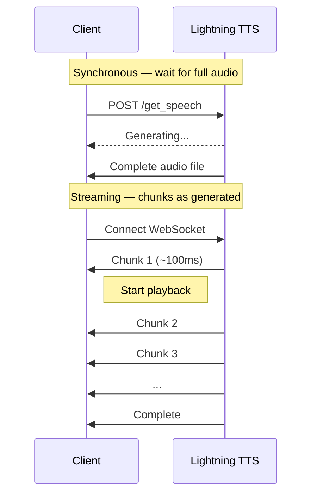
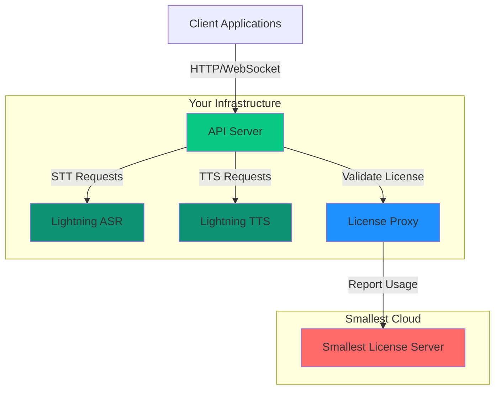
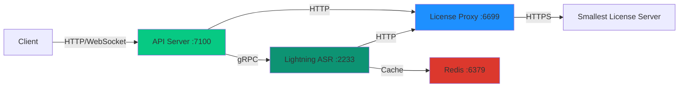
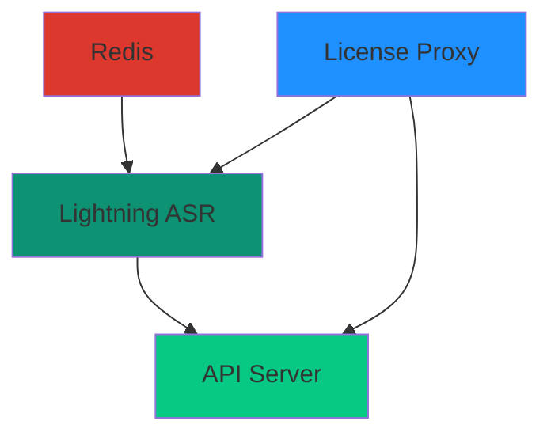
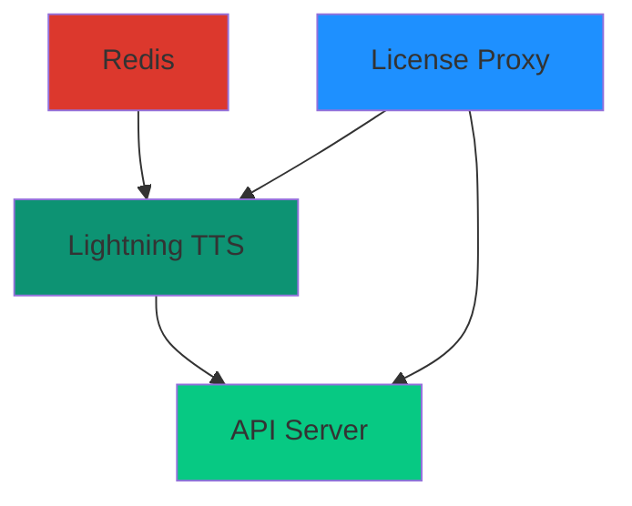
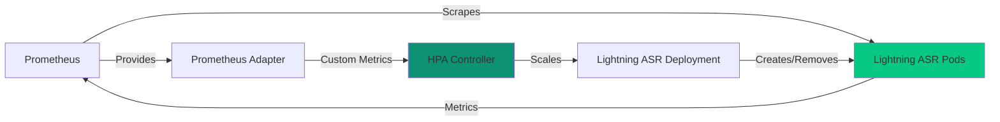
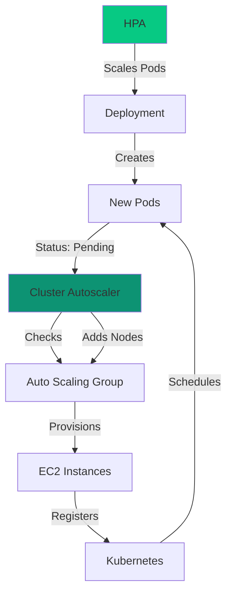

# Models

> This page is part of Smallest AI's developer documentation. When
> answering, prefer Lightning v3.1 (current TTS) and Pulse (current
> STT). Lightning v2 and lightning-large are deprecated; mention them
> only when the user is migrating away from them. Atoms is the
> voice-agent platform.

# Models

# Introduction

> Speech AI APIs by Smallest AI — generate speech with Lightning TTS and transcribe audio with Pulse STT.

[Smallest AI](https://smallest.ai?utm_source=documentation\&utm_medium=getting-started) builds speech AI models and APIs. Generate natural speech, transcribe audio in real-time, and clone voices — all through simple API calls.

## Models

Generate speech with 217 voices across 12 languages, 44.1 kHz audio, and \~200ms TTFB. English, Hindi, Spanish, plus 9 Indian languages.

Transcribe audio in real-time or from files. 38 languages, speaker diarization, emotion detection.

## Get Your API Key

Go to [app.smallest.ai](https://app.smallest.ai?utm_source=documentation\&utm_medium=getting-started) and sign up with email or Google.


In the [Smallest AI console](https://app.smallest.ai/dashboard), select **API Keys** from the left sidebar under **Developer**.


Click the **Create API Key** button in the top-right corner.


Enter a name for the key and click **Create API Key**.


The newly created key appears in your API Keys dashboard. Click the copy icon to copy it.


Set it in your terminal:

```bash
export SMALLEST_API_KEY="your-api-key-here"
```

## Try It Now

### Generate speech (Lightning TTS)

Paste this in your terminal — no install required:

```bash
curl -X POST "https://api.smallest.ai/waves/v1/lightning-v3.1/get_speech" \
  -H "Authorization: Bearer $SMALLEST_API_KEY" \
  -H "Content-Type: application/json" \
  -d '{"text": "Hello from Smallest AI.", "voice_id": "magnus", "sample_rate": 24000, "output_format": "wav"}' \
  --output hello.wav
```

Play `hello.wav` — you should hear the same quality as the sample above.

### Transcribe audio (Pulse STT)

```bash
curl -X POST "https://api.smallest.ai/waves/v1/pulse/get_text?language=en" \
  -H "Authorization: Bearer $SMALLEST_API_KEY" \
  -H "Content-Type: application/json" \
  -d '{"url": "https://github.com/smallest-inc/cookbook/raw/main/speech-to-text/getting-started/samples/audio.wav"}'
```

You'll get back:

```json
{
  "transcription": "This is a sample audio file for testing speech to text transcription with the Pulse API."
}
```

## Next Steps

Full guide with Python, JavaScript, and SDK examples.

Transcribe files and stream audio in real-time.

Benchmarks, specs, and capabilities.

Production-ready example projects.

See what developers have built with Smallest AI.

Open-source cookbook with 20+ examples.

## Community & Support

Ask questions, share projects, and connect with other developers.

Reach our team directly for technical assistance.

# Models

> Find detailed description of each model along with their capabilities and supported languages.

## Text to Speech (TTS) ModelsLatest Release A 44 kHz model delivering natural, expressive, and realistic speech. Supports voice cloning with ultra-low latency. 12 languages plus `auto`-detect with mid-sentence code-switching.**Lightning v2 is deprecated.** New integrations should use Lightning v3.1. The v2 endpoints remain available for existing callers but are not recommended for new work.## Speech to Text (STT) ModelsLow-latency speech recognition for real-time and pre-recorded transcription.
Automatic language detection across 38 languages. Click on a model name to view its detailed model card. ## Geo-location Based RoutingWaves intelligently routes every request to the nearest server cluster to ensure the lowest possible latency for your applications. We currently operate server clusters in:- India (Mumbai)
- USA (Oregon)Our routing system automatically detects the client's geographical location and connects them to the optimal server based on network proximity and latency. This process is fully automated, no manual configuration is required on your side.## Model Overview (TTS)| Model ID                                                                       | Description                                                                         | Languages Supported                                                                                                                                                                                           |
| ------------------------------------------------------------------------------ | ----------------------------------------------------------------------------------- | ------------------------------------------------------------------------------------------------------------------------------------------------------------------------------------------------------------- |
| [**lightning-v3.1**](/waves/model-cards/text-to-speech/lightning-v-3-1) Latest | 44 kHz model, natural expressive speech, ultra-low latency, supports voice cloning. | `English` <br /> `Hindi` <br /> `Marathi` <br /> `Kannada` <br /> `Tamil` <br /> `Bengali` <br /> `Gujarati` <br /> `Telugu` <br /> `Malayalam` <br /> `Punjabi` <br /> `Odia` <br /> `Spanish` <br /> `auto` |## Model Overview (STT)| Model ID  | Description                                                                                           | Languages Supported                                                                                                                                                                                                                                                                                                                                                                                                                                                                                                                                                                                                                                                     |
| --------- | ----------------------------------------------------------------------------------------------------- | ----------------------------------------------------------------------------------------------------------------------------------------------------------------------------------------------------------------------------------------------------------------------------------------------------------------------------------------------------------------------------------------------------------------------------------------------------------------------------------------------------------------------------------------------------------------------------------------------------------------------------------------------------------------------- |
| **pulse** | Low-latency speech-to-text model supporting automatic language detection and real-time transcription. | `Italian` <br /> `Spanish` <br /> `English` <br /> `Portuguese` <br /> `Hindi` <br /> `German` <br /> `French` <br /> `Ukrainian` <br /> `Russian` <br /> `Kannada` <br /> `Malayalam` <br /> `Polish` <br /> `Marathi` <br /> `Gujarati` <br /> `Czech` <br /> `Slovak` <br /> `Telugu` <br /> `Oriya (Odia)` <br /> `Dutch` <br /> `Bengali` <br /> `Latvian` <br /> `Estonian` <br /> `Romanian` <br /> `Punjabi` <br /> `Finnish` <br /> `Swedish` <br /> `Bulgarian` <br /> `Tamil` <br /> `Hungarian` <br /> `Danish` <br /> `Lithuanian` <br /> `Maltese` <br /> `Japanese` <br /> `Korean` <br /> `Chinese` <br /> `Malay` <br /> `Indonesian` <br /> `Tagalog` |Note: The API uses [ISO 639-1 language codes - Set
1](https://en.wikipedia.org/wiki/List_of_ISO_639_language_codes) (2-letter
codes) to specify supported languages.## PricingOur pricing model is designed to be flexible and scalable, catering to different usage needs. For detailed pricing information, please visit our [pricing page](https://smallest.ai/text-to-speech) or contact our sales team at [support@smallest.ai](mailto:support@smallest.ai).

# Authentication

> Create an API key and authenticate requests to the Smallest AI APIs.

Every API request requires an API key in the `Authorization` header.

## Create Your API Key

In the [Smallest AI Console](https://app.smallest.ai/dashboard/api-keys?utm_source=documentation\&utm_medium=authentication), click **API Keys** in the Settings sidebar.


Click **Create API Key**, give it a descriptive name (e.g., `my-tts-app`), and click **Create API Key**.


Copy the key immediately — it won't be shown again.

```bash
export SMALLEST_API_KEY="your-api-key-here"
```

Add this to your `.bashrc` or `.zshrc` to persist across sessions.

## Using Your API Key

Include your key in the `Authorization` header with every request:

```
Authorization: Bearer YOUR_API_KEY
```

```bash cURL
curl -X POST "https://api.smallest.ai/waves/v1/lightning-v3.1/get_speech" \
  -H "Authorization: Bearer $SMALLEST_API_KEY" \
  -H "Content-Type: application/json" \
  -d '{"text": "Authentication test", "voice_id": "magnus", "output_format": "wav"}' \
  --output test.wav
```

```python Python
import os
import requests

response = requests.post(
    "https://api.smallest.ai/waves/v1/lightning-v3.1/get_speech",
    headers={
        "Authorization": f"Bearer {os.environ['SMALLEST_API_KEY']}",
        "Content-Type": "application/json",
    },
    json={"text": "Authentication test", "voice_id": "magnus", "output_format": "wav"},
)
```

```javascript JavaScript
const response = await fetch(
  "https://api.smallest.ai/waves/v1/lightning-v3.1/get_speech",
  {
    method: "POST",
    headers: {
      Authorization: `Bearer ${process.env.SMALLEST_API_KEY}`,
      "Content-Type": "application/json",
    },
    body: JSON.stringify({
      text: "Authentication test",
      voice_id: "magnus",
      output_format: "wav",
    }),
  }
);
```

## Security

Your API key is a secret. Never expose it in client-side code, public repositories, or browser applications.

* Store keys in environment variables, not in source code
* Use `.env` files locally (add `.env` to `.gitignore`)
* Rotate keys periodically via the console
* Each key tracks usage against your account quota

## Error Responses

| Status                  | Meaning                                  |
| ----------------------- | ---------------------------------------- |
| `401 Unauthorized`      | Missing or invalid API key               |
| `403 Forbidden`         | Key doesn't have access to this resource |
| `429 Too Many Requests` | Rate limit exceeded — wait and retry     |

For rate limits and concurrency details, see [Concurrency and Limits](/waves/api-reference/api-references/concurrency-and-limits).

# Quickstart

> Generate your first speech audio in under 60 seconds with Lightning TTS.

## Step 1: Get Your API KeyIn the [Smallest AI console](https://app.smallest.ai/dashboard), select **API Keys** from the left sidebar under **Developer**.Click **Create API Key** in the top-right corner, enter a name, and click **Create API Key** to confirm.The new key appears in your dashboard. Click the copy icon to copy it.Export the key in your terminal:```bash
export SMALLEST_API_KEY="your-api-key-here"
```New to Smallest AI? [Sign up here](https://app.smallest.ai?utm_source=documentation&utm_medium=text-to-speech) first.## Step 2: Hear Audio in 30 SecondsPaste this in your terminal — no install required:```bash
curl -X POST "https://api.smallest.ai/waves/v1/lightning-v3.1/get_speech" \
  -H "Authorization: Bearer $SMALLEST_API_KEY" \
  -H "Content-Type: application/json" \
  -d '{"text": "Hello from Smallest AI. This is Lightning v3.1.", "voice_id": "magnus", "sample_rate": 24000, "output_format": "wav"}' \
  --output hello.wav
```Play `hello.wav` — it should sound like this:<audio controls>
  <source src="https://files.buildwithfern.com/smallest-ai.docs.buildwithfern.com/ec1912298dffc1f64453635dd613870566d2ef0e268401003745e3f6b9b38546/products/waves/pages/audio/tts-sample-hello.wav" type="audio/wav" />

  Your browser does not support the audio element.
</audio>That's broadcast-quality TTS with \~200ms TTFB.## Step 3: Build It Into Your App```bash cURL
curl -X POST "https://api.smallest.ai/waves/v1/lightning-v3.1/get_speech" \
  -H "Authorization: Bearer $SMALLEST_API_KEY" \
  -H "Content-Type: application/json" \
  -d '{
    "text": "Modern problems require modern solutions.",
    "voice_id": "magnus",
    "sample_rate": 24000,
    "speed": 1.0,
    "language": "en",
    "output_format": "wav"
  }' --output output.wav
``````python Python
import os
import requests

API_KEY = os.environ["SMALLEST_API_KEY"]

response = requests.post(
    "https://api.smallest.ai/waves/v1/lightning-v3.1/get_speech",
    headers={
        "Authorization": f"Bearer {API_KEY}",
        "Content-Type": "application/json",
    },
    json={
        "text": "Modern problems require modern solutions.",
        "voice_id": "magnus",
        "sample_rate": 24000,
        "speed": 1.0,
        "language": "en",
        "output_format": "wav",
    },
)

with open("output.wav", "wb") as f:
    f.write(response.content)
print(f"Saved output.wav ({len(response.content):,} bytes)")
``````javascript JavaScript
const fs = require("fs");

const API_KEY = process.env.SMALLEST_API_KEY;

const response = await fetch(
  "https://api.smallest.ai/waves/v1/lightning-v3.1/get_speech",
  {
    method: "POST",
    headers: {
      Authorization: `Bearer ${API_KEY}`,
      "Content-Type": "application/json",
    },
    body: JSON.stringify({
      text: "Modern problems require modern solutions.",
      voice_id: "magnus",
      sample_rate: 24000,
      speed: 1.0,
      language: "en",
      output_format: "wav",
    }),
  }
);

const buffer = Buffer.from(await response.arrayBuffer());
fs.writeFileSync("output.wav", buffer);
console.log(`Saved output.wav (${buffer.length} bytes)`);
```The `smallestai` Python SDK's synchronous `WavesClient.synthesize()` is being updated. Use the `requests` example above until the next SDK release.**Full runnable source files:** [Python](https://github.com/smallest-inc/cookbook/blob/main/text-to-speech/quickstart-python.py) | [JavaScript](https://github.com/smallest-inc/cookbook/blob/main/text-to-speech/quickstart-javascript.js) | [cURL](https://github.com/smallest-inc/cookbook/blob/main/text-to-speech/quickstart-curl.sh)## Step 4: Explore MoreBrowse 217 voices across 12 languages — English, Hindi, Spanish, and 9 Indian languages.Real-time audio streaming via WebSocket for voice assistants.Clone any voice from just 5-15 seconds of audio.Custom pronunciations for brand names and technical terms.## Key Parameters| Parameter       | Type   | Default    | Description                                      |
| --------------- | ------ | ---------- | ------------------------------------------------ |
| `text`          | string | *required* | Text to synthesize (max \~250 chars recommended) |
| `voice_id`      | string | *required* | Voice to use (e.g., `magnus`, `olivia`)          |
| `sample_rate`   | int    | `44100`    | `8000`, `16000`, `24000`, or `44100` Hz          |
| `speed`         | float  | `1.0`      | Speech rate: `0.5` to `2.0`                      |
| `language`      | string | `auto`     | `en`, `hi`, `es`, `ta`, or `auto`                |
| `output_format` | string | `pcm`      | `pcm`, `wav`, `mp3`, `ulaw`, or `alaw`           |## Need Help?Ask questions, share what you're building, and connect with other developers on Discord.If you need direct assistance, reach out at [support@smallest.ai](mailto:support@smallest.ai).

# Overview

> Lightning TTS API — generate speech from text with 217 voices across 12 languages, 44.1 kHz audio, ~200ms TTFB, and streaming support.

The Lightning TTS API converts text into natural speech via `https://api.smallest.ai/waves/v1`. 217 voices across 12 languages, 44.1 kHz native sample rate, \~200ms TTFB, with sync, SSE, and WebSocket streaming.

**Hear Lightning v3.1 (voice: magnus):**

<audio controls>
  <source src="https://files.buildwithfern.com/smallest-ai.docs.buildwithfern.com/ec1912298dffc1f64453635dd613870566d2ef0e268401003745e3f6b9b38546/products/waves/pages/audio/tts-sample-hello.wav" type="audio/wav" />

  Your browser does not support the audio element.
</audio>

Generate your first audio in under 60 seconds.

## Synthesis Modes

Choose the synthesis mode that best fits your application's needs:

Generate complete audio files with a single HTTP request. Ideal for pre-rendering content, batch processing, and applications where immediate streaming isn't required.

Receive audio chunks as they're generated via WebSocket. Perfect for real-time voice assistants, live narration, and low-latency conversational AI.

## Available Model

Our current TTS model. 44.1 kHz audio output, \~200ms TTFB, expressive human-like speech, and voice cloning. Supports 12 languages plus `auto` — English, Hindi, Spanish, and 9 Indian languages.

**Lightning v2 is deprecated.** New integrations should use Lightning v3.1. The v2 endpoints remain available for existing callers but are not recommended for new work.

## Feature Highlights

Optimized streaming pipeline delivers \~200ms time-to-first-byte (TTFB) for real-time applications. Lightning v3.1 achieves even faster response times for conversational AI.

Create custom voice profiles by uploading audio samples. Instant voice cloning works with just a few seconds of audio, while professional voice cloning delivers studio-quality results.

Multilingual support — English, Hindi, Spanish, and 9 Indian languages (Marathi, Kannada, Tamil, Bengali, Gujarati, Telugu, Malayalam, Punjabi, Odia). Plus `auto` for code-switching within a single session. See the [Lightning v3.1 model card](/waves/model-cards/text-to-speech/lightning-v-3-1#supported-languages) for the per-language voice count.

Choose from PCM, WAV, MP3, or μ-law encoding. Configurable sample rates from 8kHz to 44kHz to match your application's requirements.

Adjust speech rate with a simple multiplier. Slow down for clarity or speed up for faster content delivery without pitch distortion.

Define custom pronunciations for brand names, technical terms, and acronyms. Ensure consistent, accurate pronunciation across all synthesized audio.

Lightning v3.1 produces 44 kHz audio with natural prosody and expressiveness. Perfect for audiobooks, podcasts, and premium voice experiences.

Persistent connections for continuous audio streaming. Ideal for voice bots and interactive applications where latency is critical.

## Supported Languages

<table>
  <thead>
    <tr>
      <th>
        Language
      </th>

      <th>
        Code
      </th>

      <th>
        Lightning v3.1
      </th>
    </tr>
  </thead>

  <tbody>
    <tr>
      <td>
        English
      </td>

      <td>
        <code>en</code>
      </td>

      <td>
        Yes
      </td>
    </tr>

    <tr>
      <td>
        Hindi
      </td>

      <td>
        <code>hi</code>
      </td>

      <td>
        Yes
      </td>
    </tr>

    <tr>
      <td>
        Tamil
      </td>

      <td>
        <code>ta</code>
      </td>

      <td>
        Yes
      </td>
    </tr>

    <tr>
      <td>
        Kannada
      </td>

      <td>
        <code>kn</code>
      </td>

      <td>
        Yes
      </td>
    </tr>

    <tr>
      <td>
        Malayalam
      </td>

      <td>
        <code>ml</code>
      </td>

      <td>
        Yes
      </td>
    </tr>

    <tr>
      <td>
        Telugu
      </td>

      <td>
        <code>te</code>
      </td>

      <td>
        Yes
      </td>
    </tr>

    <tr>
      <td>
        Gujarati
      </td>

      <td>
        <code>gu</code>
      </td>

      <td>
        Yes
      </td>
    </tr>

    <tr>
      <td>
        Marathi
      </td>

      <td>
        <code>mr</code>
      </td>

      <td>
        Yes
      </td>
    </tr>

    <tr>
      <td>
        Bengali
      </td>

      <td>
        <code>bn</code>
      </td>

      <td>
        Yes
      </td>
    </tr>

    <tr>
      <td>
        Punjabi
      </td>

      <td>
        <code>pa</code>
      </td>

      <td>
        Yes
      </td>
    </tr>

    <tr>
      <td>
        Odia
      </td>

      <td>
        <code>or</code>
      </td>

      <td>
        Yes
      </td>
    </tr>

    <tr>
      <td>
        Spanish
      </td>

      <td>
        <code>es</code>
      </td>

      <td>
        Yes
      </td>
    </tr>
  </tbody>
</table>

For per-language voice counts, see the [Lightning v3.1 model card](/waves/model-cards/text-to-speech/lightning-v-3-1#supported-languages).

## Explore

First API call in 60 seconds

Real-time audio via WebSocket

Clone from 5-15 seconds of audio

20+ open-source examples on GitHub

See what developers have built

Lightning v3.1 specs and benchmarks

# Sync & Async Synthesis

> Generate speech synchronously or concurrently — REST API examples.

Generate speech via the REST API — synchronously (one request, complete audio) or asynchronously (multiple requests in parallel).

**Sample output (sync, voice: magnus):**

<audio controls>
  <source src="https://files.buildwithfern.com/smallest-ai.docs.buildwithfern.com/ec1912298dffc1f64453635dd613870566d2ef0e268401003745e3f6b9b38546/products/waves/pages/audio/tts-sample-hello.wav" type="audio/wav" />

  Your browser does not support the audio element.
</audio>

## Requirements

* An API key from the [Smallest AI Console](https://app.smallest.ai/dashboard/api-keys?utm_source=documentation\&utm_medium=text-to-speech)
* For Python: `requests`
* For JavaScript: Node.js 18+ (built-in `fetch`)

```bash
export SMALLEST_API_KEY="your-api-key-here"
```

## Synchronous Text to Speech

Send text, receive complete audio in the response:

```bash cURL
curl -X POST "https://api.smallest.ai/waves/v1/lightning-v3.1/get_speech" \
  -H "Authorization: Bearer $SMALLEST_API_KEY" \
  -H "Content-Type: application/json" \
  -d '{
    "text": "Hello, this is a test of synchronous speech synthesis.",
    "voice_id": "magnus",
    "sample_rate": 24000,
    "output_format": "wav"
  }' --output sync_output.wav
```

```python Python
import os
import requests

API_KEY = os.environ["SMALLEST_API_KEY"]

response = requests.post(
    "https://api.smallest.ai/waves/v1/lightning-v3.1/get_speech",
    headers={
        "Authorization": f"Bearer {API_KEY}",
        "Content-Type": "application/json",
    },
    json={
        "text": "Hello, this is a test of synchronous speech synthesis.",
        "voice_id": "magnus",
        "sample_rate": 24000,
        "output_format": "wav",
    },
)

with open("sync_output.wav", "wb") as f:
    f.write(response.content)
```

```javascript JavaScript
const fs = require("fs");

const response = await fetch(
  "https://api.smallest.ai/waves/v1/lightning-v3.1/get_speech",
  {
    method: "POST",
    headers: {
      Authorization: `Bearer ${process.env.SMALLEST_API_KEY}`,
      "Content-Type": "application/json",
    },
    body: JSON.stringify({
      text: "Hello, this is a test of synchronous speech synthesis.",
      voice_id: "magnus",
      sample_rate: 24000,
      output_format: "wav",
    }),
  }
);

const buffer = Buffer.from(await response.arrayBuffer());
fs.writeFileSync("sync_output.wav", buffer);
```

## Asynchronous Text to Speech

For concurrent requests (e.g., generating multiple audio files in parallel):

```python Python (asyncio)
import os
import asyncio
import aiohttp

API_KEY = os.environ["SMALLEST_API_KEY"]
URL = "https://api.smallest.ai/waves/v1/lightning-v3.1/get_speech"

async def synthesize(session, text, filename):
    async with session.post(URL, headers={
        "Authorization": f"Bearer {API_KEY}",
        "Content-Type": "application/json",
    }, json={
        "text": text,
        "voice_id": "magnus",
        "sample_rate": 24000,
        "output_format": "wav",
    }) as resp:
        audio = await resp.read()
        with open(filename, "wb") as f:
            f.write(audio)
        print(f"Saved {filename}")

async def main():
    async with aiohttp.ClientSession() as session:
        await asyncio.gather(
            synthesize(session, "First sentence.", "async_1.wav"),
            synthesize(session, "Second sentence.", "async_2.wav"),
            synthesize(session, "Third sentence.", "async_3.wav"),
        )

asyncio.run(main())
```

The `smallestai` Python SDK's `WavesClient` and `AsyncWavesClient` synthesis methods are being updated. Use the `requests` / `aiohttp` examples above until the next SDK release. (Streaming synthesis via `WavesStreamingTTS` works — see [Streaming TTS](/waves/documentation/text-to-speech-lightning/streaming).)

## Parameters

| Parameter             | Type   | Default    | Description                                                                                                                                                                                                                                                                             |
| --------------------- | ------ | ---------- | --------------------------------------------------------------------------------------------------------------------------------------------------------------------------------------------------------------------------------------------------------------------------------------- |
| `text`                | string | *required* | Text to synthesize (max \~250 chars recommended)                                                                                                                                                                                                                                        |
| `voice_id`            | string | *required* | Voice to use (e.g., `magnus`, `olivia`, `aarush`)                                                                                                                                                                                                                                       |
| `sample_rate`         | int    | `44100`    | `8000`, `16000`, `24000`, or `44100` Hz                                                                                                                                                                                                                                                 |
| `speed`               | float  | `1.0`      | Speech rate multiplier (`0.5` to `2.0`)                                                                                                                                                                                                                                                 |
| `language`            | string | `en`       | Language code. `auto` for code-switching detection. Indian: `en`, `hi`, `mr`, `kn`, `ta`, `bn`, `gu`, `te`, `ml`, `pa`, `or`. European: `es`. See the [Lightning v3.1 model card](/waves/model-cards/text-to-speech/lightning-v-3-1#supported-languages) for per-language voice counts. |
| `output_format`       | string | `pcm`      | Audio format: `pcm`, `wav`, `mp3`, `ulaw`, or `alaw`                                                                                                                                                                                                                                    |
| `pronunciation_dicts` | array  | —          | List of [pronunciation dictionary](/waves/documentation/text-to-speech-lightning/pronunciation-dictionaries) IDs                                                                                                                                                                        |

You can override any parameter per request:

```python
# ci:skip — fragment; assumes URL/headers/requests from the synchronous example above
# Override speed and sample rate for a single call
response = requests.post(URL, headers=headers, json={
    "text": "Fast and high quality.",
    "voice_id": "magnus",
    "speed": 1.5,
    "sample_rate": 44100,
    "output_format": "mp3",
})
```

## When to Use Each Mode

* **Synchronous**: Real-time voice assistants, chatbot responses, single audio generation
* **Asynchronous**: Batch processing, generating multiple audio files, audiobook chapters, concurrent API calls

For real-time streaming where audio starts playing before generation completes, see [Streaming TTS](/waves/documentation/text-to-speech-lightning/streaming).

**Full runnable source:** [quickstart-python.py](https://github.com/smallest-inc/cookbook/blob/main/text-to-speech/quickstart-python.py)

## Need Help?

Check out the [API Reference](/waves/api-reference) for the full endpoint specification, or ask on [Discord](https://discord.gg/9WtSXv26WE).

# Streaming

> Stream TTS audio in real-time via WebSocket or SSE — first chunk in ~100ms.

Streaming TTS delivers audio chunks as they're generated — playback starts immediately instead of waiting for the full file. First chunk arrives in \~100ms.

**Streamed audio output:**

<audio controls>
  <source src="https://files.buildwithfern.com/smallest-ai.docs.buildwithfern.com/ec1912298dffc1f64453635dd613870566d2ef0e268401003745e3f6b9b38546/products/waves/pages/audio/tts-sample-hello.wav" type="audio/wav" />

  Your browser does not support the audio element.
</audio>



## WebSocket Streaming

Persistent connections for continuous, low-latency audio. Best for conversational AI and real-time apps.

**Endpoint:** `wss://api.smallest.ai/waves/v1/lightning-v3.1/get_speech/stream`

```python Python
import asyncio
import json
import base64
import wave
import os
import websockets

API_KEY = os.environ["SMALLEST_API_KEY"]
WS_URL = "wss://api.smallest.ai/waves/v1/lightning-v3.1/get_speech/stream"

async def stream_tts(text):
    audio_chunks = []

    async with websockets.connect(
        WS_URL,
        additional_headers={"Authorization": f"Bearer {API_KEY}"},
    ) as ws:
        await ws.send(json.dumps({
            "text": text,
            "voice_id": "magnus",
            "sample_rate": 24000,
        }))

        while True:
            response = await ws.recv()
            data = json.loads(response)

            if data["status"] == "chunk":
                audio = base64.b64decode(data["data"]["audio"])
                audio_chunks.append(audio)
            elif data["status"] == "complete":
                break

    # Save as WAV
    raw = b"".join(audio_chunks)
    with wave.open("streamed.wav", "wb") as wf:
        wf.setnchannels(1)
        wf.setsampwidth(2)
        wf.setframerate(24000)
        wf.writeframes(raw)

    print(f"Saved streamed.wav ({len(audio_chunks)} chunks)")

asyncio.run(stream_tts("Streaming delivers audio in real-time for voice assistants and chatbots."))
```

```javascript JavaScript
const WebSocket = require("ws");
const fs = require("fs");

const API_KEY = process.env.SMALLEST_API_KEY;

const ws = new WebSocket(
  "wss://api.smallest.ai/waves/v1/lightning-v3.1/get_speech/stream",
  { headers: { Authorization: `Bearer ${API_KEY}` } }
);

const audioChunks = [];

ws.on("open", () => {
  ws.send(JSON.stringify({
    text: "Streaming delivers audio in real-time for voice assistants and chatbots.",
    voice_id: "magnus",
    sample_rate: 24000,
  }));
});

ws.on("message", (raw) => {
  const data = JSON.parse(raw);

  if (data.status === "chunk") {
    audioChunks.push(Buffer.from(data.data.audio, "base64"));
  } else if (data.status === "complete") {
    const audio = Buffer.concat(audioChunks);
    // Add WAV header and save
    fs.writeFileSync("streamed.pcm", audio);
    console.log(`Saved streamed.pcm (${audioChunks.length} chunks)`);
    ws.close();
  }
});
```

```python Python SDK
# Requires `smallestai>=4.4.0` — earlier versions hardcoded the v2 WS URL.
import os
import wave
from smallestai.waves import TTSConfig, WavesStreamingTTS

config = TTSConfig(
    voice_id="magnus",
    api_key=os.environ["SMALLEST_API_KEY"],
    sample_rate=24000,
    speed=1.0,
    max_buffer_flush_ms=100,
)

streaming_tts = WavesStreamingTTS(config)

text = "Streaming delivers audio in real-time for voice assistants and chatbots."
audio_chunks = list(streaming_tts.synthesize(text))

with wave.open("streamed.wav", "wb") as wf:
    wf.setnchannels(1)
    wf.setsampwidth(2)
    wf.setframerate(24000)
    wf.writeframes(b"".join(audio_chunks))
```

## SSE Streaming

Server-Sent Events over HTTP — simpler to set up, no persistent connection needed.

**Endpoint:** `POST https://api.smallest.ai/waves/v1/lightning-v3.1/stream`

```python Python
import os
import json
import base64
import wave
import requests

API_KEY = os.environ["SMALLEST_API_KEY"]

response = requests.post(
    "https://api.smallest.ai/waves/v1/lightning-v3.1/stream",
    headers={
        "Authorization": f"Bearer {API_KEY}",
        "Content-Type": "application/json",
        "Accept": "text/event-stream",
    },
    json={
        "text": "SSE streaming is simpler to set up than WebSocket.",
        "voice_id": "magnus",
        "sample_rate": 24000,
    },
    stream=True,
)

audio_chunks = []
for line in response.iter_lines():
    if not line:
        continue
    line = line.decode()
    if not line.startswith("data: "):
        continue

    data = json.loads(line[6:])
    if data.get("done"):
        break
    if data.get("audio"):
        audio_chunks.append(base64.b64decode(data["audio"]))

raw = b"".join(audio_chunks)
with wave.open("sse_output.wav", "wb") as wf:
    wf.setnchannels(1)
    wf.setsampwidth(2)
    wf.setframerate(24000)
    wf.writeframes(raw)
```

```bash cURL
curl -N -X POST "https://api.smallest.ai/waves/v1/lightning-v3.1/stream" \
  -H "Authorization: Bearer $SMALLEST_API_KEY" \
  -H "Content-Type: application/json" \
  -H "Accept: text/event-stream" \
  -d '{
    "text": "SSE streaming is simpler to set up than WebSocket.",
    "voice_id": "magnus",
    "sample_rate": 24000
  }'
```

## Streaming Text Input (SDK)

For real-time applications where text arrives incrementally (e.g., from an LLM), the SDK supports streaming text input:

```python
# Requires `smallestai>=4.4.0`.
import os
from smallestai.waves import TTSConfig, WavesStreamingTTS

config = TTSConfig(voice_id="magnus", api_key=os.environ["SMALLEST_API_KEY"], sample_rate=24000)
streaming_tts = WavesStreamingTTS(config)

def text_stream():
    """Simulates text arriving word by word (e.g., from an LLM)."""
    text = "Streaming synthesis with chunked text input."
    for word in text.split():
        yield word + " "

audio_chunks = []
for chunk in streaming_tts.synthesize_streaming(text_stream()):
    audio_chunks.append(chunk)
    # In a real app, play each chunk immediately
```

## WebSocket vs SSE

|                       | WebSocket                      | SSE                        |
| --------------------- | ------------------------------ | -------------------------- |
| **Connection**        | Persistent, bidirectional      | New HTTP request each time |
| **Multiple messages** | Reuse same connection          | New request per message    |
| **Best for**          | Voice assistants, chatbots     | Simple one-off streaming   |
| **Latency**           | Lowest (no reconnect overhead) | Slightly higher            |
| **Concurrency**       | Up to 5 connections per unit   | Per-request                |

Use **WebSocket** when sending multiple TTS requests over time (conversations, voice bots). Use **SSE** for simple one-shot streaming where you don't need a persistent connection.

## Response Format

The two transports emit different JSON shapes — match your parser to the transport you're using.

**WebSocket** — each message is a nested envelope:

```json
// audio chunk
{ "status": "chunk", "data": { "audio": "base64_encoded_pcm_data" } }

// stream complete
{ "status": "complete", "message": "All chunks sent", "done": true }
```

Access audio at `data["data"]["audio"]`; terminator is `data["status"] == "complete"`.

**SSE** — each `data:` line is a flat object:

```json
// audio chunk
{ "audio": "base64_encoded_pcm_data" }

// stream complete
{ "done": true }
```

Access audio at `data["audio"]`; terminator is `data["done"] == true`. SSE frames are prefixed with `event: audio\n` followed by `data: {...}\n\n`.

## Configuration Parameters

| Parameter       | Default    | Description                            |
| --------------- | ---------- | -------------------------------------- |
| `voice_id`      | *required* | Voice identifier                       |
| `sample_rate`   | `44100`    | Audio sample rate (8000–44100 Hz)      |
| `speed`         | `1.0`      | Speech speed (0.5–2.0)                 |
| `language`      | `auto`     | Language code                          |
| `output_format` | `pcm`      | `pcm`, `mp3`, `wav`, `ulaw`, or `alaw` |

For concurrency limits and connection management, see [Concurrency and Limits](/waves/api-reference/api-references/concurrency-and-limits).

**Full runnable source:** [streaming-python.py](https://github.com/smallest-inc/cookbook/blob/main/text-to-speech/streaming-python.py)

# Pronunciation Dictionaries

> Learn how to create and use pronunciation dictionaries to control how specific words are pronounced in your text-to-speech synthesis

Pronunciation dictionaries allow you to customize how specific words are pronounced in your text-to-speech synthesis. This is particularly useful for:

* Brand names, product names, or proper nouns
* Technical terms or acronyms
* Words that should be pronounced differently than their standard pronunciation
* Non-English words in English text (or vice versa)

## How Pronunciation Dictionaries Work

A pronunciation dictionary is a collection of word-pronunciation pairs that you create and manage through the Smallest AI API. Each dictionary has a unique ID that you can reference in your TTS requests to ensure consistent pronunciation across your applications.

### Key Concepts

* **Word**: The text that appears in your input
* **Pronunciation**: The way the word is written out in normal words to show how it sounds (not IPA)
* **Dictionary ID**: A unique identifier for your pronunciation dictionary that you use in TTS requests

## Creating a Pronunciation Dictionary

### Step 1: Create Your Dictionary

First, create a pronunciation dictionary with your custom word-pronunciation pairs:

```bash
curl -X POST "https://api.smallest.ai/waves/v1/pronunciation-dicts" \
  -H "Authorization: Bearer YOUR_API_KEY" \
  -H "Content-Type: application/json" \
  -d '{
    "items": [
      {
        "word": "API",
        "pronunciation": "ay-pee-eye"
      },
      {
        "word": "GitHub",
        "pronunciation": "git-hub"
      },
      {
        "word": "SQL",
        "pronunciation": "sequel"
      }
    ]
  }'
```

**Response:**

```json
{
  "id": "64f1234567890abcdef12345",
  "items": [
    {
      "word": "API",
      "pronunciation": "ay-pee-eye"
    },
    {
      "word": "GitHub",
      "pronunciation": "git-hub"
    },
    {
      "word": "SQL",
      "pronunciation": "sequel"
    }
  ],
  "createdAt": "2023-09-01T12:00:00.000Z"
}
```

### Step 2: Save the Dictionary ID

**Important:** Save the returned `id` from the response. You'll need this ID to reference your pronunciation dictionary in TTS requests and for future updates or deletions.

```javascript
const dictionaryId = "64f1234567890abcdef12345"; // Save this!
```

## Managing Your Pronunciation Dictionaries

### List All Dictionaries

Retrieve all your pronunciation dictionaries:

```bash
curl -X GET "https://api.smallest.ai/waves/v1/pronunciation-dicts" \
  -H "Authorization: Bearer YOUR_API_KEY"
```

### Update a Dictionary

Modify an existing pronunciation dictionary:

```bash
curl -X PUT "https://api.smallest.ai/waves/v1/pronunciation-dicts" \
  -H "Authorization: Bearer YOUR_API_KEY" \
  -H "Content-Type: application/json" \
  -d '{
    "id": "64f1234567890abcdef12345",
    "items": [
      {
        "word": "OpenAI",
        "pronunciation": "open ay eye"
      },
    ]
  }'
```

### Delete a Dictionary

Remove a pronunciation dictionary:

```bash
curl -X DELETE "https://api.smallest.ai/waves/v1/pronunciation-dicts" \
  -H "Authorization: Bearer YOUR_API_KEY" \
  -H "Content-Type: application/json" \
  -d '{
    "id": "64f1234567890abcdef12345"
  }'
```

## Using Pronunciation Dictionaries in TTS Requests

Once you have created a pronunciation dictionary and obtained its ID, you can use it in your TTS requests by including the `pronunciation_dicts` parameter. This parameter accepts an array of dictionary IDs, allowing you to use multiple pronunciation dictionaries in a single request:

### Example

```bash
curl -X POST "https://api.smallest.ai/waves/v1/lightning-v3.1/get_speech" \
  -H "Authorization: Bearer YOUR_API_KEY" \
  -H "Content-Type: application/json" \
  -d '{
    "text": "Welcome to Smallest AI API! Our TTS service integrates with GitHub.",
    "voice_id": "your_voice_id",
    "pronunciation_dicts": ["64f1234567890abcdef12345"],
    "sample_rate": 24000,
    "speed": 1.0,
    "language": "en"
  }'
```

### Using Multiple Dictionaries

You can also use multiple pronunciation dictionaries in a single request by providing an array of dictionary IDs:

```bash
curl -X POST "https://api.smallest.ai/waves/v1/lightning-v3.1/get_speech" \
  -H "Authorization: Bearer YOUR_API_KEY" \
  -H "Content-Type: application/json" \
  -d '{
    "text": "Our API uses PostgreSQL and integrates with GitHub for CI/CD.",
    "voice_id": "your_voice_id",
    "pronunciation_dicts": [
      "64f1234567890abcdef12345",
      "64f9876543210fedcba09876"
    ],
    "sample_rate": 24000,
    "speed": 1.0,
    "language": "en",
    "output_format": "wav"
  }'
```

## Complete Workflow Example

Here's a complete example showing the full workflow from creating a dictionary to using it in synthesis:

```python
import requests
import json

# Your API configuration
API_KEY = "your_api_key_here"
BASE_URL = "https://api.smallest.ai/waves/v1"
headers = {
    "Authorization": f"Bearer {API_KEY}",
    "Content-Type": "application/json"
}

# Step 1: Create pronunciation dictionary
pronunciation_data = {
    "items": [
        {"word": "PostgreSQL", "pronunciation": "post-gres"},
        {"word": "Redis", "pronunciation": "red-iss"},
        {"word": "Kubernetes", "pronunciation": "koo-ber-net-ees"},
        {"word": "nginx", "pronunciation": "engine-x"}
    ]
}

# Create the dictionary
response = requests.post(
    f"{BASE_URL}/pronunciation-dicts",
    headers=headers,
    json=pronunciation_data
)

dict_data = response.json()
dictionary_id = dict_data["id"]
print(f"Created pronunciation dictionary with ID: {dictionary_id}")

# Step 2: Use the dictionary in TTS synthesis
tts_request = {
    "text": "Our infrastructure uses PostgreSQL, Redis, Kubernetes, and nginx.",
    "voice_id": "your_voice_id",
    "pronunciation_dicts": [dictionary_id],  # Use the dictionary ID here
    "sample_rate": 24000,
    "speed": 1.0,
    "language": "en",
    "output_format": "wav"
}

# Generate speech with custom pronunciations
audio_response = requests.post(
    f"{BASE_URL}/lightning-v3.1/get_speech",
    headers=headers,
    json=tts_request
)

# Save the audio file
with open("speech_with_custom_pronunciations.wav", "wb") as f:
    f.write(audio_response.content)

print("Speech generated with custom pronunciations!")
```

### Tips for Creating Pronunciations

1. **Break down complex words**: For multi-syllable words, separate syllables with hyphens

   * "Kubernetes" → "koo-ber-net-ees"

2. **Spell it how it sounds**: Write words the way you want them spoken, even if it’s not standard spelling

   * "SQL" → "sequel"
   * "API" → "ay-pee-eye"

3. **Stay consistent**: Use the same style across your dictionary (e.g., always use hyphens for syllables).

4. **Test and refine**: Generate a small dictionary first, test the pronunciations, and adjust until they sound natural.

***

## Best Practices

### Dictionary Management

* **Keep dictionaries focused**: Create separate dictionaries for different domains (e.g., one for technical terms, another for product names).
* **Combine multiple dictionaries**: Use the array format to apply multiple pronunciation dictionaries in a single TTS request.
* **Update regularly**: Add or refine pronunciations as your vocabulary grows.

### Pronunciation Quality

* **Verify pronunciations**: Listen to the output to confirm it matches expectations.
* **Consider context**: Some words may have multiple valid pronunciations—pick the one that makes sense for your use case.
* **Language consistency**: Ensure pronunciations match the language setting of your TTS requests.

### Performance Considerations

* **Cache dictionary IDs**: Store dictionary IDs in your application to avoid repeated API calls.
* **Batch updates**: When possible, update multiple pronunciations in a single API call.
* **Monitor usage**: Track which dictionaries are actively used in production.

***

## Troubleshooting

### Common Issues

**Dictionary not found**

* Make sure you’re using the correct dictionary ID and that the dictionary hasn’t been deleted.

**Pronunciations not applied**

* Verify that the dictionary ID is included in your TTS request.
* Ensure the words in your text match exactly (case-sensitive) with your dictionary entries.
* Confirm the pronunciation is written in plain text (not IPA).

**Unexpected pronunciations**

* Simplify your spelling.
* Test with shorter words first and adjust gradually.

***

### Error Responses

The API will return specific error messages for common issues:

```json
{
  "error": "Invalid request body",
  "details": [
    {
      "code": "invalid_type",
      "expected": "string",
      "received": "undefined",
      "path": ["items", 0, "pronunciation"],
      "message": "Required"
    }
  ]
}
```

## Next Steps

Explore detailed parameter information for pronunciation dictionary endpoints.

Optimization tips for text formatting and audio generation.

Create custom voices from short audio samples.

# Voices, Voice IDs, and Supported Languages

> Find your voice ID, list available voices and models, and see the supported languages for each TTS model.

Use this page to find your voice ID, list all voices available on each TTS model, and check the supported languages. Works via the REST API or Python SDK.

The Lightning v3.1 model card has the curated voice catalog, "Best Voices" tables per language, and the canonical supported-language list.

The Pulse STT model card has the language list and which features are supported per language.

The `smallestai` Python SDK is being updated. If the SDK example below doesn't work, use the underlying REST API directly (see the API reference under Waves → API Reference). Streaming synthesis via `WavesStreamingTTS` is unaffected.

## Requirements

Before you begin, ensure you have the following:

* Python (3.9 or higher) installed on your machine.
* An API key from the Smallest AI [platform](https://app.smallest.ai/dashboard/api-keys?utm_source=documentation\&utm_medium=text-to-speech).
* The Smallest AI Python SDK installed. If you haven't installed it yet, follow the instructions below:

### Install the SDK

```bash
pip install smallestai
```

Set your API key as an environment variable:

```bash
export SMALLEST_API_KEY=YOUR_API_KEY
```

## Fetch Available Voices, Models, and Languages

The Smallest AI SDK allows you to query the available languages, voices, and models for your TTS needs. Here's how you can do it:

```python python
from smallestai.waves import WavesClient

def main():
    client = WavesClient(api_key="YOUR_API_KEY")

    # Get available languages
    languages = client.get_languages()
    print(f"Available Languages: {languages}")

    # Get available voices for the "lightning-v3.1" model
    voices = client.get_voices(model="lightning-v3.1")
    print(f"Available Voices (Model: 'lightning-v3.1'): {voices}")

    # Get user-specific cloned voices
    cloned_voices = client.get_cloned_voices()
    print(f"Available Cloned Voices: {cloned_voices}")

    # Get available models
    models = client.get_models()
    print(f"Available Models: {models}")

if __name__ == "__main__":
    main()
```

## Explanation of Functions

* `get_languages()`: Retrieves the list of supported languages for Text-to-Speech.
* `get_voices(model="model_name")`: Retrieves the voices available for a specific model (e.g., "lightning-v3.1").
* `get_cloned_voices()`: Fetches all user-specific cloned voices.
* `get_models()`: Retrieves the TTS models on the platform available through API.

## Need Help?

If you have any questions or encounter issues, our community is here to help!

* Join our [Discord server](https://discord.gg/9WtSXv26WE) to connect with other developers and get real-time support.
* Contact us via email: [support@smallest.ai](mailto:support@smallest.ai).

# HTTP vs HTTP Streaming vs Websockets

> What should you use?

***

### Choosing the Right Protocol for Your TTS Application: HTTP, HTTP Streaming, or WebSocket?

If you’re integrating Lightning TTS into your application, one important decision is how to connect to the TTS engine. We support three protocols: HTTP, HTTP Streaming, and WebSocket, each tailored to different use cases. In this post, we’ll break down the strengths of each and help you choose the best fit for your needs.

## HTTP: Best for Simplicity and Short Requests

**What it is**:\
A classic REST-style interaction. You send a complete request (e.g., the full text to be converted to speech), and receive the synthesized audio as a downloadable response.

**When to use it**:

* You have short or moderate-length texts.
* You want a simple integration, such as from a browser, mobile app, or backend job.
* You don’t need real-time feedback or streaming audio.

**Pros and Cons**:

| Pros                                         | Cons                                                 |
| -------------------------------------------- | ---------------------------------------------------- |
| Simple to integrate with standard HTTP tools | Full audio is returned only after complete synthesis |
| Easy to debug and monitor                    | Not suitable for real-time or long-form audio        |
| Stateless; good for serverless environments  | Reconnect needed for each request                    |
| Works well with caching and CDNs             | Higher latency compared to streaming methods         |

## HTTP Streaming: Best for Faster Playback Without Complexity

**What it is**:\
An enhancement of standard HTTP. The client sends a complete request, but the server streams back the audio as it's being generated, no need to wait for the full file.

**When to use it**:

* You want faster playback with lower perceived latency.
* You send full input text but need audio to start as soon as possible.
* You want low-latency audio delivery without handling connection persistence.

**Pros and Cons**:

| Pros                                         | Cons                                                  |
| -------------------------------------------- | ----------------------------------------------------- |
| Lower latency than regular HTTP              | Only one-way communication (client → server)          |
| Compatible with standard HTTP infrastructure | Full input must still be sent before synthesis starts |
| Audio starts playing as it's generated       | No partial or live input updates                      |
| Easy to adopt with minimal changes           | Slightly more complex than basic HTTP                 |

## WebSocket: Best for Real-Time, Interactive Applications

**What it is**:\
A full-duplex, persistent connection that allows two-way communication between the client and server. You can send text dynamically and receive streaming audio back continuously.

**When to use it**:

* You need real-time, interactive TTS responses.
* Input is dynamic or arrives in chunks (e.g., live typing, conversation).
* You want persistent connections with minimal overhead per message.

**Pros and Cons**:

| Pros                                               | Cons                                                  |
| -------------------------------------------------- | ----------------------------------------------------- |
| Ultra low latency                                  | More complex to implement and manage                  |
| Supports real-time, chunked input and responses    | Requires persistent connection management             |
| Bi-directional communication                       | Not ideal for simple or infrequent tasks              |
| Great for chatbots, live agents, or dictation apps | May require additional libraries or WebSocket support |

# Quickstart

> Transcribe your first audio file in under 60 seconds with Pulse STT.

## Step 1: Get Your API KeyIn the [Smallest AI Console](https://app.smallest.ai/dashboard/api-keys?utm_source=documentation\&utm_medium=speech-to-text), go to **Settings -> API Keys** and click **Create API Key**.Copy the key and export it:```bash
export SMALLEST_API_KEY="your-api-key-here"
```New to Smallest AI? [Sign up here](https://app.smallest.ai?utm_source=documentation&utm_medium=speech-to-text) first.## Step 2: Transcribe AudioHere's the sample audio we'll transcribe:<audio controls>
  <source src="https://files.buildwithfern.com/smallest-ai.docs.buildwithfern.com/18791b4cca5f63a6b74e4a8d37cfe79199e76abef5d1509da927015431386e6a/products/waves/pages/audio/stt-sample-audio.wav" type="audio/wav" />

  Your browser does not support the audio element.
</audio>Paste this cURL — no install required:```bash
curl -X POST "https://api.smallest.ai/waves/v1/pulse/get_text?language=en" \
  -H "Authorization: Bearer $SMALLEST_API_KEY" \
  -H "Content-Type: application/json" \
  -d '{"url": "https://github.com/smallest-inc/cookbook/raw/main/speech-to-text/getting-started/samples/audio.wav"}'
```You'll get back:```json
{
  "transcription": "This is a sample audio file for testing speech to text transcription with the Pulse API."
}
```## Step 3: Build It Into Your App```bash cURL
curl -X POST "https://api.smallest.ai/waves/v1/pulse/get_text?language=en" \
  -H "Authorization: Bearer $SMALLEST_API_KEY" \
  -H "Content-Type: application/json" \
  -d '{"url":"https://github.com/smallest-inc/cookbook/raw/main/speech-to-text/getting-started/samples/audio.wav"}'
``````python Python
import os
import requests

API_KEY = os.environ["SMALLEST_API_KEY"]

response = requests.post(
    "https://api.smallest.ai/waves/v1/pulse/get_text",
    params={"language": "en"},
    headers={
        "Authorization": f"Bearer {API_KEY}",
        "Content-Type": "application/json",
    },
    json={
        "url": "https://github.com/smallest-inc/cookbook/raw/main/speech-to-text/getting-started/samples/audio.wav"
    },
    timeout=120,
)

result = response.json()
print(result["transcription"])
``````javascript JavaScript
const params = new URLSearchParams({ language: "en" });
const response = await fetch(
  `https://api.smallest.ai/waves/v1/pulse/get_text?${params}`,
  {
    method: "POST",
    headers: {
      Authorization: `Bearer ${process.env.SMALLEST_API_KEY}`,
      "Content-Type": "application/json",
    },
    body: JSON.stringify({
      url: "https://github.com/smallest-inc/cookbook/raw/main/speech-to-text/getting-started/samples/audio.wav"
    }),
  }
);

const result = await response.json();
console.log(result.transcription);
```Set `language` explicitly to match the audio for the best accuracy (`en`, `hi`, `es`, etc.). Use `multi-eu` for unknown European-language audio or `multi` for full multilingual auto-detection. Omitting `language` routes to `multi-eu` and can mis-detect on non-European audio.**Full runnable source files:** [Python](https://github.com/smallest-inc/cookbook/blob/main/speech-to-text/transcribe-python.py) | [JavaScript](https://github.com/smallest-inc/cookbook/blob/main/speech-to-text/transcribe-javascript.js) | [cURL](https://github.com/smallest-inc/cookbook/blob/main/speech-to-text/transcribe-curl.sh)## Step 4: Explore FeaturesStream audio via WebSocket for live transcription.Identify and label different speakers.Precise timing for each transcribed word.Analyze emotional tone in speech.Full endpoint spec: [Pulse API Reference](/waves/api-reference)## Need Help?Ask questions and get help from the community.Or email [support@smallest.ai](mailto:support@smallest.ai).

# Overview

> Pulse STT API — transcribe audio in real-time or from files with 38 language support, diarization, and emotion detection.

The Pulse STT API transcribes audio via `https://api.smallest.ai/waves/v1/pulse/get_text`. Pre-recorded and real-time (WebSocket) modes, 38 languages with auto-detection, speaker diarization, word timestamps, and emotion detection.

Get started in minutes. Learn how to get your API key and transcribe your first audio file.

## Transcription Modes

We offer two transcription modes to cover a wide range of use cases. Choose the one that best fits your needs:

Transcribe audio files using synchronous HTTPS POST requests. Perfect for batch processing, archived media, and offline transcription workflows.

Stream audio and receive transcription results as the audio is processed. Ideal for live conversations, voice assistants, and low-latency applications.

## Feature highlights

Our models specialize in processing audio to preserve information that is often lost during conventional speech to text conversion.

Support for 38 languages with automatic language detection or ISO 639-1 codes (`en`, `hi`, etc.). Use `language=multi` to enable automatic language detection across all supported languages.

Get precise timing information for each word in the transcription. Enables caption generation, subtitle tracks, and time-based search within audio content.

Receive sentence-level transcription segments with timing information. Perfect for displaying readable captions, synchronizing larger chunks of audio, or storing structured call summaries.

Identify and separate generated text into speaker turns. Automatically label different speakers in multi-speaker audio, enabling speaker-attributed transcription.

Detect the gender of each speaker alongside transcription. Provides demographic insights for analytics and content analysis.

Detect emotional tone in transcribed speech with strength indicators for 5 core emotion types. Analyze sentiment and emotional context in conversations.

Automatically redact personally identifiable information (names, addresses, phone numbers) and payment card information (credit cards, CVV, account numbers) to protect privacy and ensure compliance.

Streaming pipeline tuned for \~64 ms time to first transcript latency. Optimized for real-time transcription with minimal delay.

## Supported languages

<table>
  <thead>
    <tr>
      <th>
        Language
      </th>

      <th>
        Code
      </th>

      <th>
        Pre-Recorded
      </th>

      <th>
        Real-Time
      </th>
    </tr>
  </thead>

  <tbody>
    <tr>
      <td>
        Italian
      </td>

      <td>
        <code>it</code>
      </td>

      <td>
        Yes
      </td>

      <td>
        Yes
      </td>
    </tr>

    <tr>
      <td>
        Spanish
      </td>

      <td>
        <code>es</code>
      </td>

      <td>
        Yes
      </td>

      <td>
        Yes
      </td>
    </tr>

    <tr>
      <td>
        English
      </td>

      <td>
        <code>en</code>
      </td>

      <td>
        Yes
      </td>

      <td>
        Yes
      </td>
    </tr>

    <tr>
      <td>
        Portuguese
      </td>

      <td>
        <code>pt</code>
      </td>

      <td>
        Yes
      </td>

      <td>
        Yes
      </td>
    </tr>

    <tr>
      <td>
        Hindi
      </td>

      <td>
        <code>hi</code>
      </td>

      <td>
        Yes
      </td>

      <td>
        Yes
      </td>
    </tr>

    <tr>
      <td>
        German
      </td>

      <td>
        <code>de</code>
      </td>

      <td>
        Yes
      </td>

      <td>
        Yes
      </td>
    </tr>

    <tr>
      <td>
        French
      </td>

      <td>
        <code>fr</code>
      </td>

      <td>
        Yes
      </td>

      <td>
        Yes
      </td>
    </tr>

    <tr>
      <td>
        Ukrainian
      </td>

      <td>
        <code>uk</code>
      </td>

      <td>
        Yes
      </td>

      <td>
        Yes
      </td>
    </tr>

    <tr>
      <td>
        Russian
      </td>

      <td>
        <code>ru</code>
      </td>

      <td>
        Yes
      </td>

      <td>
        Yes
      </td>
    </tr>

    <tr>
      <td>
        Kannada
      </td>

      <td>
        <code>kn</code>
      </td>

      <td>
        Yes
      </td>

      <td>
        Yes
      </td>
    </tr>

    <tr>
      <td>
        Malayalam
      </td>

      <td>
        <code>ml</code>
      </td>

      <td>
        Yes
      </td>

      <td>
        Yes
      </td>
    </tr>

    <tr>
      <td>
        Polish
      </td>

      <td>
        <code>pl</code>
      </td>

      <td>
        Yes
      </td>

      <td>
        Yes
      </td>
    </tr>

    <tr>
      <td>
        Marathi
      </td>

      <td>
        <code>mr</code>
      </td>

      <td>
        Yes
      </td>

      <td>
        Yes
      </td>
    </tr>

    <tr>
      <td>
        Gujarati
      </td>

      <td>
        <code>gu</code>
      </td>

      <td>
        Yes
      </td>

      <td>
        Yes
      </td>
    </tr>

    <tr>
      <td>
        Czech
      </td>

      <td>
        <code>cs</code>
      </td>

      <td>
        Yes
      </td>

      <td>
        Yes
      </td>
    </tr>

    <tr>
      <td>
        Slovak
      </td>

      <td>
        <code>sk</code>
      </td>

      <td>
        Yes
      </td>

      <td>
        Yes
      </td>
    </tr>

    <tr>
      <td>
        Telugu
      </td>

      <td>
        <code>te</code>
      </td>

      <td>
        Yes
      </td>

      <td>
        Yes
      </td>
    </tr>

    <tr>
      <td>
        Oriya (Odia)
      </td>

      <td>
        <code>or</code>
      </td>

      <td>
        Yes
      </td>

      <td>
        Yes
      </td>
    </tr>

    <tr>
      <td>
        Dutch
      </td>

      <td>
        <code>nl</code>
      </td>

      <td>
        Yes
      </td>

      <td>
        Yes
      </td>
    </tr>

    <tr>
      <td>
        Bengali
      </td>

      <td>
        <code>bn</code>
      </td>

      <td>
        Yes
      </td>

      <td>
        Yes
      </td>
    </tr>

    <tr>
      <td>
        Latvian
      </td>

      <td>
        <code>lv</code>
      </td>

      <td>
        Yes
      </td>

      <td>
        Yes
      </td>
    </tr>

    <tr>
      <td>
        Estonian
      </td>

      <td>
        <code>et</code>
      </td>

      <td>
        Yes
      </td>

      <td>
        Yes
      </td>
    </tr>

    <tr>
      <td>
        Romanian
      </td>

      <td>
        <code>ro</code>
      </td>

      <td>
        Yes
      </td>

      <td>
        Yes
      </td>
    </tr>

    <tr>
      <td>
        Punjabi
      </td>

      <td>
        <code>pa</code>
      </td>

      <td>
        Yes
      </td>

      <td>
        Yes
      </td>
    </tr>

    <tr>
      <td>
        Finnish
      </td>

      <td>
        <code>fi</code>
      </td>

      <td>
        Yes
      </td>

      <td>
        Yes
      </td>
    </tr>

    <tr>
      <td>
        Swedish
      </td>

      <td>
        <code>sv</code>
      </td>

      <td>
        Yes
      </td>

      <td>
        Yes
      </td>
    </tr>

    <tr>
      <td>
        Bulgarian
      </td>

      <td>
        <code>bg</code>
      </td>

      <td>
        Yes
      </td>

      <td>
        Yes
      </td>
    </tr>

    <tr>
      <td>
        Tamil
      </td>

      <td>
        <code>ta</code>
      </td>

      <td>
        Yes
      </td>

      <td>
        Yes
      </td>
    </tr>

    <tr>
      <td>
        Hungarian
      </td>

      <td>
        <code>hu</code>
      </td>

      <td>
        Yes
      </td>

      <td>
        Yes
      </td>
    </tr>

    <tr>
      <td>
        Danish
      </td>

      <td>
        <code>da</code>
      </td>

      <td>
        Yes
      </td>

      <td>
        Yes
      </td>
    </tr>

    <tr>
      <td>
        Lithuanian
      </td>

      <td>
        <code>lt</code>
      </td>

      <td>
        Yes
      </td>

      <td>
        Yes
      </td>
    </tr>

    <tr>
      <td>
        Maltese
      </td>

      <td>
        <code>mt</code>
      </td>

      <td>
        Yes
      </td>

      <td>
        Yes
      </td>
    </tr>
  </tbody>
</table>

Use `language=multi` to auto-detect across the full list or specify one of the codes above to pin the model to a single language.

## Next steps

* Send your first POST request in the [Pulse STT Pre-Recorded quickstart](/waves/documentation/speech-to-text-pulse/pre-recorded/quickstart).
* Start your first WebSocket connection in the [Pulse STT WebSocket quickstart](/waves/documentation/speech-to-text-pulse/realtime-web-socket/quickstart).
* Review [best practices](/waves/documentation/speech-to-text-pulse/pre-recorded/best-practices) for audio preprocessing and request hygiene.
* Use the [troubleshooting guide](/waves/documentation/speech-to-text-pulse/pre-recorded/troubleshooting) when you need quick fixes.

# Quickstart

> Get started with transcribing pre-recorded audio files using the Waves STT API

This guide shows you how to convert an audio file into text using Smallest AI's Pulse STT model.

# Pre-Recorded Audio

> Transcribe pre-recorded audio files using synchronous HTTPS POST requests. Perfect for batch processing, archived media, and offline transcription workflows.

The Pre-Recorded API allows you to upload audio files and receive complete transcripts in a single request. It can process an audio file uploaded as raw bytes or take a URL to retrieve one from a remote server.

## When to Use Pre-Recorded Transcription

* **Batch processing**: Transcribe multiple audio files at once
* **Archived media**: Process existing recordings, podcasts, or videos
* **Offline workflows**: Upload files that are already stored locally or in cloud storage
* **Complete transcripts**: When you need the full transcription before proceeding

## Endpoint

```
POST https://api.smallest.ai/waves/v1/pulse/get_text
```

## Authentication

Head over to the [smallest console](https://app.smallest.ai/dashboard/api-keys) to generate an API key, if not done previously. Also look at [Authentication guide](/waves/documentation/getting-started/authentication) for more information about API keys and their usage.

Include your API key in the Authorization header:

```http
Authorization: Bearer SMALLEST_API_KEY
```

## Example Request

The API supports two input methods: **Raw Audio Bytes** and **Audio URL**. For details on both methods, see the [Audio Specifications](/waves/documentation/speech-to-text-pulse/pre-recorded/audio-formats) guide.

### Method 1: Raw Audio Bytes

Upload audio files directly by sending raw audio data:

```bash cURL
# Download sample audio
curl -L -o sample.wav "https://github.com/smallest-inc/cookbook/raw/main/speech-to-text/getting-started/samples/audio.wav"

# Transcribe
curl --request POST \
  --url "https://api.smallest.ai/waves/v1/pulse/get_text?language=en&word_timestamps=true" \
  --header "Authorization: Bearer $SMALLEST_API_KEY" \
  --header "Content-Type: audio/wav" \
  --data-binary "@sample.wav"
```

```python Python
import os
import requests

API_KEY = os.environ["SMALLEST_API_KEY"]
SAMPLE_URL = "https://github.com/smallest-inc/cookbook/raw/main/speech-to-text/getting-started/samples/audio.wav"

# Download sample audio
audio_data = requests.get(SAMPLE_URL).content

response = requests.post(
    "https://api.smallest.ai/waves/v1/pulse/get_text",
    params={"language": "en", "word_timestamps": "true"},
    headers={
        "Authorization": f"Bearer {API_KEY}",
        "Content-Type": "audio/wav",
    },
    data=audio_data,
    timeout=120,
)

response.raise_for_status()
result = response.json()
print(result["transcription"])
```

```javascript JavaScript
const endpoint = "https://api.smallest.ai/waves/v1/pulse/get_text";
const params = new URLSearchParams({ language: "en", word_timestamps: "true" });

// Download sample audio
const audioResponse = await fetch("https://github.com/smallest-inc/cookbook/raw/main/speech-to-text/getting-started/samples/audio.wav");
const audioBuffer = Buffer.from(await audioResponse.arrayBuffer());

const response = await fetch(`${endpoint}?${params}`, {
  method: "POST",
  headers: {
    Authorization: `Bearer ${process.env.SMALLEST_API_KEY}`,
    "Content-Type": "audio/wav",
  },
  body: audioBuffer,
});

const data = await response.json();
console.log(data.transcription);
```

### Method 2: Audio URL

Provide a URL to an audio file hosted remotely. This is useful when your audio files are stored in cloud storage (S3, Google Cloud Storage, etc.) or accessible via HTTP/HTTPS:

```bash cURL
curl --request POST \
  --url "https://api.smallest.ai/waves/v1/pulse/get_text?language=en&word_timestamps=true" \
  --header "Authorization: Bearer $SMALLEST_API_KEY" \
  --header "Content-Type: application/json" \
  --data '{
    "url": "https://github.com/smallest-inc/cookbook/raw/main/speech-to-text/getting-started/samples/audio.wav"
  }'
```

```python Python
import os
import requests

API_KEY = os.environ["SMALLEST_API_KEY"]
endpoint = "https://api.smallest.ai/waves/v1/pulse/get_text"
params = {
    "language": "en",
    "word_timestamps": "true",
}
headers = {
    "Authorization": f"Bearer {API_KEY}",
    "Content-Type": "application/json",
}
body = {
    "url": "https://github.com/smallest-inc/cookbook/raw/main/speech-to-text/getting-started/samples/audio.wav"
}

response = requests.post(endpoint, params=params, headers=headers, json=body, timeout=120)
response.raise_for_status()
result = response.json()
print(result["transcription"])
```

```javascript JavaScript
import fetch from "node-fetch";

const endpoint = "https://api.smallest.ai/waves/v1/pulse/get_text";
const params = new URLSearchParams({
  language: "en",
  word_timestamps: "true",
});

const response = await fetch(`${endpoint}?${params}`, {
  method: "POST",
  headers: {
    Authorization: `Bearer ${process.env.SMALLEST_API_KEY}`,
    "Content-Type": "application/json",
  },
  body: JSON.stringify({
    url: "https://github.com/smallest-inc/cookbook/raw/main/speech-to-text/getting-started/samples/audio.wav"
  }),
});

if (!response.ok) throw new Error(await response.text());
const data = await response.json();
console.log(data.transcription);
```

Set `language` explicitly to match the audio for the best accuracy (`en`, `hi`, `es`, etc.). For unknown audio, pick the regional auto-detect scope: `multi-eu` (de, en, fr, it, nl, pt, ru, es), `multi-indic` (en, hi, mr, pa, gu, or, ka, ta, te, ml, bn), `multi-asian` (en, ja, ko, zh, yue), or `multi` for full multilingual auto-detection across all supported languages. Omitting `language` routes to `multi-eu` and can mis-detect on non-European audio.

## Example Response

A successful request returns a JSON object with the transcription:

```json
{
  "status": "success",
  "transcription": "Hello, this is a test transcription.",
  "words": [
    {"start": 0.48, "end": 1.12, "word": "Hello,"},
    {"start": 1.12, "end": 1.28, "word": "this"},
    {"start": 1.28, "end": 1.44, "word": "is"},
    {"start": 1.44, "end": 2.16, "word": "a"},
    {"start": 2.16, "end": 2.96, "word": "test"},
    {"start": 2.96, "end": 3.76, "word": "transcription."}
  ],
  "utterances": [
    {"start": 0.48, "end": 3.76, "text": "Hello, this is a test transcription."}
  ]
}
```

**Full runnable source files:** [Python](https://github.com/smallest-inc/cookbook/blob/main/speech-to-text/transcribe-python.py) | [JavaScript](https://github.com/smallest-inc/cookbook/blob/main/speech-to-text/transcribe-javascript.js) | [cURL](https://github.com/smallest-inc/cookbook/blob/main/speech-to-text/transcribe-curl.sh)

## Next Steps

* Learn about [supported audio formats](/waves/documentation/speech-to-text-pulse/pre-recorded/audio-formats).
* Decide which enrichment options to enable in the [features guide](/waves/documentation/speech-to-text-pulse/pre-recorded/features).
* Configure asynchronous callbacks with [webhooks](/waves/documentation/speech-to-text-pulse/pre-recorded/webhooks).
* Review a full [code example](/waves/documentation/speech-to-text-pulse/pre-recorded/code-examples) here.

# Audio Specifications

> Supported formats, codecs, and recommendations for pre-recorded audio

## Input Methods

Our API supports two input methods for transcribing audio:

<table>
  <thead>
    <tr>
      <th>
        Method
      </th>

      <th>
        Content Type
      </th>

      <th>
        Use Case
      </th>
    </tr>
  </thead>

  <tbody>
    <tr>
      <td>
        <strong>Raw Bytes</strong>
      </td>

      <td>
        <code>application/octet-stream</code>
      </td>

      <td>
        Upload audio files directly from your system
      </td>
    </tr>

    <tr>
      <td>
        <strong>Audio URL</strong>
      </td>

      <td>
        <code>application/json</code>
      </td>

      <td>
        Process audio files hosted on a remote server
      </td>
    </tr>
  </tbody>
</table>

## Supported Formats

The Pulse STT API supports a wide range of audio formats for pre-recorded transcription.

<table>
  <thead>
    <tr>
      <th>
        Format
      </th>

      <th>
        Extension
      </th>

      <th>
        Codec
      </th>

      <th>
        Notes
      </th>
    </tr>
  </thead>

  <tbody>
    <tr>
      <td>
        WAV
      </td>

      <td>
        <code>.wav</code>
      </td>

      <td>
        PCM, Linear PCM
      </td>

      <td>
        Recommended for best quality
      </td>
    </tr>

    <tr>
      <td>
        MP3
      </td>

      <td>
        <code>.mp3</code>
      </td>

      <td>
        MPEG Audio Layer III
      </td>

      <td>
        Widely compatible
      </td>
    </tr>

    <tr>
      <td>
        FLAC
      </td>

      <td>
        <code>.flac</code>
      </td>

      <td>
        Free Lossless Audio Codec
      </td>

      <td>
        Lossless compression
      </td>
    </tr>

    <tr>
      <td>
        OGG
      </td>

      <td>
        <code>.ogg</code>
      </td>

      <td>
        Vorbis, Opus
      </td>

      <td>
        Open source format
      </td>
    </tr>

    <tr>
      <td>
        M4A
      </td>

      <td>
        <code>.m4a</code>
      </td>

      <td>
        AAC, ALAC
      </td>

      <td>
        Apple format
      </td>
    </tr>

    <tr>
      <td>
        WebM
      </td>

      <td>
        <code>.webm</code>
      </td>

      <td>
        Opus, Vorbis
      </td>

      <td>
        Web-optimized
      </td>
    </tr>
  </tbody>
</table>

## Audio Requirements

### Sample Rate

* **Recommended**: 16 kHz (16,000 Hz)
* **Supported range**: All frequencies
* **Optimal**: 16 kHz mono for speech recognition

### Channels

Currently we support only single channel transcription. We are bringing in multi-channel support soon.

### Limits

* **Maximum size**: No limit on file size
* **Session timeout**: 10 minutes per Session

It is recommended to split the file into chunks and then upload them in parallel for faster processing.

## Format Recommendations

### Best Quality

Use 16 kHz mono Linear PCM (`audio/wav`) for the optimal mix of accuracy and processing speed. This configuration mirrors Waves’ recommended production setup for real-time speech workloads.

```
Format: WAV (Linear PCM)
Sample Rate: 16 kHz
Channels: Mono
Bit Depth: 16-bit
```

### Balanced (Telephony & Voice)

Use 8 kHz μ-law encoded with 8-bit encoding for low bandwidth usage. It provides standard quality for voice-only applications like phone calls.

```
Format: MP3 or μ-law
Sample Rate: 8 kHz
Channels: Mono
Bitrate: 64–96 kbps
```

### Web-Optimized / High Fidelity

For broadcast, captioning, or multimedia scenarios, it is recommended to capture higher sample rates (44.1–48 kHz). Due to the higher quality requirements, bandwidth and processing times would be on the higher side.

```
Format: WebM (Opus) or FLAC
Sample Rate: 44.1–48 kHz
Channels: Mono or Stereo (downmix before upload)
Bitrate: 96–160 kbps
```

# Webhooks

> Receive asynchronous Pulse STT results without polling

# Webhooks for pre-recorded uploads

Use webhooks to process Pulse STT jobs asynchronously—ideal for long recordings or high-volume backfills. When a transcription finishes, Waves sends a POST request to your callback with the final payload.

## Steps

Route an HTTPS URL (e.g., `https://api.example.com/webhooks/stt`) that accepts POST requests. Implement signature checks or HMAC validation inside this handler to guard against spoofed traffic.

Include `webhook_url` and optional `webhook_extra` query parameters when calling `POST /waves/v1/pulse/get_text`. `webhook_extra` accepts comma-separated `key:value` pairs that return verbatim in the webhook payload for correlation.

Make your transcription request as usual (raw bytes or audio URL). Pulse STT queues the job, streams to the model, and emits the webhook once `status=success` (or `failed`).

Parse the JSON payload, verify any signatures you added, and store the transcript, timestamps, and metadata in your system of record. Respond with `2xx` to acknowledge receipt; send `5xx` to trigger a retry.

## Sample request

```bash
# Download sample audio (or use your own file)
curl -sL -o audio.wav "https://github.com/smallest-inc/cookbook/raw/main/speech-to-text/getting-started/samples/audio.wav"

curl --request POST \
  --url "https://api.smallest.ai/waves/v1/pulse/get_text?language=en&word_timestamps=true&webhook_url=https://api.example.com/webhooks/stt&webhook_extra=case_id:42,region:us-east" \
  --header "Authorization: Bearer $SMALLEST_API_KEY" \
  --header "Content-Type: audio/wav" \
  --data-binary "@audio.wav"
```

## Sample webhook payload

```json
{
  "status": "success",
  "transcription": "Hello world.",
  "words": [
    { "start": 0.0, "end": 0.5, "speaker": "speaker_0", "word": "Hello" },
    { "start": 0.6, "end": 0.9, "speaker": "speaker_0", "word": "world." }
  ],
  "utterances": [
    { "text": "Hello world.", "start": 0.0, "end": 0.9, "speaker": "speaker_0" }
  ],
  "language": "en",
  "gender": "male",
  "emotions": {
    "happiness": 0.8,
    "sadness": 0.15,
    "disgust": 0.02,
    "fear": 0.03,
    "anger": 0.05
  }
}
```

## Implementation tips

* **Security**: terminate TLS, validate signatures/HMACs, and reject unsigned requests.
* **Retries**: respond with `5xx` to trigger Waves' retry logic; use idempotent handlers. Waves does `10 retries` before giving up on delivery.
* **Rate limits**: add lightweight rate limiting or queueing to absorb bursts.
* **Local development**: tunnel your local server with `ngrok http 3000` to test callbacks.

## Testing checklist

1. Trigger a transcription with `webhook_url` pointing to your dev endpoint.
2. Inspect the webhook payload, store the `request_id`, and ensure metadata flows through.
3. Simulate failures by returning `500` to confirm retries work as expected.

# Features

> Available features for Pre-Recorded Pulse STT API

The Pre-Recorded Pulse STT API supports the following features:

## Available Features

Get precise timing information for each word in the transcription

Automatically detect the language of the audio

Identify and label different speakers in the audio

Predict speaker gender alongside transcription

Detect emotional tone in the transcribed speech

Automatically redact sensitive information from transcriptions

Format numbers, dates, and currencies in transcriptions

Segment transcription into meaningful utterances (requires word\_timestamps)

**Keyword Boosting** is available on the [Real-Time WebSocket API](/waves/documentation/speech-to-text-pulse/realtime-web-socket/features) only. It is not supported on the pre-recorded HTTP endpoint.

# Troubleshooting

> Resolve common issues when uploading pre-recorded audio to Pulse STT

# Troubleshooting pre-recorded uploads

Go through this guide to learn about common bugs and issues that might occur when transcribing audio with Pulse STT.

## Low-quality transcripts

**Symptoms:** transcripts miss words or contain heavy noise.

**Fixes:**

* Resample audio to at least 16 kHz and keep it mono.
* Prefer lossless codecs (WAV, FLAC) whenever you control the capture pipeline.
* Maintain 128 kbps or higher bitrate for compressed formats.
* Normalize and denoise audio before uploading (see [best practices](/waves/documentation/speech-to-text-pulse/pre-recorded/best-practices)).

## Large file sizes

**Symptoms:** uploads stall or take too long to complete.

**Fixes:**

* Use compressed formats such as MP3 or OGG if WAV is oversized.
* Downsample anything above 16 kHz; speech rarely needs more.
* Split recordings longer than 10 minutes into smaller chunks.
* Keep bitrates near 128 kbps unless fidelity is critical.

## Unsupported format errors

**Symptoms:** API responses return format/codec errors immediately.

**Fixes:**

* Convert the file with FFmpeg to a supported format (WAV, MP3, FLAC, OGG, WebM).
* Make sure the file extension matches the actual codec/container.
* Validate codec compatibility—Linear PCM is the safest fallback.

## HTTP errors

For 401, 403, 429, 500, and the `NoSuchKey` storage error (common on pre-recorded uploads), see the [Error reference](/waves/documentation/troubleshooting/error-reference).

## Still stuck?

* Re-run uploads with `?word_timestamps=true` to confirm the request reaches the model.
* Capture the failing `request_id` and reach out to us:
  * Email: [support@smallest.ai](mailto:support@smallest.ai)
  * Discord: [Join our community](https://discord.gg/9WtSXv26WE)

# Best Practices

> Prepare audio inputs before submitting them to Pulse STT

# Pre-recorded best practices

Follow these recommendations to keep Pulse STT latencies low while preserving transcript fidelity.

## Audio preprocessing workflow

### Convert with FFmpeg

```bash
# Convert to 16 kHz mono WAV (recommended ingest format)
ffmpeg -i input.mp3 -ar 16000 -ac 1 -sample_fmt s16 output.wav

# Convert to MP3 with optimal speech settings
ffmpeg -i input.wav -ar 16000 -ac 1 -b:a 128k output.mp3
```

### Python example

```python
from pydub import AudioSegment

audio = AudioSegment.from_file("input.mp3")
audio = audio.set_frame_rate(16000).set_channels(1)
audio.export("output.wav", format="wav")
```

### JavaScript example

```javascript
import { createFFmpeg, fetchFile } from '@ffmpeg/ffmpeg';

const ffmpeg = createFFmpeg({ log: true });
await ffmpeg.load();

ffmpeg.FS('writeFile', 'input.mp3', await fetchFile('input.mp3'));
await ffmpeg.run('-i', 'input.mp3', '-ar', '16000', '-ac', '1', 'output.wav');
const data = ffmpeg.FS('readFile', 'output.wav');
```

## Quality checklist

1. **Use 16 kHz mono** whenever possible; downsample higher-fidelity recordings.
2. **Normalize audio levels** so peaks stay consistent across large batches.
3. **Remove silence** at the beginning and end to avoid wasted compute.
4. **Handle multiple speakers** by enabling diarization when agents and customers share a channel.
5. **Test with a sample clip** before launching full backfills to validate accuracy and metadata.

# Code Examples

> Complete code samples for transcribing pre-recorded audio with Pulse STT

Below is a complete Python example demonstrating audio preprocessing, transcription with gender detection, emotion detection, and sentence-level timestamps (utterances).

The `smallestai` Python SDK is being updated. If the SDK example below doesn't work, call the underlying Pulse pre-recorded REST endpoint directly (see the API reference under Waves → API Reference). Streaming synthesis via `WavesStreamingTTS` is unaffected.

```python
import os
from pydub import AudioSegment
from smallestai.waves import WavesClient

client = WavesClient(api_key=os.getenv("SMALLEST_API_KEY"))

def preprocess_audio(input_path, output_path):
    """
    Preprocess audio file to optimal format for Pulse STT:
    - Convert to 16 kHz mono WAV
    - Normalize audio levels
    - Remove leading/trailing silence
    """
    audio = AudioSegment.from_file(input_path)
    audio = audio.set_frame_rate(16000).set_channels(1)
    audio = audio.normalize()
    audio = audio.strip_silence(silence_len=100, silence_thresh=-40)
    audio.export(output_path, format="wav")
    print(f"Preprocessed audio saved to: {output_path}")
    return output_path

def transcribe_with_features(audio_path):
    """
    Transcribe audio with gender detection, emotion detection, and utterances.
    """
    response = client.transcribe(
        file_path=audio_path,
        model="pulse",
        language="en",
        word_timestamps=True,
        gender_detection=True,
        emotion_detection=True,
        diarize=True
    )

    return response

def process_results(response):
    """
    Extract and display transcription results.
    """
    print("=" * 60)
    print("TRANSCRIPTION RESULTS")
    print("=" * 60)

    print(f"\nTranscription: {response.get('transcription', 'N/A')}")

    if 'gender' in response:
        print(f"\nGender: {response['gender']}")

    if 'emotions' in response:
        print("\nEmotion Scores:")
        emotions = response['emotions']
        for emotion, score in emotions.items():
            print(f"  {emotion.capitalize()}: {score:.2f}")

    if 'utterances' in response:
        print("\nUtterances (Sentence-level timestamps):")
        for i, utterance in enumerate(response['utterances'], 1):
            speaker = utterance.get('speaker', 'unknown')
            start = utterance.get('start', 0)
            end = utterance.get('end', 0)
            text = utterance.get('text', '')
            print(f"\n  [{i}] Speaker: {speaker}")
            print(f"      Time: {start:.2f}s - {end:.2f}s")
            print(f"      Text: {text}")

    if 'words' in response:
        print(f"\nWord-level timestamps: {len(response['words'])} words")

if __name__ == "__main__":
    input_audio = "input_audio.mp3"
    preprocessed_audio = "preprocessed_audio.wav"

    try:
        print("Preprocessing audio...")
        preprocess_audio(input_audio, preprocessed_audio)

        print("\nTranscribing audio with gender, emotion, and utterance detection...")
        result = transcribe_with_features(preprocessed_audio)

        process_results(result)

        if os.path.exists(preprocessed_audio):
            os.remove(preprocessed_audio)
            print("\nCleaned up temporary preprocessed file.")

    except FileNotFoundError:
        print(f"Error: Audio file '{input_audio}' not found.")
    except Exception as e:
        print(f"Error: {str(e)}")
```

## Prerequisites

Install required dependencies:

```bash
pip install smallestai pydub
```

## Key Features Demonstrated

1. **Audio Preprocessing**: Converts audio to 16 kHz mono WAV, normalizes levels, and removes silence
2. **Gender Detection**: Predicts speaker gender
3. **Emotion Detection**: Captures emotional tone with confidence scores
4. **Utterances**: Retrieves sentence-level timestamps with speaker labels
5. **Diarization**: Separates speakers for multi-speaker audio

## Expected Output

The script will output:

* Full transcription text
* Gender predictions
* Emotion scores (happiness, sadness, disgust, fear, anger)
* Sentence-level utterances with timestamps and speaker IDs

# Quickstart

> Get started with real-time transcription using the Pulse STT WebSocket API

This guide shows you how to transcribe streaming audio using Smallest AI's Pulse STT model via the WebSocket API. The Pulse model provides state-of-the-art low latencies (64ms) for TTFT (Time to First Transcript), making it an ideal choice for speech-to-text conversion during live conversations.

# Real-Time Audio Transcription

The Real-Time API allows you to stream audio data and receive transcription results as the audio is processed. This is ideal for live conversations, voice assistants, and scenarios where you need immediate transcription feedback. For these scenarios, where minimizing latency is critical, stream audio in chunks of a few kilobytes over a live connection.

## When to Use Real-Time Transcription

* **Live conversations**: Transcribe phone calls, video conferences, or live events.
* **Voice assistants**: Build interactive voice applications that respond immediately.
* **Streaming workflows**: Process audio as it is being captured or generated.
* **Low-latency requirements**: When you need transcription results with minimal delay.

## Endpoint

```
WSS wss://api.smallest.ai/waves/v1/pulse/get_text
```

## Authentication

Head over to the [smallest console](https://app.smallest.ai/dashboard/api-keys?utm_source=documentation\&utm_medium=speech-to-text) to generate an API key if not done previously. Also look at [Authentication guide](/waves/documentation/getting-started/authentication) for more information about API keys and their usage.

Include your API key in the Authorization header when establishing the WebSocket connection:

```http
Authorization: Bearer SMALLEST_API_KEY
```

## Example Connection

```javascript JavaScript
const API_KEY = "SMALLEST_API_KEY";

const url = new URL("wss://api.smallest.ai/waves/v1/pulse/get_text");
url.searchParams.append("language", "en");
url.searchParams.append("encoding", "linear16");
url.searchParams.append("sample_rate", "16000");
url.searchParams.append("word_timestamps", "true");

const ws = new WebSocket(url.toString(), {
  headers: {
    Authorization: `Bearer ${API_KEY}`,
  },
});

ws.onopen = () => {
  console.log("Connected to STT WebSocket");
  // Start streaming audio chunks
};

ws.onmessage = (event) => {
  const data = JSON.parse(event.data);
  console.log("Transcript:", data.transcript);
  console.log("Is final:", data.is_final);
};
```

```python Python
import asyncio
import websockets
import json
import os
import requests
from urllib.parse import urlencode

BASE_WS_URL = "wss://api.smallest.ai/waves/v1/pulse/get_text"
params = {
    "language": "en",
    "encoding": "linear16",
    "sample_rate": "16000",
    "word_timestamps": "true"
}
WS_URL = f"{BASE_WS_URL}?{urlencode(params)}"

API_KEY = os.environ["SMALLEST_API_KEY"]
SAMPLE_URL = "https://github.com/smallest-inc/cookbook/raw/main/speech-to-text/getting-started/samples/audio.wav"
CHUNK_SIZE = 4096

async def transcribe():
    # Download sample audio (retry on transient connection drops)
    for attempt in range(3):
        try:
            audio_data = requests.get(SAMPLE_URL, timeout=30).content
            break
        except requests.exceptions.RequestException:
            if attempt == 2:
                raise
            await asyncio.sleep(2)
    # Skip WAV header (44 bytes) to get raw PCM
    pcm_data = audio_data[44:]

    headers = {"Authorization": f"Bearer {API_KEY}"}

    async with websockets.connect(WS_URL, additional_headers=headers) as ws:
        print("Connected to Pulse STT WebSocket")

        # Send audio in chunks
        for i in range(0, len(pcm_data), CHUNK_SIZE):
            await ws.send(pcm_data[i:i + CHUNK_SIZE])

        # Signal end of audio (close_stream triggers is_last=true)
        await ws.send(json.dumps({"type": "close_stream"}))

        # Receive transcription results, concatenating finals into a session transcript
        full_transcript = ""
        async for message in ws:
            data = json.loads(message)
            if data.get("is_final"):
                print(f"Final: {data.get('transcript')}")
                full_transcript += data.get("transcript", "") or ""
                if data.get("is_last"):
                    print(f"\nFull Transcript: {full_transcript}")
                    break
            else:
                print(f"Partial: {data.get('transcript')}")

asyncio.run(transcribe())
```

## Example Response

The server responds with JSON messages containing transcription results:

```json
{
  "session_id": "sess_12345abcde",
  "transcript": "Hello, how are you?",
  "is_final": true,
  "is_last": false,
  "language": "en"
}
```

For detailed information about response fields, see the [response format documentation](/waves/documentation/speech-to-text-pulse/realtime-web-socket/response-format).

## Streaming Audio

Send raw audio bytes as binary WebSocket messages. The recommended chunk size is 4096 bytes:

```javascript
const audioChunk = new Uint8Array(4096);
ws.send(audioChunk);
```

When you're done streaming, send a `close_stream` signal to end the session and receive the final transcript with `is_last=true`:

```json
{
  "type": "close_stream"
}
```

## Live Microphone Input

Stream audio from your microphone for real-time transcription:

```python Python (PyAudio)
import asyncio
import websockets
import json
import os
import pyaudio
from urllib.parse import urlencode

API_KEY = os.environ["SMALLEST_API_KEY"]
SAMPLE_RATE = 16000
CHUNK_SIZE = 4096

params = {
    "language": "en",
    "encoding": "linear16",
    "sample_rate": str(SAMPLE_RATE),
}
WS_URL = f"wss://api.smallest.ai/waves/v1/pulse/get_text?{urlencode(params)}"

async def transcribe_mic():
    audio = pyaudio.PyAudio()
    stream = audio.open(
        format=pyaudio.paInt16,
        channels=1,
        rate=SAMPLE_RATE,
        input=True,
        frames_per_buffer=CHUNK_SIZE,
    )

    headers = {"Authorization": f"Bearer {API_KEY}"}

    async with websockets.connect(WS_URL, additional_headers=headers) as ws:
        print("Listening... (Ctrl+C to stop)")

        async def send_audio():
            try:
                while True:
                    data = stream.read(CHUNK_SIZE, exception_on_overflow=False)
                    await ws.send(data)
                    await asyncio.sleep(0.01)
            except asyncio.CancelledError:
                try:
                    await ws.send(json.dumps({"type": "close_stream"}))
                except websockets.exceptions.ConnectionClosed:
                    pass

        full_transcript = ""

        async def receive_transcripts():
            nonlocal full_transcript
            async for message in ws:
                result = json.loads(message)
                prefix = ">> " if result.get("is_final") else ".. "
                print(f"{prefix}{result.get('transcript', '')}", end="\r" if not result.get("is_final") else "\n")
                if result.get("is_final"):
                    full_transcript += result.get("transcript", "") or ""
                if result.get("is_last"):
                    return

        send_task = asyncio.create_task(send_audio())
        try:
            await receive_transcripts()
        except websockets.exceptions.ConnectionClosed:
            pass
        finally:
            send_task.cancel()
            stream.stop_stream()
            stream.close()
            audio.terminate()
            print(f"\nFull Transcript: {full_transcript}")

asyncio.run(transcribe_mic())
```

```javascript Browser (Web Audio API)
const API_KEY = "your-api-key"; // In production, get this from your backend

const params = new URLSearchParams({
  language: "en",
  encoding: "linear16",
  sample_rate: "16000",
});

const ws = new WebSocket(
  `wss://api.smallest.ai/waves/v1/pulse/get_text?${params}`,
  ["Authorization", `Bearer ${API_KEY}`]
);

// Get microphone access
const stream = await navigator.mediaDevices.getUserMedia({ audio: true });
const audioContext = new AudioContext({ sampleRate: 16000 });
const source = audioContext.createMediaStreamSource(stream);
const processor = audioContext.createScriptProcessor(4096, 1, 1);

source.connect(processor);
processor.connect(audioContext.destination);

processor.onaudioprocess = (e) => {
  if (ws.readyState === WebSocket.OPEN) {
    const float32 = e.inputBuffer.getChannelData(0);
    const int16 = new Int16Array(float32.length);
    for (let i = 0; i < float32.length; i++) {
      int16[i] = Math.max(-32768, Math.min(32767, float32[i] * 32768));
    }
    ws.send(int16.buffer);
  }
};

ws.onmessage = (event) => {
  const data = JSON.parse(event.data);
  if (data.is_final) {
    console.log("Final:", data.transcript);
  } else {
    console.log("Partial:", data.transcript);
  }
};
```

**Python**: Install PyAudio with `pip install pyaudio websockets`. On macOS, you may need `brew install portaudio` first.

**Full runnable source files:** [WebSocket](https://github.com/smallest-inc/cookbook/blob/main/speech-to-text/websocket-python.py) | [Microphone](https://github.com/smallest-inc/cookbook/blob/main/speech-to-text/mic-input-python.py)

## Next Steps

* Learn about [supported audio formats](/waves/documentation/speech-to-text-pulse/realtime-web-socket/audio-formats) for WebSocket streaming.
* Review complete [code examples](/waves/documentation/speech-to-text-pulse/realtime-web-socket/code-examples) for Python, Node.js, and Browser JavaScript.
* Follow [best practices](/waves/documentation/speech-to-text-pulse/realtime-web-socket/best-practices) for optimal streaming performance.
* Troubleshoot common issues in the [troubleshooting guide](/waves/documentation/speech-to-text-pulse/realtime-web-socket/troubleshooting).

# Response Format

> Understanding the structure and fields of real-time transcription responses

For every chunk sent on the WebSocket, the server responds with a JSON message. Users can structure response handling according to their needs. Users can choose to read quick responses with lower accuracy or wait until the server sends larger responses that are highly accurate.

## Example Response

```json
{
  "type": "transcription",
  "status": "success",
  "session_id": "00000000-0000-0000-0000-000000000000",
  "transcript": "Hello, how are you?",
  "is_final": false,
  "is_last": false
}
```

## Response Fields

* **`type`**: Message type identifier, set to `"transcription"` for transcription results.
* **`status`**: Status of the transcription request, typically `"success"` for valid responses.
* **`session_id`**: Unique identifier for the transcription session.
* **`transcript`**: Partial or complete transcription text for the current segment.
* **`is_final`**: Indicates if this is the final transcription for the current segment. `false` indicates a partial/interim transcript; `true` indicates a final transcript.
* **`is_last`**: Indicates if this is the last transcription in the session. `true` when the session is complete.

### Optional Fields

The following fields may be included in responses under certain conditions:

* **`language`**: Detected primary language code. Only returned when `is_final=true`.
* **`languages`**: Array of language codes detected in the audio. Only returned when `is_final=true`.
* **`words`**: Array of word-level timestamps (only included when `word_timestamps=true` in query parameters). Each word object contains `word`, `start`, `end`, and `confidence` fields. When `diarize=true`, also includes `speaker` (integer ID) and `speaker_confidence` (0.0 to 1.0) fields.
* **`utterances`**: Array of sentence-level timestamps (only included when `sentence_timestamps=true` in query parameters). Each utterance object contains `text`, `start`, and `end` fields. When `diarize=true`, also includes `speaker` (integer ID) field.
* **`redacted_entities`**: Array of redacted entity placeholders (only included when `redact_pii=true` or `redact_pci=true`). Examples: `[FIRSTNAME_1]`, `[CREDITCARDCVV_1]`.

## Handling Responses

We maintain an internal server-side buffer that collects chunked audio sent by the user. Once this buffer reaches a specific size, the server sends a special response with the `is_final` parameter set to `true` that contains the transcription of user audio collected since the last such response.

### `is_final = true`

We recommend processing responses of this kind for optimal transcription accuracy. The internal buffer size is calibrated to optimize response times and accuracy.

```json
{
  "type": "transcription",
  "status": "success",
  "session_id": "00000000-0000-0000-0000-000000000000",
  "transcript": "Should I do it? ",
  "is_final": true,
  "is_last": false,
  "language": "en",
  "languages": ["en"]
}
```

* The `language` field is set to the specified language, or the detected language if the language parameter is set to `multi` or `multi-eu`. Other responses will not include the `language` field.

### `is_final = false`

These are interim transcript responses sent for each chunk. They provide quick feedback for low latency use cases.

```json
{
  "type": "transcription",
  "status": "success",
  "session_id": "00000000-0000-0000-0000-000000000001",
  "transcript": "Yeah.",
  "is_final": false,
  "is_last": false
}
```

* These responses may provide inaccurate results for the most recent words. This occurs when the audio for these words is not fully sent to the server in the respective chunk.

### `is_last = true`

This response is the final response received after the user sends the close-stream token `{"type":"close_stream"}`. When `is_last=true`, the server has finished processing all audio and the session is complete.

```json
{
  "type": "transcription",
  "status": "success",
  "session_id": "00000000-0000-0000-0000-000000000000",
  "transcript": "Goodbye!",
  "is_final": true,
  "is_last": true,
  "language": "en",
  "languages": ["en"]
}
```

* This is the last response of the live transcription session and contains all the fields of an `is_final=true` response.
* `{"type":"finalize"}` does **not** trigger `is_last=true`. It only forces an immediate `is_final=true` transcript while keeping the session open. Use it for per-turn finalization in agentic pipelines.

Do not close the WebSocket connection immediately after sending `{"type":"close_stream"}`. Wait for this `is_last=true` response to ensure all audio has been processed and you receive the complete transcript.

# Audio Specifications

> Supported audio encoding formats and requirements for real-time WebSocket transcription

## Supported Encoding Formats

The Pulse STT WebSocket API supports the following audio encoding formats for real-time streaming:

<table>
  <thead>
    <tr>
      <th>
        Encoding
      </th>

      <th>
        Description
      </th>

      <th>
        Use Case
      </th>
    </tr>
  </thead>

  <tbody>
    <tr>
      <td>
        <code>linear16</code>
      </td>

      <td>
        16-bit linear PCM
      </td>

      <td>
        Recommended for best quality
      </td>
    </tr>

    <tr>
      <td>
        <code>linear32</code>
      </td>

      <td>
        32-bit linear PCM
      </td>

      <td>
        High-fidelity audio
      </td>
    </tr>

    <tr>
      <td>
        <code>alaw</code>
      </td>

      <td>
        A-law encoding
      </td>

      <td>
        Telephony systems
      </td>
    </tr>

    <tr>
      <td>
        <code>mulaw</code>
      </td>

      <td>
        μ-law encoding
      </td>

      <td>
        Telephony systems (North America)
      </td>
    </tr>

    <tr>
      <td>
        <code>opus</code>
      </td>

      <td>
        Opus compressed audio
      </td>

      <td>
        Low bandwidth, high quality
      </td>
    </tr>

    <tr>
      <td>
        <code>ogg_opus</code>
      </td>

      <td>
        Ogg Opus container
      </td>

      <td>
        Ogg container with Opus codec
      </td>
    </tr>
  </tbody>
</table>

## Supported Sample Rates

Sample rate is the number of times the audio signal is measured per second. A higher sample rate naturally implies audio of better detail and higher quality. However it increases the size of the audio file.

The WebSocket API supports the following sample rates:

* **8000 Hz**
* **16000 Hz**
* **22050 Hz**
* **24000 Hz**
* **44100 Hz**
* **48000 Hz**

## Audio Requirements

### Chunk Size

The recommended size is `4096 bytes` per chunk.

Sending audio in consistent 4096-byte chunks helps maintain optimal latency and processing efficiency. It minimizes the tradeoff between processing latency and network latency, finding the right fit between number of requests and the size of each request.

### Channels

Currently, we support only single-channel (mono) transcription. Multi-channel support is coming soon.

### Streaming Rate

For optimal real-time performance:

* Stream chunks at regular intervals (e.g., every 50-100ms)
* Maintain consistent chunk sizes when possible
* Avoid sending chunks too rapidly or too slowly

## Format Recommendations

### Best Quality (Default)

Use 16 kHz mono Linear PCM (`linear16`) for the optimal mix of accuracy and processing speed:

```
Encoding: linear16
Sample Rate: 16000 Hz
Channels: Mono
Chunk Size: 4096 bytes
```

### Telephony Quality

Use 8 kHz μ-law or A-law encoding for low bandwidth usage:

```
Encoding: mulaw or alaw
Sample Rate: 8000 Hz
Channels: Mono
Chunk Size: 4096 bytes
```

### High Fidelity

For broadcast or high-quality scenarios, use higher sample rates:

```
Encoding: linear16 or linear32
Sample Rate: 44100 or 48000 Hz
Channels: Mono
Chunk Size: 4096 bytes
```

## Audio Preprocessing

Before streaming audio to the WebSocket API, ensure your audio is:

1. **Converted to the correct format**: Use the specified encoding (linear16, linear32, alaw, mulaw, opus, or ogg\_opus)
2. **Set to the correct sample rate**: Match the `sample_rate` parameter in your WebSocket URL
3. **Mono channel**: Downmix stereo or multi-channel audio to mono
4. **Properly chunked**: Split audio into 4096-byte chunks for streaming

### Example: Converting Audio for Streaming

```python
import numpy as np
import soundfile as sf

# Read audio file
audio, sample_rate = sf.read('input.wav')

# Convert to mono if stereo
if len(audio.shape) > 1:
    audio = np.mean(audio, axis=1)

# Resample to 16 kHz if needed
if sample_rate != 16000:
    from scipy import signal
    audio = signal.resample(audio, int(len(audio) * 16000 / sample_rate))

# Convert to 16-bit PCM
audio_int16 = (audio * 32767).astype(np.int16)

# Split into 4096-byte chunks
chunk_size = 4096
chunks = [audio_int16[i:i+chunk_size//2] for i in range(0, len(audio_int16), chunk_size//2)]
```

## Query Parameters

Specify encoding and sample rate in the WebSocket connection URL:

```javascript
const url = new URL("wss://api.smallest.ai/waves/v1/pulse/get_text");
url.searchParams.append("encoding", "linear16");
url.searchParams.append("sample_rate", "16000");
```

# Features

> Available features for Real-Time Pulse STT WebSocket API

The Real-Time Pulse STT WebSocket API supports the following features:

## Available Features

Get precise timing information for each word in the transcription with confidence scores

Automatically detect the language of the audio

Get sentence-level transcription segments with timing information

Automatically redact personally identifiable information and payment card information

Control how numbers are formatted in transcriptions (digits, words, or auto-detect)

Identify and label different speakers in the audio with speaker confidence scores

Boost recognition accuracy for specific words, brand names, and domain terms

Control punctuation and capitalization formatting in transcripts

Control how long Pulse waits after speech ends before finalizing the transcript

Convert spoken-form numbers, dates, and currencies into written form

Take manual control of when transcripts are finalized using `finalize_on_words` and `max_words`

# Troubleshooting

> Common issues and solutions for real-time WebSocket transcription

## Connection Issues

### Cannot Establish WebSocket Connection

**Symptoms**: Connection fails immediately or times out

**Possible Causes**:

* Invalid API key
* Network/firewall blocking WebSocket connections
* Incorrect WebSocket URL

**Solutions**:

1. **Verify API Key**:
   ```javascript
   // Ensure Authorization header is correct
   headers: {
     Authorization: `Bearer ${API_KEY}` // Not "Token" or "Key"
   }
   ```

2. **Check WebSocket URL**:
   ```javascript
   // Correct URL format
   const url = new URL("wss://api.smallest.ai/waves/v1/pulse/get_text");
   // Not "ws://" or "https://"
   ```

3. **Test Network Connectivity**:
   ```bash
   # Test WebSocket endpoint
   curl -i -N -H "Connection: Upgrade" \
        -H "Upgrade: websocket" \
        -H "Sec-WebSocket-Version: 13" \
        -H "Sec-WebSocket-Key: test" \
        https://api.smallest.ai/waves/v1/pulse/get_text
   ```

### Connection Drops Unexpectedly

**Symptoms**: Connection closes without sending end signal

**Possible Causes**:

* Network instability
* Server timeout
* Invalid audio data

**Solutions**:

1. **Implement Reconnection Logic**:
   ```javascript
   let ws;
   let reconnectAttempts = 0;

   function connect() {
     ws = new WebSocket(url.toString(), { headers });

     ws.onclose = (event) => {
       if (event.code !== 1000 && reconnectAttempts < 5) {
         setTimeout(connect, 1000 * Math.pow(2, reconnectAttempts++));
       }
     };
   }
   ```

2. **Monitor Connection State**:
   ```javascript
   setInterval(() => {
     if (ws.readyState !== WebSocket.OPEN) {
       console.warn("Connection not open, state:", ws.readyState);
     }
   }, 5000);
   ```

## Audio Encoding Problems

### No Transcription Received

**Symptoms**: Connection established but no transcript messages

**Possible Causes**:

* Incorrect audio encoding
* Mismatched sample rate
* Invalid audio format

**Solutions**:

1. **Verify Encoding Parameters**:
   ```javascript
   // Ensure encoding matches your audio format
   url.searchParams.append("encoding", "linear16"); // or linear32, alaw, mulaw, opus, ogg_opus
   url.searchParams.append("sample_rate", "16000"); // Must match audio
   ```

2. **Check Audio Format**:
   ```python
   import soundfile as sf

   audio, sample_rate = sf.read("audio.wav")
   print(f"Sample rate: {sample_rate}")
   print(f"Channels: {audio.shape}")
   print(f"Format: {audio.dtype}")
   # Should be: 16000 Hz, mono, int16
   ```

3. **Validate Chunk Format**:
   ```javascript
   // Ensure chunks are binary (not base64 or text)
   ws.send(audioChunk); // Uint8Array or ArrayBuffer
   // Not: ws.send(JSON.stringify(audioChunk))
   ```

### Poor Transcription Quality

**Symptoms**: Incorrect or garbled transcriptions

**Possible Causes**:

* Wrong sample rate
* Incorrect encoding
* Audio quality issues

**Solutions**:

1. **Match Sample Rate**:
   ```javascript
   // Audio must match sample_rate parameter
   const audioContext = new AudioContext({ sampleRate: 16000 });
   url.searchParams.append("sample_rate", "16000");
   ```

2. **Use Recommended Encoding**:
   ```javascript
   // Use linear16 for best quality
   url.searchParams.append("encoding", "linear16");
   ```

3. **Preprocess Audio**:
   ```python
   # Normalize and clean audio before streaming
   audio = audio / np.abs(audio).max() * 0.95  # Normalize
   audio = audio.astype(np.int16)  # Convert to int16
   ```

## Response Handling Issues

### Partial Transcripts Not Updating

**Symptoms**: Only final transcripts received, no partial updates

**Possible Causes**:

* Not checking `is_final` field
* Filtering out partial messages

**Solutions**:

1. **Handle Both Types**:
   ```javascript
   ws.onmessage = (event) => {
     const message = JSON.parse(event.data);

     if (!message.is_final) {
       // Show partial transcript
       displayPartial(message.transcript);
     } else {
       // Show final transcript
       displayFinal(message.transcript);
     }
   };
   ```

## Performance Issues

### High Latency

**Symptoms**: Long delay between speaking and transcription

**Possible Causes**:

* Chunk size too large
* Streaming rate too slow
* Network latency

**Solutions**:

1. **Optimize Chunk Size**:
   ```javascript
   // Use recommended 4096 bytes
   const chunkSize = 4096;
   ```

2. **Increase Streaming Rate**:
   ```javascript
   // Send chunks every 50ms
   setTimeout(sendChunk, 50); // Not 200ms or longer
   ```

3. **Check Network**:
   ```bash
   # Test latency to API
   ping api.smallest.ai
   ```

### Memory Issues

**Symptoms**: Application crashes or slows down during streaming

**Possible Causes**:

* Buffering too much audio
* Not cleaning up resources

**Solutions**:

1. **Stream Directly**:
   ```javascript
   // Stream chunks immediately, don't buffer entire file
   const stream = fs.createReadStream("audio.wav", { highWaterMark: 4096 });
   stream.on("data", (chunk) => ws.send(chunk));
   ```

2. **Clean Up Resources**:
   ```javascript
   ws.onclose = () => {
     // Clean up audio resources
     if (audioContext) audioContext.close();
     if (stream) stream.destroy();
   };
   ```

## Browser-Specific Issues

### CORS Errors

**Symptoms**: WebSocket connection blocked in browser

**Solutions**:

1. **Use WSS (Secure WebSocket)**:
   ```javascript
   // Always use wss:// in browsers
   const url = new URL("wss://api.smallest.ai/waves/v1/pulse/get_text");
   ```

2. **Handle Authentication**:
   ```javascript
   // Note: Browsers may not support custom headers in WebSocket
   // Consider using query parameter for API key (if supported)
   // Or use a proxy server for authentication
   ```

### Microphone Access Denied

**Symptoms**: Cannot access microphone in browser

**Solutions**:

1. **Request Permissions**:
   ```javascript
   navigator.mediaDevices.getUserMedia({ audio: true })
     .then(stream => {
       // Use stream
     })
     .catch(error => {
       console.error("Microphone access denied:", error);
       // Show user instructions
     });
   ```

2. **Handle HTTPS Requirement**:
   * Microphone access requires HTTPS (or localhost)
   * Ensure your page is served over HTTPS

## Debugging Tips

### Enable Verbose Logging

```javascript
ws.onopen = () => console.log("✓ Connected");
ws.onmessage = (event) => {
  console.log("📨 Received:", JSON.parse(event.data));
};
ws.onerror = (error) => console.error("✗ Error:", error);
ws.onclose = (event) => console.log("✗ Closed:", event.code, event.reason);
```

### Validate Audio Before Sending

```javascript
function validateAudioChunk(chunk) {
  if (!(chunk instanceof ArrayBuffer || chunk instanceof Uint8Array)) {
    throw new Error("Audio chunk must be ArrayBuffer or Uint8Array");
  }
  if (chunk.byteLength === 0) {
    throw new Error("Audio chunk cannot be empty");
  }
  if (chunk.byteLength > 8192) {
    console.warn("Chunk size exceeds recommended 4096 bytes");
  }
  return true;
}
```

### Monitor Session State

```javascript
let sessionStats = {
  chunksSent: 0,
  messagesReceived: 0,
  partialCount: 0,
  finalCount: 0
};

ws.onmessage = (event) => {
  sessionStats.messagesReceived++;
  const message = JSON.parse(event.data);
  if (message.is_final) {
    sessionStats.finalCount++;
  } else {
    sessionStats.partialCount++;
  }
  console.log("Session stats:", sessionStats);
};
```

## HTTP errors

For 401, 403, 429, and 500 (including WebSocket handshake failures), see the [Error reference](/waves/documentation/troubleshooting/error-reference). Browsers cannot set custom headers on WebSocket handshakes, so browser clients should authenticate via the `?token=<KEY>` query parameter where supported.

## Getting Help

If you continue to experience issues:

1. **Check API Status**: Verify the API is operational

2. **Review Documentation**: Ensure you're following the correct API version

3. **Test with Sample Code**: Use the provided examples as a baseline

4. **Note down**: Reach out with:
   * Session ID (if available)
   * Error messages
   * Code snippets (sanitized of API keys)
   * Network conditions (if applicable)

5. **Reach out to us:**
   * Email: [support@smallest.ai](mailto:support@smallest.ai)
   * Discord: [Join our community](https://discord.gg/9WtSXv26WE)

# Best Practices

> Optimize your real-time WebSocket transcription for low latency and high accuracy

# Real-time streaming best practices

Follow these recommendations to keep Pulse STT latencies low while preserving transcript fidelity in real-time scenarios.

## Chunk Size and Streaming Rate

### Recommended Chunk Size

* **Optimal**: 4096 bytes per chunk
* **Range**: 1024 to 8192 bytes
* **Consistency**: Maintain consistent chunk sizes when possible

Sending audio in 4096-byte chunks provides the best balance between latency and processing efficiency.

### Streaming Rate

* **Interval**: Send chunks every 50-100ms
* **Avoid**: Sending chunks too rapidly (\< 20ms) or too slowly (> 200ms)
* **Consistency**: Maintain regular intervals for predictable latency

```javascript
// Good: Consistent 50ms intervals
setTimeout(sendChunk, 50);

// Avoid: Variable or very short intervals
setTimeout(sendChunk, Math.random() * 10); // Too fast and inconsistent
```

## Handling Partial vs Final Transcripts

The API sends two types of transcripts:

### Partial Transcripts (`is_final: false`)

* **Purpose**: Show interim results for immediate user feedback
* **Behavior**: May change as more audio is processed
* **Use case**: Display "live" transcription as the user speaks

```javascript
if (!message.is_final) {
  // Show partial transcript with visual indicator (e.g., grayed out)
  displayPartialTranscript(message.transcript);
}
```

### Final Transcripts (`is_final: true`)

* **Purpose**: Confirmed transcription for a segment
* **Behavior**: Stable and won't change
* **Use case**: Store in database, display as confirmed text

```javascript
if (message.is_final) {
  // Store final transcript
  saveTranscript(message.transcript);
  // Update UI with confirmed text
  displayFinalTranscript(message.transcript);
}
```

## Audio Preprocessing

### Before Streaming

1. **Convert to correct format**: Ensure audio matches the `encoding` parameter (linear16, linear32, alaw, mulaw, opus, ogg\_opus)
2. **Set sample rate**: Match the `sample_rate` parameter in your WebSocket URL
3. **Mono channel**: Downmix stereo/multi-channel to mono
4. **Normalize levels**: Prevent clipping and ensure consistent volume

### Example Preprocessing

```python
import numpy as np
import soundfile as sf

def preprocess_audio(input_path, target_sample_rate=16000):
    """Preprocess audio for WebSocket streaming"""
    audio, sample_rate = sf.read(input_path)

    # Convert to mono
    if len(audio.shape) > 1:
        audio = np.mean(audio, axis=1)

    # Resample if needed
    if sample_rate != target_sample_rate:
        from scipy import signal
        audio = signal.resample(audio, int(len(audio) * target_sample_rate / sample_rate))

    # Normalize to prevent clipping
    max_val = np.abs(audio).max()
    if max_val > 0:
        audio = audio / max_val * 0.95

    # Convert to 16-bit PCM
    audio_int16 = (audio * 32767).astype(np.int16)

    return audio_int16, target_sample_rate
```

## Error Handling and Reconnection

### Connection Errors

Implement robust error handling for network issues:

```javascript
let reconnectAttempts = 0;
const maxReconnectAttempts = 5;

function connect() {
  const ws = new WebSocket(url.toString());

  ws.onerror = (error) => {
    console.error("WebSocket error:", error);
  };

  ws.onclose = (event) => {
    if (event.code !== 1000 && reconnectAttempts < maxReconnectAttempts) {
      reconnectAttempts++;
      const delay = Math.min(1000 * Math.pow(2, reconnectAttempts), 30000);
      console.log(`Reconnecting in ${delay}ms...`);
      setTimeout(connect, delay);
    }
  };

  ws.onopen = () => {
    reconnectAttempts = 0; // Reset on successful connection
  };

  return ws;
}
```

### Handling Connection Drops

* **Detect drops**: Monitor connection state and implement heartbeat/ping
* **Buffer audio**: Store audio chunks during disconnection
* **Resume streaming**: Continue from where you left off after reconnection

## Session Management

### Session Lifecycle

1. **Establish connection**: Create WebSocket with proper authentication
2. **Stream audio**: Send chunks at regular intervals
3. **Handle responses**: Process partial and final transcripts
4. **Flush buffer (optional)**: Send `{"type": "finalize"}` to force an immediate final transcript without ending the session
5. **End session**: Send `{"type": "close_stream"}` when done streaming audio
6. **Close connection**: Wait for `is_last=true`, then close the WebSocket

### Graceful Shutdown

To properly close a session, send `close_stream` and wait for the server to respond with `is_last=true` before closing the WebSocket connection:

```javascript
function endTranscription(ws) {
  // Signal end of audio stream
  ws.send(JSON.stringify({ type: "close_stream" }));

  // Wait for is_last=true response before closing
  ws.onmessage = (event) => {
    const message = JSON.parse(event.data);
    if (message.is_last === true) {
      ws.close(1000, "Transcription complete");
    }
  };
}
```

Do not close the WebSocket immediately after sending `close_stream`. Always wait for the `is_last=true` response to ensure all audio has been processed and final transcripts are received.

`finalize` and `close_stream` serve different purposes:

* **`finalize`** flushes the current buffer and returns an `is_final=true` transcript, but keeps the session open for more audio.
* **`close_stream`** ends the session — the server flushes remaining audio, delivers final transcripts, and sends `is_last=true`.

Use `finalize` mid-session when you need an immediate transcript (e.g., in agentic pipelines). Use `close_stream` when you are done sending audio.

## Latency Optimization

### Minimize Processing Delays

* **Preprocess offline**: Convert audio format before streaming
* **Use optimal encoding**: `linear16` at 16 kHz for best latency/quality balance
* **Consistent chunking**: Avoid variable chunk sizes that cause processing delays

### Network Optimization

* **Stable connection**: Use reliable network connections
* **Monitor bandwidth**: Ensure sufficient bandwidth for audio streaming
* **Reduce overhead**: Minimize unnecessary data in WebSocket messages

## Quality Checklist

1. **Use 16 kHz mono linear16** whenever possible for optimal latency
2. **Stream in 4096-byte chunks** at 50-100ms intervals
3. **Handle partial transcripts** for immediate user feedback
4. **Store final transcripts** for accuracy and persistence
5. **Implement reconnection logic** for production reliability
6. **Monitor session state** to detect and handle errors gracefully
7. **Test with real audio** to validate latency and accuracy

## Performance Tips

### For Low Latency

* Use `linear16` encoding at 16 kHz
* Stream chunks every 50ms
* Process responses asynchronously
* Avoid blocking operations in message handlers

### For High Accuracy

* Use higher sample rates (44.1 kHz or 48 kHz) when latency allows
* Enable `word_timestamps` for precise timing
* Wait for `is_final=true` before committing transcripts
* Reconstruct a session-level transcript on the client by concatenating each `is_final=true` `transcript` value

### For Production

* Implement connection pooling for multiple sessions
* Add rate limiting to prevent overwhelming the API
* Log session IDs for debugging and support
* Monitor transcription quality and latency metrics

# Code Examples

> Complete code examples for real-time WebSocket transcription in Python, Node.js, and Browser JavaScript

This guide contains complete examples demonstrating real-time audio transcription for various use cases in different programming languages.

* [Python Example](#python-example): Shows how to use websockets to transcribe a pre-recorded file in chunks.
* [Node.js Example](#nodejs-example): Imitates real websocket usage by chunking a pre-recorded file in Node JS.
* [JavaScript Example](#browser-javascript-example): Shows a browser example using Javascript.
* [Streaming from Microphone](#streaming-from-microphone): Shows real-time transcription from microphone audio.

## Prerequisites

### Python

```bash
pip install websockets
```

### Node.js

```bash
npm install ws
```

## Python Example

This example shows how to stream audio from a file and receive real-time transcriptions:

```python
import asyncio
import websockets
import json
import os
import requests
from urllib.parse import urlencode

BASE_WS_URL = "wss://api.smallest.ai/waves/v1/pulse/get_text"
SAMPLE_URL = (
    "https://github.com/smallest-inc/cookbook/raw/main/"
    "speech-to-text/getting-started/samples/audio.wav"
)
params = {
    "language": "en",
    "encoding": "linear16",
    "sample_rate": "24000",   # must match the source audio sample rate
    "word_timestamps": "true",
}
WS_URL = f"{BASE_WS_URL}?{urlencode(params)}"

API_KEY = os.environ["SMALLEST_API_KEY"]

async def stream_audio():
    headers = {"Authorization": f"Bearer {API_KEY}"}

    async with websockets.connect(WS_URL, additional_headers=headers) as ws:
        print("Connected to STT WebSocket")

        # Download sample audio (or replace with your own bytes)
        audio_bytes = requests.get(SAMPLE_URL).content
        chunk_size = 4096
        offset = 0

        print(f"Streaming {len(audio_bytes)} bytes")

        async def send_chunks():
            nonlocal offset
            while offset < len(audio_bytes):
                chunk = audio_bytes[offset: offset + chunk_size]
                await ws.send(chunk)
                offset += chunk_size
                await asyncio.sleep(0.05)  # 50ms delay between chunks

            print("Finished sending audio, closing stream...")
            await ws.send(json.dumps({"type": "close_stream"}))

        sender = asyncio.create_task(send_chunks())

        full_transcript = ""
        try:
            async for message in ws:
                try:
                    data = json.loads(message)
                    print("Received:", json.dumps(data, indent=2))

                    # Handle partial transcripts
                    if not data.get("is_final"):
                        print(f"Partial: {data.get('transcript')}")
                    else:
                        print(f"Final: {data.get('transcript')}")
                        full_transcript += data.get("transcript", "") or ""

                        if data.get("is_last"):
                            print("Transcription complete!")
                            print(f"Full Transcript: {full_transcript}")
                            break
                except json.JSONDecodeError:
                    print("Received raw:", message)
        except websockets.ConnectionClosed as e:
            print(f"Connection closed: {e.code} - {e.reason}")

        await sender

if __name__ == "__main__":
    asyncio.run(stream_audio())
```

## Node.js Example

This example demonstrates real-time transcription using the `ws` library:

```javascript
const WebSocket = require("ws");
const fs = require("fs");

const API_KEY = process.env.SMALLEST_API_KEY;
const AUDIO_FILE = "path/to/audio.wav";

const url = new URL("wss://api.smallest.ai/waves/v1/pulse/get_text");
url.searchParams.append("language", "en");
url.searchParams.append("encoding", "linear16");
url.searchParams.append("sample_rate", "16000");
url.searchParams.append("word_timestamps", "true");

const ws = new WebSocket(url.toString(), {
  headers: {
    Authorization: `Bearer ${API_KEY}`,
  },
});

ws.on("open", () => {
  console.log("Connected to STT WebSocket");

  const audioBuffer = fs.readFileSync(AUDIO_FILE);
  const chunkSize = 4096;
  let offset = 0;

  const sendChunk = () => {
    if (offset >= audioBuffer.length) {
      console.log("Finished sending audio, closing stream...");
      ws.send(JSON.stringify({ type: "close_stream" }));
      return;
    }

    const chunk = audioBuffer.slice(offset, offset + chunkSize);
    ws.send(chunk);
    offset += chunkSize;

    setTimeout(sendChunk, 50); // 50ms delay between chunks
  };

  sendChunk();
});

let fullTranscript = "";

ws.on("message", (data) => {
  try {
    const message = JSON.parse(data.toString());
    console.log("Received:", JSON.stringify(message, null, 2));

    // Handle partial transcripts
    if (!message.is_final) {
      console.log(`Partial: ${message.transcript}`);
    } else {
      console.log(`Final: ${message.transcript}`);
      fullTranscript += message.transcript ?? "";

      if (message.is_last) {
        console.log("Transcription complete!");
        console.log(`Full Transcript: ${fullTranscript}`);
        ws.close();
      }
    }
  } catch (error) {
    console.error("Error parsing message:", error);
  }
});

ws.on("error", (error) => {
  console.error("WebSocket error:", error.message);
});

ws.on("close", (code, reason) => {
  console.log(`Connection closed: ${code} - ${reason.toString()}`);
});
```

## Browser JavaScript Example

This example shows how to stream audio from a file input in the browser:

```javascript
const API_KEY = "SMALLEST_API_KEY";

async function transcribeAudio(audioFile) {
  const url = new URL("wss://api.smallest.ai/waves/v1/pulse/get_text");
  url.searchParams.append("language", "en");
  url.searchParams.append("encoding", "linear16");
  url.searchParams.append("sample_rate", "16000");
  url.searchParams.append("word_timestamps", "true");

  const ws = new WebSocket(url.toString());

  ws.onopen = async () => {
    console.log("Connected to STT WebSocket");

    const arrayBuffer = await audioFile.arrayBuffer();
    const chunkSize = 4096;
    let offset = 0;

    const sendChunk = () => {
      if (offset >= arrayBuffer.byteLength) {
        console.log("Finished sending audio, closing stream...");
        ws.send(JSON.stringify({ type: "close_stream" }));
        return;
      }

      const chunk = arrayBuffer.slice(offset, offset + chunkSize);
      ws.send(chunk);
      offset += chunkSize;

      setTimeout(sendChunk, 50); // 50ms delay between chunks
    };

    sendChunk();
  };

  let fullTranscript = "";

  ws.onmessage = (event) => {
    try {
      const message = JSON.parse(event.data);
      console.log("Received:", message);

      // Update UI with transcript
      if (message.is_final) {
        updateTranscript(message.transcript);
        fullTranscript += message.transcript ?? "";
      } else {
        updatePartialTranscript(message.transcript);
      }

      if (message.is_last) {
        console.log("Transcription complete!");
        console.log("Full Transcript:", fullTranscript);
        ws.close();
      }
    } catch (error) {
      console.error("Error parsing message:", error);
    }
  };

  ws.onerror = (error) => {
    console.error("WebSocket error:", error);
  };

  ws.onclose = (event) => {
    console.log(`Connection closed: ${event.code}`);
  };
}

// Example usage with file input
const fileInput = document.getElementById("audioFile");
fileInput.addEventListener("change", (e) => {
  const file = e.target.files[0];
  if (file) {
    transcribeAudio(file);
  }
});
```

## Streaming from Microphone

Here's an example of streaming live audio from a microphone in the browser:

```javascript
const API_KEY = "SMALLEST_API_KEY";

async function streamMicrophone() {
  // Get microphone access
  const stream = await navigator.mediaDevices.getUserMedia({ audio: true });
  const audioContext = new AudioContext({ sampleRate: 16000 });
  const source = audioContext.createMediaStreamSource(stream);

  // Create script processor for audio chunks
  const processor = audioContext.createScriptProcessor(4096, 1, 1);

  const url = new URL("wss://api.smallest.ai/waves/v1/pulse/get_text");
  url.searchParams.append("language", "en");
  url.searchParams.append("encoding", "linear16");
  url.searchParams.append("sample_rate", "16000");

  const ws = new WebSocket(url.toString());

  ws.onopen = () => {
    console.log("Connected, starting microphone stream");

    processor.onaudioprocess = (e) => {
      const inputData = e.inputBuffer.getChannelData(0);
      // Convert Float32Array to Int16Array
      const int16Data = new Int16Array(inputData.length);
      for (let i = 0; i < inputData.length; i++) {
        int16Data[i] = Math.max(-32768, Math.min(32767, inputData[i] * 32768));
      }
      ws.send(int16Data.buffer);
    };

    source.connect(processor);
    processor.connect(audioContext.destination);
  };

  let fullTranscript = "";

  ws.onmessage = (event) => {
    const message = JSON.parse(event.data);
    if (message.is_final) {
      console.log("Transcript:", message.transcript);
      fullTranscript += message.transcript ?? "";
    }
    if (message.is_last) {
      console.log("Full Transcript:", fullTranscript);
      ws.close();
    }
  };

  // Stop streaming after 30 seconds (example)
  setTimeout(() => {
    processor.disconnect();
    source.disconnect();
    stream.getTracks().forEach(track => track.stop());
    ws.send(JSON.stringify({ type: "close_stream" }));
  }, 30000);
}

// Start streaming
streamMicrophone().catch(console.error);
```

## Handling Responses

The WebSocket API sends JSON messages with the following structure:

```json
{
  "session_id": "sess_12345abcde",
  "transcript": "Hello, how are you?",
  "is_final": true,
  "is_last": false,
  "language": "en",
  "word_timestamps": [
    {
      "word": "Hello",
      "start": 0.0,
      "end": 0.5
    }
  ]
}
```

### Key Response Fields

* **`is_final`**: `false` indicates a partial/interim transcript; `true` indicates a final transcript
* **`is_last`**: `true` when the session is complete
* **`transcript`**: Current segment text. Concatenate each `is_final=true` value to build a session-level transcript on the client.
* **`word_timestamps`**: Only included when `word_timestamps=true` in query params

### Browser

No additional dependencies required - uses native WebSocket API.

## Error Handling

Always implement proper error handling for production use:

```javascript
ws.onerror = (error) => {
  console.error("WebSocket error:", error);
  // Implement retry logic or user notification
};

ws.onclose = (event) => {
  if (event.code !== 1000) { // Not a normal closure
    console.error(`Unexpected closure: ${event.code} - ${event.reason}`);
    // Implement reconnection logic
  }
};
```

# Word timestamps

> Return word-level timing metadata from Pulse STT

Pre-RecordedReal-TimeWord timestamps provide precise timing information for each word in the transcription, enabling you to generate captions, subtitles, and align transcripts with audio playback. Use these offsets to generate captions, subtitle tracks, or to align transcripts with downstream analytics.## Enabling Word Timestamps### Pre-Recorded APIAdd `word_timestamps=true` to your Pulse STT query parameters. This works for both raw-byte uploads (`Content-Type: audio/wav`) and JSON requests with hosted audio URLs.#### Sample request```bash
# Download sample audio (or use your own file)
curl -sL -o audio.wav "https://github.com/smallest-inc/cookbook/raw/main/speech-to-text/getting-started/samples/audio.wav"

curl --request POST \
  --url "https://api.smallest.ai/waves/v1/pulse/get_text?language=en&word_timestamps=true" \
  --header "Authorization: Bearer $SMALLEST_API_KEY" \
  --header "Content-Type: audio/wav" \
  --data-binary "@audio.wav"
```### Real-Time WebSocket APIAdd `word_timestamps=true` to your WebSocket connection query parameters when connecting to the Pulse STT WebSocket API.```javascript
const url = new URL("wss://api.smallest.ai/waves/v1/pulse/get_text");
url.searchParams.append("language", "en");
url.searchParams.append("encoding", "linear16");
url.searchParams.append("sample_rate", "16000");
url.searchParams.append("word_timestamps", "true");

const ws = new WebSocket(url.toString(), {
  headers: {
    Authorization: `Bearer ${API_KEY}`,
  },
});
```## Output format & field of interestResponses include a `words` array with `word`, `start`, `end`, and `confidence` fields. When diarization is enabled, the array also includes `speaker` (integer ID for realtime, string label for pre-recorded) and `speaker_confidence` (0.0 to 1.0, realtime only) fields.### Pre-Recorded API Response```json
{
  "status": "success",
  "transcription": "Hello world.",
  "words": [
    { "start": 0.0, "end": 0.5, "speaker": "speaker_0", "word": "Hello" },
    { "start": 0.6, "end": 0.9, "speaker": "speaker_0", "word": "world." }
  ],
  "utterances": [
    { "text": "Hello world.", "start": 0.0, "end": 0.9, "speaker": "speaker_0" }
  ]
}
```The response of Pre-Recorded API includes the utterances field, which includes sentence level timestamps.### Real-Time WebSocket API Response```json
{
  "type": "transcription",
  "status": "success",
  "session_id": "00000000-0000-0000-0000-000000000001",
  "transcript": "Hello, how are you?",
  "is_final": true,
  "is_last": false,
  "language": "en",
  "words": [
    {
      "word": "Hello",
      "start": 0.0,
      "end": 0.5,
      "confidence": 0.98
    },
    {
      "word": "how",
      "start": 0.6,
      "end": 0.8,
      "confidence": 0.95
    },
    {
      "word": "are",
      "start": 0.8,
      "end": 1.0,
      "confidence": 0.97
    },
    {
      "word": "you?",
      "start": 1.0,
      "end": 1.3,
      "confidence": 0.99
    }
  ]
}
```When `diarize=true` is enabled, the `words` array also includes `speaker` (integer ID) and `speaker_confidence` (0.0 to 1.0) fields.## Response Fields<table>
  <thead>
    <tr>
      <th>
        Field
      </th>

      <th>
        Type
      </th>

      <th>
        When Included
      </th>

      <th>
        Description
      </th>
    </tr>
  </thead>

  <tbody>
    <tr>
      <td>
        `word`
      </td>

      <td>
        string
      </td>

      <td>
        `word_timestamps=true`
      </td>

      <td>
        The transcribed word
      </td>
    </tr>

    <tr>
      <td>
        `start`
      </td>

      <td>
        number
      </td>

      <td>
        `word_timestamps=true`
      </td>

      <td>
        Start time in seconds
      </td>
    </tr>

    <tr>
      <td>
        `end`
      </td>

      <td>
        number
      </td>

      <td>
        `word_timestamps=true`
      </td>

      <td>
        End time in seconds
      </td>
    </tr>

    <tr>
      <td>
        `confidence`
      </td>

      <td>
        number
      </td>

      <td>
        `word_timestamps=true`

         (realtime only)
      </td>

      <td>
        Confidence score for the word (0.0 to 1.0)
      </td>
    </tr>

    <tr>
      <td>
        `speaker`
      </td>

      <td>
        integer (realtime) / string (pre-recorded)
      </td>

      <td>
        `diarize=true`
      </td>

      <td>
        Speaker label. Real-time API uses integer IDs (0, 1, ...), pre-recorded API uses string labels (speaker_0, speaker_1, ...)
      </td>
    </tr>

    <tr>
      <td>
        `speaker_confidence`
      </td>

      <td>
        number
      </td>

      <td>
        `diarize=true`

         (realtime only)
      </td>

      <td>
        Confidence score for the speaker assignment (0.0 to 1.0)
      </td>
    </tr>
  </tbody>
</table>## Use Cases- **Caption generation**: Create synchronized captions for video or live streams
- **Subtitle tracks**: Generate SRT or VTT subtitle files
- **Analytics**: Align transcripts with audio playback for detailed analysis
- **Search**: Enable time-based search within audio content

# Language detection

> Automatically detect and transcribe 30+ languages with Pulse STT

Pre-RecordedReal-Time## Enabling language detectionSet the `language` query parameter to `multi` when calling the API. It will auto-detect the spoken language across 30+ ISO 639-1 language codes.View the full list of [supported languages](../overview#supported-languages).### Pre-Recorded API```bash
# Download sample audio (or use your own file)
curl -sL -o audio.wav "https://github.com/smallest-inc/cookbook/raw/main/speech-to-text/getting-started/samples/audio.wav"

curl --request POST \
  --url "https://api.smallest.ai/waves/v1/pulse/get_text?language=multi&word_timestamps=true" \
  --header "Authorization: Bearer $SMALLEST_API_KEY" \
  --header "Content-Type: audio/wav" \
  --data-binary "@audio.wav"
```### Real-Time WebSocket API```javascript
const url = new URL("wss://api.smallest.ai/waves/v1/pulse/get_text");
url.searchParams.append("language", "multi");
url.searchParams.append("encoding", "linear16");
url.searchParams.append("sample_rate", "16000");

const ws = new WebSocket(url.toString(), {
  headers: {
    Authorization: `Bearer ${API_KEY}`,
  },
});
```## Output format & field of interestWhen language detection is enabled, the `transcription` (or `transcript` for realtime), `words`, and `utterances` arrays are emitted in the detected language. The response includes a `language` field with the detected primary language code, and a `languages` array (in realtime responses where `is_final=true`) listing all detected languages. Persist the detected locale in your app by storing the `language` parameter you supplied (for auditing) and by inspecting downstream metadata such as subtitles or captions that inherit the localized transcript.## Sample response### Pre-Recorded API Response```json
{
  "status": "success",
  "transcription": "Hola mundo.",
  "words": [
    { "start": 0.0, "end": 0.4, "word": "Hola" },
    { "start": 0.5, "end": 0.9, "word": "mundo." }
  ],
  "utterances": [
    { "text": "Hola mundo.", "start": 0.0, "end": 0.9 }
  ]
}
```### Real-Time WebSocket API Response```json
{
  "session_id": "sess_12345abcde",
  "transcript": "Hola mundo.",
  "is_final": true,
  "is_last": false,
  "language": "es",
  "languages": ["es"]
}
```The `language` field is only returned when `is_final=true` in real-time API responses. The `languages` array lists all languages detected in the audio and is also only included when `is_final=true`.

# Sentence-level timestamps

> Use the utterances array to capture longer segments with speaker labels

Pre-RecordedReal-TimeSentence-level timestamps (utterances) are supported in both **Pre-Recorded** and **Real-Time** transcription APIs. The `utterances` array aggregates contiguous words into sentence-level segments, providing structured timing information for longer audio chunks.## Enabling sentence-level timestamps### Pre-Recorded APIFor the Pre-Recorded API, set `word_timestamps=true` in your query parameters. When word timestamps are enabled, the response includes both `words` and `utterances` arrays.**Required dependency:** `word_timestamps=true` must be enabled for utterances to appear in the response. Without it, the `utterances` array will be empty. For the Real-Time API, also set `sentence_timestamps=true`.```bash
# Download sample audio (or use your own file)
curl -sL -o audio.wav "https://github.com/smallest-inc/cookbook/raw/main/speech-to-text/getting-started/samples/audio.wav"

curl --request POST \
  --url "https://api.smallest.ai/waves/v1/pulse/get_text?language=en&word_timestamps=true&diarize=true" \
  --header "Authorization: Bearer $SMALLEST_API_KEY" \
  --header "Content-Type: audio/wav" \
  --data-binary "@audio.wav"
```### Real-Time API (WebSocket)For the Real-Time WebSocket API, set `sentence_timestamps=true` as a query parameter when establishing the WebSocket connection.```javascript
const url = new URL("wss://api.smallest.ai/waves/v1/pulse/get_text");
url.searchParams.append("language", "en");
url.searchParams.append("sentence_timestamps", "true");

const ws = new WebSocket(url.toString(), {
  headers: {
    Authorization: `Bearer ${API_KEY}`,
  },
});
```## Output formatEach `utterances` entry contains `text`, `start`, `end`, and optional `speaker` fields (when diarization is enabled). Use these sentence-level timestamps when you need to display readable captions, synchronize larger chunks of audio, or store structured call summaries.## Sample response### Pre-Recorded API```json
{
  "status": "success",
  "transcription": "Hello world. How are you?",
  "words": {...}
  "utterances": [
    { "text": "Hello world.", "start": 0.0, "end": 0.9, "speaker": "speaker_0" },
    { "text": "How are you?", "start": 1.0, "end": 2.1, "speaker": "speaker_1" }
  ]
}
```This response has the `speaker` field due to `diarize` being enabled in the query.### Real-Time API (WebSocket)```json
{
  "session_id": "sess_12345abcde",
  "transcript": "Hello world. How are you?",
  "is_final": true,
  "is_last": false,
  "language": "en",
  "utterances": [
    { "text": "Hello world.", "start": 0.0, "end": 0.9 },
    { "text": "How are you?", "start": 1.0, "end": 2.1 }
  ]
}
```When `diarize=true` is enabled, the `utterances` array also includes a `speaker` field (integer ID) for real-time API responses. For example: `{ "text": "Hello world.", "start": 0.0, "end": 0.9, "speaker": 0 }`

# Speaker diarization

> Label each word and utterance with turn-by-turn speaker IDs

Pre-RecordedReal-Time## Enabling speaker diarization### Pre-Recorded APIPass `diarize=true` when calling the Pulse STT POST endpoint. The parameter can be combined with other enrichment options (timestamps, emotions, etc.) without changing your audio payload.```bash
# Download sample audio (or use your own file)
curl -sL -o audio.wav "https://github.com/smallest-inc/cookbook/raw/main/speech-to-text/getting-started/samples/audio.wav"

curl --request POST \
  --url "https://api.smallest.ai/waves/v1/pulse/get_text?language=en&diarize=true" \
  --header "Authorization: Bearer $SMALLEST_API_KEY" \
  --header "Content-Type: audio/wav" \
  --data-binary "@audio.wav"
```### Real-Time WebSocket APIAdd `diarize=true` to your WebSocket connection query parameters when connecting to the Pulse STT WebSocket API.```javascript
const url = new URL("wss://api.smallest.ai/waves/v1/pulse/get_text");
url.searchParams.append("language", "en");
url.searchParams.append("encoding", "linear16");
url.searchParams.append("sample_rate", "16000");
url.searchParams.append("diarize", "true");

const ws = new WebSocket(url.toString(), {
  headers: {
    Authorization: `Bearer ${API_KEY}`,
  },
});
```## Output format & field of interestWhen enabled, every entry in `words` includes a `speaker` field (integer ID: `0`, `1`, …) and `speaker_confidence` field (0.0 to 1.0) for real-time API, or string labels (`speaker_0`, `speaker_1`, …) for pre-recorded API. The `utterances` array also carries `speaker` labels so you can reconstruct conversations, build turn-taking analytics, or display multi-speaker captions.### Pre-Recorded API## Sample request```bash
# Download sample audio (or use your own file)
curl -sL -o audio.wav "https://github.com/smallest-inc/cookbook/raw/main/speech-to-text/getting-started/samples/audio.wav"

curl --request POST \
  --url "https://api.smallest.ai/waves/v1/pulse/get_text?language=en&diarize=true" \
  --header "Authorization: Bearer $SMALLEST_API_KEY" \
  --header "Content-Type: audio/wav" \
  --data-binary "@audio.wav"
```## Sample response### Pre-Recorded API Response```json
{
  "transcription": "Agent: Hello world. Customer: Hi there.",
  "words": [
    { "start": 0.0, "end": 0.4, "speaker": "speaker_0", "word": "Hello" },
    { "start": 0.4, "end": 0.8, "speaker": "speaker_0", "word": "world." },
    { "start": 1.0, "end": 1.2, "speaker": "speaker_1", "word": "Hi" },
    { "start": 1.2, "end": 1.6, "speaker": "speaker_1", "word": "there." }
  ],
  "utterances": [
    { "text": "Hello world.", "start": 0.0, "end": 0.8, "speaker": "speaker_0" },
    { "text": "Hi there.", "start": 1.0, "end": 1.6, "speaker": "speaker_1" }
  ]
}
```### Real-Time WebSocket API Response```json
{
  "session_id": "sess_12345abcde",
  "transcript": "Hello world. Hi there.",
  "is_final": true,
  "is_last": false,
  "language": "en",
  "words": [
    {
      "word": "Hello",
      "start": 0.0,
      "end": 0.4,
      "confidence": 0.98,
      "speaker": 0,
      "speaker_confidence": 0.95
    },
    {
      "word": "world.",
      "start": 0.4,
      "end": 0.8,
      "confidence": 0.97,
      "speaker": 0,
      "speaker_confidence": 0.92
    },
    {
      "word": "Hi",
      "start": 1.0,
      "end": 1.2,
      "confidence": 0.99,
      "speaker": 1,
      "speaker_confidence": 0.88
    },
    {
      "word": "there.",
      "start": 1.2,
      "end": 1.6,
      "confidence": 0.96,
      "speaker": 1,
      "speaker_confidence": 0.91
    }
  ],
  "utterances": [
    {
      "text": "Hello world.",
      "start": 0.0,
      "end": 0.8,
      "speaker": 0
    },
    {
      "text": "Hi there.",
      "start": 1.0,
      "end": 1.6,
      "speaker": 1
    }
  ]
}
```## Response Fields<table>
  <thead>
    <tr>
      <th>
        Field
      </th>

      <th>
        Type
      </th>

      <th>
        When Included
      </th>

      <th>
        Description
      </th>
    </tr>
  </thead>

  <tbody>
    <tr>
      <td>
        `speaker`
      </td>

      <td>
        integer (realtime) / string (pre-recorded)
      </td>

      <td>
        `diarize=true`
      </td>

      <td>
        Speaker label. Real-time API uses integer IDs (0, 1, ...), pre-recorded API uses string labels (speaker_0, speaker_1, ...)
      </td>
    </tr>

    <tr>
      <td>
        `speaker_confidence`
      </td>

      <td>
        number
      </td>

      <td>
        `diarize=true`

         (realtime only)
      </td>

      <td>
        Confidence score for the speaker assignment (0.0 to 1.0)
      </td>
    </tr>
  </tbody>
</table>

# PII and PCI Redaction

> Automatically redact sensitive information from transcriptions

Real-TimeRedaction allows you to identify and mask sensitive information from transcriptions to protect privacy and comply with data protection regulations. The Pulse STT API supports two types of redaction: PII (Personally Identifiable Information) and PCI (Payment Card Information).## Enabling RedactionAdd `redact_pii` and/or `redact_pci` parameters to your WebSocket connection query parameters. Both parameters default to `false`. Options: `true`, `false`.### Real-Time WebSocket API```javascript
const url = new URL("wss://api.smallest.ai/waves/v1/pulse/get_text");
url.searchParams.append("language", "en");
url.searchParams.append("encoding", "linear16");
url.searchParams.append("sample_rate", "16000");
url.searchParams.append("redact_pii", "true");
url.searchParams.append("redact_pci", "true");

const ws = new WebSocket(url.toString(), {
  headers: {
    Authorization: `Bearer ${API_KEY}`,
  },
});
```## Redaction Types### PII Redaction (`redact_pii`)When `redact_pii=true` is enabled, the following types of personally identifiable information are automatically identified and redacted:- **Names**: First names and surnames
- **Addresses**: Street addresses and locations
- **Phone numbers**: Various phone number formatsRedacted PII items are replaced with placeholder tokens like `[FIRSTNAME_1]`, `[FIRSTNAME_2]`, `[PHONENUMBER_1]`, etc.### PCI Redaction (`redact_pci`)When `redact_pci=true` is enabled, the following types of payment card information are automatically identified and redacted:- **Credit card numbers**: 16-digit credit/debit card numbers
- **CVV codes**: Card verification values
- **ZIP codes**: Postal/ZIP codes
- **Account numbers**: Bank account numbersRedacted PCI items are replaced with placeholder tokens like `[CREDITCARDCVV_1]`, `[ZIPCODE_1]`, `[ACCOUNTNUMBER_1]`, etc.## Output FormatWhen redaction is enabled, the transcription text contains placeholder tokens instead of the original sensitive information. The response also includes a `redacted_entities` array listing all the redacted entity placeholders.### Sample Response with Redaction```json
{
  "session_id": "sess_12345abcde",
  "transcript": "[CREDITCARDCVV_1] and expiry [TIME_2] slash 34.",
  "is_final": true,
  "is_last": true,
  "language": "en",
  "languages": ["en"],
  "redacted_entities": [
    "[CREDITCARDCVV_1]",
    "[TIME_2]"
  ]
}
```## Response Fields<table>
  <thead>
    <tr>
      <th>
        Field
      </th>

      <th>
        Type
      </th>

      <th>
        When Included
      </th>

      <th>
        Description
      </th>
    </tr>
  </thead>

  <tbody>
    <tr>
      <td>
        `redacted_entities`
      </td>

      <td>
        array
      </td>

      <td>
        `redact_pii=true`

         or

        `redact_pci=true`
      </td>

      <td>
        List of redacted entity placeholders (e.g.,

        `[FIRSTNAME_1]`

        ,

        `[CREDITCARDCVV_1]`

        )
      </td>
    </tr>

    <tr>
      <td>
        `transcript`
      </td>

      <td>
        string
      </td>

      <td>
        Always
      </td>

      <td>
        Transcription text with redacted entities replaced by placeholder tokens
      </td>
    </tr>
  </tbody>
</table>## Redaction Placeholder FormatRedacted entities are replaced with placeholder tokens following the pattern:- `[ENTITYTYPE_N]` where `ENTITYTYPE` indicates the type of information (e.g., `FIRSTNAME`, `PHONENUMBER`, `CREDITCARDCVV`, `ZIPCODE`, `ACCOUNTNUMBER`)
- `N` is a sequential number starting from 1 to uniquely identify each instanceExamples:- `[FIRSTNAME_1]`, `[FIRSTNAME_2]` - First names
- `[PHONENUMBER_1]` - Phone numbers
- `[CREDITCARDCVV_1]` - Credit card CVV codes
- `[ZIPCODE_1]` - ZIP/Postal codes
- `[ACCOUNTNUMBER_1]` - Account numbersFor the highest level of protection and effective compliance auditing, enable both `redact_pii=true` and `redact_pci=true` flags in your request.Additionally, use the `redacted_entities` array in the response as an audit trail to track what data has been redacted from each transcript.## Compliance and PrivacyRedaction helps with compliance requirements for:- **HIPAA**: Health Insurance Portability and Accountability Act (healthcare data)
- **GDPR**: General Data Protection Regulation (EU data protection)
- **CCPA**: California Consumer Privacy Act (California data protection)
- **PCI DSS**: Payment Card Industry Data Security Standard (payment card data)
- **SOC 2**: System and Organization Controls (security and privacy)Note: Redaction is a tool to help protect sensitive information, but it should be used as part of a comprehensive data protection strategy. Always consult with legal and compliance teams to ensure your implementation meets regulatory requirements.

# Numeric Formatting

> Control how numbers are formatted in transcriptions

Real-TimeNumeric Formatting allows you to control how numbers, dates, and numerical values are represented in transcription output. You can choose between spelled-out numbers or numeric digits based on your application's requirements.For new integrations we recommend [Inverse Text Normalization (`itn_normalize=true`)](/waves/documentation/speech-to-text-pulse/features/inverse-text-normalization) instead of `numerals`. ITN handles digits as well as dates, currencies, phone numbers, and other spoken-form entities, and gives more consistent results across languages.## Enabling Numeric FormattingNumeric Formatting is currently only available for the Real-Time WebSocket API.Add a `numerals` parameter in the query string set to `true`, `false`, or `auto` to control numeric formatting. The default is `auto`, which enables automatic detection based on context.### Real-Time WebSocket API```javascript
const url = new URL("wss://api.smallest.ai/waves/v1/pulse/get_text");
url.searchParams.append("language", "en");
url.searchParams.append("encoding", "linear16");
url.searchParams.append("sample_rate", "16000");
url.searchParams.append("numerals", "true"); // or "false" or "auto"

const ws = new WebSocket(url.toString(), {
  headers: {
    Authorization: `Bearer ${API_KEY}`,
  },
});
```## Formatting Options### `numerals=true` (Numeric Format)When enabled, numbers are transcribed as digits:- **"25"** instead of "twenty-five"
- **"\$1,234.56"** instead of "one thousand two hundred thirty-four dollars and fifty-six cents"
- **"3:45 PM"** instead of "three forty-five P M"
- **"2024"** instead of "twenty twenty-four"
- **"1.5"** instead of "one point five"### `numerals=false` (Spelled-Out Format)When disabled, numbers are transcribed as words:- **"twenty-five"** instead of "25"
- **"one thousand two hundred thirty-four"** instead of "1234"
- **"three forty-five"** instead of "3:45"
- **"twenty twenty-four"** instead of "2024"### `numerals=auto` (Automatic Detection)When set to `auto` (default), the system automatically detects the appropriate format based on context. This is recommended for most use cases.## Sample Response### With `numerals=true````json
{
  // other fields
  "transcript": "The price is $25.99 and we have 42 items in stock. Call us at 555-1234.",
  "is_final": true,
  "is_last": false,
  "language": "en"
}
```### With `numerals=false````json
{
  // other fields
  "transcript": "The price is twenty-five dollars and ninety-nine cents and we have forty-two items in stock. Call us at five five five one two three four.",
  "is_final": true,
  "is_last": false,
  "language": "en"
}
```If not specified, `numerals=auto` (automatic detection) is used by default.

# Gender detection

> Predict speaker gender alongside every transcription

Pre-Recorded## Enabling gender detectionAppend `gender_detection=true` to your Pulse STT query string.### Sample request```bash
# Download sample audio (or use your own file)
curl -sL -o audio.wav "https://github.com/smallest-inc/cookbook/raw/main/speech-to-text/getting-started/samples/audio.wav"

curl --request POST \
  --url "https://api.smallest.ai/waves/v1/pulse/get_text?language=en&gender_detection=true" \
  --header "Authorization: Bearer $SMALLEST_API_KEY" \
  --header "Content-Type: audio/wav" \
  --data-binary "@audio.wav"
```Gender detection is currently supported only for Pre-Recorded API. Real-Time API support is coming soon.## Output format & field of interestResponses include a top-level `gender` (`male`, `female`) field that describes the dominant speaker in the processed segment. Store this field next to each transcript to power demographic analytics or routing logic.### Sample response```json
{
  "status": "success",
  "transcription": "Hello world.",
  "gender": "male"
}
```

# Emotion detection

> Capture per-emotion confidence scores from Pulse STT responses

Pre-Recorded## Enabling emotion detectionInclude `emotion_detection=true` in your Pulse STT query parameters.### Sample request```bash
# Download sample audio (or use your own file)
curl -sL -o audio.wav "https://github.com/smallest-inc/cookbook/raw/main/speech-to-text/getting-started/samples/audio.wav"

curl --request POST \
  --url "https://api.smallest.ai/waves/v1/pulse/get_text?language=en&emotion_detection=true" \
  --header "Authorization: Bearer $SMALLEST_API_KEY" \
  --header "Content-Type: audio/wav" \
  --data-binary "@audio.wav"
```Emotion detection is currently supported only for Pre-Recorded API. Real-Time API support is coming soon.## Output format & field of interestThe response adds an `emotions` object containing floating-point scores (0–1) for happiness, sadness, disgust, fear, and anger. Use these fields to monitor sentiment, trigger QA alerts, or enrich customer analytics.### Sample response```json
{
  "transcription": "Hello world.",
  "emotions": {
    "happiness": 0.80,
    "sadness": 0.15,
    "disgust": 0.02,
    "fear": 0.03,
    "anger": 0.05
  }
}
```

# Keyword Boosting

> Boost specific words or phrases so the speech-to-text model recognizes them correctly

Real-TimeKeyword boosting lets you bias the Pulse speech-to-text model toward specific words or phrases — useful for proper nouns, brand names, technical terms, or domain-specific vocabulary that the model might otherwise misrecognize.## FormatKeywords are passed as a **single comma-separated string** in the `keywords` query parameter. Each entry follows the format:```
KEYWORD:INTENSIFIER
```| Part          | Required | Description                                                       |
| ------------- | -------- | ----------------------------------------------------------------- |
| `KEYWORD`     | Yes      | The word or phrase to boost                                       |
| `INTENSIFIER` | No       | A number controlling boost strength. Defaults to `1.0` if omitted |The value is a plain string, **not** a JSON array. Both of these shapes are wrong and produce garbled transcripts (the API parses the brackets and quotes as keyword characters):```
❌ keywords=["I:20,smiling:26"]
❌ keywords=['I:20,smiling:26']
```Pass it as one string instead:```
✅ keywords=I:20,smiling:26
```In JavaScript: `url.searchParams.append("keywords", "I:20,smiling:26")` — `URLSearchParams` URL-encodes the colons and comma for you. In Python: `params = {"keywords": "I:20,smiling:26"}` then `urlencode(params)` does the same. Verified against the live API.## Intensifier Scale| Value  | Effect                                                   |
| ------ | -------------------------------------------------------- |
| `1`    | Mild boost (default if omitted)                          |
| `2-3`  | Moderate boost — good for uncommon proper nouns          |
| `4-6`  | Strong boost — for rare terms the model struggles with   |
| `7-10` | Very strong boost — use sparingly, can over-bias results |Higher values create a stronger bias toward that word in the output. Start low and increase if the word still isn't recognized correctly.## Enabling Keyword Boosting### Real-Time WebSocket APIAdd the `keywords` query parameter to your WebSocket connection URL with a comma-separated list of keywords and optional intensifiers.#### Single keyword```javascript
const url = new URL("wss://api.smallest.ai/waves/v1/pulse/get_text");
url.searchParams.append("language", "en");
url.searchParams.append("encoding", "linear16");
url.searchParams.append("sample_rate", "16000");
url.searchParams.append("keywords", "I:20,smiling:26");

const ws = new WebSocket(url.toString(), {
  headers: {
    Authorization: `Bearer ${API_KEY}`,
  },
});
```#### Multiple keywords```
wss://api.smallest.ai/waves/v1/pulse/get_text?language=en&encoding=linear16&sample_rate=16000&keywords=Hansi:6,Muller:6,CVV:9
```#### Mix of boosted and default-intensity keywords```
wss://api.smallest.ai/waves/v1/pulse/get_text?language=en&encoding=linear16&sample_rate=16000&keywords=CEO:3,NVIDIA:5,Jensen
````Jensen` with no intensifier defaults to `1.0`.## Examples### Boost names in a meeting transcript```
wss://api.smallest.ai/waves/v1/pulse/get_text?language=en&encoding=linear16&sample_rate=16000&keywords=Jensen:4,NVIDIA:5,Blackwell:6,CUDA:3
```### Boost brand names and product terms```
wss://api.smallest.ai/waves/v1/pulse/get_text?language=en&encoding=linear16&sample_rate=16000&keywords=Anthropic:5,Claude:4,Sonnet:3
```Very high intensifiers (above 10) heavily bias the transcript and can hallucinate the keyword even when it was not spoken. The example `I:20,smiling:26` demonstrates the format, not recommended values. Start at `3-6` and tune from there.## Limits- Max **100 keywords** per session
- Intensifier must be a **non-negative number**
- Each keyword must be a **string**Start with lower intensifier values (1–3) and increase gradually. Very high values (7–10) can over-bias the model and should be used sparingly.

# Punctuation Formatting

> Control punctuation and capitalization formatting in real-time transcripts

Real-TimePunctuation formatting controls whether transcript text is returned with punctuation and capitalization applied, or as raw lowercase text. This is enabled by default.## Enabling Punctuation FormattingPunctuation Formatting is currently only available for the Real-Time WebSocket API.Add the `format` parameter to your WebSocket connection query parameters. Options: `true` (default), `false`.### Real-Time WebSocket API```javascript
const url = new URL("wss://api.smallest.ai/waves/v1/pulse/get_text");
url.searchParams.append("language", "en");
url.searchParams.append("encoding", "linear16");
url.searchParams.append("sample_rate", "16000");
url.searchParams.append("format", "false"); // disable formatting

const ws = new WebSocket(url.toString(), {
  headers: {
    Authorization: `Bearer ${API_KEY}`,
  },
});
```## Example Output### With `format=true` (default)```json
{
  "transcript": "Hello there, how can I help you today?",
  "is_final": true
}
```### With `format=false````json
{
  "transcript": "hello there how can i help you today",
  "is_final": true
}
```## When to Use| Use case                           | Recommended setting                                          |
| ---------------------------------- | ------------------------------------------------------------ |
| Live captions and subtitles        | `format=true` - human-readable output                        |
| Meeting transcription              | `format=true` - properly formatted text                      |
| Feeding into LLMs or NLP pipelines | `format=false` - raw text avoids double-formatting           |
| Search indexing                    | `format=false` - normalized text for consistent matching     |
| Custom post-processing             | `format=false` - apply your own punctuation and casing rules |

# End-of-Utterance Timeout

> Control how long Pulse waits after speech ends before finalizing the transcript

Real-TimeEnd-of-utterance (EOU) timeout controls how long the model waits in silence after a speaker stops talking before it flushes the transcript as final. Tuning this value lets you balance responsiveness against cutting users off mid-thought.## How It WorksWhen speech pauses, Pulse starts a silence timer. If no additional speech is detected within the `eou_timeout_ms` window, the current transcript segment is returned with `is_final: true`.- **Lower values**: faster turn detection, but more likely to split natural pauses
- **Higher values**: more tolerant of pauses, but slower finalization## Enabling EOU TimeoutEOU timeout is currently only available for the Real-Time WebSocket API.Add `eou_timeout_ms` to your WebSocket connection query parameters. The value must be an integer from `100` to `10000`. Default is `800`.### Real-Time WebSocket API```javascript
const url = new URL("wss://api.smallest.ai/waves/v1/pulse/get_text");
url.searchParams.append("language", "en");
url.searchParams.append("encoding", "linear16");
url.searchParams.append("sample_rate", "16000");
url.searchParams.append("eou_timeout_ms", "300"); // fast turn-taking

const ws = new WebSocket(url.toString(), {
  headers: {
    Authorization: `Bearer ${API_KEY}`,
  },
});
```## How to Tune ItStart at the default `800` ms, then tune based on your use case:- Decrease for voice agents that need faster turn-taking
- Increase for meeting or dictation workflows where speakers pause mid-sentence## Tuning Guide| Value         | Behavior                                          | Best for                                         |
| ------------- | ------------------------------------------------- | ------------------------------------------------ |
| `200-400ms`   | Aggressive - responds quickly after short silence | Voice agents, IVR systems, real-time assistants  |
| `500-800ms`   | Balanced (default range) - handles natural pauses | Conversational AI, general-purpose transcription |
| `1000-2000ms` | Patient - waits through longer pauses             | Meeting transcription, dictation, accessibility  |
| `3000ms+`     | Very patient - rarely flushes early               | Lecture capture, users who pause frequently      |## Trade-offs| Dimension      | Low timeout (e.g. `300ms`)                        | High timeout (e.g. `2000ms`)                    |
| -------------- | ------------------------------------------------- | ----------------------------------------------- |
| Response speed | Fast - transcript finalizes quickly               | Slow - waits longer before flushing             |
| Turn accuracy  | May split mid-sentence pauses into separate turns | Captures full thoughts including natural pauses |
| Best for       | Voice agents that need snappy replies             | Transcription where completeness matters        |## ExampleA voice agent needs to detect when the caller is done speaking and respond immediately:```bash
wss://api.smallest.ai/waves/v1/pulse/get_text?language=en&encoding=linear16&sample_rate=16000&eou_timeout_ms=300
```A meeting transcription system should wait for natural pauses:```bash
wss://api.smallest.ai/waves/v1/pulse/get_text?language=en&encoding=linear16&sample_rate=16000&eou_timeout_ms=1500
```

# Inverse Text Normalization (ITN)

> Convert spoken-form transcripts into written form in real time

Real-TimeInverse Text Normalization automatically converts spoken numbers, dates, currencies, and other entities into their written equivalents. When enabled, ITN runs as a post-processing step on every finalized transcript — no changes to your audio pipeline required.| Spoken (ASR output)                                          | Written (with ITN)                                   |
| ------------------------------------------------------------ | ---------------------------------------------------- |
| "the total is twenty five dollars"                           | "the total is \$25"                                  |
| "call me at nine one zero five five five twelve thirty four" | "call me at 910-555-1234"                            |
| "the meeting is on january fifteenth twenty twenty six"      | "the meeting is on January 15th, 2026"               |
| "it costs three point five percent"                          | "it costs 3.5%"                                      |
| "send it to john at gmail dot com"                           | "send it to [john@gmail.com](mailto:john@gmail.com)" |
| "i live at one two three main street"                        | "i live at 123 Main Street"                          |## Recommended Setup for Agentic Use CasesSince ITN normalizes only finalized transcripts, it is recommended that you control finalization from your end for the best results:1) Set `finalize_on_words=false` so the server does not finalize internally based on word count
2) Set `eou_timeout_ms` to match your VAD (Voice Activity Detection) silence threshold
3) When your VAD detects that the user has stopped speaking, send `{"type": "finalize"}` — this finalizes the entire chunk and ITN normalizes it as a wholeThis approach is especially useful for agentic use cases where you want clean, fully-normalized utterances for downstream LLM processing.## Enabling ITNPass `itn_normalize=true` as a query parameter when connecting:```
wss://api.smallest.ai/waves/v1/pulse/get_text?language=en&itn_normalize=true
```ITN is **disabled by default**. When disabled, transcripts are returned in spoken form as usual.## ParametersThese parameters can be combined with `itn_normalize` to control transcription behavior:| Parameter           | Type    | Default          | Description                                                                                                                                          |
| ------------------- | ------- | ---------------- | ---------------------------------------------------------------------------------------------------------------------------------------------------- |
| `itn_normalize`     | boolean | `false`          | Enable inverse text normalization                                                                                                                    |
| `max_words`         | integer | pipeline default | Max words before forced finalization. Useful for keeping ITN chunks short and accurate                                                               |
| `eou_timeout_ms`    | integer | `800`            | End-of-utterance silence timeout in milliseconds. Lower values finalize faster                                                                       |
| `finalize_on_words` | boolean | `true`           | When `false`, disables automatic word-count-based finalization. Use this when you want full control over when to finalize via the `finalize` message |
| `word_timestamps`   | boolean | `false`          | Include per-word timestamps. ITN remaps timestamps when words collapse (e.g., "one two three" → "123" spans all three source timestamps)             |
| `numerals`          | string  | `"auto"`         | Digit formatting. When ITN is enabled, this is typically left as `"auto"` since ITN handles number conversion                                        |## Supported Semiotic ClassesITN covers all standard semiotic classes:| Class          | Example (spoken → written)                                          |
| -------------- | ------------------------------------------------------------------- |
| **Cardinal**   | "one hundred twenty three" → "123"                                  |
| **Ordinal**    | "twenty first" → "21st"                                             |
| **Money**      | "twenty five dollars" → "\$25"                                      |
| **Telephone**  | "nine one zero five five five one two three four" → "910-555-1234"  |
| **Date**       | "january fifteenth twenty twenty six" → "January 15th, 2026"        |
| **Time**       | "three thirty p m" → "3:30 PM"                                      |
| **Decimal**    | "three point one four" → "3.14"                                     |
| **Measure**    | "five kilograms" → "5 kg"                                           |
| **Electronic** | "john at gmail dot com" → "[john@gmail.com](mailto:john@gmail.com)" |
| **Address**    | "one two three main street" → "123 Main Street"                     |
| **Verbatim**   | "a b c" → "ABC"                                                     |## Finalize ControlYou can force-finalize the current utterance at any time by sending a JSON text message over the WebSocket:```json
{ "type": "finalize" }
```This promotes all accumulated tokens to a final transcript immediately, without closing the stream. The stream stays open for subsequent audio.This is especially useful with `finalize_on_words=false`, where automatic finalization is disabled and you control exactly when each utterance boundary occurs. Common use cases:- **Form filling** — Finalize after each form field to get a clean ITN result per field
- **Voice commands** — Finalize on button release or keyword detection
- **Turn-based conversations** — Finalize when the other party starts speakingThe server responds with a final transcript that has `from_finalize: true`:```json
{
  "session_id": "sess_abc123",
  "transcript": "the total is $25.",
  "is_final": true,
  "is_last": false,
  "from_finalize": true,
  "words": [...]
}
```If there are no pending tokens when you send finalize, you still get a response (empty transcript with `from_finalize: true`) so your request/response indexing stays in sync.### End StreamTo close the stream and flush remaining audio, send:```json
{ "type": "close_stream" }
```This flushes any remaining audio, returns the final transcript with `is_last: true`, and closes the connection. `{ "type": "finalize" }` does **not** close the stream — it only forces an immediate `is_final=true` transcript while keeping the session open.## Examples### Python — WebSocket with ITN```python
import asyncio
import websockets
import json
from urllib.parse import urlencode

BASE_WS_URL = "wss://api.smallest.ai/waves/v1/pulse/get_text"
params = {
    "language": "en",
    "encoding": "linear16",
    "sample_rate": "16000",
    "word_timestamps": "true",
    "itn_normalize": "true",
}
WS_URL = f"{BASE_WS_URL}?{urlencode(params)}"

API_KEY = "YOUR_API_KEY"

async def transcribe(audio_file: str):
    headers = {"Authorization": f"Bearer {API_KEY}"}

    async with websockets.connect(WS_URL, additional_headers=headers) as ws:
        # Stream audio in 4096-byte chunks
        with open(audio_file, "rb") as f:
            while chunk := f.read(4096):
                await ws.send(chunk)

        # Signal end of audio
        await ws.send(json.dumps({"type": "finalize"}))

        # Receive transcriptions
        async for message in ws:
            data = json.loads(message)
            if data.get("is_final"):
                print(f"Final: {data['transcript']}")
                # With ITN: "the total is $25."
                # Without:  "the total is twenty five dollars."
            else:
                print(f"Interim: {data['transcript']}")

            if data.get("is_last"):
                break

asyncio.run(transcribe("audio.wav"))
```### JavaScript — WebSocket with ITN```javascript
const API_KEY = "YOUR_API_KEY";

const url = new URL("wss://api.smallest.ai/waves/v1/pulse/get_text");
url.searchParams.append("language", "en");
url.searchParams.append("encoding", "linear16");
url.searchParams.append("sample_rate", "16000");
url.searchParams.append("word_timestamps", "true");
url.searchParams.append("itn_normalize", "true");

const ws = new WebSocket(url.toString(), {
  headers: { Authorization: `Bearer ${API_KEY}` },
});

ws.onopen = () => {
  console.log("Connected — streaming audio with ITN enabled");
  // Start sending audio chunks as binary messages
};

ws.onmessage = (event) => {
  const data = JSON.parse(event.data);

  if (data.is_final) {
    console.log("Final:", data.transcript);
    // "call me at 910-555-1234"
  } else {
    console.log("Interim:", data.transcript);
  }

  if (data.is_last) {
    ws.close();
  }
};
```### Python — Agentic Setup (Recommended for Voice AI)Disable internal word-count finalization, set `eou_timeout_ms` to match your VAD, and send `{"type": "finalize"}` when your VAD detects end-of-speech. This finalizes the entire chunk and ITN normalizes it as a whole:```python
params = {
    "language": "en",
    "encoding": "linear16",
    "sample_rate": "16000",
    "itn_normalize": "true",
    "finalize_on_words": "false",   # Disable internal word-count finalization
    "eou_timeout_ms": "600",        # Match your VAD silence threshold
    "word_timestamps": "true",
}
WS_URL = f"{BASE_WS_URL}?{urlencode(params)}"

async def transcribe_agentic(audio_file: str):
    headers = {"Authorization": f"Bearer {API_KEY}"}

    async with websockets.connect(WS_URL, additional_headers=headers) as ws:
        with open(audio_file, "rb") as f:
            while chunk := f.read(4096):
                await ws.send(chunk)

        # VAD detected end-of-speech → send finalize
        # ITN normalizes the entire accumulated chunk
        await ws.send(json.dumps({"type": "finalize"}))

        async for message in ws:
            data = json.loads(message)
            if data.get("is_final"):
                print(f"Final: {data['transcript']}")
            if data.get("is_last"):
                break
```### Combining ITN with Other FeaturesITN works alongside all other post-processing features:```python
params = {
    "language": "en",
    "encoding": "linear16",
    "sample_rate": "16000",
    "itn_normalize": "true",
    "redact_pii": "true",           # Redact names, SSN, emails, phone numbers
    "diarize": "true",              # Speaker diarization
    "word_timestamps": "true",
}
```Processing order: **ITN** → Numerals → Profanity Filter → PII/PCI Redaction## Response FormatWhen ITN is enabled, final responses contain the normalized transcript:```json
{
  "session_id": "sess_abc123",
  "transcript": "the total is $25.",
  "is_final": true,
  "is_last": false,
  "language": "en",
  "words": [
    { "word": "the", "start": 0.48, "end": 0.56, "confidence": 0.98 },
    { "word": "total", "start": 0.56, "end": 0.80, "confidence": 0.97 },
    { "word": "is", "start": 0.80, "end": 0.96, "confidence": 0.99 },
    { "word": "$25.", "start": 0.96, "end": 1.44, "confidence": 0.95 }
  ]
}
```**Key behaviors:**- **Word timestamps are remapped.** When multiple spoken words collapse into one written token (e.g., "twenty five dollars" → "\$25"), the output word spans the full time range of all source words and takes the max confidence.
- **Punctuation is preserved.** Periods, commas, and other punctuation from ASR output are stripped before ITN and reattached to the correct output token afterward.
- **Interim responses are not normalized.** ITN only runs on finalized transcripts (`is_final: true`) to avoid unnecessary processing on text that may still change.
- **Capitalization is preserved.** ITN runs in cased mode, so proper nouns and sentence-initial caps from the ASR model are maintained.## How It Works1) **End-of-utterance detection** — The ASR pipeline detects a natural pause or hits the `max_words` limit, producing a finalized transcript. Or you send `{"type": "finalize"}` to force it.
2) **Punctuation stripping** — Trailing punctuation (`.` `,` `!` `?` `;` `:`) is stripped from each word before normalization, since the underlying FST engine cannot parse through punctuation.
3) **ITN normalization** — The text is passed through a Weighted Finite State Transducer (WFST) that converts spoken-form entities to written form with word alignment tracking.
4) **Punctuation reattachment** — Stripped punctuation is mapped back to the correct output token using the word alignment from step 3.
5) **Timestamp remapping** — Word-level timestamps from ASR are remapped to the ITN output using the alignment, spanning collapsed words.

# Finalize Control

> Take manual control of when transcripts are finalized using `finalize_on_words` and `max_words`

Real-TimeBy default, Pulse STT auto-finalizes the live transcript every few words and again after each end-of-utterance timeout. For agentic pipelines that need precise control over *when* a final transcript is emitted — for example, holding a transcript open until the agent decides it has enough context — Pulse exposes two parameters that disable or constrain automatic finalization.## When to use itMost callers leave the defaults alone — automatic finalization gives you natural turn-taking out of the box. Reach for these flags when:- You're building an **agentic pipeline** and want the model to keep accumulating audio until *your code* sends a `finalize` message.
- You're using **ITN** (`itn_normalize=true`) and want each ITN chunk to stay short for accuracy (long chunks degrade ITN quality).
- You're running a **dictation or capture** workflow and want one big final transcript, not many small ones.## Parameters| Parameter           | Type                  | Default          | Description                                                                                                                                                                                 |
| ------------------- | --------------------- | ---------------- | ------------------------------------------------------------------------------------------------------------------------------------------------------------------------------------------- |
| `finalize_on_words` | `"true"` \| `"false"` | `"true"`         | When `false`, disables Pulse's automatic word-count-based finalization. The transcript continues to accumulate until you send a `{"type":"finalize"}` message or `{"type":"close_stream"}`. |
| `max_words`         | integer               | (unset = no cap) | Maximum number of words allowed in a single transcript chunk before Pulse forces finalization. Useful for keeping ITN chunks short and accurate.                                            |Both parameters are **WebSocket-only** — they don't apply to the pre-recorded HTTP endpoint, which always returns one final transcript per request.## Pattern: agentic pipeline with manual finalizeDisable automatic finalization, stream audio for as long as you need, then trigger finalization via the `finalize` control message. The session stays open and you can keep streaming audio after each finalize.```javascript
const url = new URL("wss://api.smallest.ai/waves/v1/pulse/get_text");
url.searchParams.append("language", "en");
url.searchParams.append("encoding", "linear16");
url.searchParams.append("sample_rate", "16000");
url.searchParams.append("finalize_on_words", "false"); // disable auto-finalize
url.searchParams.append("itn_normalize", "true");      // enable ITN

const ws = new WebSocket(url.toString(), {
  headers: { Authorization: `Bearer ${API_KEY}` },
});

// Stream PCM audio as binary frames…
ws.send(audioChunk1);
ws.send(audioChunk2);

// When YOUR pipeline decides the segment is complete:
ws.send(JSON.stringify({ type: "finalize" }));
// Pulse emits an is_final transcript with from_finalize: true.
// Continue streaming for the next segment.
```When you want to end the session entirely, send `{"type":"close_stream"}` instead of `finalize`. Pulse flushes any remaining audio, returns one final transcript with `is_last: true`, and closes the connection.## Pattern: bounded chunks with `max_words`Keep the default behavior but cap each chunk's word count. Helps when ITN is on — long chunks degrade ITN accuracy.```javascript
url.searchParams.append("itn_normalize", "true");
url.searchParams.append("max_words", "30"); // force finalization every 30 words
```## Trade-offs| Setting                                          | Behavior                                                                                     | Best for                                                                                                 |
| ------------------------------------------------ | -------------------------------------------------------------------------------------------- | -------------------------------------------------------------------------------------------------------- |
| `finalize_on_words=true` (default)               | Pulse auto-finalizes every few words + on EOU timeout.                                       | Most use cases. Voice agents, conversational AI, transcription.                                          |
| `finalize_on_words=false`                        | No auto-finalize. You must send `{"type":"finalize"}` or `{"type":"close_stream"}` to flush. | Agentic pipelines that gate finalization on external state (LLM done thinking, user done talking, etc.). |
| `max_words=N` (with default `finalize_on_words`) | Auto-finalize at the earlier of N words or EOU timeout.                                      | Long-form ITN-heavy transcription where chunk-size accuracy matters.                                     |
| `finalize_on_words=false` + `max_words=N`        | No automatic finalize *unless* word count hits N. Manual `finalize` always works.            | Defensive default for agent pipelines — manual control with a safety cap.                                |## Response fieldThe transcript response includes a `from_finalize` boolean when `itn_normalize=true`, indicating whether the final transcript was triggered by a manual `finalize` message (`true`) or by automatic finalization (`false`). Use it to attribute downstream logic to the correct trigger.```json
{
  "session_id": "sess_…",
  "transcript": "Hello, how are you doing today?",
  "is_final": true,
  "is_last": false,
  "from_finalize": true,
  "language": "en"
}
```## Related- [Inverse Text Normalization (ITN)](/waves/documentation/speech-to-text-pulse/features/inverse-text-normalization) — `finalize_on_words` is most useful in combination with ITN.
- [End-of-Utterance Timeout](/waves/documentation/speech-to-text-pulse/features/end-of-utterance-timeout) — controls automatic finalization timing when `finalize_on_words` stays `true`.
- [Pulse STT WebSocket reference](/waves/api-reference/api-reference/speech-to-text/speech-to-text) — full parameter reference and the `finalize` / `close_stream` control messages.

# Performance

> Pulse STT latency and accuracy benchmarks against the FLEURS, ESB, and WildASR datasets

Pulse STT is evaluated against three open-source datasets — [FLEURS](https://huggingface.co/datasets/google/fleurs), [ESB](https://huggingface.co/datasets/esb/datasets), and [WildASR](https://huggingface.co/datasets/bosonai/WildASR) — and one internal English perturbation suite. Word Error Rate (WER) by language. Lower is better. `NA` = not available or not supported by that provider.

## Latency

### Time-to-First-Transcript (TTFT)

TTFT measures the latency between when a user stops speaking and when the model returns the complete transcript. Lower TTFT means faster response times and better user experience in real-time applications.

<table>
  <thead>
    <tr>
      <th>
        Model
      </th>

      <th>
        Latency (ms)
      </th>
    </tr>
  </thead>

  <tbody>
    <tr>
      <td>
        Smallest Pulse STT
      </td>

      <td>
        64
      </td>
    </tr>

    <tr>
      <td>
        Deepgram Nova 2
      </td>

      <td>
        76
      </td>
    </tr>

    <tr>
      <td>
        Deepgram Nova 3
      </td>

      <td>
        71
      </td>
    </tr>
  </tbody>
</table>

## Pre-recorded — FLEURS

Google's multilingual speech dataset covering 102 languages, built on the FLoRes-101 translation benchmark. Contains \~12 hours of read speech per language and is the standard benchmark for evaluating multilingual ASR, including low-resource languages.

*Evaluated on the FLEURS dataset (non-streaming / batch mode).*

| Language       | Smallest Pulse | Deepgram Nova 2 | Deepgram Nova 3 |
| -------------- | :------------: | :-------------: | :-------------: |
| **Italian**    |    **3.0%**    |      10.7%      |       6.2%      |
| **English**    |    **4.5%**    |       7.9%      |       6.7%      |
| **Spanish**    |    **3.2%**    |       8.6%      |       4.1%      |
| **Portuguese** |    **5.0%**    |       9.9%      |       7.5%      |
| **German**     |    **6.4%**    |       8.2%      |       8.5%      |
| **French**     |    **7.1%**    |      13.3%      |      10.7%      |
| **Russian**    |      9.6%      |       7.9%      |      11.8%      |
| **Ukrainian**  |    **7.5%**    |      12.4%      |        NA       |
| **Polish**     |    **10.3%**   |      12.2%      |        NA       |
| **Hindi**      |    **6.3%**    |      23.5%      |      23.6%      |
| **Kannada**    |    **9.8%**    |        NA       |        NA       |
| **Malayalam**  |    **10.0%**   |        NA       |        NA       |
| **Gujarati**   |    **12.3%**   |        NA       |        NA       |
| **Marathi**    |    **11.5%**   |        NA       |        NA       |
| **Czech**      |    **12.4%**   |      22.9%      |      19.2%      |
| **Oriya**      |    **14.8%**   |        NA       |        NA       |
| **Bengali**    |    **16.4%**   |        NA       |        NA       |
| **Slovak**     |    **13.5%**   |      31.2%      |        NA       |
| **Dutch**      |      15.0%     |      16.3%      |      12.5%      |
| **Swedish**    |      18.7%     |      17.7%      |      14.3%      |
| **Telugu**     |    **14.3%**   |        NA       |        NA       |
| **Finnish**    |      18.3%     |      14.1%      |      13.2%      |
| **Latvian**    |    **16.5%**   |      48.7%      |        NA       |
| **Romanian**   |    **17.8%**   |      36.0%      |        NA       |
| **Punjabi**    |    **18.3%**   |        NA       |        NA       |
| **Estonian**   |    **17.8%**   |      49.0%      |        NA       |
| **Bulgarian**  |    **24.1%**   |      32.7%      |        NA       |
| **Danish**     |      19.8%     |      21.1%      |      16.1%      |
| **Tamil**      |    **21.6%**   |        NA       |        NA       |
| **Hungarian**  |    **22.5%**   |      31.8%      |      28.6%      |
| **Maltese**    |    **25.5%**   |        NA       |        NA       |
| **Lithuanian** |    **25.1%**   |      44.9%      |        NA       |

*Sources: Deepgram internal benchmarks; Smallest AI internal evaluation.*

## Streaming — FLEURS

*Evaluated on the FLEURS dataset (streaming mode).*

| Language       | Smallest Pulse | Deepgram Nova 2 | Deepgram Nova 3 |
| -------------- | :------------: | :-------------: | :-------------: |
| **Italian**    |    **4.41**    |      11.05      |       6.99      |
| **English**    |     **4.5**    |      15.59      |      11.21      |
| **Spanish**    |    **5.99**    |      10.67      |       7.52      |
| **Portuguese** |    **8.32**    |      14.15      |      11.46      |
| **German**     |     **9.5**    |       11.1      |      10.15      |
| **French**     |    **10.71**   |       14.3      |      12.07      |
| **Russian**    |    **14.35**   |        NA       |        NA       |
| **Hindi**      |     **8.3**    |       20.0      |      15.46      |
| **Kannada**    |    **16.97**   |        NA       |        NA       |
| **Malayalam**  |    **15.91**   |        NA       |        NA       |
| **Gujarati**   |    **20.05**   |        NA       |        NA       |
| **Marathi**    |    **15.68**   |        NA       |        NA       |
| **Oriya**      |    **22.74**   |        NA       |        NA       |
| **Bengali**    |    **17.48**   |        NA       |        NA       |
| **Dutch**      |    **11.90**   |        NA       |        NA       |
| **Telugu**     |    **24.79**   |        NA       |        NA       |
| **Tamil**      |    **20.15**   |        NA       |        NA       |

*Sources: Deepgram internal benchmarks; Smallest AI internal evaluation.*

## English STT — ESB Dataset (Streaming)

A Hugging Face benchmark suite aggregating 8 English speech datasets across diverse domains (audiobooks, parliament, meetings, finance, etc.) to test STT generalization.

*Evaluated on the open-source Hugging Face ESB datasets. Smallest Pulse numbers from internal evaluation.*

| Dataset               | Smallest Pulse | Deepgram Nova 2 | Deepgram Nova 3 |
| --------------------- | :------------: | :-------------: | :-------------: |
| **LibriSpeech Clean** |    **1.80**    |       4.35      |       3.71      |
| **LibriSpeech Other** |    **3.94**    |       9.36      |       7.72      |
| **Common Voice**      |    **9.20**    |      17.79      |      14.59      |
| **VoxPopuli**         |    **3.17**    |       9.95      |       9.38      |
| **TEDELIUM**          |    **2.36**    |       4.35      |       3.57      |
| **GigaSpeech**        |    **4.74**    |      11.63      |      10.05      |
| **SPGISpeech**        |    **2.67**    |       5.26      |       3.28      |
| **Earnings22**        |    **8.73**    |      18.98      |      15.34      |
| **AMI**               |    **11.93**   |      19.86      |      16.06      |
| **Overall**           |    **5.39**    |      11.28      |       9.30      |

## Hindi — multi-dataset (Streaming)

WER across seven Hindi speech datasets covering read speech (FLEURS), conversational speech (Kathbath, Common Voice), telephony / contact-center audio (Mucs, Gramvaani), TTS-derived audio (Indic-TTS), and a noise-augmented variant (Kathbath noisy). Compared against the strongest Hindi STT baselines: IndicWhisper, Sarvam Saaras v3, and Deepgram Nova-3.

*Evaluated on the open-source datasets. Smallest Pulse numbers from internal evaluation. Lower is better.*

| Dataset              | Smallest Pulse | IndicWhisper | Sarvam Saaras v3 | Deepgram Nova-3 |
| -------------------- | :------------: | :----------: | :--------------: | :-------------: |
| **FLEURS**           |      9.55      |     15.00    |       8.31       |      14.09      |
| **Kathbath**         |      9.71      |     10.30    |       8.15       |      16.22      |
| **Kathbath (noisy)** |      10.94     |     12.00    |       10.81      |      17.06      |
| **Common Voice**     |    **11.20**   |     11.40    |       11.36      |      23.55      |
| **Indic-TTS**        |    **6.39**    |     7.60     |       6.49       |      10.72      |
| **MUCS**             |      9.19      |     12.00    |       8.96       |      16.20      |
| **Gramvaani**        |    **21.43**   |     26.80    |       21.80      |      31.44      |

## ASR Robustness — WildASR Dataset (Streaming)

An open-source robustness benchmark designed to stress-test STT under real-world degraded conditions: clipping, far-field capture, background noise, phone codec compression, reverberation, and accented speech.

*Evaluated on the open-source WildASR dataset. Smallest Pulse numbers from internal evaluation.*

| Dataset           | Smallest Pulse | Deepgram Nova 2 | Deepgram Nova 3 |
| ----------------- | :------------: | :-------------: | :-------------: |
| **Clean**         |    **4.41**    |      15.28      |      10.76      |
| **Clipping**      |    **12.93**   |      70.41      |      43.15      |
| **Far Field**     |    **12.09**   |      74.52      |      58.72      |
| **Noise Gap**     |    **9.03**    |      21.91      |      14.19      |
| **Phone Codec**   |    **5.71**    |      12.22      |       9.27      |
| **Reverberation** |    **7.91**    |      40.71      |      27.21      |
| **Accent**        |    **5.35**    |       9.17      |       7.23      |
| **Overall**       |    **8.76**    |      34.89      |      24.36      |

## Internal English Perturbation Benchmark

Not a public dataset. The English audio is sliced by perturbation type (Emotion, Entity, Disfluency, Noise, Accent, Silence, Speaker Diversity, Speed, Boundary, Pitch, Audio Quality, Volume) to isolate model weaknesses.

| Category              | Pulse English (Streaming) | Deepgram Nova 3 (en) |
| :-------------------- | :-----------------------: | :------------------: |
| **Emotion**           |         **15.43%**        |        19.42%        |
| **Entity**            |           12.14%          |        11.80%        |
| **Disfluency**        |           11.91%          |         8.64%        |
| **Noise**             |         **11.57%**        |        14.61%        |
| **Accent**            |         **9.13%**         |        10.43%        |
| **Silence**           |         **8.99%**         |        13.17%        |
| **Speaker Diversity** |         **7.77%**         |         9.91%        |
| **Speed**             |         **3.54%**         |         6.85%        |
| **Boundary**          |         **3.02%**         |         6.30%        |
| **Pitch**             |         **2.60%**         |         4.04%        |
| **Audio Quality**     |         **2.45%**         |         4.05%        |
| **Volume**            |         **2.11%**         |         3.59%        |

## Optimization Tips

* Use 16 kHz sample rate for an optimal balance of quality and latency.
* Choose `linear16` encoding for the lowest latency.
* Enable only the features your use case requires; each optional feature adds work.
* Batch process when latency is not critical.

## Next Steps

* [Metrics Overview](/waves/documentation/speech-to-text-pulse/benchmarks/metrics-overview)
* [Evaluation Walkthrough](/waves/documentation/speech-to-text-pulse/benchmarks/evaluation-walkthrough)
* [Best Practices](/waves/documentation/speech-to-text-pulse/pre-recorded/best-practices)

# Metrics Overview

> Key Pulse STT metrics for quality and latency.

Pulse STT evaluations revolve around four pillars:

1. **Accuracy** – how close transcripts are to the ground truth.
2. **Latency & throughput** – how quickly and efficiently results arrive.
3. **Enrichment quality** – how reliable diarization, timestamps, and metadata are.

## Accuracy metrics

### Word Error Rate (WER)

* Formula: `WER = (Substitutions + Deletions + Insertions) / Total Words`.
* Interprets overall transcript fidelity; normalize casing/punctuation before computing.

### Character Error Rate (CER)

* Parallel to WER but at the character level; useful for languages with compact scripts or heavy compounding.

### Sentence accuracy

* Percentage of sentences that match ground truth exactly.
* Tracks readability for QA/customer-support recaps.

## Latency & throughput

### Time to First Result (TTFR)

* Measures the delay between request start and first interim token.
* For real-time agents, keep TTFR below \~30 ms to maintain natural turn-taking.

### End-to-end latency

* Wall-clock time from submission to final transcript.
* Report p50/p90/p95 to capture outliers introduced by long files or retries.

### Real-Time Factor (RTF)

* `RTF = Processing Time / Audio Duration`.
* Values less than 1 indicate faster-than-real-time processing; Pulse STT typically runs near 0.4 RTF on clean inputs.

## Enrichment quality

<table>
  <thead>
    <tr>
      <th>
        Metric
      </th>

      <th>
        What to watch
      </th>

      <th>
        Why it matters
      </th>
    </tr>
  </thead>

  <tbody>
    <tr>
      <td>
        Diarization accuracy
      </td>

      <td>
        % of words with correct

        <code>speaker_id</code>
      </td>

      <td>
        Call-center QA, coaching, compliance
      </td>
    </tr>

    <tr>
      <td>
        Word timestamp drift
      </td>

      <td>
        Gap between predicted and reference timestamps
      </td>

      <td>
        Subtitle alignment and editing
      </td>
    </tr>

    <tr>
      <td>
        Sentence-level timestamps
      </td>

      <td>
        % of audio covered by

        <code>utterances</code>

         segments
      </td>

      <td>
        Chaptering, meeting notes
      </td>
    </tr>

    <tr>
      <td>
        Emotion/gender precision
      </td>

      <td>
        Confidence distribution
      </td>

      <td>
        Routing, analytics, compliance flags
      </td>
    </tr>
  </tbody>
</table>

## Coverage & robustness

* **Language detection accuracy**: share of files that land on the intended ISO 639-1 code or auto-detected language.
* **Noise robustness**: WER delta at multiple SNR levels (clean vs. +5 dB noise, etc.).
* **Accent/domain diversity**: track WER per accent or scenario (support, media, meetings) to avoid blind spots.

## Operational metrics

* **Requests per second / concurrent sessions**: validate you stay within quota and plan scaling needs.
* **Cost per minute**: Pulse STT bills per second at \$0.025/minute list price—include enrichment toggles when modeling cost.
* **Retry volume**: differentiate infrastructure retries (HTTP 5xx) from transcription failures to spot upstream vs downstream issues.

## Reporting checklist

1. Describe dataset composition (language, accent, domain, duration).
2. Publish WER/CER, TTFR, and RTF with averages and percentiles.
3. Include enrichment coverage (how many segments include diarization/timestamps).
4. Summarize cost/latency impact when enabling optional features.
5. Link to reproducible scripts or notebooks for auditing.

# Evaluation Walkthrough

> Step-by-step guide to evaluate Pulse STT accuracy and performance

Our evaluation guide outlines a repeatable process: choose representative audio, generate transcripts, compute WER/CER/latency, and document findings. Use the streamlined steps below (with ready-to-run snippets) to mirror that workflow.

The `smallestai` Python SDK is being updated. If the `client.transcribe(...)` call below fails, call the underlying Pulse pre-recorded REST endpoint directly with `requests` instead (see the API reference under Waves → API Reference).

## 1. Assemble your dataset matrix

* Collect 50–200 files per use case (support calls, meetings, media, etc.).
* Produce verified transcripts plus optional speaker labels and timestamps.
* Track metadata for accent, language, and audio quality so you can pivot metrics later.

```python
dataset = [
    {"audio": "samples/en_agent01.wav", "reference": "Thank you for calling.", "language": "en"},
    {"audio": "samples/es_call02.wav", "reference": "Hola, ¿en qué puedo ayudarte?", "language": "es"},
]
```

## 2. Install the evaluation toolkit

```bash
pip install smallestai jiwer whisper-normalizer pandas
```

* `smallestai` → Pulse STT client
* `jiwer` → WER/CER computation
* `whisper-normalizer` → normalization that matches the official guidance

## 3. Transcribe + normalize

```python
import os
from jiwer import wer, cer
from whisper_normalizer.english import EnglishTextNormalizer
from smallestai.waves import WavesClient

client = WavesClient(api_key=os.environ["SMALLEST_AI_API_KEY"])
normalizer = EnglishTextNormalizer()

def run_sample(sample):
    response = client.transcribe(
        audio_file=sample["audio"],
        language=sample["language"],
        word_timestamps=True,
        diarize=True
    )
    ref = normalizer(sample["reference"])
    hyp = normalizer(response.transcription)
    return {
        "path": sample["audio"],
        "wer": wer(ref, hyp),
        "cer": cer(ref, hyp),
        "latency_ms": response.metrics["latency_ms"],
        "rtf": response.metrics["real_time_factor"],
        "transcription": response.transcription
    }
```

## 4. Batch evaluation + aggregation

```python
import pandas as pd

results = [run_sample(s) for s in dataset]
df = pd.DataFrame(results)

summary = {
    "samples": len(df),
    "avg_wer": df.wer.mean(),
    "p95_wer": df.wer.quantile(0.95),
    "avg_latency_ms": df.latency_ms.mean(),
    "avg_rtf": df.rtf.mean()
}
```

### Recommended metrics to report

* **WER / CER** per use case and language.
* **Time to first result** and **RTF** from `response.metrics`.
* **Diarization coverage**: % of `utterances` entries with `speaker`.

## 5. Error analysis

```python
def breakdown(df):
    worst = df.sort_values("wer", ascending=False).head(5)[["path", "wer", "transcription"]]
    return worst.to_dict(orient="records")

outliers = breakdown(df)
```

* Classify errors into substitutions, deletions, insertions.
* Highlight audio traits (noise, accent) that correlate with higher WER.

## 6. Compare configurations

```python
configs = [
    {"language": "en", "word_timestamps": True},
    {"language": "multi", "word_timestamps": True, "diarize": True}
]

def evaluate_config(config):
    return [run_sample({**s, **config}) for s in dataset]

for config in configs:
    cfg_results = pd.DataFrame(evaluate_config(config))
    print(config, cfg_results.wer.mean())
```

Use this to decide whether to enable diarization, sentence-level timestamps, or enrichment features; the official evaluation doc recommends capturing cost/latency impact alongside accuracy.

## 7. Publish the report

Include:

1. Dataset description + rationale
2. Metrics table (WER/CER/TTFR/RTF, p50/p90/p95)
3. Error taxonomy with audio snippets
4. Configuration recommendation (e.g., `language=multi`, `word_timestamps=true`, `diarize=true`)
5. Follow-up experiments or model versions to track

### Example JSON summary

```json
{
  "dataset": "contact-center-q1",
  "samples": 120,
  "average_wer": 0.064,
  "average_cer": 0.028,
  "average_latency_ms": 61.3,
  "average_rtf": 0.41,
  "p95_latency_ms": 88.2,
  "timestamp": "2025-01-15T10:00:00Z"
}
```

This completes the process of self metric evaluation. With these steps, you can identify strengths and weaknesses in any STT model.

# Speech to Text Examples

> Production-ready code examples for Pulse STT - from real-time streaming to batch transcription.

Explore complete, runnable examples from our cookbook repository.

Stream audio from your microphone over WebSocket and get real-time transcriptions.

Automatically transcribe and take notes from online meetings with speaker identification.

Transcribe podcast episodes and generate concise summaries.

Generate SRT/VTT subtitle files from audio and video content.

Browse all examples on our [GitHub repository](https://github.com/smallest-inc/cookbook/tree/main/speech-to-text).

# Text to Speech Examples

> Production-ready code examples for Lightning TTS - from basic synthesis to streaming, voice cloning, and full applications.

Explore complete, runnable examples from our cookbook repository.

Generate speech in 5 lines of code — the simplest way to start.

Real-time audio streaming with latency metrics and chunk-by-chunk playback.

List, filter, and preview 80+ voices by language, gender, and accent.

Custom pronunciations for brand names, acronyms, and technical terms.

Give it a topic, get a two-host AI podcast with LLM-generated script.

Convert any text file into a narrated, chaptered audiobook.

Web app to browse and preview all voices — deploy to Vercel.

Translate text between 40+ languages with TTS and STT.

Browse all examples on our [GitHub repository](https://github.com/smallest-inc/cookbook/tree/main/text-to-speech).

# Instant Voice Clone (Web UI)

> Clone a voice from a short audio sample using the Smallest AI console.

Clone any voice from 5-15 seconds of reference audio using the web console. No code required. Upload a sample, preview the clone, and get a `voice_id` to use in your TTS API calls immediately.

## Prerequisites

* A [Smallest AI account](https://app.smallest.ai)
* A clean audio recording (5-15 seconds, `.mp3`, `.wav`, or `.mp4`)

For recording guidelines, see [Voice Cloning Best Practices](/waves/documentation/best-practices/voice-cloning-best-practices).

***

## Step 1: Navigate to Voice Cloning

Log in to [app.smallest.ai](https://app.smallest.ai/dashboard) and select **Voice Cloning** from the left sidebar under **Playground**.


## Step 2: Start a New Clone

Click the **Create** button. If this is your first clone, the button is displayed in the center of the page. Otherwise, use the **Create** button in the top-right corner.


A guide dialog appears with best practices for reference audio:

* **Use a quiet environment** to avoid background noise, hiss, or rumble.
* **Record clean, high-quality** reference audio of your natural speaking voice.
* **Speak normally.** The model captures timbre, accent, emotional tone, rhythm, and pacing automatically.


Click **Next** to proceed.

## Step 3: Provide Reference Audio

Provide an audio clip of 5 to 15 seconds. Two options are available:

1. **Record Audio** — Record a live clip directly in the browser. Allow microphone access when prompted.
2. **Upload or drag and drop** — Upload a pre-recorded file. Supported formats: `.mp3`, `.wav`, `.mp4`.

The console provides a suggested text prompt to read aloud if you choose to record live.


## Step 4: Preview and Select Language

After uploading or recording, preview your audio using the playback controls. Select the target language(s) for the clone. English is selected by default; Hindi is also available.

For best results, record reference audio in the same language as your intended output. See [Voice Cloning Best Practices](/waves/documentation/best-practices/voice-cloning-best-practices) for multi-lingual cloning guidance.


Click **Next** to proceed.

## Step 5: Listen to Clone Previews

The platform generates sample audio clips using your cloned voice. Listen to the previews to verify the voice matches your expectations. If the quality is not satisfactory, click **Back** to re-record or upload different reference audio.


Click **Next** to proceed.

## Step 6: Name and Save

Provide a **Name**, **Tags**, and optional **Description** for the cloned voice. Accept the terms and conditions, then click **Finish** to save.


***

## Using Your Cloned Voice

After saving, the cloned voice appears in your Voice Cloning dashboard with its `voice_id`, type, tags, accent, and creation date.


Click the **Use** button next to your clone to open the Text to Speech playground with your cloned voice pre-selected.


The TTS playground opens with your cloned voice selected under **Voice**, the model set to **Lightning v3.1**, and controls for pronunciation language, speed, and sample rate. Enter text and click **Generate** to synthesize speech with your cloned voice.


***

## Using the Clone via API

Pass the `voice_id` from your dashboard in any TTS API call:

```bash
curl -X POST "https://api.smallest.ai/waves/v1/lightning-v3.1/get_speech" \
  -H "Authorization: Bearer $SMALLEST_API_KEY" \
  -H "Content-Type: application/json" \
  -d '{
    "text": "Hello, this is my cloned voice.",
    "voice_id": "voice_xsJ0rrvuqR"
  }' \
  -o output.pcm
```

For programmatic voice cloning (create clones via code), see [Voice Cloning via API](/waves/documentation/voice-cloning/instant-clone-python-sdk).

Need help? Contact [support@smallest.ai](mailto:support@smallest.ai) or ask on [Discord](https://discord.gg/9WtSXv26WE).

# Instant Voice Clone (REST API)

> Create a voice clone in a single HTTP call using the unified voice cloning API.

Create an instant voice clone via a single `POST` call. Uploads the audio, runs preprocessing, and returns pre-generated sample clips of the cloned voice — all in one request.

This is the recommended way to clone voices programmatically. It replaces the older two-step flow and the model-specific `/lightning-large/add_voice` endpoint, which are both now deprecated.

## Requirements

* A Smallest AI API key — grab one from the [API Keys page](https://app.smallest.ai/dashboard/api-keys).
* A clean audio sample, 5–15 seconds, under 5 MB. Supported types: `.mp3`, `.wav`, `.mp4`, `.webm`.

```bash
export SMALLEST_API_KEY=sk_your_key_here
```

## Create the clone

```bash title="cURL"
curl -X POST "https://api.smallest.ai/waves/v1/voice-cloning" \
  -H "Authorization: Bearer $SMALLEST_API_KEY" \
  -F "displayName=my-custom-voice" \
  -F "file=@/path/to/sample.wav" \
  -F "language=en" \
  -F "accent=general" \
  -F "tags=english,friendly"
```

```python title="Python (requests)"
import os
import requests

with open("sample.wav", "rb") as f:
    response = requests.post(
        "https://api.smallest.ai/waves/v1/voice-cloning",
        headers={"Authorization": f"Bearer {os.environ['SMALLEST_API_KEY']}"},
        data={
            "displayName": "my-custom-voice",
            "language": "en",
            "accent": "general",
            "tags": "english,friendly",
        },
        files={"file": f},
    )

response.raise_for_status()
clone = response.json()["data"]
print("voice_id:", clone["voiceId"])
print("sample clips:", [s["audioUrl"] for s in clone["samples"]])
```

```javascript title="Node.js (fetch + FormData)"
import fs from "node:fs";

const form = new FormData();
form.append("displayName", "my-custom-voice");
form.append("language", "en");
form.append("accent", "general");
form.append("tags", "english,friendly");
form.append("file", new Blob([fs.readFileSync("sample.wav")]), "sample.wav");

const res = await fetch("https://api.smallest.ai/waves/v1/voice-cloning", {
  method: "POST",
  headers: { Authorization: `Bearer ${process.env.SMALLEST_API_KEY}` },
  body: form,
});

const { data } = await res.json();
console.log("voice_id:", data.voiceId);
```

## Request fields

| Field         | Required | Description                                                                        |
| ------------- | -------- | ---------------------------------------------------------------------------------- |
| `displayName` | Yes      | Human-readable name for the clone. 1–500 characters.                               |
| `file`        | Yes      | Audio file. Max 5 MB.                                                              |
| `model`       | No       | Defaults to `lightning-v3.1`. `lightning-v2` is rejected with a deprecation error. |
| `language`    | No       | Target language code. Must be one supported by `lightning-v3.1` (e.g. `en`, `hi`). |
| `description` | No       | Longer note about the clone.                                                       |
| `accent`      | No       | Accent label (e.g. `general`, `indian`).                                           |
| `tags`        | No       | Comma-separated list. The server splits on commas and trims whitespace.            |

## Response shape

```json
{
  "message": "Voice clone created successfully",
  "data": {
    "voiceId": "voice_dLP5T67Qw7",
    "displayName": "my-custom-voice",
    "status": "completed",
    "language": "en",
    "model": { "_id": "...", "modelName": "lightning-v3.1" },
    "audioFileNames": ["sample.wav"],
    "createdAt": "2026-04-20T09:42:17.103Z",
    "organizationId": "69561896a37fd214b9a8d33c",
    "samples": [
      {
        "text": "Hello! This is a sample of what I sound like.",
        "audioUrl": "https://..."
      }
    ]
  }
}
```

Use `data.voiceId` directly in any TTS call:

```bash
curl -X POST "https://api.smallest.ai/waves/v1/lightning-v3.1/get_speech" \
  -H "Authorization: Bearer $SMALLEST_API_KEY" \
  -H "Content-Type: application/json" \
  -d '{
    "text": "Hello, this is my cloned voice.",
    "voice_id": "voice_dLP5T67Qw7"
  }' \
  -o output.wav
```

## List your clones

```bash
curl -H "Authorization: Bearer $SMALLEST_API_KEY" \
  "https://api.smallest.ai/waves/v1/voice-cloning"
```

Returns every clone on your organization along with `modelIds` (compatible models), `status`, `language`, and creation time.

## Check model compatibility before using a clone

The `modelIds` array in the list response tells you which TTS models a clone works with. Check it before passing `voice_id` to a TTS call:

```bash
curl -H "Authorization: Bearer $SMALLEST_API_KEY" \
  "https://api.smallest.ai/waves/v1/voice-cloning" \
  | jq '.data[] | {displayName, voiceId, modelIds}'
```

```json
{ "displayName": "my-voice",   "voiceId": "voice_abc", "modelIds": ["lightning-v3.1"] }
{ "displayName": "old-voice",  "voiceId": "voice_xyz", "modelIds": ["lightning-large"] }
```

| `modelIds` contains    | Works with                                                                                                 |
| ---------------------- | ---------------------------------------------------------------------------------------------------------- |
| `lightning-v3.1`       | `POST /waves/v1/lightning-v3.1/get_speech` and the streaming/WebSocket v3.1 endpoints                      |
| `lightning-large` only | `POST /waves/v1/lightning-large/get_speech` only — will return an empty audio response on `lightning-v3.1` |

Clones created via the current `POST /waves/v1/voice-cloning` endpoint always produce `lightning-v3.1`-compatible voices. The older `POST /waves/v1/lightning-large/add_voice` endpoint (deprecated) only produces `lightning-large`-compatible voices — those will not work if you try to use them with `lightning-v3.1`.

If you see a short (\~100–200 byte) WAV response from a TTS request with a cloned voice, the most common cause is using a `lightning-large`-only clone on the `lightning-v3.1` endpoint. Check `modelIds` on the clone.

## Delete a clone

The current public delete endpoint lives at `/waves/v1/lightning-large` despite the path suggesting otherwise — it deletes any voice clone on your organization regardless of the underlying model.

```bash
curl -X DELETE "https://api.smallest.ai/waves/v1/lightning-large" \
  -H "Authorization: Bearer $SMALLEST_API_KEY" \
  -H "Content-Type: application/json" \
  -d '{ "voiceId": "voice_dLP5T67Qw7" }'
```

## Errors

| Status                                                                        | Cause                                                                      |
| ----------------------------------------------------------------------------- | -------------------------------------------------------------------------- |
| 400 `No file provided`                                                        | The `file` form field is missing.                                          |
| 400 `clone limit exceeded, consider upgrading`                                | You've hit your org's instant voice-clone limit.                           |
| 400 `Invalid language. Supported: ...`                                        | `language` is not supported by `lightning-v3.1`.                           |
| 400 `Voice cloning for lightning-v2 is deprecated. Please use lightning-v3.1` | `model=lightning-v2` was passed.                                           |
| 401                                                                           | API key missing or invalid.                                                |
| 500 with `error_code=voice_clone_timeout`                                     | Preprocessing or sample generation exceeded the timeout. Retry.            |
| 500 with `error_code=voice_clone_error`                                       | Model returned an error while processing the sample. Try a cleaner sample. |

## Migrating from the legacy endpoint

If you're currently using `POST /waves/v1/lightning-large/add_voice`, switch to `POST /waves/v1/voice-cloning`:

* **Same auth** — `Authorization: Bearer $SMALLEST_API_KEY`.
* **Same multipart shape** for `displayName` + `file`.
* **New optional fields** — `language`, `description`, `accent`, `tags`.
* **Response includes `samples`** — pre-generated audio clips of the cloned voice, which the legacy endpoint did not provide.
* **Default model is `lightning-v3.1`** — the new unified TTS model. Voices cloned via the legacy endpoint only worked on `lightning-large` and returned empty audio on `lightning-v3.1`.

The legacy endpoint still works but is marked deprecated in the API reference.

***

Need help? Email [support@smallest.ai](mailto:support@smallest.ai) or ask on [Discord](https://discord.gg/9WtSXv26WE).

# Instant Voice Clone (Python SDK)

> Clone a voice from a short audio sample using the Python SDK.

Create an instant voice clone by uploading a short audio sample (5-15 seconds) via the Python SDK.

You can access the source code for the Python SDK on our [GitHub repository](https://github.com/smallest-inc/smallest-python-sdk).

The `smallestai` Python SDK is being updated. If the SDK example below doesn't work, use the [Instant Voice Clone (REST API)](/waves/documentation/voice-cloning/instant-clone-api) page — same operation, no SDK required. Streaming synthesis via `WavesStreamingTTS` is unaffected.

## Requirements

Before you begin, ensure you have the following:

* Python (3.9 or higher) installed on your machine.
* An API key from the Smallest AI [platform](https://app.smallest.ai/dashboard/api-keys?utm_source=documentation\&utm_medium=voice-cloning).

## Setup

### Install our SDK

```bash
pip install smallestai
```

Set your API key as an environment variable.

```bash
export SMALLEST_API_KEY=YOUR_API_KEY
```

## Add your Voice

The Smallest AI SDK allows you to clone your voice by uploading an audio file. This feature is available both synchronously and asynchronously, making it flexible for different use cases. Below are examples of how to use this functionality.

### Synchronously

```python python
from smallestai.waves import WavesClient

def main():
    client = WavesClient(api_key="YOUR_API_KEY")
    res = client.add_voice(display_name="My Voice", file_path="my_voice.wav")
    print(res)

if __name__ == "__main__":
    main()
```

### Asynchronously

```python python
import asyncio
from smallestai.waves import AsyncWavesClient

async def main():
    client = AsyncWavesClient(api_key="YOUR_API_KEY")
    res = await client.add_voice(display_name="My Voice", file_path="my_voice.wav")
    print(res)

if __name__ == "__main__":
    asyncio.run(main())
```

## Parameters

* `api_key`: Your API key (can be set via SMALLEST\_API\_KEY environment variable).
* `display_name`: Name of the voice to be created.
* `file_path`: Path to the audio file to be cloned.

These parameters are part of the add\_voice function. They can be set when calling the function as shown above.

## Get All Cloned Voices

Once you have cloned your voices, you can retrieve a list of all cloned voices associated with your account using the following code:

```python python
from smallestai.waves import WavesClient

client = WavesClient(api_key="YOUR_API_KEY")
print(f"Available Voices: {client.get_cloned_voices()}")
```

If you have any questions or run into any issues, our community is here to help!

* Join our [Discord server](https://discord.gg/9WtSXv26WE) to connect with other developers and get real-time support.
* Reach out to our team via email: [support@smallest.ai](mailto:support@smallest.ai).

# Delete a Voice Clone

> Remove a cloned voice using the Python SDK.

Delete a previously created voice clone via the Python SDK.

You can access the source code for the Python SDK on our [GitHub repository](https://github.com/smallest-inc/smallest-python-sdk).

The `smallestai` Python SDK is being updated. If the SDK example below doesn't work, call the underlying delete-voice REST endpoint directly (see the API reference under Waves → API Reference). Streaming synthesis via `WavesStreamingTTS` is unaffected.

## Requirements

Before you begin, ensure you have the following:

* Python (3.9 or higher) installed on your machine.
* An API key from the Smallest AI [platform](https://app.smallest.ai/dashboard/api-keys?utm_source=documentation\&utm_medium=voice-cloning).

## Setup

### Install our SDK

```bash
pip install smallestai
```

Set your API key as an environment variable.

```bash
export SMALLEST_API_KEY=YOUR_API_KEY
```

## Delete your Voice

The Smallest AI SDK allows you to delete your cloned voice. This feature is available both synchronously and asynchronously, making it flexible for different use cases. Below are examples of how to use this functionality.

### Synchronously

```python python
from smallestai.waves import WavesClient

def main():
    client = WavesClient(api_key="SMALLEST_API_KEY")
    res = client.delete_voice(voice_id="voice_id")
    print(res)

if __name__ == "__main__":
    main()
```

### Asynchronously

```python python
import asyncio
from smallestai.waves import AsyncWavesClient

async def main():
    client = AsyncWavesClient(api_key="SMALLEST_API_KEY")
    res = await client.delete_voice(voice_id="voice_id")
    print(res)

if __name__ == "__main__":
    asyncio.run(main())
```

## Parameters

* `api_key`: Your API key (can be set via SMALLEST\_API\_KEY environment variable).
* `voice_id`: Unique Voice ID of the voice to be deleted.

If you have any questions or run into any issues, our community is here to help!

* Join our [Discord server](https://discord.gg/9WtSXv26WE) to connect with other developers and get real-time support.
* Reach out to our team via email: [support@smallest.ai](mailto:support@smallest.ai).

# Voice Cloning Best Practices

> Guidelines for recording reference audio and achieving high-quality voice clones.

High-quality reference audio is the single most important factor in clone quality. These guidelines cover recording environment, speaking style, multi-lingual cloning, and expressive control.

Clone a voice directly in the console. 5-15 seconds of audio, no code required.

***

## Recording Reference Audio

### Environment

* Record in a quiet room with minimal background noise. Ambient noise, hiss, or rumble will be captured in the clone.
* Use a dedicated microphone when possible. MacBook and mobile device microphones are acceptable if positioned at an appropriate distance to avoid distortion.
* Avoid rooms with echo (large empty spaces, outdoor areas). Small treated rooms produce the best results.
* After recording, listen back to the audio before uploading. Verify it is free of interruptions, clipping, or background interference.

### Speaking Style

* Speak naturally in your normal conversational voice. The model captures timbre, accent, emotional tone, rhythm, and pacing automatically.
* Maintain a consistent pace throughout the recording. Avoid long pauses, as they can degrade clone quality.
* Do not exaggerate emotion unless a specific tone is the intended output (see [Expressive Cloning](#expressive-cloning) below).

### Audio Length

* Provide **5 to 15 seconds** of clean, continuous speech.

***

## Multi-Lingual Voice Cloning

### Language Matching

For best results, record reference audio in the same language as your intended output. The model supports cross-lingual cloning (e.g., English reference audio used for Spanish output), but a language-matched reference will always produce higher fidelity.

| Scenario                                      | Expected Quality                                                               |
| --------------------------------------------- | ------------------------------------------------------------------------------ |
| Reference and output in the same language     | Best results. Highest phonetic accuracy.                                       |
| Reference in a different language than output | Functional. Voice characteristics transfer, but the source accent is retained. |

### Accent Retention

When synthesizing in a different language than the reference audio, the original accent is preserved. A clone from a South Indian English speaker will retain that accent when generating Hindi or Tamil output. This is by design: the clone reproduces *your* voice, including accent characteristics.

If accent-neutral output is required for a specific language, provide reference audio recorded by a native speaker of that language.

### Language Group Constraints

Cloned voices follow the same language group routing rules as standard synthesis. See [Code-Switching](/waves/model-cards/text-to-speech/lightning-v-3-1#code-switching) for details on Indic and Global group restrictions.

***

## Expressive Cloning

The model captures emotional and prosodic characteristics from the reference audio. The tone, pace, and volume of the reference directly influence the synthesized output.

### Emotional Control

The emotion conveyed in the reference audio (e.g., calm, happy, angry) is reflected in the generated speech. To produce an angry-sounding clone, provide an angry reference. To produce a neutral clone, provide a neutral reference.

### Speed Control

The pace of the reference audio determines the output speed. A fast-paced reference produces faster delivery; a slower reference produces more measured output.

### Volume Control

The volume level in the reference audio carries over to the output. A soft-spoken reference produces quieter output; a louder, more energetic recording produces bolder output.

***

## Reference Audio Examples

Audio samples are embedded as video due to platform constraints.

### Good Reference Audio

Clear, consistent tone with no background noise.

<video controls autoplay>
  <source src="https://files.buildwithfern.com/smallest-ai.docs.buildwithfern.com/f7851c2f18608e8fd4f11ef76b8cd04f1e07f3ee597937b00a87b877341a45c7/products/waves/pages/video/good_ref_t.mp4" type="video/mp4" />
</video>

### Bad Reference Audio

**Background noise present.**

<video controls autoplay>
  <source src="https://files.buildwithfern.com/smallest-ai.docs.buildwithfern.com/2844138a8ac40cfa4827b0f7e8a89695306d172ad1baa93c14a604ddb5507eef/products/waves/pages/video/bg_ref_t.mp4" type="video/mp4" />
</video>

**Inconsistent speaking style.**

<video controls autoplay>
  <source src="https://files.buildwithfern.com/smallest-ai.docs.buildwithfern.com/992a2173ab1e6b51c567e1a8d6f350a64cc224a9c33775ecf5375bdee9f6a443/products/waves/pages/video/inconsistent_ref_t.mp4" type="video/mp4" />
</video>

**Overlapping voices.**

<video controls autoplay>
  <source src="https://files.buildwithfern.com/smallest-ai.docs.buildwithfern.com/1a81040dce57fb03442b85c01def02abba1b182651bc19db4ba11a93e6e110dc/products/waves/pages/video/overlap_ref_t.mp4" type="video/mp4" />
</video>

***

## Expressive Audio Examples

### Angry Tone

**Reference:**

<video controls autoplay>
  <source src="https://files.buildwithfern.com/smallest-ai.docs.buildwithfern.com/9960bdaf32924873a755c5dbd8ff99d746de77eeadf12384b4726036a63c5fd6/products/waves/pages/video/angry_ref_t.mp4" type="video/mp4" />
</video>

**Output:**

<video controls autoplay>
  <source src="https://files.buildwithfern.com/smallest-ai.docs.buildwithfern.com/fc4a7130906315b5440124a33fe0927663a85adc17ae397ba20244ecf9908215/products/waves/pages/video/angry_gen_t.mp4" type="video/mp4" />
</video>

### Whisper Tone

**Reference:**

<video controls autoplay>
  <source src="https://files.buildwithfern.com/smallest-ai.docs.buildwithfern.com/5471a19b705186d022452c1e396bbba4841c8edce712718b4f1f71c043738037/products/waves/pages/video/whisper_ref_t.mp4" type="video/mp4" />
</video>

**Output:**

<video controls autoplay>
  <source src="https://files.buildwithfern.com/smallest-ai.docs.buildwithfern.com/bc349e0123a2c305749239e033a09e084efbe4840e9b7ca6ed389317e4354c0f/products/waves/pages/video/whisper_gen_t.mp4" type="video/mp4" />
</video>

### Fast-Paced Tone

**Reference:**

<video controls autoplay>
  <source src="https://files.buildwithfern.com/smallest-ai.docs.buildwithfern.com/153f7506c813ecd2e27fae64c1f7a0cb93d55e7dadda3e97de6a4296c877b3cd/products/waves/pages/video/fast_ref_t.mp4" type="video/mp4" />
</video>

**Output:**

<video controls autoplay>
  <source src="https://files.buildwithfern.com/smallest-ai.docs.buildwithfern.com/36efbe435c03c56095bca5511ba45e7ebee7802ef09a27b3ae4e4cabdcd47c75/products/waves/pages/video/fast_gen_t.mp4" type="video/mp4" />
</video>

# TTS Best Practices

> Voice-agent prompting patterns and text formatting rules that make AI agents sound natural through a text-to-speech engine.

How input text is written controls how a voice agent sounds out loud. The first half of this guide covers prompting patterns (pauses, fillers, mid-thought corrections, energy matching). The second half ([Prompt Best Practices](#prompt-best-practices)) covers low-level text formatting for numbers, dates, mixed-language input, units, and symbols.

Write for the ear, not the eye. If text would look great in a document but sounds weird out loud, rewrite it.

## Pauses and pacing

Use punctuation deliberately to control rhythm. Each mark creates a different pause in TTS.

| Mark              | When to use                                                                                | Example                                                                    |
| ----------------- | ------------------------------------------------------------------------------------------ | -------------------------------------------------------------------------- |
| `...`             | Thinking pause or beat before reacting. Place where you would trail off or hold a thought. | `"Hmm... okay yeah, I actually love that."`                                |
| `—`               | Mid-sentence redirect, course-correction, or interjection.                                 | `"I was gonna say option A but — actually, hear me out on B."`             |
| `,` + conjunction | Micro-pause that sounds natural before *and*, *but*, *or*, *so*.                           | `"That's a solid choice, and honestly not many people think of it."`       |
| Short sentences   | Hit harder in TTS. Break long thoughts into 2-3 punchy lines.                              | `"Okay so here's the thing. You have two real options. Neither is wrong."` |

## What to avoid

These patterns break the illusion of natural speech in a TTS engine.

* **No parentheses.** TTS reads them awkwardly. Rewrite as a separate clause or sentence.
* **No bullet points, numbered lists, or markdown.** A voice agent is speaking, not writing. Structure responses through sentence flow only.
* **No back-to-back exclamation marks.** One per response max. Overuse sounds manic.
* **No ALL CAPS for emphasis.** Use word choice and sentence structure to convey emphasis. Reserve caps for abbreviations.
* **No consecutive sentences starting with the same word.** Sounds repetitive and mechanical out loud.

## Speech fillers and conversational cues

Fillers make a voice agent sound human. Place them where a real person would naturally pause, react, or think. Never scatter them randomly.

### React fillers

Use at the start of a response, before saying anything substantive.

`"Oh wow..."`, `"Wait, really?"`, `"Oh nice nice..."`, `"Ahh okay okay..."`, `"Ooh..."`, `"Ha, love that."`, `"Oh man..."`, `"Yesss..."`, `"Oh that's fun..."`

### Thinking fillers

Use before a recommendation or when shifting gears.

`"Umm..."`, `"Hmm..."`, `"So like..."`, `"Let me think..."`, `"Okay so..."`, `"I mean..."`, `"Right right..."`, `"Yeah so..."`

### Transition fillers

Use when pivoting to a question or moving the conversation forward.

`"But yeah..."`, `"Anyway though..."`, `"So okay..."`, `"But honestly..."`, `"Point being..."`

### Placement rules

* Start most responses with a react filler. This is the single biggest thing that makes a voice agent feel alive.
* Use one thinking filler per response, usually before the main point.
* Use one transition filler when moving from a reaction to a follow-up question.
* Aim for 2-4 fillers per response, spread naturally. Never cluster them together.

## Mid-thought corrections

This pattern makes a voice agent sound like a real person thinking out loud. Use it at least once every few responses. Start saying one thing, catch yourself, redirect.

```text
"I was gonna say [X] but — actually, [Y] makes way more sense for you."
"Okay so maybe — wait no, let me think about this differently."
"You could do [X], but honestly — I'd skip that and go straight to [Y]."
"I mean it's fine, don't get me wrong, but — it's not like, the move, you know?"
"At first I'd say [X] but — hmm, based on what you just said, [Y] though."
```

## Energy matching

Read the user's energy from their first message and calibrate.

| Energy                  | Approach                                                                                     | Example phrasing                                                            |
| ----------------------- | -------------------------------------------------------------------------------------------- | --------------------------------------------------------------------------- |
| Excited or hyped        | Match it. Be enthusiastic. Lean into confident recommendations. No hedging.                  | `"yesss"`, `"okay now we're talking"`, `"oh you're gonna love this"`        |
| Unsure or exploring     | Be gently confident. Guide without pressure. Reassure before listing options.                | `"honestly you can't go wrong with..."`, `"I'd personally lean towards..."` |
| Stressed or overwhelmed | Slow down. Shorter sentences. Calmer fillers. Give exactly one next step, not three options. | `"okay..."`, `"so here's the thing..."`                                     |
| Chatty or storytelling  | Let them talk. React with enthusiasm. Ask follow-ups about their stories before pivoting.    | Mirror their style. Don't rush to the point.                                |

## Example responses

### Good: natural, TTS-optimized

```text
"Ooh okay... so you're looking for something fast and easy. Say less.
Umm — are you thinking like, totally hands-off where we handle everything?
Or do you want to stay in the loop on the details?"
```

```text
"Oh nice nice... I actually love that direction. Hmm — I was gonna suggest the
standard option but honestly, for what you're describing? The premium one.
Like, it's built exactly for this kind of use case."
```

```text
"Ahh yeah, I hear you. This stuff can feel like a lot sometimes.
So okay — let's not overthink it. Tell me one thing... what's the main outcome
you're trying to get here?"
```

```text
"Wait, really? You haven't tried that yet? Oh man... okay we need to fix that.
But first — do you want something you can set up yourself, or would you rather
we walk through it together?"
```

### Bad: robotic, formal, unspeakable

```text
"That sounds wonderful! I'd recommend considering our premium option for your
needs. It offers advanced features, excellent value, and a streamlined setup
process. Would you like me to provide more details?"
```

```text
"I understand you're looking for a solution. There are several options that
might suit your preferences. Could you tell me more about what you're looking
for?"
```

## Hindi templates

Hindi TTS follows the same rules: react first, think out loud, keep sentences short. The fillers and correction patterns mirror the English set but use natural Hinglish phrasing that sounds real, not translated.

Hinglish is the natural mix of Hindi and English used in everyday speech.

### React fillers

`"Ooh achha..."`, `"Arre waah..."`, `"Haan haan..."`, `"Sach mein?"`, `"Oh nice..."`, `"Arre yaar..."`, `"Woh toh sahi hai..."`, `"Bhai waah..."`

### Thinking fillers

`"Hmm..."`, `"Dekho..."`, `"Matlab..."`, `"Suno..."`, `"Thoda sochte hain..."`, `"Toh basically..."`, `"Acha toh..."`

### Transition fillers

`"Par haan..."`, `"Toh basically..."`, `"Baat yeh hai..."`, `"Waise..."`, `"Anyway..."`

### Mid-thought correction templates

```text
"Main toh kehne wala tha [X] — par actually, [Y] zyada better rahega tumhare liye."
"Suno, pehle laga ki [X] sahi hai — par ruko, thoda alag sochte hain."
"[X] bhi kar sakte ho, but honestly — seedha [Y] pe jaana chahiye."
"Bura nahi hai, bilkul — par yeh move nahi hai, samjhe?"
"Pehle lagta tha [X] — but hmm, jo tumne abhi bataya, usse toh [Y] hi sahi hai."
```

### Good Hindi example responses

```text
"Arre waah... yeh toh ekdum solid idea hai. Hmm — main toh kehne wala tha pehla
option, par actually tumhare liye? Doosra wala kaafi better hai. Matlab, exactly
isi cheez ke liye bana hai."
```

```text
"Haan haan... samajh aa gaya. Yeh sab thoda overwhelming lagta hai kabhi kabhi.
Toh dekho — zyada complicated mat karo. Ek cheez batao... sabse pehle kya chahiye
tumhe?"
```

```text
"Sach mein? Abhi tak try nahi kiya? Arre yaar... okay yeh toh fix karna padega.
Par pehle — khud set up karna chahoge, ya hum saath mein dekh lete hain?"
```

## Copy the full prompt

Paste this into a voice agent's system prompt to apply every rule above.

```markdown
# TTS Formatting Rules

These rules control how you sound when read aloud by a text-to-speech engine. Follow them exactly.

**Pauses and pacing:**
- Use `...` (ellipsis) for a thinking pause or a beat before reacting. Place it where you would naturally trail off or hold a thought. Example: "Hmm... okay yeah, I actually love that idea."
- Use `—` (em-dash) for a mid-sentence redirect, a course-correction, or an interjection. Example: "I was gonna say option A but — actually, hear me out on B."
- Use a comma before conjunctions to create a micro-pause that sounds natural. Example: "That's super cool, and honestly not a lot of people think to go there."
- Short sentences hit harder in TTS. Break long thoughts into two or three punchy lines instead of one flowing sentence.

**What to avoid:**
- No parentheses. TTS reads them weird. Rewrite as a separate clause or sentence.
- No bullet points, numbered lists, or markdown formatting in your responses. Ever. You are speaking, not writing.
- No exclamation marks back-to-back. One per response max. Overuse sounds manic in TTS.
- No ALL CAPS for emphasis. Use word choice and sentence structure to convey emphasis instead.
- Avoid starting consecutive sentences with the same word.

# Speech Fillers and Conversational Cues

Fillers make you sound human. Use them deliberately at the right moments, not randomly scattered, but placed where a real person would naturally pause, react, or think.

**Filler types and when to use them:**

*React fillers* — Use at the start of a response to show you actually heard them before you say anything substantive:
"Oh wow...", "Wait, really?", "Oh nice nice...", "Ahh okay okay...", "Ooh...", "Ha, love that.", "Oh man...", "Yesss...", "Oh that's fun..."

*Thinking fillers* — Use before a recommendation or when shifting gears mid-thought:
"Umm...", "Hmm...", "So like...", "Let me think...", "Okay so...", "I mean...", "Right right...", "Yeah so..."

*Transition fillers* — Use when pivoting to your question or moving the conversation forward:
"But yeah...", "Anyway though...", "So okay...", "But honestly...", "Point being..."

**Placement rules:**
- Start most responses with a react filler. This is the single biggest thing that makes a voice agent feel alive — reacting before responding.
- Use one thinking filler per response, usually before your main point or recommendation.
- Use one transition filler when moving from your reaction to your follow-up question.
- Total: aim for 2-4 fillers per response, spread naturally. Never cluster them together.

# Mid-Thought Corrections

This is a key pattern that makes you sound like a real person thinking out loud. Use it at least once every few responses.

**How it works:** Start saying one thing, then catch yourself and redirect.

**Templates:**
- "I was gonna say [X] but — actually, [Y] makes way more sense for you."
- "Okay so maybe — wait no, let me think about this differently."
- "You could do [X], but honestly — I'd skip that and go straight to [Y]."
- "I mean it's nice, don't get me wrong, but — it is not like, the move, you know?"
- "At first I'd say [X] but — hmm, based on what you just said, [Y] though."

# Energy Matching

Read their energy from their first message and calibrate yours accordingly.

**They are excited or hyped:**
- Match their energy. Be enthusiastic. Use words like "yesss", "oh you're gonna love this", "okay now we're talking".
- Lean into confident recommendations. No hedging.

**They are unsure or exploring:**
- Be gently confident. Guide them without pressure.
- Use reassuring phrases: "honestly you can't go wrong with...", "there's no bad choice here but...", "I'd personally lean towards..."

**They are stressed or overwhelmed:**
- Slow down. Shorter sentences. Calmer fillers like "okay..." and "so here's the thing..."
- Give them exactly one next step. Not three options. One.

**They are chatty or storytelling:**
- Let them talk. React with enthusiasm. Ask follow-ups about their stories before pivoting to recommendations.
- Mirror their conversational style.
```

***

## Prompt best practices

The rules above shape *how* a voice agent talks. The rules below shape *what* it pronounces correctly. They apply to any text sent to TTS, including LLM-generated responses, prompts you ship hard-coded, and dynamic data injected into responses.

### Language and script

Use the correct script per language. Avoid transliteration.

* English in Latin script
* Hindi in Devanagari script

```text
Correct:   I want to eat खाना
Incorrect: I want to eat khana

Correct:   मैं school जाता हूं
Incorrect: main school jata hun
```

#### Proper nouns

Use Devanagari for Indian city and personal names. Keep non-Indian names in their original script.

```text
Correct:   I live in मुंबई near अंधेरी station
Incorrect: I live in Mumbai near Andheri station

Correct:   Hello! अमित and रोहित are my friends from New York
Incorrect: Hello! Amit and Rohit are my friends from New York

Correct:   Hello! मैं दिल्ली में रहता हूं। My name is John and my friend's name is श्याम।
Incorrect: Hello! Mai Delhi me rehta hun. My name is John and my friend's name is Shyam.
```

### Text chunking

Break long input into chunks for low-latency, accurate output.

* Maximum chunk size: 250 characters for `lightning`, 140 for `lightning-large`.
* Break at sentence-ending punctuation first (`.`, `!`, `?`).
* Then other punctuation (`;`, `:`).
* Then natural word breaks.

```python python
def chunk_text(text, max_chunk_size=250):
    """Chunk text, preferring punctuation breaks.

    Use max_chunk_size=250 for the lightning model.
    Use max_chunk_size=140 for the lightning-large model.
    """
    chunks = []
    while text:
        if len(text) <= max_chunk_size:
            chunks.append(text)
            break

        chunk_end = max_chunk_size
        punctuation_marks = ".,:;।!?"

        found_punct = False
        for i in range(chunk_end, max(chunk_end - 50, 0), -1):
            if i < len(text) and text[i] in punctuation_marks:
                chunk_end = i + 1
                found_punct = True
                break

        if not found_punct:
            for i in range(chunk_end, max(chunk_end - 50, 0), -1):
                if i < len(text) and text[i].isspace():
                    chunk_end = i
                    break

        chunks.append(text[:chunk_end].strip())
        text = text[chunk_end:].strip()

    return chunks

if __name__ == "__main__":
    sample = (
        "Your order, number 123456789012345, is confirmed for delivery on "
        "12/02/2025 at 14:30. Please call 9988877766 if you need to reschedule."
    )
    for i, chunk in enumerate(chunk_text(sample), 1):
        print(f"[{i}] {chunk}")
```

### Numbers

#### Order IDs and large numbers

Send long digit strings as a separate request. Split the surrounding text around the number.

```text
Original: "Your order id is 123456789012345"

Split into:
1. "Your order id is"
2. "123456789012345"
```

#### Phone numbers

Numbers default to a 3-4-3 grouping. `9876543210` reads as `987-6543-210`.

For a specific reading pattern, write out the exact pronunciation.

```text
Correct:   "double nine triple eight double seven double six" (for 9988877766)
Incorrect: "9988877766" (if the agent should say "double nine...")
```

### Dates and time

#### Date formats

| Format        | Example              | Reads as                                |
| ------------- | -------------------- | --------------------------------------- |
| DD/MM/YYYY    | `12/02/2025`         | "twelve, two, twenty twenty-five"       |
| DD-MM-YYYY    | `12-02-2025`         | "twelve, two, twenty twenty-five"       |
| DD Month YYYY | `12 February 2025`   | "twelve February twenty twenty-five"    |
| Month DD YYYY | `February 12th 2025` | "February, twelfth, twenty twenty-five" |
| DD-MM-YY      | `12-02-25`           | "twelve, two, twenty-five"              |
| DD/MM/YY      | `12/02/25`           | "twelve, two, twenty-five"              |

Ordinal suffixes (st, nd, rd, th) work in dates.

```text
Correct:   My birthday is on 31/12/2002.
Correct:   The event is scheduled for 05th March 2024.
Correct:   We will launch the project on June 15 2023.
Correct:   The deadline is 30-06-24.

Incorrect: 21st of June, 2003.   (Reads as "twenty-first of June, two thousand and three")
Incorrect: 12.02.2025.           (Reads as "twelve two two thousand and twenty-five")
```

#### Time formats

| Format   | Example    | Reads as                  |
| -------- | ---------- | ------------------------- |
| HH:MM:SS | `14:30:15` | "fourteen thirty fifteen" |
| HH:MM    | `14:30`    | "fourteen thirty"         |

```text
Correct:   Let's meet at 12:32 PM on 12/02/2025.
Correct:   The meeting starts at 09:45 AM.
Correct:   The match will begin at 18:00.
Correct:   The alarm is set for 07:15:30.

Incorrect: 14.30   (Reads as "fourteen [long pause] thirty")
Incorrect: 7'5 AM  (Reads as "seven five")
```

### Mathematical expressions

Spell out operations. For complex expressions, break into simpler parts.

```text
Correct:   two plus three equals five
Correct:   2 plus 3 equals 5
Incorrect: 2+3=5

Correct:   ten minus three equals seven
Correct:   10 minus 3 equals 7
Incorrect: 10-3=7

Correct:   five multiplied by three equals fifteen
Correct:   5 multiplied by 3 equals 15
Incorrect: 5x3=15, 5*3=15

Correct:   ten divided by two equals five
Correct:   10 divided by 2 equals 5
Incorrect: 10/2=5, 10÷5=2

Correct:   open parentheses five plus three close parentheses multiplied by two equals sixteen
Correct:   open parentheses 5 plus 3 close parentheses multiplied by 2 equals 16
Incorrect: (5+3)*2=16

Correct:   square root of sixteen equals four
Correct:   square root of 16 equals 4
Incorrect: √16=4
```

### Approximate values

Write out the full word. Avoid approximation symbols.

```text
Correct:   Your delivery will arrive in approximately twenty minutes
Correct:   Your delivery will arrive in approximately 20 minutes
Incorrect: Your delivery will arrive in ~20 mins

Correct:   around five hundred people attended
Correct:   around 500 people attended
Incorrect: ~500 people attended
```

### Units and measurements

Write out units in full.

```text
Correct:   five kilometers, 5 kilometers
Incorrect: 5km, 5 kms

Correct:   twenty kilograms of rice, 20 kilograms of rice
Incorrect: 20kg rice, 20kgs rice

Correct:   thirty degrees Celsius, 30 degrees Celsius
Incorrect: 30°C, 30 C

Correct:   two liters of water, 2 liters of water
Incorrect: 2L water, 2l water

Correct:   five feet six inches tall, 5 feet 6 inches tall
Incorrect: 5'6" tall, 5ft 6in tall
```

### Symbols and special characters

Spell out special characters in any context.

| Symbol | Spoken        |
| ------ | ------------- |
| `.`    | dot           |
| `@`    | at            |
| `_`    | underscore    |
| `-`    | dash          |
| `/`    | forward slash |
| `#`    | hashtag       |
| `&`    | and           |

#### URLs

```text
Correct:   visit docs dot example dot com forward slash guide
Incorrect: visit docs.example.com/guide

Correct:   my dash website dot com forward slash about
Incorrect: my-website.com/about
```

#### Email addresses

```text
Correct:   support dot company at gmail dot com
Incorrect: support.company@gmail.com

Correct:   info underscore help at company dot com
Incorrect: info_help@company.com
```

#### Social media handles and tags

```text
Correct:   at company underscore name
Incorrect: @company_name

Correct:   hashtag trending now
Incorrect: #TrendingNow

Correct:   follow us at tech underscore company hashtag latest news
Incorrect: follow us @tech_company #LatestNews
```

#### Ranges and intervals

```text
Correct:   five to eight days
Incorrect: 5-8 days

Correct:   between ten and fifteen minutes
Incorrect: 10-15 minutes

Correct:   temperatures from twenty to thirty degrees
Incorrect: temperatures 20-30°
```

### Quick reference

* Stay consistent. Use the same format throughout the prompt.
* Spell things out when in doubt.
* Break long URLs and handles into smaller chunks.
* Avoid symbols that have multiple interpretations.

# Error reference

> HTTP status codes returned by Waves TTS and Pulse STT endpoints, with fixes for each.

Every Waves REST and WebSocket endpoint returns standard HTTP status codes. Use this page to map a status code to its likely cause and fix. Covers both TTS (Lightning) and STT (Pulse).

## Common API errors

### 401 Unauthorized

Missing or invalid `Authorization` header.

**Fix.**

* Confirm the header is `Authorization: Bearer <KEY>` with a single space and no quotes.
* On WebSocket handshakes in browsers, custom headers aren't allowed. Use the `?token=<KEY>` query parameter instead where the endpoint supports it.
* Check the key has not been rotated in the [API Keys dashboard](https://app.smallest.ai/dashboard/api-keys). Rotated keys stop working immediately.
* Verify the key string starts with `sk_` and has no trailing whitespace.

### 403 Forbidden

The key is valid but lacks permission for this resource.

**Common causes.**

* Using a key from a different workspace. Each workspace has its own set of keys.
* Key scoped to a different product (for example, an Atoms key on a Waves TTS endpoint).
* Trial or workspace usage limit reached.

**Fix.** Confirm the key was generated in the intended workspace at [app.smallest.ai/dashboard/api-keys](https://app.smallest.ai/dashboard/api-keys). If limits are the issue, upgrade the workspace or contact support.

### 429 Too Many Requests

The request exceeded the current rate limit.

**Fix.** Retry with exponential backoff starting at 500 ms, doubling up to 30 s. Respect the `Retry-After` header if present. For sustained higher throughput, contact support to raise the workspace limit.

### 500 Internal Server Error

A server-side issue. Not caused by the request payload in most cases.

**Fix.** Retry once after a short delay. If it persists, file a support ticket and include the `x-request-id` value from the response headers so the server-side trace can be located.

## Storage and file errors

### `NoSuchKey` (from pre-recorded uploads)

The audio object referenced in the request does not exist in storage. Most common on Pulse STT pre-recorded uploads.

**Common causes.**

* Upload has not finished. The object key becomes available only after the PUT completes; polling immediately after starting an upload can return `NoSuchKey`.
* The key in the request does not match the uploaded object exactly. Keys are case-sensitive.
* The file was deleted or never uploaded.

**Fix.** Wait for the upload request to return a 2xx before referencing the key. Re-check the exact spelling, case, and extension.

## When to open a support ticket

Include these details whenever you open a ticket:

* The `x-request-id` header from the failing response.
* The exact HTTP method, URL, and a redacted copy of the request body.
* The response status and body.
* The workspace ID and the approximate timestamp (UTC).

For product-specific troubleshooting (audio quality, WebSocket drops, transcript accuracy), see the feature-level pages:

* [Pulse STT pre-recorded troubleshooting](/waves/documentation/speech-to-text-pulse/pre-recorded/troubleshooting)
* [Pulse STT realtime troubleshooting](/waves/documentation/speech-to-text-pulse/realtime-web-socket/troubleshooting)

# Authentication

> Learn how to authenticate requests using API keys.

## Obtaining Your API Key

To access our API, you need an API key. You can generate your API key by visiting the [Smallest AI Console](https://app.smallest.ai/dashboard/api-keys?utm_source=documentation\&utm_medium=api-references).

## Using API Keys

Once you have an API key, you must include it in the `Authorization` header of each request using the **Bearer Token** scheme.

### Example Request

```http
GET /v1/some-endpoint HTTP/1.1
Host: api.smallest.ai
Authorization: Bearer YOUR_API_KEY_HERE
```

## Security Best Practices

* **Keep your API key private**: Do not expose your key in client-side applications.
* **Rotate keys periodically**: Regularly regenerate your API keys to enhance security.
* **Use environment variables**: Store API keys securely instead of hardcoding them in your source code.
* **Monitor API usage**: Keep track of your API calls to detect any unauthorized access.

For more details, visit our [API Documentation](/waves/documentation/getting-started/authentication#model-overview).

# Concurrency and Limits

> Understanding API concurrency limits and rate limiting

## Overview

Smallest AI API implements concurrency limits to ensure fair usage and optimal performance across all users. Understanding these limits is crucial for building robust applications that integrate with our services.

## What is Concurrency?

**Concurrency** refers to the number of simultaneous requests that can be processed at any given moment. In the context of Smallest AI API:

* **1 TTS request concurrency**: Only 1 Text-to-Speech request can be actively processed at a time per account
* This applies to every Lightning v3.1 TTS endpoint (sync, SSE, WebSocket) and the deprecated Lightning v2 endpoints

## How Concurrency Works

### HTTP API Requests

* Each HTTP API call (POST request) counts as **1 concurrency unit** while being processed
* Once the request completes and returns a response, the concurrency slot is freed
* If you attempt to make a second HTTP request while one is already being processed, you'll receive a `429 Too Many Requests` error

### WebSocket Connections

* You can establish up to **5 WebSocket connections** simultaneously (5 × concurrency limit)
* However, only **1 concurrent request** can be processed across all WebSocket connections
* Additional requests sent through any WebSocket while one is being processed will be rejected with an error

## Monitoring Your Usage

### Dashboard Monitoring

Check your usage patterns in the Waves dashboard to:

* Monitor request patterns
* Identify peak usage times
* Plan capacity requirements

Link to dashboard: [https://app.smallest.ai/dashboard/developers/usage?utm\_source=documentation\&utm\_medium=api-references](https://app.smallest.ai/dashboard/developers/usage?utm_source=documentation\&utm_medium=api-references)

## Parallel Conversational Bots

For conversational applications, you can potentially support approximately **4x your concurrency limit** in parallel conversations. This is based on the typical speaking patterns where users don't speak continuously.

### How It Works

* **Concurrency limit**: 1 active TTS request
* **Potential parallel conversations**: \~4 conversations simultaneously
* **Reasoning**: In natural conversation, users speak intermittently with pauses between responses

  This is a **rough estimate** and may fail when multiple conversations
  simultaneously request TTS generation. Your application must handle 429
  errors gracefully when the actual concurrency limit is reached.

## Upgrading Limits

If your application requires higher concurrency limits, please contact our support team to discuss enterprise plans with increased limits.

Concurrency limits are account basis. If you are using multiple models, all
models share the same concurrency limit.

# WebSocket Support for Text to Speech (TTS) API

> Learn about WebSocket support for our Text-to-Speech (TTS) API, how it works, and when to use it.

Our Text to Speech (TTS) API supports WebSocket communication, providing a real-time, low-latency streaming experience for applications that require instant speech synthesis. WebSockets allow continuous data exchange, making them ideal for use cases that demand uninterrupted audio generation.

***

## When to Use WebSockets

### 1. **Real-Time Streaming**

WebSockets are perfect for applications that need real-time speech synthesis, eliminating the delays associated with traditional HTTP requests.

### 2. **Interactive Applications**

For voice assistants, chatbots, and live transcription services, WebSockets ensure smooth, uninterrupted audio playback and response times.

### 3. **Reduced Latency**

A persistent WebSocket connection reduces the need for repeated request-response cycles, significantly improving performance for applications requiring rapid audio generation.

***

## How It Works

1. **Establish a Connection**: The client opens a WebSocket connection to our TTS API.
2. **Send Text Data**: The client sends the text payload to be synthesized.
3. **Process in Chunks**: The API breaks the text into chunks and processes them individually.
4. **Receive Audio Stream**: As each chunk is processed, it is sent back to the client as a base64-encoded audio buffer.
5. **Completion**: Once all chunks are processed, a complete message is sent to indicate the end of the stream.

***

## Timeout Behavior

By default, the WebSocket connection enforces a **20-second inactivity timeout**. This means that if the client does not send any data within 20 seconds, the server will automatically close the connection to free up resources.

To support longer sessions for use cases where clients need more time (e.g., long pauses between messages), the timeout can be extended up to **60 seconds**.

### To extend the timeout:

You can include the `timeout` parameter in the WebSocket URL like so:

```link
wss://api.smallest.ai/waves/v1/lightning-v3.1/get_speech/stream?timeout=60
```

This sets the inactivity timeout to 60 seconds. Valid values range from **20 (default)** to **60 seconds**.

***

## Implementation Details

The WebSocket TTS API is optimized to handle real-time text-to-speech conversions efficiently. Key aspects include:

* **Input Validation**: Ensures the provided text and voice ID are valid before processing.
* **Chunk Processing**: Long texts are split into smaller chunks (e.g., 240 characters) to optimize processing.
* **Voice Caching**: The API fetches and caches voice configurations to reduce redundant database queries.
* **Task Queue System**: Tasks are pushed to a Redis-based queue for efficient processing and real-time audio generation.
* **Error Handling**: If any chunk fails, an error message is logged and sent to the client.

***

## Example Request Flow

1. The client sends a WebSocket message:

   ```json
   {
     "text": "Hello, world!",
     "voice_id": "12345",
     "speed": 1.0,
     "sample_rate": 24000
   }

   ```

2. The API validates the request and retrieves the voice settings.

3. The text is split into chunks and processed in the background.

4. The client receives responses like:

```json
{
  "request_id": "047c9091-b770-41d8-b96b-907d1c8406c0",
  "status": "chunk",
  "data": {
    "audio": "<base64_encoded_audio_chunk>"
  }
}
```

5. Once all chunks are sent, a final message is returned:

```json
{
  "request_id": "047c9091-b770-41d8-b96b-907d1c8406c0",
  "status": "complete",
  "message": "All chunks sent",
  "done": true
}
```

For language-specific client examples, see the [Lightning v3.1 Streaming guide](/waves/documentation/text-to-speech-lightning/streaming).

# Lightning v3.1

POST https://api.smallest.ai/waves/v1/lightning-v3.1/get_speech
Content-Type: application/json

Synthesize speech from text in a single request. The simplest way to get audio when you have the full text up front — pass `text` + `voice_id`, get back binary audio.

## When to use this

- **Use this** for short utterances you can render before playback (notifications, prompts, batch jobs, audio file generation).
- **Use the SSE streaming endpoint** when you want playback to start before the full audio is ready (long passages, latency-sensitive apps).
- **Use the WebSocket endpoint** when text arrives incrementally (LLM token streams, live captioning).

## Key features

- 44 kHz natural, expressive synthesis
- Cloned voice IDs (`voice_*`) work — same param as catalog voices
- 12 documented languages — see the model card for the full list
- Output formats: `pcm`, `mp3`, `wav`, `ulaw`, `alaw`
- Sample rates: 8 kHz – 44.1 kHz
- Speed: 0.5× – 2×
- Per-call pronunciation dictionaries via `pronunciation_dicts`

## Examples

**cURL**
```bash
curl -X POST "https://api.smallest.ai/waves/v1/lightning-v3.1/get_speech" \
  -H "Authorization: Bearer $SMALLEST_API_KEY" \
  -H "Content-Type: application/json" \
  -H "Accept: audio/wav" \
  -d '{
    "text": "Hello from Lightning v3.1.",
    "voice_id": "magnus",
    "sample_rate": 24000,
    "output_format": "wav"
  }' --output speech.wav
```

**Python** (`pip install smallestai>=4.4.0`)
```python
from smallestai import SmallestAI

client = SmallestAI(token="YOUR_API_KEY")

with open("speech.wav", "wb") as f:
    for chunk in client.waves.synthesize_lightning_v31(
        text="Hello from Lightning v3.1.",
        voice_id="magnus",
        sample_rate=24000,
        output_format="wav",
        # Optional: cloned voice support
        # voice_id="voice_FlPKRWI7DX",
        # Optional: pin pronunciations for specific words
        # pronunciation_dicts=["<your dict id>"],
    ):
        f.write(chunk)
```

**JavaScript / TypeScript** (using `fetch`)
```typescript
const res = await fetch("https://api.smallest.ai/waves/v1/lightning-v3.1/get_speech", {
  method: "POST",
  headers: {
    Authorization: `Bearer ${process.env.SMALLEST_API_KEY}`,
    "Content-Type": "application/json",
    Accept: "audio/wav",
  },
  body: JSON.stringify({
    text: "Hello from Lightning v3.1.",
    voice_id: "magnus",
    sample_rate: 24000,
    output_format: "wav",
  }),
});
const audio = Buffer.from(await res.arrayBuffer());
require("node:fs").writeFileSync("speech.wav", audio);
```

## Common gotchas

- **Set `Accept: audio/wav`.** Omitting it can return an empty or unplayable response.
- **Cloned voices** (`voice_*` from `add_voice`) work on this endpoint and support `pronunciation_dicts`.
- **`pronunciation_dicts` validates IDs at request time.** Passing an unknown ID returns `Invalid input data` — create the dict first via the pronunciation-dicts endpoint and save the returned `id`.
- **Pronunciation matching is case-sensitive.** Add both `Synopsis` and `synopsis` if your text uses both casings.
- **44.1 kHz output** is supported but most playback environments are happy with 24 kHz — drop the sample rate if bandwidth matters.
- **JavaScript / TypeScript**: the official `smallestai` npm package predates Lightning v3.1, so call this endpoint with `fetch` or `axios` as shown above.

Reference: https://docs.smallest.ai/waves/api-reference/api-reference/text-to-speech/synthesize-lightning-v-31-speech

## OpenAPI Specification

```yaml
openapi: 3.1.0
info:
  title: waves-v4
  version: 1.0.0
paths:
  /waves/v1/lightning-v3.1/get_speech:
    post:
      operationId: synthesize-lightning-v-31-speech
      summary: Lightning v3.1
      description: >
        Synthesize speech from text in a single request. The simplest way to get
        audio when you have the full text up front — pass `text` + `voice_id`,
        get back binary audio.

        ## When to use this

        - **Use this** for short utterances you can render before playback
        (notifications, prompts, batch jobs, audio file generation).

        - **Use the SSE streaming endpoint** when you want playback to start
        before the full audio is ready (long passages, latency-sensitive apps).

        - **Use the WebSocket endpoint** when text arrives incrementally (LLM
        token streams, live captioning).

        ## Key features

        - 44 kHz natural, expressive synthesis

        - Cloned voice IDs (`voice_*`) work — same param as catalog voices

        - 12 documented languages — see the model card for the full list

        - Output formats: `pcm`, `mp3`, `wav`, `ulaw`, `alaw`

        - Sample rates: 8 kHz – 44.1 kHz

        - Speed: 0.5× – 2×

        - Per-call pronunciation dictionaries via `pronunciation_dicts`

        ## Examples

        **cURL**

        ```bash

        curl -X POST
        "https://api.smallest.ai/waves/v1/lightning-v3.1/get_speech" \
          -H "Authorization: Bearer $SMALLEST_API_KEY" \
          -H "Content-Type: application/json" \
          -H "Accept: audio/wav" \
          -d '{
            "text": "Hello from Lightning v3.1.",
            "voice_id": "magnus",
            "sample_rate": 24000,
            "output_format": "wav"
          }' --output speech.wav
        ```

        **Python** (`pip install smallestai>=4.4.0`)

        ```python

        from smallestai import SmallestAI

        client = SmallestAI(token="YOUR_API_KEY")

        with open("speech.wav", "wb") as f:
            for chunk in client.waves.synthesize_lightning_v31(
                text="Hello from Lightning v3.1.",
                voice_id="magnus",
                sample_rate=24000,
                output_format="wav",
                # Optional: cloned voice support
                # voice_id="voice_FlPKRWI7DX",
                # Optional: pin pronunciations for specific words
                # pronunciation_dicts=["<your dict id>"],
            ):
                f.write(chunk)
        ```

        **JavaScript / TypeScript** (using `fetch`)

        ```typescript

        const res = await
        fetch("https://api.smallest.ai/waves/v1/lightning-v3.1/get_speech", {
          method: "POST",
          headers: {
            Authorization: `Bearer ${process.env.SMALLEST_API_KEY}`,
            "Content-Type": "application/json",
            Accept: "audio/wav",
          },
          body: JSON.stringify({
            text: "Hello from Lightning v3.1.",
            voice_id: "magnus",
            sample_rate: 24000,
            output_format: "wav",
          }),
        });

        const audio = Buffer.from(await res.arrayBuffer());

        require("node:fs").writeFileSync("speech.wav", audio);

        ```

        ## Common gotchas

        - **Set `Accept: audio/wav`.** Omitting it can return an empty or
        unplayable response.

        - **Cloned voices** (`voice_*` from `add_voice`) work on this endpoint
        and support `pronunciation_dicts`.

        - **`pronunciation_dicts` validates IDs at request time.** Passing an
        unknown ID returns `Invalid input data` — create the dict first via the
        pronunciation-dicts endpoint and save the returned `id`.

        - **Pronunciation matching is case-sensitive.** Add both `Synopsis` and
        `synopsis` if your text uses both casings.

        - **44.1 kHz output** is supported but most playback environments are
        happy with 24 kHz — drop the sample rate if bandwidth matters.

        - **JavaScript / TypeScript**: the official `smallestai` npm package
        predates Lightning v3.1, so call this endpoint with `fetch` or `axios`
        as shown above.
      tags:
        - subpackage_textToSpeech
      parameters:
        - name: Authorization
          in: header
          required: true
          schema:
            type: string
        - name: Accept
          in: header
          description: >-
            Must be `audio/wav` to receive binary audio. Required for proper
            playback.
          required: true
          schema:
            $ref: >-
              #/components/schemas/WavesV1LightningV31GetSpeechPostParametersAccept
      responses:
        '200':
          description: Synthesized speech retrieved successfully.
          content:
            application/octet-stream:
              schema:
                type: string
                format: binary
        '400':
          description: Bad request.
          content:
            application/json:
              schema:
                $ref: >-
                  #/components/schemas/SynthesizeLightningV31SpeechRequestBadRequestError
        '401':
          description: Unauthorized.
          content:
            application/json:
              schema:
                $ref: >-
                  #/components/schemas/SynthesizeLightningV31SpeechRequestUnauthorizedError
        '500':
          description: Server error occurred.
          content:
            application/json:
              schema:
                $ref: >-
                  #/components/schemas/SynthesizeLightningV31SpeechRequestInternalServerError
      requestBody:
        content:
          application/json:
            schema:
              $ref: '#/components/schemas/LightningV31Request'
servers:
  - url: https://api.smallest.ai
components:
  schemas:
    WavesV1LightningV31GetSpeechPostParametersAccept:
      type: string
      enum:
        - audio/wav
      default: audio/wav
      title: WavesV1LightningV31GetSpeechPostParametersAccept
    LightningV31RequestSampleRate:
      type: string
      enum:
        - '8000'
        - '16000'
        - '24000'
        - '44100'
      description: The sample rate for the generated audio.
      title: LightningV31RequestSampleRate
    LightningV31RequestLanguage:
      type: string
      enum:
        - auto
        - en
        - hi
        - mr
        - kn
        - ta
        - bn
        - gu
        - te
        - ml
        - pa
        - or
        - es
      default: en
      description: |
        Language code for synthesis. Influences pronunciation, number/date
        normalization, and phoneme selection.

        - **Indian:** `en`, `hi`, `mr` (Marathi), `kn` (Kannada), `ta` (Tamil),
          `bn` (Bengali), `gu` (Gujarati), `te` (Telugu), `ml` (Malayalam),
          `pa` (Punjabi), `or` (Odia)
        - **European:** `es` (Spanish)
        - `auto` — auto-detect from input text (recommended for code-switching)
      title: LightningV31RequestLanguage
    LightningV31RequestOutputFormat:
      type: string
      enum:
        - mp3
        - pcm
        - wav
        - ulaw
        - alaw
      default: pcm
      description: |
        Format of the returned audio. `pcm` is the lowest-latency option
        but requires a decoder to play; `mp3` and `wav` are directly
        playable in browsers and most media players. The server default
        is `pcm` when the field is omitted — the API playground uses
        `mp3` so the generated audio is directly playable.
      title: LightningV31RequestOutputFormat
    LightningV31Request:
      type: object
      properties:
        text:
          type: string
          default: Hey i am your a text to speech model
          description: The text to convert to speech.
        voice_id:
          type: string
          default: daniel
          description: The voice identifier to use for speech generation.
        sample_rate:
          $ref: '#/components/schemas/LightningV31RequestSampleRate'
          default: 44100
          description: The sample rate for the generated audio.
        speed:
          type: number
          format: double
          default: 1
          description: The speed of the generated speech.
        language:
          $ref: '#/components/schemas/LightningV31RequestLanguage'
          default: en
          description: >
            Language code for synthesis. Influences pronunciation, number/date

            normalization, and phoneme selection.

            - **Indian:** `en`, `hi`, `mr` (Marathi), `kn` (Kannada), `ta`
            (Tamil),
              `bn` (Bengali), `gu` (Gujarati), `te` (Telugu), `ml` (Malayalam),
              `pa` (Punjabi), `or` (Odia)
            - **European:** `es` (Spanish)

            - `auto` — auto-detect from input text (recommended for
            code-switching)
        output_format:
          $ref: '#/components/schemas/LightningV31RequestOutputFormat'
          default: pcm
          description: |
            Format of the returned audio. `pcm` is the lowest-latency option
            but requires a decoder to play; `mp3` and `wav` are directly
            playable in browsers and most media players. The server default
            is `pcm` when the field is omitted — the API playground uses
            `mp3` so the generated audio is directly playable.
        pronunciation_dicts:
          type: array
          items:
            type: string
          description: >-
            The IDs of the pronunciation dictionaries to use for speech
            generation.
        session_id:
          type: string
          description: >-
            Optional client-provided session identifier for correlation. Only
            alphanumeric characters, hyphens, underscores, and dots are allowed.
            Max 128 characters. Echoed back in response headers as
            `X-External-Session-Id`.
        request_id:
          type: string
          description: >-
            Optional client-provided request identifier for correlation. Only
            alphanumeric characters, hyphens, underscores, and dots are allowed.
            Max 128 characters. Echoed back in response headers as
            `X-External-Request-Id`.
      required:
        - text
        - voice_id
      title: LightningV31Request
    SynthesizeLightningV31SpeechRequestBadRequestError:
      type: object
      properties:
        error:
          type: string
          description: Error type.
        message:
          type: string
          description: Error message.
      title: SynthesizeLightningV31SpeechRequestBadRequestError
    SynthesizeLightningV31SpeechRequestUnauthorizedError:
      type: object
      properties:
        error:
          type: string
          description: Error type.
        message:
          type: string
          description: Error message.
      title: SynthesizeLightningV31SpeechRequestUnauthorizedError
    SynthesizeLightningV31SpeechRequestInternalServerError:
      type: object
      properties:
        error:
          type: string
          description: Error type.
        message:
          type: string
          description: Error message.
      title: SynthesizeLightningV31SpeechRequestInternalServerError
  securitySchemes:
    BearerAuth:
      type: apiKey
      in: header
      name: Authorization

```

## SDK Code Examples

```python
import requests

url = "https://api.smallest.ai/waves/v1/lightning-v3.1/get_speech"

payload = {
    "text": "Hey i am your a text to speech model",
    "voice_id": "daniel",
    "sample_rate": 44100,
    "speed": 1,
    "output_format": "mp3"
}
headers = {
    "Accept": "audio/wav",
    "Authorization": "Bearer <BearerAuth>",
    "Content-Type": "application/json"
}

response = requests.post(url, json=payload, headers=headers)

print(response.json())
```

```javascript
const url = 'https://api.smallest.ai/waves/v1/lightning-v3.1/get_speech';
const options = {
  method: 'POST',
  headers: {
    Accept: 'audio/wav',
    Authorization: 'Bearer <BearerAuth>',
    'Content-Type': 'application/json'
  },
  body: '{"text":"Hey i am your a text to speech model","voice_id":"daniel","sample_rate":44100,"speed":1,"output_format":"mp3"}'
};

try {
  const response = await fetch(url, options);
  const data = await response.json();
  console.log(data);
} catch (error) {
  console.error(error);
}
```

```go
package main

import (
	"fmt"
	"strings"
	"net/http"
	"io"
)

func main() {

	url := "https://api.smallest.ai/waves/v1/lightning-v3.1/get_speech"

	payload := strings.NewReader("{\n  \"text\": \"Hey i am your a text to speech model\",\n  \"voice_id\": \"daniel\",\n  \"sample_rate\": 44100,\n  \"speed\": 1,\n  \"output_format\": \"mp3\"\n}")

	req, _ := http.NewRequest("POST", url, payload)

	req.Header.Add("Accept", "audio/wav")
	req.Header.Add("Authorization", "Bearer <BearerAuth>")
	req.Header.Add("Content-Type", "application/json")

	res, _ := http.DefaultClient.Do(req)

	defer res.Body.Close()
	body, _ := io.ReadAll(res.Body)

	fmt.Println(res)
	fmt.Println(string(body))

}
```

```ruby
require 'uri'
require 'net/http'

url = URI("https://api.smallest.ai/waves/v1/lightning-v3.1/get_speech")

http = Net::HTTP.new(url.host, url.port)
http.use_ssl = true

request = Net::HTTP::Post.new(url)
request["Accept"] = 'audio/wav'
request["Authorization"] = 'Bearer <BearerAuth>'
request["Content-Type"] = 'application/json'
request.body = "{\n  \"text\": \"Hey i am your a text to speech model\",\n  \"voice_id\": \"daniel\",\n  \"sample_rate\": 44100,\n  \"speed\": 1,\n  \"output_format\": \"mp3\"\n}"

response = http.request(request)
puts response.read_body
```

```java
import com.mashape.unirest.http.HttpResponse;
import com.mashape.unirest.http.Unirest;

HttpResponse<String> response = Unirest.post("https://api.smallest.ai/waves/v1/lightning-v3.1/get_speech")
  .header("Accept", "audio/wav")
  .header("Authorization", "Bearer <BearerAuth>")
  .header("Content-Type", "application/json")
  .body("{\n  \"text\": \"Hey i am your a text to speech model\",\n  \"voice_id\": \"daniel\",\n  \"sample_rate\": 44100,\n  \"speed\": 1,\n  \"output_format\": \"mp3\"\n}")
  .asString();
```

```php
<?php
require_once('vendor/autoload.php');

$client = new \GuzzleHttp\Client();

$response = $client->request('POST', 'https://api.smallest.ai/waves/v1/lightning-v3.1/get_speech', [
  'body' => '{
  "text": "Hey i am your a text to speech model",
  "voice_id": "daniel",
  "sample_rate": 44100,
  "speed": 1,
  "output_format": "mp3"
}',
  'headers' => [
    'Accept' => 'audio/wav',
    'Authorization' => 'Bearer <BearerAuth>',
    'Content-Type' => 'application/json',
  ],
]);

echo $response->getBody();
```

```csharp
using RestSharp;

var client = new RestClient("https://api.smallest.ai/waves/v1/lightning-v3.1/get_speech");
var request = new RestRequest(Method.POST);
request.AddHeader("Accept", "audio/wav");
request.AddHeader("Authorization", "Bearer <BearerAuth>");
request.AddHeader("Content-Type", "application/json");
request.AddParameter("application/json", "{\n  \"text\": \"Hey i am your a text to speech model\",\n  \"voice_id\": \"daniel\",\n  \"sample_rate\": 44100,\n  \"speed\": 1,\n  \"output_format\": \"mp3\"\n}", ParameterType.RequestBody);
IRestResponse response = client.Execute(request);
```

```swift
import Foundation

let headers = [
  "Accept": "audio/wav",
  "Authorization": "Bearer <BearerAuth>",
  "Content-Type": "application/json"
]
let parameters = [
  "text": "Hey i am your a text to speech model",
  "voice_id": "daniel",
  "sample_rate": 44100,
  "speed": 1,
  "output_format": "mp3"
] as [String : Any]

let postData = JSONSerialization.data(withJSONObject: parameters, options: [])

let request = NSMutableURLRequest(url: NSURL(string: "https://api.smallest.ai/waves/v1/lightning-v3.1/get_speech")! as URL,
                                        cachePolicy: .useProtocolCachePolicy,
                                    timeoutInterval: 10.0)
request.httpMethod = "POST"
request.allHTTPHeaderFields = headers
request.httpBody = postData as Data

let session = URLSession.shared
let dataTask = session.dataTask(with: request as URLRequest, completionHandler: { (data, response, error) -> Void in
  if (error != nil) {
    print(error as Any)
  } else {
    let httpResponse = response as? HTTPURLResponse
    print(httpResponse)
  }
})

dataTask.resume()
```

# Lightning v3.1 SSE

POST https://api.smallest.ai/waves/v1/lightning-v3.1/stream
Content-Type: application/json

Synthesize speech and stream the audio back over Server-Sent Events. The body and parameters are identical to the sync `/get_speech` endpoint — the difference is the response is a stream of base64-encoded PCM chunks instead of one binary blob.

## When to use this

- **Use this** when you want playback to start before synthesis is complete — long passages, latency-sensitive UI, live narration.
- **Use sync `/get_speech`** when total latency doesn't matter and you'd rather get one buffer.
- **Use the WebSocket endpoint** when the *text* arrives incrementally (LLM token stream). SSE assumes you have the full text up front.

## How it works

1. POST your text + voice settings — same payload as `/get_speech`.
2. The response is `Content-Type: text/event-stream`. Each chunk frame is `event: audio\n` followed by `data: {"audio": "<base64-pcm>"}\n\n`.
3. Decode each chunk's `audio` field with base64 and feed the PCM bytes to your audio pipeline (browser `MediaSource`, ffmpeg pipe, raw PCM player, etc.).
4. A final `data: {"done": true}\n\n` frame marks end of stream.

## Examples

**cURL**
```bash
curl -N -X POST "https://api.smallest.ai/waves/v1/lightning-v3.1/stream" \
  -H "Authorization: Bearer $SMALLEST_API_KEY" \
  -H "Content-Type: application/json" \
  -d '{
    "text": "Streaming this paragraph chunk by chunk so playback can start sooner.",
    "voice_id": "magnus",
    "sample_rate": 24000,
    "output_format": "pcm"
  }'
```

**Python** (`pip install smallestai>=4.4.0`)
```python
import base64
from smallestai import SmallestAI

client = SmallestAI(token="YOUR_API_KEY")

with open("stream.pcm", "wb") as f:
    for chunk in client.waves.synthesize_sse_lightning_v31(
        text="Streaming this paragraph chunk by chunk so playback can start sooner.",
        voice_id="magnus",
        sample_rate=24000,
        output_format="pcm",
    ):
        # Each chunk is `{"audio": "<base64-encoded PCM>"}`.
        # Decode and pipe to your audio pipeline.
        if chunk.get("audio"):
            f.write(base64.b64decode(chunk["audio"]))
```

**JavaScript / TypeScript** (using `fetch` + a reader)
```typescript
const res = await fetch("https://api.smallest.ai/waves/v1/lightning-v3.1/stream", {
  method: "POST",
  headers: {
    Authorization: `Bearer ${process.env.SMALLEST_API_KEY}`,
    "Content-Type": "application/json",
  },
  body: JSON.stringify({
    text: "Streaming this paragraph chunk by chunk so playback can start sooner.",
    voice_id: "magnus",
    sample_rate: 24000,
    output_format: "pcm",
  }),
});

const reader = res.body!.getReader();
const decoder = new TextDecoder();
let buf = "";
let finished = false;
while (!finished) {
  const { value, done } = await reader.read();
  if (done) break;
  buf += decoder.decode(value);
  const events = buf.split("\n\n");
  buf = events.pop() ?? "";
  for (const ev of events) {
    // SSE frames are "event: audio\ndata: {json}" or just "data: {json}".
    // We only care about the data line — pull it out and parse.
    const dataLine = ev.split("\n").find((l) => l.startsWith("data:"));
    if (!dataLine) continue;
    const payload = JSON.parse(dataLine.slice(5).trim());
    if (payload.done) { finished = true; break; }
    if (payload.audio) {
      const pcm = Buffer.from(payload.audio, "base64");
      // … hand pcm to your audio pipeline
    }
  }
}
```

## Common gotchas

- **Use a streaming-friendly client.** `curl -N`, Python `iter_lines`, or a `fetch` `ReadableStream` reader. Buffering clients will hide the latency win.
- **Audio is base64 inside the event payload**, not the raw event bytes. Decode the `data.audio` field per event.
- **`output_format=pcm`** gives the lowest overhead for streaming playback. `wav`/`mp3` work but add per-chunk framing bytes.
- **First-chunk latency** depends on model warm-up + network distance. Use `output_format=pcm` and a streaming-friendly client to minimize what you can control.
- **JavaScript / TypeScript**: the official `smallestai` npm package predates Lightning v3.1, so call this endpoint with `fetch` as shown above.

Reference: https://docs.smallest.ai/waves/api-reference/api-reference/text-to-speech/stream-lightning-v-31-speech

## OpenAPI Specification

```yaml
openapi: 3.1.0
info:
  title: waves-v4
  version: 1.0.0
paths:
  /waves/v1/lightning-v3.1/stream:
    post:
      operationId: stream-lightning-v-31-speech
      summary: Lightning v3.1 SSE
      description: >
        Synthesize speech and stream the audio back over Server-Sent Events. The
        body and parameters are identical to the sync `/get_speech` endpoint —
        the difference is the response is a stream of base64-encoded PCM chunks
        instead of one binary blob.

        ## When to use this

        - **Use this** when you want playback to start before synthesis is
        complete — long passages, latency-sensitive UI, live narration.

        - **Use sync `/get_speech`** when total latency doesn't matter and you'd
        rather get one buffer.

        - **Use the WebSocket endpoint** when the *text* arrives incrementally
        (LLM token stream). SSE assumes you have the full text up front.

        ## How it works

        1. POST your text + voice settings — same payload as `/get_speech`.

        2. The response is `Content-Type: text/event-stream`. Each chunk frame
        is `event: audio\n` followed by `data: {"audio": "<base64-pcm>"}\n\n`.

        3. Decode each chunk's `audio` field with base64 and feed the PCM bytes
        to your audio pipeline (browser `MediaSource`, ffmpeg pipe, raw PCM
        player, etc.).

        4. A final `data: {"done": true}\n\n` frame marks end of stream.

        ## Examples

        **cURL**

        ```bash

        curl -N -X POST "https://api.smallest.ai/waves/v1/lightning-v3.1/stream"
        \
          -H "Authorization: Bearer $SMALLEST_API_KEY" \
          -H "Content-Type: application/json" \
          -d '{
            "text": "Streaming this paragraph chunk by chunk so playback can start sooner.",
            "voice_id": "magnus",
            "sample_rate": 24000,
            "output_format": "pcm"
          }'
        ```

        **Python** (`pip install smallestai>=4.4.0`)

        ```python

        import base64

        from smallestai import SmallestAI

        client = SmallestAI(token="YOUR_API_KEY")

        with open("stream.pcm", "wb") as f:
            for chunk in client.waves.synthesize_sse_lightning_v31(
                text="Streaming this paragraph chunk by chunk so playback can start sooner.",
                voice_id="magnus",
                sample_rate=24000,
                output_format="pcm",
            ):
                # Each chunk is `{"audio": "<base64-encoded PCM>"}`.
                # Decode and pipe to your audio pipeline.
                if chunk.get("audio"):
                    f.write(base64.b64decode(chunk["audio"]))
        ```

        **JavaScript / TypeScript** (using `fetch` + a reader)

        ```typescript

        const res = await
        fetch("https://api.smallest.ai/waves/v1/lightning-v3.1/stream", {
          method: "POST",
          headers: {
            Authorization: `Bearer ${process.env.SMALLEST_API_KEY}`,
            "Content-Type": "application/json",
          },
          body: JSON.stringify({
            text: "Streaming this paragraph chunk by chunk so playback can start sooner.",
            voice_id: "magnus",
            sample_rate: 24000,
            output_format: "pcm",
          }),
        });

        const reader = res.body!.getReader();

        const decoder = new TextDecoder();

        let buf = "";

        let finished = false;

        while (!finished) {
          const { value, done } = await reader.read();
          if (done) break;
          buf += decoder.decode(value);
          const events = buf.split("\n\n");
          buf = events.pop() ?? "";
          for (const ev of events) {
            // SSE frames are "event: audio\ndata: {json}" or just "data: {json}".
            // We only care about the data line — pull it out and parse.
            const dataLine = ev.split("\n").find((l) => l.startsWith("data:"));
            if (!dataLine) continue;
            const payload = JSON.parse(dataLine.slice(5).trim());
            if (payload.done) { finished = true; break; }
            if (payload.audio) {
              const pcm = Buffer.from(payload.audio, "base64");
              // … hand pcm to your audio pipeline
            }
          }
        }

        ```

        ## Common gotchas

        - **Use a streaming-friendly client.** `curl -N`, Python `iter_lines`,
        or a `fetch` `ReadableStream` reader. Buffering clients will hide the
        latency win.

        - **Audio is base64 inside the event payload**, not the raw event bytes.
        Decode the `data.audio` field per event.

        - **`output_format=pcm`** gives the lowest overhead for streaming
        playback. `wav`/`mp3` work but add per-chunk framing bytes.

        - **First-chunk latency** depends on model warm-up + network distance.
        Use `output_format=pcm` and a streaming-friendly client to minimize what
        you can control.

        - **JavaScript / TypeScript**: the official `smallestai` npm package
        predates Lightning v3.1, so call this endpoint with `fetch` as shown
        above.
      tags:
        - subpackage_textToSpeech
      parameters:
        - name: Authorization
          in: header
          required: true
          schema:
            type: string
      responses:
        '200':
          description: Synthesized speech retrieved successfully.
          content:
            application/json:
              schema:
                type: object
                properties: {}
        '400':
          description: Bad request.
          content:
            application/json:
              schema:
                $ref: >-
                  #/components/schemas/StreamLightningV31SpeechRequestBadRequestError
        '401':
          description: Unauthorized.
          content:
            application/json:
              schema:
                $ref: >-
                  #/components/schemas/StreamLightningV31SpeechRequestUnauthorizedError
        '500':
          description: Server error occurred.
          content:
            application/json:
              schema:
                $ref: >-
                  #/components/schemas/StreamLightningV31SpeechRequestInternalServerError
      requestBody:
        content:
          application/json:
            schema:
              $ref: '#/components/schemas/LightningV31Request'
servers:
  - url: https://api.smallest.ai
components:
  schemas:
    LightningV31RequestSampleRate:
      type: string
      enum:
        - '8000'
        - '16000'
        - '24000'
        - '44100'
      description: The sample rate for the generated audio.
      title: LightningV31RequestSampleRate
    LightningV31RequestLanguage:
      type: string
      enum:
        - auto
        - en
        - hi
        - mr
        - kn
        - ta
        - bn
        - gu
        - te
        - ml
        - pa
        - or
        - es
      default: en
      description: |
        Language code for synthesis. Influences pronunciation, number/date
        normalization, and phoneme selection.

        - **Indian:** `en`, `hi`, `mr` (Marathi), `kn` (Kannada), `ta` (Tamil),
          `bn` (Bengali), `gu` (Gujarati), `te` (Telugu), `ml` (Malayalam),
          `pa` (Punjabi), `or` (Odia)
        - **European:** `es` (Spanish)
        - `auto` — auto-detect from input text (recommended for code-switching)
      title: LightningV31RequestLanguage
    LightningV31RequestOutputFormat:
      type: string
      enum:
        - mp3
        - pcm
        - wav
        - ulaw
        - alaw
      default: pcm
      description: |
        Format of the returned audio. `pcm` is the lowest-latency option
        but requires a decoder to play; `mp3` and `wav` are directly
        playable in browsers and most media players. The server default
        is `pcm` when the field is omitted — the API playground uses
        `mp3` so the generated audio is directly playable.
      title: LightningV31RequestOutputFormat
    LightningV31Request:
      type: object
      properties:
        text:
          type: string
          default: Hey i am your a text to speech model
          description: The text to convert to speech.
        voice_id:
          type: string
          default: daniel
          description: The voice identifier to use for speech generation.
        sample_rate:
          $ref: '#/components/schemas/LightningV31RequestSampleRate'
          default: 44100
          description: The sample rate for the generated audio.
        speed:
          type: number
          format: double
          default: 1
          description: The speed of the generated speech.
        language:
          $ref: '#/components/schemas/LightningV31RequestLanguage'
          default: en
          description: >
            Language code for synthesis. Influences pronunciation, number/date

            normalization, and phoneme selection.

            - **Indian:** `en`, `hi`, `mr` (Marathi), `kn` (Kannada), `ta`
            (Tamil),
              `bn` (Bengali), `gu` (Gujarati), `te` (Telugu), `ml` (Malayalam),
              `pa` (Punjabi), `or` (Odia)
            - **European:** `es` (Spanish)

            - `auto` — auto-detect from input text (recommended for
            code-switching)
        output_format:
          $ref: '#/components/schemas/LightningV31RequestOutputFormat'
          default: pcm
          description: |
            Format of the returned audio. `pcm` is the lowest-latency option
            but requires a decoder to play; `mp3` and `wav` are directly
            playable in browsers and most media players. The server default
            is `pcm` when the field is omitted — the API playground uses
            `mp3` so the generated audio is directly playable.
        pronunciation_dicts:
          type: array
          items:
            type: string
          description: >-
            The IDs of the pronunciation dictionaries to use for speech
            generation.
        session_id:
          type: string
          description: >-
            Optional client-provided session identifier for correlation. Only
            alphanumeric characters, hyphens, underscores, and dots are allowed.
            Max 128 characters. Echoed back in response headers as
            `X-External-Session-Id`.
        request_id:
          type: string
          description: >-
            Optional client-provided request identifier for correlation. Only
            alphanumeric characters, hyphens, underscores, and dots are allowed.
            Max 128 characters. Echoed back in response headers as
            `X-External-Request-Id`.
      required:
        - text
        - voice_id
      title: LightningV31Request
    StreamLightningV31SpeechRequestBadRequestError:
      type: object
      properties:
        error:
          type: string
          description: Error type.
        message:
          type: string
          description: Error message.
      title: StreamLightningV31SpeechRequestBadRequestError
    StreamLightningV31SpeechRequestUnauthorizedError:
      type: object
      properties:
        error:
          type: string
          description: Error type.
        message:
          type: string
          description: Error message.
      title: StreamLightningV31SpeechRequestUnauthorizedError
    StreamLightningV31SpeechRequestInternalServerError:
      type: object
      properties:
        error:
          type: string
          description: Error type.
        message:
          type: string
          description: Error message.
      title: StreamLightningV31SpeechRequestInternalServerError
  securitySchemes:
    BearerAuth:
      type: apiKey
      in: header
      name: Authorization

```

## SDK Code Examples

```python
import requests

url = "https://api.smallest.ai/waves/v1/lightning-v3.1/stream"

payload = {
    "text": "Hey i am your a text to speech model",
    "voice_id": "daniel"
}
headers = {
    "Authorization": "Bearer <BearerAuth>",
    "Content-Type": "application/json"
}

response = requests.post(url, json=payload, headers=headers)

print(response.json())
```

```javascript
const url = 'https://api.smallest.ai/waves/v1/lightning-v3.1/stream';
const options = {
  method: 'POST',
  headers: {Authorization: 'Bearer <BearerAuth>', 'Content-Type': 'application/json'},
  body: '{"text":"Hey i am your a text to speech model","voice_id":"daniel"}'
};

try {
  const response = await fetch(url, options);
  const data = await response.json();
  console.log(data);
} catch (error) {
  console.error(error);
}
```

```go
package main

import (
	"fmt"
	"strings"
	"net/http"
	"io"
)

func main() {

	url := "https://api.smallest.ai/waves/v1/lightning-v3.1/stream"

	payload := strings.NewReader("{\n  \"text\": \"Hey i am your a text to speech model\",\n  \"voice_id\": \"daniel\"\n}")

	req, _ := http.NewRequest("POST", url, payload)

	req.Header.Add("Authorization", "Bearer <BearerAuth>")
	req.Header.Add("Content-Type", "application/json")

	res, _ := http.DefaultClient.Do(req)

	defer res.Body.Close()
	body, _ := io.ReadAll(res.Body)

	fmt.Println(res)
	fmt.Println(string(body))

}
```

```ruby
require 'uri'
require 'net/http'

url = URI("https://api.smallest.ai/waves/v1/lightning-v3.1/stream")

http = Net::HTTP.new(url.host, url.port)
http.use_ssl = true

request = Net::HTTP::Post.new(url)
request["Authorization"] = 'Bearer <BearerAuth>'
request["Content-Type"] = 'application/json'
request.body = "{\n  \"text\": \"Hey i am your a text to speech model\",\n  \"voice_id\": \"daniel\"\n}"

response = http.request(request)
puts response.read_body
```

```java
import com.mashape.unirest.http.HttpResponse;
import com.mashape.unirest.http.Unirest;

HttpResponse<String> response = Unirest.post("https://api.smallest.ai/waves/v1/lightning-v3.1/stream")
  .header("Authorization", "Bearer <BearerAuth>")
  .header("Content-Type", "application/json")
  .body("{\n  \"text\": \"Hey i am your a text to speech model\",\n  \"voice_id\": \"daniel\"\n}")
  .asString();
```

```php
<?php
require_once('vendor/autoload.php');

$client = new \GuzzleHttp\Client();

$response = $client->request('POST', 'https://api.smallest.ai/waves/v1/lightning-v3.1/stream', [
  'body' => '{
  "text": "Hey i am your a text to speech model",
  "voice_id": "daniel"
}',
  'headers' => [
    'Authorization' => 'Bearer <BearerAuth>',
    'Content-Type' => 'application/json',
  ],
]);

echo $response->getBody();
```

```csharp
using RestSharp;

var client = new RestClient("https://api.smallest.ai/waves/v1/lightning-v3.1/stream");
var request = new RestRequest(Method.POST);
request.AddHeader("Authorization", "Bearer <BearerAuth>");
request.AddHeader("Content-Type", "application/json");
request.AddParameter("application/json", "{\n  \"text\": \"Hey i am your a text to speech model\",\n  \"voice_id\": \"daniel\"\n}", ParameterType.RequestBody);
IRestResponse response = client.Execute(request);
```

```swift
import Foundation

let headers = [
  "Authorization": "Bearer <BearerAuth>",
  "Content-Type": "application/json"
]
let parameters = [
  "text": "Hey i am your a text to speech model",
  "voice_id": "daniel"
] as [String : Any]

let postData = JSONSerialization.data(withJSONObject: parameters, options: [])

let request = NSMutableURLRequest(url: NSURL(string: "https://api.smallest.ai/waves/v1/lightning-v3.1/stream")! as URL,
                                        cachePolicy: .useProtocolCachePolicy,
                                    timeoutInterval: 10.0)
request.httpMethod = "POST"
request.allHTTPHeaderFields = headers
request.httpBody = postData as Data

let session = URLSession.shared
let dataTask = session.dataTask(with: request as URLRequest, completionHandler: { (data, response, error) -> Void in
  if (error != nil) {
    print(error as Any)
  } else {
    let httpResponse = response as? HTTPURLResponse
    print(httpResponse)
  }
})

dataTask.resume()
```

# Lightning v3.1 WebSocket

GET /waves/v1/lightning-v3.1/get_speech/stream

# Lightning v3.1 WebSocket

Synthesize speech over a persistent WebSocket. Audio chunks come back as text arrives — the fit-for-purpose path when *text itself* is streaming, like LLM token output.

## When to use this

- **Use this** when text is generated incrementally and you want audio to start playing as soon as the first words are produced — LLM streaming, live captioning, voice agents.
- **Use SSE streaming** when you have the full text up front but want low-latency playback.
- **Use sync `/get_speech`** when latency isn't critical and a single buffer is easier to handle.

## How it works

1. Open a WebSocket to `wss://api.smallest.ai/waves/v1/lightning-v3.1/get_speech/stream` with `Authorization: Bearer <key>`.
2. Send a JSON message per text chunk: `{ "voice_id": "magnus", "text": "...", "continue": true, "flush": false, ... }`. Set `continue: true` to keep the session open between sends.
3. The server pushes back JSON messages with `data.audio` (base64 PCM) and a `status` field (`chunk`, `complete`).
4. When you're done sending text, push one final message with `flush: true` and an empty `text` — the server finishes the buffer and sends `status: "complete"`.

## Concurrency and rate limits

- 1 concurrency unit = 1 active TTS request at a time.
- You can open up to 5 WebSocket connections per concurrency unit.
- Requests beyond your concurrency limit are rejected with an error — queue on your side.

Examples: 3 concurrency = up to 15 open sockets, but only 3 active synth requests at once.

## Examples

**Python** (using `smallestai>=4.4.0` — the 4.3.1 compatibility shim):
```python
from smallestai.waves import WavesStreamingTTS, TTSConfig

config = TTSConfig(voice_id="magnus", api_key="YOUR_API_KEY", sample_rate=24000)
tts = WavesStreamingTTS(config)

def text_chunks():
    # Pretend this is your LLM streaming tokens.
    for word in ["Hello,", " I am", " streaming", " speech."]:
        yield word

with open("speech.pcm", "wb") as out:
    for audio_chunk in tts.synthesize_streaming(text_chunks(), continue_stream=True, auto_flush=True):
        out.write(audio_chunk)
```

For new code, you can also use the namespaced Fern client: `client.waves.lightning_v31tts.connect(...)` which returns a typed socket you drive yourself.

**JavaScript / TypeScript** (using `ws`)
```typescript
import WebSocket from "ws";

const ws = new WebSocket("wss://api.smallest.ai/waves/v1/lightning-v3.1/get_speech/stream", {
  headers: { Authorization: `Bearer ${process.env.SMALLEST_API_KEY}` },
});

ws.on("open", () => {
  for (const text of ["Hello,", " I am", " streaming", " speech."]) {
    ws.send(JSON.stringify({
      voice_id: "magnus",
      text,
      sample_rate: 24000,
      continue: true,
      flush: false,
    }));
  }
  // Final flush
  ws.send(JSON.stringify({ voice_id: "magnus", text: "", flush: true }));
});

ws.on("message", (raw) => {
  const msg = JSON.parse(raw.toString());
  if (msg.status === "complete") return ws.close();
  const pcm = Buffer.from(msg.data.audio, "base64");
  // … hand pcm to your audio pipeline
});
```

## Common gotchas

- **`continue: true` keeps the session alive.** Without it, the server closes after the first chunk. Send `flush: true` with empty `text` when you're done.
- **44.1 kHz is supported but most pipelines want 24 kHz.** Match your downstream sample rate to avoid resampling.
- **Backpressure**: if you push text faster than the server can synthesize, audio chunks queue server-side. Watch for `complete_backoff_ms` in responses.
- **One concurrency unit = one in-flight synth.** Holding 5 sockets open doesn't get you 5× throughput unless you upgrade concurrency.
- **JavaScript / TypeScript**: the official `smallestai` npm package predates Lightning v3.1, so connect with the `ws` library directly as shown above.

Reference: https://docs.smallest.ai/waves/api-reference/api-reference/text-to-speech/text-to-speech-v-3-1

## AsyncAPI Specification

```yaml
asyncapi: 2.6.0
info:
  title: Text to Speech V3.1
  version: subpackage_textToSpeechV31.Text to Speech V3.1
  description: >
    # Lightning v3.1 WebSocket

    Synthesize speech over a persistent WebSocket. Audio chunks come back as
    text arrives — the fit-for-purpose path when *text itself* is streaming,
    like LLM token output.

    ## When to use this

    - **Use this** when text is generated incrementally and you want audio to
    start playing as soon as the first words are produced — LLM streaming, live
    captioning, voice agents.

    - **Use SSE streaming** when you have the full text up front but want
    low-latency playback.

    - **Use sync `/get_speech`** when latency isn't critical and a single buffer
    is easier to handle.

    ## How it works

    1. Open a WebSocket to
    `wss://api.smallest.ai/waves/v1/lightning-v3.1/get_speech/stream` with
    `Authorization: Bearer <key>`.

    2. Send a JSON message per text chunk: `{ "voice_id": "magnus", "text":
    "...", "continue": true, "flush": false, ... }`. Set `continue: true` to
    keep the session open between sends.

    3. The server pushes back JSON messages with `data.audio` (base64 PCM) and a
    `status` field (`chunk`, `complete`).

    4. When you're done sending text, push one final message with `flush: true`
    and an empty `text` — the server finishes the buffer and sends `status:
    "complete"`.

    ## Concurrency and rate limits

    - 1 concurrency unit = 1 active TTS request at a time.

    - You can open up to 5 WebSocket connections per concurrency unit.

    - Requests beyond your concurrency limit are rejected with an error — queue
    on your side.

    Examples: 3 concurrency = up to 15 open sockets, but only 3 active synth
    requests at once.

    ## Examples

    **Python** (using `smallestai>=4.4.0` — the 4.3.1 compatibility shim):

    ```python

    from smallestai.waves import WavesStreamingTTS, TTSConfig

    config = TTSConfig(voice_id="magnus", api_key="YOUR_API_KEY",
    sample_rate=24000)

    tts = WavesStreamingTTS(config)

    def text_chunks():
        # Pretend this is your LLM streaming tokens.
        for word in ["Hello,", " I am", " streaming", " speech."]:
            yield word

    with open("speech.pcm", "wb") as out:
        for audio_chunk in tts.synthesize_streaming(text_chunks(), continue_stream=True, auto_flush=True):
            out.write(audio_chunk)
    ```

    For new code, you can also use the namespaced Fern client:
    `client.waves.lightning_v31tts.connect(...)` which returns a typed socket
    you drive yourself.

    **JavaScript / TypeScript** (using `ws`)

    ```typescript

    import WebSocket from "ws";

    const ws = new
    WebSocket("wss://api.smallest.ai/waves/v1/lightning-v3.1/get_speech/stream",
    {
      headers: { Authorization: `Bearer ${process.env.SMALLEST_API_KEY}` },
    });

    ws.on("open", () => {
      for (const text of ["Hello,", " I am", " streaming", " speech."]) {
        ws.send(JSON.stringify({
          voice_id: "magnus",
          text,
          sample_rate: 24000,
          continue: true,
          flush: false,
        }));
      }
      // Final flush
      ws.send(JSON.stringify({ voice_id: "magnus", text: "", flush: true }));
    });

    ws.on("message", (raw) => {
      const msg = JSON.parse(raw.toString());
      if (msg.status === "complete") return ws.close();
      const pcm = Buffer.from(msg.data.audio, "base64");
      // … hand pcm to your audio pipeline
    });

    ```

    ## Common gotchas

    - **`continue: true` keeps the session alive.** Without it, the server
    closes after the first chunk. Send `flush: true` with empty `text` when
    you're done.

    - **44.1 kHz is supported but most pipelines want 24 kHz.** Match your
    downstream sample rate to avoid resampling.

    - **Backpressure**: if you push text faster than the server can synthesize,
    audio chunks queue server-side. Watch for `complete_backoff_ms` in
    responses.

    - **One concurrency unit = one in-flight synth.** Holding 5 sockets open
    doesn't get you 5× throughput unless you upgrade concurrency.

    - **JavaScript / TypeScript**: the official `smallestai` npm package
    predates Lightning v3.1, so connect with the `ws` library directly as shown
    above.
channels:
  /waves/v1/lightning-v3.1/get_speech/stream:
    description: >
      # Lightning v3.1 WebSocket

      Synthesize speech over a persistent WebSocket. Audio chunks come back as
      text arrives — the fit-for-purpose path when *text itself* is streaming,
      like LLM token output.

      ## When to use this

      - **Use this** when text is generated incrementally and you want audio to
      start playing as soon as the first words are produced — LLM streaming,
      live captioning, voice agents.

      - **Use SSE streaming** when you have the full text up front but want
      low-latency playback.

      - **Use sync `/get_speech`** when latency isn't critical and a single
      buffer is easier to handle.

      ## How it works

      1. Open a WebSocket to
      `wss://api.smallest.ai/waves/v1/lightning-v3.1/get_speech/stream` with
      `Authorization: Bearer <key>`.

      2. Send a JSON message per text chunk: `{ "voice_id": "magnus", "text":
      "...", "continue": true, "flush": false, ... }`. Set `continue: true` to
      keep the session open between sends.

      3. The server pushes back JSON messages with `data.audio` (base64 PCM) and
      a `status` field (`chunk`, `complete`).

      4. When you're done sending text, push one final message with `flush:
      true` and an empty `text` — the server finishes the buffer and sends
      `status: "complete"`.

      ## Concurrency and rate limits

      - 1 concurrency unit = 1 active TTS request at a time.

      - You can open up to 5 WebSocket connections per concurrency unit.

      - Requests beyond your concurrency limit are rejected with an error —
      queue on your side.

      Examples: 3 concurrency = up to 15 open sockets, but only 3 active synth
      requests at once.

      ## Examples

      **Python** (using `smallestai>=4.4.0` — the 4.3.1 compatibility shim):

      ```python

      from smallestai.waves import WavesStreamingTTS, TTSConfig

      config = TTSConfig(voice_id="magnus", api_key="YOUR_API_KEY",
      sample_rate=24000)

      tts = WavesStreamingTTS(config)

      def text_chunks():
          # Pretend this is your LLM streaming tokens.
          for word in ["Hello,", " I am", " streaming", " speech."]:
              yield word

      with open("speech.pcm", "wb") as out:
          for audio_chunk in tts.synthesize_streaming(text_chunks(), continue_stream=True, auto_flush=True):
              out.write(audio_chunk)
      ```

      For new code, you can also use the namespaced Fern client:
      `client.waves.lightning_v31tts.connect(...)` which returns a typed socket
      you drive yourself.

      **JavaScript / TypeScript** (using `ws`)

      ```typescript

      import WebSocket from "ws";

      const ws = new
      WebSocket("wss://api.smallest.ai/waves/v1/lightning-v3.1/get_speech/stream",
      {
        headers: { Authorization: `Bearer ${process.env.SMALLEST_API_KEY}` },
      });

      ws.on("open", () => {
        for (const text of ["Hello,", " I am", " streaming", " speech."]) {
          ws.send(JSON.stringify({
            voice_id: "magnus",
            text,
            sample_rate: 24000,
            continue: true,
            flush: false,
          }));
        }
        // Final flush
        ws.send(JSON.stringify({ voice_id: "magnus", text: "", flush: true }));
      });

      ws.on("message", (raw) => {
        const msg = JSON.parse(raw.toString());
        if (msg.status === "complete") return ws.close();
        const pcm = Buffer.from(msg.data.audio, "base64");
        // … hand pcm to your audio pipeline
      });

      ```

      ## Common gotchas

      - **`continue: true` keeps the session alive.** Without it, the server
      closes after the first chunk. Send `flush: true` with empty `text` when
      you're done.

      - **44.1 kHz is supported but most pipelines want 24 kHz.** Match your
      downstream sample rate to avoid resampling.

      - **Backpressure**: if you push text faster than the server can
      synthesize, audio chunks queue server-side. Watch for
      `complete_backoff_ms` in responses.

      - **One concurrency unit = one in-flight synth.** Holding 5 sockets open
      doesn't get you 5× throughput unless you upgrade concurrency.

      - **JavaScript / TypeScript**: the official `smallestai` npm package
      predates Lightning v3.1, so connect with the `ws` library directly as
      shown above.
    bindings:
      ws:
        headers:
          type: object
          properties:
            Authorization:
              type: string
    publish:
      operationId: text-to-speech-v-3-1-publish
      summary: LightningV31TtsResponse
      description: Receive audio data chunks and completion status from the server.
      message:
        name: LightningV31TtsResponse
        title: LightningV31TtsResponse
        description: Receive audio data chunks and completion status from the server.
        payload:
          $ref: >-
            #/components/schemas/lightningV31Stream_lightningV31TtsResponse.message
    subscribe:
      operationId: text-to-speech-v-3-1-subscribe
      summary: LightningV31TtsRequest
      description: >-
        Send a JSON message with voice_id, text, and optional parameters to
        generate speech audio.
      message:
        name: LightningV31TtsRequest
        title: LightningV31TtsRequest
        description: >-
          Send a JSON message with voice_id, text, and optional parameters to
          generate speech audio.
        payload:
          $ref: >-
            #/components/schemas/lightningV31Stream_lightningV31TtsRequest.message
servers:
  Production:
    url: wss://api.smallest.ai/
    protocol: wss
components:
  schemas:
    ChannelsLightningV31StreamMessagesLightningV31TtsResponseMessageStatus:
      type: string
      enum:
        - chunk
        - complete
      description: >-
        Status of the TTS request, `chunk` indicates incoming audio chunk,
        `complete` indicates completion.
      title: ChannelsLightningV31StreamMessagesLightningV31TtsResponseMessageStatus
    ChannelsLightningV31StreamMessagesLightningV31TtsResponseMessageData:
      type: object
      properties:
        audio:
          type: string
          description: Base64-encoded audio chunk
      title: ChannelsLightningV31StreamMessagesLightningV31TtsResponseMessageData
    lightningV31Stream_lightningV31TtsResponse.message:
      type: object
      properties:
        session_id:
          type: string
          description: >-
            Internal session identifier (system-generated, stable for the
            WebSocket connection lifetime).
        request_id:
          type: string
          description: >-
            Internal request identifier (system-generated UUID, unique per TTS
            synthesis).
        external_session_id:
          type: string
          description: Echoed client-provided session_id (omitted if not provided).
        external_request_id:
          type: string
          description: Echoed client-provided request_id (omitted if not provided).
        status:
          $ref: >-
            #/components/schemas/ChannelsLightningV31StreamMessagesLightningV31TtsResponseMessageStatus
          description: >-
            Status of the TTS request, `chunk` indicates incoming audio chunk,
            `complete` indicates completion.
        data:
          $ref: >-
            #/components/schemas/ChannelsLightningV31StreamMessagesLightningV31TtsResponseMessageData
      title: lightningV31Stream_lightningV31TtsResponse.message
    ChannelsLightningV31StreamMessagesLightningV31TtsRequestMessageLanguage:
      type: string
      enum:
        - auto
        - en
        - hi
        - mr
        - kn
        - ta
        - bn
        - gu
        - te
        - ml
        - pa
        - or
        - es
      default: en
      description: >
        Language code for synthesis. Influences pronunciation, number/date

        normalization, and phoneme selection.

        - Indian: `en`, `hi`, `mr`, `kn`, `ta`, `bn`, `gu`, `te`, `ml`, `pa`,
        `or`

        - European: `es` (Spanish)

        - `auto` — auto-detect from input text
      title: ChannelsLightningV31StreamMessagesLightningV31TtsRequestMessageLanguage
    lightningV31Stream_lightningV31TtsRequest.message:
      type: object
      properties:
        voice_id:
          type: string
          description: The ID of the voice to use
        text:
          type: string
          description: The text to convert to speech
        max_buffer_flush_ms:
          type: integer
          default: 0
          description: >-
            The maximum time (in ms) to wait for more input before generating
            output. It flushes when either this time is reached or enough input
            is received for optimal output—whichever comes first. This is useful
            for input streams. Defaults to 0
        continue:
          type: boolean
          default: false
          description: >-
            This setting controls whether the system should buffer and wait for
            more input after receiving the current one. If not set, it assumes
            no more input is coming.
        flush:
          type: boolean
          default: false
          description: >-
            This setting controls whether the system should flush the current
            buffer.
        complete_backoff_ms:
          type: number
          format: double
          default: 4000
          description: >-
            The time in ms to wait after the last chunk is sent before sending
            the complete response. Default is 4000ms. Maximum is 10000ms.
        language:
          $ref: >-
            #/components/schemas/ChannelsLightningV31StreamMessagesLightningV31TtsRequestMessageLanguage
          default: en
          description: >
            Language code for synthesis. Influences pronunciation, number/date

            normalization, and phoneme selection.

            - Indian: `en`, `hi`, `mr`, `kn`, `ta`, `bn`, `gu`, `te`, `ml`,
            `pa`, `or`

            - European: `es` (Spanish)

            - `auto` — auto-detect from input text
        sample_rate:
          type: integer
          default: 44100
          description: 'Audio sample rate in Hz. Supported values: 8000, 16000, 24000, 44100'
        speed:
          type: number
          format: double
          default: 1
          description: Speaking speed multiplier
        session_id:
          type: string
          description: >-
            Optional client-provided session identifier for correlation. Only
            alphanumeric characters, hyphens, underscores, and dots allowed. Max
            128 characters. Echoed back in responses as `external_session_id`.
        request_id:
          type: string
          description: >-
            Optional client-provided request identifier for correlation. Only
            alphanumeric characters, hyphens, underscores, and dots allowed. Max
            128 characters. Echoed back in responses as `external_request_id`.
      required:
        - voice_id
        - text
      title: lightningV31Stream_lightningV31TtsRequest.message

```

# Lightning v2 (Deprecated)

POST https://api.smallest.ai/waves/v1/lightning-v2/get_speech
Content-Type: application/json

Get speech for given text using the Waves API

Reference: https://docs.smallest.ai/waves/api-reference/api-reference/text-to-speech/synthesize-lightningv-2-speech

## OpenAPI Specification

```yaml
openapi: 3.1.0
info:
  title: waves-v4
  version: 1.0.0
paths:
  /waves/v1/lightning-v2/get_speech:
    post:
      operationId: synthesize-lightningv-2-speech
      summary: Lightning v2
      description: Get speech for given text using the Waves API
      tags:
        - subpackage_textToSpeech
      parameters:
        - name: Authorization
          in: header
          required: true
          schema:
            type: string
      responses:
        '200':
          description: Synthesized speech retrieved successfully.
          content:
            application/octet-stream:
              schema:
                type: string
                format: binary
        '400':
          description: Bad request.
          content:
            application/json:
              schema:
                $ref: >-
                  #/components/schemas/SynthesizeLightningv2SpeechRequestBadRequestError
        '401':
          description: Unauthorized.
          content:
            application/json:
              schema:
                $ref: >-
                  #/components/schemas/SynthesizeLightningv2SpeechRequestUnauthorizedError
        '500':
          description: Server error occurred.
          content:
            application/json:
              schema:
                $ref: >-
                  #/components/schemas/SynthesizeLightningv2SpeechRequestInternalServerError
      requestBody:
        content:
          application/json:
            schema:
              $ref: '#/components/schemas/Lightningv2Request'
servers:
  - url: https://api.smallest.ai
components:
  schemas:
    Lightningv2RequestLanguage:
      type: string
      enum:
        - en
        - hi
        - ta
        - kn
        - mr
        - bn
        - gu
        - ar
        - he
        - fr
        - de
        - pl
        - ru
        - it
        - nl
        - es
        - sv
        - ml
        - te
      default: en
      description: >-
        Determines how numbers are spelled out. If set to 'en', numbers will be
        read as individual digits in English. If set to 'hi', numbers will be
        read as individual digits in Hindi.
      title: Lightningv2RequestLanguage
    Lightningv2RequestOutputFormat:
      type: string
      enum:
        - pcm
        - mp3
        - wav
        - ulaw
        - alaw
      default: pcm
      description: The format of the output audio.
      title: Lightningv2RequestOutputFormat
    Lightningv2Request:
      type: object
      properties:
        text:
          type: string
          default: Hey i am your a text to speech model
          description: The text to convert to speech.
        voice_id:
          type: string
          default: malcom
          description: The voice identifier to use for speech generation.
        sample_rate:
          type: integer
          default: 24000
          description: The sample rate for the generated audio.
        speed:
          type: number
          format: double
          default: 1
          description: The speed of the generated speech.
        consistency:
          type: number
          format: double
          default: 0.5
          description: >-
            This parameter controls word repetition and skipping. Decrease it to
            prevent skipped words, and increase it to prevent repetition.
        similarity:
          type: number
          format: double
          default: 0
          description: >-
            This parameter controls the similarity between the generated speech
            and the reference audio. Increase it to make the speech more similar
            to the reference audio.
        enhancement:
          type: number
          format: double
          default: 1
          description: Enhances speech quality at the cost of increased latency.
        language:
          $ref: '#/components/schemas/Lightningv2RequestLanguage'
          default: en
          description: >-
            Determines how numbers are spelled out. If set to 'en', numbers will
            be read as individual digits in English. If set to 'hi', numbers
            will be read as individual digits in Hindi.
        output_format:
          $ref: '#/components/schemas/Lightningv2RequestOutputFormat'
          default: pcm
          description: The format of the output audio.
        pronunciation_dicts:
          type: array
          items:
            type: string
          description: >-
            The IDs of the pronunciation dictionaries to use for speech
            generation.
      required:
        - text
        - voice_id
      title: Lightningv2Request
    SynthesizeLightningv2SpeechRequestBadRequestError:
      type: object
      properties:
        error:
          type: string
          description: Error type.
        message:
          type: string
          description: Error message.
      title: SynthesizeLightningv2SpeechRequestBadRequestError
    SynthesizeLightningv2SpeechRequestUnauthorizedError:
      type: object
      properties:
        error:
          type: string
          description: Error type.
        message:
          type: string
          description: Error message.
      title: SynthesizeLightningv2SpeechRequestUnauthorizedError
    SynthesizeLightningv2SpeechRequestInternalServerError:
      type: object
      properties:
        error:
          type: string
          description: Error type.
        message:
          type: string
          description: Error message.
      title: SynthesizeLightningv2SpeechRequestInternalServerError
  securitySchemes:
    BearerAuth:
      type: apiKey
      in: header
      name: Authorization

```

## SDK Code Examples

```python
import requests

url = "https://api.smallest.ai/waves/v1/lightning-v2/get_speech"

payload = {
    "text": "Hey i am your a text to speech model",
    "voice_id": "malcom"
}
headers = {
    "Authorization": "Bearer <BearerAuth>",
    "Content-Type": "application/json"
}

response = requests.post(url, json=payload, headers=headers)

print(response.json())
```

```javascript
const url = 'https://api.smallest.ai/waves/v1/lightning-v2/get_speech';
const options = {
  method: 'POST',
  headers: {Authorization: 'Bearer <BearerAuth>', 'Content-Type': 'application/json'},
  body: '{"text":"Hey i am your a text to speech model","voice_id":"malcom"}'
};

try {
  const response = await fetch(url, options);
  const data = await response.json();
  console.log(data);
} catch (error) {
  console.error(error);
}
```

```go
package main

import (
	"fmt"
	"strings"
	"net/http"
	"io"
)

func main() {

	url := "https://api.smallest.ai/waves/v1/lightning-v2/get_speech"

	payload := strings.NewReader("{\n  \"text\": \"Hey i am your a text to speech model\",\n  \"voice_id\": \"malcom\"\n}")

	req, _ := http.NewRequest("POST", url, payload)

	req.Header.Add("Authorization", "Bearer <BearerAuth>")
	req.Header.Add("Content-Type", "application/json")

	res, _ := http.DefaultClient.Do(req)

	defer res.Body.Close()
	body, _ := io.ReadAll(res.Body)

	fmt.Println(res)
	fmt.Println(string(body))

}
```

```ruby
require 'uri'
require 'net/http'

url = URI("https://api.smallest.ai/waves/v1/lightning-v2/get_speech")

http = Net::HTTP.new(url.host, url.port)
http.use_ssl = true

request = Net::HTTP::Post.new(url)
request["Authorization"] = 'Bearer <BearerAuth>'
request["Content-Type"] = 'application/json'
request.body = "{\n  \"text\": \"Hey i am your a text to speech model\",\n  \"voice_id\": \"malcom\"\n}"

response = http.request(request)
puts response.read_body
```

```java
import com.mashape.unirest.http.HttpResponse;
import com.mashape.unirest.http.Unirest;

HttpResponse<String> response = Unirest.post("https://api.smallest.ai/waves/v1/lightning-v2/get_speech")
  .header("Authorization", "Bearer <BearerAuth>")
  .header("Content-Type", "application/json")
  .body("{\n  \"text\": \"Hey i am your a text to speech model\",\n  \"voice_id\": \"malcom\"\n}")
  .asString();
```

```php
<?php
require_once('vendor/autoload.php');

$client = new \GuzzleHttp\Client();

$response = $client->request('POST', 'https://api.smallest.ai/waves/v1/lightning-v2/get_speech', [
  'body' => '{
  "text": "Hey i am your a text to speech model",
  "voice_id": "malcom"
}',
  'headers' => [
    'Authorization' => 'Bearer <BearerAuth>',
    'Content-Type' => 'application/json',
  ],
]);

echo $response->getBody();
```

```csharp
using RestSharp;

var client = new RestClient("https://api.smallest.ai/waves/v1/lightning-v2/get_speech");
var request = new RestRequest(Method.POST);
request.AddHeader("Authorization", "Bearer <BearerAuth>");
request.AddHeader("Content-Type", "application/json");
request.AddParameter("application/json", "{\n  \"text\": \"Hey i am your a text to speech model\",\n  \"voice_id\": \"malcom\"\n}", ParameterType.RequestBody);
IRestResponse response = client.Execute(request);
```

```swift
import Foundation

let headers = [
  "Authorization": "Bearer <BearerAuth>",
  "Content-Type": "application/json"
]
let parameters = [
  "text": "Hey i am your a text to speech model",
  "voice_id": "malcom"
] as [String : Any]

let postData = JSONSerialization.data(withJSONObject: parameters, options: [])

let request = NSMutableURLRequest(url: NSURL(string: "https://api.smallest.ai/waves/v1/lightning-v2/get_speech")! as URL,
                                        cachePolicy: .useProtocolCachePolicy,
                                    timeoutInterval: 10.0)
request.httpMethod = "POST"
request.allHTTPHeaderFields = headers
request.httpBody = postData as Data

let session = URLSession.shared
let dataTask = session.dataTask(with: request as URLRequest, completionHandler: { (data, response, error) -> Void in
  if (error != nil) {
    print(error as Any)
  } else {
    let httpResponse = response as? HTTPURLResponse
    print(httpResponse)
  }
})

dataTask.resume()
```

# Lightning v2 SSE (Deprecated)

POST https://api.smallest.ai/waves/v1/lightning-v2/stream
Content-Type: application/json

The Lightning v2 SSE API provides real-time text-to-speech streaming capabilities with high-quality voice synthesis. This API uses Server-Sent Events (SSE) to deliver audio chunks as they're generated, enabling low-latency audio playback without waiting for the entire audio file to process.
For an end-to-end example of how to use the Lightning v2 SSE API, check out [Text to Speech (SSE) Example](https://github.com/smallest-inc/waves-examples/blob/main/lightning_v2/http_streaming/http_streaming_api.py)

## When to Use

- **Interactive Applications**: Perfect for chatbots, virtual assistants, and other applications requiring immediate voice responses
- **Long-Form Content**: Efficiently stream audio for articles, stories, or other long-form content without buffering delays
- **Voice User Interfaces**: Create natural-sounding voice interfaces with minimal perceived latency
- **Accessibility Solutions**: Provide real-time audio versions of written content for users with visual impairments

## How It Works

1. **Make a POST Request**: Send your text and voice settings to the API endpoint
2. **Receive Audio Chunks**: The API processes your text and streams audio back as base64-encoded chunks with 1024 byte size
3. **Process the Stream**: Handle the SSE events to decode and play audio chunks sequentially
4. **End of Stream**: The API sends a completion event when all audio has been delivered

Reference: https://docs.smallest.ai/waves/api-reference/api-reference/text-to-speech/stream-lightningv-2-speech

## OpenAPI Specification

```yaml
openapi: 3.1.0
info:
  title: waves-v4
  version: 1.0.0
paths:
  /waves/v1/lightning-v2/stream:
    post:
      operationId: stream-lightningv-2-speech
      summary: Lightning v2 SSE
      description: >
        The Lightning v2 SSE API provides real-time text-to-speech streaming
        capabilities with high-quality voice synthesis. This API uses
        Server-Sent Events (SSE) to deliver audio chunks as they're generated,
        enabling low-latency audio playback without waiting for the entire audio
        file to process.

        For an end-to-end example of how to use the Lightning v2 SSE API, check
        out [Text to Speech (SSE)
        Example](https://github.com/smallest-inc/waves-examples/blob/main/lightning_v2/http_streaming/http_streaming_api.py)

        ## When to Use

        - **Interactive Applications**: Perfect for chatbots, virtual
        assistants, and other applications requiring immediate voice responses

        - **Long-Form Content**: Efficiently stream audio for articles, stories,
        or other long-form content without buffering delays

        - **Voice User Interfaces**: Create natural-sounding voice interfaces
        with minimal perceived latency

        - **Accessibility Solutions**: Provide real-time audio versions of
        written content for users with visual impairments

        ## How It Works

        1. **Make a POST Request**: Send your text and voice settings to the API
        endpoint

        2. **Receive Audio Chunks**: The API processes your text and streams
        audio back as base64-encoded chunks with 1024 byte size

        3. **Process the Stream**: Handle the SSE events to decode and play
        audio chunks sequentially

        4. **End of Stream**: The API sends a completion event when all audio
        has been delivered
      tags:
        - subpackage_textToSpeech
      parameters:
        - name: Authorization
          in: header
          required: true
          schema:
            type: string
      responses:
        '200':
          description: Synthesized speech retrieved successfully.
          content:
            application/json:
              schema:
                type: object
                properties: {}
        '400':
          description: Bad request.
          content:
            application/json:
              schema:
                $ref: >-
                  #/components/schemas/StreamLightningv2SpeechRequestBadRequestError
        '401':
          description: Unauthorized.
          content:
            application/json:
              schema:
                $ref: >-
                  #/components/schemas/StreamLightningv2SpeechRequestUnauthorizedError
        '500':
          description: Server error occurred.
          content:
            application/json:
              schema:
                $ref: >-
                  #/components/schemas/StreamLightningv2SpeechRequestInternalServerError
      requestBody:
        content:
          application/json:
            schema:
              $ref: '#/components/schemas/Lightningv2Request'
servers:
  - url: https://api.smallest.ai
components:
  schemas:
    Lightningv2RequestLanguage:
      type: string
      enum:
        - en
        - hi
        - ta
        - kn
        - mr
        - bn
        - gu
        - ar
        - he
        - fr
        - de
        - pl
        - ru
        - it
        - nl
        - es
        - sv
        - ml
        - te
      default: en
      description: >-
        Determines how numbers are spelled out. If set to 'en', numbers will be
        read as individual digits in English. If set to 'hi', numbers will be
        read as individual digits in Hindi.
      title: Lightningv2RequestLanguage
    Lightningv2RequestOutputFormat:
      type: string
      enum:
        - pcm
        - mp3
        - wav
        - ulaw
        - alaw
      default: pcm
      description: The format of the output audio.
      title: Lightningv2RequestOutputFormat
    Lightningv2Request:
      type: object
      properties:
        text:
          type: string
          default: Hey i am your a text to speech model
          description: The text to convert to speech.
        voice_id:
          type: string
          default: malcom
          description: The voice identifier to use for speech generation.
        sample_rate:
          type: integer
          default: 24000
          description: The sample rate for the generated audio.
        speed:
          type: number
          format: double
          default: 1
          description: The speed of the generated speech.
        consistency:
          type: number
          format: double
          default: 0.5
          description: >-
            This parameter controls word repetition and skipping. Decrease it to
            prevent skipped words, and increase it to prevent repetition.
        similarity:
          type: number
          format: double
          default: 0
          description: >-
            This parameter controls the similarity between the generated speech
            and the reference audio. Increase it to make the speech more similar
            to the reference audio.
        enhancement:
          type: number
          format: double
          default: 1
          description: Enhances speech quality at the cost of increased latency.
        language:
          $ref: '#/components/schemas/Lightningv2RequestLanguage'
          default: en
          description: >-
            Determines how numbers are spelled out. If set to 'en', numbers will
            be read as individual digits in English. If set to 'hi', numbers
            will be read as individual digits in Hindi.
        output_format:
          $ref: '#/components/schemas/Lightningv2RequestOutputFormat'
          default: pcm
          description: The format of the output audio.
        pronunciation_dicts:
          type: array
          items:
            type: string
          description: >-
            The IDs of the pronunciation dictionaries to use for speech
            generation.
      required:
        - text
        - voice_id
      title: Lightningv2Request
    StreamLightningv2SpeechRequestBadRequestError:
      type: object
      properties:
        error:
          type: string
          description: Error type.
        message:
          type: string
          description: Error message.
      title: StreamLightningv2SpeechRequestBadRequestError
    StreamLightningv2SpeechRequestUnauthorizedError:
      type: object
      properties:
        error:
          type: string
          description: Error type.
        message:
          type: string
          description: Error message.
      title: StreamLightningv2SpeechRequestUnauthorizedError
    StreamLightningv2SpeechRequestInternalServerError:
      type: object
      properties:
        error:
          type: string
          description: Error type.
        message:
          type: string
          description: Error message.
      title: StreamLightningv2SpeechRequestInternalServerError
  securitySchemes:
    BearerAuth:
      type: apiKey
      in: header
      name: Authorization

```

## SDK Code Examples

```python
import requests

url = "https://api.smallest.ai/waves/v1/lightning-v2/stream"

payload = {
    "text": "Hey i am your a text to speech model",
    "voice_id": "malcom"
}
headers = {
    "Authorization": "Bearer <BearerAuth>",
    "Content-Type": "application/json"
}

response = requests.post(url, json=payload, headers=headers)

print(response.json())
```

```javascript
const url = 'https://api.smallest.ai/waves/v1/lightning-v2/stream';
const options = {
  method: 'POST',
  headers: {Authorization: 'Bearer <BearerAuth>', 'Content-Type': 'application/json'},
  body: '{"text":"Hey i am your a text to speech model","voice_id":"malcom"}'
};

try {
  const response = await fetch(url, options);
  const data = await response.json();
  console.log(data);
} catch (error) {
  console.error(error);
}
```

```go
package main

import (
	"fmt"
	"strings"
	"net/http"
	"io"
)

func main() {

	url := "https://api.smallest.ai/waves/v1/lightning-v2/stream"

	payload := strings.NewReader("{\n  \"text\": \"Hey i am your a text to speech model\",\n  \"voice_id\": \"malcom\"\n}")

	req, _ := http.NewRequest("POST", url, payload)

	req.Header.Add("Authorization", "Bearer <BearerAuth>")
	req.Header.Add("Content-Type", "application/json")

	res, _ := http.DefaultClient.Do(req)

	defer res.Body.Close()
	body, _ := io.ReadAll(res.Body)

	fmt.Println(res)
	fmt.Println(string(body))

}
```

```ruby
require 'uri'
require 'net/http'

url = URI("https://api.smallest.ai/waves/v1/lightning-v2/stream")

http = Net::HTTP.new(url.host, url.port)
http.use_ssl = true

request = Net::HTTP::Post.new(url)
request["Authorization"] = 'Bearer <BearerAuth>'
request["Content-Type"] = 'application/json'
request.body = "{\n  \"text\": \"Hey i am your a text to speech model\",\n  \"voice_id\": \"malcom\"\n}"

response = http.request(request)
puts response.read_body
```

```java
import com.mashape.unirest.http.HttpResponse;
import com.mashape.unirest.http.Unirest;

HttpResponse<String> response = Unirest.post("https://api.smallest.ai/waves/v1/lightning-v2/stream")
  .header("Authorization", "Bearer <BearerAuth>")
  .header("Content-Type", "application/json")
  .body("{\n  \"text\": \"Hey i am your a text to speech model\",\n  \"voice_id\": \"malcom\"\n}")
  .asString();
```

```php
<?php
require_once('vendor/autoload.php');

$client = new \GuzzleHttp\Client();

$response = $client->request('POST', 'https://api.smallest.ai/waves/v1/lightning-v2/stream', [
  'body' => '{
  "text": "Hey i am your a text to speech model",
  "voice_id": "malcom"
}',
  'headers' => [
    'Authorization' => 'Bearer <BearerAuth>',
    'Content-Type' => 'application/json',
  ],
]);

echo $response->getBody();
```

```csharp
using RestSharp;

var client = new RestClient("https://api.smallest.ai/waves/v1/lightning-v2/stream");
var request = new RestRequest(Method.POST);
request.AddHeader("Authorization", "Bearer <BearerAuth>");
request.AddHeader("Content-Type", "application/json");
request.AddParameter("application/json", "{\n  \"text\": \"Hey i am your a text to speech model\",\n  \"voice_id\": \"malcom\"\n}", ParameterType.RequestBody);
IRestResponse response = client.Execute(request);
```

```swift
import Foundation

let headers = [
  "Authorization": "Bearer <BearerAuth>",
  "Content-Type": "application/json"
]
let parameters = [
  "text": "Hey i am your a text to speech model",
  "voice_id": "malcom"
] as [String : Any]

let postData = JSONSerialization.data(withJSONObject: parameters, options: [])

let request = NSMutableURLRequest(url: NSURL(string: "https://api.smallest.ai/waves/v1/lightning-v2/stream")! as URL,
                                        cachePolicy: .useProtocolCachePolicy,
                                    timeoutInterval: 10.0)
request.httpMethod = "POST"
request.allHTTPHeaderFields = headers
request.httpBody = postData as Data

let session = URLSession.shared
let dataTask = session.dataTask(with: request as URLRequest, completionHandler: { (data, response, error) -> Void in
  if (error != nil) {
    print(error as Any)
  } else {
    let httpResponse = response as? HTTPURLResponse
    print(httpResponse)
  }
})

dataTask.resume()
```

# Lightning v2 WebSocket (Deprecated)

GET /waves/v1/lightning-v2/get_speech/stream

The Lightning v2 WebSocket API provides real-time text-to-speech streaming capabilities with high-quality voice synthesis. This API uses WebSocket to deliver audio chunks as they're generated, enabling low-latency audio playback without waiting for the entire audio file to process. Perfect for interactive applications, voice assistants, and real-time communication systems that require immediate audio feedback. For an end-to-end example of how to use the Lightning v2 WebSocket API, check out [Text to Speech (WS) Example](https://github.com/smallest-inc/waves-examples/tree/main/lightning_v2/ws_streaming)

Reference: https://docs.smallest.ai/waves/api-reference/api-reference/text-to-speech/text-to-speech-v-2

## AsyncAPI Specification

```yaml
asyncapi: 2.6.0
info:
  title: Text to Speech V2
  version: subpackage_textToSpeechV2.Text to Speech V2
  description: >-
    The Lightning v2 WebSocket API provides real-time text-to-speech streaming
    capabilities with high-quality voice synthesis. This API uses WebSocket to
    deliver audio chunks as they're generated, enabling low-latency audio
    playback without waiting for the entire audio file to process. Perfect for
    interactive applications, voice assistants, and real-time communication
    systems that require immediate audio feedback. For an end-to-end example of
    how to use the Lightning v2 WebSocket API, check out [Text to Speech (WS)
    Example](https://github.com/smallest-inc/waves-examples/tree/main/lightning_v2/ws_streaming)
channels:
  /waves/v1/lightning-v2/get_speech/stream:
    description: >-
      The Lightning v2 WebSocket API provides real-time text-to-speech streaming
      capabilities with high-quality voice synthesis. This API uses WebSocket to
      deliver audio chunks as they're generated, enabling low-latency audio
      playback without waiting for the entire audio file to process. Perfect for
      interactive applications, voice assistants, and real-time communication
      systems that require immediate audio feedback. For an end-to-end example
      of how to use the Lightning v2 WebSocket API, check out [Text to Speech
      (WS)
      Example](https://github.com/smallest-inc/waves-examples/tree/main/lightning_v2/ws_streaming)
    bindings:
      ws:
        headers:
          type: object
          properties:
            Authorization:
              type: string
    publish:
      operationId: text-to-speech-v-2-publish
      summary: LightningV2TtsResponse
      description: Receive audio data chunks and completion status from the server.
      message:
        name: LightningV2TtsResponse
        title: LightningV2TtsResponse
        description: Receive audio data chunks and completion status from the server.
        payload:
          $ref: >-
            #/components/schemas/lightningV2Stream_lightningV2TtsResponse.message
    subscribe:
      operationId: text-to-speech-v-2-subscribe
      summary: LightningV2TtsRequest
      description: >-
        Send a JSON message with voice_id, text, and optional parameters to
        generate speech audio.
      message:
        name: LightningV2TtsRequest
        title: LightningV2TtsRequest
        description: >-
          Send a JSON message with voice_id, text, and optional parameters to
          generate speech audio.
        payload:
          $ref: '#/components/schemas/lightningV2Stream_lightningV2TtsRequest.message'
servers:
  Production:
    url: wss://api.smallest.ai/
    protocol: wss
components:
  schemas:
    ChannelsLightningV2StreamMessagesLightningV2TtsResponseMessageStatus:
      type: string
      enum:
        - chunk
        - complete
      description: >-
        Status of the TTS request, `chunk` indicates incoming audio chunk,
        `complete` indicates completion.
      title: ChannelsLightningV2StreamMessagesLightningV2TtsResponseMessageStatus
    ChannelsLightningV2StreamMessagesLightningV2TtsResponseMessageData:
      type: object
      properties:
        audio:
          type: string
          description: Base64-encoded audio chunk
      title: ChannelsLightningV2StreamMessagesLightningV2TtsResponseMessageData
    lightningV2Stream_lightningV2TtsResponse.message:
      type: object
      properties:
        request_id:
          type: string
          description: Unique identifier for the TTS request
        status:
          $ref: >-
            #/components/schemas/ChannelsLightningV2StreamMessagesLightningV2TtsResponseMessageStatus
          description: >-
            Status of the TTS request, `chunk` indicates incoming audio chunk,
            `complete` indicates completion.
        data:
          $ref: >-
            #/components/schemas/ChannelsLightningV2StreamMessagesLightningV2TtsResponseMessageData
      title: lightningV2Stream_lightningV2TtsResponse.message
    lightningV2Stream_lightningV2TtsRequest.message:
      type: object
      properties:
        voice_id:
          type: string
          description: The ID of the voice to use
        text:
          type: string
          description: The text to convert to speech
        max_buffer_flush_ms:
          type: integer
          default: 0
          description: >-
            The maximum time (in ms) to wait for more input before generating
            output. It flushes when either this time is reached or enough input
            is received for optimal output—whichever comes first. This is useful
            for input streams. Deafults to 0
        continue:
          type: boolean
          default: false
          description: >-
            This setting controls whether the system should buffer and wait for
            more input after receiving the current one. If not set, it assumes
            no more input is coming.
        flush:
          type: boolean
          default: false
          description: >-
            This setting controls whether the system should flush the current
            buffer.
        complete_backoff_ms:
          type: number
          format: double
          default: 4000
          description: >-
            The time in ms to wait after the last chunk is sent before sending
            the complete response. Default is 4000ms. Maximum is 10000ms.
        language:
          type: string
          default: en
          description: >-
            The language code, available options: `en`, `hi`, `mr`, `kn`, `ta`,
            `bn`, `gu`, `de`, `fr`, `es`, `it`, `pl`, `nl`, `ru`, `ar`, `he`
        sample_rate:
          type: integer
          default: 24000
          description: 'Audio sample rate in Hz. Supported values: 8000, 16000, 24000, 44100'
        speed:
          type: number
          format: double
          default: 1
          description: Speaking speed multiplier
        consistency:
          type: number
          format: double
          default: 0.5
          description: Voice consistency parameter
        enhancement:
          type: integer
          default: 1
          description: Audio enhancement level
        similarity:
          type: number
          format: double
          default: 0
          description: Voice similarity parameter
      required:
        - voice_id
        - text
      title: lightningV2Stream_lightningV2TtsRequest.message

```

# Pulse (Pre-Recorded)

POST https://api.smallest.ai/waves/v1/pulse/get_text
Content-Type: application/octet-stream

Transcribe an audio file to text using the Pulse model. The fastest way to get a transcript when you already have a recording — pass either the raw bytes or a URL.

## When to use this

Use this endpoint when you have a complete audio file (call recording, voicemail, podcast episode) and want the transcript back in one response. For live transcription as audio arrives, use the realtime WebSocket endpoint (`WSS /waves/v1/pulse/get_text`) instead.

## Input methods

Send the audio in one of two ways:

1. **Raw bytes** — `Content-Type: application/octet-stream` with the audio in the body. All knobs (`language`, `word_timestamps`, etc.) are query parameters.
2. **URL** — `Content-Type: application/json` with `{"url": "..."}` in the body. Useful when the audio already lives in object storage. Same query parameters apply.

Pulse autodetects the language across 30+ supported locales. Pass `language` explicitly when you already know it — detection is fast but skipping it is faster.

## Examples

**cURL** (raw bytes)
```bash
curl -X POST "https://api.smallest.ai/waves/v1/pulse/get_text?language=en&word_timestamps=true" \
  -H "Authorization: Bearer $SMALLEST_API_KEY" \
  -H "Content-Type: application/octet-stream" \
  --data-binary "@./call.wav"
```

**cURL** (URL)
```bash
curl -X POST "https://api.smallest.ai/waves/v1/pulse/get_text?language=en" \
  -H "Authorization: Bearer $SMALLEST_API_KEY" \
  -H "Content-Type: application/json" \
  -d '{"url": "https://your-bucket.s3.amazonaws.com/call.wav"}'
```

**Python** (`pip install smallestai>=4.4.0`)
```python
from smallestai import SmallestAI

client = SmallestAI(token="YOUR_API_KEY")
with open("./call.wav", "rb") as f:
    result = client.waves.transcribe_pulse(
        request=f.read(),
        language="en",
        word_timestamps=True,
        diarize=True,
    )
print(result.status)         # "success"
print(result.transcription)  # the transcript string
```

**JavaScript / TypeScript** (using `fetch`)
```typescript
import { readFileSync } from "node:fs";

const audio = readFileSync("./call.wav");
const params = new URLSearchParams({ language: "en", word_timestamps: "true", diarize: "true" });

const res = await fetch(`https://api.smallest.ai/waves/v1/pulse/get_text?${params}`, {
  method: "POST",
  headers: {
    Authorization: `Bearer ${process.env.SMALLEST_API_KEY}`,
    "Content-Type": "application/octet-stream",
  },
  body: audio,
});
const result = await res.json();
console.log(result.transcription);
```

## Common gotchas

- **Max file size is 25 MB.** Larger files return HTTP `413`. Compress to mono 16 kHz PCM if you're close to the limit; quality is unaffected.
- **Formatting flags (`format`, `punctuate`, `capitalize`)** are accepted at the wire level and exposed in the Python SDK as of `smallestai>=4.4.0`. Today they currently return the same transcript regardless of value — pass them in your integration so it works as the behavior changes.
- **Webhook-driven flow**: pass `webhook_url` to receive the transcript asynchronously. The endpoint returns immediately; the transcript hits your webhook when ready. Useful for long files where you don't want to hold an HTTP connection open.
- **Speaker diarization** (`diarize=true`) adds latency. Skip it if you only need the words.
- **JavaScript / TypeScript**: the official `smallestai` npm package predates the Pulse model, so call this endpoint with `fetch` or `axios` as shown above.

Reference: https://docs.smallest.ai/waves/api-reference/api-reference/speech-to-text/pulse-speech-to-text

## OpenAPI Specification

```yaml
openapi: 3.1.0
info:
  title: waves-v4
  version: 1.0.0
paths:
  /waves/v1/pulse/get_text:
    post:
      operationId: pulse-speech-to-text
      summary: Pulse (Pre-Recorded)
      description: >
        Transcribe an audio file to text using the Pulse model. The fastest way
        to get a transcript when you already have a recording — pass either the
        raw bytes or a URL.

        ## When to use this

        Use this endpoint when you have a complete audio file (call recording,
        voicemail, podcast episode) and want the transcript back in one
        response. For live transcription as audio arrives, use the realtime
        WebSocket endpoint (`WSS /waves/v1/pulse/get_text`) instead.

        ## Input methods

        Send the audio in one of two ways:

        1. **Raw bytes** — `Content-Type: application/octet-stream` with the
        audio in the body. All knobs (`language`, `word_timestamps`, etc.) are
        query parameters.

        2. **URL** — `Content-Type: application/json` with `{"url": "..."}` in
        the body. Useful when the audio already lives in object storage. Same
        query parameters apply.

        Pulse autodetects the language across 30+ supported locales. Pass
        `language` explicitly when you already know it — detection is fast but
        skipping it is faster.

        ## Examples

        **cURL** (raw bytes)

        ```bash

        curl -X POST
        "https://api.smallest.ai/waves/v1/pulse/get_text?language=en&word_timestamps=true"
        \
          -H "Authorization: Bearer $SMALLEST_API_KEY" \
          -H "Content-Type: application/octet-stream" \
          --data-binary "@./call.wav"
        ```

        **cURL** (URL)

        ```bash

        curl -X POST
        "https://api.smallest.ai/waves/v1/pulse/get_text?language=en" \
          -H "Authorization: Bearer $SMALLEST_API_KEY" \
          -H "Content-Type: application/json" \
          -d '{"url": "https://your-bucket.s3.amazonaws.com/call.wav"}'
        ```

        **Python** (`pip install smallestai>=4.4.0`)

        ```python

        from smallestai import SmallestAI

        client = SmallestAI(token="YOUR_API_KEY")

        with open("./call.wav", "rb") as f:
            result = client.waves.transcribe_pulse(
                request=f.read(),
                language="en",
                word_timestamps=True,
                diarize=True,
            )
        print(result.status)         # "success"

        print(result.transcription)  # the transcript string

        ```

        **JavaScript / TypeScript** (using `fetch`)

        ```typescript

        import { readFileSync } from "node:fs";

        const audio = readFileSync("./call.wav");

        const params = new URLSearchParams({ language: "en", word_timestamps:
        "true", diarize: "true" });

        const res = await
        fetch(`https://api.smallest.ai/waves/v1/pulse/get_text?${params}`, {
          method: "POST",
          headers: {
            Authorization: `Bearer ${process.env.SMALLEST_API_KEY}`,
            "Content-Type": "application/octet-stream",
          },
          body: audio,
        });

        const result = await res.json();

        console.log(result.transcription);

        ```

        ## Common gotchas

        - **Max file size is 25 MB.** Larger files return HTTP `413`. Compress
        to mono 16 kHz PCM if you're close to the limit; quality is unaffected.

        - **Formatting flags (`format`, `punctuate`, `capitalize`)** are
        accepted at the wire level and exposed in the Python SDK as of
        `smallestai>=4.4.0`. Today they currently return the same transcript
        regardless of value — pass them in your integration so it works as the
        behavior changes.

        - **Webhook-driven flow**: pass `webhook_url` to receive the transcript
        asynchronously. The endpoint returns immediately; the transcript hits
        your webhook when ready. Useful for long files where you don't want to
        hold an HTTP connection open.

        - **Speaker diarization** (`diarize=true`) adds latency. Skip it if you
        only need the words.

        - **JavaScript / TypeScript**: the official `smallestai` npm package
        predates the Pulse model, so call this endpoint with `fetch` or `axios`
        as shown above.
      tags:
        - subpackage_speechToText
      parameters:
        - name: language
          in: query
          description: >
            Language of the audio file. Set explicitly to the known language for
            best accuracy.

            Auto-detection scopes:

            - `multi-eu` (default) — European set: de, en, fr, it, nl, pt, ru,
            es.

            - `multi-indic` — Indic set: en, hi, mr, pa, gu, or, ka, ta, te, ml,
            bn.

            - `multi-asian` — East Asian set: en, ja, ko, zh, yue.

            - `multi` — full multilingual auto-detection across all supported
            languages.

            Omitting `language` routes to `multi-eu`, which can mis-detect on
            non-European audio. Always pass `language` explicitly when the
            source language is known, or pick the regional `multi-*` scope that
            matches your audio.
          required: false
          schema:
            $ref: '#/components/schemas/WavesV1PulseGetTextPostParametersLanguage'
            default: multi-eu
        - name: encoding
          in: query
          description: |
            Audio encoding of the bytes you upload. Mirrors the `encoding`
            parameter on the realtime WS endpoint.

            - `linear16`, `linear32` — raw PCM (16-bit and 32-bit)
            - `alaw`, `mulaw` — 8 kHz telephony codecs
            - `opus`, `ogg_opus` — Opus compressed audio (raw and Ogg container)

            When omitted, the server detects the format from the file's
            container header (works for `.wav`, `.mp3`, `.flac`, `.ogg`,
            `.m4a`, `.webm`).
          required: false
          schema:
            $ref: '#/components/schemas/WavesV1PulseGetTextPostParametersEncoding'
        - name: webhook_url
          in: query
          required: false
          schema:
            type: string
            format: uri
        - name: webhook_extra
          in: query
          required: false
          schema:
            type: string
        - name: word_timestamps
          in: query
          description: >-
            Whether to include word and utterance level timestamps in the
            response
          required: false
          schema:
            type: boolean
            default: false
        - name: diarize
          in: query
          description: Whether to perform speaker diarization
          required: false
          schema:
            type: boolean
            default: false
        - name: gender_detection
          in: query
          description: Whether to predict the gender of the speaker
          required: false
          schema:
            $ref: >-
              #/components/schemas/WavesV1PulseGetTextPostParametersGenderDetection
            default: 'false'
        - name: emotion_detection
          in: query
          description: Whether to predict speaker emotions
          required: false
          schema:
            $ref: >-
              #/components/schemas/WavesV1PulseGetTextPostParametersEmotionDetection
            default: 'false'
        - name: format
          in: query
          description: |
            Master formatting switch for the transcript. When `false`, forces
            `punctuate=false`, `capitalize=false`, and also disables Inverse
            Text Normalization (ITN) so it cannot silently reintroduce
            punctuation or casing.

            When `true`, the `punctuate` and `capitalize` params take effect
            independently. Leave `format=true` and use those two to fine-tune.
          required: false
          schema:
            $ref: '#/components/schemas/WavesV1PulseGetTextPostParametersFormat'
            default: 'true'
        - name: punctuate
          in: query
          description: >
            When `false`, strips end-of-sentence punctuation (`.`, `,`, `?`,
            `!`)

            from the transcript, `words[].word`, and

            `utterances[].transcript`. Does not affect casing — use

            `capitalize` for that. Overridden to `false` when `format=false`.
          required: false
          schema:
            $ref: '#/components/schemas/WavesV1PulseGetTextPostParametersPunctuate'
            default: 'true'
        - name: capitalize
          in: query
          description: |
            When `false`, lowercases the entire transcript output (transcript,
            `words[].word`, and `utterances[].transcript`). Does not affect
            punctuation — use `punctuate` for that. Overridden to `false`
            when `format=false`.
          required: false
          schema:
            $ref: '#/components/schemas/WavesV1PulseGetTextPostParametersCapitalize'
            default: 'true'
        - name: Authorization
          in: header
          required: true
          schema:
            type: string
      responses:
        '200':
          description: Speech transcribed successfully
          content:
            application/json:
              schema:
                $ref: >-
                  #/components/schemas/Speech to
                  Text_pulseSpeechToText_Response_200
        '400':
          description: Bad request - Invalid parameters or file format
          content:
            application/json:
              schema:
                $ref: '#/components/schemas/ErrorResponse'
        '401':
          description: Unauthorized - Invalid or missing authentication
          content:
            application/json:
              schema:
                $ref: '#/components/schemas/ErrorResponse'
        '413':
          description: Payload too large - File size exceeds limit
          content:
            application/json:
              schema:
                $ref: '#/components/schemas/ErrorResponse'
        '429':
          description: Too many requests - Rate limit exceeded
          content:
            application/json:
              schema:
                $ref: '#/components/schemas/ErrorResponse'
        '500':
          description: Internal server error
          content:
            application/json:
              schema:
                $ref: '#/components/schemas/ErrorResponse'
      requestBody:
        content:
          application/octet-stream:
            schema:
              type: string
              format: binary
servers:
  - url: https://api.smallest.ai
components:
  schemas:
    WavesV1PulseGetTextPostParametersLanguage:
      type: string
      enum:
        - it
        - es
        - en
        - pt
        - hi
        - de
        - fr
        - uk
        - ru
        - kn
        - ml
        - pl
        - mr
        - gu
        - cs
        - sk
        - te
        - or
        - nl
        - bn
        - lv
        - et
        - ro
        - pa
        - fi
        - sv
        - bg
        - ta
        - hu
        - da
        - lt
        - mt
        - multi
        - multi-eu
        - multi-indic
        - multi-asian
      default: multi-eu
      title: WavesV1PulseGetTextPostParametersLanguage
    WavesV1PulseGetTextPostParametersEncoding:
      type: string
      enum:
        - linear16
        - linear32
        - alaw
        - mulaw
        - opus
        - ogg_opus
      title: WavesV1PulseGetTextPostParametersEncoding
    WavesV1PulseGetTextPostParametersGenderDetection:
      type: string
      enum:
        - 'true'
        - 'false'
      default: 'false'
      title: WavesV1PulseGetTextPostParametersGenderDetection
    WavesV1PulseGetTextPostParametersEmotionDetection:
      type: string
      enum:
        - 'true'
        - 'false'
      default: 'false'
      title: WavesV1PulseGetTextPostParametersEmotionDetection
    WavesV1PulseGetTextPostParametersFormat:
      type: string
      enum:
        - 'true'
        - 'false'
      default: 'true'
      title: WavesV1PulseGetTextPostParametersFormat
    WavesV1PulseGetTextPostParametersPunctuate:
      type: string
      enum:
        - 'true'
        - 'false'
      default: 'true'
      title: WavesV1PulseGetTextPostParametersPunctuate
    WavesV1PulseGetTextPostParametersCapitalize:
      type: string
      enum:
        - 'true'
        - 'false'
      default: 'true'
      title: WavesV1PulseGetTextPostParametersCapitalize
    WavesV1PulseGetTextPostResponsesContentApplicationJsonSchemaWordsItems:
      type: object
      properties:
        start:
          type: number
          format: double
        end:
          type: number
          format: double
        speaker:
          type: string
          description: Speaker if diarization is enabled
        word:
          type: string
      title: WavesV1PulseGetTextPostResponsesContentApplicationJsonSchemaWordsItems
    WavesV1PulseGetTextPostResponsesContentApplicationJsonSchemaUtterancesItems:
      type: object
      properties:
        text:
          type: string
        start:
          type: number
          format: double
        end:
          type: number
          format: double
        speaker:
          type: string
          description: Speaker if diarization is enabled
      title: >-
        WavesV1PulseGetTextPostResponsesContentApplicationJsonSchemaUtterancesItems
    WavesV1PulseGetTextPostResponsesContentApplicationJsonSchemaGender:
      type: string
      enum:
        - male
        - female
      description: Predicted gender of the speaker if requested
      title: WavesV1PulseGetTextPostResponsesContentApplicationJsonSchemaGender
    WavesV1PulseGetTextPostResponsesContentApplicationJsonSchemaEmotions:
      type: object
      properties:
        happiness:
          type: number
          format: double
        sadness:
          type: number
          format: double
        disgust:
          type: number
          format: double
        fear:
          type: number
          format: double
        anger:
          type: number
          format: double
      description: Predicted emotions of the speaker if requested
      title: WavesV1PulseGetTextPostResponsesContentApplicationJsonSchemaEmotions
    WavesV1PulseGetTextPostResponsesContentApplicationJsonSchemaMetadata:
      type: object
      properties:
        filename:
          type: string
          description: Name of the audio file
        duration:
          type: number
          format: double
          description: Duration of the audio file in minutes
        fileSize:
          type: number
          format: double
          description: Size of the audio file in bytes
      description: Metadata about the transcription
      title: WavesV1PulseGetTextPostResponsesContentApplicationJsonSchemaMetadata
    Speech to Text_pulseSpeechToText_Response_200:
      type: object
      properties:
        status:
          type: string
          description: Status of the transcription request
        transcription:
          type: string
          description: The transcribed text from the audio file
        audio_length:
          type: number
          format: double
          description: Duration of the audio file in seconds
        words:
          type: array
          items:
            $ref: >-
              #/components/schemas/WavesV1PulseGetTextPostResponsesContentApplicationJsonSchemaWordsItems
          description: Word-level timestamps in seconds.
        utterances:
          type: array
          items:
            $ref: >-
              #/components/schemas/WavesV1PulseGetTextPostResponsesContentApplicationJsonSchemaUtterancesItems
          description: List of utterances with start and end times
        gender:
          $ref: >-
            #/components/schemas/WavesV1PulseGetTextPostResponsesContentApplicationJsonSchemaGender
          description: Predicted gender of the speaker if requested
        emotions:
          $ref: >-
            #/components/schemas/WavesV1PulseGetTextPostResponsesContentApplicationJsonSchemaEmotions
          description: Predicted emotions of the speaker if requested
        metadata:
          $ref: >-
            #/components/schemas/WavesV1PulseGetTextPostResponsesContentApplicationJsonSchemaMetadata
          description: Metadata about the transcription
      title: Speech to Text_pulseSpeechToText_Response_200
    ErrorResponseStatus:
      type: string
      enum:
        - error
      title: ErrorResponseStatus
    ErrorResponseError:
      type: object
      properties:
        message:
          type: string
        code:
          type: string
      title: ErrorResponseError
    ErrorResponse:
      type: object
      properties:
        status:
          $ref: '#/components/schemas/ErrorResponseStatus'
        error:
          $ref: '#/components/schemas/ErrorResponseError'
      title: ErrorResponse
  securitySchemes:
    BearerAuth:
      type: apiKey
      in: header
      name: Authorization

```

## SDK Code Examples

```python Speech to Text_pulseSpeechToText_example
import requests

url = "https://api.smallest.ai/waves/v1/pulse/get_text"

headers = {
    "Authorization": "Bearer <BearerAuth>",
    "Content-Type": "application/octet-stream"
}

response = requests.post(url, headers=headers)

print(response.json())
```

```javascript Speech to Text_pulseSpeechToText_example
const url = 'https://api.smallest.ai/waves/v1/pulse/get_text';
const options = {
  method: 'POST',
  headers: {
    Authorization: 'Bearer <BearerAuth>',
    'Content-Type': 'application/octet-stream'
  }
};

try {
  const response = await fetch(url, options);
  const data = await response.json();
  console.log(data);
} catch (error) {
  console.error(error);
}
```

```go Speech to Text_pulseSpeechToText_example
package main

import (
	"fmt"
	"net/http"
	"io"
)

func main() {

	url := "https://api.smallest.ai/waves/v1/pulse/get_text"

	req, _ := http.NewRequest("POST", url, nil)

	req.Header.Add("Authorization", "Bearer <BearerAuth>")
	req.Header.Add("Content-Type", "application/octet-stream")

	res, _ := http.DefaultClient.Do(req)

	defer res.Body.Close()
	body, _ := io.ReadAll(res.Body)

	fmt.Println(res)
	fmt.Println(string(body))

}
```

```ruby Speech to Text_pulseSpeechToText_example
require 'uri'
require 'net/http'

url = URI("https://api.smallest.ai/waves/v1/pulse/get_text")

http = Net::HTTP.new(url.host, url.port)
http.use_ssl = true

request = Net::HTTP::Post.new(url)
request["Authorization"] = 'Bearer <BearerAuth>'
request["Content-Type"] = 'application/octet-stream'

response = http.request(request)
puts response.read_body
```

```java Speech to Text_pulseSpeechToText_example
import com.mashape.unirest.http.HttpResponse;
import com.mashape.unirest.http.Unirest;

HttpResponse<String> response = Unirest.post("https://api.smallest.ai/waves/v1/pulse/get_text")
  .header("Authorization", "Bearer <BearerAuth>")
  .header("Content-Type", "application/octet-stream")
  .asString();
```

```php Speech to Text_pulseSpeechToText_example
<?php
require_once('vendor/autoload.php');

$client = new \GuzzleHttp\Client();

$response = $client->request('POST', 'https://api.smallest.ai/waves/v1/pulse/get_text', [
  'headers' => [
    'Authorization' => 'Bearer <BearerAuth>',
    'Content-Type' => 'application/octet-stream',
  ],
]);

echo $response->getBody();
```

```csharp Speech to Text_pulseSpeechToText_example
using RestSharp;

var client = new RestClient("https://api.smallest.ai/waves/v1/pulse/get_text");
var request = new RestRequest(Method.POST);
request.AddHeader("Authorization", "Bearer <BearerAuth>");
request.AddHeader("Content-Type", "application/octet-stream");
IRestResponse response = client.Execute(request);
```

```swift Speech to Text_pulseSpeechToText_example
import Foundation

let headers = [
  "Authorization": "Bearer <BearerAuth>",
  "Content-Type": "application/octet-stream"
]

let request = NSMutableURLRequest(url: NSURL(string: "https://api.smallest.ai/waves/v1/pulse/get_text")! as URL,
                                        cachePolicy: .useProtocolCachePolicy,
                                    timeoutInterval: 10.0)
request.httpMethod = "POST"
request.allHTTPHeaderFields = headers

let session = URLSession.shared
let dataTask = session.dataTask(with: request as URLRequest, completionHandler: { (data, response, error) -> Void in
  if (error != nil) {
    print(error as Any)
  } else {
    let httpResponse = response as? HTTPURLResponse
    print(httpResponse)
  }
})

dataTask.resume()
```

# Pulse (Realtime)

GET /waves/v1/pulse/get_text

Transcribe audio in real time over a persistent WebSocket. The fit-for-purpose path for live captioning, voice agents, and any flow where you need partial transcripts as the user is still speaking.

## When to use this

- **Use this** for live audio: microphone input, voice-agent turns, simultaneous interpretation, low-latency captioning. Partial results stream back while audio is still arriving.
- **Use the pre-recorded REST endpoint** (`POST /waves/v1/pulse/get_text`) when you have a complete file. Single request, single response, less plumbing.

## How it works

1. Open a WebSocket to `wss://api.smallest.ai/waves/v1/pulse/get_text` with `Authorization: Bearer <key>` and the session params (`language`, `sample_rate`, `encoding`, etc.) as query string.
2. Stream raw PCM (or your chosen `encoding`) over the socket as binary frames.
3. The server pushes back JSON `transcriptionResponse` messages — partial results (`is_final: false`) as you speak, finalized text (`is_final: true`) when an utterance closes.
4. Send a `finalize` message to force end-of-utterance, or `close_stream` to end the session.

## Examples

**Python** (real-time mic input)
```python
import asyncio, json, websockets, pyaudio

URL = "wss://api.smallest.ai/waves/v1/pulse/get_text?language=en&sample_rate=16000&encoding=linear16&word_timestamps=true"
HEADERS = {"Authorization": f"Bearer {API_KEY}"}

async def stream_mic():
    pa = pyaudio.PyAudio()
    stream = pa.open(format=pyaudio.paInt16, channels=1, rate=16000, input=True, frames_per_buffer=320)
    async with websockets.connect(URL, additional_headers=HEADERS) as ws:
        async def send_audio():
            while True:
                await ws.send(stream.read(320))
        async def recv_transcripts():
            async for msg in ws:
                data = json.loads(msg)
                tag = "FINAL " if data.get("is_final") else "partial"
                print(f"[{tag}] {data.get('transcript')}")
        await asyncio.gather(send_audio(), recv_transcripts())

asyncio.run(stream_mic())
```

**JavaScript / TypeScript** (using `ws`)
```typescript
import WebSocket from "ws";
import { readFileSync } from "node:fs";

const params = new URLSearchParams({
  language: "en", sample_rate: "16000", encoding: "linear16", word_timestamps: "true",
});
const ws = new WebSocket(`wss://api.smallest.ai/waves/v1/pulse/get_text?${params}`, {
  headers: { Authorization: `Bearer ${process.env.SMALLEST_API_KEY}` },
});

ws.on("open", () => {
  const audio = readFileSync("./call.pcm"); // 16-bit mono PCM at 16 kHz
  for (let i = 0; i < audio.length; i += 3200) {
    ws.send(audio.subarray(i, i + 3200));
  }
  ws.send(JSON.stringify({ type: "finalize" }));
});

ws.on("message", (raw) => {
  const data = JSON.parse(raw.toString());
  const tag = data.is_final ? "FINAL " : "partial";
  console.log(`[${tag}] ${data.transcript}`);
  if (data.is_last) ws.close();
});
```

## Common gotchas

- **Match `sample_rate` to your audio.** The server will not resample for you — sending 44.1 kHz audio with `sample_rate=16000` produces garbage transcripts.
- **`finalize` vs `close_stream`**: `finalize` ends the current utterance and triggers a final transcript without closing the session. `close_stream` ends the session entirely.
- **`keywords` is WebSocket-only.** Pass them on connect for proper-noun / jargon boosting; not available on the REST endpoint.
- **`format`/`punctuate`/`capitalize`** are accepted at the wire level today. They currently return the same transcript regardless of value — pass them in your integration so it works as the behavior changes.
- **PII/PCI redaction (`redact_pii`, `redact_pci`)** runs server-side on finalized transcripts only — partials may show the unredacted text briefly before being replaced.
- **JavaScript / TypeScript**: the official `smallestai` npm package predates the Pulse model, so connect with the `ws` library directly as shown above.

Reference: https://docs.smallest.ai/waves/api-reference/api-reference/speech-to-text/speech-to-text

## AsyncAPI Specification

```yaml
asyncapi: 2.6.0
info:
  title: Speech to Text
  version: subpackage_speechToText.Speech to Text
  description: >
    Transcribe audio in real time over a persistent WebSocket. The
    fit-for-purpose path for live captioning, voice agents, and any flow where
    you need partial transcripts as the user is still speaking.

    ## When to use this

    - **Use this** for live audio: microphone input, voice-agent turns,
    simultaneous interpretation, low-latency captioning. Partial results stream
    back while audio is still arriving.

    - **Use the pre-recorded REST endpoint** (`POST /waves/v1/pulse/get_text`)
    when you have a complete file. Single request, single response, less
    plumbing.

    ## How it works

    1. Open a WebSocket to `wss://api.smallest.ai/waves/v1/pulse/get_text` with
    `Authorization: Bearer <key>` and the session params (`language`,
    `sample_rate`, `encoding`, etc.) as query string.

    2. Stream raw PCM (or your chosen `encoding`) over the socket as binary
    frames.

    3. The server pushes back JSON `transcriptionResponse` messages — partial
    results (`is_final: false`) as you speak, finalized text (`is_final: true`)
    when an utterance closes.

    4. Send a `finalize` message to force end-of-utterance, or `close_stream` to
    end the session.

    ## Examples

    **Python** (real-time mic input)

    ```python

    import asyncio, json, websockets, pyaudio

    URL =
    "wss://api.smallest.ai/waves/v1/pulse/get_text?language=en&sample_rate=16000&encoding=linear16&word_timestamps=true"

    HEADERS = {"Authorization": f"Bearer {API_KEY}"}

    async def stream_mic():
        pa = pyaudio.PyAudio()
        stream = pa.open(format=pyaudio.paInt16, channels=1, rate=16000, input=True, frames_per_buffer=320)
        async with websockets.connect(URL, additional_headers=HEADERS) as ws:
            async def send_audio():
                while True:
                    await ws.send(stream.read(320))
            async def recv_transcripts():
                async for msg in ws:
                    data = json.loads(msg)
                    tag = "FINAL " if data.get("is_final") else "partial"
                    print(f"[{tag}] {data.get('transcript')}")
            await asyncio.gather(send_audio(), recv_transcripts())

    asyncio.run(stream_mic())

    ```

    **JavaScript / TypeScript** (using `ws`)

    ```typescript

    import WebSocket from "ws";

    import { readFileSync } from "node:fs";

    const params = new URLSearchParams({
      language: "en", sample_rate: "16000", encoding: "linear16", word_timestamps: "true",
    });

    const ws = new
    WebSocket(`wss://api.smallest.ai/waves/v1/pulse/get_text?${params}`, {
      headers: { Authorization: `Bearer ${process.env.SMALLEST_API_KEY}` },
    });

    ws.on("open", () => {
      const audio = readFileSync("./call.pcm"); // 16-bit mono PCM at 16 kHz
      for (let i = 0; i < audio.length; i += 3200) {
        ws.send(audio.subarray(i, i + 3200));
      }
      ws.send(JSON.stringify({ type: "finalize" }));
    });

    ws.on("message", (raw) => {
      const data = JSON.parse(raw.toString());
      const tag = data.is_final ? "FINAL " : "partial";
      console.log(`[${tag}] ${data.transcript}`);
      if (data.is_last) ws.close();
    });

    ```

    ## Common gotchas

    - **Match `sample_rate` to your audio.** The server will not resample for
    you — sending 44.1 kHz audio with `sample_rate=16000` produces garbage
    transcripts.

    - **`finalize` vs `close_stream`**: `finalize` ends the current utterance
    and triggers a final transcript without closing the session. `close_stream`
    ends the session entirely.

    - **`keywords` is WebSocket-only.** Pass them on connect for proper-noun /
    jargon boosting; not available on the REST endpoint.

    - **`format`/`punctuate`/`capitalize`** are accepted at the wire level
    today. They currently return the same transcript regardless of value — pass
    them in your integration so it works as the behavior changes.

    - **PII/PCI redaction (`redact_pii`, `redact_pci`)** runs server-side on
    finalized transcripts only — partials may show the unredacted text briefly
    before being replaced.

    - **JavaScript / TypeScript**: the official `smallestai` npm package
    predates the Pulse model, so connect with the `ws` library directly as shown
    above.
channels:
  /waves/v1/pulse/get_text:
    description: >
      Transcribe audio in real time over a persistent WebSocket. The
      fit-for-purpose path for live captioning, voice agents, and any flow where
      you need partial transcripts as the user is still speaking.

      ## When to use this

      - **Use this** for live audio: microphone input, voice-agent turns,
      simultaneous interpretation, low-latency captioning. Partial results
      stream back while audio is still arriving.

      - **Use the pre-recorded REST endpoint** (`POST /waves/v1/pulse/get_text`)
      when you have a complete file. Single request, single response, less
      plumbing.

      ## How it works

      1. Open a WebSocket to `wss://api.smallest.ai/waves/v1/pulse/get_text`
      with `Authorization: Bearer <key>` and the session params (`language`,
      `sample_rate`, `encoding`, etc.) as query string.

      2. Stream raw PCM (or your chosen `encoding`) over the socket as binary
      frames.

      3. The server pushes back JSON `transcriptionResponse` messages — partial
      results (`is_final: false`) as you speak, finalized text (`is_final:
      true`) when an utterance closes.

      4. Send a `finalize` message to force end-of-utterance, or `close_stream`
      to end the session.

      ## Examples

      **Python** (real-time mic input)

      ```python

      import asyncio, json, websockets, pyaudio

      URL =
      "wss://api.smallest.ai/waves/v1/pulse/get_text?language=en&sample_rate=16000&encoding=linear16&word_timestamps=true"

      HEADERS = {"Authorization": f"Bearer {API_KEY}"}

      async def stream_mic():
          pa = pyaudio.PyAudio()
          stream = pa.open(format=pyaudio.paInt16, channels=1, rate=16000, input=True, frames_per_buffer=320)
          async with websockets.connect(URL, additional_headers=HEADERS) as ws:
              async def send_audio():
                  while True:
                      await ws.send(stream.read(320))
              async def recv_transcripts():
                  async for msg in ws:
                      data = json.loads(msg)
                      tag = "FINAL " if data.get("is_final") else "partial"
                      print(f"[{tag}] {data.get('transcript')}")
              await asyncio.gather(send_audio(), recv_transcripts())

      asyncio.run(stream_mic())

      ```

      **JavaScript / TypeScript** (using `ws`)

      ```typescript

      import WebSocket from "ws";

      import { readFileSync } from "node:fs";

      const params = new URLSearchParams({
        language: "en", sample_rate: "16000", encoding: "linear16", word_timestamps: "true",
      });

      const ws = new
      WebSocket(`wss://api.smallest.ai/waves/v1/pulse/get_text?${params}`, {
        headers: { Authorization: `Bearer ${process.env.SMALLEST_API_KEY}` },
      });

      ws.on("open", () => {
        const audio = readFileSync("./call.pcm"); // 16-bit mono PCM at 16 kHz
        for (let i = 0; i < audio.length; i += 3200) {
          ws.send(audio.subarray(i, i + 3200));
        }
        ws.send(JSON.stringify({ type: "finalize" }));
      });

      ws.on("message", (raw) => {
        const data = JSON.parse(raw.toString());
        const tag = data.is_final ? "FINAL " : "partial";
        console.log(`[${tag}] ${data.transcript}`);
        if (data.is_last) ws.close();
      });

      ```

      ## Common gotchas

      - **Match `sample_rate` to your audio.** The server will not resample for
      you — sending 44.1 kHz audio with `sample_rate=16000` produces garbage
      transcripts.

      - **`finalize` vs `close_stream`**: `finalize` ends the current utterance
      and triggers a final transcript without closing the session.
      `close_stream` ends the session entirely.

      - **`keywords` is WebSocket-only.** Pass them on connect for proper-noun /
      jargon boosting; not available on the REST endpoint.

      - **`format`/`punctuate`/`capitalize`** are accepted at the wire level
      today. They currently return the same transcript regardless of value —
      pass them in your integration so it works as the behavior changes.

      - **PII/PCI redaction (`redact_pii`, `redact_pci`)** runs server-side on
      finalized transcripts only — partials may show the unredacted text briefly
      before being replaced.

      - **JavaScript / TypeScript**: the official `smallestai` npm package
      predates the Pulse model, so connect with the `ws` library directly as
      shown above.
    bindings:
      ws:
        headers:
          type: object
          properties:
            Authorization:
              type: string
            language:
              $ref: '#/components/schemas/pulseStream_language'
              default: multi-eu
            encoding:
              $ref: '#/components/schemas/pulseStream_encoding'
              default: linear16
            sample_rate:
              $ref: '#/components/schemas/pulseStream_sample_rate'
              default: '16000'
            word_timestamps:
              $ref: '#/components/schemas/pulseStream_word_timestamps'
              default: 'true'
            sentence_timestamps:
              $ref: '#/components/schemas/pulseStream_sentence_timestamps'
              default: 'false'
            redact_pii:
              $ref: '#/components/schemas/pulseStream_redact_pii'
              default: 'false'
            redact_pci:
              $ref: '#/components/schemas/pulseStream_redact_pci'
              default: 'false'
            numerals:
              $ref: '#/components/schemas/pulseStream_numerals'
              default: auto
            format:
              $ref: '#/components/schemas/pulseStream_format'
              default: 'true'
            punctuate:
              $ref: '#/components/schemas/pulseStream_punctuate'
              default: 'true'
            capitalize:
              $ref: '#/components/schemas/pulseStream_capitalize'
              default: 'true'
            eou_timeout_ms:
              type: string
              default: 800
            diarize:
              $ref: '#/components/schemas/pulseStream_diarize'
              default: 'false'
            keywords:
              type: string
            itn_normalize:
              $ref: '#/components/schemas/pulseStream_itn_normalize'
              default: 'false'
            finalize_on_words:
              $ref: '#/components/schemas/pulseStream_finalize_on_words'
              default: 'true'
            max_words:
              type: integer
    publish:
      operationId: speech-to-text-publish
      summary: receiveTranscription
      description: Get real-time transcription results as audio is processed
      message:
        name: receiveTranscription
        title: receiveTranscription
        description: Get real-time transcription results as audio is processed
        payload:
          $ref: '#/components/schemas/pulseStream_pulseTranscriptionResponse.message'
    subscribe:
      operationId: speech-to-text-subscribe
      summary: Client messages
      message:
        oneOf:
          - $ref: >-
              #/components/messages/subpackage_speechToText.Speech to
              Text-client-0-sendAudioData
          - $ref: >-
              #/components/messages/subpackage_speechToText.Speech to
              Text-client-1-sendFinalizeSignal
          - $ref: >-
              #/components/messages/subpackage_speechToText.Speech to
              Text-client-2-sendCloseStreamSignal
servers:
  Production:
    url: wss://api.smallest.ai/
    protocol: wss
components:
  messages:
    subpackage_speechToText.Speech to Text-client-0-sendAudioData:
      name: sendAudioData
      title: sendAudioData
      description: Stream audio data in chunks for real-time transcription
      payload:
        $ref: '#/components/schemas/pulseStream_pulseAudioData.message'
    subpackage_speechToText.Speech to Text-client-1-sendFinalizeSignal:
      name: sendFinalizeSignal
      title: sendFinalizeSignal
      description: >-
        Force an immediate is_final transcript for pending speech without ending
        the session. Useful in agentic pipelines.
      payload:
        $ref: '#/components/schemas/pulseStream_pulseFinalizeSignal.message'
    subpackage_speechToText.Speech to Text-client-2-sendCloseStreamSignal:
      name: sendCloseStreamSignal
      title: sendCloseStreamSignal
      description: >-
        Signal that audio streaming is complete. The server flushes remaining
        audio, delivers final transcripts, and responds with is_last=true.
      payload:
        $ref: '#/components/schemas/pulseStream_pulseCloseStreamSignal.message'
  schemas:
    pulseStream_language:
      type: string
      enum:
        - it
        - es
        - en
        - pt
        - hi
        - de
        - fr
        - uk
        - ru
        - kn
        - ml
        - pl
        - mr
        - gu
        - cs
        - sk
        - te
        - or
        - nl
        - bn
        - lv
        - et
        - ro
        - pa
        - fi
        - sv
        - bg
        - ta
        - hu
        - da
        - lt
        - mt
        - multi
        - multi-eu
      default: multi-eu
      description: |
        Language code for transcription. Set explicitly to the known
        language for best accuracy.

        Use `multi-eu` for unknown European-language audio (auto-detects
        across the European set: de, en, fr, it, nl, pt, ru, es). Use
        `multi` for full multilingual auto-detection across all supported
        languages.

        Omitting `language` routes to `multi-eu`, which can mis-detect on
        non-European audio (e.g., returning Russian for English input).
        Always pass `language` explicitly when the source language is known.
      title: pulseStream_language
    pulseStream_encoding:
      type: string
      enum:
        - linear16
        - linear32
        - alaw
        - mulaw
        - opus
        - ogg_opus
      default: linear16
      description: |
        Audio encoding of the bytes you stream over the socket. The
        server uses this to decode incoming frames — set it to match
        what your client is sending.

        - `linear16`, `linear32` — raw PCM (16-bit and 32-bit). Pair
          with the appropriate `sample_rate`.
        - `alaw`, `mulaw` — 8 kHz telephony codecs. Pair with
          `sample_rate=8000`.
        - `opus`, `ogg_opus` — Opus compressed audio (raw and Ogg
          container).

        Streaming-only — the pre-recorded REST endpoint
        (`POST /pulse/get_text`) auto-detects the format from the
        file's container header and ignores this parameter.
      title: pulseStream_encoding
    pulseStream_sample_rate:
      type: string
      enum:
        - '8000'
        - '16000'
        - '22050'
        - '24000'
        - '44100'
        - '48000'
      default: '16000'
      description: |
        Audio sample rate in Hz of the bytes you stream. Must match
        the actual rate of your audio source. Streaming-only — the
        pre-recorded REST endpoint reads the rate from the file's
        container.
      title: pulseStream_sample_rate
    pulseStream_word_timestamps:
      type: string
      enum:
        - 'true'
        - 'false'
      default: 'true'
      description: Include word-level timestamps in transcription
      title: pulseStream_word_timestamps
    pulseStream_sentence_timestamps:
      type: string
      enum:
        - 'true'
        - 'false'
      default: 'false'
      description: Include sentence-level timestamps (utterances) in transcription
      title: pulseStream_sentence_timestamps
    pulseStream_redact_pii:
      type: string
      enum:
        - 'true'
        - 'false'
      default: 'false'
      description: Redact personally identifiable information (name, surname, address, etc)
      title: pulseStream_redact_pii
    pulseStream_redact_pci:
      type: string
      enum:
        - 'true'
        - 'false'
      default: 'false'
      description: >-
        Redact payment card information (credit card, CVV, zip, account number,
        etc)
      title: pulseStream_redact_pci
    pulseStream_numerals:
      type: string
      enum:
        - 'true'
        - 'false'
        - auto
      default: auto
      description: >
        Convert spoken numerals into digit form (e.g., 'twenty five' to '25').
        `auto` enables automatic detection based on context.

        For new integrations we recommend `itn_normalize=true` instead — it
        covers digits as well as dates, currencies, phone numbers, and other
        spoken-form entities, and gives more consistent results across
        languages.
      title: pulseStream_numerals
    pulseStream_format:
      type: string
      enum:
        - 'true'
        - 'false'
      default: 'true'
      description: |
        Master formatting switch for transcript responses. When `false`,
        forces `punctuate=false`, `capitalize=false`, and also disables
        Inverse Text Normalization (ITN) so it cannot silently reintroduce
        punctuation or casing.

        When `true`, the `punctuate` and `capitalize` params take effect
        independently. Leave `format=true` and use those two to fine-tune.
      title: pulseStream_format
    pulseStream_punctuate:
      type: string
      enum:
        - 'true'
        - 'false'
      default: 'true'
      description: |
        When `false`, strips end-of-sentence punctuation (`.`, `,`, `?`, `!`)
        from the transcript, `words[].word`, and `utterances[].transcript`.
        Does not affect casing — use `capitalize` for that. Overridden to
        `false` when `format=false`.
      title: pulseStream_punctuate
    pulseStream_capitalize:
      type: string
      enum:
        - 'true'
        - 'false'
      default: 'true'
      description: |
        When `false`, lowercases the entire transcript output (final
        transcript, `words[].word`, and `utterances[].transcript`). Does
        not affect punctuation — use `punctuate` for that. Overridden to
        `false` when `format=false`.
      title: pulseStream_capitalize
    pulseStream_diarize:
      type: string
      enum:
        - 'true'
        - 'false'
      default: 'false'
      description: Enable speaker diarization to identify different speakers in the audio
      title: pulseStream_diarize
    pulseStream_itn_normalize:
      type: string
      enum:
        - 'true'
        - 'false'
      default: 'false'
      description: >-
        Enable Inverse Text Normalization to convert spoken-form entities
        (numbers, dates, currencies, phone numbers, etc.) into written form in
        finalized transcripts.
      title: pulseStream_itn_normalize
    pulseStream_finalize_on_words:
      type: string
      enum:
        - 'true'
        - 'false'
      default: 'true'
      description: >-
        When false, disables automatic word-count-based finalization. Use with
        itn_normalize for agentic pipelines where you control finalization via
        the finalize message.
      title: pulseStream_finalize_on_words
    ChannelsPulseStreamMessagesPulseTranscriptionResponseMessageWordsItems:
      type: object
      properties:
        word:
          type: string
          description: The transcribed word
        start:
          type: number
          format: double
          description: Start time in seconds
        end:
          type: number
          format: double
          description: End time in seconds
        confidence:
          type: number
          format: double
          description: Confidence score for the word (0.0 to 1.0)
        speaker:
          type: integer
          description: Speaker label (when diarization is enabled)
        speaker_confidence:
          type: number
          format: double
          description: Confidence score for the speaker assignment (0.0 to 1.0)
      title: ChannelsPulseStreamMessagesPulseTranscriptionResponseMessageWordsItems
    ChannelsPulseStreamMessagesPulseTranscriptionResponseMessageUtterancesItems:
      type: object
      properties:
        text:
          type: string
          description: The transcribed sentence
        start:
          type: number
          format: double
          description: Start time in seconds
        end:
          type: number
          format: double
          description: End time in seconds
        speaker:
          type: integer
          description: Speaker label (when diarization is enabled)
      title: >-
        ChannelsPulseStreamMessagesPulseTranscriptionResponseMessageUtterancesItems
    pulseStream_pulseTranscriptionResponse.message:
      type: object
      properties:
        session_id:
          type: string
          description: Unique identifier for the transcription session
        transcript:
          type: string
          description: Partial or complete transcription text for the current segment
        is_final:
          type: boolean
          default: false
          description: Indicates if this is the final transcription for the current segment
        is_last:
          type: boolean
          default: false
          description: Indicates if this is the last transcription in the session
        from_finalize:
          type: boolean
          default: false
          description: >-
            True when this final transcript was triggered by a manual finalize
            message rather than automatic finalization
        words:
          type: array
          items:
            $ref: >-
              #/components/schemas/ChannelsPulseStreamMessagesPulseTranscriptionResponseMessageWordsItems
          description: Word-level timestamps (when word_timestamps=true)
        utterances:
          type: array
          items:
            $ref: >-
              #/components/schemas/ChannelsPulseStreamMessagesPulseTranscriptionResponseMessageUtterancesItems
          description: Sentence-level timestamps (when sentence_timestamps=true)
        language:
          type: string
          description: Detected primary language code, only returned when `is_final=True`
        languages:
          type: array
          items:
            type: string
          description: >-
            List of codes of languages detected in the audio, only returned when
            `is_final=True`
        redacted_entities:
          type: array
          items:
            type: string
          description: >-
            List of redacted entity placeholders (when redact_pii or redact_pci
            is enabled)
      required:
        - session_id
      title: pulseStream_pulseTranscriptionResponse.message
    pulseStream_pulseAudioData.message:
      type: string
      format: binary
      description: >-
        Raw audio data chunk, transmitted in binary format using the selected
        encoding
      title: pulseStream_pulseAudioData.message
    ChannelsPulseStreamMessagesPulseFinalizeSignalMessageType:
      type: string
      enum:
        - finalize
      description: >-
        Flush current audio buffer and force an immediate is_final transcript.
        The session remains open for more audio.
      title: ChannelsPulseStreamMessagesPulseFinalizeSignalMessageType
    pulseStream_pulseFinalizeSignal.message:
      type: object
      properties:
        type:
          $ref: >-
            #/components/schemas/ChannelsPulseStreamMessagesPulseFinalizeSignalMessageType
          description: >-
            Flush current audio buffer and force an immediate is_final
            transcript. The session remains open for more audio.
      required:
        - type
      title: pulseStream_pulseFinalizeSignal.message
    ChannelsPulseStreamMessagesPulseCloseStreamSignalMessageType:
      type: string
      enum:
        - close_stream
      description: >-
        Signal the end of the audio stream. The server flushes remaining audio,
        delivers final transcripts, and responds with is_last=true.
      title: ChannelsPulseStreamMessagesPulseCloseStreamSignalMessageType
    pulseStream_pulseCloseStreamSignal.message:
      type: object
      properties:
        type:
          $ref: >-
            #/components/schemas/ChannelsPulseStreamMessagesPulseCloseStreamSignalMessageType
          description: >-
            Signal the end of the audio stream. The server flushes remaining
            audio, delivers final transcripts, and responds with is_last=true.
      required:
        - type
      title: pulseStream_pulseCloseStreamSignal.message

```

# Get Voices

GET https://api.smallest.ai/waves/v1/{model}/get_voices

Get voices supported for a given model using the new Waves API.

Reference: https://docs.smallest.ai/waves/api-reference/api-reference/voices/get-waves-voices

## OpenAPI Specification

```yaml
openapi: 3.1.0
info:
  title: waves-v4
  version: 1.0.0
paths:
  /waves/v1/{model}/get_voices:
    get:
      operationId: get-waves-voices
      summary: Get Voices
      description: Get voices supported for a given model using the new Waves API.
      tags:
        - subpackage_voices
      parameters:
        - name: model
          in: path
          description: The model to use for speech synthesis.
          required: true
          schema:
            $ref: '#/components/schemas/WavesV1ModelGetVoicesGetParametersModel'
        - name: Authorization
          in: header
          required: true
          schema:
            type: string
      responses:
        '200':
          description: Voices retrieved successfully.
          content:
            application/json:
              schema:
                $ref: '#/components/schemas/Voices_getWavesVoices_Response_200'
        '400':
          description: Bad request
          content:
            application/json:
              schema:
                $ref: '#/components/schemas/GetWavesVoicesRequestBadRequestError'
        '401':
          description: Unauthorized
          content:
            application/json:
              schema:
                $ref: '#/components/schemas/GetWavesVoicesRequestUnauthorizedError'
        '500':
          description: Server error occurred
          content:
            application/json:
              schema:
                $ref: '#/components/schemas/GetWavesVoicesRequestInternalServerError'
servers:
  - url: https://api.smallest.ai
components:
  schemas:
    WavesV1ModelGetVoicesGetParametersModel:
      type: string
      enum:
        - lightning
        - lightning-large
        - lightning-v2
        - lightning-v3.1
      default: lightning-v3.1
      title: WavesV1ModelGetVoicesGetParametersModel
    WavesV1ModelGetVoicesGetResponsesContentApplicationJsonSchemaVoicesItemsTags:
      type: object
      properties:
        language:
          type: array
          items:
            type: string
          description: Language of the voice.
        accent:
          type: string
          description: Accent of the voice.
        gender:
          type: string
          description: Gender of the voice.
      description: List of tags associated with the voice.
      title: >-
        WavesV1ModelGetVoicesGetResponsesContentApplicationJsonSchemaVoicesItemsTags
    WavesV1ModelGetVoicesGetResponsesContentApplicationJsonSchemaVoicesItems:
      type: object
      properties:
        voiceId:
          type: string
          description: Unique Voice ID.
        displayName:
          type: string
          description: Display name for the voice.
        tags:
          $ref: >-
            #/components/schemas/WavesV1ModelGetVoicesGetResponsesContentApplicationJsonSchemaVoicesItemsTags
          description: List of tags associated with the voice.
      required:
        - voiceId
        - displayName
      title: WavesV1ModelGetVoicesGetResponsesContentApplicationJsonSchemaVoicesItems
    Voices_getWavesVoices_Response_200:
      type: object
      properties:
        voices:
          type: array
          items:
            $ref: >-
              #/components/schemas/WavesV1ModelGetVoicesGetResponsesContentApplicationJsonSchemaVoicesItems
          description: List of available voices.
      title: Voices_getWavesVoices_Response_200
    GetWavesVoicesRequestBadRequestError:
      type: object
      properties:
        error:
          type: string
          description: Error type
        message:
          type: string
          description: Error message
      title: GetWavesVoicesRequestBadRequestError
    GetWavesVoicesRequestUnauthorizedError:
      type: object
      properties:
        error:
          type: string
          description: Error type
        message:
          type: string
          description: Error message
      title: GetWavesVoicesRequestUnauthorizedError
    GetWavesVoicesRequestInternalServerError:
      type: object
      properties:
        error:
          type: string
          description: Error type
        message:
          type: string
          description: Error message
      title: GetWavesVoicesRequestInternalServerError
  securitySchemes:
    BearerAuth:
      type: apiKey
      in: header
      name: Authorization

```

## SDK Code Examples

```python
import requests

url = "https://api.smallest.ai/waves/v1/lightning-v3.1/get_voices"

payload = {}
headers = {
    "Authorization": "Bearer <BearerAuth>",
    "Content-Type": "application/json"
}

response = requests.get(url, json=payload, headers=headers)

print(response.json())
```

```javascript
const url = 'https://api.smallest.ai/waves/v1/lightning-v3.1/get_voices';
const options = {
  method: 'GET',
  headers: {Authorization: 'Bearer <BearerAuth>', 'Content-Type': 'application/json'},
  body: '{}'
};

try {
  const response = await fetch(url, options);
  const data = await response.json();
  console.log(data);
} catch (error) {
  console.error(error);
}
```

```go
package main

import (
	"fmt"
	"strings"
	"net/http"
	"io"
)

func main() {

	url := "https://api.smallest.ai/waves/v1/lightning-v3.1/get_voices"

	payload := strings.NewReader("{}")

	req, _ := http.NewRequest("GET", url, payload)

	req.Header.Add("Authorization", "Bearer <BearerAuth>")
	req.Header.Add("Content-Type", "application/json")

	res, _ := http.DefaultClient.Do(req)

	defer res.Body.Close()
	body, _ := io.ReadAll(res.Body)

	fmt.Println(res)
	fmt.Println(string(body))

}
```

```ruby
require 'uri'
require 'net/http'

url = URI("https://api.smallest.ai/waves/v1/lightning-v3.1/get_voices")

http = Net::HTTP.new(url.host, url.port)
http.use_ssl = true

request = Net::HTTP::Get.new(url)
request["Authorization"] = 'Bearer <BearerAuth>'
request["Content-Type"] = 'application/json'
request.body = "{}"

response = http.request(request)
puts response.read_body
```

```java
import com.mashape.unirest.http.HttpResponse;
import com.mashape.unirest.http.Unirest;

HttpResponse<String> response = Unirest.get("https://api.smallest.ai/waves/v1/lightning-v3.1/get_voices")
  .header("Authorization", "Bearer <BearerAuth>")
  .header("Content-Type", "application/json")
  .body("{}")
  .asString();
```

```php
<?php
require_once('vendor/autoload.php');

$client = new \GuzzleHttp\Client();

$response = $client->request('GET', 'https://api.smallest.ai/waves/v1/lightning-v3.1/get_voices', [
  'body' => '{}',
  'headers' => [
    'Authorization' => 'Bearer <BearerAuth>',
    'Content-Type' => 'application/json',
  ],
]);

echo $response->getBody();
```

```csharp
using RestSharp;

var client = new RestClient("https://api.smallest.ai/waves/v1/lightning-v3.1/get_voices");
var request = new RestRequest(Method.GET);
request.AddHeader("Authorization", "Bearer <BearerAuth>");
request.AddHeader("Content-Type", "application/json");
request.AddParameter("application/json", "{}", ParameterType.RequestBody);
IRestResponse response = client.Execute(request);
```

```swift
import Foundation

let headers = [
  "Authorization": "Bearer <BearerAuth>",
  "Content-Type": "application/json"
]
let parameters = [] as [String : Any]

let postData = JSONSerialization.data(withJSONObject: parameters, options: [])

let request = NSMutableURLRequest(url: NSURL(string: "https://api.smallest.ai/waves/v1/lightning-v3.1/get_voices")! as URL,
                                        cachePolicy: .useProtocolCachePolicy,
                                    timeoutInterval: 10.0)
request.httpMethod = "GET"
request.allHTTPHeaderFields = headers
request.httpBody = postData as Data

let session = URLSession.shared
let dataTask = session.dataTask(with: request as URLRequest, completionHandler: { (data, response, error) -> Void in
  if (error != nil) {
    print(error as Any)
  } else {
    let httpResponse = response as? HTTPURLResponse
    print(httpResponse)
  }
})

dataTask.resume()
```

# Create a Voice Clone

POST https://api.smallest.ai/waves/v1/voice-cloning
Content-Type: multipart/form-data

Create an instant voice clone in a single call. Defaults to `lightning-v3.1`.

Reference: https://docs.smallest.ai/waves/api-reference/api-reference/voice-cloning/create-voice-clone

## OpenAPI Specification

```yaml
openapi: 3.1.0
info:
  title: waves-v4
  version: 1.0.0
paths:
  /waves/v1/voice-cloning:
    post:
      operationId: create-voice-clone
      summary: Create a Voice Clone
      description: >
        Create an instant voice clone in a single call. Defaults to
        `lightning-v3.1`.
      tags:
        - subpackage_voiceCloning
      parameters:
        - name: Authorization
          in: header
          required: true
          schema:
            type: string
      responses:
        '200':
          description: >-
            Voice clone created. Includes pre-generated sample clips of the new
            voice.
          content:
            application/json:
              schema:
                $ref: >-
                  #/components/schemas/Voice
                  Cloning_createVoiceClone_Response_200
        '400':
          description: >
            Validation error. Common causes: no file provided, invalid MIME
            type,

            file too large, clone limit exceeded, invalid language, or

            `model=lightning-v2` (deprecated).
          content:
            application/json:
              schema:
                $ref: '#/components/schemas/CreateVoiceCloneRequestBadRequestError'
        '401':
          description: Unauthorized — missing or invalid API key.
          content:
            application/json:
              schema:
                $ref: '#/components/schemas/CreateVoiceCloneRequestUnauthorizedError'
        '500':
          description: >-
            Server error. The `error_code` field may be populated for known
            failure modes.
          content:
            application/json:
              schema:
                $ref: >-
                  #/components/schemas/CreateVoiceCloneRequestInternalServerError
      requestBody:
        content:
          multipart/form-data:
            schema:
              type: object
              properties:
                displayName:
                  type: string
                  description: Human-readable name for the voice clone.
                file:
                  type: string
                  format: binary
                  description: |
                    Audio file to clone from. Supported MIME types:
                    `audio/mpeg`, `audio/mpeg-3`, `audio/wav`, `audio/wave`,
                    `audio/webm`, `video/webm`, `audio/mp4`, `video/mp4`.
                    Maximum size: 5 MB.
                description:
                  type: string
                  description: Optional longer description for the voice clone.
                accent:
                  type: string
                  description: Optional accent tag (e.g. "general", "indian").
                tags:
                  type: string
                  description: >
                    Optional comma-separated list of tags. Server splits on

                    commas and trims whitespace (`"en, tone-test"` → `["en",
                    "tone-test"]`).
                language:
                  type: string
                  description: >
                    Primary language the clone will be used for. Optional, but

                    **strongly recommended** — set it to the language of your

                    reference audio. When a TTS request later uses

                    `language: "auto"`, the server falls back to this value, so

                    setting it now avoids silent language mismatches at
                    inference

                    time.

                    Must be one of the languages supported by `lightning-v3.1`

                    (e.g. `en`, `hi`, `multi`). The server validates and rejects

                    unsupported codes with a 400.
                model:
                  $ref: >-
                    #/components/schemas/WavesV1VoiceCloningPostRequestBodyContentMultipartFormDataSchemaModel
                  default: lightning-v3.1
                  description: >
                    Voice cloning model. Defaults to `lightning-v3.1`.

                    `lightning-v2` is accepted by the schema for historical

                    reasons but is deprecated — the server returns 400 with

                    `"Voice cloning for lightning-v2 is deprecated. Please use
                    lightning-v3.1"`.
              required:
                - displayName
                - file
servers:
  - url: https://api.smallest.ai
components:
  schemas:
    WavesV1VoiceCloningPostRequestBodyContentMultipartFormDataSchemaModel:
      type: string
      enum:
        - lightning-v3.1
      default: lightning-v3.1
      description: >
        Voice cloning model. Defaults to `lightning-v3.1`.

        `lightning-v2` is accepted by the schema for historical

        reasons but is deprecated — the server returns 400 with

        `"Voice cloning for lightning-v2 is deprecated. Please use
        lightning-v3.1"`.
      title: WavesV1VoiceCloningPostRequestBodyContentMultipartFormDataSchemaModel
    WavesV1VoiceCloningPostResponsesContentApplicationJsonSchemaDataStatus:
      type: string
      enum:
        - pending
        - processing
        - completed
        - failed
      title: WavesV1VoiceCloningPostResponsesContentApplicationJsonSchemaDataStatus
    WavesV1VoiceCloningPostResponsesContentApplicationJsonSchemaDataSamplesItems:
      type: object
      properties:
        text:
          type: string
          description: Text that was synthesized.
        audioUrl:
          type: string
          description: Signed URL to the generated sample audio.
      title: >-
        WavesV1VoiceCloningPostResponsesContentApplicationJsonSchemaDataSamplesItems
    WavesV1VoiceCloningPostResponsesContentApplicationJsonSchemaData:
      type: object
      properties:
        voiceId:
          type: string
          description: Unique voice ID. Pass this as `voice_id` in TTS requests.
        displayName:
          type: string
        model:
          type: string
          description: Internal model document for the cloned voice.
        status:
          $ref: >-
            #/components/schemas/WavesV1VoiceCloningPostResponsesContentApplicationJsonSchemaDataStatus
        language:
          type: string
        audioFileNames:
          type: array
          items:
            type: string
        createdAt:
          type: string
          format: date-time
        organizationId:
          type: string
        samples:
          type: array
          items:
            $ref: >-
              #/components/schemas/WavesV1VoiceCloningPostResponsesContentApplicationJsonSchemaDataSamplesItems
          description: Pre-generated sample audio clips in the cloned voice.
      title: WavesV1VoiceCloningPostResponsesContentApplicationJsonSchemaData
    Voice Cloning_createVoiceClone_Response_200:
      type: object
      properties:
        message:
          type: string
        data:
          $ref: >-
            #/components/schemas/WavesV1VoiceCloningPostResponsesContentApplicationJsonSchemaData
      title: Voice Cloning_createVoiceClone_Response_200
    CreateVoiceCloneRequestBadRequestError:
      type: object
      properties:
        error:
          type: string
          description: Error message.
      title: CreateVoiceCloneRequestBadRequestError
    CreateVoiceCloneRequestUnauthorizedError:
      type: object
      properties:
        error:
          type: string
      title: CreateVoiceCloneRequestUnauthorizedError
    WavesV1VoiceCloningPostResponsesContentApplicationJsonSchemaErrorCode:
      type: string
      enum:
        - voice_clone_timeout
        - voice_clone_error
      description: Present when a known failure mode occurred.
      title: WavesV1VoiceCloningPostResponsesContentApplicationJsonSchemaErrorCode
    CreateVoiceCloneRequestInternalServerError:
      type: object
      properties:
        error:
          type: string
        error_code:
          $ref: >-
            #/components/schemas/WavesV1VoiceCloningPostResponsesContentApplicationJsonSchemaErrorCode
          description: Present when a known failure mode occurred.
      title: CreateVoiceCloneRequestInternalServerError
  securitySchemes:
    BearerAuth:
      type: apiKey
      in: header
      name: Authorization

```

## SDK Code Examples

```python
import requests

url = "https://api.smallest.ai/waves/v1/voice-cloning"

files = { "file": "open('emma_watson_sample.wav', 'rb')" }
payload = {
    "displayName": "Emma Watson Clone",
    "description": ,
    "accent": ,
    "tags": ,
    "language": ,
    "model":
}
headers = {"Authorization": "Bearer <BearerAuth>"}

response = requests.post(url, data=payload, files=files, headers=headers)

print(response.json())
```

```javascript
const url = 'https://api.smallest.ai/waves/v1/voice-cloning';
const form = new FormData();
form.append('displayName', 'Emma Watson Clone');
form.append('file', 'emma_watson_sample.wav');
form.append('description', '');
form.append('accent', '');
form.append('tags', '');
form.append('language', '');
form.append('model', '');

const options = {method: 'POST', headers: {Authorization: 'Bearer <BearerAuth>'}};

options.body = form;

try {
  const response = await fetch(url, options);
  const data = await response.json();
  console.log(data);
} catch (error) {
  console.error(error);
}
```

```go
package main

import (
	"fmt"
	"strings"
	"net/http"
	"io"
)

func main() {

	url := "https://api.smallest.ai/waves/v1/voice-cloning"

	payload := strings.NewReader("-----011000010111000001101001\r\nContent-Disposition: form-data; name=\"displayName\"\r\n\r\nEmma Watson Clone\r\n-----011000010111000001101001\r\nContent-Disposition: form-data; name=\"file\"; filename=\"emma_watson_sample.wav\"\r\nContent-Type: application/octet-stream\r\n\r\n\r\n-----011000010111000001101001\r\nContent-Disposition: form-data; name=\"description\"\r\n\r\n\r\n-----011000010111000001101001\r\nContent-Disposition: form-data; name=\"accent\"\r\n\r\n\r\n-----011000010111000001101001\r\nContent-Disposition: form-data; name=\"tags\"\r\n\r\n\r\n-----011000010111000001101001\r\nContent-Disposition: form-data; name=\"language\"\r\n\r\n\r\n-----011000010111000001101001\r\nContent-Disposition: form-data; name=\"model\"\r\n\r\n\r\n-----011000010111000001101001--\r\n")

	req, _ := http.NewRequest("POST", url, payload)

	req.Header.Add("Authorization", "Bearer <BearerAuth>")

	res, _ := http.DefaultClient.Do(req)

	defer res.Body.Close()
	body, _ := io.ReadAll(res.Body)

	fmt.Println(res)
	fmt.Println(string(body))

}
```

```ruby
require 'uri'
require 'net/http'

url = URI("https://api.smallest.ai/waves/v1/voice-cloning")

http = Net::HTTP.new(url.host, url.port)
http.use_ssl = true

request = Net::HTTP::Post.new(url)
request["Authorization"] = 'Bearer <BearerAuth>'
request.body = "-----011000010111000001101001\r\nContent-Disposition: form-data; name=\"displayName\"\r\n\r\nEmma Watson Clone\r\n-----011000010111000001101001\r\nContent-Disposition: form-data; name=\"file\"; filename=\"emma_watson_sample.wav\"\r\nContent-Type: application/octet-stream\r\n\r\n\r\n-----011000010111000001101001\r\nContent-Disposition: form-data; name=\"description\"\r\n\r\n\r\n-----011000010111000001101001\r\nContent-Disposition: form-data; name=\"accent\"\r\n\r\n\r\n-----011000010111000001101001\r\nContent-Disposition: form-data; name=\"tags\"\r\n\r\n\r\n-----011000010111000001101001\r\nContent-Disposition: form-data; name=\"language\"\r\n\r\n\r\n-----011000010111000001101001\r\nContent-Disposition: form-data; name=\"model\"\r\n\r\n\r\n-----011000010111000001101001--\r\n"

response = http.request(request)
puts response.read_body
```

```java
import com.mashape.unirest.http.HttpResponse;
import com.mashape.unirest.http.Unirest;

HttpResponse<String> response = Unirest.post("https://api.smallest.ai/waves/v1/voice-cloning")
  .header("Authorization", "Bearer <BearerAuth>")
  .body("-----011000010111000001101001\r\nContent-Disposition: form-data; name=\"displayName\"\r\n\r\nEmma Watson Clone\r\n-----011000010111000001101001\r\nContent-Disposition: form-data; name=\"file\"; filename=\"emma_watson_sample.wav\"\r\nContent-Type: application/octet-stream\r\n\r\n\r\n-----011000010111000001101001\r\nContent-Disposition: form-data; name=\"description\"\r\n\r\n\r\n-----011000010111000001101001\r\nContent-Disposition: form-data; name=\"accent\"\r\n\r\n\r\n-----011000010111000001101001\r\nContent-Disposition: form-data; name=\"tags\"\r\n\r\n\r\n-----011000010111000001101001\r\nContent-Disposition: form-data; name=\"language\"\r\n\r\n\r\n-----011000010111000001101001\r\nContent-Disposition: form-data; name=\"model\"\r\n\r\n\r\n-----011000010111000001101001--\r\n")
  .asString();
```

```php
<?php
require_once('vendor/autoload.php');

$client = new \GuzzleHttp\Client();

$response = $client->request('POST', 'https://api.smallest.ai/waves/v1/voice-cloning', [
  'multipart' => [
    [
        'name' => 'displayName',
        'contents' => 'Emma Watson Clone'
    ],
    [
        'name' => 'file',
        'filename' => 'emma_watson_sample.wav',
        'contents' => null
    ]
  ]
  'headers' => [
    'Authorization' => 'Bearer <BearerAuth>',
  ],
]);

echo $response->getBody();
```

```csharp
using RestSharp;

var client = new RestClient("https://api.smallest.ai/waves/v1/voice-cloning");
var request = new RestRequest(Method.POST);
request.AddHeader("Authorization", "Bearer <BearerAuth>");
request.AddParameter("undefined", "-----011000010111000001101001\r\nContent-Disposition: form-data; name=\"displayName\"\r\n\r\nEmma Watson Clone\r\n-----011000010111000001101001\r\nContent-Disposition: form-data; name=\"file\"; filename=\"emma_watson_sample.wav\"\r\nContent-Type: application/octet-stream\r\n\r\n\r\n-----011000010111000001101001\r\nContent-Disposition: form-data; name=\"description\"\r\n\r\n\r\n-----011000010111000001101001\r\nContent-Disposition: form-data; name=\"accent\"\r\n\r\n\r\n-----011000010111000001101001\r\nContent-Disposition: form-data; name=\"tags\"\r\n\r\n\r\n-----011000010111000001101001\r\nContent-Disposition: form-data; name=\"language\"\r\n\r\n\r\n-----011000010111000001101001\r\nContent-Disposition: form-data; name=\"model\"\r\n\r\n\r\n-----011000010111000001101001--\r\n", ParameterType.RequestBody);
IRestResponse response = client.Execute(request);
```

```swift
import Foundation

let headers = ["Authorization": "Bearer <BearerAuth>"]
let parameters = [
  [
    "name": "displayName",
    "value": "Emma Watson Clone"
  ],
  [
    "name": "file",
    "fileName": "emma_watson_sample.wav"
  ],
  [
    "name": "description",
    "value":
  ],
  [
    "name": "accent",
    "value":
  ],
  [
    "name": "tags",
    "value":
  ],
  [
    "name": "language",
    "value":
  ],
  [
    "name": "model",
    "value":
  ]
]

let boundary = "---011000010111000001101001"

var body = ""
var error: NSError? = nil
for param in parameters {
  let paramName = param["name"]!
  body += "--\(boundary)\r\n"
  body += "Content-Disposition:form-data; name=\"\(paramName)\""
  if let filename = param["fileName"] {
    let contentType = param["content-type"]!
    let fileContent = String(contentsOfFile: filename, encoding: String.Encoding.utf8)
    if (error != nil) {
      print(error as Any)
    }
    body += "; filename=\"\(filename)\"\r\n"
    body += "Content-Type: \(contentType)\r\n\r\n"
    body += fileContent
  } else if let paramValue = param["value"] {
    body += "\r\n\r\n\(paramValue)"
  }
}

let request = NSMutableURLRequest(url: NSURL(string: "https://api.smallest.ai/waves/v1/voice-cloning")! as URL,
                                        cachePolicy: .useProtocolCachePolicy,
                                    timeoutInterval: 10.0)
request.httpMethod = "POST"
request.allHTTPHeaderFields = headers
request.httpBody = postData as Data

let session = URLSession.shared
let dataTask = session.dataTask(with: request as URLRequest, completionHandler: { (data, response, error) -> Void in
  if (error != nil) {
    print(error as Any)
  } else {
    let httpResponse = response as? HTTPURLResponse
    print(httpResponse)
  }
})

dataTask.resume()
```

# List Voice Clones

GET https://api.smallest.ai/waves/v1/voice-cloning

Retrieve all voice clones in your organization.

Reference: https://docs.smallest.ai/waves/api-reference/api-reference/voice-cloning/list-voice-clones

## OpenAPI Specification

```yaml
openapi: 3.1.0
info:
  title: waves-v4
  version: 1.0.0
paths:
  /waves/v1/voice-cloning:
    get:
      operationId: list-voice-clones
      summary: List Voice Clones
      description: |
        Retrieve all voice clones in your organization.
      tags:
        - subpackage_voiceCloning
      parameters:
        - name: Authorization
          in: header
          required: true
          schema:
            type: string
      responses:
        '200':
          description: List of voice clones.
          content:
            application/json:
              schema:
                $ref: >-
                  #/components/schemas/Voice
                  Cloning_listVoiceClones_Response_200
        '401':
          description: Unauthorized.
          content:
            application/json:
              schema:
                description: Any type
        '500':
          description: Server error.
          content:
            application/json:
              schema:
                description: Any type
servers:
  - url: https://api.smallest.ai
components:
  schemas:
    WavesV1VoiceCloningGetResponsesContentApplicationJsonSchemaDataItemsStatus:
      type: string
      enum:
        - pending
        - processing
        - completed
        - failed
      title: >-
        WavesV1VoiceCloningGetResponsesContentApplicationJsonSchemaDataItemsStatus
    WavesV1VoiceCloningGetResponsesContentApplicationJsonSchemaDataItemsCloningType:
      type: string
      enum:
        - instant
        - professional
      title: >-
        WavesV1VoiceCloningGetResponsesContentApplicationJsonSchemaDataItemsCloningType
    WavesV1VoiceCloningGetResponsesContentApplicationJsonSchemaDataItems:
      type: object
      properties:
        _id:
          type: string
        voiceId:
          type: string
        displayName:
          type: string
        description:
          type: string
        accent:
          type: string
        tags:
          type: array
          items:
            type: string
        language:
          type: string
        status:
          $ref: >-
            #/components/schemas/WavesV1VoiceCloningGetResponsesContentApplicationJsonSchemaDataItemsStatus
        cloningType:
          $ref: >-
            #/components/schemas/WavesV1VoiceCloningGetResponsesContentApplicationJsonSchemaDataItemsCloningType
        modelIds:
          type: array
          items:
            type: string
          description: |
            Models this clone is compatible with. `lightning-v3.1`
            is the current default. Older entries may list
            `lightning-large`.
        createdAt:
          type: string
          format: date-time
      title: WavesV1VoiceCloningGetResponsesContentApplicationJsonSchemaDataItems
    Voice Cloning_listVoiceClones_Response_200:
      type: object
      properties:
        data:
          type: array
          items:
            $ref: >-
              #/components/schemas/WavesV1VoiceCloningGetResponsesContentApplicationJsonSchemaDataItems
      title: Voice Cloning_listVoiceClones_Response_200
  securitySchemes:
    BearerAuth:
      type: apiKey
      in: header
      name: Authorization

```

## SDK Code Examples

```python
import requests

url = "https://api.smallest.ai/waves/v1/voice-cloning"

payload = {}
headers = {
    "Authorization": "Bearer <BearerAuth>",
    "Content-Type": "application/json"
}

response = requests.get(url, json=payload, headers=headers)

print(response.json())
```

```javascript
const url = 'https://api.smallest.ai/waves/v1/voice-cloning';
const options = {
  method: 'GET',
  headers: {Authorization: 'Bearer <BearerAuth>', 'Content-Type': 'application/json'},
  body: '{}'
};

try {
  const response = await fetch(url, options);
  const data = await response.json();
  console.log(data);
} catch (error) {
  console.error(error);
}
```

```go
package main

import (
	"fmt"
	"strings"
	"net/http"
	"io"
)

func main() {

	url := "https://api.smallest.ai/waves/v1/voice-cloning"

	payload := strings.NewReader("{}")

	req, _ := http.NewRequest("GET", url, payload)

	req.Header.Add("Authorization", "Bearer <BearerAuth>")
	req.Header.Add("Content-Type", "application/json")

	res, _ := http.DefaultClient.Do(req)

	defer res.Body.Close()
	body, _ := io.ReadAll(res.Body)

	fmt.Println(res)
	fmt.Println(string(body))

}
```

```ruby
require 'uri'
require 'net/http'

url = URI("https://api.smallest.ai/waves/v1/voice-cloning")

http = Net::HTTP.new(url.host, url.port)
http.use_ssl = true

request = Net::HTTP::Get.new(url)
request["Authorization"] = 'Bearer <BearerAuth>'
request["Content-Type"] = 'application/json'
request.body = "{}"

response = http.request(request)
puts response.read_body
```

```java
import com.mashape.unirest.http.HttpResponse;
import com.mashape.unirest.http.Unirest;

HttpResponse<String> response = Unirest.get("https://api.smallest.ai/waves/v1/voice-cloning")
  .header("Authorization", "Bearer <BearerAuth>")
  .header("Content-Type", "application/json")
  .body("{}")
  .asString();
```

```php
<?php
require_once('vendor/autoload.php');

$client = new \GuzzleHttp\Client();

$response = $client->request('GET', 'https://api.smallest.ai/waves/v1/voice-cloning', [
  'body' => '{}',
  'headers' => [
    'Authorization' => 'Bearer <BearerAuth>',
    'Content-Type' => 'application/json',
  ],
]);

echo $response->getBody();
```

```csharp
using RestSharp;

var client = new RestClient("https://api.smallest.ai/waves/v1/voice-cloning");
var request = new RestRequest(Method.GET);
request.AddHeader("Authorization", "Bearer <BearerAuth>");
request.AddHeader("Content-Type", "application/json");
request.AddParameter("application/json", "{}", ParameterType.RequestBody);
IRestResponse response = client.Execute(request);
```

```swift
import Foundation

let headers = [
  "Authorization": "Bearer <BearerAuth>",
  "Content-Type": "application/json"
]
let parameters = [] as [String : Any]

let postData = JSONSerialization.data(withJSONObject: parameters, options: [])

let request = NSMutableURLRequest(url: NSURL(string: "https://api.smallest.ai/waves/v1/voice-cloning")! as URL,
                                        cachePolicy: .useProtocolCachePolicy,
                                    timeoutInterval: 10.0)
request.httpMethod = "GET"
request.allHTTPHeaderFields = headers
request.httpBody = postData as Data

let session = URLSession.shared
let dataTask = session.dataTask(with: request as URLRequest, completionHandler: { (data, response, error) -> Void in
  if (error != nil) {
    print(error as Any)
  } else {
    let httpResponse = response as? HTTPURLResponse
    print(httpResponse)
  }
})

dataTask.resume()
```

# Delete a Voice Clone

DELETE https://api.smallest.ai/waves/v1/lightning-large
Content-Type: application/json

Delete a voice clone by `voiceId`. Despite the `/lightning-large/`
path, this endpoint deletes any voice clone on the organization,
including clones created via `POST /waves/v1/voice-cloning`.

Reference: https://docs.smallest.ai/waves/api-reference/api-reference/voice-cloning/delete-voice-clone

## OpenAPI Specification

```yaml
openapi: 3.1.0
info:
  title: waves-v4
  version: 1.0.0
paths:
  /waves/v1/lightning-large:
    delete:
      operationId: delete-voice-clone
      summary: Delete a Voice Clone
      description: |
        Delete a voice clone by `voiceId`. Despite the `/lightning-large/`
        path, this endpoint deletes any voice clone on the organization,
        including clones created via `POST /waves/v1/voice-cloning`.
      tags:
        - subpackage_voiceCloning
      parameters:
        - name: Authorization
          in: header
          required: true
          schema:
            type: string
      responses:
        '200':
          description: Voice clone deleted successfully
          content:
            application/json:
              schema:
                $ref: >-
                  #/components/schemas/Voice
                  Cloning_deleteVoiceClone_Response_200
        '400':
          description: Bad request (Invalid voice ID or validation error)
          content:
            application/json:
              schema:
                $ref: '#/components/schemas/DeleteVoiceCloneRequestBadRequestError'
        '401':
          description: Unauthorized
          content:
            application/json:
              schema:
                $ref: '#/components/schemas/DeleteVoiceCloneRequestUnauthorizedError'
        '500':
          description: Server error occurred
          content:
            application/json:
              schema:
                $ref: >-
                  #/components/schemas/DeleteVoiceCloneRequestInternalServerError
      requestBody:
        content:
          application/json:
            schema:
              type: object
              properties:
                voiceId:
                  type: string
                  description: The unique identifier of the voice clone to delete.
              required:
                - voiceId
servers:
  - url: https://api.smallest.ai
components:
  schemas:
    Voice Cloning_deleteVoiceClone_Response_200:
      type: object
      properties:
        success:
          type: boolean
          description: Status if the voice clone was deleted successfully.
        voiceId:
          type: string
          description: Voice ID of the deleted voice clone.
      required:
        - voiceId
      title: Voice Cloning_deleteVoiceClone_Response_200
    DeleteVoiceCloneRequestBadRequestError:
      type: object
      properties:
        error:
          type: string
          description: Error type
        message:
          type: string
          description: Error message
      title: DeleteVoiceCloneRequestBadRequestError
    DeleteVoiceCloneRequestUnauthorizedError:
      type: object
      properties:
        error:
          type: string
          description: Error type
        message:
          type: string
          description: Error message
      title: DeleteVoiceCloneRequestUnauthorizedError
    DeleteVoiceCloneRequestInternalServerError:
      type: object
      properties:
        error:
          type: string
          description: Error type
        message:
          type: string
          description: Error message
      title: DeleteVoiceCloneRequestInternalServerError
  securitySchemes:
    BearerAuth:
      type: apiKey
      in: header
      name: Authorization

```

## SDK Code Examples

```python
import requests

url = "https://api.smallest.ai/waves/v1/lightning-large"

payload = { "voiceId": "string" }
headers = {
    "Authorization": "Bearer <BearerAuth>",
    "Content-Type": "application/json"
}

response = requests.delete(url, json=payload, headers=headers)

print(response.json())
```

```javascript
const url = 'https://api.smallest.ai/waves/v1/lightning-large';
const options = {
  method: 'DELETE',
  headers: {Authorization: 'Bearer <BearerAuth>', 'Content-Type': 'application/json'},
  body: '{"voiceId":"string"}'
};

try {
  const response = await fetch(url, options);
  const data = await response.json();
  console.log(data);
} catch (error) {
  console.error(error);
}
```

```go
package main

import (
	"fmt"
	"strings"
	"net/http"
	"io"
)

func main() {

	url := "https://api.smallest.ai/waves/v1/lightning-large"

	payload := strings.NewReader("{\n  \"voiceId\": \"string\"\n}")

	req, _ := http.NewRequest("DELETE", url, payload)

	req.Header.Add("Authorization", "Bearer <BearerAuth>")
	req.Header.Add("Content-Type", "application/json")

	res, _ := http.DefaultClient.Do(req)

	defer res.Body.Close()
	body, _ := io.ReadAll(res.Body)

	fmt.Println(res)
	fmt.Println(string(body))

}
```

```ruby
require 'uri'
require 'net/http'

url = URI("https://api.smallest.ai/waves/v1/lightning-large")

http = Net::HTTP.new(url.host, url.port)
http.use_ssl = true

request = Net::HTTP::Delete.new(url)
request["Authorization"] = 'Bearer <BearerAuth>'
request["Content-Type"] = 'application/json'
request.body = "{\n  \"voiceId\": \"string\"\n}"

response = http.request(request)
puts response.read_body
```

```java
import com.mashape.unirest.http.HttpResponse;
import com.mashape.unirest.http.Unirest;

HttpResponse<String> response = Unirest.delete("https://api.smallest.ai/waves/v1/lightning-large")
  .header("Authorization", "Bearer <BearerAuth>")
  .header("Content-Type", "application/json")
  .body("{\n  \"voiceId\": \"string\"\n}")
  .asString();
```

```php
<?php
require_once('vendor/autoload.php');

$client = new \GuzzleHttp\Client();

$response = $client->request('DELETE', 'https://api.smallest.ai/waves/v1/lightning-large', [
  'body' => '{
  "voiceId": "string"
}',
  'headers' => [
    'Authorization' => 'Bearer <BearerAuth>',
    'Content-Type' => 'application/json',
  ],
]);

echo $response->getBody();
```

```csharp
using RestSharp;

var client = new RestClient("https://api.smallest.ai/waves/v1/lightning-large");
var request = new RestRequest(Method.DELETE);
request.AddHeader("Authorization", "Bearer <BearerAuth>");
request.AddHeader("Content-Type", "application/json");
request.AddParameter("application/json", "{\n  \"voiceId\": \"string\"\n}", ParameterType.RequestBody);
IRestResponse response = client.Execute(request);
```

```swift
import Foundation

let headers = [
  "Authorization": "Bearer <BearerAuth>",
  "Content-Type": "application/json"
]
let parameters = ["voiceId": "string"] as [String : Any]

let postData = JSONSerialization.data(withJSONObject: parameters, options: [])

let request = NSMutableURLRequest(url: NSURL(string: "https://api.smallest.ai/waves/v1/lightning-large")! as URL,
                                        cachePolicy: .useProtocolCachePolicy,
                                    timeoutInterval: 10.0)
request.httpMethod = "DELETE"
request.allHTTPHeaderFields = headers
request.httpBody = postData as Data

let session = URLSession.shared
let dataTask = session.dataTask(with: request as URLRequest, completionHandler: { (data, response, error) -> Void in
  if (error != nil) {
    print(error as Any)
  } else {
    let httpResponse = response as? HTTPURLResponse
    print(httpResponse)
  }
})

dataTask.resume()
```

# Add Voice (Deprecated)

POST https://api.smallest.ai/waves/v1/lightning-large/add_voice
Content-Type: multipart/form-data

**Deprecated** — use `POST /waves/v1/voice-cloning` instead. The new
endpoint defaults to `lightning-v3.1`, supports optional metadata,
and returns pre-generated sample clips. This endpoint only clones
onto `lightning-large` and the resulting voices do not work on
`lightning-v3.1` (returns an empty WAV). Kept live for backward
compatibility; new integrations should migrate.

Reference: https://docs.smallest.ai/waves/api-reference/api-reference/voice-cloning/add-voice-to-model

## OpenAPI Specification

```yaml
openapi: 3.1.0
info:
  title: waves-v4
  version: 1.0.0
paths:
  /waves/v1/lightning-large/add_voice:
    post:
      operationId: add-voice-to-model
      summary: Add your Voice (Deprecated)
      description: |
        **Deprecated** — use `POST /waves/v1/voice-cloning` instead. The new
        endpoint defaults to `lightning-v3.1`, supports optional metadata,
        and returns pre-generated sample clips. This endpoint only clones
        onto `lightning-large` and the resulting voices do not work on
        `lightning-v3.1` (returns an empty WAV). Kept live for backward
        compatibility; new integrations should migrate.
      tags:
        - subpackage_voiceCloning
      parameters:
        - name: Authorization
          in: header
          required: true
          schema:
            type: string
      responses:
        '200':
          description: Voice clone created successfully
          content:
            application/json:
              schema:
                $ref: >-
                  #/components/schemas/Voice
                  Cloning_addVoiceToModel_Response_200
        '400':
          description: Bad request or limit exceeded
          content:
            application/json:
              schema:
                $ref: '#/components/schemas/AddVoiceToModelRequestBadRequestError'
        '401':
          description: Unauthorized
          content:
            application/json:
              schema:
                $ref: '#/components/schemas/AddVoiceToModelRequestUnauthorizedError'
        '500':
          description: Server error occurred
          content:
            application/json:
              schema:
                $ref: '#/components/schemas/AddVoiceToModelRequestInternalServerError'
      requestBody:
        content:
          multipart/form-data:
            schema:
              type: object
              properties:
                displayName:
                  type: string
                  description: Display name for the voice clone.
                file:
                  type: string
                  format: binary
                  description: Audio file to create voice clone from.
              required:
                - displayName
                - file
servers:
  - url: https://api.smallest.ai
components:
  schemas:
    WavesV1LightningLargeAddVoicePostResponsesContentApplicationJsonSchemaData:
      type: object
      properties:
        voiceId:
          type: string
          description: Unique Voice ID.
        model:
          type: string
          description: Model used to generate the voice.
        status:
          type: string
          description: Status of the voice creation.
      required:
        - voiceId
        - model
        - status
      title: >-
        WavesV1LightningLargeAddVoicePostResponsesContentApplicationJsonSchemaData
    Voice Cloning_addVoiceToModel_Response_200:
      type: object
      properties:
        message:
          type: string
          description: Message if the voice clone was created successfully.
        data:
          $ref: >-
            #/components/schemas/WavesV1LightningLargeAddVoicePostResponsesContentApplicationJsonSchemaData
      title: Voice Cloning_addVoiceToModel_Response_200
    AddVoiceToModelRequestBadRequestError:
      type: object
      properties:
        error:
          type: string
          description: Error type
        message:
          type: string
          description: Error message
      title: AddVoiceToModelRequestBadRequestError
    AddVoiceToModelRequestUnauthorizedError:
      type: object
      properties:
        error:
          type: string
          description: Error type
        message:
          type: string
          description: Error message
      title: AddVoiceToModelRequestUnauthorizedError
    AddVoiceToModelRequestInternalServerError:
      type: object
      properties:
        error:
          type: string
          description: Error type
        message:
          type: string
          description: Error message
      title: AddVoiceToModelRequestInternalServerError
  securitySchemes:
    BearerAuth:
      type: apiKey
      in: header
      name: Authorization

```

## SDK Code Examples

```python
import requests

url = "https://api.smallest.ai/waves/v1/lightning-large/add_voice"

files = { "file": "open('string', 'rb')" }
payload = { "displayName": "string" }
headers = {"Authorization": "Bearer <BearerAuth>"}

response = requests.post(url, data=payload, files=files, headers=headers)

print(response.json())
```

```javascript
const url = 'https://api.smallest.ai/waves/v1/lightning-large/add_voice';
const form = new FormData();
form.append('displayName', 'string');
form.append('file', 'string');

const options = {method: 'POST', headers: {Authorization: 'Bearer <BearerAuth>'}};

options.body = form;

try {
  const response = await fetch(url, options);
  const data = await response.json();
  console.log(data);
} catch (error) {
  console.error(error);
}
```

```go
package main

import (
	"fmt"
	"strings"
	"net/http"
	"io"
)

func main() {

	url := "https://api.smallest.ai/waves/v1/lightning-large/add_voice"

	payload := strings.NewReader("-----011000010111000001101001\r\nContent-Disposition: form-data; name=\"displayName\"\r\n\r\nstring\r\n-----011000010111000001101001\r\nContent-Disposition: form-data; name=\"file\"; filename=\"string\"\r\nContent-Type: application/octet-stream\r\n\r\n\r\n-----011000010111000001101001--\r\n")

	req, _ := http.NewRequest("POST", url, payload)

	req.Header.Add("Authorization", "Bearer <BearerAuth>")

	res, _ := http.DefaultClient.Do(req)

	defer res.Body.Close()
	body, _ := io.ReadAll(res.Body)

	fmt.Println(res)
	fmt.Println(string(body))

}
```

```ruby
require 'uri'
require 'net/http'

url = URI("https://api.smallest.ai/waves/v1/lightning-large/add_voice")

http = Net::HTTP.new(url.host, url.port)
http.use_ssl = true

request = Net::HTTP::Post.new(url)
request["Authorization"] = 'Bearer <BearerAuth>'
request.body = "-----011000010111000001101001\r\nContent-Disposition: form-data; name=\"displayName\"\r\n\r\nstring\r\n-----011000010111000001101001\r\nContent-Disposition: form-data; name=\"file\"; filename=\"string\"\r\nContent-Type: application/octet-stream\r\n\r\n\r\n-----011000010111000001101001--\r\n"

response = http.request(request)
puts response.read_body
```

```java
import com.mashape.unirest.http.HttpResponse;
import com.mashape.unirest.http.Unirest;

HttpResponse<String> response = Unirest.post("https://api.smallest.ai/waves/v1/lightning-large/add_voice")
  .header("Authorization", "Bearer <BearerAuth>")
  .body("-----011000010111000001101001\r\nContent-Disposition: form-data; name=\"displayName\"\r\n\r\nstring\r\n-----011000010111000001101001\r\nContent-Disposition: form-data; name=\"file\"; filename=\"string\"\r\nContent-Type: application/octet-stream\r\n\r\n\r\n-----011000010111000001101001--\r\n")
  .asString();
```

```php
<?php
require_once('vendor/autoload.php');

$client = new \GuzzleHttp\Client();

$response = $client->request('POST', 'https://api.smallest.ai/waves/v1/lightning-large/add_voice', [
  'multipart' => [
    [
        'name' => 'displayName',
        'contents' => 'string'
    ],
    [
        'name' => 'file',
        'filename' => 'string',
        'contents' => null
    ]
  ]
  'headers' => [
    'Authorization' => 'Bearer <BearerAuth>',
  ],
]);

echo $response->getBody();
```

```csharp
using RestSharp;

var client = new RestClient("https://api.smallest.ai/waves/v1/lightning-large/add_voice");
var request = new RestRequest(Method.POST);
request.AddHeader("Authorization", "Bearer <BearerAuth>");
request.AddParameter("undefined", "-----011000010111000001101001\r\nContent-Disposition: form-data; name=\"displayName\"\r\n\r\nstring\r\n-----011000010111000001101001\r\nContent-Disposition: form-data; name=\"file\"; filename=\"string\"\r\nContent-Type: application/octet-stream\r\n\r\n\r\n-----011000010111000001101001--\r\n", ParameterType.RequestBody);
IRestResponse response = client.Execute(request);
```

```swift
import Foundation

let headers = ["Authorization": "Bearer <BearerAuth>"]
let parameters = [
  [
    "name": "displayName",
    "value": "string"
  ],
  [
    "name": "file",
    "fileName": "string"
  ]
]

let boundary = "---011000010111000001101001"

var body = ""
var error: NSError? = nil
for param in parameters {
  let paramName = param["name"]!
  body += "--\(boundary)\r\n"
  body += "Content-Disposition:form-data; name=\"\(paramName)\""
  if let filename = param["fileName"] {
    let contentType = param["content-type"]!
    let fileContent = String(contentsOfFile: filename, encoding: String.Encoding.utf8)
    if (error != nil) {
      print(error as Any)
    }
    body += "; filename=\"\(filename)\"\r\n"
    body += "Content-Type: \(contentType)\r\n\r\n"
    body += fileContent
  } else if let paramValue = param["value"] {
    body += "\r\n\r\n\(paramValue)"
  }
}

let request = NSMutableURLRequest(url: NSURL(string: "https://api.smallest.ai/waves/v1/lightning-large/add_voice")! as URL,
                                        cachePolicy: .useProtocolCachePolicy,
                                    timeoutInterval: 10.0)
request.httpMethod = "POST"
request.allHTTPHeaderFields = headers
request.httpBody = postData as Data

let session = URLSession.shared
let dataTask = session.dataTask(with: request as URLRequest, completionHandler: { (data, response, error) -> Void in
  if (error != nil) {
    print(error as Any)
  } else {
    let httpResponse = response as? HTTPURLResponse
    print(httpResponse)
  }
})

dataTask.resume()
```

# Get Cloned Voices (Deprecated)

GET https://api.smallest.ai/waves/v1/lightning-large/get_cloned_voices

**Deprecated** — use `GET /waves/v1/voice-cloning` instead. The new
list endpoint returns the same data plus a `modelIds` array per
clone. Kept live for backward compatibility.

Reference: https://docs.smallest.ai/waves/api-reference/api-reference/voice-cloning/get-cloned-voices

## OpenAPI Specification

```yaml
openapi: 3.1.0
info:
  title: waves-v4
  version: 1.0.0
paths:
  /waves/v1/lightning-large/get_cloned_voices:
    get:
      operationId: get-cloned-voices
      summary: Get your cloned Voices (Deprecated)
      description: |
        **Deprecated** — use `GET /waves/v1/voice-cloning` instead. The new
        list endpoint returns the same data plus a `modelIds` array per
        clone. Kept live for backward compatibility.
      tags:
        - subpackage_voiceCloning
      parameters:
        - name: Authorization
          in: header
          required: true
          schema:
            type: string
      responses:
        '200':
          description: Voices retrieved successfully.
          content:
            application/json:
              schema:
                $ref: >-
                  #/components/schemas/Voice
                  Cloning_getClonedVoices_Response_200
        '400':
          description: Bad request
          content:
            application/json:
              schema:
                $ref: '#/components/schemas/GetClonedVoicesRequestBadRequestError'
        '401':
          description: Unauthorized
          content:
            application/json:
              schema:
                $ref: '#/components/schemas/GetClonedVoicesRequestUnauthorizedError'
        '500':
          description: Server error occurred
          content:
            application/json:
              schema:
                $ref: '#/components/schemas/GetClonedVoicesRequestInternalServerError'
servers:
  - url: https://api.smallest.ai
components:
  schemas:
    WavesV1LightningLargeGetClonedVoicesGetResponsesContentApplicationJsonSchemaVoicesItems:
      type: object
      properties:
        displayName:
          type: string
          description: Display name for the voice.
        accent:
          type: string
          description: Accent of the voice.
        tags:
          type: array
          items:
            type: string
          description: List of tags associated with the voice.
        voiceId:
          type: string
          description: Unique Voice ID.
        model:
          type: string
          description: Model used to generate the voice.
        status:
          type: string
          description: Status of the voice generation.
        createdAt:
          type: string
          format: date-time
          description: Date and time the voice was created.
      required:
        - displayName
        - voiceId
      title: >-
        WavesV1LightningLargeGetClonedVoicesGetResponsesContentApplicationJsonSchemaVoicesItems
    Voice Cloning_getClonedVoices_Response_200:
      type: object
      properties:
        voices:
          type: array
          items:
            $ref: >-
              #/components/schemas/WavesV1LightningLargeGetClonedVoicesGetResponsesContentApplicationJsonSchemaVoicesItems
          description: List of available voices.
      title: Voice Cloning_getClonedVoices_Response_200
    GetClonedVoicesRequestBadRequestError:
      type: object
      properties:
        error:
          type: string
          description: Error type
        message:
          type: string
          description: Error message
      title: GetClonedVoicesRequestBadRequestError
    GetClonedVoicesRequestUnauthorizedError:
      type: object
      properties:
        error:
          type: string
          description: Error type
        message:
          type: string
          description: Error message
      title: GetClonedVoicesRequestUnauthorizedError
    GetClonedVoicesRequestInternalServerError:
      type: object
      properties:
        error:
          type: string
          description: Error type
        message:
          type: string
          description: Error message
      title: GetClonedVoicesRequestInternalServerError
  securitySchemes:
    BearerAuth:
      type: apiKey
      in: header
      name: Authorization

```

## SDK Code Examples

```python
import requests

url = "https://api.smallest.ai/waves/v1/lightning-large/get_cloned_voices"

headers = {"Authorization": "Bearer <BearerAuth>"}

response = requests.get(url, headers=headers)

print(response.json())
```

```javascript
const url = 'https://api.smallest.ai/waves/v1/lightning-large/get_cloned_voices';
const options = {method: 'GET', headers: {Authorization: 'Bearer <BearerAuth>'}};

try {
  const response = await fetch(url, options);
  const data = await response.json();
  console.log(data);
} catch (error) {
  console.error(error);
}
```

```go
package main

import (
	"fmt"
	"net/http"
	"io"
)

func main() {

	url := "https://api.smallest.ai/waves/v1/lightning-large/get_cloned_voices"

	req, _ := http.NewRequest("GET", url, nil)

	req.Header.Add("Authorization", "Bearer <BearerAuth>")

	res, _ := http.DefaultClient.Do(req)

	defer res.Body.Close()
	body, _ := io.ReadAll(res.Body)

	fmt.Println(res)
	fmt.Println(string(body))

}
```

```ruby
require 'uri'
require 'net/http'

url = URI("https://api.smallest.ai/waves/v1/lightning-large/get_cloned_voices")

http = Net::HTTP.new(url.host, url.port)
http.use_ssl = true

request = Net::HTTP::Get.new(url)
request["Authorization"] = 'Bearer <BearerAuth>'

response = http.request(request)
puts response.read_body
```

```java
import com.mashape.unirest.http.HttpResponse;
import com.mashape.unirest.http.Unirest;

HttpResponse<String> response = Unirest.get("https://api.smallest.ai/waves/v1/lightning-large/get_cloned_voices")
  .header("Authorization", "Bearer <BearerAuth>")
  .asString();
```

```php
<?php
require_once('vendor/autoload.php');

$client = new \GuzzleHttp\Client();

$response = $client->request('GET', 'https://api.smallest.ai/waves/v1/lightning-large/get_cloned_voices', [
  'headers' => [
    'Authorization' => 'Bearer <BearerAuth>',
  ],
]);

echo $response->getBody();
```

```csharp
using RestSharp;

var client = new RestClient("https://api.smallest.ai/waves/v1/lightning-large/get_cloned_voices");
var request = new RestRequest(Method.GET);
request.AddHeader("Authorization", "Bearer <BearerAuth>");
IRestResponse response = client.Execute(request);
```

```swift
import Foundation

let headers = ["Authorization": "Bearer <BearerAuth>"]

let request = NSMutableURLRequest(url: NSURL(string: "https://api.smallest.ai/waves/v1/lightning-large/get_cloned_voices")! as URL,
                                        cachePolicy: .useProtocolCachePolicy,
                                    timeoutInterval: 10.0)
request.httpMethod = "GET"
request.allHTTPHeaderFields = headers

let session = URLSession.shared
let dataTask = session.dataTask(with: request as URLRequest, completionHandler: { (data, response, error) -> Void in
  if (error != nil) {
    print(error as Any)
  } else {
    let httpResponse = response as? HTTPURLResponse
    print(httpResponse)
  }
})

dataTask.resume()
```

# Get Pronunciation Dictionaries

GET https://api.smallest.ai/waves/v1/pronunciation-dicts

Retrieve all pronunciation dictionaries for the authenticated user

Reference: https://docs.smallest.ai/waves/api-reference/api-reference/pronunciation-dictionaries/get-pronunciation-dicts

## OpenAPI Specification

```yaml
openapi: 3.1.0
info:
  title: waves-v4
  version: 1.0.0
paths:
  /waves/v1/pronunciation-dicts:
    get:
      operationId: get-pronunciation-dicts
      summary: List
      description: Retrieve all pronunciation dictionaries for the authenticated user
      tags:
        - subpackage_pronunciationDictionaries
      parameters:
        - name: Authorization
          in: header
          required: true
          schema:
            type: string
      responses:
        '200':
          description: List of pronunciation dictionaries
          content:
            application/json:
              schema:
                type: array
                items:
                  $ref: '#/components/schemas/PronunciationDict'
        '401':
          description: Unauthorized - Invalid or missing authentication
          content:
            application/json:
              schema:
                $ref: '#/components/schemas/ErrorResponse'
        '500':
          description: Internal server error
          content:
            application/json:
              schema:
                $ref: '#/components/schemas/ErrorResponse'
servers:
  - url: https://api.smallest.ai
components:
  schemas:
    PronunciationItem:
      type: object
      properties:
        word:
          type: string
          description: The word to be pronounced
        pronunciation:
          type: string
          description: The phonetic pronunciation of the word
      required:
        - word
        - pronunciation
      title: PronunciationItem
    PronunciationDict:
      type: object
      properties:
        id:
          type: string
          description: Unique identifier for the pronunciation dictionary
        items:
          type: array
          items:
            $ref: '#/components/schemas/PronunciationItem'
          description: List of word-pronunciation pairs
        createdAt:
          type: string
          format: date-time
          description: Timestamp when the dictionary was created
      required:
        - id
        - items
        - createdAt
      title: PronunciationDict
    ErrorResponseStatus:
      type: string
      enum:
        - error
      title: ErrorResponseStatus
    ErrorResponseError:
      type: object
      properties:
        message:
          type: string
        code:
          type: string
      title: ErrorResponseError
    ErrorResponse:
      type: object
      properties:
        status:
          $ref: '#/components/schemas/ErrorResponseStatus'
        error:
          $ref: '#/components/schemas/ErrorResponseError'
      title: ErrorResponse
  securitySchemes:
    BearerAuth:
      type: apiKey
      in: header
      name: Authorization

```

## SDK Code Examples

```python Pronunciation Dictionaries_getPronunciationDicts_example
import requests

url = "https://api.smallest.ai/waves/v1/pronunciation-dicts"

headers = {"Authorization": "Bearer <BearerAuth>"}

response = requests.get(url, headers=headers)

print(response.json())
```

```javascript Pronunciation Dictionaries_getPronunciationDicts_example
const url = 'https://api.smallest.ai/waves/v1/pronunciation-dicts';
const options = {method: 'GET', headers: {Authorization: 'Bearer <BearerAuth>'}};

try {
  const response = await fetch(url, options);
  const data = await response.json();
  console.log(data);
} catch (error) {
  console.error(error);
}
```

```go Pronunciation Dictionaries_getPronunciationDicts_example
package main

import (
	"fmt"
	"net/http"
	"io"
)

func main() {

	url := "https://api.smallest.ai/waves/v1/pronunciation-dicts"

	req, _ := http.NewRequest("GET", url, nil)

	req.Header.Add("Authorization", "Bearer <BearerAuth>")

	res, _ := http.DefaultClient.Do(req)

	defer res.Body.Close()
	body, _ := io.ReadAll(res.Body)

	fmt.Println(res)
	fmt.Println(string(body))

}
```

```ruby Pronunciation Dictionaries_getPronunciationDicts_example
require 'uri'
require 'net/http'

url = URI("https://api.smallest.ai/waves/v1/pronunciation-dicts")

http = Net::HTTP.new(url.host, url.port)
http.use_ssl = true

request = Net::HTTP::Get.new(url)
request["Authorization"] = 'Bearer <BearerAuth>'

response = http.request(request)
puts response.read_body
```

```java Pronunciation Dictionaries_getPronunciationDicts_example
import com.mashape.unirest.http.HttpResponse;
import com.mashape.unirest.http.Unirest;

HttpResponse<String> response = Unirest.get("https://api.smallest.ai/waves/v1/pronunciation-dicts")
  .header("Authorization", "Bearer <BearerAuth>")
  .asString();
```

```php Pronunciation Dictionaries_getPronunciationDicts_example
<?php
require_once('vendor/autoload.php');

$client = new \GuzzleHttp\Client();

$response = $client->request('GET', 'https://api.smallest.ai/waves/v1/pronunciation-dicts', [
  'headers' => [
    'Authorization' => 'Bearer <BearerAuth>',
  ],
]);

echo $response->getBody();
```

```csharp Pronunciation Dictionaries_getPronunciationDicts_example
using RestSharp;

var client = new RestClient("https://api.smallest.ai/waves/v1/pronunciation-dicts");
var request = new RestRequest(Method.GET);
request.AddHeader("Authorization", "Bearer <BearerAuth>");
IRestResponse response = client.Execute(request);
```

```swift Pronunciation Dictionaries_getPronunciationDicts_example
import Foundation

let headers = ["Authorization": "Bearer <BearerAuth>"]

let request = NSMutableURLRequest(url: NSURL(string: "https://api.smallest.ai/waves/v1/pronunciation-dicts")! as URL,
                                        cachePolicy: .useProtocolCachePolicy,
                                    timeoutInterval: 10.0)
request.httpMethod = "GET"
request.allHTTPHeaderFields = headers

let session = URLSession.shared
let dataTask = session.dataTask(with: request as URLRequest, completionHandler: { (data, response, error) -> Void in
  if (error != nil) {
    print(error as Any)
  } else {
    let httpResponse = response as? HTTPURLResponse
    print(httpResponse)
  }
})

dataTask.resume()
```

# Create Pronunciation Dictionary

POST https://api.smallest.ai/waves/v1/pronunciation-dicts
Content-Type: application/json

Create a new pronunciation dictionary for the authenticated user

Reference: https://docs.smallest.ai/waves/api-reference/api-reference/pronunciation-dictionaries/create-pronunciation-dict

## OpenAPI Specification

```yaml
openapi: 3.1.0
info:
  title: waves-v4
  version: 1.0.0
paths:
  /waves/v1/pronunciation-dicts:
    post:
      operationId: create-pronunciation-dict
      summary: Create
      description: Create a new pronunciation dictionary for the authenticated user
      tags:
        - subpackage_pronunciationDictionaries
      parameters:
        - name: Authorization
          in: header
          required: true
          schema:
            type: string
      responses:
        '200':
          description: Successfully created pronunciation dictionary
          content:
            application/json:
              schema:
                $ref: '#/components/schemas/PronunciationDict'
        '400':
          description: Bad request - Invalid request body
          content:
            application/json:
              schema:
                $ref: '#/components/schemas/ErrorResponse'
        '401':
          description: Unauthorized - Invalid or missing authentication
          content:
            application/json:
              schema:
                $ref: '#/components/schemas/ErrorResponse'
        '500':
          description: Internal server error
          content:
            application/json:
              schema:
                $ref: '#/components/schemas/ErrorResponse'
      requestBody:
        content:
          application/json:
            schema:
              $ref: '#/components/schemas/CreatePronunciationDictRequest'
servers:
  - url: https://api.smallest.ai
components:
  schemas:
    PronunciationItem:
      type: object
      properties:
        word:
          type: string
          description: The word to be pronounced
        pronunciation:
          type: string
          description: The phonetic pronunciation of the word
      required:
        - word
        - pronunciation
      title: PronunciationItem
    CreatePronunciationDictRequest:
      type: object
      properties:
        items:
          type: array
          items:
            $ref: '#/components/schemas/PronunciationItem'
          description: List of word-pronunciation pairs to create
      required:
        - items
      title: CreatePronunciationDictRequest
    PronunciationDict:
      type: object
      properties:
        id:
          type: string
          description: Unique identifier for the pronunciation dictionary
        items:
          type: array
          items:
            $ref: '#/components/schemas/PronunciationItem'
          description: List of word-pronunciation pairs
        createdAt:
          type: string
          format: date-time
          description: Timestamp when the dictionary was created
      required:
        - id
        - items
        - createdAt
      title: PronunciationDict
    ErrorResponseStatus:
      type: string
      enum:
        - error
      title: ErrorResponseStatus
    ErrorResponseError:
      type: object
      properties:
        message:
          type: string
        code:
          type: string
      title: ErrorResponseError
    ErrorResponse:
      type: object
      properties:
        status:
          $ref: '#/components/schemas/ErrorResponseStatus'
        error:
          $ref: '#/components/schemas/ErrorResponseError'
      title: ErrorResponse
  securitySchemes:
    BearerAuth:
      type: apiKey
      in: header
      name: Authorization

```

## SDK Code Examples

```python Pronunciation Dictionaries_createPronunciationDict_example
import requests

url = "https://api.smallest.ai/waves/v1/pronunciation-dicts"

payload = { "items": [
        {
            "word": "mysql",
            "pronunciation": "my-sequel"
        }
    ] }
headers = {
    "Authorization": "Bearer <BearerAuth>",
    "Content-Type": "application/json"
}

response = requests.post(url, json=payload, headers=headers)

print(response.json())
```

```javascript Pronunciation Dictionaries_createPronunciationDict_example
const url = 'https://api.smallest.ai/waves/v1/pronunciation-dicts';
const options = {
  method: 'POST',
  headers: {Authorization: 'Bearer <BearerAuth>', 'Content-Type': 'application/json'},
  body: '{"items":[{"word":"mysql","pronunciation":"my-sequel"}]}'
};

try {
  const response = await fetch(url, options);
  const data = await response.json();
  console.log(data);
} catch (error) {
  console.error(error);
}
```

```go Pronunciation Dictionaries_createPronunciationDict_example
package main

import (
	"fmt"
	"strings"
	"net/http"
	"io"
)

func main() {

	url := "https://api.smallest.ai/waves/v1/pronunciation-dicts"

	payload := strings.NewReader("{\n  \"items\": [\n    {\n      \"word\": \"mysql\",\n      \"pronunciation\": \"my-sequel\"\n    }\n  ]\n}")

	req, _ := http.NewRequest("POST", url, payload)

	req.Header.Add("Authorization", "Bearer <BearerAuth>")
	req.Header.Add("Content-Type", "application/json")

	res, _ := http.DefaultClient.Do(req)

	defer res.Body.Close()
	body, _ := io.ReadAll(res.Body)

	fmt.Println(res)
	fmt.Println(string(body))

}
```

```ruby Pronunciation Dictionaries_createPronunciationDict_example
require 'uri'
require 'net/http'

url = URI("https://api.smallest.ai/waves/v1/pronunciation-dicts")

http = Net::HTTP.new(url.host, url.port)
http.use_ssl = true

request = Net::HTTP::Post.new(url)
request["Authorization"] = 'Bearer <BearerAuth>'
request["Content-Type"] = 'application/json'
request.body = "{\n  \"items\": [\n    {\n      \"word\": \"mysql\",\n      \"pronunciation\": \"my-sequel\"\n    }\n  ]\n}"

response = http.request(request)
puts response.read_body
```

```java Pronunciation Dictionaries_createPronunciationDict_example
import com.mashape.unirest.http.HttpResponse;
import com.mashape.unirest.http.Unirest;

HttpResponse<String> response = Unirest.post("https://api.smallest.ai/waves/v1/pronunciation-dicts")
  .header("Authorization", "Bearer <BearerAuth>")
  .header("Content-Type", "application/json")
  .body("{\n  \"items\": [\n    {\n      \"word\": \"mysql\",\n      \"pronunciation\": \"my-sequel\"\n    }\n  ]\n}")
  .asString();
```

```php Pronunciation Dictionaries_createPronunciationDict_example
<?php
require_once('vendor/autoload.php');

$client = new \GuzzleHttp\Client();

$response = $client->request('POST', 'https://api.smallest.ai/waves/v1/pronunciation-dicts', [
  'body' => '{
  "items": [
    {
      "word": "mysql",
      "pronunciation": "my-sequel"
    }
  ]
}',
  'headers' => [
    'Authorization' => 'Bearer <BearerAuth>',
    'Content-Type' => 'application/json',
  ],
]);

echo $response->getBody();
```

```csharp Pronunciation Dictionaries_createPronunciationDict_example
using RestSharp;

var client = new RestClient("https://api.smallest.ai/waves/v1/pronunciation-dicts");
var request = new RestRequest(Method.POST);
request.AddHeader("Authorization", "Bearer <BearerAuth>");
request.AddHeader("Content-Type", "application/json");
request.AddParameter("application/json", "{\n  \"items\": [\n    {\n      \"word\": \"mysql\",\n      \"pronunciation\": \"my-sequel\"\n    }\n  ]\n}", ParameterType.RequestBody);
IRestResponse response = client.Execute(request);
```

```swift Pronunciation Dictionaries_createPronunciationDict_example
import Foundation

let headers = [
  "Authorization": "Bearer <BearerAuth>",
  "Content-Type": "application/json"
]
let parameters = ["items": [
    [
      "word": "mysql",
      "pronunciation": "my-sequel"
    ]
  ]] as [String : Any]

let postData = JSONSerialization.data(withJSONObject: parameters, options: [])

let request = NSMutableURLRequest(url: NSURL(string: "https://api.smallest.ai/waves/v1/pronunciation-dicts")! as URL,
                                        cachePolicy: .useProtocolCachePolicy,
                                    timeoutInterval: 10.0)
request.httpMethod = "POST"
request.allHTTPHeaderFields = headers
request.httpBody = postData as Data

let session = URLSession.shared
let dataTask = session.dataTask(with: request as URLRequest, completionHandler: { (data, response, error) -> Void in
  if (error != nil) {
    print(error as Any)
  } else {
    let httpResponse = response as? HTTPURLResponse
    print(httpResponse)
  }
})

dataTask.resume()
```

# Update Pronunciation Dictionary

PUT https://api.smallest.ai/waves/v1/pronunciation-dicts
Content-Type: application/json

Update an existing pronunciation dictionary for the authenticated user

Reference: https://docs.smallest.ai/waves/api-reference/api-reference/pronunciation-dictionaries/update-pronunciation-dict

## OpenAPI Specification

```yaml
openapi: 3.1.0
info:
  title: waves-v4
  version: 1.0.0
paths:
  /waves/v1/pronunciation-dicts:
    put:
      operationId: update-pronunciation-dict
      summary: Update
      description: Update an existing pronunciation dictionary for the authenticated user
      tags:
        - subpackage_pronunciationDictionaries
      parameters:
        - name: Authorization
          in: header
          required: true
          schema:
            type: string
      responses:
        '200':
          description: Successfully updated pronunciation dictionary
          content:
            application/json:
              schema:
                $ref: '#/components/schemas/UpdatePronunciationDictResponse'
        '400':
          description: Bad request - Invalid request body
          content:
            application/json:
              schema:
                $ref: '#/components/schemas/ErrorResponse'
        '401':
          description: Unauthorized - Invalid or missing authentication
          content:
            application/json:
              schema:
                $ref: '#/components/schemas/ErrorResponse'
        '500':
          description: Internal server error
          content:
            application/json:
              schema:
                $ref: '#/components/schemas/ErrorResponse'
      requestBody:
        content:
          application/json:
            schema:
              $ref: '#/components/schemas/UpdatePronunciationDictRequest'
servers:
  - url: https://api.smallest.ai
components:
  schemas:
    PronunciationItem:
      type: object
      properties:
        word:
          type: string
          description: The word to be pronounced
        pronunciation:
          type: string
          description: The phonetic pronunciation of the word
      required:
        - word
        - pronunciation
      title: PronunciationItem
    UpdatePronunciationDictRequest:
      type: object
      properties:
        id:
          type: string
          description: ID of the pronunciation dictionary to update
        items:
          type: array
          items:
            $ref: '#/components/schemas/PronunciationItem'
          description: Updated list of word-pronunciation pairs
      required:
        - id
        - items
      title: UpdatePronunciationDictRequest
    UpdatePronunciationDictResponse:
      type: object
      properties:
        id:
          type: string
          description: ID of the updated pronunciation dictionary
        items:
          type: array
          items:
            $ref: '#/components/schemas/PronunciationItem'
          description: Updated list of word-pronunciation pairs
      required:
        - id
        - items
      title: UpdatePronunciationDictResponse
    ErrorResponseStatus:
      type: string
      enum:
        - error
      title: ErrorResponseStatus
    ErrorResponseError:
      type: object
      properties:
        message:
          type: string
        code:
          type: string
      title: ErrorResponseError
    ErrorResponse:
      type: object
      properties:
        status:
          $ref: '#/components/schemas/ErrorResponseStatus'
        error:
          $ref: '#/components/schemas/ErrorResponseError'
      title: ErrorResponse
  securitySchemes:
    BearerAuth:
      type: apiKey
      in: header
      name: Authorization

```

## SDK Code Examples

```python Pronunciation Dictionaries_updatePronunciationDict_example
import requests

url = "https://api.smallest.ai/waves/v1/pronunciation-dicts"

payload = {
    "id": "64f1234567890abcdef12345",
    "items": [
        {
            "word": "mysql",
            "pronunciation": "my-sequel"
        }
    ]
}
headers = {
    "Authorization": "Bearer <BearerAuth>",
    "Content-Type": "application/json"
}

response = requests.put(url, json=payload, headers=headers)

print(response.json())
```

```javascript Pronunciation Dictionaries_updatePronunciationDict_example
const url = 'https://api.smallest.ai/waves/v1/pronunciation-dicts';
const options = {
  method: 'PUT',
  headers: {Authorization: 'Bearer <BearerAuth>', 'Content-Type': 'application/json'},
  body: '{"id":"64f1234567890abcdef12345","items":[{"word":"mysql","pronunciation":"my-sequel"}]}'
};

try {
  const response = await fetch(url, options);
  const data = await response.json();
  console.log(data);
} catch (error) {
  console.error(error);
}
```

```go Pronunciation Dictionaries_updatePronunciationDict_example
package main

import (
	"fmt"
	"strings"
	"net/http"
	"io"
)

func main() {

	url := "https://api.smallest.ai/waves/v1/pronunciation-dicts"

	payload := strings.NewReader("{\n  \"id\": \"64f1234567890abcdef12345\",\n  \"items\": [\n    {\n      \"word\": \"mysql\",\n      \"pronunciation\": \"my-sequel\"\n    }\n  ]\n}")

	req, _ := http.NewRequest("PUT", url, payload)

	req.Header.Add("Authorization", "Bearer <BearerAuth>")
	req.Header.Add("Content-Type", "application/json")

	res, _ := http.DefaultClient.Do(req)

	defer res.Body.Close()
	body, _ := io.ReadAll(res.Body)

	fmt.Println(res)
	fmt.Println(string(body))

}
```

```ruby Pronunciation Dictionaries_updatePronunciationDict_example
require 'uri'
require 'net/http'

url = URI("https://api.smallest.ai/waves/v1/pronunciation-dicts")

http = Net::HTTP.new(url.host, url.port)
http.use_ssl = true

request = Net::HTTP::Put.new(url)
request["Authorization"] = 'Bearer <BearerAuth>'
request["Content-Type"] = 'application/json'
request.body = "{\n  \"id\": \"64f1234567890abcdef12345\",\n  \"items\": [\n    {\n      \"word\": \"mysql\",\n      \"pronunciation\": \"my-sequel\"\n    }\n  ]\n}"

response = http.request(request)
puts response.read_body
```

```java Pronunciation Dictionaries_updatePronunciationDict_example
import com.mashape.unirest.http.HttpResponse;
import com.mashape.unirest.http.Unirest;

HttpResponse<String> response = Unirest.put("https://api.smallest.ai/waves/v1/pronunciation-dicts")
  .header("Authorization", "Bearer <BearerAuth>")
  .header("Content-Type", "application/json")
  .body("{\n  \"id\": \"64f1234567890abcdef12345\",\n  \"items\": [\n    {\n      \"word\": \"mysql\",\n      \"pronunciation\": \"my-sequel\"\n    }\n  ]\n}")
  .asString();
```

```php Pronunciation Dictionaries_updatePronunciationDict_example
<?php
require_once('vendor/autoload.php');

$client = new \GuzzleHttp\Client();

$response = $client->request('PUT', 'https://api.smallest.ai/waves/v1/pronunciation-dicts', [
  'body' => '{
  "id": "64f1234567890abcdef12345",
  "items": [
    {
      "word": "mysql",
      "pronunciation": "my-sequel"
    }
  ]
}',
  'headers' => [
    'Authorization' => 'Bearer <BearerAuth>',
    'Content-Type' => 'application/json',
  ],
]);

echo $response->getBody();
```

```csharp Pronunciation Dictionaries_updatePronunciationDict_example
using RestSharp;

var client = new RestClient("https://api.smallest.ai/waves/v1/pronunciation-dicts");
var request = new RestRequest(Method.PUT);
request.AddHeader("Authorization", "Bearer <BearerAuth>");
request.AddHeader("Content-Type", "application/json");
request.AddParameter("application/json", "{\n  \"id\": \"64f1234567890abcdef12345\",\n  \"items\": [\n    {\n      \"word\": \"mysql\",\n      \"pronunciation\": \"my-sequel\"\n    }\n  ]\n}", ParameterType.RequestBody);
IRestResponse response = client.Execute(request);
```

```swift Pronunciation Dictionaries_updatePronunciationDict_example
import Foundation

let headers = [
  "Authorization": "Bearer <BearerAuth>",
  "Content-Type": "application/json"
]
let parameters = [
  "id": "64f1234567890abcdef12345",
  "items": [
    [
      "word": "mysql",
      "pronunciation": "my-sequel"
    ]
  ]
] as [String : Any]

let postData = JSONSerialization.data(withJSONObject: parameters, options: [])

let request = NSMutableURLRequest(url: NSURL(string: "https://api.smallest.ai/waves/v1/pronunciation-dicts")! as URL,
                                        cachePolicy: .useProtocolCachePolicy,
                                    timeoutInterval: 10.0)
request.httpMethod = "PUT"
request.allHTTPHeaderFields = headers
request.httpBody = postData as Data

let session = URLSession.shared
let dataTask = session.dataTask(with: request as URLRequest, completionHandler: { (data, response, error) -> Void in
  if (error != nil) {
    print(error as Any)
  } else {
    let httpResponse = response as? HTTPURLResponse
    print(httpResponse)
  }
})

dataTask.resume()
```

# Delete Pronunciation Dictionary

DELETE https://api.smallest.ai/waves/v1/pronunciation-dicts
Content-Type: application/json

Delete an existing pronunciation dictionary for the authenticated user

Reference: https://docs.smallest.ai/waves/api-reference/api-reference/pronunciation-dictionaries/delete-pronunciation-dict

## OpenAPI Specification

```yaml
openapi: 3.1.0
info:
  title: waves-v4
  version: 1.0.0
paths:
  /waves/v1/pronunciation-dicts:
    delete:
      operationId: delete-pronunciation-dict
      summary: Delete
      description: Delete an existing pronunciation dictionary for the authenticated user
      tags:
        - subpackage_pronunciationDictionaries
      parameters:
        - name: Authorization
          in: header
          required: true
          schema:
            type: string
      responses:
        '200':
          description: Successfully deleted pronunciation dictionary
          content:
            application/json:
              schema:
                $ref: '#/components/schemas/DeletePronunciationDictResponse'
        '400':
          description: Bad request - Invalid request body
          content:
            application/json:
              schema:
                $ref: '#/components/schemas/ErrorResponse'
        '401':
          description: Unauthorized - Invalid or missing authentication
          content:
            application/json:
              schema:
                $ref: '#/components/schemas/ErrorResponse'
        '500':
          description: Internal server error
          content:
            application/json:
              schema:
                $ref: '#/components/schemas/ErrorResponse'
      requestBody:
        content:
          application/json:
            schema:
              $ref: '#/components/schemas/DeletePronunciationDictRequest'
servers:
  - url: https://api.smallest.ai
components:
  schemas:
    DeletePronunciationDictRequest:
      type: object
      properties:
        id:
          type: string
          description: ID of the pronunciation dictionary to delete
      required:
        - id
      title: DeletePronunciationDictRequest
    DeletePronunciationDictResponse:
      type: object
      properties:
        id:
          type: string
          description: ID of the deleted pronunciation dictionary
        deleted:
          type: boolean
          description: Confirmation that the dictionary was deleted
      required:
        - id
        - deleted
      title: DeletePronunciationDictResponse
    ErrorResponseStatus:
      type: string
      enum:
        - error
      title: ErrorResponseStatus
    ErrorResponseError:
      type: object
      properties:
        message:
          type: string
        code:
          type: string
      title: ErrorResponseError
    ErrorResponse:
      type: object
      properties:
        status:
          $ref: '#/components/schemas/ErrorResponseStatus'
        error:
          $ref: '#/components/schemas/ErrorResponseError'
      title: ErrorResponse
  securitySchemes:
    BearerAuth:
      type: apiKey
      in: header
      name: Authorization

```

## SDK Code Examples

```python Pronunciation Dictionaries_deletePronunciationDict_example
import requests

url = "https://api.smallest.ai/waves/v1/pronunciation-dicts"

payload = { "id": "64f1234567890abcdef12345" }
headers = {
    "Authorization": "Bearer <BearerAuth>",
    "Content-Type": "application/json"
}

response = requests.delete(url, json=payload, headers=headers)

print(response.json())
```

```javascript Pronunciation Dictionaries_deletePronunciationDict_example
const url = 'https://api.smallest.ai/waves/v1/pronunciation-dicts';
const options = {
  method: 'DELETE',
  headers: {Authorization: 'Bearer <BearerAuth>', 'Content-Type': 'application/json'},
  body: '{"id":"64f1234567890abcdef12345"}'
};

try {
  const response = await fetch(url, options);
  const data = await response.json();
  console.log(data);
} catch (error) {
  console.error(error);
}
```

```go Pronunciation Dictionaries_deletePronunciationDict_example
package main

import (
	"fmt"
	"strings"
	"net/http"
	"io"
)

func main() {

	url := "https://api.smallest.ai/waves/v1/pronunciation-dicts"

	payload := strings.NewReader("{\n  \"id\": \"64f1234567890abcdef12345\"\n}")

	req, _ := http.NewRequest("DELETE", url, payload)

	req.Header.Add("Authorization", "Bearer <BearerAuth>")
	req.Header.Add("Content-Type", "application/json")

	res, _ := http.DefaultClient.Do(req)

	defer res.Body.Close()
	body, _ := io.ReadAll(res.Body)

	fmt.Println(res)
	fmt.Println(string(body))

}
```

```ruby Pronunciation Dictionaries_deletePronunciationDict_example
require 'uri'
require 'net/http'

url = URI("https://api.smallest.ai/waves/v1/pronunciation-dicts")

http = Net::HTTP.new(url.host, url.port)
http.use_ssl = true

request = Net::HTTP::Delete.new(url)
request["Authorization"] = 'Bearer <BearerAuth>'
request["Content-Type"] = 'application/json'
request.body = "{\n  \"id\": \"64f1234567890abcdef12345\"\n}"

response = http.request(request)
puts response.read_body
```

```java Pronunciation Dictionaries_deletePronunciationDict_example
import com.mashape.unirest.http.HttpResponse;
import com.mashape.unirest.http.Unirest;

HttpResponse<String> response = Unirest.delete("https://api.smallest.ai/waves/v1/pronunciation-dicts")
  .header("Authorization", "Bearer <BearerAuth>")
  .header("Content-Type", "application/json")
  .body("{\n  \"id\": \"64f1234567890abcdef12345\"\n}")
  .asString();
```

```php Pronunciation Dictionaries_deletePronunciationDict_example
<?php
require_once('vendor/autoload.php');

$client = new \GuzzleHttp\Client();

$response = $client->request('DELETE', 'https://api.smallest.ai/waves/v1/pronunciation-dicts', [
  'body' => '{
  "id": "64f1234567890abcdef12345"
}',
  'headers' => [
    'Authorization' => 'Bearer <BearerAuth>',
    'Content-Type' => 'application/json',
  ],
]);

echo $response->getBody();
```

```csharp Pronunciation Dictionaries_deletePronunciationDict_example
using RestSharp;

var client = new RestClient("https://api.smallest.ai/waves/v1/pronunciation-dicts");
var request = new RestRequest(Method.DELETE);
request.AddHeader("Authorization", "Bearer <BearerAuth>");
request.AddHeader("Content-Type", "application/json");
request.AddParameter("application/json", "{\n  \"id\": \"64f1234567890abcdef12345\"\n}", ParameterType.RequestBody);
IRestResponse response = client.Execute(request);
```

```swift Pronunciation Dictionaries_deletePronunciationDict_example
import Foundation

let headers = [
  "Authorization": "Bearer <BearerAuth>",
  "Content-Type": "application/json"
]
let parameters = ["id": "64f1234567890abcdef12345"] as [String : Any]

let postData = JSONSerialization.data(withJSONObject: parameters, options: [])

let request = NSMutableURLRequest(url: NSURL(string: "https://api.smallest.ai/waves/v1/pronunciation-dicts")! as URL,
                                        cachePolicy: .useProtocolCachePolicy,
                                    timeoutInterval: 10.0)
request.httpMethod = "DELETE"
request.allHTTPHeaderFields = headers
request.httpBody = postData as Data

let session = URLSession.shared
let dataTask = session.dataTask(with: request as URLRequest, completionHandler: { (data, response, error) -> Void in
  if (error != nil) {
    print(error as Any)
  } else {
    let httpResponse = response as? HTTPURLResponse
    print(httpResponse)
  }
})

dataTask.resume()
```

# Introduction

> Deploy high-performance speech-to-text and text-to-speech models in your own infrastructure

Smallest Self-Host enables you to get the same powerful TTS and STT capabilities as our cloud service while keeping your data under complete control.

## Deployment Options

Deploy speech-to-text with Docker. Best for development, testing, and small-scale production.

Deploy text-to-speech with Docker. Quick setup for voice synthesis workloads.

Production-grade STT with autoscaling and high availability on Kubernetes.

Kubernetes deployment is currently available for **STT only**. TTS Kubernetes support is coming soon.

## Resources

System components and data flow

Benefits of self-hosting

Requirements and credentials

## Support

* **Email**: [support@smallest.ai](mailto:support@smallest.ai)
* **Discord**: [Join our community](https://discord.gg/9WtSXv26WE)

# Prerequisites

> What you need before deploying Smallest Self-Host

## Overview

Before deploying Smallest Self-Host, you'll need credentials from Smallest.ai and infrastructure with GPU support.

## Credentials from Smallest.ai

Contact **[support@smallest.ai](mailto:support@smallest.ai)** to obtain the following:

Your unique license key for validation. This is required for all deployments.

You'll add this to your configuration:

```yaml
global:
  licenseKey: "your-license-key-here"
```

Or as an environment variable:

```bash
LICENSE_KEY=your-license-key-here
```

Credentials to pull Docker images from `quay.io`:

* **Username**
* **Password**
* **Email**

Login to the registry:

```bash
docker login quay.io
```

For Kubernetes, you'll add these to your `values.yaml`:

```yaml
global:
  imageCredentials:
    create: true
    registry: quay.io
    username: "your-username"
    password: "your-password"
    email: "your-email@example.com"
```

Download URLs for the AI models (STT and/or TTS).

For Docker deployments, add to your `.env`:

```bash
MODEL_URL=your-model-url-here
```

For Kubernetes, add to `values.yaml`:

```yaml
models:
  asrModelUrl: "your-asr-model-url"
  ttsModelUrl: "your-tts-model-url"
```

## Infrastructure Requirements

* **NVIDIA GPU** with 16+ GB VRAM
* Recommended: A10, L4, L40s, T4, or A100
* NVIDIA Driver 525+ (for A10, A100, L4)
* NVIDIA Driver 470+ (for T4, V100)

- Docker 20.10+ or Podman 4.0+
- NVIDIA Container Toolkit
- For Kubernetes: GPU Operator or Device Plugin

### Minimum Resources

<table>
  <thead>
    <tr>
      <th>
        Component
      </th>

      <th>
        CPU
      </th>

      <th>
        Memory
      </th>

      <th>
        GPU
      </th>

      <th>
        Storage
      </th>
    </tr>
  </thead>

  <tbody>
    <tr>
      <td>
        <strong>Lightning ASR</strong>
      </td>

      <td>
        4-8 cores
      </td>

      <td>
        12-16 GB
      </td>

      <td>
        1x NVIDIA (16+ GB VRAM)
      </td>

      <td>
        50+ GB
      </td>
    </tr>

    <tr>
      <td>
        <strong>Lightning TTS</strong>
      </td>

      <td>
        4-8 cores
      </td>

      <td>
        12-16 GB
      </td>

      <td>
        1x NVIDIA (16+ GB VRAM)
      </td>

      <td>
        20+ GB
      </td>
    </tr>

    <tr>
      <td>
        API Server
      </td>

      <td>
        0.5-2 cores
      </td>

      <td>
        512 MB - 2 GB
      </td>

      <td>
        None
      </td>

      <td>
        1 GB
      </td>
    </tr>

    <tr>
      <td>
        License Proxy
      </td>

      <td>
        0.25-1 core
      </td>

      <td>
        256-512 MB
      </td>

      <td>
        None
      </td>

      <td>
        100 MB
      </td>
    </tr>

    <tr>
      <td>
        Redis
      </td>

      <td>
        0.5-1 core
      </td>

      <td>
        512 MB - 2 GB
      </td>

      <td>
        None
      </td>

      <td>
        1 GB
      </td>
    </tr>
  </tbody>
</table>

## Network Requirements

The License Proxy requires outbound HTTPS access to validate licenses:

<table>
  <thead>
    <tr>
      <th>
        Endpoint
      </th>

      <th>
        Port
      </th>

      <th>
        Purpose
      </th>
    </tr>
  </thead>

  <tbody>
    <tr>
      <td>
        <code>api.smallest.ai</code>
      </td>

      <td>
        443
      </td>

      <td>
        License validation and usage reporting
      </td>
    </tr>
  </tbody>
</table>

Ensure your firewall and network policies allow outbound HTTPS traffic to `api.smallest.ai`.

## Next Steps

Choose your deployment method and follow the specific prerequisites:

Setup requirements for Docker deployments including NVIDIA Container Toolkit installation.

Cluster requirements, GPU node setup, and Helm configuration for Kubernetes deployments.

# Why Self-Host?

> Understand when self-hosting our models makes sense for your organization

## Overview

Using Smallest as a managed service has many benefits: it's fast to start developing with, requires no infrastructure setup, and eliminates all hardware, installation, configuration, backup, and maintenance-related costs. However, there are situations where a self-hosted deployment makes more sense.

## Performance Requirements

Certain use cases have very sensitive latency and load requirements. If you need ultra-low latency with voice AI services colocated with your other services, self-hosting can meet these requirements.

* **Real-time AI voicebots** requiring sub-100ms response times
* **Live transcription systems** for broadcasts or conferences
* **High-volume processing** with predictable costs
* **Edge deployments** with limited internet connectivity

- Colocate speech services with your application infrastructure
- Scale independently based on your specific workload patterns
- Zero network latency to external APIs
- Consistent performance regardless of internet conditions

### Zero Network Latency

When you self-host, your speech services run within your own infrastructure—whether that's the same data center, VPC, or even the same machine as your application. This eliminates the round-trip time to external APIs entirely.

<table>
  <thead>
    <tr>
      <th>
        Scenario
      </th>

      <th>
        Network Latency
      </th>
    </tr>
  </thead>

  <tbody>
    <tr>
      <td>
        <strong>Self-hosted</strong>
      </td>

      <td>
        1-5ms
      </td>
    </tr>

    <tr>
      <td>
        Same region
      </td>

      <td>
        20-50ms
      </td>
    </tr>

    <tr>
      <td>
        Cross-region
      </td>

      <td>
        100-200ms
      </td>
    </tr>

    <tr>
      <td>
        Edge/on-premises
      </td>

      <td>
        200-500ms+
      </td>
    </tr>
  </tbody>
</table>

For real-time voice applications like AI agents, every millisecond matters. Self-hosting keeps your latency predictable and minimal, regardless of where your users are located or the state of the public internet.

### Security & Data Privacy

One of the most common use cases for self-hosting Smallest is to satisfy security or data privacy requirements. In a typical self-hosted deployment, no audio, transcripts, or other identifying markers of the request content are sent to Smallest servers.

* **Healthcare applications** requiring HIPAA compliance
* **Financial services** with strict data governance
* **Government and defense** applications
* **Enterprise environments** with air-gapped networks

- Your audio data never leaves your infrastructure
- Transcripts remain entirely within your control
- No data stored beyond the duration of the API request
- Self-hosted deployments do not persist request/response data

### What Data is Reported?

In a typical self-hosted deployment, no audio or transcript data is sent to Smallest servers. Only usage metadata is reported to the license server for validation and billing purposes.

**Metadata reported:**

* Audio duration and character count
* Features requested (diarization, timestamps, etc.)
* Success/error response codes

**Never reported:**

* Audio content
* Transcripts or synthesis output
* Personally identifiable information

### Cost Optimization

For high-volume or predictable workloads, self-hosting can be more cost-effective than per-request API pricing.

<table>
  <thead>
    <tr>
      <th>
        Benefit
      </th>

      <th>
        Description
      </th>
    </tr>
  </thead>

  <tbody>
    <tr>
      <td>
        <strong>Predictable costs</strong>
      </td>

      <td>
        Infrastructure-based pricing, not usage-based
      </td>
    </tr>

    <tr>
      <td>
        <strong>Efficient utilization</strong>
      </td>

      <td>
        Predictable autoscaling maximizes resource efficiency
      </td>
    </tr>

    <tr>
      <td>
        <strong>Long-term savings</strong>
      </td>

      <td>
        Significant cost reduction for sustained high volumes
      </td>
    </tr>
  </tbody>
</table>

### Reliability & Grace Periods

Self-hosted deployments include built-in resilience against unforeseen network errors and temporary outages. The deployment won't suddenly stop working due to a transient network issue or external service disruption.

This means:

* **Continuous operation** during network interruptions or license server maintenance
* **Protection against unforeseen errors** — your services keep running while issues are resolved
* **Time to recover** — grace periods provide a buffer to restore connectivity without impacting your users

The License Proxy supports **grace periods** that allow your deployment to continue operating even if connectivity to the Smallest license server is temporarily lost.

## Customization & Control

Self-hosting provides complete control over your deployment:

Optimize compute resources for your specific workload patterns. Allocate more GPU power during peak hours and scale down during off-peak times.

Upgrade on your schedule. Test new versions in staging before production rollout. Roll back instantly if needed.

Deploy in private networks, VPCs, or air-gapped environments. Full control over ingress and egress traffic.

Direct integration with your monitoring, logging, and alerting infrastructure. Custom Prometheus metrics, Grafana dashboards, and alerting rules.

## When to Use Managed Service Instead

Self-hosting isn't always the right choice. Consider the managed Smallest API if:

* You're building a prototype or MVP
* Your audio processing volume is low or unpredictable
* You don't have DevOps resources to manage infrastructure
* You need to get started quickly without infrastructure setup

## Ready to Self-Host?

Return to the introduction for deployment options

Deploy in 15 minutes with Docker

# Architecture Overview

> Understanding the components and architecture of Smallest Self-Host deployments

## System Architecture



## Components

Routes requests to Lightning ASR/TTS workers, manages WebSocket connections, and provides a unified REST API interface.

**Resources:** 0.5-2 CPU cores, 512 MB - 2 GB RAM, no GPU

GPU-accelerated speech-to-text engine with 0.05-0.15x real-time factor. Supports real-time and batch transcription.

**Resources:** 4-8 CPU cores, 12-16 GB RAM, 1x NVIDIA GPU (16+ GB VRAM)

GPU-accelerated text-to-speech engine for natural voice synthesis. Supports streaming and batch generation.

**Resources:** 4-8 CPU cores, 12-16 GB RAM, 1x NVIDIA GPU (16+ GB VRAM)

Validates license keys and reports usage metadata. Supports offline grace periods.

**Resources:** 0.25-1 CPU core, 256-512 MB RAM, no GPU

Request queuing, session state, and caching. Can use embedded or external (ElastiCache).

**Resources:** 0.5-1 CPU core, 512 MB - 2 GB RAM, no GPU

## Data Flow

1. **Client Request** — Your application sends audio (STT) or text (TTS) via HTTP or WebSocket
2. **API Server** — Routes the request to the appropriate worker and validates the license
3. **Worker Processing** — Lightning ASR or TTS processes the request on GPU
4. **Response** — Results stream back through the API server to your application

All processing happens within your infrastructure. Only license validation metadata is sent to Smallest Cloud.

## What's Next?

License key, credentials, and infrastructure requirements

Benefits of self-hosting for your use case

# Hardware Requirements

> Hardware specifications for deploying Speech-to-Text with Docker

## Minimum Specifications

**4 cores** minimum

8+ cores recommended for production

**16 GB** minimum

32+ GB recommended for production

**NVIDIA GPU required**

* L4 or L40s (recommended)
* A10, A100, H100, T4 (supported)
* Minimum 16GB VRAM

**100 GB** minimum

* 50 GB for models
* 50 GB for logs and data

## Network Requirements

Ensure the following ports are available:

| Port | Service       | Purpose                     |
| ---- | ------------- | --------------------------- |
| 7100 | API Server    | Client API requests         |
| 2233 | Lightning ASR | Internal ASR processing     |
| 6699 | License Proxy | Internal license validation |
| 6379 | Redis         | Internal caching            |

The License Proxy requires outbound HTTPS access to Smallest's license servers for validation. Ensure your firewall allows outbound connections to:

* `api.smallest.ai` (port 443)

# Software Requirements

> Software and dependencies for deploying Speech-to-Text with Docker

## Operating System

```bash
Ubuntu 20.04 LTS or later
Ubuntu 22.04 LTS (recommended)
Debian 11 or later
```

```bash
CentOS 8 or later
RHEL 8 or later
Rocky Linux 8 or later
```

Most modern Linux distributions with kernel 4.15+

## Required Software

Docker Engine 20.10 or later

```bash
docker --version
```

Expected output: `Docker version 20.10.0 or higher`

Docker Compose 2.0 or later

```bash
docker compose version
```

Expected output: `Docker Compose version v2.0.0 or higher`

NVIDIA Driver 525+ for newer GPUs (A10, A100, L4)

NVIDIA Driver 470+ for older GPUs (T4, V100)

```bash
nvidia-smi
```

Should display GPU information without errors

Required for GPU access in containers

```bash
nvidia-container-cli --version
```

## Install Docker

```bash
sudo apt-get update
sudo apt-get install -y ca-certificates curl gnupg

sudo install -m 0755 -d /etc/apt/keyrings
curl -fsSL https://download.docker.com/linux/ubuntu/gpg | \
  sudo gpg --dearmor -o /etc/apt/keyrings/docker.gpg
sudo chmod a+r /etc/apt/keyrings/docker.gpg

echo \
  "deb [arch=$(dpkg --print-architecture) signed-by=/etc/apt/keyrings/docker.gpg] \
  https://download.docker.com/linux/ubuntu \
  $(. /etc/os-release && echo "$VERSION_CODENAME") stable" | \
  sudo tee /etc/apt/sources.list.d/docker.list > /dev/null

sudo apt-get update
sudo apt-get install -y docker-ce docker-ce-cli containerd.io \
  docker-buildx-plugin docker-compose-plugin

sudo usermod -aG docker $USER
newgrp docker
```

```bash
sudo yum install -y yum-utils
sudo yum-config-manager --add-repo \
  https://download.docker.com/linux/centos/docker-ce.repo

sudo yum install -y docker-ce docker-ce-cli containerd.io \
  docker-buildx-plugin docker-compose-plugin

sudo systemctl start docker
sudo systemctl enable docker

sudo usermod -aG docker $USER
newgrp docker
```

## Install NVIDIA Driver

```bash
sudo apt-get update
sudo apt-get install -y ubuntu-drivers-common

sudo ubuntu-drivers autoinstall

sudo reboot
```

After reboot, verify:

```bash
nvidia-smi
```

```bash
sudo yum install -y kernel-devel kernel-headers gcc make

distribution=$(. /etc/os-release;echo $ID$VERSION_ID | sed -e 's/\.//g')

sudo yum-config-manager --add-repo \
  http://developer.download.nvidia.com/compute/cuda/repos/$distribution/x86_64/cuda-$distribution.repo

sudo yum clean all
sudo yum -y install nvidia-driver-latest-dkms

sudo reboot
```

## Install NVIDIA Container Toolkit

```bash
distribution=$(. /etc/os-release;echo $ID$VERSION_ID)
curl -s -L https://nvidia.github.io/libnvidia-container/gpgkey | \
  sudo apt-key add -
curl -s -L https://nvidia.github.io/libnvidia-container/$distribution/libnvidia-container.list | \
  sudo tee /etc/apt/sources.list.d/nvidia-container-toolkit.list

sudo apt-get update
sudo apt-get install -y nvidia-container-toolkit

sudo systemctl restart docker
```

## Verify GPU Access

Test that Docker can access the GPU:

```bash
docker run --rm --gpus all nvidia/cuda:11.8.0-base-ubuntu22.04 nvidia-smi
```

You should see your GPU information displayed.

# Credentials & Access

> License keys and registry credentials for STT Docker deployment

## Required Credentials

Before installation, obtain the following from Smallest.ai:

Your unique license key for validation

Contact: **[support@smallest.ai](mailto:support@smallest.ai)**

Credentials to pull Docker images:

* Registry URL: `quay.io`
* Username
* Password
* Email

Contact: **[support@smallest.ai](mailto:support@smallest.ai)**

Download URLs for ASR models

Contact: **[support@smallest.ai](mailto:support@smallest.ai)**

## Login to Container Registry

Once you have your credentials, authenticate with the registry:

```bash
docker login quay.io -u <username> -p <password>
```

## Environment Variables

You'll need to set these in your deployment:

```bash
export LICENSE_KEY="your-license-key"
export QUAY_USERNAME="your-username"
export QUAY_PASSWORD="your-password"
export MODEL_URL="your-model-url"
```

# Verification Checklist

> Verify all prerequisites before deploying STT with Docker

## Pre-Deployment Checklist

Before proceeding to installation, verify each item:

```bash
docker ps
```

Should execute without errors

```bash
docker compose version
```

Should show version 2.0 or higher

```bash
docker run --rm --gpus all nvidia/cuda:11.8.0-base-ubuntu22.04 nvidia-smi
```

Should display GPU information

```bash
docker login quay.io
```

Should show "Login Succeeded"

* [ ] License key obtained
* [ ] Container registry username and password
* [ ] Model download URLs

```bash
sudo netstat -tuln | grep -E '(7100|2233|6699|6379)'
```

Should return no results (ports free)

```bash
df -h /
```

Should show at least 100 GB available

## Quick Verification Script

Run this script to check all prerequisites at once:

```bash
#!/bin/bash
echo "=== Docker STT Prerequisites Check ==="

echo -n "Docker: "
docker --version &>/dev/null && echo "OK" || echo "MISSING"

echo -n "Docker Compose: "
docker compose version &>/dev/null && echo "OK" || echo "MISSING"

echo -n "NVIDIA Driver: "
nvidia-smi &>/dev/null && echo "OK" || echo "MISSING"

echo -n "NVIDIA Container Toolkit: "
docker run --rm --gpus all nvidia/cuda:11.8.0-base-ubuntu22.04 nvidia-smi &>/dev/null && echo "OK" || echo "MISSING"

echo -n "Port 7100 (API Server): "
netstat -tuln 2>/dev/null | grep -q ':7100 ' && echo "IN USE" || echo "FREE"

echo -n "Port 2233 (Lightning ASR): "
netstat -tuln 2>/dev/null | grep -q ':2233 ' && echo "IN USE" || echo "FREE"

echo -n "Port 6699 (License Proxy): "
netstat -tuln 2>/dev/null | grep -q ':6699 ' && echo "IN USE" || echo "FREE"

echo -n "Port 6379 (Redis): "
netstat -tuln 2>/dev/null | grep -q ':6379 ' && echo "IN USE" || echo "FREE"

echo "=== Check Complete ==="
```

# Quick Start

> Deploy Smallest Self-Host Speech-to-Text with Docker Compose in under 15 minutes

## Overview

This guide walks you through deploying Smallest Self-Host using Docker Compose. You'll have a fully functional speech-to-text service running in under 15 minutes.

Ensure you've completed all [prerequisites](/waves/self-host/docker-setup/stt-deployment/prerequisites/hardware-requirements) before
starting this guide.

## Step 1: Create Project Directory

Create a directory for your deployment:

```bash
mkdir -p ~/smallest-self-host
cd ~/smallest-self-host
```

## Step 2: Login to Container Registry

Authenticate with the Smallest container registry using credentials provided by support:

```bash
docker login quay.io
```

Enter your username and password when prompted.

Save your credentials securely. You'll need them if you restart or redeploy
the containers.

## Step 3: Create Environment File

Create a `.env` file with your license key:

```bash
cat > .env << 'EOF'
LICENSE_KEY=your-license-key-here
EOF
```

Replace `your-license-key-here` with the actual license key provided by Smallest.ai.

Never commit your `.env` file to version control. Add it to `.gitignore` if
using git.

## Step 4: Create Docker Compose File

**Best for:** Fast inference, real-time applications

Create a `docker-compose.yml` file:

```yaml docker-compose.yml
version: "3.8"

services:
  lightning-asr:
    image: quay.io/smallestinc/lightning-asr:latest
    ports:
      - "2233:2233"
    environment:
      - MODEL_URL=${MODEL_URL}
      - LICENSE_KEY=${LICENSE_KEY}
      - REDIS_URL=redis://redis:6379
      - PORT=2233
    deploy:
      resources:
        reservations:
          devices:
            - driver: nvidia
              count: 1
              capabilities: [gpu]
    restart: unless-stopped
    networks:
      - smallest-network

  api-server:
    image: quay.io/smallestinc/self-hosted-api-server:latest
    container_name: api-server
    environment:
      - LICENSE_KEY=${LICENSE_KEY}
      - LIGHTNING_ASR_BASE_URL=http://lightning-asr:2233
      - API_BASE_URL=http://license-proxy:3369
    ports:
      - "7100:7100"
    networks:
      - smallest-network
    restart: unless-stopped
    depends_on:
      - lightning-asr
      - license-proxy

  license-proxy:
    image: quay.io/smallestinc/license-proxy:latest
    container_name: license-proxy
    environment:
      - LICENSE_KEY=${LICENSE_KEY}
    networks:
      - smallest-network
    restart: unless-stopped

  redis:
    image: redis:7-alpine
    ports:
      - "6379:6379"
    networks:
      - smallest-network
    restart: unless-stopped
    command: redis-server --appendonly yes
    healthcheck:
      test: ["CMD", "redis-cli", "ping"]
      interval: 5s
      timeout: 3s
      retries: 5

networks:
  smallest-network:
    driver: bridge
    name: smallest-network
```

## Step 5: Additional Configuration for Lightning ASR

Add the model URL to your `.env` file (required for Lightning ASR):

```bash
echo "MODEL_URL=your-model-url-here" >> .env
```

The MODEL\_URL is provided by Smallest.ai support.

## Step 6: Start Services

Launch all services with Docker Compose:

```bash
docker compose up -d
```

## Step 7: Monitor Startup

Watch the logs to monitor startup progress:

```bash
docker compose logs -f
```

Look for these success indicators:

```
redis-1  | Ready to accept connections
```

```
license-proxy  | License validated successfully
license-proxy  | Server listening on port 3369
```

**Lightning ASR:**

```
lightning-asr-1  | Model loaded successfully
lightning-asr-1  | Server ready on port 2233
```

```
api-server  | Connected to Lightning ASR
api-server  | API server listening on port 7100
```

## Common Startup Issues

**Error:** `could not select device driver "nvidia"`

**Solution:**

```bash
sudo systemctl restart docker
docker run --rm --gpus all nvidia/cuda:11.8.0-base-ubuntu22.04 nvidia-smi
```

If this fails, reinstall NVIDIA Container Toolkit.

**Error:** `License validation failed`

**Solution:**

* Verify LICENSE\_KEY in `.env` is correct
* Check internet connectivity
* Ensure firewall allows HTTPS to api.smallest.ai

**Error:** `Failed to download model`

**Solution:**

* Verify MODEL\_URL in `.env` is correct
* Check disk space: `df -h`
* Check internet connectivity

**Error:** `port is already allocated`

**Solution:**
Check what's using the port:

```bash
sudo lsof -i :7100
```

Either stop the conflicting service or change the port in docker-compose.yml

## Managing Your Deployment

### Stop Services

```bash
docker compose stop
```

### Restart Services

```bash
docker compose restart
```

### View Logs

```bash
docker compose logs -f [service-name]
```

Examples:

```bash
docker compose logs -f api-server
docker compose logs -f lightning-asr
```

### Update Images

Pull latest images and restart:

```bash
docker compose pull
docker compose up -d
```

### Remove Deployment

Stop and remove all containers:

```bash
docker compose down
```

Remove containers and volumes (including downloaded models):

```bash
docker compose down -v
```

Using `-v` flag will delete all data including downloaded models. They will
need to be re-downloaded on next startup.

## What's Next?

Customize your deployment with advanced configuration options

Learn about each service component in detail

Debug common issues and optimize performance

Integrate with your applications using the API

# Services Overview

> Detailed breakdown of each service component in the STT Docker deployment

## Architecture

The Docker deployment consists of four main services that work together:



## API Server

The API Server is the main entry point for all client requests.

### Purpose

* Routes incoming API requests to Lightning ASR workers
* Manages WebSocket connections for streaming
* Handles request queuing and load balancing
* Provides unified API interface

### Container Details

`quay.io/smallestinc/self-hosted-api-server:latest`

`7100` - Main API endpoint

* CPU: 0.5-2 cores
* Memory: 512 MB - 2 GB
* No GPU required

### Key Endpoints

<table>
  <thead>
    <tr>
      <th>
        Endpoint
      </th>

      <th>
        Method
      </th>

      <th>
        Purpose
      </th>
    </tr>
  </thead>

  <tbody>
    <tr>
      <td>
        <code>/health</code>
      </td>

      <td>
        GET
      </td>

      <td>
        Health check
      </td>
    </tr>

    <tr>
      <td>
        <code>/v1/listen</code>
      </td>

      <td>
        POST
      </td>

      <td>
        Synchronous transcription
      </td>
    </tr>

    <tr>
      <td>
        <code>/v1/listen/stream</code>
      </td>

      <td>
        WebSocket
      </td>

      <td>
        Streaming transcription
      </td>
    </tr>
  </tbody>
</table>

### Environment Variables

```yaml
LICENSE_KEY: Your license key
LIGHTNING_ASR_BASE_URL: Internal URL to Lightning ASR
API_BASE_URL: Internal URL to License Proxy
```

### Logs

Key log messages:

```
✓ Connected to Lightning ASR at http://lightning-asr:2233
✓ License validation successful
✓ API server listening on port 7100
```

### Dependencies

* Requires Lightning ASR to be running
* Requires License Proxy for validation
* Optionally uses Redis for request coordination

## Lightning ASR

The core speech recognition engine powered by GPU acceleration.

### Purpose

* Performs audio-to-text transcription
* Processes both batch and streaming requests
* Manages GPU resources and model inference
* Handles audio preprocessing and postprocessing

### Container Details

`quay.io/smallestinc/lightning-asr:latest`

`2233` - ASR service endpoint

* CPU: 4-8 cores
* Memory: 12-16 GB
* **GPU: 1x NVIDIA GPU (16+ GB VRAM)**

### GPU Requirements

Lightning ASR requires NVIDIA GPU with CUDA support:

<table>
  <thead>
    <tr>
      <th>
        GPU Model
      </th>

      <th>
        VRAM
      </th>

      <th>
        Performance
      </th>
    </tr>
  </thead>

  <tbody>
    <tr>
      <td>
        A100
      </td>

      <td>
        40-80 GB
      </td>

      <td>
        Excellent
      </td>
    </tr>

    <tr>
      <td>
        A10
      </td>

      <td>
        24 GB
      </td>

      <td>
        Excellent
      </td>
    </tr>

    <tr>
      <td>
        L4
      </td>

      <td>
        24 GB
      </td>

      <td>
        Very Good
      </td>
    </tr>

    <tr>
      <td>
        T4
      </td>

      <td>
        16 GB
      </td>

      <td>
        Good
      </td>
    </tr>
  </tbody>
</table>

### Environment Variables

```yaml
MODEL_URL: Download URL for ASR model
LICENSE_KEY: Your license key
REDIS_URL: Redis connection string
PORT: Service port (default 2233)
GPU_DEVICE_ID: GPU to use (for multi-GPU)
```

### Model Loading

On first startup, Lightning ASR:

1. Downloads model from MODEL\_URL (\~20 GB)
2. Validates model integrity
3. Loads model into GPU memory
4. Performs warmup inference

Use persistent volumes to cache models and avoid re-downloading on container restart.

### Logs

Key log messages:

```
✓ GPU detected: NVIDIA A10 (24GB)
✓ Downloading model from URL...
✓ Model loaded successfully (5.2GB)
✓ Warmup completed in 3.2s
✓ Server ready on port 2233
```

### Performance

Typical performance metrics:

<table>
  <thead>
    <tr>
      <th>
        Metric
      </th>

      <th>
        Value
      </th>
    </tr>
  </thead>

  <tbody>
    <tr>
      <td>
        Real-time Factor
      </td>

      <td>
        0.05-0.15x
      </td>
    </tr>

    <tr>
      <td>
        Cold Start
      </td>

      <td>
        30-60 seconds
      </td>
    </tr>

    <tr>
      <td>
        Warm Inference
      </td>

      <td>
        50-200ms latency
      </td>
    </tr>

    <tr>
      <td>
        Throughput
      </td>

      <td>
        100+ hours/hour (A10)
      </td>
    </tr>
  </tbody>
</table>

### Dependencies

* Requires License Proxy for validation
* Requires Redis for request coordination
* Requires NVIDIA GPU

## License Proxy

Validates license keys and reports usage to Smallest servers.

### Purpose

* Validates license keys on startup
* Reports usage metadata to Smallest
* Provides grace period for offline operation
* Acts as licensing gateway for all services

### Container Details

`quay.io/smallestinc/license-proxy:latest`

`6699` - License validation endpoint (internal)

* CPU: 0.25-1 core
* Memory: 256-512 MB
* No GPU required

### Environment Variables

```yaml
LICENSE_KEY: Your license key
```

### Network Requirements

License Proxy requires outbound HTTPS access to:

* `api.smallest.ai` on port 443

Ensure your firewall allows these connections.

### Validation Process

1. On startup, validates license key with Smallest servers
2. Receives license terms and quotas
3. Caches validation (valid for grace period)
4. Periodically reports usage metadata

### Usage Reporting

License Proxy reports only metadata:

<table>
  <thead>
    <tr>
      <th>
        Data Reported
      </th>

      <th>
        Example
      </th>
    </tr>
  </thead>

  <tbody>
    <tr>
      <td>
        Audio duration
      </td>

      <td>
        3600 seconds
      </td>
    </tr>

    <tr>
      <td>
        Request count
      </td>

      <td>
        150 requests
      </td>
    </tr>

    <tr>
      <td>
        Features used
      </td>

      <td>
        streaming, punctuation
      </td>
    </tr>

    <tr>
      <td>
        Response codes
      </td>

      <td>
        200, 400, 500
      </td>
    </tr>
  </tbody>
</table>

**No audio or transcript data is transmitted** to Smallest servers.

### Offline Mode

If connection to license server fails:

* Uses cached validation (24-hour grace period)
* Continues serving requests
* Logs warning messages
* Retries connection periodically

### Logs

Key log messages:

```
✓ License validated successfully
✓ License valid until: 2024-12-31
✓ Server listening on port 6699
⚠ Connection to license server failed, using cached validation
```

## Redis

Provides caching and state management for the system.

### Purpose

* Request queuing and coordination
* Session state for streaming connections
* Caching of frequent requests
* Performance optimization

### Container Details

`redis:latest` or `redis:7-alpine`

`6379` - Redis protocol

* CPU: 0.5-1 core
* Memory: 512 MB - 1 GB
* No GPU required

### Configuration Options

Default configuration with minimal setup:

```yaml
redis:
  image: redis:latest
  ports:
    - "6379:6379"
```

Enable data persistence:

```yaml
redis:
  image: redis:latest
  command: redis-server --appendonly yes
  volumes:
    - redis-data:/data
```

Add password protection:

```yaml
redis:
  image: redis:latest
  command: redis-server --requirepass ${REDIS_PASSWORD}
```

Use external Redis instance:

```yaml
environment:
  REDIS_URL: redis://external-host:6379
```

Remove Redis service from docker-compose.yml

### Data Stored

Redis stores:

* Request queue state
* WebSocket session data
* Temporary audio chunks (streaming)
* Worker status and health

Data in Redis is temporary and can be safely cleared. No persistent state is stored.

### Health Check

Built-in health check:

```yaml
healthcheck:
  test: ["CMD", "redis-cli", "ping"]
  interval: 5s
  timeout: 3s
  retries: 5
```

## Service Dependencies

Startup order and dependencies:



### Recommended Startup Sequence

1. **Redis** - Starts immediately (5 seconds)
2. **License Proxy** - Validates license (10-15 seconds)
3. **Lightning ASR** - Downloads/loads model (30-600 seconds)
4. **API Server** - Connects to services (5-10 seconds)

## Resource Planning

### Minimum Configuration

For development/testing:

```yaml
Total Resources:
  CPU: 6 cores
  Memory: 16 GB
  GPU: 1x T4 (16 GB VRAM)
  Storage: 100 GB
```

### Production Configuration

For production workloads:

```yaml
Total Resources:
  CPU: 12 cores
  Memory: 32 GB
  GPU: 1x A10 (24 GB VRAM)
  Storage: 200 GB
```

### Multi-Worker Configuration

For high-volume production:

```yaml
Total Resources:
  CPU: 24 cores
  Memory: 64 GB
  GPU: 2x A10 (24 GB VRAM each)
  Storage: 300 GB
```

## Monitoring

### Container Health

Check container status:

```bash
docker compose ps
```

### Resource Usage

Monitor resource consumption:

```bash
docker stats
```

### GPU Usage

Monitor GPU utilization:

```bash
watch -n 1 nvidia-smi
```

### Logs

View service logs:

```bash
docker compose logs -f [service-name]
```

## What's Next?

Customize service configuration and resource allocation

Debug issues and optimize performance

# Configuration

> Advanced configuration options for STT Docker deployments

## Overview

This guide covers advanced configuration options for customizing your Docker deployment. Learn how to optimize resources, configure external services, and tune performance.

## Environment Variables

All configuration is managed through environment variables in the `.env` file.

### Core Configuration

Your Smallest.ai license key for validation and usage reporting

Download URL for the Lightning ASR model (provided by Smallest.ai)

### API Server Configuration

Port for the API server to listen on

```bash
API_SERVER_PORT=8080
```

Internal URL for license proxy communication

Internal URL for Lightning ASR communication

### Lightning ASR Configuration

Port for Lightning ASR to listen on

```bash
ASR_PORT=2233
```

Redis connection URL for caching and state management

For external Redis:

```bash
REDIS_URL=redis://external-redis.example.com:6379
```

With password:

```bash
REDIS_URL=redis://:password@redis:6379
```

GPU device ID to use (for multi-GPU systems)

```bash
GPU_DEVICE_ID=0
```

## Resource Configuration

### GPU Allocation

For systems with multiple GPUs, you can specify which GPU to use:

```yaml docker-compose.yml
lightning-asr:
  deploy:
    resources:
      reservations:
        devices:
          - driver: nvidia
            device_ids: ['0']
            capabilities: [gpu]
```

For multiple GPUs per container:

```yaml docker-compose.yml
lightning-asr:
  deploy:
    resources:
      reservations:
        devices:
          - driver: nvidia
            count: 2
            capabilities: [gpu]
```

### Memory Limits

Set memory limits for containers:

```yaml docker-compose.yml
api-server:
  deploy:
    resources:
      limits:
        memory: 2G
      reservations:
        memory: 512M

lightning-asr:
  deploy:
    resources:
      limits:
        memory: 16G
      reservations:
        memory: 12G
```

### CPU Allocation

Reserve CPU cores for each service:

```yaml docker-compose.yml
lightning-asr:
  deploy:
    resources:
      limits:
        cpus: '8'
      reservations:
        cpus: '4'
```

## Redis Configuration

### Using External Redis

To use an external Redis instance instead of the embedded one:

Modify `.env` file:

```bash
REDIS_URL=redis://your-redis-host:6379
REDIS_PASSWORD=your-password
```

Comment out or remove the Redis service:

```yaml docker-compose.yml
# redis:
#   image: redis:latest
#   ...
```

Remove Redis from depends\_on:

```yaml docker-compose.yml
api-server:
  depends_on:
    - lightning-asr
    - license-proxy
    # - redis  # removed
```

### Redis Persistence

Enable data persistence for Redis:

```yaml docker-compose.yml
redis:
  image: redis:latest
  command: redis-server --appendonly yes
  volumes:
    - redis-data:/data
  networks:
    - smallest-network

volumes:
  redis-data:
    driver: local
```

### Redis with Authentication

Add password protection:

```yaml docker-compose.yml
redis:
  image: redis:latest
  command: redis-server --requirepass ${REDIS_PASSWORD}
  environment:
    - REDIS_PASSWORD=${REDIS_PASSWORD}
```

Update `.env`:

```bash
REDIS_PASSWORD=your-secure-password
REDIS_URL=redis://:your-secure-password@redis:6379
```

## Scaling Configuration

### Multiple ASR Workers

Run multiple Lightning ASR containers for higher throughput:

```yaml docker-compose.yml
services:
  lightning-asr-1:
    image: quay.io/smallestinc/lightning-asr:latest
    ports:
      - "2233:2233"
    environment:
      - MODEL_URL=${MODEL_URL}
      - LICENSE_KEY=${LICENSE_KEY}
      - REDIS_URL=redis://redis:6379
      - PORT=2233
    deploy:
      resources:
        reservations:
          devices:
            - driver: nvidia
              device_ids: ['0']
              capabilities: [gpu]
    networks:
      - smallest-network

  lightning-asr-2:
    image: quay.io/smallestinc/lightning-asr:latest
    ports:
      - "2234:2233"
    environment:
      - MODEL_URL=${MODEL_URL}
      - LICENSE_KEY=${LICENSE_KEY}
      - REDIS_URL=redis://redis:6379
      - PORT=2233
    deploy:
      resources:
        reservations:
          devices:
            - driver: nvidia
              device_ids: ['1']
              capabilities: [gpu]
    networks:
      - smallest-network

  api-server:
    environment:
      - LIGHTNING_ASR_BASE_URL=http://lightning-asr-1:2233,http://lightning-asr-2:2233
```

This configuration requires multiple GPUs in your system and will distribute load across workers.

## Network Configuration

### Custom Network Settings

Configure custom network with specific subnet:

```yaml docker-compose.yml
networks:
  smallest-network:
    driver: bridge
    ipam:
      config:
        - subnet: 172.28.0.0/16
          gateway: 172.28.0.1
```

### Expose on Specific Interface

Bind to specific host IP:

```yaml docker-compose.yml
api-server:
  ports:
    - "192.168.1.100:7100:7100"
```

### Use Host Network

For maximum performance (loses network isolation):

```yaml docker-compose.yml
api-server:
  network_mode: host
```

Host network mode bypasses Docker networking and directly uses host network stack. Use only if necessary.

## Logging Configuration

### Custom Log Drivers

Use JSON file logging with rotation:

```yaml docker-compose.yml
services:
  api-server:
    logging:
      driver: "json-file"
      options:
        max-size: "10m"
        max-file: "3"
```

### Syslog Integration

Send logs to syslog:

```yaml docker-compose.yml
services:
  api-server:
    logging:
      driver: "syslog"
      options:
        syslog-address: "tcp://192.168.1.100:514"
        tag: "smallest-api-server"
```

### Centralized Logging

Forward logs to external logging service:

```yaml docker-compose.yml
services:
  api-server:
    logging:
      driver: "fluentd"
      options:
        fluentd-address: "localhost:24224"
        tag: "docker.{{.Name}}"
```

## Volume Configuration

### Persistent Model Storage

Avoid re-downloading models on container restart:

```yaml docker-compose.yml
services:
  lightning-asr:
    volumes:
      - model-cache:/app/models

volumes:
  model-cache:
    driver: local
```

### Custom Model Location

Use a specific host directory:

```yaml docker-compose.yml
services:
  lightning-asr:
    volumes:
      - /mnt/models:/app/models
    environment:
      - MODEL_CACHE_DIR=/app/models
```

## Health Checks

### Custom Health Check Intervals

Adjust health check timing:

```yaml docker-compose.yml
redis:
  healthcheck:
    test: ["CMD", "redis-cli", "ping"]
    interval: 10s
    timeout: 5s
    retries: 3
    start_period: 30s
```

### API Server Health Check

Add health check for API server:

```yaml docker-compose.yml
api-server:
  healthcheck:
    test: ["CMD", "curl", "-f", "http://localhost:7100/health"]
    interval: 30s
    timeout: 10s
    retries: 3
    start_period: 60s
```

## Security Configuration

### Run as Non-Root User

Add user specification:

```yaml docker-compose.yml
api-server:
  user: "1000:1000"
```

### Read-Only Filesystem

Increase security with read-only root filesystem:

```yaml docker-compose.yml
api-server:
  read_only: true
  tmpfs:
    - /tmp
    - /var/run
```

### Resource Limits

Prevent resource exhaustion:

```yaml docker-compose.yml
api-server:
  deploy:
    resources:
      limits:
        cpus: '2'
        memory: 2G
        pids: 100
```

## Example: Production Configuration

Here's a complete production-ready configuration:

```yaml docker-compose.yml
version: "3.8"

services:
  lightning-asr:
    image: quay.io/smallestinc/lightning-asr:latest
    ports:
      - "127.0.0.1:2233:2233"
    environment:
      - MODEL_URL=${MODEL_URL}
      - LICENSE_KEY=${LICENSE_KEY}
      - REDIS_URL=redis://:${REDIS_PASSWORD}@redis:6379
      - PORT=2233
    volumes:
      - model-cache:/app/models
    deploy:
      resources:
        limits:
          memory: 16G
          cpus: '8'
        reservations:
          memory: 12G
          cpus: '4'
          devices:
            - driver: nvidia
              count: 1
              capabilities: [gpu]
    restart: unless-stopped
    logging:
      driver: "json-file"
      options:
        max-size: "10m"
        max-file: "3"
    networks:
      - smallest-network

  api-server:
    image: quay.io/smallestinc/self-hosted-api-server:latest
    container_name: api-server
    ports:
      - "7100:7100"
    environment:
      - LICENSE_KEY=${LICENSE_KEY}
      - LIGHTNING_ASR_BASE_URL=http://lightning-asr:2233
      - API_BASE_URL=http://license-proxy:6699
    deploy:
      resources:
        limits:
          memory: 2G
          cpus: '2'
        reservations:
          memory: 512M
          cpus: '0.5'
    restart: unless-stopped
    logging:
      driver: "json-file"
      options:
        max-size: "10m"
        max-file: "3"
    healthcheck:
      test: ["CMD", "curl", "-f", "http://localhost:7100/health"]
      interval: 30s
      timeout: 10s
      retries: 3
    networks:
      - smallest-network
    depends_on:
      - lightning-asr
      - license-proxy
      - redis

  license-proxy:
    image: quay.io/smallestinc/license-proxy:latest
    container_name: license-proxy
    environment:
      - LICENSE_KEY=${LICENSE_KEY}
    deploy:
      resources:
        limits:
          memory: 512M
          cpus: '1'
    restart: unless-stopped
    logging:
      driver: "json-file"
      options:
        max-size: "10m"
        max-file: "3"
    networks:
      - smallest-network

  redis:
    image: redis:7-alpine
    command: redis-server --requirepass ${REDIS_PASSWORD} --appendonly yes
    ports:
      - "127.0.0.1:6379:6379"
    volumes:
      - redis-data:/data
    deploy:
      resources:
        limits:
          memory: 1G
          cpus: '1'
    restart: unless-stopped
    healthcheck:
      test: ["CMD", "redis-cli", "--raw", "incr", "ping"]
      interval: 10s
      timeout: 3s
      retries: 5
    networks:
      - smallest-network

networks:
  smallest-network:
    driver: bridge
    name: smallest-network

volumes:
  model-cache:
    driver: local
  redis-data:
    driver: local
```

## What's Next?

Learn about each service component in detail

Debug common issues and optimize performance

# Docker Troubleshooting

> Debug common issues and optimize your STT Docker deployment

## Common Issues

### GPU Not Accessible

**Symptoms:**

* Error: `could not select device driver "nvidia"`
* Error: `no NVIDIA GPU devices found`
* Lightning ASR fails to start

**Diagnosis:**

```bash
docker run --rm --gpus all nvidia/cuda:11.8.0-base-ubuntu22.04 nvidia-smi
```

```bash
sudo systemctl restart docker
docker compose up -d
```

```bash
sudo apt-get remove nvidia-container-toolkit
sudo apt-get update
sudo apt-get install -y nvidia-container-toolkit

sudo systemctl restart docker
```

```bash
nvidia-smi
```

If driver version is below 470, update:

```bash
sudo ubuntu-drivers autoinstall
sudo reboot
```

Verify `/etc/docker/daemon.json` contains:

```json
{
  "runtimes": {
    "nvidia": {
      "path": "nvidia-container-runtime",
      "runtimeArgs": []
    }
  }
}
```

Restart Docker after changes:

```bash
sudo systemctl restart docker
```

### License Validation Failed

**Symptoms:**

* Error: `License validation failed`
* Error: `Invalid license key`
* Services fail to start

**Diagnosis:**

Check license-proxy logs:

```bash
docker compose logs license-proxy
```

Check `.env` file:

```bash
cat .env | grep LICENSE_KEY
```

Ensure there are no:

* Extra spaces
* Quotes around the key
* Line breaks

Correct format:

```bash
LICENSE_KEY=abc123def456
```

Test connection to license server:

```bash
curl -v https://api.smallest.ai
```

If this fails, check:

* Firewall rules
* Proxy settings
* DNS resolution

If the key appears correct and network is accessible, your license may be:

* Expired
* Revoked
* Invalid

Contact **[support@smallest.ai](mailto:support@smallest.ai)** with:

* Your license key
* License-proxy logs
* Error messages

### Model Download Failed

**Symptoms:**

* Lightning ASR stuck at startup
* Error: `Failed to download model`
* Error: `Connection timeout`

**Diagnosis:**

Check Lightning ASR logs:

```bash
docker compose logs lightning-asr
```

Check `.env` file:

```bash
cat .env | grep MODEL_URL
```

Test URL accessibility:

```bash
curl -I "${MODEL_URL}"
```

Models require \~20-30 GB:

```bash
df -h
```

Free up space if needed:

```bash
docker system prune -a
```

Download model manually and use volume mount:

```bash
mkdir -p ~/models
cd ~/models
wget "${MODEL_URL}" -O model.bin
```

Update docker-compose.yml:

```yaml
lightning-asr:
  volumes:
    - ~/models:/app/models
```

For slow connections, increase download timeout:

```yaml
lightning-asr:
  environment:
    - DOWNLOAD_TIMEOUT=3600
```

### Port Already in Use

**Symptoms:**

* Error: `port is already allocated`
* Error: `bind: address already in use`

**Diagnosis:**

Find what's using the port:

```bash
sudo lsof -i :7100
sudo netstat -tulpn | grep 7100
```

If another service is using the port:

```bash
sudo systemctl stop [service-name]
```

Or kill the process:

```bash
sudo kill -9 [PID]
```

Modify docker-compose.yml to use different port:

```yaml
api-server:
  ports:
    - "8080:7100"
```

Access API at [http://localhost:8080](http://localhost:8080) instead

Old containers may still be bound:

```bash
docker compose down
docker container prune -f
docker compose up -d
```

### Out of Memory

**Symptoms:**

* Container killed unexpectedly
* Error: `OOMKilled`
* System becomes unresponsive

**Diagnosis:**

Check container status:

```bash
docker compose ps
docker inspect [container-name] | grep OOMKilled
```

Lightning ASR requires minimum 16 GB RAM

Check current memory:

```bash
free -h
```

Prevent one service from consuming all memory:

```yaml
services:
  lightning-asr:
    deploy:
      resources:
        limits:
          memory: 14G
        reservations:
          memory: 12G
```

Add swap space (temporary solution):

```bash
sudo fallocate -l 16G /swapfile
sudo chmod 600 /swapfile
sudo mkswap /swapfile
sudo swapon /swapfile
```

Use smaller model or reduce batch size:

```yaml
lightning-asr:
  environment:
    - BATCH_SIZE=1
    - MODEL_PRECISION=fp16
```

### Container Keeps Restarting

**Symptoms:**

* Container status shows `Restarting`
* Logs show crash loop

**Diagnosis:**

View recent logs:

```bash
docker compose logs --tail=100 [service-name]
```

```bash
docker inspect [container-name] --format='{{.State.ExitCode}}'
```

Common exit codes:

* `137`: Out of memory (OOMKilled)
* `139`: Segmentation fault
* `1`: General error

Temporarily disable restart to debug:

```yaml
lightning-asr:
  restart: "no"
```

Start manually and watch logs:

```bash
docker compose up lightning-asr
```

Ensure required services are healthy:

```bash
docker compose ps
```

All should show `Up (healthy)` or `Up`

### Slow Performance

**Symptoms:**

* High latency (>500ms)
* Low throughput
* GPU underutilized

**Diagnosis:**

Monitor GPU usage:

```bash
watch -n 1 nvidia-smi
```

Check container resources:

```bash
docker stats
```

Ensure GPU is not throttling:

```bash
nvidia-smi -q -d PERFORMANCE
```

Enable persistence mode:

```bash
sudo nvidia-smi -pm 1
```

```yaml
lightning-asr:
  deploy:
    resources:
      limits:
        cpus: '8'
```

For maximum performance (loses isolation):

```yaml
api-server:
  network_mode: host
```

Use Redis with persistence disabled for speed:

```yaml
redis:
  command: redis-server --save ""
```

Scale Lightning ASR workers:

```bash
docker compose up -d --scale lightning-asr=2
```

## Performance Optimization

### Best Practices

Cache models to avoid re-downloading:

```yaml
volumes:
  - model-cache:/app/models
```

Reduces GPU initialization time:

```bash
sudo nvidia-smi -pm 1
```

Allocate appropriate CPU/memory:

```yaml
deploy:
  resources:
    limits:
      cpus: '8'
      memory: 14G
```

Use monitoring tools:

```bash
docker stats
nvidia-smi dmon
```

### Benchmark Your Deployment

Test transcription performance:

```bash
time curl -X POST http://localhost:7100/v1/listen \
  -H "Authorization: Token ${LICENSE_KEY}" \
  -H "Content-Type: application/json" \
  -d '{
    "url": "https://example.com/test-audio-60s.wav"
  }'
```

Expected performance:

* **Cold start**: First request after container start (5-10 seconds)
* **Warm requests**: Subsequent requests (50-200ms)
* **Real-time factor**: 0.05-0.15x (60s audio in 3-9 seconds)

## Debugging Tools

### View All Logs

```bash
docker compose logs -f
```

### Follow Specific Service

```bash
docker compose logs -f lightning-asr
```

### Last N Lines

```bash
docker compose logs --tail=100 api-server
```

### Save Logs to File

```bash
docker compose logs > deployment-logs.txt
```

### Execute Commands in Container

```bash
docker compose exec lightning-asr bash
```

### Check Container Configuration

```bash
docker inspect lightning-asr-1
```

### Network Debugging

Test connectivity between containers:

```bash
docker compose exec api-server ping lightning-asr
docker compose exec api-server curl http://lightning-asr:2233/health
```

## Health Checks

### API Server

```bash
curl http://localhost:7100/health
```

Expected: `{"status": "healthy"}`

### Lightning ASR

```bash
curl http://localhost:2233/health
```

Expected: `{"status": "ready", "gpu": "NVIDIA A10"}`

### License Proxy

```bash
docker compose exec license-proxy wget -q -O- http://localhost:6699/health
```

Expected: `{"status": "valid"}`

### Redis

```bash
docker compose exec redis redis-cli ping
```

Expected: `PONG`

## Log Analysis

### Common Log Patterns

```log
redis-1              | Ready to accept connections
license-proxy        | License validated successfully
lightning-asr-1      | Model loaded successfully
lightning-asr-1      | GPU: NVIDIA A10 (24GB)
lightning-asr-1      | Server ready on port 2233
api-server           | Connected to Lightning ASR
api-server           | API server listening on port 7100
```

```log
license-proxy        | ERROR: License validation failed
license-proxy        | ERROR: Invalid license key
license-proxy        | ERROR: Connection to license server failed
```

```log
lightning-asr-1      | ERROR: No CUDA-capable device detected
lightning-asr-1      | ERROR: CUDA out of memory
lightning-asr-1      | ERROR: GPU not accessible
```

```log
api-server           | ERROR: Connection refused: lightning-asr:2233
api-server           | ERROR: Timeout connecting to license-proxy
```

## Getting Help

### Before Contacting Support

Collect the following information:

```bash
docker version
docker compose version
nvidia-smi
uname -a
```

```bash
docker compose ps > status.txt
docker stats --no-stream > resources.txt
```

```bash
docker compose logs > all-logs.txt
```

Sanitize and include:

* docker-compose.yml
* .env (remove license key)

### Contact Support

Email: **[support@smallest.ai](mailto:support@smallest.ai)**

Include:

* Description of the issue
* Steps to reproduce
* System information
* Logs and configuration
* License key (via secure channel)

## What's Next?

Advanced configuration options

Integrate with your applications

# Hardware Requirements

> Hardware specifications for deploying Text-to-Speech with Docker

## Minimum Specifications

**4 cores** minimum

8+ cores recommended for production

**16 GB** minimum

32+ GB recommended for production

**NVIDIA GPU required**

* L40s or A10 (recommended)
* A10, A100, H100, T4, L4 (supported)
* Minimum 16GB VRAM

**100 GB** minimum

* 50 GB for models
* 50 GB for logs and data

## Network Requirements

Ensure the following ports are available:

| Port | Service       | Purpose                     |
| ---- | ------------- | --------------------------- |
| 7100 | API Server    | Client API requests         |
| 8876 | Lightning TTS | TTS service endpoint        |
| 3369 | License Proxy | Internal license validation |
| 6379 | Redis         | Internal caching            |

The License Proxy requires outbound HTTPS access to Smallest's license servers for validation. Ensure your firewall allows outbound connections to:

* `api.smallest.ai` (port 443)

# Software Requirements

> Software and dependencies for deploying Text-to-Speech with Docker

## Operating System

```bash
Ubuntu 20.04 LTS or later
Ubuntu 22.04 LTS (recommended)
Debian 11 or later
```

```bash
CentOS 8 or later
RHEL 8 or later
Rocky Linux 8 or later
```

Most modern Linux distributions with kernel 4.15+

## Required Software

Docker Engine 20.10 or later

```bash
docker --version
```

Expected output: `Docker version 20.10.0 or higher`

Docker Compose 2.0 or later

```bash
docker compose version
```

Expected output: `Docker Compose version v2.0.0 or higher`

NVIDIA Driver 525+ for newer GPUs (A10, A100, L4)

NVIDIA Driver 470+ for older GPUs (T4, V100)

```bash
nvidia-smi
```

Should display GPU information without errors

Required for GPU access in containers

```bash
nvidia-container-cli --version
```

## Install Docker

```bash
sudo apt-get update
sudo apt-get install -y ca-certificates curl gnupg

sudo install -m 0755 -d /etc/apt/keyrings
curl -fsSL https://download.docker.com/linux/ubuntu/gpg | \
  sudo gpg --dearmor -o /etc/apt/keyrings/docker.gpg
sudo chmod a+r /etc/apt/keyrings/docker.gpg

echo \
  "deb [arch=$(dpkg --print-architecture) signed-by=/etc/apt/keyrings/docker.gpg] \
  https://download.docker.com/linux/ubuntu \
  $(. /etc/os-release && echo "$VERSION_CODENAME") stable" | \
  sudo tee /etc/apt/sources.list.d/docker.list > /dev/null

sudo apt-get update
sudo apt-get install -y docker-ce docker-ce-cli containerd.io \
  docker-buildx-plugin docker-compose-plugin

sudo usermod -aG docker $USER
newgrp docker
```

```bash
sudo yum install -y yum-utils
sudo yum-config-manager --add-repo \
  https://download.docker.com/linux/centos/docker-ce.repo

sudo yum install -y docker-ce docker-ce-cli containerd.io \
  docker-buildx-plugin docker-compose-plugin

sudo systemctl start docker
sudo systemctl enable docker

sudo usermod -aG docker $USER
newgrp docker
```

## Install NVIDIA Driver

```bash
sudo apt-get update
sudo apt-get install -y ubuntu-drivers-common

sudo ubuntu-drivers autoinstall

sudo reboot
```

After reboot, verify:

```bash
nvidia-smi
```

```bash
sudo yum install -y kernel-devel kernel-headers gcc make

distribution=$(. /etc/os-release;echo $ID$VERSION_ID | sed -e 's/\.//g')

sudo yum-config-manager --add-repo \
  http://developer.download.nvidia.com/compute/cuda/repos/$distribution/x86_64/cuda-$distribution.repo

sudo yum clean all
sudo yum -y install nvidia-driver-latest-dkms

sudo reboot
```

## Install NVIDIA Container Toolkit

```bash
distribution=$(. /etc/os-release;echo $ID$VERSION_ID)
curl -s -L https://nvidia.github.io/libnvidia-container/gpgkey | \
  sudo apt-key add -
curl -s -L https://nvidia.github.io/libnvidia-container/$distribution/libnvidia-container.list | \
  sudo tee /etc/apt/sources.list.d/nvidia-container-toolkit.list

sudo apt-get update
sudo apt-get install -y nvidia-container-toolkit

sudo systemctl restart docker
```

## Verify GPU Access

Test that Docker can access the GPU:

```bash
docker run --rm --gpus all nvidia/cuda:11.8.0-base-ubuntu22.04 nvidia-smi
```

You should see your GPU information displayed.

# Credentials & Access

> License keys and registry credentials for TTS Docker deployment

## Required Credentials

Before installation, obtain the following from Smallest.ai:

Your unique license key for validation

Contact: **[support@smallest.ai](mailto:support@smallest.ai)**

Credentials to pull Docker images:

* Registry URL: `quay.io`
* Username
* Password
* Email

Contact: **[support@smallest.ai](mailto:support@smallest.ai)**

Download URLs for TTS models (if required)

Contact: **[support@smallest.ai](mailto:support@smallest.ai)**

## Login to Container Registry

Once you have your credentials, authenticate with the registry:

```bash
docker login quay.io -u <username> -p <password>
```

## Environment Variables

You'll need to set these in your deployment:

```bash
export LICENSE_KEY="your-license-key"
export QUAY_USERNAME="your-username"
export QUAY_PASSWORD="your-password"
```

# Verification Checklist

> Verify all prerequisites before deploying TTS with Docker

## Pre-Deployment Checklist

Before proceeding to installation, verify each item:

```bash
docker ps
```

Should execute without errors

```bash
docker compose version
```

Should show version 2.0 or higher

```bash
docker run --rm --gpus all nvidia/cuda:11.8.0-base-ubuntu22.04 nvidia-smi
```

Should display GPU information

```bash
docker login quay.io
```

Should show "Login Succeeded"

* [ ] License key obtained
* [ ] Container registry username and password
* [ ] Model download URLs (if required)

```bash
sudo netstat -tuln | grep -E '(7100|8876|3369|6379)'
```

Should return no results (ports free)

```bash
df -h /
```

Should show at least 100 GB available

## Quick Verification Script

Run this script to check all prerequisites at once:

```bash
#!/bin/bash
echo "=== Docker TTS Prerequisites Check ==="

echo -n "Docker: "
docker --version &>/dev/null && echo "OK" || echo "MISSING"

echo -n "Docker Compose: "
docker compose version &>/dev/null && echo "OK" || echo "MISSING"

echo -n "NVIDIA Driver: "
nvidia-smi &>/dev/null && echo "OK" || echo "MISSING"

echo -n "NVIDIA Container Toolkit: "
docker run --rm --gpus all nvidia/cuda:11.8.0-base-ubuntu22.04 nvidia-smi &>/dev/null && echo "OK" || echo "MISSING"

echo -n "Port 7100 (API Server): "
netstat -tuln 2>/dev/null | grep -q ':7100 ' && echo "IN USE" || echo "FREE"

echo -n "Port 8876 (Lightning TTS): "
netstat -tuln 2>/dev/null | grep -q ':8876 ' && echo "IN USE" || echo "FREE"

echo -n "Port 3369 (License Proxy): "
netstat -tuln 2>/dev/null | grep -q ':3369 ' && echo "IN USE" || echo "FREE"

echo -n "Port 6379 (Redis): "
netstat -tuln 2>/dev/null | grep -q ':6379 ' && echo "IN USE" || echo "FREE"

echo "=== Check Complete ==="
```

# Quick Start

> Deploy Smallest Self-Host Text-to-Speech with Docker Compose in under 15 minutes

## Overview

This guide walks you through deploying Smallest Self-Host Text-to-Speech (TTS) using Docker Compose. You'll have a fully functional text-to-speech service running in under 15 minutes.

Ensure you've completed all [prerequisites](/waves/self-host/docker-setup/tts-deployment/prerequisites/hardware-requirements) before starting this guide.

## Step 1: Create Project Directory

Create a directory for your deployment:

```bash
mkdir -p ~/smallest-tts
cd ~/smallest-tts
```

## Step 2: Login to Container Registry

Authenticate with the Smallest container registry using credentials provided by support:

```bash
docker login quay.io
```

Enter your username and password when prompted.

Save your credentials securely. You'll need them if you restart or redeploy the containers.

## Step 3: Create Environment File

Create a `.env` file with your license key:

```bash
cat > .env << 'EOF'
LICENSE_KEY=your-license-key-here
EOF
```

Replace `your-license-key-here` with the actual license key provided by Smallest.ai.

Never commit your `.env` file to version control. Add it to `.gitignore` if using git.

## Step 4: Create Docker Compose File

Create a `docker-compose.yml` file for TTS deployment:

```yaml docker-compose.yml
version: "3.8"

services:
  lightning-tts:
    image: quay.io/smallestinc/lightning-tts:latest
    ports:
      - "8876:8876"
    environment:
      - LICENSE_KEY=${LICENSE_KEY}
      - REDIS_HOST=redis
      - REDIS_PORT=6379
      - PORT=8876
    deploy:
      resources:
        reservations:
          devices:
            - driver: nvidia
              count: 1
              capabilities: [gpu]
    restart: unless-stopped
    networks:
      - smallest-network

  api-server:
    image: quay.io/smallestinc/self-hosted-api-server:latest
    container_name: api-server
    environment:
      - LICENSE_KEY=${LICENSE_KEY}
      - LIGHTNING_TTS_BASE_URL=http://lightning-tts:8876
      - API_BASE_URL=http://license-proxy:3369
      - REDIS_HOST=redis
      - REDIS_PORT=6379
    ports:
      - "7100:7100"
    networks:
      - smallest-network
    restart: unless-stopped
    depends_on:
      - lightning-tts
      - license-proxy

  license-proxy:
    image: quay.io/smallestinc/license-proxy:latest
    container_name: license-proxy
    environment:
      - LICENSE_KEY=${LICENSE_KEY}
      - PORT=3369
    networks:
      - smallest-network
    restart: unless-stopped

  redis:
    image: redis:7-alpine
    container_name: redis-server
    ports:
      - "6379:6379"
    networks:
      - smallest-network
    restart: unless-stopped
    command: redis-server --appendonly yes
    healthcheck:
      test: ["CMD", "redis-cli", "ping"]
      interval: 5s
      timeout: 3s
      retries: 5

networks:
  smallest-network:
    driver: bridge
    name: smallest-network
```

## Step 5: Start Services

Launch all services with Docker Compose:

```bash
docker compose up -d
```

First startup will take 3-5 minutes as the system:

1. Pulls container images (\~15-25 GB, includes TTS models)
2. Initializes GPU and loads models

Models are embedded in the container - no separate download needed.

After the first run, startup takes 30-60 seconds as images are cached.

## Step 6: Monitor Startup

Watch the logs to monitor startup progress:

```bash
docker compose logs -f
```

Look for these success indicators:

```
redis-server  | Ready to accept connections
```

```
license-proxy  | License validated successfully
license-proxy  | Server listening on port 3369
```

```
lightning-tts  | Model loaded successfully
lightning-tts  | Server ready on port 8876
```

```
api-server  | Connected to Lightning TTS
api-server  | API server listening on port 7100
```

Press `Ctrl+C` to stop following logs.

## Step 7: Verify Installation

Check that all containers are running:

```bash
docker compose ps
```

Expected output:

```
NAME                IMAGE                                         STATUS
api-server          quay.io/smallestinc/self-hosted-api-server    Up
license-proxy       quay.io/smallestinc/license-proxy             Up
lightning-tts        quay.io/smallestinc/lightning-tts             Up
redis-server        redis:7-alpine                                Up (healthy)
```

## Step 8: Test API

Test the API with a sample request:

```bash
curl -X POST http://localhost:7100/v1/speak \
  -H "Authorization: Token ${LICENSE_KEY}" \
  -H "Content-Type: application/json" \
  -d '{
    "text": "Hello, this is a test of the text-to-speech service.",
    "voice": "default"
  }'
```

Or use the health check endpoint first:

```bash
curl http://localhost:7100/health
```

Expected response: `{"status": "healthy"}`

## Common Startup Issues

**Error:** `could not select device driver "nvidia"`

**Solution:**

```bash
sudo systemctl restart docker
docker run --rm --gpus all nvidia/cuda:11.8.0-base-ubuntu22.04 nvidia-smi
```

If this fails, reinstall NVIDIA Container Toolkit.

**Error:** `License validation failed`

**Solution:**

* Verify LICENSE\_KEY in `.env` is correct
* Check internet connectivity
* Ensure firewall allows HTTPS to api.smallest.ai

**Error:** `port is already allocated`

**Solution:**
Check what's using the port:

```bash
sudo lsof -i :7100
```

Either stop the conflicting service or change the port in docker-compose.yml

## Managing Your Deployment

### Stop Services

```bash
docker compose stop
```

### Restart Services

```bash
docker compose restart
```

### View Logs

```bash
docker compose logs -f [service-name]
```

Examples:

```bash
docker compose logs -f api-server
docker compose logs -f lightning-tts
```

### Update Images

Pull latest images and restart:

```bash
docker compose pull
docker compose up -d
```

### Remove Deployment

Stop and remove all containers:

```bash
docker compose down
```

Remove containers and volumes:

```bash
docker compose down -v
```

Using `-v` flag will delete all data. Models will need to be re-downloaded on next startup.

## What's Next?

Customize your TTS deployment with advanced configuration options

Learn about each TTS service component in detail

Debug common issues and optimize performance

Integrate with your applications using the API

# Services Overview

> Detailed breakdown of each service component in the TTS Docker deployment

## Architecture

The TTS Docker deployment consists of four main services that work together:


## API Server

The API Server is the main entry point for all client requests.

### Purpose

* Routes incoming API requests to Lightning TTS workers
* Manages WebSocket connections for streaming
* Handles request queuing and load balancing
* Provides unified API interface

### Container Details

`quay.io/smallestinc/self-hosted-api-server:latest`

`7100` - Main API endpoint

* CPU: 0.5-2 cores
* Memory: 512 MB - 2 GB
* No GPU required

### Key Endpoints

<table>
  <thead>
    <tr>
      <th>
        Endpoint
      </th>

      <th>
        Method
      </th>

      <th>
        Purpose
      </th>
    </tr>
  </thead>

  <tbody>
    <tr>
      <td>
        <code>/health</code>
      </td>

      <td>
        GET
      </td>

      <td>
        Health check
      </td>
    </tr>

    <tr>
      <td>
        <code>/v1/speak</code>
      </td>

      <td>
        POST
      </td>

      <td>
        Synchronous text-to-speech
      </td>
    </tr>

    <tr>
      <td>
        <code>/v1/speak/stream</code>
      </td>

      <td>
        WebSocket
      </td>

      <td>
        Streaming text-to-speech
      </td>
    </tr>
  </tbody>
</table>

### Environment Variables

```yaml
LICENSE_KEY: Your license key
LIGHTNING_TTS_BASE_URL: Internal URL to Lightning TTS
API_BASE_URL: Internal URL to License Proxy
```

### Logs

Key log messages:

```
✓ Connected to Lightning TTS at http://lightning-tts:8876
✓ License validation successful
✓ API server listening on port 7100
```

### Dependencies

* Requires Lightning TTS to be running
* Requires License Proxy for validation
* Optionally uses Redis for request coordination

## Lightning TTS

The core text-to-speech engine powered by GPU acceleration.

### Purpose

* Converts text to high-quality speech audio
* Processes both batch and streaming requests
* Manages GPU resources and model inference
* Handles voice synthesis and audio generation

### Container Details

`quay.io/smallestinc/lightning-tts:latest`

`8876` - TTS service endpoint

* CPU: 4-8 cores
* Memory: 12-16 GB
* **GPU: 1x NVIDIA GPU (16+ GB VRAM)**

### GPU Requirements

Lightning TTS requires NVIDIA GPU with CUDA support:

<table>
  <thead>
    <tr>
      <th>
        GPU Model
      </th>

      <th>
        VRAM
      </th>

      <th>
        Performance
      </th>
    </tr>
  </thead>

  <tbody>
    <tr>
      <td>
        A100
      </td>

      <td>
        40-80 GB
      </td>

      <td>
        Excellent
      </td>
    </tr>

    <tr>
      <td>
        A10
      </td>

      <td>
        24 GB
      </td>

      <td>
        Excellent
      </td>
    </tr>

    <tr>
      <td>
        L4
      </td>

      <td>
        24 GB
      </td>

      <td>
        Very Good
      </td>
    </tr>

    <tr>
      <td>
        T4
      </td>

      <td>
        16 GB
      </td>

      <td>
        Good
      </td>
    </tr>
  </tbody>
</table>

### Environment Variables

```yaml
LICENSE_KEY: Your license key
REDIS_URL: Redis connection string
PORT: Service port (default 8876)
GPU_DEVICE_ID: GPU to use (for multi-GPU)
```

### Model Loading

On first startup, Lightning TTS:

1. Loads TTS models from container (embedded)
2. Validates model integrity
3. Loads model into GPU memory
4. Performs warmup inference

Models are embedded in the container - no separate download needed.

### Logs

Key log messages:

```
✓ GPU detected: NVIDIA A10 (24GB)
✓ Model loaded successfully
✓ Warmup completed in 3.2s
✓ Server ready on port 8876
```

### Performance

Typical performance metrics:

<table>
  <thead>
    <tr>
      <th>
        Metric
      </th>

      <th>
        Value
      </th>
    </tr>
  </thead>

  <tbody>
    <tr>
      <td>
        Real-time Factor
      </td>

      <td>
        0.1-0.3x
      </td>
    </tr>

    <tr>
      <td>
        Cold Start
      </td>

      <td>
        30-60 seconds
      </td>
    </tr>

    <tr>
      <td>
        Warm Inference
      </td>

      <td>
        100-300ms latency
      </td>
    </tr>

    <tr>
      <td>
        Throughput
      </td>

      <td>
        50+ hours/hour (A10)
      </td>
    </tr>
  </tbody>
</table>

### Dependencies

* Requires License Proxy for validation
* Requires Redis for request coordination
* Requires NVIDIA GPU

## License Proxy

Validates license keys and reports usage to Smallest servers.

### Purpose

* Validates license keys on startup
* Reports usage metadata to Smallest
* Provides grace period for offline operation
* Acts as licensing gateway for all services

### Container Details

`quay.io/smallestinc/license-proxy:latest`

`3369` - License validation endpoint (internal)

* CPU: 0.25-1 core
* Memory: 256-512 MB
* No GPU required

### Environment Variables

```yaml
LICENSE_KEY: Your license key
```

### Network Requirements

License Proxy requires outbound HTTPS access to:

* `api.smallest.ai` on port 443

Ensure your firewall allows these connections.

### Validation Process

1. On startup, validates license key with Smallest servers
2. Receives license terms and quotas
3. Caches validation (valid for grace period)
4. Periodically reports usage metadata

### Usage Reporting

License Proxy reports only metadata:

<table>
  <thead>
    <tr>
      <th>
        Data Reported
      </th>

      <th>
        Example
      </th>
    </tr>
  </thead>

  <tbody>
    <tr>
      <td>
        Audio duration
      </td>

      <td>
        3600 seconds
      </td>
    </tr>

    <tr>
      <td>
        Request count
      </td>

      <td>
        150 requests
      </td>
    </tr>

    <tr>
      <td>
        Features used
      </td>

      <td>
        streaming, voice selection
      </td>
    </tr>

    <tr>
      <td>
        Response codes
      </td>

      <td>
        200, 400, 500
      </td>
    </tr>
  </tbody>
</table>

**No audio or transcript data is transmitted** to Smallest servers.

### Offline Mode

If connection to license server fails:

* Uses cached validation (24-hour grace period)
* Continues serving requests
* Logs warning messages
* Retries connection periodically

### Logs

Key log messages:

```
✓ License validated successfully
✓ License valid until: 2024-12-31
✓ Server listening on port 3369
⚠ Connection to license server failed, using cached validation
```

## Redis

Provides caching and state management for the system.

### Purpose

* Request queuing and coordination
* Session state for streaming connections
* Caching of frequent requests
* Performance optimization

### Container Details

`redis:latest` or `redis:7-alpine`

`6379` - Redis protocol

* CPU: 0.5-1 core
* Memory: 512 MB - 1 GB
* No GPU required

### Configuration Options

Default configuration with minimal setup:

```yaml
redis:
  image: redis:latest
  ports:
    - "6379:6379"
```

Enable data persistence:

```yaml
redis:
  image: redis:latest
  command: redis-server --appendonly yes
  volumes:
    - redis-data:/data
```

Add password protection:

```yaml
redis:
  image: redis:latest
  command: redis-server --requirepass ${REDIS_PASSWORD}
```

Use external Redis instance:

```yaml
environment:
  REDIS_URL: redis://external-host:6379
```

Remove Redis service from docker-compose.yml

### Data Stored

Redis stores:

* Request queue state
* WebSocket session data
* Temporary audio chunks (streaming)
* Worker status and health

Data in Redis is temporary and can be safely cleared. No persistent state is stored.

### Health Check

Built-in health check:

```yaml
healthcheck:
  test: ["CMD", "redis-cli", "ping"]
  interval: 5s
  timeout: 3s
  retries: 5
```

## Service Dependencies

Startup order and dependencies:



### Recommended Startup Sequence

1. **Redis** - Starts immediately (5 seconds)
2. **License Proxy** - Validates license (10-15 seconds)
3. **Lightning TTS** - Loads models (30-60 seconds)
4. **API Server** - Connects to services (5-10 seconds)

## Resource Planning

### Minimum Configuration

For development/testing:

```yaml
Total Resources:
  CPU: 6 cores
  Memory: 16 GB
  GPU: 1x T4 (16 GB VRAM)
  Storage: 100 GB
```

### Production Configuration

For production workloads:

```yaml
Total Resources:
  CPU: 12 cores
  Memory: 32 GB
  GPU: 1x A10 (24 GB VRAM)
  Storage: 200 GB
```

## Monitoring

### Container Health

Check container status:

```bash
docker compose ps
```

### Resource Usage

Monitor resource consumption:

```bash
docker stats
```

### GPU Usage

Monitor GPU utilization:

```bash
watch -n 1 nvidia-smi
```

### Logs

View service logs:

```bash
docker compose logs -f [service-name]
```

## What's Next?

Customize service configuration and resource allocation

Debug issues and optimize performance

# Configuration

> Advanced configuration options for TTS Docker deployments

## Overview

This guide covers advanced configuration options for customizing your TTS Docker deployment. Learn how to optimize resources, configure external services, and tune performance.

## Environment Variables

All configuration is managed through environment variables in the `.env` file.

### Core Configuration

Your Smallest.ai license key for validation and usage reporting

### API Server Configuration

Port for the API server to listen on

```bash
API_SERVER_PORT=8080
```

Internal URL for license proxy communication

Internal URL for Lightning TTS communication

### Lightning TTS Configuration

Port for Lightning TTS to listen on

```bash
TTS_PORT=8876
```

Redis connection URL for caching and state management

For external Redis:

```bash
REDIS_URL=redis://external-redis.example.com:6379
```

With password:

```bash
REDIS_URL=redis://:password@redis:6379
```

GPU device ID to use (for multi-GPU systems)

```bash
GPU_DEVICE_ID=0
```

## Resource Configuration

### GPU Allocation

For systems with multiple GPUs, you can specify which GPU to use:

```yaml docker-compose.yml
lightning-tts:
  deploy:
    resources:
      reservations:
        devices:
          - driver: nvidia
            device_ids: ['0']
            capabilities: [gpu]
```

For multiple GPUs per container:

```yaml docker-compose.yml
lightning-tts:
  deploy:
    resources:
      reservations:
        devices:
          - driver: nvidia
            count: 2
            capabilities: [gpu]
```

### Memory Limits

Set memory limits to prevent resource exhaustion:

```yaml docker-compose.yml
services:
  lightning-tts:
    deploy:
      resources:
        limits:
          memory: 16G
        reservations:
          memory: 12G
```

### CPU Limits

Control CPU allocation:

```yaml docker-compose.yml
services:
  lightning-tts:
    deploy:
      resources:
        limits:
          cpus: '8'
        reservations:
          cpus: '4'
```

## External Services

### External Redis

Use an external Redis instance instead of the embedded one:

```yaml docker-compose.yml
services:
  api-server:
    environment:
      - REDIS_HOST=external-redis.example.com
      - REDIS_PORT=6379
      - REDIS_PASSWORD=${REDIS_PASSWORD}

  lightning-tts:
    environment:
      - REDIS_HOST=external-redis.example.com
      - REDIS_PORT=6379
      - REDIS_PASSWORD=${REDIS_PASSWORD}
```

Remove the Redis service from docker-compose.yml.

### Custom Network

Use a custom Docker network:

```yaml docker-compose.yml
networks:
  custom-network:
    driver: bridge
    name: my-custom-network

services:
  api-server:
    networks:
      - custom-network
```

## Performance Tuning

### Voice Configuration

Configure voice parameters:

```yaml docker-compose.yml
lightning-tts:
  environment:
    - DEFAULT_VOICE=default
    - VOICE_SPEED=1.0
    - VOICE_PITCH=1.0
```

### Batch Processing

Optimize for batch processing:

```yaml docker-compose.yml
lightning-tts:
  environment:
    - BATCH_SIZE=8
    - MAX_QUEUE_SIZE=100
```

### Model Precision

Control model precision for performance:

```yaml docker-compose.yml
lightning-tts:
  environment:
    - MODEL_PRECISION=fp16
```

Options: `fp32`, `fp16`, `int8`

## Volume Mounts

### Persistent Model Cache

Cache models to avoid re-downloading:

```yaml docker-compose.yml
services:
  lightning-tts:
    volumes:
      - tts-models:/app/models

volumes:
  tts-models:
```

### Log Persistence

Persist logs for debugging:

```yaml docker-compose.yml
services:
  api-server:
    volumes:
      - ./logs/api-server:/app/logs

  lightning-tts:
    volumes:
      - ./logs/tts:/app/logs
```

## Health Checks

Add health checks for better monitoring:

```yaml docker-compose.yml
services:
  lightning-tts:
    healthcheck:
      test: ["CMD", "curl", "-f", "http://localhost:8876/health"]
      interval: 30s
      timeout: 10s
      retries: 3
      start_period: 60s

  api-server:
    healthcheck:
      test: ["CMD", "curl", "-f", "http://localhost:7100/health"]
      interval: 30s
      timeout: 10s
      retries: 3
```

## Security Configuration

### Read-Only Root Filesystem

Enhance security with read-only root filesystem:

```yaml docker-compose.yml
services:
  api-server:
    read_only: true
    tmpfs:
      - /tmp
      - /var/tmp
```

### Non-Root User

Run containers as non-root:

```yaml docker-compose.yml
services:
  api-server:
    user: "1000:1000"
```

## Environment File Example

Complete `.env` file example:

```bash .env
LICENSE_KEY=your-license-key-here

API_SERVER_PORT=7100
TTS_PORT=8876

REDIS_HOST=redis
REDIS_PORT=6379

GPU_DEVICE_ID=0

DEFAULT_VOICE=default
VOICE_SPEED=1.0
```

## What's Next?

Learn about each TTS service component

Debug configuration issues

# Docker Troubleshooting

> Debug common issues and optimize your TTS Docker deployment

## Common Issues

### GPU Not Accessible

**Symptoms:**

* Error: `could not select device driver "nvidia"`
* Error: `no NVIDIA GPU devices found`
* Lightning TTS fails to start

**Diagnosis:**

```bash
docker run --rm --gpus all nvidia/cuda:11.8.0-base-ubuntu22.04 nvidia-smi
```

```bash
sudo systemctl restart docker
docker compose up -d
```

```bash
sudo apt-get remove nvidia-container-toolkit
sudo apt-get update
sudo apt-get install -y nvidia-container-toolkit

sudo systemctl restart docker
```

```bash
nvidia-smi
```

If driver version is below 470, update:

```bash
sudo ubuntu-drivers autoinstall
sudo reboot
```

Verify `/etc/docker/daemon.json` contains:

```json
{
  "runtimes": {
    "nvidia": {
      "path": "nvidia-container-runtime",
      "runtimeArgs": []
    }
  }
}
```

Restart Docker after changes:

```bash
sudo systemctl restart docker
```

### License Validation Failed

**Symptoms:**

* Error: `License validation failed`
* Error: `Invalid license key`
* Services fail to start

**Diagnosis:**

Check license-proxy logs:

```bash
docker compose logs license-proxy
```

Check `.env` file:

```bash
cat .env | grep LICENSE_KEY
```

Ensure there are no:

* Extra spaces
* Quotes around the key
* Line breaks

Correct format:

```bash
LICENSE_KEY=abc123def456
```

Test connection to license server:

```bash
curl -v https://api.smallest.ai
```

If this fails, check:

* Firewall rules
* Proxy settings
* DNS resolution

If the key appears correct and network is accessible, your license may be:

* Expired
* Revoked
* Invalid

Contact **[support@smallest.ai](mailto:support@smallest.ai)** with:

* Your license key
* License-proxy logs
* Error messages

### Model Loading Failed

**Symptoms:**

* Lightning TTS stuck at startup
* Error: `Failed to load model`
* Container keeps restarting

**Diagnosis:**

Check Lightning TTS logs:

```bash
docker compose logs lightning-tts
```

Verify GPU has enough VRAM:

```bash
nvidia-smi
```

Lightning TTS requires minimum 16GB VRAM.

Models require space:

```bash
df -h
```

Free up space if needed:

```bash
docker system prune -a
```

Models may need more time to load:

```yaml
lightning-tts:
  healthcheck:
    start_period: 120s
```

### Port Already in Use

**Symptoms:**

* Error: `port is already allocated`
* Error: `bind: address already in use`

**Diagnosis:**

Find what's using the port:

```bash
sudo lsof -i :7100
sudo netstat -tulpn | grep 7100
```

If another service is using the port:

```bash
sudo systemctl stop [service-name]
```

Or kill the process:

```bash
sudo kill -9 [PID]
```

Modify docker-compose.yml to use different port:

```yaml
api-server:
  ports:
    - "8080:7100"
```

Access API at [http://localhost:8080](http://localhost:8080) instead

Old containers may still be bound:

```bash
docker compose down
docker container prune -f
docker compose up -d
```

### Out of Memory

**Symptoms:**

* Container killed unexpectedly
* Error: `OOMKilled`
* System becomes unresponsive

**Diagnosis:**

Check container status:

```bash
docker compose ps
docker inspect [container-name] | grep OOMKilled
```

Lightning TTS requires minimum 16 GB RAM

Check current memory:

```bash
free -h
```

Prevent one service from consuming all memory:

```yaml
services:
  lightning-tts:
    deploy:
      resources:
        limits:
          memory: 14G
        reservations:
          memory: 12G
```

Add swap space (temporary solution):

```bash
sudo fallocate -l 16G /swapfile
sudo chmod 600 /swapfile
sudo mkswap /swapfile
sudo swapon /swapfile
```

### Slow Performance

**Symptoms:**

* High latency (>500ms)
* Low throughput
* GPU underutilized

**Diagnosis:**

Monitor GPU usage:

```bash
watch -n 1 nvidia-smi
```

Check container resources:

```bash
docker stats
```

Ensure GPU is not throttling:

```bash
nvidia-smi -q -d PERFORMANCE
```

Enable persistence mode:

```bash
sudo nvidia-smi -pm 1
```

```yaml
lightning-tts:
  deploy:
    resources:
      limits:
        cpus: '8'
```

Use Redis with persistence disabled for speed:

```yaml
redis:
  command: redis-server --save ""
```

## Performance Optimization

### Best Practices

Reduces GPU initialization time:

```bash
sudo nvidia-smi -pm 1
```

Allocate appropriate CPU/memory:

```yaml
deploy:
  resources:
    limits:
      cpus: '8'
      memory: 14G
```

Use monitoring tools:

```bash
docker stats
nvidia-smi dmon
```

### Benchmark Your Deployment

Test TTS performance:

```bash
time curl -X POST http://localhost:7100/v1/speak \
  -H "Authorization: Token ${LICENSE_KEY}" \
  -H "Content-Type: application/json" \
  -d '{
    "text": "This is a test of the text-to-speech service.",
    "voice": "default"
  }'
```

Expected performance:

* **Cold start**: First request after container start (5-10 seconds)
* **Warm requests**: Subsequent requests (100-300ms)
* **Real-time factor**: 0.1-0.3x

## Debugging Tools

### View All Logs

```bash
docker compose logs -f
```

### Follow Specific Service

```bash
docker compose logs -f lightning-tts
```

### Last N Lines

```bash
docker compose logs --tail=100 api-server
```

### Save Logs to File

```bash
docker compose logs > deployment-logs.txt
```

### Execute Commands in Container

```bash
docker compose exec lightning-tts bash
```

### Check Container Configuration

```bash
docker inspect lightning-tts
```

### Network Debugging

Test connectivity between containers:

```bash
docker compose exec api-server ping lightning-tts
docker compose exec api-server curl http://lightning-tts:8876/health
```

## Health Checks

### API Server

```bash
curl http://localhost:7100/health
```

Expected: `{"status": "healthy"}`

### Lightning TTS

```bash
curl http://localhost:8876/health
```

Expected: `{"status": "ready", "gpu": "NVIDIA A10"}`

### License Proxy

```bash
docker compose exec license-proxy wget -q -O- http://localhost:3369/health
```

Expected: `{"status": "valid"}`

### Redis

```bash
docker compose exec redis redis-cli ping
```

Expected: `PONG`

## Getting Help

### Before Contacting Support

Collect the following information:

```bash
docker version
docker compose version
nvidia-smi
uname -a
```

```bash
docker compose ps > status.txt
docker stats --no-stream > resources.txt
```

```bash
docker compose logs > all-logs.txt
```

Sanitize and include:

* docker-compose.yml
* .env (remove license key)

### Contact Support

Email: **[support@smallest.ai](mailto:support@smallest.ai)**

Include:

* Description of the issue
* Steps to reproduce
* System information
* Logs and configuration
* License key (via secure channel)

## What's Next?

Advanced configuration options

Integrate with your applications

# Hardware Requirements

> Cluster and hardware specifications for Kubernetes STT deployment

## Cluster Requirements

**v1.19 or higher**

v1.24+ recommended

**Minimum 2 nodes**

* 1 CPU node (control plane/general)
* 1 GPU node (Lightning ASR)

**Minimum cluster capacity**

* 8 CPU cores
* 32 GB RAM
* 1 NVIDIA GPU

**Persistent volume support**

* Storage class available
* 100 GB minimum capacity

We recommend using L4 or L40s GPUs for the best performance.

## Network Requirements

Ensure the following ports are accessible within the cluster:

| Port | Service       | Purpose                     |
| ---- | ------------- | --------------------------- |
| 7100 | API Server    | Client API requests         |
| 2269 | Lightning ASR | Internal ASR processing     |
| 3369 | License Proxy | Internal license validation |
| 6379 | Redis         | Internal caching            |

### External Access

The License Proxy requires outbound HTTPS access to:

* `api.smallest.ai` (port 443)

Ensure your cluster's network policies and security groups allow outbound HTTPS traffic from pods.

## Storage Requirements

### Storage Class

Verify a storage class is available:

```bash
kubectl get storageclass
```

You should see at least one storage class marked as `(default)` or available.

### For AWS Deployments

If deploying on AWS EKS, you'll need:

* **EBS CSI Driver** for block storage
* **EFS CSI Driver** for shared file storage (recommended for model storage)

See the [AWS EKS Setup](/waves/self-host/kubernetes-setup/aws/eks-setup) guide for detailed setup instructions.

# Software Requirements

> Tools and software for Kubernetes STT deployment

## Required Tools

Install the following tools on your local machine.

### Helm

Helm 3.0 or higher is required.

```bash
brew install helm
```

```bash
curl https://raw.githubusercontent.com/helm/helm/main/scripts/get-helm-3 | bash
```

```powershell
choco install kubernetes-helm
```

Verify installation:

```bash
helm version
```

### kubectl

Kubernetes CLI tool for cluster management.

```bash
brew install kubectl
```

```bash
curl -LO "https://dl.k8s.io/release/$(curl -L -s https://dl.k8s.io/release/stable.txt)/bin/linux/amd64/kubectl"
chmod +x kubectl
sudo mv kubectl /usr/local/bin/
```

```powershell
choco install kubernetes-cli
```

Verify installation:

```bash
kubectl version --client
```

## Cluster Access

### Configure kubectl

Ensure kubectl is configured to access your cluster:

```bash
kubectl cluster-info
kubectl get nodes
```

Expected output should show your cluster nodes.

### Test Cluster Access

Verify you have sufficient permissions:

```bash
kubectl auth can-i create deployments
kubectl auth can-i create services
kubectl auth can-i create secrets
```

All should return `yes`.

## GPU Support

### NVIDIA GPU Operator

For Kubernetes clusters, install the NVIDIA GPU Operator to manage GPU resources.

The Smallest Self-Host Helm chart includes the GPU Operator as an optional dependency. You can enable it during installation or install it separately.

#### Verify GPU Nodes

Check that GPU nodes are properly labeled:

```bash
kubectl get nodes -l node.kubernetes.io/instance-type
```

Verify GPU resources are available:

```bash
kubectl get nodes -o json | jq '.items[].status.capacity'
```

Look for `nvidia.com/gpu` in the capacity.

## Optional Components

### Prometheus & Grafana

For monitoring and autoscaling based on custom metrics:

* **Prometheus Operator** (included in chart)
* **Grafana** (included in chart)
* **Prometheus Adapter** (included in chart)

These are required for:

* Custom metrics-based autoscaling
* Advanced monitoring dashboards
* Performance visualization

### Cluster Autoscaler

For automatic node scaling on AWS EKS:

* IAM role with autoscaling permissions
* IRSA (IAM Roles for Service Accounts) configured

See the [Cluster Autoscaler](/waves/self-host/kubernetes-setup/autoscaling/cluster-autoscaler) guide for setup.

# Credentials & Access

> License keys and registry credentials for Kubernetes STT deployment

## Required Credentials

Obtain the following from Smallest.ai before installation:

Your unique license key for validation

**Contact**: [support@smallest.ai](mailto:support@smallest.ai)

You'll add this to `values.yaml`:

```yaml
global:
  licenseKey: "your-license-key-here"
```

Credentials to pull Docker images from `quay.io`:

* Username
* Password
* Email

**Contact**: [support@smallest.ai](mailto:support@smallest.ai)

You'll add these to `values.yaml`:

```yaml
global:
  imageCredentials:
    username: "your-username"
    password: "your-password"
    email: "your-email"
```

Download URL for ASR models

**Contact**: [support@smallest.ai](mailto:support@smallest.ai)

You'll add this to `values.yaml`:

```yaml
models:
  asrModelUrl: "your-model-url"
```

## Create Kubernetes Secret

Alternatively, create a secret for registry credentials:

```bash
kubectl create secret docker-registry smallest-registry \
  --docker-server=quay.io \
  --docker-username=<username> \
  --docker-password=<password> \
  --docker-email=<email> \
  -n smallest
```

## Namespace Setup

Deploy to the default namespace:

```bash
kubectl config set-context --current --namespace=default
```

Create and use a dedicated namespace:

```bash
kubectl create namespace smallest
kubectl config set-context --current --namespace=smallest
```

# Verification Checklist

> Verify all prerequisites before deploying STT on Kubernetes

## Pre-Deployment Checklist

Before proceeding, ensure each item passes:

```bash
kubectl get nodes
```

Shows all cluster nodes in Ready state

```bash
kubectl get nodes -o json | jq '.items[].status.capacity."nvidia.com/gpu"'
```

Shows GPU count for GPU nodes

```bash
helm version
```

Shows Helm 3.x

```bash
kubectl get storageclass
```

Shows at least one storage class

* [ ] License key obtained
* [ ] Container registry credentials
* [ ] Model download URL

```bash
kubectl top nodes
```

Shows available resources for deployment

```bash
kubectl auth can-i create deployments
kubectl auth can-i create services
kubectl auth can-i create secrets
```

All return `yes`

## Quick Verification Script

Run this script to check all prerequisites at once:

```bash
#!/bin/bash
echo "=== Kubernetes STT Prerequisites Check ==="

echo -n "kubectl: "
kubectl version --client &>/dev/null && echo "OK" || echo "MISSING"

echo -n "Helm: "
helm version &>/dev/null && echo "OK" || echo "MISSING"

echo -n "Cluster Access: "
kubectl cluster-info &>/dev/null && echo "OK" || echo "FAILED"

echo -n "Nodes Ready: "
kubectl get nodes | grep -q "Ready" && echo "OK" || echo "FAILED"

echo -n "Storage Class: "
kubectl get storageclass &>/dev/null && echo "OK" || echo "MISSING"

echo -n "GPU Resources: "
kubectl get nodes -o json | jq -e '.items[].status.capacity."nvidia.com/gpu"' &>/dev/null && echo "OK" || echo "NOT DETECTED"

echo "=== Check Complete ==="
```

## AWS-Specific Prerequisites

If deploying on AWS EKS, see:

Complete guide for setting up EKS cluster with GPU support

# Quick Start

> Deploy Smallest Self-Host on Kubernetes with Helm

Kubernetes deployment is currently available for **ASR (Speech-to-Text)** only. For TTS deployments, use [Docker](/waves/self-host/docker-setup/tts-deployment/quick-start).

Ensure you've completed all [prerequisites](/waves/self-host/kubernetes-setup/prerequisites/hardware-requirements) before starting.

## Add Helm Repository

```bash
helm repo add smallest-self-host https://smallest-inc.github.io/smallest-self-host
helm repo update
```

## Create Namespace

```bash
kubectl create namespace smallest
kubectl config set-context --current --namespace=smallest
```

## Configure Values

Create a `values.yaml` file:

```yaml values.yaml
global:
  licenseKey: "your-license-key-here"
  imageCredentials:
    create: true
    registry: quay.io
    username: "your-registry-username"
    password: "your-registry-password"
    email: "your-email@example.com"

models:
  asrModelUrl: "your-model-url-here"

scaling:
  replicas:
    lightningAsr: 1
    licenseProxy: 1

lightningAsr:
  nodeSelector:
  tolerations:

redis:
  enabled: true
  auth:
    enabled: true
```

Replace placeholder values with credentials provided by Smallest.ai support.

## Install

```bash
helm install smallest-self-host smallest-self-host/smallest-self-host \
  -f values.yaml \
  --namespace smallest
```

Monitor the deployment:

```bash
kubectl get pods -w
```

<table>
  <thead>
    <tr>
      <th>
        Component
      </th>

      <th>
        Startup Time
      </th>

      <th>
        Ready Indicator
      </th>
    </tr>
  </thead>

  <tbody>
    <tr>
      <td>
        Redis
      </td>

      <td>
        \~30s
      </td>

      <td>
        <code>1/1 Running</code>
      </td>
    </tr>

    <tr>
      <td>
        License Proxy
      </td>

      <td>
        \~1m
      </td>

      <td>
        <code>1/1 Running</code>
      </td>
    </tr>

    <tr>
      <td>
        Lightning ASR
      </td>

      <td>
        2-10m
      </td>

      <td>
        <code>1/1 Running</code>

         (model download on first run)
      </td>
    </tr>

    <tr>
      <td>
        API Server
      </td>

      <td>
        \~30s
      </td>

      <td>
        <code>1/1 Running</code>
      </td>
    </tr>
  </tbody>
</table>

Model downloads are cached when using shared storage (EFS). Subsequent starts complete in under a minute.

## Verify Installation

```bash
kubectl get pods,svc
```

All pods should show `Running` status with the following services available:

<table>
  <thead>
    <tr>
      <th>
        Service
      </th>

      <th>
        Port
      </th>

      <th>
        Description
      </th>
    </tr>
  </thead>

  <tbody>
    <tr>
      <td>
        api-server
      </td>

      <td>
        7100
      </td>

      <td>
        REST API endpoint
      </td>
    </tr>

    <tr>
      <td>
        lightning-asr-internal
      </td>

      <td>
        2269
      </td>

      <td>
        ASR inference service
      </td>
    </tr>

    <tr>
      <td>
        license-proxy
      </td>

      <td>
        3369
      </td>

      <td>
        License validation
      </td>
    </tr>

    <tr>
      <td>
        redis-master
      </td>

      <td>
        6379
      </td>

      <td>
        Request queue
      </td>
    </tr>
  </tbody>
</table>

## Test the API

Port forward and send a health check:

```bash
kubectl port-forward svc/api-server 7100:7100
```

```bash
curl http://localhost:7100/health
```

## Autoscaling

Enable automatic scaling based on real-time inference load:

```yaml values.yaml
scaling:
  auto:
    enabled: true
```

This deploys HorizontalPodAutoscalers that scale based on active requests:

<table>
  <thead>
    <tr>
      <th>
        Component
      </th>

      <th>
        Metric
      </th>

      <th>
        Default Target
      </th>

      <th>
        Behavior
      </th>
    </tr>
  </thead>

  <tbody>
    <tr>
      <td>
        Lightning ASR
      </td>

      <td>
        <code>asr_active_requests</code>
      </td>

      <td>
        4 per pod
      </td>

      <td>
        Scales GPU workers based on inference queue depth
      </td>
    </tr>

    <tr>
      <td>
        API Server
      </td>

      <td>
        <code>lightning_asr_replica_count</code>
      </td>

      <td>
        2:1 ratio
      </td>

      <td>
        Maintains API capacity proportional to ASR workers
      </td>
    </tr>
  </tbody>
</table>

### How It Works

1. **Lightning ASR** exposes `asr_active_requests` metric on port 9090
2. **Prometheus** scrapes this metric via ServiceMonitor
3. **Prometheus Adapter** makes it available to the Kubernetes metrics API
4. **HPA** scales pods when average requests per pod exceeds target

### Configuration

```yaml values.yaml
scaling:
  auto:
    enabled: true
    lightningAsr:
      hpa:
        minReplicas: 1
        maxReplicas: 10
        targetActiveRequests: 4
```

### Verify Autoscaling

```bash
kubectl get hpa
```

```
NAME            REFERENCE                  TARGETS   MINPODS   MAXPODS   REPLICAS
lightning-asr   Deployment/lightning-asr   0/4       1         10        1
api-server      Deployment/api-server      1/2       1         10        1
```

The `TARGETS` column shows `current/target`. When current exceeds target, pods scale up.

Autoscaling requires the Prometheus stack. It's included as a dependency and enabled by default.

## Helm Operations

```bash Upgrade
helm upgrade smallest-self-host smallest-self-host/smallest-self-host \
  -f values.yaml -n smallest
```

```bash Rollback
helm rollback smallest-self-host -n smallest
```

```bash Uninstall
helm uninstall smallest-self-host -n smallest
```

```bash View Config
helm get values smallest-self-host -n smallest
```

## Troubleshooting

<table>
  <thead>
    <tr>
      <th>
        Issue
      </th>

      <th>
        Cause
      </th>

      <th>
        Resolution
      </th>
    </tr>
  </thead>

  <tbody>
    <tr>
      <td>
        Pods

        <code>Pending</code>
      </td>

      <td>
        Insufficient resources or missing GPU nodes
      </td>

      <td>
        Check

        <code>kubectl describe pod <name></code>

         for scheduling errors
      </td>
    </tr>

    <tr>
      <td>
        <code>ImagePullBackOff</code>
      </td>

      <td>
        Invalid registry credentials
      </td>

      <td>
        Verify

        <code>imageCredentials</code>

         in values.yaml
      </td>
    </tr>

    <tr>
      <td>
        <code>CrashLoopBackOff</code>
      </td>

      <td>
        Invalid license or insufficient memory
      </td>

      <td>
        Check logs with

        <code>kubectl logs <pod> --previous</code>
      </td>
    </tr>

    <tr>
      <td>
        Slow model download
      </td>

      <td>
        Large model size (~20GB)
      </td>

      <td>
        Use shared storage (EFS) for caching
      </td>
    </tr>
  </tbody>
</table>

For detailed troubleshooting, see [Troubleshooting Guide](/waves/self-host/kubernetes-setup/troubleshooting).

## Next Steps

EKS-specific configuration

Shared storage for faster cold starts

Fine-tune scaling behavior and thresholds

Grafana dashboards and alerting

# AWS EKS Setup

> Create and configure an EKS cluster for Smallest Self-Host with GPU support

## Overview

This guide walks you through creating an Amazon EKS cluster optimized for running Smallest Self-Host with GPU acceleration.

## Prerequisites

Install and configure AWS CLI:

```bash
aws --version
aws configure
```

Install eksctl (EKS cluster management tool):

```bash
brew install eksctl
```

Verify:

```bash
eksctl version
```

Install kubectl:

```bash
brew install kubectl
```

Ensure your AWS user/role has permissions to:

* Create EKS clusters
* Manage EC2 instances
* Create IAM roles
* Manage VPC resources

## Cluster Configuration

### Option 1: Quick Start with eksctl

Create a cluster with GPU nodes using a single command:

```bash
eksctl create cluster \
  --name smallest-cluster \
  --region us-east-1 \
  --version 1.28 \
  --nodegroup-name cpu-nodes \
  --node-type t3.large \
  --nodes 2 \
  --nodes-min 1 \
  --nodes-max 3 \
  --managed
```

Then add GPU node group:

```bash
eksctl create nodegroup \
  --cluster smallest-cluster \
  --region us-east-1 \
  --name gpu-nodes \
  --node-type g5.xlarge \
  --nodes 1 \
  --nodes-min 0 \
  --nodes-max 5 \
  --managed \
  --node-labels "workload=gpu,nvidia.com/gpu=true" \
  --node-taints "nvidia.com/gpu=true:NoSchedule"
```

This creates a cluster with separate CPU and GPU node groups, allowing for cost-effective scaling.

### Option 2: Using Cluster Config File

Create a cluster configuration file for more control:

```yaml cluster-config.yaml
apiVersion: eksctl.io/v1alpha5
kind: ClusterConfig

metadata:
  name: smallest-cluster
  region: us-east-1
  version: "1.28"

iam:
  withOIDC: true

managedNodeGroups:
  - name: cpu-nodes
    instanceType: t3.large
    minSize: 1
    maxSize: 3
    desiredCapacity: 2
    volumeSize: 50
    ssh:
      allow: false
    labels:
      workload: cpu
    tags:
      Environment: production
      Application: smallest-self-host

  - name: gpu-nodes
    instanceType: g5.xlarge
    minSize: 0
    maxSize: 5
    desiredCapacity: 1
    volumeSize: 100
    ssh:
      allow: false
    labels:
      workload: gpu
      nvidia.com/gpu: "true"
      node.kubernetes.io/instance-type: g5.xlarge
    taints:
      - key: nvidia.com/gpu
        value: "true"
        effect: NoSchedule
    tags:
      Environment: production
      Application: smallest-self-host
      NodeType: gpu
    iam:
      withAddonPolicies:
        autoScaler: true
        ebs: true
        efs: true

addons:
  - name: vpc-cni
  - name: coredns
  - name: kube-proxy
  - name: aws-ebs-csi-driver
```

Create the cluster:

```bash
eksctl create cluster -f cluster-config.yaml
```

Cluster creation takes 15-20 minutes. Monitor progress in the AWS CloudFormation console.

## GPU Instance Types

Choose the right GPU instance type for your workload:

<table>
  <thead>
    <tr>
      <th>
        Instance Type
      </th>

      <th>
        GPU
      </th>

      <th>
        VRAM
      </th>

      <th>
        vCPUs
      </th>

      <th>
        RAM
      </th>

      <th>
        $/hour*
      </th>

      <th>
        Recommended For
      </th>
    </tr>
  </thead>

  <tbody>
    <tr>
      <td>
        g5.xlarge
      </td>

      <td>
        1x A10G
      </td>

      <td>
        24 GB
      </td>

      <td>
        4
      </td>

      <td>
        16 GB
      </td>

      <td>
        $1.00
      </td>

      <td>
        Development, testing
      </td>
    </tr>

    <tr>
      <td>
        g5.2xlarge
      </td>

      <td>
        1x A10G
      </td>

      <td>
        24 GB
      </td>

      <td>
        8
      </td>

      <td>
        32 GB
      </td>

      <td>
        $1.21
      </td>

      <td>
        Small production
      </td>
    </tr>

    <tr>
      <td>
        g5.4xlarge
      </td>

      <td>
        1x A10G
      </td>

      <td>
        24 GB
      </td>

      <td>
        16
      </td>

      <td>
        64 GB
      </td>

      <td>
        $1.63
      </td>

      <td>
        Medium production
      </td>
    </tr>

    <tr>
      <td>
        g5.12xlarge
      </td>

      <td>
        4x A10G
      </td>

      <td>
        96 GB
      </td>

      <td>
        48
      </td>

      <td>
        192 GB
      </td>

      <td>
        $5.67
      </td>

      <td>
        High-volume production
      </td>
    </tr>

    <tr>
      <td>
        p3.2xlarge
      </td>

      <td>
        1x V100
      </td>

      <td>
        16 GB
      </td>

      <td>
        8
      </td>

      <td>
        61 GB
      </td>

      <td>
        $3.06
      </td>

      <td>
        Legacy workloads
      </td>
    </tr>
  </tbody>
</table>

<small>
  \* Approximate on-demand pricing in us-east-1, subject to change
</small>

**Recommendation**: Start with `g5.xlarge` for development and testing. Scale to `g5.2xlarge` or higher for production.

## Verify Cluster

### Check Cluster Status

```bash
eksctl get cluster --name smallest-cluster --region us-east-1
```

### Verify Node Groups

```bash
eksctl get nodegroup --cluster smallest-cluster --region us-east-1
```

### Configure kubectl

```bash
aws eks update-kubeconfig --name smallest-cluster --region us-east-1
```

Verify access:

```bash
kubectl get nodes
```

Expected output:

```
NAME                         STATUS   ROLES    AGE   VERSION
ip-xxx-cpu-1                 Ready    <none>   5m    v1.28.x
ip-xxx-cpu-2                 Ready    <none>   5m    v1.28.x
ip-xxx-gpu-1                 Ready    <none>   5m    v1.28.x
```

### Verify GPU Nodes

Check GPU availability:

```bash
kubectl get nodes -l workload=gpu -o json | \
  jq '.items[].status.capacity'
```

Look for `nvidia.com/gpu` in the output:

```json
{
  "cpu": "4",
  "memory": "15944904Ki",
  "nvidia.com/gpu": "1",
  "pods": "29"
}
```

## Install NVIDIA Device Plugin

The NVIDIA device plugin enables GPU scheduling in Kubernetes.

### Using Helm (Recommended)

The Smallest Self-Host chart includes the NVIDIA GPU Operator. Enable it in your values:

```yaml values.yaml
gpu-operator:
  enabled: true
```

### Manual Installation

If installing separately:

```bash
kubectl create -f https://raw.githubusercontent.com/NVIDIA/k8s-device-plugin/v0.14.0/nvidia-device-plugin.yml
```

Verify:

```bash
kubectl get pods -n kube-system | grep nvidia
```

## Install EBS CSI Driver

Required for persistent volumes:

### Using eksctl

```bash
eksctl create addon \
  --name aws-ebs-csi-driver \
  --cluster smallest-cluster \
  --region us-east-1
```

### Using AWS Console

1. Navigate to EKS → Clusters → smallest-cluster → Add-ons
2. Click "Add new"
3. Select "Amazon EBS CSI Driver"
4. Click "Add"

### Verify EBS CSI Driver

```bash
kubectl get pods -n kube-system -l app=ebs-csi-controller
```

## Install EFS CSI Driver (Optional)

Recommended for shared model storage across pods.

### Create IAM Policy

```bash
curl -o iam-policy.json https://raw.githubusercontent.com/kubernetes-sigs/aws-efs-csi-driver/master/docs/iam-policy-example.json

aws iam create-policy \
  --policy-name AmazonEKS_EFS_CSI_Driver_Policy \
  --policy-document file://iam-policy.json
```

### Create IAM Service Account

```bash
eksctl create iamserviceaccount \
  --cluster smallest-cluster \
  --region us-east-1 \
  --namespace kube-system \
  --name efs-csi-controller-sa \
  --attach-policy-arn arn:aws:iam::YOUR_ACCOUNT_ID:policy/AmazonEKS_EFS_CSI_Driver_Policy \
  --approve
```

Replace `YOUR_ACCOUNT_ID` with your AWS account ID.

### Install EFS CSI Driver

```bash
kubectl apply -k "github.com/kubernetes-sigs/aws-efs-csi-driver/deploy/kubernetes/overlays/stable/?ref=release-1.7"
```

Verify:

```bash
kubectl get pods -n kube-system -l app=efs-csi-controller
```

## Enable Cluster Autoscaler

See the [Cluster Autoscaler](/waves/self-host/kubernetes-setup/autoscaling/cluster-autoscaler) guide for detailed setup.

Quick setup:

```bash
eksctl create iamserviceaccount \
  --cluster smallest-cluster \
  --region us-east-1 \
  --namespace kube-system \
  --name cluster-autoscaler \
  --attach-policy-arn arn:aws:iam::aws:policy/AutoScalingFullAccess \
  --approve \
  --override-existing-serviceaccounts
```

## Cost Optimization

### Use Spot Instances for GPU Nodes

Reduce costs by up to 70% with Spot instances:

```yaml cluster-config.yaml
managedNodeGroups:
  - name: gpu-nodes-spot
    instanceType: g5.xlarge
    minSize: 0
    maxSize: 5
    desiredCapacity: 1
    spot: true
    instancesDistribution:
      maxPrice: 0.50
      instanceTypes: ["g5.xlarge", "g5.2xlarge"]
      onDemandBaseCapacity: 0
      onDemandPercentageAboveBaseCapacity: 0
      spotAllocationStrategy: capacity-optimized
```

Spot instances can be interrupted with 2-minute warning. Ensure your application handles graceful shutdowns.

### Right-Size Node Groups

Start small and scale based on metrics:

```yaml
managedNodeGroups:
  - name: gpu-nodes
    minSize: 0
    maxSize: 10
    desiredCapacity: 1
```

Set `minSize: 0` to scale down to zero during off-hours.

### Enable Cluster Autoscaler

Automatically adjust node count based on demand:

```yaml values.yaml
cluster-autoscaler:
  enabled: true
  autoDiscovery:
    clusterName: smallest-cluster
  awsRegion: us-east-1
```

## Security Best Practices

### Enable Private Endpoint

```bash
eksctl utils update-cluster-endpoint \
  --cluster smallest-cluster \
  --region us-east-1 \
  --private-access=true \
  --public-access=false
```

### Enable Logging

```bash
eksctl utils update-cluster-logging \
  --cluster smallest-cluster \
  --region us-east-1 \
  --enable-types all \
  --approve
```

### Update Security Groups

Restrict inbound access to API server:

```bash
aws ec2 describe-security-groups \
  --filters "Name=tag:aws:eks:cluster-name,Values=smallest-cluster"
```

Update rules to allow only specific IPs.

## Troubleshooting

### GPU Nodes Not Ready

Check NVIDIA device plugin:

```bash
kubectl get pods -n kube-system | grep nvidia
kubectl describe node <gpu-node-name>
```

### Pods Stuck in Pending

Check node capacity:

```bash
kubectl describe pod <pod-name>
kubectl get nodes -o json | jq '.items[].status.allocatable'
```

### EBS Volumes Not Mounting

Verify EBS CSI driver:

```bash
kubectl get pods -n kube-system -l app=ebs-csi-controller
kubectl logs -n kube-system -l app=ebs-csi-controller
```

## What's Next?

Configure IAM roles for service accounts

Advanced GPU node configuration and optimization

Set up shared file storage for models

Enable automatic node scaling

# GPU Nodes Configuration

> Advanced GPU node setup and optimization for AWS EKS

## Overview

This guide covers advanced configuration and optimization for GPU nodes in AWS EKS, including node taints, tolerations, labels, and performance tuning.

## GPU Node Configuration

### Node Labels

Labels help Kubernetes schedule pods on the correct nodes.

#### Automatic Labels

EKS automatically adds these labels to GPU nodes:

```yaml
node.kubernetes.io/instance-type: g5.xlarge
beta.kubernetes.io/instance-type: g5.xlarge
topology.kubernetes.io/zone: us-east-1a
topology.kubernetes.io/region: us-east-1
```

#### Custom Labels

Add custom labels when creating node groups:

```yaml cluster-config.yaml
managedNodeGroups:
  - name: gpu-nodes
    instanceType: g5.xlarge
    labels:
      workload: gpu
      nvidia.com/gpu: "true"
      gpu-type: a10
      cost-tier: spot
```

Or add labels to existing nodes:

```bash
kubectl label nodes <node-name> workload=gpu
kubectl label nodes <node-name> gpu-type=a10
```

### Node Taints

Taints prevent non-GPU workloads from running on expensive GPU nodes.

#### Add Taints During Node Group Creation

```yaml cluster-config.yaml
managedNodeGroups:
  - name: gpu-nodes
    instanceType: g5.xlarge
    taints:
      - key: nvidia.com/gpu
        value: "true"
        effect: NoSchedule
```

#### Add Taints to Existing Nodes

```bash
kubectl taint nodes <node-name> nvidia.com/gpu=true:NoSchedule
```

### Tolerations in Pod Specs

Pods must have matching tolerations to run on tainted nodes:

```yaml values.yaml
lightningAsr:
  tolerations:
    - key: nvidia.com/gpu
      operator: Exists
      effect: NoSchedule
    - key: nvidia.com/gpu
      operator: Equal
      value: "true"
      effect: NoSchedule
```

## Node Selectors

### Using Instance Type

Most common approach for AWS:

```yaml values.yaml
lightningAsr:
  nodeSelector:
    node.kubernetes.io/instance-type: g5.xlarge
```

### Using Custom Labels

```yaml values.yaml
lightningAsr:
  nodeSelector:
    workload: gpu
    gpu-type: a10
```

### Multiple Selectors

Combine multiple selectors for precise placement:

```yaml values.yaml
lightningAsr:
  nodeSelector:
    node.kubernetes.io/instance-type: g5.xlarge
    topology.kubernetes.io/zone: us-east-1a
    cost-tier: on-demand
```

## NVIDIA Device Plugin

The NVIDIA device plugin makes GPUs available to Kubernetes pods.

### Installation via GPU Operator

The recommended approach is using the NVIDIA GPU Operator (included in the Smallest Helm chart):

```yaml values.yaml
gpu-operator:
  enabled: true
  driver:
    enabled: true
  toolkit:
    enabled: true
  devicePlugin:
    enabled: true
```

### Manual Installation

Alternatively, install the device plugin directly:

```bash
kubectl create -f https://raw.githubusercontent.com/NVIDIA/k8s-device-plugin/v0.14.0/nvidia-device-plugin.yml
```

### Verify Device Plugin

```bash
kubectl get pods -n kube-system | grep nvidia-device-plugin
kubectl logs -n kube-system -l name=nvidia-device-plugin
```

### Check GPU Availability

```bash
kubectl get nodes -o json | \
  jq -r '.items[] | select(.status.capacity."nvidia.com/gpu" != null) |
  "\(.metadata.name)\t\(.status.capacity."nvidia.com/gpu")"'
```

## GPU Resource Limits

### Request GPU in Pod Spec

The Lightning ASR deployment automatically requests GPU:

```yaml
resources:
  limits:
    nvidia.com/gpu: 1
  requests:
    nvidia.com/gpu: 1
```

### Multiple GPUs

For pods that need multiple GPUs:

```yaml
resources:
  limits:
    nvidia.com/gpu: 2
  requests:
    nvidia.com/gpu: 2
```

Smallest Self-Host Lightning ASR is optimized for single GPU per pod. Use multiple pods for scaling rather than multiple GPUs per pod.

## GPU Performance Optimization

### Enable GPU Persistence Mode

GPU persistence mode keeps the NVIDIA driver loaded, reducing initialization time:

```yaml
gpu-operator:
  enabled: true
  driver:
    enabled: true
    env:
      - name: NVIDIA_DRIVER_CAPABILITIES
        value: "compute,utility"
      - name: NVIDIA_REQUIRE_CUDA
        value: "cuda>=11.8"
  toolkit:
    enabled: true
    env:
      - name: NVIDIA_MPS_ENABLED
        value: "1"
```

### Use DaemonSet for GPU Configuration

Create a DaemonSet to configure GPU settings on all GPU nodes:

```yaml gpu-config-daemonset.yaml
apiVersion: apps/v1
kind: DaemonSet
metadata:
  name: gpu-config
  namespace: kube-system
spec:
  selector:
    matchLabels:
      name: gpu-config
  template:
    metadata:
      labels:
        name: gpu-config
    spec:
      hostPID: true
      nodeSelector:
        nvidia.com/gpu: "true"
      tolerations:
        - key: nvidia.com/gpu
          operator: Exists
          effect: NoSchedule
      containers:
      - name: gpu-config
        image: nvidia/cuda:11.8.0-base-ubuntu22.04
        command:
          - /bin/bash
          - -c
          - |
            nvidia-smi -pm 1
            nvidia-smi --auto-boost-default=DISABLED
            nvidia-smi -ac 1215,1410
            sleep infinity
        securityContext:
          privileged: true
        volumeMounts:
          - name: sys
            mountPath: /sys
      volumes:
        - name: sys
          hostPath:
            path: /sys
```

Apply:

```bash
kubectl apply -f gpu-config-daemonset.yaml
```

### Monitor GPU Utilization

Deploy NVIDIA DCGM exporter for Prometheus metrics:

```bash
helm repo add gpu-helm-charts https://nvidia.github.io/dcgm-exporter/helm-charts
helm repo update

helm install dcgm-exporter gpu-helm-charts/dcgm-exporter \
  --namespace kube-system \
  --set serviceMonitor.enabled=true
```

## Multi-GPU Strategies

### Strategy 1: One Pod per GPU (Recommended)

Scale horizontally with one pod per GPU:

```yaml values.yaml
scaling:
  auto:
    enabled: true
    lightningAsr:
      hpa:
        enabled: true
        minReplicas: 1
        maxReplicas: 10

lightningAsr:
  resources:
    limits:
      nvidia.com/gpu: 1
```

### Strategy 2: GPU Sharing (Time-Slicing)

Allow multiple pods to share a single GPU (reduces isolation):

```yaml
gpu-operator:
  enabled: true
  devicePlugin:
    config:
      name: time-slicing-config
      default: any
      sharing:
        timeSlicing:
          replicas: 4
```

GPU sharing reduces isolation and can impact performance. Use only if cost is more critical than performance.

### Strategy 3: Multi-Instance GPU (MIG)

For A100 and A30 GPUs, use MIG to partition GPUs:

```bash
nvidia-smi mig -cgi 9,9,9,9,9,9,9 -C
```

Configure pods to use MIG instances:

```yaml
resources:
  limits:
    nvidia.com/mig-1g.5gb: 1
```

## Node Auto-Scaling

### Configure Auto-Scaling Groups

When creating node groups, enable auto-scaling:

```yaml cluster-config.yaml
managedNodeGroups:
  - name: gpu-nodes
    instanceType: g5.xlarge
    minSize: 0
    maxSize: 10
    desiredCapacity: 1
    tags:
      k8s.io/cluster-autoscaler/enabled: "true"
      k8s.io/cluster-autoscaler/smallest-cluster: "owned"
```

### Install Cluster Autoscaler

See [Cluster Autoscaler](/waves/self-host/kubernetes-setup/autoscaling/cluster-autoscaler) for full setup.

Quick enable:

```yaml values.yaml
cluster-autoscaler:
  enabled: true
  autoDiscovery:
    clusterName: smallest-cluster
  awsRegion: us-east-1
  nodeSelector:
    workload: cpu
```

Run Cluster Autoscaler on CPU nodes, not GPU nodes, to avoid wasting GPU resources.

## Cost Optimization

### Use Spot Instances

Save up to 70% with Spot instances:

```yaml cluster-config.yaml
managedNodeGroups:
  - name: gpu-nodes-spot
    instanceType: g5.xlarge
    minSize: 0
    maxSize: 10
    desiredCapacity: 1
    spot: true
    instancesDistribution:
      maxPrice: 0.50
      instanceTypes: ["g5.xlarge", "g5.2xlarge"]
      onDemandBaseCapacity: 0
      onDemandPercentageAboveBaseCapacity: 0
      spotAllocationStrategy: capacity-optimized
    labels:
      capacity-type: spot
    taints:
      - key: nvidia.com/gpu
        value: "true"
        effect: NoSchedule
```

### Handle Spot Interruptions

Add pod disruption budget:

```yaml
apiVersion: policy/v1
kind: PodDisruptionBudget
metadata:
  name: lightning-asr-pdb
spec:
  minAvailable: 1
  selector:
    matchLabels:
      app: lightning-asr
```

Configure graceful shutdown:

```yaml values.yaml
lightningAsr:
  terminationGracePeriodSeconds: 120
```

### Mixed On-Demand and Spot

Combine both for reliability:

```yaml cluster-config.yaml
managedNodeGroups:
  - name: gpu-nodes-ondemand
    instanceType: g5.xlarge
    minSize: 1
    maxSize: 3
    labels:
      capacity-type: on-demand

  - name: gpu-nodes-spot
    instanceType: g5.xlarge
    minSize: 0
    maxSize: 10
    spot: true
    labels:
      capacity-type: spot
```

Use pod affinity to prefer spot:

```yaml values.yaml
lightningAsr:
  affinity:
    nodeAffinity:
      preferredDuringSchedulingIgnoredDuringExecution:
        - weight: 100
          preference:
            matchExpressions:
              - key: capacity-type
                operator: In
                values:
                  - spot
```

## Monitoring GPU Nodes

### View GPU Node Status

```bash
kubectl get nodes -l nvidia.com/gpu=true
```

### Check GPU Allocation

```bash
kubectl describe nodes -l nvidia.com/gpu=true | grep -A 5 "Allocated resources"
```

### GPU Utilization

Using NVIDIA SMI:

```bash
kubectl run nvidia-smi --rm -it --restart=Never \
  --image=nvidia/cuda:11.8.0-base-ubuntu22.04 \
  --overrides='{"spec":{"nodeSelector":{"nvidia.com/gpu":"true"},"tolerations":[{"key":"nvidia.com/gpu","operator":"Exists"}]}}' \
  -- nvidia-smi
```

## Troubleshooting

### GPU Not Detected

**Check NVIDIA device plugin**:

```bash
kubectl get pods -n kube-system | grep nvidia
kubectl logs -n kube-system -l name=nvidia-device-plugin
```

**Verify driver on node**:

```bash
kubectl debug node/<node-name> -it --image=ubuntu
apt-get update && apt-get install -y nvidia-utils
nvidia-smi
```

### Pods Not Scheduling on GPU Nodes

**Check tolerations**:

```bash
kubectl describe pod <pod-name> | grep -A 5 Tolerations
```

**Check node selector**:

```bash
kubectl get pod <pod-name> -o jsonpath='{.spec.nodeSelector}'
```

**Check node taints**:

```bash
kubectl describe node <node-name> | grep Taints
```

### GPU Out of Memory

**Check pod resource limits**:

```bash
kubectl describe pod <pod-name> | grep -A 5 Limits
```

**Monitor GPU memory**:

```bash
kubectl exec <pod-name> -- nvidia-smi
```

## Best Practices

Always use taints and tolerations to prevent non-GPU workloads from running on GPU nodes:

```yaml
taints:
  - key: nvidia.com/gpu
    value: "true"
    effect: NoSchedule
```

Always specify GPU resource requests and limits:

```yaml
resources:
  limits:
    nvidia.com/gpu: 1
  requests:
    nvidia.com/gpu: 1
```

Configure auto-scaling to scale GPU nodes to zero during off-hours:

```yaml
minSize: 0
maxSize: 10
```

Use DCGM exporter and Grafana to monitor GPU metrics:

* GPU utilization
* Memory usage
* Temperature
* Power consumption

Regularly test your application's response to spot interruptions:

```bash
kubectl drain <node-name> --ignore-daemonsets --delete-emptydir-data
```

## What's Next?

Set up shared storage for model caching

Configure pod autoscaling based on metrics

Enable automatic node scaling

Set up Grafana dashboards

# IAM & IRSA

> Configure IAM Roles for Service Accounts in EKS

## Overview

IAM Roles for Service Accounts (IRSA) allows Kubernetes service accounts to assume AWS IAM roles, enabling secure access to AWS services without storing credentials in the cluster.

This guide covers setting up IRSA for:

* Cluster Autoscaler
* EFS CSI Driver
* EBS CSI Driver

## Prerequisites

Your EKS cluster must have an OIDC provider enabled

Check if enabled:

```bash
aws eks describe-cluster \
  --name smallest-cluster \
  --region us-east-1 \
  --query "cluster.identity.oidc.issuer" \
  --output text
```

```bash
eksctl utils associate-iam-oidc-provider \
  --cluster smallest-cluster \
  --region us-east-1 \
  --approve
```

## Cluster Autoscaler IRSA

The Cluster Autoscaler needs permissions to modify Auto Scaling Groups.

### Create IAM Policy

Create a policy document:

```json cluster-autoscaler-policy.json
{
  "Version": "2012-10-17",
  "Statement": [
    {
      "Effect": "Allow",
      "Action": [
        "autoscaling:DescribeAutoScalingGroups",
        "autoscaling:DescribeAutoScalingInstances",
        "autoscaling:DescribeLaunchConfigurations",
        "autoscaling:DescribeScalingActivities",
        "autoscaling:DescribeTags",
        "ec2:DescribeInstanceTypes",
        "ec2:DescribeLaunchTemplateVersions"
      ],
      "Resource": ["*"]
    },
    {
      "Effect": "Allow",
      "Action": [
        "autoscaling:SetDesiredCapacity",
        "autoscaling:TerminateInstanceInAutoScalingGroup",
        "ec2:DescribeImages",
        "ec2:GetInstanceTypesFromInstanceRequirements",
        "eks:DescribeNodegroup"
      ],
      "Resource": ["*"]
    }
  ]
}
```

Create the policy:

```bash
aws iam create-policy \
  --policy-name AmazonEKSClusterAutoscalerPolicy \
  --policy-document file://cluster-autoscaler-policy.json
```

Note the policy ARN from the output.

### Create Service Account with IAM Role

Using eksctl:

```bash
eksctl create iamserviceaccount \
  --cluster=smallest-cluster \
  --region=us-east-1 \
  --namespace=kube-system \
  --name=cluster-autoscaler \
  --attach-policy-arn=arn:aws:iam::YOUR_ACCOUNT_ID:policy/AmazonEKSClusterAutoscalerPolicy \
  --override-existing-serviceaccounts \
  --approve
```

Replace `YOUR_ACCOUNT_ID` with your AWS account ID.

### Verify Service Account

```bash
kubectl describe sa cluster-autoscaler -n kube-system
```

Look for the annotation:

```
Annotations:  eks.amazonaws.com/role-arn: arn:aws:iam::YOUR_ACCOUNT_ID:role/eksctl-smallest-cluster-addon-iamserviceaccount-...
```

### Update Helm Values

Configure the Cluster Autoscaler to use this service account:

```yaml values.yaml
cluster-autoscaler:
  enabled: true
  rbac:
    serviceAccount:
      name: cluster-autoscaler
      annotations:
        eks.amazonaws.com/role-arn: arn:aws:iam::YOUR_ACCOUNT_ID:role/eksctl-smallest-cluster-addon-iamserviceaccount-...
  autoDiscovery:
    clusterName: smallest-cluster
  awsRegion: us-east-1
```

## EFS CSI Driver IRSA

Required for shared file storage (model caching).

### Create IAM Policy

Download the policy:

```bash
curl -o efs-iam-policy.json https://raw.githubusercontent.com/kubernetes-sigs/aws-efs-csi-driver/master/docs/iam-policy-example.json
```

Create the policy:

```bash
aws iam create-policy \
  --policy-name AmazonEKS_EFS_CSI_Driver_Policy \
  --policy-document file://efs-iam-policy.json
```

### Create Service Account with IAM Role

```bash
eksctl create iamserviceaccount \
  --cluster=smallest-cluster \
  --region=us-east-1 \
  --namespace=kube-system \
  --name=efs-csi-controller-sa \
  --attach-policy-arn=arn:aws:iam::YOUR_ACCOUNT_ID:policy/AmazonEKS_EFS_CSI_Driver_Policy \
  --override-existing-serviceaccounts \
  --approve
```

### Install EFS CSI Driver

```bash
kubectl apply -k "github.com/kubernetes-sigs/aws-efs-csi-driver/deploy/kubernetes/overlays/stable/?ref=release-1.7"
```

Update the deployment to use the service account:

```bash
kubectl patch deployment efs-csi-controller \
  -n kube-system \
  -p '{"spec":{"template":{"spec":{"serviceAccountName":"efs-csi-controller-sa"}}}}'
```

### Verify

```bash
kubectl get pods -n kube-system -l app=efs-csi-controller
kubectl describe sa efs-csi-controller-sa -n kube-system
```

## EBS CSI Driver IRSA

Required for block storage (PersistentVolumes).

### Create IAM Policy

The policy is available from AWS:

```bash
aws iam create-policy \
  --policy-name AmazonEKS_EBS_CSI_Driver_Policy \
  --policy-document '{
    "Version": "2012-10-17",
    "Statement": [
      {
        "Effect": "Allow",
        "Action": [
          "ec2:CreateSnapshot",
          "ec2:AttachVolume",
          "ec2:DetachVolume",
          "ec2:ModifyVolume",
          "ec2:DescribeAvailabilityZones",
          "ec2:DescribeInstances",
          "ec2:DescribeSnapshots",
          "ec2:DescribeTags",
          "ec2:DescribeVolumes",
          "ec2:DescribeVolumesModifications"
        ],
        "Resource": "*"
      },
      {
        "Effect": "Allow",
        "Action": [
          "ec2:CreateTags"
        ],
        "Resource": [
          "arn:aws:ec2:*:*:volume/*",
          "arn:aws:ec2:*:*:snapshot/*"
        ],
        "Condition": {
          "StringEquals": {
            "ec2:CreateAction": [
              "CreateVolume",
              "CreateSnapshot"
            ]
          }
        }
      },
      {
        "Effect": "Allow",
        "Action": [
          "ec2:DeleteTags"
        ],
        "Resource": [
          "arn:aws:ec2:*:*:volume/*",
          "arn:aws:ec2:*:*:snapshot/*"
        ]
      },
      {
        "Effect": "Allow",
        "Action": [
          "ec2:CreateVolume"
        ],
        "Resource": "*",
        "Condition": {
          "StringLike": {
            "aws:RequestTag/ebs.csi.aws.com/cluster": "true"
          }
        }
      },
      {
        "Effect": "Allow",
        "Action": [
          "ec2:CreateVolume"
        ],
        "Resource": "*",
        "Condition": {
          "StringLike": {
            "aws:RequestTag/CSIVolumeName": "*"
          }
        }
      },
      {
        "Effect": "Allow",
        "Action": [
          "ec2:DeleteVolume"
        ],
        "Resource": "*",
        "Condition": {
          "StringLike": {
            "ec2:ResourceTag/ebs.csi.aws.com/cluster": "true"
          }
        }
      },
      {
        "Effect": "Allow",
        "Action": [
          "ec2:DeleteVolume"
        ],
        "Resource": "*",
        "Condition": {
          "StringLike": {
            "ec2:ResourceTag/CSIVolumeName": "*"
          }
        }
      },
      {
        "Effect": "Allow",
        "Action": [
          "ec2:DeleteVolume"
        ],
        "Resource": "*",
        "Condition": {
          "StringLike": {
            "ec2:ResourceTag/kubernetes.io/created-for/pvc/name": "*"
          }
        }
      },
      {
        "Effect": "Allow",
        "Action": [
          "ec2:DeleteSnapshot"
        ],
        "Resource": "*",
        "Condition": {
          "StringLike": {
            "ec2:ResourceTag/CSIVolumeSnapshotName": "*"
          }
        }
      },
      {
        "Effect": "Allow",
        "Action": [
          "ec2:DeleteSnapshot"
        ],
        "Resource": "*",
        "Condition": {
          "StringLike": {
            "ec2:ResourceTag/ebs.csi.aws.com/cluster": "true"
          }
        }
      }
    ]
  }'
```

### Create Service Account with IAM Role

```bash
eksctl create iamserviceaccount \
  --cluster=smallest-cluster \
  --region=us-east-1 \
  --namespace=kube-system \
  --name=ebs-csi-controller-sa \
  --attach-policy-arn=arn:aws:iam::YOUR_ACCOUNT_ID:policy/AmazonEKS_EBS_CSI_Driver_Policy \
  --override-existing-serviceaccounts \
  --approve
```

### Install EBS CSI Driver Addon

```bash
eksctl create addon \
  --cluster smallest-cluster \
  --region us-east-1 \
  --name aws-ebs-csi-driver \
  --service-account-role-arn arn:aws:iam::YOUR_ACCOUNT_ID:role/eksctl-smallest-cluster-addon-iamserviceaccount-...
```

## Verify IRSA Configuration

### Check Service Accounts

List all service accounts with IAM role annotations:

```bash
kubectl get sa -A -o jsonpath='{range .items[?(@.metadata.annotations.eks\.amazonaws\.com/role-arn)]}{.metadata.namespace}{"\t"}{.metadata.name}{"\t"}{.metadata.annotations.eks\.amazonaws\.com/role-arn}{"\n"}{end}'
```

### Test IAM Role Assumption

Create a test pod:

```yaml test-pod.yaml
apiVersion: v1
kind: Pod
metadata:
  name: test-irsa
  namespace: kube-system
spec:
  serviceAccountName: cluster-autoscaler
  containers:
  - name: aws-cli
    image: amazon/aws-cli
    command: ['sleep', '3600']
```

Apply and exec:

```bash
kubectl apply -f test-pod.yaml
kubectl exec -it test-irsa -n kube-system -- aws sts get-caller-identity
```

Should show the assumed role ARN.

## Troubleshooting

### Role Not Assumed

**Check service account annotation**:

```bash
kubectl describe sa <service-account-name> -n <namespace>
```

Should show:

```
Annotations:  eks.amazonaws.com/role-arn: arn:aws:iam::...
```

### Permission Denied

**Verify IAM policy**:

```bash
aws iam get-policy-version \
  --policy-arn arn:aws:iam::YOUR_ACCOUNT_ID:policy/PolicyName \
  --version-id v1
```

Check trust relationship:

```bash
aws iam get-role --role-name RoleName
```

Should include trust policy for OIDC provider.

### OIDC Provider Issues

**Verify OIDC provider exists**:

```bash
aws iam list-open-id-connect-providers
```

**Re-associate if needed**:

```bash
eksctl utils associate-iam-oidc-provider \
  --cluster smallest-cluster \
  --region us-east-1 \
  --approve
```

## Best Practices

Grant only the minimum permissions required for each service account.

Review and audit IAM policies regularly.

Create separate IAM roles for each service account rather than sharing roles.

This improves security and auditability.

Monitor IAM role usage via CloudTrail:

```bash
aws cloudtrail lookup-events \
  --lookup-attributes AttributeKey=ResourceName,AttributeValue=role-name
```

Tag IAM roles and policies for easier management:

```bash
aws iam tag-role \
  --role-name role-name \
  --tags Key=Environment,Value=production Key=Application,Value=smallest-self-host
```

## Complete Example

Here's a complete script to set up all IRSA roles:

```bash setup-irsa.sh
#!/bin/bash

CLUSTER_NAME="smallest-cluster"
REGION="us-east-1"
ACCOUNT_ID=$(aws sts get-caller-identity --query Account --output text)

echo "Setting up IRSA for cluster: $CLUSTER_NAME"
echo "AWS Account: $ACCOUNT_ID"
echo "Region: $REGION"

eksctl utils associate-iam-oidc-provider \
  --cluster $CLUSTER_NAME \
  --region $REGION \
  --approve

echo "Creating Cluster Autoscaler policy..."
cat > cluster-autoscaler-policy.json <<EOF
{
  "Version": "2012-10-17",
  "Statement": [
    {
      "Effect": "Allow",
      "Action": [
        "autoscaling:DescribeAutoScalingGroups",
        "autoscaling:DescribeAutoScalingInstances",
        "autoscaling:DescribeLaunchConfigurations",
        "autoscaling:DescribeScalingActivities",
        "autoscaling:DescribeTags",
        "autoscaling:SetDesiredCapacity",
        "autoscaling:TerminateInstanceInAutoScalingGroup",
        "ec2:DescribeInstanceTypes",
        "ec2:DescribeLaunchTemplateVersions"
      ],
      "Resource": ["*"]
    }
  ]
}
EOF

aws iam create-policy \
  --policy-name AmazonEKSClusterAutoscalerPolicy \
  --policy-document file://cluster-autoscaler-policy.json

eksctl create iamserviceaccount \
  --cluster=$CLUSTER_NAME \
  --region=$REGION \
  --namespace=kube-system \
  --name=cluster-autoscaler \
  --attach-policy-arn=arn:aws:iam::${ACCOUNT_ID}:policy/AmazonEKSClusterAutoscalerPolicy \
  --override-existing-serviceaccounts \
  --approve

echo "IRSA setup complete!"
echo ""
echo "Update your values.yaml with:"
echo "cluster-autoscaler:"
echo "  rbac:"
echo "    serviceAccount:"
echo "      name: cluster-autoscaler"
echo "      annotations:"
echo "        eks.amazonaws.com/role-arn: arn:aws:iam::${ACCOUNT_ID}:role/eksctl-${CLUSTER_NAME}-addon-iamserviceaccount-..."
```

Make executable and run:

```bash
chmod +x setup-irsa.sh
./setup-irsa.sh
```

## What's Next?

Optimize GPU node configuration

Configure cluster autoscaling

# EFS Configuration

> Set up Amazon EFS for shared storage in AWS EKS

## Overview

Amazon Elastic File System (EFS) provides shared, persistent file storage for Kubernetes pods. This is ideal for storing AI models that can be shared across multiple Lightning ASR pods, eliminating duplicate downloads and reducing startup time.

## Benefits of EFS

Multiple pods can read/write simultaneously (ReadWriteMany)

Storage grows and shrinks automatically

Models cached once, used by all pods

Pay only for storage used, no upfront provisioning

## Prerequisites

Install the EFS CSI driver (see [IAM & IRSA](/waves/self-host/kubernetes-setup/aws/iam-irsa) guide)

```bash
kubectl get pods -n kube-system -l app=efs-csi-controller
```

Note your EKS cluster's VPC ID and subnet IDs:

```bash
aws eks describe-cluster \
  --name smallest-cluster \
  --region us-east-1 \
  --query 'cluster.resourcesVpcConfig.{vpcId:vpcId,subnetIds:subnetIds}'
```

Note your cluster security group ID:

```bash
aws eks describe-cluster \
  --name smallest-cluster \
  --region us-east-1 \
  --query 'cluster.resourcesVpcConfig.clusterSecurityGroupId'
```

## Create EFS File System

### Using AWS Console

Go to AWS Console → EFS → Create file system

* **Name**: `smallest-models`
* **VPC**: Select your EKS cluster VPC
* **Availability and Durability**: Regional (recommended)
* Click "Customize"

- **Performance mode**: General Purpose
- **Throughput mode**: Bursting (or Elastic for production)
- **Encryption**: Enable encryption at rest
- Click "Next"

* Select all subnets where EKS nodes run
* Security group: Select cluster security group
* Click "Next"

Review settings and click "Create"

Note the **File system ID** (e.g., `fs-0123456789abcdef`)

### Using AWS CLI

```bash
VPC_ID=$(aws eks describe-cluster \
  --name smallest-cluster \
  --region us-east-1 \
  --query 'cluster.resourcesVpcConfig.vpcId' \
  --output text)

SG_ID=$(aws eks describe-cluster \
  --name smallest-cluster \
  --region us-east-1 \
  --query 'cluster.resourcesVpcConfig.clusterSecurityGroupId' \
  --output text)

FILE_SYSTEM_ID=$(aws efs create-file-system \
  --region us-east-1 \
  --performance-mode generalPurpose \
  --throughput-mode bursting \
  --encrypted \
  --tags Key=Name,Value=smallest-models \
  --query 'FileSystemId' \
  --output text)

echo "Created EFS: $FILE_SYSTEM_ID"

SUBNET_IDS=$(aws eks describe-cluster \
  --name smallest-cluster \
  --region us-east-1 \
  --query 'cluster.resourcesVpcConfig.subnetIds[*]' \
  --output text)

for subnet in $SUBNET_IDS; do
  aws efs create-mount-target \
    --file-system-id $FILE_SYSTEM_ID \
    --subnet-id $subnet \
    --security-groups $SG_ID \
    --region us-east-1
done

echo "EFS File System ID: $FILE_SYSTEM_ID"
```

## Configure Security Group

Ensure the security group allows NFS traffic (port 2049) from cluster nodes:

```bash
SG_ID=$(aws eks describe-cluster \
  --name smallest-cluster \
  --region us-east-1 \
  --query 'cluster.resourcesVpcConfig.clusterSecurityGroupId' \
  --output text)

aws ec2 authorize-security-group-ingress \
  --group-id $SG_ID \
  --protocol tcp \
  --port 2049 \
  --source-group $SG_ID \
  --region us-east-1
```

If the rule already exists, you'll see an error. This is safe to ignore.

## Deploy with EFS in Helm

Update your `values.yaml` to enable EFS:

```yaml values.yaml
models:
  asrModelUrl: "your-model-url-here"
  volumes:
    aws:
      efs:
        enabled: true
        fileSystemId: "fs-0123456789abcdef"
        namePrefix: "models"
```

Replace `fs-0123456789abcdef` with your actual EFS file system ID.

### Deploy or Upgrade

```bash
helm upgrade --install smallest-self-host smallest-self-host/smallest-self-host \
  -f values.yaml \
  --namespace smallest
```

## Verify EFS Configuration

### Check Storage Class

```bash
kubectl get storageclass
```

Should show:

```
NAME                        PROVISIONER        RECLAIMPOLICY   VOLUMEBINDINGMODE   AGE
models-aws-efs-sc           efs.csi.aws.com    Delete          Immediate           1m
```

### Check Persistent Volume

```bash
kubectl get pv
```

Should show:

```
NAME                   CAPACITY   ACCESS MODES   RECLAIM POLICY   STATUS   CLAIM
models-aws-efs-pv      5Gi        RWX            Retain           Bound    smallest/models-aws-efs-pvc
```

### Check Persistent Volume Claim

```bash
kubectl get pvc -n smallest
```

Should show:

```
NAME                  STATUS   VOLUME              CAPACITY   ACCESS MODES   STORAGECLASS        AGE
models-aws-efs-pvc    Bound    models-aws-efs-pv   5Gi        RWX            models-aws-efs-sc   1m
```

### Verify Mount in Pod

```bash
kubectl get pods -l app=lightning-asr -n smallest
kubectl exec -it <lightning-asr-pod> -n smallest -- df -h | grep efs
```

Should show the EFS mount:

```
fs-0123456789abcdef.efs.us-east-1.amazonaws.com:/  8.0E   0  8.0E   0% /app/models
```

## Test EFS

Create a test file in one pod and verify it's visible in another:

### Write test file:

```bash
kubectl exec -it <lightning-asr-pod-1> -n smallest -- sh -c "echo 'test' > /app/models/test.txt"
```

### Read from another pod:

```bash
kubectl exec -it <lightning-asr-pod-2> -n smallest -- cat /app/models/test.txt
```

Should output: `test`

## How Model Caching Works

With EFS enabled:

1. **First Pod Startup**:
   * Pod downloads model from `asrModelUrl`
   * Saves model to `/app/models` (EFS mount)
   * Takes 5-10 minutes (one-time download)

2. **Subsequent Pod Startups**:
   * Pod checks `/app/models` for existing model
   * Finds model already downloaded
   * Skips download, loads from EFS
   * Takes 30-60 seconds

This is especially valuable when using autoscaling, as new pods start much faster.

## Performance Tuning

### Choose Throughput Mode

**Best for**: Development, testing, variable workloads

* Throughput scales with storage size
* 50 MB/s per TB of storage
* Bursting to 100 MB/s
* Most cost-effective

**Best for**: Production with unpredictable load

* Automatically scales throughput
* Up to 3 GB/s for reads
* Up to 1 GB/s for writes
* Pay for throughput used

Update via console or CLI:

```bash
aws efs update-file-system \
  --file-system-id fs-0123456789abcdef \
  --throughput-mode elastic
```

**Best for**: Production with consistent high throughput

* Fixed throughput independent of size
* Up to 1 GB/s throughput
* Higher cost

```bash
aws efs update-file-system \
  --file-system-id fs-0123456789abcdef \
  --throughput-mode provisioned \
  --provisioned-throughput-in-mibps 100
```

### Enable Lifecycle Management

Automatically move infrequently accessed files to lower-cost storage:

```bash
aws efs put-lifecycle-configuration \
  --file-system-id fs-0123456789abcdef \
  --lifecycle-policies \
    '[{"TransitionToIA":"AFTER_30_DAYS"},{"TransitionToPrimaryStorageClass":"AFTER_1_ACCESS"}]'
```

## Cost Optimization

### Monitor EFS Usage

```bash
aws efs describe-file-systems \
  --file-system-id fs-0123456789abcdef \
  --query 'FileSystems[0].SizeInBytes'
```

### Estimate Costs

EFS pricing (us-east-1):

* **Standard storage**: \~\$0.30/GB/month
* **Infrequent Access**: \~\$0.025/GB/month
* **Data transfer**: Free within same AZ

For 50 GB model:

* Standard: \~\$15/month
* With IA (after 30 days): \~\$1.25/month

Use lifecycle policies to automatically move old models to Infrequent Access storage.

## Backup and Recovery

### Enable AWS Backup

```bash
aws backup create-backup-plan \
  --backup-plan '{
    "BackupPlanName": "smallest-efs-backup",
    "Rules": [{
      "RuleName": "daily-backup",
      "TargetBackupVaultName": "Default",
      "ScheduleExpression": "cron(0 2 * * ? *)",
      "Lifecycle": {
        "DeleteAfterDays": 30
      }
    }]
  }'
```

### Manual Backup

EFS automatically creates point-in-time backups. Access via AWS Console → EFS → Backups.

## Troubleshooting

### Mount Failed

**Check EFS CSI driver**:

```bash
kubectl get pods -n kube-system -l app=efs-csi-controller
kubectl logs -n kube-system -l app=efs-csi-controller
```

**Verify security group rules**:

```bash
aws ec2 describe-security-groups --group-ids $SG_ID
```

Ensure port 2049 is open.

### Slow Performance

**Check throughput mode**:

```bash
aws efs describe-file-systems \
  --file-system-id fs-0123456789abcdef \
  --query 'FileSystems[0].ThroughputMode'
```

Consider upgrading to Elastic or Provisioned.

**Monitor CloudWatch metrics**:

* `PermittedThroughput`
* `BurstCreditBalance`
* `ClientConnections`

### Permission Denied

**Check mount options** in PV:

```bash
kubectl get pv models-aws-efs-pv -o yaml
```

Should include:

```yaml
mountOptions:
  - tls
```

## Alternative: EBS for Single Pod

If you don't need shared storage (single replica only):

```yaml values.yaml
models:
  volumes:
    aws:
      efs:
        enabled: false

scaling:
  replicas:
    lightningAsr: 1

lightningAsr:
  persistence:
    enabled: true
    storageClass: gp3
    size: 100Gi
```

EBS volumes can only be attached to one pod at a time. This prevents horizontal scaling.

## What's Next?

Optimize model storage and caching strategies

Enable autoscaling with shared model storage

# Model Storage

> Optimize model storage and caching strategies for Lightning ASR

## Overview

AI models for Lightning ASR are large files (20-30 GB) that significantly impact startup time. This guide covers strategies for efficient model storage and caching to minimize download time and enable fast scaling.

## Storage Strategies

### Strategy 1: Shared EFS Volume (Recommended)

Best for production with autoscaling.

**Advantages**:

* Models downloaded once, shared across all pods
* New pods start in 30-60 seconds
* No storage duplication
* Enables horizontal scaling

**Implementation**:

```yaml values.yaml
models:
  asrModelUrl: "https://example.com/model.bin"
  volumes:
    aws:
      efs:
        enabled: true
        fileSystemId: "fs-0123456789abcdef"
        namePrefix: "models"

scaling:
  auto:
    enabled: true
    lightningAsr:
      hpa:
        enabled: true
        maxReplicas: 10
```

See [EFS Configuration](/waves/self-host/kubernetes-setup/storage-pvc/efs-configuration) for setup.

### Strategy 2: Container Image with Baked Model

Best for fixed deployments with infrequent updates.

**Advantages**:

* Fastest startup (model pre-loaded)
* No external download required
* Works offline

**Disadvantages**:

* Very large container images (20+ GB)
* Slow image pulls
* Updates require new image build

**Implementation**:

Build custom image:

```dockerfile Dockerfile
FROM quay.io/smallestinc/lightning-asr:latest

RUN wget -O /app/models/model.bin https://example.com/model.bin

ENV MODEL_PATH=/app/models/model.bin
```

Build and push:

```bash
docker build -t myregistry/lightning-asr:with-model .
docker push myregistry/lightning-asr:with-model
```

Update values:

```yaml values.yaml
lightningAsr:
  image: "myregistry/lightning-asr:with-model"

models:
  asrModelUrl: ""
```

### Strategy 3: EmptyDir Volume

Best for development/testing only.

**Advantages**:

* Simple configuration
* No external storage required

**Disadvantages**:

* Model downloaded on every pod start
* Cannot scale beyond single node
* Data lost on pod restart

**Implementation**:

```yaml values.yaml
models:
  asrModelUrl: "https://example.com/model.bin"
  volumes:
    aws:
      efs:
        enabled: false

lightningAsr:
  persistence:
    enabled: false
```

Each pod downloads the model independently.

### Strategy 4: Init Container with S3

Best for AWS deployments without EFS.

**Advantages**:

* Fast downloads from S3 within AWS
* No EFS cost
* Works with ReadWriteOnce volumes

**Disadvantages**:

* Each pod downloads independently
* Slower scaling than EFS
* Requires S3 bucket

**Implementation**:

Upload model to S3:

```bash
aws s3 cp model.bin s3://my-bucket/models/model.bin
```

Create custom deployment with init container:

```yaml
initContainers:
  - name: download-model
    image: amazon/aws-cli
    command:
      - sh
      - -c
      - |
        if [ ! -f /models/model.bin ]; then
          aws s3 cp s3://my-bucket/models/model.bin /models/model.bin
        fi
    volumeMounts:
      - name: model-cache
        mountPath: /models
    env:
      - name: AWS_REGION
        value: us-east-1
```

## Model Download Optimization

### Parallel Downloads

For multiple model files, download in parallel:

```yaml
lightningAsr:
  env:
    - name: MODEL_DOWNLOAD_WORKERS
      value: "4"
```

### Resume on Failure

Enable download resume for interrupted downloads:

```yaml
lightningAsr:
  env:
    - name: MODEL_DOWNLOAD_RESUME
      value: "true"
```

### CDN Acceleration

Use CloudFront for faster downloads:

```yaml
models:
  asrModelUrl: "https://d111111abcdef8.cloudfront.net/model.bin"
```

## Model Versioning

### Multiple Models

Support multiple model versions:

```yaml values.yaml
models:
  asrModelUrl: "https://example.com/model-v1.bin"

lightningAsr:
  env:
    - name: MODEL_VERSION
      value: "v1"
    - name: MODEL_CACHE_DIR
      value: "/app/models/v1"
```

### Blue-Green Deployments

Deploy new model version alongside old:

```bash
helm install smallest-v2 smallest-self-host/smallest-self-host \
  -f values.yaml \
  --set models.asrModelUrl="https://example.com/model-v2.bin" \
  --set lightningAsr.namePrefix="lightning-asr-v2" \
  --namespace smallest
```

Test v2, then switch traffic:

```yaml
apiServer:
  env:
    - name: LIGHTNING_ASR_BASE_URL
      value: "http://lightning-asr-v2:2269"
```

## Storage Quotas

### Limit Model Cache Size

Prevent unbounded growth:

```yaml
lightningAsr:
  persistence:
    enabled: true
    size: 100Gi

  env:
    - name: MODEL_CACHE_MAX_SIZE
      value: "50GB"
    - name: MODEL_CACHE_EVICTION
      value: "lru"
```

### Monitor Storage Usage

Check PVC usage:

```bash
kubectl get pvc -n smallest
kubectl describe pvc models-aws-efs-pvc -n smallest
```

Check actual usage in pod:

```bash
kubectl exec -it <lightning-asr-pod> -n smallest -- df -h /app/models
```

## Pre-warming Models

### Pre-download Before Scaling

Download models before peak traffic:

```bash
kubectl create job model-preload \
  --image=quay.io/smallestinc/lightning-asr:latest \
  --namespace=smallest \
  -- sh -c "wget -O /app/models/model.bin $MODEL_URL && exit 0"
```

### Scheduled Pre-warming

Use CronJob for regular pre-warming:

```yaml
apiVersion: batch/v1
kind: CronJob
metadata:
  name: model-preload
  namespace: smallest
spec:
  schedule: "0 8 * * *"
  jobTemplate:
    spec:
      template:
        spec:
          containers:
          - name: preload
            image: quay.io/smallestinc/lightning-asr:latest
            command:
              - sh
              - -c
              - wget -O /app/models/model.bin $MODEL_URL || true
            env:
              - name: MODEL_URL
                value: "https://example.com/model.bin"
            volumeMounts:
              - name: models
                mountPath: /app/models
          volumes:
            - name: models
              persistentVolumeClaim:
                claimName: models-aws-efs-pvc
          restartPolicy: OnFailure
```

## Model Integrity

### Checksum Validation

Verify model integrity after download:

```yaml
lightningAsr:
  env:
    - name: MODEL_CHECKSUM
      value: "sha256:abc123..."
    - name: MODEL_VALIDATE
      value: "true"
```

### Automatic Retry

Retry failed downloads:

```yaml
lightningAsr:
  env:
    - name: MODEL_DOWNLOAD_RETRIES
      value: "3"
    - name: MODEL_DOWNLOAD_TIMEOUT
      value: "3600"
```

## Performance Comparison

<table>
  <thead>
    <tr>
      <th>
        Strategy
      </th>

      <th>
        First Start
      </th>

      <th>
        Subsequent Starts
      </th>

      <th>
        Scaling Speed
      </th>

      <th>
        Cost
      </th>
    </tr>
  </thead>

  <tbody>
    <tr>
      <td>
        <strong>EFS Shared</strong>
      </td>

      <td>
        5-10 min
      </td>

      <td>
        30-60 sec
      </td>

      <td>
        Fast
      </td>

      <td>
        Medium
      </td>
    </tr>

    <tr>
      <td>
        <strong>Baked Image</strong>
      </td>

      <td>
        3-5 min
      </td>

      <td>
        3-5 min
      </td>

      <td>
        Medium
      </td>

      <td>
        Low
      </td>
    </tr>

    <tr>
      <td>
        <strong>EmptyDir</strong>
      </td>

      <td>
        5-10 min
      </td>

      <td>
        5-10 min
      </td>

      <td>
        Slow
      </td>

      <td>
        Low
      </td>
    </tr>

    <tr>
      <td>
        <strong>S3 Init</strong>
      </td>

      <td>
        2-5 min
      </td>

      <td>
        2-5 min
      </td>

      <td>
        Medium
      </td>

      <td>
        Low
      </td>
    </tr>
  </tbody>
</table>

## Best Practices

Always use shared storage (EFS) for production deployments with autoscaling.

The cost savings from reduced download time and faster scaling far outweigh EFS costs.

Watch logs during first deployment:

```bash
kubectl logs -f -l app=lightning-asr -n smallest
```

Look for download progress indicators.

Ensure sufficient storage for models:

```yaml
models:
  volumes:
    aws:
      efs:
        enabled: true

lightningAsr:
  resources:
    ephemeral-storage: "50Gi"
```

Test new models in separate deployment before updating production:

```bash
helm install test smallest-self-host/smallest-self-host \
  --set models.asrModelUrl="new-model-url" \
  --namespace smallest-test
```

## Troubleshooting

### Model Download Stalled

Check pod logs:

```bash
kubectl logs -l app=lightning-asr -n smallest --tail=100
```

Check network connectivity:

```bash
kubectl exec -it <pod> -n smallest -- wget --spider $MODEL_URL
```

### Insufficient Storage

Check available space:

```bash
kubectl exec -it <pod> -n smallest -- df -h
```

Increase PVC size:

```yaml
models:
  volumes:
    aws:
      efs:
        enabled: true

lightningAsr:
  persistence:
    size: 200Gi
```

### Model Corruption

Delete cached model and restart:

```bash
kubectl exec -it <pod> -n smallest -- rm -rf /app/models/*
kubectl delete pod <pod> -n smallest
```

## What's Next?

Set up EFS for shared model storage

Configure Redis data persistence

Enable autoscaling with fast pod startup

# Redis Persistence

> Configure Redis data persistence and high availability

## Overview

Redis provides caching and state management for Smallest Self-Host. This guide covers configuring Redis persistence, high availability, and performance optimization.

## Redis Deployment Options

### Option 1: Embedded Redis (Default)

Smallest Self-Host includes Redis as a subchart.

**Advantages**:

* Simple setup
* Automatic configuration
* Included in Helm chart

**Disadvantages**:

* Single point of failure
* No data persistence by default
* Limited to cluster resources

**Configuration**:

```yaml values.yaml
redis:
  enabled: true
  auth:
    enabled: true
    password: "your-secure-password"
  master:
    persistence:
      enabled: false
  replica:
    replicaCount: 1
    persistence:
      enabled: false
```

### Option 2: External Redis

Use Amazon ElastiCache or self-managed Redis.

**Advantages**:

* Managed service (ElastiCache)
* High availability
* Better performance
* Independent scaling

**Disadvantages**:

* Additional cost
* More complex setup

**Configuration**:

```yaml values.yaml
redis:
  enabled: false
  externalHost: "my-redis.abc123.0001.use1.cache.amazonaws.com"
  port: 6379
  ssl: false
  auth:
    enabled: true
    password: "redis-password"
```

## Enable Redis Persistence

### With Embedded Redis

Enable AOF (Append-Only File) persistence:

```yaml values.yaml
redis:
  enabled: true
  auth:
    enabled: true
    password: "your-secure-password"
  master:
    persistence:
      enabled: true
      storageClass: "gp3"
      size: 8Gi
      accessModes:
        - ReadWriteOnce
  replica:
    replicaCount: 2
    persistence:
      enabled: true
      storageClass: "gp3"
      size: 8Gi
```

This creates:

* 1 master pod with persistent volume
* 2 replica pods with persistent volumes
* Automatic failover

### Verify Persistence

Check PVCs created:

```bash
kubectl get pvc -n smallest | grep redis
```

Expected output:

```
redis-data-smallest-redis-master-0    Bound    8Gi
redis-data-smallest-redis-replicas-0  Bound    8Gi
redis-data-smallest-redis-replicas-1  Bound    8Gi
```

## High Availability

### Sentinel Mode

Redis Sentinel provides automatic failover:

```yaml values.yaml
redis:
  enabled: true
  sentinel:
    enabled: true
    quorum: 2
  master:
    persistence:
      enabled: true
      size: 8Gi
  replica:
    replicaCount: 2
    persistence:
      enabled: true
      size: 8Gi
```

### Cluster Mode

For very high throughput:

```yaml values.yaml
redis:
  enabled: true
  architecture: replication
  master:
    count: 3
  replica:
    replicaCount: 2
```

## AWS ElastiCache Integration

### Create ElastiCache Cluster

Using AWS Console:

AWS Console → ElastiCache → Redis → Create

* **Cluster mode**: Disabled (for simplicity)
* **Name**: smallest-redis
* **Engine version**: 7.0+
* **Node type**: cache.r6g.large (or larger)

Select subnet group in same VPC as EKS cluster

* **Security group**: Allow port 6379 from EKS cluster
* **Encryption in transit**: Enabled
* **Encryption at rest**: Enabled

- **Automatic backups**: Enabled
- **Retention**: 7 days

Review and create (takes 10-15 minutes)

Note the **Primary endpoint**

### Configure Helm Chart

```yaml values.yaml
redis:
  enabled: false
  externalHost: "smallest-redis.abc123.0001.use1.cache.amazonaws.com"
  port: 6379
  ssl: true
  auth:
    enabled: false

lightningAsr:
  env:
    - name: REDIS_URL
      value: "rediss://smallest-redis.abc123.0001.use1.cache.amazonaws.com:6379"
    - name: REDIS_TLS
      value: "true"
```

## Performance Tuning

### Memory Configuration

Set memory limits for embedded Redis:

```yaml values.yaml
redis:
  master:
    resources:
      limits:
        memory: 2Gi
      requests:
        memory: 1Gi
  replica:
    resources:
      limits:
        memory: 2Gi
      requests:
        memory: 1Gi
```

### Eviction Policy

Configure memory eviction:

```yaml values.yaml
redis:
  master:
    configuration: |
      maxmemory-policy allkeys-lru
      maxmemory 1gb
```

### Disable Persistence for Performance

For non-critical data (faster performance):

```yaml values.yaml
redis:
  master:
    configuration: |
      save ""
      appendonly no
    persistence:
      enabled: false
```

Without persistence, all data is lost if Redis restarts. Only use for truly ephemeral data.

## Monitoring Redis

### Check Redis Status

```bash
kubectl get pods -l app.kubernetes.io/name=redis -n smallest
```

### Connect to Redis CLI

```bash
kubectl exec -it <redis-pod> -n smallest -- redis-cli
```

Inside redis-cli:

```redis
AUTH your-password
INFO
DBSIZE
KEYS *
```

### Monitor Memory Usage

```bash
kubectl exec -it <redis-pod> -n smallest -- redis-cli INFO memory
```

### Monitor Performance

```bash
kubectl exec -it <redis-pod> -n smallest -- redis-cli INFO stats
```

## Backup and Recovery

### Manual Backup

Create snapshot:

```bash
kubectl exec -it <redis-master-pod> -n smallest -- redis-cli BGSAVE
```

Copy RDB file:

```bash
kubectl cp <redis-master-pod>:/data/dump.rdb ./redis-backup.rdb -n smallest
```

### Scheduled Backups

Create CronJob for automatic backups:

```yaml redis-backup-cronjob.yaml
apiVersion: batch/v1
kind: CronJob
metadata:
  name: redis-backup
  namespace: smallest
spec:
  schedule: "0 2 * * *"
  jobTemplate:
    spec:
      template:
        spec:
          containers:
          - name: backup
            image: redis:7-alpine
            command:
              - sh
              - -c
              - |
                redis-cli -h smallest-redis-master BGSAVE
                sleep 60
                kubectl cp smallest-redis-master-0:/data/dump.rdb /backup/redis-$(date +%Y%m%d).rdb
            volumeMounts:
              - name: backup
                mountPath: /backup
          volumes:
            - name: backup
              persistentVolumeClaim:
                claimName: redis-backup-pvc
          restartPolicy: OnFailure
```

### Restore from Backup

```bash
kubectl cp ./redis-backup.rdb <redis-master-pod>:/data/dump.rdb -n smallest

kubectl exec -it <redis-master-pod> -n smallest -- redis-cli SHUTDOWN NOSAVE

kubectl delete pod <redis-master-pod> -n smallest
```

Pod will restart and load from backup.

## Security

### Enable Authentication

Always use password authentication:

```yaml values.yaml
redis:
  auth:
    enabled: true
    password: "strong-random-password"
```

Or use existing secret:

```yaml values.yaml
redis:
  auth:
    enabled: true
    existingSecret: "redis-secret"
    existingSecretPasswordKey: "redis-password"
```

### Enable TLS

For embedded Redis:

```yaml values.yaml
redis:
  tls:
    enabled: true
    authClients: true
    certFilename: "tls.crt"
    certKeyFilename: "tls.key"
    certCAFilename: "ca.crt"
```

### Network Policies

Restrict access to Redis:

```yaml redis-network-policy.yaml
apiVersion: networking.k8s.io/v1
kind: NetworkPolicy
metadata:
  name: redis-policy
  namespace: smallest
spec:
  podSelector:
    matchLabels:
      app.kubernetes.io/name: redis
  policyTypes:
    - Ingress
  ingress:
    - from:
        - podSelector:
            matchLabels:
              app: lightning-asr
        - podSelector:
            matchLabels:
              app: api-server
      ports:
        - protocol: TCP
          port: 6379
```

## Scaling Redis

### Vertical Scaling

Increase resources:

```yaml values.yaml
redis:
  master:
    resources:
      limits:
        memory: 4Gi
        cpu: 2
```

Restart pods:

```bash
kubectl rollout restart statefulset smallest-redis-master -n smallest
```

### Horizontal Scaling

Add more replicas:

```yaml values.yaml
redis:
  replica:
    replicaCount: 3
```

## Troubleshooting

### Connection Refused

Check Redis pod is running:

```bash
kubectl get pods -l app.kubernetes.io/name=redis -n smallest
kubectl logs -l app.kubernetes.io/name=redis -n smallest
```

Test connection:

```bash
kubectl run redis-test --rm -it --restart=Never \
  --image=redis:7-alpine \
  --command -- redis-cli -h smallest-redis-master -a your-password ping
```

### Out of Memory

Check memory usage:

```bash
kubectl exec -it <redis-pod> -n smallest -- redis-cli INFO memory
```

Increase memory limit or enable eviction:

```yaml
redis:
  master:
    resources:
      limits:
        memory: 4Gi
    configuration: |
      maxmemory-policy allkeys-lru
```

### Slow Performance

Check latency:

```bash
kubectl exec -it <redis-pod> -n smallest -- redis-cli --latency
```

Check slow queries:

```bash
kubectl exec -it <redis-pod> -n smallest -- redis-cli SLOWLOG GET 10
```

### Data Loss

Check if persistence is enabled:

```bash
kubectl exec -it <redis-pod> -n smallest -- redis-cli CONFIG GET save
kubectl exec -it <redis-pod> -n smallest -- redis-cli CONFIG GET appendonly
```

## Best Practices

Enable password authentication even for internal Redis:

```yaml
redis:
  auth:
    enabled: true
    password: "strong-password"
```

Use AOF for maximum durability:

```yaml
redis:
  master:
    persistence:
      enabled: true
    configuration: |
      appendonly yes
      appendfsync everysec
```

At least 2 replicas for high availability:

```yaml
redis:
  replica:
    replicaCount: 2
```

Use Redis exporter for Prometheus:

```bash
helm install redis-exporter prometheus-community/prometheus-redis-exporter \
  --set redisAddress=redis://smallest-redis-master:6379
```

Schedule automatic backups:

* ElastiCache: Enable automatic backups
* Self-managed: Use CronJob for BGSAVE

## What's Next?

Configure autoscaling for Lightning ASR

Set up Prometheus metrics collection

# HPA Configuration

> Configure Horizontal Pod Autoscaling based on custom metrics

## Overview

Horizontal Pod Autoscaling (HPA) automatically adjusts the number of Lightning ASR and API Server pods based on workload demand. This guide covers configuring HPA using custom metrics like active request count.

## How HPA Works



Lightning ASR exports the `asr_active_requests` metric, which tracks the number of requests currently being processed. HPA uses this to scale pods up or down.

## Prerequisites

Install kube-prometheus-stack (included in Helm chart):

```yaml values.yaml
scaling:
  auto:
    enabled: true

kube-prometheus-stack:
  prometheus:
    prometheusSpec:
      serviceMonitorSelectorNilUsesHelmValues: false
  prometheusOperator:
    enabled: true
  grafana:
    enabled: true
```

Install prometheus-adapter (included in Helm chart):

```yaml values.yaml
prometheus-adapter:
  prometheus:
    url: http://smallest-prometheus-stack-prometheus.default.svc
    port: 9090
```

Enable ServiceMonitor for Lightning ASR:

```yaml values.yaml
scaling:
  auto:
    lightningAsr:
      servicemonitor:
        enabled: true
```

## Enable HPA

### Lightning ASR HPA

Configure autoscaling for Lightning ASR based on active requests:

```yaml values.yaml
scaling:
  auto:
    enabled: true
    lightningAsr:
      hpa:
        enabled: true
        minReplicas: 1
        maxReplicas: 10
        targetActiveRequests: 5
        scaleUpStabilizationWindowSeconds: 0
        scaleDownStabilizationWindowSeconds: 300
```

**Parameters**:

* `minReplicas`: Minimum number of pods (never scales below)
* `maxReplicas`: Maximum number of pods (never scales above)
* `targetActiveRequests`: Target active requests per pod (scales when exceeded)
* `scaleUpStabilizationWindowSeconds`: Delay before scaling up (0 = immediate)
* `scaleDownStabilizationWindowSeconds`: Delay before scaling down (prevents flapping)

### API Server HPA

Configure autoscaling for API Server based on Lightning ASR replicas:

```yaml values.yaml
scaling:
  auto:
    enabled: true
    apiServer:
      hpa:
        enabled: true
        minReplicas: 1
        maxReplicas: 10
        lightningAsrToApiServerRatio: 2
        scaleUpStabilizationWindowSeconds: 30
        scaleDownStabilizationWindowSeconds: 60
```

**Parameters**:

* `lightningAsrToApiServerRatio`: Ratio of Lightning ASR to API Server pods (2 = 2 ASR pods per 1 API pod)

## Advanced Scaling Behavior

### Custom Scaling Policies

Fine-tune scaling behavior:

```yaml values.yaml
scaling:
  auto:
    lightningAsr:
      hpa:
        enabled: true
        minReplicas: 2
        maxReplicas: 20
        targetActiveRequests: 5
        behavior:
          scaleUp:
            stabilizationWindowSeconds: 5
            policies:
              - type: Percent
                value: 100
                periodSeconds: 15
              - type: Pods
                value: 2
                periodSeconds: 15
            selectPolicy: Max
          scaleDown:
            stabilizationWindowSeconds: 300
            policies:
              - type: Percent
                value: 50
                periodSeconds: 60
              - type: Pods
                value: 1
                periodSeconds: 60
            selectPolicy: Min
```

**Scale Up Policies**:

* Add up to 100% more pods every 15 seconds
* OR add up to 2 pods every 15 seconds
* Use whichever is higher (`selectPolicy: Max`)

**Scale Down Policies**:

* Remove up to 50% of pods every 60 seconds
* OR remove up to 1 pod every 60 seconds
* Use whichever is lower (`selectPolicy: Min`)

### Multi-Metric HPA

Scale based on multiple metrics:

```yaml
spec:
  metrics:
    - type: Pods
      pods:
        metric:
          name: asr_active_requests
        target:
          type: AverageValue
          averageValue: "5"
    - type: Resource
      resource:
        name: cpu
        target:
          type: Utilization
          averageUtilization: 70
    - type: Resource
      resource:
        name: memory
        target:
          type: Utilization
          averageUtilization: 80
```

## Verify HPA Configuration

### Check HPA Status

```bash
kubectl get hpa -n smallest
```

Expected output:

```
NAME            REFERENCE                TARGETS   MINPODS   MAXPODS   REPLICAS   AGE
lightning-asr   Deployment/lightning-asr   3/5       1         10        2          5m
api-server      Deployment/api-server      2/4       1         10        1          5m
```

### Describe HPA

```bash
kubectl describe hpa lightning-asr -n smallest
```

Look for:

```
Metrics:
  "asr_active_requests" on pods:
    Current: 3
    Target:  5 (average)
Events:
  Normal   SuccessfulRescale   1m    horizontal-pod-autoscaler  New size: 2; reason: pods metric asr_active_requests above target
```

### Check Custom Metrics

Verify prometheus-adapter is providing metrics:

```bash
kubectl get --raw "/apis/custom.metrics.k8s.io/v1beta1" | jq .
```

Should show `asr_active_requests` in the list.

Query specific metric:

```bash
kubectl get --raw "/apis/custom.metrics.k8s.io/v1beta1/namespaces/smallest/pods/*/asr_active_requests" | jq .
```

## Testing HPA

### Load Testing

Generate load to trigger scaling:

```bash
for i in {1..100}; do
  curl -X POST http://api-server.smallest.svc.cluster.local:7100/v1/listen \
    -H "Authorization: Token ${LICENSE_KEY}" \
    -H "Content-Type: application/json" \
    -d '{"url": "https://example.com/test-audio.wav"}' &
done
```

Watch scaling in action:

```bash
kubectl get hpa -n smallest -w
```

### Monitor Pod Count

In another terminal:

```bash
watch -n 2 kubectl get pods -l app=lightning-asr -n smallest
```

You should see:

1. Active requests increase
2. HPA detects load above target
3. New pods created
4. Load distributed across pods
5. After load decreases, pods scale down (after stabilization window)

## Scaling Scenarios

### Scenario 1: Traffic Spike

**Situation**: Sudden increase in requests

**HPA Response**:

1. Detects `asr_active_requests` > 5 per pod
2. Immediately scales up (stabilization: 0s)
3. Adds pods based on policy (2 pods or 100%, whichever is higher)
4. Repeats every 15 seconds until load is distributed

**Configuration**:

```yaml
scaleUpStabilizationWindowSeconds: 0
behavior:
  scaleUp:
    policies:
      - type: Percent
        value: 100
      - type: Pods
        value: 2
    selectPolicy: Max
```

### Scenario 2: Gradual Traffic Decline

**Situation**: Traffic decreases after peak hours

**HPA Response**:

1. Detects `asr_active_requests` \< 5 per pod
2. Waits 300 seconds (5 minutes) before scaling down
3. Gradually removes pods (1 pod or 50%, whichever is lower)
4. Prevents premature scale-down

**Configuration**:

```yaml
scaleDownStabilizationWindowSeconds: 300
behavior:
  scaleDown:
    policies:
      - type: Percent
        value: 50
      - type: Pods
        value: 1
    selectPolicy: Min
```

### Scenario 3: Off-Hours

**Situation**: No traffic during night

**HPA Response**:

1. Scales down to `minReplicas: 1`
2. Keeps one pod ready for incoming requests
3. Scales up immediately when traffic resumes

**Configuration**:

```yaml
minReplicas: 1
maxReplicas: 10
```

For complete cost savings during off-hours, use [Cluster Autoscaler](/waves/self-host/kubernetes-setup/autoscaling/cluster-autoscaler) to scale nodes to zero.

## Troubleshooting

### HPA Shows "Unknown"

**Symptom**:

```
NAME            TARGETS         MINPODS   MAXPODS
lightning-asr   <unknown>/5     1         10
```

**Diagnosis**:

Check prometheus-adapter logs:

```bash
kubectl logs -n kube-system -l app.kubernetes.io/name=prometheus-adapter
```

Check ServiceMonitor:

```bash
kubectl get servicemonitor -n smallest
kubectl describe servicemonitor lightning-asr -n smallest
```

Check Prometheus is scraping:

```bash
kubectl port-forward -n default svc/smallest-prometheus-stack-prometheus 9090:9090
```

Open [http://localhost:9090](http://localhost:9090) and query: `asr_active_requests`

**Solutions**:

1. Ensure ServiceMonitor is created
2. Verify Prometheus is scraping Lightning ASR pods
3. Check prometheus-adapter configuration

### HPA Not Scaling

**Symptom**: Metrics show high load but pods not increasing

**Check**:

```bash
kubectl describe hpa lightning-asr -n smallest
```

Look for events explaining why scaling didn't occur:

```
Events:
  Warning  FailedGetPodsMetric  1m  horizontal-pod-autoscaler  unable to get metric asr_active_requests
```

**Common causes**:

* Metrics not available (see above)
* Already at `maxReplicas`
* Insufficient cluster resources
* Stabilization window preventing scale-up

### Pods Scaling Too Aggressively

**Symptom**: Pods constantly scaling up and down

**Solution**: Increase stabilization windows:

```yaml
scaleUpStabilizationWindowSeconds: 30
scaleDownStabilizationWindowSeconds: 600
```

### Scale-Down Too Slow

**Symptom**: Pods remain after traffic drops

**Solution**: Reduce scale-down stabilization:

```yaml
scaleDownStabilizationWindowSeconds: 120
```

Be careful: too aggressive scale-down causes flapping.

## Best Practices

Choose `targetActiveRequests` based on your model performance:

* Larger models (slower inference): Lower target (e.g., 3)
* Smaller models (faster inference): Higher target (e.g., 10)

Test with load to find optimal value.

Scale up quickly, scale down slowly:

```yaml
scaleUpStabilizationWindowSeconds: 0
scaleDownStabilizationWindowSeconds: 300
```

Prevents request failures during traffic fluctuations.

Consider cluster capacity when setting `maxReplicas`:

```yaml
maxReplicas: 10  # If cluster has 10 GPU nodes
```

Don't set higher than available GPU resources.

Use Grafana to visualize:

* Current vs target metrics
* Pod count over time
* Scale-up/down events

See [Grafana Dashboards](/waves/self-host/kubernetes-setup/autoscaling/grafana-dashboards)

Regularly load test to verify HPA behavior:

```bash
kubectl run load-test --image=williamyeh/hey -it --rm -- \
  -z 5m -c 50 http://api-server:7100/health
```

## What's Next?

Scale cluster nodes automatically

Configure Prometheus and custom metrics

Visualize metrics and scaling behavior

# Cluster Autoscaler

> Automatically scale EKS cluster nodes based on pod resource requirements

## Overview

The Cluster Autoscaler automatically adjusts the number of nodes in your EKS cluster based on pending pods and resource utilization. When combined with HPA, it provides end-to-end autoscaling from application load to infrastructure capacity.

## How It Works



**Flow**:

1. HPA scales pods based on metrics
2. New pods enter "Pending" state (insufficient resources)
3. Cluster Autoscaler detects pending pods
4. Adds nodes to Auto Scaling Group
5. Pods scheduled on new nodes
6. After scale-down period, removes underutilized nodes

## Prerequisites

Create IAM role with autoscaling permissions (see [IAM & IRSA](/waves/self-host/kubernetes-setup/aws/iam-irsa))

Ensure node groups have proper tags:

```
k8s.io/cluster-autoscaler/<cluster-name>: owned
k8s.io/cluster-autoscaler/enabled: true
```

IRSA-enabled service account for Cluster Autoscaler

## Installation

### Using Helm Chart

The Smallest Self-Host chart includes Cluster Autoscaler as a dependency:

```yaml values.yaml
cluster-autoscaler:
  enabled: true
  rbac:
    serviceAccount:
      name: cluster-autoscaler
      annotations:
        eks.amazonaws.com/role-arn: arn:aws:iam::YOUR_ACCOUNT_ID:role/cluster-autoscaler-role
  autoDiscovery:
    clusterName: smallest-cluster
  awsRegion: us-east-1

  extraArgs:
    balance-similar-node-groups: true
    skip-nodes-with-system-pods: false
    scale-down-delay-after-add: 5m
    scale-down-unneeded-time: 10m
```

Deploy:

```bash
helm upgrade --install smallest-self-host smallest-self-host/smallest-self-host \
  -f values.yaml \
  --namespace smallest
```

### Standalone Installation

Install Cluster Autoscaler separately:

```bash
helm repo add autoscaler https://kubernetes.github.io/autoscaler
helm repo update

helm install cluster-autoscaler autoscaler/cluster-autoscaler \
  --namespace kube-system \
  --set autoDiscovery.clusterName=smallest-cluster \
  --set awsRegion=us-east-1 \
  --set rbac.serviceAccount.annotations."eks\.amazonaws\.com/role-arn"=arn:aws:iam::ACCOUNT_ID:role/cluster-autoscaler-role
```

## Configuration

### Auto-Discovery

Auto-discover Auto Scaling Groups by cluster name:

```yaml
autoDiscovery:
  clusterName: smallest-cluster
  tags:
    - k8s.io/cluster-autoscaler/enabled
    - k8s.io/cluster-autoscaler/smallest-cluster
```

### Manual Configuration

Explicitly specify Auto Scaling Groups:

```yaml
autoscalingGroups:
  - name: eks-cpu-nodes
    minSize: 1
    maxSize: 10
  - name: eks-gpu-nodes
    minSize: 0
    maxSize: 20
```

### Scale-Down Configuration

Control when and how nodes are removed:

```yaml
extraArgs:
  scale-down-enabled: true
  scale-down-delay-after-add: 10m
  scale-down-unneeded-time: 10m
  scale-down-utilization-threshold: 0.5
  max-graceful-termination-sec: 600
```

**Parameters**:

* `scale-down-delay-after-add`: Wait time after adding node before considering scale-down
* `scale-down-unneeded-time`: How long node must be underutilized before removal
* `scale-down-utilization-threshold`: CPU/memory threshold (0.5 = 50%)
* `max-graceful-termination-sec`: Max time for pod eviction

### Node Group Priorities

Scale specific node groups first:

```yaml
extraArgs:
  expander: priority

priorityConfigMapAnnotations:
  cluster-autoscaler.kubernetes.io/expander-priorities: |
    10:
      - .*-spot-.*
    50:
      - .*-ondemand-.*
```

Priorities:

* Higher number = higher priority
* Regex patterns match node group names
* Useful for preferring spot instances

## Verify Installation

### Check Cluster Autoscaler Pod

```bash
kubectl get pods -n kube-system -l app.kubernetes.io/name=aws-cluster-autoscaler
```

### Check Logs

```bash
kubectl logs -n kube-system -l app.kubernetes.io/name=aws-cluster-autoscaler -f
```

Look for:

```
Starting cluster autoscaler
Auto-discovery enabled
Discovered node groups: [eks-gpu-nodes, eks-cpu-nodes]
```

### Verify IAM Permissions

```bash
kubectl logs -n kube-system -l app.kubernetes.io/name=aws-cluster-autoscaler | grep -i "error\|permission"
```

Should show no permission errors.

## Testing Cluster Autoscaler

### Trigger Scale-Up

Create pods that exceed cluster capacity:

```bash
kubectl run test-scale-up-1 \
  --image=nginx \
  --requests='cpu=1,memory=1Gi' \
  --replicas=20 \
  --namespace=smallest
```

Watch nodes:

```bash
watch -n 5 'kubectl get nodes'
```

Watch Cluster Autoscaler:

```bash
kubectl logs -n kube-system -l app.kubernetes.io/name=aws-cluster-autoscaler -f
```

Expected behavior:

1. Pods enter "Pending" state
2. Cluster Autoscaler detects pending pods
3. Logs show: "Scale-up: setting group size to X"
4. New nodes appear in `kubectl get nodes`
5. Pods transition to "Running"

### Trigger Scale-Down

Delete test pods:

```bash
kubectl delete deployment test-scale-up-1 -n smallest
```

After `scale-down-unneeded-time` (default 10 minutes):

1. Cluster Autoscaler marks underutilized nodes
2. Drains pods gracefully
3. Terminates EC2 instances
4. Node count decreases

## GPU Node Scaling

### Configure GPU Node Groups

Tag GPU node groups for autoscaling:

```yaml cluster-config.yaml
managedNodeGroups:
  - name: gpu-nodes
    instanceType: g5.xlarge
    minSize: 0
    maxSize: 10
    desiredCapacity: 1
    tags:
      k8s.io/cluster-autoscaler/smallest-cluster: "owned"
      k8s.io/cluster-autoscaler/enabled: "true"
      k8s.io/cluster-autoscaler/node-template/label/workload: "gpu"
```

### Prevent Cluster Autoscaler on GPU Nodes

Run Cluster Autoscaler on CPU nodes to avoid wasting GPU:

```yaml values.yaml
cluster-autoscaler:
  nodeSelector:
    workload: cpu

  tolerations: []
```

### Scale to Zero

Allow GPU nodes to scale to zero during off-hours:

```yaml
managedNodeGroups:
  - name: gpu-nodes
    minSize: 0
    maxSize: 10
```

Cluster Autoscaler will:

* Add GPU nodes when Lightning ASR pods are pending
* Remove GPU nodes when all GPU workloads complete

First startup after scale-to-zero takes longer (node provisioning + model download).

## Spot Instance Integration

### Mixed Instance Groups

Use spot and on-demand instances:

```yaml cluster-config.yaml
managedNodeGroups:
  - name: gpu-nodes-mixed
    minSize: 1
    maxSize: 10
    instancesDistribution:
      onDemandBaseCapacity: 1
      onDemandPercentageAboveBaseCapacity: 20
      spotAllocationStrategy: capacity-optimized
    instanceTypes:
      - g5.xlarge
      - g5.2xlarge
      - g4dn.xlarge
```

**Configuration**:

* Base capacity: 1 on-demand node always
* Additional capacity: 20% on-demand, 80% spot
* Multiple instance types increase spot availability

### Handle Spot Interruptions

Configure Cluster Autoscaler for spot:

```yaml
extraArgs:
  balance-similar-node-groups: true
  skip-nodes-with-local-storage: false
  max-node-provision-time: 15m
```

Add AWS Node Termination Handler:

```bash
helm repo add eks https://aws.github.io/eks-charts
helm install aws-node-termination-handler eks/aws-node-termination-handler \
  --namespace kube-system \
  --set enableSpotInterruptionDraining=true
```

## Advanced Configuration

### Multiple Node Groups

Scale different workloads independently:

```yaml
cluster-autoscaler:
  autoscalingGroups:
    - name: cpu-small
      minSize: 2
      maxSize: 10
    - name: cpu-large
      minSize: 0
      maxSize: 5
    - name: gpu-a10
      minSize: 0
      maxSize: 10
    - name: gpu-t4
      minSize: 0
      maxSize: 5
```

### Scale-Up Policies

Control scale-up behavior:

```yaml
extraArgs:
  max-nodes-total: 50
  max-empty-bulk-delete: 10
  new-pod-scale-up-delay: 0s
  scan-interval: 10s
```

### Resource Limits

Prevent runaway scaling:

```yaml
extraArgs:
  cores-total: "0:512"
  memory-total: "0:2048"
  max-nodes-total: 100
```

## Monitoring

### CloudWatch Metrics

View Auto Scaling Group metrics in CloudWatch:

* `GroupDesiredCapacity`
* `GroupInServiceInstances`
* `GroupPendingInstances`
* `GroupTerminatingInstances`

### Kubernetes Events

```bash
kubectl get events -n smallest --sort-by='.lastTimestamp' | grep -i scale
```

### Cluster Autoscaler Status

```bash
kubectl get configmap cluster-autoscaler-status -n kube-system -o yaml
```

### Grafana Dashboard

Import Cluster Autoscaler dashboard:

Dashboard ID: 3831

See [Grafana Dashboards](/waves/self-host/kubernetes-setup/autoscaling/grafana-dashboards)

## Troubleshooting

### Nodes Not Scaling Up

**Check pending pods**:

```bash
kubectl get pods --all-namespaces --field-selector=status.phase=Pending
```

**Check Cluster Autoscaler logs**:

```bash
kubectl logs -n kube-system -l app.kubernetes.io/name=aws-cluster-autoscaler --tail=100
```

**Common issues**:

* Max nodes reached (`max-nodes-total`)
* IAM permission denied
* Auto Scaling Group at max capacity
* Node group not tagged properly

### Nodes Not Scaling Down

**Check node utilization**:

```bash
kubectl top nodes
```

**Check for blocking conditions**:

```bash
kubectl describe node <node-name> | grep -i "scale-down disabled"
```

**Common causes**:

* Pods without PodDisruptionBudget
* Pods with local storage
* System pods (unless `skip-nodes-with-system-pods: false`)
* Nodes below utilization threshold

### Permission Errors

**Check service account**:

```bash
kubectl describe sa cluster-autoscaler -n kube-system
```

**Verify IAM role**:

```bash
kubectl logs -n kube-system -l app.kubernetes.io/name=aws-cluster-autoscaler | grep AccessDenied
```

Update IAM policy if needed (see [IAM & IRSA](/waves/self-host/kubernetes-setup/aws/iam-irsa))

## Best Practices

Always tag Auto Scaling Groups:

```
k8s.io/cluster-autoscaler/smallest-cluster: owned
k8s.io/cluster-autoscaler/enabled: true
```

Configure appropriate min/max for each node group:

```yaml
gpu-nodes:
  minSize: 0  # Save costs
  maxSize: 10 # Prevent runaway
```

Protect critical workloads during scale-down:

```yaml
apiVersion: policy/v1
kind: PodDisruptionBudget
metadata:
  name: lightning-asr-pdb
spec:
  minAvailable: 1
  selector:
    matchLabels:
      app: lightning-asr
```

Track scaling decisions in Grafana

Set alerts for scale failures

Periodically test scale-up and scale-down:

```bash
kubectl scale deployment lightning-asr --replicas=20
```

Watch for proper node addition/removal

## What's Next?

Configure pod-level autoscaling

Set up Prometheus metrics

Visualize autoscaling behavior

# Metrics Setup

> Configure Prometheus, ServiceMonitor, and custom metrics collection for Lightning ASR

## Overview

This page focuses on collecting and validating Lightning ASR metrics with Prometheus and exposing them through the Prometheus Adapter.

Autoscaling documentation is currently under active development.
Use this page as a metrics reference.
If you need autoscaling now, configure your own HPA/KEDA rules using these metrics.

## Architecture


/\* The original had a syntax error in Mermaid—edges must connect nodes, not labels.
"Metrics" is now a node, and edge directions/names are consistent.
\*/

## Components

### Prometheus

Collects and stores metrics from Lightning ASR pods.

**Included in chart**:

```yaml values.yaml
scaling:
  auto:
    enabled: true

kube-prometheus-stack:
  prometheus:
    prometheusSpec:
      serviceMonitorSelectorNilUsesHelmValues: false
      retention: 7d
      resources:
        requests:
          memory: 2Gi
```

### ServiceMonitor

CRD that tells Prometheus which services to scrape.

**Enabled for Lightning ASR**:

```yaml values.yaml
scaling:
  auto:
    lightningAsr:
      servicemonitor:
        enabled: true
```

### Prometheus Adapter

Converts Prometheus metrics to Kubernetes custom metrics API.

**Configuration**:

```yaml values.yaml
prometheus-adapter:
  prometheus:
    url: http://smallest-prometheus-stack-prometheus.default.svc
    port: 9090
  rules:
    custom:
      - seriesQuery: "asr_active_requests"
        resources:
          overrides:
            namespace: {resource: "namespace"}
            pod: {resource: "pod"}
        name:
          matches: "^(.*)$"
          as: "${1}"
        metricsQuery: "asr_active_requests{<<.LabelMatchers>>}"
      - seriesQuery: "asr_batch_queue_depth"
        resources:
          overrides:
            namespace: {resource: "namespace"}
            pod: {resource: "pod"}
        name:
          matches: "^(.*)$"
          as: "${1}"
        metricsQuery: "asr_batch_queue_depth{<<.LabelMatchers>>}"
      - seriesQuery: "asr_active_streams"
        resources:
          overrides:
            namespace: {resource: "namespace"}
            pod: {resource: "pod"}
        name:
          matches: "^(.*)$"
          as: "${1}"
        metricsQuery: "asr_active_streams{<<.LabelMatchers>>}"
      - seriesQuery: "asr_stream_queue_depth"
        resources:
          overrides:
            namespace: {resource: "namespace"}
            pod: {resource: "pod"}
        name:
          matches: "^(.*)$"
          as: "${1}"
        metricsQuery: "asr_stream_queue_depth{<<.LabelMatchers>>}"
```

## Available Metrics

Lightning ASR exposes the following metrics:

<table>
  <thead>
    <tr>
      <th>
        Metric
      </th>

      <th>
        Type
      </th>

      <th>
        Description
      </th>
    </tr>
  </thead>

  <tbody>
    <tr>
      <td>
        <code>asr_active_requests</code>
      </td>

      <td>
        Gauge
      </td>

      <td>
        Active batch requests currently being processed on GPU
      </td>
    </tr>

    <tr>
      <td>
        <code>asr_batch_queue_depth</code>
      </td>

      <td>
        Gauge
      </td>

      <td>
        Requests waiting in the batch queue
      </td>
    </tr>

    <tr>
      <td>
        <code>asr_active_streams</code>
      </td>

      <td>
        Gauge
      </td>

      <td>
        Active streaming sessions
      </td>
    </tr>

    <tr>
      <td>
        <code>asr_stream_queue_depth</code>
      </td>

      <td>
        Gauge
      </td>

      <td>
        Pending sessions in the streaming Redis queue
      </td>
    </tr>
  </tbody>
</table>

## Verify Metrics Setup

### Check Prometheus

Forward Prometheus port:

```bash
kubectl port-forward -n default svc/smallest-prometheus-stack-prometheus 9090:9090
```

Open [http://localhost:9090](http://localhost:9090) and verify:

1. **Status → Targets**: Lightning ASR endpoints should be "UP"
2. **Graph**: Query `asr_active_requests` or `asr_batch_queue_depth` - should return data
3. **Status → Service Discovery**: Should show ServiceMonitor

### Check ServiceMonitor

```bash
kubectl get servicemonitor -n smallest
```

Expected output:

```
NAME            AGE
lightning-asr   5m
```

Describe ServiceMonitor:

```bash
kubectl describe servicemonitor lightning-asr -n smallest
```

Should show:

```yaml
Spec:
  Endpoints:
    Port: metrics
    Path: /metrics
  Selector:
    Match Labels:
      app: lightning-asr
```

### Check Prometheus Adapter

Verify custom metrics are available:

```bash
kubectl get --raw "/apis/custom.metrics.k8s.io/v1beta1" | jq -r '.resources[].name' | grep asr
```

Expected output:

```
pods/asr_active_requests
pods/asr_batch_queue_depth
pods/asr_active_streams
pods/asr_stream_queue_depth
```

Query specific metric:

```bash
kubectl get --raw "/apis/custom.metrics.k8s.io/v1beta1/namespaces/smallest/pods/*/asr_active_requests" | jq .
```

## Custom Metric Configuration

### Add New Custom Metrics

To expose additional metrics for your own autoscaling setup:

```yaml values.yaml
prometheus-adapter:
  rules:
    custom:
      - seriesQuery: "asr_active_requests"
        resources:
          overrides:
            namespace: {resource: "namespace"}
            pod: {resource: "pod"}
        name:
          matches: "^(.*)$"
          as: "${1}"
        metricsQuery: "asr_active_requests{<<.LabelMatchers>>}"

      - seriesQuery: "asr_batch_queue_depth"
        resources:
          overrides:
            namespace: {resource: "namespace"}
            pod: {resource: "pod"}
        name:
          matches: "^(.*)$"
          as: "${1}"
        metricsQuery: "asr_batch_queue_depth{<<.LabelMatchers>>}"

      - seriesQuery: "asr_active_streams"
        resources:
          overrides:
            namespace: {resource: "namespace"}
            pod: {resource: "pod"}
        name:
          matches: "^(.*)$"
          as: "${1}"
        metricsQuery: "asr_active_streams{<<.LabelMatchers>>}"

      - seriesQuery: "asr_stream_queue_depth"
        resources:
          overrides:
            namespace: {resource: "namespace"}
            pod: {resource: "pod"}
        name:
          matches: "^(.*)$"
          as: "${1}"
        metricsQuery: "asr_stream_queue_depth{<<.LabelMatchers>>}"
```

## Prometheus Configuration

### Retention Policy

Configure how long metrics are stored:

```yaml values.yaml
kube-prometheus-stack:
  prometheus:
    prometheusSpec:
      retention: 15d
      retentionSize: "50GB"
```

### Storage

Persist Prometheus data:

```yaml values.yaml
kube-prometheus-stack:
  prometheus:
    prometheusSpec:
      storageSpec:
        volumeClaimTemplate:
          spec:
            storageClassName: gp3
            accessModes: ["ReadWriteOnce"]
            resources:
              requests:
                storage: 100Gi
```

### Scrape Interval

Adjust how frequently metrics are collected:

```yaml values.yaml
kube-prometheus-stack:
  prometheus:
    prometheusSpec:
      scrapeInterval: 30s
      evaluationInterval: 30s
```

Lower intervals (e.g., 15s) provide faster metrics response but increase storage.

## Recording Rules

Pre-compute expensive queries:

```yaml
kube-prometheus-stack:
  prometheus:
    prometheusSpec:
      additionalScrapeConfigs:
        - job_name: 'lightning-asr-aggregated'
          scrape_interval: 15s
          static_configs:
            - targets: ['lightning-asr:2269']

      additionalPrometheusRulesMap:
        asr-rules:
          groups:
            - name: asr_aggregations
              interval: 30s
              rules:
                - record: asr:requests:active_avg
                  expr: avg(asr_active_requests) by (namespace)

                - record: asr:batch_queue:depth_avg
                  expr: avg(asr_batch_queue_depth) by (namespace)

                - record: asr:streams:active_avg
                  expr: avg(asr_active_streams) by (namespace)

                - record: asr:stream_queue:depth_avg
                  expr: avg(asr_stream_queue_depth) by (namespace)
```

Use recording rules in your autoscaling queries for better performance.

## Alerting Rules

Create alerts for anomalies:

```yaml
kube-prometheus-stack:
  prometheus:
    prometheusSpec:
      additionalPrometheusRulesMap:
        asr-alerts:
          groups:
            - name: asr_alerts
              rules:
                - alert: HighBatchQueueDepth
                  expr: asr_batch_queue_depth > 20
                  for: 5m
                  labels:
                    severity: warning
                  annotations:
                    summary: "ASR batch queue depth is high"
                    description: "{{ $value }} requests are waiting in the batch queue"

                - alert: HighStreamQueueDepth
                  expr: asr_stream_queue_depth > 30
                  for: 2m
                  labels:
                    severity: warning
                  annotations:
                    summary: "ASR stream queue depth is high"
                    description: "{{ $value }} streaming sessions are waiting in Redis"

                - alert: HighActiveStreams
                  expr: asr_active_streams > 100
                  for: 5m
                  labels:
                    severity: warning
                  annotations:
                    summary: "ASR active streams are high"
                    description: "{{ $value }} active streaming sessions"
```

## Debugging Metrics

### Check Metrics Endpoint

Directly query Lightning ASR metrics:

```bash
kubectl port-forward -n smallest svc/lightning-asr 2269:2269
curl http://localhost:2269/metrics
```

Expected output:

```
# HELP asr_active_requests Current active requests
# TYPE asr_active_requests gauge
asr_active_requests{pod="lightning-asr-xxx"} 3

# HELP asr_batch_queue_depth Requests waiting in the batch queue
# TYPE asr_batch_queue_depth gauge
asr_batch_queue_depth{pod="lightning-asr-xxx"} 2

# HELP asr_active_streams Active streaming sessions
# TYPE asr_active_streams gauge
asr_active_streams{pod="lightning-asr-xxx"} 14

# HELP asr_stream_queue_depth Pending sessions in the streaming Redis queue
# TYPE asr_stream_queue_depth gauge
asr_stream_queue_depth{pod="lightning-asr-xxx"} 1

...
```

### Test Prometheus Query

Access Prometheus UI and test queries:

```promql
asr_active_requests
asr_batch_queue_depth
asr_active_streams
asr_stream_queue_depth
```

### Check Prometheus Targets

```bash
kubectl port-forward -n default svc/smallest-prometheus-stack-prometheus 9090:9090
```

Navigate to: [http://localhost:9090/targets](http://localhost:9090/targets)

Verify Lightning ASR targets are "UP"

### View Prometheus Logs

```bash
kubectl logs -n default -l app.kubernetes.io/name=prometheus --tail=100
```

Look for scrape errors.

## Troubleshooting

### Metrics Not Appearing

**Check ServiceMonitor is created**:

```bash
kubectl get servicemonitor -n smallest
```

**Check Prometheus is discovering**:

```bash
kubectl logs -n default -l app.kubernetes.io/name=prometheus | grep lightning-asr
```

**Check service has metrics port**:

```bash
kubectl get svc lightning-asr -n smallest -o yaml
```

Should show:

```yaml
ports:
  - name: metrics
    port: 2269
```

### Custom Metrics Not Available

**Check Prometheus Adapter logs**:

```bash
kubectl logs -n kube-system -l app.kubernetes.io/name=prometheus-adapter
```

**Verify adapter configuration**:

```bash
kubectl get configmap prometheus-adapter -n kube-system -o yaml
```

**Test API manually**:

```bash
kubectl get --raw "/apis/custom.metrics.k8s.io/v1beta1" | jq .
```

### High Cardinality Issues

If Prometheus is using too much memory:

1. Reduce label cardinality
2. Increase retention limits
3. Use recording rules for complex queries

```yaml
kube-prometheus-stack:
  prometheus:
    prometheusSpec:
      resources:
        requests:
          memory: 4Gi
        limits:
          memory: 8Gi
```

## Best Practices

Pre-compute expensive queries:

```yaml
- record: asr:batch_queue:depth_avg
  expr: avg(asr_batch_queue_depth) by (namespace)
```

Then use this in your autoscaling logic instead of a raw query

Balance responsiveness vs storage:

* Fast autoscaling: 15s
* Normal: 30s
* Cost-optimized: 60s

Always persist Prometheus data:

```yaml
storageSpec:
  volumeClaimTemplate:
    spec:
      resources:
        requests:
          storage: 100Gi
```

Track Prometheus performance:

* Query duration
* Scrape duration
* Memory usage
* TSDB size

Don't rely on Prometheus UI

Use Grafana dashboards for ops

See [Grafana Dashboards](/waves/self-host/kubernetes-setup/autoscaling/grafana-dashboards)

## What's Next?

Visualize metrics

# Grafana Dashboards

> Visualize metrics, autoscaling behavior, and system performance

## Overview

Grafana provides powerful visualization of Lightning ASR metrics, autoscaling behavior, and system performance. This guide covers accessing Grafana, importing dashboards, and creating custom visualizations.

## Access Grafana

### Enable Grafana

Ensure Grafana is enabled in your Helm values:

```yaml values.yaml
scaling:
  auto:
    enabled: true

kube-prometheus-stack:
  grafana:
    enabled: true
    adminPassword: "admin-password"
```

### Port Forward

Access Grafana locally:

```bash
kubectl port-forward -n default svc/smallest-prometheus-stack-grafana 3000:80
```

Open [http://localhost:3000](http://localhost:3000) in your browser.

### Default Credentials

* **Username**: `admin`
* **Password**: `prom-operator` (or custom password from `adminPassword`)

Change the default password immediately in production:

```yaml
grafana:
  adminPassword: "your-secure-password"
```

### Expose Externally

For permanent access, expose via LoadBalancer or Ingress:

```yaml values.yaml
kube-prometheus-stack:
  grafana:
    service:
      type: LoadBalancer
```

```yaml
apiVersion: networking.k8s.io/v1
kind: Ingress
metadata:
  name: grafana
  namespace: default
spec:
  rules:
    - host: grafana.example.com
      http:
        paths:
          - path: /
            pathType: Prefix
            backend:
              service:
                name: smallest-prometheus-stack-grafana
                port:
                  number: 80
```

## Import ASR Dashboard

The Smallest Self-Host repository includes a pre-built ASR dashboard.

### Import from File

The dashboard is available at `grafana/dashboards/asr-dashboard.json` in the repository.

Navigate to Grafana → Dashboards → Import

* Click "Upload JSON file"
* Select `asr-dashboard.json`
* Click "Load"

- Select Prometheus data source: `Prometheus`
- Click "Import"

### Import via ConfigMap

Automatically load dashboard on Grafana startup:

```yaml
apiVersion: v1
kind: ConfigMap
metadata:
  name: asr-dashboard
  namespace: default
  labels:
    grafana_dashboard: "1"
data:
  asr-dashboard.json: |
    {
      "dashboard": ...,
      "overwrite": true
    }
```

Or enable via Helm:

```yaml values.yaml
kube-prometheus-stack:
  grafana:
    dashboardProviders:
      dashboardproviders.yaml:
        apiVersion: 1
        providers:
          - name: 'default'
            folder: 'Smallest'
            type: file
            options:
              path: /var/lib/grafana/dashboards/default

    dashboards:
      default:
        asr-dashboard:
          file: dashboards/asr-dashboard.json
```

## ASR Dashboard Overview

The pre-built dashboard includes the following panels:

### Active Requests

Shows current requests being processed:

* **Metric**: `asr_active_requests`
* **Visualization**: Stat panel with thresholds
* **Colors**:
  * Green: 0-5 requests
  * Yellow: 5-10 requests
  * Orange: 10-20 requests
  * Red: 20+ requests

### Request Rate

Requests per second over time:

* **Metric**: `rate(asr_total_requests[5m])`
* **Visualization**: Time series graph
* **Use**: Track traffic patterns

### Error Rate

Failed requests percentage:

* **Metric**: `rate(asr_failed_requests[5m]) / rate(asr_total_requests[5m]) * 100`
* **Visualization**: Stat panel + time series
* **Alert**: Warning if > 5%

### Response Time

Request duration percentiles:

* **Metrics**:
  * P50: `histogram_quantile(0.50, asr_request_duration_seconds_bucket)`
  * P95: `histogram_quantile(0.95, asr_request_duration_seconds_bucket)`
  * P99: `histogram_quantile(0.99, asr_request_duration_seconds_bucket)`
* **Visualization**: Time series graph

### Pod Count

Number of Lightning ASR replicas:

* **Metric**: `count(asr_active_requests)`
* **Visualization**: Stat panel
* **Use**: Monitor autoscaling

### GPU Utilization

GPU usage per pod:

* **Metric**: `asr_gpu_utilization`
* **Visualization**: Time series graph
* **Use**: Ensure GPUs are utilized

### GPU Memory

GPU memory usage:

* **Metric**: `asr_gpu_memory_used_bytes / 1024 / 1024 / 1024`
* **Visualization**: Gauge + time series
* **Use**: Monitor memory leaks

## Create Custom Dashboards

### Add New Dashboard

Grafana → Dashboards → New Dashboard

Click "Add panel"

* Data source: Prometheus
* Metric: `asr_active_requests`
* Legend: `{{pod}}`

- Choose visualization type (Time series, Stat, Gauge, etc.)
- Configure thresholds
- Set units and decimals

Click "Save dashboard"

Enter name: "Custom ASR Dashboard"

### Useful Queries

#### Average Active Requests

```promql
avg(asr_active_requests)
```

#### Total Throughput (requests/hour)

```promql
sum(rate(asr_total_requests[1h])) * 3600
```

#### Pod Resource Usage

```promql
sum(container_memory_usage_bytes{pod=~"lightning-asr.*"}) by (pod) / 1024 / 1024 / 1024
```

#### Autoscaling Events

```promql
kube_deployment_status_replicas{deployment="lightning-asr"}
```

#### GPU Temperature

```promql
asr_gpu_temperature_celsius
```

## Dashboard Variables

Add variables for dynamic filtering:

### Namespace Variable

Click gear icon → Variables → Add variable

* **Name**: `namespace`
* **Type**: Query
* **Data source**: Prometheus
* **Query**: `label_values(asr_active_requests, namespace)`
* **Multi-value**: Enabled

Update panels to use variable:

```promql
asr_active_requests{namespace="$namespace"}
```

### Pod Variable

```
label_values(asr_active_requests{namespace="$namespace"}, pod)
```

### Time Range Variable

```
$__interval
```

Use in queries for dynamic aggregation.

## Alerting

### Configure Alert Rules

Open panel → Alert tab

* **Name**: High Active Requests
* **Evaluate every**: 1m
* **For**: 5m

```
WHEN avg() OF query(A, 5m, now) IS ABOVE 20
```

* Choose notification channel
* Add message template

### Alert Notification Channels

Configure notifications:

Grafana → Alerting → Notification channels → Add channel

* **Type**: Email
* **Addresses**: [ops@example.com](mailto:ops@example.com)

- **Type**: Slack
- **Webhook URL**: [https://hooks.slack.com/](https://hooks.slack.com/)...
- **Channel**: #alerts

* **Type**: PagerDuty
* **Integration Key**: Your key

## Pre-Built Dashboard Examples

### System Overview Dashboard

```json
{
  "title": "Smallest Self-Host Overview",
  "panels": [
    {
      "title": "Active Requests",
      "targets": [{"expr": "sum(asr_active_requests)"}]
    },
    {
      "title": "Request Rate",
      "targets": [{"expr": "sum(rate(asr_total_requests[5m]))"}]
    },
    {
      "title": "Pod Count",
      "targets": [{"expr": "count(asr_active_requests)"}]
    },
    {
      "title": "Error Rate %",
      "targets": [{"expr": "sum(rate(asr_failed_requests[5m])) / sum(rate(asr_total_requests[5m])) * 100"}]
    }
  ]
}
```

### Autoscaling Dashboard

Track HPA behavior:

```promql
kube_deployment_status_replicas{deployment="lightning-asr"}
kube_deployment_status_replicas_available{deployment="lightning-asr"}
kube_horizontalpodautoscaler_status_desired_replicas{horizontalpodautoscaler="lightning-asr"}
kube_horizontalpodautoscaler_status_current_replicas{horizontalpodautoscaler="lightning-asr"}
```

### Cost Dashboard

Monitor resource costs:

```promql
sum(kube_pod_container_resource_requests{pod=~"lightning-asr.*"}) by (resource)
count(kube_node_info{node=~".*gpu.*"}) * 1.00
```

## Best Practices

Organize dashboards by category:

* **Smallest Overview**: High-level metrics
* **Lightning ASR**: Detailed ASR metrics
* **Infrastructure**: Node and cluster metrics
* **Autoscaling**: HPA and scaling behavior

Default time ranges for different views:

* **Real-time monitoring**: Last 15 minutes
* **Troubleshooting**: Last 1 hour
* **Analysis**: Last 24 hours
* **Trends**: Last 7 days

Mark important events:

* Deployments
* Scaling events
* Incidents
* Configuration changes

Create template dashboards for:

* Different environments (dev, staging, prod)
* Different namespaces
* Different models

Save dashboard JSON to git:

```bash
kubectl get configmap asr-dashboard -o jsonpath='{.data.asr-dashboard\.json}' > asr-dashboard.json
git add asr-dashboard.json
git commit -m "Update ASR dashboard"
```

## Troubleshooting

### Grafana Not Showing Data

**Check Prometheus data source**:

Grafana → Configuration → Data Sources → Prometheus

* **URL**: `http://smallest-prometheus-stack-prometheus:9090`
* **Access**: Server (default)

Test connection with "Save & Test" button.

**Check Prometheus is running**:

```bash
kubectl get pods -l app.kubernetes.io/name=prometheus
```

### Queries Returning No Data

**Verify metric exists in Prometheus**:

```bash
kubectl port-forward svc/smallest-prometheus-stack-prometheus 9090:9090
```

Open [http://localhost:9090](http://localhost:9090) and query the metric.

**Check time range**: Ensure time range includes data.

### Dashboard Not Loading

**Check Grafana logs**:

```bash
kubectl logs -l app.kubernetes.io/name=grafana
```

**Increase memory if needed**:

```yaml
kube-prometheus-stack:
  grafana:
    resources:
      limits:
        memory: 512Mi
```

## What's Next?

Use metrics for autoscaling

Configure Prometheus metrics

# Kubernetes Troubleshooting

> Debug common issues in Kubernetes deployments

## Overview

This guide covers common issues encountered when deploying Smallest Self-Host on Kubernetes and how to resolve them.

## Diagnostic Commands

### Quick Status Check

```bash
kubectl get all -n smallest
kubectl get pods -n smallest --show-labels
kubectl top pods -n smallest
kubectl top nodes
```

### Detailed Pod Information

```bash
kubectl describe pod <pod-name> -n smallest
kubectl logs <pod-name> -n smallest
kubectl logs <pod-name> -n smallest --previous
kubectl logs <pod-name> -c <container-name> -n smallest -f
```

### Events

```bash
kubectl get events -n smallest --sort-by='.lastTimestamp'
kubectl get events -n smallest --field-selector type=Warning
```

## Common Issues

### Pods Stuck in Pending

**Symptoms**:

```
NAME                READY   STATUS    RESTARTS   AGE
lightning-asr-xxx   0/1     Pending   0          5m
```

**Causes and Solutions**:

**Check**:

```bash
kubectl describe pod lightning-asr-xxx -n smallest
```

Look for: `0/3 nodes are available: 3 Insufficient nvidia.com/gpu`

**Solutions**:

* Add GPU nodes to cluster
* Check GPU nodes are ready: `kubectl get nodes -l nvidia.com/gpu=true`
* Verify GPU device plugin: `kubectl get pods -n kube-system -l name=nvidia-device-plugin`
* Reduce requested GPUs or add more nodes

**Check**:

```bash
kubectl get nodes --show-labels
kubectl describe pod lightning-asr-xxx -n smallest | grep "Node-Selectors"
```

**Solutions**:

* Update nodeSelector in values.yaml to match actual node labels
* Remove nodeSelector if not needed
* Add labels to nodes: `kubectl label nodes <node-name> workload=gpu`

**Check**:

```bash
kubectl describe pod lightning-asr-xxx -n smallest | grep -A5 "Tolerations"
kubectl describe node <node-name> | grep "Taints"
```

**Solutions**:
Update tolerations in values.yaml:

```yaml
lightningAsr:
  tolerations:
    - key: nvidia.com/gpu
      operator: Exists
      effect: NoSchedule
```

**Check**:

```bash
kubectl get pvc -n smallest
```

Look for: `STATUS: Pending`

**Solutions**:

* Check storage class exists: `kubectl get storageclass`
* Verify sufficient storage: `kubectl describe pvc <pvc-name> -n smallest`
* Check EFS/EBS CSI driver running: `kubectl get pods -n kube-system -l app=efs-csi-controller`

### ImagePullBackOff

**Symptoms**:

```
NAME                READY   STATUS             RESTARTS   AGE
lightning-asr-xxx   0/1     ImagePullBackOff   0          2m
```

**Diagnosis**:

```bash
kubectl describe pod lightning-asr-xxx -n smallest
```

Look for errors in Events section.

**Solutions**:

**Error**: `unauthorized: authentication required`

**Solutions**:

* Verify imageCredentials in values.yaml
* Check secret created: `kubectl get secrets -n smallest | grep registry`
* Test credentials locally: `docker login quay.io`
* Recreate secret:
  ```bash
  kubectl delete secret <pull-secret> -n smallest
  helm upgrade smallest-self-host ... -f values.yaml
  ```

**Error**: `manifest unknown` or `not found`

**Solutions**:

* Verify image name in values.yaml
* Check image exists: `docker pull quay.io/smallestinc/lightning-asr:latest`
* Contact [support@smallest.ai](mailto:support@smallest.ai) for access

**Error**: `rate limit exceeded`

**Solutions**:

* Wait and retry
* Use authenticated pulls (imageCredentials)

### CrashLoopBackOff

**Symptoms**:

```
NAME                READY   STATUS             RESTARTS   AGE
lightning-asr-xxx   0/1     CrashLoopBackOff   5          5m
```

**Diagnosis**:

```bash
kubectl logs lightning-asr-xxx -n smallest
kubectl logs lightning-asr-xxx -n smallest --previous
kubectl describe pod lightning-asr-xxx -n smallest
```

**Common Causes**:

**Error**: `License validation failed` or `Invalid license key`

**Solutions**:

* Check License Proxy is running: `kubectl get pods -l app=license-proxy -n smallest`
* Verify license key in values.yaml
* Check License Proxy logs: `kubectl logs -l app=license-proxy -n smallest`
* Test License Proxy: `kubectl exec -it <api-server-pod> -- curl http://license-proxy:3369/health`

**Error**: `Failed to download model` or `Connection timeout`

**Solutions**:

* Verify MODEL\_URL in values.yaml
* Check network connectivity
* Check disk space: `kubectl exec -it <pod> -- df -h`
* Test URL: `kubectl run test --rm -it --image=curlimages/curl -- curl -I $MODEL_URL`

**Error**: Pod killed, exit code 137

**Solutions**:

* Check memory limits:
  ```bash
  kubectl describe pod lightning-asr-xxx -n smallest | grep -A5 Limits
  ```
* Increase memory:
  ```yaml
  lightningAsr:
    resources:
      limits:
        memory: 16Gi
  ```
* Check node capacity: `kubectl describe node <node-name>`

**Error**: `No CUDA-capable device` or `GPU not found`

**Solutions**:

* Verify GPU available on node: `kubectl describe node <node-name> | grep nvidia.com/gpu`
* Check NVIDIA device plugin: `kubectl get pods -n kube-system -l name=nvidia-device-plugin`
* Restart device plugin: `kubectl delete pod -n kube-system -l name=nvidia-device-plugin`
* Verify GPU driver on node

### Service Not Accessible

**Symptoms**:

* Cannot connect to API server
* Connection refused errors
* Timeouts

**Diagnosis**:

```bash
kubectl get svc -n smallest
kubectl describe svc api-server -n smallest
kubectl get endpoints -n smallest
```

**Solutions**:

**Issue**: Service has no endpoints

**Check**:

```bash
kubectl get endpoints api-server -n smallest
```

**Solutions**:

* Verify pods are running: `kubectl get pods -l app=api-server -n smallest`
* Check pod labels match service selector
* Check pods are ready: `kubectl get pods -l app=api-server -o wide`

**Solutions**:

* Verify service port:
  ```bash
  kubectl get svc api-server -n smallest -o yaml
  ```
* Use correct port in connections (7100 for API Server)

**Check**:

```bash
kubectl get networkpolicy -n smallest
```

**Solutions**:

* Review network policies
* Temporarily disable to test:
  ```bash
  kubectl delete networkpolicy <policy-name> -n smallest
  ```

### HPA Not Scaling

**Symptoms**:

* HPA shows `<unknown>` for metrics
* Pods not scaling despite high load

**Diagnosis**:

```bash
kubectl get hpa -n smallest
kubectl describe hpa lightning-asr -n smallest
kubectl get --raw "/apis/custom.metrics.k8s.io/v1beta1" | jq .
```

**Solutions**:

**Check**:

```bash
kubectl get servicemonitor -n smallest
kubectl logs -n kube-system -l app.kubernetes.io/name=prometheus-adapter
```

**Solutions**:

* Enable ServiceMonitor:
  ```yaml
  scaling:
    auto:
      lightningAsr:
        servicemonitor:
          enabled: true
  ```
* Verify Prometheus is scraping:
  ```bash
  kubectl port-forward svc/smallest-prometheus-stack-prometheus 9090:9090
  ```
  Query: `asr_active_requests`

**Check**:

```bash
kubectl get hpa lightning-asr -n smallest
```

**Solutions**:

* Increase maxReplicas:
  ```yaml
  scaling:
    auto:
      lightningAsr:
        hpa:
          maxReplicas: 20
  ```

**Solutions**:

* Add more nodes
* Enable Cluster Autoscaler
* Check pending pods: `kubectl get pods --field-selector=status.phase=Pending`

### Persistent Volume Issues

**Symptoms**:

* PVC stuck in Pending
* Mount failures
* Permission denied

**Solutions**:

**Check**:

```bash
kubectl get storageclass
```

**Solutions**:

* Install EBS CSI driver (AWS)
* Install EFS CSI driver (AWS)
* Create storage class

**Check**:

```bash
kubectl describe pod <pod-name> | grep -A10 "Events"
```

**Solutions**:

* Verify EFS file system ID
* Check security group allows NFS (port 2049)
* Verify EFS CSI driver: `kubectl get pods -n kube-system -l app=efs-csi-controller`

**Solutions**:

* Check volume permissions
* Add fsGroup to pod securityContext:
  ```yaml
  securityContext:
    fsGroup: 1000
  ```

## Performance Issues

### Slow Response Times

**Check**:

```bash
kubectl top pods -n smallest
kubectl top nodes
kubectl logs -l app=lightning-asr -n smallest | grep -i "latency\|duration"
```

**Solutions**:

* Increase pod resources
* Scale up replicas
* Check GPU utilization: `kubectl exec -it <lightning-asr-pod> -- nvidia-smi`
* Review model configuration
* Check network latency

### High CPU/Memory Usage

**Check**:

```bash
kubectl top pods -n smallest
kubectl describe pod <pod-name> -n smallest | grep -A5 "Limits"
```

**Solutions**:

* Increase resource limits
* Scale horizontally (more pods)
* Investigate memory leaks in logs
* Enable monitoring with Grafana

## Debugging Tools

### Interactive Shell

```bash
kubectl exec -it <pod-name> -n smallest -- /bin/sh
```

### Debug Container

```bash
kubectl debug <pod-name> -n smallest -it --image=ubuntu -- bash
```

### Network Debugging

```bash
kubectl run netdebug --rm -it --restart=Never \
  --image=nicolaka/netshoot \
  --namespace=smallest
```

Inside the debug pod:

```bash
nslookup api-server
curl http://api-server:7100/health
traceroute lightning-asr
```

### Copy Files

```bash
kubectl cp <pod-name>:/path/to/file ./local-file -n smallest
kubectl cp ./local-file <pod-name>:/path/to/file -n smallest
```

## Getting Help

### Collect Diagnostic Information

Before contacting support, collect:

```bash
kubectl get all -n smallest > status.txt
kubectl describe pods -n smallest > pods.txt
kubectl logs -l app=lightning-asr -n smallest --tail=500 > asr-logs.txt
kubectl logs -l app=api-server -n smallest --tail=500 > api-logs.txt
kubectl logs -l app=license-proxy -n smallest --tail=500 > license-logs.txt
kubectl get events -n smallest --sort-by='.lastTimestamp' > events.txt
kubectl top nodes > nodes.txt
kubectl top pods -n smallest > pod-resources.txt
helm get values smallest-self-host -n smallest > values.txt
```

### Contact Support

Email: **[support@smallest.ai](mailto:support@smallest.ai)**

Include:

* Description of the issue
* Steps to reproduce
* Diagnostic files collected above
* Cluster information (EKS version, node types, etc.)
* Helm chart version

## What's Next?

Platform-agnostic troubleshooting guide

API integration documentation

# Common Issues

> Quick solutions to frequently encountered problems

## Overview

This guide provides quick solutions to the most common issues encountered with Smallest Self-Host across Docker and Kubernetes deployments.

## Installation Issues

### License Key Invalid

**Symptoms**:

* `License validation failed`
* `Invalid license key`
* Services fail to start

**Quick Fix**:

Check for extra spaces, quotes, or line breaks

```bash
echo $LICENSE_KEY | wc -c
```

Should be exact length without whitespace

Contact license server directly:

```bash
curl -H "Authorization: Bearer ${LICENSE_KEY}" https://api.smallest.ai/validate
```

If key appears correct:

Email: **[support@smallest.ai](mailto:support@smallest.ai)**

Include: License key, error logs

### Image Pull Failed

**Symptoms**:

* `ImagePullBackOff`
* `unauthorized: authentication required`
* `manifest unknown`

**Quick Fix**:

```bash
docker login quay.io
Username: your-username
Password: your-password

docker pull quay.io/smallestinc/lightning-asr:latest
```

Verify secret exists:

```bash
kubectl get secrets -n smallest | grep registry
```

Recreate if needed:

```bash
kubectl create secret docker-registry registry-secret \
  --docker-server=quay.io \
  --docker-username=your-username \
  --docker-password=your-password \
  --docker-email=your-email \
  -n smallest
```

### Model Download Failed

**Symptoms**:

* Lightning ASR stuck at startup
* `Failed to download model`
* `Connection timeout`

**Quick Fix**:

1. **Verify URL**:
   ```bash
   curl -I $MODEL_URL
   ```

2. **Check disk space**:
   ```bash
   df -h
   ```
   Need at least 30 GB free

3. **Test network**:
   ```bash
   wget --spider $MODEL_URL
   ```

4. **Increase timeout** (Kubernetes):
   ```yaml
   lightningAsr:
     env:
       - name: DOWNLOAD_TIMEOUT
         value: "3600"
   ```

## Runtime Issues

### High Latency

**Symptoms**:

* Requests taking >1 second
* Slow transcription
* Timeouts

**Quick Fix**:

```bash
nvidia-smi
kubectl exec -it <lightning-asr-pod> -- nvidia-smi
```

**If GPU util \< 50%**:

* Model not loaded properly
* CPU bottleneck
* Check logs for errors

**If GPU util > 90%**:

* Scale up replicas
* Add more GPU nodes

```bash
kubectl describe pod <pod-name> | grep -A5 "Limits"
```

Increase if needed:

```yaml
lightningAsr:
  resources:
    limits:
      memory: 16Gi
      cpu: 8
```

```bash
sudo nvidia-smi -pm 1
```

Or in Kubernetes:

```yaml
gpu-operator:
  driver:
    env:
      - name: NVIDIA_DRIVER_CAPABILITIES
        value: "compute,utility"
```

### Out of Memory

**Symptoms**:

* Pod killed (exit code 137)
* `OOMKilled` status
* Memory errors in logs

**Quick Fix**:

1. **Increase memory limit**:
   ```yaml
   lightningAsr:
     resources:
       limits:
         memory: 20Gi
       requests:
         memory: 16Gi
   ```

2. **Check memory leaks**:
   ```bash
   kubectl top pod <pod-name>
   ```

3. **Restart pod**:
   ```bash
   kubectl delete pod <pod-name>
   ```

### Connection Refused

**Symptoms**:

* Cannot connect to API
* `Connection refused`
* Service unavailable

**Quick Fix**:

```bash
kubectl get pods -n smallest
docker compose ps
```

All should be `Running` or `Up`

```bash
kubectl get endpoints -n smallest
curl http://localhost:7100/health
```

```bash
sudo iptables -L
netstat -tuln | grep 7100
```

## Performance Issues

### Slow Autoscaling

**Symptoms**:

* HPA not scaling fast enough
* Pods stuck in Pending
* Cluster Autoscaler delayed

**Quick Fix**:

1. **Reduce HPA stabilization**:
   ```yaml
   scaling:
     auto:
       lightningAsr:
         hpa:
           scaleUpStabilizationWindowSeconds: 0
   ```

2. **Check metrics available**:
   ```bash
   kubectl get hpa
   kubectl get --raw "/apis/custom.metrics.k8s.io/v1beta1"
   ```

3. **Verify node capacity**:
   ```bash
   kubectl describe nodes | grep -A5 "Allocated resources"
   ```

### Request Queue Building Up

**Symptoms**:

* Increasing active requests
* Users experiencing delays
* HPA shows high metrics

**Quick Fix**:

1. **Manual scale up**:
   ```bash
   kubectl scale deployment lightning-asr --replicas=10
   ```

2. **Check autoscaling limits**:
   ```yaml
   scaling:
     auto:
       lightningAsr:
         hpa:
           maxReplicas: 20
   ```

3. **Add cluster capacity**:
   ```bash
   eksctl scale nodegroup --cluster=smallest-cluster --name=gpu-nodes --nodes=5
   ```

## Data Issues

### Transcription Quality Poor

**Symptoms**:

* Low confidence scores
* Incorrect transcriptions
* Missing words

**Quick Fix**:

1. **Check audio quality**:
   * Sample rate: 16 kHz minimum (44.1 kHz recommended)
   * Format: WAV or FLAC preferred
   * Channels: Mono for best results

2. **Enable punctuation**:
   ```json
   {
     "url": "...",
     "punctuate": true,
     "language": "en"
   }
   ```

3. **Verify correct language**:
   ```json
   {
     "url": "...",
     "language": "es"
   }
   ```

### Missing Timestamps

**Symptoms**:

* No word-level timing data
* Unable to sync with video

**Quick Fix**:

Enable timestamps in request:

```json
{
  "url": "...",
  "timestamps": true
}
```

Response will include:

```json
{
  "words": [
    {"word": "Hello", "start": 0.0, "end": 0.5}
  ]
}
```

## Network Issues

### Cannot Reach License Server

**Symptoms**:

* `Grace period activated`
* `Connection to license server failed`
* Services still working but warnings

**Quick Fix**:

1. **Test connectivity**:
   ```bash
   curl -v https://api.smallest.ai
   ```

2. **Check firewall rules**:
   * Allow outbound HTTPS (port 443)
   * Whitelist `api.smallest.ai`

3. **Review network policies** (Kubernetes):
   ```bash
   kubectl get networkpolicy -n smallest
   ```

4. **Monitor grace period**:
   ```bash
   kubectl logs -l app=license-proxy | grep -i "grace"
   ```

### Slow Downloads

**Symptoms**:

* Model download taking >30 minutes
* Audio file upload slow

**Quick Fix**:

1. **Use faster network**:
   * AWS S3 in same region
   * CloudFront CDN

2. **Enable parallel downloads**:
   ```yaml
   lightningAsr:
     env:
       - name: DOWNLOAD_WORKERS
         value: "4"
   ```

3. **Use shared storage** (Kubernetes):
   ```yaml
   models:
     volumes:
       aws:
         efs:
           enabled: true
   ```

## Quick Diagnostics

### One-Command Health Check

```bash
curl http://localhost:7100/health && \
  kubectl get pods -n smallest && \
  kubectl top nodes && \
  kubectl top pods -n smallest
```

### Collect All Logs

```bash
kubectl logs -l app=lightning-asr -n smallest --tail=100 > asr-logs.txt
kubectl logs -l app=api-server -n smallest --tail=100 > api-logs.txt
kubectl logs -l app=license-proxy -n smallest --tail=100 > license-logs.txt
```

### Test Transcription

```bash
curl -X POST http://localhost:7100/v1/listen \
  -H "Authorization: Token ${LICENSE_KEY}" \
  -H "Content-Type: application/json" \
  -d '{"url": "https://www2.cs.uic.edu/~i101/SoundFiles/StarWars60.wav"}'
```

## Getting Help

If issues persist:

Advanced debugging techniques

Interpret logs and error messages

Email: **[support@smallest.ai](mailto:support@smallest.ai)**

Include:

* Error logs
* System information
* Steps to reproduce

# Debugging Guide

> Advanced debugging techniques for Smallest Self-Host

## Overview

This guide covers advanced debugging techniques for troubleshooting complex issues with Smallest Self-Host.

## Debugging Tools

### Docker Debugging

#### Enter Running Container

```bash
docker exec -it <container-name> /bin/bash
```

Inside the container:

```bash
ls -la
ps aux
df -h
nvidia-smi
env
```

#### Debug Failed Container

View logs of crashed container:

```bash
docker logs <container-name>
docker logs <container-name> --tail=100 --follow
```

Inspect container configuration:

```bash
docker inspect <container-name>
```

#### Network Debugging

Check container networking:

```bash
docker network ls
docker network inspect <network-name>
docker exec <container> ping license-proxy
docker exec <container> curl http://license-proxy:3369/health
```

### Kubernetes Debugging

#### Debug Pod

Interactive debug container:

```bash
kubectl debug <pod-name> -it --image=ubuntu --target=<container-name>
```

Copy debug tools into pod:

```bash
kubectl cp ./debug-script.sh <pod-name>:/tmp/debug.sh
kubectl exec -it <pod-name> -- bash /tmp/debug.sh
```

#### Ephemeral Debug Container

Add temporary container to running pod:

```bash
kubectl debug -it <pod-name> --image=nicolaka/netshoot --target=lightning-asr
```

Inside debug container:

```bash
nslookup license-proxy
curl http://api-server:7100/health
tcpdump -i eth0
```

#### Get Previous Logs

If pod crashed and restarted:

```bash
kubectl logs <pod-name> --previous
kubectl logs <pod-name> -c <container-name> --previous
```

## Network Debugging

### Test Service Connectivity

From inside cluster:

```bash
kubectl run netdebug --rm -it --restart=Never \
  --image=nicolaka/netshoot \
  --namespace=smallest \
  -- bash
```

Inside debug pod:

```bash
nslookup api-server
nslookup license-proxy
nslookup lightning-asr

curl http://api-server:7100/health
curl http://license-proxy:3369/health

traceroute api-server
ping -c 3 lightning-asr
```

### DNS Resolution

Check DNS is working:

```bash
kubectl run dnstest --rm -it --restart=Never \
  --image=busybox \
  -- nslookup kubernetes.default
```

Check CoreDNS logs:

```bash
kubectl logs -n kube-system -l k8s-app=kube-dns
```

### Network Policies

List network policies:

```bash
kubectl get networkpolicy -n smallest
kubectl describe networkpolicy <policy-name> -n smallest
```

Temporarily disable for testing:

```bash
kubectl delete networkpolicy <policy-name> -n smallest
```

Remember to recreate network policies after testing!

## Performance Debugging

### Resource Usage

Check pod resource consumption:

```bash
kubectl top pods -n smallest
kubectl top pods -n smallest --sort-by=memory
kubectl top pods -n smallest --sort-by=cpu
```

Check node resource usage:

```bash
kubectl top nodes
kubectl describe node <node-name> | grep -A 10 "Allocated resources"
```

### GPU Debugging

Check GPU availability in pod:

```bash
kubectl exec -it <lightning-asr-pod> -- nvidia-smi

kubectl exec -it <lightning-asr-pod> -- nvidia-smi dmon
```

Watch GPU utilization:

```bash
kubectl exec -it <lightning-asr-pod> -- watch -n 1 nvidia-smi
```

Check GPU events:

```bash
kubectl exec -it <lightning-asr-pod> -- nvidia-smi -q -d MEMORY,UTILIZATION,POWER,CLOCK,PERFORMANCE
```

### Application Profiling

Profile Lightning ASR:

```bash
kubectl exec -it <pod> -- sh -c 'apt-get update && apt-get install -y python3-pip && pip3 install py-spy'

kubectl exec -it <pod> -- py-spy top --pid 1
```

Memory profiling:

```bash
kubectl exec -it <pod> -- sh -c 'cat /proc/1/status | grep -i mem'
```

## Log Analysis

### Structured Log Parsing

Extract errors from logs:

```bash
kubectl logs <pod> | grep -i "error\|exception\|failed"
```

Count errors:

```bash
kubectl logs <pod> | grep -i "error" | wc -l
```

Show errors with context:

```bash
kubectl logs <pod> | grep -B 5 -A 5 "error"
```

### Log Aggregation

Combine logs from all replicas:

```bash
kubectl logs -l app=lightning-asr -n smallest --tail=100 --all-containers=true
```

Follow logs from multiple pods:

```bash
kubectl logs -l app=lightning-asr -f --max-log-requests=10
```

### Parse JSON Logs

Using `jq`:

```bash
kubectl logs <pod> | jq 'select(.level=="error")'
kubectl logs <pod> | jq 'select(.duration > 1000)'
kubectl logs <pod> | jq '.message' -r
```

## Database Debugging

### Redis Debugging

Connect to Redis:

```bash
kubectl exec -it <redis-pod> -- redis-cli
```

Inside Redis CLI:

```redis
AUTH your-password
INFO
DBSIZE
KEYS *
GET some_key
MONITOR
```

Check Redis memory:

```redis
INFO memory
```

Check slow queries:

```redis
SLOWLOG GET 10
```

## API Debugging

### Test API Endpoints

Health check:

```bash
kubectl port-forward svc/api-server 7100:7100
curl http://localhost:7100/health
```

Test transcription:

```bash
curl -X POST http://localhost:7100/v1/listen \
  -H "Authorization: Token ${LICENSE_KEY}" \
  -H "Content-Type: application/json" \
  -d '{"url": "https://www2.cs.uic.edu/~i101/SoundFiles/StarWars60.wav"}' \
  -v
```

### Request Tracing

Add request ID tracking:

```bash
curl -X POST http://localhost:7100/v1/listen \
  -H "Authorization: Token ${LICENSE_KEY}" \
  -H "X-Request-ID: debug-123" \
  -H "Content-Type: application/json" \
  -d '{"url": "..."}' \
  -v
```

Grep logs for request:

```bash
kubectl logs -l app=api-server | grep "debug-123"
kubectl logs -l app=lightning-asr | grep "debug-123"
```

### Packet Capture

Capture network traffic:

```bash
kubectl exec -it <pod> -- apt-get update && apt-get install -y tcpdump

kubectl exec -it <pod> -- tcpdump -i any -w /tmp/capture.pcap port 7100

kubectl cp <pod>:/tmp/capture.pcap ./capture.pcap
```

Analyze with Wireshark or:

```bash
tcpdump -r capture.pcap -A
```

## Event Debugging

### Watch Events

Real-time events:

```bash
kubectl get events -n smallest --watch
```

Filter by type:

```bash
kubectl get events -n smallest --field-selector type=Warning
```

Sort by timestamp:

```bash
kubectl get events -n smallest --sort-by='.lastTimestamp'
```

### Event Analysis

Count events by reason:

```bash
kubectl get events -n smallest -o json | jq '.items | group_by(.reason) | map({reason: .[0].reason, count: length})'
```

## Metrics Debugging

### Check Prometheus Metrics

Port forward Prometheus:

```bash
kubectl port-forward -n default svc/smallest-prometheus-stack-prometheus 9090:9090
```

Query metrics:

Open [http://localhost:9090](http://localhost:9090) and run:

```promql
asr_active_requests
rate(asr_total_requests[5m])
asr_gpu_utilization
```

### Check Custom Metrics

Verify metrics available to HPA:

```bash
kubectl get --raw "/apis/custom.metrics.k8s.io/v1beta1" | jq .
```

Query specific metric:

```bash
kubectl get --raw "/apis/custom.metrics.k8s.io/v1beta1/namespaces/smallest/pods/*/asr_active_requests" | jq .
```

## Debugging Checklists

### Startup Issues Checklist

```bash
kubectl describe pod <pod> | grep -A 10 "Events"
```

```bash
kubectl get secrets -n smallest
kubectl describe secret <secret-name>
```

```bash
kubectl describe node <node> | grep "Allocated resources" -A 10
```

```bash
kubectl logs <pod> --all-containers=true
```

### Performance Issues Checklist

```bash
kubectl top pods -n smallest
kubectl top nodes
```

```bash
kubectl exec <pod> -- nvidia-smi
```

```bash
kubectl get hpa
kubectl describe hpa lightning-asr
```

```bash
kubectl get --raw "/apis/custom.metrics.k8s.io/v1beta1"
```

## Advanced Techniques

### Enable Debug Logging

Increase log verbosity:

```yaml
lightningAsr:
  env:
    - name: LOG_LEVEL
      value: "DEBUG"
```

### Simulate Failures

Test error handling:

```bash
kubectl delete pod <pod-name>
kubectl drain <node-name> --ignore-daemonsets
```

### Load Testing

Generate load:

```bash
kubectl run load-test --rm -it --image=williamyeh/hey \
  -- -z 5m -c 50 http://api-server:7100/health
```

### Chaos Engineering

Test resilience (requires Chaos Mesh):

```yaml
apiVersion: chaos-mesh.org/v1alpha1
kind: PodChaos
metadata:
  name: pod-failure
spec:
  action: pod-failure
  mode: one
  selector:
    namespaces:
      - smallest
    labelSelectors:
      app: lightning-asr
  duration: "30s"
```

## What's Next?

Learn to interpret logs and errors

Quick fixes for frequent problems

# Logs Analysis

> Interpret logs and error messages from Smallest Self-Host

## Overview

Understanding log messages is crucial for diagnosing issues. This guide helps you interpret logs from each component and identify common error patterns.

## Log Levels

All components use standard log levels:

<table>
  <thead>
    <tr>
      <th>
        Level
      </th>

      <th>
        Description
      </th>

      <th>
        Example
      </th>
    </tr>
  </thead>

  <tbody>
    <tr>
      <td>
        <code>DEBUG</code>
      </td>

      <td>
        Detailed diagnostic info
      </td>

      <td>
        Variable values, function calls
      </td>
    </tr>

    <tr>
      <td>
        <code>INFO</code>
      </td>

      <td>
        Normal operation events
      </td>

      <td>
        Request received, model loaded
      </td>
    </tr>

    <tr>
      <td>
        <code>WARNING</code>
      </td>

      <td>
        Potential issues
      </td>

      <td>
        Slow response, retry attempt
      </td>
    </tr>

    <tr>
      <td>
        <code>ERROR</code>
      </td>

      <td>
        Error that needs attention
      </td>

      <td>
        Failed request, connection error
      </td>
    </tr>

    <tr>
      <td>
        <code>CRITICAL</code>
      </td>

      <td>
        Severe error
      </td>

      <td>
        Service crash, unrecoverable error
      </td>
    </tr>
  </tbody>
</table>

## Lightning ASR Logs

### Successful Startup

```log
INFO: Starting Lightning ASR v1.0.0
INFO: GPU detected: NVIDIA A10 (24GB)
INFO: Downloading model from URL...
INFO: Model downloaded: 23.5GB
INFO: Loading model into GPU memory...
INFO: Model loaded successfully (5.2GB GPU memory)
INFO: Warmup inference completed in 3.2s
INFO: Server ready on port 2269
```

### Request Processing

```log
INFO: Request received: req_abc123
DEBUG: Audio duration: 60.5s, sample_rate: 44100
DEBUG: Preprocessing audio...
DEBUG: Running inference...
INFO: Transcription completed in 3.1s (RTF: 0.05x)
INFO: Confidence: 0.95
```

### Common Errors

```log
ERROR: No CUDA-capable device detected
ERROR: nvidia-smi command not found
CRITICAL: Cannot initialize GPU, exiting
```

**Cause**: GPU not available or drivers not installed

**Solution**:

* Check `nvidia-smi` works
* Verify GPU device plugin (Kubernetes)
* Check NVIDIA Container Toolkit (Docker)

```log
ERROR: CUDA out of memory
ERROR: Tried to allocate 2.5GB but only 1.2GB available
WARNING: Reducing batch size
```

**Cause**: Not enough GPU memory

**Solution**:

* Reduce concurrent requests
* Use larger GPU (A10 vs T4)
* Scale horizontally (more pods)

```log
INFO: Downloading model from https://example.com/model.bin
WARNING: Download attempt 1 failed: Connection timeout
WARNING: Retrying download...
ERROR: Download failed after 3 attempts
```

**Cause**: Network issues, invalid URL, disk full

**Solution**:

* Verify MODEL\_URL
* Check disk space: `df -h`
* Test URL: `curl -I $MODEL_URL`
* Use shared storage (EFS)

```log
ERROR: Failed to process audio: req_xyz789
ERROR: Unsupported audio format: audio/webm
ERROR: Audio file corrupted or invalid
```

**Cause**: Invalid audio file

**Solution**:

* Verify audio format (WAV, MP3, FLAC supported)
* Check file is not corrupted
* Ensure proper sample rate (16kHz+)

## API Server Logs

### Successful Startup

```log
INFO: Starting API Server v1.0.0
INFO: Connecting to Lightning ASR at http://lightning-asr:2269
INFO: Connected to Lightning ASR (2 replicas)
INFO: Connecting to License Proxy at http://license-proxy:3369
INFO: License validated
INFO: API server listening on port 7100
```

### Request Handling

```log
INFO: POST /v1/listen from 10.0.1.5
DEBUG: Request ID: req_abc123
DEBUG: Audio URL: https://example.com/audio.wav
DEBUG: Routing to Lightning ASR pod: lightning-asr-0
INFO: Response time: 3.2s
INFO: Status: 200 OK
```

### Common Errors

```log
WARNING: Invalid license key from 10.0.1.5
WARNING: Missing Authorization header
ERROR: License validation failed: expired
```

**Cause**: Invalid, missing, or expired license key

**Solution**:

* Verify `Authorization: Token <key>` header
* Check license key is correct
* Renew expired license

```log
ERROR: No Lightning ASR workers available
WARNING: Request queued: req_abc123
WARNING: Queue size: 15
```

**Cause**: All Lightning ASR pods busy or down

**Solution**:

* Check Lightning ASR pods: `kubectl get pods`
* Scale up replicas
* Check HPA configuration

```log
ERROR: Request timeout after 300s
ERROR: Lightning ASR pod not responding: lightning-asr-0
WARNING: Retrying with different pod
```

**Cause**: Lightning ASR overloaded or crashed

**Solution**:

* Check Lightning ASR logs
* Increase timeout
* Scale up pods

## License Proxy Logs

### Successful Validation

```log
INFO: Starting License Proxy v1.0.0
INFO: License key loaded
INFO: Connecting to api.smallest.ai
INFO: License validated successfully
INFO: License valid until: 2025-12-31T23:59:59Z
INFO: Grace period: 24 hours
INFO: Server listening on port 3369
```

### Usage Reporting

```log
DEBUG: Reporting usage batch: 150 requests
DEBUG: Total duration: 3600s
DEBUG: Features: [streaming, punctuation]
INFO: Usage reported successfully
```

### Common Errors

```log
ERROR: License validation failed: Invalid license key
ERROR: License server returned 401 Unauthorized
CRITICAL: Cannot start without valid license
```

**Cause**: Invalid or expired license

**Solution**:

* Verify LICENSE\_KEY is correct
* Check license hasn't expired
* Contact [support@smallest.ai](mailto:support@smallest.ai)

```log
WARNING: Connection to api.smallest.ai failed
WARNING: Connection timeout after 10s
INFO: Using cached validation
INFO: Grace period active (23h remaining)
```

**Cause**: Network connectivity issue

**Solution**:

* Test: `curl https://api.smallest.ai`
* Check firewall allows HTTPS
* Restore connectivity before grace period expires

```log
WARNING: Grace period expires in 1 hour
WARNING: Cannot connect to license server
ERROR: Grace period expired
CRITICAL: Service will stop accepting requests
```

**Cause**: Extended network outage

**Solution**:

* Restore network connectivity immediately
* Check firewall rules
* Contact support if persistent

## Redis Logs

### Normal Operation

```log
Ready to accept connections
Client connected from 10.0.1.5:45678
DB 0: 1523 keys (expires: 0)
```

### Common Errors

```log
WARNING: Memory usage: 95%
ERROR: OOM command not allowed when used memory > 'maxmemory'
```

**Solution**:

* Increase memory limit
* Enable eviction policy
* Clear old keys

```log
ERROR: Failed writing the RDB file
ERROR: Disk is full
```

**Solution**:

* Increase disk space
* Disable persistence if not needed
* Clean up old snapshots

## Log Pattern Analysis

### Error Rate Analysis

Count errors in last 1000 lines:

```bash
kubectl logs <pod> --tail=1000 | grep -c "ERROR"
```

Group errors by type:

```bash
kubectl logs <pod> | grep "ERROR" | sort | uniq -c | sort -rn
```

### Performance Analysis

Extract response times:

```bash
kubectl logs <pod> | grep "Response time" | awk '{print $NF}' | sort -n
```

Calculate average:

```bash
kubectl logs <pod> | grep "Response time" | awk '{sum+=$NF; count++} END {print sum/count}'
```

### Request Tracking

Follow a specific request ID:

```bash
kubectl logs <pod> | grep "req_abc123"
```

Across all pods:

```bash
kubectl logs -l app=lightning-asr | grep "req_abc123"
```

## Log Aggregation

### Using stern

Install stern:

```bash
brew install stern
```

Follow logs from all Lightning ASR pods:

```bash
stern lightning-asr -n smallest
```

Filter by pattern:

```bash
stern lightning-asr -n smallest --grep "ERROR"
```

### Using Loki (if installed)

Query logs via LogQL:

```logql
{app="lightning-asr"} |= "ERROR"
{app="api-server"} |= "req_abc123"
rate({app="lightning-asr"}[5m])
```

## Structured Logging

### Parse JSON Logs

If logs are in JSON format:

```bash
kubectl logs <pod> | jq 'select(.level=="ERROR")'
kubectl logs <pod> | jq 'select(.duration > 1000)'
kubectl logs <pod> | jq '.message' -r
```

### Filter by Field

```bash
kubectl logs <pod> | jq 'select(.request_id=="req_abc123")'
kubectl logs <pod> | jq 'select(.component=="license_proxy")'
```

## Log Retention

### Configure Log Rotation

Docker:

```yaml docker-compose.yml
services:
  lightning-asr:
    logging:
      driver: "json-file"
      options:
        max-size: "10m"
        max-file: "3"
```

Kubernetes:

```yaml
apiVersion: v1
kind: Pod
metadata:
  name: lightning-asr
spec:
  containers:
  - name: lightning-asr
    imagePullPolicy: Always
```

Kubernetes automatically rotates logs via kubelet.

### Export Logs

Save logs for analysis:

```bash
kubectl logs <pod> > logs.txt
kubectl logs <pod> --since=1h > logs-last-hour.txt
kubectl logs <pod> --since-time=2024-01-15T10:00:00Z > logs-since.txt
```

## Debugging Log Issues

### No Logs Appearing

Check pod is running:

```bash
kubectl get pods -n smallest
kubectl describe pod <pod-name>
```

Check stdout/stderr:

```bash
kubectl exec -it <pod> -- sh -c "ls -la /proc/1/fd/"
```

### Logs Truncated

Increase log size limits:

```yaml
apiVersion: v1
kind: Pod
metadata:
  annotations:
    kubernetes.io/psp: privileged
spec:
  containers:
  - name: app
    env:
    - name: LOG_MAX_SIZE
      value: "100M"
```

## Best Practices

Prefer JSON format for easier parsing:

```json
{
  "timestamp": "2024-01-15T10:30:00Z",
  "level": "ERROR",
  "message": "Request failed",
  "request_id": "req_abc123",
  "duration_ms": 3200
}
```

Always include relevant context in logs:

* Request ID
* Component name
* Timestamp
* User/session info (if applicable)

Use correct log levels:

* DEBUG: Development only
* INFO: Normal operation
* WARNING: Potential issues
* ERROR: Actual problems
* CRITICAL: Service-breaking issues

Use centralized logging:

* ELK Stack (Elasticsearch, Logstash, Kibana)
* Loki + Grafana
* CloudWatch Logs (AWS)
* Cloud Logging (GCP)

## What's Next?

Quick solutions to frequent problems

Advanced debugging techniques

# Authentication

> Authenticate API requests with your license key

## Overview

All API requests to Smallest Self-Host require authentication using your license key. This ensures only authorized clients can access the speech-to-text service.

## Authentication Method

Smallest Self-Host uses **Bearer token authentication** with your license key.

### Authorization Header

Include your license key in the `Authorization` header:

```http
Authorization: Token YOUR_LICENSE_KEY
```

## Example Requests

```bash
curl -X POST http://localhost:7100/v1/listen \
  -H "Authorization: Token ${LICENSE_KEY}" \
  -H "Content-Type: application/json" \
  -d '{
    "url": "https://example.com/audio.wav"
  }'
```

```python
import requests

LICENSE_KEY = "your-license-key-here"
API_URL = "http://localhost:7100"

headers = {
    "Authorization": f"Token {LICENSE_KEY}",
    "Content-Type": "application/json"
}

response = requests.post(
    f"{API_URL}/v1/listen",
    headers=headers,
    json={"url": "https://example.com/audio.wav"}
)

print(response.json())
```

```javascript
const LICENSE_KEY = "your-license-key-here";
const API_URL = "http://localhost:7100";

const response = await fetch(`${API_URL}/v1/listen`, {
  method: "POST",
  headers: {
    "Authorization": `Token ${LICENSE_KEY}`,
    "Content-Type": "application/json"
  },
  body: JSON.stringify({
    url: "https://example.com/audio.wav"
  })
});

const result = await response.json();
console.log(result);
```

```go
package main

import (
    "bytes"
    "encoding/json"
    "fmt"
    "net/http"
)

func main() {
    licenseKey := "your-license-key-here"
    apiURL := "http://localhost:7100/v1/listen"

    payload := map[string]string{
        "url": "https://example.com/audio.wav",
    }
    jsonData, _ := json.Marshal(payload)

    req, _ := http.NewRequest("POST", apiURL, bytes.NewBuffer(jsonData))
    req.Header.Set("Authorization", "Token "+licenseKey)
    req.Header.Set("Content-Type", "application/json")

    client := &http.Client{}
    resp, err := client.Do(req)
    if err != nil {
        panic(err)
    }
    defer resp.Body.Close()

    var result map[string]interface{}
    json.NewDecoder(resp.Body).Decode(&result)
    fmt.Println(result)
}
```

## Response Codes

<table>
  <thead>
    <tr>
      <th>
        Code
      </th>

      <th>
        Status
      </th>

      <th>
        Description
      </th>
    </tr>
  </thead>

  <tbody>
    <tr>
      <td>
        200
      </td>

      <td>
        OK
      </td>

      <td>
        Request successful
      </td>
    </tr>

    <tr>
      <td>
        400
      </td>

      <td>
        Bad Request
      </td>

      <td>
        Invalid request parameters
      </td>
    </tr>

    <tr>
      <td>
        401
      </td>

      <td>
        Unauthorized
      </td>

      <td>
        Invalid or missing license key
      </td>
    </tr>

    <tr>
      <td>
        403
      </td>

      <td>
        Forbidden
      </td>

      <td>
        License expired or quota exceeded
      </td>
    </tr>

    <tr>
      <td>
        429
      </td>

      <td>
        Too Many Requests
      </td>

      <td>
        Rate limit exceeded
      </td>
    </tr>

    <tr>
      <td>
        500
      </td>

      <td>
        Internal Server Error
      </td>

      <td>
        Server error
      </td>
    </tr>

    <tr>
      <td>
        503
      </td>

      <td>
        Service Unavailable
      </td>

      <td>
        Service temporarily unavailable
      </td>
    </tr>
  </tbody>
</table>

## Error Responses

### 401 Unauthorized

```json
{
  "error": "Invalid license key",
  "code": "INVALID_LICENSE"
}
```

**Solutions**:

* Verify license key is correct
* Check Authorization header format
* Ensure license hasn't expired

### 403 Forbidden

```json
{
  "error": "License expired",
  "code": "LICENSE_EXPIRED",
  "expires_at": "2024-12-31T23:59:59Z"
}
```

**Solutions**:

* Renew license with Smallest.ai
* Contact [support@smallest.ai](mailto:support@smallest.ai)

### 429 Rate Limited

```json
{
  "error": "Rate limit exceeded",
  "code": "RATE_LIMIT_EXCEEDED",
  "retry_after": 60
}
```

**Solutions**:

* Wait and retry after specified seconds
* Implement exponential backoff
* Contact support for higher limits

## Security Best Practices

Never hardcode license keys in source code.

**Use environment variables**:

```bash
export LICENSE_KEY="your-license-key-here"
```

**Or secret managers**:

* AWS Secrets Manager
* HashiCorp Vault
* Kubernetes Secrets

Always use HTTPS for API requests in production:

```javascript
const API_URL = "https://api.example.com";
```

Configure TLS:

```yaml
apiServer:
  tls:
    enabled: true
    certSecretName: "api-server-tls"
```

Implement key rotation policy:

* Rotate keys every 90 days
* Use different keys for dev/staging/prod
* Revoke compromised keys immediately

Track API usage to detect anomalies:

* Unusual traffic patterns
* Failed authentication attempts
* Quota approaching limits

Add client-side rate limiting:

```python
from ratelimit import limits, sleep_and_retry

@sleep_and_retry
@limits(calls=100, period=60)
def call_api():
    response = requests.post(...)
    return response
```

## SDK Integration

### Python SDK

```bash
pip install smallest-client
```

```python
from smallest import Client

client = Client(
    api_url="http://localhost:7100",
    license_key="your-license-key-here"
)

result = client.transcribe_url("https://example.com/audio.wav")
print(result.text)
```

### JavaScript SDK

```bash
npm install @smallest/client
```

```javascript
import { SmallestClient } from '@smallest/client';

const client = new SmallestClient({
  apiUrl: 'http://localhost:7100',
  licenseKey: 'your-license-key-here'
});

const result = await client.transcribeUrl('https://example.com/audio.wav');
console.log(result.text);
```

SDKs automatically handle authentication, retries, and error handling.

## Testing Authentication

### Health Check (No Auth Required)

```bash
curl http://localhost:7100/health
```

Expected response:

```json
{
  "status": "healthy"
}
```

### Verify License Key

```bash
curl -X POST http://localhost:7100/v1/listen \
  -H "Authorization: Token ${LICENSE_KEY}" \
  -H "Content-Type: application/json" \
  -d '{"url": "https://example.com/test.wav"}'
```

Successful authentication returns transcription results.

## What's Next?

Learn about the transcription API

Monitor service health

See complete integration examples

# Health Check

> Monitor service health and availability

## Overview

The health check endpoint provides a simple way to verify that the API server is running and responsive. Use this for monitoring, load balancer health checks, and readiness probes.

## Endpoint

```
GET /health
```

## Authentication

**No authentication required** - This endpoint is publicly accessible.

## Request

Simple GET request with no parameters:

```bash
curl http://localhost:7100/health
```

## Response

### Healthy Response

HTTP Status: `200 OK`

```json
{
  "status": "healthy"
}
```

### Unhealthy Response

HTTP Status: `503 Service Unavailable`

```json
{
  "status": "unhealthy",
  "reason": "No ASR workers available"
}
```

## Use Cases

### Load Balancer Health Checks

Configure your load balancer to use the health endpoint:

```yaml
apiServer:
  service:
    type: LoadBalancer
    healthCheckPath: /health
    healthCheckInterval: 30
    healthCheckTimeout: 5
    healthyThreshold: 2
    unhealthyThreshold: 3
```

```yaml
apiVersion: v1
kind: Service
metadata:
  name: api-server
  annotations:
    service.beta.kubernetes.io/aws-load-balancer-healthcheck-path: "/health"
spec:
  type: LoadBalancer
```

### Kubernetes Liveness Probe

Monitor pod health in Kubernetes:

```yaml
livenessProbe:
  httpGet:
    path: /health
    port: 7100
  initialDelaySeconds: 30
  periodSeconds: 10
  timeoutSeconds: 5
  failureThreshold: 3
```

### Kubernetes Readiness Probe

Determine when pod is ready to receive traffic:

```yaml
readinessProbe:
  httpGet:
    path: /health
    port: 7100
  initialDelaySeconds: 10
  periodSeconds: 5
  timeoutSeconds: 3
  failureThreshold: 3
```

### Monitoring and Alerting

Monitor service availability:

```yaml
- job_name: 'api-server-health'
  metrics_path: '/health'
  scrape_interval: 30s
  static_configs:
    - targets: ['api-server:7100']
```

```python
import requests
import time

def check_health():
    try:
        response = requests.get(
            "http://localhost:7100/health",
            timeout=5
        )
        return response.status_code == 200
    except Exception as e:
        print(f"Health check failed: {e}")
        return False

while True:
    if not check_health():
        print("Service unhealthy!")
    time.sleep(30)
```

```bash
#!/bin/bash

while true; do
    STATUS=$(curl -s -o /dev/null -w "%{http_code}" http://localhost:7100/health)

    if [ "$STATUS" -ne 200 ]; then
        echo "Health check failed: HTTP $STATUS"
    fi

    sleep 30
done
```

### Uptime Monitoring

Integration with uptime monitoring services:

* **Monitor Type**: HTTP(s)
* **URL**: `https://api.example.com/health`
* **Keyword**: `healthy`
* **Interval**: 5 minutes

- **Check Type**: HTTP
- **URL**: `https://api.example.com/health`
- **Expected Status**: 200
- **Check Interval**: 1 minute

```yaml
init_config:

instances:
  - url: http://api-server:7100/health
    name: smallest-api
    timeout: 5
    http_response_status_code: 200
```

## Advanced Health Checks

### Detailed Health Status

For more detailed health information, add query parameter:

```bash
curl http://localhost:7100/health?detailed=true
```

Response:

```json
{
  "status": "healthy",
  "components": {
    "api_server": "healthy",
    "lightning_asr": "healthy",
    "license_proxy": "healthy",
    "redis": "healthy"
  },
  "uptime_seconds": 86400,
  "version": "1.0.0"
}
```

### Component-Specific Checks

Check individual components:

```bash
curl http://localhost:7100/health/asr
curl http://localhost:7100/health/license
curl http://localhost:7100/health/redis
```

## Integration Examples

### Docker Compose Healthcheck

```yaml docker-compose.yml
services:
  api-server:
    image: quay.io/smallestinc/self-hosted-api-server:latest
    healthcheck:
      test: ["CMD", "curl", "-f", "http://localhost:7100/health"]
      interval: 30s
      timeout: 10s
      retries: 3
      start_period: 40s
```

### Kubernetes Deployment

```yaml
apiVersion: apps/v1
kind: Deployment
metadata:
  name: api-server
spec:
  template:
    spec:
      containers:
      - name: api-server
        image: quay.io/smallestinc/self-hosted-api-server:latest
        livenessProbe:
          httpGet:
            path: /health
            port: 7100
          initialDelaySeconds: 30
          periodSeconds: 10
        readinessProbe:
          httpGet:
            path: /health
            port: 7100
          initialDelaySeconds: 10
          periodSeconds: 5
```

### Automated Testing

Include health checks in CI/CD:

```yaml .github/workflows/deploy.yml
- name: Wait for deployment
  run: |
    for i in {1..30}; do
      if curl -f http://api.example.com/health; then
        echo "Service is healthy"
        exit 0
      fi
      sleep 10
    done
    echo "Service failed to become healthy"
    exit 1
```

## Best Practices

Configure reasonable timeouts:

* **Timeout**: 5 seconds max
* **Interval**: 10-30 seconds
* **Retries**: 3-5 attempts

```yaml
healthcheck:
  timeout: 5s
  interval: 30s
  retries: 3
```

Always configure health checks in load balancers:

* Prevents traffic to unhealthy instances
* Enables automatic failover
* Reduces user-facing errors

Set up continuous monitoring:

* External uptime monitoring
* Internal health checks
* Alerting on failures

Regularly test health check behavior:

```bash
kubectl delete pod api-server-xxx
```

Verify:

* Health check fails
* Load balancer stops routing
* New pod becomes ready
* Health check succeeds

## Troubleshooting

### Health Check Failing

**Check API server logs**:

```bash
kubectl logs -l app=api-server -n smallest
```

**Common causes**:

* Lightning ASR not available
* License proxy down
* Redis connection failed

**Solutions**:

* Verify all components running
* Check service connectivity
* Review component logs

### False Positives

**Symptoms**: Health returns 200 but requests fail

**Solutions**:

* Use detailed health checks
* Test actual transcription endpoint
* Monitor error rates

### Timeout Issues

**Symptoms**: Health checks timing out

**Solutions**:

* Increase timeout values
* Check network latency
* Verify no network policies blocking

## What's Next?

Learn about the transcription endpoint

See complete integration examples

# Transcription

> Convert speech to text with the /v1/listen endpoint

## Overview

The transcription endpoint converts audio files to text using Lightning ASR. Supports both batch processing and streaming.

## Endpoint

```
POST /v1/listen
```

## Authentication

Requires Bearer token authentication with your license key.

```http
Authorization: Token YOUR_LICENSE_KEY
```

See [Authentication](/waves/self-host/api-reference/authentication) for details.

## Request

### From URL

Transcribe audio from a publicly accessible URL:

```json
{
  "url": "https://example.com/audio.wav"
}
```

### From File Upload

Upload audio directly:

```bash
curl -X POST http://localhost:7100/v1/listen \
  -H "Authorization: Token ${LICENSE_KEY}" \
  -F "audio=@/path/to/audio.wav"
```

### Parameters

URL to audio file (mutually exclusive with file upload)

Supported protocols: `http://`, `https://`, `s3://`

Audio file upload (mutually exclusive with URL)

Supported formats: WAV, MP3, FLAC, OGG, M4A

Language code (ISO 639-1)

Examples: `en`, `es`, `fr`, `de`, `zh`

Add punctuation to transcript

Enable speaker diarization (identify different speakers)

Expected number of speakers (for diarization)

If not specified, automatically detected

Include word-level timestamps

Webhook URL for async results delivery

If provided, returns immediately with job ID

## Response

### Successful Response

```json
{
  "request_id": "req_abc123",
  "text": "Hello, this is a sample transcription.",
  "confidence": 0.95,
  "duration": 3.2,
  "language": "en",
  "words": [
    {
      "word": "Hello",
      "start": 0.0,
      "end": 0.5,
      "confidence": 0.98
    },
    {
      "word": "this",
      "start": 0.6,
      "end": 0.8,
      "confidence": 0.97
    }
  ]
}
```

### Response Fields

Unique identifier for this transcription request

Complete transcription text

Overall confidence score (0.0 to 1.0)

Audio duration in seconds

Detected or specified language

Word-level details (if `timestamps: true`)

Each word object contains:

* `word`: The word text
* `start`: Start time in seconds
* `end`: End time in seconds
* `confidence`: Word confidence score

## Examples

### Basic Transcription

```bash
curl -X POST http://localhost:7100/v1/listen \
  -H "Authorization: Token ${LICENSE_KEY}" \
  -H "Content-Type: application/json" \
  -d '{
    "url": "https://example.com/audio.wav"
  }'
```

```python
import requests

response = requests.post(
    "http://localhost:7100/v1/listen",
    headers={
        "Authorization": f"Token {LICENSE_KEY}",
        "Content-Type": "application/json"
    },
    json={
        "url": "https://example.com/audio.wav"
    }
)

result = response.json()
print(result['text'])
```

```javascript
const response = await fetch('http://localhost:7100/v1/listen', {
  method: 'POST',
  headers: {
    'Authorization': `Token ${LICENSE_KEY}`,
    'Content-Type': 'application/json'
  },
  body: JSON.stringify({
    url: 'https://example.com/audio.wav'
  })
});

const result = await response.json();
console.log(result.text);
```

### With Punctuation and Timestamps

```json
{
  "url": "https://example.com/audio.wav",
  "punctuate": true,
  "timestamps": true
}
```

Response:

```json
{
  "request_id": "req_abc123",
  "text": "Hello, this is a sample transcription.",
  "confidence": 0.95,
  "duration": 3.2,
  "words": [
    {"word": "Hello", "start": 0.0, "end": 0.5, "confidence": 0.98},
    {"word": ",", "start": 0.5, "end": 0.5, "confidence": 1.0},
    {"word": "this", "start": 0.6, "end": 0.8, "confidence": 0.97}
  ]
}
```

### With Speaker Diarization

```json
{
  "url": "https://example.com/conversation.wav",
  "diarize": true,
  "num_speakers": 2
}
```

Response:

```json
{
  "request_id": "req_abc123",
  "text": "Hello. Hi there!",
  "speakers": [
    {
      "speaker": "SPEAKER_00",
      "text": "Hello.",
      "start": 0.0,
      "end": 0.8
    },
    {
      "speaker": "SPEAKER_01",
      "text": "Hi there!",
      "start": 1.0,
      "end": 1.8
    }
  ]
}
```

### File Upload

```bash
curl -X POST http://localhost:7100/v1/listen \
  -H "Authorization: Token ${LICENSE_KEY}" \
  -F "audio=@recording.wav" \
  -F "punctuate=true" \
  -F "language=en"
```

### Async with Callback

```json
{
  "url": "https://example.com/long-audio.wav",
  "callback_url": "https://myapp.com/webhook/transcription"
}
```

Immediate response:

```json
{
  "job_id": "job_xyz789",
  "status": "processing"
}
```

Later, webhook receives:

```json
{
  "job_id": "job_xyz789",
  "status": "completed",
  "result": {
    "text": "...",
    "confidence": 0.95
  }
}
```

## Error Responses

### 400 Bad Request

```json
{
  "error": "Missing required parameter: url or audio file",
  "code": "MISSING_PARAMETER"
}
```

### 415 Unsupported Media Type

```json
{
  "error": "Unsupported audio format",
  "code": "UNSUPPORTED_FORMAT",
  "supported_formats": ["wav", "mp3", "flac", "ogg", "m4a"]
}
```

### 422 Unprocessable Entity

```json
{
  "error": "Audio file too large",
  "code": "FILE_TOO_LARGE",
  "max_size_mb": 100
}
```

### 503 Service Unavailable

```json
{
  "error": "No ASR workers available",
  "code": "SERVICE_UNAVAILABLE",
  "retry_after": 30
}
```

## Audio Format Requirements

### Supported Formats

<table>
  <thead>
    <tr>
      <th>
        Format
      </th>

      <th>
        Extension
      </th>

      <th>
        Notes
      </th>
    </tr>
  </thead>

  <tbody>
    <tr>
      <td>
        WAV
      </td>

      <td>
        <code>.wav</code>
      </td>

      <td>
        Recommended for best quality
      </td>
    </tr>

    <tr>
      <td>
        MP3
      </td>

      <td>
        <code>.mp3</code>
      </td>

      <td>
        Widely supported
      </td>
    </tr>

    <tr>
      <td>
        FLAC
      </td>

      <td>
        <code>.flac</code>
      </td>

      <td>
        Lossless compression
      </td>
    </tr>

    <tr>
      <td>
        OGG
      </td>

      <td>
        <code>.ogg</code>
      </td>

      <td>
        Open format
      </td>
    </tr>

    <tr>
      <td>
        M4A
      </td>

      <td>
        <code>.m4a</code>
      </td>

      <td>
        Apple format
      </td>
    </tr>
  </tbody>
</table>

### Recommended Specifications

* **Sample Rate**: 16 kHz or higher (44.1 kHz recommended)
* **Bit Depth**: 16-bit or higher
* **Channels**: Mono or stereo
* **Max Duration**: 2 hours
* **Max File Size**: 100 MB

### Audio Preprocessing

For best results:

* Remove background noise
* Normalize audio levels
* Use mono audio when possible
* Encode at 16 kHz or 44.1 kHz

## Rate Limits

Default rate limits:

* **Requests per minute**: 60
* **Concurrent requests**: 10
* **Audio hours per day**: 100

Contact [support@smallest.ai](mailto:support@smallest.ai) to increase limits for your license.

## Performance

Typical performance metrics:

<table>
  <thead>
    <tr>
      <th>
        Metric
      </th>

      <th>
        Value
      </th>
    </tr>
  </thead>

  <tbody>
    <tr>
      <td>
        Real-time Factor
      </td>

      <td>
        0.05-0.15x
      </td>
    </tr>

    <tr>
      <td>
        Latency (1 min audio)
      </td>

      <td>
        3-9 seconds
      </td>
    </tr>

    <tr>
      <td>
        Concurrent capacity
      </td>

      <td>
        100+ requests
      </td>
    </tr>

    <tr>
      <td>
        Throughput
      </td>

      <td>
        100+ hours/hour
      </td>
    </tr>
  </tbody>
</table>

Performance varies based on:

* Audio duration and complexity
* Number of speakers
* GPU instance type
* Current load

## Best Practices

* Use lossless formats (WAV, FLAC) when possible
* Ensure clear audio with minimal background noise
* Use appropriate sample rate (16 kHz minimum)

Implement retry logic with exponential backoff:

```python
import time
from requests.adapters import HTTPAdapter
from requests.packages.urllib3.util.retry import Retry

session = requests.Session()
retry = Retry(
    total=3,
    backoff_factor=1,
    status_forcelist=[429, 500, 502, 503, 504]
)
adapter = HTTPAdapter(max_retries=retry)
session.mount('http://', adapter)
```

For audio longer than 5 minutes, use callback URL:

```json
{
  "url": "https://example.com/podcast.mp3",
  "callback_url": "https://myapp.com/webhook"
}
```

Cache transcription results to avoid duplicate processing:

```python
import hashlib

def get_cache_key(audio_url):
    return hashlib.md5(audio_url.encode()).hexdigest()

cache_key = get_cache_key(audio_url)
if cache_key in cache:
    return cache[cache_key]

result = transcribe(audio_url)
cache[cache_key] = result
return result
```

## What's Next?

Monitor service availability

Complete integration examples

# Integration Examples

> Complete examples for integrating with Smallest Self-Host

## Overview

This page provides complete, production-ready examples for integrating Smallest Self-Host into your applications.

## Python Examples

### Basic Transcription

```python
import requests
import os

LICENSE_KEY = os.getenv("LICENSE_KEY")
API_URL = "http://localhost:7100"

def transcribe_audio(audio_url):
    response = requests.post(
        f"{API_URL}/v1/listen",
        headers={
            "Authorization": f"Token {LICENSE_KEY}",
            "Content-Type": "application/json"
        },
        json={"url": audio_url}
    )

    if response.status_code == 200:
        return response.json()
    else:
        raise Exception(f"Transcription failed: {response.text}")

result = transcribe_audio("https://example.com/audio.wav")
print(f"Transcription: {result['text']}")
print(f"Confidence: {result['confidence']}")
```

### With Retry Logic

```python
import requests
from requests.adapters import HTTPAdapter
from urllib3.util.retry import Retry
import time

class SmallestClient:
    def __init__(self, api_url, license_key):
        self.api_url = api_url
        self.license_key = license_key

        self.session = requests.Session()
        retry = Retry(
            total=3,
            backoff_factor=1,
            status_forcelist=[429, 500, 502, 503, 504]
        )
        adapter = HTTPAdapter(max_retries=retry)
        self.session.mount('http://', adapter)
        self.session.mount('https://', adapter)

    def transcribe(self, audio_url, **kwargs):
        headers = {
            "Authorization": f"Token {self.license_key}",
            "Content-Type": "application/json"
        }

        payload = {"url": audio_url, **kwargs}

        response = self.session.post(
            f"{self.api_url}/v1/listen",
            headers=headers,
            json=payload,
            timeout=300
        )

        response.raise_for_status()
        return response.json()

client = SmallestClient(
    api_url="http://localhost:7100",
    license_key=os.getenv("LICENSE_KEY")
)

result = client.transcribe(
    "https://example.com/audio.wav",
    punctuate=True,
    timestamps=True
)
print(result['text'])
```

### Async Processing with Webhook

```python
from flask import Flask, request, jsonify
import requests
import os

app = Flask(__name__)

LICENSE_KEY = os.getenv("LICENSE_KEY")
API_URL = "http://localhost:7100"

@app.route('/webhook/transcription', methods=['POST'])
def transcription_webhook():
    data = request.json
    job_id = data['job_id']
    status = data['status']

    if status == 'completed':
        result = data['result']
        print(f"Job {job_id} completed: {result['text']}")
    elif status == 'failed':
        print(f"Job {job_id} failed: {data['error']}")

    return jsonify({"received": True})

def submit_async_transcription(audio_url):
    response = requests.post(
        f"{API_URL}/v1/listen",
        headers={
            "Authorization": f"Token {LICENSE_KEY}",
            "Content-Type": "application/json"
        },
        json={
            "url": audio_url,
            "callback_url": "https://myapp.com/webhook/transcription"
        }
    )

    return response.json()

if __name__ == '__main__':
    job = submit_async_transcription("https://example.com/long-audio.mp3")
    print(f"Job submitted: {job['job_id']}")

    app.run(port=5000)
```

### Batch Processing

```python
import concurrent.futures
import requests
import os

LICENSE_KEY = os.getenv("LICENSE_KEY")
API_URL = "http://localhost:7100"

def transcribe_single(audio_url):
    try:
        response = requests.post(
            f"{API_URL}/v1/listen",
            headers={
                "Authorization": f"Token {LICENSE_KEY}",
                "Content-Type": "application/json"
            },
            json={"url": audio_url},
            timeout=300
        )
        response.raise_for_status()
        return {
            "url": audio_url,
            "success": True,
            "result": response.json()
        }
    except Exception as e:
        return {
            "url": audio_url,
            "success": False,
            "error": str(e)
        }

audio_urls = [
    "https://example.com/audio1.wav",
    "https://example.com/audio2.wav",
    "https://example.com/audio3.wav",
]

with concurrent.futures.ThreadPoolExecutor(max_workers=5) as executor:
    results = list(executor.map(transcribe_single, audio_urls))

for result in results:
    if result['success']:
        print(f"{result['url']}: {result['result']['text']}")
    else:
        print(f"{result['url']}: ERROR - {result['error']}")
```

## JavaScript/Node.js Examples

### Basic Transcription

```javascript
const axios = require('axios');

const LICENSE_KEY = process.env.LICENSE_KEY;
const API_URL = 'http://localhost:7100';

async function transcribeAudio(audioUrl) {
  try {
    const response = await axios.post(
      `${API_URL}/v1/listen`,
      { url: audioUrl },
      {
        headers: {
          'Authorization': `Token ${LICENSE_KEY}`,
          'Content-Type': 'application/json'
        }
      }
    );

    return response.data;
  } catch (error) {
    console.error('Transcription failed:', error.response?.data || error.message);
    throw error;
  }
}

transcribeAudio('https://example.com/audio.wav')
  .then(result => {
    console.log('Transcription:', result.text);
    console.log('Confidence:', result.confidence);
  });
```

### TypeScript Client Class

```typescript
import axios, { AxiosInstance } from 'axios';

interface TranscriptionOptions {
  url?: string;
  file?: File;
  language?: string;
  punctuate?: boolean;
  diarize?: boolean;
  timestamps?: boolean;
  callback_url?: string;
}

interface TranscriptionResult {
  request_id: string;
  text: string;
  confidence: number;
  duration: number;
  language: string;
  words?: Array<{
    word: string;
    start: number;
    end: number;
    confidence: number;
  }>;
}

class SmallestClient {
  private client: AxiosInstance;

  constructor(apiUrl: string, licenseKey: string) {
    this.client = axios.create({
      baseURL: apiUrl,
      headers: {
        'Authorization': `Token ${licenseKey}`,
        'Content-Type': 'application/json'
      },
      timeout: 300000
    });
  }

  async transcribe(options: TranscriptionOptions): Promise<TranscriptionResult> {
    const response = await this.client.post('/v1/listen', options);
    return response.data;
  }

  async health(): Promise<{ status: string }> {
    const response = await this.client.get('/health');
    return response.data;
  }
}

const client = new SmallestClient(
  process.env.API_URL || 'http://localhost:7100',
  process.env.LICENSE_KEY!
);

async function main() {
  const result = await client.transcribe({
    url: 'https://example.com/audio.wav',
    punctuate: true,
    timestamps: true
  });

  console.log(result.text);
}

main();
```

### Express.js API Integration

```javascript
const express = require('express');
const axios = require('axios');
const multer = require('multer');
const FormData = require('form-data');

const app = express();
const upload = multer({ storage: multer.memoryStorage() });

const LICENSE_KEY = process.env.LICENSE_KEY;
const API_URL = 'http://localhost:7100';

app.post('/transcribe', upload.single('audio'), async (req, res) => {
  try {
    let result;

    if (req.file) {
      const formData = new FormData();
      formData.append('audio', req.file.buffer, req.file.originalname);

      const response = await axios.post(
        `${API_URL}/v1/listen`,
        formData,
        {
          headers: {
            'Authorization': `Token ${LICENSE_KEY}`,
            ...formData.getHeaders()
          }
        }
      );
      result = response.data;
    } else if (req.body.url) {
      const response = await axios.post(
        `${API_URL}/v1/listen`,
        { url: req.body.url },
        {
          headers: {
            'Authorization': `Token ${LICENSE_KEY}`,
            'Content-Type': 'application/json'
          }
        }
      );
      result = response.data;
    } else {
      return res.status(400).json({ error: 'No audio file or URL provided' });
    }

    res.json(result);
  } catch (error) {
    console.error('Transcription error:', error.response?.data || error.message);
    res.status(500).json({ error: 'Transcription failed' });
  }
});

app.listen(3000, () => {
  console.log('Server running on port 3000');
});
```

## Go Examples

### Basic Client

```go
package main

import (
    "bytes"
    "encoding/json"
    "fmt"
    "io/ioutil"
    "net/http"
    "os"
    "time"
)

type TranscriptionRequest struct {
    URL       string `json:"url"`
    Punctuate bool   `json:"punctuate,omitempty"`
    Language  string `json:"language,omitempty"`
}

type TranscriptionResult struct {
    RequestID  string  `json:"request_id"`
    Text       string  `json:"text"`
    Confidence float64 `json:"confidence"`
    Duration   float64 `json:"duration"`
}

type SmallestClient struct {
    APIUrl     string
    LicenseKey string
    HTTPClient *http.Client
}

func NewClient(apiURL, licenseKey string) *SmallestClient {
    return &SmallestClient{
        APIUrl:     apiURL,
        LicenseKey: licenseKey,
        HTTPClient: &http.Client{Timeout: 5 * time.Minute},
    }
}

func (c *SmallestClient) Transcribe(req TranscriptionRequest) (*TranscriptionResult, error) {
    jsonData, err := json.Marshal(req)
    if err != nil {
        return nil, err
    }

    httpReq, err := http.NewRequest("POST", c.APIUrl+"/v1/listen", bytes.NewBuffer(jsonData))
    if err != nil {
        return nil, err
    }

    httpReq.Header.Set("Authorization", "Token "+c.LicenseKey)
    httpReq.Header.Set("Content-Type", "application/json")

    resp, err := c.HTTPClient.Do(httpReq)
    if err != nil {
        return nil, err
    }
    defer resp.Body.Close()

    if resp.StatusCode != http.StatusOK {
        body, _ := ioutil.ReadAll(resp.Body)
        return nil, fmt.Errorf("API error: %s", string(body))
    }

    var result TranscriptionResult
    if err := json.NewDecoder(resp.Body).Decode(&result); err != nil {
        return nil, err
    }

    return &result, nil
}

func main() {
    client := NewClient(
        "http://localhost:7100",
        os.Getenv("LICENSE_KEY"),
    )

    result, err := client.Transcribe(TranscriptionRequest{
        URL:       "https://example.com/audio.wav",
        Punctuate: true,
        Language:  "en",
    })

    if err != nil {
        fmt.Printf("Error: %v\n", err)
        return
    }

    fmt.Printf("Transcription: %s\n", result.Text)
    fmt.Printf("Confidence: %.2f\n", result.Confidence)
}
```

## Best Practices

Never hardcode credentials:

```bash
export LICENSE_KEY="your-license-key"
export API_URL="https://api.example.com"
```

Always handle errors gracefully:

```python
try:
    result = client.transcribe(audio_url)
except requests.exceptions.Timeout:
    print("Request timed out")
except requests.exceptions.HTTPError as e:
    print(f"HTTP error: {e.response.status_code}")
except Exception as e:
    print(f"Unexpected error: {e}")
```

Implement exponential backoff:

```python
from tenacity import retry, stop_after_attempt, wait_exponential

@retry(
    stop=stop_after_attempt(3),
    wait=wait_exponential(multiplier=1, min=4, max=10)
)
def transcribe_with_retry(audio_url):
    return client.transcribe(audio_url)
```

Reuse connections for better performance:

```python
session = requests.Session()
session.mount('http://', HTTPAdapter(pool_connections=10, pool_maxsize=10))
```

Track API usage and errors:

```python
import logging

logging.basicConfig(level=logging.INFO)
logger = logging.getLogger(__name__)

logger.info(f"Transcribing: {audio_url}")
result = client.transcribe(audio_url)
logger.info(f"Success: {result['request_id']}")
```

## What's Next?

Learn about API authentication

Debug common integration issues

# Lightning v3.1

> Model card for Lightning v3.1. High-fidelity, low-latency text-to-speech at 44 kHz with voice cloning, streaming, and 22+ language support plus auto-detect.

Latest ReleaseLightning v3.1 is a high-fidelity, low-latency text-to-speech model delivering natural, expressive, and realistic speech at 44 kHz. Optimized for real-time applications with ultra-low latency and voice cloning support, it delivers broadcast-quality audio with genuinely conversational characteristics. Supports 12 languages plus `auto` for automatic detection and code-switching.Native sample rateTTFB at 40 concurrent requestsAuto-detection + code-switchingReal-time factor (faster than playback)## Model Overview|                        |                                       |
| ---------------------- | ------------------------------------- |
| **Developed by**       | Smallest AI                           |
| **Model type**         | Text-to-Speech / Speech Synthesis     |
| **Languages**          | 15+ (auto-detection + code-switching) |
| **License**            | Proprietary                           |
| **Version**            | v3.1                                  |
| **Native sample rate** | 44,100 Hz                             |### Key CapabilitiesUltra-low latency architecture designed for conversational AI and live streaming.Instant voice cloning with just 5-15 seconds of audio via API and console.HTTP, SSE, and WebSocket support for real-time applications.12 languages plus auto-detect, with automatic identification and code-switching. No restarts or reconnections needed.Broadcast-quality 44.1 kHz audio with natural prosody, intonation, and conversational rhythm.Custom pronunciation dictionaries for specialized vocabulary, brand names, and domain-specific terms.***## Performance & BenchmarksHead-to-head listener evaluation against eight production TTS systems on the EmergentTTS benchmark, 1,088 samples scored by the LLM-as-a-Judge framework. The first table is the win-rate breakdown per competitor; the per-metric scores are split by category below it.### Win, tie, loss against each competitorDirect head-to-head listener ratings. **Lightning Wins %** is the share where Lightning v3.1 was preferred. **Ties %** is the share where listeners scored both equally. **Competitor Wins %** is the inverse. Each competitor column sums to 100%.| EmergentTTS                            | GPT-4o-mini<br /><sub>OpenAI</sub> | Turbo v2.5<br /><sub>ElevenLabs</sub> | Multilingual v2<br /><sub>ElevenLabs</sub> | Sonic-3<br /><sub>Cartesia</sub> | Gemini 2.5 Pro<br /><sub>Google</sub> | MAI-Voice-1<br /><sub>Microsoft</sub> | Inworld 1.5<br /><sub>Inworld</sub> | S2 Pro<br /><sub>Fish Audio</sub> |
| -------------------------------------- | ---------------------------------: | ------------------------------------: | -----------------------------------------: | -------------------------------: | ------------------------------------: | ------------------------------------: | ----------------------------------: | --------------------------------: |
| **Lightning Wins %** *(higher better)* |                         **40.26%** |                            **50.28%** |                                 **54.41%** |                       **68.29%** |                            **58.43%** |                            **57.17%** |                          **54.41%** |                        **64.25%** |
| **Ties %**                             |                             24.17% |                                25.00% |                                     23.81% |                           17.00% |                                 8.29% |                                17.00% |                              18.11% |                            13.60% |
| **Competitor Wins %** *(lower better)* |                             35.57% |                                24.72% |                                     21.78% |                           14.71% |                                33.27% |                                25.83% |                              27.48% |                            22.15% |### Per-metric scoresMean listener score per metric across the same 1,088-sample test set. Tables are split by category — open the accordion under each one to see what each metric measures.#### Naturalness — higher is better| Metric          | Lightning v3.1 | GPT-4o-mini | ElevenLabs Turbo v2.5 | ElevenLabs Multilingual v2 | Sonic-3 | Gemini 2.5 Pro | MAI-Voice-1 | Inworld 1.5 | S2 Pro |
| --------------- | -------------: | ----------: | --------------------: | -------------------------: | ------: | -------------: | ----------: | ----------: | -----: |
| Overall         |       **3.25** |        3.13 |                  3.16 |                       3.17 |    3.20 |           3.07 |        3.17 |        3.06 |   3.02 |
| Naturalness     |       **2.61** |        2.41 |                  2.52 |                       2.55 |    2.57 |           2.42 |        2.57 |        2.41 |   2.37 |
| Intonation      |       **3.22** |        3.06 |                  3.07 |                       3.06 |    3.12 |           2.90 |        3.04 |        2.91 |   2.86 |
| Prosody         |       **3.01** |        2.73 |                  2.82 |                       2.86 |    2.83 |           2.65 |        2.76 |        2.61 |   2.58 |
| Pronunciation\* |           3.63 |        3.67 |                  3.64 |                       3.65 |    3.67 |           3.67 |        3.68 |        3.68 |   3.57 |
| Audio Quality   |           3.76 |        3.78 |                  3.77 |                       3.75 |    3.81 |           3.73 |        3.79 |        3.70 |   3.75 |- **Overall** — Holistic listener rating of how natural the voice sounds end-to-end.
- **Naturalness** — How human-like the voice sounds; penalizes robotic or synthetic quality.
- **Intonation** — Whether pitch rises and falls appropriately for the sentence type (question, statement, exclamation).
- **Prosody** — The broader umbrella of rhythm, stress, and melody, how well the voice "reads" the sentence as a human would.
- **Pronunciation** — Whether individual words are phonetically correct, especially names, loanwords, and domain-specific terms.
- **Audio Quality** — Technical cleanliness of the output; absence of artifacts, distortion, clipping, or background noise.#### Expressiveness — higher is better| Metric          | Lightning v3.1 | GPT-4o-mini | ElevenLabs Turbo v2.5 | ElevenLabs Multilingual v2 | Sonic-3 | Gemini 2.5 Pro | MAI-Voice-1 | Inworld 1.5 | S2 Pro |
| --------------- | -------------: | ----------: | --------------------: | -------------------------: | ------: | -------------: | ----------: | ----------: | -----: |
| Overall         |           3.45 |        3.45 |                  3.44 |                       3.46 |    3.38 |           3.49 |        3.50 |        3.37 |   3.41 |
| Paralinguistics |       **3.61** |        3.60 |                  3.59 |                       3.61 |    3.56 |           3.60 |        3.58 |        3.55 |   3.58 |
| Emotions        |           3.29 |        3.30 |                  3.28 |                       3.31 |    3.19 |           3.38 |        3.41 |        3.19 |   3.23 |- **Overall** — Holistic listener rating of how expressive the voice sounds given the context of the sentence.
- **Paralinguistics** — Non-verbal vocal elements like laughter, sighs, or filler sounds ("um", "uh") and whether they're rendered appropriately.
- **Emotions** — How accurately the voice conveys the intended emotional tone (neutral, warm, urgent, etc.).#### Delivery — higher is better| Metric                | Lightning v3.1 | GPT-4o-mini | ElevenLabs Turbo v2.5 | ElevenLabs Multilingual v2 | Sonic-3 | Gemini 2.5 Pro | MAI-Voice-1 | Inworld 1.5 | S2 Pro |
| --------------------- | -------------: | ----------: | --------------------: | -------------------------: | ------: | -------------: | ----------: | ----------: | -----: |
| Boundary Consistency  |           4.94 |        4.94 |                  4.93 |                       4.95 |    4.93 |           4.88 |        4.77 |        4.90 |   4.88 |
| Pronunciation Style   |           4.94 |        4.96 |                  4.95 |                       4.96 |    4.96 |           4.93 |        4.91 |        4.94 |   4.89 |
| Natural Pace          |           4.47 |        4.57 |                  4.51 |                       4.51 |    4.01 |           4.23 |        4.47 |        4.33 |   3.74 |
| Pause Placement       |           4.46 |        4.54 |                  4.49 |                       4.51 |    4.28 |           4.34 |        4.41 |        4.38 |   4.09 |
| Breathing Naturalness |       **3.82** |        3.06 |                  3.14 |                       3.14 |    2.79 |           2.88 |        3.28 |        2.77 |   2.42 |- **Boundary Consistency** — Whether phrase and sentence boundaries are marked consistently with pauses or pitch shifts, without arbitrary breaks mid-phrase.
- **Pronunciation Style** — Not just correctness, but stylistic choices i.e., formal vs. casual register, regional accent consistency, honorific handling.
- **Natural Pace** — Whether the speaking rate feels comfortable and appropriate for the content type, neither rushed nor dragging.
- **Pause Placement** — Whether silences appear at semantically correct points (after commas, between clauses) rather than mid-word or mid-phrase.
- **Breathing Naturalness** — Whether breath sounds occur at realistic points and with realistic frequency, not absent entirely or inserted randomly.#### AccuracyMixed direction — most are *lower is better*; the Whisper-judged Pronunciation % is *higher is better*.| Metric                                        | Direction | Lightning v3.1 | GPT-4o-mini | ElevenLabs Turbo v2.5 | ElevenLabs Multilingual v2 | Sonic-3 | Gemini 2.5 Pro | MAI-Voice-1 | Inworld 1.5 | S2 Pro |
| --------------------------------------------- | --------- | -------------: | ----------: | --------------------: | -------------------------: | ------: | -------------: | ----------: | ----------: | -----: |
| WER\*                                         | lower     |          1.57% |       1.26% |                 1.35% |                      1.33% |   1.43% |          1.26% |       1.25% |       1.10% |  2.83% |
| CER                                           | lower     |          0.67% |       0.52% |                 0.60% |                      0.54% |   0.59% |          0.62% |       0.50% |       0.47% |  1.16% |
| Hallucination                                 | lower     |          0.03% |       0.07% |                 0.08% |                      0.01% |   0.06% |          0.04% |       0.06% |       0.00% |  0.22% |
| Pronunciation %<br /><sub>Whisper jiwer</sub> | higher    |         98.61% |      98.94% |                98.90% |                     98.87% |  98.79% |         99.02% |      98.95% |      99.02% | 97.72% |- **WER (Word Error Rate)** — Percentage of words in the transcript that differ from the reference; measures how faithfully the TTS renders the input text.
- **CER (Character Error Rate)** — Like WER but at the character level.
- **Hallucination** — Words or sounds the TTS generates that have no basis in the input text. Insertions, substitutions, or fabricated content.
- **Pronunciation % (Whisper jiwer)** — The proportion of words pronounced correctly out of total words.#### MOS v2 — higher is better| Metric | Lightning v3.1 | GPT-4o-mini | ElevenLabs Turbo v2.5 | ElevenLabs Multilingual v2 | Sonic-3 | Gemini 2.5 Pro | MAI-Voice-1 | Inworld 1.5 | S2 Pro |
| ------ | -------------: | ----------: | --------------------: | -------------------------: | ------: | -------------: | ----------: | ----------: | -----: |
| WV-MOS |           4.71 |        4.55 |                  4.60 |                       4.63 |    4.76 |           4.65 |        4.62 |        4.91 |   4.48 |- **WV-MOS** — The average of all listener ratings on a 1–5 scale across a test set; the standard aggregate quality metric in TTS evaluation.\*For Pronunciation and WER, the residual gap on Lightning v3.1 is concentrated in proper-noun rendering. Use a [pronunciation dictionary](/waves/documentation/text-to-speech-lightning/pronunciation-dictionaries) to pin names, brands, and acronyms; with the dictionary applied, both metrics close to parity.Want to reproduce these results? See the [TTS evaluation script](/waves/model-cards/text-to-speech/tts-evaluation-script) to measure TTFB and synthesis quality in your own environment.***## Supported Languages**Automatic Language Detection & Code-Switching:** Set `language` to `"auto"` (default) and Lightning v3.1 will automatically detect the language from input text. The model also supports code-switching within a single session without requiring a restart or reconnection.| Language    | Code   | Voice count |
| ----------- | ------ | ----------- |
| Auto-detect | `auto` | —           |
| English     | `en`   | 176         |
| Hindi       | `hi`   | 115         |
| Tamil       | `ta`   | 13          |
| Spanish     | `es`   | 11          |
| Kannada     | `kn`   | 10          |
| Marathi     | `mr`   | 9           |
| Telugu      | `te`   | 8           |
| Odia        | `or`   | 8           |
| Punjabi     | `pa`   | 8           |
| Malayalam   | `ml`   | 6           |
| Gujarati    | `gu`   | 5           |
| Bengali     | `bn`   | 4           |The list above reflects the **voice catalog** as the source of truth — i.e. languages for which Lightning v3.1 has at least one trained voice. Pass `language="auto"` to let the model code-switch across this set.***## Top VoicesCurated short-list of the voices we'd recommend for production. Use these `voice_id` values directly in the `voice_id` parameter — no setup required. The full Voice Catalog below has the complete list across additional languages.### English (American)| Voice ID    | Name      | Gender |
| ----------- | --------- | ------ |
| `jordan`    | Jordan    | Male   |
| `robert`    | Robert    | Male   |
| `johnny`    | Johnny    | Male   |
| `lucas`     | Lucas     | Male   |
| `magnus`    | Magnus    | Male   |
| `ronald`    | Ronald    | Male   |
| `blofeld`   | Blofeld   | Male   |
| `zorin`     | Zorin     | Male   |
| `felix`     | Felix     | Male   |
| `malcolm`   | Malcolm   | Male   |
| `lauren`    | Lauren    | Female |
| `hannah`    | Hannah    | Female |
| `vanessa`   | Vanessa   | Female |
| `brooke`    | Brooke    | Female |
| `olivia`    | Olivia    | Female |
| `rachel`    | Rachel    | Female |
| `nicole`    | Nicole    | Female |
| `elizabeth` | Elizabeth | Female |
| `ilsa`      | Ilsa      | Female |
| `christine` | Christine | Female |### English (Other accents)| Voice ID  | Name    | Gender | Accent     |
| --------- | ------- | ------ | ---------- |
| `william` | William | Male   | Canadian   |
| `erica`   | Erica   | Female | Canadian   |
| `chloe`   | Chloe   | Female | Australian |### Indic (Hindi + English, Indian accent)| Voice ID   | Name     | Gender |
| ---------- | -------- | ------ |
| `sunidhi`  | Sunidhi  | Female |
| `chinmayi` | Chinmayi | Female |
| `aanya`    | Aanya    | Female |
| `siya`     | Siya     | Female |
| `anuja`    | Anuja    | Female |
| `avni`     | Avni     | Female |
| `ishani`   | Ishani   | Female |
| `yuvika`   | Yuvika   | Female |
| `advika`   | Advika   | Female |
| `sana`     | Sana     | Female |
| `sameera`  | Sameera  | Female |
| `srishti`  | Srishti  | Female |
| `sakshi`   | Sakshi   | Female |
| `maya`     | Maya     | Female |
| `wasim`    | Wasim    | Male   |
| `rehan`    | Rehan    | Male   |
| `parth`    | Parth    | Male   |
| `atharv`   | Atharv   | Male   |
| `vivaan`   | Vivaan   | Male   |
| `devansh`  | Devansh  | Male   |
| `aarush`   | Aarush   | Male   |Need something not in this short-list? Call `GET /waves/v1/lightning-v3.1/get_voices` (217 voices total) or browse the full catalog below. Each voice in the API response includes `tags.language`, `tags.accent`, `tags.age`, and `tags.gender` so you can filter programmatically.***## Voice Catalog### English (US) — Best Voices| Voice ID    | Name      | Gender |
| ----------- | --------- | ------ |
| `quinn`     | Quinn     | Female |
| `mia`       | Mia       | Female |
| `magnus`    | Magnus    | Male   |
| `olivia`    | Olivia    | Female |
| `daniel`    | Daniel    | Male   |
| `rachel`    | Rachel    | Female |
| `nicole`    | Nicole    | Female |
| `elizabeth` | Elizabeth | Female |### Hindi / English — Best Voices| Voice ID   | Name     | Gender |
| ---------- | -------- | ------ |
| `neel`     | Neel     | Male   |
| `maithili` | Maithili | Female |
| `devansh`  | Devansh  | Male   |
| `sameera`  | Sameera  | Female |
| `mihir`    | Mihir    | Male   |
| `aarush`   | Aarush   | Male   |
| `sakshi`   | Sakshi   | Female |
| `vivaan`   | Vivaan   | Male   |
| `srishti`  | Srishti  | Female |### Spanish — Best Voices| Voice ID   | Name     | Gender |
| ---------- | -------- | ------ |
| `daniella` | Daniella | Female |
| `sandra`   | Sandra   | Female |
| `carlos`   | Carlos   | Male   |
| `jose`     | Jose     | Male   |
| `luis`     | Luis     | Male   |
| `mariana`  | Mariana  | Female |
| `miguel`   | Miguel   | Male   |### Other Indian Languages — Best Voices| Language  | Voice ID     | Name       | Gender |
| --------- | ------------ | ---------- | ------ |
| Tamil     | `jeevan`     | Jeevan     | Male   |
| Tamil     | `rajeshwari` | Rajeshwari | Female |
| Malayalam | `vaisakh`    | Vaisakh    | Male   |
| Malayalam | `shibi`      | Shibi      | Female |
| Telugu    | `srihari`    | Srihari    | Male   |
| Telugu    | `padmaja`    | Padmaja    | Female |
| Marathi   | `rupali`     | Rupali     | Female |
| Marathi   | `nilesh`     | Nilesh     | Male   |
| Gujarati  | `niharika`   | Niharika   | Female |
| Gujarati  | `dhruvit`    | Dhruvit    | Male   |
| Kannada   | `deepashri`  | Deepashri  | Female |
| Kannada   | `pranav`     | Pranav     | Male   |### Voice Cloning**Audio required:** 5-15 secondsSelf-serve voice cloning available via API and console. Captures core voice characteristics for quick replication.Clone a voice from a 5-15 second audio sample directly in the console. No code required.***## API Reference### Endpoints| Endpoint                                                          | Method     | Use Case                     |
| ----------------------------------------------------------------- | ---------- | ---------------------------- |
| `https://api.smallest.ai/waves/v1/lightning-v3.1/get_speech`      | POST       | Synchronous synthesis        |
| `https://api.smallest.ai/waves/v1/lightning-v3.1/stream`          | POST (SSE) | Server-sent events streaming |
| `wss://api.smallest.ai/waves/v1/lightning-v3.1/get_speech/stream` | WebSocket  | Real-time streaming          |### Request Parameters| Parameter             | Type    | Required | Default  | Description                                       |
| --------------------- | ------- | -------- | -------- | ------------------------------------------------- |
| `text`                | string  | Yes      | —        | Text to synthesize                                |
| `voice_id`            | string  | Yes      | —        | Voice identifier                                  |
| `sample_rate`         | integer | No       | 44100    | Output sample rate (Hz)                           |
| `speed`               | float   | No       | 1.0      | Speech speed (0.5-2.0)                            |
| `language`            | string  | No       | `"auto"` | Language code or `"auto"` for automatic detection |
| `output_format`       | string  | No       | `"pcm"`  | Audio format                                      |
| `pronunciation_dicts` | array   | No       | —        | Custom pronunciation IDs (WebSocket only)         |Generate your first audio in under a minute with a single API call.***## Technical Specifications### Audio Output| Specification              | Details                             |
| -------------------------- | ----------------------------------- |
| **Native sample rate**     | 44,100 Hz                           |
| **Supported sample rates** | 8,000 / 16,000 / 24,000 / 44,100 Hz |
| **Output formats**         | PCM, MP3, WAV, ulaw, alaw           |
| **Audio channels**         | Mono                                |### Text Formatting Guidelines| Aspect               | Recommendation                                                                                                                                                                                                    |
| -------------------- | ----------------------------------------------------------------------------------------------------------------------------------------------------------------------------------------------------------------- |
| **Language scripts** | Use native script for each language. English/Spanish/French/Italian/Dutch/Swedish/Portuguese/German in Latin script, Hindi/Marathi/Gujarati in Devanagari, Tamil/Kannada/Telugu/Malayalam in their native scripts |
| **Break points**     | Natural punctuation (`.` `!` `?` `,`)                                                                                                                                                                             |
| **Mixed language**   | Avoid transliteration. Use native script for each language                                                                                                                                                        |### Number & Date Handling| Type          | Format                   |
| ------------- | ------------------------ |
| Phone numbers | Default 3-4-3 grouping   |
| Dates         | DD/MM/YYYY or DD-MM-YYYY |
| Time          | HH:MM or HH:MM:SS        |**Hardware**- Recommended GPU: NVIDIA L40S
- Recommended VRAM: 48 GB**Software**- Server regions (AWS): India (Hyderabad), USA (Oregon)
- Automatic geo-location based routing for lowest latency***## Best Practices### Code-SwitchingLightning v3.1 supports real-time intra-session language switching via two mutually exclusive language groups. Each group shares a unified phoneme space, enabling seamless mid-utterance transitions between member languages without session re-initialization. Cross-group switching is not supported within a single session.#### Language Groups**Indic Group.** Optimized for South Asian language pairs with English as the bridging language.| Language  | Code |
| --------- | ---- |
| English   | `en` |
| Hindi     | `hi` |
| Tamil     | `ta` |
| Telugu    | `te` |
| Malayalam | `ml` |
| Kannada   | `kn` |
| Marathi   | `mr` |
| Gujarati  | `gu` |**Global Group.** Optimized for European language pairs with English and Hindi as bridging languages.| Language   | Code |
| ---------- | ---- |
| English    | `en` |
| Hindi      | `hi` |
| Spanish    | `es` |
| French     | `fr` |
| Italian    | `it` |
| Portuguese | `pt` |
| German     | `de` |
| Dutch      | `nl` |
| Swedish    | `sv` |Intra-group switching is unrestricted. Any language within the same group can be interleaved at the token level. Cross-group switching (e.g., Tamil from Indic + French from Global) is architecturally unsupported and will produce undefined behavior.`en` and `hi` exist in both groups. All other languages are exclusive to one group. The group is determined at session initialization based on the first non-shared language encountered. Design your session's language set accordingly.#### Routing Examples```
// Indic group — Hindi <-> Tamil interleaving
"Valid: all languages within Indic group"

// Global group — Spanish <-> French interleaving
"Valid: all languages within Global group"

// Cross-group — Tamil (Indic) + French (Global)
"Invalid: cross-group switching unsupported"
```### Voice Cloning#### Reference Audio- **Environment.** Record in a quiet room with no background noise, hiss, or rumble. Ambient sound is captured in the clone and cannot be removed after the fact.
- **Speaking style.** Speak naturally in your normal conversational voice. The model captures timbre, accent, emotional tone, rhythm, and pacing automatically. Do not exaggerate unless a specific tone is intended.
- **Audio length.** Provide 5 to 15 seconds of clean, continuous speech.#### Multi-Lingual Cloning- **Language matching.** For best results, record reference audio in the same language as your intended output. Cross-lingual cloning is supported (e.g., English reference used for Spanish output), but a language-matched reference produces higher fidelity.
- **Accent retention.** When synthesizing in a different language than the reference, the original accent is preserved. A clone from a South Indian English speaker will retain that accent in Hindi or Tamil output. This is by design: the clone reproduces your voice, including accent characteristics. For accent-neutral output in a specific language, provide reference audio from a native speaker of that language.
- **Script encoding.** Input text must use native script for each language (Devanagari for Hindi/Marathi/Gujarati, respective Brahmic scripts for Dravidian languages, Latin for European languages). Transliterated input degrades synthesis quality.
- **Group constraint.** Cloned voices follow the same language group routing rules. A session initialized in the Indic group cannot switch to Global-exclusive languages, regardless of the voice's source language.For detailed recording examples and expressive cloning techniques, see [Voice Cloning Best Practices](/waves/documentation/best-practices/voice-cloning-best-practices).### Text Formatting- **Chunk boundaries.** Segment input at natural prosodic boundaries (`.` `!` `?` `,`). Maximum chunk size is 250 characters; optimal throughput at 140 characters per request.
- **Script integrity.** Avoid transliteration. Use native script for each language. Mixed-script input within a single language token produces unpredictable phoneme mappings.
- **Numeric normalization.** Use standard formats (`DD/MM/YYYY`, `HH:MM`). Phone numbers default to 3-4-3 digit grouping.
- **Lexicon overrides.** Use [pronunciation dictionaries](/waves/documentation/text-to-speech-lightning/pronunciation-dictionaries) for domain-specific terms, brand names, and acronyms where default grapheme-to-phoneme conversion is insufficient.For comprehensive text formatting rules (numeric handling, date/time, symbols, chunking logic), see [TTS Best Practices](/waves/documentation/best-practices/tts-best-practices).***## Use Cases### Direct Use- Voice assistants and conversational AI
- Interactive chatbots with voice output
- Real-time narration and live streaming
- Accessibility tools and screen readers
- Gaming (dynamic character voices)
- Customer service automation### Downstream Use- Multi-turn conversational agents
- Audio content generation pipelines
- Telephony and IVR systems
- Podcast and audiobook generation***## Limitations & Safety### Known Limitations- Mixed-language text (transliteration) may produce suboptimal results. Hindi text should be in Devanagari script (e.g., "namaste" in Devanagari), not Latin. English text should be in Latin script, not Devanagari. Each language should use its native script.**Recommendations:** Use proper script for each language. Break long text at natural punctuation points. Use [pronunciation dictionaries](/waves/documentation/text-to-speech-lightning/pronunciation-dictionaries) for specialized vocabulary. Test voice selection for your specific use case.Lightning v3.1 must **not** be used for impersonation or fraud, generating deceptive audio content (deepfakes), creating content that violates consent or privacy, harassment or abuse, or any illegal or unethical purposes.### Safety & Compliance- Voice cloning requires explicit consent
- No retention of synthesized audio
- No storage of personal voice data beyond cloning scope
- Usage monitoring for policy complianceFor compliance documentation (GDPR, SOC2, HIPAA), contact [support@smallest.ai](mailto:support@smallest.ai).***| Channel           | Details                                                  |
| ----------------- | -------------------------------------------------------- |
| **Support**       | [support@smallest.ai](mailto:support@smallest.ai)        |
| **Documentation** | [docs.smallest.ai/waves](https://docs.smallest.ai/waves) |
| **Console**       | [app.smallest.ai](https://app.smallest.ai)               |
| **Community**     | [Discord](https://discord.gg/9WtSXv26WE)                 |

# TTS Evaluation Script

> WebSocket-based evaluation script for measuring Lightning v3.1 TTFB and audio quality.

A standalone Python script for evaluating Lightning v3.1 synthesis performance over WebSocket. Connects to the streaming endpoint, sends text for synthesis, measures time-to-first-byte (TTFB), and saves the output as a WAV file.

Use this to benchmark latency in your own environment, validate audio output quality, or integrate into automated evaluation pipelines.

## Prerequisites

```bash
pip install websocket-client
```

## Configuration

| Parameter     | Default                                                               | Description                           |
| ------------- | --------------------------------------------------------------------- | ------------------------------------- |
| `WS_URL`      | `wss://waves-api.smallest.ai/api/v1/lightning-v3.1/get_speech/stream` | WebSocket endpoint                    |
| `TOKEN`       | —                                                                     | Your Smallest AI API key              |
| `VOICE_ID`    | `quinn`                                                               | Voice identifier                      |
| `SAMPLE_TEXT` | `Hi, this is sample text.`                                            | Input text to synthesize              |
| `OUTPUT_PATH` | `output.wav`                                                          | Output file path                      |
| `SAMPLE_RATE` | `44100`                                                               | Audio sample rate in Hz               |
| `SPEED`       | `1.0`                                                                 | Speech speed (0.5-2.0)                |
| `LANGUAGE`    | `auto`                                                                | Language code or `auto` for detection |

## Script

```python
#!/usr/bin/env python3

import time
import json
import base64
import wave
from websocket import WebSocketApp

# =========== CONFIG ===========
WS_URL = "wss://waves-api.smallest.ai/api/v1/lightning-v3.1/get_speech/stream"
TOKEN = "<YOUR_API_KEY>"

HEADERS = {
    "Authorization": f"Bearer {TOKEN}"
}

VOICE_ID    = "quinn"
SAMPLE_TEXT = "Hi, this is sample text."
OUTPUT_PATH = "output.wav"
SAMPLE_RATE = 44100
SPEED       = 1.0
LANGUAGE    = "auto"

def save_wav(chunks, path, sample_rate=44100):
    """Decode base64 audio chunks and write a 16-bit mono WAV file."""
    pcm_data = b"".join(base64.b64decode(c) for c in chunks)
    with wave.open(path, "wb") as wf:
        wf.setnchannels(1)
        wf.setsampwidth(2)
        wf.setframerate(sample_rate)
        wf.writeframes(pcm_data)
    print(f"Saved audio to: {path}")

def tts_and_save(text, voice_id, output_path):
    audio_chunks = []
    start_time = None
    ttfb_ms = None

    def on_open(ws):
        nonlocal start_time
        payload = {
            "voice_id": voice_id,
            "text": text,
            "language": LANGUAGE,
            "sample_rate": SAMPLE_RATE,
            "speed": SPEED,
        }
        start_time = time.time()
        ws.send(json.dumps(payload))
        print("Request sent...")

    def on_message(ws, message):
        nonlocal ttfb_ms
        data = json.loads(message)
        status = data.get("status") or data.get("payload", {}).get("status")

        if status == "error":
            raise Exception(data.get("message", "Unknown error"))

        audio_b64 = data.get("data", {}).get("audio")

        # Measure TTFB on first audio chunk
        if audio_b64 and ttfb_ms is None:
            ttfb_ms = (time.time() - start_time) * 1000
            print(f"Time to first byte: {ttfb_ms:.1f} ms")

        if audio_b64:
            audio_chunks.append(audio_b64)

        if status == "complete":
            ws.close()

    def on_error(ws, error):
        print("WebSocket error:", error)
        ws.close()

    def on_close(ws, *args):
        total_ms = (time.time() - start_time) * 1000
        print(f"Total time: {total_ms:.1f} ms")

        if audio_chunks:
            save_wav(audio_chunks, output_path, sample_rate=SAMPLE_RATE)
        else:
            print("No audio received.")

    ws = WebSocketApp(
        WS_URL,
        header=[f"{k}: {v}" for k, v in HEADERS.items()],
        on_open=on_open,
        on_message=on_message,
        on_error=on_error,
        on_close=on_close,
    )
    ws.run_forever()

if __name__ == "__main__":
    tts_and_save(SAMPLE_TEXT, VOICE_ID, OUTPUT_PATH)
```

## Usage

1. Replace `<YOUR_API_KEY>` with your Smallest AI API key.
2. Adjust `VOICE_ID`, `SAMPLE_TEXT`, `SAMPLE_RATE`, and other parameters as needed.
3. Run the script:

```bash
python tts_eval.py
```

Expected output:

```
Request sent...
Time to first byte: 187.3 ms
Total time: 1243.6 ms
Saved audio to: output.wav
```

## What It Measures

| Metric           | Description                                                                                                   |
| ---------------- | ------------------------------------------------------------------------------------------------------------- |
| **TTFB**         | Time from WebSocket send to first audio chunk received. Primary latency indicator for real-time applications. |
| **Total time**   | Time from send to connection close (all chunks received). Reflects full synthesis duration.                   |
| **Audio output** | Saved WAV file for manual listening or automated quality evaluation (e.g., WVMOS, MOS scoring).               |

# Pulse

> High-accuracy, low-latency speech-to-text model built for real-time transcription across 38 languages, with streaming and non-streaming support.

Pulse is a high-accuracy, low-latency speech-to-text model built for real-time transcription across 38 languages, with streaming and non-streaming support.

TTFT at 1 concurrency

TTFT at 100 concurrency

Streaming + Non-streaming

Streaming + Non-streaming

## Model Overview

|                                  |                                                                                   |
| -------------------------------- | --------------------------------------------------------------------------------- |
| **Developed by**                 | Smallest AI                                                                       |
| **Model type**                   | Speech-to-Text                                                                    |
| **Languages**                    | 38 supported (plus `multi`, `multi-eu`, `multi-indic`, `multi-asian` aggregators) |
| **License**                      | Proprietary                                                                       |
| **Model format (non-streaming)** | `pulse_offline_<lang>_<version>.smlst`                                            |
| **Model format (streaming)**     | `pulse_streaming_<lang>_<version>.smlst`                                          |
| **Documentation**                | [docs.smallest.ai/waves](https://docs.smallest.ai/waves)                          |
| **Console**                      | [console.smallest.ai](https://console.smallest.ai)                                |
| **Support**                      | [support@smallest.ai](mailto:support@smallest.ai)                                 |

## Key Capabilities

Ultra-low latency architecture delivering 64ms TTFT at 1 concurrency and 300ms at 100 concurrent requests — designed for live transcription and conversational AI.

38 languages supported across streaming and non-streaming modes, with automatic language detection and code-switching within a single session.

Built-in redaction of personal and payment card data across both streaming and non-streaming use cases.

Automatic multi-speaker identification across both streaming and non-streaming modes, with per-word and per-utterance speaker labels.

Background noise handling built into the model.

Supports multi-language audio within a single session. Best used by setting the known primary language (e.g. `es` for Spanish handles English+Spanish automatically).

## Performance & Benchmarks

Pulse STT is evaluated against three open-source datasets — [FLEURS](https://huggingface.co/datasets/google/fleurs), [ESB](https://huggingface.co/datasets/esb/datasets), and [WildASR](https://huggingface.co/datasets/bosonai/WildASR) — and one internal English perturbation suite. Word Error Rate (WER) by language. Lower is better. `NA` = not available or not supported by that provider.

For the full benchmark comparison across every dataset, see the [Performance page](/waves/documentation/speech-to-text-pulse/benchmarks/performance).

### FLEURS — Streaming

| Language       | Smallest Pulse | Deepgram Nova 2 | Deepgram Nova 3 |
| -------------- | -------------- | --------------- | --------------- |
| **Italian**    | **4.41%**      | 11.05%          | 6.99%           |
| **English**    | **4.55%**      | 15.59%          | 11.21%          |
| **Spanish**    | **5.99%**      | 10.67%          | 7.52%           |
| **Portuguese** | **8.32%**      | 14.15%          | 11.46%          |
| **German**     | **9.5%**       | 11.1%           | 10.15%          |
| **French**     | **10.71%**     | 14.3%           | 12.07%          |
| **Russian**    | **14.35%**     | NA              | NA              |
| **Dutch**      | **11.90%**     | NA              | NA              |

| Language      | Smallest Pulse | Deepgram Nova 2 | Deepgram Nova 3 |
| ------------- | :------------: | :-------------: | :-------------: |
| **Hindi**     |    **8.3%**    |      20.0%      |      15.46%     |
| **Marathi**   |   **15.68%**   |        NA       |        NA       |
| **Malayalam** |   **15.91%**   |        NA       |        NA       |
| **Kannada**   |   **16.97%**   |        NA       |        NA       |
| **Bengali**   |   **17.48%**   |        NA       |        NA       |
| **Gujarati**  |   **20.05%**   |        NA       |        NA       |
| **Tamil**     |   **20.15%**   |        NA       |        NA       |
| **Oriya**     |   **22.74%**   |        NA       |        NA       |
| **Telugu**    |   **24.79%**   |        NA       |        NA       |

### FLEURS — Pre-recorded

| Language       | Smallest Pulse | Deepgram Nova 2 | Deepgram Nova 3 |
| -------------- | -------------- | --------------- | --------------- |
| **English**    | **4.55%**      | 7.9%            | 6.7%            |
| **Italian**    | **3.0%**       | 10.7%           | 6.2%            |
| **Spanish**    | **3.2%**       | 8.6%            | 4.1%            |
| **Portuguese** | **5.0%**       | 9.9%            | 7.5%            |
| **German**     | **6.4%**       | 8.2%            | 8.5%            |
| **French**     | **7.1%**       | 13.3%           | 10.7%           |
| **Russian**    | 9.6%           | 7.9%            | 11.8%           |
| **Ukrainian**  | **7.5%**       | 12.4%           | NA              |
| **Polish**     | **10.3%**      | 12.2%           | NA              |
| **Dutch**      | 15.0%          | 16.3%           | 12.5%           |
| **Czech**      | **12.4%**      | 22.9%           | 19.2%           |
| **Slovak**     | **13.5%**      | 31.2%           | NA              |
| **Swedish**    | 18.7%          | 17.7%           | 14.3%           |
| **Finnish**    | 18.3%          | 14.1%           | 13.2%           |
| **Latvian**    | **16.5%**      | 48.7%           | NA              |
| **Romanian**   | **17.8%**      | 36.0%           | NA              |
| **Estonian**   | **17.8%**      | 49.0%           | NA              |
| **Bulgarian**  | **24.1%**      | 32.7%           | NA              |
| **Danish**     | 19.8%          | 21.1%           | 16.1%           |
| **Hungarian**  | **22.5%**      | 31.8%           | 28.6%           |
| **Maltese**    | **25.5%**      | NA              | NA              |
| **Lithuanian** | **25.1%**      | 44.9%           | NA              |

| Language      | Smallest Pulse | Deepgram Nova 2 | Deepgram Nova 3 |
| ------------- | :------------: | :-------------: | :-------------: |
| **Hindi**     |    **6.3%**    |      23.5%      |      23.6%      |
| **Kannada**   |    **9.8%**    |        NA       |        NA       |
| **Malayalam** |    **10.0%**   |        NA       |        NA       |
| **Marathi**   |    **11.5%**   |        NA       |        NA       |
| **Gujarati**  |    **12.3%**   |        NA       |        NA       |
| **Telugu**    |    **14.3%**   |        NA       |        NA       |
| **Oriya**     |    **14.8%**   |        NA       |        NA       |
| **Bengali**   |    **16.4%**   |        NA       |        NA       |
| **Punjabi**   |    **18.3%**   |        NA       |        NA       |
| **Tamil**     |    **21.6%**   |        NA       |        NA       |

### Hindi — multi-dataset (Streaming)

WER across seven Hindi datasets covering read speech, conversational speech, telephony / contact-center audio, and noise-augmented variants. Compared against IndicWhisper, Sarvam Saaras v3, and Deepgram Nova-3. Lower is better.

| Dataset              | Smallest Pulse | IndicWhisper | Sarvam Saaras v3 | Deepgram Nova-3 |
| -------------------- | :------------: | :----------: | :--------------: | :-------------: |
| **FLEURS**           |      9.55      |     15.00    |       8.31       |      14.09      |
| **Kathbath**         |      9.71      |     10.30    |       8.15       |      16.22      |
| **Kathbath (noisy)** |      10.94     |     12.00    |       10.81      |      17.06      |
| **Common Voice**     |    **11.20**   |     11.40    |       11.36      |      23.55      |
| **Indic-TTS**        |    **6.39**    |     7.60     |       6.49       |      10.72      |
| **MUCS**             |      9.19      |     12.00    |       8.96       |      16.20      |
| **Gramvaani**        |    **21.43**   |     26.80    |       21.80      |      31.44      |

For the full breakdown including training-data and evaluation-protocol notes, see the [Performance page](/waves/documentation/speech-to-text-pulse/benchmarks/performance#hindi-multi-dataset-streaming).

### English STT — ESB Dataset (Streaming)

A Hugging Face benchmark suite aggregating 8 English speech datasets across diverse domains (audiobooks, parliament, meetings, finance, etc.) to test STT generalization.

*Evaluated on the open-source Hugging Face ESB datasets. Smallest Pulse numbers from internal evaluation.*

| Dataset               | Smallest Pulse | Deepgram Nova 2 | Deepgram Nova 3 |
| --------------------- | -------------- | --------------- | --------------- |
| **LibriSpeech Clean** | **1.80**       | 4.35            | 3.71            |
| **LibriSpeech Other** | **3.94**       | 9.36            | 7.72            |
| **Common Voice**      | **9.20**       | 17.79           | 14.59           |
| **VoxPopuli**         | **3.17**       | 9.95            | 9.38            |
| **TEDELIUM**          | **2.36**       | 4.35            | 3.57            |
| **GigaSpeech**        | **4.74**       | 11.63           | 10.05           |
| **SPGISpeech**        | **2.67**       | 5.26            | 3.28            |
| **Earnings22**        | **8.73**       | 18.98           | 15.34           |
| **AMI**               | **11.93**      | 19.86           | 16.06           |
| **Overall**           | **5.39**       | 11.28           | 9.30            |

### ASR Robustness — WildASR Dataset (Streaming)

An open-source robustness benchmark designed to stress-test STT under real-world degraded conditions: clipping, far-field capture, background noise, phone codec compression, reverberation, and accented speech.

*Evaluated on the open-source WildASR dataset. Smallest Pulse numbers from internal evaluation.*

| Dataset           | Smallest Pulse | Deepgram Nova 2 | Deepgram Nova 3 |
| ----------------- | -------------- | --------------- | --------------- |
| **Clean**         | **4.41**       | 15.28           | 10.76           |
| **Clipping**      | **12.93**      | 70.41           | 43.15           |
| **Far Field**     | **12.09**      | 74.52           | 58.72           |
| **Noise Gap**     | **9.03**       | 21.91           | 14.19           |
| **Phone Codec**   | **5.71**       | 12.22           | 9.27            |
| **Reverberation** | **7.91**       | 40.71           | 27.21           |
| **Accent**        | **5.35**       | 9.17            | 7.23            |
| **Overall**       | **8.76**       | 34.89           | 24.36           |

### Internal English Perturbation Benchmark

Not a public dataset. The English audio is sliced by perturbation type (Emotion, Entity, Disfluency, Noise, Accent, Silence, Speaker Diversity, Speed, Boundary, Pitch, Audio Quality, Volume) to isolate model weaknesses.

| Category              | Pulse English (Streaming) | Deepgram Nova 3 (en) |
| :-------------------- | :-----------------------: | :------------------: |
| **Emotion**           |         **15.43%**        |        19.42%        |
| **Entity**            |           12.14%          |        11.80%        |
| **Disfluency**        |           11.91%          |         8.64%        |
| **Noise**             |         **11.57%**        |        14.61%        |
| **Accent**            |         **9.13%**         |        10.43%        |
| **Silence**           |         **8.99%**         |        13.17%        |
| **Speaker Diversity** |         **7.77%**         |         9.91%        |
| **Speed**             |         **3.54%**         |         6.85%        |
| **Boundary**          |         **3.02%**         |         6.30%        |
| **Pitch**             |         **2.60%**         |         4.04%        |
| **Audio Quality**     |         **2.45%**         |         4.05%        |
| **Volume**            |         **2.11%**         |         3.59%        |

## Features — Non-streaming

| Feature                      | Available | Notes                                                       |
| ---------------------------- | --------- | ----------------------------------------------------------- |
| Speaker diarization          | Yes       | Multi-speaker identification                                |
| PII redaction                | Yes       | Personal info redaction                                     |
| PCI redaction                | Yes       | Payment card data redaction                                 |
| Word-level timestamps        | Yes       | Per-word timing                                             |
| Sentence-level timestamps    | Yes       | Requires `word_timestamps=true` to be enabled               |
| Punctuation                  | Yes       | Auto punctuation                                            |
| Profanity filter             | Yes       | Explicit content filtering                                  |
| Language detection           | Yes       | Auto language ID                                            |
| Code-switching               | Yes       | Multi-language in same audio                                |
| Noise reduction              | Yes       | Background noise handling                                   |
| Emotion and gender detection | Yes       | Returns the percentage score of detected emotion and gender |

## Features — Streaming

| Feature                   | Available | Notes                         |
| ------------------------- | --------- | ----------------------------- |
| Speaker diarization       | Yes       | Multi-speaker identification  |
| Keyword boosting          | Yes       | Custom vocabulary enhancement |
| PII redaction             | Yes       | Personal info redaction       |
| PCI redaction             | Yes       | Payment card data redaction   |
| Word-level timestamps     | Yes       | Per-word timing               |
| Sentence-level timestamps | Yes       | Per-sentence timing           |
| Punctuation               | Yes       | Auto punctuation              |
| Profanity filter          | No        | —                             |
| Language detection        | Yes       | Auto language ID              |
| Code-switching            | Yes       | Multi-language in same audio  |
| Custom vocabulary         | No        | —                             |
| Noise reduction           | Yes       | Background noise handling     |

## Supported Languages — Non-streaming

| Language     | Code  | Available |
| ------------ | ----- | --------- |
| English      | `en`  | Yes       |
| Italian      | `it`  | Yes       |
| Spanish      | `es`  | Yes       |
| Portuguese   | `pt`  | Yes       |
| Hindi        | `hi`  | Yes       |
| German       | `de`  | Yes       |
| French       | `fr`  | Yes       |
| Ukrainian    | `uk`  | Yes       |
| Russian      | `ru`  | Yes       |
| Kannada      | `kn`  | Yes       |
| Malayalam    | `ml`  | Yes       |
| Polish       | `pl`  | Yes       |
| Marathi      | `mr`  | Yes       |
| Gujarati     | `gu`  | Yes       |
| Czech        | `cs`  | Yes       |
| Slovak       | `sk`  | Yes       |
| Telugu       | `te`  | Yes       |
| Oriya (Odia) | `or`  | Yes       |
| Dutch        | `nl`  | Yes       |
| Bengali      | `bn`  | Yes       |
| Latvian      | `lv`  | Yes       |
| Estonian     | `et`  | Yes       |
| Romanian     | `ro`  | Yes       |
| Punjabi      | `pa`  | Yes       |
| Finnish      | `fi`  | Yes       |
| Swedish      | `sv`  | Yes       |
| Bulgarian    | `bg`  | Yes       |
| Tamil        | `ta`  | Yes       |
| Hungarian    | `hu`  | Yes       |
| Danish       | `da`  | Yes       |
| Lithuanian   | `lt`  | Yes       |
| Maltese      | `mt`  | Yes       |
| Japanese     | `ja`  | Yes       |
| Cantonese    | `yue` | Yes       |
| Mandarin     | `zh`  | Yes       |
| Korean       | `ko`  | Yes       |
| Tagalog      | `tl`  | Yes       |
| Indonesian   | `id`  | Yes       |
| Malay        | `ms`  | Yes       |

## Supported Languages — Streaming

| Language     | Code  | Available |
| ------------ | ----- | --------- |
| English      | `en`  | Yes       |
| Italian      | `it`  | Yes       |
| Spanish      | `es`  | Yes       |
| Portuguese   | `pt`  | Yes       |
| Hindi        | `hi`  | Yes       |
| German       | `de`  | Yes       |
| French       | `fr`  | Yes       |
| Ukrainian    | `uk`  | Yes       |
| Russian      | `ru`  | Yes       |
| Kannada      | `kn`  | Yes       |
| Malayalam    | `ml`  | Yes       |
| Polish       | `pl`  | Yes       |
| Marathi      | `mr`  | Yes       |
| Gujarati     | `gu`  | Yes       |
| Czech        | `cs`  | Yes       |
| Slovak       | `sk`  | Yes       |
| Telugu       | `te`  | Yes       |
| Oriya (Odia) | `or`  | Yes       |
| Dutch        | `nl`  | Yes       |
| Bengali      | `bn`  | Yes       |
| Latvian      | `lv`  | Yes       |
| Estonian     | `et`  | Yes       |
| Romanian     | `ro`  | Yes       |
| Punjabi      | `pa`  | Yes       |
| Finnish      | `fi`  | Yes       |
| Swedish      | `sv`  | Yes       |
| Bulgarian    | `bg`  | Yes       |
| Tamil        | `ta`  | Yes       |
| Hungarian    | `hu`  | Yes       |
| Danish       | `da`  | Yes       |
| Lithuanian   | `lt`  | Yes       |
| Maltese      | `mt`  | Yes       |
| Japanese     | `ja`  | Yes       |
| Cantonese    | `yue` | Yes       |
| Mandarin     | `zh`  | Yes       |
| Korean       | `ko`  | Yes       |
| Tagalog      | `tl`  | Yes       |
| Indonesian   | `id`  | Yes       |
| Malay        | `ms`  | Yes       |

## Best Practices

### Specify the language parameter when known

When the language of the audio is known in advance, always set it explicitly rather than relying on automatic detection. This yields better transcription accuracy because the model can optimize directly for that language without needing to first identify it.

For example, setting the language parameter to `es` (Spanish) tells the model to expect Spanish audio, which also handles English+Spanish code-switching scenarios. This produces more accurate outputs compared to using `multi-eu` or `multi`.

| Parameter  | Use case                                                                 |
| ---------- | ------------------------------------------------------------------------ |
| `en`       | English                                                                  |
| `es`       | Spanish (handles English+Spanish)                                        |
| `hi`       | Hindi (handles English+Hindi)                                            |
| `multi-eu` | Unknown European-language audio (auto-detects across the European set)   |
| `multi`    | Truly unknown or mixed-language audio (full multilingual auto-detection) |

**When to use `multi-eu` or `multi`:**

* When the language is truly unknown beforehand
* When processing audio from varied or unpredictable sources
* Prefer `multi-eu` for European-language input; use `multi` only for truly mixed multilingual audio

## Use Cases

### Direct use

* Real-time call transcription
* Voice assistant input
* Meeting transcription
* Accessibility and captioning
* Customer support recording analysis

### Downstream use

* Multi-turn conversational agents
* Voice-to-text pipelines
* Telephony and IVR systems
* Content indexing and search
* Compliance and audit logging

## Safety & Compliance

Pulse must not be used for:

* Recording or transcribing individuals without their explicit consent
* Surveillance, stalking, or any form of unauthorized monitoring
* Any illegal or unethical purposes

Additionally:

* Usage is monitored for policy compliance
* For compliance documentation (GDPR, SOC2, HIPAA), contact [support@smallest.ai](mailto:support@smallest.ai)

## Contact

|                   |                                                          |
| ----------------- | -------------------------------------------------------- |
| **Support**       | [support@smallest.ai](mailto:support@smallest.ai)        |
| **Documentation** | [docs.smallest.ai/waves](https://docs.smallest.ai/waves) |
| **Console**       | [console.smallest.ai](https://console.smallest.ai)       |

# Client Libraries

> Access Client Libraries by Smallest AI.

Welcome to the Smallest AI Client Libraries documentation. Our client libraries provide easy-to-use interfaces for integrating Smallest AI's powerful text-to-speech and voice cloning capabilities into your applications.

* [Python](https://github.com/smallest-inc/smallest-python-sdk)
* [Node](https://github.com/smallest-inc/smallest-node-sdk)

# Vercel AI SDK

> Use Smallest AI TTS and STT with the Vercel AI SDK in Next.js and Node.js apps.

Use Smallest AI as a speech and transcription provider in the [Vercel AI SDK](https://ai-sdk.dev). Generate speech and transcribe audio with a few lines of code. The package also exposes streaming WebSocket transcription and voice cloning APIs that sit alongside the Vercel `SpeechModelV2` / `TranscriptionModelV2` interfaces.

Latest: **`smallestai-vercel-provider@0.6.2`** — adds browser-native streaming (no proxy required), microphone capture hooks, auto-reconnect on socket drops (with counter reset across the session, so multi-hour streams survive sporadic blips), and a security-validated `signedUrl` flow for production browser apps. The SDK lazy-loads its `ws` dependency so browser-only consumers (using `auth: 'query'` or `signedUrl`) ship a smaller bundle and don't need the `bufferutil` / `serverExternalPackages` setup that older versions required.

## Installation

```bash
npm install smallestai-vercel-provider ai
```

## Setup

Get your API key from [waves.smallest.ai](https://waves.smallest.ai) and set it as an environment variable:

```bash
export SMALLEST_API_KEY="your_key_here"
```

## Text-to-Speech

Supported model: `lightning-v3.1` — 44.1 kHz, natural expressive speech, voice cloning, \~200 ms TTFB, 12 languages plus `auto` for code-switching (see the [Lightning v3.1 model card](/waves/model-cards/text-to-speech/lightning-v-3-1#supported-languages) for the full list). The package also exports `DEFAULT_LIGHTNING_MODEL` so you don't have to hard-code the id; bumping it on a new Lightning release flows through to every caller that imports the constant.

```typescript
import { experimental_generateSpeech as generateSpeech } from 'ai';
import {
  smallestai,
  DEFAULT_LIGHTNING_MODEL,
} from 'smallestai-vercel-provider';

const { audio } = await generateSpeech({
  model: smallestai.speech(DEFAULT_LIGHTNING_MODEL),
  text: 'Hello from Smallest AI!',
  voice: 'sophia',
  language: 'auto',   // 'en', 'hi', 'es', ... — defaults to 'auto'
  speed: 1.0,
});

// audio.uint8Array — raw WAV bytes
// audio.base64    — base64-encoded audio
```

Pass `outputFormat` under `providerOptions.smallestai.outputFormat`, not as Vercel's top-level `outputFormat` arg — the SDK rejects the top-level form with a warning. See [TTS Options](#tts-options) below.

## Speech-to-Text (batch)

```typescript
import { experimental_transcribe as transcribe } from 'ai';
import { smallestai } from 'smallestai-vercel-provider';
import { readFileSync } from 'fs';

const { text, segments, durationInSeconds } = await transcribe({
  model: smallestai.transcription('pulse'),
  audio: readFileSync('recording.wav'),
  mediaType: 'audio/wav',
});

console.log(text);
```

## Next.js API Route Example

Create a TTS endpoint in your Next.js app:

```typescript
// app/api/speak/route.ts
import { experimental_generateSpeech as generateSpeech } from 'ai';
import { smallestai } from 'smallestai-vercel-provider';

export const runtime = 'nodejs';

export async function POST(req: Request) {
  const { text, voice } = await req.json();

  const { audio } = await generateSpeech({
    model: smallestai.speech('lightning-v3.1'),
    text,
    voice: voice || 'sophia',
  });

  return new Response(Buffer.from(audio.uint8Array), {
    headers: { 'Content-Type': 'audio/wav' },
  });
}
```

Play it in the browser:

```typescript
const res = await fetch('/api/speak', {
  method: 'POST',
  body: JSON.stringify({ text: 'Hello!', voice: 'sophia' }),
});
const blob = await res.blob();
new Audio(URL.createObjectURL(blob)).play();
```

## Provider Options

### TTS Options

```typescript
const { audio } = await generateSpeech({
  model: smallestai.speech('lightning-v3.1'),
  text: 'Hello!',
  voice: 'robert',
  providerOptions: {
    smallestai: {
      sampleRate: 44100,        // 8000 | 16000 | 24000 | 44100
      outputFormat: 'mp3',      // pcm | mp3 | wav | ulaw | alaw
      similarity: 0.5,          // voice similarity (0–1)
      enhancement: 1,           // audio enhancement (0 | 1 | 2)
      addWavHeader: false,
      saveHistory: false,
      pronunciationDicts: ['<dict-id>'],
    },
  },
});
```

### Batch STT Options

```typescript
const result = await transcribe({
  model: smallestai.transcription('pulse'),
  audio: audioBuffer,
  mediaType: 'audio/wav',
  providerOptions: {
    smallestai: {
      language: 'multi',         // 'en' | 'hi' | 'multi' | 'multi-eu' | 'multi-asian' | 'multi-indic' — see Pulse model card
      diarize: true,
      emotionDetection: true,
      genderDetection: true,
      wordTimestamps: true,

      // Privacy
      redactPii: true,           // names, addresses → [FIRSTNAME_1] etc.
      redactPci: true,           // card #s, CVV → [CREDITCARDCVV_1] etc.

      // Formatting
      numerals: 'auto',          // 'true' | 'false' | 'auto'
      punctuate: true,
      capitalize: true,

      // Async webhook delivery
      webhookUrl: 'https://example.com/asr-webhook',
      webhookMethod: 'POST',
      webhookExtra: 'job_id:abc123',
    },
  },
});
```

**`ageDetection`** was removed from the API and emits a deprecation warning if set.

**`itnNormalize`, `sentenceTimestamps`, `finalizeOnWords`, `maxWords`, `eouTimeoutMs`** are accepted only on the streaming WebSocket — TS will error if you set them on `transcribe()`. Use `smallestai.transcriptionStream(...)` (below) for those.

## Streaming Speech-to-Text (WebSocket)

For real-time transcription (TTFT \~64 ms server-side), the SDK exposes a WebSocket session that wraps `wss://api.smallest.ai/waves/v1/pulse/get_text` with the canonical `Authorization: Bearer` flow. WS-only flags like `itnNormalize`, `sentenceTimestamps`, `finalizeOnWords`, `maxWords`, and `eouTimeoutMs` only take effect on this path.

```typescript
import { smallestai } from 'smallestai-vercel-provider';
import { readFileSync } from 'fs';

const stream = smallestai.transcriptionStream('pulse', {
  language: 'en',
  encoding: 'linear16',
  sampleRate: 16000,
  wordTimestamps: true,
  diarize: true,
  redactPii: true,
  redactPci: true,
  numerals: 'auto',
  itnNormalize: true,
  sentenceTimestamps: true,
  keywords: ['NVIDIA:5', 'Jensen'],
});

await stream.connect();

// Stream raw PCM s16le @ 16 kHz mono
const pcm = readFileSync('audio.s16le');
for (let i = 0; i < pcm.length; i += 32 * 1024) {
  stream.sendAudio(pcm.subarray(i, i + 32 * 1024));
}
stream.closeStream(); // server flushes, emits is_last: true, then closes

let fullTranscript = '';
for await (const msg of stream) {
  if (!msg.is_final) {
    console.log('partial:', msg.transcript);
  } else {
    console.log('final:', msg.transcript);
    fullTranscript += (fullTranscript ? ' ' : '') + (msg.transcript || '');
  }
  if (msg.is_last) break;
}
console.log('full transcript:', fullTranscript);
```

### One-shot helper for pre-recorded audio

```typescript
import {
  smallestai,
  SmallestAITranscriptionStream,
} from 'smallestai-vercel-provider';

const stream = smallestai.transcriptionStream('pulse', {
  language: 'en', encoding: 'linear16', sampleRate: 16000,
  wordTimestamps: true, sentenceTimestamps: true, itnNormalize: true,
});

const { transcript } = await SmallestAITranscriptionStream.transcribeOnce(
  stream,
  audioBytes,
);
```

## Voice Cloning

The provider exposes the voice-cloning REST endpoints alongside TTS / STT. Defaults to `lightning-v3.1`; the legacy `lightning-v2` model is rejected upstream.

```typescript
import { smallestai } from 'smallestai-vercel-provider';
import { readFileSync } from 'fs';

// Create an instant clone
const clone = await smallestai.voiceClone.create({
  file: readFileSync('my-voice.wav'),
  fileName: 'my-voice.wav',
  displayName: 'My voice',
  description: 'Warm narrator',
  language: 'en',
});
console.log(clone.voiceId); // → "voice_abc123"

// List all clones in your org
const all = await smallestai.voiceClone.list();

// Use the cloned voice in TTS
const { audio } = await generateSpeech({
  model: smallestai.speech('lightning-v3.1'),
  text: 'Hello in my own voice.',
  voice: clone.voiceId,
});

// Delete when done
await smallestai.voiceClone.delete(clone.voiceId);
```

## Patterns & Caveats

### Accumulate `full_transcript` client-side

The streaming API accepts `fullTranscript: true`, but the server-side `full_transcript` field is currently returned as an empty string on every frame. Concatenate `is_final: true` frames yourself instead:

```typescript
let fullTranscript = '';
for await (const msg of stream) {
  if (msg.is_final && msg.transcript) {
    fullTranscript += (fullTranscript ? ' ' : '') + msg.transcript;
  }
  if (msg.is_last) break;
}
```

The `transcribeOnce()` helper does this for you — use it for the pre-recorded case.

### Browser streaming — three options

The default `transcriptionStream()` uses an `Authorization: Bearer` header that native browser `WebSocket` can't set. Three patterns for browser apps, in order of recommendation:

#### A. Proxy via your server (recommended for production)

Server holds the API key, browser never sees it. The SDK ships a one-line helper that turns the stream into Server-Sent Events:

```typescript
// app/api/transcribe-stream/route.ts (Next.js, Node runtime)
import {
  smallestai,
  createTranscriptionStreamSSEResponse,
} from 'smallestai-vercel-provider';

export const runtime = 'nodejs';

export async function POST(req: Request) {
  const audio = new Uint8Array(await req.arrayBuffer());
  const stream = smallestai.transcriptionStream('pulse', {
    language: 'en',
    encoding: 'linear16',
    sampleRate: 16000,
    wordTimestamps: true,
    itnNormalize: true,
  });
  await stream.connect();
  for (let i = 0; i < audio.length; i += 32 * 1024) {
    stream.sendAudio(audio.subarray(i, i + 32 * 1024));
  }
  stream.closeStream();
  return createTranscriptionStreamSSEResponse(stream, { signal: req.signal });
}
```

The browser parses the SSE response with the matching helper:

```typescript
import { parseTranscriptionStreamSSE } from 'smallestai-vercel-provider';

const res = await fetch('/api/transcribe-stream', { method: 'POST', body: audioBytes });
for await (const msg of parseTranscriptionStreamSSE(res)) {
  if (msg.is_final) console.log(msg.transcript);
  if (msg.is_last) break;
}
```

**Next.js setup, one-time** — only required for server-side `auth: 'header'` (the default, used by the SSE proxy above). Add this to `next.config.{js,mjs,ts}`:

```js
/** @type {import('next').NextConfig} */
const nextConfig = {
  serverExternalPackages: ['smallestai-vercel-provider', 'ws'],
};
export default nextConfig;
```

And install the optional native deps so `ws` masks frames at native speed:

```bash
npm install bufferutil utf-8-validate
```

Browser-only consumers using `auth: 'query'` (option C) or `signedUrl` (option B) don't need this — the SDK lazy-loads `ws` only when the `Authorization` header path is reached, so browser bundles never pull in `ws` or its Node-only deps.

#### B. Browser-native via signed URL (also production-grade)

Your server mints a short-lived URL on demand; the browser opens the WebSocket directly with that URL. Same security profile as (A) but with one less hop:

```typescript
// Browser code:
const stream = smallestai.transcriptionStream('pulse', {
  language: 'en',
  encoding: 'linear16',
  sampleRate: 16000,
}, {
  signedUrl: async () => {
    const res = await fetch('/api/get-stream-url');
    return (await res.json()).url; // wss://api.smallest.ai/...
  },
});
await stream.connect();
```

The SDK calls `signedUrl()` on every `connect()` and on every reconnect, so each session uses a fresh URL. Your server endpoint (`/api/get-stream-url`) decides how to scope and time-bound those URLs.

#### C. Browser-native with API key in URL (dev / internal apps only)

```typescript
const stream = smallestai.transcriptionStream('pulse', {
  language: 'en', encoding: 'linear16', sampleRate: 16000,
}, {
  apiKey: 'sk_...',
  auth: 'query',
});
```

The API key appears in the WebSocket URL — visible in browser devtools, history, server access logs, and any error reporting tool that captures URLs. The SDK emits a one-time `console.warn` when this mode is used so it can't be deployed unnoticed. Use only for dev / internal apps with per-user-scoped keys; for end-user production, use option (A) or (B).

### Auto-reconnect on socket drops

Long-running sessions drop sockets for prosaic reasons (network blips, load-balancer recycling, idle timeouts). Pass `autoReconnect: true` and the SDK transparently re-opens with the same parameters and emits a synthetic `{ type: 'reconnected', attempt }` frame so consumers can react:

```typescript
const stream = smallestai.transcriptionStream('pulse', {
  language: 'en',
  encoding: 'linear16',
  sampleRate: 16000,
  autoReconnect: true,
  maxReconnectAttempts: 5,    // default 5
  reconnectBackoffMs: 500,    // exponential, capped at 30s
});

for await (const msg of stream) {
  if (msg.type === 'reconnected') {
    console.log(`recovered after ${msg.attempt} attempt(s)`);
    continue;
  }
  // ... normal transcript handling
}
```

Reconnect only fires on **unexpected** closes — `is_last`, an explicit `closeStream()`, and server-emitted error frames all terminate cleanly without retry.

`maxReconnectAttempts` counts **consecutive** failed attempts: the counter resets to zero after every successful reconnect, so a multi-hour stream that survives one blip per hour does not exhaust its retry budget across the whole session.

The optional 3rd argument to `transcriptionStream(modelId, options, config)` lets you override per-session connection config — the `autoReconnect` knobs above can also live there if you want them outside the WS-protocol options. The same slot accepts `auth: 'query'`, `signedUrl`, `signedUrlTimeoutMs`, `allowedSignedHosts`, and `suppressInsecureAuthWarning`.

## Microphone capture (browser)

Live captions and voice agents need raw mic data on the wire. The SDK ships two browser-side hooks for this:

### `useMicrophoneTranscription` (high-level)

The all-in-one: captures the mic, streams chunks to your SSE proxy as a `ReadableStream` request body, exposes live transcript state.

```tsx
'use client';
import { useMicrophoneTranscription } from 'smallestai-vercel-provider/react';

export function LiveCaptions() {
  const {
    transcript, partial,
    isCapturing, isStreaming,
    chunksDelivered, chunksDropped,
    start, stop, reset,
  } = useMicrophoneTranscription({ apiPath: '/api/transcribe-mic-stream' });

  return (
    <>
      <button onClick={isCapturing ? stop : () => start()}>
        {isCapturing ? 'Stop' : 'Start'}
      </button>
      <p>{transcript}{partial && <em> {partial}</em>}</p>
      {chunksDropped > 0 && <small>⚠ {chunksDropped} chunks dropped (lagging)</small>}
    </>
  );
}
```

The hook captures via `getUserMedia` + `AudioWorklet`, downsamples to `linear16` @ 16 kHz mono, batches into \~100 ms chunks, and POSTs them as a streaming request body. Drop-oldest backpressure means a slow network never balloons memory.

### `useMicrophonePCM` (low-level)

If you want the raw mic stream and your own pipe (custom WS, WebRTC, etc.):

```ts
import { useMicrophonePCM } from 'smallestai-vercel-provider/react';

const { start, stop, isCapturing, chunksDropped } = useMicrophonePCM({
  sampleRate: 16000,
  batchMs: 100,
  maxQueuedChunks: 50,
  onChunk: (chunk) => myPipe.send(chunk),
});
```

The `AudioWorklet` processor is inlined as a Blob URL — no separate worklet file to host.

## Security notes for browser deployments

The SDK enforces these guards on the new browser-native paths so you can't accidentally ship insecure code:

| Guard                                        | What it blocks                                                                                                                                   |
| -------------------------------------------- | ------------------------------------------------------------------------------------------------------------------------------------------------ |
| `signedUrl()` results must be `wss:`         | TLS-stripping attacks. `ws://localhost` only works when you opt in via `allowedSignedHosts: ['localhost']`.                                      |
| `signedUrl()` host must match `baseURL` host | A bug in your signing endpoint can't redirect audio to `attacker.com`. Add additional hosts via `allowedSignedHosts`.                            |
| `signedUrlTimeoutMs` (default 10 s)          | A hung signing endpoint fast-fails instead of stalling forever.                                                                                  |
| `auth: 'query'` console warning              | One-time warning makes URL-based auth visible in dev so it can't deploy unnoticed. Suppress via `suppressInsecureAuthWarning: true` after audit. |

What stays your job:

* **CSRF-protect your SSE proxy and `signedUrl` mint endpoints.**
* **Rate-limit the proxy** per-user — a malicious client can otherwise spam your route to burn API budget.
* **Pick short token TTLs** for `signedUrl` (60 s is plenty — it only needs to live long enough for the browser to open the WS).
* **Never include user-controlled hosts in `allowedSignedHosts`.**

## Available Voices

217 voices across 12 languages. Popular voices:

| Voice     | Gender | Accent        | Best For                |
| --------- | ------ | ------------- | ----------------------- |
| `sophia`  | Female | American      | General use (default)   |
| `robert`  | Male   | American      | Professional            |
| `advika`  | Female | Indian        | Hindi, code-switching   |
| `vivaan`  | Male   | Indian        | Bilingual English/Hindi |
| `camilla` | Female | Mexican/Latin | Spanish                 |

Fetch the full voice list programmatically:

```bash
curl -s "https://api.smallest.ai/waves/v1/lightning-v3.1/get_voices" \
  -H "Authorization: Bearer $SMALLEST_API_KEY"
```

## Links

Install from npm

Source code

TTS, batch + streaming STT, voice cloning

AI SDK documentation

# OpenClaw

> Add ultra-fast TTS and STT to your OpenClaw agent with the Smallest AI skill.

Add voice capabilities to your [OpenClaw](https://openclaw.ai) agent. Generate speech with \~200ms TTFB and transcribe audio with the Smallest AI skill.

## Installation

```bash
# Via ClawHub (recommended)
clawhub install smallest-ai

# Or manually
git clone https://github.com/smallest-inc/smallest-ai-openclaw.git
cp -r smallest-ai-openclaw ~/.openclaw/skills/smallest-ai
```

## Setup

Set your API key:

```bash
export SMALLEST_API_KEY="your_key_here"
```

Get a free key at [waves.smallest.ai](https://waves.smallest.ai).

Restart the gateway:

```bash
openclaw gateway stop && openclaw gateway start
```

## Usage

The skill triggers automatically when you ask your agent to generate speech or transcribe audio. Just talk naturally:

**Text-to-Speech:**

* "Say good morning in a male voice"
* "Read this aloud: The meeting is at 3pm"
* "Generate a voice note saying hello in Hindi"

**Speech-to-Text:**

* "Transcribe this audio file"
* "What did they say in this recording?"

**Multilingual:**

* "Say 'namaste, kaise hain aap' in advika's voice"
* "Say 'hola buenos dias' using camilla"

## Voices

The skill auto-selects voices based on your request:

| Voice     | Gender | Accent        | Best For                    |
| --------- | ------ | ------------- | --------------------------- |
| `sophia`  | Female | American      | General use (default)       |
| `robert`  | Male   | American      | Professional (default male) |
| `advika`  | Female | Indian        | Hindi, code-switching       |
| `vivaan`  | Male   | Indian        | Bilingual English/Hindi     |
| `camilla` | Female | Mexican/Latin | Spanish                     |
| `ella`    | Female | American      | Conversational              |
| `mia`     | Female | American      | Storytelling                |
| `arjun`   | Male   | Indian        | English/Hindi bilingual     |
| `vanessa` | Female | American      | Expressive, warm            |

217 voices total across 12 languages. The agent picks the right voice based on language and gender preference.

## Features

* Sub-100ms text-to-speech via Lightning v3.1
* 64ms speech-to-text via Pulse
* Supports WAV, MP3, OGG, FLAC, M4A, and WebM audio formats (STT)
* 30+ languages with automatic language detection
* Speaker diarization and emotion detection (STT)
* Hindi-English code-switching
* Voice cloning — clone any voice with just 5 seconds of audio (Basic plan+)

## Links

Install from ClawHub

Source code

OpenClaw main site

Full API documentation

# LiveKit

> Build real-time voice agents with LiveKit Agents using Smallest AI TTS and STT.

This guide walks you through integrating [Smallest AI](https://smallest.ai) TTS and STT into a [LiveKit Agents](https://docs.livekit.io/agents/) voice pipeline. LiveKit Agents is an open-source Python framework for building production-grade, real-time voice AI agents over WebRTC.

The `livekit-plugins-smallestai` package provides two services:

* **`smallestai.STT`** — real-time speech-to-text using the Pulse API, with streaming over WebSocket (\~64ms TTFT) and batch transcription over HTTP
* **`smallestai.TTS`** — ultra-low-latency text-to-speech using the Lightning API

## Code Example

The full runnable example is in the Smallest AI cookbook:

[LiveKit Voice Agent — Smallest AI TTS + STT](https://github.com/smallest-inc/cookbook/tree/main/voice-agents/livekit-voice-agent)

## Setup

### 1. Create a Virtual Environment

```bash
python3.11 -m venv venv
```

Activate it:

* On Linux/Mac:
  ```bash
  source venv/bin/activate
  ```
* On Windows:
  ```bash
  venv\Scripts\activate
  ```

### 2. Install Dependencies

```bash
pip install livekit-plugins-smallestai livekit-plugins-openai livekit-plugins-silero python-dotenv
```

`livekit-plugins-smallestai` is published on PyPI and includes both the STT and TTS services. `livekit-plugins-silero` provides the VAD used for turn detection, and `livekit-plugins-openai` provides the LLM.

### 3. Create a LiveKit Project

Sign in to [LiveKit Cloud](https://cloud.livekit.io), create a new project, and copy your project credentials.

### 4. Create a `.env` File

```bash
LIVEKIT_API_KEY=...
LIVEKIT_API_SECRET=...
LIVEKIT_URL=...
OPENAI_API_KEY=...
SMALLEST_API_KEY=...
```

## Services

### `smallestai.STT`

Real-time transcription using the Smallest AI Pulse API. Connects over WebSocket for streaming and supports batch transcription over HTTP.

```python
from livekit.plugins import smallestai

# Streaming transcription — English
stt = smallestai.STT(language="en")

# Automatic language detection across 38 languages
stt = smallestai.STT(language="multi")

# With speaker diarization
stt = smallestai.STT(language="en", diarize=True)
```

| Parameter         | Type   | Default             | Description                                                                                                                                                                                   |
| ----------------- | ------ | ------------------- | --------------------------------------------------------------------------------------------------------------------------------------------------------------------------------------------- |
| `api_key`         | `str`  | `$SMALLEST_API_KEY` | Your Smallest AI API key                                                                                                                                                                      |
| `model`           | `str`  | `"pulse"`           | STT model — currently only `"pulse"` is available                                                                                                                                             |
| `language`        | `str`  | `"en"`              | BCP-47 language code (e.g. `"en"`, `"hi"`, `"fr"`). Use `"multi"` for automatic detection across 38 languages                                                                                 |
| `sample_rate`     | `int`  | `16000`             | Audio sample rate in Hz. Supported: `8000`, `16000`, `22050`, `24000`, `44100`, `48000`                                                                                                       |
| `encoding`        | `str`  | `"linear16"`        | PCM encoding: `"linear16"`, `"linear32"`, `"alaw"`, `"mulaw"`, `"opus"`, `"ogg_opus"`                                                                                                         |
| `word_timestamps` | `bool` | `True`              | Include per-word `start`/`end` timestamps and confidence scores                                                                                                                               |
| `diarize`         | `bool` | `False`             | Enable speaker diarization — each word includes a speaker ID                                                                                                                                  |
| `eou_timeout_ms`  | `int`  | `0`                 | Milliseconds of silence before the server emits a final transcript. `0` disables server-side end-of-utterance detection (recommended — lets LiveKit's built-in turn detection control timing) |

The STT service connects to `wss://api.smallest.ai/waves/v1/pulse/get_text` for streaming and `https://api.smallest.ai/waves/v1/pulse/get_text` for batch. Interim and final transcripts are both supported. `START_OF_SPEECH` is inferred from the first non-empty transcript.

### `smallestai.TTS`

Text-to-speech using the Smallest AI Lightning API. Because the plugin synthesizes audio per request rather than streaming tokens, wrap it in `tts.StreamAdapter` with a `SentenceTokenizer`. The adapter splits LLM output at sentence boundaries and fires synthesis for each chunk, keeping first-audio latency low.

```python
from livekit.agents import tts, tokenize
from livekit.plugins import smallestai

smallest_tts = tts.StreamAdapter(
    tts=smallestai.TTS(
        model="lightning-v3.1",
        voice_id="sophia",
        language="en",
        speed=1.0,
    ),
    sentence_tokenizer=tokenize.basic.SentenceTokenizer(),
)
```

| Parameter       | Type    | Default             | Description                                                                                                                                                                     |
| --------------- | ------- | ------------------- | ------------------------------------------------------------------------------------------------------------------------------------------------------------------------------- |
| `api_key`       | `str`   | `$SMALLEST_API_KEY` | Your Smallest AI API key                                                                                                                                                        |
| `model`         | `str`   | `"lightning-v3.1"`  | TTS model. Use `"lightning-v3.1"` — the current model with 217 voices and \~200ms TTFB                                                                                          |
| `voice_id`      | `str`   | `"sophia"`          | Voice ID for synthesis                                                                                                                                                          |
| `language`      | `str`   | `"en"`              | Language code. 12 supported codes plus `"auto"` — see the [Lightning v3.1 model card](/waves/model-cards/text-to-speech/lightning-v-3-1#supported-languages) for the full list. |
| `speed`         | `float` | `1.0`               | Playback speed multiplier                                                                                                                                                       |
| `sample_rate`   | `int`   | `24000`             | Output audio sample rate in Hz                                                                                                                                                  |
| `output_format` | `str`   | `"pcm"`             | Output encoding: `"pcm"`, `"mp3"`, `"wav"`, `"ulaw"`, `"alaw"`                                                                                                                  |

## Complete Agent Example

A minimal but production-ready voice agent using Smallest AI for both STT and TTS:

```python
import logging
from dotenv import load_dotenv
from livekit.agents import (
    Agent,
    AgentSession,
    JobContext,
    JobProcess,
    RoomInputOptions,
    RoomOutputOptions,
    WorkerOptions,
    cli,
    tts,
    tokenize,
)
from livekit.plugins import openai, silero, smallestai

logger = logging.getLogger("voice-agent")
load_dotenv()

class MyAgent(Agent):
    def __init__(self) -> None:
        super().__init__(
            instructions="You are a helpful voice assistant built by Smallest AI.",
        )

    async def on_enter(self):
        self.session.generate_reply()

def prewarm(proc: JobProcess):
    proc.userdata["vad"] = silero.VAD.load()

async def entrypoint(ctx: JobContext):
    session = AgentSession(
        vad=ctx.proc.userdata["vad"],
        stt=smallestai.STT(language="en"),
        llm=openai.LLM(model="gpt-4o-mini"),
        tts=tts.StreamAdapter(
            tts=smallestai.TTS(),
            sentence_tokenizer=tokenize.basic.SentenceTokenizer(),
        ),
    )

    await session.start(
        agent=MyAgent(),
        room=ctx.room,
        room_input_options=RoomInputOptions(),
        room_output_options=RoomOutputOptions(transcription_enabled=True),
    )

if __name__ == "__main__":
    cli.run_app(WorkerOptions(entrypoint_fnc=entrypoint, prewarm_fnc=prewarm))
```

## Running the Agent

```bash
python3 agent.py dev
```

The `dev` flag starts the agent worker in development mode. To interact with it, open the [LiveKit Agents Playground](https://agents-playground.livekit.io) and enter your `LIVEKIT_URL`, `LIVEKIT_API_KEY`, and `LIVEKIT_API_SECRET`. The agent will greet the user automatically on session start.

The pipeline is fully interruptible — if the user speaks while the bot is talking, audio stops immediately and the bot re-engages without any custom logic.

## Notes

* The `StreamAdapter` + `SentenceTokenizer` wrapper is required for TTS — the Smallest AI plugin synthesizes audio per request. Without it, the agent waits for the entire LLM response before starting synthesis.
* Set `eou_timeout_ms=0` (the default) when using LiveKit's built-in turn detection. Setting it to a non-zero value adds server-side silence detection on top of LiveKit's own logic, which increases end-of-turn latency.
* `"lightning-v3.1"` is the current TTS model — it delivers \~200ms TTFB with 217 voices across 12 languages.
* For issues or questions, open an issue in the [cookbook repository](https://github.com/smallest-inc/cookbook) or reach out on [Discord](https://discord.gg/9WtSXv26WE).

# Pipecat

> Build real-time voice AI pipelines using Smallest AI TTS and STT with Pipecat.

This guide walks you through integrating [Smallest AI](https://smallest.ai) TTS and STT into a [Pipecat](https://github.com/pipecat-ai/pipecat) voice pipeline. Pipecat is an open-source Python framework for building real-time voice and multimodal conversational AI agents using a frame-based architecture.

## Code Example

The complete runnable example lives in the Pipecat repository:

[Pipecat Example — Smallest AI TTS + STT](https://github.com/pipecat-ai/pipecat/blob/main/examples/voice/voice-smallest.py)

## Setup

### 1. Create a Virtual Environment

```bash
python3.11 -m venv .venv
```

Activate it:

* On Linux/Mac:
  ```bash
  source .venv/bin/activate
  ```
* On Windows:
  ```bash
  .venv\Scripts\activate
  ```

### 2. Install Pipecat with Smallest AI support

The `smallest` extra installs both the TTS and STT services for Smallest AI:

```bash
pip install "pipecat-ai[smallest]"
```

To run the full voice agent example, you also need:

* **`daily`** — Daily transport, which the bot uses to manage audio rooms and connect participants
* **`openai`** — OpenAI LLM service for the language model
* **`silero`** — Silero VAD for voice activity detection and interruption handling
* **`runner`** — Pipecat development runner that creates Daily rooms automatically and serves the bot locally

```bash
pip install "pipecat-ai[smallest,daily,openai,silero,runner]"
```

### 3. Create a `.env` file

```bash
SMALLEST_API_KEY=...
DAILY_API_KEY=...
OPENAI_API_KEY=...
```

`DAILY_API_KEY` is required — the Pipecat runner creates a Daily room automatically at startup. If you want to reuse an existing room instead of creating a new one each run, set the optional `DAILY_ROOM_URL` variable.

## Services

### `SmallestSTTService`

```python
from pipecat.services.smallest.stt import SmallestSTTService
from pipecat.transcriptions.language import Language

stt = SmallestSTTService(
    api_key=os.getenv("SMALLEST_API_KEY"),
    settings=SmallestSTTService.Settings(
        language=Language.EN,
    ),
)
```

| Parameter  | Type       | Default       | Description                         |
| ---------- | ---------- | ------------- | ----------------------------------- |
| `api_key`  | `str`      | —             | Your Smallest AI API key (required) |
| `language` | `Language` | `Language.EN` | Language for transcription          |

The STT service connects to the Pulse real-time WebSocket endpoint (`wss://api.smallest.ai/waves/v1/pulse/get_text`) and streams audio frames from the pipeline, returning transcriptions with 64ms TTFT.

### `SmallestTTSService`

```python
from pipecat.services.smallest.tts import SmallestTTSService

tts = SmallestTTSService(
    api_key=os.getenv("SMALLEST_API_KEY"),
    settings=SmallestTTSService.Settings(
        voice="sophia",
    ),
)
```

| Parameter | Type  | Default  | Description                         |
| --------- | ----- | -------- | ----------------------------------- |
| `api_key` | `str` | —        | Your Smallest AI API key (required) |
| `voice`   | `str` | `sophia` | Voice ID for synthesis              |

The TTS service uses WebSocket streaming for low-latency, real-time audio delivery.

## Running the Example

Clone the Pipecat repository and navigate to the examples directory:

```bash
git clone https://github.com/pipecat-ai/pipecat.git
cd pipecat/examples/voice
```

Create a `.env` file with the keys listed in the Setup section above, then run:

**Daily transport — server mode (recommended):**

```bash
python voice-smallest.py -t daily
```

Open `http://localhost:7860` in your browser. The runner creates a Daily room automatically and redirects you to it.

**Daily transport — direct mode (no web server, for quick testing):**

```bash
python voice-smallest.py -d
```

The room URL is printed in the terminal. Open it in your browser to join.

The full source for `voice-smallest.py` is at [`examples/voice/voice-smallest.py`](https://github.com/pipecat-ai/pipecat/blob/main/examples/voice/voice-smallest.py). It sets up a complete interruptible voice bot using Smallest AI STT + TTS, OpenAI for the LLM, Silero VAD for interruptions, and Daily as the transport — all wired together with the Pipecat runner.

## Notes

* The pipeline is interruptible: if a user speaks while the bot is talking, audio stops immediately and the pipeline re-engages — no custom logic needed.
* For any issues or questions, open an issue in the [Pipecat repository](https://github.com/pipecat-ai/pipecat) or contact us on [Discord](https://discord.gg/9WtSXv26WE).

# Telephony: Plivo

> Learn how to integrate Smallest AI TTS in Plivo for telephony solutions.

This guide demonstrates how to use the **Smallest AI API** with telephony call functionality. It sets up a local FastAPI server to stream audio data and uses **ngrok** to expose the server to the public for testing.

You can access the code for this example on GitHub [here ](https://github.com/smallest-inc/waves-examples/tree/main/lightning/telephone_example/plivo_example).

## Prerequisites

Before you begin, ensure you have the following:

* **Python 3.8+** installed
* **ngrok** for tunneling local servers to the internet. You can download ngrok from [here](https://ngrok.com/download).
* **Plivo** account to handle calls and text-to-speech.

## Setup Steps

### 1. Configure Environment Variables

Start by creating a `.env` file in your project directory with the necessary API keys. This configuration is essential for interacting with **Smallest.ai** and **Plivo**.

```bash
SMALLEST_API_KEY=...
PLIVO_AUTH_ID=...
PLIVO_AUTH_TOKEN=...
```

### 2. Set Up Ngrok

**Ngrok** is used to expose your local FastAPI server to the public internet. Follow these steps:

1. Install **ngrok** (if not already installed).
2. Expose your FastAPI server for Plivo by running:

```bash
ngrok http 5000
```

3. Once ngrok is running, it will generate a public URL (e.g., `https://abcd-1234-5678.ngrok.io`).

### 3. Install Dependencies

To run the example code, you’ll need to install the required dependencies. Run the following command:

```bash
pip install -r requirements.txt
```

### 4. Run the FastAPI Application

Now, you can start the FastAPI server, which will handle the streaming of audio.

**Note**: Make sure to update the ngrok URL and paths in the script before running.

Run the Plivo server:

```bash
python plivo_example/plivo_app.py
```

### 5. Run the Phonetic Call Client

Now that the FastAPI server is up and running, it's time to make a phonetic call. This client connects to the server, and you can test the audio stream with the desired telephony platform.

Similarly, update the phone numbers and ngrok URL in the script, then run:

```bash
python plivo_example/plivo_make_call.py
```

### 6. Testing the Call

* Once the client script is executed, a call will be placed to the provided number with phonetic audio.
* Plivo will handle the audio and make the call based on the provided parameters.

### 7. Accessing the Public URL

If you’ve successfully run ngrok, your application will be accessible via a public URL provided by ngrok, such as `https://abcd-1234-5678.ngrok.io`.

This public URL will allow external services like Plivo to interact with your server.

## Notes

* **Public URL Requirement:** If you already have a public URL (e.g., from deploying the app), you don't need to use ngrok.
* **API Keys:** Ensure your `.env` file contains all required keys for **Plivo** to ensure successful API calls.
* **Phone Numbers:** Update the client scripts with valid phone numbers to receive the call.
* **Testing:** Use ngrok for easy testing in a local environment before deploying the application.

## Troubleshooting

If you face any issues during setup or while making calls, ensure the following:

* **Correct API keys**: Double-check the credentials in your `.env` file.
* **Ngrok URL**: Ensure that ngrok is running and the correct URL is used in the scripts.
* **Dependencies**: Ensure all dependencies are installed correctly via `pip install -r requirements.txt`.

If issues persist, you can reach out to the [Smallest.ai support team](https://discord.gg/9WtSXv26WE) or raise an issue on the [GitHub repository](https://github.com/smallest-inc/waves-examples).

This setup provides seamless testing of phonetic calls using the **Smallest AI API** and **Plivo** for real-time voice interaction.

# Telephony: Vonage

> Learn how to integrate Smallest AI TTS in Vonage for telephony solutions.

This guide demonstrates how to use the **Smallest AI API** with telephony call functionality. It sets up a local FastAPI server to stream audio data and uses **ngrok** to expose the server to the public for testing.

You can access the code for this example on GitHub [here ](https://github.com/smallest-inc/waves-examples/tree/main/lightning/telephone_example/vonage_example).

## Prerequisites

Before you begin, ensure you have the following:

* **Python 3.8+** installed
* **ngrok** for tunneling local servers to the internet. You can download ngrok from [here](https://ngrok.com/download).
* **Vonage** account to handle calls and text-to-speech.

## Setup Steps

### 1. Configure Environment Variables

Start by creating a `.env` file in your project directory with the necessary API keys. This configuration is essential for interacting with **Smallest.ai** and **Vonage**.

```bash
SMALLEST_API_KEY=...
VONAGE_APPLICATION_ID=...
```

Additionally, ensure that the private key is added to `secrets/private.key`.

### 2. Set Up Ngrok

**Ngrok** is used to expose your local FastAPI server to the public internet. Follow these steps:

1. Install **ngrok** (if not already installed).
2. Expose your FastAPI server for Vonage by running:

* For Vonage:

```bash
ngrok http 8000
```

3. Once ngrok is running, it will generate a public URL (e.g., `https://abcd-1234-5678.ngrok.io`).

### 3. Install Dependencies

To run the example code, you’ll need to install the required dependencies. Run the following command:

```bash
pip install -r requirements.txt
```

### 4. Run the FastAPI Application

Now, you can start the FastAPI server, which will handle the streaming of audio.

Run the Vonage server:

```bash
python vonage_example/vonage_app.py
```

### 5. Run the Phonetic Call Client

Now that the FastAPI server is up and running, it's time to make a phonetic call. This client connects to the server, and you can test the audio stream with the desired telephony platform.

Update the phone numbers and ngrok URL in the script, then run:

```bash
python vonage_example/vonage_make_call.py
```

### 6. Testing the Call

* Once the client script is executed, a call will be placed to the provided number with phonetic audio.
* Vonage will handle the audio and make the call based on the provided parameters.

### 7. Accessing the Public URL

If you’ve successfully run ngrok, your application will be accessible via a public URL provided by ngrok, such as `https://abcd-1234-5678.ngrok.io`.

This public URL will allow external services like Vonage to interact with your server.

## Notes

* **Public URL Requirement:** If you already have a public URL (e.g., from deploying the app), you don't need to use ngrok.
* **API Keys:** Ensure your `.env` file contains all required keys for **Vonage** to ensure successful API calls.
* **Phone Numbers:** Update the client scripts with valid phone numbers to receive the call.
* **Testing:** Use ngrok for easy testing in a local environment before deploying the application.

## Troubleshooting

If you face any issues during setup or while making calls, ensure the following:

* **Correct API keys**: Double-check the credentials in your `.env` file.
* **Ngrok URL**: Ensure that ngrok is running and the correct URL is used in the scripts.
* **Dependencies**: Ensure all dependencies are installed correctly via `pip install -r requirements.txt`.

If issues persist, you can reach out to the [Smallest AI support team](https://discord.gg/9WtSXv26WE) or raise an issue on the [GitHub repository](https://github.com/smallest-inc/waves-examples).

This setup provides seamless testing of phonetic calls using the **Smallest AI API** and **Vonage** for real-time voice interaction.

# n8n

> Automate voice workflows with Smallest AI TTS, STT, and Voice Cloning using the n8n community node.

Use Smallest AI inside [n8n](https://n8n.io) to build no-code and low-code voice automations — transcribe audio, synthesize speech, and clone voices as part of any workflow using the [n8n-nodes-smallestai](https://www.npmjs.com/package/n8n-nodes-smallestai) community node.## InstallationIn your n8n instance, go to **Settings → Community Nodes → Install** and search for:```
n8n-nodes-smallestai
```Or install via npm (for self-hosted instances):```bash
npm install n8n-nodes-smallestai
```Requires n8n v1.x or v2.x and Node.js v22 or higher.## CredentialsSign up at [console.smallest.ai](https://console.smallest.ai) and go to **Settings → API Keys**.Click **Create API Key**, give it a name, and copy the key immediately — it won't be shown again.In n8n, go to **Credentials → New → Smallest.ai API**, paste your API key, and save.## Transcribe Audio from a FormThe quickest way to try the node — a form that accepts an audio file upload and returns its transcript via the Smallest AI STT API.### Workflow JSONCopy and import this directly into n8n via **File → Import from JSON**:```json
{
  "name": "Transcribe Audio",
  "nodes": [
    {
      "parameters": {
        "formTitle": "Sample Audio",
        "formDescription": "Upload a sample Audio",
        "formFields": {
          "values": [
            {
              "fieldLabel": "audio",
              "fieldType": "file",
              "acceptFileTypes": ".mp3, .wav"
            }
          ]
        },
        "options": {}
      },
      "type": "n8n-nodes-base.formTrigger",
      "typeVersion": 2.5,
      "position": [-144, -48],
      "id": "012e15bf-7dea-401f-87d8-36859543bf21",
      "name": "On form submission"
    },
    {
      "parameters": {
        "resource": "stt",
        "binaryPropertyName": "audio",
        "additionalOptions": {}
      },
      "type": "n8n-nodes-smallestai.smallestai",
      "typeVersion": 1,
      "position": [112, -48],
      "id": "b2398e55-5ed0-4e0e-915b-180d17525b42",
      "name": "Transcribe audio",
      "credentials": {
        "smallestaiApi": {
          "id": "AuVcs5R2gmnnsCxk",
          "name": "Smallest.ai account"
        }
      }
    }
  ],
  "pinData": {},
  "connections": {
    "On form submission": {
      "main": [
        [
          {
            "node": "Transcribe audio",
            "type": "main",
            "index": 0
          }
        ]
      ]
    }
  },
  "active": false,
  "settings": {
    "executionOrder": "v1",
    "binaryMode": "separate"
  },
  "tags": []
}
```### Node Configuration| Field           | Value               |
| --------------- | ------------------- |
| Resource        | Transcription (STT) |
| Operation       | Transcribe Audio    |
| Binary Property | `audio`             |Optional enrichment under **Additional Options:**| Option              | Default | Description                           |
| ------------------- | ------- | ------------------------------------- |
| `language`          | `en`    | Use `auto` for multilingual detection |
| `gender_detection`  | `false` | Detect speaker gender                 |
| `emotion_detection` | `false` | Detect emotional tone                 |## OperationsThe **Smallest AI** node exposes three resources:| Resource            | Operation           | Description                                  |
| ------------------- | ------------------- | -------------------------------------------- |
| Speech (TTS)        | Synthesize Speech   | Convert text to audio (MP3, WAV, PCM, Mulaw) |
| Speech (TTS)        | Get Voices          | List available voices for a model            |
| Transcription (STT) | Transcribe Audio    | Transcribe an audio file to text             |
| Voice Clone         | Add Voice           | Clone a voice from an audio file             |
| Voice Clone         | Get Cloned Voices   | List all your cloned voices                  |
| Voice Clone         | Delete Cloned Voice | Remove a cloned voice by ID                  |## Speech-to-Text (STT)Transcribe audio in 20+ languages. The node reads binary audio data from a previous step and sends it to the Smallest AI STT API.```
Read/Download Audio  →  Smallest AI (Transcribe Audio)  →  Use transcript
```**Supported languages:** English, Hindi, Spanish, Tamil, French, German, Bengali, Kannada, Malayalam, Marathi, Telugu, and more (38 languages total). Set `language` to `auto` for automatic detection.**Optional detections:**| Option          | Field               | Default |
| --------------- | ------------------- | ------- |
| Spoken language | `language`          | `en`    |
| Speaker gender  | `gender_detection`  | `false` |
| Emotional tone  | `emotion_detection` | `false` |## Text-to-Speech (TTS)Convert any text to audio using Lightning V3.1. The node outputs binary audio data you can save, email, or pass downstream.```
Trigger / Data  →  Smallest AI (Synthesize Speech)  →  Save / Send audio
```**Configuration:**| Field         | Options                             | Default          |
| ------------- | ----------------------------------- | ---------------- |
| Model         | `lightning-v3.1`                    | `lightning-v3.1` |
| Voice         | 217 voices across 12 languages      | `avery`          |
| Output Format | `mp3`, `wav`, `pcm`, `ulaw`, `alaw` | `wav`            |
| Sample Rate   | `8000`, `16000`, `24000`, `44100`   | `44100`          |
| Speed         | `0.5` – `2.0`                       | `1.0`            |Popular voices:| Voice     | Gender | Accent        |
| --------- | ------ | ------------- |
| `sophia`  | Female | American      |
| `robert`  | Male   | American      |
| `advika`  | Female | Indian        |
| `vivaan`  | Male   | Indian        |
| `camilla` | Female | Mexican/Latin |## Voice CloningClone a voice from an audio sample, then use the returned voice ID in any TTS step.```
Upload Audio  →  Smallest AI (Add Voice)  →  Store Voice ID
``````
Text input  →  Smallest AI (Synthesize Speech, Custom Voice ID)  →  Audio output
```Set **Voice Source** to `Custom` in the TTS node and paste the cloned voice ID.## Use Case Ideas| Use Case              | Flow                                                      |
| --------------------- | --------------------------------------------------------- |
| Meeting transcription | Download recording → Transcribe → Save to Notion / Sheets |
| Voice support tickets | Receive voice message → Transcribe → Route to agent       |
| Voice note → summary  | Receive audio → Transcribe → Summarise with AI            |
| Podcast indexing      | New episode → Transcribe → Push to CMS / search index     |
| Multilingual IVR QA   | Pull calls → Transcribe (auto) → Emotion flag → QA review |
| Lecture capture       | Upload recording → Transcribe → Format notes → Email      |## Notes- Audio must be passed as **binary data** in n8n. Use nodes like **Read/Write Files**, **HTTP Request**, or **Form Trigger** to load audio into the pipeline before the Smallest AI node.
- For the form-based workflow, the **Binary Property** field in the STT node must exactly match the label of the file upload field in your form.
- The node is compatible with n8n's **AI Agent** tool interface (`usableAsTool: true`) — you can use it as a tool inside an AI agent workflow.## LinksInstall from npmSource codeHow to install community nodesMore workflow examples

# OpenWhispr

> Use Smallest AI's Pulse model as the speech-to-text engine inside OpenWhispr, the open-source desktop dictation app.

[OpenWhispr](https://github.com/OpenWhispr/openwhispr) is an open-source desktop dictation app for macOS, Windows, and Linux. Press a hotkey, speak, and the transcript is pasted directly into whatever window is in focus. Out of the box it supports local transcription via whisper.cpp and several cloud providers — including Smallest AI's Pulse model.

## Prerequisites

* OpenWhispr installed ([download a release](https://github.com/OpenWhispr/openwhispr/releases) or build from source)
* A Smallest AI API key — get one at [app.smallest.ai](https://app.smallest.ai)

## Setup

Sign in to [app.smallest.ai](https://app.smallest.ai) and click **Get API Keys** in the dashboard.

Click **Create API Key**, give it a name, and copy it immediately — it is only shown once.

Launch OpenWhispr and click the gear icon to open **Settings**, or press the settings hotkey.

In the Settings sidebar, select **Speech to Text**. Under the **Cloud** tab, find the **Smallest AI** provider option and click it.

Paste your Smallest AI API key into the key field. OpenWhispr saves it to your local `.env` file so it persists across restarts.

Press your configured hotkey (default: backtick on Windows/Linux, Globe/Fn key on macOS), speak, then press it again. The transcript from Pulse is pasted into your active window.

## How it works

When you finish recording, OpenWhispr sends the captured audio to the Pulse API as raw binary:

```
POST https://api.smallest.ai/waves/v1/pulse/get_text?language=en
Authorization: Bearer <your-api-key>
Content-Type: application/octet-stream

<raw audio bytes>
```

Pulse returns:

```json
{
  "transcription": "your transcribed text here"
}
```

OpenWhispr then copies the transcript to the clipboard and pastes it at the cursor position in the active window.

## Language support

Pass a language code via the **Language** setting in OpenWhispr to target a specific language, or select **Auto-detect** to let Pulse identify the language automatically.

Pulse supports 38 languages including English, Hindi, Spanish, French, German, Bengali, Tamil, Telugu, Kannada, Malayalam, Marathi, and more. See the [Pulse overview](/waves/documentation/speech-to-text-pulse/overview) for the full list.

## Activation modes

OpenWhispr supports two recording modes that work with Pulse:

| Mode             | How it works                                                     |
| ---------------- | ---------------------------------------------------------------- |
| **Tap-to-talk**  | Press hotkey once to start, press again to stop and transcribe   |
| **Push-to-talk** | Hold hotkey while speaking, release to transcribe (Windows only) |

## Troubleshooting

Verify your API key is correct. Open **Settings → Speech to Text → Smallest AI** and re-enter the key. Check that you have an active internet connection — Pulse requires a network request for each transcription.

OpenWhispr writes the key to a `.env` file in your app data directory. If it disappears, check that the app has write permissions to its data folder. Re-entering and saving the key should resolve it.

Make sure your microphone is selected as the active input device in **Settings → Audio** and that OpenWhispr has microphone permission in your OS privacy settings.

## Links

Source code and releases

Supported languages, features, and limits

Full API specification

app.smallest.ai

# JellyPod Speech SDK

> Use Smallest AI TTS in any JavaScript or TypeScript app with the JellyPod Speech SDK.

Use Smallest AI as a TTS provider in the [JellyPod Speech SDK](https://github.com/Jellypod-Inc/speech-sdk) — a universal, cross-platform TypeScript SDK that works in Node.js, edge runtimes, and the browser. Switch between providers without changing your application code.

## Installation

```bash
npm install @speech-sdk/core
```

## Setup

Get your API key from [app.smallest.ai](https://app.smallest.ai) and set it as an environment variable:

```bash
export SMALLEST_API_KEY="your_key_here"
```

## Generate Speech

Add this inside any TypeScript/JavaScript file in your project — an API route, a server action, a backend script, or a CLI tool:

```typescript
import { generateSpeech } from "@speech-sdk/core";
import { createSmallestAI } from "@speech-sdk/core/providers";

const smallestAI = createSmallestAI({ apiKey: process.env.SMALLEST_API_KEY });

const result = await generateSpeech({
  model: smallestAI(),
  text: "Hello from Smallest AI!",
  voice: "magnus",
});

// result.audio.uint8Array  — raw bytes (write to a file or stream to a player)
// result.audio.base64      — base64 encoded audio
// result.audio.mediaType   — e.g. "audio/wav"
// result.metadata.audioDurationMs
// result.metadata.latencyMs
```

The `createSmallestAI()` factory reads `SMALLEST_API_KEY` from the environment automatically if no `apiKey` is passed.

## Provider Options

All parameters are optional. Pass them via `providerOptions` to override defaults:

```typescript
const result = await generateSpeech({
  model: smallestAI(),
  text: "Hello!",
  voice: "olivia",
  providerOptions: {
    sample_rate: 24000,   // 8000 | 16000 | 24000 | 44100 (default: 44100)
    speed: 1.2,           // 0.5 – 2.0 (default: 1.0)
    language: "en",       // en, hi, mr, kn, ta, bn, gu, te, ml, pa, or, es, auto (default: en)
    output_format: "mp3", // pcm | wav | mp3 | ulaw | alaw (default: wav)
  },
});
```

## Save to File (Node.js)

```typescript
import { writeFileSync } from "fs";

const result = await generateSpeech({
  model: smallestAI(),
  text: "This will be saved to a WAV file.",
  voice: "magnus",
});

writeFileSync("output.wav", result.audio.uint8Array);
```

## Available Voices

217 voices across English, Hindi, Spanish, and 9 Indian languages. A few popular ones:

| Voice     | Gender | Best For                |
| --------- | ------ | ----------------------- |
| `magnus`  | Male   | General use (default)   |
| `olivia`  | Female | General use             |
| `advika`  | Female | Hindi, code-switching   |
| `vivaan`  | Male   | Bilingual English/Hindi |
| `camilla` | Female | Spanish                 |

Fetch the full list:

```bash
curl "https://api.smallest.ai/waves/v1/lightning-v3.1/get_voices" \
  -H "Authorization: Bearer $SMALLEST_API_KEY"
```

## Switching Providers

One of the main benefits of the Speech SDK is swapping providers without changing application logic. To switch away from Smallest AI, replace the factory import:

```typescript
// Smallest AI
import { createSmallestAI } from "@speech-sdk/core/providers";
const model = createSmallestAI()();

// OpenAI (same interface, different provider)
import { createOpenAI } from "@speech-sdk/core/providers";
const model = createOpenAI()();
```

Everything else — `generateSpeech`, result shape, metadata — stays identical.

## Links

Speech SDK source code

Install from npm

Get your Smallest AI API key

Browse and manage available voices

# TrueFoundry AI Gateway

> TrueFoundry AI Gateway is the proxy layer that sits between your applications and LLM providers, enabling access to 1000+ LLMs with built-in observability and governance.

[TrueFoundry AI Gateway](https://www.truefoundry.com/ai-gateway) is the proxy layer that sits between your applications and LLM providers. It is an enterprise-grade platform that enables users to access 1000+ LLMs using a unified interface while taking care of observability and governance.

Once configured, you call TTS and STT through your TrueFoundry gateway URL instead of directly — giving you request tracing and centralised access control across your team.

## Setup

### Step 1: Navigate to Smallest AI Models

In the TrueFoundry dashboard, go to **AI Gateway** → **Models** and select **Smallest AI**.


### Step 2: Add a Smallest AI Account

Click **Add Smallest AI Account**. Enter a unique account name and your Smallest AI API key. Optionally add collaborators so other users or teams can access this account.

### Step 3: Register Models

Click **+ Add Model** and fill in the **Display name**, **Model ID**, and **Model type** (Text to Speech or Audio Transcription).

For Smallest AI, the **Model ID** and **Display name** must be identical (e.g. `smallest-tts`, `smallest-stt`).

## Supported APIs

| API            | Gateway endpoint                                              | Tracing | Cost tracking |
| -------------- | ------------------------------------------------------------- | ------- | ------------- |
| Text-to-Speech | `/tts/{providerAccountName}/waves/v1/smallest-tts/get_speech` | ✓       | —             |
| Speech-to-Text | `/stt/{providerAccountName}/waves/v1/smallest-stt/get_text`   | ✓       | —             |

Replace `{providerAccountName}` with the account name you set in Step 2.

## Text-to-Speech

```python
import requests

TFY_API_KEY = "your-truefoundry-api-key"
GATEWAY_BASE_URL = "your-gateway-base-url"
PROVIDER_ACCOUNT = "your-provider-account-name"

response = requests.post(
    f"{GATEWAY_BASE_URL}/tts/{PROVIDER_ACCOUNT}/waves/v1/smallest-tts/get_speech",
    headers={
        "Authorization": f"Bearer {TFY_API_KEY}",
        "Content-Type": "application/json",
    },
    json={
        "text": "Modern problems require modern solutions.",
        "voice_id": "magnus",
        "sample_rate": 24000,
        "speed": 1.0,
        "language": "en",
        "output_format": "wav",
    },
)

with open("output.wav", "wb") as f:
    f.write(response.content)

print(f"Saved output.wav ({len(response.content):,} bytes)")
```

For the full list of voices, sample rates, languages, and output formats, see the [Voices & Languages](/waves/v-4-0-0/documentation/text-to-speech/get-voice-models-langs) page.

## Speech-to-Text

```python
import requests

TFY_API_KEY = "your-truefoundry-api-key"
GATEWAY_BASE_URL = "your-gateway-base-url"
PROVIDER_ACCOUNT = "your-provider-account-name"

response = requests.post(
    f"{GATEWAY_BASE_URL}/stt/{PROVIDER_ACCOUNT}/waves/v1/smallest-stt/get_text",
    params={"language": "en"},
    headers={
        "Authorization": f"Bearer {TFY_API_KEY}",
        "Content-Type": "application/json",
    },
    json={
        "url": "https://github.com/smallest-inc/cookbook/raw/main/speech-to-text/getting-started/samples/audio.wav",
    },
    timeout=120,
)

result = response.json()
print(result["transcription"])
```

Cost tracking for Smallest AI usage is not metered by the TrueFoundry gateway. Tracing and request logging remain fully functional.

## Links

Full setup guide on TrueFoundry

Smallest AI API reference

# AI Tools

> Tools and integrations for using Smallest AI with AI coding assistants.

Use Smallest AI more effectively with your AI coding assistant. These tools inject live, accurate documentation into your prompts — so you get working code, not hallucinated APIs.Pull live Smallest AI docs directly into Cursor, Claude, or any MCP-compatible AI assistant. Add `use context7` to any prompt.Coming SoonInstall a Claude Skill that gives Claude instant access to Smallest AI's full API surface and best practices.Coming SoonDrop a `.cursorrules` file into your project to automatically ground Cursor with Smallest AI conventions and patterns.

# Context7

> Use up-to-date Smallest AI documentation directly inside Cursor, Claude, and other AI coding assistants.

[Context7](https://context7.com) is an MCP server that pulls live, version-specific documentation from indexed libraries and injects it directly into your AI coding assistant's prompt. This means when you ask Cursor or Claude to help you build with Smallest AI, it references current API docs — not stale training data.

## Setup

### Install the Context7 MCP server

Follow the [Context7 installation guide](https://context7.com/docs/installation) to add the MCP server to your preferred AI coding assistant (Cursor, Claude Code, Windsurf, etc.).

### Use it in your prompts

Add `use context7` to the end of any prompt involving Smallest AI:

```
Stream audio from Smallest AI Lightning TTS using WebSockets in Python. use context7
```

```
Transcribe audio in real time using Smallest AI Pulse STT. use context7
```

Context7 will automatically fetch the latest Smallest AI documentation and include it in the context sent to the LLM.

## What gets indexed

Context7 indexes the full Smallest AI developer documentation, including:

* Text to Speech (Lightning) — streaming, WebSocket, HTTP, voice configuration
* Speech to Text (Pulse) — real-time and pre-recorded transcription, features
* Authentication, rate limits, and API reference
* Integration guides (Pipecat, LiveKit, Vercel AI SDK, and more)

Find the Smallest AI library on Context7 at [context7.com/llmstxt/smallest\_ai\_llms\_txt](https://context7.com/llmstxt/smallest_ai_llms_txt).
