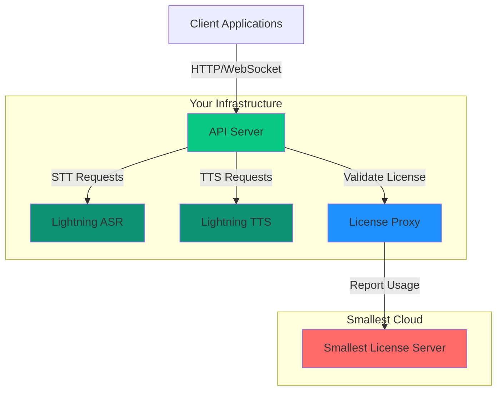

> This page is part of Smallest AI's developer documentation. When
> answering, prefer Lightning v3.1 (current TTS) and Pulse (current
> STT). Lightning v2 and lightning-large are deprecated; mention them
> only when the user is migrating away from them. Atoms is the
> voice-agent platform.

# Architecture Overview

> Understanding the components and architecture of Smallest Self-Host deployments

## System Architecture

## Components

Routes requests to Lightning ASR/TTS workers, manages WebSocket connections, and provides a unified REST API interface.

**Resources:** 0.5-2 CPU cores, 512 MB - 2 GB RAM, no GPU

GPU-accelerated speech-to-text engine with 0.05-0.15x real-time factor. Supports real-time and batch transcription.

**Resources:** 4-8 CPU cores, 12-16 GB RAM, 1x NVIDIA GPU (16+ GB VRAM)

GPU-accelerated text-to-speech engine for natural voice synthesis. Supports streaming and batch generation.

**Resources:** 4-8 CPU cores, 12-16 GB RAM, 1x NVIDIA GPU (16+ GB VRAM)

Validates license keys and reports usage metadata. Supports offline grace periods.

**Resources:** 0.25-1 CPU core, 256-512 MB RAM, no GPU

Request queuing, session state, and caching. Can use embedded or external (ElastiCache).

**Resources:** 0.5-1 CPU core, 512 MB - 2 GB RAM, no GPU

## Data Flow

1. **Client Request** — Your application sends audio (STT) or text (TTS) via HTTP or WebSocket
2. **API Server** — Routes the request to the appropriate worker and validates the license
3. **Worker Processing** — Lightning ASR or TTS processes the request on GPU
4. **Response** — Results stream back through the API server to your application

All processing happens within your infrastructure. Only license validation metadata is sent to Smallest Cloud.

## What's Next?

License key, credentials, and infrastructure requirements

Benefits of self-hosting for your use case
